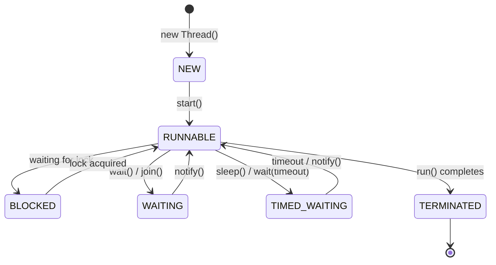
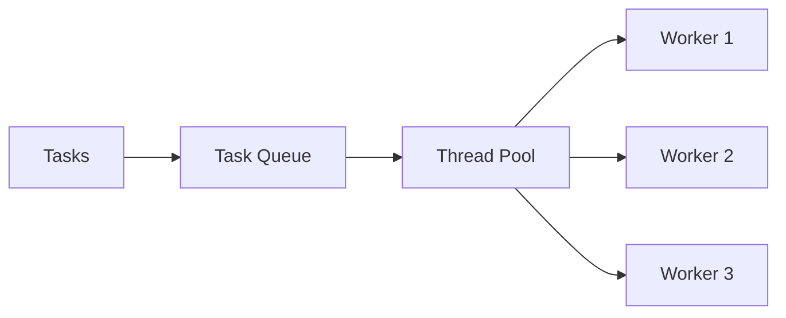

[🏠 Home](../../README.md) | [⬅️ Collections Internals](./06-collections-internals.md) | [➡️ Concurrency Advanced](./08-concurrency-advanced.md)

# 🧵 Multithreading Basics

> Running code in parallel

---

## 🧠 Memory Hook

> **"NRBWT"** = New, Runnable, Blocked, Waiting, Terminated (Thread states)
> 
> **"RCE"** = Runnable, Callable, ExecutorService (ways to create tasks)

---

## 📊 Thread Lifecycle



| State | Meaning |
|-------|---------|
| NEW | Thread created, not started |
| RUNNABLE | Running or ready to run |
| BLOCKED | Waiting for monitor lock |
| WAITING | Waiting indefinitely |
| TIMED_WAITING | Waiting with timeout |
| TERMINATED | Completed execution |

---

## 🔧 Creating Threads

### 1. Extend Thread
```java
class MyThread extends Thread {
    @Override
    public void run() {
        System.out.println("Running: " + getName());
    }
}

MyThread t = new MyThread();
t.start();  // Not run()!
```

### 2. Implement Runnable (Preferred)
```java
Runnable task = () -> System.out.println("Running: " + Thread.currentThread().getName());
Thread t = new Thread(task);
t.start();
```

### 3. Implement Callable (Returns Value)
```java
Callable<Integer> task = () -> {
    return 42;
};

ExecutorService executor = Executors.newSingleThreadExecutor();
Future<Integer> future = executor.submit(task);
Integer result = future.get();  // Blocks until complete
executor.shutdown();
```

---

## 🏊 Thread Pools (ExecutorService) ⭐



### Pool Types

| Factory Method | Pool Type | Use Case |
|----------------|-----------|----------|
| `newFixedThreadPool(n)` | Fixed size | Known workload |
| `newCachedThreadPool()` | Unbounded, reuses | Many short tasks |
| `newSingleThreadExecutor()` | 1 thread | Sequential tasks |
| `newScheduledThreadPool(n)` | Scheduled | Periodic tasks |

### Usage
```java
ExecutorService pool = Executors.newFixedThreadPool(4);

// Submit tasks
Future<String> future = pool.submit(() -> "Done");
pool.execute(() -> System.out.println("Fire and forget"));

// Shutdown properly
pool.shutdown();                      // Graceful
pool.awaitTermination(10, TimeUnit.SECONDS);
// or
pool.shutdownNow();                   // Immediate
```

### Custom ThreadPoolExecutor
```java
ThreadPoolExecutor executor = new ThreadPoolExecutor(
    2,                      // corePoolSize
    4,                      // maxPoolSize
    60, TimeUnit.SECONDS,   // keepAliveTime
    new ArrayBlockingQueue<>(100),  // workQueue
    new ThreadPoolExecutor.CallerRunsPolicy()  // rejectedHandler
);
```

---

## 🔄 Thread Communication

### wait() / notify()
```java
class SharedResource {
    private boolean ready = false;
    
    public synchronized void produce() {
        ready = true;
        notify();  // Wake up one waiting thread
    }
    
    public synchronized void consume() throws InterruptedException {
        while (!ready) {
            wait();  // Release lock and wait
        }
        // Process
    }
}
```

### join()
```java
Thread t = new Thread(() -> { /* work */ });
t.start();
t.join();  // Wait for t to finish
System.out.println("t completed");
```

---

## ⚠️ Common Issues

### 1. Race Condition
```java
// WRONG: Not thread-safe
private int count = 0;
void increment() { count++; }  // Read-Modify-Write

// FIX: synchronize
synchronized void increment() { count++; }
```

### 2. Deadlock
```java
// Thread 1: lock A, then lock B
// Thread 2: lock B, then lock A
// → Deadlock!

// Prevention: Always acquire locks in same order
```

### 3. Calling run() instead of start()
```java
thread.run();    // WRONG: runs in current thread
thread.start();  // RIGHT: creates new thread
```

---

## 💡 Interview Flash Cards

| Question | Answer |
|----------|--------|
| start() vs run()? | start() creates new thread, run() uses current |
| Runnable vs Callable? | Runnable = void, Callable = returns value + throws |
| What is Future? | Represents async result, get() blocks |
| Why use thread pool? | Reuse threads, control concurrency, queue tasks |
| wait() vs sleep()? | wait() releases lock, sleep() doesn't |
| How to stop a thread? | Use volatile flag + interrupt(), not stop() |

---

## 💻 Best Practices

1. ✅ Use `ExecutorService` over raw `Thread`
2. ✅ Always `shutdown()` executors
3. ✅ Handle `InterruptedException` properly
4. ✅ Use thread-safe collections (`ConcurrentHashMap`)
5. ❌ Don't use `Thread.stop()` (deprecated, unsafe)

---

*Next: [Concurrency Advanced →](./08-concurrency-advanced.md)*
