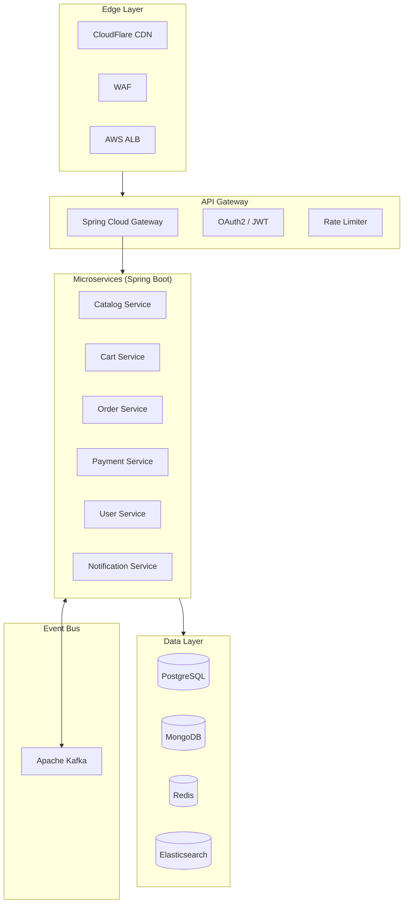
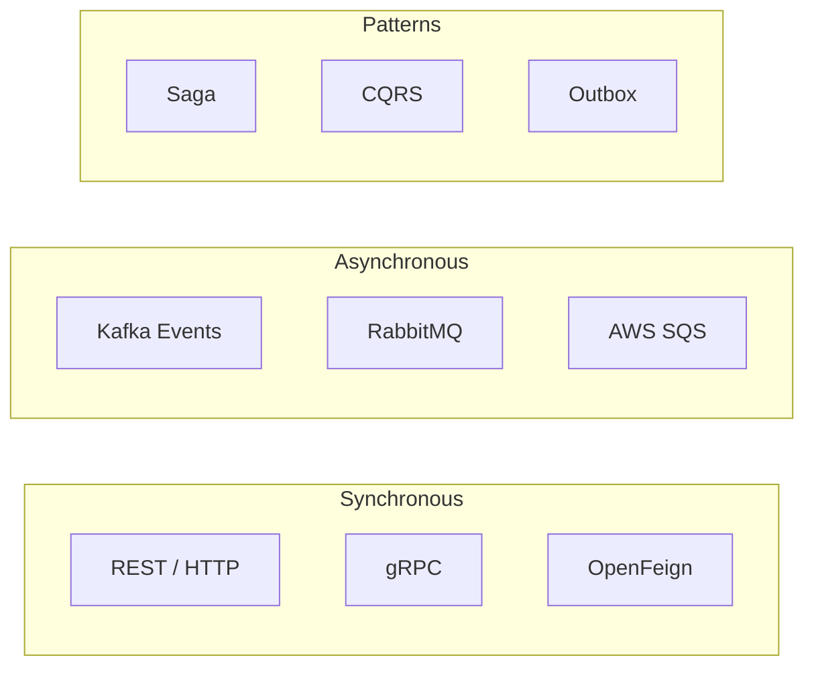

[🏠 Home](../../README.md) | [⬅️ DSA Cheatsheet](./DSA-CHEATSHEET.md)

# 🌿 Spring Interview Mastery Guide (2026)

> System Design, Microservices, Performance & Common Q&A

---

## 📋 Table of Contents

1. [System Design with Spring](#-system-design-with-spring)
2. [Microservices Architecture](#-microservices-architecture)
3. [Performance Optimization](#-performance-optimization)
4. [Common Interview Q&A](#-common-interview-qa)
5. [Scenario-Based Questions](#-scenario-based-questions)
6. [Code Review Questions](#-code-review-questions)
7. [Quick Reference Cards](#-quick-reference-cards)

---

## 🏗️ System Design with Spring

### E-Commerce Platform Architecture



### Key Design Decisions

| Decision | Spring Solution | Rationale |
|----------|-----------------|-----------|
| API Gateway | Spring Cloud Gateway | Reactive, filters, rate limiting |
| Service Discovery | Kubernetes DNS / Eureka | Native K8s or self-managed |
| Configuration | Spring Cloud Config | Centralized, Git-backed, encrypted |
| Authentication | Spring Security OAuth2 | JWT tokens, Resource Server |
| Caching | Spring Cache + Redis | @Cacheable, distributed |
| Messaging | Spring Kafka | Event-driven, decoupling |
| Database | Spring Data JPA/R2DBC | Repository abstraction |
| Observability | Micrometer + Zipkin | Metrics, traces, structured logs |

### Sample Service Template

```java
// Standard microservice structure
@SpringBootApplication
@EnableConfigurationProperties(AppProperties.class)
public class OrderServiceApplication {
    public static void main(String[] args) {
        SpringApplication.run(OrderServiceApplication.class, args);
    }
}

// Configuration
@ConfigurationProperties(prefix = "app")
public record AppProperties(
    String serviceName,
    PaymentConfig payment,
    CacheConfig cache
) {}

// REST Controller
@RestController
@RequestMapping("/api/v1/orders")
@Tag(name = "Orders", description = "Order management")
public class OrderController {

    private final OrderService orderService;

    @PostMapping
    @ResponseStatus(HttpStatus.CREATED)
    @Operation(summary = "Create new order")
    public OrderResponse createOrder(@Valid @RequestBody CreateOrderRequest request) {
        return orderService.create(request);
    }

    @GetMapping("/{id}")
    public OrderResponse getOrder(@PathVariable UUID id) {
        return orderService.findById(id)
            .orElseThrow(() -> new OrderNotFoundException(id));
    }
}

// Service with transaction
@Service
@Transactional(readOnly = true)
public class OrderService {

    private final OrderRepository orderRepository;
    private final PaymentClient paymentClient;
    private final KafkaTemplate<String, OrderEvent> kafkaTemplate;

    @Transactional
    public OrderResponse create(CreateOrderRequest request) {
        // 1. Validate
        validateOrder(request);

        // 2. Create order
        Order order = Order.from(request);
        order = orderRepository.save(order);

        // 3. Process payment
        paymentClient.processPayment(order.getId(), order.getTotal());

        // 4. Publish event
        kafkaTemplate.send("orders", new OrderCreatedEvent(order));

        return OrderResponse.from(order);
    }
}
```

---

## 🔧 Microservices Architecture

### Service Communication Patterns



### OpenFeign Client

```java
@FeignClient(
    name = "payment-service",
    url = "${services.payment.url}",
    fallbackFactory = PaymentClientFallbackFactory.class
)
public interface PaymentClient {

    @PostMapping("/api/payments")
    PaymentResponse processPayment(@RequestBody PaymentRequest request);

    @GetMapping("/api/payments/{id}")
    PaymentResponse getPayment(@PathVariable String id);
}

@Component
public class PaymentClientFallbackFactory implements FallbackFactory<PaymentClient> {

    @Override
    public PaymentClient create(Throwable cause) {
        return new PaymentClient() {
            @Override
            public PaymentResponse processPayment(PaymentRequest request) {
                log.error("Payment service unavailable", cause);
                throw new PaymentServiceException("Payment service unavailable");
            }
        };
    }
}
```

### Saga Pattern (Choreography)

```java
// Order Service - Initiates saga
@Service
public class OrderSagaOrchestrator {

    @Transactional
    public Order startOrderSaga(CreateOrderRequest request) {
        Order order = createOrder(request);
        order.setStatus(OrderStatus.PENDING);
        orderRepository.save(order);

        // Publish event to start saga
        eventPublisher.publish(new OrderCreatedEvent(order));
        return order;
    }

    @KafkaListener(topics = "payment-completed")
    public void onPaymentCompleted(PaymentCompletedEvent event) {
        Order order = orderRepository.findById(event.orderId()).orElseThrow();
        order.setStatus(OrderStatus.PAID);
        orderRepository.save(order);

        eventPublisher.publish(new OrderPaidEvent(order));
    }

    @KafkaListener(topics = "payment-failed")
    public void onPaymentFailed(PaymentFailedEvent event) {
        // Compensating transaction
        Order order = orderRepository.findById(event.orderId()).orElseThrow();
        order.setStatus(OrderStatus.CANCELLED);
        orderRepository.save(order);

        // Rollback inventory
        eventPublisher.publish(new OrderCancelledEvent(order, "Payment failed"));
    }
}
```

### Transactional Outbox Pattern

```java
@Entity
@Table(name = "outbox_events")
public class OutboxEvent {
    @Id
    private UUID id;
    private String aggregateType;
    private String aggregateId;
    private String eventType;
    private String payload;
    private Instant createdAt;
    private boolean published;
}

@Service
public class OrderService {

    @Transactional
    public Order createOrder(CreateOrderRequest request) {
        // 1. Create order
        Order order = orderRepository.save(Order.from(request));

        // 2. Write to outbox (same transaction)
        OutboxEvent event = OutboxEvent.builder()
            .id(UUID.randomUUID())
            .aggregateType("Order")
            .aggregateId(order.getId().toString())
            .eventType("OrderCreated")
            .payload(toJson(new OrderCreatedEvent(order)))
            .createdAt(Instant.now())
            .published(false)
            .build();
        outboxRepository.save(event);

        return order;
    }
}

// Separate publisher (polls outbox)
@Scheduled(fixedDelay = 100)
public void publishOutboxEvents() {
    List<OutboxEvent> events = outboxRepository.findUnpublished(100);
    for (OutboxEvent event : events) {
        try {
            kafkaTemplate.send(event.getEventType(), event.getPayload());
            event.setPublished(true);
            outboxRepository.save(event);
        } catch (Exception e) {
            log.error("Failed to publish event: {}", event.getId(), e);
        }
    }
}
```

### Circuit Breaker with Resilience4j

```java
@Configuration
public class ResilienceConfig {

    @Bean
    public CircuitBreakerRegistry circuitBreakerRegistry() {
        return CircuitBreakerRegistry.of(CircuitBreakerConfig.custom()
            .slidingWindowType(SlidingWindowType.COUNT_BASED)
            .slidingWindowSize(10)
            .failureRateThreshold(50)
            .waitDurationInOpenState(Duration.ofSeconds(30))
            .permittedNumberOfCallsInHalfOpenState(3)
            .build());
    }
}

@Service
public class PaymentService {

    @CircuitBreaker(name = "payment", fallbackMethod = "paymentFallback")
    @Retry(name = "payment", fallbackMethod = "paymentFallback")
    @RateLimiter(name = "payment")
    public PaymentResponse processPayment(PaymentRequest request) {
        return paymentClient.process(request);
    }

    private PaymentResponse paymentFallback(PaymentRequest request, Exception e) {
        log.warn("Payment circuit open, using fallback", e);
        return PaymentResponse.pending(request.getOrderId());
    }
}
```

---

## ⚡ Performance Optimization

### Database Optimization

```java
// 1. N+1 Problem Solution
public interface OrderRepository extends JpaRepository<Order, Long> {

    // ❌ Causes N+1
    List<Order> findByCustomerId(Long customerId);

    // ✅ JOIN FETCH
    @Query("SELECT o FROM Order o JOIN FETCH o.items WHERE o.customerId = :customerId")
    List<Order> findByCustomerIdWithItems(@Param("customerId") Long customerId);

    // ✅ Entity Graph
    @EntityGraph(attributePaths = {"items", "customer"})
    List<Order> findWithDetailsByCustomerId(Long customerId);
}

// 2. Batch Processing
@Transactional
public void processBulkUpdate(List<UpdateRequest> requests) {
    // Enable batch inserts
    // spring.jpa.properties.hibernate.jdbc.batch_size=50
    
    List<Entity> entities = requests.stream()
        .map(this::toEntity)
        .toList();
    
    // Batch save
    repository.saveAll(entities);
    entityManager.flush();
    entityManager.clear();  // Prevent memory issues
}

// 3. Projections (DTO)
public interface OrderSummary {
    Long getId();
    String getStatus();
    BigDecimal getTotal();
}

@Query("SELECT o.id as id, o.status as status, o.total as total FROM Order o")
List<OrderSummary> findAllSummaries();
```

### Caching Strategy

```java
@Configuration
@EnableCaching
public class CacheConfig {

    @Bean
    public CacheManager cacheManager(RedisConnectionFactory factory) {
        RedisCacheConfiguration config = RedisCacheConfiguration.defaultCacheConfig()
            .entryTtl(Duration.ofMinutes(10))
            .serializeKeysWith(SerializationPair.fromSerializer(new StringRedisSerializer()))
            .serializeValuesWith(SerializationPair.fromSerializer(
                new GenericJackson2JsonRedisSerializer()));

        return RedisCacheManager.builder(factory)
            .cacheDefaults(config)
            .withCacheConfiguration("products", 
                config.entryTtl(Duration.ofHours(1)))
            .withCacheConfiguration("user-sessions",
                config.entryTtl(Duration.ofMinutes(30)))
            .build();
    }
}

@Service
public class ProductService {

    @Cacheable(value = "products", key = "#id")
    public Product getProduct(Long id) {
        return productRepository.findById(id).orElseThrow();
    }

    @CachePut(value = "products", key = "#product.id")
    public Product updateProduct(Product product) {
        return productRepository.save(product);
    }

    @CacheEvict(value = "products", key = "#id")
    public void deleteProduct(Long id) {
        productRepository.deleteById(id);
    }

    @CacheEvict(value = "products", allEntries = true)
    public void refreshCache() {
        log.info("Product cache cleared");
    }
}
```

### Connection Pool Optimization

```yaml
spring:
  datasource:
    hikari:
      maximum-pool-size: 20        # Max connections
      minimum-idle: 5              # Min idle connections
      idle-timeout: 300000         # 5 minutes
      connection-timeout: 20000    # 20 seconds
      max-lifetime: 1200000        # 20 minutes
      pool-name: OrderServicePool
      
      # Performance tuning
      auto-commit: false           # Let Spring manage
      validation-timeout: 5000
      leak-detection-threshold: 60000  # Detect leaks
```

### Virtual Threads (Spring Boot 3.2+)

```yaml
spring:
  threads:
    virtual:
      enabled: true  # All request handling uses virtual threads
```

```java
// For explicit virtual thread usage
@Bean
public TaskExecutor virtualThreadExecutor() {
    return new TaskExecutorAdapter(Executors.newVirtualThreadPerTaskExecutor());
}

@Async("virtualThreadExecutor")
public CompletableFuture<Result> processAsync(Request request) {
    // Runs on virtual thread
    return CompletableFuture.completedFuture(process(request));
}
```

---

## 🎯 Common Interview Q&A

### Spring Core

---

**Q: Explain IoC and Dependency Injection**

**A:** 
- **IoC (Inversion of Control)**: Framework controls object creation, not developer
- **DI (Dependency Injection)**: Objects receive dependencies rather than creating them
- **Types**: Constructor (preferred), Setter, Field injection
- **Benefits**: Loose coupling, testability, flexibility

```java
// Constructor injection (recommended)
@Service
public class OrderService {
    private final OrderRepository repository;
    private final PaymentClient paymentClient;

    public OrderService(OrderRepository repository, PaymentClient paymentClient) {
        this.repository = repository;
        this.paymentClient = paymentClient;
    }
}
```

---

**Q: What is the difference between @Component, @Service, @Repository, @Controller?**

| Annotation | Purpose | Special Behavior |
|------------|---------|------------------|
| `@Component` | Generic bean | Base stereotype |
| `@Service` | Business logic | Semantic only (no special behavior) |
| `@Repository` | Data access | Exception translation |
| `@Controller` | MVC controller | View resolution |
| `@RestController` | REST API | @Controller + @ResponseBody |

---

**Q: Explain Bean Scopes**

| Scope | Description | Use Case |
|-------|-------------|----------|
| `singleton` | One instance per container (default) | Stateless services |
| `prototype` | New instance each time | Stateful objects |
| `request` | One per HTTP request | Request-scoped data |
| `session` | One per HTTP session | User session data |
| `application` | One per ServletContext | Shared app data |

---

**Q: What is @Transactional and how does it work?**

**A:**
- Creates proxy around methods
- Manages transaction lifecycle (begin, commit, rollback)
- Uses AOP (Aspect-Oriented Programming)

```java
@Transactional(
    readOnly = false,                    // Enable write
    propagation = Propagation.REQUIRED,  // Default: join or create
    isolation = Isolation.READ_COMMITTED,// Isolation level
    timeout = 30,                        // Seconds
    rollbackFor = Exception.class        // Rollback on checked exceptions
)
public void transferMoney(Long from, Long to, BigDecimal amount) {
    accountRepo.debit(from, amount);
    accountRepo.credit(to, amount);
}
```

**Propagation Types:**
| Type | Behavior |
|------|----------|
| `REQUIRED` | Join or create (default) |
| `REQUIRES_NEW` | Suspend current, create new |
| `MANDATORY` | Must have existing |
| `SUPPORTS` | Use if exists |
| `NOT_SUPPORTED` | Suspend current |
| `NEVER` | Error if exists |

---

### Spring Boot

---

**Q: What is Spring Boot Auto-Configuration?**

**A:**
- Automatically configures beans based on classpath
- Enabled by `@EnableAutoConfiguration` (part of `@SpringBootApplication`)
- Use `@ConditionalOnClass`, `@ConditionalOnProperty`, etc.
- Can be excluded: `@SpringBootApplication(exclude = {DataSourceAutoConfiguration.class})`

---

**Q: Explain Spring Boot Actuator**

```yaml
management:
  endpoints:
    web:
      exposure:
        include: health,info,metrics,prometheus
  endpoint:
    health:
      show-details: when_authorized
```

**Key Endpoints:**
| Endpoint | Purpose |
|----------|---------|
| `/actuator/health` | Application health |
| `/actuator/info` | App information |
| `/actuator/metrics` | Performance metrics |
| `/actuator/env` | Environment properties |
| `/actuator/beans` | All beans |
| `/actuator/mappings` | URL mappings |

---

**Q: How to externalize configuration?**

**Priority (highest to lowest):**
1. Command line arguments
2. SPRING_APPLICATION_JSON
3. OS environment variables
4. application-{profile}.yml
5. application.yml
6. @PropertySource

```java
// Type-safe configuration
@ConfigurationProperties(prefix = "app.payment")
public record PaymentProperties(
    String gatewayUrl,
    int timeoutSeconds,
    RetryConfig retry
) {}

@EnableConfigurationProperties(PaymentProperties.class)
@Configuration
public class AppConfig {}
```

---

### Spring Security

---

**Q: Explain OAuth 2.0 Grant Types**

| Grant Type | Use Case | Flow |
|------------|----------|------|
| Authorization Code | Web apps | User → Auth Server → Code → Token |
| Client Credentials | Machine-to-machine | Client → Token |
| Refresh Token | Token renewal | Refresh Token → New Access Token |
| PKCE | Mobile/SPA | Auth Code + challenge |

---

**Q: JWT vs Session-based Authentication**

| Aspect | JWT | Session |
|--------|-----|---------|
| Storage | Client (token) | Server (session store) |
| Scalability | Stateless, scalable | Requires sticky sessions or shared store |
| Revocation | Difficult | Easy (delete session) |
| Size | Larger (payload) | Smaller (session ID) |
| Best For | APIs, microservices | Traditional web apps |

---

### Spring Data

---

**Q: What is the N+1 Problem?**

**Problem:**
```java
List<Order> orders = orderRepo.findAll();  // 1 query
for (Order order : orders) {
    order.getItems();  // N queries (lazy loading)
}
```

**Solutions:**
```java
// 1. JOIN FETCH
@Query("SELECT o FROM Order o JOIN FETCH o.items")
List<Order> findAllWithItems();

// 2. Entity Graph
@EntityGraph(attributePaths = "items")
List<Order> findAll();

// 3. DTO Projection (best for read-only)
@Query("SELECT new OrderDTO(o.id, o.status) FROM Order o")
```

---

**Q: Optimistic vs Pessimistic Locking**

```java
// Optimistic Locking
@Entity
public class Product {
    @Id
    private Long id;
    
    @Version
    private Long version;  // Auto-incremented on update
}

// Pessimistic Locking
@Lock(LockModeType.PESSIMISTIC_WRITE)
@Query("SELECT p FROM Product p WHERE p.id = :id")
Product findByIdForUpdate(Long id);
```

| Type | Mechanism | Use Case |
|------|-----------|----------|
| Optimistic | Version column, retry on conflict | Low contention |
| Pessimistic | Database locks | High contention, critical data |

---

## 🎭 Scenario-Based Questions

---

**Q: Design a rate limiter for an API**

```java
@Configuration
public class RateLimitConfig {

    @Bean
    public RedisRateLimiter redisRateLimiter() {
        return new RedisRateLimiter(10, 20);  // 10 req/sec, burst 20
    }
}

// Gateway route
spring:
  cloud:
    gateway:
      routes:
        - id: api-service
          uri: lb://api-service
          predicates:
            - Path=/api/**
          filters:
            - name: RequestRateLimiter
              args:
                key-resolver: "#{@userKeyResolver}"
                redis-rate-limiter.replenishRate: 10
                redis-rate-limiter.burstCapacity: 20

@Bean
public KeyResolver userKeyResolver() {
    return exchange -> Mono.just(
        exchange.getRequest().getHeaders().getFirst("X-User-ID"));
}
```

---

**Q: How would you handle distributed transactions?**

**Answer:**
1. **Saga Pattern** - Choreography or Orchestration
2. **Outbox Pattern** - At-least-once delivery
3. **Two-Phase Commit** - Avoid (blocking, complex)

```java
// Saga Orchestrator approach
public void processOrder(OrderRequest request) {
    try {
        // Step 1: Reserve inventory
        inventoryService.reserve(request.getItems());
        
        // Step 2: Process payment
        paymentService.charge(request.getPayment());
        
        // Step 3: Create order
        orderService.create(request);
        
    } catch (InventoryException e) {
        // No compensation needed
        throw e;
    } catch (PaymentException e) {
        // Compensate: release inventory
        inventoryService.release(request.getItems());
        throw e;
    } catch (OrderException e) {
        // Compensate: refund and release
        paymentService.refund(request.getPayment());
        inventoryService.release(request.getItems());
        throw e;
    }
}
```

---

**Q: How to handle idempotency in REST APIs?**

```java
@RestController
public class PaymentController {

    @PostMapping("/payments")
    public ResponseEntity<Payment> createPayment(
            @RequestHeader("Idempotency-Key") String idempotencyKey,
            @RequestBody PaymentRequest request) {
        
        // Check if already processed
        Optional<Payment> existing = paymentRepository
            .findByIdempotencyKey(idempotencyKey);
        
        if (existing.isPresent()) {
            return ResponseEntity.ok(existing.get());  // Return cached result
        }
        
        // Process new payment
        Payment payment = paymentService.process(request);
        payment.setIdempotencyKey(idempotencyKey);
        paymentRepository.save(payment);
        
        return ResponseEntity.status(HttpStatus.CREATED).body(payment);
    }
}
```

---

## 🔍 Code Review Questions

**Q: What's wrong with this code?**

```java
@RestController
public class UserController {
    
    @Autowired
    private UserService userService;  // ❌ Field injection
    
    @GetMapping("/users/{id}")
    public User getUser(@PathVariable String id) {
        return userService.findById(Long.parseLong(id));  // ❌ No validation
    }
    
    @PostMapping("/users")
    @Transactional  // ❌ Transaction in controller
    public User createUser(@RequestBody User user) {
        return userService.save(user);  // ❌ No validation
    }
}
```

**Correct Version:**

```java
@RestController
@RequestMapping("/api/v1/users")
public class UserController {
    
    private final UserService userService;  // ✅ Constructor injection
    
    public UserController(UserService userService) {
        this.userService = userService;
    }
    
    @GetMapping("/{id}")
    public ResponseEntity<UserResponse> getUser(@PathVariable Long id) {  // ✅ Type-safe
        return userService.findById(id)
            .map(ResponseEntity::ok)
            .orElse(ResponseEntity.notFound().build());  // ✅ Proper 404
    }
    
    @PostMapping
    @ResponseStatus(HttpStatus.CREATED)
    public UserResponse createUser(@Valid @RequestBody CreateUserRequest request) {  // ✅ Validation
        return userService.create(request);  // ✅ Transaction in service
    }
}
```

---

## 📇 Quick Reference Cards

### HTTP Status Codes

| Code | Meaning | When to Use |
|------|---------|-------------|
| 200 | OK | Successful GET/PUT |
| 201 | Created | Successful POST |
| 204 | No Content | Successful DELETE |
| 400 | Bad Request | Validation error |
| 401 | Unauthorized | Missing/invalid token |
| 403 | Forbidden | Insufficient permissions |
| 404 | Not Found | Resource doesn't exist |
| 409 | Conflict | Duplicate/state conflict |
| 429 | Too Many Requests | Rate limited |
| 500 | Internal Server Error | Unexpected error |

### Key Annotations Reference

| Annotation | Purpose |
|------------|---------|
| `@SpringBootApplication` | Main class marker |
| `@RestController` | REST endpoints |
| `@Service` | Business logic |
| `@Repository` | Data access |
| `@Transactional` | Transaction management |
| `@Cacheable` | Method caching |
| `@Async` | Async execution |
| `@Scheduled` | Scheduled tasks |
| `@ConfigurationProperties` | Type-safe config |
| `@ConditionalOnProperty` | Conditional beans |

### Spring Boot Properties

```yaml
# Server
server.port: 8080
server.servlet.context-path: /api

# Database
spring.datasource.url: jdbc:postgresql://localhost:5432/db
spring.jpa.hibernate.ddl-auto: validate
spring.jpa.show-sql: false

# Actuator
management.endpoints.web.exposure.include: health,info,metrics

# Logging
logging.level.root: INFO
logging.level.com.example: DEBUG

# Virtual Threads (3.2+)
spring.threads.virtual.enabled: true
```

---

*Good luck with your Spring interviews! 🍀*
