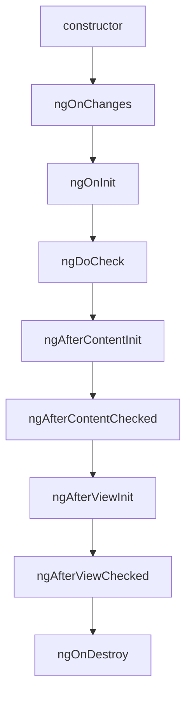

# Angular Complete Guide

A comprehensive guide to Angular with TypeScript, components, services, and modern patterns.

---

## 🗺️ Learning Roadmap

```mermaid
flowchart LR
    subgraph Basics["1. Basics"]
        TS[TypeScript]
        COMP[Components]
        TEMPLATE[Templates]
    end
    
    subgraph Data["2. Data Flow"]
        BINDING[Data Binding]
        DIRECTIVES[Directives]
        PIPES[Pipes]
    end
    
    subgraph Services["3. Services"]
        DI[Dependency Injection]
        HTTP[HttpClient]
        RxJS[RxJS Observables]
    end
    
    subgraph Advanced["4. Advanced"]
        ROUTING[Routing]
        FORMS[Forms]
        GUARDS[Guards]
    end
    
    Basics --> Data --> Services --> Advanced
```



---

## 1️⃣ TypeScript Essentials

Angular is built with TypeScript. Here's what you need to know:

### Type Annotations

```typescript
// Basic types
let name: string = 'John';
let age: number = 30;
let isActive: boolean = true;
let items: string[] = ['a', 'b', 'c'];

// Object type
interface User {
    id: number;
    name: string;
    email?: string;  // Optional
    readonly createdAt: Date;  // Read-only
}

// Function types
function greet(name: string): string {
    return `Hello, ${name}!`;
}

const add = (a: number, b: number): number => a + b;

// Union types
let value: string | number = 'hello';
value = 42;  // OK

// Generics
function identity<T>(arg: T): T {
    return arg;
}
```

### Classes & Decorators

```typescript
// Class with decorators (Angular uses these heavily)
class Person {
    constructor(
        public name: string,
        private age: number
    ) {}
    
    greet(): string {
        return `Hi, I'm ${this.name}`;
    }
}

// Decorators (Angular components are decorated classes)
function Log(target: any) {
    console.log('Class decorated:', target);
}

@Log
class MyClass {}
```

---

## 2️⃣ Angular Components

Components are the building blocks of Angular apps.

### Creating a Component

```typescript
// user.component.ts
import { Component, Input, Output, EventEmitter } from '@angular/core';

@Component({
    selector: 'app-user',
    templateUrl: './user.component.html',
    styleUrls: ['./user.component.css']
})
export class UserComponent {
    // Input - receive data from parent
    @Input() user: User;
    @Input() isEditable: boolean = false;
    
    // Output - emit events to parent
    @Output() delete = new EventEmitter<number>();
    @Output() save = new EventEmitter<User>();
    
    // Component state
    isEditing = false;
    
    // Lifecycle hooks
    ngOnInit() {
        console.log('Component initialized');
    }
    
    ngOnChanges(changes: SimpleChanges) {
        console.log('Inputs changed:', changes);
    }
    
    ngOnDestroy() {
        console.log('Component destroyed');
    }
    
    // Methods
    onDelete() {
        this.delete.emit(this.user.id);
    }
    
    onSave() {
        this.save.emit(this.user);
    }
}
```

### Component Template

```html
<!-- user.component.html -->
<div class="user-card">
    
    <h3>{{ user.name }}</h3>
    <p>{{ user.email }}</p>
    
    <!-- Conditional rendering -->
    <span *ngIf="user.isAdmin" class="badge">Admin</span>
    
    <!-- Event binding -->
    <button (click)="onDelete()">Delete</button>
    <button (click)="onSave()">Save</button>
</div>
```

### Lifecycle Hooks



| Hook | When | Use Case |
| :--- | :--- | :--- |
| `ngOnChanges` | Input changes | React to input changes |
| `ngOnInit` | After first change detection | Initialize data, API calls |
| `ngDoCheck` | Every change detection | Custom change detection |
| `ngAfterViewInit` | After view initialized | Access ViewChild |
| `ngOnDestroy` | Before destruction | Cleanup subscriptions |

---

## 3️⃣ Data Binding

### Four Types of Binding

```html
<!-- 1. Interpolation (one-way: component → view) -->
<h1>{{ title }}</h1>
<p>{{ user.name | uppercase }}</p>
<span>{{ 1 + 1 }}</span>

<!-- 2. Property Binding (one-way: component → view) -->

<button [disabled]="isSubmitting">Submit</button>
<div [class.active]="isActive">Item</div>
<div [style.color]="textColor">Styled</div>

<!-- 3. Event Binding (one-way: view → component) -->
<button (click)="onSubmit()">Submit</button>
<input (input)="onInput($event)">
<input (keyup.enter)="onEnter()">

<!-- 4. Two-Way Binding (both directions) -->
<input [(ngModel)]="username">
<!-- Equivalent to: -->
<input [ngModel]="username" (ngModelChange)="username = $event">
```

---

## 4️⃣ Directives

### Structural Directives (alter DOM structure)

```html
<!-- *ngIf - conditional rendering -->
<div *ngIf="isLoggedIn">Welcome back!</div>
<div *ngIf="isLoggedIn; else loginTemplate">
    Welcome, {{ username }}
</div>
<ng-template #loginTemplate>
    <button (click)="login()">Log in</button>
</ng-template>

<!-- *ngFor - list rendering -->
<ul>
    <li *ngFor="let item of items; let i = index; let odd = odd; trackBy: trackById">
        {{ i + 1 }}. {{ item.name }}
    </li>
</ul>

<!-- *ngSwitch -->
<div [ngSwitch]="status">
    <p *ngSwitchCase="'active'">Active</p>
    <p *ngSwitchCase="'inactive'">Inactive</p>
    <p *ngSwitchDefault>Unknown</p>
</div>
```

### Attribute Directives (alter appearance/behavior)

```html
<!-- ngClass - dynamic classes -->
<div [ngClass]="{ 'active': isActive, 'disabled': isDisabled }">Item</div>
<div [ngClass]="['class1', 'class2']">Item</div>

<!-- ngStyle - dynamic styles -->
<div [ngStyle]="{ 'color': textColor, 'font-size': fontSize + 'px' }">
    Styled text
</div>
```

### Custom Directive

```typescript
// highlight.directive.ts
import { Directive, ElementRef, HostListener, Input } from '@angular/core';

@Directive({
    selector: '[appHighlight]'
})
export class HighlightDirective {
    @Input() appHighlight = 'yellow';
    
    constructor(private el: ElementRef) {}
    
    @HostListener('mouseenter')
    onMouseEnter() {
        this.el.nativeElement.style.backgroundColor = this.appHighlight;
    }
    
    @HostListener('mouseleave')
    onMouseLeave() {
        this.el.nativeElement.style.backgroundColor = '';
    }
}

// Usage
// <p appHighlight="lightblue">Hover me!</p>
```

---

## 5️⃣ Pipes

Transform data in templates.

### Built-in Pipes

```html
<!-- String pipes -->
{{ name | uppercase }}
{{ name | lowercase }}
{{ name | titlecase }}

<!-- Date pipe -->
{{ today | date }}
{{ today | date:'short' }}
{{ today | date:'yyyy-MM-dd' }}

<!-- Number pipes -->
{{ price | currency }}
{{ price | currency:'EUR':'symbol':'1.2-2' }}
{{ value | number:'1.0-2' }}
{{ ratio | percent }}

<!-- JSON pipe (debugging) -->
<pre>{{ user | json }}</pre>

<!-- Async pipe (unwraps Observables/Promises) -->
{{ user$ | async }}
<div *ngIf="data$ | async as data">
    {{ data.name }}
</div>
```

### Custom Pipe

```typescript
// truncate.pipe.ts
import { Pipe, PipeTransform } from '@angular/core';

@Pipe({
    name: 'truncate'
})
export class TruncatePipe implements PipeTransform {
    transform(value: string, limit: number = 50, trail: string = '...'): string {
        if (!value) return '';
        if (value.length <= limit) return value;
        return value.substring(0, limit) + trail;
    }
}

// Usage
// {{ longText | truncate:100:'...' }}
```

---

## 6️⃣ Services & Dependency Injection

### Creating a Service

```typescript
// user.service.ts
import { Injectable } from '@angular/core';
import { HttpClient } from '@angular/common/http';
import { Observable, BehaviorSubject } from 'rxjs';
import { map, catchError } from 'rxjs/operators';

@Injectable({
    providedIn: 'root'  // Singleton, available everywhere
})
export class UserService {
    private apiUrl = '/api/users';
    
    // Shared state
    private currentUser$ = new BehaviorSubject<User | null>(null);
    
    constructor(private http: HttpClient) {}
    
    getUsers(): Observable<User[]> {
        return this.http.get<User[]>(this.apiUrl);
    }
    
    getUser(id: number): Observable<User> {
        return this.http.get<User>(`${this.apiUrl}/${id}`);
    }
    
    createUser(user: Partial<User>): Observable<User> {
        return this.http.post<User>(this.apiUrl, user);
    }
    
    updateUser(id: number, user: Partial<User>): Observable<User> {
        return this.http.put<User>(`${this.apiUrl}/${id}`, user);
    }
    
    deleteUser(id: number): Observable<void> {
        return this.http.delete<void>(`${this.apiUrl}/${id}`);
    }
    
    // Shared state methods
    setCurrentUser(user: User) {
        this.currentUser$.next(user);
    }
    
    getCurrentUser(): Observable<User | null> {
        return this.currentUser$.asObservable();
    }
}
```

### Using Services in Components

```typescript
// user-list.component.ts
import { Component, OnInit, OnDestroy } from '@angular/core';
import { UserService } from './user.service';
import { Subject } from 'rxjs';
import { takeUntil } from 'rxjs/operators';

@Component({
    selector: 'app-user-list',
    template: `
        <div *ngIf="loading">Loading...</div>
        <ul>
            <li *ngFor="let user of users">{{ user.name }}</li>
        </ul>
    `
})
export class UserListComponent implements OnInit, OnDestroy {
    users: User[] = [];
    loading = true;
    private destroy$ = new Subject<void>();
    
    constructor(private userService: UserService) {}
    
    ngOnInit() {
        this.userService.getUsers()
            .pipe(takeUntil(this.destroy$))
            .subscribe({
                next: (users) => {
                    this.users = users;
                    this.loading = false;
                },
                error: (error) => {
                    console.error('Error:', error);
                    this.loading = false;
                }
            });
    }
    
    ngOnDestroy() {
        this.destroy$.next();
        this.destroy$.complete();
    }
}
```

---

## 7️⃣ RxJS Essentials

Angular uses RxJS for reactive programming.

### Common Operators

```typescript
import { Observable, of, from, interval, Subject, BehaviorSubject } from 'rxjs';
import { 
    map, filter, tap, catchError, retry, 
    switchMap, mergeMap, concatMap,
    debounceTime, distinctUntilChanged,
    takeUntil, take, first
} from 'rxjs/operators';

// Transformation
this.http.get<User[]>('/api/users')
    .pipe(
        map(users => users.filter(u => u.isActive)),
        tap(users => console.log('Active users:', users))
    );

// Error handling
this.http.get('/api/data')
    .pipe(
        retry(3),
        catchError(error => {
            console.error(error);
            return of([]);  // Return fallback value
        })
    );

// Search with debounce
this.searchControl.valueChanges
    .pipe(
        debounceTime(300),
        distinctUntilChanged(),
        switchMap(query => this.searchService.search(query))
    );

// Higher-order mapping
// switchMap: Cancel previous, use latest
// mergeMap: Run all in parallel
// concatMap: Run one at a time in order
```

### Subjects

```typescript
// Subject - multicast Observable
const subject = new Subject<string>();
subject.next('Hello');
subject.subscribe(val => console.log(val));

// BehaviorSubject - has current value
const behavior = new BehaviorSubject<number>(0);
console.log(behavior.getValue()); // 0
behavior.next(1);

// ReplaySubject - replays N last values
const replay = new ReplaySubject<string>(2);
replay.next('a');
replay.next('b');
replay.next('c');
replay.subscribe(val => console.log(val)); // 'b', 'c'
```

---

## 8️⃣ Routing

### Setup Routes

```typescript
// app-routing.module.ts
import { NgModule } from '@angular/core';
import { RouterModule, Routes } from '@angular/router';

const routes: Routes = [
    { path: '', component: HomeComponent },
    { path: 'about', component: AboutComponent },
    { path: 'users', component: UserListComponent },
    { path: 'users/:id', component: UserDetailComponent },
    
    // Lazy loading
    { 
        path: 'admin', 
        loadChildren: () => import('./admin/admin.module')
            .then(m => m.AdminModule)
    },
    
    // Guards
    {
        path: 'dashboard',
        component: DashboardComponent,
        canActivate: [AuthGuard]
    },
    
    // Wildcard (404)
    { path: '**', component: NotFoundComponent }
];

@NgModule({
    imports: [RouterModule.forRoot(routes)],
    exports: [RouterModule]
})
export class AppRoutingModule {}
```

### Router in Templates

```html
<!-- Navigation -->
<nav>
    <a routerLink="/" routerLinkActive="active" [routerLinkActiveOptions]="{exact: true}">
        Home
    </a>
    <a routerLink="/users" routerLinkActive="active">Users</a>
    <a [routerLink]="['/users', userId]">User Detail</a>
</nav>

<!-- Router outlet (where components render) -->
<router-outlet></router-outlet>
```

### Router in Components

```typescript
import { Router, ActivatedRoute } from '@angular/router';

@Component({...})
export class UserDetailComponent implements OnInit {
    constructor(
        private route: ActivatedRoute,
        private router: Router
    ) {}
    
    ngOnInit() {
        // Get route params
        this.route.params.subscribe(params => {
            const id = params['id'];
            this.loadUser(id);
        });
        
        // Get query params
        this.route.queryParams.subscribe(params => {
            const sort = params['sort'];
        });
    }
    
    goToUsers() {
        this.router.navigate(['/users']);
    }
    
    goToUserWithQuery(id: number) {
        this.router.navigate(['/users', id], {
            queryParams: { tab: 'profile' }
        });
    }
}
```

---

## 9️⃣ Forms

### Template-driven Forms

```typescript
// app.module.ts
import { FormsModule } from '@angular/forms';

// component.ts
@Component({...})
export class LoginComponent {
    user = { email: '', password: '' };
    
    onSubmit(form: NgForm) {
        if (form.valid) {
            console.log('Submit:', this.user);
        }
    }
}
```

```html
<!-- template -->
<form #loginForm="ngForm" (ngSubmit)="onSubmit(loginForm)">
    <input 
        type="email"
        name="email"
        [(ngModel)]="user.email"
        required
        email
        #email="ngModel"
    >
    <div *ngIf="email.invalid && email.touched" class="error">
        Valid email required
    </div>
    
    <input 
        type="password"
        name="password"
        [(ngModel)]="user.password"
        required
        minlength="6"
        #password="ngModel"
    >
    
    <button [disabled]="loginForm.invalid">Login</button>
</form>
```

### Reactive Forms

```typescript
// component.ts
import { FormBuilder, FormGroup, Validators } from '@angular/forms';

@Component({...})
export class RegisterComponent implements OnInit {
    registerForm: FormGroup;
    
    constructor(private fb: FormBuilder) {}
    
    ngOnInit() {
        this.registerForm = this.fb.group({
            name: ['', [Validators.required, Validators.minLength(3)]],
            email: ['', [Validators.required, Validators.email]],
            password: ['', [Validators.required, Validators.minLength(6)]],
            confirmPassword: [''],
            address: this.fb.group({
                street: [''],
                city: [''],
                zip: ['']
            })
        }, { validators: this.passwordMatchValidator });
    }
    
    passwordMatchValidator(form: FormGroup) {
        const password = form.get('password');
        const confirm = form.get('confirmPassword');
        return password?.value === confirm?.value ? null : { mismatch: true };
    }
    
    get name() { return this.registerForm.get('name'); }
    get email() { return this.registerForm.get('email'); }
    
    onSubmit() {
        if (this.registerForm.valid) {
            console.log(this.registerForm.value);
        }
    }
}
```

```html
<form [formGroup]="registerForm" (ngSubmit)="onSubmit()">
    <input formControlName="name">
    <div *ngIf="name?.invalid && name?.touched">
        <span *ngIf="name?.errors?.['required']">Name required</span>
        <span *ngIf="name?.errors?.['minlength']">Min 3 characters</span>
    </div>
    
    <input formControlName="email" type="email">
    
    <input formControlName="password" type="password">
    
    <input formControlName="confirmPassword" type="password">
    
    <div formGroupName="address">
        <input formControlName="street" placeholder="Street">
        <input formControlName="city" placeholder="City">
        <input formControlName="zip" placeholder="ZIP">
    </div>
    
    <button [disabled]="registerForm.invalid">Register</button>
</form>
```

---

## 🔟 Guards

Protect routes based on conditions.

```typescript
// auth.guard.ts
import { Injectable } from '@angular/core';
import { CanActivate, Router, ActivatedRouteSnapshot } from '@angular/router';
import { AuthService } from './auth.service';

@Injectable({ providedIn: 'root' })
export class AuthGuard implements CanActivate {
    constructor(
        private authService: AuthService,
        private router: Router
    ) {}
    
    canActivate(route: ActivatedRouteSnapshot): boolean {
        if (this.authService.isLoggedIn()) {
            return true;
        }
        
        this.router.navigate(['/login'], {
            queryParams: { returnUrl: route.url.join('/') }
        });
        return false;
    }
}

// Role guard
@Injectable({ providedIn: 'root' })
export class AdminGuard implements CanActivate {
    constructor(private authService: AuthService) {}
    
    canActivate(): boolean {
        return this.authService.hasRole('admin');
    }
}
```

---

## 📚 Quick Reference

| Concept | Description |
| :--- | :--- |
| `@Component` | Creates a component |
| `@Input()` | Receive data from parent |
| `@Output()` | Emit events to parent |
| `@Injectable()` | Creates a service |
| `ngOnInit` | Initialize after inputs set |
| `ngOnDestroy` | Cleanup before destroy |
| `*ngIf` | Conditional rendering |
| `*ngFor` | List rendering |
| `[(ngModel)]` | Two-way binding |
| `| async` | Unwrap Observable |

---

## 🧪 Interview Questions

### 1. What is Angular's change detection?

Angular checks if component data has changed and updates the DOM. Two strategies:
- **Default**: Checks entire component tree
- **OnPush**: Only checks when inputs change or events fire

### 2. What's the difference between constructor and ngOnInit?

- **Constructor**: Dependency injection, don't access inputs
- **ngOnInit**: Initialization logic, inputs are available

### 3. How do you prevent memory leaks?

1. Unsubscribe from Observables in `ngOnDestroy`
2. Use `takeUntil` pattern with destroy Subject
3. Use `async` pipe (auto-unsubscribes)

---

*Build Enterprise Apps with Angular! 🅰️*
