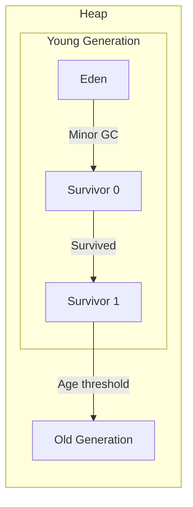

[🏠 Home](../../README.md) | [⬅️ JVM](./01-jvm-architecture.md) | [➡️ Garbage Collection](./03-garbage-collection.md)

# 🧠 Java Memory Model

> Where your objects live and die

---

## 🧠 Memory Hook

> **"HSM-PN"** = Heap, Stack, Method Area, PC Register, Native Stack
> 
> **"ESO"** = Eden → Survivor → Old (Heap generational flow)

---

## 📊 JVM Memory Layout

```
┌─────────────────────────────────────────────────────────────┐
│                       JVM MEMORY                             │
├──────────────────────────┬──────────────────────────────────┤
│     SHARED (All Threads) │         PER THREAD               │
├──────────────────────────┼──────────────────────────────────┤
│                          │  ┌────────────────────────────┐  │
│   ┌──────────────────┐   │  │         STACK              │  │
│   │   METHOD AREA    │   │  │  ┌──────────────────────┐  │  │
│   │  (Metaspace)     │   │  │  │ Frame 3 (current)    │  │  │
│   │  • Class info    │   │  │  │  • Local vars        │  │  │
│   │  • Static vars   │   │  │  │  • Operand stack     │  │  │
│   │  • Constant pool │   │  │  │  • Return address    │  │  │
│   └──────────────────┘   │  │  ├──────────────────────┤  │  │
│                          │  │  │ Frame 2              │  │  │
│   ┌──────────────────┐   │  │  ├──────────────────────┤  │  │
│   │       HEAP       │   │  │  │ Frame 1 (main)       │  │  │
│   │ ┌──────────────┐ │   │  │  └──────────────────────┘  │  │
│   │ │  Young Gen   │ │   │  └────────────────────────────┘  │
│   │ │ Eden │ S0│S1 │ │   │                                  │
│   │ ├──────────────┤ │   │  ┌────────────────────────────┐  │
│   │ │   Old Gen    │ │   │  │      PC REGISTER           │  │
│   │ │              │ │   │  │  Current instruction addr  │  │
│   │ └──────────────┘ │   │  └────────────────────────────┘  │
│   └──────────────────┘   │                                  │
│                          │  ┌────────────────────────────┐  │
│   ┌──────────────────┐   │  │   NATIVE METHOD STACK      │  │
│   │   STRING POOL    │   │  │   For JNI calls            │  │
│   │   (in Heap)      │   │  └────────────────────────────┘  │
│   └──────────────────┘   │                                  │
└──────────────────────────┴──────────────────────────────────┘
```

---

## 🗂️ Memory Areas Deep Dive

### 1. Heap (Objects Live Here) ⭐



| Area | Purpose | GC Type |
|------|---------|---------|
| **Eden** | New objects created | Minor GC |
| **Survivor (S0, S1)** | Objects that survived GC | Minor GC |
| **Old Gen** | Long-lived objects | Major GC (expensive) |

**Default Ratio**: Young:Old = 1:2 (configurable via `-XX:NewRatio`)

---

### 2. Stack (Method Execution) ⭐

Each thread gets its own stack. Each method call creates a **Stack Frame**.

```java
void main() {
    int x = 10;    // x stored in main's frame
    helper(x);     // new frame pushed
}

void helper(int a) {
    int b = 20;    // a, b stored in helper's frame
}
```

```
Stack:
┌─────────────────┐
│ helper() frame  │ ← top (current)
│   a = 10        │
│   b = 20        │
├─────────────────┤
│ main() frame    │
│   x = 10        │
└─────────────────┘
```

**Stack vs Heap**:

| Aspect | Stack | Heap |
|--------|-------|------|
| Stores | Primitives, references | Objects |
| Thread | Per-thread | Shared |
| Speed | Fast (LIFO) | Slower |
| Size | Small (default 512KB-1MB) | Large |
| Error | StackOverflowError | OutOfMemoryError |

---

### 3. String Pool 🔥

Strings are immutable and pooled for memory efficiency.

```java
String s1 = "hello";       // Pool
String s2 = "hello";       // Same pool reference
String s3 = new String("hello"); // Heap (new object)

s1 == s2;     // true (same pool reference)
s1 == s3;     // false (different objects)
s1.equals(s3); // true (same content)

s3.intern();  // Forces into pool
```

```
HEAP
┌─────────────────────────────────┐
│  String Pool                    │
│  ┌───────────────────────────┐  │
│  │ "hello" ←─┬── s1          │  │
│  │           └── s2          │  │
│  └───────────────────────────┘  │
│                                 │
│  Regular Heap                   │
│  ┌───────────────────────────┐  │
│  │ String("hello") ← s3      │  │
│  └───────────────────────────┘  │
└─────────────────────────────────┘
```

---

### 4. Method Area (Metaspace)

Stores class-level information:
- Class bytecode
- Field and method data
- Static variables
- Constant pool

**Java 7 vs 8+**:
- Java 7: PermGen (fixed size) → `java.lang.OutOfMemoryError: PermGen space`
- Java 8+: Metaspace (native memory, auto-grows) → No PermGen errors

---

## 💻 Code Example: Memory Allocation

```java
public class MemoryDemo {
    static int staticVar = 100;      // Method Area
    
    public static void main(String[] args) {
        int localVar = 10;           // Stack (main frame)
        String str = "hello";        // str → Stack, "hello" → String Pool
        
        Person p = new Person("John"); // p → Stack, Person object → Heap
        
        int[] arr = new int[5];      // arr → Stack, array → Heap
    }
}
```

**Memory Map**:
```
METHOD AREA:
  - MemoryDemo.class
  - staticVar = 100

STACK (main thread):
  - localVar = 10
  - str → (points to String Pool)
  - p → (points to Heap)
  - arr → (points to Heap)

HEAP:
  - String Pool: "hello"
  - Person("John") object
  - int[5] array
```

---

## ⚠️ Memory Leaks

Common causes:
1. **Unclosed resources**: Streams, connections
2. **Static collections**: Growing forever
3. **Listeners not removed**: Event handlers
4. **Inner class references**: Holds outer class

```java
// Leak: static list grows forever
static List<Object> cache = new ArrayList<>();
void addToCache(Object o) { cache.add(o); }

// Fix: Use weak references or bounded cache
static Map<Key, SoftReference<Value>> cache = new HashMap<>();
```

---

## 💡 Interview Flash Cards

| Question | Answer |
|----------|--------|
| Heap vs Stack? | Heap = objects (shared), Stack = local vars (per-thread) |
| Where is String Pool? | In Heap (moved from PermGen in Java 7) |
| What is Metaspace? | Method Area in native memory (Java 8+) |
| StackOverflowError cause? | Too many method calls (deep recursion) |
| OutOfMemoryError cause? | Heap full (too many objects) |
| What is `intern()`? | Puts string into pool, returns pool reference |

---

## ⚡ Key JVM Flags

| Flag | Purpose |
|------|---------|
| `-Xms512m` | Initial heap size |
| `-Xmx2g` | Maximum heap size |
| `-Xss256k` | Stack size per thread |
| `-XX:MetaspaceSize=256m` | Initial metaspace size |
| `-XX:+PrintGCDetails` | Print GC info |

---

*Next: [Garbage Collection →](./03-garbage-collection.md)*
