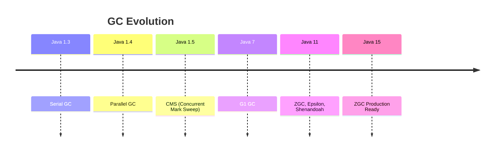

[🏠 Home](../../README.md) | [⬅️ Memory Model](./02-memory-model.md) | [➡️ JIT Compilation](./04-jit-compilation.md)

# 🗑️ Garbage Collection

> Automatic memory management in Java

---

## 🧠 Memory Hook

> **"SPCGZ"** = Serial, Parallel, CMS, G1, ZGC (GC Evolution)
> 
> **"ESO"** = Eden → Survivor → Old (Object lifecycle)

---

## 📊 How GC Works

### 1. GC Roots (Starting Points)

Objects reachable from GC roots are **alive**, others are garbage.

```mermaid
graph TD
    subgraph GC_Roots["GC Roots"]
        T[Thread stacks]
        S[Static variables]
        N[Native references]
    end
    
    T --> A[Object A ✅]
    A --> B[Object B ✅]
    S --> C[Object C ✅]
    
    D[Object D ❌] --> E[Object E ❌]
```



**GC Roots Include**:
- Local variables in stack frames
- Static variables
- Active threads
- JNI references

---

### 2. Generational Hypothesis

> **Most objects die young** → Optimize for short-lived objects


| Generation | Contains | GC Frequency |
|------------|----------|--------------|
| **Young (Eden + Survivors)** | New objects | Frequent (Minor GC) |
| **Old (Tenured)** | Long-lived objects | Rare (Major GC) |

---

### 3. Mark-Sweep-Compact

Most GC algorithms follow this:

```
1. MARK     →  Find all reachable objects
2. SWEEP    →  Remove unreachable objects
3. COMPACT  →  Defragment memory (optional)
```

```
Before GC:
[A][B][  ][C][  ][D][E][  ]

After Mark (B, D unreachable):
[A][❌][  ][C][  ][❌][E][  ]

After Sweep:
[A][  ][  ][C][  ][  ][E][  ]

After Compact:
[A][C][E][  ][  ][  ][  ][  ]
```

---

## 🔧 GC Algorithms

### Overview



### Comparison Table

| GC | Throughput | Latency | Heap Size | Use Case |
|----|------------|---------|-----------|----------|
| **Serial** | Low | High | Small | Single-threaded apps |
| **Parallel** | High | High | Medium | Batch processing |
| **CMS** | Medium | Low | Medium | Web apps (deprecated) |
| **G1** | High | Low | Large | General purpose ⭐ |
| **ZGC** | High | Very Low | Huge | Real-time systems |

---

### 1. Serial GC (`-XX:+UseSerialGC`)

- Single-threaded
- Stop-the-world (STW)
- Good for: Small heaps, single-core

```
Application:  ────────────█████████────────────
GC Thread:                ─────────►
                          (STW pause)
```

### 2. Parallel GC (`-XX:+UseParallelGC`)

- Multi-threaded GC
- Still stop-the-world
- Default in Java 8
- Good for: Batch jobs, throughput priority

```
Application:  ────────────█████████────────────
GC Threads:               ═══════════►  (multiple threads)
```

### 3. CMS (`-XX:+UseConcMarkSweepGC`) ⚠️ Deprecated

- Concurrent marking (runs alongside app)
- Low pause times
- No compaction → fragmentation
- Deprecated in Java 9, removed in Java 14

### 4. G1 GC (`-XX:+UseG1GC`) ⭐ Default (Java 9+)

- Region-based heap
- Predictable pause times (`-XX:MaxGCPauseMillis=200`)
- Concurrent + Parallel

```
┌─────────────────────────────────────┐
│  HEAP (divided into regions)        │
│ ┌──┬──┬──┬──┬──┬──┬──┬──┬──┬──┐    │
│ │E │E │S │S │O │O │O │O │H │  │    │
│ └──┴──┴──┴──┴──┴──┴──┴──┴──┴──┘    │
│  E=Eden, S=Survivor, O=Old, H=Huge  │
└─────────────────────────────────────┘
```

**G1 Phases**:
1. Initial Mark (STW)
2. Concurrent Mark
3. Final Remark (STW)
4. Cleanup (STW + Concurrent)

### 5. ZGC (`-XX:+UseZGC`) 🚀

- Sub-millisecond pauses (<10ms)
- Handles multi-terabyte heaps
- Concurrent relocation
- Java 11+ (experimental), Java 15+ (production)

---

## 💻 GC Tuning Cheat Sheet

### Common Flags

| Flag | Purpose |
|------|---------|
| `-Xms4g` | Initial heap |
| `-Xmx4g` | Max heap (set same as Xms for stability) |
| `-XX:NewRatio=2` | Old:Young = 2:1 |
| `-XX:SurvivorRatio=8` | Eden:Survivor = 8:1 |
| `-XX:MaxGCPauseMillis=200` | Target pause time (G1) |
| `-XX:+UseG1GC` | Enable G1 |
| `-XX:+PrintGCDetails` | Verbose GC logging |

### Monitoring

```bash
# View GC logs
java -Xlog:gc*:file=gc.log:time -jar app.jar

# JVM flags info
java -XX:+PrintFlagsFinal -version | grep GC
```

---

## 💡 Interview Flash Cards

| Question | Answer |
|----------|--------|
| What is GC Root? | Starting point for reachability (stack vars, static vars) |
| Minor vs Major GC? | Minor = Young Gen (fast), Major = Old Gen (slow) |
| What is STW? | Stop-The-World pause during GC |
| Default GC in Java 11? | G1 |
| When to use ZGC? | Very large heaps, low-latency requirements |
| What causes Full GC? | Old Gen full, System.gc(), Metaspace full |
| How to avoid GC issues? | Proper heap sizing, avoid memory leaks, object pooling |

---

## ⚡ Key Points

- ⭐ **G1 is default** in Java 9+ (balanced throughput & latency)
- ⭐ Always set **-Xms = -Xmx** in production
- 🔥 **Minor GC** = Young Gen, **Major GC** = Old Gen, **Full GC** = Entire heap
- 💡 **ZGC** for sub-ms pauses with huge heaps
- 💡 **Parallel GC** for maximum throughput (batch jobs)

---

*Next: [JIT Compilation →](./04-jit-compilation.md)*
