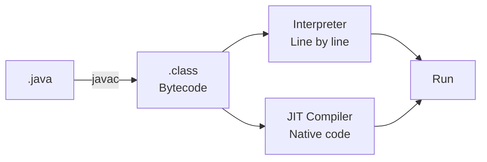
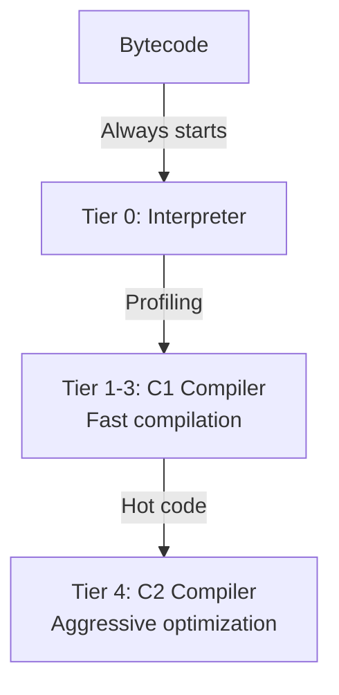

[🏠 Home](../../README.md) | [⬅️ GC](./03-garbage-collection.md) | [➡️ Collections](./05-collections-framework.md)

# ⚡ JIT Compilation

> Making Java fast at runtime

---

## 🧠 Memory Hook

> **"IC"** = Interpreter then Compile
> 
> **"HTT"** = HotSpot uses Tiered compilation (C1 → C2)

---

## 📊 Execution Flow



---

## 🔥 Interpreter vs JIT

| Aspect | Interpreter | JIT |
|--------|-------------|-----|
| Speed | Slow execution | Fast execution |
| Startup | Fast | Slow (compilation time) |
| Memory | Low | Higher (stores native code) |
| Use Case | Rarely used methods | Hot methods |

**Best of Both**: JVM starts with interpreter, compiles hot code with JIT.

---

## 🔧 HotSpot VM Tiers



| Tier | Name | Speed | Optimization |
|------|------|-------|--------------|
| 0 | Interpreter | Slow | None |
| 1-3 | C1 (Client) | Medium | Basic |
| 4 | C2 (Server) | Fast | Aggressive |

---

## 💡 JIT Optimizations

### 1. Method Inlining
```java
// Before
int result = add(a, b);
int add(int x, int y) { return x + y; }

// After JIT inlining
int result = a + b;  // No method call overhead
```

### 2. Escape Analysis
```java
// Object doesn't escape method → allocate on stack
void process() {
    Point p = new Point(1, 2);  // Stack allocation (no GC needed)
    int sum = p.x + p.y;
}
```

### 3. Loop Unrolling
```java
// Before
for (int i = 0; i < 4; i++) arr[i] = 0;

// After unrolling
arr[0] = 0; arr[1] = 0; arr[2] = 0; arr[3] = 0;
```

### 4. Dead Code Elimination
```java
// Before
if (false) { /* never runs */ }
int x = 5;

// After
int x = 5;  // Dead code removed
```

---

## ⚙️ JVM Flags

| Flag | Purpose |
|------|---------|
| `-XX:+TieredCompilation` | Enable tiered (default) |
| `-XX:TieredStopAtLevel=1` | Only use C1 (faster startup) |
| `-XX:+PrintCompilation` | Log compiled methods |
| `-XX:CompileThreshold=10000` | Invocations before compile |

---

## 💡 Interview Flash Cards

| Question | Answer |
|----------|--------|
| What is JIT? | Just-In-Time compiler: compiles bytecode → native at runtime |
| Why use interpreter + JIT? | Fast startup (interpreter) + fast execution (JIT) |
| What is HotSpot? | JVM implementation with tiered compilation |
| What is method inlining? | Replace method call with method body |
| What is escape analysis? | Determine if object can be stack-allocated |
| C1 vs C2? | C1 = fast compile, C2 = aggressive optimization |

---

*Next: [Collections Framework →](./05-collections-framework.md)*
