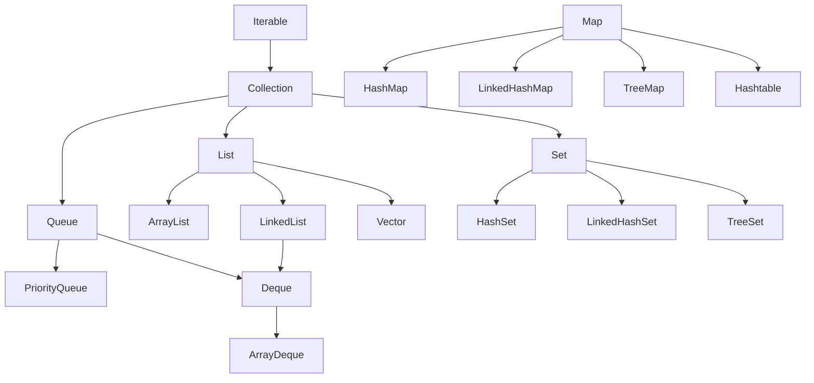

[🏠 Home](../../README.md) | [⬅️ JIT](./04-jit-compilation.md) | [➡️ Collections Internals](./06-collections-internals.md)

# 📦 Java Collections Framework

> The right data structure for every problem

---

## 🧠 Memory Hook

> **"LSMQ"** = List, Set, Map, Queue (4 categories)
> 
> **"AHL"** = ArrayList, HashSet, HashMap, LinkedList (most used)

---

## 📊 Collections Hierarchy



---

## 🔧 When to Use What

| Need | Use | Why |
|------|-----|-----|
| Fast random access | `ArrayList` | O(1) get by index |
| Frequent insert/delete | `LinkedList` | O(1) insert at known position |
| No duplicates | `HashSet` | O(1) contains |
| Sorted unique | `TreeSet` | O(log n) sorted order |
| Insertion order | `LinkedHashSet` | Maintains insertion order |
| Key-value pairs | `HashMap` | O(1) get/put |
| Sorted key-value | `TreeMap` | O(log n) sorted keys |
| FIFO queue | `LinkedList` / `ArrayDeque` | Queue operations |
| Priority queue | `PriorityQueue` | Min/max heap |

---

## 📊 Time Complexity

### List

| Operation | ArrayList | LinkedList |
|-----------|-----------|------------|
| get(index) | O(1) | O(n) |
| add(end) | O(1)* | O(1) |
| add(middle) | O(n) | O(1)** |
| remove(index) | O(n) | O(n) |
| contains | O(n) | O(n) |

*Amortized (may resize)
**O(1) if you have reference, O(n) to find position

### Set & Map

| Operation | HashSet/HashMap | TreeSet/TreeMap | LinkedHashSet/Map |
|-----------|-----------------|-----------------|-------------------|
| add/put | O(1) | O(log n) | O(1) |
| remove | O(1) | O(log n) | O(1) |
| contains/get | O(1) | O(log n) | O(1) |
| Ordered? | No | Sorted | Insertion |

### Queue

| Operation | ArrayDeque | PriorityQueue |
|-----------|------------|---------------|
| offer | O(1) | O(log n) |
| poll | O(1) | O(log n) |
| peek | O(1) | O(1) |

---

## 💻 Code Examples

### List
```java
List<String> list = new ArrayList<>();
list.add("A");
list.add("B");
list.get(0);           // "A"
list.set(0, "Z");      // Replace
list.remove(0);        // Remove by index
list.contains("B");    // true
```

### Set
```java
Set<String> set = new HashSet<>();
set.add("A");
set.add("A");          // Duplicate ignored
set.size();            // 1
set.contains("A");     // true

// Sorted
Set<Integer> sortedSet = new TreeSet<>();
sortedSet.addAll(List.of(3, 1, 2));  // [1, 2, 3]
```

### Map
```java
Map<String, Integer> map = new HashMap<>();
map.put("A", 1);
map.get("A");                    // 1
map.getOrDefault("B", 0);        // 0
map.containsKey("A");            // true
map.keySet();                    // Set of keys
map.values();                    // Collection of values
map.entrySet();                  // Set of entries

// Iterate
for (Map.Entry<String, Integer> e : map.entrySet()) {
    System.out.println(e.getKey() + ": " + e.getValue());
}
```

### Queue & Deque
```java
Queue<Integer> queue = new LinkedList<>();
queue.offer(1);        // Add to tail
queue.poll();          // Remove from head

Deque<Integer> deque = new ArrayDeque<>();
deque.addFirst(1);     // Stack: push
deque.removeFirst();   // Stack: pop
deque.addLast(2);      // Queue: offer
deque.removeFirst();   // Queue: poll
```

---

## ⚠️ Common Pitfalls

### 1. ConcurrentModificationException
```java
// WRONG
for (String s : list) {
    list.remove(s);  // Exception!
}

// RIGHT
Iterator<String> it = list.iterator();
while (it.hasNext()) {
    it.next();
    it.remove();  // Safe
}

// Or use removeIf
list.removeIf(s -> s.startsWith("A"));
```

### 2. Null Keys/Values
| Collection | Null Key | Null Value |
|------------|----------|------------|
| HashMap | 1 allowed | Multiple allowed |
| TreeMap | ❌ (NPE) | Multiple allowed |
| Hashtable | ❌ | ❌ |
| HashSet | 1 null allowed | - |

---

## 💡 Interview Flash Cards

| Question | Answer |
|----------|--------|
| ArrayList vs LinkedList? | Array = O(1) get, List = O(1) insert |
| HashSet vs TreeSet? | Hash = O(1) unordered, Tree = O(log n) sorted |
| HashMap vs Hashtable? | HashMap = not sync + allows null, Hashtable = sync + no null |
| How does HashSet work? | Uses HashMap internally (value = dummy) |
| Initial capacity of ArrayList? | 10 (grows by 50%) |
| Load factor of HashMap? | 0.75 (resizes at 75% full) |

---

*Next: [Collections Internals →](./06-collections-internals.md)*
