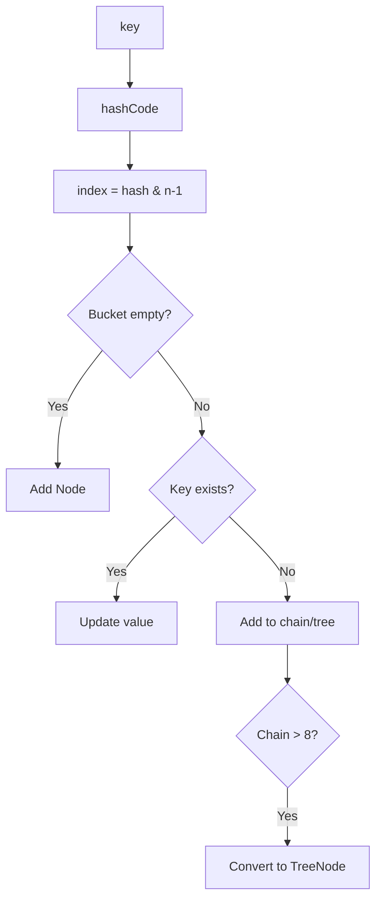

[🏠 Home](../../README.md) | [⬅️ Collections](./05-collections-framework.md) | [➡️ Multithreading](./07-multithreading-basics.md)

# 🔬 Collections Internals

> How ArrayList, HashMap, and friends really work

---

## 🧠 Memory Hook

> **"HashMap BLT"** = Buckets, Load factor 0.75, Treeify at 8

---

## 📦 ArrayList Internals

### Structure
```
ArrayList<E>
├── Object[] elementData  ← Backing array
├── int size              ← Actual elements
└── int capacity          ← Array length
```

### Resizing
```
Initial capacity: 10
Growth: 50% (newCapacity = oldCapacity + oldCapacity >> 1)

add() when full:
  1. Create new array (1.5x size)
  2. Copy elements (System.arraycopy)
  3. Add new element
```

```java
// When size == capacity
Object[] newArray = new Object[capacity * 1.5];
System.arraycopy(oldArray, 0, newArray, 0, size);
```

### Time Complexity
| Operation | Best | Worst |
|-----------|------|-------|
| get(i) | O(1) | O(1) |
| add(end) | O(1) | O(n) resize |
| add(i) | O(n) | O(n) |
| remove(i) | O(n) | O(n) |

---

## 🗺️ HashMap Internals ⭐

### Structure (Java 8+)

```
HashMap<K, V>
├── Node<K,V>[] table     ← Buckets array
├── int size              ← Number of entries
├── int threshold         ← capacity × loadFactor
├── float loadFactor      ← 0.75 default
└── int modCount          ← For ConcurrentModificationException
```

### How put() Works



```java
// Simplified put logic
int hash = key.hashCode() ^ (key.hashCode() >>> 16);  // Spread bits
int index = hash & (table.length - 1);               // Find bucket

if (table[index] == null) {
    table[index] = new Node(hash, key, value, null);
} else {
    // Collision: add to linked list or tree
}
```

### Bucket Structure

```
Bucket (index 5):
┌──────────────────────────────────────────────────┐
│ Before Java 8: Linked List                       │
│ Node → Node → Node → Node → null                 │
│                                                  │
│ After Java 8: Tree (if chain > 8)                │
│         TreeNode                                 │
│        /        \                                │
│   TreeNode    TreeNode                           │
└──────────────────────────────────────────────────┘
```

### Key Numbers

| Parameter | Value | Meaning |
|-----------|-------|---------|
| Default capacity | 16 | Initial buckets |
| Load factor | 0.75 | Resize at 75% full |
| Treeify threshold | 8 | List → Tree |
| Untreeify threshold | 6 | Tree → List |
| Min tree capacity | 64 | Min buckets to treeify |

### Resizing

```
If size > threshold (capacity × 0.75):
  1. Double the bucket array
  2. Rehash all entries (expensive!)
```

---

## 🔗 LinkedHashMap

- Extends HashMap
- Adds doubly-linked list to maintain **insertion order**

```
LinkedHashMap:
  HashMap buckets + 
  head ↔ Node1 ↔ Node2 ↔ Node3 ↔ tail
```

Use case: **LRU Cache**
```java
// Access-order LinkedHashMap for LRU
Map<K, V> lru = new LinkedHashMap<>(16, 0.75f, true) {
    @Override
    protected boolean removeEldestEntry(Map.Entry<K, V> eldest) {
        return size() > MAX_SIZE;
    }
};
```

---

## 🌳 TreeMap

- Red-Black Tree internally
- Keys must be `Comparable` or provide `Comparator`
- O(log n) for all operations

```
TreeMap structure:
        20(B)
       /     \
    10(R)    30(R)
    /  \     /  \
   5   15  25   35
```

---

## 📊 Comparison

| Feature | HashMap | LinkedHashMap | TreeMap |
|---------|---------|---------------|---------|
| Order | None | Insertion | Sorted |
| get/put | O(1) | O(1) | O(log n) |
| Null key | 1 allowed | 1 allowed | Not allowed |
| Memory | Low | Medium | High |
| Thread-safe | No | No | No |

---

## 💻 HashSet Internals

HashSet is just HashMap with dummy value!

```java
public class HashSet<E> {
    private HashMap<E, Object> map;
    private static final Object PRESENT = new Object();  // Dummy
    
    public boolean add(E e) {
        return map.put(e, PRESENT) == null;
    }
}
```

---

## 💡 Interview Flash Cards

| Question | Answer |
|----------|--------|
| How HashMap handles collision? | Chaining (list → tree after 8) |
| When does HashMap resize? | size > capacity × 0.75 |
| HashMap vs TreeMap? | O(1) unordered vs O(log n) sorted |
| How is hashCode used? | hash & (n-1) to find bucket index |
| Why table size is power of 2? | For fast modulo (bitwise AND) |
| Why load factor 0.75? | Balance between space and time |
| LinkedHashMap order? | Insertion order (or access order) |

---

## ⚡ Key Points

- ⭐ HashMap uses **array + linked list + tree** (Java 8+)
- ⭐ Load factor 0.75 = resize at 75% capacity
- 🔥 Treeify at 8 elements in bucket (O(n) → O(log n))
- 💡 Always override both `hashCode()` and `equals()`
- 💡 Good hashCode = uniform distribution

---

*Next: [Multithreading Basics →](./07-multithreading-basics.md)*
