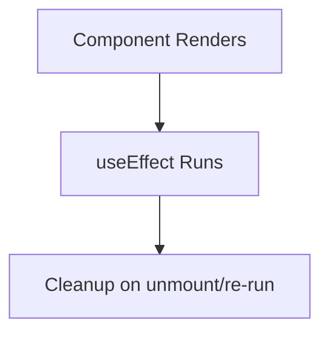

# React.js Complete Guide

A comprehensive guide to React with hooks, state management, and modern patterns.

---

## 🗺️ Learning Roadmap

```mermaid
flowchart LR
    subgraph Basics["1. Basics"]
        JSX[JSX]
        COMP[Components]
        PROPS[Props]
    end
    
    subgraph Hooks["2. Hooks"]
        STATE[useState]
        EFFECT[useEffect]
        CONTEXT[useContext]
    end
    
    subgraph Advanced["3. Advanced"]
        MEMO[useMemo/useCallback]
        REDUCER[useReducer]
        CUSTOM[Custom Hooks]
    end
    
    subgraph Patterns["4. Patterns"]
        ROUTER[React Router]
        FORMS[Forms]
        API[Data Fetching]
    end
    
    Basics --> Hooks --> Advanced --> Patterns
```



---

## 1️⃣ React Fundamentals

### What is React?

**React** is a JavaScript library for building user interfaces. It uses:
- **Component-based architecture**: Build UIs from reusable pieces
- **Virtual DOM**: Efficient updates by diffing virtual and real DOM
- **Declarative**: Describe what you want, React handles the how

### JSX

JSX is a syntax extension that looks like HTML but compiles to JavaScript.

```jsx
// JSX
const element = <h1>Hello, {name}!</h1>;

// Compiles to
const element = React.createElement('h1', null, 'Hello, ', name, '!');
```

**JSX Rules:**
1. Must return a single root element (use `<>...</>` fragments)
2. Close all tags (``, `<br />`)
3. Use `className` instead of `class`
4. Use `htmlFor` instead of `for`
5. Use camelCase for events (`onClick`, `onChange`)

```jsx
function App() {
    const isLoggedIn = true;
    const items = ['Apple', 'Banana', 'Orange'];
    
    return (
        <>
            {/* Conditional rendering */}
            {isLoggedIn && <p>Welcome back!</p>}
            {isLoggedIn ? <Dashboard /> : <Login />}
            
            {/* List rendering */}
            <ul>
                {items.map((item, index) => (
                    <li key={index}>{item}</li>
                ))}
            </ul>
            
            {/* Inline styles */}
            <div style={{ color: 'red', fontSize: '16px' }}>Styled</div>
        </>
    );
}
```

---

## 2️⃣ Components

### Function Components (Modern)

```jsx
// Basic component
function Greeting({ name }) {
    return <h1>Hello, {name}!</h1>;
}

// Arrow function component
const Greeting = ({ name }) => <h1>Hello, {name}!</h1>;

// Usage
<Greeting name="World" />
```

### Props

Props are read-only inputs passed from parent to child.

```jsx
// Passing props
function UserCard({ name, age, avatar, onEdit }) {
    return (
        <div className="card">
            
            <h2>{name}</h2>
            <p>Age: {age}</p>
            <button onClick={onEdit}>Edit</button>
        </div>
    );
}

// Default props
function Button({ type = 'primary', children }) {
    return <button className={`btn btn-${type}`}>{children}</button>;
}

// Spread props
const props = { name: 'John', age: 30 };
<UserCard {...props} />
```

### Children Prop

```jsx
function Card({ title, children }) {
    return (
        <div className="card">
            <h3>{title}</h3>
            <div className="card-body">
                {children}
            </div>
        </div>
    );
}

// Usage
<Card title="My Card">
    <p>This is the content</p>
    <button>Click me</button>
</Card>
```

---

## 3️⃣ useState Hook

Manage component state.

```jsx
import { useState } from 'react';

function Counter() {
    // [currentValue, setterFunction] = useState(initialValue)
    const [count, setCount] = useState(0);
    
    return (
        <div>
            <p>Count: {count}</p>
            <button onClick={() => setCount(count + 1)}>+</button>
            <button onClick={() => setCount(count - 1)}>-</button>
            <button onClick={() => setCount(0)}>Reset</button>
        </div>
    );
}
```

### State Updates

```jsx
// ❌ Wrong - don't mutate state directly
state.push(newItem);
setItems(state);

// ✅ Correct - create new array
setItems([...items, newItem]);

// Functional update (when new state depends on previous)
setCount(prev => prev + 1);

// Object state
const [user, setUser] = useState({ name: '', email: '' });
setUser(prev => ({ ...prev, name: 'John' }));
```

### Multiple State Variables

```jsx
function Form() {
    const [name, setName] = useState('');
    const [email, setEmail] = useState('');
    const [isSubmitting, setIsSubmitting] = useState(false);
    
    // Or use object state for related values
    const [formData, setFormData] = useState({
        name: '',
        email: '',
        message: ''
    });
    
    const handleChange = (e) => {
        const { name, value } = e.target;
        setFormData(prev => ({ ...prev, [name]: value }));
    };
}
```

---

## 4️⃣ useEffect Hook

Handle side effects (data fetching, subscriptions, DOM manipulation).



### Basic Syntax

```jsx
import { useState, useEffect } from 'react';

function UserProfile({ userId }) {
    const [user, setUser] = useState(null);
    const [loading, setLoading] = useState(true);
    
    useEffect(() => {
        // Effect code runs after render
        async function fetchUser() {
            setLoading(true);
            const response = await fetch(`/api/users/${userId}`);
            const data = await response.json();
            setUser(data);
            setLoading(false);
        }
        
        fetchUser();
        
        // Cleanup function (optional)
        return () => {
            // Runs before next effect or unmount
            console.log('Cleanup');
        };
    }, [userId]); // Dependency array
    
    if (loading) return <p>Loading...</p>;
    return <div>{user.name}</div>;
}
```

### Dependency Array

| Dependency Array | When Effect Runs |
| :--- | :--- |
| `[]` (empty) | Once on mount only |
| `[a, b]` | When a or b changes |
| No array | Every render (usually wrong!) |

```jsx
// Run once on mount
useEffect(() => {
    console.log('Mounted');
}, []);

// Run when userId changes
useEffect(() => {
    fetchUser(userId);
}, [userId]);

// Cleanup example (subscriptions)
useEffect(() => {
    const subscription = eventEmitter.subscribe(handleEvent);
    return () => subscription.unsubscribe();
}, []);

// Cleanup example (timers)
useEffect(() => {
    const timer = setInterval(() => {
        setCount(c => c + 1);
    }, 1000);
    return () => clearInterval(timer);
}, []);
```

---

## 5️⃣ useContext Hook

Share data without prop drilling.

```jsx
import { createContext, useContext, useState } from 'react';

// 1. Create context
const ThemeContext = createContext();

// 2. Create provider component
function ThemeProvider({ children }) {
    const [theme, setTheme] = useState('light');
    
    const toggleTheme = () => {
        setTheme(prev => prev === 'light' ? 'dark' : 'light');
    };
    
    return (
        <ThemeContext.Provider value={{ theme, toggleTheme }}>
            {children}
        </ThemeContext.Provider>
    );
}

// 3. Use context in any child component
function ThemedButton() {
    const { theme, toggleTheme } = useContext(ThemeContext);
    
    return (
        <button 
            onClick={toggleTheme}
            style={{ background: theme === 'dark' ? '#333' : '#fff' }}
        >
            Current: {theme}
        </button>
    );
}

// 4. Wrap app with provider
function App() {
    return (
        <ThemeProvider>
            <Header />
            <Main />
            <ThemedButton />
        </ThemeProvider>
    );
}
```

---

## 6️⃣ useReducer Hook

Complex state logic (like Redux).

```jsx
import { useReducer } from 'react';

// Reducer function
function todoReducer(state, action) {
    switch (action.type) {
        case 'ADD':
            return [...state, { id: Date.now(), text: action.payload, done: false }];
        case 'TOGGLE':
            return state.map(todo => 
                todo.id === action.payload 
                    ? { ...todo, done: !todo.done }
                    : todo
            );
        case 'DELETE':
            return state.filter(todo => todo.id !== action.payload);
        default:
            return state;
    }
}

function TodoApp() {
    const [todos, dispatch] = useReducer(todoReducer, []);
    const [text, setText] = useState('');
    
    const handleSubmit = (e) => {
        e.preventDefault();
        dispatch({ type: 'ADD', payload: text });
        setText('');
    };
    
    return (
        <div>
            <form onSubmit={handleSubmit}>
                <input value={text} onChange={e => setText(e.target.value)} />
                <button>Add</button>
            </form>
            
            <ul>
                {todos.map(todo => (
                    <li key={todo.id}>
                        <span 
                            style={{ textDecoration: todo.done ? 'line-through' : 'none' }}
                            onClick={() => dispatch({ type: 'TOGGLE', payload: todo.id })}
                        >
                            {todo.text}
                        </span>
                        <button onClick={() => dispatch({ type: 'DELETE', payload: todo.id })}>
                            ×
                        </button>
                    </li>
                ))}
            </ul>
        </div>
    );
}
```

---

## 7️⃣ useMemo & useCallback

Performance optimization hooks.

### useMemo - Memoize Values

```jsx
import { useMemo } from 'react';

function ExpensiveComponent({ items, filter }) {
    // Only recalculates when items or filter changes
    const filteredItems = useMemo(() => {
        console.log('Filtering...');
        return items.filter(item => item.includes(filter));
    }, [items, filter]);
    
    return <ul>{filteredItems.map(item => <li key={item}>{item}</li>)}</ul>;
}
```

### useCallback - Memoize Functions

```jsx
import { useCallback } from 'react';

function ParentComponent() {
    const [count, setCount] = useState(0);
    
    // Without useCallback, new function created every render
    // Child would re-render even if it uses React.memo
    const handleClick = useCallback(() => {
        console.log('Clicked');
    }, []); // Empty deps = same function always
    
    const handleIncrement = useCallback(() => {
        setCount(c => c + 1);
    }, []);
    
    return (
        <div>
            <p>Count: {count}</p>
            <ChildComponent onClick={handleClick} />
        </div>
    );
}

// Works with React.memo
const ChildComponent = React.memo(({ onClick }) => {
    console.log('Child rendered');
    return <button onClick={onClick}>Click me</button>;
});
```

---

## 8️⃣ useRef Hook

Access DOM elements and persist values across renders (without triggering re-render).

```jsx
import { useRef, useEffect } from 'react';

function TextInput() {
    const inputRef = useRef(null);
    
    // Focus input on mount
    useEffect(() => {
        inputRef.current.focus();
    }, []);
    
    return <input ref={inputRef} />;
}

// Store mutable value (doesn't trigger re-render)
function Timer() {
    const intervalRef = useRef(null);
    const [count, setCount] = useState(0);
    
    const start = () => {
        intervalRef.current = setInterval(() => {
            setCount(c => c + 1);
        }, 1000);
    };
    
    const stop = () => {
        clearInterval(intervalRef.current);
    };
    
    return (
        <div>
            <p>{count}</p>
            <button onClick={start}>Start</button>
            <button onClick={stop}>Stop</button>
        </div>
    );
}
```

---

## 9️⃣ Custom Hooks

Extract reusable logic into custom hooks.

```jsx
// useFetch - Custom hook for data fetching
function useFetch(url) {
    const [data, setData] = useState(null);
    const [loading, setLoading] = useState(true);
    const [error, setError] = useState(null);
    
    useEffect(() => {
        const controller = new AbortController();
        
        async function fetchData() {
            try {
                setLoading(true);
                const response = await fetch(url, { signal: controller.signal });
                const json = await response.json();
                setData(json);
            } catch (err) {
                if (err.name !== 'AbortError') {
                    setError(err);
                }
            } finally {
                setLoading(false);
            }
        }
        
        fetchData();
        
        return () => controller.abort();
    }, [url]);
    
    return { data, loading, error };
}

// Usage
function UserList() {
    const { data: users, loading, error } = useFetch('/api/users');
    
    if (loading) return <p>Loading...</p>;
    if (error) return <p>Error: {error.message}</p>;
    
    return <ul>{users.map(u => <li key={u.id}>{u.name}</li>)}</ul>;
}
```

### More Custom Hooks

```jsx
// useLocalStorage
function useLocalStorage(key, initialValue) {
    const [value, setValue] = useState(() => {
        const stored = localStorage.getItem(key);
        return stored ? JSON.parse(stored) : initialValue;
    });
    
    useEffect(() => {
        localStorage.setItem(key, JSON.stringify(value));
    }, [key, value]);
    
    return [value, setValue];
}

// useToggle
function useToggle(initial = false) {
    const [value, setValue] = useState(initial);
    const toggle = useCallback(() => setValue(v => !v), []);
    return [value, toggle];
}

// useDebounce
function useDebounce(value, delay) {
    const [debouncedValue, setDebouncedValue] = useState(value);
    
    useEffect(() => {
        const timer = setTimeout(() => setDebouncedValue(value), delay);
        return () => clearTimeout(timer);
    }, [value, delay]);
    
    return debouncedValue;
}
```

---

## 🔟 React Router

```jsx
import { BrowserRouter, Routes, Route, Link, useParams, useNavigate } from 'react-router-dom';

function App() {
    return (
        <BrowserRouter>
            <nav>
                <Link to="/">Home</Link>
                <Link to="/about">About</Link>
                <Link to="/users">Users</Link>
            </nav>
            
            <Routes>
                <Route path="/" element={<Home />} />
                <Route path="/about" element={<About />} />
                <Route path="/users" element={<Users />} />
                <Route path="/users/:id" element={<UserDetail />} />
                <Route path="*" element={<NotFound />} />
            </Routes>
        </BrowserRouter>
    );
}

// Access URL params
function UserDetail() {
    const { id } = useParams();
    const navigate = useNavigate();
    
    return (
        <div>
            <h1>User {id}</h1>
            <button onClick={() => navigate('/users')}>Back</button>
        </div>
    );
}
```

---

## 1️⃣1️⃣ Forms in React

### Controlled Components

```jsx
function ContactForm() {
    const [formData, setFormData] = useState({
        name: '',
        email: '',
        message: ''
    });
    const [errors, setErrors] = useState({});
    
    const handleChange = (e) => {
        const { name, value } = e.target;
        setFormData(prev => ({ ...prev, [name]: value }));
    };
    
    const validate = () => {
        const newErrors = {};
        if (!formData.name) newErrors.name = 'Name is required';
        if (!formData.email.includes('@')) newErrors.email = 'Invalid email';
        setErrors(newErrors);
        return Object.keys(newErrors).length === 0;
    };
    
    const handleSubmit = (e) => {
        e.preventDefault();
        if (validate()) {
            console.log('Submit:', formData);
        }
    };
    
    return (
        <form onSubmit={handleSubmit}>
            <div>
                <input
                    name="name"
                    value={formData.name}
                    onChange={handleChange}
                    placeholder="Name"
                />
                {errors.name && <span className="error">{errors.name}</span>}
            </div>
            
            <div>
                <input
                    name="email"
                    type="email"
                    value={formData.email}
                    onChange={handleChange}
                    placeholder="Email"
                />
                {errors.email && <span className="error">{errors.email}</span>}
            </div>
            
            <textarea
                name="message"
                value={formData.message}
                onChange={handleChange}
                placeholder="Message"
            />
            
            <button type="submit">Send</button>
        </form>
    );
}
```

---

## 📚 Quick Reference

| Hook | Purpose |
| :--- | :--- |
| `useState` | Component state |
| `useEffect` | Side effects, lifecycle |
| `useContext` | Access context without prop drilling |
| `useReducer` | Complex state logic |
| `useMemo` | Memoize expensive calculations |
| `useCallback` | Memoize functions |
| `useRef` | DOM access, persist values |

---

## 🧪 Interview Questions

### 1. What is Virtual DOM?

The **Virtual DOM** is a JavaScript representation of the real DOM. When state changes:
1. React creates a new Virtual DOM tree
2. Compares it with the previous one (diffing)
3. Updates only the changed parts in the real DOM

**Benefits**: Efficient updates, declarative programming.

---

### 2. What are controlled vs uncontrolled components?

**Controlled**: Form data handled by React state
```jsx
<input value={value} onChange={e => setValue(e.target.value)} />
```

**Uncontrolled**: Form data handled by DOM (using refs)
```jsx
<input ref={inputRef} defaultValue="initial" />
```

---

### 3. What is useEffect cleanup for?

Cleanup prevents memory leaks by:
- Unsubscribing from events
- Canceling API calls
- Clearing timers

```jsx
useEffect(() => {
    const timer = setInterval(...);
    return () => clearInterval(timer); // Cleanup
}, []);
```

---

### 4. When do you use useMemo vs useCallback?

- **useMemo**: Memoize computed **values** (expensive calculations)
- **useCallback**: Memoize **functions** (for stable references)

Both prevent unnecessary re-computations when dependencies haven't changed.

---

*Build Amazing UIs with React! ⚛️*
