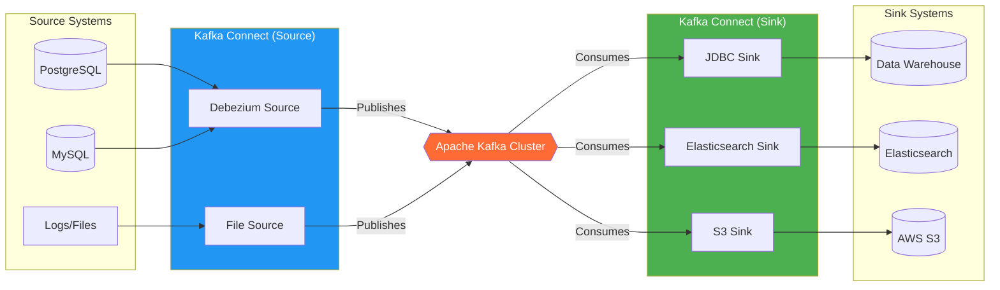
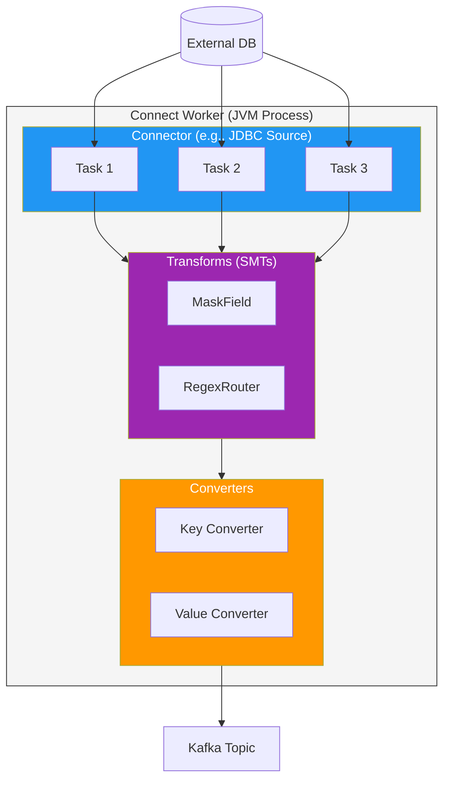
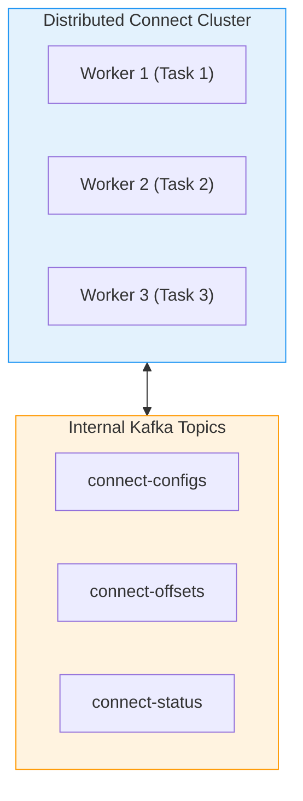
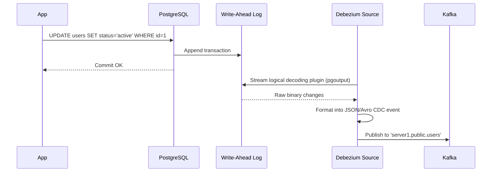
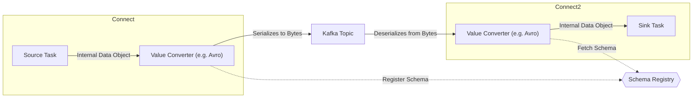

# Kafka Connectors & CDC Deep Dive

> 📘 **Level: Advanced** | ⏱️ **Reading Time: 60 min** | 🔗 **[← Learning Hub](./kafka-deep-dive.md)**

---

## 🗺️ Quick Navigation

| Section | What You'll Learn |
|---------|-------------------|
| [What is Kafka Connect?](#what-is-kafka-connect) | Core concepts, Source vs Sink |
| [Architecture](#kafka-connect-architecture) | Workers, Tasks, Converters, SMTs |
| [Deployment Modes](#deployment-modes) | Standalone vs Distributed Mode |
| [Change Data Capture (CDC)](#change-data-capture-with-debezium) | Debezium, Outbox Pattern, Postgres WAL |
| [Common Connectors](#common-connectors) | JDBC, Elasticsearch, S3, MongoDB |
| [Single Message Transforms (SMTs)](#single-message-transforms-smts) | Routing, Filtering, Masking on the fly |
| [Error Handling & DLQ](#error-handling--dead-letter-queues) | Resilient pipelines, DLQ configurations |
| [REST API Management](#rest-api-management) | Managing connectors programmatically |

---

## What is Kafka Connect?

**Kafka Connect** is a tool for scalably and reliably streaming data between Apache Kafka and other data systems. It is part of the core Apache Kafka project.

Instead of writing custom producer and consumer applications to integrate with every database or search engine, Kafka Connect provides a standardized framework with off-the-shelf plugins (connectors).

### Source vs. Sink Connectors



1. **Source Connectors:** Ingest data *from* an external system (e.g., PostgreSQL, MongoDB, Twitter API) *into* Kafka topics. They act as automated Kafka Producers.
2. **Sink Connectors:** Deliver data *from* Kafka topics *to* an external system (e.g., Elasticsearch, S3, Snowflake). They act as automated Kafka Consumers.

---

## Kafka Connect Architecture

To understand how Kafka Connect scales, we must look inside a Connect Worker.

### Inside a Worker



### Core Components

| Component | Responsibility | Example |
|-----------|----------------|---------|
| **Worker** | The running JVM process that executes connectors and tasks. | Distributed worker node |
| **Connector** | The logical job that coordinates data copying. It determines how to split work. | `JdbcSourceConnector` |
| **Task** | The physical thread that actually copies the data. Connectors spawn multiple tasks for parallelism. | Polling a specific DB table |
| **Converter** | Serializes/Deserializes data between Connect's internal format and the byte format on Kafka. | `AvroConverter`, `JsonConverter` |
| **Transform (SMT)** | Lightweight logic applied to individual messages before they hit Kafka (Source) or before they hit the external system (Sink). | Drop field, Mask PII, Add timestamp |

---

## Deployment Modes

Kafka Connect can run in two modes: **Standalone** and **Distributed**.

### Standalone Mode
- Runs as a single JVM process.
- Configuration is provided via local property files.
- **Use Case:** Development, testing, or collecting logs from a single server.
- **Drawback:** No fault tolerance. If the process dies, data pipeline stops.

### Distributed Mode
- Runs across multiple JVM processes (nodes) forming a cluster.
- Connectors and tasks are automatically balanced across the available workers.
- Configuration is submitted via REST API.
- Stores its state (configs, offsets, status) internally in specialized Kafka topics.
- **Use Case:** Production environments requiring high availability and scalability.



> [!IMPORTANT]
> The internal topics (`connect-configs`, `connect-offsets`, `connect-status`) must be created with high replication factors and specific compaction settings. Do not delete them!

---

## Change Data Capture with Debezium

**Debezium** is an open-source distributed platform for Change Data Capture (CDC), built on top of Kafka Connect.

Instead of running heavy `SELECT * FROM table WHERE updated_at > ?` queries (which drag down database performance), Debezium reads the database's internal transaction log (e.g., WAL in PostgreSQL, binlog in MySQL).

### How Debezium Works (PostgreSQL Example)



### The CDC Event Structure

Debezium emits rich events containing both the `before` and `after` state of the row, plus metadata.

```json
{
  "op": "u", 
  "before": {
    "id": 1,
    "name": "Alice",
    "status": "pending"
  },
  "after": {
    "id": 1,
    "name": "Alice",
    "status": "active"
  },
  "source": {
    "version": "1.9.5.Final",
    "connector": "postgresql",
    "name": "dbserver1",
    "ts_ms": 1662991234567,
    "db": "mydb",
    "schema": "public",
    "table": "users",
    "txId": 502,
    "lsn": 2345654
  },
  "ts_ms": 1662991234999
}
```
*`op` indicates the operation type: `c` (create), `u` (update), `d` (delete), or `r` (read/snapshot).*

### The Outbox Pattern

A common microservices anti-pattern is dual-writing:
```java
// Anti-pattern! What if the DB commits but Kafka is down?
userRepository.save(user); 
kafkaProducer.send("users", user);
```

**Solution: The Transactional Outbox Pattern with Debezium**
1. App saves the entity to `Users` table and an event to `Outbox` table in the *same DB transaction*.
2. Debezium reads the `Outbox` table from the transaction log and streams it to Kafka.
3. The app never talks to Kafka directly for state changes. Guaranteed atomicity!

---

## Single Message Transforms (SMTs)

SMTs allow you to massage data as it flows through Kafka Connect, without needing a separate Stream Processing application (like Kafka Streams or Flink).

### Popular SMTs

| Transform | Use Case |
|-----------|----------|
| `RegexRouter` | Rename topics (e.g., send `dbserver1.public.users` to `users_topic`). |
| `ExtractField` | Extract a specific field from a nested JSON to act as the Kafka message key. |
| `MaskField` | Mask PII data (e.g., replace `ssn` or `credit_card` with `***`) before it hits Kafka. |
| `InsertField` | Add static metadata, hostnames, or timestamps to the message. |
| `Filter` | Drop messages that don't match a certain predicate to save Kafka storage. |

### Configuration Example: Masking PII

```json
{
  "name": "mysql-source-users",
  "config": {
    "connector.class": "io.debezium.connector.mysql.MySqlConnector",
    "tasks.max": "1",
    "database.hostname": "mysql",
    "database.user": "debezium",
    "database.password": "dbz",
    
    "transforms": "maskEmail",
    "transforms.maskEmail.type": "org.apache.kafka.connect.transforms.MaskField$Value",
    "transforms.maskEmail.fields": "email,phone_number",
    "transforms.maskEmail.replacement": "[REDACTED]"
  }
}
```

---

## Error Handling & Dead Letter Queues

What happens if a Sink Connector tries to write a message to Elasticsearch, but the message has a malformed date string?

By default, the Kafka Connect task **fails and stops processing**.

### DLQ Configuration

You can configure Connect to route bad messages to a Dead Letter Queue (DLQ) topic instead of crashing.

```json
{
  "name": "elasticsearch-sink",
  "config": {
    "connector.class": "io.confluent.connect.elasticsearch.ElasticsearchSinkConnector",
    
    // Error Tolerance
    "errors.tolerance": "all",
    "errors.deadletterqueue.topic.name": "es-sink-dlq",
    "errors.deadletterqueue.topic.replication.factor": 3,
    
    // Include the reason for failure in the DLQ message header
    "errors.deadletterqueue.context.headers.enable": true,
    
    // Log the error in the Connect worker logs too
    "errors.log.enable": true,
    "errors.log.include.messages": true
  }
}
```

---

## Converters and Schema Registry

Converters are critical. If your Kafka topic contains Avro, but your Sink Connector is configured to read JSON, it will crash.



**Common Worker Configuration (`connect-distributed.properties`):**
```properties
key.converter=org.apache.kafka.connect.storage.StringConverter
value.converter=io.confluent.connect.avro.AvroConverter
value.converter.schema.registry.url=http://schema-registry:8081
```

> [!WARNING]
> The `JsonConverter` has a setting `schemas.enable`. If set to `true`, every JSON message will embed the entire schema alongside the payload, blowing up your payload size by 5-10x. Only use `true` if you aren't using a Schema Registry but the connector requires a schema. Otherwise, set it to `false`.

---

## REST API Management

In Distributed Mode, you interact with Kafka Connect entirely via its REST API (default port `8083`).

### 1. Check Cluster Status
```bash
curl -s http://localhost:8083/ | jq
```

### 2. List Installed Connector Plugins
```bash
curl -s http://localhost:8083/connector-plugins | jq '.[].class'
```

### 3. Create a New Connector
```bash
curl -X POST http://localhost:8083/connectors \
  -H "Content-Type: application/json" \
  -d '{
    "name": "s3-sink-connector",
    "config": {
      "connector.class": "io.confluent.connect.s3.S3SinkConnector",
      "tasks.max": "3",
      "topics": "orders,payments",
      "s3.region": "us-east-1",
      "s3.bucket.name": "my-data-lake",
      "format.class": "io.confluent.connect.s3.format.parquet.ParquetFormat"
    }
  }'
```

### 4. Check Connector Status
```bash
curl -s http://localhost:8083/connectors/s3-sink-connector/status | jq
```
*If a task is `FAILED`, this is where you see the stack trace.*

### 5. Restart a Failed Task
```bash
curl -X POST http://localhost:8083/connectors/s3-sink-connector/tasks/0/restart
```

---

## 🎯 Summary

- **Kafka Connect** is the integration framework for Kafka, eliminating custom integration code.
- **Source** = Data *into* Kafka. **Sink** = Data *out of* Kafka.
- **Debezium** is the industry standard for CDC, allowing event-driven microservices via the Outbox pattern.
- **SMTs** let you transform, mask, and filter data on the fly without heavy stream processors.
- Always use **Distributed Mode** for production and configure **DLQs** to handle bad data gracefully.

---
> *"Don't write another integration script. Let Kafka Connect do the heavy lifting."*
