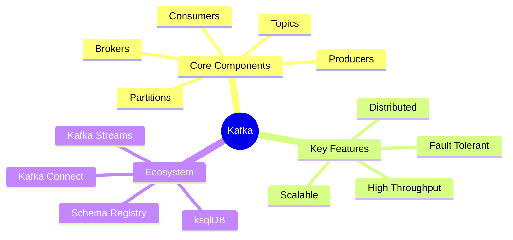
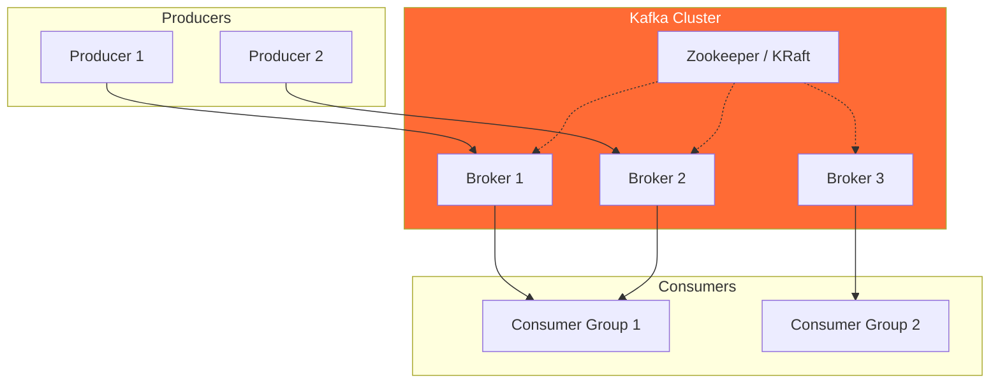

# 📨 Kafka Deep Dive - Learning Hub

> Distributed event streaming platform capable of handling trillions of events a day.

---

## 🗺️ Documentation Navigation

| Document | Level | Description |
|----------|-------|-------------|
| **📍 You are here** | Overview | Learning hub and entry point |
| [📘 Kafka Fundamentals](./kafka-fundamentals.md) | Beginner-Intermediate | Core concepts, Producers, Consumers, Examples |
| [🔧 Internals & Architecture](./kafka-internals-architecture.md) | Advanced | Deep internals, Replication, Performance |

---

## 🎯 Learning Path

| Step | Document | Focus | Time |
|------|----------|-------|------|
| 1️⃣ | This page | Overview & orientation | 10 min |
| 2️⃣ | [Fundamentals](./kafka-fundamentals.md) | Topics, Producers, Consumers | 45 min |
| 3️⃣ | [Internals](./kafka-internals-architecture.md) | Replication, Performance | 60 min |

---

## 🧠 Core Concepts at a Glance

---

## 📋 Quick Reference

| Concept | Description |
|---------|-------------|
| **Topic** | Category/feed name to which records are stored |
| **Producer** | Application that publishes messages to a topic |
| **Consumer** | Application that subscribes to topics and processes messages |
| **Broker** | Kafka server that stores data |
| **Partition** | Unit of parallelism and scalability |
| **Offset** | Unique ID of a message within a partition |
| **Consumer Group** | Set of consumers sharing workload |
| **Replication** | Copies of partitions for fault tolerance |

---

## 🏗️ High-Level Architecture

---

## 🚀 Use Cases

| Use Case | Description | Example |
|----------|-------------|---------|
| **Activity Tracking** | Real-time user behavior | LinkedIn, Netflix |
| **Log Aggregation** | Centralized log collection | ELK Stack integration |
| **Stream Processing** | Real-time analytics | Fraud detection |
| **Event Sourcing** | Storing state changes as events | Banking systems |
| **Messaging** | Pub/Sub communication | Microservices |
| **Metrics** | Operational monitoring | System dashboards |

---

## 📊 Skill Level Matrix

| Topic | Beginner | Intermediate | Advanced |
|-------|:--------:|:------------:|:--------:|
| Topics & Partitions | ✅ | ✅ | ✅ |
| Producers & Consumers | ✅ | ✅ | ✅ |
| Consumer Groups | | ✅ | ✅ |
| Delivery Guarantees | | ✅ | ✅ |
| Replication & ISR | | | ✅ |
| Performance Tuning | | | ✅ |
| Kafka Connect | | ✅ | ✅ |
| Kafka Streams | | | ✅ |

---

## 🎬 Getting Started

### For Beginners
Start with → [📘 Kafka Fundamentals](./kafka-fundamentals.md)
- Learn Topics, Partitions, Offsets
- Understand Producers and Consumers
- Explore Consumer Groups

### For Intermediate Users
Continue to → [🔧 Internals & Architecture](./kafka-internals-architecture.md)
- Deep dive into replication
- Understand storage engine
- Learn performance optimization

---

## 📚 Resources

| Resource | Type | Link |
|----------|------|------|
| Apache Kafka Docs | Official | [kafka.apache.org](https://kafka.apache.org/documentation/) |
| Confluent Developer | Tutorials | [developer.confluent.io](https://developer.confluent.io/) |
| Kafka: The Definitive Guide | Book | [O'Reilly](https://www.confluent.io/resources/kafka-the-definitive-guide/) |

---

**Next Step:** [📘 Start Learning with Kafka Fundamentals →](./kafka-fundamentals.md)
