# Kafka Internals, Architecture & Best Practices

> 🔧 **Level: Advanced** | ⏱️ **Reading Time: 60 min** | 🔗 **[← Learning Hub](./kafka-deep-dive.md)** | **[← Fundamentals](./kafka-fundamentals.md)**

---

## 🗺️ Quick Navigation

| Section | What You'll Learn |
|---------|-------------------|
| [Internal Architecture](#internal-architecture) | Broker internals, Log structure |
| [Replication](#replication-deep-dive) | ISR, Leader election, Failover |
| [Storage Engine](#storage-engine) | Log segments, Compaction, Retention |
| [Performance](#performance-optimization) | Batching, Compression, Zero-copy |
| [Kafka Ecosystem](#kafka-ecosystem) | Connect, Streams, ksqlDB |
| [Best Practices](#best-practices) | Production deployment checklist |

> [!IMPORTANT]
> **Prerequisites:** Understanding of [Kafka basics](./kafka-fundamentals.md) is strongly recommended before diving into internals.

---

## Internal Architecture

### Broker Architecture

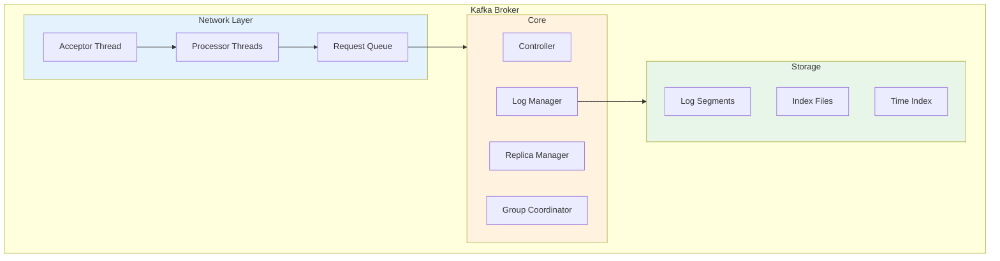

### Request Processing Flow

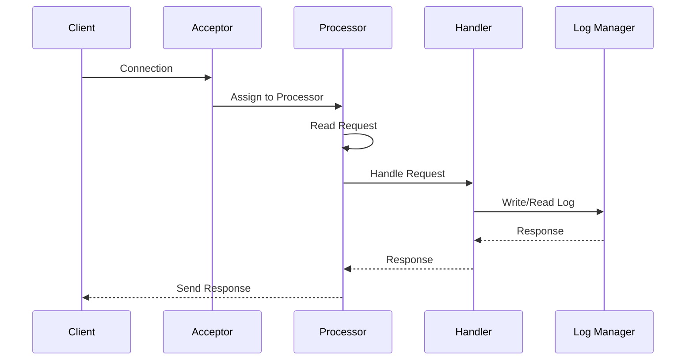

### Log Structure (Per Partition)

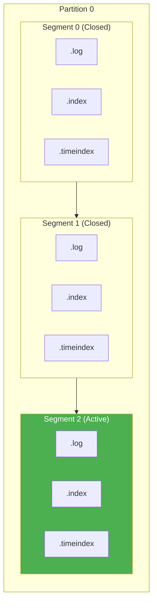

**File Types:**
- `.log` - Actual message data
- `.index` - Offset → file position mapping
- `.timeindex` - Timestamp → offset mapping

---

## Replication Deep Dive

### Replication Model

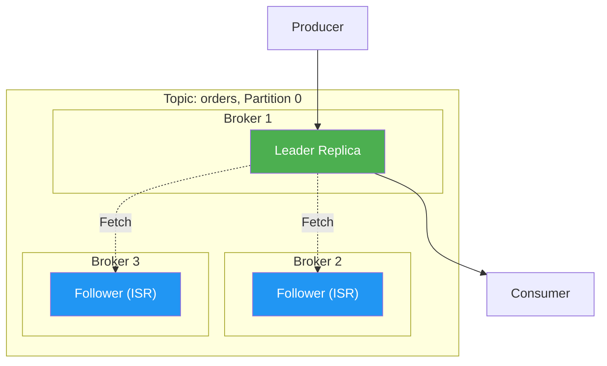

### ISR (In-Sync Replicas) Mechanics

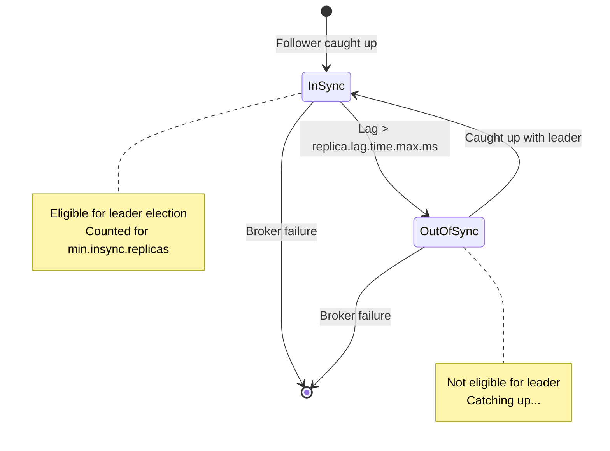

### High Watermark & Log End Offset

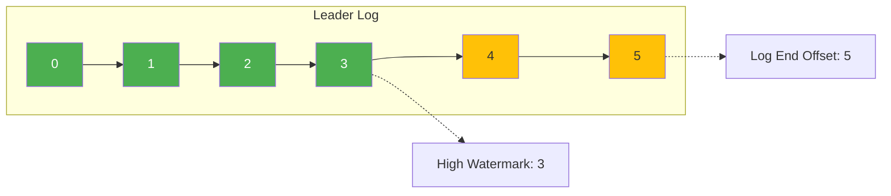

> 📌 **High Watermark** = Last offset replicated to ALL ISR replicas (safe to expose to consumers)

### Leader Election

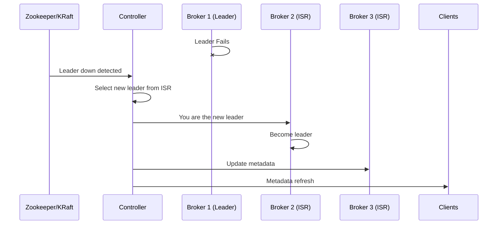

---

## Storage Engine

### Log Compaction

```mermaid
graph TB
    subgraph Before["Before Compaction"]
        K1A["key1: A"]
        K2A["key2: X"]
        K1B["key1: B"]
        K3A["key3: Y"]
        K1C["key1: C"]
        K2B["key2: Z"]
    end
    
    Compact["🗜️ Log Compaction"]
    
    subgraph After["After Compaction"]
        K3F["key3: Y"]
        K1F["key1: C"]
        K2F["key2: Z"]
    end
    
    Before --> Compact --> After
    
    style Compact fill:#FF6B35,color:white
```

**Compaction keeps:** Latest value per key (like a changelog)

### Retention Policies

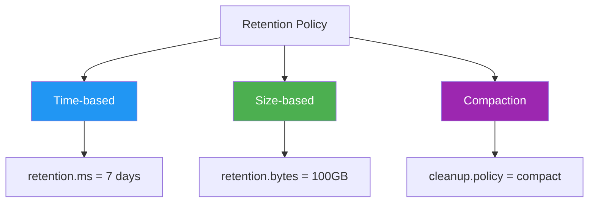

---

## Performance Optimization

### Zero-Copy Transfer

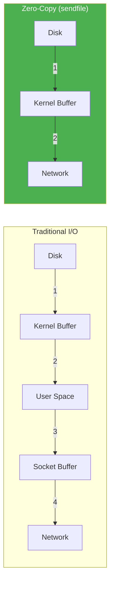

### Batching & Compression

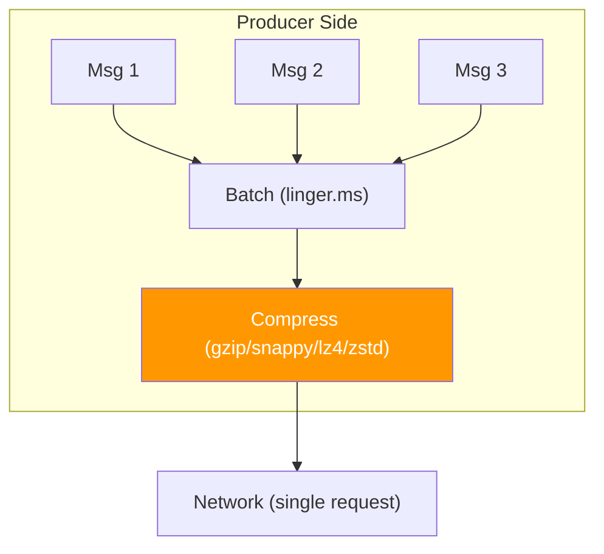

### Performance Tuning Parameters

| Parameter | Default | Tuning |
|-----------|---------|--------|
| `batch.size` | 16KB | Increase for throughput |
| `linger.ms` | 0 | Set 5-100ms for batching |
| `compression.type` | none | lz4 (balanced), zstd (best ratio) |
| `buffer.memory` | 32MB | Increase for high throughput |
| `fetch.min.bytes` | 1 | Increase to reduce requests |
| `num.io.threads` | 8 | Match to disk count |
| `num.network.threads` | 3 | Match to CPU cores |

---

## Kafka Ecosystem

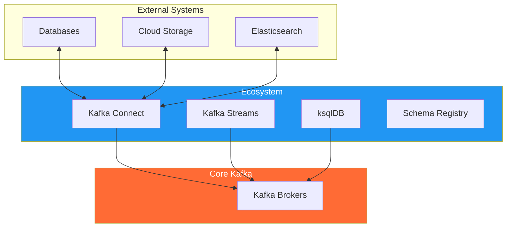

### Kafka Connect

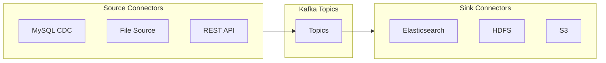

### Kafka Streams

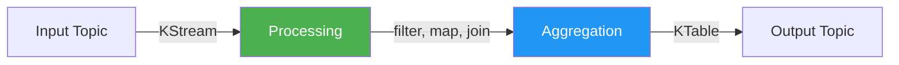

---

## Best Practices

### Production Checklist

| Category | Recommendation |
|----------|----------------|
| **Replication** | `replication.factor >= 3` |
| **ISR** | `min.insync.replicas = 2` |
| **Durability** | Producer: `acks = all` |
| **Partitions** | Start with `num.partitions >= broker count` |
| **Retention** | Set based on use case (don't over-retain) |
| **Monitoring** | Under-replicated partitions, Consumer lag |
| **Security** | TLS + SASL authentication |

### Partition Count Guidelines

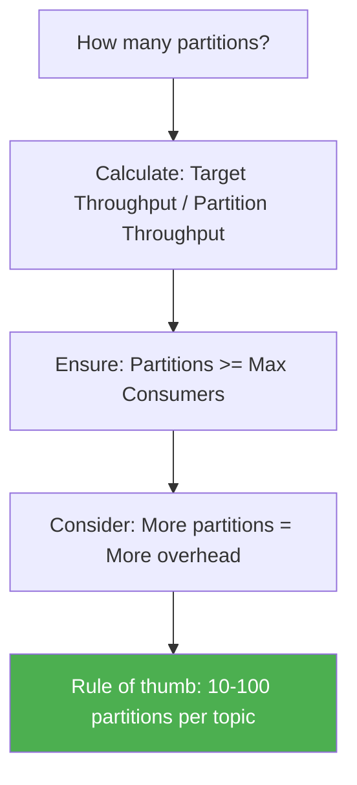

### Common Pitfalls

| Pitfall | Solution |
|---------|----------|
| Too many partitions | Start small, scale up |
| Consumer group rebalance storms | Use sticky assignor, increase session timeout |
| Uneven partition distribution | Use key-based partitioning carefully |
| Consumer lag growing | Scale consumers, optimize processing |
| Memory issues | Tune batch.size, buffer.memory |

---

## Monitoring Metrics

### Key Metrics to Watch

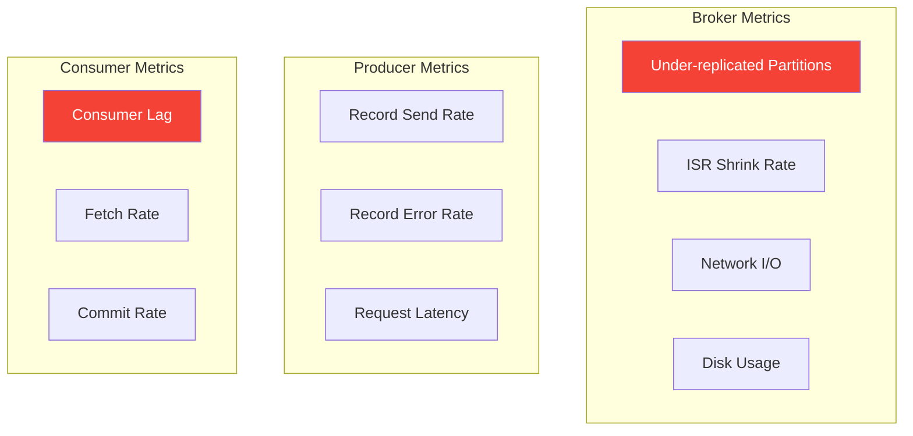

---

## Summary

| Component | Key Insight |
|-----------|-------------|
| **Broker** | Request handling → Log Manager → Storage |
| **Replication** | ISR model, High Watermark for consistency |
| **Storage** | Append-only logs, segment files, indexes |
| **Performance** | Zero-copy, batching, compression |
| **Ecosystem** | Connect for integration, Streams for processing |

---

**Back to:** [📘 Kafka Fundamentals](./kafka-fundamentals.md) | [🚀 Learning Hub](./kafka-deep-dive.md)

---

## 📚 Resources

- [Kafka Architecture Deep Dive](https://developer.confluent.io/learn-kafka/)
- [Kafka Internals](https://kafka.apache.org/documentation/#design)
- [Kafka Performance Tuning](https://kafka.apache.org/documentation/#producerconfigs)
