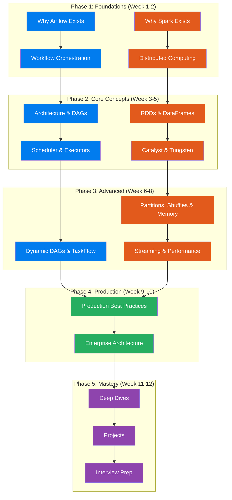

# 🚀 Learning Apache Airflow & Apache Spark — From Zero to Production Mastery

> **A comprehensive, visual, hands-on learning repository for software engineers who want to deeply understand distributed data systems — not just use them.**

[](https://airflow.apache.org/)
[](https://spark.apache.org/)
[](https://python.org/)
[](https://opensource.org/licenses/MIT)

---

## 🎯 Who Is This For?

This repository is designed for **software engineers with 3+ years of experience** who want to:

- 🧠 **Deeply understand** how Airflow and Spark work internally — not just the API surface
- 🏗️ **Build production-grade** data pipelines that handle terabytes of data
- 🎤 **Crack senior/staff-level interviews** at top companies
- 🏢 **Design enterprise data platforms** that scale
- 🔧 **Debug and troubleshoot** production incidents like an expert

> **Philosophy:** We don't teach you to copy-paste. We teach you to **think in distributed systems**. Every concept is taught through intuition → internals → implementation → production reality.

---

## 🧭 How This Repository Is Structured

```
learning-airflow-spark/
│
├── 📖 README.md                          ← You are here
├── 🗺️ learning-roadmap.md                ← Your guided learning path
│
├── 🌬️ airflow/                           ← Apache Airflow deep-dive
│   ├── 01-why-airflow-exists.md          ← The problems Airflow solves
│   ├── 02-workflow-orchestration.md      ← Orchestration fundamentals
│   ├── 03-airflow-architecture.md        ← How Airflow is built
│   ├── 04-dags.md                        ← DAGs — the core abstraction
│   ├── 05-scheduler.md                   ← The brain of Airflow
│   ├── 06-executors.md                   ← How work gets distributed
│   ├── 07-operators.md                   ← Doing actual work
│   ├── 08-sensors.md                     ← Waiting for conditions
│   ├── 09-taskflow-api.md                ← Modern Airflow (2.x+)
│   ├── 10-dynamic-dags.md                ← Generating DAGs programmatically
│   ├── 11-dynamic-task-mapping.md        ← Runtime task generation
│   ├── 12-production-best-practices.md   ← Running Airflow in production
│   ├── 13-airflow-on-kubernetes.md       ← Airflow + K8s deep-dive
│   ├── 14-airflow-interview-guide.md     ← 100+ interview Q&A
│   └── airflow-cheatsheet.md             ← Quick reference
│
├── ⚡ spark/                              ← Apache Spark deep-dive
│   ├── 01-why-spark-exists.md            ← The evolution of big data
│   ├── 02-distributed-computing.md       ← Fundamentals of distribution
│   ├── 03-rdd-internals.md               ← RDD — Spark's foundation
│   ├── 04-dataframes.md                  ← Structured data processing
│   ├── 05-datasets.md                    ← Type-safe data processing
│   ├── 06-catalyst-optimizer.md          ← How Spark optimizes queries
│   ├── 07-tungsten-engine.md             ← How Spark manages memory
│   ├── 08-partitions.md                  ← Data distribution strategies
│   ├── 09-shuffles.md                    ← The most expensive operation
│   ├── 10-memory-management.md           ← Unified memory model
│   ├── 11-spark-execution-plan.md        ← From code to execution
│   ├── 12-spark-streaming.md             ← Real-time data processing
│   ├── 13-spark-performance-tuning.md    ← Making Spark fly
│   ├── 14-production-best-practices.md   ← Running Spark in production
│   ├── 15-spark-interview-guide.md       ← 100+ interview Q&A
│   └── spark-cheatsheet.md               ← Quick reference
│
├── 🏗️ projects/                           ← Hands-on projects
│   ├── project-1-batch-pipeline.md       ← Classic batch ETL
│   ├── project-2-airflow-spark-pipeline.md ← Orchestrated Spark jobs
│   ├── project-3-real-time-streaming.md  ← Streaming pipeline
│   └── project-4-enterprise-data-platform.md ← Full platform design
│
├── 🔬 deep-dives/                         ← Special deep-dive chapters
│   ├── airflow-scheduler-internals.md    ← Scheduler deep-dive
│   ├── spark-job-execution-internals.md  ← Job execution deep-dive
│   ├── data-skew-deep-dive.md            ← Data skew deep-dive
│   ├── spark-memory-deep-dive.md         ← Memory model deep-dive
│   ├── catalyst-optimizer-deep-dive.md   ← Catalyst deep-dive
│   ├── spark-shuffle-deep-dive.md        ← Shuffle deep-dive
│   ├── airflow-metadata-db-deep-dive.md  ← Metadata DB deep-dive
│   └── airflow-scaling-deep-dive.md      ← Scaling deep-dive
│
├── 🏢 enterprise-architecture/            ← Enterprise platform designs
│   ├── airflow-spark-s3-datalake.md      ← Data lake architecture
│   ├── airflow-spark-kafka.md            ← Event-driven architecture
│   ├── airflow-spark-aws.md              ← AWS-native architecture
│   └── airflow-spark-kubernetes.md       ← K8s-native architecture
│
└── 📊 diagrams/                           ← Additional visual resources
```

---

## 🧠 Learning Philosophy

This repository follows a deliberate pedagogical approach:


### Every Concept Answers These Questions:

| Question | Why It Matters |
|----------|---------------|
| **Why does this exist?** | Understanding motivation prevents cargo-culting |
| **What problem does it solve?** | Connects theory to real engineering pain |
| **How does it work internally?** | Enables debugging and optimization |
| **When should I use it?** | Prevents misapplication |
| **When should I avoid it?** | Equally important as knowing when to use it |
| **What are the failure modes?** | Production readiness |
| **How do top companies use it?** | Real-world validation |

---

## 📚 What Each Section Contains

Every topic file includes:

- 🎯 **Intuition & Motivation** — Simple explanation, the problem it solves
- 🌍 **Real-World Analogy** — A concrete metaphor that makes the concept click
- 📊 **Visual Diagrams** — Mermaid architecture, sequence, and flow diagrams
- 🔬 **Internals Deep Dive** — What classes, components, and data flows are involved
- 💻 **Code Examples** — Minimal → intermediate → production-grade
- 🏭 **Production Scenarios** — Real enterprise use cases
- ⚠️ **Common Mistakes** — What engineers get wrong
- 🚀 **Performance Considerations** — Bottlenecks and optimizations
- 🔧 **Troubleshooting Guide** — Symptoms → root cause → fix
- 🎤 **Interview Questions** — Beginner → intermediate → advanced with answers

---

## 🗺️ Recommended Learning Path

See the detailed [Learning Roadmap](learning-roadmap.md) for a week-by-week plan.

### Quick Overview:



---

## 🏆 After Completing This Repository

You will be able to:

- ✅ **Design** data pipelines that process billions of records daily
- ✅ **Debug** production incidents involving Spark OOM, data skew, and Airflow scheduling issues
- ✅ **Architect** enterprise data platforms on AWS/GCP/Azure
- ✅ **Answer** any Airflow or Spark interview question at the senior/staff level
- ✅ **Optimize** Spark jobs from hours to minutes
- ✅ **Scale** Airflow from 10 DAGs to 10,000 DAGs
- ✅ **Build** real-time streaming pipelines with exactly-once semantics
- ✅ **Understand** what happens at the code level when you submit a Spark job or trigger a DAG

---

## 📋 Prerequisites

| Prerequisite | Level Required | Why |
|---|---|---|
| Python | Intermediate | All examples use Python/PySpark |
| SQL | Basic-Intermediate | Spark SQL is heavily used |
| Linux CLI | Basic | Cluster management, debugging |
| Docker | Basic | Local development environments |
| Git | Basic | Version control for DAGs and code |

> **Note:** No prior Airflow or Spark knowledge is required. We build everything from first principles.

---

## 🚀 Getting Started

1. **Start with the [Learning Roadmap](learning-roadmap.md)** to understand your journey
2. **Begin with Airflow's** [01-why-airflow-exists.md](airflow/01-why-airflow-exists.md) or **Spark's** [01-why-spark-exists.md](spark/01-why-spark-exists.md)
3. **Follow the numbered files** in each directory — they build on each other
4. **Try the projects** once you've covered the core concepts
5. **Deep-dive chapters** when you want to go even deeper
6. **Interview guides** when preparing for interviews

---

## 🤝 Contributing

Found an error? Have a better analogy? Want to add a topic? Contributions are welcome!

---

## 📄 License

This repository is licensed under the MIT License. Feel free to use it for learning and teaching.

---

> *"The best engineers don't just know the API — they understand the machine."*
>
> — This Repository's Guiding Principle
