# Workflow Orchestration

> **"Orchestration is the art of making complex things look simple — by handling all the complexity behind the scenes."**

Now that you understand *why* Airflow exists, let's build a deep understanding of the concept it implements: **workflow orchestration**. This concept transcends any single tool — whether you use Airflow, Prefect, or Dagster, these fundamentals remain the same.

---

## Table of Contents

- [Orchestration vs. Execution](#orchestration-vs-execution)
- [Real-World Analogy: The Orchestra Conductor](#real-world-analogy-the-orchestra-conductor)
- [Orchestration Patterns](#orchestration-patterns)
- [DAG as a Concept](#dag-as-a-concept)
- [Idempotency: The Golden Rule](#idempotency-the-golden-rule)
- [Retry Logic](#retry-logic)
- [Dependency Management](#dependency-management)
- [Monitoring and Observability](#monitoring-and-observability)
- [Alerting Strategies](#alerting-strategies)
- [SLA Tracking](#sla-tracking)
- [Production Scenarios](#production-scenarios)
- [Troubleshooting](#troubleshooting)
- [Performance Considerations](#performance-considerations)
- [Common Mistakes](#common-mistakes)
- [Interview Questions](#interview-questions)

---

## Orchestration vs. Execution

This is the single most important concept to internalize. Get this wrong and you'll misuse every orchestration tool you touch.

### The Core Distinction

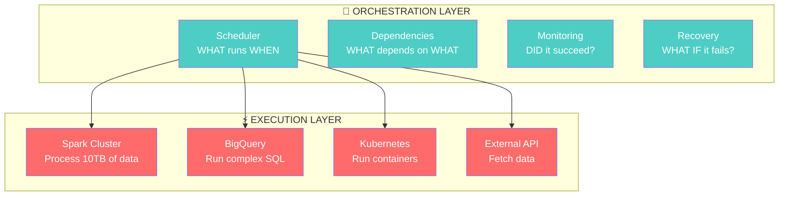

| Aspect | Orchestration | Execution |
|--------|--------------|-----------|
| **Question** | "When should this run?" | "How does this run?" |
| **Focus** | Coordination, sequencing, monitoring | Computing, transforming, loading |
| **Resource Usage** | Lightweight (metadata, state tracking) | Heavy (CPU, memory, I/O) |
| **Example** | "Run Spark job after data arrives" | "Process 10TB of click data" |
| **Tool** | Airflow, Prefect, Dagster | Spark, BigQuery, dbt, Kubernetes |
| **Failure** | "Task X didn't start" | "Task X ran but OOM'd" |

### Why This Matters

```python
# ❌ ANTI-PATTERN: Using the orchestrator as the executor
def process_data_in_airflow(**context):
    """This runs ON the Airflow worker — bad idea for big data."""
    import pandas as pd
    df = pd.read_parquet('s3://data/100GB_file.parquet')  # 100GB into worker memory!
    result = df.groupby('user_id').agg({'revenue': 'sum'})  # Worker crashes
    result.to_parquet('s3://data/output.parquet')

# ✅ CORRECT: Using the orchestrator to coordinate the executor
def trigger_spark_job(**context):
    """This tells Spark to do the heavy lifting."""
    from airflow.providers.apache.spark.operators.spark_submit import SparkSubmitOperator
    # Airflow just sends a request to Spark, then monitors completion
    # The actual data processing happens on the Spark cluster
```

> **💡 Analogy:** A restaurant manager (orchestrator) doesn't cook the food (execute). They decide which orders go to which chef, in what sequence, and handle complaints. A manager who starts cooking is a manager who can't manage.

---

## Real-World Analogy: The Orchestra Conductor

> Imagine a symphony orchestra performing Beethoven's 9th. 80 musicians, 4 movements, 70 minutes.

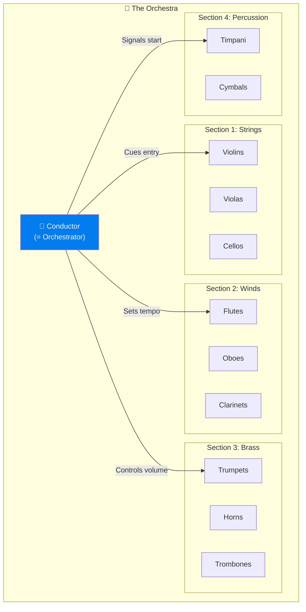

### The Mapping

| Orchestra Concept | Orchestration Equivalent |
|------------------|------------------------|
| **Conductor** | Scheduler / Orchestration engine |
| **Musical Score** | DAG (workflow definition) |
| **Musicians** | Workers / Executors |
| **Instruments** | Tools (Spark, BigQuery, APIs) |
| **Measures & Beats** | Schedule & timing |
| **"Violins enter at measure 42"** | Task dependency |
| **"Strings play first, then brass joins"** | Sequential execution |
| **"All strings play simultaneously"** | Parallel execution |
| **"If forte, add cymbals"** | Conditional branching |
| **Conductor's baton cue** | Task trigger |
| **"Violins, you're flat — restart from measure 30"** | Retry from failure point |
| **Rehearsal** | DAG testing |
| **Concert performance** | Production run |
| **"We must finish in 70 minutes"** | SLA |
| **Music critic's review** | Monitoring & alerting |

### Key Insight from this Analogy

The conductor doesn't play a single instrument. They don't know *how* to produce a violin's sound. But they know **when** each instrument should play, **how loud**, and **what happens if someone makes a mistake**.

That's orchestration.

> **⚠️ Warning:** If your conductor (Airflow) starts playing the violin (processing data), they can't conduct anymore. This is the #1 architectural mistake in Airflow deployments.

---

## Orchestration Patterns

Every workflow, no matter how complex, is built from a few fundamental patterns.

### Pattern 1: Sequential Execution

The simplest pattern. Tasks run one after another.

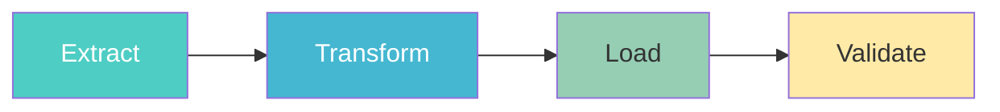

```python
from airflow import DAG
from airflow.operators.python import PythonOperator
from datetime import datetime

with DAG('sequential_pattern', start_date=datetime(2024, 1, 1), schedule='@daily') as dag:
    
    extract = PythonOperator(task_id='extract', python_callable=extract_fn)
    transform = PythonOperator(task_id='transform', python_callable=transform_fn)
    load = PythonOperator(task_id='load', python_callable=load_fn)
    validate = PythonOperator(task_id='validate', python_callable=validate_fn)
    
    extract >> transform >> load >> validate
```

**When to use:** When each step truly depends on the previous one's output.

**When to avoid:** When steps are independent — you're wasting time waiting unnecessarily.

### Pattern 2: Parallel Execution (Fan-Out)

Multiple tasks run simultaneously when they're independent.

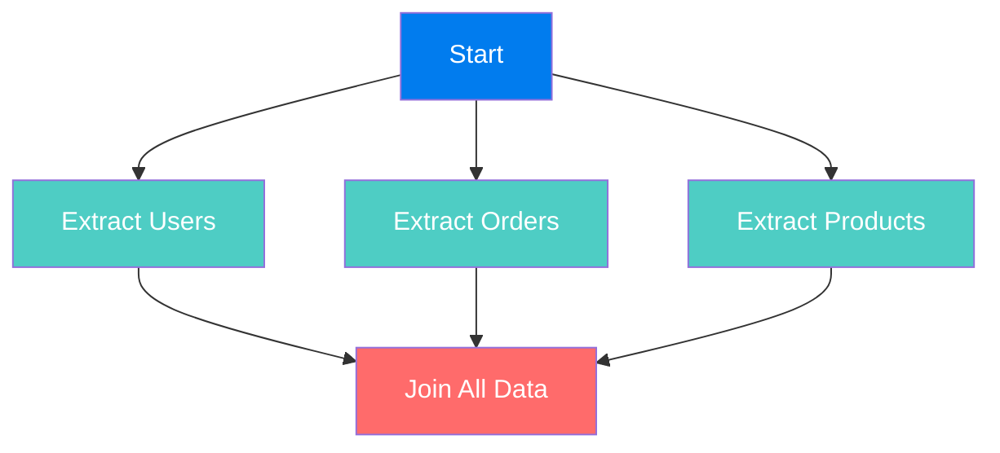

```python
with DAG('parallel_pattern', start_date=datetime(2024, 1, 1), schedule='@daily') as dag:
    
    extract_users = PythonOperator(task_id='extract_users', python_callable=extract_users_fn)
    extract_orders = PythonOperator(task_id='extract_orders', python_callable=extract_orders_fn)
    extract_products = PythonOperator(task_id='extract_products', python_callable=extract_products_fn)
    
    join_data = PythonOperator(task_id='join_data', python_callable=join_fn)
    
    # Fan-out: all extracts run in parallel
    # Fan-in: join waits for ALL extracts
    [extract_users, extract_orders, extract_products] >> join_data
```

**When to use:** Independent data sources, independent API calls, independent transformations.

**Performance impact:** If each extract takes 10 minutes sequentially = 30 minutes total. In parallel = 10 minutes total. That's a 3x speedup.

### Pattern 3: Conditional Execution (Branching)

Different paths are taken based on runtime conditions.

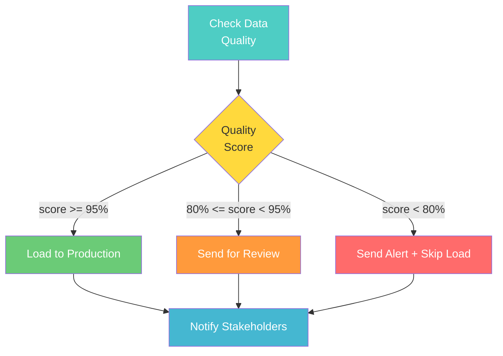

```python
from airflow.operators.python import BranchPythonOperator

def decide_branch(**context):
    quality_score = context['ti'].xcom_pull(task_ids='check_quality')
    if quality_score >= 95:
        return 'load_to_production'
    elif quality_score >= 80:
        return 'send_for_review'
    else:
        return 'send_alert'

with DAG('branching_pattern', start_date=datetime(2024, 1, 1), schedule='@daily') as dag:
    
    check_quality = PythonOperator(
        task_id='check_quality', 
        python_callable=calculate_quality_score,
    )
    
    branch = BranchPythonOperator(
        task_id='branch_on_quality',
        python_callable=decide_branch,
    )
    
    load_prod = PythonOperator(task_id='load_to_production', python_callable=load_prod_fn)
    send_review = PythonOperator(task_id='send_for_review', python_callable=review_fn)
    send_alert = PythonOperator(task_id='send_alert', python_callable=alert_fn)
    
    # Note: in branching, trigger_rule must handle skipped tasks
    notify = PythonOperator(
        task_id='notify',
        python_callable=notify_fn,
        trigger_rule='none_failed_min_one_success',  # Important!
    )
    
    check_quality >> branch
    branch >> [load_prod, send_review, send_alert]
    [load_prod, send_review, send_alert] >> notify
```

### Pattern 4: Dynamic Task Generation

Tasks are created based on runtime data (e.g., a list of tables, a list of customers).

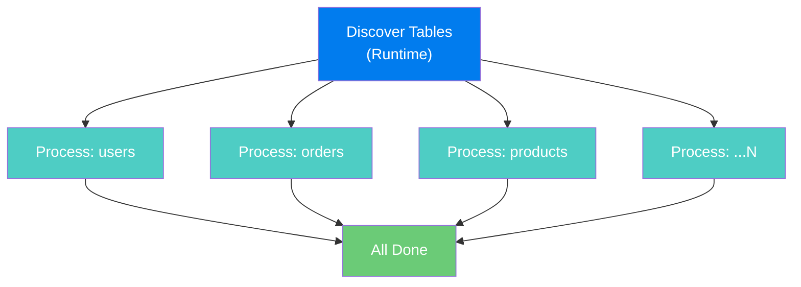

```python
# Static dynamic generation (determined at DAG parse time)
tables = ['users', 'orders', 'products', 'payments', 'sessions']

with DAG('dynamic_static_pattern', start_date=datetime(2024, 1, 1), schedule='@daily') as dag:
    
    start = PythonOperator(task_id='start', python_callable=lambda: print("Starting"))
    end = PythonOperator(task_id='end', python_callable=lambda: print("Done"))
    
    for table in tables:
        process = PythonOperator(
            task_id=f'process_{table}',
            python_callable=process_table,
            op_args=[table],
        )
        start >> process >> end
```

```python
# True dynamic task mapping (Airflow 2.3+ - determined at runtime)
from airflow.decorators import dag, task

@dag(start_date=datetime(2024, 1, 1), schedule='@daily')
def dynamic_runtime_pattern():
    
    @task
    def get_tables():
        """This runs first and returns a list — determined at RUNTIME."""
        return ['users', 'orders', 'products']
    
    @task
    def process_table(table_name: str):
        print(f"Processing {table_name}")
    
    @task
    def finalize(results):
        print(f"Processed {len(results)} tables")
    
    tables = get_tables()
    processed = process_table.expand(table_name=tables)  # Dynamic mapping!
    finalize(processed)

dynamic_runtime_pattern()
```

### Pattern 5: Sub-DAG / Task Group Pattern

Organizing complex workflows into logical groups.

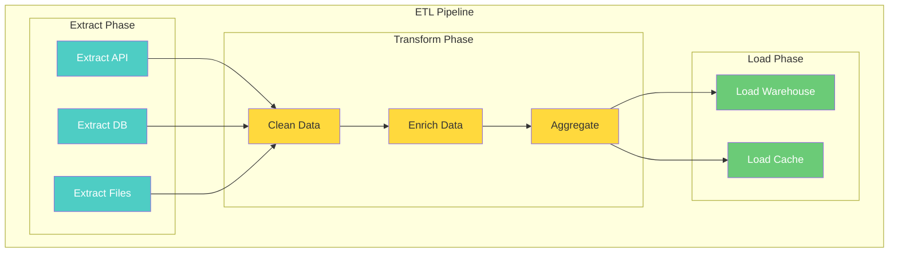

```python
from airflow.utils.task_group import TaskGroup

with DAG('task_group_pattern', start_date=datetime(2024, 1, 1), schedule='@daily') as dag:
    
    with TaskGroup('extract') as extract_group:
        extract_api = PythonOperator(task_id='api', python_callable=extract_api_fn)
        extract_db = PythonOperator(task_id='database', python_callable=extract_db_fn)
        extract_files = PythonOperator(task_id='files', python_callable=extract_files_fn)
    
    with TaskGroup('transform') as transform_group:
        clean = PythonOperator(task_id='clean', python_callable=clean_fn)
        enrich = PythonOperator(task_id='enrich', python_callable=enrich_fn)
        aggregate = PythonOperator(task_id='aggregate', python_callable=agg_fn)
        clean >> enrich >> aggregate
    
    with TaskGroup('load') as load_group:
        load_warehouse = PythonOperator(task_id='warehouse', python_callable=load_wh_fn)
        load_cache = PythonOperator(task_id='cache', python_callable=load_cache_fn)
    
    extract_group >> transform_group >> load_group
```

### Pattern Summary

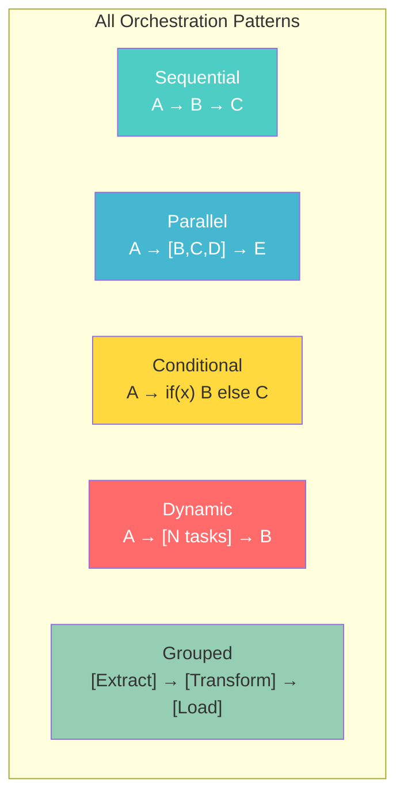

---

## DAG as a Concept

Before Airflow's DAG, there's graph theory's DAG. Let's build the intuition from first principles.

### Graph Theory Basics

A **graph** is simply a set of **nodes** (vertices) connected by **edges** (arrows or lines).

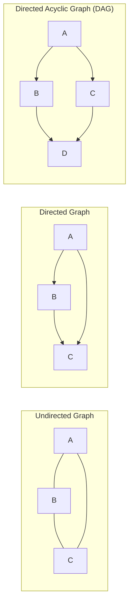

### Why "Directed"?

**Directed** means the edges have a direction — an arrow points from one node to another. In workflow terms:

- `A → B` means "A must complete before B starts"
- The direction encodes **dependency** and **order**

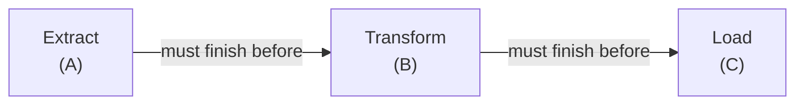

### Why "Acyclic"?

**Acyclic** means no cycles — you can never follow the arrows and end up back where you started.

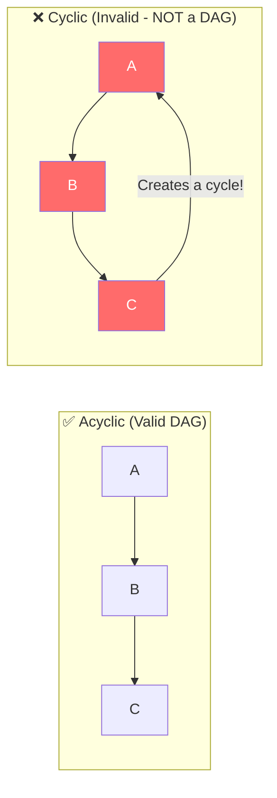

**Why no cycles?** Because a cycle creates an infinite loop:
- A depends on C completing
- C depends on B completing
- B depends on A completing
- → Deadlock! Nothing can ever start.

> **💡 Key Insight:** The "acyclic" constraint isn't arbitrary — it's **mathematically necessary** for any finite workflow to be executable. If you think you need a cycle, what you actually need is a **loop with a termination condition**, which in Airflow is typically modeled as a separate scheduled DAG.

### DAG Properties

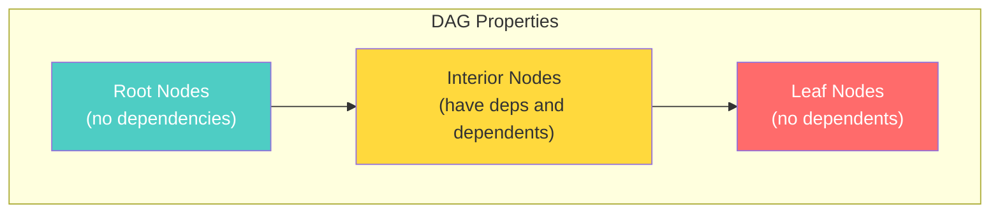

| Property | Definition | Workflow Meaning |
|----------|-----------|-----------------|
| **Root nodes** | Nodes with no incoming edges | Tasks with no dependencies (can start immediately) |
| **Leaf nodes** | Nodes with no outgoing edges | Terminal tasks (pipeline ends here) |
| **Depth** | Longest path from root to leaf | Maximum sequential execution time |
| **Width** | Maximum number of nodes at any level | Maximum parallelism needed |
| **Topological order** | An ordering where all dependencies come first | Valid execution order |

### Topological Sort: How the Scheduler Decides Order

Given a DAG, there may be multiple valid execution orders. The scheduler uses **topological sorting** to find one.

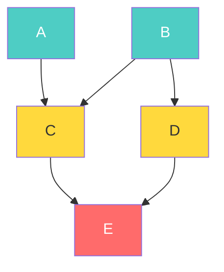

Valid topological orders for this DAG:
- `A, B, C, D, E` ✅
- `B, A, C, D, E` ✅
- `B, D, A, C, E` ✅
- `A, B, D, C, E` ✅
- `C, A, B, D, E` ❌ (C depends on A and B)

The scheduler picks the order that maximizes **parallelism** — running A and B simultaneously, then C and D simultaneously, then E.

---

## Idempotency: The Golden Rule

> **An idempotent operation produces the same result regardless of how many times you execute it.**

This is the single most important design principle for reliable workflows.

### Why Idempotency Matters

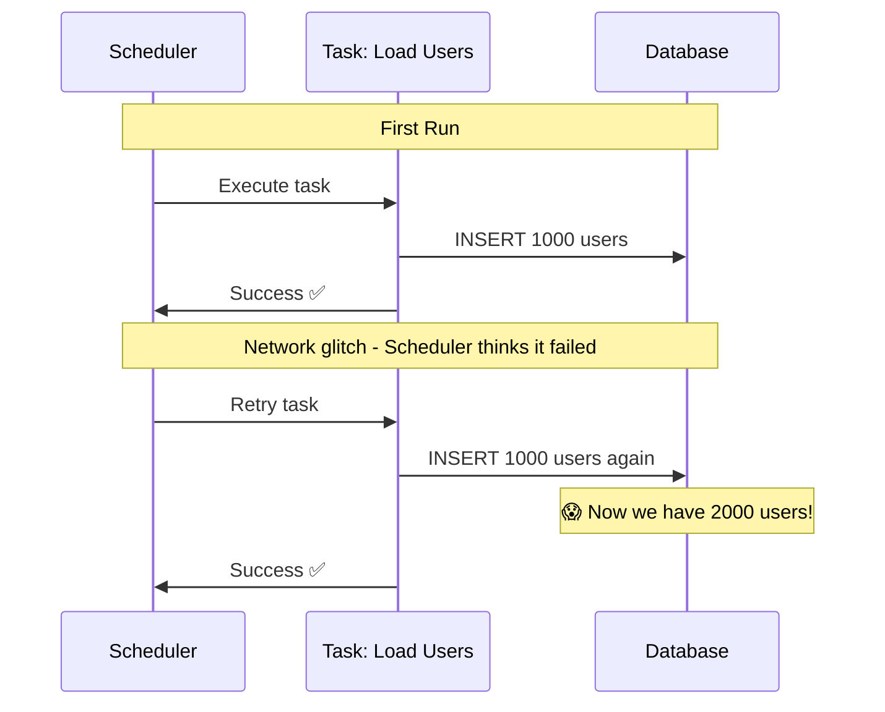

Without idempotency, that retry just created **1000 duplicate users**.

### Making Operations Idempotent

```python
# ❌ NOT IDEMPOTENT - Appends on every run
def load_users_bad(ds, **context):
    users = extract_users(ds)
    db.execute("INSERT INTO users (id, name, email) VALUES (%s, %s, %s)", users)
    # Running twice = double the data!

# ✅ IDEMPOTENT - Delete-then-insert pattern
def load_users_good(ds, **context):
    users = extract_users(ds)
    db.execute("DELETE FROM users WHERE load_date = %s", ds)
    db.execute("INSERT INTO users (id, name, email, load_date) VALUES (%s, %s, %s, %s)", users)
    # Running twice = same result

# ✅ IDEMPOTENT - MERGE/UPSERT pattern
def load_users_upsert(ds, **context):
    users = extract_users(ds)
    db.execute("""
        MERGE INTO users AS target
        USING staging_users AS source
        ON target.id = source.id
        WHEN MATCHED THEN UPDATE SET name = source.name, email = source.email
        WHEN NOT MATCHED THEN INSERT (id, name, email) VALUES (source.id, source.name, source.email)
    """)

# ✅ IDEMPOTENT - Overwrite partition
def load_users_partition(ds, **context):
    spark.sql(f"""
        INSERT OVERWRITE TABLE users PARTITION (dt = '{ds}')
        SELECT * FROM staging_users WHERE dt = '{ds}'
    """)
    # Overwrite makes it inherently idempotent
```

### The Idempotency Checklist

| Operation | Idempotent? | Fix |
|-----------|-------------|-----|
| `INSERT INTO table ...` | ❌ No | Use `INSERT OVERWRITE` or delete first |
| `CREATE TABLE IF NOT EXISTS` | ✅ Yes | Already idempotent |
| `DROP TABLE; CREATE TABLE` | ✅ Yes | Recreates from scratch |
| `POST /api/create-order` | ❌ No | Use idempotency keys |
| `PUT /api/update-order/123` | ✅ Yes | PUT is inherently idempotent |
| `send_email(to, subject, body)` | ❌ No | Check if already sent, or accept duplicates |
| `COPY INTO table FROM s3://...` | ❌ No | Add `FORCE = TRUE` with partition overwrite |
| `boto3.s3.put_object(...)` | ✅ Yes | Overwrites same key |

---

## Retry Logic

> **Every system fails. Good systems fail gracefully.**

### The Retry Decision Tree

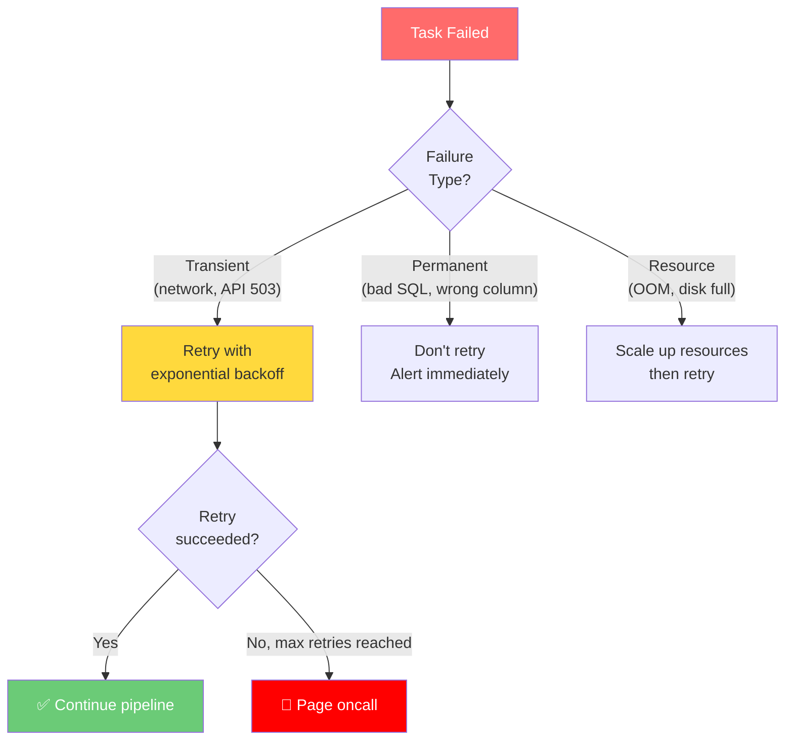

### Retry Strategies

#### Fixed Delay

```python
task = PythonOperator(
    task_id='call_api',
    python_callable=call_api,
    retries=3,
    retry_delay=timedelta(minutes=5),
    # Retry pattern: fail → wait 5m → retry → wait 5m → retry → wait 5m → retry → FAIL
)
```

#### Exponential Backoff

```python
task = PythonOperator(
    task_id='call_api',
    python_callable=call_api,
    retries=5,
    retry_delay=timedelta(minutes=1),
    retry_exponential_backoff=True,
    max_retry_delay=timedelta(hours=1),
    # Retry pattern: fail → wait 1m → retry → wait 2m → retry → wait 4m → ...
    # But never wait more than 1 hour
)
```

> **💡 Why Exponential Backoff?** If an API is overloaded and returning 503s, hammering it every 5 minutes makes the problem worse. Exponential backoff gives the system progressively more time to recover. It's also polite — you're not DDoSing your own dependencies.

#### Custom Retry Logic

```python
def should_retry(exception):
    """Only retry on transient errors, not on data errors."""
    if isinstance(exception, requests.exceptions.ConnectionError):
        return True
    if isinstance(exception, requests.exceptions.HTTPError):
        return exception.response.status_code in [429, 500, 502, 503, 504]
    return False

task = PythonOperator(
    task_id='call_api',
    python_callable=call_api,
    retries=3,
    retry_delay=timedelta(minutes=5),
    # In Airflow 2.x, you can use on_retry_callback for custom logic
    on_retry_callback=log_retry_with_context,
)
```

### Retry Anti-Patterns

```python
# ❌ ANTI-PATTERN: Retrying non-idempotent operations
task = PythonOperator(
    task_id='send_payment',
    python_callable=send_payment,  # Retrying this charges the customer twice!
    retries=3,  # DANGER!
)

# ❌ ANTI-PATTERN: Too many retries
task = PythonOperator(
    task_id='call_api',
    python_callable=call_api,
    retries=100,  # If it didn't work after 5 tries, it won't work after 100
    retry_delay=timedelta(seconds=10),  # And now you're DDoSing the API
)

# ❌ ANTI-PATTERN: No retry on inherently flaky operations
task = PythonOperator(
    task_id='query_external_db',
    python_callable=query_partner_db,
    retries=0,  # Partner DB has 99.5% uptime — you WILL see failures
)
```

---

## Dependency Management

### Types of Dependencies

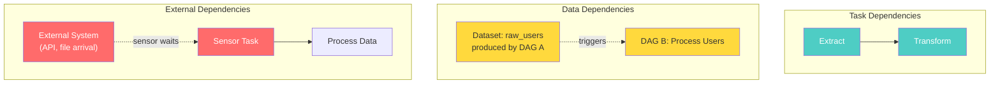

### Trigger Rules

Trigger rules define **when** a task should execute based on the state of its upstream dependencies.

```python
from airflow.utils.trigger_rule import TriggerRule

# Default: ALL upstream tasks must succeed
task_a = PythonOperator(
    task_id='normal_task',
    trigger_rule=TriggerRule.ALL_SUCCESS,  # This is the default
)

# Run even if some upstream tasks failed
cleanup = PythonOperator(
    task_id='cleanup',
    trigger_rule=TriggerRule.ALL_DONE,  # Run no matter what
)

# Run only if at least one upstream succeeded
notification = PythonOperator(
    task_id='notify',
    trigger_rule=TriggerRule.NONE_FAILED_MIN_ONE_SUCCESS,
)

# Run only if all upstream failed (escalation)
escalate = PythonOperator(
    task_id='escalate',
    trigger_rule=TriggerRule.ALL_FAILED,
)
```

| Trigger Rule | Behavior | Use Case |
|-------------|----------|----------|
| `ALL_SUCCESS` | All parents succeeded (default) | Normal dependency |
| `ALL_FAILED` | All parents failed | Escalation alert |
| `ALL_DONE` | All parents completed (success or failure) | Cleanup tasks |
| `ONE_SUCCESS` | At least one parent succeeded | Optimistic continuation |
| `ONE_FAILED` | At least one parent failed | Early alert |
| `NONE_FAILED` | No parent failed (allows skipped) | Branching join |
| `NONE_FAILED_MIN_ONE_SUCCESS` | No failure, at least one success | Common branch join |
| `NONE_SKIPPED` | No parent was skipped | Strict execution |
| `ALWAYS` | Run regardless of parent state | Logging, metrics |

### Cross-DAG Dependencies

```python
from airflow.sensors.external_task import ExternalTaskSensor

with DAG('downstream_dag', start_date=datetime(2024, 1, 1), schedule='@daily') as dag:
    
    wait_for_upstream = ExternalTaskSensor(
        task_id='wait_for_data_pipeline',
        external_dag_id='upstream_data_pipeline',
        external_task_id='final_validation',
        timeout=3600,  # Wait up to 1 hour
        poke_interval=60,  # Check every minute
        mode='reschedule',  # Free up worker slot while waiting
    )
    
    process = PythonOperator(
        task_id='process_data',
        python_callable=process_fn,
    )
    
    wait_for_upstream >> process
```

### Data-Aware Dependencies (Airflow 2.4+)

```python
from airflow.datasets import Dataset

# Producer DAG
user_data = Dataset('s3://bucket/users/')

with DAG('producer_dag', schedule='@daily', ...) as dag:
    produce = PythonOperator(
        task_id='produce_users',
        python_callable=produce_users,
        outlets=[user_data],  # This task produces this dataset
    )

# Consumer DAG - triggered when dataset is updated
with DAG('consumer_dag', schedule=[user_data], ...) as dag:
    consume = PythonOperator(
        task_id='consume_users',
        python_callable=consume_users,
    )
```

---

## Monitoring and Observability

### The Three Pillars

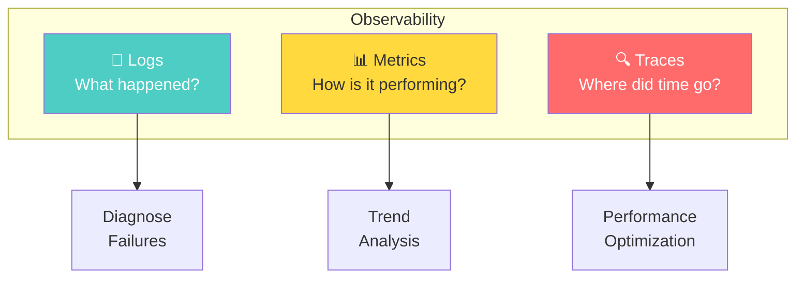

### What to Monitor in Airflow

| Metric | What It Tells You | Alert Threshold |
|--------|-------------------|-----------------|
| **DAG run duration** | Is the pipeline getting slower? | > 2x historical average |
| **Task failure rate** | Is something systematically broken? | > 5% failure rate |
| **Scheduler heartbeat** | Is the scheduler alive? | Missing for > 60 seconds |
| **Queue depth** | Are tasks backing up? | > 100 queued tasks |
| **Worker utilization** | Do you need more workers? | > 80% for extended periods |
| **DAG parsing time** | Are DAG files too complex? | > 30 seconds |
| **Database connections** | Is the metadata DB overloaded? | > 80% of pool |

### Implementing Monitoring

```python
from airflow import DAG
from airflow.operators.python import PythonOperator
from datetime import datetime, timedelta
import time

def monitor_task_duration(**context):
    """Track task duration and alert if it exceeds threshold."""
    start_time = time.time()
    
    # ... your actual task logic ...
    result = perform_heavy_computation()
    
    duration = time.time() - start_time
    
    # Push duration as metric
    context['ti'].xcom_push(key='duration_seconds', value=duration)
    
    if duration > 3600:  # More than 1 hour
        send_alert(
            channel='#data-oncall',
            message=f"⚠️ Task {context['task_instance'].task_id} took {duration/60:.1f} minutes"
        )
    
    return result

# DAG-level monitoring with callbacks
def dag_success_callback(context):
    """Called when the entire DAG run succeeds."""
    dag_run = context['dag_run']
    duration = (dag_run.end_date - dag_run.start_date).total_seconds()
    push_metric('dag_duration_seconds', duration, tags={'dag_id': dag_run.dag_id})

def dag_failure_callback(context):
    """Called when any task in the DAG fails (after retries exhausted)."""
    send_pagerduty_alert(
        severity='critical',
        summary=f"DAG {context['dag_run'].dag_id} failed",
    )

with DAG(
    'monitored_pipeline',
    start_date=datetime(2024, 1, 1),
    schedule='@daily',
    on_success_callback=dag_success_callback,
    on_failure_callback=dag_failure_callback,
) as dag:
    ...
```

---

## Alerting Strategies

### The Alerting Pyramid

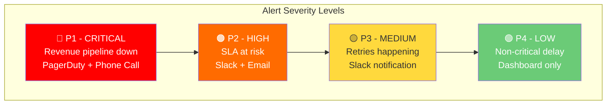

### Production Alerting Setup

```python
import requests

def slack_alert(context):
    """Send a Slack alert on task failure."""
    task_instance = context.get('task_instance')
    dag_id = task_instance.dag_id
    task_id = task_instance.task_id
    execution_date = context.get('execution_date')
    log_url = task_instance.log_url
    exception = context.get('exception', 'Unknown')
    
    # Determine severity based on DAG tags
    dag = context['dag']
    is_critical = 'critical' in (dag.tags or [])
    
    emoji = "🔴" if is_critical else "🟡"
    channel = "#data-oncall" if is_critical else "#data-alerts"
    
    payload = {
        "channel": channel,
        "blocks": [
            {
                "type": "header",
                "text": {"type": "plain_text", "text": f"{emoji} Airflow Task Failed"}
            },
            {
                "type": "section",
                "fields": [
                    {"type": "mrkdwn", "text": f"*DAG:* `{dag_id}`"},
                    {"type": "mrkdwn", "text": f"*Task:* `{task_id}`"},
                    {"type": "mrkdwn", "text": f"*Date:* `{execution_date}`"},
                    {"type": "mrkdwn", "text": f"*Error:* `{str(exception)[:200]}`"},
                ]
            },
            {
                "type": "actions",
                "elements": [
                    {
                        "type": "button",
                        "text": {"type": "plain_text", "text": "📋 View Logs"},
                        "url": log_url,
                    }
                ]
            }
        ]
    }
    
    requests.post(SLACK_WEBHOOK_URL, json=payload)
    
    # Escalate critical failures to PagerDuty
    if is_critical:
        trigger_pagerduty(dag_id, task_id, str(exception))
```

---

## SLA Tracking

### What Are SLAs in Airflow?

An **SLA** (Service Level Agreement) defines the maximum time a task should take to complete after the DAG run's scheduled time.

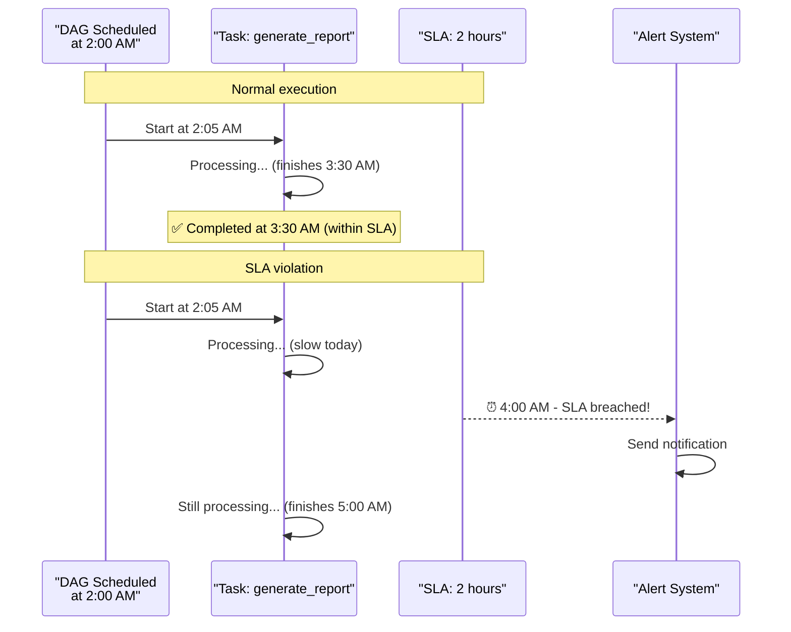

### Implementation

```python
def sla_miss_callback(dag, task_list, blocking_task_list, slas, blocking_tis):
    """Called when any task misses its SLA."""
    for task in task_list:
        send_alert(
            channel='#data-sla',
            message=f"⏰ SLA MISS: Task {task.task_id} in DAG {dag.dag_id} "
                    f"missed its SLA. Blocking tasks: {blocking_task_list}"
        )

with DAG(
    'sla_tracked_pipeline',
    start_date=datetime(2024, 1, 1),
    schedule='0 2 * * *',
    sla_miss_callback=sla_miss_callback,
) as dag:
    
    extract = PythonOperator(
        task_id='extract',
        python_callable=extract_fn,
        sla=timedelta(minutes=30),  # Must complete within 30 min of schedule time
    )
    
    transform = PythonOperator(
        task_id='transform',
        python_callable=transform_fn,
        sla=timedelta(hours=1),  # Must complete within 1 hour of schedule time
    )
    
    # The critical report MUST be ready by 4 AM (2 hours after schedule)
    report = PythonOperator(
        task_id='generate_report',
        python_callable=generate_report_fn,
        sla=timedelta(hours=2),
    )
    
    extract >> transform >> report
```

> **⚠️ Important:** SLA in Airflow is measured from the **DAG run's scheduled time**, not from when the task starts executing. So if the DAG is scheduled at 2 AM but a task doesn't start until 3:30 AM (because upstream took long), the SLA clock has already been ticking for 1.5 hours.

---

## Production Scenarios

### Scenario 1: Multi-Region Data Synchronization

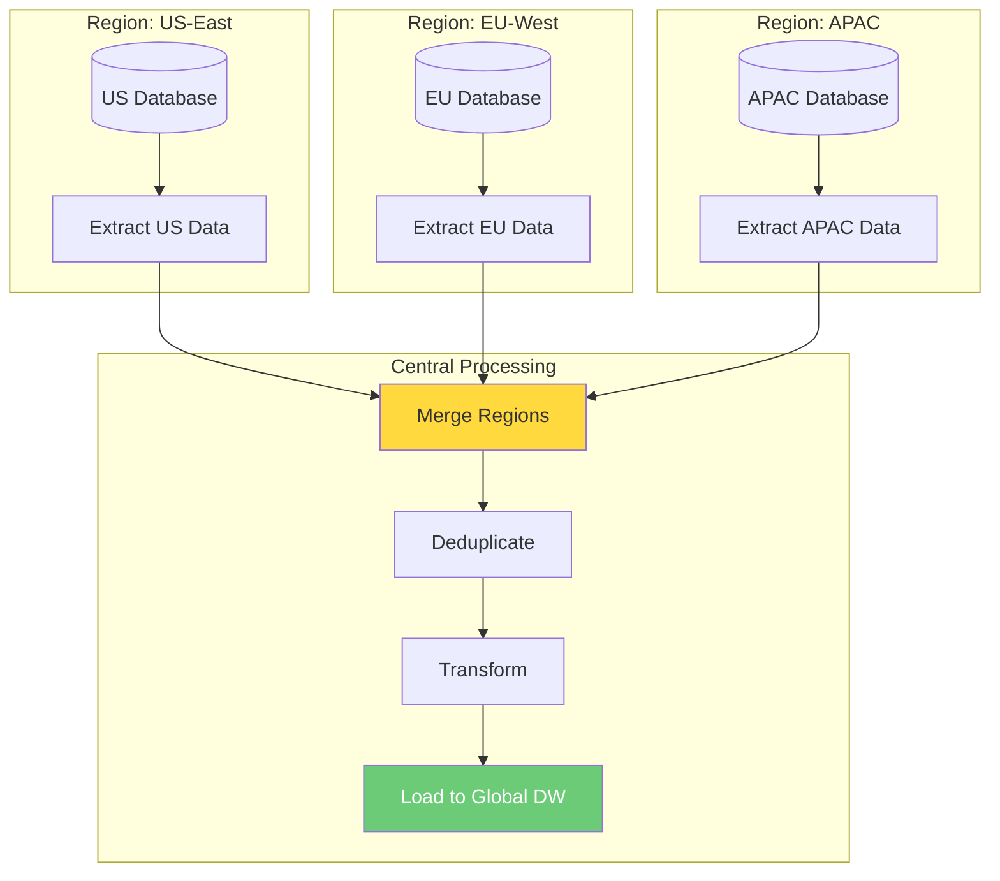

```python
regions = ['us-east', 'eu-west', 'apac']

with DAG('global_data_sync', schedule='@daily', ...) as dag:
    
    extract_tasks = []
    for region in regions:
        extract = PythonOperator(
            task_id=f'extract_{region.replace("-", "_")}',
            python_callable=extract_from_region,
            op_args=[region],
            execution_timeout=timedelta(hours=1),
            retries=3,
        )
        extract_tasks.append(extract)
    
    merge = PythonOperator(task_id='merge_regions', python_callable=merge_fn)
    dedupe = PythonOperator(task_id='deduplicate', python_callable=dedupe_fn)
    transform = PythonOperator(task_id='transform', python_callable=transform_fn)
    load = PythonOperator(task_id='load_global_dw', python_callable=load_fn)
    
    extract_tasks >> merge >> dedupe >> transform >> load
```

### Scenario 2: Event-Driven Pipeline with Sensors

```python
from airflow.providers.amazon.aws.sensors.s3 import S3KeySensor

with DAG('event_driven_pipeline', schedule='@daily', ...) as dag:
    
    # Wait for file to appear in S3
    wait_for_data = S3KeySensor(
        task_id='wait_for_data_file',
        bucket_name='data-lake',
        bucket_key='incoming/{{ ds }}/transactions.parquet',
        aws_conn_id='aws_default',
        timeout=3600 * 6,  # Wait up to 6 hours
        poke_interval=300,  # Check every 5 minutes
        mode='reschedule',  # Release worker slot while waiting
    )
    
    validate = PythonOperator(task_id='validate', python_callable=validate_fn)
    process = PythonOperator(task_id='process', python_callable=process_fn)
    
    wait_for_data >> validate >> process
```

---

## Troubleshooting

### Common Orchestration Issues

| Problem | Symptom | Root Cause | Fix |
|---------|---------|-----------|-----|
| **Deadlock** | Tasks stuck in "queued" forever | Circular dependency or pool exhaustion | Check pool slots, check for hidden circular deps |
| **Cascade failure** | One task failure stops entire pipeline | Overly strict trigger rules | Use `ALL_DONE` for cleanup tasks |
| **Resource starvation** | Tasks wait too long in queue | Too many concurrent DAGs | Set `max_active_runs`, `max_active_tasks` |
| **Data race** | Inconsistent data after parallel tasks | Parallel tasks modifying same resource | Use locks or redesign to partition |
| **SLA breach** | Pipeline takes longer than expected | Upstream delays compound | Add buffers to SLAs, optimize critical path |
| **Backfill storm** | System overwhelmed during backfill | Too many parallel backfill runs | Limit `max_active_runs` during backfill |

### Diagnosing a Stuck Pipeline

```mermaid
graph TD
    STUCK["Pipeline stuck"] --> CHECK1{"Tasks in<br/>'scheduled' state?"}
    CHECK1 -->|Yes| SCHED["Scheduler issue<br/>Check: airflow scheduler status"]
    CHECK1 -->|No| CHECK2{"Tasks in<br/>'queued' state?"}
    CHECK2 -->|Yes| EXEC["Executor issue<br/>Check: worker availability, pool slots"]
    CHECK2 -->|No| CHECK3{"Tasks in<br/>'up_for_retry' state?"}
    CHECK3 -->|Yes| RETRY["Transient failure<br/>Check: task logs, external deps"]
    CHECK3 -->|No| CHECK4{"Tasks in<br/>'deferred' state?"}
    CHECK4 -->|Yes| TRIGGER["Triggerer issue<br/>Check: triggerer service"]
    CHECK4 -->|No| OTHER["Check: DAG parsing, DB connectivity"]
    
    style STUCK fill:#ff6b6b,color:#fff
```

---

## Performance Considerations

### Pipeline Performance Optimization

```mermaid
graph LR
    subgraph "Bottleneck Identification"
        CRITICAL["Critical Path<br/>(longest sequential chain)"]
        PARALLEL["Parallelization<br/>Opportunities"]
        EXTERNAL["External System<br/>Wait Times"]
    end
    
    CRITICAL --> OPT1["Optimize tasks on critical path first"]
    PARALLEL --> OPT2["Fan-out independent tasks"]
    EXTERNAL --> OPT3["Use sensors in reschedule mode"]
    
    style CRITICAL fill:#ff6b6b,color:#fff
    style PARALLEL fill:#ffd93d,color:#333
    style EXTERNAL fill:#4ecdc4,color:#fff
```

### Key Performance Principles

1. **Optimize the critical path first** — The longest sequential chain determines your minimum runtime
2. **Maximize parallelism** — Independent tasks should fan-out
3. **Use `mode='reschedule'` for sensors** — Don't waste worker slots waiting
4. **Right-size your tasks** — Too granular = scheduling overhead; too large = no partial retries
5. **Avoid heavy computation in Airflow** — Use external compute (Spark, BigQuery)

```python
# ❌ SLOW: Sequential when parallel is possible
extract_a >> extract_b >> extract_c >> join  # 30 minutes

# ✅ FAST: Parallel extraction
[extract_a, extract_b, extract_c] >> join     # 10 minutes
```

---

## Common Mistakes

### Mistake 1: Confusing Orchestration with Data Processing

> If your Airflow task is processing GBs of data in memory, you're doing it wrong. Airflow should **trigger** the processing, not **perform** it.

### Mistake 2: Too Fine-Grained Tasks

```python
# ❌ Overly granular - scheduling overhead per task
read_file >> parse_header >> parse_row_1 >> parse_row_2 >> ... >> write_output

# ✅ Right granularity
read_and_parse >> transform >> write_output
```

### Mistake 3: Too Coarse-Grained Tasks

```python
# ❌ One monolithic task - if anything fails, redo everything
def do_everything():
    extract()
    transform()
    validate()
    load()
    notify()

# ✅ Logical separation - partial retry is possible
extract >> transform >> validate >> load >> notify
```

### Mistake 4: Not Using Trigger Rules for Cleanup

```python
# ❌ Cleanup never runs if any task fails (default trigger rule is ALL_SUCCESS)
process >> cleanup  # cleanup skipped on failure!

# ✅ Cleanup always runs
cleanup = PythonOperator(
    task_id='cleanup_temp_files',
    python_callable=cleanup_fn,
    trigger_rule='all_done',  # Runs regardless of upstream success/failure
)
process >> cleanup
```

### Mistake 5: Not Designing for Backfills

```python
# ❌ Hardcoded dates - cannot backfill
def extract(**context):
    today = datetime.now().strftime('%Y-%m-%d')  # Always today!
    data = query(f"SELECT * FROM events WHERE date = '{today}'")

# ✅ Parameterized dates - backfill-friendly
def extract(**context):
    ds = context['ds']  # The logical execution date, respects backfills
    data = query(f"SELECT * FROM events WHERE date = '{ds}'")
```

---

## Interview Questions

### Beginner Level

**Q1: What is the difference between orchestration and execution in the context of data pipelines?**

> **A:** Orchestration is about **coordinating** the order, timing, and dependencies of tasks. Execution is about **performing** the actual computation. Airflow orchestrates — it decides when to run a Spark job, monitors its status, and handles retries. Spark executes — it processes the actual data. The orchestrator is lightweight; the executor is where heavy computation happens.

**Q2: What are the main orchestration patterns? Give an example for each.**

> **A:** (1) **Sequential**: ETL pipeline — extract then transform then load. (2) **Parallel**: Multiple independent data source extractions running simultaneously. (3) **Conditional/Branching**: Run different processing based on data quality scores. (4) **Dynamic**: Generating one task per table discovered at runtime. (5) **Grouped**: Organizing extract, transform, and load phases into task groups.

**Q3: What is idempotency and why does it matter?**

> **A:** An idempotent operation produces the same result regardless of how many times it's executed. It matters because Airflow will re-run tasks due to retries, manual clears, and backfills. Without idempotency, re-runs cause data duplication, incorrect aggregations, or duplicate side effects like charging a customer twice.

### Intermediate Level

**Q4: Explain trigger rules in Airflow. When would you use `ALL_DONE` vs `ALL_SUCCESS`?**

> **A:** Trigger rules determine when a task executes based on upstream task states. `ALL_SUCCESS` (default) runs only when all upstream tasks succeed — used for normal data processing flow. `ALL_DONE` runs regardless of upstream success/failure — used for cleanup tasks, notification tasks, or resource deallocation that must happen no matter what.

**Q5: What is the difference between a sensor in `poke` mode vs `reschedule` mode?**

> **A:** In `poke` mode, the sensor holds onto a worker slot and checks repeatedly (sleeping between checks). This wastes a worker slot for potentially hours. In `reschedule` mode, the sensor checks once, then releases the worker slot and reschedules itself for the next check. Use `reschedule` for long waits and `poke` for very short waits (< 1 minute) where rescheduling overhead isn't worth it.

**Q6: How would you design an idempotent data loading task?**

> **A:** Several approaches: (1) **Delete-and-insert**: Delete the partition/date range, then insert fresh data. (2) **MERGE/UPSERT**: Use the database's MERGE statement with a natural key. (3) **INSERT OVERWRITE**: For partition-based systems, overwrite the entire partition. (4) **Staging table pattern**: Write to a staging table, swap with production atomically. The key is that any approach must produce identical results whether run once or multiple times.

### Advanced Level

**Q7: You have a pipeline where Task A produces data, Tasks B and C process it in parallel, and Task D merges results. Task B is flaky (fails 10% of the time). Task C takes 2 hours. How would you design the retry strategy?**

> **A:** Task B: Set `retries=3` with `retry_exponential_backoff=True` and `retry_delay=timedelta(minutes=2)`. Since it's flaky (likely transient failures), retries should resolve most issues. Task C: Set `retries=1` with `retry_delay=timedelta(minutes=10)` since it's long-running and a retry means 2+ more hours. Task D: Set `trigger_rule='none_failed_min_one_success'` if it can work with partial data, or leave as default (`all_success`) if both B and C are required. Add `execution_timeout` to Task C to prevent infinite hangs. Consider adding `sla=timedelta(hours=3)` to Task D for early warning.

**Q8: Your data platform has 200 DAGs. The scheduler is becoming a bottleneck. What architectural and configuration changes would you make?**

> **A:** (1) **Multiple schedulers** — Airflow 2.x supports HA schedulers, run 2-3 instances. (2) **Increase `min_file_process_interval`** to reduce how often DAG files are parsed. (3) **DAG serialization** — ensure it's enabled so the webserver reads from DB, not parsing files. (4) **Reduce top-level code** in DAG files — every import and computation at module level runs on every parse. (5) **Use `.airflowignore`** to exclude non-DAG files from scanning. (6) **Consider splitting** into multiple Airflow deployments by team/domain. (7) **Optimize metadata DB** — use PostgreSQL with proper indexing, connection pooling, and consider a dedicated DB instance.

**Q9: Explain the CAP theorem trade-offs in distributed workflow orchestration.**

> **A:** In distributed orchestration: **Consistency** means all schedulers agree on task states (e.g., a task is only scheduled once). **Availability** means the scheduler continues accepting new work even during failures. **Partition tolerance** means the system handles network splits between schedulers/workers. Airflow prioritizes **CP** — it uses the metadata database as a single source of truth (consistency), uses row-level locking to prevent double-scheduling, and can tolerate temporary scheduler unavailability. The trade-off is that the metadata database becomes a single point of failure, which is why it should be highly available (managed PostgreSQL).

**Q10: Design an orchestration strategy for a pipeline that must process data from 50 different API endpoints, with rate limiting of 10 requests/second, where some APIs are unreliable (99% uptime) and the final result must be available by 6 AM.**

> **A:** (1) Use **pool** with 10 slots to enforce the rate limit across all concurrent tasks. (2) Use **dynamic task mapping** (`expand()`) to generate one task per API endpoint. (3) Set `retries=5` with `retry_exponential_backoff=True` for unreliable APIs. (4) Set `sla=timedelta(hours=4)` assuming a 2 AM schedule to get alerts at 6 AM. (5) Use `mode='reschedule'` if any APIs require waiting. (6) Implement a **dead letter queue** pattern — tasks that fail after all retries push to a separate "failed endpoints" list, and a downstream task processes whatever succeeded. (7) Set `max_active_tasks` at the DAG level to prevent overwhelming the system. (8) Use `execution_timeout=timedelta(minutes=10)` per task to prevent hung requests. (9) Add an `on_failure_callback` that escalates to PagerDuty if more than 10% of endpoints fail.

---

## Key Takeaways

> **1.** Orchestration ≠ Execution. Never confuse the conductor with the musicians.
>
> **2.** All complex workflows decompose into 5 patterns: sequential, parallel, conditional, dynamic, and grouped.
>
> **3.** DAGs (Directed Acyclic Graphs) are the mathematical foundation — directed edges encode dependencies, acyclicity prevents deadlocks.
>
> **4.** Idempotency is non-negotiable. Every task must produce the same result on re-execution.
>
> **5.** Smart retry strategies distinguish between transient, permanent, and resource failures.
>
> **6.** Monitoring, alerting, and SLAs transform reactive firefighting into proactive operations.

---

**[← Previous: Why Airflow Exists](01-why-airflow-exists.md) | [Home](../README.md) | [Next →: Airflow Architecture](03-airflow-architecture.md)**
