# DAGs — The Core Abstraction of Airflow

> **"If Airflow is the orchestra, the DAG is the musical score. Every note, every rest, every crescendo — precisely defined."**

The DAG (Directed Acyclic Graph) is Airflow's fundamental abstraction. Everything you do in Airflow revolves around DAGs.

---

## Table of Contents

- [What Is a DAG?](#what-is-a-dag)
- [Graph Theory Intuition](#graph-theory-intuition)
- [Real-World Analogy: The Assembly Line Blueprint](#real-world-analogy-the-assembly-line-blueprint)
- [DAG File Structure](#dag-file-structure)
- [DAG Parameters Deep Dive](#dag-parameters-deep-dive)
- [The Execution Model: execution_date vs data_interval](#the-execution-model-execution_date-vs-data_interval)
- [Schedules and Timetables](#schedules-and-timetables)
- [Task Dependencies](#task-dependencies)
- [DAG Runs vs Task Instances](#dag-runs-vs-task-instances)
- [DAG Serialization and the DagBag](#dag-serialization-and-the-dagbag)
- [DAG Parsing Internals](#dag-parsing-internals)
- [Task Groups](#task-groups)
- [DAG Documentation and Labels](#dag-documentation-and-labels)
- [Code Examples: Simple to Production](#code-examples-simple-to-production)
- [Production Scenarios](#production-scenarios)
- [Troubleshooting](#troubleshooting)
- [Performance Considerations](#performance-considerations)
- [Common Mistakes](#common-mistakes)
- [Interview Questions](#interview-questions)

---

## What Is a DAG?

A **DAG** in Airflow is a Python object that represents a workflow — a collection of tasks with defined dependencies and a schedule.

### The Three Properties

**D** — **Directed**: Every edge has a direction. "Task A runs before Task B."

**A** — **Acyclic**: No loops. You can never follow the edges and return to the starting point.

**G** — **Graph**: A collection of nodes (tasks) and edges (dependencies).

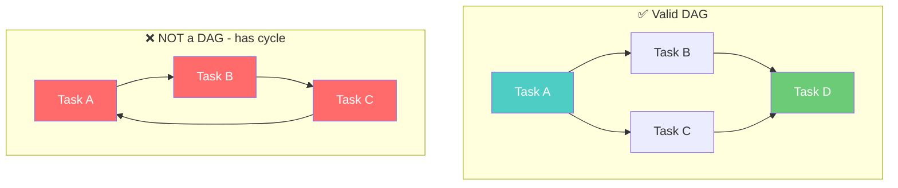

---

## Graph Theory Intuition

### Why Directed?

The direction encodes **dependency** — the most fundamental concept in workflow orchestration.

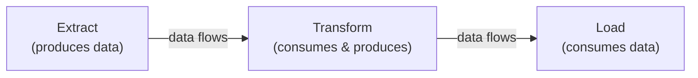

Without direction, the system doesn't know which task produces data and which consumes it.

### Why Acyclic?

Cycles create **deadlocks**. If Task A depends on C, C depends on B, and B depends on A — nothing can ever start.

> **💡 "But I need a loop!"** — What you actually need is either:
> 1. A **recurring schedule** (each DAG run is acyclic)
> 2. A **conditional branch** that either continues or stops
> 3. **Two separate DAGs** with a sensor dependency

### Key Graph Properties

| Property | Definition | Airflow Meaning |
|----------|-----------|----------------|
| **Root tasks** | No upstream dependencies | Start immediately when DAG run is created |
| **Leaf tasks** | No downstream dependents | Pipeline endpoints |
| **Critical path** | Longest path from root to leaf | Minimum pipeline duration |
| **Width** | Max parallel tasks at any level | Workers needed for maximum throughput |
| **Depth** | Number of sequential steps | Pipeline complexity |

### Topological Sort: How the Scheduler Decides Order

Given a DAG, there may be multiple valid execution orders. The scheduler uses **topological sorting** to find one.

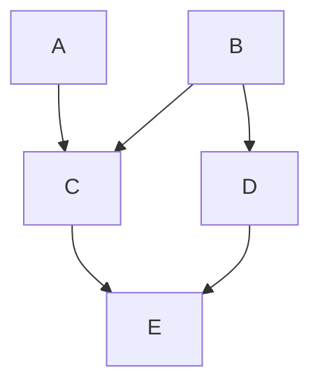

Valid orders: `A,B,C,D,E` ✅ | `B,A,C,D,E` ✅ | `B,D,A,C,E` ✅

The scheduler picks the order that maximizes **parallelism** — running A and B simultaneously, then C and D simultaneously, then E.

---

## Real-World Analogy: The Assembly Line Blueprint

> A DAG is like the **blueprint for a car assembly line**.

| Assembly Line | Airflow DAG |
|--------------|-------------|
| Blueprint | DAG definition (Python file) |
| One car being assembled | One DAG Run |
| Station doing its work | Task Instance |
| "Weld frame before painting" | Task dependency (`>>`) |
| "Build engine and weld frame simultaneously" | Parallel tasks |
| Defective car → rework | Task retry |
| Quality inspector | Sensor/Validation task |

The **blueprint** (DAG) doesn't change. Each **car** (DAG Run) is a unique execution.

---

## DAG File Structure

### Anatomy of a DAG File

```python
"""
Every DAG file is a Python module that the scheduler imports.
The scheduler looks for DAG objects at the module level.
"""

# ===== IMPORTS =====
from airflow import DAG
from airflow.operators.python import PythonOperator
from datetime import datetime, timedelta

# ===== CONSTANTS =====
DEFAULT_ARGS = {
    'owner': 'data-engineering',
    'depends_on_past': False,
    'email_on_failure': True,
    'retries': 2,
    'retry_delay': timedelta(minutes=5),
}

# ===== TASK CALLABLES =====
def extract_data(**context):
    ds = context['ds']
    print(f"Extracting data for {ds}")
    return {'records_extracted': 1000}

def transform_data(**context):
    ti = context['ti']
    result = ti.xcom_pull(task_ids='extract')
    print(f"Transforming {result['records_extracted']} records")

def load_data(**context):
    print(f"Loading data for {context['ds']}")

# ===== DAG DEFINITION =====
with DAG(
    dag_id='my_first_dag',
    default_args=DEFAULT_ARGS,
    description='A simple tutorial DAG',
    schedule='@daily',
    start_date=datetime(2024, 1, 1),
    catchup=False,
    tags=['tutorial', 'etl'],
    max_active_runs=1,
) as dag:

    extract = PythonOperator(task_id='extract', python_callable=extract_data)
    transform = PythonOperator(task_id='transform', python_callable=transform_data)
    load = PythonOperator(task_id='load', python_callable=load_data)

    extract >> transform >> load
```

### What Makes a Valid DAG File?

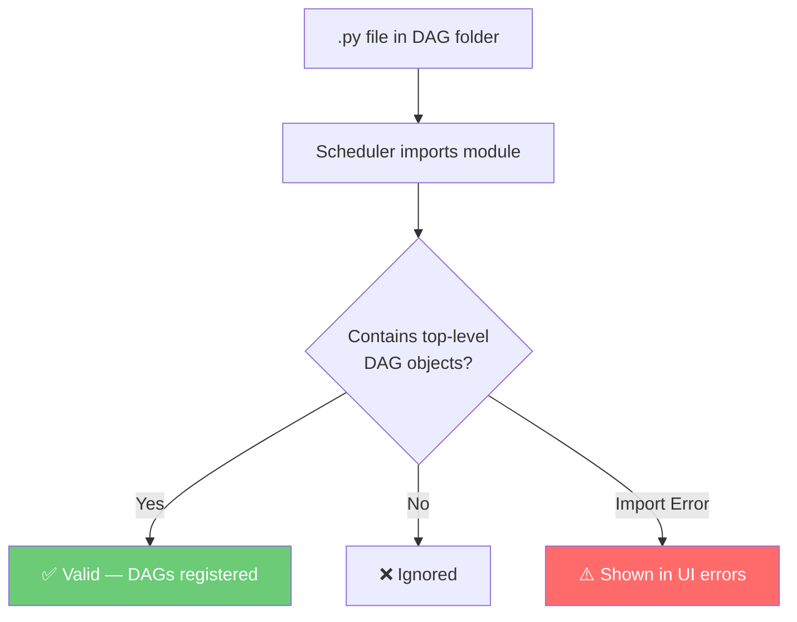

> **⚠️ Critical Rule:** Any Python code at the **top level** of a DAG file runs **every time the scheduler parses it** (every ~30s). Heavy imports, API calls, or DB queries at the top level will cripple your scheduler.

---

## DAG Parameters Deep Dive

### Essential Parameters

```python
with DAG(
    dag_id='production_etl_pipeline',      # Unique identifier
    description='Daily ETL from MySQL to Snowflake',
    tags=['production', 'etl'],
    
    # Scheduling
    schedule='0 2 * * *',                  # Cron: 2 AM daily
    start_date=datetime(2024, 1, 1),       # First possible execution
    end_date=datetime(2025, 12, 31),       # Last possible execution
    catchup=False,                          # Don't backfill
    
    # Concurrency
    max_active_runs=3,                     # Max concurrent DAG runs
    max_active_tasks=16,                   # Max concurrent tasks
    
    # Behavior
    default_args=DEFAULT_ARGS,
    dagrun_timeout=timedelta(hours=6),
    is_paused_upon_creation=True,
    render_template_as_native_obj=True,
    
    # Documentation
    doc_md="""## Pipeline Documentation...""",
) as dag:
    ...
```

### Parameter Reference

| Parameter | Type | Default | Purpose |
|-----------|------|---------|---------|
| `dag_id` | str | Required | Unique identifier |
| `schedule` | str/timedelta/Timetable/Dataset list | `timedelta(days=1)` | When to run |
| `start_date` | datetime | Required | First possible execution |
| `end_date` | datetime | None | Last possible execution |
| `catchup` | bool | True | Create runs for past dates |
| `max_active_runs` | int | config value | Max concurrent DAG runs |
| `max_active_tasks` | int | config value | Max concurrent tasks |
| `dagrun_timeout` | timedelta | None | Max duration for a run |
| `is_paused_upon_creation` | bool | True | Start paused |
| `tags` | list[str] | [] | UI filtering |
| `render_template_as_native_obj` | bool | False | Templates return Python objects |

### default_args: What Gets Inherited

```python
DEFAULT_ARGS = {
    'owner': 'data-team',
    'depends_on_past': False,
    'retries': 3,
    'retry_delay': timedelta(minutes=5),
    'retry_exponential_backoff': True,
    'max_retry_delay': timedelta(hours=1),
    'email': ['team@company.com'],
    'email_on_failure': True,
    'execution_timeout': timedelta(hours=2),
    'on_failure_callback': failure_alert,
    'sla': timedelta(hours=4),
}
```

> **💡 Tip:** `default_args` are applied to every task. Individual tasks can override any setting. Think of it as CSS inheritance.

---

## The Execution Model: execution_date vs data_interval

This is the single most confusing concept in Airflow. Let's demystify it.

### The Old Model: execution_date (Airflow 1.x)

```
Schedule: @daily (midnight)
Start Date: Jan 1, 2024

The run for January 1st actually EXECUTES on January 2nd at midnight!
execution_date = 2024-01-01 → Actually runs on 2024-01-02T00:00:00
```

**Why?** Airflow processes data **after the period ends**. January 1st data is only complete after midnight January 2nd.

### The New Model: data_interval (Airflow 2.2+)

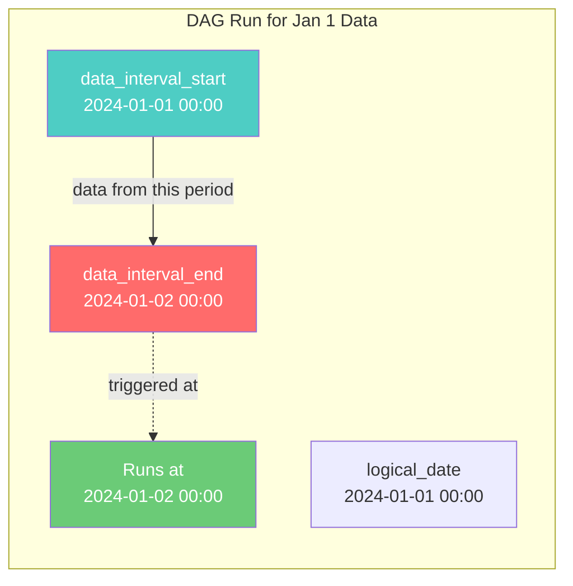

```python
def my_task(**context):
    logical_date = context['logical_date']            # 2024-01-01 00:00:00
    data_interval_start = context['data_interval_start']  # 2024-01-01 00:00:00
    data_interval_end = context['data_interval_end']      # 2024-01-02 00:00:00
    ds = context['ds']                                    # '2024-01-01'
    
    query = f"""
        SELECT * FROM events
        WHERE event_time >= '{data_interval_start}'
          AND event_time < '{data_interval_end}'
    """
```

### Visual Timeline

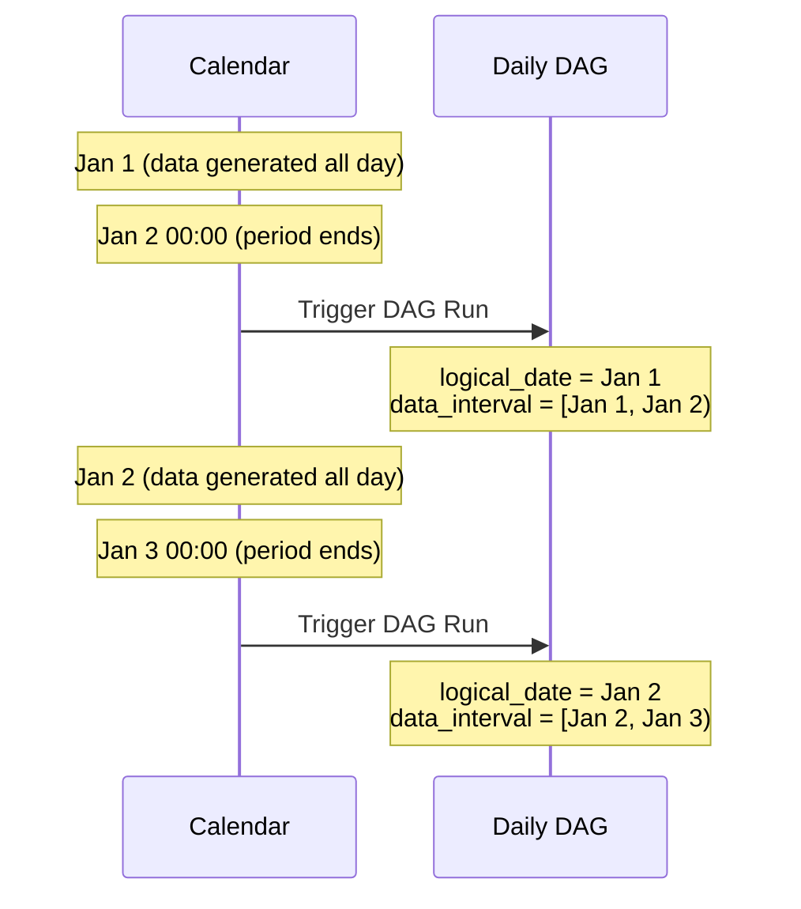

> **⚠️ Key Rule:** A daily DAG run with `logical_date` of January 1st **executes** on January 2nd. It processes data **from** January 1st.

---

## Schedules and Timetables

### Cron Expressions

```python
# Cron: minute hour day_of_month month day_of_week
# '0 0 * * *'    → Daily at midnight
# '0 2 * * *'    → Daily at 2 AM
# '0 */6 * * *'  → Every 6 hours
# '30 9 * * 1-5' → Weekdays at 9:30 AM
# '0 0 1 * *'    → First day of every month
```

### Preset Schedules

| Preset | Cron Equivalent | Meaning |
|--------|----------------|---------|
| `@once` | N/A | Run exactly once |
| `@hourly` | `0 * * * *` | Every hour |
| `@daily` | `0 0 * * *` | Every day at midnight |
| `@weekly` | `0 0 * * 0` | Every Sunday |
| `@monthly` | `0 0 1 * *` | First of every month |
| `None` | N/A | Manually triggered only |

### Custom Timetables (Airflow 2.2+)

For schedules cron can't express (business days, market hours):

```python
from airflow.timetables.base import DagRunInfo, DataInterval, TimeRestriction, Timetable
from pendulum import DateTime, Duration
from typing import Optional

class BusinessDayTimetable(Timetable):
    """Run only on business days (Monday-Friday)."""
    
    def infer_manual_data_interval(self, run_after: DateTime) -> DataInterval:
        return DataInterval(start=run_after, end=run_after + Duration(days=1))
    
    def next_dagrun_info(self, *, last_automated_data_interval: Optional[DataInterval],
                         restriction: TimeRestriction) -> Optional[DagRunInfo]:
        if last_automated_data_interval is not None:
            next_start = last_automated_data_interval.end
        else:
            next_start = restriction.earliest
        if next_start is None:
            return None
        while next_start.day_of_week in (5, 6):  # Skip weekends
            next_start = next_start.add(days=1)
        next_end = next_start.add(days=1)
        if restriction.latest is not None and next_start > restriction.latest:
            return None
        return DagRunInfo.interval(start=next_start, end=next_end)
```

### Dataset-Driven Schedules (Airflow 2.4+)

```python
from airflow.datasets import Dataset

raw_users = Dataset('s3://data-lake/raw/users/')
raw_orders = Dataset('s3://data-lake/raw/orders/')

# Runs when BOTH datasets are updated
with DAG('process_when_ready', schedule=[raw_users, raw_orders], ...) as dag:
    process = PythonOperator(task_id='process', python_callable=process_fn)
```

---

## Task Dependencies

### The `>>` and `<<` Operators

```python
# Basic chain
task_a >> task_b >> task_c

# Fan-out: one to many
task_a >> [task_b, task_c, task_d]

# Fan-in: many to one
[task_b, task_c, task_d] >> task_e

# Diamond pattern
task_a >> [task_b, task_c]
[task_b, task_c] >> task_d
```

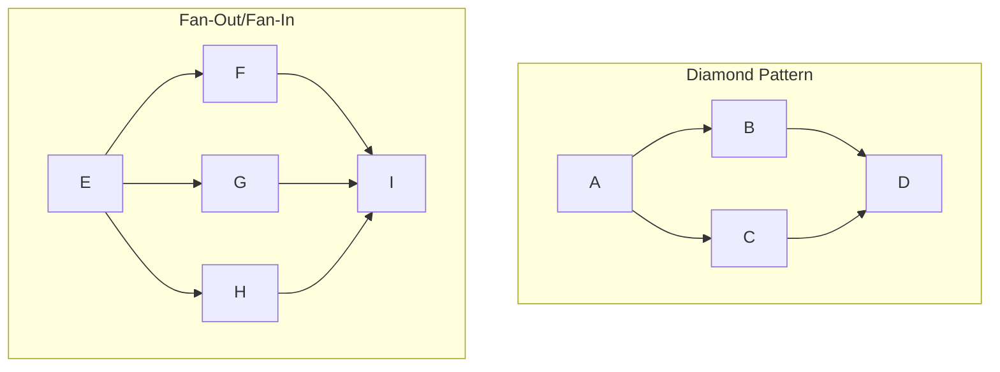

### The `chain()` Helper

```python
from airflow.models.baseoperator import chain

# Linear chain
chain(task_a, task_b, task_c, task_d)
# Equivalent to: task_a >> task_b >> task_c >> task_d

# Cross-dependencies (pairs)
chain(task_a, [task_b, task_c], [task_d, task_e], task_f)
# Creates: A >> B >> D >> F, A >> C >> E >> F
```

### Edge Labels

```python
from airflow.utils.edgemodifier import Label

extract >> Label("raw data") >> transform
transform >> Label("cleaned data") >> load
transform >> Label("anomalies") >> alert
```

---

## DAG Runs vs Task Instances

### The Hierarchy

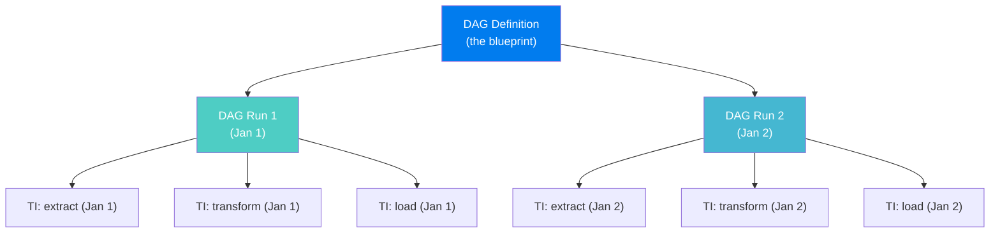

### Task Instance State Machine

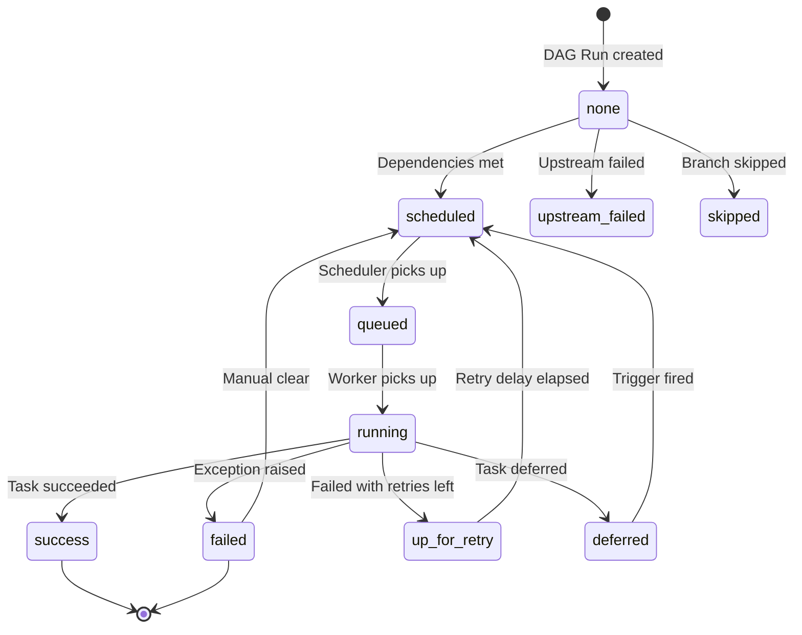

### DAG Run Properties

```python
# Each DAG Run has:
# - dag_id, run_id, logical_date
# - data_interval_start, data_interval_end
# - state: 'running', 'success', 'failed'
# - run_type: 'scheduled', 'manual', 'backfill', 'dataset_triggered'

# Each Task Instance has:
# - dag_id, task_id, run_id, execution_date
# - state, try_number, start_date, end_date, duration
# - hostname (which worker), log_url
```

---

## DAG Serialization and the DagBag

### What Is DAG Serialization?

DAG serialization converts Python DAG objects to JSON and stores them in the metadata database.

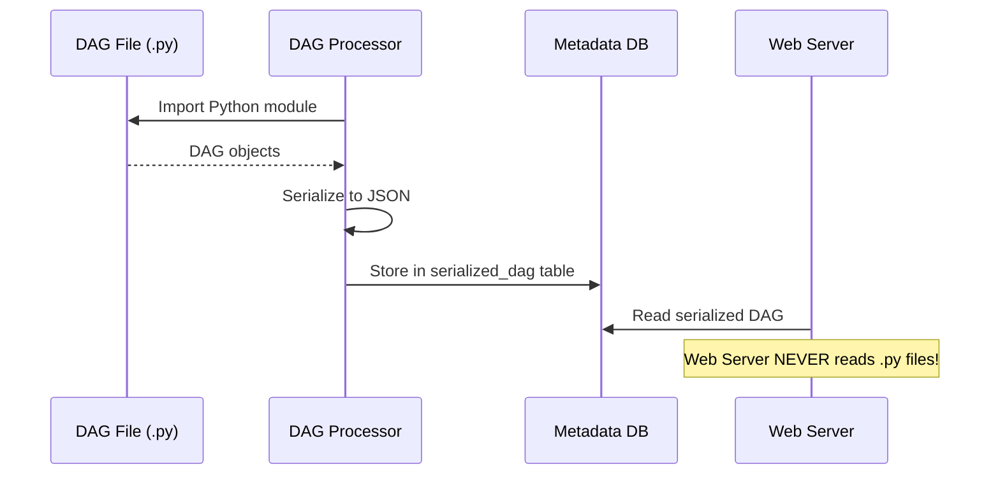

**Why it matters:**
1. Web Server doesn't need filesystem access
2. Faster startup (JSON parsing vs Python import)
3. Security (no arbitrary Python execution on web server)
4. Decoupled components

### The DagBag

The **DagBag** is the container holding all parsed DAGs:

```python
from airflow.models.dagbag import DagBag

dagbag = DagBag(dag_folder='/opt/airflow/dags')

if dagbag.import_errors:
    for filepath, error in dagbag.import_errors.items():
        print(f"Error in {filepath}: {error}")

for dag_id, dag in dagbag.dags.items():
    print(f"DAG: {dag_id} with {len(dag.tasks)} tasks")
```

---

## DAG Parsing Internals

### What Happens When Airflow Parses Your DAG

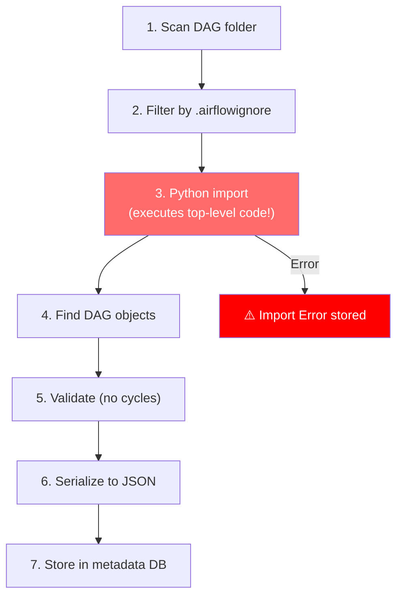

### The Parsing Cost

```python
# ❌ EXPENSIVE: 30 seconds to parse
import pandas as pd                         # 1 second
import tensorflow as tf                     # 5 seconds
config = requests.get('https://api/config') # 2+ seconds
data = pd.read_csv('/huge/reference.csv')   # 12 seconds
# This runs EVERY 30 seconds!

# ✅ CHEAP: 0.1 seconds to parse
from airflow import DAG
from airflow.operators.python import PythonOperator
from datetime import datetime

with DAG('my_dag', start_date=datetime(2024, 1, 1), schedule='@daily') as dag:
    task = PythonOperator(task_id='process', python_callable=process_fn)
    # Heavy imports only when task actually runs
```

### .airflowignore

```
# Exclude from DAG parsing
test_*
*_test.py
utils/
helpers/
README.md
archive/
```

---

## Task Groups

Task Groups replace deprecated SubDAGs, providing visual organization without operational complexity.

```python
from airflow.utils.task_group import TaskGroup

with DAG('task_group_example', ...) as dag:
    start = PythonOperator(task_id='start', python_callable=lambda: None)
    
    with TaskGroup('extract', tooltip='Extract from all sources') as extract_group:
        extract_api = PythonOperator(task_id='api', python_callable=extract_api_fn)
        extract_db = PythonOperator(task_id='database', python_callable=extract_db_fn)
        extract_files = PythonOperator(task_id='files', python_callable=extract_files_fn)
    
    with TaskGroup('transform') as transform_group:
        clean = PythonOperator(task_id='clean', python_callable=clean_fn)
        validate = PythonOperator(task_id='validate', python_callable=validate_fn)
        enrich = PythonOperator(task_id='enrich', python_callable=enrich_fn)
        clean >> validate >> enrich
    
    with TaskGroup('load') as load_group:
        load_wh = PythonOperator(task_id='warehouse', python_callable=load_wh_fn)
        load_cache = PythonOperator(task_id='cache', python_callable=load_cache_fn)
    
    end = PythonOperator(task_id='end', python_callable=lambda: None)
    start >> extract_group >> transform_group >> load_group >> end
```

### Task Groups vs SubDAGs

| Feature | Task Groups | SubDAGs (Deprecated) |
|---------|------------|---------------------|
| Visual grouping | ✅ Yes | ✅ Yes |
| Own scheduler | ❌ No | ✅ Yes (overhead!) |
| Deadlock risk | ❌ No | ✅ Yes |
| Performance | Fast | Slow |
| **Recommendation** | ✅ Use this | ❌ Avoid |

---

## DAG Documentation and Labels

```python
with DAG(
    'well_documented_dag',
    doc_md="""
    ## Customer Analytics Pipeline
    
    ### Schedule
    Runs daily at 2 AM UTC, processes previous day's data.
    
    ### SLA
    Must complete by 6 AM UTC.
    
    ### On-Call
    - Team: #data-engineering
    - Escalation: data-oncall@company.com
    
    ### Runbook
    [Link to runbook](https://wiki.company.com/runbooks/customer-analytics)
    """,
    ...,
) as dag:
    
    extract = PythonOperator(
        task_id='extract',
        python_callable=extract_fn,
        doc_md="""
        ### Extract Events
        Pulls raw data from PostgreSQL.
        **Common Failures**: Connection timeout (check DB health)
        """,
    )
```

---

## Code Examples: Simple to Production

### Example 1: Minimal DAG

```python
from airflow import DAG
from airflow.operators.python import PythonOperator
from datetime import datetime

with DAG('hello_world', start_date=datetime(2024, 1, 1), schedule='@daily', catchup=False) as dag:
    PythonOperator(task_id='say_hello', python_callable=lambda: print("Hello, Airflow!"))
```

### Example 2: TaskFlow API (Intermediate)

```python
from airflow.decorators import dag, task
from datetime import datetime

@dag(schedule='@daily', start_date=datetime(2024, 1, 1), catchup=False, tags=['example'])
def etl_with_taskflow():
    
    @task()
    def extract():
        return {"users": 100, "orders": 500}
    
    @task()
    def transform(raw_data: dict):
        return {"total": raw_data["users"] + raw_data["orders"]}
    
    @task()
    def load(transformed: dict):
        print(f"Loading {transformed['total']} records")
    
    raw = extract()
    transformed = transform(raw)
    load(transformed)

etl_with_taskflow()
```

### Example 3: Production-Grade DAG

```python
"""
production_revenue_pipeline.py
Daily revenue calculation for the finance team.
Owner: data-platform | SLA: Complete by 6 AM UTC
"""
from airflow import DAG
from airflow.operators.python import PythonOperator
from airflow.providers.snowflake.operators.snowflake import SnowflakeOperator
from airflow.utils.task_group import TaskGroup
from airflow.datasets import Dataset
from datetime import datetime, timedelta

revenue_dataset = Dataset('snowflake://analytics/daily_revenue')

DEFAULT_ARGS = {
    'owner': 'data-platform',
    'retries': 3,
    'retry_delay': timedelta(minutes=5),
    'retry_exponential_backoff': True,
    'execution_timeout': timedelta(hours=2),
    'on_failure_callback': slack_alert,
}

with DAG(
    dag_id='production_revenue_pipeline',
    default_args=DEFAULT_ARGS,
    schedule='0 2 * * *',
    start_date=datetime(2024, 1, 1),
    catchup=False,
    max_active_runs=1,
    max_active_tasks=8,
    dagrun_timeout=timedelta(hours=4),
    tags=['production', 'revenue', 'critical'],
    doc_md=__doc__,
    is_paused_upon_creation=True,
) as dag:

    with TaskGroup('extraction') as extraction:
        transactions = SnowflakeOperator(
            task_id='transactions', sql='sql/extract_transactions.sql',
            snowflake_conn_id='snowflake_prod', params={'ds': '{{ ds }}'},
        )
        refunds = SnowflakeOperator(
            task_id='refunds', sql='sql/extract_refunds.sql',
            snowflake_conn_id='snowflake_prod', params={'ds': '{{ ds }}'},
        )
        fees = SnowflakeOperator(
            task_id='fees', sql='sql/extract_fees.sql',
            snowflake_conn_id='snowflake_prod', params={'ds': '{{ ds }}'},
        )

    with TaskGroup('validation') as validation:
        quality = PythonOperator(task_id='quality_check', python_callable=validate_quality)
        schema = SnowflakeOperator(
            task_id='schema_check', sql='sql/validate_schema.sql',
            snowflake_conn_id='snowflake_prod',
        )

    calculate = SnowflakeOperator(
        task_id='calculate_revenue', sql='sql/calculate_revenue.sql',
        snowflake_conn_id='snowflake_prod', outlets=[revenue_dataset],
        sla=timedelta(hours=3),
    )

    with TaskGroup('notify') as notify:
        dashboard = PythonOperator(task_id='refresh_dashboard', python_callable=refresh_fn)
        email = PythonOperator(task_id='notify_finance', python_callable=notify_fn)

    extraction >> validation >> calculate >> notify
```

### Example 4: Dynamic DAG per Customer

```python
CUSTOMERS = ['acme_corp', 'globex', 'initech', 'umbrella']

def create_customer_dag(customer_id):
    dag = DAG(
        dag_id=f'customer_etl_{customer_id}',
        schedule='@daily', start_date=datetime(2024, 1, 1),
        catchup=False, tags=['customer', customer_id],
    )
    with dag:
        extract = PythonOperator(
            task_id='extract',
            python_callable=lambda cid=customer_id, **ctx: extract_fn(cid, ctx['ds']),
        )
        transform = PythonOperator(
            task_id='transform',
            python_callable=lambda cid=customer_id, **ctx: transform_fn(cid, ctx['ds']),
        )
        extract >> transform
    return dag

for customer in CUSTOMERS:
    globals()[f'customer_etl_{customer}'] = create_customer_dag(customer)
```

---

## Production Scenarios

### Scenario: Dynamic Task Mapping (Airflow 2.3+)

```python
from airflow.decorators import dag, task

@dag(schedule='@daily', start_date=datetime(2024, 1, 1), catchup=False)
def dynamic_table_processing():
    
    @task
    def discover_tables():
        return ['users', 'orders', 'products', 'sessions', 'payments']
    
    @task(retries=3, retry_delay=timedelta(minutes=2))
    def process_table(table_name: str):
        print(f"Processing {table_name}")
        return {'table': table_name, 'rows': 10000}
    
    @task
    def summarize(results):
        total = sum(r['rows'] for r in results)
        print(f"Processed {total} total rows across {len(results)} tables")
    
    tables = discover_tables()
    results = process_table.expand(table_name=tables)  # Dynamic mapping!
    summarize(results)

dynamic_table_processing()
```

---

## Troubleshooting

### DAG Troubleshooting Flowchart

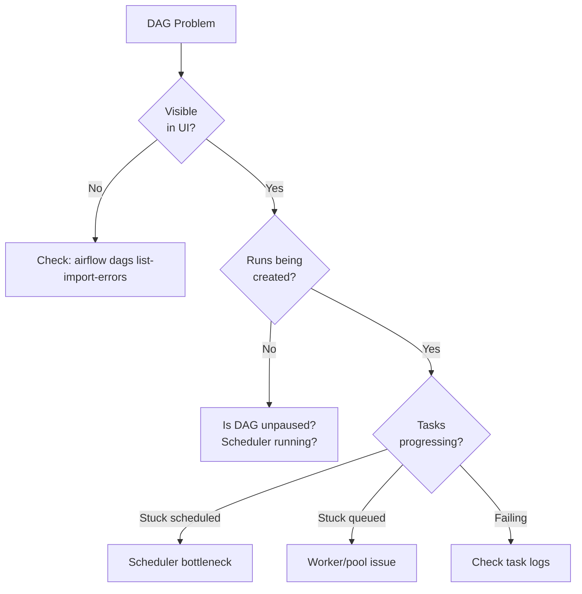

### Common Issues

| Issue | Cause | Fix |
|-------|-------|-----|
| DAG not appearing | Syntax error | `airflow dags list-import-errors` |
| Duplicate runs | `catchup=True` + old `start_date` | Set `catchup=False` |
| Tasks stuck | Pool or concurrency exhaustion | Check pools, `max_active_runs` |
| Wrong data | Using `datetime.now()` | Use `context['ds']` |
| XCom errors | Large data in XCom | Use S3/GCS, pass references |

### Testing DAGs

```python
import pytest
from airflow.models import DagBag

class TestDagIntegrity:
    def setup_method(self):
        self.dagbag = DagBag(dag_folder='dags/', include_examples=False)
    
    def test_no_import_errors(self):
        assert len(self.dagbag.import_errors) == 0, f"Errors: {self.dagbag.import_errors}"
    
    def test_dag_loaded(self):
        assert 'production_revenue_pipeline' in self.dagbag.dags
    
    def test_task_count(self):
        dag = self.dagbag.dags['production_revenue_pipeline']
        assert len(dag.tasks) >= 5
    
    def test_retries_set(self):
        dag = self.dagbag.dags['production_revenue_pipeline']
        for task in dag.tasks:
            assert task.retries >= 1, f"{task.task_id} has no retries"
```

---

## Performance Considerations

### DAG Design for Performance

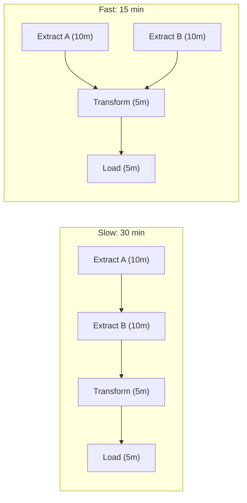

### Optimization Checklist

1. **Minimize top-level code** — Move heavy imports into task functions
2. **Use `.airflowignore`** — Exclude non-DAG files
3. **Parallelize independent tasks** — Don't serialize unnecessarily
4. **Right-size `max_active_runs`** — Allow concurrency for backfill
5. **Avoid large XComs** — Use external storage for data > 48KB
6. **Set `catchup=False`** — Unless you need historical backfill

---

## Common Mistakes

### Mistake 1: Using `datetime.now()` Instead of Templates

```python
# ❌ WRONG: Breaks backfills
def extract(**context):
    today = datetime.now().strftime('%Y-%m-%d')

# ✅ RIGHT: Backfill-friendly
def extract(**context):
    ds = context['ds']
```

### Mistake 2: Passing Large Data via XCom

```python
# ❌ XCom in metadata DB
@task()
def extract():
    return huge_dataframe.to_dict()  # Bloats DB!

# ✅ Store externally, pass reference
@task()
def extract():
    huge_dataframe.to_parquet('s3://bucket/output.parquet')
    return 's3://bucket/output.parquet'
```

### Mistake 3: Not Testing Before Deployment

```bash
# Always test
airflow dags test my_dag 2024-01-15
airflow tasks test my_dag extract 2024-01-15
```

### Mistake 4: Multiple DAGs in One File

```python
# ❌ If one has an import error, ALL break
# ✅ One DAG per file (or factory pattern)
```

### Mistake 5: Forgetting `catchup=False`

```python
# ❌ Start date 6 months ago + catchup=True = 180 DAG runs on deploy!
with DAG('my_dag', start_date=datetime(2023, 6, 1)) as dag: ...

# ✅ 
with DAG('my_dag', start_date=datetime(2023, 6, 1), catchup=False) as dag: ...
```

---

## Interview Questions

### Beginner Level

**Q1: What is a DAG in Airflow?**

> **A:** A DAG (Directed Acyclic Graph) is Airflow's core abstraction representing a workflow. **Directed** = edges have direction (encoding task dependencies). **Acyclic** = no cycles (preventing deadlocks). It defines tasks and their dependencies.

**Q2: What is the difference between a DAG Run and a Task Instance?**

> **A:** A **DAG Run** is one execution of the entire DAG for a specific logical date. A **Task Instance** is one task within one DAG Run. If a DAG has 5 tasks and 3 runs, there are 15 Task Instances.

**Q3: What does `catchup=False` do?**

> **A:** It prevents Airflow from creating DAG Runs for past dates between `start_date` and now. Use it for operational DAGs where only current/future runs matter.

### Intermediate Level

**Q4: Explain `execution_date` vs `data_interval`.**

> **A:** `execution_date` (legacy) was confusing because a daily DAG's `execution_date` of Jan 1 actually ran on Jan 2. Airflow 2.2+ introduced `data_interval`: `data_interval_start` (Jan 1), `data_interval_end` (Jan 2), `logical_date` (Jan 1). The run executes at `data_interval_end`, processing data from `[start, end)`.

**Q5: Why avoid heavy code at the top level of DAG files?**

> **A:** The DAG Processor re-parses files every ~30 seconds. Top-level code runs on every parse. Heavy imports, API calls, or DB queries slow the scheduler and waste resources. Put heavy code inside task functions.

**Q6: Task Groups vs SubDAGs?**

> **A:** Task Groups are UI-only grouping — no execution overhead, no deadlock risk. SubDAGs created child DAGs with their own scheduler entries, causing deadlocks when competing for worker slots. SubDAGs are deprecated; always use Task Groups.

### Advanced Level

**Q7: Design a DAG processing 200 tables with per-table retries and a quality gate.**

> **A:** Use dynamic task mapping (`expand()`) for 200 tables, set `retries=3` per task, `max_active_tasks=20` for resource control. Add a downstream quality gate that checks how many tables succeeded and fails if > 10% failed. Use `dagrun_timeout` for safety.

**Q8: Your 3-hour DAG needs to run in 1 hour. How?**

> **A:** (1) Profile the critical path — that's the minimum runtime. (2) Parallelize independent tasks. (3) Optimize the longest task (better queries, push to Spark/BigQuery). (4) Remove unnecessary tasks. (5) Increase `max_active_tasks`. (6) Use faster workers.

**Q9: Explain DAG serialization — benefits and limitations.**

> **A:** **Benefits**: Web Server doesn't need DAG files (security, speed), components decoupled from filesystem, faster startup. **Limitations**: Some Python constructs can't serialize perfectly, custom operators must be importable on web server, slight delay between file changes and serialized updates, large DAGs create large JSON.

**Q10: You need 1000 dynamic DAGs. Performance implications and optimizations?**

> **A:** **Implications**: 1000× parsing overhead, slower scheduler loop, larger DB. **Optimizations**: (1) Factory function in single file (less I/O). (2) Increase `min_file_process_interval`. (3) More `parsing_processes`. (4) Consider one DAG with `expand()` instead. (5) HA schedulers. (6) DAG tags for UI filtering. (7) Consider splitting into separate Airflow deployments.

---

## Key Takeaways

> **1.** A DAG is a Directed Acyclic Graph — directed edges encode dependencies, acyclicity prevents deadlocks.
>
> **2.** DAG files are Python modules parsed regularly. Keep top-level code minimal.
>
> **3.** Understand the execution model: the run covers a `data_interval` and executes **after** the period ends.
>
> **4.** DAG Run = one workflow execution. Task Instance = one task within one run.
>
> **5.** Use `catchup=False`, Task Groups (not SubDAGs), and test before deployment.

---

**[← Previous: Airflow Architecture](03-airflow-architecture.md) | [Home](../README.md) | [Next →: The Scheduler Deep Dive](05-scheduler.md)**
