# 08 — Sensors: Waiting for the World to Be Ready

> **"Operators do work. Sensors wait for conditions. Together, they orchestrate reality."**

---

## Table of Contents

- [1. Intuition — Why Sensors Exist](#1-intuition--why-sensors-exist)
- [2. Real-World Analogy — The Security Guard](#2-real-world-analogy--the-security-guard)
- [3. How Sensors Work Internally](#3-how-sensors-work-internally)
- [4. Poke Mode vs Reschedule Mode](#4-poke-mode-vs-reschedule-mode)
- [5. Built-in Sensors](#5-built-in-sensors)
- [6. Deferrable Operators & Triggers (Airflow 2.2+)](#6-deferrable-operators--triggers-airflow-22)
- [7. Building Custom Sensors](#7-building-custom-sensors)
- [8. Sensor Configuration — Timeouts, Soft Fail, Backoff](#8-sensor-configuration--timeouts-soft-fail-backoff)
- [9. Sensors vs Other Patterns](#9-sensors-vs-other-patterns)
- [10. Production Scenarios](#10-production-scenarios)
- [11. Troubleshooting](#11-troubleshooting)
- [12. Performance Considerations](#12-performance-considerations)
- [13. Common Mistakes](#13-common-mistakes)
- [14. Interview Questions](#14-interview-questions)

---

## 1. Intuition — Why Sensors Exist

Real-world data pipelines rarely operate in isolation. Your pipeline often can't start its work until **something external has happened**:

- A file has landed in S3
- An upstream pipeline has finished
- An API endpoint returns a specific status
- A database partition has been populated
- It's past a certain time of day

You *could* solve this with cron-based scheduling and hope for the best. But what if the file arrives 10 minutes late? Or 2 hours late? Or not at all?

**Sensors** solve this by **actively waiting** for a condition to become true, then allowing the downstream pipeline to proceed. They bridge the gap between "things that happen on a schedule" and "things that happen when they're ready."

> **💡 Key Insight:** A sensor is an operator that doesn't do work — it checks a condition repeatedly until it's true. Think of it as a `while not condition: sleep(interval)` loop with timeout handling, state management, and resource optimization built in.

---

## 2. Real-World Analogy — The Security Guard

Imagine you're organizing a conference:

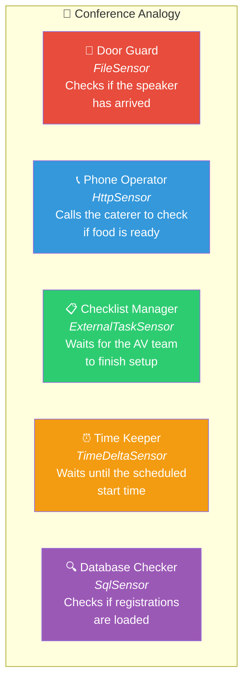

The conference (your pipeline) can't start until all these conditions are met. Each guard has two approaches:

| Guard Strategy | Sensor Mode | Behavior |
|---------------|-------------|----------|
| **Stand at the door** and check every 5 minutes | **Poke mode** | Guard occupies the doorway the entire time (blocks a worker slot) |
| **Go sit in the break room**, set an alarm for every 5 minutes, walk to the door, check, go back | **Reschedule mode** | Guard frees up the doorway between checks (releases the worker slot) |
| **Install a doorbell**, go do other things, come back when it rings | **Deferrable** | Guard registers a trigger and goes away entirely (zero worker slots) |

---

## 3. How Sensors Work Internally

### The Sensor Class Hierarchy

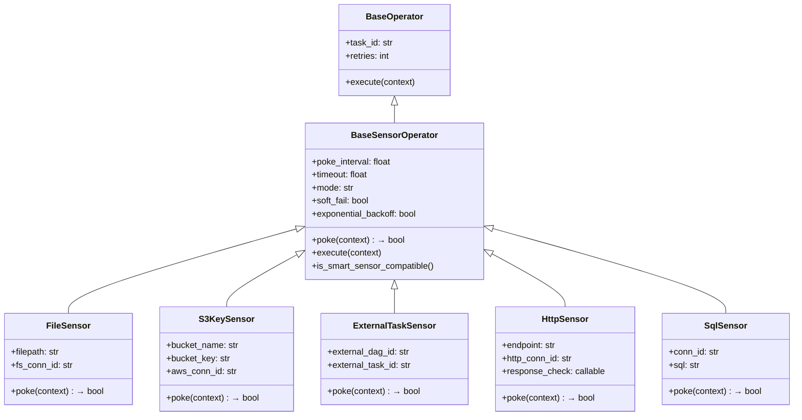

### The execute() and poke() Contract

Every sensor implements one key method: `poke()`. The `execute()` method is inherited from `BaseSensorOperator` and handles the waiting loop:

```python
# Simplified version of BaseSensorOperator.execute()
class BaseSensorOperator(BaseOperator):
    
    def __init__(
        self,
        poke_interval=60,         # Seconds between checks
        timeout=60 * 60 * 24 * 7, # Default: 7 days!
        mode="poke",              # "poke" or "reschedule"
        soft_fail=False,          # Skip instead of fail on timeout
        exponential_backoff=False, # Increase poke_interval over time
        **kwargs,
    ):
        super().__init__(**kwargs)
        self.poke_interval = poke_interval
        self.timeout = timeout
        self.mode = mode
        self.soft_fail = soft_fail
        self.exponential_backoff = exponential_backoff
    
    def execute(self, context):
        started_at = timezone.utcnow()
        
        while not self.poke(context):
            # Check if we've exceeded timeout
            if (timezone.utcnow() - started_at).total_seconds() > self.timeout:
                if self.soft_fail:
                    raise AirflowSkipException("Sensor timed out (soft_fail=True)")
                else:
                    raise AirflowSensorTimeout("Sensor timed out")
            
            if self.mode == "poke":
                # Stay in the worker — sleep and try again
                sleep(self._get_next_poke_interval())
            
            elif self.mode == "reschedule":
                # Release the worker — reschedule for later
                raise AirflowRescheduleException(
                    reschedule_date=timezone.utcnow() + timedelta(
                        seconds=self._get_next_poke_interval()
                    )
                )
        
        self.log.info("Sensor condition met! ✅")
        return True
    
    def poke(self, context):
        """Override this in subclasses. Return True when condition is met."""
        raise NotImplementedError()
    
    def _get_next_poke_interval(self):
        if self.exponential_backoff:
            # Exponentially increase interval: 60, 120, 240, 480, ...
            return min(
                self.poke_interval * (2 ** self._poke_count),
                self.timeout  # Never exceed timeout
            )
        return self.poke_interval
```

### Sensor Execution Flow

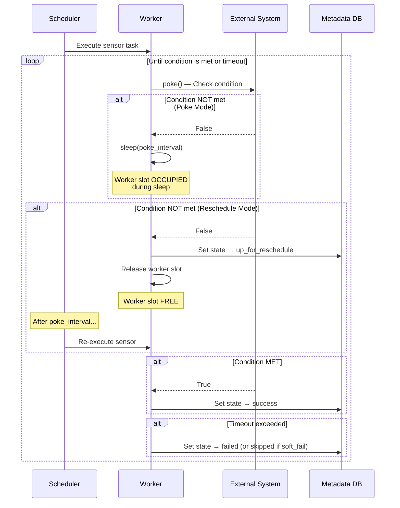

---

## 4. Poke Mode vs Reschedule Mode

This is one of the most important concepts for production Airflow. The mode you choose directly impacts **how many tasks your cluster can run simultaneously**.

### Poke Mode (Default)

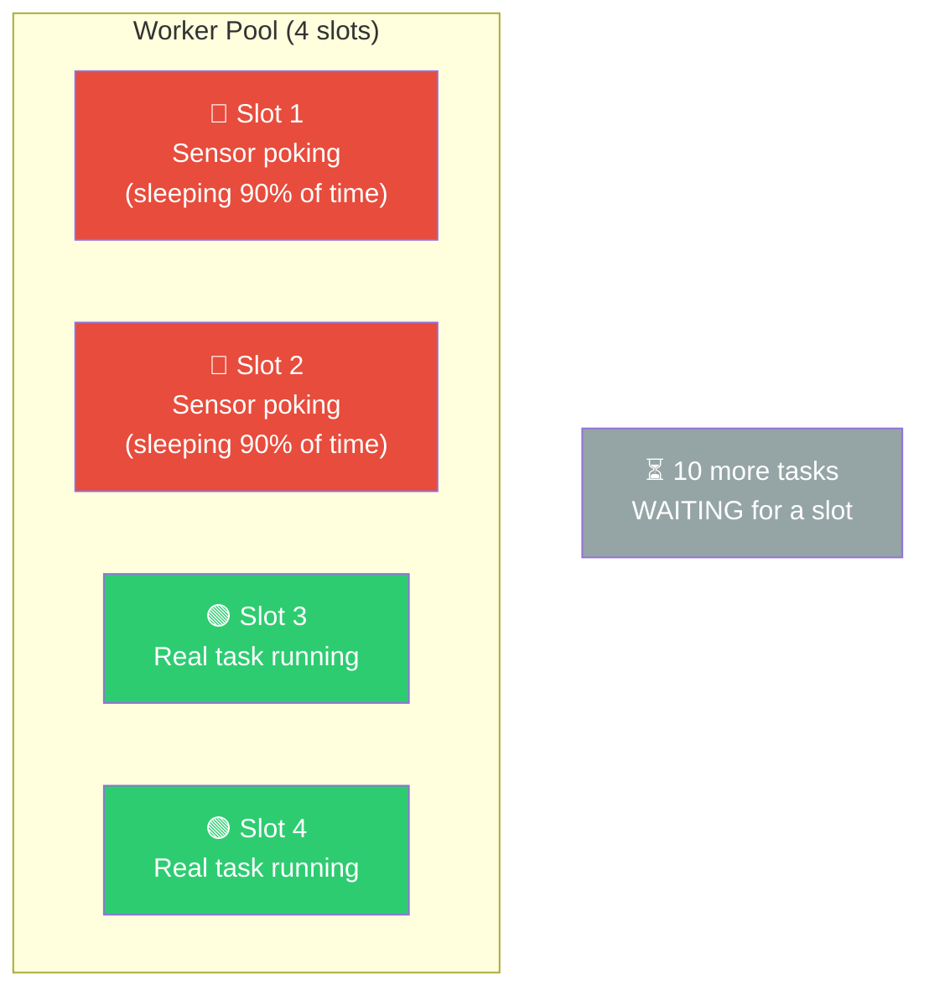

**Problem:** Sensors in poke mode **hold a worker slot** the entire time they're waiting. If you have 20 sensors, each waiting for hours, that's 20 worker slots doing nothing but sleeping.

### Reschedule Mode

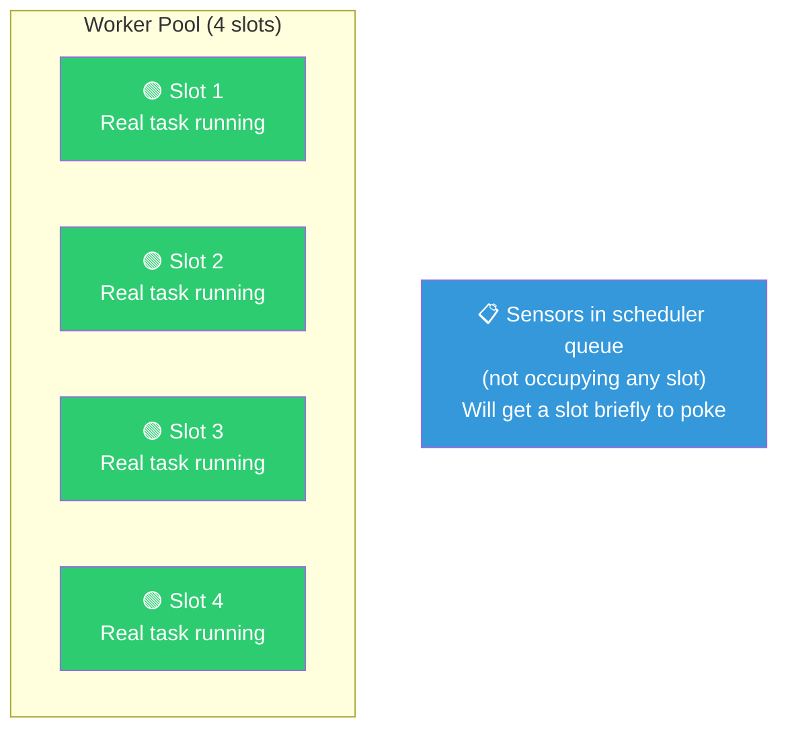

**Solution:** Sensors in reschedule mode **release the worker slot** after each poke. They're rescheduled by the scheduler for the next check. Between checks, real work can use those slots.

### Comparison

| Aspect | Poke Mode | Reschedule Mode |
|--------|-----------|-----------------|
| **Worker slot usage** | Occupied entire time | Only during poke |
| **Overhead per check** | Near zero (just wake from sleep) | Higher (task teardown + reschedule + startup) |
| **Best for** | Short waits (< 5 min), fast poke_interval | Long waits (hours), many concurrent sensors |
| **State between pokes** | In-memory (same process) | Lost (new process each time) |
| **Task state during wait** | `running` | `up_for_reschedule` |
| **Scheduler load** | Lower | Higher (more scheduling decisions) |

### When to Use Which

```python
# ✅ Poke mode — waiting for a file that arrives within minutes
wait_for_file = FileSensor(
    task_id="wait_for_file",
    filepath="/data/incoming/latest.csv",
    poke_interval=30,          # Check every 30 seconds
    timeout=600,               # Give up after 10 minutes
    mode="poke",               # Hold the worker — short wait
)

# ✅ Reschedule mode — waiting for upstream pipeline that may take hours
wait_for_upstream = ExternalTaskSensor(
    task_id="wait_for_upstream",
    external_dag_id="data_ingestion",
    external_task_id="final_step",
    poke_interval=300,         # Check every 5 minutes
    timeout=14400,             # Give up after 4 hours
    mode="reschedule",         # Free up worker — long wait
)
```

> **⚠️ Warning:** The default timeout for sensors is **7 days** (`60 * 60 * 24 * 7 = 604800` seconds). If you don't set a timeout and the condition never becomes true, the sensor will run for **an entire week** before timing out, potentially blocking a worker slot the whole time (in poke mode).

---

## 5. Built-in Sensors

### FileSensor — Wait for a File

```python
from airflow.sensors.filesystem import FileSensor

# Wait for a local file
wait_for_file = FileSensor(
    task_id="wait_for_daily_export",
    filepath="/data/exports/{{ ds }}/orders.csv",
    fs_conn_id="fs_default",       # File system connection
    poke_interval=60,              # Check every minute
    timeout=3600,                  # Timeout after 1 hour
    mode="reschedule",
)

# Wildcard pattern (glob)
wait_for_any_file = FileSensor(
    task_id="wait_for_any_csv",
    filepath="/data/incoming/*.csv",
    fs_conn_id="fs_default",
    poke_interval=30,
    timeout=1800,
)
```

### S3KeySensor — Wait for S3 Object

```python
from airflow.providers.amazon.aws.sensors.s3 import S3KeySensor

# Wait for a specific S3 key
wait_for_s3 = S3KeySensor(
    task_id="wait_for_raw_data",
    bucket_name="my-data-lake",
    bucket_key="raw/orders/dt={{ ds }}/_SUCCESS",
    aws_conn_id="aws_default",
    poke_interval=120,             # Check every 2 minutes
    timeout=7200,                  # Timeout after 2 hours
    mode="reschedule",
)

# Wait for S3 key with wildcard
wait_for_partitions = S3KeySensor(
    task_id="wait_for_partitions",
    bucket_name="my-data-lake",
    bucket_key="raw/orders/dt={{ ds }}/part-*.parquet",
    wildcard_match=True,
    aws_conn_id="aws_default",
    poke_interval=120,
    timeout=7200,
    mode="reschedule",
)
```

### ExternalTaskSensor — Wait for Another DAG

This is one of the most commonly used (and misunderstood) sensors:

```python
from airflow.sensors.external_task import ExternalTaskSensor
from datetime import timedelta

# Wait for a task in another DAG (same execution_date)
wait_for_ingestion = ExternalTaskSensor(
    task_id="wait_for_ingestion_pipeline",
    external_dag_id="data_ingestion_dag",
    external_task_id="load_to_warehouse",     # Specific task
    # external_task_id=None,                  # Wait for entire DAG
    
    poke_interval=300,
    timeout=14400,
    mode="reschedule",
    
    # CRITICAL: Align execution dates between DAGs
    # If this DAG runs at 6AM but the upstream runs at midnight:
    execution_delta=timedelta(hours=6),       # Look 6 hours back
    # OR use execution_date_fn for complex logic:
    # execution_date_fn=lambda dt: dt.replace(hour=0, minute=0),
    
    # How to handle missing DAG runs
    check_existence=True,                     # Fail if DAG run doesn't exist
)
```

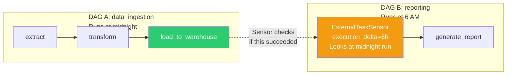

> **⚠️ Warning:** ExternalTaskSensor matches by **execution_date**. If DAG A runs `@daily` starting Jan 1, and DAG B runs `@daily` starting Jan 15, the sensor for Jan 15 will look for DAG A's Jan 15 run — which exists. But for DAG B's Jan 14 backfill, it would look for DAG A's Jan 14 run. Make sure `execution_delta` or `execution_date_fn` correctly maps the dates.

### HttpSensor — Wait for API Response

```python
from airflow.providers.http.sensors.http import HttpSensor

# Wait for an API to return healthy status
wait_for_api = HttpSensor(
    task_id="wait_for_api_ready",
    http_conn_id="my_api",
    endpoint="/health",
    method="GET",
    response_check=lambda response: response.json()["status"] == "healthy",
    poke_interval=30,
    timeout=600,
)

# Wait for a specific data status
wait_for_processing = HttpSensor(
    task_id="wait_for_data_processing",
    http_conn_id="data_service",
    endpoint="/api/v1/jobs/{{ ti.xcom_pull(task_ids='submit_job') }}/status",
    method="GET",
    response_check=lambda response: response.json()["state"] in ("COMPLETED", "FAILED"),
    poke_interval=60,
    timeout=3600,
    mode="reschedule",
)
```

### SqlSensor — Wait for Database Condition

```python
from airflow.providers.common.sql.sensors.sql import SqlSensor

# Wait for data to appear in a table
wait_for_data = SqlSensor(
    task_id="wait_for_orders_data",
    conn_id="warehouse_postgres",
    sql="""
        SELECT COUNT(*) 
        FROM orders 
        WHERE order_date = '{{ ds }}' 
        AND processed = true
    """,
    # SqlSensor returns True if the query returns a non-zero/non-empty result
    poke_interval=120,
    timeout=7200,
    mode="reschedule",
)

# Wait for a specific row count
wait_for_enough_data = SqlSensor(
    task_id="wait_for_minimum_records",
    conn_id="warehouse_postgres",
    sql="""
        SELECT COUNT(*) >= 1000 
        FROM orders 
        WHERE order_date = '{{ ds }}'
    """,
    poke_interval=300,
    timeout=14400,
    mode="reschedule",
)
```

### DateTimeSensor — Wait for a Specific Time

```python
from airflow.sensors.date_time import DateTimeSensor

# Wait until 8 AM before proceeding
wait_until_8am = DateTimeSensor(
    task_id="wait_until_business_hours",
    target_time="{{ execution_date.replace(hour=8, minute=0) }}",
    poke_interval=60,
    mode="reschedule",
)
```

---

## 6. Deferrable Operators & Triggers (Airflow 2.2+)

### The Problem with Poke and Reschedule

Even reschedule mode has overhead — each poke requires the scheduler to reschedule the task, a worker to pick it up, initialize, poke, and then release. For sensors that need to wait for hours, this is wasteful.

**Deferrable operators** solve this by offloading the waiting to a **lightweight Triggerer component** that can handle thousands of concurrent waits with minimal resources.

### Architecture — How Triggers Work

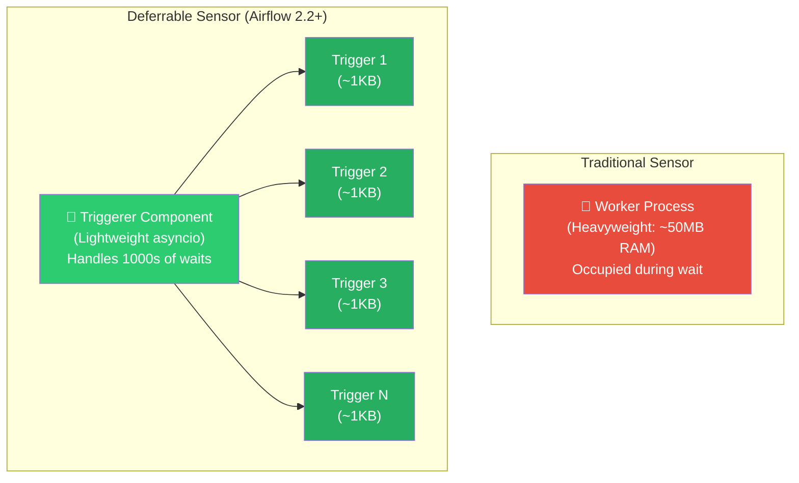

### How Deferral Works — Step by Step

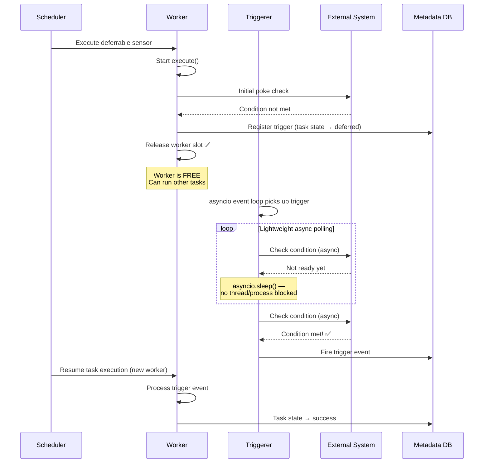

### The Triggerer Component

The Triggerer is a **new Airflow component** (alongside Scheduler, Webserver, Worker):

```bash
# Start the triggerer
airflow triggerer

# Configuration
# airflow.cfg
# [triggerer]
# default_capacity = 1000    # Max concurrent triggers per triggerer
# min_file_process_interval = 5
```

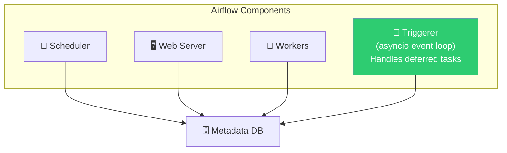

### Using Deferrable Sensors

Many built-in sensors now have deferrable versions:

```python
from airflow.providers.amazon.aws.sensors.s3 import S3KeySensor

# Traditional sensor (reschedule mode)
traditional = S3KeySensor(
    task_id="wait_traditional",
    bucket_name="my-bucket",
    bucket_key="data/{{ ds }}/file.parquet",
    mode="reschedule",           # Uses worker slot for each poke
    poke_interval=120,
    timeout=7200,
)

# Deferrable sensor (Airflow 2.2+)
deferrable = S3KeySensor(
    task_id="wait_deferrable",
    bucket_name="my-bucket",
    bucket_key="data/{{ ds }}/file.parquet",
    deferrable=True,             # ← The magic flag
    poke_interval=120,
    timeout=7200,
)
```

### Deferrable vs Poke vs Reschedule — Resource Comparison

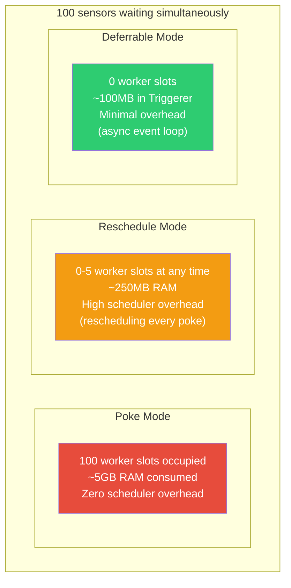

| Metric (100 concurrent sensors) | Poke | Reschedule | Deferrable |
|--------------------------------|------|------------|------------|
| Worker slots used | 100 | 0-5 | 0 |
| RAM usage | ~5 GB | ~250 MB | ~100 MB |
| Scheduler load | Low | High | Low |
| Required components | Workers | Workers + Scheduler | Triggerer |
| Min Airflow version | Any | Any | 2.2+ |

### Building a Custom Deferrable Sensor

```python
from airflow.sensors.base import BaseSensorOperator
from airflow.triggers.base import BaseTrigger, TriggerEvent
from typing import Any, AsyncIterator
import asyncio
import aiohttp

# Step 1: Create the Trigger (runs in Triggerer's asyncio loop)
class ApiReadyTrigger(BaseTrigger):
    """Async trigger that checks an API endpoint."""
    
    def __init__(self, endpoint: str, poll_interval: float = 60):
        super().__init__()
        self.endpoint = endpoint
        self.poll_interval = poll_interval
    
    def serialize(self):
        """Serialize trigger for storage in metadata DB."""
        return (
            "my_package.triggers.ApiReadyTrigger",  # Import path
            {
                "endpoint": self.endpoint,
                "poll_interval": self.poll_interval,
            },
        )
    
    async def run(self) -> AsyncIterator[TriggerEvent]:
        """Async generator that yields when condition is met."""
        while True:
            try:
                async with aiohttp.ClientSession() as session:
                    async with session.get(self.endpoint) as response:
                        data = await response.json()
                        if data.get("status") == "ready":
                            yield TriggerEvent({"status": "ready", "data": data})
                            return
            except Exception as e:
                self.log.warning(f"Error checking API: {e}")
            
            # Non-blocking sleep (doesn't consume a thread)
            await asyncio.sleep(self.poll_interval)


# Step 2: Create the Deferrable Sensor (runs on a Worker, then defers)
class ApiReadySensor(BaseSensorOperator):
    """Sensor that waits for an API to be ready, with deferrable support."""
    
    def __init__(self, endpoint: str, **kwargs):
        super().__init__(**kwargs)
        self.endpoint = endpoint
    
    def execute(self, context):
        """Called by worker. If not immediately ready, defer to trigger."""
        # Quick check — maybe it's already ready?
        if self._check_api():
            self.log.info("API is already ready!")
            return
        
        # Not ready — defer to the Triggerer
        self.defer(
            trigger=ApiReadyTrigger(
                endpoint=self.endpoint,
                poll_interval=self.poke_interval,
            ),
            method_name="execute_complete",
            timeout=timedelta(seconds=self.timeout),
        )
    
    def execute_complete(self, context, event=None):
        """Called when the trigger fires. Runs on a Worker."""
        if event["status"] == "ready":
            self.log.info(f"API is ready! Data: {event['data']}")
            return event["data"]
        raise AirflowException(f"Unexpected trigger event: {event}")
    
    def _check_api(self):
        import requests
        try:
            response = requests.get(self.endpoint, timeout=10)
            return response.json().get("status") == "ready"
        except Exception:
            return False


# Usage in a DAG
with DAG("deferrable_example", start_date=datetime(2024, 1, 1)) as dag:
    
    wait_for_api = ApiReadySensor(
        task_id="wait_for_ml_service",
        endpoint="https://ml-service.internal/health",
        poke_interval=60,
        timeout=3600,
    )
```

---

## 7. Building Custom Sensors

### Basic Custom Sensor

```python
from airflow.sensors.base import BaseSensorOperator
from airflow.utils.decorators import apply_defaults
from typing import Sequence

class DataQualitySensor(BaseSensorOperator):
    """
    Waits until a data quality check passes.
    
    Useful when upstream data arrives gradually and you need
    to wait until it meets quality thresholds.
    """
    
    template_fields: Sequence[str] = ("sql", "table_name")
    ui_color = "#89CFF0"
    
    def __init__(
        self,
        conn_id: str,
        table_name: str,
        min_row_count: int = 0,
        max_null_percentage: float = 5.0,
        sql: str = None,
        **kwargs,
    ):
        super().__init__(**kwargs)
        self.conn_id = conn_id
        self.table_name = table_name
        self.min_row_count = min_row_count
        self.max_null_percentage = max_null_percentage
        self.sql = sql
    
    def poke(self, context) -> bool:
        """Check if data quality thresholds are met."""
        from airflow.providers.postgres.hooks.postgres import PostgresHook
        
        hook = PostgresHook(postgres_conn_id=self.conn_id)
        
        # Check row count
        row_count = hook.get_first(
            f"SELECT COUNT(*) FROM {self.table_name}"
        )[0]
        
        self.log.info(f"Row count: {row_count} (minimum: {self.min_row_count})")
        
        if row_count < self.min_row_count:
            self.log.info(f"Not enough rows yet ({row_count} < {self.min_row_count})")
            return False
        
        # Check null percentage
        if self.sql:
            null_pct = hook.get_first(self.sql)[0]
            self.log.info(f"Null percentage: {null_pct}% (max: {self.max_null_percentage}%)")
            if null_pct > self.max_null_percentage:
                return False
        
        self.log.info("All quality checks passed! ✅")
        return True


# Usage
quality_gate = DataQualitySensor(
    task_id="wait_for_quality_data",
    conn_id="warehouse",
    table_name="analytics.orders_{{ ds_nodash }}",
    min_row_count=10000,
    max_null_percentage=2.0,
    sql="""
        SELECT (COUNT(*) FILTER (WHERE user_id IS NULL) * 100.0 / COUNT(*))
        FROM analytics.orders_{{ ds_nodash }}
    """,
    poke_interval=300,
    timeout=7200,
    mode="reschedule",
)
```

### Custom Sensor with State Between Pokes

```python
class ProgressSensor(BaseSensorOperator):
    """
    Monitors a long-running external job and logs progress.
    """
    
    template_fields: Sequence[str] = ("job_id",)
    
    def __init__(self, job_id: str, api_conn_id: str, **kwargs):
        super().__init__(**kwargs)
        self.job_id = job_id
        self.api_conn_id = api_conn_id
        self._last_progress = 0  # Only works in poke mode
    
    def poke(self, context) -> bool:
        from airflow.providers.http.hooks.http import HttpHook
        
        hook = HttpHook(http_conn_id=self.api_conn_id, method="GET")
        response = hook.run(endpoint=f"/jobs/{self.job_id}/status")
        data = response.json()
        
        status = data["status"]
        progress = data.get("progress", 0)
        
        # Log progress delta (only meaningful in poke mode)
        if progress > self._last_progress:
            self.log.info(
                f"Job progress: {progress}% (+{progress - self._last_progress}%)"
            )
            self._last_progress = progress
        
        if status == "COMPLETED":
            self.log.info(f"Job completed! Final progress: {progress}%")
            # Push result to XCom for downstream tasks
            context["ti"].xcom_push(key="job_result", value=data.get("result_path"))
            return True
        elif status == "FAILED":
            raise AirflowException(f"External job failed: {data.get('error')}")
        
        return False
```

> **💡 Key Insight:** Instance variables like `self._last_progress` only persist between pokes in **poke mode**. In **reschedule mode**, a new process handles each poke, so state is lost. For stateful monitoring in reschedule mode, use XCom or the metadata DB.

---

## 8. Sensor Configuration — Timeouts, Soft Fail, Backoff

### Timeout Handling

```python
from airflow.sensors.filesystem import FileSensor
from datetime import timedelta

# Hard fail — task fails when timeout is reached
hard_fail_sensor = FileSensor(
    task_id="wait_for_file_hard",
    filepath="/data/{{ ds }}/file.csv",
    timeout=3600,                      # 1 hour
    soft_fail=False,                   # Default — raises AirflowSensorTimeout
    poke_interval=60,
)

# Soft fail — task is SKIPPED (not failed) when timeout is reached
soft_fail_sensor = FileSensor(
    task_id="wait_for_optional_file",
    filepath="/data/{{ ds }}/optional_enrichment.csv",
    timeout=1800,                      # 30 minutes
    soft_fail=True,                    # Raises AirflowSkipException instead
    poke_interval=60,
)
```

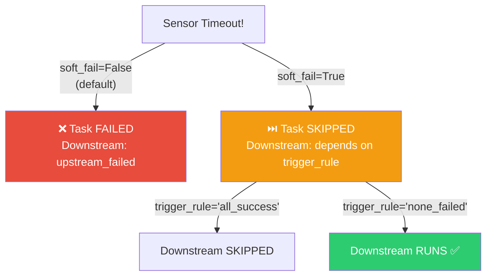

### Exponential Backoff

For sensors checking expensive external resources:

```python
# Without backoff: poke every 60s, even hours into waiting
# With backoff: 60s → 120s → 240s → 480s → ... up to timeout

sensor_with_backoff = S3KeySensor(
    task_id="wait_with_backoff",
    bucket_name="my-bucket",
    bucket_key="data/{{ ds }}/file.parquet",
    poke_interval=60,                  # Starting interval
    exponential_backoff=True,          # Double interval each time
    timeout=14400,                     # 4 hours max
    mode="reschedule",
)
```

```
Without backoff (60s interval, 1 hour):
Pokes: 60 checks in 1 hour

With backoff (60s start):
Poke 1:  t=0m      (wait 60s)
Poke 2:  t=1m      (wait 120s)
Poke 3:  t=3m      (wait 240s)
Poke 4:  t=7m      (wait 480s)
Poke 5:  t=15m     (wait 960s)
Poke 6:  t=31m     (wait 1920s)
Poke 7:  t=63m     ← Only 7 checks in the same hour!
```

### The soft_fail + trigger_rule Pattern

A powerful pattern for optional dependencies:

```python
from airflow import DAG
from airflow.sensors.filesystem import FileSensor
from airflow.operators.python import PythonOperator
from airflow.utils.trigger_rule import TriggerRule
from datetime import datetime

with DAG("optional_dependency", start_date=datetime(2024, 1, 1)) as dag:
    
    # Required data — hard fail if missing
    wait_for_orders = FileSensor(
        task_id="wait_for_orders",
        filepath="/data/{{ ds }}/orders.csv",
        timeout=3600,
        soft_fail=False,           # MUST have this data
    )
    
    # Optional enrichment data — skip if missing
    wait_for_enrichment = FileSensor(
        task_id="wait_for_enrichment",
        filepath="/data/{{ ds }}/user_profiles.csv",
        timeout=600,               # Only wait 10 minutes
        soft_fail=True,            # OK to skip
    )
    
    # This runs if enrichment data is available
    enrich_data = PythonOperator(
        task_id="enrich_data",
        python_callable=enrich_with_profiles,
        # none_failed allows skipped upstreams
        trigger_rule=TriggerRule.NONE_FAILED,
    )
    
    # This always runs (as long as orders are available)
    process_orders = PythonOperator(
        task_id="process_orders",
        python_callable=process_order_data,
        trigger_rule=TriggerRule.NONE_FAILED,
    )
    
    wait_for_orders >> process_orders
    wait_for_enrichment >> enrich_data >> process_orders
```

---

## 9. Sensors vs Other Patterns

### When NOT to Use Sensors

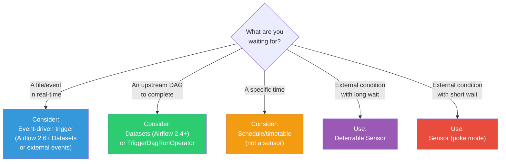

### Alternative: Dataset-Driven Scheduling (Airflow 2.4+)

Instead of a sensor polling for upstream data, the upstream DAG can **declare what it produces**, and the downstream DAG is triggered automatically:

```python
from airflow import DAG, Dataset
from airflow.operators.python import PythonOperator
from datetime import datetime

# Define a dataset (URI is just an identifier)
orders_dataset = Dataset("s3://data-lake/orders/daily")

# Producer DAG — declares it updates the dataset
with DAG("producer_dag", schedule="@daily", start_date=datetime(2024, 1, 1)) as producer:
    
    produce = PythonOperator(
        task_id="produce_orders",
        python_callable=process_orders,
        outlets=[orders_dataset],      # "I produce this dataset"
    )

# Consumer DAG — triggered when dataset is updated
with DAG(
    "consumer_dag",
    schedule=[orders_dataset],          # "Run when this dataset is updated"
    start_date=datetime(2024, 1, 1),
) as consumer:
    
    consume = PythonOperator(
        task_id="consume_orders",
        python_callable=generate_report,
    )
```

**Dataset-driven vs ExternalTaskSensor:**

| Aspect | ExternalTaskSensor | Dataset-driven |
|--------|-------------------|----------------|
| Coupling | Tight (knows DAG ID, task ID) | Loose (only knows dataset URI) |
| Resource usage | Uses worker/triggerer slots | Zero (scheduler handles it) |
| Direction | Consumer pulls (polling) | Producer pushes (event-driven) |
| Cross-DAG | Same Airflow instance only | Same Airflow instance only |
| Backfill | Complex (execution_date matching) | Simple (triggered per event) |

---

## 10. Production Scenarios

### Scenario 1: Multi-Source Data Pipeline with Mixed Waits

```python
from airflow import DAG
from airflow.sensors.external_task import ExternalTaskSensor
from airflow.providers.amazon.aws.sensors.s3 import S3KeySensor
from airflow.providers.common.sql.sensors.sql import SqlSensor
from airflow.operators.python import PythonOperator
from airflow.utils.trigger_rule import TriggerRule
from datetime import datetime, timedelta

with DAG(
    "multi_source_pipeline",
    start_date=datetime(2024, 1, 1),
    schedule="0 8 * * *",      # 8 AM daily
    catchup=False,
    default_args={
        "retries": 2,
        "retry_delay": timedelta(minutes=5),
    },
) as dag:
    
    # Source 1: Wait for upstream ETL pipeline
    wait_for_etl = ExternalTaskSensor(
        task_id="wait_for_etl_pipeline",
        external_dag_id="etl_ingestion",
        external_task_id="final_validation",
        execution_delta=timedelta(hours=8),    # ETL runs at midnight
        poke_interval=300,
        timeout=10800,                         # 3 hours
        mode="reschedule",
        soft_fail=False,
    )
    
    # Source 2: Wait for partner data file in S3
    wait_for_partner = S3KeySensor(
        task_id="wait_for_partner_data",
        bucket_name="partner-data",
        bucket_key="daily/{{ ds }}/transactions.csv",
        aws_conn_id="aws_production",
        poke_interval=300,
        timeout=14400,                         # 4 hours
        deferrable=True,                       # Use triggerer
    )
    
    # Source 3: Wait for ML model scores (optional)
    wait_for_scores = SqlSensor(
        task_id="wait_for_ml_scores",
        conn_id="ml_database",
        sql="""
            SELECT COUNT(*) > 0
            FROM ml_predictions 
            WHERE prediction_date = '{{ ds }}'
            AND model_version = (SELECT MAX(model_version) FROM ml_models)
        """,
        poke_interval=300,
        timeout=3600,                          # Only wait 1 hour
        soft_fail=True,                        # OK to proceed without scores
        mode="reschedule",
    )
    
    # Process when all required sources are ready
    merge_data = PythonOperator(
        task_id="merge_all_sources",
        python_callable=merge_data_sources,
        trigger_rule=TriggerRule.NONE_FAILED,  # Allow skipped ML scores
    )
    
    [wait_for_etl, wait_for_partner, wait_for_scores] >> merge_data
```

### Scenario 2: SLA-Driven Pipeline with Escalation

```python
from airflow import DAG
from airflow.providers.amazon.aws.sensors.s3 import S3KeySensor
from airflow.operators.python import PythonOperator, BranchPythonOperator
from datetime import datetime, timedelta

def check_sla_status(**kwargs):
    """Check if we're at risk of missing SLA."""
    import pendulum
    now = pendulum.now("UTC")
    sla_deadline = kwargs["execution_date"].add(hours=10)  # SLA: 10 AM
    time_remaining = (sla_deadline - now).total_seconds()
    
    if time_remaining < 1800:  # Less than 30 min to SLA
        return "escalate_alert"
    return "proceed_normally"

with DAG(
    "sla_aware_pipeline",
    start_date=datetime(2024, 1, 1),
    schedule="0 6 * * *",
    sla_miss_callback=notify_sla_miss,
) as dag:
    
    wait_for_data = S3KeySensor(
        task_id="wait_for_data",
        bucket_name="source-data",
        bucket_key="daily/{{ ds }}/data.parquet",
        poke_interval=120,
        timeout=10800,           # 3 hours
        deferrable=True,
        sla=timedelta(hours=2),  # SLA: data should arrive within 2 hours
    )
    
    check_sla = BranchPythonOperator(
        task_id="check_sla_status",
        python_callable=check_sla_status,
    )
    
    proceed = PythonOperator(
        task_id="proceed_normally",
        python_callable=run_normal_pipeline,
    )
    
    escalate = PythonOperator(
        task_id="escalate_alert",
        python_callable=send_escalation_alert,
    )
    
    wait_for_data >> check_sla >> [proceed, escalate]
```

---

## 11. Troubleshooting

### Problem 1: Sensor Eating All Worker Slots

| Aspect | Detail |
|--------|--------|
| **Symptom** | Real tasks stuck in "queued" while sensors show "running" |
| **Root Cause** | Sensors in poke mode occupying all available worker slots |
| **Fix** | Switch to `mode="reschedule"` or use deferrable sensors |

```python
# Quick fix: Create a dedicated pool for sensors
# airflow pools set sensor_pool 5 "Pool for sensors"

sensor = S3KeySensor(
    task_id="my_sensor",
    pool="sensor_pool",        # Limit sensor concurrency
    mode="reschedule",         # Release slots between pokes
    # ...
)
```

### Problem 2: ExternalTaskSensor Never Succeeds

| Aspect | Detail |
|--------|--------|
| **Symptom** | ExternalTaskSensor keeps poking but never returns True |
| **Root Cause** | execution_date mismatch between the two DAGs |
| **Diagnosis** | Check execution dates in the UI for both DAGs |

```python
# Debug: Log what execution date the sensor is looking for
def debug_external_sensor(**kwargs):
    from airflow.models import DagRun
    from airflow.utils.session import provide_session
    
    @provide_session
    def check(session=None):
        external_dag_id = "upstream_dag"
        target_date = kwargs["execution_date"] - timedelta(hours=6)
        
        dag_run = session.query(DagRun).filter(
            DagRun.dag_id == external_dag_id,
            DagRun.execution_date == target_date,
        ).first()
        
        if dag_run:
            print(f"Found DAG run: {dag_run.state}")
        else:
            print(f"No DAG run found for {target_date}")
            # List available runs
            all_runs = session.query(DagRun).filter(
                DagRun.dag_id == external_dag_id,
            ).order_by(DagRun.execution_date.desc()).limit(5).all()
            for run in all_runs:
                print(f"  Available: {run.execution_date} → {run.state}")
    
    check()
```

### Problem 3: Sensor Timeout Too Aggressive/Lenient

| Aspect | Detail |
|--------|--------|
| **Symptom** | Sensor times out before data arrives, OR never times out |
| **Root Cause** | Default timeout is 7 days; custom timeout doesn't match data SLA |
| **Fix** | Set explicit, reasonable timeouts based on data arrival patterns |

```python
# ❌ BAD — uses default 7-day timeout
sensor = S3KeySensor(
    task_id="wait_forever",
    bucket_name="bucket",
    bucket_key="data.csv",
    # timeout defaults to 604800 (7 days!)
)

# ✅ GOOD — explicit timeout based on business SLA
sensor = S3KeySensor(
    task_id="wait_reasonable",
    bucket_name="bucket",
    bucket_key="data.csv",
    timeout=7200,              # 2 hours — matches data SLA
    soft_fail=True,            # Skip if data doesn't arrive
    poke_interval=120,
)
```

---

## 12. Performance Considerations

### Impact of Sensor Mode on Cluster Capacity

```
Scenario: 50 sensors waiting simultaneously, 100 worker slots total

Poke mode:     50 slots used by sensors → 50 slots for real work (50% waste)
Reschedule:    ~2 slots used at any time → 98 slots for real work (2% overhead)
Deferrable:    0 slots used → 100 slots for real work (0% overhead)
```

### Poke Interval Optimization

```python
# Too frequent — wastes resources checking constantly
bad = S3KeySensor(poke_interval=5)     # Every 5 seconds! Excessive API calls

# Too infrequent — delays pipeline even after data arrives
bad2 = S3KeySensor(poke_interval=3600)  # Hourly — up to 1 hour delay

# Just right — balance between freshness and resource usage
good = S3KeySensor(
    poke_interval=120,                  # Every 2 minutes
    exponential_backoff=True,           # Backs off if waiting long
)
```

### Sensor Pool Pattern

Limit the total number of concurrent sensors to prevent them from starving real tasks:

```bash
# Create a dedicated pool for sensors
airflow pools set sensor_pool 10 "Dedicated pool for sensor tasks"
```

```python
# All sensors use the sensor pool
sensor = S3KeySensor(
    task_id="wait_for_data",
    pool="sensor_pool",        # Max 10 concurrent sensors
    pool_slots=1,              # Each sensor uses 1 slot
    mode="reschedule",
    # ...
)
```

---

## 13. Common Mistakes

### Mistake 1: Using Poke Mode for Long Waits

```python
# ❌ BAD — Holds a worker slot for up to 6 hours!
wait = S3KeySensor(
    task_id="wait_for_data",
    poke_interval=300,
    timeout=21600,             # 6 hours
    mode="poke",               # Worker slot occupied the ENTIRE time
)

# ✅ GOOD — Release worker slot between checks
wait = S3KeySensor(
    task_id="wait_for_data",
    poke_interval=300,
    timeout=21600,
    mode="reschedule",         # Or deferrable=True
)
```

### Mistake 2: Not Setting Timeouts

```python
# ❌ BAD — Default timeout is 7 DAYS
wait = FileSensor(
    task_id="wait_forever",
    filepath="/data/file.csv",
    # timeout defaults to 604800 seconds (7 days!)
)

# ✅ GOOD — Always set explicit timeout
wait = FileSensor(
    task_id="wait_reasonable",
    filepath="/data/file.csv",
    timeout=3600,              # 1 hour
)
```

### Mistake 3: ExternalTaskSensor Without execution_delta

```python
# ❌ BAD — DAG A runs at midnight, DAG B runs at 6 AM
# Sensor looks for DAG A's 6 AM run... which doesn't exist!
wait = ExternalTaskSensor(
    task_id="wait_for_dag_a",
    external_dag_id="dag_a",
    external_task_id="final_task",
    # No execution_delta! Assumes same execution_date
)

# ✅ GOOD — Account for schedule difference
wait = ExternalTaskSensor(
    task_id="wait_for_dag_a",
    external_dag_id="dag_a",
    external_task_id="final_task",
    execution_delta=timedelta(hours=6),  # Look 6 hours back
)
```

### Mistake 4: Using Sensors When Datasets Would Work

```python
# ❌ Over-engineered — Sensor polling for a DAG in the same Airflow instance
wait = ExternalTaskSensor(
    task_id="wait_for_etl",
    external_dag_id="etl_pipeline",
    external_task_id="load_data",
    poke_interval=300,
    timeout=7200,
)

# ✅ Better (Airflow 2.4+) — Event-driven, zero resource usage
orders_dataset = Dataset("s3://data-lake/orders")

# In the producer DAG:
produce = PythonOperator(
    task_id="load_data",
    outlets=[orders_dataset],
)

# In the consumer DAG:
# schedule=[orders_dataset]  → Triggered automatically!
```

### Mistake 5: Not Handling Sensor Failures Gracefully

```python
# ❌ BAD — Hard fail blocks entire downstream pipeline
wait = S3KeySensor(
    task_id="wait_for_optional_data",
    timeout=1800,
    soft_fail=False,           # Pipeline fails if data is late
)

# ✅ GOOD — Graceful degradation for optional data
wait = S3KeySensor(
    task_id="wait_for_optional_data",
    timeout=1800,
    soft_fail=True,            # Skip if not available
)

# Downstream uses trigger_rule to handle the skip
process = PythonOperator(
    task_id="process_with_or_without",
    trigger_rule=TriggerRule.NONE_FAILED,  # Runs even if sensor was skipped
    python_callable=process_data,
)
```

---

## 14. Interview Questions

### Beginner Level

**Q1: What is a sensor and how does it differ from a regular operator?**

> **A:** A sensor is a special type of operator that **waits for a condition** to become true before allowing the pipeline to proceed. While regular operators *do work* (run code, query databases, move files), sensors *wait for conditions* (file exists, API returns status, upstream task succeeded). Technically, a sensor is a subclass of `BaseOperator` that implements a `poke()` method which returns `True` when the condition is met.

**Q2: What's the difference between poke mode and reschedule mode?**

> **A:** In **poke mode**, the sensor occupies a worker slot for the entire duration of waiting. It sleeps between checks but the process stays alive. In **reschedule mode**, the sensor checks the condition, and if not met, releases the worker slot and asks the scheduler to re-run it later. Reschedule mode is more resource-efficient for long waits (hours), while poke mode is simpler and has less overhead for short waits (minutes).

**Q3: Name 3 commonly-used sensors and their use cases.**

> **A:**
> 1. **S3KeySensor** — Wait for a file to appear in an S3 bucket (e.g., upstream system drops a CSV daily)
> 2. **ExternalTaskSensor** — Wait for a task in another DAG to complete (e.g., wait for the ingestion pipeline before running analytics)
> 3. **SqlSensor** — Wait for a SQL query to return a truthy result (e.g., wait for a database partition to be populated)

### Intermediate Level

**Q4: You have 50 sensors running in poke mode and real tasks are stuck in "queued." How do you fix this?**

> **A:** The sensors are consuming all available worker slots, starving real tasks. Three solutions:
> 1. Switch sensors to `mode="reschedule"` to release worker slots between pokes
> 2. Create a dedicated `sensor_pool` with limited slots to cap sensor concurrency
> 3. Upgrade to deferrable sensors (`deferrable=True`) which use zero worker slots
> 4. As an immediate fix, reduce `parallelism` or increase worker capacity

**Q5: Explain how deferrable operators work and why they're better than reschedule mode.**

> **A:** Deferrable operators use a new component called the **Triggerer**, which runs an asyncio event loop. When a deferrable sensor detects the condition isn't met, it:
> 1. Creates a **Trigger** object (a lightweight async function)
> 2. Registers it with the Triggerer
> 3. Releases the worker slot completely
> 4. The Triggerer runs the trigger's async code alongside thousands of other triggers using cooperative multitasking
> 5. When the condition is met, the trigger fires an event
> 6. The scheduler picks up the event and assigns a worker to finish the task
>
> This is better than reschedule mode because: reschedule mode still has overhead (task teardown/startup for each poke, scheduler has to reschedule), while deferrable mode uses a single lightweight process for thousands of concurrent waits.

**Q6: What happens if you use ExternalTaskSensor with DAGs that have different schedules?**

> **A:** The ExternalTaskSensor matches by execution_date by default. If DAGs have different schedules, the execution_dates won't align and the sensor will look for a DAG run that doesn't exist. You must use `execution_delta` (a fixed timedelta offset) or `execution_date_fn` (a function that maps your execution_date to the target DAG's execution_date) to align them. For example, if your DAG runs at 6 AM and the upstream runs at midnight, set `execution_delta=timedelta(hours=6)`.

### Advanced Level

**Q7: Design a deferrable sensor that monitors a Spark job on Databricks.**

> **A:** Create two components:
> 1. **DatabricksJobTrigger** — An async trigger that polls the Databricks API using `aiohttp`. It serializes the `run_id` and `poll_interval`, implements `async def run()` that yields a `TriggerEvent` when the job completes/fails.
> 2. **DatabricksJobSensor** — A sensor whose `execute()` does an initial check, then calls `self.defer()` with the trigger. The `execute_complete()` method processes the trigger event and either succeeds or raises an exception.
>
> Key considerations: authenticate using the Airflow connection, handle API rate limits in the trigger, include job URL in the trigger event for logging, and handle transient API errors without crashing the trigger.

**Q8: Compare the resource usage of 100 S3KeySensors in poke mode, reschedule mode, and deferrable mode over a 4-hour wait.**

> **A:**
> - **Poke mode**: 100 worker processes running continuously for 4 hours. ~100 × 50MB = 5GB RAM. ~100 slots blocked. Each sensor makes ~120 API calls (4hrs ÷ 2min interval).
> - **Reschedule mode**: At any given moment, ~3-5 workers are actively poking (assuming 2-min poke). Between pokes, slots are free. Scheduler handles ~12,000 reschedule operations (100 sensors × 120 pokes). RAM: ~250MB peak.
> - **Deferrable mode**: 0 worker slots used. Triggerer handles all 100 triggers in a single asyncio event loop (~100MB for the triggerer process). Each trigger makes the same ~120 API calls but using async I/O. Most efficient by far, but requires the Triggerer component.

**Q9: How would you handle a scenario where a sensor needs to wait for data from 3 different systems, and any one of them is sufficient (OR logic)?**

> **A:** Several approaches:
> 1. **Three sensors + one downstream task with `trigger_rule=TriggerRule.ONE_SUCCESS`** — But the other two sensors will timeout and fail/skip.
> 2. **Custom compound sensor** — Build a single sensor with `poke()` that checks all three systems and returns `True` if any one has data.
> 3. **BranchPythonOperator** that checks all three and branches to the appropriate processing path.
> 4. **ShortCircuitOperator** after each sensor to stop the other branches.
>
> The custom compound sensor is cleanest for pure OR logic. For complex routing based on *which* source has data, use branching.

---

**[← Previous: 07-operators.md](07-operators.md) | [Home](../README.md) | [Next →: 09-taskflow-api.md](09-taskflow-api.md)**
