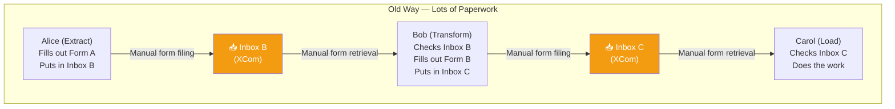
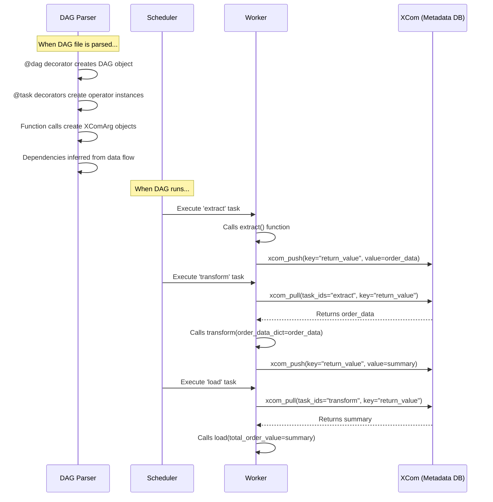
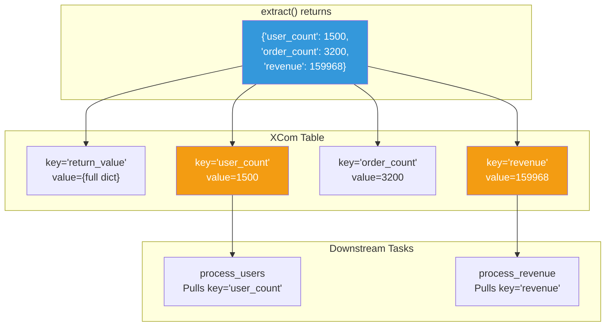
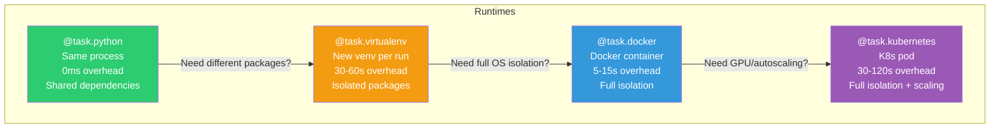
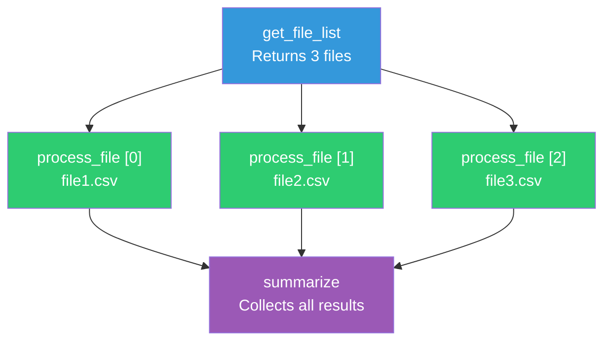

# 09 — TaskFlow API: Modern Airflow for Pythonic Pipelines

> **"TaskFlow turns Airflow from a YAML-like configuration framework into a natural Python programming experience."**

---

## Table of Contents

- [1. Intuition — Why TaskFlow Exists](#1-intuition--why-taskflow-exists)
- [2. Real-World Analogy — From Paperwork to Conversation](#2-real-world-analogy--from-paperwork-to-conversation)
- [3. TaskFlow Fundamentals](#3-taskflow-fundamentals)
- [4. Automatic XCom — The Magic of Data Passing](#4-automatic-xcom--the-magic-of-data-passing)
- [5. TaskFlow vs Traditional Operators](#5-taskflow-vs-traditional-operators)
- [6. Multiple Outputs](#6-multiple-outputs)
- [7. TaskFlow with Different Runtimes](#7-taskflow-with-different-runtimes)
- [8. Mixing TaskFlow with Traditional Operators](#8-mixing-taskflow-with-traditional-operators)
- [9. Custom XCom Backends with TaskFlow](#9-custom-xcom-backends-with-taskflow)
- [10. Error Handling in TaskFlow](#10-error-handling-in-taskflow)
- [11. Testing TaskFlow DAGs](#11-testing-taskflow-dags)
- [12. Advanced TaskFlow Patterns](#12-advanced-taskflow-patterns)
- [13. Production Scenarios](#13-production-scenarios)
- [14. Troubleshooting](#14-troubleshooting)
- [15. Performance Considerations](#15-performance-considerations)
- [16. Common Mistakes](#16-common-mistakes)
- [17. Interview Questions](#17-interview-questions)

---

## 1. Intuition — Why TaskFlow Exists

Before Airflow 2.0, writing a simple ETL pipeline required a surprising amount of boilerplate:

```python
# Pre-TaskFlow (Airflow 1.x style) — Look at all this ceremony!
def extract_func(**kwargs):
    data = get_data_from_api()
    kwargs["ti"].xcom_push(key="raw_data", value=data)    # Manual XCom push

def transform_func(**kwargs):
    ti = kwargs["ti"]
    raw = ti.xcom_pull(task_ids="extract", key="raw_data")  # Manual XCom pull
    result = process(raw)
    ti.xcom_push(key="processed", value=result)              # Manual XCom push again

def load_func(**kwargs):
    ti = kwargs["ti"]
    data = ti.xcom_pull(task_ids="transform", key="processed")  # Manual XCom pull
    save_to_db(data)

with DAG("old_style", ...) as dag:
    extract = PythonOperator(task_id="extract", python_callable=extract_func)
    transform = PythonOperator(task_id="transform", python_callable=transform_func)
    load = PythonOperator(task_id="load", python_callable=load_func)
    
    extract >> transform >> load    # Manual dependency definition
```

**Problems with this approach:**
1. **Boilerplate everywhere** — XCom push/pull is verbose and error-prone
2. **String-based references** — `task_ids="extract"` is a typo waiting to happen
3. **No type safety** — You have no idea what data type XCom carries
4. **Implicit data flow** — Dependencies between tasks are defined separately from data flow
5. **Not Pythonic** — Doesn't feel like writing normal Python code

**TaskFlow (Airflow 2.0+) solves all of this:**

```python
# TaskFlow — Clean, Pythonic, intuitive
from airflow.decorators import dag, task
from datetime import datetime

@dag(schedule="@daily", start_date=datetime(2024, 1, 1))
def my_pipeline():
    
    @task
    def extract():
        return get_data_from_api()          # Return value = automatic XCom push
    
    @task
    def transform(raw_data: dict):          # Parameter = automatic XCom pull
        return process(raw_data)
    
    @task
    def load(processed_data: dict):
        save_to_db(processed_data)
    
    raw = extract()                          # Looks like a normal function call!
    processed = transform(raw)               # Data flows naturally
    load(processed)                          # Dependencies are implicit

my_pipeline()  # Instantiate the DAG
```

> **💡 Key Insight:** TaskFlow doesn't change *what* Airflow does — it changes *how you write it*. Under the hood, it's still operators, XCom, and task instances. TaskFlow is syntactic sugar that makes the 90% use case (Python functions passing data) feel natural.

---

## 2. Real-World Analogy — From Paperwork to Conversation

### Before TaskFlow: The Bureaucratic Office



### After TaskFlow: The Casual Conversation


TaskFlow is like going from **passing paper forms through inboxes** to **having a direct conversation**. The inboxes (XCom) still exist behind the scenes, but you don't have to think about them.

---

## 3. TaskFlow Fundamentals

### The @task Decorator

```python
from airflow.decorators import dag, task
from datetime import datetime

@dag(
    schedule="@daily",
    start_date=datetime(2024, 1, 1),
    catchup=False,
    tags=["example", "taskflow"],
    default_args={
        "retries": 3,
        "owner": "data-team",
    },
)
def basic_taskflow_example():
    """A simple TaskFlow DAG demonstrating the basics."""
    
    @task()
    def extract():
        """Extract data from a source."""
        import json
        data_string = '{"1001": 301.27, "1002": 433.21, "1003": 502.22}'
        order_data = json.loads(data_string)
        return order_data
    
    @task()
    def transform(order_data_dict: dict) -> dict:
        """Calculate total order value."""
        total_order_value = 0
        for value in order_data_dict.values():
            total_order_value += value
        return {"total_order_value": total_order_value}
    
    @task()
    def load(total_order_value: dict):
        """Load the result to a destination."""
        print(f"Total order value is: {total_order_value}")
    
    # Wire the tasks — data flow defines both dependencies AND data passing
    order_data = extract()
    order_summary = transform(order_data)
    load(order_summary)

# Instantiate the DAG
basic_taskflow_example()
```

### What Happens Under the Hood



### The @dag Decorator

```python
from airflow.decorators import dag
from datetime import datetime, timedelta

@dag(
    # Schedule
    schedule="@daily",                   # Cron, preset, timedelta, timetable, or dataset
    start_date=datetime(2024, 1, 1),
    end_date=None,                       # Optional end date
    catchup=False,                       # Don't backfill historical runs
    
    # Behavior
    max_active_runs=1,                   # Only 1 run at a time
    max_active_tasks=16,                 # Max concurrent tasks within this DAG
    dagrun_timeout=timedelta(hours=6),   # Timeout for the entire DAG run
    
    # Metadata
    tags=["production", "etl"],
    description="Daily ETL pipeline",
    doc_md=__doc__,                      # Use module docstring
    
    # Defaults for all tasks
    default_args={
        "owner": "data-engineering",
        "retries": 3,
        "retry_delay": timedelta(minutes=5),
        "email_on_failure": True,
        "email": ["oncall@company.com"],
    },
    
    # Rendering
    render_template_as_native_obj=True,  # Return Python objects, not strings
)
def my_production_dag():
    """## My Production DAG
    
    Processes daily order data from multiple sources.
    """
    pass  # Tasks defined inside

my_production_dag()
```

### The @task Decorator — Full Options

```python
from airflow.decorators import task
from datetime import timedelta

@task(
    # Identity
    task_id="custom_task_id",           # Override auto-generated ID
    
    # Retry behavior
    retries=5,
    retry_delay=timedelta(minutes=2),
    retry_exponential_backoff=True,
    
    # Timeout
    execution_timeout=timedelta(hours=1),
    
    # Scheduling
    pool="my_pool",
    pool_slots=1,
    queue="default",
    priority_weight=10,
    
    # Dependencies
    trigger_rule="all_success",
    
    # Callbacks
    on_failure_callback=notify_slack,
    on_success_callback=log_success,
    
    # XCom behavior
    multiple_outputs=False,             # Whether to unpack dict into separate XCom entries
    do_xcom_push=True,                 # Whether to push return value to XCom
    
    # Documentation
    doc_md="## Task Documentation",
)
def my_task(input_data: dict) -> dict:
    """Process input data and return results."""
    return {"result": "processed"}
```

---

## 4. Automatic XCom — The Magic of Data Passing

### How Return Values Become XCom

```python
@task
def producer():
    return {"key": "value", "count": 42}
    # Airflow automatically does:
    # ti.xcom_push(key="return_value", value={"key": "value", "count": 42})

@task
def consumer(data: dict):
    print(data)   # {"key": "value", "count": 42}
    # Airflow automatically does:
    # data = ti.xcom_pull(task_ids="producer", key="return_value")

# When you write this:
result = producer()
consumer(result)

# Airflow interprets it as:
# 1. producer() returns XComArg (not the actual data!)
# 2. consumer(result) creates a dependency: consumer depends on producer
# 3. At runtime, XCom is used to pass the data
```

### XComArg — The Proxy Object

```python
@task
def extract():
    return [1, 2, 3]

# This does NOT execute the function!
# It returns an XComArg — a placeholder that says
# "I will be the return value of the extract task"
result = extract()
print(type(result))  # <class 'airflow.models.xcom_arg.XComArg'>

# XComArg carries:
# - task_id: "extract"
# - key: "return_value"
# - operator: the PythonDecoratedOperator instance
```

> **⚠️ Critical Understanding:** When you write `result = extract()` inside a `@dag` function, you are NOT calling the function. You are telling Airflow's DAG parser to create a task and return a reference to its future output. The actual function runs later, on a worker, during DAG execution.

---

## 5. TaskFlow vs Traditional Operators

### Side-by-Side Comparison

```python
# =============================================
# TRADITIONAL APPROACH
# =============================================
from airflow import DAG
from airflow.operators.python import PythonOperator
from datetime import datetime

def _extract(**kwargs):
    data = {"users": 100, "orders": 250}
    kwargs["ti"].xcom_push(key="raw_data", value=data)

def _transform(**kwargs):
    raw = kwargs["ti"].xcom_pull(task_ids="extract", key="raw_data")
    result = {"revenue": raw["orders"] * 50}
    kwargs["ti"].xcom_push(key="result", value=result)

def _load(**kwargs):
    result = kwargs["ti"].xcom_pull(task_ids="transform", key="result")
    print(f"Loading: {result}")

with DAG("traditional_etl", start_date=datetime(2024, 1, 1), schedule="@daily") as dag:
    extract = PythonOperator(task_id="extract", python_callable=_extract)
    transform = PythonOperator(task_id="transform", python_callable=_transform)
    load = PythonOperator(task_id="load", python_callable=_load)
    extract >> transform >> load


# =============================================
# TASKFLOW APPROACH — Same pipeline!
# =============================================
from airflow.decorators import dag, task
from datetime import datetime

@dag(schedule="@daily", start_date=datetime(2024, 1, 1))
def taskflow_etl():
    
    @task
    def extract() -> dict:
        return {"users": 100, "orders": 250}
    
    @task
    def transform(raw_data: dict) -> dict:
        return {"revenue": raw_data["orders"] * 50}
    
    @task
    def load(result: dict):
        print(f"Loading: {result}")
    
    load(transform(extract()))

taskflow_etl()
```

### Comparison Table

| Aspect | Traditional | TaskFlow |
|--------|------------|----------|
| **Lines of code** | ~20 lines | ~12 lines |
| **XCom handling** | Manual push/pull | Automatic via return/params |
| **Dependencies** | Explicit `>>` operator | Implicit from data flow |
| **Type hints** | None | Supported |
| **Readability** | Moderate | High (Pythonic) |
| **Error-prone** | Yes (string task_ids) | No (compile-time references) |
| **Non-Python tasks** | Full support | Limited (Python-focused) |
| **Complex operators** | Full flexibility | Need to mix with traditional |

---

## 6. Multiple Outputs

### What Multiple Outputs Does

When a task returns a dictionary and `multiple_outputs=True`, each key becomes a **separate XCom entry**. Downstream tasks can pull individual keys.

```python
from airflow.decorators import dag, task
from datetime import datetime

@dag(schedule="@daily", start_date=datetime(2024, 1, 1))
def multiple_outputs_example():
    
    @task(multiple_outputs=True)
    def extract() -> dict:
        """Each key in the returned dict becomes a separate XCom."""
        return {
            "user_count": 1500,
            "order_count": 3200,
            "revenue": 159_968.00,
        }
        # Creates 3 separate XCom entries:
        # key="user_count", value=1500
        # key="order_count", value=3200
        # key="revenue", value=159968.00
        # Plus the full dict as key="return_value"
    
    @task
    def process_users(user_count: int):
        """Receives only the user_count, not the entire dict."""
        print(f"Processing {user_count} users")
    
    @task
    def process_revenue(revenue: float):
        """Receives only the revenue value."""
        print(f"Total revenue: ${revenue:,.2f}")
    
    @task
    def generate_report(user_count: int, order_count: int, revenue: float):
        """Can receive multiple individual values."""
        avg_order = revenue / order_count
        print(f"Report: {user_count} users, {order_count} orders, avg ${avg_order:.2f}")
    
    # Extract returns multiple outputs
    results = extract()
    
    # Each downstream task only gets what it needs
    process_users(results["user_count"])
    process_revenue(results["revenue"])
    generate_report(
        user_count=results["user_count"],
        order_count=results["order_count"],
        revenue=results["revenue"],
    )

multiple_outputs_example()
```

### How Multiple Outputs Work Internally



### Type Hint Shortcut for Multiple Outputs

```python
# Instead of @task(multiple_outputs=True), you can use Dict type hint:
from typing import Dict

@task
def extract() -> Dict[str, int]:
    """Dict return type automatically enables multiple_outputs!"""
    return {"user_count": 1500, "order_count": 3200}

# This is equivalent to:
@task(multiple_outputs=True)
def extract() -> dict:
    return {"user_count": 1500, "order_count": 3200}
```

---

## 7. TaskFlow with Different Runtimes

### @task.python — Default Python Runtime

```python
@task
def my_python_task():
    """Runs in the same Python environment as the Airflow worker."""
    import pandas as pd
    # Uses whatever packages are installed in the worker's env
    return {"status": "done"}
```

### @task.virtualenv — Isolated Virtual Environment

```python
@task.virtualenv(
    requirements=["pandas==2.1.0", "scikit-learn==1.3.0"],
    python_version="3.11",
    system_site_packages=False,
    pip_install_options=["--no-cache-dir"],
)
def train_model(data_path: str) -> dict:
    """
    Runs in a fresh virtual environment with its own packages.
    Each run creates a new venv → adds ~30-60s overhead.
    """
    import pandas as pd
    from sklearn.ensemble import RandomForestClassifier
    
    df = pd.read_csv(data_path)
    model = RandomForestClassifier(n_estimators=100)
    model.fit(df.drop("target", axis=1), df["target"])
    
    return {"accuracy": 0.95, "model_path": "/models/rf_v1.pkl"}
```

### @task.docker — Docker Container

```python
@task.docker(
    image="my-company/data-processor:v2.1",
    auto_remove="success",
    docker_url="unix:///var/run/docker.sock",
    network_mode="bridge",
    mount_tmp_dir=False,
    environment={
        "DATABASE_URL": "postgresql://...",
    },
    mem_limit="4g",
    cpu_quota=200000,
)
def process_in_docker(input_path: str) -> str:
    """Runs inside a Docker container with complete isolation."""
    import heavy_library  # Available only in this container image
    result = heavy_library.process(input_path)
    return result.output_path
```

### @task.kubernetes — Kubernetes Pod

```python
from kubernetes.client import models as k8s

@task.kubernetes(
    image="my-company/ml-worker:latest",
    namespace="data-engineering",
    name="ml-task",
    container_resources=k8s.V1ResourceRequirements(
        requests={"memory": "4Gi", "cpu": "2"},
        limits={"memory": "8Gi", "cpu": "4", "nvidia.com/gpu": "1"},
    ),
    node_selector={"gpu-type": "a100"},
    get_logs=True,
    is_delete_operator_pod=True,
    in_cluster=True,
)
def train_on_kubernetes(dataset_uri: str) -> dict:
    """Runs in a dedicated Kubernetes pod with GPU access."""
    import torch
    # Full GPU access, isolated environment
    model = train_model(dataset_uri)
    return {"model_uri": "s3://models/v2.pkl", "metrics": model.metrics}
```

### @task.branch — Branching Logic

```python
from airflow.decorators import dag, task
from datetime import datetime

@dag(schedule="@daily", start_date=datetime(2024, 1, 1))
def branching_pipeline():
    
    @task.branch
    def choose_path(execution_date=None) -> str:
        """Return the task_id of the branch to follow."""
        if execution_date.day_of_week in (5, 6):  # Weekend
            return "weekend_processing"
        return "weekday_processing"
    
    @task
    def weekday_processing():
        return "Incremental update"
    
    @task
    def weekend_processing():
        return "Full refresh"
    
    @task(trigger_rule="none_failed_min_one_success")
    def final_step(result: str = None):
        print(f"Pipeline completed: {result}")
    
    branch = choose_path()
    weekday_result = weekday_processing()
    weekend_result = weekend_processing()
    
    branch >> [weekday_result, weekend_result]
    # final_step runs regardless of which branch was taken

branching_pipeline()
```

### @task.short_circuit — Conditional Execution

```python
@task.short_circuit
def check_if_data_exists(ds=None) -> bool:
    """If returns False, all downstream tasks are skipped."""
    import boto3
    s3 = boto3.client("s3")
    try:
        s3.head_object(Bucket="data-lake", Key=f"raw/{ds}/data.parquet")
        return True
    except s3.exceptions.ClientError:
        return False  # Skip all downstream tasks

@dag(schedule="@daily", start_date=datetime(2024, 1, 1))
def conditional_pipeline():
    check = check_if_data_exists()
    process = process_data()
    load = load_data()
    
    check >> process >> load  # process and load are skipped if check returns False

conditional_pipeline()
```

### Runtime Comparison



---

## 8. Mixing TaskFlow with Traditional Operators

### TaskFlow + Traditional Operators in One DAG

You don't have to choose — mix and match based on what works best:

```python
from airflow.decorators import dag, task
from airflow.operators.bash import BashOperator
from airflow.providers.amazon.aws.sensors.s3 import S3KeySensor
from airflow.providers.amazon.aws.transfers.s3_to_redshift import S3ToRedshiftOperator
from datetime import datetime

@dag(schedule="@daily", start_date=datetime(2024, 1, 1), catchup=False)
def mixed_pipeline():
    """Pipeline mixing TaskFlow and traditional operators."""
    
    # Traditional: Sensor (no TaskFlow equivalent)
    wait_for_data = S3KeySensor(
        task_id="wait_for_data",
        bucket_name="data-lake",
        bucket_key="raw/{{ ds }}/orders.parquet",
        aws_conn_id="aws_default",
        timeout=3600,
        mode="reschedule",
    )
    
    # TaskFlow: Python processing
    @task
    def validate_data(s3_path: str) -> dict:
        """Custom validation logic — perfect for TaskFlow."""
        import boto3
        s3 = boto3.client("s3")
        # ... validation logic ...
        return {
            "record_count": 15000,
            "valid": True,
            "s3_path": s3_path,
        }
    
    @task
    def transform_data(validation_result: dict) -> str:
        """Transform and return output path."""
        if not validation_result["valid"]:
            raise ValueError("Data validation failed!")
        # ... transformation logic ...
        output_path = f"processed/{validation_result['s3_path']}"
        return output_path
    
    # Traditional: Specialized operator (no TaskFlow equivalent)
    load_to_redshift = S3ToRedshiftOperator(
        task_id="load_to_redshift",
        schema="analytics",
        table="orders",
        s3_bucket="data-lake",
        s3_key="{{ ti.xcom_pull(task_ids='transform_data') }}",
        copy_options=["FORMAT AS PARQUET"],
        redshift_conn_id="redshift_default",
        aws_conn_id="aws_default",
    )
    
    # Traditional: Bash command
    notify = BashOperator(
        task_id="send_notification",
        bash_command='echo "Pipeline completed for {{ ds }}"',
    )
    
    # Wire it all together
    validation = validate_data(s3_path="raw/{{ ds }}/orders.parquet")
    output = transform_data(validation)
    
    # Connect TaskFlow to traditional operators
    wait_for_data >> validation
    output >> load_to_redshift >> notify

mixed_pipeline()
```

### How to Pass Data Between TaskFlow and Traditional

```python
@dag(schedule="@daily", start_date=datetime(2024, 1, 1))
def data_passing_example():
    
    # TaskFlow → Traditional
    @task
    def produce_data() -> str:
        return "s3://bucket/data/output.parquet"
    
    # Traditional operator reading TaskFlow output via Jinja
    bash_task = BashOperator(
        task_id="process_file",
        bash_command="echo 'Processing: {{ ti.xcom_pull(task_ids=\"produce_data\") }}'",
    )
    
    # TaskFlow → Traditional (using XComArg directly)
    data_ref = produce_data()
    data_ref >> bash_task  # Set dependency
    
    # Traditional → TaskFlow
    generate = BashOperator(
        task_id="generate_path",
        bash_command="echo 's3://bucket/result.csv'",
        do_xcom_push=True,  # BashOperator pushes stdout to XCom
    )
    
    @task
    def consume_from_bash(path: str):
        print(f"Got from bash: {path}")
    
    # Use .output to get XComArg from traditional operator
    consume_from_bash(generate.output)

data_passing_example()
```

---

## 9. Custom XCom Backends with TaskFlow

### Why Custom XCom Backends Matter for TaskFlow

TaskFlow makes XCom usage effortless — which means you'll use it *more*. If your tasks pass large objects, you need a custom backend.

```python
# Custom S3 XCom Backend
from airflow.models.xcom import BaseXCom
import json
import uuid

class S3XComBackend(BaseXCom):
    """
    Store XCom values in S3 for TaskFlow pipelines
    that pass large data between tasks.
    """
    
    PREFIX = "xcom"
    BUCKET = "my-airflow-xcom-bucket"
    
    @staticmethod
    def serialize_value(value, *, key=None, task_id=None,
                        dag_id=None, run_id=None, map_index=-1):
        from airflow.providers.amazon.aws.hooks.s3 import S3Hook
        
        hook = S3Hook(aws_conn_id="aws_default")
        s3_key = f"{S3XComBackend.PREFIX}/{dag_id}/{run_id}/{task_id}/{key or uuid.uuid4().hex}.json"
        
        hook.load_string(
            string_data=json.dumps(value),
            key=s3_key,
            bucket_name=S3XComBackend.BUCKET,
            replace=True,
        )
        
        # Store only the S3 reference in the metadata DB
        return BaseXCom.serialize_value({"__s3_ref__": s3_key})
    
    @staticmethod
    def deserialize_value(result):
        value = BaseXCom.deserialize_value(result)
        
        if isinstance(value, dict) and "__s3_ref__" in value:
            from airflow.providers.amazon.aws.hooks.s3 import S3Hook
            
            hook = S3Hook(aws_conn_id="aws_default")
            content = hook.read_key(
                key=value["__s3_ref__"],
                bucket_name=S3XComBackend.BUCKET,
            )
            return json.loads(content)
        
        return value


# Configuration: airflow.cfg
# [core]
# xcom_backend = my_package.xcom_backends.S3XComBackend

# Now TaskFlow code works transparently with large data:
@task
def produce_large_data():
    return {"data": list(range(1_000_000))}  # Stored in S3, not metadata DB!

@task
def consume_large_data(data: dict):
    print(f"Got {len(data['data'])} records")  # Retrieved from S3 transparently
```

---

## 10. Error Handling in TaskFlow

### Exception Handling Patterns

```python
from airflow.decorators import dag, task
from airflow.exceptions import AirflowFailException, AirflowSkipException
from datetime import datetime

@dag(schedule="@daily", start_date=datetime(2024, 1, 1))
def error_handling_pipeline():
    
    @task(retries=3, retry_delay=timedelta(minutes=2))
    def fetch_from_api(endpoint: str) -> dict:
        """Retries on transient failures, fails fast on permanent errors."""
        import requests
        
        try:
            response = requests.get(endpoint, timeout=30)
            response.raise_for_status()
            return response.json()
            
        except requests.exceptions.ConnectionError:
            # Transient — will retry (it's a regular exception)
            raise
            
        except requests.exceptions.HTTPError as e:
            if e.response.status_code == 404:
                # Data doesn't exist for this date — skip, don't retry
                raise AirflowSkipException(f"No data at {endpoint}")
            elif e.response.status_code >= 500:
                # Server error — retry might help
                raise
            else:
                # Client error (4xx) — retrying won't help
                raise AirflowFailException(f"Permanent error: {e}")
    
    @task
    def validate(data: dict) -> dict:
        """Validate data quality."""
        if not data:
            raise AirflowSkipException("Empty dataset — skipping")
        if data.get("record_count", 0) < 100:
            raise ValueError(f"Too few records: {data['record_count']}")
        return data
    
    @task(trigger_rule="none_failed_min_one_success")
    def report(data: dict = None):
        """Runs even if upstream was skipped."""
        if data is None:
            print("No data was processed today")
        else:
            print(f"Processed {data.get('record_count', 'unknown')} records")
    
    raw = fetch_from_api(endpoint="https://api.example.com/data/{{ ds }}")
    validated = validate(raw)
    report(validated)

error_handling_pipeline()
```

### Callbacks in TaskFlow

```python
def on_failure_alert(context):
    """Send alert when task fails."""
    task_id = context["task_instance"].task_id
    dag_id = context["dag"].dag_id
    print(f"ALERT: {dag_id}.{task_id} failed!")

@task(
    on_failure_callback=on_failure_alert,
    on_success_callback=lambda ctx: print("Success!"),
    on_retry_callback=lambda ctx: print(f"Retry #{ctx['ti'].try_number}"),
)
def risky_task():
    """Task with comprehensive callbacks."""
    import random
    if random.random() < 0.5:
        raise Exception("Random failure!")
    return "success"
```

---

## 11. Testing TaskFlow DAGs

### Unit Testing TaskFlow Tasks

```python
# test_my_pipeline.py
import pytest
from datetime import datetime
from airflow.models import DagBag

class TestTaskFlowPipeline:
    """Test suite for TaskFlow DAGs."""
    
    def test_dag_loads_without_errors(self):
        """Verify DAG file can be parsed without import errors."""
        dag_bag = DagBag(dag_folder="dags/", include_examples=False)
        assert len(dag_bag.import_errors) == 0, f"DAG import errors: {dag_bag.import_errors}"
    
    def test_dag_has_correct_tasks(self):
        """Verify DAG structure."""
        dag_bag = DagBag(dag_folder="dags/", include_examples=False)
        dag = dag_bag.get_dag("taskflow_etl")
        
        assert dag is not None
        task_ids = [t.task_id for t in dag.tasks]
        assert "extract" in task_ids
        assert "transform" in task_ids
        assert "load" in task_ids
    
    def test_dag_dependencies(self):
        """Verify task dependencies."""
        dag_bag = DagBag(dag_folder="dags/", include_examples=False)
        dag = dag_bag.get_dag("taskflow_etl")
        
        extract_task = dag.get_task("extract")
        transform_task = dag.get_task("transform")
        
        # transform should depend on extract
        assert "extract" in [t.task_id for t in transform_task.upstream_list]


class TestTaskFunctions:
    """Test the actual Python functions independently."""
    
    def test_extract_returns_data(self):
        """Test extract function in isolation."""
        # Import the actual function (not the decorated task)
        from dags.my_pipeline import extract
        
        # For @task decorated functions, the underlying function
        # is accessible via the .function attribute
        # But usually it's easier to keep logic in separate modules
        result = extract.function()
        assert isinstance(result, dict)
        assert "users" in result
    
    def test_transform_calculates_correctly(self):
        """Test transform with known input."""
        from dags.my_pipeline import transform
        
        input_data = {"users": 100, "orders": 50}
        result = transform.function(input_data)
        assert result["revenue"] == 50 * 49.99
    
    def test_transform_handles_empty_input(self):
        """Test transform with edge cases."""
        from dags.my_pipeline import transform
        
        with pytest.raises(ValueError):
            transform.function({})
```

### Best Practice: Separate Logic from Orchestration

```python
# logic/etl.py — Pure Python, easily testable
def extract_orders(date: str) -> dict:
    """Pure function — no Airflow dependencies."""
    # ... business logic ...
    return {"orders": [...], "count": 100}

def transform_orders(raw_data: dict) -> dict:
    """Pure function — no Airflow dependencies."""
    # ... business logic ...
    return {"revenue": sum(o["amount"] for o in raw_data["orders"])}

def load_orders(data: dict, target: str) -> None:
    """Pure function — no Airflow dependencies."""
    # ... business logic ...


# dags/orders_pipeline.py — Thin orchestration layer
from airflow.decorators import dag, task
from datetime import datetime

@dag(schedule="@daily", start_date=datetime(2024, 1, 1))
def orders_pipeline():
    
    @task
    def extract(ds=None):
        from logic.etl import extract_orders
        return extract_orders(date=ds)
    
    @task
    def transform(raw_data: dict):
        from logic.etl import transform_orders
        return transform_orders(raw_data)
    
    @task
    def load(data: dict):
        from logic.etl import load_orders
        load_orders(data, target="analytics.orders")
    
    load(transform(extract()))

orders_pipeline()


# tests/test_etl.py — Test pure logic, no Airflow needed!
from logic.etl import extract_orders, transform_orders

def test_transform_calculates_revenue():
    raw = {"orders": [{"amount": 10}, {"amount": 20}]}
    result = transform_orders(raw)
    assert result["revenue"] == 30
```

---

## 12. Advanced TaskFlow Patterns

### Dynamic Task Mapping with TaskFlow

```python
from airflow.decorators import dag, task
from datetime import datetime

@dag(schedule="@daily", start_date=datetime(2024, 1, 1))
def dynamic_task_mapping():
    """Process a variable number of items dynamically."""
    
    @task
    def get_file_list() -> list[str]:
        """Return a list of files to process."""
        return [
            "s3://bucket/file1.csv",
            "s3://bucket/file2.csv",
            "s3://bucket/file3.csv",
        ]
    
    @task
    def process_file(file_path: str) -> dict:
        """Process a single file. This task will be mapped."""
        print(f"Processing: {file_path}")
        return {"file": file_path, "rows": 1000}
    
    @task
    def summarize(results: list[dict]):
        """Collect all results."""
        total = sum(r["rows"] for r in results)
        print(f"Total rows across {len(results)} files: {total}")
    
    files = get_file_list()
    
    # .expand() creates one task instance per item in the list
    processed = process_file.expand(file_path=files)
    
    summarize(processed)

dynamic_task_mapping()
```



### Nested TaskFlow Groups

```python
from airflow.decorators import dag, task, task_group
from datetime import datetime

@dag(schedule="@daily", start_date=datetime(2024, 1, 1))
def grouped_pipeline():
    
    @task_group(group_id="extract_group")
    def extract_sources():
        """Group related extract tasks together."""
        
        @task
        def extract_users():
            return {"users": [1, 2, 3]}
        
        @task
        def extract_orders():
            return {"orders": [100, 200, 300]}
        
        return {
            "users": extract_users(),
            "orders": extract_orders(),
        }
    
    @task_group(group_id="transform_group")
    def transform_data(raw_users, raw_orders):
        """Transform tasks grouped together."""
        
        @task
        def merge_data(users: dict, orders: dict) -> dict:
            return {**users, **orders}
        
        @task
        def enrich(merged: dict) -> dict:
            merged["enriched"] = True
            return merged
        
        merged = merge_data(users=raw_users, orders=raw_orders)
        return enrich(merged)
    
    @task
    def load(data: dict):
        print(f"Loading: {data}")
    
    # Clean pipeline flow
    sources = extract_sources()
    transformed = transform_data(
        raw_users=sources["users"],
        raw_orders=sources["orders"],
    )
    load(transformed)

grouped_pipeline()
```

### Accessing Airflow Context in TaskFlow

```python
@task
def context_aware_task(**kwargs):
    """Access the full Airflow context."""
    # Method 1: **kwargs
    ds = kwargs["ds"]
    execution_date = kwargs["execution_date"]
    dag_run = kwargs["dag_run"]
    task_instance = kwargs["ti"]
    
    print(f"Running for {ds}")
    print(f"Run ID: {dag_run.run_id}")
    
    return {"date": ds}

@task
def context_with_named_params(ds=None, execution_date=None, ti=None):
    """Access specific context variables as named params."""
    print(f"Date: {ds}")
    print(f"Task: {ti.task_id}")
    
    return {"date": ds}

# Both approaches work — named params are cleaner
```

---

## 13. Production Scenarios

### Scenario 1: Complete Data Pipeline with All TaskFlow Features

```python
from airflow.decorators import dag, task, task_group
from airflow.providers.amazon.aws.sensors.s3 import S3KeySensor
from airflow.utils.trigger_rule import TriggerRule
from datetime import datetime, timedelta
from typing import Dict

@dag(
    schedule="0 6 * * *",
    start_date=datetime(2024, 1, 1),
    catchup=False,
    max_active_runs=1,
    tags=["production", "etl", "taskflow"],
    default_args={
        "owner": "data-engineering",
        "retries": 3,
        "retry_delay": timedelta(minutes=5),
        "retry_exponential_backoff": True,
        "execution_timeout": timedelta(hours=2),
        "on_failure_callback": notify_oncall,
    },
)
def production_etl_taskflow():
    """
    ## Production ETL Pipeline (TaskFlow)
    
    Ingests data from 3 sources, transforms, validates, and loads to warehouse.
    """
    
    # Sensor — use traditional (no TaskFlow equivalent)
    wait_for_data = S3KeySensor(
        task_id="wait_for_raw_data",
        bucket_name="data-lake-prod",
        bucket_key="raw/events/dt={{ ds }}/_SUCCESS",
        aws_conn_id="aws_production",
        timeout=7200,
        deferrable=True,
    )
    
    # Extraction task group
    @task_group(group_id="extract")
    def extract_all_sources():
        
        @task(retries=5)
        def extract_events(ds=None) -> str:
            """Extract event data from S3."""
            from logic.extractors import EventExtractor
            extractor = EventExtractor(date=ds, env="production")
            output_path = extractor.run()
            return output_path
        
        @task(retries=5)
        def extract_users(ds=None) -> str:
            """Extract user data from API."""
            from logic.extractors import UserExtractor
            extractor = UserExtractor(date=ds, env="production")
            output_path = extractor.run()
            return output_path
        
        @task(retries=3, soft_fail=True)
        def extract_enrichment(ds=None) -> str:
            """Extract enrichment data. Optional — soft_fail if unavailable."""
            from logic.extractors import EnrichmentExtractor
            return EnrichmentExtractor(date=ds).run()
        
        return {
            "events": extract_events(),
            "users": extract_users(),
            "enrichment": extract_enrichment(),
        }
    
    # Transform
    @task(execution_timeout=timedelta(hours=3))
    def transform(events_path: str, users_path: str, 
                  enrichment_path: str = None, ds=None) -> str:
        """Join and transform all sources."""
        from logic.transformers import MainTransformer
        transformer = MainTransformer(
            events=events_path,
            users=users_path,
            enrichment=enrichment_path,
            date=ds,
        )
        return transformer.run()
    
    # Validate
    @task(multiple_outputs=True)
    def validate(output_path: str, ds=None) -> Dict[str, any]:
        """Run data quality checks."""
        from logic.validators import DataValidator
        validator = DataValidator(path=output_path, date=ds)
        results = validator.run_all_checks()
        
        if not results["passed"]:
            raise ValueError(f"Quality checks failed: {results['failures']}")
        
        return {
            "path": output_path,
            "record_count": results["record_count"],
            "passed": results["passed"],
        }
    
    # Load
    @task
    def load_to_warehouse(path: str, record_count: int):
        """Load validated data to Redshift."""
        from logic.loaders import RedshiftLoader
        loader = RedshiftLoader(conn_id="redshift_production")
        loader.load(path=path, table="analytics.events")
        print(f"Loaded {record_count} records")
    
    # Notification
    @task(trigger_rule=TriggerRule.ALL_DONE)
    def send_report(record_count: int = 0, ds=None):
        """Send completion report."""
        from logic.notifications import send_slack_report
        send_slack_report(date=ds, records=record_count)
    
    # Wire everything together
    sources = extract_all_sources()
    
    wait_for_data >> sources["events"]
    
    output = transform(
        events_path=sources["events"],
        users_path=sources["users"],
        enrichment_path=sources["enrichment"],
    )
    
    validation = validate(output)
    
    load_to_warehouse(
        path=validation["path"],
        record_count=validation["record_count"],
    )
    
    send_report(record_count=validation["record_count"])

production_etl_taskflow()
```

### Scenario 2: Dynamic ML Pipeline

```python
from airflow.decorators import dag, task
from datetime import datetime

@dag(schedule="0 2 * * 0", start_date=datetime(2024, 1, 1))
def weekly_ml_pipeline():
    """Weekly ML pipeline with dynamic model training."""
    
    @task
    def get_model_configs() -> list[dict]:
        """Get list of models to train from config DB."""
        return [
            {"name": "churn_predictor", "algo": "xgboost", "features": "v2"},
            {"name": "revenue_forecast", "algo": "lightgbm", "features": "v3"},
            {"name": "anomaly_detector", "algo": "isolation_forest", "features": "v1"},
        ]
    
    @task
    def prepare_dataset(config: dict, ds=None) -> dict:
        """Prepare training dataset for each model."""
        return {
            "model_name": config["name"],
            "dataset_path": f"s3://ml-data/{config['name']}/{ds}/train.parquet",
            "config": config,
        }
    
    @task.kubernetes(
        image="ml-training:latest",
        namespace="ml-workloads",
        container_resources={"requests": {"memory": "8Gi", "cpu": "4"}},
    )
    def train_model(dataset_info: dict) -> dict:
        """Train a model in an isolated K8s pod."""
        # Heavy ML work happens in isolated pod
        return {
            "model_name": dataset_info["model_name"],
            "model_path": f"s3://models/{dataset_info['model_name']}/latest.pkl",
            "metrics": {"accuracy": 0.95, "f1": 0.92},
        }
    
    @task
    def register_models(all_results: list[dict]):
        """Register all trained models in the model registry."""
        for result in all_results:
            print(f"Registered {result['model_name']}: {result['metrics']}")
    
    configs = get_model_configs()
    datasets = prepare_dataset.expand(config=configs)
    models = train_model.expand(dataset_info=datasets)
    register_models(models)

weekly_ml_pipeline()
```

---

## 14. Troubleshooting

### Problem 1: "Task is not a callable"

| Aspect | Detail |
|--------|--------|
| **Symptom** | `TypeError: 'XComArg' object is not callable` |
| **Root Cause** | Trying to call the result of a TaskFlow task as if it were a function |
| **Fix** | Remember that `extract()` returns an XComArg, not actual data |

```python
# ❌ BAD
@task
def extract():
    return [1, 2, 3]

result = extract()
for item in result:       # ERROR! result is XComArg, not a list
    process(item)

# ✅ GOOD — use .expand() for dynamic mapping
result = extract()
process.expand(item=result)
```

### Problem 2: DAG Not Appearing in UI

| Aspect | Detail |
|--------|--------|
| **Symptom** | DAG defined with @dag doesn't show in the web UI |
| **Root Cause** | Forgot to call the decorated function at module level |
| **Fix** | Add `my_dag()` at the bottom of the file |

```python
@dag(schedule="@daily", start_date=datetime(2024, 1, 1))
def my_pipeline():
    @task
    def my_task():
        pass
    my_task()

# ❌ Missing this line — DAG won't register!
# ✅ Must instantiate the DAG:
my_pipeline()
```

### Problem 3: XCom Data Not Serializable

| Aspect | Detail |
|--------|--------|
| **Symptom** | `TypeError: Object of type X is not JSON serializable` |
| **Root Cause** | Returning non-serializable objects from @task functions |
| **Fix** | Return JSON-serializable types or use custom XCom backend |

```python
# ❌ BAD — pandas DataFrame is not JSON serializable
@task
def extract():
    import pandas as pd
    return pd.DataFrame({"a": [1, 2, 3]})  # Fails!

# ✅ GOOD — return serializable data or a reference
@task
def extract():
    import pandas as pd
    df = pd.DataFrame({"a": [1, 2, 3]})
    path = "/tmp/data.parquet"
    df.to_parquet(path)
    return path  # Return the path, not the DataFrame
```

### Problem 4: Circular Import with @dag

| Aspect | Detail |
|--------|--------|
| **Symptom** | `ImportError: cannot import name 'my_function'` |
| **Root Cause** | Importing heavy modules at top level of DAG file |
| **Fix** | Use lazy imports inside task functions |

```python
# ❌ BAD — heavy import at top level slows DAG parsing
import pandas as pd  # Imported every time DAG is parsed!
import tensorflow as tf

# ✅ GOOD — import inside the task function
@task
def train():
    import pandas as pd        # Only imported when task runs
    import tensorflow as tf    # Not during DAG parsing
    # ...
```

---

## 15. Performance Considerations

### DAG Parse Time Impact

```python
# TaskFlow has slightly higher parse overhead than traditional because
# of decorator processing. Keep these guidelines:

# 1. Keep task count reasonable (< 500 per DAG)
# 2. Use lazy imports inside @task functions
# 3. Don't do heavy computation in the @dag function body
# 4. Use render_template_as_native_obj=True for type preservation

@dag(render_template_as_native_obj=True)
def optimized_dag():
    # Template variables become native Python objects, not strings
    @task
    def my_task(ds=None):
        # ds is a string either way, but complex templates
        # like {{ var.json.config }} return actual dicts
        pass
```

### XCom Serialization Overhead

```python
# Large return values = large XCom = slow metadata DB

# ❌ BAD — Passing 1M records through XCom
@task
def extract() -> list:
    return list(range(1_000_000))  # ~4MB in XCom table!

# ✅ GOOD — Pass reference, not data
@task
def extract() -> str:
    data = list(range(1_000_000))
    path = "s3://bucket/temp/data.json"
    upload_to_s3(data, path)
    return path  # Just a few bytes in XCom

# ✅ ALSO GOOD — Use custom XCom backend for transparent large data
# (see Section 9)
```

---

## 16. Common Mistakes

### Mistake 1: Forgetting to Instantiate the DAG

```python
@dag(schedule="@daily", start_date=datetime(2024, 1, 1))
def my_pipeline():
    @task
    def my_task():
        return "hello"
    my_task()

# ❌ FORGOT THIS — DAG won't appear in Airflow!
# ✅ my_pipeline()   ← Must call the function!
my_pipeline()
```

### Mistake 2: Treating XComArg as Actual Data

```python
@dag(...)
def bad_dag():
    @task
    def get_list():
        return [1, 2, 3]
    
    result = get_list()  # This is XComArg, NOT [1, 2, 3]!
    
    # ❌ Can't iterate over XComArg at parse time
    # for item in result:
    #     process(item)
    
    # ✅ Use dynamic task mapping instead
    @task
    def process(item: int):
        print(item)
    
    process.expand(item=result)
```

### Mistake 3: Heavy Imports at Module Level

```python
# ❌ BAD — imports execute on every DAG parse
import pandas as pd
import numpy as np
import tensorflow as tf  # This alone takes 5+ seconds!

@dag(...)
def ml_pipeline():
    @task
    def train():
        # tf is already imported above — wasteful during parsing
        model = tf.keras.Sequential(...)

# ✅ GOOD — lazy imports inside task
@dag(...)
def ml_pipeline():
    @task
    def train():
        import tensorflow as tf  # Only when task actually runs
        model = tf.keras.Sequential(...)
```

### Mistake 4: Not Using multiple_outputs When Needed

```python
# ❌ Awkward — consumer gets entire dict when it only needs one value
@task
def extract():
    return {"users": [...], "orders": [...], "products": [...]}

@task
def process_users(all_data: dict):
    users = all_data["users"]  # Had to unpack manually

# ✅ Clean — use multiple_outputs
@task(multiple_outputs=True)
def extract():
    return {"users": [...], "orders": [...], "products": [...]}

@task
def process_users(users: list):  # Gets just what it needs
    pass

data = extract()
process_users(data["users"])     # Direct access to individual outputs
```

---

## 17. Interview Questions

### Beginner Level

**Q1: What is the TaskFlow API and why was it introduced?**

> **A:** TaskFlow is a decorator-based API introduced in Airflow 2.0 that lets you write DAGs using Python decorators (`@dag`, `@task`) instead of manually instantiating operators. It was introduced to reduce boilerplate, make XCom data passing automatic, and make DAG code feel like natural Python. Under the hood, it still creates the same operators and XCom, but with much less code.

**Q2: How does data passing work in TaskFlow compared to traditional operators?**

> **A:** In traditional style, you manually push data with `ti.xcom_push()` and pull with `ti.xcom_pull()`, referencing tasks by string IDs. In TaskFlow, you simply `return` values from tasks (automatic push) and pass them as function arguments (automatic pull). The function call syntax `transform(extract())` implicitly creates both the dependency and the data flow.

**Q3: What is an XComArg?**

> **A:** When you call a `@task` decorated function inside a `@dag` function (like `result = extract()`), it doesn't execute the function. Instead, it returns an **XComArg** — a proxy object that represents the future return value of that task. At DAG parse time, XComArg is used to build dependencies. At runtime, it resolves to the actual XCom value.

### Intermediate Level

**Q4: Explain the difference between `@task`, `@task.virtualenv`, `@task.docker`, and `@task.kubernetes`.**

> **A:** They all create Python tasks but run in different environments:
> - `@task` — Runs in the worker's Python environment. Zero overhead, shared dependencies.
> - `@task.virtualenv` — Creates a fresh virtualenv per run with specified packages. 30-60s overhead, useful for dependency isolation.
> - `@task.docker` — Runs in a Docker container. 5-15s overhead, full OS-level isolation.
> - `@task.kubernetes` — Runs in a Kubernetes pod. 30-120s overhead, supports GPU, autoscaling, and maximum isolation.
> 
> Choose based on isolation needs and acceptable startup overhead.

**Q5: How do you mix TaskFlow with traditional operators?**

> **A:** You can freely mix them in the same DAG. Use `.output` to get an XComArg from a traditional operator's XCom, and use Jinja templates (`{{ ti.xcom_pull(...) }}`) to read TaskFlow output in traditional operators. For dependencies, use the `>>` operator between TaskFlow XComArgs and traditional operator instances.

**Q6: What does `multiple_outputs=True` do?**

> **A:** When a `@task` returns a dictionary and `multiple_outputs=True` is set, each key-value pair is stored as a separate XCom entry. This allows downstream tasks to pull individual values without receiving the entire dictionary. You access them with `result["key_name"]`, which creates an XComArg for that specific key.

### Advanced Level

**Q7: How would you design a production TaskFlow pipeline that processes 100 files dynamically?**

> **A:** Use dynamic task mapping with `.expand()`:
> 1. A task returns a list of file paths
> 2. Processing task uses `.expand(file_path=files)` to create one task instance per file
> 3. A final task collects results using list input
>
> Key considerations: set appropriate pool size to limit concurrency, use `@task.kubernetes` for heavy processing tasks to get per-task resource isolation, implement proper error handling so one file failure doesn't block others (use `trigger_rule` on the summary task), and use a custom XCom backend if files produce large intermediate results.

**Q8: What are the performance implications of TaskFlow vs traditional operators?**

> **A:** TaskFlow has slightly higher parse-time overhead due to decorator processing. Each `@task` creates a `_PythonDecoratedOperator` instance, and each function call creates XComArg objects with dependency tracking. However, the runtime performance is identical — TaskFlow generates the same operators underneath. The main performance concern is XCom: TaskFlow makes it so easy to pass data that developers may accidentally pass large objects through XCom, degrading metadata DB performance. Mitigation: use custom XCom backends or pass references (S3 paths) instead of data.

**Q9: Compare and contrast TaskFlow's approach with Prefect's functional API and Dagster's asset-based model.**

> **A:** All three are moving toward more Pythonic data pipeline authoring:
> - **TaskFlow** wraps Airflow's operator model with decorators. XCom is the data transport. It's an incremental improvement — the underlying execution model (scheduler, executor, workers) is unchanged. Strengths: mature ecosystem, backward compatible.
> - **Prefect** was designed functional-first with `@flow` and `@task`. Data passes directly between tasks (no XCom equivalent). It uses a hybrid execution model with dynamic task creation. Strengths: more dynamic, simpler mental model.
> - **Dagster** uses an asset-based model where you define *what* you're producing (assets), not *how* to orchestrate. The framework infers dependencies from asset inputs/outputs. Strengths: data-centric thinking, built-in data quality.
>
> TaskFlow is best for teams already on Airflow wanting a modernization path. Prefect is best for greenfield projects wanting maximum dynamism. Dagster is best for teams focused on data asset management.

---

**[← Previous: 08-sensors.md](08-sensors.md) | [Home](../README.md) | [Next →: 10-dynamic-dags.md](10-dynamic-dags.md)**
