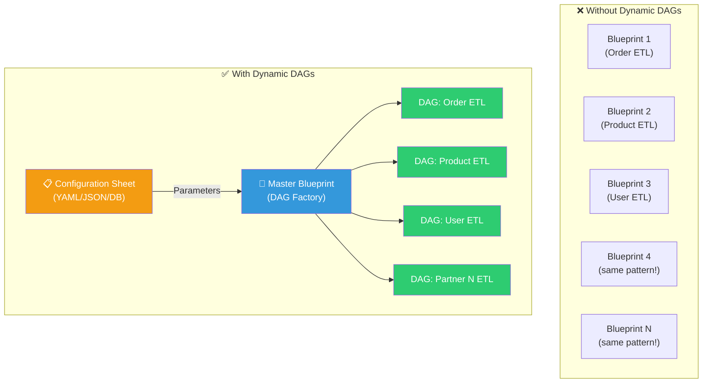
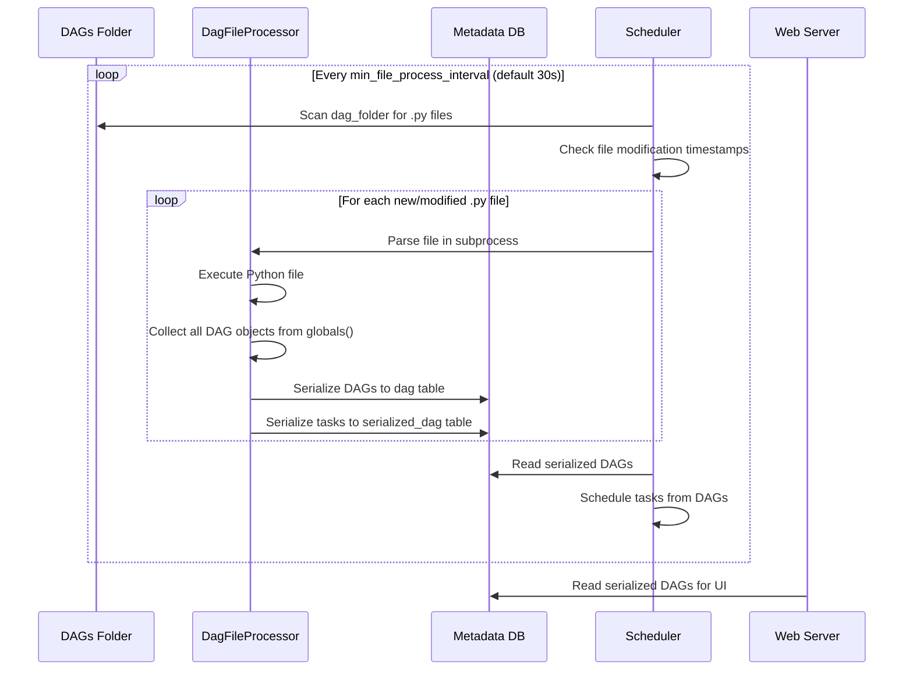
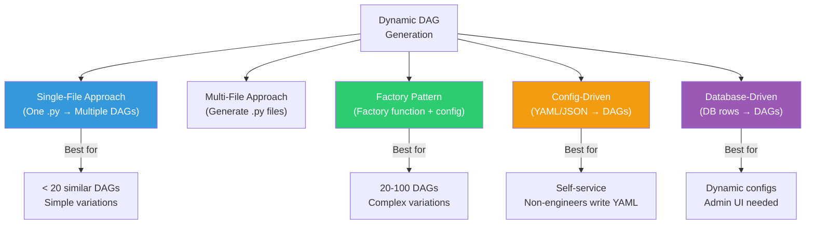
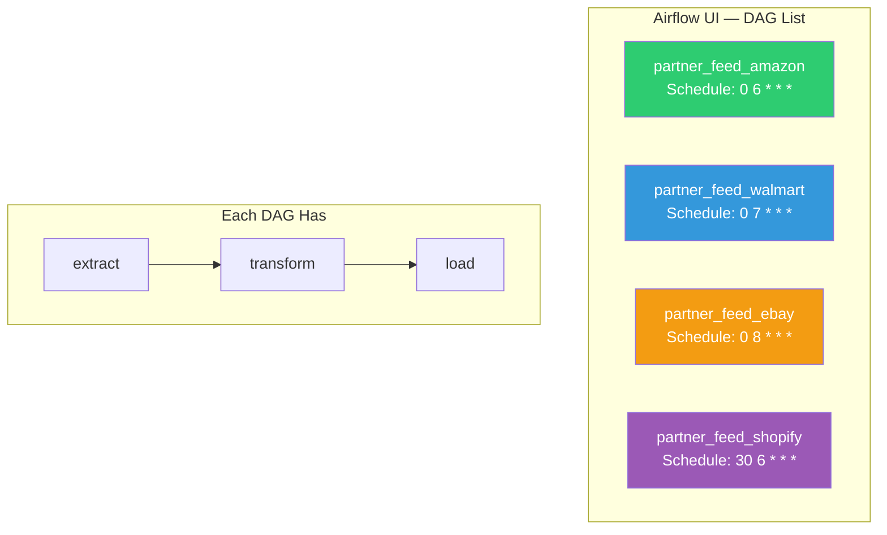
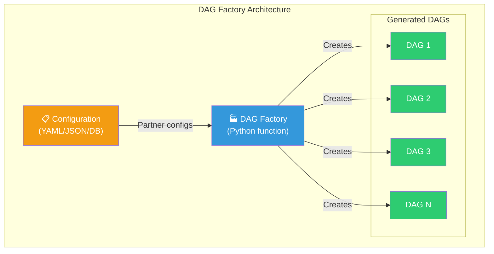
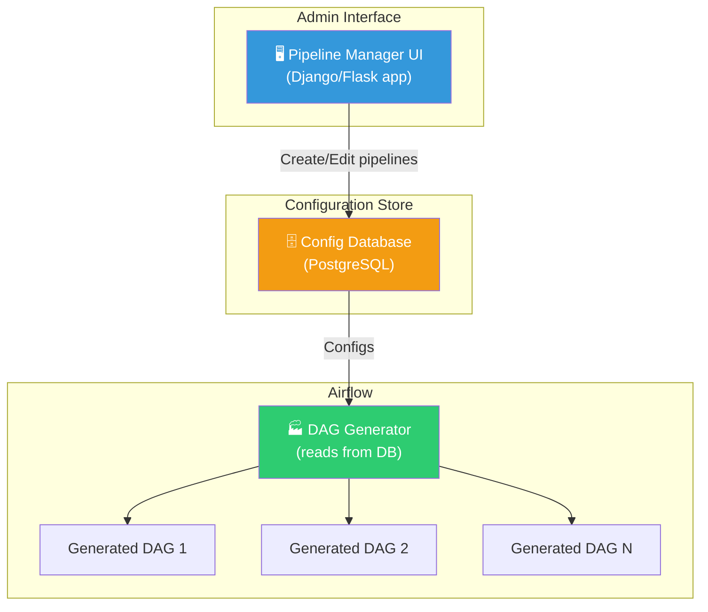
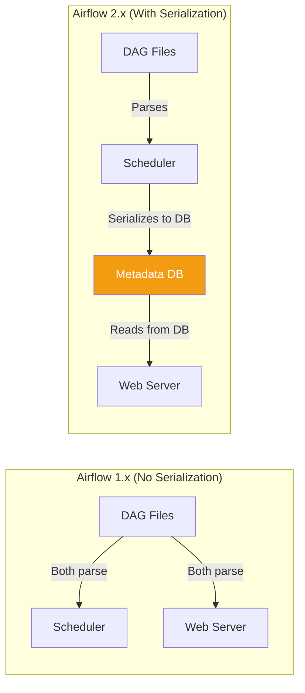
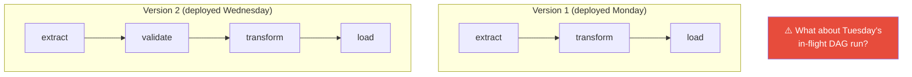
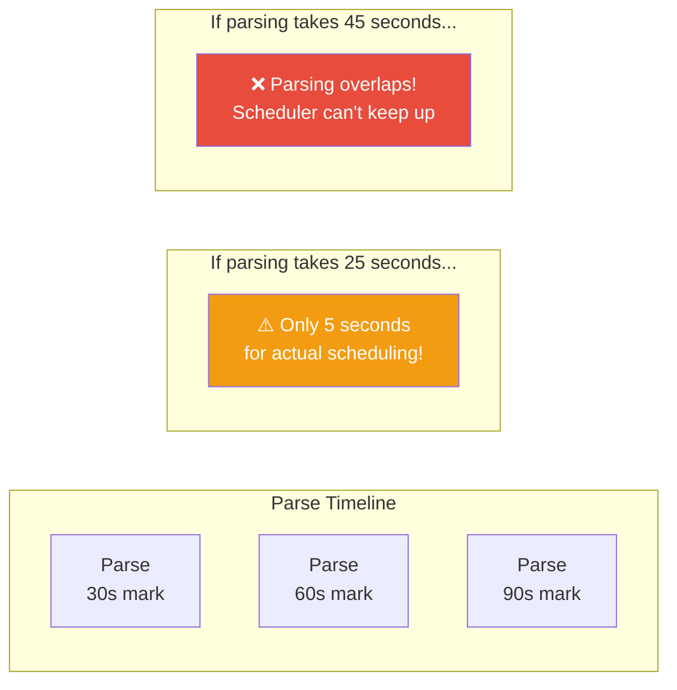

# 10 — Dynamic DAGs: Generating Pipelines Programmatically

> **"The most powerful DAG is the one that writes itself."**

---

## Table of Contents

- [1. Intuition — Why Dynamic DAGs Exist](#1-intuition--why-dynamic-dags-exist)
- [2. Real-World Analogy — The Factory Blueprint Machine](#2-real-world-analogy--the-factory-blueprint-machine)
- [3. How Airflow Discovers DAGs](#3-how-airflow-discovers-dags)
- [4. Approaches to Dynamic DAG Generation](#4-approaches-to-dynamic-dag-generation)
- [5. Single-File Approach — Multiple DAGs from One File](#5-single-file-approach--multiple-dags-from-one-file)
- [6. Multi-File Approach — Generated DAG Files](#6-multi-file-approach--generated-dag-files)
- [7. Factory Pattern — The Production Standard](#7-factory-pattern--the-production-standard)
- [8. YAML-Driven DAG Generation](#8-yaml-driven-dag-generation)
- [9. Database-Driven DAG Generation](#9-database-driven-dag-generation)
- [10. DAG Serialization & Performance](#10-dag-serialization--performance)
- [11. The Global Variables Trap](#11-the-global-variables-trap)
- [12. DAG Versioning Strategies](#12-dag-versioning-strategies)
- [13. Best Practices — Keeping DAG Parsing Fast](#13-best-practices--keeping-dag-parsing-fast)
- [14. Production Scenarios](#14-production-scenarios)
- [15. Troubleshooting](#15-troubleshooting)
- [16. Common Mistakes](#16-common-mistakes)
- [17. Interview Questions](#17-interview-questions)

---

## 1. Intuition — Why Dynamic DAGs Exist

Imagine you're at a data engineering team that manages pipelines for an e-commerce platform. You start with a few handwritten DAGs:

```
dags/
  etl_orders.py          # Orders pipeline
  etl_products.py        # Products pipeline
  etl_users.py           # Users pipeline
```

Life is simple. Then the company grows:

```
dags/
  etl_orders.py
  etl_products.py
  etl_users.py
  etl_inventory.py
  etl_payments.py
  etl_shipping.py
  etl_reviews.py
  etl_recommendations.py
  etl_marketing.py
  etl_analytics.py
  etl_partner_feed_amazon.py
  etl_partner_feed_walmart.py
  etl_partner_feed_ebay.py
  etl_partner_feed_shopify.py
  ... 50 more partner feeds ...
  ... all with slightly different configs but the SAME structure ...
```

Now you have 60+ DAG files that are 90% identical. When you need to change the retry logic or add a monitoring step, you have to edit **every single file**. That's not engineering — that's copy-paste suffering.

**Dynamic DAGs solve this by generating DAGs programmatically from configuration**, turning 60 nearly-identical files into:

```
dags/
  dag_factory.py         # One factory that generates ALL partner feed DAGs
  configs/
    partner_feeds.yaml   # Configuration for each partner
```

> **💡 Key Insight:** If you have 3 DAGs, write them by hand. If you have 30 DAGs with the same structure but different configs, generate them dynamically. The threshold is usually when you find yourself copy-pasting DAG files and changing only a few parameters.

---

## 2. Real-World Analogy — The Factory Blueprint Machine



Think of it like a **cookie cutter factory**:
- The **factory** (your DAG generator code) defines the shape
- The **configuration** (YAML/JSON) defines the flavor, size, and toppings
- The **cookies** (DAGs) are produced automatically with consistent quality

---

## 3. How Airflow Discovers DAGs

Before diving into dynamic generation, you must understand how Airflow finds and loads DAGs.

### The DAG Discovery Process



### Key Points About DAG Discovery

```python
# 1. Airflow scans the dags_folder for .py files
# airflow.cfg: dags_folder = /opt/airflow/dags

# 2. Each .py file is executed as a Python module
# Any DAG object that ends up in the module's globals() is registered

# 3. Files are re-parsed periodically
# min_file_process_interval = 30  (seconds between re-parses)

# 4. ONLY the top-level DAGs folder is scanned by default
# Subdirectories ARE included (unless .airflowignore excludes them)

# 5. .airflowignore works like .gitignore
# Place it in your dags_folder to exclude files/dirs from parsing
```

### What Airflow Looks For

```python
# Airflow finds DAGs by looking at the module's globals() for DAG objects

# Method 1: DAG in globals() via with statement
with DAG("my_dag", ...) as dag:
    pass
# 'dag' is now in globals()

# Method 2: DAG in globals() via variable assignment
dag = DAG("my_dag", ...)
# 'dag' is now in globals()

# Method 3: @dag decorator
@dag(...)
def my_pipeline():
    pass
my_pipeline()  # This adds the DAG to globals()

# Method 4: Dynamic — create DAG and assign to globals()
for i in range(5):
    dag_id = f"dynamic_dag_{i}"
    globals()[dag_id] = create_dag(dag_id)  # Explicitly add to globals()
```

> **🔑 Critical Rule:** If a DAG object isn't in the module's `globals()`, Airflow **will not find it**. This is why dynamic DAGs must explicitly assign DAGs to `globals()`.

---

## 4. Approaches to Dynamic DAG Generation



---

## 5. Single-File Approach — Multiple DAGs from One File

### Basic Loop Pattern

```python
# dags/partner_feed_dags.py
# Generates multiple DAGs from a single file

from airflow import DAG
from airflow.operators.python import PythonOperator
from datetime import datetime, timedelta

# Configuration for each partner
PARTNERS = [
    {"name": "amazon",   "schedule": "0 6 * * *",  "api_key_var": "amazon_key"},
    {"name": "walmart",  "schedule": "0 7 * * *",  "api_key_var": "walmart_key"},
    {"name": "ebay",     "schedule": "0 8 * * *",  "api_key_var": "ebay_key"},
    {"name": "shopify",  "schedule": "30 6 * * *", "api_key_var": "shopify_key"},
]

def create_partner_dag(partner_config):
    """Create a DAG for a single partner."""
    
    dag_id = f"partner_feed_{partner_config['name']}"
    
    default_args = {
        "owner": "data-engineering",
        "retries": 3,
        "retry_delay": timedelta(minutes=5),
    }
    
    dag = DAG(
        dag_id=dag_id,
        default_args=default_args,
        schedule=partner_config["schedule"],
        start_date=datetime(2024, 1, 1),
        catchup=False,
        tags=["partner-feed", partner_config["name"]],
    )
    
    with dag:
        def extract_data(partner_name, **kwargs):
            print(f"Extracting data from {partner_name} API")
            return {"records": 1000}
        
        def transform_data(partner_name, **kwargs):
            ti = kwargs["ti"]
            raw = ti.xcom_pull(task_ids="extract")
            print(f"Transforming {partner_name} data: {raw}")
        
        def load_data(partner_name, **kwargs):
            print(f"Loading {partner_name} data to warehouse")
        
        extract = PythonOperator(
            task_id="extract",
            python_callable=extract_data,
            op_kwargs={"partner_name": partner_config["name"]},
        )
        
        transform = PythonOperator(
            task_id="transform",
            python_callable=transform_data,
            op_kwargs={"partner_name": partner_config["name"]},
        )
        
        load = PythonOperator(
            task_id="load",
            python_callable=load_data,
            op_kwargs={"partner_name": partner_config["name"]},
        )
        
        extract >> transform >> load
    
    return dag

# ⭐ THE CRITICAL PART: Register DAGs in globals()
for partner in PARTNERS:
    dag_id = f"partner_feed_{partner['name']}"
    globals()[dag_id] = create_partner_dag(partner)
```

### What This Creates in the Airflow UI



---

## 6. Multi-File Approach — Generated DAG Files

Instead of one Python file creating multiple DAGs in memory, you can **generate actual .py files**. This is useful when you want each DAG to have its own file for clarity.

```python
# scripts/generate_dags.py — Run this to generate DAG files
# This is NOT in the dags folder — it's a script you run manually or in CI/CD

import os
import yaml
from jinja2 import Environment, FileSystemLoader

# Load configuration
with open("configs/partner_feeds.yaml") as f:
    partners = yaml.safe_load(f)

# Setup Jinja2 template
env = Environment(loader=FileSystemLoader("templates/"))
template = env.get_template("partner_dag.py.j2")

# Generate a .py file for each partner
output_dir = "dags/generated/"
os.makedirs(output_dir, exist_ok=True)

for partner in partners:
    content = template.render(partner=partner)
    filename = f"partner_feed_{partner['name']}.py"
    filepath = os.path.join(output_dir, filename)
    
    with open(filepath, "w") as f:
        f.write(content)
    
    print(f"Generated: {filepath}")
```

```jinja2
{# templates/partner_dag.py.j2 #}
# AUTO-GENERATED — DO NOT EDIT MANUALLY
# Generated from partner_dag.py.j2 template
# Partner: {{ partner.name }}

from airflow import DAG
from airflow.operators.python import PythonOperator
from datetime import datetime, timedelta

default_args = {
    "owner": "data-engineering",
    "retries": {{ partner.retries | default(3) }},
    "retry_delay": timedelta(minutes={{ partner.retry_delay_min | default(5) }}),
}

with DAG(
    dag_id="partner_feed_{{ partner.name }}",
    default_args=default_args,
    schedule="{{ partner.schedule }}",
    start_date=datetime(2024, 1, 1),
    catchup=False,
    tags=["partner-feed", "{{ partner.name }}", "auto-generated"],
) as dag:
    
    extract = PythonOperator(
        task_id="extract",
        python_callable=lambda: __import__('partner_lib').extract("{{ partner.name }}"),
    )
    
    transform = PythonOperator(
        task_id="transform",
        python_callable=lambda: __import__('partner_lib').transform("{{ partner.name }}"),
    )
    
    load = PythonOperator(
        task_id="load",
        python_callable=lambda: __import__('partner_lib').load(
            "{{ partner.name }}", 
            "{{ partner.target_table }}"
        ),
    )
    
    extract >> transform >> load
```

### Single-File vs Multi-File

| Aspect | Single-File | Multi-File |
|--------|------------|------------|
| **Parse performance** | One file to parse (faster) | Many files to parse (slower) |
| **Debugging** | All DAGs from one file | Each DAG in its own file |
| **Version control** | One file to track | Generated files may clutter git |
| **Flexibility** | Python-level flexibility | Template-level flexibility |
| **CI/CD** | No build step needed | Requires generation step |
| **When to use** | < 50 DAGs | > 50 DAGs or non-Python teams |

---

## 7. Factory Pattern — The Production Standard

The factory pattern separates **DAG structure** from **DAG configuration**. It's the gold standard for dynamic DAG generation in production.

### Architecture



### Production-Grade Factory

```python
# dags/factories/etl_dag_factory.py
"""
ETL DAG Factory — Creates standardized ETL pipelines from configuration.

This factory enforces consistent:
- Error handling and retries
- Monitoring and alerting  
- Data quality checks
- Naming conventions
- Tags and documentation
"""

from airflow import DAG
from airflow.operators.python import PythonOperator
from airflow.providers.amazon.aws.sensors.s3 import S3KeySensor
from airflow.operators.email import EmailOperator
from airflow.utils.trigger_rule import TriggerRule
from datetime import datetime, timedelta
from typing import Optional
from dataclasses import dataclass, field


@dataclass
class ETLConfig:
    """Configuration for an ETL pipeline."""
    name: str                              # Pipeline identifier
    source_type: str                       # "s3", "api", "database"
    source_config: dict                    # Source-specific configuration
    target_table: str                      # Warehouse target table
    schedule: str                          # Cron expression
    owner: str = "data-engineering"        # Pipeline owner
    retries: int = 3                       # Number of retries
    retry_delay_minutes: int = 5           # Delay between retries
    timeout_hours: int = 4                 # Pipeline timeout
    sla_hours: Optional[float] = None      # SLA deadline
    quality_checks: list = field(default_factory=list)  # Data quality SQL checks
    tags: list = field(default_factory=lambda: ["etl"])
    alert_emails: list = field(default_factory=lambda: ["data-eng@company.com"])
    enabled: bool = True                   # Can disable without removing config


def create_etl_dag(config: ETLConfig) -> Optional[DAG]:
    """
    Create a standardized ETL DAG from configuration.
    
    Every DAG created by this factory has:
    1. Source waiting (sensor)
    2. Data extraction
    3. Data validation
    4. Data transformation
    5. Data loading
    6. Quality checks
    7. Notification
    8. Cleanup (always runs)
    """
    
    if not config.enabled:
        return None
    
    dag_id = f"etl_{config.name}"
    
    default_args = {
        "owner": config.owner,
        "retries": config.retries,
        "retry_delay": timedelta(minutes=config.retry_delay_minutes),
        "retry_exponential_backoff": True,
        "max_retry_delay": timedelta(hours=1),
        "email": config.alert_emails,
        "email_on_failure": True,
        "execution_timeout": timedelta(hours=config.timeout_hours),
    }
    
    if config.sla_hours:
        default_args["sla"] = timedelta(hours=config.sla_hours)
    
    dag = DAG(
        dag_id=dag_id,
        default_args=default_args,
        schedule=config.schedule,
        start_date=datetime(2024, 1, 1),
        catchup=False,
        max_active_runs=1,
        tags=config.tags + [config.source_type, "auto-generated"],
        doc_md=f"""
## ETL Pipeline: {config.name}

**Source:** {config.source_type}
**Target:** {config.target_table}
**Owner:** {config.owner}
**Schedule:** `{config.schedule}`

Auto-generated by ETL DAG Factory.
        """,
    )
    
    with dag:
        # Step 1: Wait for source data
        if config.source_type == "s3":
            wait_for_source = S3KeySensor(
                task_id="wait_for_source",
                bucket_name=config.source_config["bucket"],
                bucket_key=config.source_config["key_template"],
                aws_conn_id=config.source_config.get("conn_id", "aws_default"),
                timeout=config.timeout_hours * 3600,
                poke_interval=120,
                mode="reschedule",
            )
        else:
            wait_for_source = PythonOperator(
                task_id="wait_for_source",
                python_callable=lambda: True,  # No wait needed for non-S3 sources
            )
        
        # Step 2: Extract
        extract = PythonOperator(
            task_id="extract",
            python_callable=_extract_data,
            op_kwargs={
                "source_type": config.source_type,
                "source_config": config.source_config,
                "pipeline_name": config.name,
            },
        )
        
        # Step 3: Validate raw data
        validate = PythonOperator(
            task_id="validate_raw",
            python_callable=_validate_data,
            op_kwargs={"pipeline_name": config.name},
        )
        
        # Step 4: Transform
        transform = PythonOperator(
            task_id="transform",
            python_callable=_transform_data,
            op_kwargs={
                "pipeline_name": config.name,
                "target_table": config.target_table,
            },
        )
        
        # Step 5: Load
        load = PythonOperator(
            task_id="load",
            python_callable=_load_data,
            op_kwargs={
                "target_table": config.target_table,
                "pipeline_name": config.name,
            },
        )
        
        # Step 6: Quality checks
        quality = PythonOperator(
            task_id="quality_checks",
            python_callable=_run_quality_checks,
            op_kwargs={
                "checks": config.quality_checks,
                "target_table": config.target_table,
            },
        )
        
        # Step 7: Notify
        notify = EmailOperator(
            task_id="notify_success",
            to=config.alert_emails,
            subject=f"✅ ETL {config.name} Success — {{{{ ds }}}}",
            html_content=f"Pipeline {config.name} completed for {{{{ ds }}}}.",
        )
        
        # Step 8: Cleanup (always runs)
        cleanup = PythonOperator(
            task_id="cleanup",
            python_callable=_cleanup,
            op_kwargs={"pipeline_name": config.name},
            trigger_rule=TriggerRule.ALL_DONE,
        )
        
        # Wire dependencies
        wait_for_source >> extract >> validate >> transform >> load >> quality >> notify
        quality >> cleanup
    
    return dag


def _extract_data(source_type, source_config, pipeline_name, **kwargs):
    """Extract data based on source type."""
    print(f"Extracting {pipeline_name} from {source_type}: {source_config}")

def _validate_data(pipeline_name, **kwargs):
    """Validate extracted data."""
    print(f"Validating {pipeline_name} raw data")

def _transform_data(pipeline_name, target_table, **kwargs):
    """Transform data for loading."""
    print(f"Transforming {pipeline_name} for {target_table}")

def _load_data(target_table, pipeline_name, **kwargs):
    """Load data to warehouse."""
    print(f"Loading {pipeline_name} to {target_table}")

def _run_quality_checks(checks, target_table, **kwargs):
    """Run data quality checks."""
    for check in checks:
        print(f"Running check: {check['name']} on {target_table}")

def _cleanup(pipeline_name, **kwargs):
    """Clean up temporary data."""
    print(f"Cleaning up {pipeline_name} staging data")
```

```python
# dags/etl_pipelines.py
"""
ETL Pipeline Definitions — Uses the factory to create DAGs from config.
"""

from factories.etl_dag_factory import create_etl_dag, ETLConfig

# Define all ETL pipelines
PIPELINES = [
    ETLConfig(
        name="orders",
        source_type="s3",
        source_config={
            "bucket": "data-lake",
            "key_template": "raw/orders/dt={{ ds }}/_SUCCESS",
        },
        target_table="analytics.orders",
        schedule="0 6 * * *",
        sla_hours=2,
        quality_checks=[
            {"name": "row_count", "sql": "SELECT COUNT(*) > 0 FROM analytics.orders WHERE dt = '{{ ds }}'"},
            {"name": "no_null_ids", "sql": "SELECT COUNT(*) = 0 FROM analytics.orders WHERE order_id IS NULL AND dt = '{{ ds }}'"},
        ],
        tags=["etl", "orders", "critical"],
    ),
    ETLConfig(
        name="users",
        source_type="api",
        source_config={
            "endpoint": "https://api.internal/users",
            "conn_id": "internal_api",
        },
        target_table="analytics.users",
        schedule="0 7 * * *",
        quality_checks=[
            {"name": "row_count", "sql": "SELECT COUNT(*) > 1000 FROM analytics.users"},
        ],
        tags=["etl", "users"],
    ),
    ETLConfig(
        name="legacy_system",
        source_type="database",
        source_config={
            "conn_id": "legacy_oracle",
            "query": "SELECT * FROM transactions WHERE trx_date = :date",
        },
        target_table="analytics.legacy_transactions",
        schedule="0 8 * * *",
        retries=5,
        timeout_hours=6,
        tags=["etl", "legacy"],
    ),
    ETLConfig(
        name="deprecated_feed",
        source_type="s3",
        source_config={"bucket": "old-bucket", "key_template": "data/*"},
        target_table="analytics.deprecated",
        schedule="@daily",
        enabled=False,  # Disabled — won't generate a DAG
    ),
]

# Generate all DAGs
for pipeline_config in PIPELINES:
    dag = create_etl_dag(pipeline_config)
    if dag:
        globals()[dag.dag_id] = dag
```

---

## 8. YAML-Driven DAG Generation

### Complete Production Example

```yaml
# dags/configs/pipelines.yaml
# This is the ONLY file non-engineers need to edit to add/modify pipelines

pipelines:
  # ─── Partner Data Feeds ────────────────────────────────
  - name: amazon_feed
    description: "Daily Amazon marketplace data feed"
    schedule: "0 6 * * *"
    owner: partnerships-team
    source:
      type: s3
      bucket: partner-data
      key: "amazon/{{ ds }}/feed.csv"
      format: csv
    target:
      schema: raw
      table: amazon_feed
      load_method: truncate_and_load
    quality:
      min_rows: 10000
      max_null_pct: 5
      custom_checks:
        - "SELECT COUNT(*) = COUNT(DISTINCT product_id) FROM raw.amazon_feed WHERE load_date = '{{ ds }}'"
    alerts:
      emails: ["partnerships@company.com"]
      slack_channel: "#partner-data"
    sla_hours: 2
    tags: [partner, amazon, critical]

  - name: walmart_feed
    description: "Daily Walmart marketplace data feed"
    schedule: "0 7 * * *"
    owner: partnerships-team
    source:
      type: s3
      bucket: partner-data
      key: "walmart/{{ ds }}/inventory.parquet"
      format: parquet
    target:
      schema: raw
      table: walmart_feed
      load_method: upsert
      upsert_keys: [product_id, warehouse_id]
    quality:
      min_rows: 5000
    alerts:
      emails: ["partnerships@company.com"]
    tags: [partner, walmart]

  # ─── Internal Data Pipelines ────────────────────────────
  - name: user_activity
    description: "Hourly user activity aggregation"
    schedule: "0 * * * *"
    owner: analytics-team
    source:
      type: database
      conn_id: clickhouse_prod
      query: |
        SELECT 
          user_id,
          event_type,
          count() as event_count,
          toDate(event_time) as event_date
        FROM events
        WHERE event_date = '{ds}'
        GROUP BY user_id, event_type, event_date
    target:
      schema: analytics
      table: user_activity_hourly
      load_method: append
    quality:
      min_rows: 100
    alerts:
      emails: ["analytics@company.com"]
    tags: [analytics, user-activity]
```

```python
# dags/yaml_dag_generator.py
"""
YAML-Driven DAG Generator

Reads pipeline definitions from YAML files and generates DAGs.
Non-engineers can add pipelines by editing the YAML file.
"""

import os
import yaml
from pathlib import Path
from airflow import DAG
from airflow.operators.python import PythonOperator
from airflow.providers.amazon.aws.sensors.s3 import S3KeySensor
from airflow.utils.trigger_rule import TriggerRule
from datetime import datetime, timedelta


# ─── Configuration Loading ──────────────────────────────────────

def load_pipeline_configs(config_dir: str = None) -> list:
    """Load pipeline configurations from YAML files."""
    if config_dir is None:
        config_dir = os.path.join(os.path.dirname(__file__), "configs")
    
    configs = []
    config_path = Path(config_dir)
    
    for yaml_file in sorted(config_path.glob("*.yaml")):
        with open(yaml_file) as f:
            data = yaml.safe_load(f)
            if data and "pipelines" in data:
                configs.extend(data["pipelines"])
    
    return configs


# ─── DAG Builder ─────────────────────────────────────────────────

def build_dag_from_config(config: dict) -> DAG:
    """Build a DAG from a pipeline configuration dictionary."""
    
    dag_id = f"pipeline_{config['name']}"
    
    default_args = {
        "owner": config.get("owner", "data-engineering"),
        "retries": config.get("retries", 3),
        "retry_delay": timedelta(minutes=config.get("retry_delay_min", 5)),
        "retry_exponential_backoff": True,
        "email": config.get("alerts", {}).get("emails", []),
        "email_on_failure": True,
    }
    
    sla = config.get("sla_hours")
    if sla:
        default_args["sla"] = timedelta(hours=sla)
    
    dag = DAG(
        dag_id=dag_id,
        default_args=default_args,
        schedule=config["schedule"],
        start_date=datetime(2024, 1, 1),
        catchup=False,
        max_active_runs=1,
        tags=config.get("tags", []) + ["yaml-generated"],
        description=config.get("description", ""),
        doc_md=f"""
## {config.get('description', config['name'])}

| Property | Value |
|----------|-------|
| **Source** | {config['source']['type']} |
| **Target** | {config['target']['schema']}.{config['target']['table']} |
| **Schedule** | `{config['schedule']}` |
| **Owner** | {config.get('owner', 'data-engineering')} |

*Auto-generated from YAML configuration.*
        """,
    )
    
    with dag:
        # Build sensor based on source type
        source_config = config["source"]
        
        if source_config["type"] == "s3":
            wait = S3KeySensor(
                task_id="wait_for_source",
                bucket_name=source_config["bucket"],
                bucket_key=source_config["key"],
                aws_conn_id=source_config.get("conn_id", "aws_default"),
                timeout=config.get("sla_hours", 4) * 3600,
                poke_interval=120,
                mode="reschedule",
            )
        else:
            wait = PythonOperator(
                task_id="wait_for_source",
                python_callable=lambda: True,
            )
        
        # Extract
        extract = PythonOperator(
            task_id="extract",
            python_callable=generic_extract,
            op_kwargs={"config": config},
        )
        
        # Transform
        transform = PythonOperator(
            task_id="transform",
            python_callable=generic_transform,
            op_kwargs={"config": config},
        )
        
        # Load
        load = PythonOperator(
            task_id="load",
            python_callable=generic_load,
            op_kwargs={"config": config},
        )
        
        # Quality check
        quality = PythonOperator(
            task_id="quality_check",
            python_callable=generic_quality_check,
            op_kwargs={"config": config},
        )
        
        # Cleanup
        cleanup = PythonOperator(
            task_id="cleanup",
            python_callable=generic_cleanup,
            op_kwargs={"pipeline_name": config["name"]},
            trigger_rule=TriggerRule.ALL_DONE,
        )
        
        wait >> extract >> transform >> load >> quality
        quality >> cleanup
    
    return dag


# ─── Task Functions ──────────────────────────────────────────────

def generic_extract(config, **kwargs):
    """Generic extraction based on source type."""
    source = config["source"]
    ds = kwargs["ds"]
    print(f"Extracting from {source['type']} for {ds}")

def generic_transform(config, **kwargs):
    """Generic transformation."""
    print(f"Transforming data for {config['name']}")

def generic_load(config, **kwargs):
    """Generic loading based on target config."""
    target = config["target"]
    print(f"Loading to {target['schema']}.{target['table']} via {target['load_method']}")

def generic_quality_check(config, **kwargs):
    """Run quality checks defined in config."""
    quality = config.get("quality", {})
    print(f"Quality check: min_rows={quality.get('min_rows', 0)}")

def generic_cleanup(pipeline_name, **kwargs):
    """Cleanup temporary data."""
    print(f"Cleaning up {pipeline_name}")


# ─── DAG Generation ──────────────────────────────────────────────

# Load all configs and generate DAGs
pipeline_configs = load_pipeline_configs()

for config in pipeline_configs:
    try:
        generated_dag = build_dag_from_config(config)
        globals()[generated_dag.dag_id] = generated_dag
    except Exception as e:
        # Log error but don't prevent other DAGs from loading
        import logging
        logging.error(f"Failed to generate DAG for {config.get('name', 'unknown')}: {e}")
```

---

## 9. Database-Driven DAG Generation

### When to Use Database-Driven Generation

- When you need a **web UI** for non-engineers to create/modify pipelines
- When pipeline configurations change **frequently** (more than daily)
- When you need **approval workflows** for pipeline changes

### Architecture



```python
# dags/db_dag_generator.py
"""
Database-Driven DAG Generator

Reads pipeline configurations from a PostgreSQL table.
WARNING: DB calls during DAG parsing add latency. Cache aggressively.
"""

from airflow import DAG
from airflow.operators.python import PythonOperator
from airflow.providers.postgres.hooks.postgres import PostgresHook
from datetime import datetime, timedelta
import json
import os

# ─── Cache Layer ─────────────────────────────────────────────────
# CRITICAL: Cache DB results to avoid hitting DB on every parse cycle

CACHE_FILE = "/tmp/airflow_pipeline_configs_cache.json"
CACHE_TTL = 300  # 5 minutes

def get_pipeline_configs():
    """Get pipeline configs from DB with file-based caching."""
    import time
    
    # Check cache first
    if os.path.exists(CACHE_FILE):
        cache_age = time.time() - os.path.getmtime(CACHE_FILE)
        if cache_age < CACHE_TTL:
            with open(CACHE_FILE) as f:
                return json.load(f)
    
    # Cache miss or expired — query DB
    try:
        hook = PostgresHook(postgres_conn_id="pipeline_config_db")
        records = hook.get_records("""
            SELECT 
                pipeline_name, 
                config::text,
                schedule,
                is_enabled,
                owner
            FROM pipeline_configs 
            WHERE is_enabled = true
        """)
        
        configs = []
        for name, config_json, schedule, enabled, owner in records:
            config = json.loads(config_json)
            config["name"] = name
            config["schedule"] = schedule
            config["owner"] = owner
            configs.append(config)
        
        # Write to cache
        with open(CACHE_FILE, "w") as f:
            json.dump(configs, f)
        
        return configs
        
    except Exception as e:
        # If DB is down, use stale cache
        if os.path.exists(CACHE_FILE):
            with open(CACHE_FILE) as f:
                return json.load(f)
        return []


# Generate DAGs from DB configs
configs = get_pipeline_configs()

for config in configs:
    dag_id = f"db_pipeline_{config['name']}"
    
    dag = DAG(
        dag_id=dag_id,
        schedule=config["schedule"],
        start_date=datetime(2024, 1, 1),
        catchup=False,
        tags=["db-generated"],
    )
    
    with dag:
        task = PythonOperator(
            task_id="run_pipeline",
            python_callable=lambda cfg=config: print(f"Running {cfg['name']}"),
        )
    
    globals()[dag_id] = dag
```

> **⚠️ Warning:** Database-driven generation has a critical risk: if the config database is down during DAG parsing, **all your DAGs disappear from Airflow**. Always implement a cache fallback as shown above.

---

## 10. DAG Serialization & Performance

### What DAG Serialization Is

Since Airflow 2.0, DAGs are **serialized** — converted to JSON and stored in the metadata database. The web server reads DAGs from the DB instead of parsing Python files directly. This has huge implications for dynamic DAGs.



### Impact on Dynamic DAGs

```python
# With DAG serialization, your DAG code must be DETERMINISTIC
# Every parse should produce the same DAGs

# ❌ BAD — Non-deterministic: DAGs change based on time
import random
num_dags = random.randint(1, 10)  # Different every parse!

# ❌ BAD — Non-deterministic: API call might return different data
import requests
response = requests.get("https://api.example.com/configs")
configs = response.json()  # What if API returns different data?

# ✅ GOOD — Deterministic: same config file = same DAGs
import yaml
with open("dags/configs/pipelines.yaml") as f:
    configs = yaml.safe_load(f)  # Same file = same DAGs
```

### Serialization Settings

```ini
# airflow.cfg

# Enable DAG serialization (on by default in Airflow 2.x)
[core]
store_serialized_dags = True

# How often to re-serialize DAGs
min_serialized_dag_update_interval = 30

# How long to keep serialized DAGs after deletion
min_serialized_dag_fetch_interval = 10
```

---

## 11. The Global Variables Trap

This is the **#1 most common bug** in dynamic DAG generation. Python closures and loop variables can create subtle, devastating bugs.

### The Problem

```python
# ❌ CATASTROPHICALLY WRONG — All tasks reference the LAST config!
configs = [
    {"name": "pipeline_a", "table": "table_a"},
    {"name": "pipeline_b", "table": "table_b"},
    {"name": "pipeline_c", "table": "table_c"},
]

for config in configs:
    dag = DAG(f"dag_{config['name']}", ...)
    
    with dag:
        task = PythonOperator(
            task_id="process",
            python_callable=lambda: print(f"Processing {config['name']}"),
            # ^^^ BUG! All lambdas will print "pipeline_c"!
            # Python closures capture the VARIABLE, not the VALUE
        )
    
    globals()[f"dag_{config['name']}"] = dag
```

### Why It Happens

```python
# Python closure captures the VARIABLE 'config', not its VALUE
# By the time any lambda executes, the loop has finished
# and 'config' points to the LAST item

# This is equivalent to:
config = {"name": "pipeline_a"}
config = {"name": "pipeline_b"}
config = {"name": "pipeline_c"}  # ← All closures see THIS value
```

### The Fix

```python
# ✅ FIX 1: Default argument binding (captures the VALUE at definition time)
for config in configs:
    dag = DAG(f"dag_{config['name']}", ...)
    
    with dag:
        task = PythonOperator(
            task_id="process",
            python_callable=lambda cfg=config: print(f"Processing {cfg['name']}"),
            #                     ^^^^^^^^^^^ Default arg captures current value
        )
    
    globals()[f"dag_{config['name']}"] = dag


# ✅ FIX 2: Use op_kwargs (explicit, clearer)
for config in configs:
    dag = DAG(f"dag_{config['name']}", ...)
    
    with dag:
        def process_data(pipeline_name, **kwargs):
            print(f"Processing {pipeline_name}")
        
        task = PythonOperator(
            task_id="process",
            python_callable=process_data,
            op_kwargs={"pipeline_name": config["name"]},
            # op_kwargs are evaluated at DAG parse time and bound to the task
        )
    
    globals()[f"dag_{config['name']}"] = dag


# ✅ FIX 3: Factory function (cleanest — creates a new scope)
def create_dag(config):
    """Each call creates a new scope, isolating the config variable."""
    dag = DAG(f"dag_{config['name']}", ...)
    
    with dag:
        task = PythonOperator(
            task_id="process",
            python_callable=lambda: print(f"Processing {config['name']}"),
            # Works! 'config' is now local to this function call
        )
    
    return dag

for config in configs:
    globals()[f"dag_{config['name']}"] = create_dag(config)
```

> **💡 Key Insight:** Always use the **factory function pattern** (Fix 3) for dynamic DAG generation. It naturally avoids the closure trap and produces cleaner, more testable code.

---

## 12. DAG Versioning Strategies

### The Versioning Problem

When you change a DAG's structure (add/remove tasks, change dependencies), what happens to running or historical DAG runs?



### Strategy 1: Version in DAG ID

```python
# Include version in the DAG ID
DAG_VERSION = "v3"

dag = DAG(
    dag_id=f"etl_orders_{DAG_VERSION}",
    # ...
)

# Pros: Clean separation, old versions visible in UI
# Cons: Loses history connection, manual cleanup needed
```

### Strategy 2: Feature Flags in Config

```yaml
# configs/pipelines.yaml
pipelines:
  - name: orders
    version: 3
    features:
      validation_enabled: true     # Added in v2
      quality_checks_enabled: true  # Added in v3
      new_transform: false         # Coming in v4
```

```python
def create_etl_dag(config):
    dag = DAG(dag_id=f"etl_{config['name']}", ...)
    
    with dag:
        extract = PythonOperator(task_id="extract", ...)
        
        # Conditionally add tasks based on feature flags
        last_task = extract
        
        if config.get("features", {}).get("validation_enabled"):
            validate = PythonOperator(task_id="validate", ...)
            last_task >> validate
            last_task = validate
        
        transform = PythonOperator(task_id="transform", ...)
        last_task >> transform
        
        load = PythonOperator(task_id="load", ...)
        transform >> load
    
    return dag
```

### Strategy 3: Git-Based Versioning

```
# Use git branches/tags for DAG versions
# Production always deploys from 'main'
# DAG history is in git history

dags/
  configs/
    pipelines.yaml    # Configuration changes tracked in git
  factories/
    etl_factory.py    # Factory changes tracked in git
  etl_pipelines.py    # Generator changes tracked in git
```

---

## 13. Best Practices — Keeping DAG Parsing Fast

### Why Parse Time Matters

Airflow re-parses DAG files every `min_file_process_interval` (default: 30 seconds). If parsing is slow, the scheduler falls behind and tasks get delayed.



### Parse Time Budget

```
Target: DAG file parse time < 5 seconds
Warning: DAG file parse time > 10 seconds
Critical: DAG file parse time > 30 seconds (scheduler can't keep up)
```

### Best Practices Checklist

```python
# ✅ DO: Read local config files (fast)
import yaml
with open("/opt/airflow/dags/configs/pipelines.yaml") as f:
    configs = yaml.safe_load(f)

# ❌ DON'T: Make network calls during parsing
import requests
configs = requests.get("https://api.example.com/configs").json()  # SLOW!

# ❌ DON'T: Import heavy libraries at top level
import pandas as pd          # ~500ms import time
import tensorflow as tf      # ~5s import time!

# ✅ DO: Import inside task functions
@task
def my_task():
    import pandas as pd      # Only imported when task runs

# ❌ DON'T: Query databases during parsing (without caching)
from sqlalchemy import create_engine
engine = create_engine("postgresql://...")
configs = engine.execute("SELECT * FROM configs").fetchall()  # DB call!

# ✅ DO: Use file-based caching for DB configs
# (See database-driven generation example in Section 9)

# ❌ DON'T: Generate too many DAGs from one file
# 1000 DAGs from one file = very slow parsing

# ✅ DO: Split into multiple generator files
# dags/partner_feeds.py     → 50 DAGs
# dags/internal_etl.py      → 30 DAGs  
# dags/ml_pipelines.py      → 20 DAGs

# ✅ DO: Use .airflowignore to exclude non-DAG files
# dags/.airflowignore:
# configs/
# factories/
# __pycache__/
# tests/
# *.pyc
```

### Measuring Parse Time

```bash
# Time how long it takes to parse a DAG file
time python /opt/airflow/dags/my_dynamic_dags.py

# Airflow's built-in parse time metric
airflow dags report  # Shows parse time for each DAG file

# In the UI: Admin → DAG Source → shows parse duration
```

---

## 14. Production Scenarios

### Scenario 1: Multi-Tenant Data Platform

A SaaS company where each customer gets their own data pipeline:

```python
# dags/tenant_pipelines.py
"""
Multi-tenant DAG generation.
Each tenant gets an isolated pipeline with their own config.
"""

import yaml
from factories.tenant_dag_factory import create_tenant_dag

# Load tenant configs (synced from the tenant management service)
with open("/opt/airflow/dags/configs/tenants.yaml") as f:
    tenants = yaml.safe_load(f)["tenants"]

for tenant in tenants:
    if tenant.get("active", True):
        dag = create_tenant_dag(
            tenant_id=tenant["id"],
            tenant_name=tenant["name"],
            source_bucket=tenant["source_bucket"],
            target_schema=f"tenant_{tenant['id']}",
            schedule=tenant.get("schedule", "@daily"),
            sla_hours=tenant.get("sla_hours", 4),
            pool=f"tenant_{tenant['id']}_pool",  # Resource isolation!
        )
        globals()[dag.dag_id] = dag
```

```yaml
# configs/tenants.yaml
tenants:
  - id: acme_corp
    name: Acme Corporation
    source_bucket: acme-data-drop
    schedule: "0 6 * * *"
    sla_hours: 2
    tier: enterprise   # Gets more resources
    active: true

  - id: startup_inc
    name: Startup Inc
    source_bucket: startup-data
    schedule: "0 8 * * *"
    sla_hours: 4
    tier: standard
    active: true

  - id: old_customer
    name: Old Customer LLC
    active: false       # Churned — DAG won't be generated
```

### Scenario 2: Schema-Aware Table Sync

Automatically sync all tables from a source database:

```python
# dags/table_sync_generator.py
"""
Generates one DAG per table in the source database.
Tables list is read from a cached config, not live DB query.
"""

import json
import os
from factories.table_sync_factory import create_table_sync_dag

# Table list is refreshed by a separate "discovery" DAG
TABLES_CACHE = "/opt/airflow/dags/configs/discovered_tables.json"

if os.path.exists(TABLES_CACHE):
    with open(TABLES_CACHE) as f:
        tables = json.load(f)
    
    for table_info in tables:
        dag = create_table_sync_dag(
            source_schema=table_info["schema"],
            source_table=table_info["table"],
            target_table=f"raw.{table_info['schema']}_{table_info['table']}",
            primary_key=table_info.get("primary_key"),
            incremental_column=table_info.get("updated_at_column"),
            schedule=table_info.get("schedule", "@hourly"),
        )
        globals()[dag.dag_id] = dag


# Separate DAG that discovers tables and writes the cache
from airflow.decorators import dag, task
from datetime import datetime

@dag(schedule="0 0 * * *", start_date=datetime(2024, 1, 1))  # Daily discovery
def table_discovery():
    """Discover tables in source DB and write config cache."""
    
    @task
    def discover_tables():
        from airflow.providers.postgres.hooks.postgres import PostgresHook
        hook = PostgresHook(postgres_conn_id="source_database")
        
        tables = hook.get_records("""
            SELECT table_schema, table_name,
                   (SELECT column_name FROM information_schema.key_column_usage 
                    WHERE table_schema = t.table_schema AND table_name = t.table_name
                    LIMIT 1) as primary_key
            FROM information_schema.tables t
            WHERE table_schema NOT IN ('pg_catalog', 'information_schema')
            AND table_type = 'BASE TABLE'
        """)
        
        config = [
            {
                "schema": schema,
                "table": table,
                "primary_key": pk,
                "schedule": "@hourly",
            }
            for schema, table, pk in tables
        ]
        
        with open(TABLES_CACHE, "w") as f:
            json.dump(config, f, indent=2)
        
        return len(config)
    
    discover_tables()

table_discovery()
```

---

## 15. Troubleshooting

### Problem 1: DAGs Appear and Disappear from the UI

| Aspect | Detail |
|--------|--------|
| **Symptom** | DAGs appear in the UI, then disappear, then reappear |
| **Root Cause** | Non-deterministic DAG generation (e.g., flaky DB query, race condition) |
| **Fix** | Use cached configs with fallback; ensure deterministic generation |

```python
# ❌ BAD — If API is flaky, DAGs vanish when it fails
configs = requests.get("https://api/configs").json()  # What if this fails?

# ✅ GOOD — Always have a fallback
try:
    configs = fetch_from_api()
    save_to_cache(configs)
except Exception:
    configs = load_from_cache()  # Use last known good configs
```

### Problem 2: DAG File Parse Taking Too Long

| Aspect | Detail |
|--------|--------|
| **Symptom** | `DAG file processing stats` shows > 30s parse time |
| **Root Cause** | Heavy imports, network calls, or too many DAGs per file |
| **Fix** | Profile and optimize; split into multiple files |

```bash
# Profile DAG parse time
python -c "
import time
start = time.time()
exec(open('/opt/airflow/dags/my_generator.py').read())
print(f'Parse time: {time.time() - start:.2f}s')
"

# Airflow's built-in timing
airflow dags report
```

### Problem 3: All Dynamic DAGs Use Same Config (Global Variable Trap)

| Aspect | Detail |
|--------|--------|
| **Symptom** | All DAGs behave identically, using the last config's values |
| **Root Cause** | Python closure captures loop variable, not value |
| **Fix** | Use factory function pattern or default argument binding |

See [Section 11: The Global Variables Trap](#11-the-global-variables-trap) for detailed fix.

### Problem 4: DAGs Not Appearing After Config Change

| Aspect | Detail |
|--------|--------|
| **Symptom** | Added new entry to YAML/config but DAG doesn't appear |
| **Root Cause** | Config file not in dags_folder, or caching, or .airflowignore |
| **Fix** | Check file timestamps, cache TTL, and .airflowignore |

```bash
# Check if the file is being processed
airflow dags list 2>&1 | grep "your_dag_id"

# Check scheduler logs for parse errors
grep "ERROR" /opt/airflow/logs/scheduler/latest/*.log

# Force re-parse by touching the generator file
touch /opt/airflow/dags/my_generator.py
```

---

## 16. Common Mistakes

### Mistake 1: Network Calls During DAG Parsing

```python
# ❌ BAD — API call on every parse (every 30 seconds!)
import requests
configs = requests.get("https://config-service/pipelines").json()

# ✅ GOOD — Use file-based config or caching
import yaml
with open("dags/configs/pipelines.yaml") as f:
    configs = yaml.safe_load(f)
```

### Mistake 2: Not Handling Config Errors Gracefully

```python
# ❌ BAD — One bad config kills ALL DAGs
for config in configs:
    dag = create_dag(config)  # If this throws, no DAGs load!
    globals()[dag.dag_id] = dag

# ✅ GOOD — Isolate errors per config
import logging
logger = logging.getLogger(__name__)

for config in configs:
    try:
        dag = create_dag(config)
        globals()[dag.dag_id] = dag
    except Exception as e:
        logger.error(f"Failed to create DAG for {config.get('name')}: {e}")
        # Other DAGs still load!
```

### Mistake 3: Generating Too Many DAGs from One File

```python
# ❌ BAD — 500 DAGs from one file = very slow parsing
for i in range(500):
    globals()[f"dag_{i}"] = create_dag(i)

# ✅ GOOD — Split across multiple files, ~50-100 DAGs per file
# dags/group_1.py → DAGs 0-99
# dags/group_2.py → DAGs 100-199
# etc.
```

### Mistake 4: Forgetting globals()

```python
# ❌ BAD — DAG is created but never registered
for config in configs:
    dag = create_dag(config)  # DAG exists... but Airflow can't find it

# ✅ GOOD — Explicitly register in globals()
for config in configs:
    dag = create_dag(config)
    globals()[dag.dag_id] = dag  # Now Airflow sees it!
```

### Mistake 5: Using Variable.get() for Dynamic DAG Config

```python
# ❌ BAD — Airflow Variable.get() queries the metadata DB on EVERY parse
from airflow.models import Variable
configs = Variable.get("pipeline_configs", deserialize_json=True)  # DB query!

# ✅ GOOD — Use YAML file (fast, local, no DB dependency)
import yaml
with open("dags/configs/pipelines.yaml") as f:
    configs = yaml.safe_load(f)
```

---

## 17. Interview Questions

### Beginner Level

**Q1: What are dynamic DAGs and why would you use them?**

> **A:** Dynamic DAGs are DAGs generated programmatically from configuration rather than written individually by hand. You use them when you have many pipelines with the same structure but different parameters (e.g., 50 partner data feeds, each needing extract → transform → load with different sources and schedules). Instead of maintaining 50 nearly-identical files, you write one generator that creates all 50 DAGs from a config file.

**Q2: How does Airflow discover DAGs? What does it look for?**

> **A:** Airflow periodically scans the `dags_folder` (default: `/opt/airflow/dags/`) for Python files. It executes each `.py` file and looks for DAG objects in the module's `globals()` dictionary. Any DAG object found is registered with the scheduler. Files are re-parsed every `min_file_process_interval` seconds (default: 30). Subdirectories are included; `.airflowignore` can exclude files.

**Q3: What is the "globals() trick" in dynamic DAG generation?**

> **A:** When generating DAGs in a loop, each DAG must be assigned to a variable in the module's `globals()` dictionary for Airflow to discover it. The pattern is: `globals()[dag_id] = create_dag(config)`. Without this, the DAG objects are created but Airflow can't find them because they're not in the module's namespace.

### Intermediate Level

**Q4: Explain the Python closure trap in dynamic DAGs and how to avoid it.**

> **A:** When using lambdas or inner functions in a loop, Python closures capture the *variable*, not its *value*. So all generated DAGs end up referencing the last iteration's variable value. Three fixes:
> 1. **Default argument binding**: `lambda cfg=config: ...` captures the current value
> 2. **Factory function**: `create_dag(config)` creates a new scope per DAG
> 3. **op_kwargs**: Pass values explicitly via `op_kwargs={"name": config["name"]}`
> The factory function pattern is the cleanest and recommended approach.

**Q5: What are the performance considerations when generating 500+ DAGs dynamically?**

> **A:** Key considerations:
> 1. **Parse time**: All DAGs from one file are parsed together. If parsing takes > 30s, the scheduler falls behind. Split DAGs across multiple files (~50-100 per file).
> 2. **No network calls**: Never make API or DB calls during parsing — use cached local configs.
> 3. **Lazy imports**: Don't import heavy libraries (pandas, tensorflow) at the top level.
> 4. **DAG serialization**: With 500 DAGs, the serialized_dag table grows. Ensure metadata DB can handle the load.
> 5. **Scheduler capacity**: More DAGs = more scheduling work. Increase `parsing_processes` and consider HA scheduler.

**Q6: Compare YAML-driven vs database-driven DAG generation.**

> **A:**
> | Aspect | YAML-Driven | Database-Driven |
> |--------|------------|----------------|
> | **Change velocity** | Git PR → deploy cycle | Instant via UI/API |
> | **Auditability** | Full git history | Need DB audit log |
> | **Risk** | Low (PR review) | Higher (direct changes) |
> | **Parse safety** | Very safe (local file) | Risky (DB may be down) |
> | **Self-service** | Moderate (need git access) | High (web UI) |
> | **Best for** | Most teams | Large self-service platforms |

### Advanced Level

**Q7: Design a dynamic DAG generation system for a company with 200 data sources, where data engineers can add new sources via a web UI without touching code.**

> **A:** Architecture:
> 1. **Config Service**: A small web app (Flask/Django) with a form where engineers input source type, connection details, schedule, quality checks, etc. Configs stored in PostgreSQL with approval workflow.
> 2. **Config Sync Job**: An Airflow DAG that runs every 5 minutes, queries the config DB, and writes approved configs to a JSON file in the DAGs folder.
> 3. **DAG Generator**: A Python file in the DAGs folder that reads the JSON config file and uses a factory pattern to generate DAGs. Error handling isolates per-config failures.
> 4. **Validation Layer**: The config service validates inputs before saving (valid cron, known source type, connection exists in Airflow).
> 5. **Monitoring**: Track DAG parse time, alert if configs are invalid, dashboard showing all generated DAGs and their status.
>
> Key design decisions: JSON file (not direct DB query) for parsing safety, approval workflow to prevent broken configs, factory pattern for consistency, per-config error isolation.

**Q8: How would you handle DAG versioning when updating a dynamic DAG factory that affects 100 running pipelines?**

> **A:** Multi-strategy approach:
> 1. **Backward-compatible changes** (new optional tasks, parameter additions): Deploy directly. Use feature flags in config to gradually enable new features per pipeline.
> 2. **Breaking changes** (task removal, dependency restructure): Deploy with version suffix (`etl_orders_v2`), run both versions in parallel during transition, migrate configs gradually, decommission old version.
> 3. **CI/CD safety**: In the deployment pipeline, parse the new DAG files in a test environment, verify all configs generate valid DAGs, compare generated task counts with previous version.
> 4. **Rollback plan**: Keep previous factory version tagged in git. If deployment causes issues, revert and re-deploy.

**Q9: Your dynamic DAG generator creates 300 DAGs but the scheduler is lagging. How do you diagnose and fix this?**

> **A:** Diagnosis:
> 1. Check `airflow dags report` for per-file parse times
> 2. Check scheduler logs for processing duration
> 3. Profile the generator file: `time python dags/generator.py`
>
> Fixes (in order of impact):
> 1. **Split files**: Move from 1 file → 6 files with 50 DAGs each (parallelizes parsing)
> 2. **Increase `parsing_processes`**: Allow more parallel file parsing (default: 2)
> 3. **Optimize config loading**: Ensure no network calls, use cached configs
> 4. **Remove unnecessary imports**: Any `import` at the top level runs on every parse
> 5. **Use `.airflowignore`**: Exclude non-DAG files from scanning
> 6. **Increase `min_file_process_interval`**: Parse less frequently (trade-off: slower config change detection)
> 7. **HA scheduler**: Run multiple schedulers to distribute parsing load (Airflow 2.0+)

---

**[← Previous: 09-taskflow-api.md](09-taskflow-api.md) | [Home](../README.md) | [Next →: 11-dynamic-task-mapping.md](11-dynamic-task-mapping.md)**
