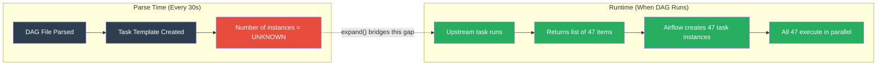
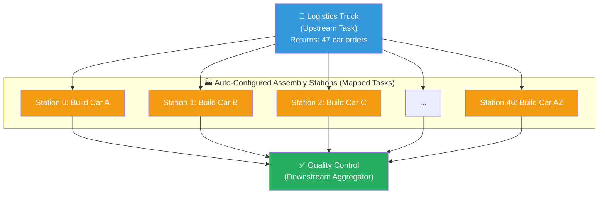
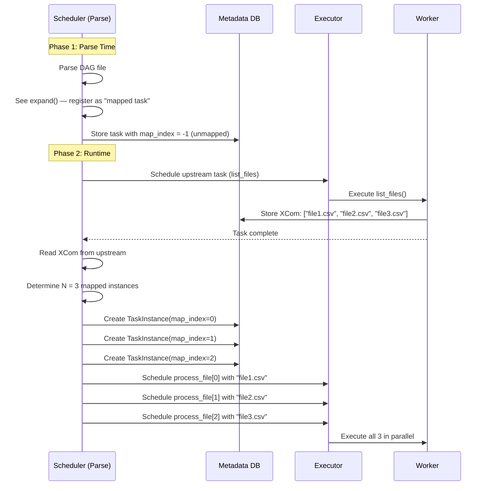
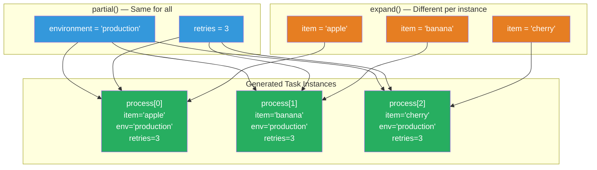
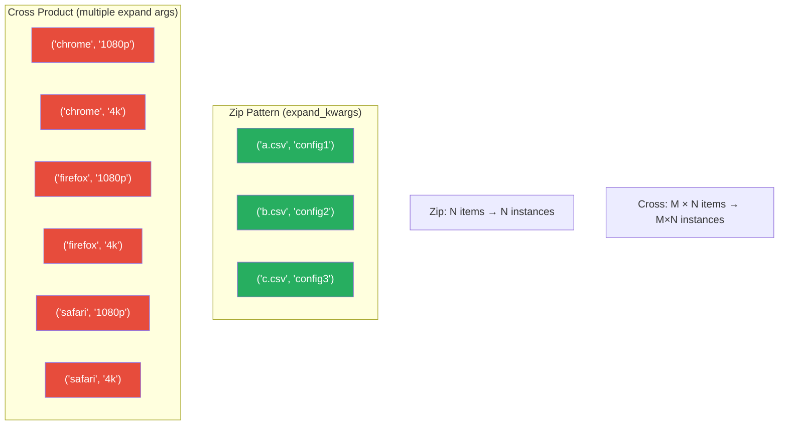
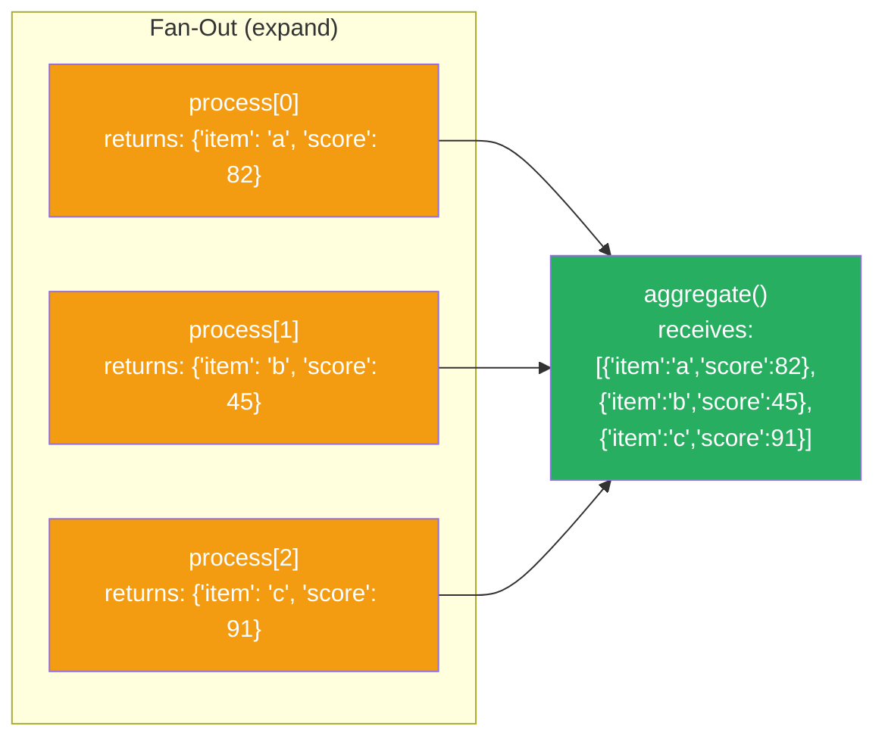
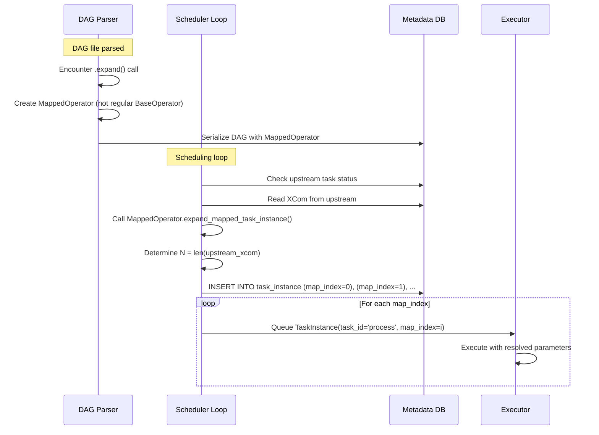
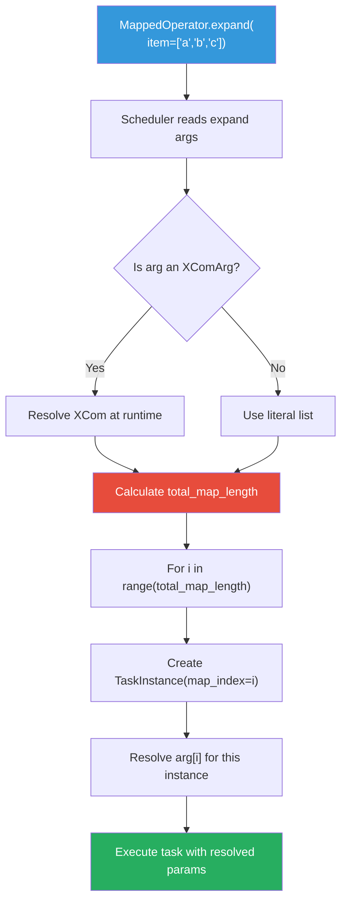
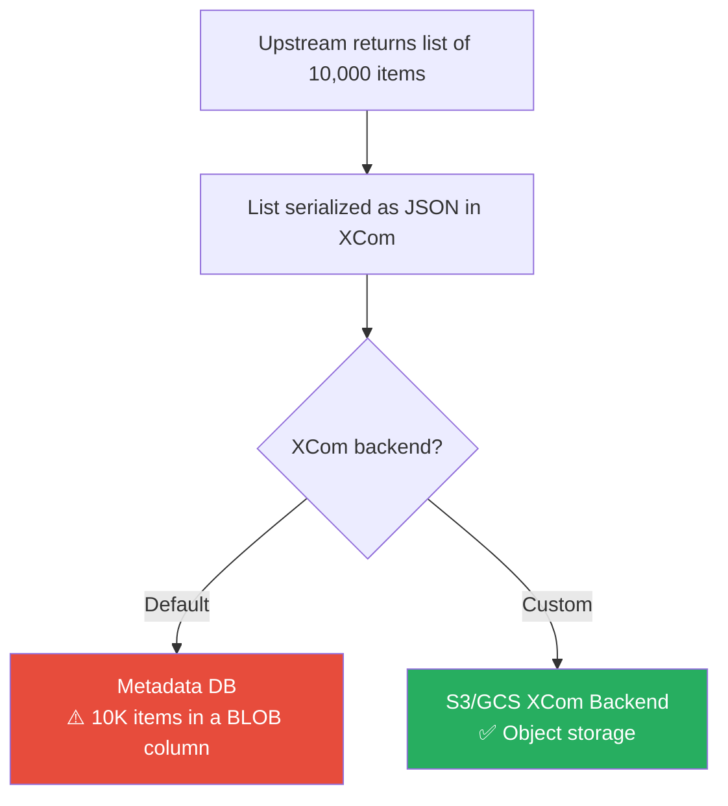

# 🔀 Dynamic Task Mapping — Runtime Task Generation in Airflow 2.3+

> **"Don't build 100 assembly lines for 100 products. Build ONE assembly line that adjusts its stations based on the incoming batch."**

---

## Table of Contents

- [Intuition — Why Dynamic Task Mapping Exists](#intuition--why-dynamic-task-mapping-exists)
- [Real-World Analogy — The Adaptive Assembly Line](#real-world-analogy--the-adaptive-assembly-line)
- [Before Dynamic Task Mapping — The Pain](#before-dynamic-task-mapping--the-pain)
- [How Dynamic Task Mapping Works](#how-dynamic-task-mapping-works)
- [Core API — expand() and partial()](#core-api--expand-and-partial)
- [Mapping Over Lists](#mapping-over-lists)
- [Mapping Over XCom Output](#mapping-over-xcom-output)
- [Zip and Cross-Product Patterns](#zip-and-cross-product-patterns)
- [map_index — Identifying Mapped Tasks](#map_index--identifying-mapped-tasks)
- [Filtering Mapped Tasks](#filtering-mapped-tasks)
- [Aggregating Mapped Task Results](#aggregating-mapped-task-results)
- [Internals Deep Dive](#internals-deep-dive)
- [Production Code Examples](#production-code-examples)
- [Performance Considerations](#performance-considerations)
- [Limitations and Gotchas](#limitations-and-gotchas)
- [Troubleshooting Guide](#troubleshooting-guide)
- [Common Mistakes](#common-mistakes)
- [Real-World Production Scenarios](#real-world-production-scenarios)
- [Interview Questions](#interview-questions)
- [Summary](#summary)

---

## Intuition — Why Dynamic Task Mapping Exists

### The Problem

Imagine you have a pipeline that processes files from an S3 bucket. On Monday, there might be 3 files. On Tuesday, 47. On Wednesday, 0. How do you handle this?

**Before Airflow 2.3**, you had two terrible options:

1. **Fixed parallelism** — Create 50 tasks and hope you never get more than 50 files. Most tasks sit idle most days.
2. **Dynamic DAG generation** — Generate the DAG at parse time, but the number of files is only known at *runtime*. So you'd have to query S3 during DAG parsing — **a cardinal sin** that blocks the scheduler.

Dynamic Task Mapping solves this by letting you define a task template at parse time, and Airflow expands it into N task instances at **runtime**, based on actual data.

### The Core Insight

> **Parse time ≠ Runtime.** The DAG file is parsed every 30 seconds by the scheduler. The actual data your pipeline processes only exists at runtime. Dynamic Task Mapping bridges this gap.



---

## Real-World Analogy — The Adaptive Assembly Line

Think of a car factory. A traditional assembly line has a **fixed number of stations** — say 10. Whether you're building 5 cars or 500, you have 10 stations.

Now imagine a **smart factory**:

1. A **logistics truck** arrives with a manifest: "Today we have 47 car orders"
2. The factory **automatically configures 47 parallel assembly stations**
3. Each station gets its own order, builds the car independently
4. When all 47 are done, quality control inspects the batch

This is Dynamic Task Mapping:
- The **logistics truck** = upstream task that returns a list
- The **auto-configured stations** = `expand()` creating N task instances
- Each **station's order** = the individual item passed to each mapped task
- **Quality control** = downstream task that aggregates results



---

## Before Dynamic Task Mapping — The Pain

### Approach 1: Fixed Number of Tasks (Bad)

```python
# ❌ ANTI-PATTERN: Fixed parallelism
for i in range(MAX_FILES):
    process_file_task = PythonOperator(
        task_id=f"process_file_{i}",
        python_callable=process_file,
        op_args=[i],
    )
```

**Problems:**
- What if `MAX_FILES` is too small? Pipeline fails.
- What if `MAX_FILES` is too large? 90% of tasks are wasted "skip" tasks.
- You can't know `MAX_FILES` at parse time without querying external systems.

### Approach 2: Dynamic DAG Generation (Also Bad)

```python
# ❌ ANTI-PATTERN: Querying S3 during DAG parsing
import boto3

s3 = boto3.client("s3")  # This runs every 30 seconds!
files = s3.list_objects_v2(Bucket="my-bucket")["Contents"]

for f in files:
    PythonOperator(
        task_id=f"process_{f['Key']}",
        python_callable=process_file,
        op_args=[f["Key"]],
    )
```

**Problems:**
- S3 API called **every 30 seconds** by the scheduler (DAG parsing interval)
- If S3 is slow or down, **all DAGs** stop being scheduled
- The task structure might be **stale** by the time the DAG actually runs
- Creates immense load on external services

### Approach 3: Dynamic Task Mapping (The Right Way ✅)

```python
# ✅ CORRECT: Dynamic Task Mapping
from airflow.decorators import dag, task

@dag(schedule="@daily", start_date=datetime(2024, 1, 1))
def process_files_dag():

    @task
    def list_files():
        """Runs at RUNTIME, not parse time"""
        import boto3
        s3 = boto3.client("s3")
        response = s3.list_objects_v2(Bucket="my-bucket", Prefix="data/")
        return [obj["Key"] for obj in response.get("Contents", [])]

    @task
    def process_file(file_key: str):
        """This task is created N times at runtime"""
        print(f"Processing {file_key}")
        # ... actual processing logic

    files = list_files()
    process_file.expand(file_key=files)

process_files_dag()
```

---

## How Dynamic Task Mapping Works

### The Two Phases



### Key Concepts

| Concept | Description |
|---------|-------------|
| **Mapped Task** | A task defined with `expand()` — a template for N instances |
| **map_index** | Zero-based index identifying each instance (0, 1, 2, ...) |
| **expand()** | Method that declares "create one instance per item in this iterable" |
| **partial()** | Method that declares "these parameters are the same for ALL instances" |
| **Mapped TaskInstance** | A concrete task instance with a specific `map_index` |

---

## Core API — expand() and partial()

### expand() — The Fan-Out

`expand()` takes keyword arguments where the values are iterables. Airflow creates one task instance per item.

```python
@task
def process(item: str):
    print(f"Processing: {item}")

# Creates 3 task instances: process[0], process[1], process[2]
process.expand(item=["apple", "banana", "cherry"])
```

### partial() — Shared Parameters

`partial()` sets parameters that are identical across all mapped instances.

```python
@task
def process(item: str, environment: str, retries: int):
    print(f"Processing {item} in {environment}")

# environment="production" and retries=3 are the same for all instances
# Only 'item' varies across instances
process.partial(environment="production", retries=3).expand(
    item=["apple", "banana", "cherry"]
)
```

### Visual: partial() + expand()



### With Traditional Operators

Dynamic Task Mapping works with **any** operator, not just `@task`:

```python
from airflow.providers.http.operators.http import SimpleHttpOperator

# Calls 3 different API endpoints, sharing the same HTTP connection
SimpleHttpOperator.partial(
    task_id="call_api",
    http_conn_id="my_api",
    method="GET",
).expand(
    endpoint=["/users", "/orders", "/products"]
)
```

```python
from airflow.providers.amazon.aws.operators.s3 import S3CopyObjectOperator

# Copy multiple files using the same operator
S3CopyObjectOperator.partial(
    task_id="copy_files",
    source_bucket_name="raw-data",
    dest_bucket_name="processed-data",
).expand(
    source_bucket_key=["file1.csv", "file2.csv", "file3.csv"]
)
```

---

## Mapping Over Lists

### Static Lists (Simplest Case)

```python
from airflow.decorators import dag, task
from datetime import datetime

@dag(schedule="@daily", start_date=datetime(2024, 1, 1), catchup=False)
def static_list_example():

    @task
    def process_region(region: str):
        print(f"Processing data for region: {region}")
        return {"region": region, "records": 1000}

    # Static list — known at parse time
    process_region.expand(region=["us-east", "us-west", "eu-west", "ap-south"])

static_list_example()
```

### Dynamic Lists from Upstream Tasks

```python
@dag(schedule="@daily", start_date=datetime(2024, 1, 1), catchup=False)
def dynamic_list_example():

    @task
    def get_active_customers():
        """This list is determined at runtime"""
        import random
        n = random.randint(5, 20)
        return [f"customer_{i}" for i in range(n)]

    @task
    def process_customer(customer_id: str):
        print(f"Generating report for {customer_id}")
        return {"customer": customer_id, "status": "complete"}

    customers = get_active_customers()
    process_customer.expand(customer_id=customers)

dynamic_list_example()
```

### Mapping Over Dictionaries

When you need to pass multiple parameters per instance, pass a list of dicts:

```python
@dag(schedule="@daily", start_date=datetime(2024, 1, 1), catchup=False)
def dict_mapping_example():

    @task
    def get_jobs():
        return [
            {"table": "users", "mode": "full"},
            {"table": "orders", "mode": "incremental"},
            {"table": "products", "mode": "full"},
        ]

    @task
    def sync_table(job: dict):
        table = job["table"]
        mode = job["mode"]
        print(f"Syncing {table} in {mode} mode")

    jobs = get_jobs()
    sync_table.expand(job=jobs)

dict_mapping_example()
```

---

## Mapping Over XCom Output

### Basic XCom Mapping

The most powerful pattern: the upstream task determines how many downstream instances to create.

```python
@dag(schedule="@daily", start_date=datetime(2024, 1, 1), catchup=False)
def xcom_mapping():

    @task
    def discover_partitions():
        """Discover which date partitions need reprocessing"""
        # In reality, query your data catalog or metadata DB
        import random
        dates = [f"2024-01-{str(d).zfill(2)}" for d in range(1, random.randint(5, 15))]
        return dates

    @task
    def reprocess_partition(partition_date: str):
        print(f"Reprocessing partition: {partition_date}")
        # Heavy processing logic here
        return {"date": partition_date, "rows_processed": 50000}

    @task
    def generate_report(results):
        total = sum(r["rows_processed"] for r in results)
        print(f"Total rows reprocessed: {total}")

    dates = discover_partitions()
    processed = reprocess_partition.expand(partition_date=dates)
    generate_report(processed)

xcom_mapping()
```

### Chaining Multiple Mapped Tasks

```python
@dag(schedule="@daily", start_date=datetime(2024, 1, 1), catchup=False)
def chained_mapping():

    @task
    def extract(source: str) -> dict:
        return {"source": source, "data": [1, 2, 3]}

    @task
    def transform(record: dict) -> dict:
        record["data"] = [x * 2 for x in record["data"]]
        return record

    @task
    def load(record: dict):
        print(f"Loading {record}")

    sources = ["api_a", "api_b", "api_c"]

    # Note: Each mapped task maps 1:1 with the upstream
    extracted = extract.expand(source=sources)
    transformed = transform.expand(record=extracted)
    load.expand(record=transformed)

chained_mapping()
```

> **⚠️ Warning:** When chaining mapped tasks, the downstream mapped task gets **one result per upstream instance**. The map indices align 1:1.

---

## Zip and Cross-Product Patterns

### The Problem: Multiple expand() Arguments

What happens when you need to expand over **two or more** lists?

```python
# ❌ This does NOT work — you can't expand multiple args independently
@task
def process(file: str, config: str):
    pass

process.expand(
    file=["a.csv", "b.csv"],
    config=["config1", "config2"]
)
```

This creates a **cross product**: `(a.csv, config1)`, `(a.csv, config2)`, `(b.csv, config1)`, `(b.csv, config2)` — 4 instances.

But what if you wanted a **zip** instead: `(a.csv, config1)`, `(b.csv, config2)` — only 2 instances?

### expand_kwargs() — The Zip Pattern

```python
from airflow.decorators import dag, task
from datetime import datetime

@dag(schedule="@daily", start_date=datetime(2024, 1, 1), catchup=False)
def zip_pattern():

    @task
    def get_file_configs():
        """Returns list of dicts where keys match the downstream task params"""
        return [
            {"file": "a.csv", "config": "config1"},
            {"file": "b.csv", "config": "config2"},
            {"file": "c.csv", "config": "config3"},
        ]

    @task
    def process(file: str, config: str):
        print(f"Processing {file} with {config}")

    configs = get_file_configs()
    process.expand_kwargs(configs)

zip_pattern()
```

### Cross-Product Pattern

When you use `expand()` with multiple keyword arguments, Airflow creates the Cartesian product:

```python
@dag(schedule="@daily", start_date=datetime(2024, 1, 1), catchup=False)
def cross_product():

    @task
    def run_test(browser: str, resolution: str):
        print(f"Testing on {browser} at {resolution}")

    # Creates 6 instances: (chrome, 1080p), (chrome, 4k), (firefox, 1080p), ...
    run_test.expand(
        browser=["chrome", "firefox", "safari"],
        resolution=["1080p", "4k"],
    )

cross_product()
```

### Visual: Zip vs Cross-Product



### When to Use Which

| Pattern | Method | Use Case | Instance Count |
|---------|--------|----------|----------------|
| **Fan-out** | `expand(arg=list)` | Process each item independently | `len(list)` |
| **Zip** | `expand_kwargs(list_of_dicts)` | Paired parameters | `len(list)` |
| **Cross-product** | `expand(a=list1, b=list2)` | Test all combinations | `len(list1) × len(list2)` |

---

## map_index — Identifying Mapped Tasks

### What is map_index?

Every mapped task instance gets a zero-based integer `map_index`. This is how Airflow distinguishes between instances of the same task.

```
process_file[0]  →  map_index = 0  →  "file_a.csv"
process_file[1]  →  map_index = 1  →  "file_b.csv"
process_file[2]  →  map_index = 2  →  "file_c.csv"
```

### Accessing map_index in Your Task

```python
from airflow.decorators import dag, task
from airflow.operators.python import get_current_context

@dag(schedule="@daily", start_date=datetime(2024, 1, 1), catchup=False)
def map_index_example():

    @task
    def process(item: str):
        context = get_current_context()
        map_index = context["ti"].map_index
        print(f"I am instance #{map_index}, processing: {item}")

        # Use map_index for:
        # - Generating unique output filenames
        # - Partitioning work deterministically
        # - Logging/debugging which instance you are
        output_file = f"output_{map_index}.parquet"
        return {"file": output_file, "item": item}

    process.expand(item=["alpha", "beta", "gamma"])

map_index_example()
```

### map_index in the UI

In the Airflow UI, mapped tasks appear with bracket notation:

```
├── list_files          ✅ Success
├── process_file[0]     ✅ Success
├── process_file[1]     ✅ Success
├── process_file[2]     🔄 Running
├── process_file[3]     ⏳ Queued
└── aggregate_results   ⏳ Waiting
```

You can click on any individual mapped instance to see its logs, XCom, etc.

---

## Filtering Mapped Tasks

### Why Filter?

Sometimes you want to run a mapped task over a list but skip certain items based on runtime conditions.

### Using AirflowSkipException

```python
from airflow.decorators import dag, task
from airflow.exceptions import AirflowSkipException
from datetime import datetime

@dag(schedule="@daily", start_date=datetime(2024, 1, 1), catchup=False)
def filtered_mapping():

    @task
    def get_files():
        return [
            {"name": "data.csv", "size_mb": 100},
            {"name": "tiny.csv", "size_mb": 0.1},      # Too small
            {"name": "report.csv", "size_mb": 50},
            {"name": "empty.csv", "size_mb": 0},        # Empty
        ]

    @task
    def process_file(file_info: dict):
        if file_info["size_mb"] < 1:
            raise AirflowSkipException(
                f"Skipping {file_info['name']}: too small ({file_info['size_mb']} MB)"
            )

        print(f"Processing {file_info['name']} ({file_info['size_mb']} MB)")
        return file_info["name"]

    files = get_files()
    process_file.expand(file_info=files)

filtered_mapping()
```

### Pre-Filtering in the Upstream Task

More efficient — avoid creating task instances entirely:

```python
@dag(schedule="@daily", start_date=datetime(2024, 1, 1), catchup=False)
def pre_filtered_mapping():

    @task
    def get_large_files():
        """Only return files worth processing"""
        all_files = discover_files()  # Returns all files
        return [f for f in all_files if f["size_mb"] >= 1]  # Filter first!

    @task
    def process_file(file_info: dict):
        # No need to filter here — upstream already did it
        print(f"Processing {file_info['name']}")

    files = get_large_files()
    process_file.expand(file_info=files)

pre_filtered_mapping()
```

> **💡 Tip:** Pre-filtering is better than AirflowSkipException because it avoids creating, scheduling, and tracking unnecessary task instances.

---

## Aggregating Mapped Task Results

### The Fan-In Pattern

After mapped tasks complete, you often need to aggregate their results. When a downstream task receives the output of a mapped task, it gets a **list of all results**.

```python
@dag(schedule="@daily", start_date=datetime(2024, 1, 1), catchup=False)
def fan_in_example():

    @task
    def get_items():
        return ["item_a", "item_b", "item_c"]

    @task
    def process(item: str) -> dict:
        import random
        return {"item": item, "score": random.uniform(0, 100)}

    @task
    def aggregate(results: list[dict]):
        """Receives a LIST of all mapped task results"""
        print(f"Received {len(results)} results")
        total = sum(r["score"] for r in results)
        best = max(results, key=lambda r: r["score"])
        print(f"Total score: {total:.2f}")
        print(f"Best item: {best['item']} with score {best['score']:.2f}")

    items = get_items()
    processed = process.expand(item=items)
    aggregate(processed)  # Gets list of all results automatically

fan_in_example()
```

### Aggregation Flow



### Handling Skipped Instances in Aggregation

```python
@task(trigger_rule="none_failed_min_one_success")
def aggregate(results):
    """
    Use this trigger rule when some mapped instances might be skipped.
    Skipped instances return None in the results list.
    """
    valid_results = [r for r in results if r is not None]
    print(f"Got {len(valid_results)} valid results out of {len(results)} total")
```

---

## Internals Deep Dive

### How the Scheduler Handles Mapped Tasks



### Internal Classes

| Class | Role |
|-------|------|
| `MappedOperator` | Replaces `BaseOperator` for mapped tasks. Holds the expand/partial config |
| `TaskMap` | Stored in metadata DB. Maps task_id to the number of mapped instances |
| `XComArg` | Represents "the output of task X" as a lazy reference. Resolved at runtime |
| `MappedArgument` | Wraps an `XComArg` to be used as an expand argument |

### XCom Storage for Mapped Tasks

Each mapped task instance stores its own XCom:

```
task_instance table:
  task_id='process', map_index=0, state='success'
  task_id='process', map_index=1, state='success'
  task_id='process', map_index=2, state='failed'

xcom table:
  task_id='process', map_index=0, key='return_value', value='{"item":"a"}'
  task_id='process', map_index=1, key='return_value', value='{"item":"b"}'
  task_id='process', map_index=2, key='return_value', value=NULL
```

### How Parameters Are Resolved



---

## Production Code Examples

### Example 1: Processing Variable Number of S3 Files

```python
"""
Production DAG: Process all new files landing in S3.
Real-world scenario: Daily data ingestion from multiple partners.
"""
from airflow.decorators import dag, task
from airflow.providers.amazon.aws.hooks.s3 import S3Hook
from datetime import datetime, timedelta

default_args = {
    "owner": "data-engineering",
    "retries": 3,
    "retry_delay": timedelta(minutes=5),
    "retry_exponential_backoff": True,
}

@dag(
    schedule="@hourly",
    start_date=datetime(2024, 1, 1),
    catchup=False,
    default_args=default_args,
    max_active_runs=1,
    tags=["production", "ingestion"],
)
def s3_file_processor():

    @task
    def list_new_files(ds=None):
        """Discover files that landed in the last hour"""
        hook = S3Hook(aws_conn_id="aws_production")
        prefix = f"incoming/dt={ds}/"
        keys = hook.list_keys(
            bucket_name="data-lake-raw",
            prefix=prefix,
        )
        if not keys:
            raise ValueError(f"No files found for {ds}. Possible data delay.")
        return keys

    @task(
        pool="s3_processing_pool",       # Limit concurrent S3 operations
        max_active_tis_per_dag=10,       # Max 10 parallel instances
        execution_timeout=timedelta(minutes=30),
    )
    def process_file(file_key: str, ds=None):
        """Process a single file — validate, transform, load"""
        import pandas as pd
        from io import BytesIO

        hook = S3Hook(aws_conn_id="aws_production")

        # Download
        obj = hook.get_key(file_key, bucket_name="data-lake-raw")
        content = obj.get()["Body"].read()
        df = pd.read_csv(BytesIO(content))

        # Validate
        assert len(df) > 0, f"Empty file: {file_key}"
        assert "user_id" in df.columns, f"Missing user_id column in {file_key}"

        # Transform
        df["processed_at"] = datetime.utcnow().isoformat()
        df["source_file"] = file_key

        # Load
        output_key = file_key.replace("incoming/", "processed/")
        buffer = BytesIO()
        df.to_parquet(buffer, index=False)
        buffer.seek(0)

        hook.load_bytes(
            bytes_data=buffer.read(),
            key=output_key,
            bucket_name="data-lake-processed",
            replace=True,
        )

        return {
            "file": file_key,
            "rows": len(df),
            "output": output_key,
        }

    @task(trigger_rule="none_failed_min_one_success")
    def send_summary(results: list[dict]):
        """Send processing summary to Slack"""
        valid = [r for r in results if r is not None]
        total_rows = sum(r["rows"] for r in valid)
        msg = (
            f"✅ Processed {len(valid)} files, {total_rows:,} total rows.\n"
            f"Files: {[r['file'] for r in valid]}"
        )
        print(msg)
        # In production: send to Slack/Teams/PagerDuty

    files = list_new_files()
    processed = process_file.expand(file_key=files)
    send_summary(processed)

s3_file_processor()
```

### Example 2: Parallel API Calls with Rate Limiting

```python
"""
Production DAG: Fetch data from multiple API endpoints in parallel.
Rate-limited to avoid overwhelming the API.
"""
from airflow.decorators import dag, task
from datetime import datetime, timedelta

@dag(
    schedule="@daily",
    start_date=datetime(2024, 1, 1),
    catchup=False,
    tags=["production", "api"],
)
def parallel_api_calls():

    @task
    def get_endpoints():
        """Determine which API endpoints to call based on config"""
        import json
        from airflow.models import Variable

        config = json.loads(Variable.get("api_sync_config"))
        return [
            {
                "endpoint": ep["url"],
                "params": ep.get("params", {}),
                "target_table": ep["table"],
            }
            for ep in config["endpoints"]
            if ep.get("enabled", True)
        ]

    @task(
        pool="api_rate_limit_pool",    # Pool with 5 slots = max 5 concurrent API calls
        retries=5,
        retry_delay=timedelta(seconds=30),
    )
    def fetch_data(api_config: dict) -> dict:
        """Fetch data from one API endpoint"""
        import requests
        from airflow.hooks.base import BaseHook

        conn = BaseHook.get_connection("partner_api")
        base_url = conn.host
        headers = {"Authorization": f"Bearer {conn.password}"}

        response = requests.get(
            f"{base_url}{api_config['endpoint']}",
            params=api_config["params"],
            headers=headers,
            timeout=120,
        )
        response.raise_for_status()

        data = response.json()
        return {
            "table": api_config["target_table"],
            "records": len(data["results"]),
            "data": data["results"],
        }

    @task
    def load_to_warehouse(api_result: dict):
        """Load fetched data into the data warehouse"""
        table = api_result["table"]
        records = api_result["data"]
        print(f"Loading {len(records)} records into {table}")
        # In production: use SQLAlchemy or a warehouse-specific hook

    endpoints = get_endpoints()
    fetched = fetch_data.expand(api_config=endpoints)
    load_to_warehouse.expand(api_result=fetched)

parallel_api_calls()
```

### Example 3: Database Table Sync with expand_kwargs

```python
"""
Production DAG: Sync multiple database tables with table-specific configs.
Uses expand_kwargs for the zip pattern.
"""
from airflow.decorators import dag, task
from datetime import datetime, timedelta

TABLE_CONFIGS = [
    {"table": "users", "mode": "incremental", "key_column": "updated_at", "priority": 1},
    {"table": "orders", "mode": "incremental", "key_column": "order_date", "priority": 1},
    {"table": "products", "mode": "full", "key_column": None, "priority": 2},
    {"table": "categories", "mode": "full", "key_column": None, "priority": 3},
    {"table": "reviews", "mode": "incremental", "key_column": "review_date", "priority": 2},
]

@dag(
    schedule="0 2 * * *",  # 2 AM daily
    start_date=datetime(2024, 1, 1),
    catchup=False,
    tags=["production", "sync"],
)
def multi_table_sync():

    @task
    def get_sync_configs():
        """Return table configs sorted by priority"""
        return sorted(TABLE_CONFIGS, key=lambda x: x["priority"])

    @task(
        pool="db_sync_pool",
        execution_timeout=timedelta(hours=2),
    )
    def sync_table(table: str, mode: str, key_column: str, priority: int, ds=None):
        """Sync a single table based on its configuration"""
        if mode == "incremental":
            print(f"Syncing {table} incrementally using {key_column} for ds={ds}")
            # SELECT * FROM {table} WHERE {key_column} >= '{ds}'
        else:
            print(f"Full sync of {table}")
            # TRUNCATE target; INSERT INTO target SELECT * FROM source

        return {"table": table, "mode": mode, "status": "success"}

    configs = get_sync_configs()
    sync_table.expand_kwargs(configs)

multi_table_sync()
```

---

## Performance Considerations

### Scalability Limits

| Factor | Consideration |
|--------|---------------|
| **Max mapped instances** | Configurable via `max_map_length` (default: 1024) |
| **Scheduler overhead** | Each mapped instance is a full TaskInstance in the DB |
| **XCom size** | The upstream task's output (the list) must fit in XCom |
| **Database load** | 1000 mapped instances = 1000 rows in `task_instance` table |
| **UI performance** | UI slows down with >500 mapped instances per task |

### Tuning max_map_length

```ini
# airflow.cfg
[core]
max_map_length = 2048  # Increase from default 1024
```

### Controlling Parallelism

```python
# Method 1: max_active_tis_per_dag (Airflow 2.4+)
@task(max_active_tis_per_dag=10)
def process(item: str):
    pass

# Method 2: Pools
# Create a pool "processing_pool" with 10 slots in the UI
@task(pool="processing_pool")
def process(item: str):
    pass

# Method 3: DAG-level concurrency
@dag(max_active_tasks=20)
def my_dag():
    pass
```

### Memory Considerations



> **⚠️ Warning:** If your upstream task returns a large list (>1000 items), use a custom XCom backend (S3, GCS) instead of the default metadata DB backend. Large XCom values in the metadata DB cause performance degradation.

### Batching Pattern for Large Lists

When you have thousands of items, batch them:

```python
@dag(schedule="@daily", start_date=datetime(2024, 1, 1), catchup=False)
def batched_processing():

    @task
    def create_batches():
        """Instead of 10,000 individual tasks, create 100 batches of 100"""
        all_items = list(range(10_000))
        batch_size = 100
        batches = [
            all_items[i:i + batch_size]
            for i in range(0, len(all_items), batch_size)
        ]
        return batches  # 100 batches instead of 10,000 items

    @task
    def process_batch(batch: list):
        """Process 100 items in one task"""
        for item in batch:
            process_single_item(item)
        return {"batch_size": len(batch), "status": "done"}

    batches = create_batches()
    process_batch.expand(batch=batches)

batched_processing()
```

---

## Limitations and Gotchas

### 1. Cannot expand() on Multiple Arguments Without Cross-Product

```python
# This creates a CROSS PRODUCT, not a zip
@task
def process(a: str, b: str):
    pass

# Creates 4 instances, not 2!
process.expand(a=["x", "y"], b=["1", "2"])
# ("x","1"), ("x","2"), ("y","1"), ("y","2")

# Use expand_kwargs for zip behavior
process.expand_kwargs([
    {"a": "x", "b": "1"},
    {"a": "y", "b": "2"},
])
```

### 2. Cannot Return an Empty List

```python
@task
def get_items():
    return []  # ⚠️ This creates 0 mapped instances

@task
def process(item):
    pass

# If get_items returns [], the downstream task gets SKIPPED
# Any task depending on process will also be skipped (with default trigger_rule)
```

### 3. XCom Size Limits

The list returned by the upstream task is stored in XCom. With the default DB backend:
- PostgreSQL: ~1 GB per XCom value (BYTEA column)
- MySQL: 64 KB (BLOB) — **very restrictive**
- SQLite: Not suitable for production

### 4. Cannot Nest expand() Calls

```python
# ❌ This doesn't work — no nested dynamic mapping
@task
def get_categories():
    return ["electronics", "clothing"]

@task
def get_items(category):
    return [f"{category}_item_{i}" for i in range(10)]

@task
def process(item):
    pass

categories = get_categories()
items = get_items.expand(category=categories)
# items is now a list of lists — you can't expand on it again
# process.expand(item=items)  # ❌ Doesn't flatten
```

**Workaround: Flatten in an intermediate task**

```python
@task
def flatten(nested_lists):
    """Flatten list of lists into a single list"""
    return [item for sublist in nested_lists for item in sublist]

categories = get_categories()
nested = get_items.expand(category=categories)
flat = flatten(nested)
process.expand(item=flat)
```

### 5. Mapped Tasks and Trigger Rules

```python
# If ANY mapped instance fails, downstream tasks with
# trigger_rule="all_success" (default) won't run

# Use "none_failed_min_one_success" for fault-tolerant aggregation
@task(trigger_rule="none_failed_min_one_success")
def aggregate(results):
    valid = [r for r in results if r is not None]
    # Process only successful results
```

---

## Troubleshooting Guide

### Problem: "Task mapped_task has no mapped instances"

**Symptom:** Mapped task shows as skipped with 0 instances.

**Root Cause:** The upstream task returned an empty list `[]`.

**Fix:**
```python
@task
def list_items():
    items = fetch_items()
    if not items:
        raise AirflowFailException("No items found — this is unexpected")
    return items
```

### Problem: "Mapped task failed but DAG shows success"

**Symptom:** Some mapped instances failed but downstream tasks ran.

**Root Cause:** Downstream has `trigger_rule="none_failed_min_one_success"`.

**Fix:** Check if this is intentional. If not, use the default `trigger_rule="all_success"`.

### Problem: "XCom too large — serialization error"

**Symptom:** Upstream task fails with serialization/memory errors.

**Root Cause:** Returning too much data in XCom.

**Fix:**
```python
# Don't return full data in XCom — return references
@task
def list_files():
    # ❌ Bad: return full file contents
    # return [read_file(f) for f in files]

    # ✅ Good: return file paths/keys
    return [f.key for f in files]
```

### Problem: "Scheduler is slow with many mapped tasks"

**Symptom:** DAGs take minutes to start after the upstream task completes.

**Root Cause:** Too many mapped instances causing scheduler overhead.

**Fix:**
1. Reduce the number of mapped instances (batch items)
2. Increase `scheduler.max_tis_per_query`
3. Increase `scheduler.parsing_processes`

### Problem: "map_index out of range"

**Symptom:** Error during task execution about map_index.

**Root Cause:** The data changed between scheduling and execution (race condition with external data).

**Fix:** Ensure the upstream task's output is stable and deterministic for a given DAG run.

---

## Common Mistakes

### Mistake 1: Expanding Over Huge Lists Without Batching

```python
# ❌ 100,000 task instances will crush your scheduler
process.expand(item=list(range(100_000)))

# ✅ Batch into manageable chunks
batches = create_batches(items=range(100_000), batch_size=1000)
process_batch.expand(batch=batches)  # 100 instances, each handling 1000 items
```

### Mistake 2: Forgetting partial() for Shared Parameters

```python
# ❌ Repeating the same value in every dict
process.expand_kwargs([
    {"item": "a", "env": "prod", "region": "us"},
    {"item": "b", "env": "prod", "region": "us"},
    {"item": "c", "env": "prod", "region": "us"},
])

# ✅ Use partial for shared parameters
process.partial(env="prod", region="us").expand(item=["a", "b", "c"])
```

### Mistake 3: Not Setting Parallelism Limits

```python
# ❌ 200 parallel API calls will get you rate-limited or banned
fetch.expand(url=two_hundred_urls)

# ✅ Use a pool to limit concurrency
# Create pool "api_pool" with 10 slots
@task(pool="api_pool")
def fetch(url: str):
    pass

fetch.expand(url=two_hundred_urls)
```

### Mistake 4: Treating expand() Like a Loop

```python
# ❌ This is NOT how you think about it
# Don't think: "for each item in list, run task"
# Think: "define WHAT to do, let Airflow decide WHEN and WHERE"

# Each mapped instance is fully independent:
# - Has its own retry count
# - Can run on different workers
# - Can succeed/fail independently
# - Has its own logs
# - Has its own XCom
```

### Mistake 5: Not Handling Partial Failures

```python
# ❌ If 1 out of 100 mapped tasks fails, everything downstream fails
process.expand(item=items) >> final_report()

# ✅ Handle partial failures gracefully
@task(trigger_rule="none_failed_min_one_success")
def final_report(results):
    successes = [r for r in results if r is not None]
    failures = len(results) - len(successes)
    if failures > 0:
        alert_on_partial_failure(failures, len(results))
```

---

## Real-World Production Scenarios

### Scenario 1: E-Commerce — Processing Partner Data Feeds

A retail company receives data feeds from 50+ partners. Each partner sends files in different formats. Some send 1 file/day, others send 100.

```python
@dag(schedule="@hourly", ...)
def partner_ingestion():

    @task
    def discover_feeds():
        """Check S3 for new partner files, return list of feed configs"""
        # Returns something like:
        # [
        #   {"partner": "nike", "file": "s3://feeds/nike/2024-01-15.csv", "format": "csv"},
        #   {"partner": "adidas", "file": "s3://feeds/adidas/orders.json", "format": "json"},
        #   ...
        # ]

    @task(pool="feed_processing", max_active_tis_per_dag=20)
    def ingest_feed(feed: dict):
        """Process one partner feed using the appropriate parser"""
        parser = get_parser(feed["format"])
        data = parser.parse(feed["file"])
        validate(data, schema=get_schema(feed["partner"]))
        load_to_warehouse(data, table=f"raw_{feed['partner']}")

    feeds = discover_feeds()
    ingest_feed.expand(feed=feeds)
```

### Scenario 2: ML Pipeline — Hyperparameter Tuning

```python
@dag(schedule=None, ...)  # Triggered manually or by CI/CD
def hyperparameter_search():

    @task
    def generate_configs():
        """Generate hyperparameter combinations to try"""
        import itertools

        learning_rates = [0.001, 0.01, 0.1]
        batch_sizes = [32, 64, 128]
        dropouts = [0.1, 0.3, 0.5]

        configs = []
        for lr, bs, do in itertools.product(learning_rates, batch_sizes, dropouts):
            configs.append({"lr": lr, "batch_size": bs, "dropout": do})
        return configs  # 27 combinations

    @task(pool="gpu_pool", execution_timeout=timedelta(hours=4))
    def train_model(config: dict) -> dict:
        """Train one model configuration"""
        # In reality: use MLflow, SageMaker, etc.
        model = train(config)
        metrics = evaluate(model)
        return {**config, **metrics}

    @task
    def select_best_model(results: list[dict]):
        """Pick the best model from all experiments"""
        best = max(results, key=lambda r: r["f1_score"])
        print(f"Best config: {best}")
        register_model(best)

    configs = generate_configs()
    results = train_model.expand(config=configs)
    select_best_model(results)
```

### Scenario 3: Multi-Tenant SaaS — Per-Tenant Processing

```python
@dag(schedule="0 3 * * *", ...)
def tenant_processing():

    @task
    def get_active_tenants():
        """Query the control plane for active tenants"""
        from sqlalchemy import create_engine
        engine = create_engine(Variable.get("control_plane_db"))
        result = engine.execute(
            "SELECT tenant_id, plan, region FROM tenants WHERE active = true"
        )
        return [dict(row) for row in result]

    @task(
        pool="tenant_processing",
        max_active_tis_per_dag=5,  # Don't overwhelm shared resources
    )
    def process_tenant(tenant: dict):
        """Run nightly processing for one tenant"""
        tenant_id = tenant["tenant_id"]
        region = tenant["region"]

        # Connect to tenant-specific database
        conn_id = f"tenant_db_{region}"
        # Run aggregations, generate reports, etc.

        return {"tenant": tenant_id, "status": "success"}

    tenants = get_active_tenants()
    process_tenant.expand(tenant=tenants)
```

---

## Interview Questions

### Beginner

**Q1: What is Dynamic Task Mapping in Airflow?**

**A:** Dynamic Task Mapping (introduced in Airflow 2.3) allows you to create a variable number of task instances at runtime, based on the output of an upstream task. Instead of hardcoding the number of parallel tasks at DAG parse time, you define a task template using `expand()`, and Airflow creates N instances when the DAG actually runs.

**Q2: What is the difference between `expand()` and `partial()`?**

**A:** `expand()` specifies the parameter that varies across mapped instances — Airflow creates one instance per item in the iterable. `partial()` specifies parameters that are the same across all instances. They are often used together: `task.partial(shared_param=value).expand(varying_param=list)`.

**Q3: How do you view individual mapped task logs in the Airflow UI?**

**A:** Mapped tasks appear with bracket notation in the UI (e.g., `process[0]`, `process[1]`). Click on any individual instance to see its logs, XCom output, and metadata. Each instance is fully independent.

---

### Intermediate

**Q4: What happens if the upstream task returns an empty list for `expand()`?**

**A:** If the upstream task returns an empty list, Airflow creates 0 mapped instances. The mapped task is marked as skipped. Any downstream tasks with the default trigger rule (`all_success`) will also be skipped, since there are no successful upstream instances to satisfy the rule. Use `trigger_rule="none_failed_min_one_success"` or `all_done` for downstream tasks if you want them to run regardless.

**Q5: Explain the difference between the zip pattern and cross-product pattern in Dynamic Task Mapping.**

**A:** When you use `expand()` with a single argument, each item maps to one instance. When you use `expand()` with multiple arguments, Airflow creates the **Cartesian product** (cross-product) of all combinations. For zip behavior (pairing items 1:1), use `expand_kwargs()` with a list of dictionaries where each dict contains the paired parameters.

**Q6: How do you limit the parallelism of mapped tasks?**

**A:** Three main approaches:
1. `max_active_tis_per_dag` on the task (Airflow 2.4+) — limits how many instances run simultaneously within a single DAG run
2. **Pools** — create a pool with a fixed number of slots and assign the task to that pool
3. `max_active_tasks` on the DAG — limits total concurrent tasks across the entire DAG

---

### Advanced

**Q7: Your mapped task creates 5,000 instances and the scheduler becomes slow. How do you fix this?**

**A:** Several strategies:
1. **Batch the items** — instead of 5,000 tasks of 1 item each, create 50 tasks of 100 items each
2. **Increase `max_map_length`** if hitting the cap, but reduce actual count through batching
3. **Use a custom XCom backend** (S3/GCS) since the upstream list is large
4. **Tune scheduler settings**: increase `scheduler.max_tis_per_query` and `scheduler.parsing_processes`
5. **Increase `max_active_tasks`** per DAG to process faster
6. Consider if dynamic task mapping is the right abstraction — at 5,000+ tasks, a Spark/Dask job might be more appropriate

**Q8: How does Airflow internally handle the expansion of mapped tasks?**

**A:** At parse time, Airflow creates a `MappedOperator` (not a regular `BaseOperator`). The DAG is serialized with this mapping information. At runtime, when the upstream task completes, the scheduler reads the XCom output, determines the list length N, and calls `expand_mapped_task_instance()` to create N `TaskInstance` rows in the metadata database, each with a unique `map_index`. Each instance is then scheduled and executed independently, with the scheduler resolving the specific parameter value for each `map_index` by indexing into the upstream XCom list.

**Q9: Can you chain multiple mapped tasks? What happens to the map indices?**

**A:** Yes, you can chain mapped tasks. When a mapped task's output feeds into another `expand()`, the downstream task gets one instance per upstream instance — the map indices align 1:1. Instance 0 of the downstream task gets the output of instance 0 of the upstream task, and so on. This is important to understand because it means the cardinality must match — you can't fan out further without an intermediate flattening step.

---

## Summary

| Feature | Description |
|---------|-------------|
| **What** | Runtime creation of N task instances from a template |
| **When introduced** | Airflow 2.3 |
| **Key methods** | `expand()`, `partial()`, `expand_kwargs()` |
| **Replaces** | Dynamic DAG generation, fixed-parallelism loops |
| **Best for** | Variable workloads, parallel processing, fan-out/fan-in |
| **Limits** | `max_map_length=1024` (configurable), XCom size limits |
| **Performance tip** | Batch items for >1000 instances; use custom XCom backend |

---

**[← Previous: Dynamic DAGs](10-dynamic-dags.md) | [Home](../README.md) | [Next →: Production Best Practices](12-production-best-practices.md)**
