# 🔬 Airflow Scheduler Internals — The Complete Deep Dive

> **The scheduler is the heart of Airflow. Understanding its internals separates operators from engineers who can debug production outages at 3 AM.**

---

## 📋 Table of Contents

1. [Why Understanding Scheduler Internals Matters](#why-understanding-scheduler-internals-matters)
2. [High-Level Scheduler Architecture](#high-level-scheduler-architecture)
3. [The Complete Scheduler Loop](#the-complete-scheduler-loop)
4. [DagFileProcessorManager — Parsing DAG Files](#dagfileprocessormanager--parsing-dag-files)
5. [DagFileProcessor — How Individual DAGs Are Parsed](#dagfileprocessor--how-individual-dags-are-parsed)
6. [How DagRuns Are Created](#how-dagruns-are-created)
7. [TaskInstance Scheduling — The State Machine](#taskinstance-scheduling--the-state-machine)
8. [Sending Tasks to the Executor](#sending-tasks-to-the-executor)
9. [Mini-Scheduler — Executor-Side Scheduling](#mini-scheduler--executor-side-scheduling)
10. [Scheduler High Availability](#scheduler-high-availability)
11. [Dead Letter and Orphaned Task Handling](#dead-letter-and-orphaned-task-handling)
12. [Performance Bottlenecks and Tuning](#performance-bottlenecks-and-tuning)
13. [Database Query Patterns](#database-query-patterns)
14. [Production Debugging Scenarios](#production-debugging-scenarios)
15. [Monitoring the Scheduler](#monitoring-the-scheduler)
16. [Interview Questions](#interview-questions)

---

## Why Understanding Scheduler Internals Matters

In a production Airflow deployment running 500+ DAGs with thousands of task instances, you will encounter:

- **Tasks stuck in `scheduled` state** — they were scheduled but never picked up by the executor
- **DAG runs not being created** — the scheduler isn't parsing or processing your DAG file
- **Zombie tasks** — the worker died but the task shows as `running`
- **Scheduler lag** — 10+ minutes between a task becoming eligible and actually running
- **Database deadlocks** — multiple schedulers fighting over the same rows

You cannot debug any of these without understanding what the scheduler is actually doing inside its loop.

---

## High-Level Scheduler Architecture

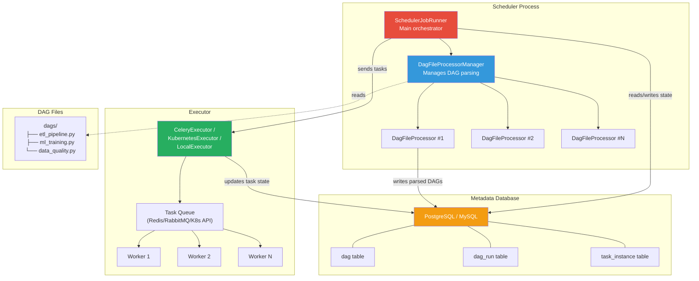

The scheduler has two major responsibilities:

1. **Parsing DAG files** — Discovering DAGs from Python files on disk
2. **Scheduling tasks** — Creating DagRuns, scheduling TaskInstances, and sending them to executors

These two concerns are deliberately separated. Parsing happens in subprocess workers managed by `DagFileProcessorManager`. Scheduling happens in the main scheduler loop within `SchedulerJobRunner`.

---

## The Complete Scheduler Loop

The scheduler's main entry point is `SchedulerJobRunner._execute()`. Let's trace through every step of a single scheduler loop iteration.

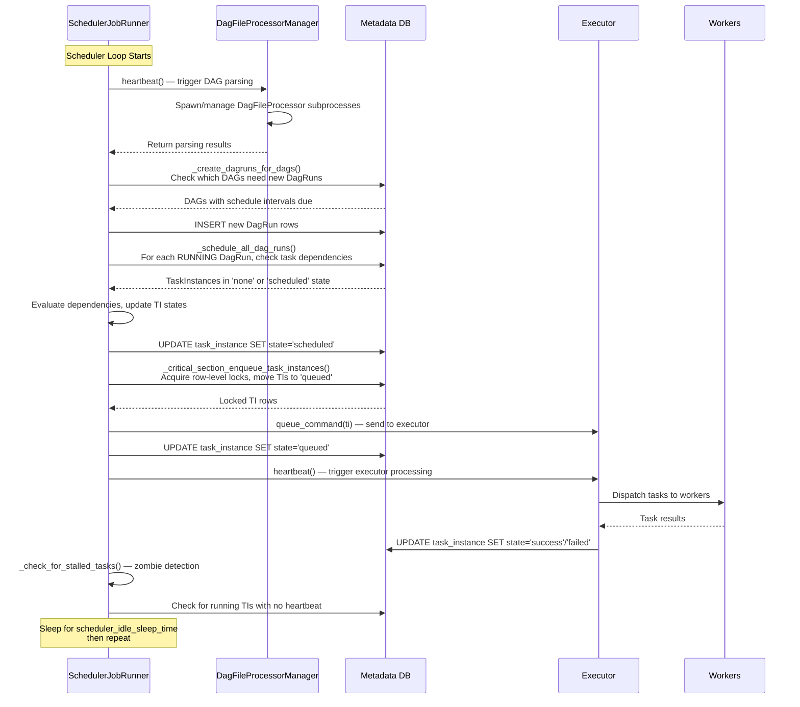

### The Actual Code Flow

Here's a simplified but accurate representation of the scheduler's main loop:

```python
# airflow/jobs/scheduler_job_runner.py (simplified)

class SchedulerJobRunner(BaseJobRunner):
    """The actual scheduler logic."""
    
    def _execute(self):
        """Main entry point — called when scheduler starts."""
        self.processor_agent = DagFileProcessorAgent(
            dag_directory=self.subdir,
            max_runs=self.num_runs,
            processor_timeout=self.processor_timeout,
        )
        
        # Start the DAG file processor manager in a subprocess
        self.processor_agent.start()
        
        try:
            self._run_scheduler_loop()
        finally:
            self.processor_agent.end()
    
    def _run_scheduler_loop(self):
        """The heartbeat loop that runs continuously."""
        while not self._check_if_should_stop():
            # Step 1: Heartbeat the processor agent (DAG parsing)
            self.processor_agent.heartbeat()
            
            with create_session() as session:
                # Step 2: Create DagRuns for DAGs whose schedule is due
                num_queued = self._do_scheduling(session)
            
            # Step 3: Heartbeat the executor (task dispatch)
            self.executor.heartbeat()
            
            # Step 4: Check for zombie/orphaned tasks
            self._find_zombies()
            
            # Step 5: Sleep to avoid tight-looping
            if num_queued == 0:
                time.sleep(self._scheduler_idle_sleep_time)
    
    def _do_scheduling(self, session):
        """Core scheduling logic within a single iteration."""
        # Phase 1: Create DagRuns
        self._create_dagruns_for_dags(session)
        
        # Phase 2: Examine active DagRuns and schedule their tasks
        self._schedule_all_dag_runs(session)
        
        # Phase 3: Move 'scheduled' tasks to 'queued' (critical section)
        num_queued = self._critical_section_enqueue_task_instances(session)
        
        return num_queued
```

### Key Configuration Parameters

| Parameter | Default | What It Controls |
|-----------|---------|------------------|
| `scheduler_idle_sleep_time` | 1 second | Sleep between loop iterations when no work |
| `min_file_process_interval` | 30 seconds | Minimum interval between re-parsing the same file |
| `dag_dir_list_interval` | 300 seconds | How often to re-scan dags folder for new files |
| `parsing_processes` | 2 | Number of parallel DAG parsing subprocesses |
| `max_dagruns_to_create_per_loop` | 10 | DagRuns created per scheduler loop |
| `max_dagruns_per_loop_to_schedule` | 20 | DagRuns examined for task scheduling per loop |
| `max_tis_per_query` | 512 | TaskInstances queued per scheduler loop |
| `scheduler_heartbeat_sec` | 5 | How often the scheduler records its heartbeat |

---

## DagFileProcessorManager — Parsing DAG Files

The `DagFileProcessorManager` is responsible for orchestrating the parallel parsing of DAG files. It runs as a separate process from the main scheduler loop.

### How It Works

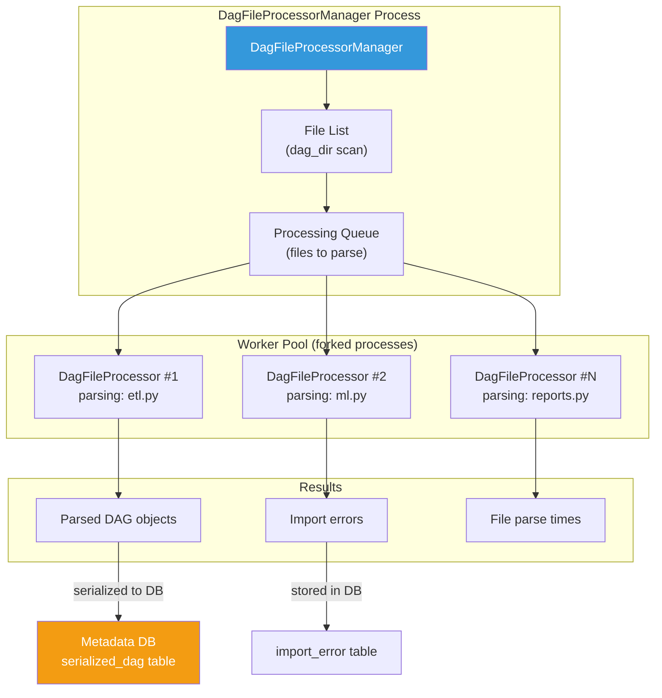

### The File Discovery Process

```python
# Simplified view of how DAG files are discovered

class DagFileProcessorManager:
    def _refresh_dag_dir(self):
        """Scan the DAGs directory for Python files."""
        # 1. Walk the DAGs directory
        dag_files = []
        for root, dirs, files in os.walk(self._dag_directory):
            # Skip hidden directories and __pycache__
            dirs[:] = [d for d in dirs 
                       if not d.startswith('.') 
                       and d != '__pycache__']
            
            for filename in files:
                # Only process .py and .zip files
                if filename.endswith(('.py', '.zip')):
                    filepath = os.path.join(root, filename)
                    # Skip files matching .airflowignore patterns
                    if not self._is_ignored(filepath):
                        dag_files.append(filepath)
        
        # 2. Sort files by last modification time
        # Recently modified files get parsed first
        dag_files.sort(key=lambda f: os.path.getmtime(f), reverse=True)
        
        return dag_files
    
    def _is_file_due_for_processing(self, filepath):
        """Check if enough time has passed to re-parse this file."""
        last_processed = self._file_last_processed.get(filepath)
        if last_processed is None:
            return True
        
        elapsed = time.time() - last_processed
        return elapsed >= self._min_file_process_interval
```

### Important Details

1. **`.airflowignore`** — Works like `.gitignore`. Place it in your dags directory to exclude files from parsing. Uses regex patterns (not glob).

2. **DAG Serialization** — Since Airflow 2.0, parsed DAGs are serialized to the `serialized_dag` table. The webserver reads from this table instead of parsing DAG files directly. This means the webserver no longer needs access to DAG files.

3. **Import Errors** — If a DAG file has a syntax error or import failure, the error is captured and stored in the `import_error` table. The file will be retried on the next parsing cycle.

4. **Parsing Timeout** — Each file has a parsing timeout (`dagbag_import_timeout`, default 30s). If a file takes too long to parse (e.g., it makes network calls at import time), the parser subprocess is killed.

---

## DagFileProcessor — How Individual DAGs Are Parsed

Each `DagFileProcessor` is a subprocess that loads a single Python file and extracts DAG objects from it.

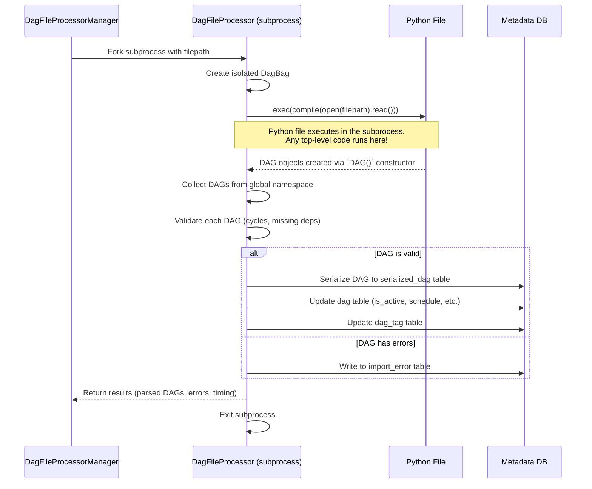

### How DAG Objects Are Discovered

```python
# Simplified DagBag.process_file()

class DagBag:
    def process_file(self, filepath):
        """Parse a Python file and extract DAGs."""
        mods = []
        
        # Step 1: Compile and execute the file
        with open(filepath, 'rb') as f:
            source = f.read()
        
        try:
            code = compile(source, filepath, 'exec')
            module = types.ModuleType(filepath)
            module.__file__ = filepath
            
            # THIS IS THE KEY LINE: the file's code runs here
            exec(code, module.__dict__)
            
        except Exception as e:
            self.import_errors[filepath] = str(e)
            return
        
        # Step 2: Find all DAG objects in the module's namespace
        # Any variable that is a DAG instance gets collected
        for obj in vars(module).values():
            if isinstance(obj, DAG):
                # Validate the DAG
                if obj.dag_id in self.dags:
                    raise DuplicateDagIdError(obj.dag_id)
                
                # Check for cycles
                obj.validate()
                
                # Register the DAG
                self.dags[obj.dag_id] = obj
                self.dag_times[obj.dag_id] = datetime.now()
```

### Why This Matters for Production

**Critical Rule: Never do expensive operations at DAG file parse time.**

Since DAG files are re-parsed every `min_file_process_interval` seconds (default 30s), any code at the top level of your DAG file runs repeatedly:

```python
# ❌ BAD — This runs every 30 seconds during parsing
import requests
config = requests.get("https://api.config-server.com/settings").json()

with DAG("my_dag", ...) as dag:
    task = PythonOperator(task_id="process", python_callable=process)

# ✅ GOOD — Config is fetched inside the task, not at parse time
with DAG("my_dag", ...) as dag:
    @task
    def process():
        import requests
        config = requests.get("https://api.config-server.com/settings").json()
        # ... use config
```

---

## How DagRuns Are Created

A `DagRun` represents a single execution instance of a DAG. The scheduler creates DagRuns based on schedule intervals, external triggers, or backfill requests.

### The DagRun Creation Process

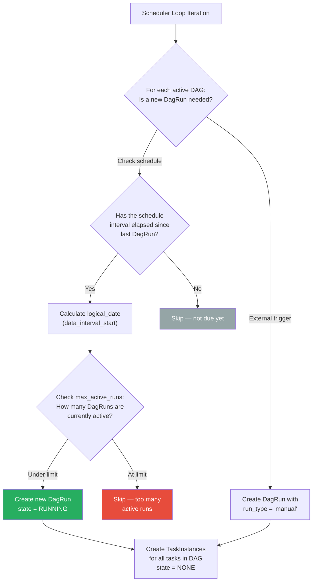

### The Data Interval Concept (Airflow 2.x)

```python
# Understanding logical_date vs data_interval

# In Airflow 2.x, each DagRun has:
# - data_interval_start: The START of the data period this run processes
# - data_interval_end:   The END of the data period this run processes
# - logical_date:        Same as data_interval_start (replaces execution_date)

# Example: A daily DAG running at midnight
# For the run that processes January 15's data:
#   data_interval_start = 2025-01-15T00:00:00
#   data_interval_end   = 2025-01-16T00:00:00
#   logical_date        = 2025-01-15T00:00:00
#   The run is TRIGGERED at 2025-01-16T00:00:00 (after the interval ends)
```

### Code for Creating DagRuns

```python
# Simplified _create_dagruns_for_dags

def _create_dagruns_for_dags(self, session):
    """Create new DagRuns for DAGs whose schedule is due."""
    
    # Query active, unpaused DAGs that have schedule intervals
    active_dags = session.query(DagModel).filter(
        DagModel.is_active == True,
        DagModel.is_paused == False,
        DagModel.has_import_errors == False,
    ).all()
    
    for dag_model in active_dags:
        # Check if we've hit max_active_runs
        active_runs_count = session.query(func.count(DagRun.id)).filter(
            DagRun.dag_id == dag_model.dag_id,
            DagRun.state == DagRunState.RUNNING,
        ).scalar()
        
        if active_runs_count >= dag_model.max_active_runs:
            continue
        
        # Calculate the next logical_date based on the timetable
        dag = self.dagbag.get_dag(dag_model.dag_id)
        next_info = dag.timetable.next_dagrun_info(
            last_automated_data_interval=dag_model.next_dagrun_data_interval,
            restriction=restriction,
        )
        
        if next_info is None:
            continue
        
        # Create the DagRun
        dag_run = DagRun(
            dag_id=dag.dag_id,
            run_type=DagRunType.SCHEDULED,
            logical_date=next_info.logical_date,
            data_interval=next_info.data_interval,
            state=DagRunState.RUNNING,
            conf={},
            creating_job_id=self.job.id,
        )
        session.add(dag_run)
        
        # Create TaskInstances for every task in the DAG
        dag_run.verify_integrity(session=session)
```

---

## TaskInstance Scheduling — The State Machine

This is the most critical section. Every TaskInstance goes through a well-defined state machine. Understanding these transitions is essential for debugging.

### The Complete TaskInstance State Machine

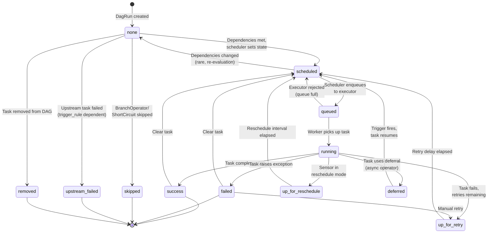

### State Descriptions

| State | Description | Who Sets It |
|-------|-------------|-------------|
| `none` | TaskInstance exists but hasn't been evaluated yet | Scheduler (on DagRun creation) |
| `scheduled` | Dependencies met, ready to be picked up | Scheduler |
| `queued` | Sent to executor, waiting for a worker | Scheduler |
| `running` | Worker is actively executing the task | Worker |
| `success` | Task completed successfully | Worker |
| `failed` | Task raised an exception (no retries left) | Worker |
| `up_for_retry` | Task failed but has retries remaining | Worker |
| `up_for_reschedule` | Sensor in `reschedule` mode, waiting for next poke | Worker |
| `deferred` | Task is waiting for an async trigger | Worker |
| `skipped` | Task was skipped (branch, short-circuit) | Scheduler/Worker |
| `upstream_failed` | An upstream task failed (and trigger_rule requires success) | Scheduler |
| `removed` | Task was removed from the DAG definition | Scheduler |

### How Dependencies Are Evaluated

```python
# Simplified dependency evaluation from _schedule_all_dag_runs

def _schedule_all_dag_runs(self, session):
    """For each active DagRun, evaluate task dependencies."""
    
    active_runs = session.query(DagRun).filter(
        DagRun.state == DagRunState.RUNNING,
    ).limit(self.max_dagruns_per_loop_to_schedule).all()
    
    for dag_run in active_runs:
        dag = self.dagbag.get_dag(dag_run.dag_id)
        
        # Get all TaskInstances for this DagRun
        tis = dag_run.get_task_instances(session=session)
        
        for ti in tis:
            if ti.state == TaskInstanceState.NONE:
                # Check if all upstream dependencies are met
                dep_context = DepContext(
                    deps=SCHEDULED_DEPS,
                    flag_upstream_failed=True,
                )
                
                if ti.are_dependencies_met(dep_context, session):
                    # All upstream tasks succeeded → mark as scheduled
                    ti.state = TaskInstanceState.SCHEDULED
                else:
                    # Check if we should mark upstream_failed
                    if ti.check_upstream_failed(session):
                        ti.state = TaskInstanceState.UPSTREAM_FAILED
```

### Dependency Rules (Trigger Rules)

```python
# The trigger_rule parameter on a task determines how upstream 
# dependencies are evaluated

from airflow.utils.trigger_rule import TriggerRule

# Default: ALL upstream tasks must succeed
task = PythonOperator(
    task_id="process",
    trigger_rule=TriggerRule.ALL_SUCCESS,  # This is the default
    python_callable=process_fn,
)

# ALL available trigger rules:
# ALL_SUCCESS:        All upstream tasks succeeded
# ALL_FAILED:         All upstream tasks failed
# ALL_DONE:           All upstream tasks completed (any state)
# ALL_SKIPPED:        All upstream tasks were skipped
# ONE_SUCCESS:        At least one upstream task succeeded
# ONE_FAILED:         At least one upstream task failed
# ONE_DONE:           At least one upstream task completed
# NONE_FAILED:        No upstream task failed (success or skipped OK)
# NONE_SKIPPED:       No upstream task was skipped
# NONE_FAILED_MIN_ONE_SUCCESS: No failures and at least one success
# DUMMY / ALWAYS:     No dependencies (always runs)
```

---

## Sending Tasks to the Executor

The critical section where tasks are moved from `scheduled` to `queued` and sent to the executor is the most performance-sensitive part of the scheduler.

### The Critical Section

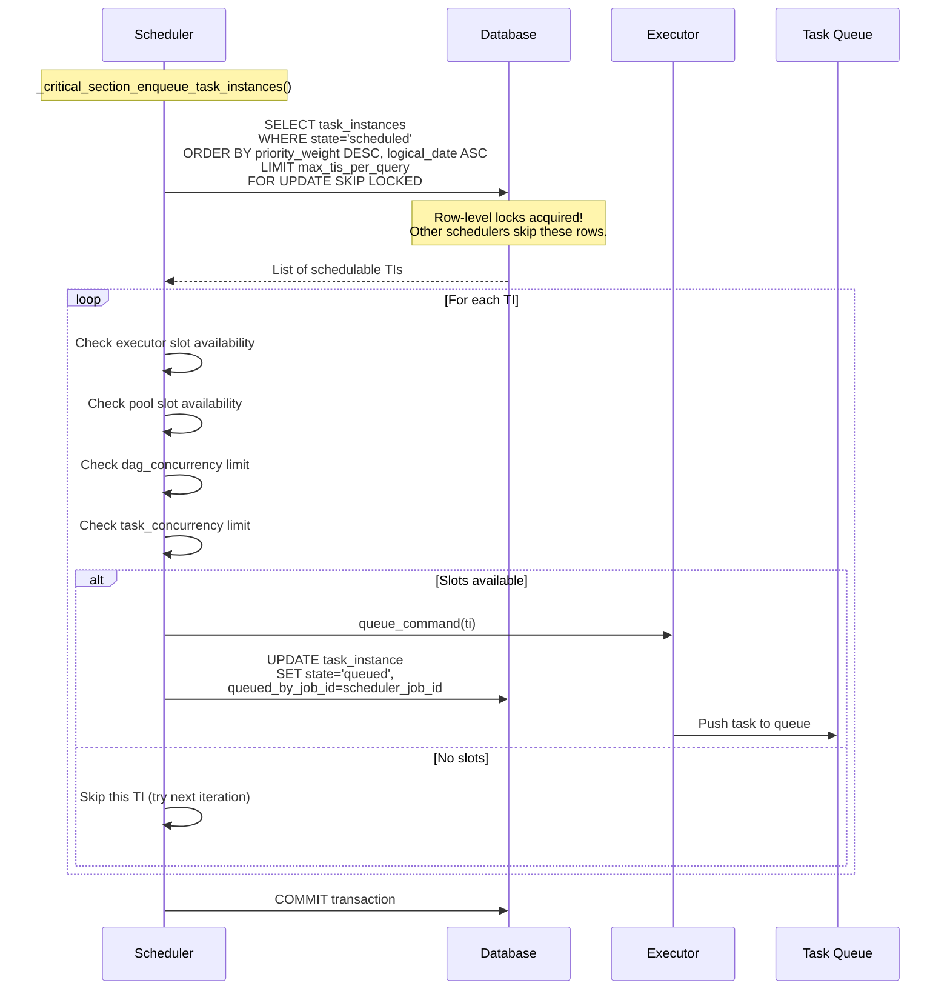

### Concurrency Limits — The Hierarchy

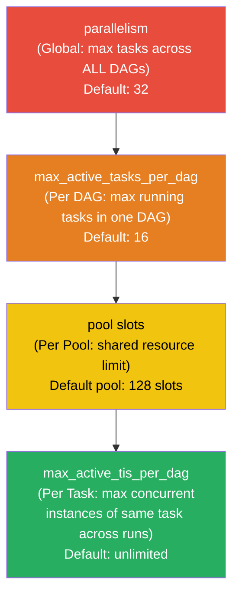

```python
# How the scheduler checks concurrency limits

def _executable_task_instances_to_queued(self, session):
    """Move task instances from scheduled to queued, respecting limits."""
    
    # 1. Global parallelism check
    total_running = session.query(func.count(TaskInstance.id)).filter(
        TaskInstance.state.in_([State.RUNNING, State.QUEUED])
    ).scalar()
    
    open_slots = self.parallelism - total_running
    if open_slots <= 0:
        return []  # No global capacity
    
    # 2. Query schedulable TIs with priority ordering
    schedulable_tis = session.query(TaskInstance).filter(
        TaskInstance.state == TaskInstanceState.SCHEDULED,
    ).order_by(
        TaskInstance.priority_weight.desc(),  # Higher priority first
        TaskInstance.logical_date.asc(),       # Older runs first
    ).limit(
        min(open_slots, self.max_tis_per_query)
    ).with_for_update(
        skip_locked=True  # Critical for multi-scheduler
    ).all()
    
    # 3. Check per-task, per-DAG, and pool limits
    for ti in schedulable_tis:
        if not self._has_pool_capacity(ti, session):
            continue
        if not self._has_dag_concurrency_capacity(ti, session):
            continue
        
        ti.state = TaskInstanceState.QUEUED
        ti.queued_dttm = timezone.utcnow()
        self.executor.queue_command(ti)
```

### Priority Weight Calculation

```python
# Priority weight determines which tasks get scheduled first
# It's calculated as the sum of all downstream task priorities

# Example DAG:
#   extract (priority=1) → transform (priority=1) → load (priority=1)
#
# Priority weights:
#   extract:   1 + 1 + 1 = 3  (itself + transform + load)
#   transform: 1 + 1     = 2  (itself + load)
#   load:      1          = 1  (itself)
#
# This means extract gets scheduled first, which is correct!
# You want to start the critical path as early as possible.

# You can customize:
task = PythonOperator(
    task_id="critical_task",
    priority_weight=10,  # Higher = scheduled sooner
    weight_rule="downstream",  # downstream | upstream | absolute
    python_callable=critical_fn,
)
```

---

## Mini-Scheduler — Executor-Side Scheduling

Introduced in Airflow 2.0, the mini-scheduler allows executors to schedule immediate downstream tasks without waiting for the next scheduler loop iteration.

### How It Works

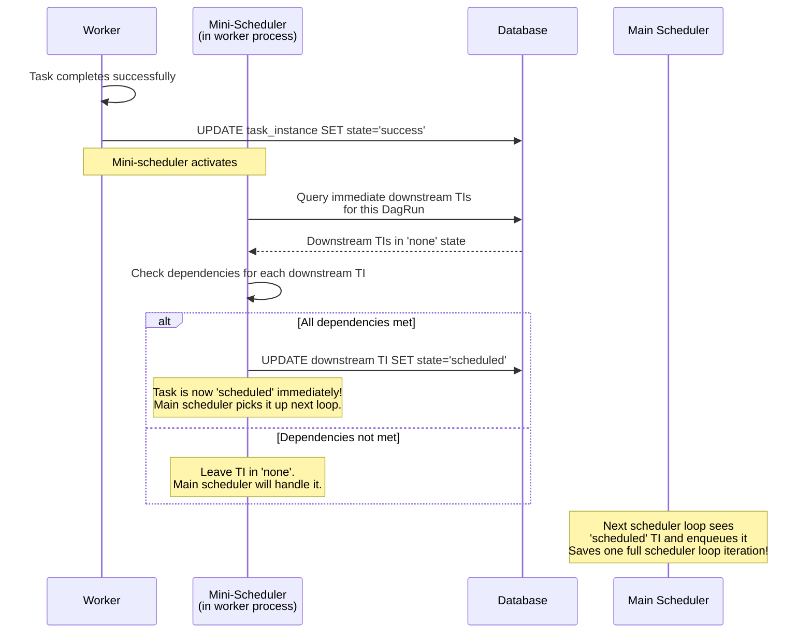

### Configuration

```python
# Enable/disable mini-scheduler
# airflow.cfg
[scheduler]
schedule_after_task_execution = True  # Default: True in Airflow 2.x

# This reduces scheduling latency for sequential pipelines
# from ~scheduler_loop_time to ~0
```

### When Mini-Scheduler Helps Most

```
Without mini-scheduler:
Task A completes → wait for scheduler loop (1-5s) → Task B scheduled → wait for scheduler loop → Task B queued

With mini-scheduler:
Task A completes → mini-scheduler marks Task B as scheduled → scheduler loop → Task B queued

Saves: One full scheduler loop iteration per task in sequential chains
For a pipeline with 20 sequential tasks: saves 20-100 seconds total
```

---

## Scheduler High Availability

Airflow 2.0+ supports running multiple scheduler instances simultaneously. This is critical for production — a single scheduler is a single point of failure.

### How Multiple Schedulers Coordinate

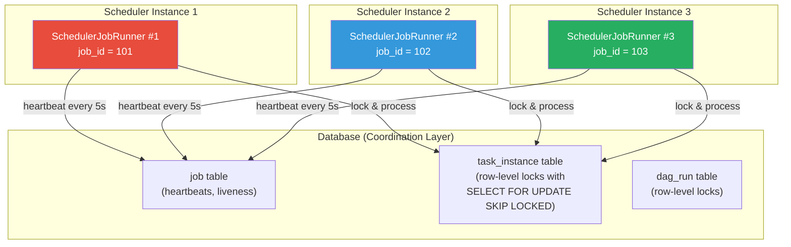

### The SELECT FOR UPDATE SKIP LOCKED Pattern

This is the key mechanism that prevents multiple schedulers from processing the same tasks:

```sql
-- What the scheduler actually executes (PostgreSQL)
SELECT task_instance.*
FROM task_instance
WHERE state = 'scheduled'
ORDER BY priority_weight DESC, logical_date ASC
LIMIT 512
FOR UPDATE SKIP LOCKED;

-- FOR UPDATE: Acquires a row-level lock on matching rows
-- SKIP LOCKED: If another transaction already locked a row, skip it
-- This means:
--   Scheduler 1 might lock rows 1-100
--   Scheduler 2 simultaneously locks rows 101-200
--   No contention, no deadlocks!
```

### Health Checks and Failover

```python
# How scheduler liveness is tracked

class SchedulerJobRunner:
    def heartbeat(self):
        """Record that this scheduler is alive."""
        # Update the job table with current timestamp
        self.job.latest_heartbeat = timezone.utcnow()
        session.merge(self.job)
        session.commit()
    
    def is_alive(self):
        """Check if another scheduler instance is still alive."""
        # A scheduler is considered dead if its last heartbeat
        # is older than scheduler_health_check_threshold (default: 30s)
        threshold = timezone.utcnow() - timedelta(
            seconds=conf.getint('scheduler', 'scheduler_health_check_threshold')
        )
        return self.job.latest_heartbeat > threshold
```

### DAG Parsing Distribution

When running multiple schedulers, each scheduler instance runs its own `DagFileProcessorManager`. This means **every DAG file is parsed by every scheduler**. This is by design — each scheduler needs a complete view of all DAGs.

```
# With 3 schedulers and 100 DAG files:
# Scheduler 1: parses all 100 files
# Scheduler 2: parses all 100 files
# Scheduler 3: parses all 100 files
# Total parsing work: 300 file parses (3x overhead)
# This is the trade-off for HA — parsing is idempotent
```

---

## Dead Letter and Orphaned Task Handling

### Zombie Tasks

A zombie task is one that shows as `running` in the database but the actual worker process has died. This can happen due to:

- Worker OOM killed by the OS
- Worker node crash
- Network partition between worker and database
- Worker process segfault

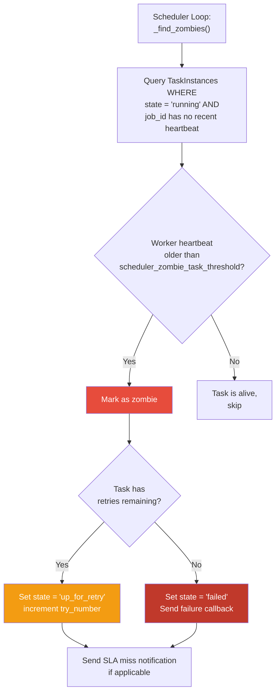

### Detection Code

```python
# Simplified zombie detection

def _find_zombies(self, session):
    """Find tasks that claim to be running but have no heartbeat."""
    
    # Threshold: how long without a heartbeat before considered zombie
    limit_dttm = timezone.utcnow() - timedelta(
        seconds=self._zombie_threshold_secs  # Default: 300 seconds
    )
    
    # Find running TIs whose associated job has no recent heartbeat
    zombies = session.query(TaskInstance).join(
        Job, TaskInstance.job_id == Job.id
    ).filter(
        TaskInstance.state == TaskInstanceState.RUNNING,
        Job.latest_heartbeat < limit_dttm,
    ).all()
    
    for ti in zombies:
        self.log.warning(
            "Detected zombie task: %s %s %s",
            ti.dag_id, ti.task_id, ti.run_id,
        )
        
        # Fail the task with a ZombieProcError
        ti.handle_failure(
            error=f"Detected as zombie. "
                  f"Last heartbeat was at {ti.job.latest_heartbeat}",
            session=session,
        )
```

### Orphaned DagRuns

An orphaned DagRun is one where all TaskInstances are in terminal states but the DagRun itself is still in `running` state.

```python
def _verify_integrity_if_dag_changed(self, dag_run, session):
    """Handle DagRuns when the DAG structure changes."""
    
    # If a task was removed from the DAG definition but the DagRun 
    # still has a TaskInstance for it:
    # → Mark that TaskInstance as 'removed'
    
    # If a task was added to the DAG definition but the DagRun
    # doesn't have a TaskInstance for it:
    # → Create a new TaskInstance in 'none' state
    
    current_task_ids = set(dag.task_ids)
    existing_ti_task_ids = {ti.task_id for ti in dag_run.task_instances}
    
    # Tasks removed from DAG
    for ti in dag_run.task_instances:
        if ti.task_id not in current_task_ids:
            ti.state = TaskInstanceState.REMOVED
    
    # Tasks added to DAG
    for task_id in current_task_ids - existing_ti_task_ids:
        ti = TaskInstance(
            task_id=task_id,
            dag_id=dag_run.dag_id,
            run_id=dag_run.run_id,
            state=TaskInstanceState.NONE,
        )
        session.add(ti)
```

---

## Performance Bottlenecks and Tuning

### Common Bottlenecks

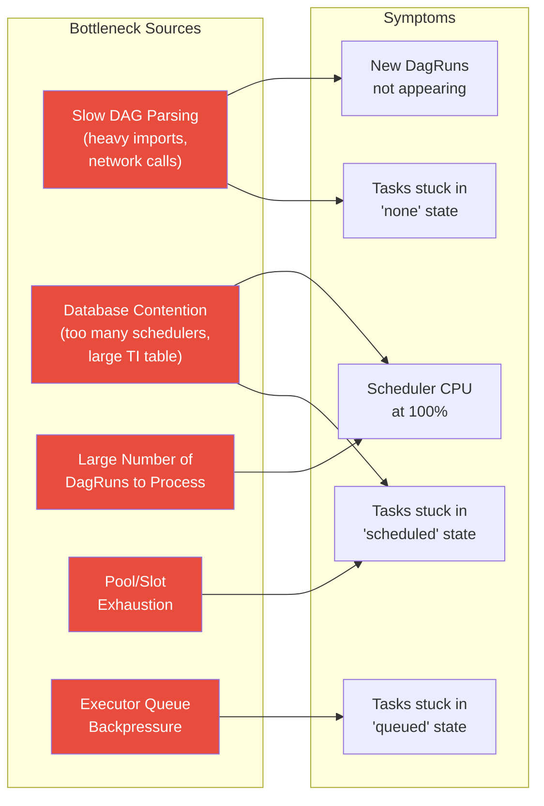

### Tuning Guide

#### 1. Parsing Performance

```python
# Problem: Scheduler spends too much time parsing DAG files
# Diagnosis: Check scheduler logs for parse times

# Solutions:

# a) Increase parsing processes
[scheduler]
parsing_processes = 4  # Default: 2. Increase to num_cpu_cores - 1

# b) Increase min_file_process_interval  
min_file_process_interval = 60  # Default: 30. If DAGs don't change often

# c) Use .airflowignore to exclude non-DAG files
# In your dags/ directory, create .airflowignore:
# test_*.py
# scratch/
# notebooks/

# d) Reduce top-level code in DAG files
# BEFORE (slow):
import pandas as pd
import numpy as np
from my_heavy_library import everything  # Takes 2s to import

# AFTER (fast):
# Only import what's needed at parse time
from airflow import DAG
from airflow.operators.python import PythonOperator
# Heavy imports happen inside the task function
```

#### 2. Scheduler Loop Performance

```python
# Problem: Scheduler loop takes too long per iteration
# Each iteration should complete in < 1 second

# Key settings:
[scheduler]
max_dagruns_to_create_per_loop = 10    # Reduce if too many DAGs
max_dagruns_per_loop_to_schedule = 20  # Reduce if DagRuns have many tasks
max_tis_per_query = 512                 # Reduce if DB queries are slow

# Problem: Scheduler constantly busy
scheduler_idle_sleep_time = 1  # Increase if scheduler CPU is high

# Problem: Too many DagRuns in active state
# Old DagRuns accumulate and the scheduler scans all of them
# Solution: Ensure DAGs complete and DagRuns transition to 'success'/'failed'
```

#### 3. Database Performance

```python
# The #1 performance bottleneck is usually the database

# a) Ensure proper indexes exist (Airflow migrations create these)
# Critical indexes:
# - task_instance(dag_id, state)
# - task_instance(state, queued_dttm)
# - dag_run(dag_id, state)
# - dag_run(state, logical_date)

# b) Run VACUUM ANALYZE regularly (PostgreSQL)
# Airflow's task_instance table gets massive UPDATE churn
# Dead tuples accumulate and slow down queries
# Schedule: VACUUM ANALYZE task_instance; every hour

# c) Connection pooling
[database]
sql_alchemy_pool_size = 5        # Default: 5
sql_alchemy_max_overflow = 10    # Default: 10
sql_alchemy_pool_recycle = 1800  # Default: 1800 (30 min)
sql_alchemy_pool_pre_ping = True # Verify connections before using
```

---

## Database Query Patterns

Understanding what queries the scheduler executes helps diagnose performance issues.

### Most Frequent Queries

```sql
-- 1. Find schedulable task instances (runs every loop iteration)
SELECT ti.* 
FROM task_instance ti
WHERE ti.state = 'scheduled'
ORDER BY ti.priority_weight DESC, ti.logical_date ASC
LIMIT 512
FOR UPDATE SKIP LOCKED;

-- 2. Count running tasks per pool (runs every loop iteration)
SELECT ti.pool, COUNT(*) as count
FROM task_instance ti
WHERE ti.state IN ('running', 'queued')
GROUP BY ti.pool;

-- 3. Find active DagRuns to schedule (runs every loop iteration)
SELECT dr.*
FROM dag_run dr
WHERE dr.state = 'running'
ORDER BY dr.logical_date ASC
LIMIT 20;

-- 4. Get task instances for a DagRun (runs for each active DagRun)
SELECT ti.*
FROM task_instance ti
WHERE ti.dag_id = :dag_id
AND ti.run_id = :run_id;

-- 5. Update task state (runs for each state transition)
UPDATE task_instance
SET state = :new_state, 
    start_date = :start_date,
    queued_dttm = :queued_dttm
WHERE dag_id = :dag_id 
AND task_id = :task_id 
AND run_id = :run_id;

-- 6. Zombie detection (runs every few loop iterations)
SELECT ti.*
FROM task_instance ti
JOIN job j ON ti.job_id = j.id
WHERE ti.state = 'running'
AND j.latest_heartbeat < :threshold;
```

### Query Performance Monitoring

```sql
-- PostgreSQL: Find slow queries from the scheduler
SELECT query, calls, mean_exec_time, total_exec_time
FROM pg_stat_statements
WHERE query LIKE '%task_instance%'
ORDER BY total_exec_time DESC
LIMIT 20;

-- PostgreSQL: Check for table bloat
SELECT relname, n_live_tup, n_dead_tup, 
       round(n_dead_tup::numeric / (n_live_tup + n_dead_tup + 1) * 100, 2) as dead_pct
FROM pg_stat_user_tables
WHERE relname IN ('task_instance', 'dag_run', 'log')
ORDER BY n_dead_tup DESC;
```

---

## Production Debugging Scenarios

### Scenario 1: Tasks Stuck in "scheduled" State

```
Symptom: Tasks show state=scheduled for minutes/hours
         but never transition to queued/running
```

```python
# Debugging steps:

# 1. Check if the scheduler is running
airflow jobs check --job-type SchedulerJob --local

# 2. Check pool availability
airflow pools list
# Look for pools where "open" slots = 0

# 3. Check concurrency limits
# Is parallelism maxed out?
SELECT COUNT(*) FROM task_instance 
WHERE state IN ('running', 'queued');
# Compare with [core] parallelism setting

# 4. Check if the executor is healthy
# CeleryExecutor: check if Celery workers are consuming
celery -A airflow.executors.celery_executor.app inspect active

# 5. Check for database locks
# PostgreSQL:
SELECT pid, state, query, query_start
FROM pg_stat_activity
WHERE state = 'active'
AND query LIKE '%task_instance%';

# 6. Check scheduler logs
grep "Sending TaskInstance" $AIRFLOW_HOME/logs/scheduler/latest/*.log
```

### Scenario 2: DAG Not Appearing in Web UI

```
Symptom: You created a new DAG file but it doesn't show in the UI
```

```python
# Debugging steps:

# 1. Check if the file is in the DAGs folder
ls -la $AIRFLOW_HOME/dags/your_dag.py

# 2. Check for import errors
airflow dags list-import-errors

# 3. Check .airflowignore
cat $AIRFLOW_HOME/dags/.airflowignore

# 4. Try parsing the file manually
python $AIRFLOW_HOME/dags/your_dag.py
# If this fails, fix the Python error

# 5. Check if DAG ID already exists from another file
airflow dags details your_dag_id

# 6. Check file permissions
# The scheduler process user must be able to read the file

# 7. Check parsing timeout
# If your file takes > dagbag_import_timeout to parse, it's killed
```

### Scenario 3: Scheduler Memory Growing Unbounded

```
Symptom: Scheduler process RSS memory grows over time
         Eventually gets OOM killed
```

```python
# Common causes:

# 1. Too many DAG objects loaded in memory
# Each parsed DAG stays in the DagBag in-memory cache
# Solution: Use DAG serialization (default in Airflow 2.x)

# 2. Large XCom values being loaded during dependency checks
# Solution: Use external XCom backends (S3, GCS)

# 3. Memory leak in custom DAG code
# Your DAG file's top-level code may accumulate state
# Solution: Ensure no mutable global state in DAG files

# Monitoring:
# Track scheduler process RSS memory over time
import psutil
process = psutil.Process()
memory_mb = process.memory_info().rss / 1024 / 1024
```

### Scenario 4: DagRuns Not Being Created

```
Symptom: A DAG exists and is unpaused, but no new DagRuns appear
```

```python
# Debugging steps:

# 1. Check if the DAG is paused
SELECT is_paused FROM dag WHERE dag_id = 'your_dag';

# 2. Check max_active_runs
SELECT COUNT(*) FROM dag_run 
WHERE dag_id = 'your_dag' AND state = 'running';
# Compare with DAG's max_active_runs setting

# 3. Check the next_dagrun column
SELECT next_dagrun, next_dagrun_data_interval_start, 
       next_dagrun_data_interval_end
FROM dag WHERE dag_id = 'your_dag';
# If next_dagrun is in the future, the schedule hasn't come due

# 4. Check if start_date is in the future
# DAGs with start_date in the future won't create runs

# 5. Check catchup parameter
# If catchup=False and the DAG was unpaused after several
# scheduled intervals passed, only the latest run is created

# 6. Check if the DAG has a schedule
# DAGs with schedule=None only run when manually triggered
```

---

## Monitoring the Scheduler

### Key Metrics to Track

```python
# Airflow exposes StatsD/Prometheus metrics for the scheduler.
# Here are the critical ones:

CRITICAL_METRICS = {
    # How long each scheduler loop takes
    "scheduler.scheduler_loop_duration": {
        "healthy": "< 1 second",
        "warning": "1-5 seconds",
        "critical": "> 5 seconds",
    },
    
    # Number of tasks in each state
    "scheduler.tasks.running": {
        "description": "Currently running tasks",
    },
    "scheduler.tasks.starving": {
        "description": "Tasks scheduled but can't run (no slots)",
        "action": "Increase parallelism or pool size",
    },
    
    # Task instance state transitions per second
    "ti.finish.<dag_id>.<task_id>.<state>": {
        "description": "Task completions by state",
    },
    
    # DAG parsing duration
    "dag_processing.total_parse_time": {
        "healthy": "< 5 seconds per file",
        "critical": "> 30 seconds per file",
    },
    
    # Executor queue size
    "executor.queued_tasks": {
        "description": "Tasks waiting in executor queue",
        "action_if_growing": "Add more workers",
    },
    
    # Scheduler heartbeat
    "scheduler.heartbeat": {
        "description": "Scheduler liveness signal",
        "alert_if_missing": "Scheduler is down!",
    },
    
    # Zombie tasks killed
    "scheduler.zombies_killed": {
        "description": "Number of zombie tasks detected and killed",
        "action_if_high": "Investigate worker stability",
    },
}
```

### Prometheus/Grafana Dashboard Queries

```python
# Example Grafana dashboard queries (using airflow StatsD exporter)

# 1. Scheduler loop duration (p99)
histogram_quantile(0.99, 
    rate(airflow_scheduler_loop_duration_seconds_bucket[5m]))

# 2. Task throughput
sum(rate(airflow_ti_finish_total[5m])) by (state)

# 3. Scheduler heartbeat gap
time() - max(airflow_scheduler_heartbeat_timestamp)

# 4. DAG parsing time distribution
histogram_quantile(0.95,
    rate(airflow_dag_processing_duration_seconds_bucket[5m]))
```

### Health Check Endpoint

```python
# Airflow provides a scheduler health check endpoint
# GET /health

# Response when healthy:
{
    "metadatabase": {"status": "healthy"},
    "scheduler": {
        "status": "healthy",
        "latest_scheduler_heartbeat": "2025-01-15T10:30:00+00:00"
    }
}

# Use this for Kubernetes liveness/readiness probes:
# livenessProbe:
#   httpGet:
#     path: /health
#     port: 8974
#   initialDelaySeconds: 30
#   periodSeconds: 10
```

---

## Interview Questions

### Beginner Level

**Q: What does the Airflow scheduler do?**

A: The scheduler has two main jobs: (1) Parsing DAG files from disk to discover and register DAGs, and (2) Creating DagRuns based on schedules and scheduling TaskInstances by evaluating dependencies, managing state transitions, and sending work to the executor.

**Q: What happens when a task fails?**

A: The worker sets the TaskInstance state to `failed` (or `up_for_retry` if retries remain). On retry, the scheduler waits for `retry_delay`, then transitions the TI back to `scheduled`. If all retries are exhausted, the TI stays in `failed`, and `on_failure_callback` is invoked.

### Intermediate Level

**Q: How do multiple schedulers coordinate without processing the same tasks?**

A: They use `SELECT FOR UPDATE SKIP LOCKED` on the task_instance table. When a scheduler queries for schedulable tasks, it acquires row-level locks. Other schedulers running concurrently skip those locked rows and process different tasks. This provides work distribution without explicit coordination.

**Q: What is a zombie task and how does Airflow handle it?**

A: A zombie task is a TaskInstance that shows as `running` in the database but the worker process that was executing it has died (OOM, crash, etc.). The scheduler detects zombies by checking if the worker's heartbeat has exceeded `scheduler_zombie_task_threshold` (default: 300s). Detected zombies are failed or retried based on remaining retry count.

**Q: Why should you avoid expensive operations at DAG parse time?**

A: DAG files are re-parsed every `min_file_process_interval` (default 30s) by the `DagFileProcessor`. Any code at the top level of a DAG file executes during every parse. Network calls, heavy imports, or database queries at parse time will slow down the scheduler and can cause parsing timeouts.

### Advanced Level

**Q: Walk me through the exact sequence of database queries the scheduler executes when scheduling a single task from `none` to `running`.**

A: (1) Query `dag_run` table for active DagRuns. (2) Query `task_instance` table for TIs in that DagRun. (3) Evaluate dependencies by checking upstream TI states. (4) UPDATE TI state from `none` to `scheduled`. (5) In the critical section, SELECT TIs in `scheduled` state with `FOR UPDATE SKIP LOCKED`. (6) Check pool capacity (query pool table and count running/queued TIs per pool). (7) UPDATE TI state from `scheduled` to `queued` and set `queued_dttm`. (8) Send task command to executor. (9) Executor dispatches to worker. (10) Worker starts executing and UPDATEs TI state to `running`, sets `start_date` and `pid`.

**Q: How would you debug a production issue where the scheduler loop is taking > 10 seconds per iteration?**

A: First, check scheduler logs for timing breakdowns of each loop phase. Common causes: (1) Database — run `EXPLAIN ANALYZE` on the critical queries, check for missing indexes or table bloat. (2) DAG parsing — check `dag_processing.total_parse_time` metric, identify slow files. (3) Too many active DagRuns — reduce `max_dagruns_per_loop_to_schedule`. (4) Large number of TIs per DagRun — check if DAGs have thousands of tasks. (5) Database connection pool exhaustion — check `sql_alchemy_pool_size` and active connections. (6) Lock contention — if running multiple schedulers, check `pg_stat_activity` for blocked queries.

**Q: Design a monitoring system that alerts when the Airflow scheduler is degraded but not completely dead.**

A: Track these signals: (1) `scheduler_loop_duration` p99 > threshold — scheduler is slow but running. (2) Growing `scheduled` task count with flat `queued` count — scheduler can't enqueue fast enough. (3) Growing `queued` task count with flat `running` count — executor/worker bottleneck. (4) `dag_processing.total_parse_time` increasing — DAG parsing is degrading. (5) Gap between `logical_date` of newest DagRun and current time — DagRun creation is falling behind. Set up composite alerts: WARN when 2+ signals degrade, CRITICAL when any signal exceeds 3x normal baseline.

---

**[← Back to Deep Dives](../README.md#-deep-dives)**
