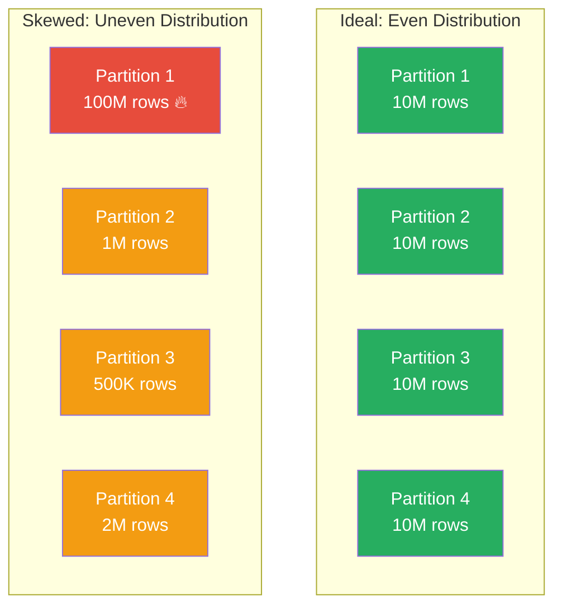
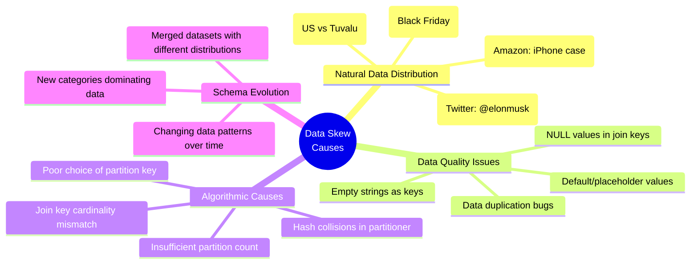
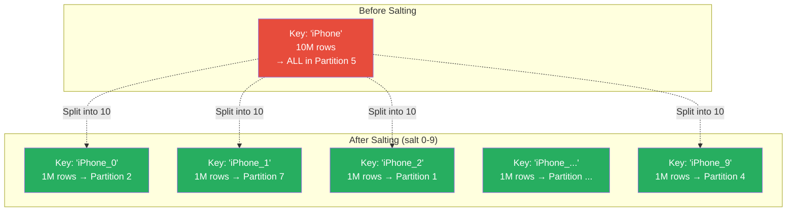
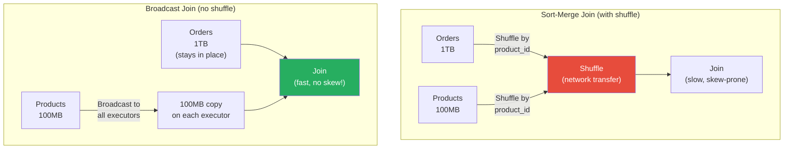
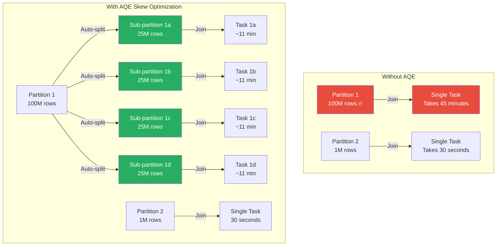
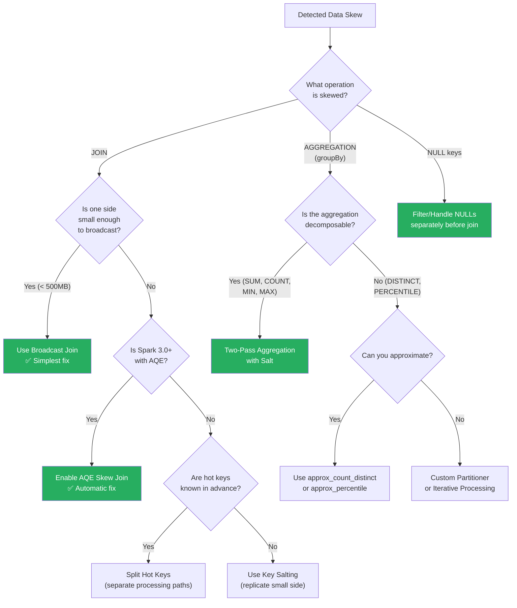

# 🔬 Data Skew Deep Dive — The Silent Performance Killer

> **Data skew is the #1 reason Spark jobs take hours instead of minutes. One hot key can bring a 100-node cluster to its knees. This chapter teaches you to detect, diagnose, and eliminate skew like a seasoned data engineer.**

---

## 📋 Table of Contents

1. [What Is Data Skew?](#what-is-data-skew)
2. [Why Data Skew Happens](#why-data-skew-happens)
3. [The Performance Impact — Why It Matters](#the-performance-impact)
4. [How to Detect Data Skew](#how-to-detect-data-skew)
5. [Real-World Skew Scenarios](#real-world-skew-scenarios)
6. [Mitigation Strategy 1: Key Salting](#mitigation-strategy-1-key-salting)
7. [Mitigation Strategy 2: Broadcast Join](#mitigation-strategy-2-broadcast-join)
8. [Mitigation Strategy 3: AQE Skew Join Optimization](#mitigation-strategy-3-aqe-skew-join-optimization)
9. [Mitigation Strategy 4: Custom Partitioners](#mitigation-strategy-4-custom-partitioners)
10. [Mitigation Strategy 5: Splitting Hot Keys](#mitigation-strategy-5-splitting-hot-keys)
11. [Mitigation Strategy 6: Repartitioning Strategies](#mitigation-strategy-6-repartitioning-strategies)
12. [Mitigation Strategy 7: Iterative Processing](#mitigation-strategy-7-iterative-processing)
13. [Mitigation Strategy 8: Two-Pass Aggregation](#mitigation-strategy-8-two-pass-aggregation)
14. [Null Key Skew — The Most Common Culprit](#null-key-skew)
15. [Monitoring and Alerting for Skew](#monitoring-and-alerting-for-skew)
16. [Decision Flowchart — Which Strategy to Use](#decision-flowchart)
17. [Cost Analysis of Skew Mitigation](#cost-analysis)
18. [Interview Questions](#interview-questions)

---

## What Is Data Skew?

Data skew occurs when data is unevenly distributed across partitions, causing some tasks to process significantly more data than others.



### The Fundamental Problem

```
Without skew: 4 tasks × 10M rows each = All finish in ~30 seconds
Stage time: 30 seconds

With skew:   Task 1: 100M rows = 300 seconds
             Task 2: 1M rows   = 3 seconds
             Task 3: 500K rows = 1.5 seconds
             Task 4: 2M rows   = 6 seconds
Stage time: 300 seconds (waiting for Task 1!)

A stage is only as fast as its slowest task.
3 tasks sit idle for 294+ seconds. 3 executors wasted.
```

---

## Why Data Skew Happens

### Root Causes



### Quantifying Skew

```python
# How to measure skew numerically

from pyspark.sql import functions as F

# Method 1: Distribution statistics
df.groupBy("join_key") \
    .count() \
    .select(
        F.min("count").alias("min"),
        F.percentile_approx("count", 0.25).alias("p25"),
        F.percentile_approx("count", 0.50).alias("median"),
        F.percentile_approx("count", 0.75).alias("p75"),
        F.percentile_approx("count", 0.95).alias("p95"),
        F.percentile_approx("count", 0.99).alias("p99"),
        F.max("count").alias("max"),
        F.stddev("count").alias("stddev"),
    ).show()

# Output for a skewed dataset:
# +---+---+------+-----+------+--------+---------+---------+
# |min|p25|median| p75 |  p95 |   p99  |   max   | stddev  |
# +---+---+------+-----+------+--------+---------+---------+
# |  1| 12|    45| 120 | 5000 | 500000 |12000000 | 89234.5 |
# +---+---+------+-----+------+--------+---------+---------+
# Huge gap between p99 and max = severe skew on top keys

# Method 2: Skew ratio
key_counts = df.groupBy("join_key").count()
stats = key_counts.select(
    F.max("count").alias("max_count"),
    F.avg("count").alias("avg_count")
).collect()[0]

skew_ratio = stats["max_count"] / stats["avg_count"]
print(f"Skew ratio: {skew_ratio:.1f}x")
# Skew ratio > 10x: moderate skew
# Skew ratio > 100x: severe skew
# Skew ratio > 1000x: catastrophic skew

# Method 3: Top keys
df.groupBy("join_key") \
    .count() \
    .orderBy(F.desc("count")) \
    .limit(20) \
    .show()
```

---

## The Performance Impact

### Why Skew Destroys Performance

```mermaid
gantt
    title Task Execution Timeline (Skewed Stage)
    dateFormat X
    axisFormat %s

    section Executor 1
    Task 0 (100M rows)     :a1, 0, 300
    
    section Executor 2
    Task 1 (1M rows)       :a2, 0, 3
    IDLE                   :a3, 3, 300
    
    section Executor 3
    Task 2 (500K rows)     :a4, 0, 2
    IDLE                   :a5, 2, 300
    
    section Executor 4
    Task 3 (2M rows)       :a6, 0, 6
    IDLE                   :a7, 6, 300
```



### Memory Impact

```python
# Skew doesn't just waste time — it can cause OOM

# Each executor has fixed memory (e.g., 4GB)
# With even distribution: each task processes 10M rows ≈ 200MB → fits easily
# With skew: Task 1 processes 100M rows ≈ 2GB → might OOM!

# Symptoms of skew-caused OOM:
# 1. Container killed by YARN/K8s for exceeding memory limits
# 2. "GC overhead limit exceeded" — JVM spending >98% time in GC
# 3. "Unable to acquire memory" — Spark's memory manager out of space
# 4. Excessive shuffle spill to disk — 100x slower than in-memory

# The tragic pattern:
# Engineer sees OOM → increases executor memory to 16GB → works for a while
# Data grows → skew worsens → OOM again → increases to 32GB → ...
# This cycle continues until they address the root cause: skew
```

### Network Impact

```python
# During a shuffle, skewed data means one reducer fetches 
# enormously more data than others

# Example: groupBy("user_id") on social media data
# Most users: 10-100 events → small shuffle blocks
# Celebrity user: 10M events → one reducer gets a massive shuffle block

# Network impact:
# - One executor pulls 10GB while others pull 10MB
# - This executor becomes a network bottleneck
# - Can cause timeout on shuffle fetch (spark.reducer.maxReqSizeShuffleToMem)
# - Can cause OOM on shuffle read buffer
```

---

## How to Detect Data Skew

### Method 1: Spark UI

```
Step 1: Go to Spark UI → Stages tab
Step 2: Find the slow stage
Step 3: Click on the stage to see task metrics
Step 4: Look at the Summary Metrics table:

+------------------+-------+------+------+------+------+-------+
|       Metric     |  Min  | 25th | Med  | 75th | Max  |  Avg  |
+------------------+-------+------+------+------+------+-------+
| Duration         |  0.5s | 1.2s | 2.1s | 3.5s | 45m  |  5.2s |  ← SKEW!
| Input Size       |  5MB  | 10MB | 12MB | 15MB | 2.5GB| 14MB  |  ← SKEW!
| Shuffle Read     |  1MB  |  3MB |  4MB |  5MB | 800MB|  5MB  |  ← SKEW!
| GC Time          |  10ms | 50ms | 80ms | 120ms| 12min| 100ms |  ← SKEW!
+------------------+-------+------+------+------+------+-------+

If Max >> P75, you have skew. The bigger the ratio, the worse.
```

### Method 2: Programmatic Detection

```python
# Check partition sizes programmatically

def detect_skew(df, key_column, threshold_ratio=10):
    """Detect data skew in a DataFrame."""
    from pyspark.sql import functions as F
    
    # Get partition size distribution
    key_counts = df.groupBy(key_column).count().cache()
    
    stats = key_counts.agg(
        F.avg("count").alias("avg"),
        F.max("count").alias("max"),
        F.min("count").alias("min"),
        F.stddev("count").alias("stddev"),
        F.count("*").alias("num_keys"),
    ).collect()[0]
    
    skew_ratio = stats["max"] / max(stats["avg"], 1)
    
    print(f"=== Skew Analysis for '{key_column}' ===")
    print(f"Number of distinct keys: {stats['num_keys']:,}")
    print(f"Min count per key:       {stats['min']:,}")
    print(f"Avg count per key:       {stats['avg']:,.1f}")
    print(f"Max count per key:       {stats['max']:,}")
    print(f"Std deviation:           {stats['stddev']:,.1f}")
    print(f"Skew ratio (max/avg):    {skew_ratio:,.1f}x")
    
    if skew_ratio > threshold_ratio:
        print(f"\n⚠️  SKEW DETECTED! Ratio {skew_ratio:.1f}x exceeds threshold {threshold_ratio}x")
        
        # Show top offenders
        print("\nTop 10 skewed keys:")
        key_counts.orderBy(F.desc("count")).show(10)
    else:
        print(f"\n✅ No significant skew detected.")
    
    # Check for NULL keys
    null_count = df.filter(F.col(key_column).isNull()).count()
    if null_count > 0:
        null_pct = null_count / df.count() * 100
        print(f"\n⚠️  NULL keys: {null_count:,} ({null_pct:.1f}%)")
    
    key_counts.unpersist()
    return skew_ratio

# Usage:
skew_ratio = detect_skew(orders_df, "customer_id")
```

### Method 3: Runtime Metrics

```python
# Use task metrics listener to detect skew at runtime

from pyspark import SparkContext

class SkewDetectorListener(SparkContext._jvm.org.apache.spark.scheduler.SparkListener):
    """Custom listener that alerts on skewed stages."""
    
    def onStageCompleted(self, stageCompleted):
        info = stageCompleted.stageInfo()
        metrics = info.taskMetrics()
        
        # Get task durations
        task_infos = info.taskInfos()
        durations = [t.duration() for t in task_infos]
        
        median_duration = sorted(durations)[len(durations) // 2]
        max_duration = max(durations)
        
        if max_duration > 10 * median_duration:
            print(f"⚠️ SKEW in Stage {info.stageId()}: "
                  f"max={max_duration}ms, median={median_duration}ms, "
                  f"ratio={max_duration/median_duration:.1f}x")
```

---

## Real-World Skew Scenarios

### Scenario 1: E-Commerce — Popular Products

```python
# Problem: Joining orders with products
# Hot key: iPhone 15 has 10M orders, average product has 100 orders

orders = spark.read.parquet("s3://data/orders/")    # 1B rows
products = spark.read.parquet("s3://data/products/") # 1M rows

# This join will have SEVERE skew on popular product IDs
result = orders.join(products, "product_id", "inner")

# The partition containing iPhone 15's product_id processes:
# - 10M order rows × 1 product row = 10M output rows
# Other partitions process:
# - 100 order rows × 1 product row = 100 output rows
```

### Scenario 2: Social Media — Celebrity Users

```python
# Problem: Aggregating interactions per user
# Hot key: Celebrities have millions of followers/interactions

interactions = spark.read.parquet("s3://data/interactions/")  # 10B rows

# This groupBy will have extreme skew
user_stats = interactions.groupBy("user_id") \
    .agg(
        F.count("*").alias("total_interactions"),
        F.countDistinct("target_user_id").alias("unique_users"),
        F.sum("duration").alias("total_duration"),
    )

# @elonmusk: 500M interactions → 1 task processes 500M rows
# Average user: 50 interactions → 1 task processes 50 rows
```

### Scenario 3: Logs — Null Keys

```python
# Problem: Joining events with user profiles
# Hot key: NULL (anonymous/unidentified events)

events = spark.read.parquet("s3://data/events/")    # 5B rows
users = spark.read.parquet("s3://data/users/")      # 100M rows

# 30% of events have NULL user_id (anonymous traffic)
# All NULLs hash to the SAME partition!
# One partition: 1.5B rows. Other partitions: ~20M rows each.

result = events.join(users, "user_id", "left")
# This will either OOM or take hours on the NULL partition
```

---

## Mitigation Strategy 1: Key Salting

Key salting is the most versatile skew mitigation technique. It works by adding a random number to the key, distributing hot keys across multiple partitions.



### Salting for Joins

```python
from pyspark.sql import functions as F

SALT_RANGE = 10  # Number of salt buckets

# Large table (orders): add random salt
orders_salted = orders.withColumn(
    "salted_key",
    F.concat(
        F.col("product_id"),
        F.lit("_"),
        (F.rand() * SALT_RANGE).cast("int").cast("string")
    )
)

# Small table (products): EXPLODE to all salt values
products_exploded = products.withColumn(
    "salt", F.explode(F.array([F.lit(i) for i in range(SALT_RANGE)]))
).withColumn(
    "salted_key",
    F.concat(
        F.col("product_id"),
        F.lit("_"),
        F.col("salt").cast("string")
    )
).drop("salt")

# Now join on the salted key
result = orders_salted.join(
    products_exploded, "salted_key", "inner"
).drop("salted_key")

# What happened:
# - iPhone's 10M orders split across 10 partitions (1M each)
# - iPhone's product row is replicated 10 times (one per salt value)
# - Each partition now processes 1M orders × 1 product row
# - 10x faster (or more, since we avoid OOM)!

# Trade-off: Small table is replicated SALT_RANGE times
# If products is 100MB, exploded products is 1GB
# This is acceptable if the large table is TB-scale
```

### Salting for Aggregations

```python
# Two-phase aggregation with salting

# Phase 1: Add salt and compute partial aggregates
salted_agg = interactions \
    .withColumn("salt", (F.rand() * SALT_RANGE).cast("int")) \
    .groupBy("user_id", "salt") \
    .agg(
        F.count("*").alias("partial_count"),
        F.sum("duration").alias("partial_duration"),
    )

# Phase 2: Remove salt and compute final aggregates
final_agg = salted_agg \
    .groupBy("user_id") \
    .agg(
        F.sum("partial_count").alias("total_count"),
        F.sum("partial_duration").alias("total_duration"),
    )

# What happened:
# Phase 1: @elonmusk's 500M rows split into ~50M per salt bucket
# Phase 2: Only 10 rows per user (one per salt) → no skew!
```

---

## Mitigation Strategy 2: Broadcast Join

If one side of a join is small enough, broadcast it to all executors to eliminate the shuffle entirely.



```python
from pyspark.sql import functions as F

# Method 1: Explicit broadcast hint
result = orders.join(
    F.broadcast(products),  # Force broadcast
    "product_id",
    "inner"
)

# Method 2: Spark auto-broadcasts tables below threshold
# Default threshold: 10MB
spark.conf.set("spark.sql.autoBroadcastJoinThreshold", "100m")
# Now tables up to 100MB are automatically broadcast

# Method 3: SQL hint
result = spark.sql("""
    SELECT /*+ BROADCAST(products) */ o.*, p.name
    FROM orders o
    JOIN products p ON o.product_id = p.product_id
""")

# ⚠️ CAUTION: Don't broadcast tables that are too large
# Broadcasting a 1GB table to 100 executors = 100GB network transfer + 100GB memory
# Rule of thumb: broadcast only tables < 500MB (after filtering)
```

### When Broadcast Join Eliminates Skew

```python
# Broadcast join eliminates skew because there's NO SHUFFLE.
# Without shuffle, data stays in its original partitions.
# Each executor looks up matching rows from the broadcast table (hash map).
# No partition has more data than its original share.

# The hot key problem vanishes:
# - iPhone's 10M orders are spread across original partitions
# - Each partition has ~10M/200 = 50K iPhone orders
# - Each partition looks up "iPhone" in the broadcast hash table
# - Fast and even!
```

---

## Mitigation Strategy 3: AQE Skew Join Optimization

Adaptive Query Execution (AQE), introduced in Spark 3.0, can automatically detect and fix skew at runtime.



### Configuration

```python
# Enable AQE (default in Spark 3.2+)
spark.conf.set("spark.sql.adaptive.enabled", "true")

# Enable skew join optimization
spark.conf.set("spark.sql.adaptive.skewJoin.enabled", "true")

# How Spark detects a skewed partition:
# A partition is skewed if BOTH conditions are true:
# 1. Size > skewJoin.skewedPartitionFactor × median partition size
# 2. Size > skewJoin.skewedPartitionThresholdInBytes

spark.conf.set("spark.sql.adaptive.skewJoin.skewedPartitionFactor", "5")
# Default: 5 (partition must be 5x the median)

spark.conf.set("spark.sql.adaptive.skewJoin.skewedPartitionThresholdInBytes", "256m")
# Default: 256MB (partition must be at least 256MB)

# Other useful AQE settings:
spark.conf.set("spark.sql.adaptive.coalescePartitions.enabled", "true")
# Automatically reduce shuffle partitions when data is small

spark.conf.set("spark.sql.adaptive.localShuffleReader.enabled", "true")
# Use local shuffle reader when possible (avoids network transfer)
```

### How AQE Skew Join Works Internally

```python
# 1. Spark runs the shuffle map stages normally
# 2. After shuffle writes complete, AQE reads shuffle file sizes
#    (MapStatus objects contain partition sizes)
# 3. AQE calculates median partition size
# 4. Any partition > 5x median AND > 256MB is marked as skewed
# 5. The skewed partition is split into sub-partitions
# 6. For each sub-partition of the skewed side:
#    - The corresponding partition from the OTHER side is replicated
#    - A new join task is created for each sub-partition pair
# 7. All sub-partition join results are merged (UNION)

# Example:
# Orders shuffled by product_id:
#   Partition 5 (iPhone): 2GB  ← skewed (2GB > 5 × 100MB median)
#   All other partitions: ~100MB each
# Products shuffled by product_id:
#   Partition 5: 1KB (just the iPhone product row)
#   All other partitions: ~5KB each

# AQE splits Partition 5 into 8 sub-partitions of ~250MB each
# The iPhone product row (1KB) is replicated to 8 tasks
# 8 parallel tasks instead of 1 → ~8x faster
```

---

## Mitigation Strategy 4: Custom Partitioners

For RDD-based operations, you can implement a custom partitioner that distributes hot keys more evenly.

```python
from pyspark import Partitioner

class SkewAwarePartitioner(Partitioner):
    """Partitioner that spreads hot keys across multiple partitions."""
    
    def __init__(self, num_partitions, hot_keys, spread_factor=10):
        self._num_partitions = num_partitions
        self._hot_keys = set(hot_keys)
        self._spread_factor = spread_factor
    
    @property
    def numPartitions(self):
        return self._num_partitions
    
    def partitionFunc(self, key):
        if key in self._hot_keys:
            # Spread hot key across multiple partitions
            import random
            base_partition = hash(key) % self._num_partitions
            offset = random.randint(0, self._spread_factor - 1)
            return (base_partition + offset) % self._num_partitions
        else:
            # Normal partitioning for other keys
            return hash(key) % self._num_partitions

# Usage:
hot_keys = ["iPhone", "Galaxy S25", "MacBook Pro"]  # Known hot keys
partitioner = SkewAwarePartitioner(200, hot_keys, spread_factor=10)

result_rdd = orders_rdd.partitionBy(partitioner)
```

---

## Mitigation Strategy 5: Splitting Hot Keys

Process hot keys and normal keys separately, then union the results.

```python
from pyspark.sql import functions as F

# Step 1: Identify hot keys
key_counts = orders.groupBy("product_id").count()
hot_keys = key_counts.filter(F.col("count") > 1_000_000) \
    .select("product_id").collect()
hot_key_list = [row.product_id for row in hot_keys]

print(f"Found {len(hot_key_list)} hot keys")

# Step 2: Split the data
hot_orders = orders.filter(F.col("product_id").isin(hot_key_list))
normal_orders = orders.filter(~F.col("product_id").isin(hot_key_list))
hot_products = products.filter(F.col("product_id").isin(hot_key_list))
normal_products = products.filter(~F.col("product_id").isin(hot_key_list))

# Step 3: Join hot keys with broadcast (hot products is tiny)
hot_result = hot_orders.join(
    F.broadcast(hot_products),
    "product_id",
    "inner"
)

# Step 4: Join normal keys with regular sort-merge join (no skew)
normal_result = normal_orders.join(
    normal_products,
    "product_id",
    "inner"
)

# Step 5: Union results
result = hot_result.unionByName(normal_result)

# Why this works:
# - Hot keys: broadcast join (no shuffle, no skew)
# - Normal keys: sort-merge join (even distribution, no skew)
# - Both paths are fast!
```

---

## Mitigation Strategy 6: Repartitioning Strategies

Sometimes skew can be addressed by choosing a better partitioning strategy.

```python
# Strategy 1: Repartition by a different column
# If joining on user_id is skewed, but user_id + date is not:
df_repartitioned = df.repartition(200, "user_id", "date")

# Strategy 2: Repartition with more partitions
# More partitions = smaller partitions = less skew impact
df_repartitioned = df.repartition(1000, "join_key")

# Strategy 3: Use repartitionByRange for sorted data
# This uses sampling to determine partition boundaries
# Produces more even partitions than hash partitioning
df_repartitioned = df.repartitionByRange(200, "join_key")

# Strategy 4: Pre-filter before partitioning
# Remove null keys and irrelevant data before the shuffle
df_filtered = df.filter(
    F.col("join_key").isNotNull() & 
    F.col("join_key") != "" &
    F.col("date") >= "2025-01-01"
)
result = df_filtered.repartition(200, "join_key")

# Strategy 5: Use AQE coalesce
# Let Spark automatically reduce shuffle partitions
spark.conf.set("spark.sql.adaptive.enabled", "true")
spark.conf.set("spark.sql.adaptive.coalescePartitions.enabled", "true")
spark.conf.set("spark.sql.shuffle.partitions", "2000")  # Start high
# AQE will merge small partitions down to an appropriate number
```

---

## Mitigation Strategy 7: Iterative Processing

For extreme skew cases, process in iterations to avoid overwhelming any single executor.

```python
from pyspark.sql import functions as F

def iterative_join_with_skew(large_df, small_df, join_key, 
                               iterations=5, threshold=1_000_000):
    """Process a skewed join in iterations, peeling off hot keys."""
    
    results = []
    remaining = large_df
    
    for i in range(iterations):
        # Find current hottest keys
        key_counts = remaining.groupBy(join_key).count()
        hot_keys = key_counts.filter(F.col("count") > threshold) \
            .select(join_key).collect()
        hot_key_list = [row[0] for row in hot_keys]
        
        if not hot_key_list:
            # No more hot keys — process remainder normally
            result = remaining.join(small_df, join_key, "inner")
            results.append(result)
            break
        
        print(f"Iteration {i+1}: Processing {len(hot_key_list)} hot keys")
        
        # Process hot keys with broadcast
        hot_data = remaining.filter(F.col(join_key).isin(hot_key_list))
        hot_small = small_df.filter(F.col(join_key).isin(hot_key_list))
        hot_result = hot_data.join(F.broadcast(hot_small), join_key, "inner")
        results.append(hot_result)
        
        # Remove processed hot keys
        remaining = remaining.filter(~F.col(join_key).isin(hot_key_list))
    else:
        # Process any remaining data normally
        if remaining.count() > 0:
            result = remaining.join(small_df, join_key, "inner")
            results.append(result)
    
    # Union all results
    from functools import reduce
    return reduce(lambda a, b: a.unionByName(b), results)
```

---

## Mitigation Strategy 8: Two-Pass Aggregation

For aggregations (not joins), the two-pass technique is clean and effective.

```python
from pyspark.sql import functions as F

# Problem: groupBy("user_id").agg(count, sum) is skewed

# Solution: Two-pass aggregation with salt

NUM_SALTS = 20

# Pass 1: Aggregate with salt (distributes hot keys)
partial = df \
    .withColumn("salt", (F.rand() * NUM_SALTS).cast("int")) \
    .groupBy("user_id", "salt") \
    .agg(
        F.count("*").alias("partial_count"),
        F.sum("amount").alias("partial_sum"),
        F.min("timestamp").alias("partial_min_ts"),
        F.max("timestamp").alias("partial_max_ts"),
    )

# Pass 2: Aggregate without salt (combine partial results)
# Note: Only works for DECOMPOSABLE aggregations!
final = partial \
    .groupBy("user_id") \
    .agg(
        F.sum("partial_count").alias("total_count"),     # SUM of COUNTs
        F.sum("partial_sum").alias("total_sum"),           # SUM of SUMs
        F.min("partial_min_ts").alias("min_timestamp"),    # MIN of MINs
        F.max("partial_max_ts").alias("max_timestamp"),    # MAX of MAXs
    )

# ⚠️ Which aggregations are DECOMPOSABLE (work with two-pass)?
# ✅ COUNT → SUM of partial COUNTs
# ✅ SUM → SUM of partial SUMs
# ✅ MIN → MIN of partial MINs
# ✅ MAX → MAX of partial MAXs
# 
# ❌ COUNT DISTINCT → Cannot decompose!
# ❌ AVERAGE → Cannot decompose (need SUM/COUNT separately)
# ❌ MEDIAN → Cannot decompose
# ❌ PERCENTILE → Cannot decompose (use approx_percentile)
#
# For AVERAGE, compute SUM and COUNT separately:
# avg = total_sum / total_count
```

---

## Null Key Skew

NULL keys are the most common and most overlooked cause of data skew.

```python
# WHY nulls cause skew:
# In hash partitioning, hash(null) = 0 for ALL null values
# ALL rows with null keys go to THE SAME partition!

# Example: 30% of events have null user_id
# 3B events total → 900M rows in ONE partition!

# DETECTION:
null_count = df.filter(F.col("join_key").isNull()).count()
total_count = df.count()
print(f"Null keys: {null_count:,} ({null_count/total_count*100:.1f}%)")

# FIX 1: Filter nulls before join (if nulls are irrelevant)
df_clean = df.filter(F.col("join_key").isNotNull())
result = df_clean.join(other_df, "join_key", "inner")

# FIX 2: Handle nulls separately
nulls = df.filter(F.col("join_key").isNull())
non_nulls = df.filter(F.col("join_key").isNotNull())

# Join only non-null rows
joined = non_nulls.join(other_df, "join_key", "left")

# Add null rows back with null columns from the right side
result = joined.unionByName(
    nulls.select(
        *[F.col(c) for c in nulls.columns],
        *[F.lit(None).alias(c) for c in other_df.columns 
          if c not in nulls.columns]
    )
)

# FIX 3: Replace nulls with random values (for aggregation only)
df_fixed = df.withColumn(
    "join_key_clean",
    F.when(
        F.col("join_key").isNull(),
        F.concat(F.lit("NULL_"), (F.rand() * 100).cast("int").cast("string"))
    ).otherwise(F.col("join_key"))
)
```

---

## Monitoring and Alerting for Skew

### Automated Skew Detection

```python
from pyspark.sql import functions as F
import time

class SkewMonitor:
    """Monitor for data skew in production pipelines."""
    
    def __init__(self, spark, alert_threshold=10.0):
        self.spark = spark
        self.alert_threshold = alert_threshold
        self.metrics = []
    
    def check_partition_skew(self, df, step_name):
        """Check if a DataFrame has partition-level skew."""
        partition_sizes = df.rdd.mapPartitions(
            lambda it: [sum(1 for _ in it)]
        ).collect()
        
        if not partition_sizes or max(partition_sizes) == 0:
            return
        
        avg_size = sum(partition_sizes) / len(partition_sizes)
        max_size = max(partition_sizes)
        min_size = min(partition_sizes)
        skew_ratio = max_size / max(avg_size, 1)
        
        metric = {
            "step": step_name,
            "num_partitions": len(partition_sizes),
            "avg_size": avg_size,
            "max_size": max_size,
            "min_size": min_size,
            "skew_ratio": skew_ratio,
            "timestamp": time.time(),
        }
        self.metrics.append(metric)
        
        if skew_ratio > self.alert_threshold:
            self._alert(
                f"⚠️ SKEW DETECTED at step '{step_name}': "
                f"ratio={skew_ratio:.1f}x, "
                f"max_partition={max_size:,} rows, "
                f"avg_partition={avg_size:,.0f} rows"
            )
    
    def check_key_skew(self, df, key_column, step_name):
        """Check if a specific key column has value-level skew."""
        key_counts = df.groupBy(key_column).count()
        stats = key_counts.agg(
            F.max("count").alias("max"),
            F.avg("count").alias("avg"),
        ).collect()[0]
        
        skew_ratio = stats["max"] / max(stats["avg"], 1)
        
        if skew_ratio > self.alert_threshold:
            # Find the hot key
            hot_key = key_counts.orderBy(F.desc("count")).first()
            self._alert(
                f"⚠️ KEY SKEW at step '{step_name}' on column '{key_column}': "
                f"key='{hot_key[key_column]}' has {hot_key['count']:,} rows, "
                f"avg={stats['avg']:,.0f} rows, ratio={skew_ratio:.1f}x"
            )
    
    def _alert(self, message):
        """Send alert (integrate with your alerting system)."""
        print(message)
        # In production:
        # slack_client.send(channel="#data-alerts", text=message)
        # pagerduty.trigger(severity="warning", summary=message)

# Usage in pipeline:
monitor = SkewMonitor(spark, alert_threshold=10.0)

orders = spark.read.parquet("s3://data/orders/")
monitor.check_key_skew(orders, "product_id", "raw_orders")

enriched = orders.join(F.broadcast(products), "product_id")
monitor.check_partition_skew(enriched, "after_product_join")
```

---

## Decision Flowchart



---

## Cost Analysis

```
Strategy               | Complexity | Data Overhead | Compute Cost | Best For
-----------------------|------------|---------------|--------------|------------------
Broadcast Join         | Low        | N × small_tbl | Low          | Small dim tables
AQE Skew Join          | None       | Minimal       | Low          | Spark 3.0+ joins
Key Salting (Join)     | Medium     | N × small_tbl | Medium       | Any join skew
Key Salting (Agg)      | Medium     | ~2x shuffle   | Medium       | Decomposable aggs
Split Hot Keys         | Medium     | Minimal       | Medium       | Known hot keys
Custom Partitioner     | High       | Minimal       | Low          | RDD operations
Iterative Processing   | High       | Minimal       | High         | Extreme skew
Repartition            | Low        | 1x shuffle    | Medium       | Mild skew

N = number of salt buckets (typically 10-100)
```

---

## Interview Questions

### Beginner Level

**Q: What is data skew in Spark?**

A: Data skew occurs when data is unevenly distributed across partitions, causing some tasks to process significantly more data than others. Since a stage is only as fast as its slowest task, one overloaded partition can dominate the entire stage's runtime while other executors sit idle.

### Intermediate Level

**Q: How does key salting work to fix join skew?**

A: Key salting adds a random number (0 to N-1) to the join key of the large table, distributing hot keys across N partitions. The small table is exploded (replicated) N times with each salt value. This way, each copy of the hot key on the large side matches exactly one copy of the small table. The result is N tasks processing 1/N of the hot key's data each, trading small table replication for parallelism.

**Q: How does Spark AQE automatically fix skew joins?**

A: After the shuffle write phase completes, AQE reads the MapStatus objects to learn the actual size of each partition. If a partition is larger than 5x the median AND exceeds 256MB, AQE splits it into sub-partitions. For each sub-partition of the skewed side, the corresponding partition from the other side is replicated. This happens at runtime based on actual data, not estimates.

### Advanced Level

**Q: You have a join between a 10TB orders table and a 500GB user profiles table, with skew on user_id (celebrity users). The user profiles table is too large to broadcast. How do you handle this?**

A: (1) First enable AQE with skew join optimization — it may handle it automatically. (2) If AQE isn't sufficient, identify hot user_ids from historical data or the current dataset. (3) Split orders into hot_orders and normal_orders based on hot keys. (4) For hot keys: extract the corresponding user profiles (typically < 10MB for a few hundred hot users) and broadcast join. (5) For normal keys: standard sort-merge join (no skew by definition). (6) Union the results. (7) If hot keys change over time, use the iterative approach — query key distribution at runtime, dynamically identify hot keys, and split processing. (8) Add monitoring to alert when new hot keys emerge.

**Q: Why doesn't simply increasing `spark.sql.shuffle.partitions` fix data skew?**

A: Increasing partition count helps with even data distribution (smaller partition = faster per-task processing), but it doesn't fix skew. With hash partitioning, all rows with the same key go to the same partition regardless of partition count. If `user_id = "celebrity"` has 10M rows and the next largest has 1000, changing from 200 to 2000 partitions means the celebrity key still has 10M rows in one partition — it just moves to a different partition number. The only way to split a single key's data across partitions is salting, AQE splitting, or manual partition logic.

---

**[← Back to Deep Dives](../README.md#-deep-dives)**
