# 🔬 Spark Job Execution Internals — The Complete Journey from `spark.read` to `.write`

> **Understanding what happens when you call `df.write.parquet("output/")` is the difference between using Spark and truly knowing Spark. This chapter traces every internal step.**

---

## 📋 Table of Contents

1. [Why This Matters](#why-this-matters)
2. [The 30,000-Foot View](#the-30000-foot-view)
3. [SparkSession and SparkContext Creation](#sparksession-and-sparkcontext-creation)
4. [Logical Plan Creation — What Happens at `spark.read`](#logical-plan-creation)
5. [Catalyst Optimization Pipeline](#catalyst-optimization-pipeline)
6. [Physical Plan Selection](#physical-plan-selection)
7. [DAGScheduler — Stages and Shuffle Boundaries](#dagscheduler--stages-and-shuffle-boundaries)
8. [TaskScheduler — Task Assignment to Executors](#taskscheduler--task-assignment-to-executors)
9. [Task Serialization and Shipping](#task-serialization-and-shipping)
10. [ShuffleManager — Data Exchange Between Stages](#shufflemanager--data-exchange-between-stages)
11. [BlockManager — Storage Layer](#blockmanager--storage-layer)
12. [TaskRunner on Executor — Actual Data Processing](#taskrunner-on-executor)
13. [Result Handling and Accumulator Propagation](#result-handling-and-accumulator-propagation)
14. [End-to-End Sequence Diagram](#end-to-end-sequence-diagram)
15. [Failure Scenarios and Recovery](#failure-scenarios-and-recovery)
16. [Production Debugging](#production-debugging)
17. [Interview Questions](#interview-questions)

---

## Why This Matters

When your Spark job runs for 4 hours and fails at 95% completion, you need to understand:

- **Where** in the pipeline the failure occurred (planning? execution? shuffle? write?)
- **Why** a specific stage has 199 fast tasks and 1 slow task (data skew at the shuffle boundary)
- **How** to read the Spark UI's DAG visualization and connect it to your code
- **What** task serialization errors mean and how to fix them

This chapter gives you the complete mental model.

---

## The 30,000-Foot View

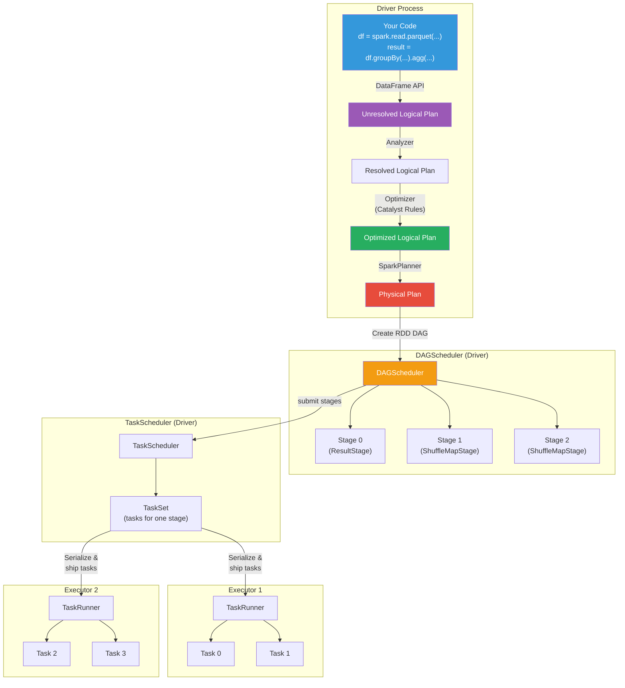

---

## SparkSession and SparkContext Creation

Everything starts with `SparkSession`. Understanding what happens when you call `SparkSession.builder.getOrCreate()` is foundational.

```python
# What you write:
from pyspark.sql import SparkSession

spark = SparkSession.builder \
    .appName("MyJob") \
    .config("spark.executor.memory", "4g") \
    .config("spark.executor.cores", "2") \
    .config("spark.sql.shuffle.partitions", "200") \
    .getOrCreate()
```

### What Happens Internally

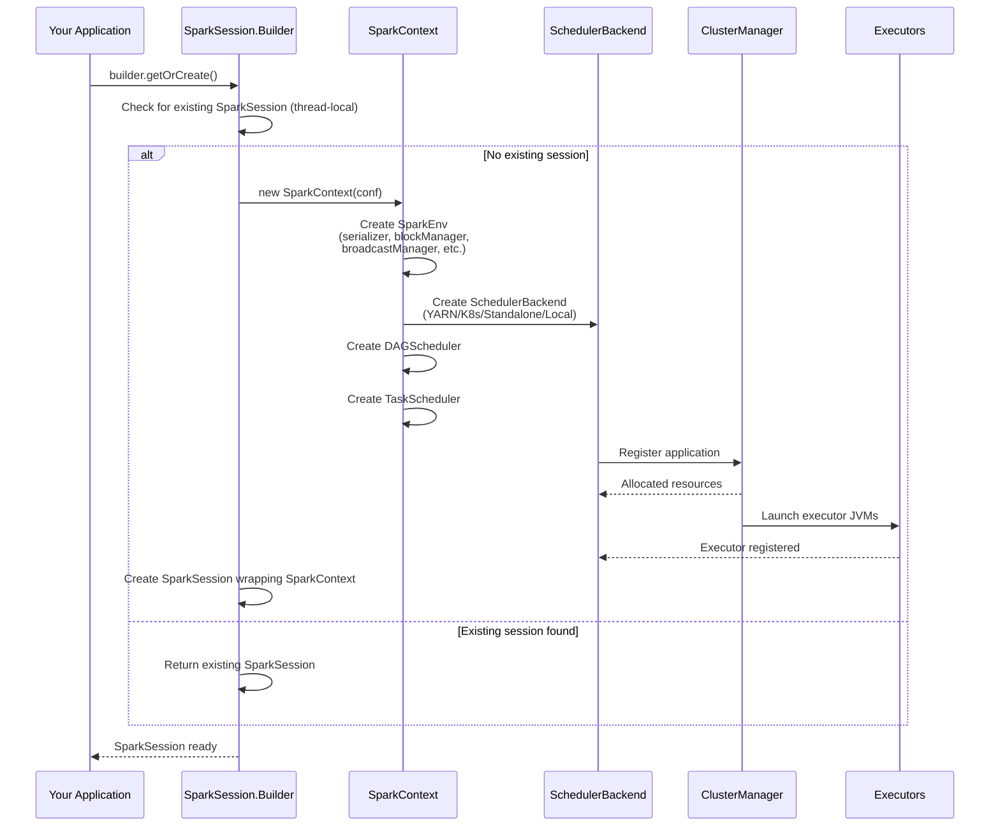

### Key Components Created

```python
# Inside SparkContext creation, these components are initialized:

class SparkContext:
    def __init__(self, conf):
        # 1. SparkEnv — Container for all runtime components
        self.env = SparkEnv.create(
            conf,
            isDriver=True,
            # SparkEnv contains:
            #   - serializer (JavaSerializer or KryoSerializer)
            #   - closureSerializer (for shipping tasks)
            #   - blockManager (storage management)
            #   - broadcastManager (efficient variable distribution)
            #   - mapOutputTracker (tracks shuffle output locations)
            #   - shuffleManager (SortShuffleManager)
            #   - memoryManager (UnifiedMemoryManager)
            #   - outputCommitCoordinator (write correctness)
        )
        
        # 2. DAGScheduler — Converts RDD DAGs into stages
        self.dagScheduler = DAGScheduler(self)
        
        # 3. TaskScheduler — Assigns tasks to executors
        self.taskScheduler = TaskSchedulerImpl(self)
        
        # 4. SchedulerBackend — Communicates with cluster manager
        self.schedulerBackend = createSchedulerBackend(conf)
        # (YarnSchedulerBackend / KubernetesSchedulerBackend / etc.)
        
        # 5. HeartbeatReceiver — Tracks executor liveness
        self.heartbeatReceiver = HeartbeatReceiver(self)
```

---

## Logical Plan Creation

When you write DataFrame transformations, Spark doesn't execute anything. Instead, it builds a **logical plan** — a tree of relational algebra operations.

```python
# Your code:
df = spark.read.parquet("s3://data/users/")           # Scan
df2 = df.filter(df.age > 25)                           # Filter
df3 = df2.select("name", "age", "city")                # Project
df4 = df3.groupBy("city").agg(count("*").alias("cnt")) # Aggregate
df4.write.parquet("s3://output/city_counts/")           # Triggers execution!
```

### The Logical Plan Tree

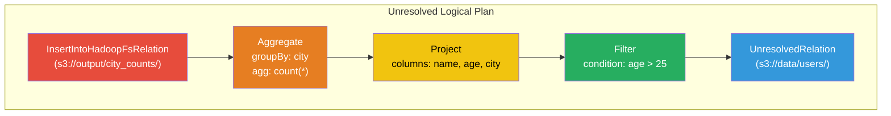

### Lazy Evaluation — Nothing Runs Until an Action

```python
# TRANSFORMATIONS — Build the plan, don't execute
df.filter(...)      # Returns a new DataFrame (lazy)
df.select(...)      # Returns a new DataFrame (lazy)
df.groupBy(...)     # Returns a GroupedData (lazy)
df.join(...)        # Returns a new DataFrame (lazy)

# ACTIONS — Trigger execution
df.write.parquet(...) # Writes data (action!)
df.count()            # Returns a number (action!)
df.collect()          # Returns all rows to driver (action!)
df.show()             # Prints rows (action!)
df.take(n)            # Returns n rows (action!)

# The entire plan up to this point gets compiled, optimized,
# and executed when an action is called.
```

---

## Catalyst Optimization Pipeline

The Catalyst optimizer is Spark SQL's query optimizer. It transforms the logical plan through multiple phases.

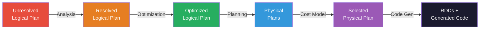

### Phase 1: Analysis (Resolution)

The Analyzer resolves column names, table references, and data types.

```python
# Before Analysis (Unresolved):
# Filter(condition = 'age > 25')  — "age" is just a string
# UnresolvedRelation("s3://data/users/")  — schema unknown

# After Analysis (Resolved):
# Filter(condition = age#15 > 25)  — "age" resolved to column #15, type INT
# LogicalRelation(ParquetRelation, schema=[name:STRING, age:INT, city:STRING])
```

### Phase 2: Optimization

The Optimizer applies rule-based transformations to improve the plan:

```python
# Key optimization rules applied:

# 1. Predicate Pushdown — Push filters closer to data source
# BEFORE:
#   Project(name, city) → Filter(age > 25) → Scan(users)
# AFTER:
#   Project(name, city) → Scan(users, filters=[age > 25])
#   Filter is pushed INTO the Parquet reader!

# 2. Column Pruning — Only read needed columns
# BEFORE:
#   Scan reads all columns: name, age, city, email, phone, ...
# AFTER:
#   Scan reads only: name, age, city (columns used downstream)

# 3. Constant Folding
# BEFORE: Filter(age > 20 + 5)
# AFTER:  Filter(age > 25)

# 4. Combine Filters
# BEFORE: Filter(age > 25) → Filter(city = 'NYC')
# AFTER:  Filter(age > 25 AND city = 'NYC')

# 5. Join Reordering (cost-based)
# If joining A (1M rows) with B (100 rows) with C (10M rows):
# BEFORE: (A JOIN C) JOIN B  — huge intermediate result
# AFTER:  (A JOIN B) JOIN C  — B is tiny, filter early
```

### Viewing the Plan

```python
# You can inspect every stage of the plan:

# Parsed (Unresolved) logical plan
df4.queryExecution.logical

# Analyzed (Resolved) logical plan
df4.queryExecution.analyzed

# Optimized logical plan
df4.queryExecution.optimizedPlan

# Physical plan
df4.queryExecution.executedPlan

# Human-readable summary
df4.explain(mode="extended")
# Outputs:
# == Parsed Logical Plan ==
# == Analyzed Logical Plan ==
# == Optimized Logical Plan ==
# == Physical Plan ==

# Cost-based analysis
df4.explain(mode="cost")
```

---

## Physical Plan Selection

The SparkPlanner converts the optimized logical plan into one or more physical plans, then selects the best one.

### Join Strategy Selection

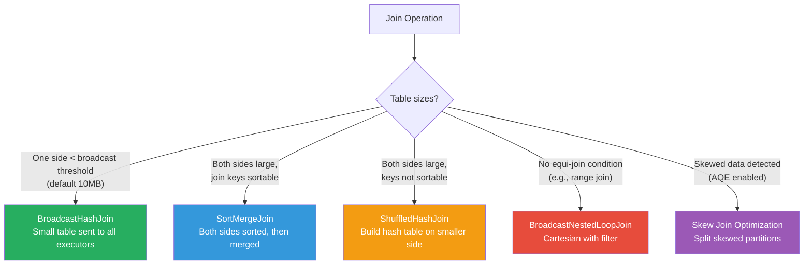

### Physical Plan Example

```
== Physical Plan ==
*(2) HashAggregate(keys=[city#12], functions=[count(1)])
+- Exchange hashpartitioning(city#12, 200)    ← SHUFFLE!
   +- *(1) HashAggregate(keys=[city#12], functions=[partial_count(1)])
      +- *(1) Project [city#12]
         +- *(1) Filter (isnotnull(age#15) AND (age#15 > 25))
            +- *(1) ColumnarToRow
               +- FileScan parquet [age#15,city#12]
                  DataFilters: [isnotnull(age#15), (age#15 > 25)]
                  PushedFilters: [IsNotNull(age), GreaterThan(age,25)]
                  ReadSchema: struct<age:int,city:string>

Key observations:
- *(1) and *(2) are WholeStageCodegen stages
- Exchange = shuffle boundary (creates new stage)
- partial_count + final count = two-phase aggregation
- FileScan shows pushed predicates AND column pruning
```

---

## DAGScheduler — Stages and Shuffle Boundaries

The DAGScheduler converts the physical plan's RDD lineage into **stages** based on shuffle boundaries.

### Stage Creation Algorithm

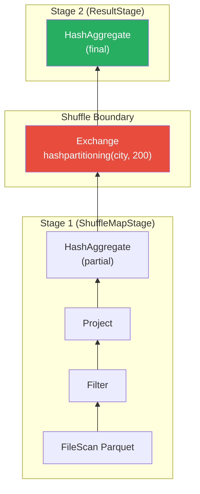

### How Stages Are Determined

```python
# Simplified DAGScheduler logic

class DAGScheduler:
    def submitJob(self, rdd, func, partitions):
        """Entry point when an action is called."""
        # Create a ResultStage for the final RDD
        finalStage = self.createResultStage(rdd)
        # Submit the job
        job = ActiveJob(jobId, finalStage)
        self.submitStage(finalStage)
    
    def createResultStage(self, rdd):
        """Create a ResultStage, recursively creating parent stages."""
        # Walk the RDD lineage backwards
        # Whenever we find a ShuffleDependency, create a new stage
        parents = self.getOrCreateParentStages(rdd)
        stage = ResultStage(rdd, parents)
        return stage
    
    def getOrCreateParentStages(self, rdd):
        """Find shuffle boundaries in the RDD lineage."""
        parents = []
        visited = set()
        stack = [rdd]
        
        while stack:
            current_rdd = stack.pop()
            if current_rdd.id in visited:
                continue
            visited.add(current_rdd.id)
            
            for dep in current_rdd.dependencies:
                if isinstance(dep, ShuffleDependency):
                    # SHUFFLE BOUNDARY! Create a new ShuffleMapStage
                    stage = self.getOrCreateShuffleMapStage(dep)
                    parents.append(stage)
                elif isinstance(dep, NarrowDependency):
                    # No shuffle needed, continue traversing
                    stack.append(dep.rdd)
        
        return parents
    
    def submitStage(self, stage):
        """Submit a stage for execution."""
        # First, submit all parent stages (they must complete first)
        missing_parents = self.getMissingParentStages(stage)
        
        if not missing_parents:
            # All parents complete → submit this stage's tasks
            self.submitMissingTasks(stage)
        else:
            # Submit parent stages first
            for parent in missing_parents:
                self.submitStage(parent)
            # This stage will be submitted when parents complete
            self.waitingStages.add(stage)
```

### Narrow vs Wide Dependencies

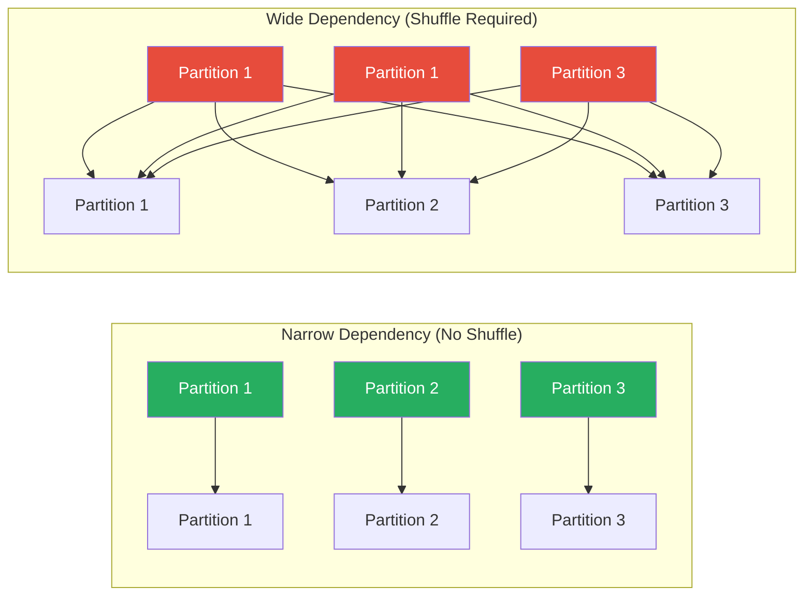

```python
# Operations that are NARROW (no shuffle):
# - map, flatMap, filter — 1:1 partition mapping
# - union — combine partitions from two RDDs
# - coalesce (reducing partitions) — merge partitions
# - map-side of mapPartitions

# Operations that are WIDE (shuffle required):
# - groupByKey, reduceByKey — group by key across partitions
# - join (when not broadcast) — match keys across datasets
# - repartition — redistribute data
# - sort — global ordering requires data exchange
# - distinct — dedup requires seeing all copies of a value
```

---

## TaskScheduler — Task Assignment to Executors

Once the DAGScheduler creates a TaskSet (all tasks for a stage), the TaskScheduler assigns individual tasks to executors based on data locality.

### Task Assignment with Locality

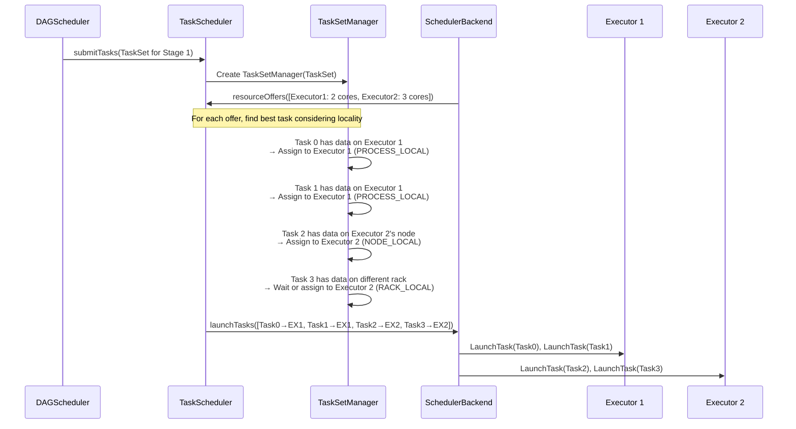

### Data Locality Levels

```python
# Spark tries to assign tasks close to their data.
# It waits for a configurable delay before relaxing locality.

LOCALITY_LEVELS = [
    "PROCESS_LOCAL",  # Data is in the same executor's memory (cached RDD)
    "NODE_LOCAL",     # Data is on the same node (HDFS block on same machine)
    "NO_PREF",        # No locality preference (e.g., generating data)
    "RACK_LOCAL",     # Data is on the same rack
    "ANY",            # Data is anywhere in the cluster
]

# Configuration:
# spark.locality.wait = 3s (default)
# spark.locality.wait.process = 3s
# spark.locality.wait.node = 3s
# spark.locality.wait.rack = 3s

# How it works:
# 1. TaskScheduler receives resource offers from executors
# 2. For each task, it tries PROCESS_LOCAL first
# 3. If no PROCESS_LOCAL executor has capacity, wait 3 seconds
# 4. After 3 seconds, try NODE_LOCAL
# 5. After another 3 seconds, try RACK_LOCAL
# 6. After another 3 seconds, accept ANY locality
```

---

## Task Serialization and Shipping

Before a task can run on an executor, it must be serialized and sent over the network.

### What Gets Serialized

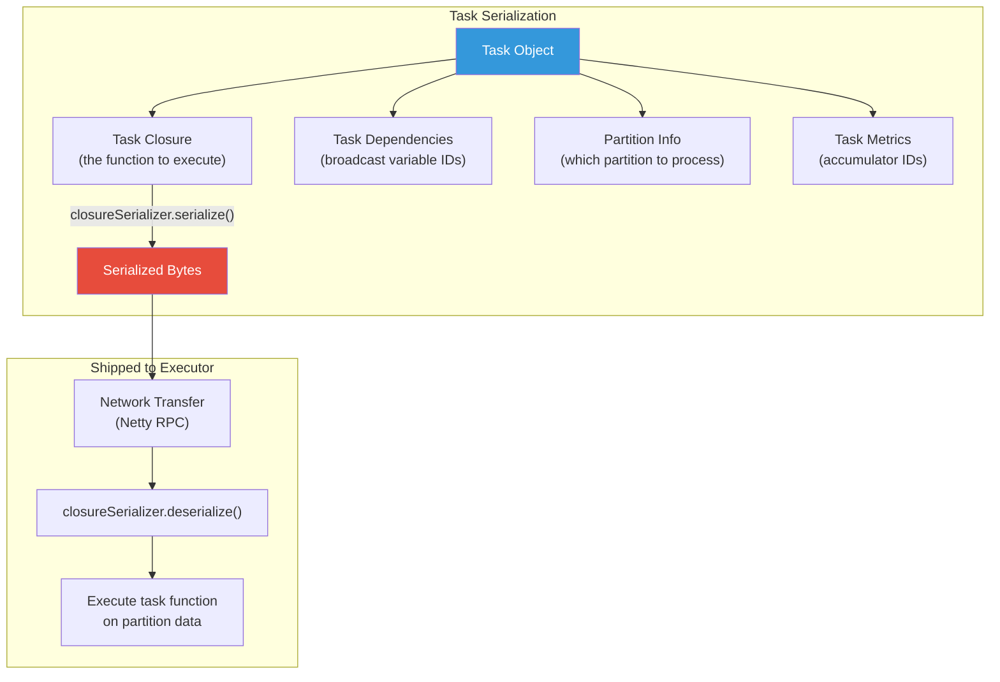

### Common Serialization Issues

```python
# ❌ ERROR: Task not serializable
# This happens when your closure references a non-serializable object

class MyProcessor:
    def __init__(self):
        self.db_connection = psycopg2.connect(...)  # NOT serializable!
    
    def process(self, row):
        return self.db_connection.execute(...)  # References db_connection

processor = MyProcessor()
df.rdd.map(processor.process)  # FAILS! Tries to serialize db_connection

# ✅ FIX: Create the connection inside the task
def process_partition(iterator):
    # Connection created on the executor, not serialized from driver
    conn = psycopg2.connect(...)
    for row in iterator:
        yield conn.execute(...)
    conn.close()

df.rdd.mapPartitions(process_partition)

# ✅ FIX: Use broadcast variables for large read-only data
lookup_data = {"key1": "value1", ...}  # Large dict
broadcast_lookup = spark.sparkContext.broadcast(lookup_data)

def process(row):
    # Access broadcast variable (efficiently distributed once)
    return broadcast_lookup.value.get(row.key)

df.rdd.map(process)
```

### Task Size Warning

```python
# If your task serialized size is large, you'll see this warning:
# "Stage X contains a task of very large size (Y KB). 
#  The maximum recommended task size is 1000 KB."

# Common cause: accidentally capturing a large object in the closure
large_list = list(range(10_000_000))  # 80MB in memory

def my_func(row):
    return row.value in large_list  # large_list is captured in closure!

# Fix: Use broadcast
broadcast_list = spark.sparkContext.broadcast(set(large_list))
def my_func(row):
    return row.value in broadcast_list.value
```

---

## ShuffleManager — Data Exchange Between Stages

The ShuffleManager handles the "exchange" of data between stages — the most expensive operation in Spark.

### Shuffle Write and Read

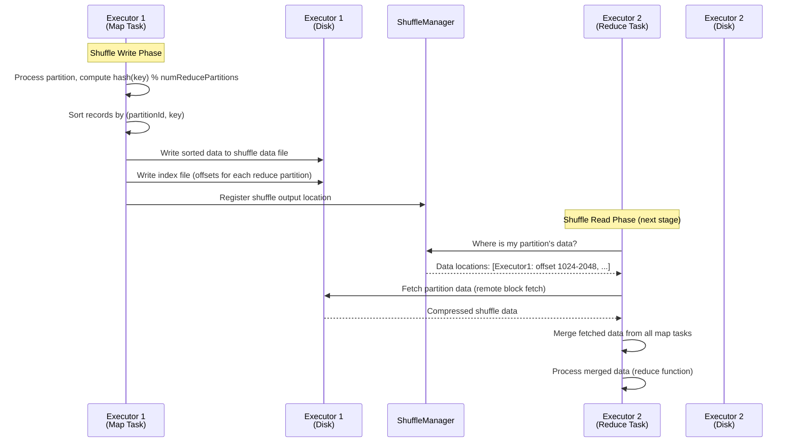

### Shuffle File Structure

```
# Each map task produces two files:
# 1. Data file:  shuffle_<shuffleId>_<mapId>_0.data
# 2. Index file: shuffle_<shuffleId>_<mapId>_0.index

# Index file format:
# [offset_for_reduce_partition_0]  (8 bytes, long)
# [offset_for_reduce_partition_1]  (8 bytes, long)
# ...
# [offset_for_reduce_partition_N]  (8 bytes, long)

# To read data for reduce partition K from map task M:
# 1. Open index file for map task M
# 2. Read offset at position K and K+1
# 3. Open data file for map task M
# 4. Read bytes from offset[K] to offset[K+1]
```

---

## BlockManager — Storage Layer

The BlockManager manages all data storage on each executor — cached RDDs, shuffle blocks, broadcast variables, and task results.

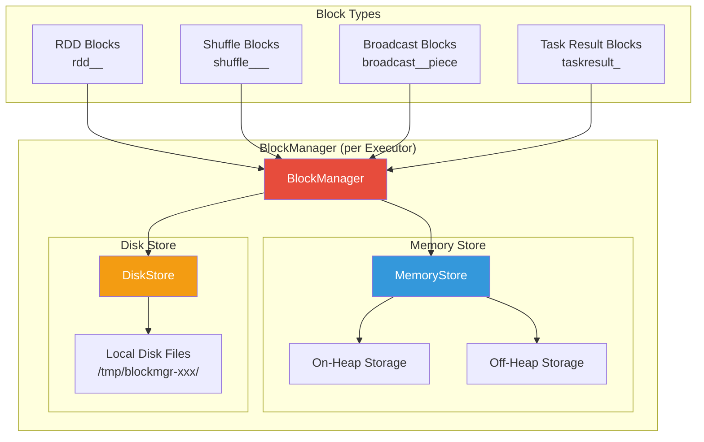

```python
# BlockManager storage level determines where data is kept

from pyspark import StorageLevel

# Common storage levels:
StorageLevel.MEMORY_ONLY          # In-memory deserialized Java objects
StorageLevel.MEMORY_AND_DISK      # Memory first, spill to disk if needed
StorageLevel.MEMORY_ONLY_SER      # In-memory serialized bytes (less memory)
StorageLevel.DISK_ONLY            # Disk only (for very large datasets)
StorageLevel.OFF_HEAP             # Off-heap memory (Tungsten)
StorageLevel.MEMORY_AND_DISK_2    # Same as MEMORY_AND_DISK with 2x replication

# How to cache:
df.persist(StorageLevel.MEMORY_AND_DISK)  # Cache with custom level
df.cache()                                 # Same as MEMORY_ONLY
df.unpersist()                             # Remove from cache
```

---

## TaskRunner on Executor

When a task arrives at an executor, the TaskRunner handles deserialization and execution.

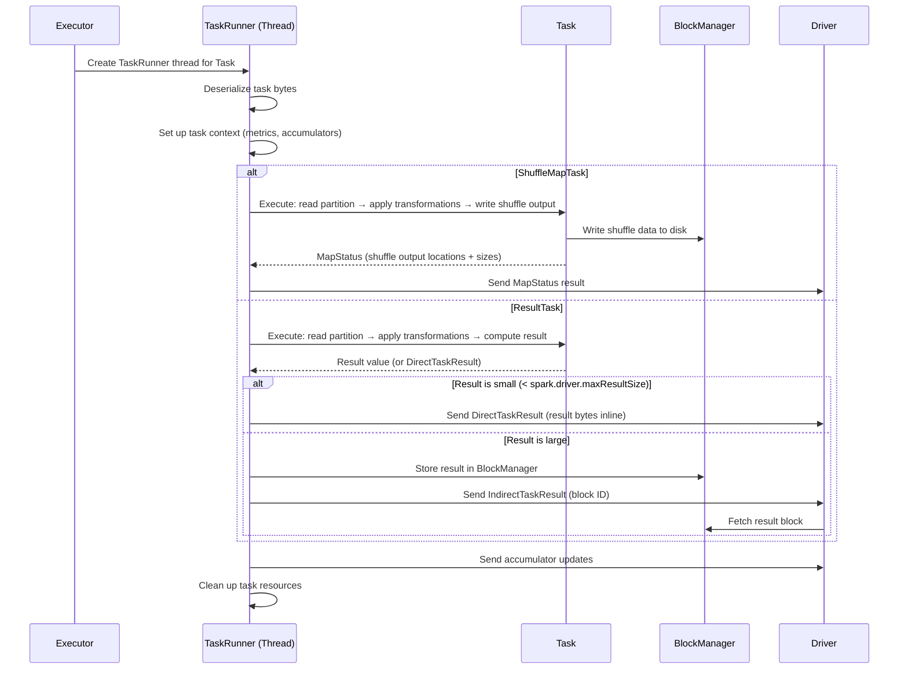

### Task Execution Code

```python
# Simplified Executor.launchTask()

class Executor:
    def launchTask(self, taskDescription):
        """Launch a task in a new thread."""
        runner = TaskRunner(taskDescription, self)
        self.runningTasks[taskDescription.taskId] = runner
        self.threadPool.execute(runner)

class TaskRunner(Runnable):
    def run(self):
        """Execute the task."""
        try:
            # 1. Deserialize the task
            task = closureSerializer.deserialize(taskBytes)
            
            # 2. Run the task
            result = task.run(
                taskAttemptId=self.taskId,
                attemptNumber=self.attemptNumber,
                metricsSystem=self.metricsSystem,
            )
            
            # 3. Serialize the result
            serializedResult = closureSerializer.serialize(result)
            
            # 4. Send result to driver
            if len(serializedResult) < maxDirectResultSize:
                # Small result: send directly
                execBackend.statusUpdate(
                    taskId, TaskState.FINISHED,
                    DirectTaskResult(serializedResult)
                )
            else:
                # Large result: store in BlockManager, send reference
                blockId = TaskResultBlockId(taskId)
                blockManager.putBytes(blockId, serializedResult)
                execBackend.statusUpdate(
                    taskId, TaskState.FINISHED,
                    IndirectTaskResult(blockId, serializedResult.length)
                )
                
        except Exception as e:
            # Task failed
            execBackend.statusUpdate(
                taskId, TaskState.FAILED,
                TaskFailedReason(e)
            )
```

---

## Result Handling and Accumulator Propagation

### How Results Flow Back to the Driver

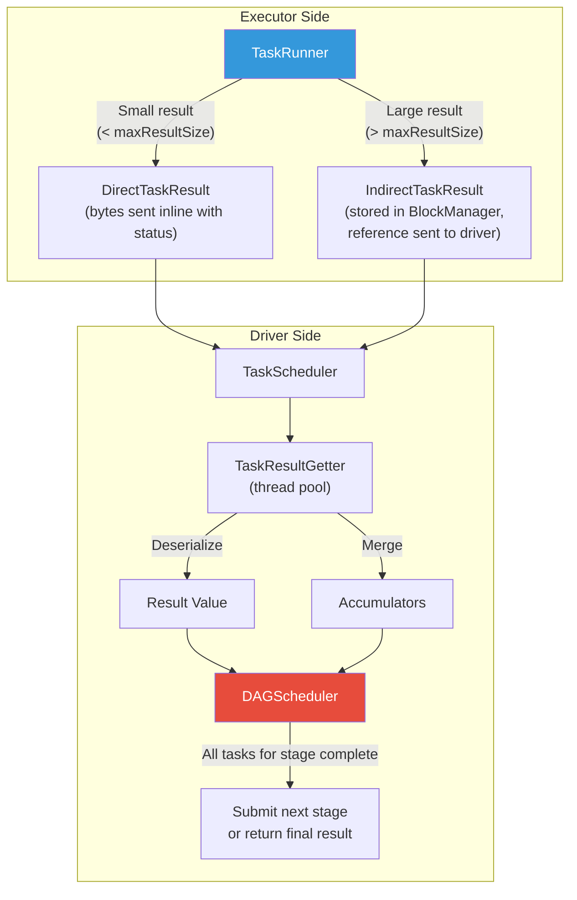

### Accumulators — Distributed Counters

```python
# Accumulators are "write-only" variables on executors,
# "read-only" on the driver after the job completes.

# Create an accumulator on the driver
error_count = spark.sparkContext.accumulator(0)
processed_count = spark.sparkContext.accumulator(0)

def process_row(row):
    processed_count.add(1)
    try:
        return transform(row)
    except Exception:
        error_count.add(1)
        return None

# Use in transformation
result = df.rdd.map(process_row).filter(lambda x: x is not None)

# Trigger execution
result.count()

# Read accumulator values on driver
print(f"Processed: {processed_count.value}")
print(f"Errors: {error_count.value}")

# ⚠️ WARNING: Accumulators in transformations may be counted MORE than once
# if a task is retried or if a stage is re-executed.
# Accumulators in ACTIONS (like foreach) are guaranteed exactly-once.
```

---

## End-to-End Sequence Diagram

Here's the complete journey for a `groupBy().count().write.parquet()` operation:

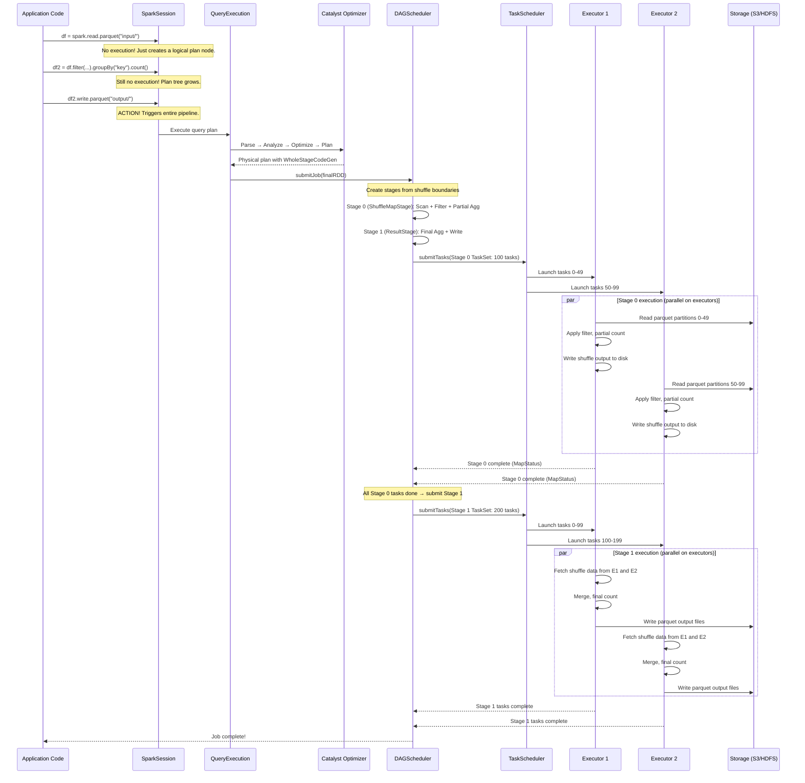

---

## Failure Scenarios and Recovery

### Stage Retry on Shuffle Fetch Failure

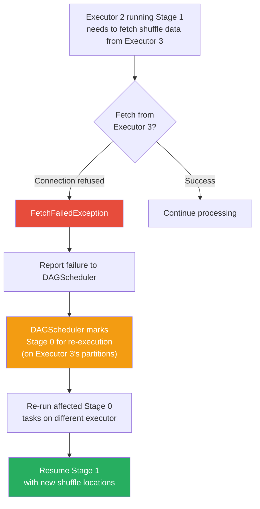

### Speculative Execution

```python
# Speculative execution launches duplicate copies of slow tasks

# Enable:
spark.conf.set("spark.speculation", "true")
spark.conf.set("spark.speculation.interval", "100ms")
spark.conf.set("spark.speculation.multiplier", "1.5")  
# Task is speculated if it's 1.5x slower than median
spark.conf.set("spark.speculation.quantile", "0.75")
# Start speculating when 75% of tasks are complete

# How it works:
# 1. TaskScheduler monitors task durations
# 2. When 75% of tasks in a stage complete, calculate median time
# 3. If any running task exceeds 1.5x median, launch a copy on another executor
# 4. Whichever copy finishes first wins, the other is killed

# ⚠️ CAUTION with speculation:
# - Don't use with non-idempotent operations (database writes)
# - Don't use when tasks are slow due to skew (it won't help)
# - Increases resource usage
```

### Task Failure and Retry

```python
# Individual task retry configuration
spark.conf.set("spark.task.maxFailures", "4")  # Default: 4
# Task is retried 3 times before the stage (and job) fails

# Stage-level retry (for fetch failures)
spark.conf.set("spark.stage.maxConsecutiveAttempts", "4")

# What happens on task failure:
# 1. Exception propagated from executor to driver
# 2. TaskScheduler marks task as FAILED
# 3. If attempts < maxFailures, reschedule on different executor
# 4. If attempts >= maxFailures, fail the stage
# 5. If stage fails, fail the job (unless it's a shuffle stage
#    that can be recomputed)
```

---

## Production Debugging

### Reading the Spark UI

```python
# The Spark UI (port 4040) is your primary debugging tool

# Key tabs and what to look for:

# 1. JOBS tab
# - How many jobs your application created
# - Which jobs failed
# - Job duration

# 2. STAGES tab  
# - Number of tasks per stage
# - Task duration distribution (look for skew!)
# - Input/output sizes
# - Shuffle read/write sizes

# 3. STAGE DETAIL page
# - Task duration histogram
# - Summary metrics (min, 25th, median, 75th, max)
# - If max >> median, you have DATA SKEW
# - GC time per task (if high, memory pressure)
# - Shuffle spill (memory) and shuffle spill (disk)
#   If spill > 0, tasks are running out of memory

# 4. SQL tab
# - Physical plan as a tree
# - Click on nodes to see metrics
# - Look for Exchange nodes (shuffles)
# - Look for BroadcastExchange (broadcast joins)
# - Row counts at each node

# 5. ENVIRONMENT tab
# - All Spark configuration values
# - Useful to verify your config is actually applied

# 6. EXECUTORS tab
# - Active/dead executors
# - Memory usage per executor
# - Task time (total and failed) per executor
# - Shuffle read/write per executor
```

### Common Issues and Their Spark UI Signatures

```python
# Issue: Data Skew
# UI Signature: In Stage Detail, one task takes 100x longer than others
# Task Duration: min=2s, median=3s, max=1800s
# Fix: See data-skew-deep-dive.md

# Issue: Insufficient Memory
# UI Signature: Shuffle spill (disk) is large, GC time > 10% of task time
# Fix: Increase executor memory or reduce partition size

# Issue: Too Few Partitions
# UI Signature: Small number of tasks in a stage, each task processes lots of data
# Fix: Repartition to more partitions

# Issue: Too Many Partitions
# UI Signature: Thousands of tasks, each processing < 1MB
# Fix: Coalesce to fewer partitions

# Issue: Shuffle Too Large
# UI Signature: Shuffle Write/Read sizes in TB range, stages take hours
# Fix: Filter earlier, use broadcast joins, pre-aggregate

# Issue: Driver OOM
# UI Signature: Application fails with OutOfMemoryError on driver
# Cause: collect() on large dataset, too many accumulator updates,
#         or large broadcast variable
# Fix: Avoid collect(), increase driver memory, sample results
```

### Debug Logging

```python
# Enable detailed logging for specific components

# In log4j2.properties:
# logger.dag.name = org.apache.spark.scheduler.DAGScheduler
# logger.dag.level = DEBUG

# logger.task.name = org.apache.spark.scheduler.TaskSchedulerImpl
# logger.task.level = DEBUG

# logger.shuffle.name = org.apache.spark.shuffle
# logger.shuffle.level = DEBUG

# From PySpark:
spark.sparkContext.setLogLevel("DEBUG")  # Nuclear option — very verbose
```

---

## Interview Questions

### Beginner Level

**Q: What is the difference between a transformation and an action in Spark?**

A: Transformations are lazy operations that build a logical plan (filter, map, groupBy, join). They return a new DataFrame/RDD without executing anything. Actions trigger actual execution by submitting the plan to the DAGScheduler (count, collect, write, show). Spark uses lazy evaluation to optimize the entire plan before executing.

**Q: What is a stage in Spark?**

A: A stage is a set of tasks that can run in parallel without exchanging data. Stage boundaries are created at shuffle operations (groupBy, join, repartition). Within a stage, all operations are "pipelined" — they execute as a single pass over the data. A shuffle-dependent stage (ShuffleMapStage) produces shuffle output, while the final stage (ResultStage) produces the job's result.

### Intermediate Level

**Q: Walk me through what happens when you call `df.groupBy("key").count().show()`.**

A: (1) The DataFrame API builds a logical plan: Aggregate(groupBy=key, func=count) → Scan. (2) The Analyzer resolves column references and types. (3) The Optimizer applies rules like predicate pushdown and column pruning. (4) The SparkPlanner creates a physical plan: HashAggregate(final) ← Exchange(hashPartitioning) ← HashAggregate(partial) ← Scan. (5) The DAGScheduler creates two stages: Stage 0 (scan + partial aggregate + shuffle write) and Stage 1 (shuffle read + final aggregate). (6) Stage 0 tasks run in parallel, each reading a partition, computing partial counts, and writing shuffle output. (7) Stage 1 tasks fetch shuffle data from all Stage 0 outputs, merge them, and compute final counts. (8) The show() action collects the first 20 rows to the driver and prints them.

**Q: What is data locality and how does Spark use it?**

A: Data locality means placing computation close to data. Spark's TaskScheduler assigns tasks to executors considering where the data resides. The locality levels are: PROCESS_LOCAL (data cached in the same executor), NODE_LOCAL (data on same machine's disk), RACK_LOCAL (same rack), and ANY. The scheduler waits `spark.locality.wait` (default 3s) before degrading to a lower locality level, trading latency for throughput.

### Advanced Level

**Q: A Spark job has been running for 2 hours. Stage 5 of 6 has completed 999 of 1000 tasks in 5 minutes each, but the last task has been running for 90 minutes. What is happening and how do you fix it?**

A: This is classic data skew. One partition has significantly more data than others. Diagnosis: Check the Spark UI Stage 5 detail page — the slow task will show much more input data and shuffle read than others. Solutions: (1) If it's a join, check for null keys or a hot key — salt the key or filter and handle hot keys separately. (2) Enable AQE skew join optimization (`spark.sql.adaptive.enabled=true`, `spark.sql.adaptive.skewJoin.enabled=true`). (3) If it's a group-by, add a random salt to the key, aggregate with the salt, then aggregate without. (4) If possible, use a broadcast join if one side is small enough. (5) Check if the skew is from null values — filter nulls, process separately, and union.

**Q: Explain the purpose of WholeStageCodeGen and how it improves performance.**

A: WholeStageCodeGen fuses multiple physical operators into a single Java function, eliminating virtual function calls and intermediate data materialization. Without it, each operator (Filter, Project, Aggregate) is a separate class with a `next()` method, creating overhead from virtual dispatch and iterator patterns. With codegen, Spark generates a tight loop that reads data, applies the filter, projects columns, and updates the aggregate — all in one function. The generated code operates directly on memory using Tungsten's UnsafeRow format, avoiding Java object overhead. You can see the generated code with `df.queryExecution.debug.codegen()`.

---

**[← Back to Deep Dives](../README.md#-deep-dives)**
