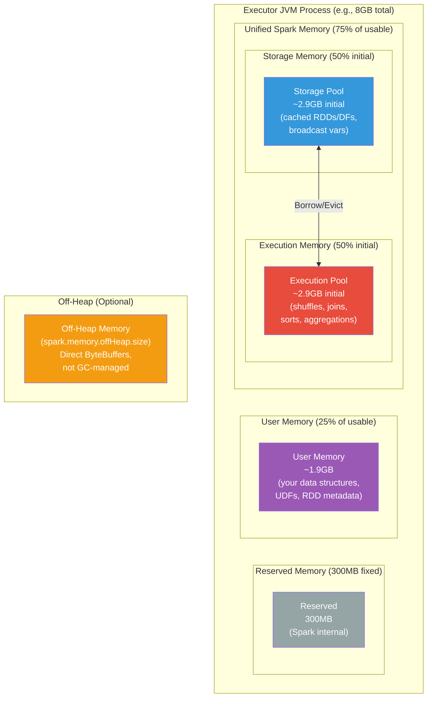
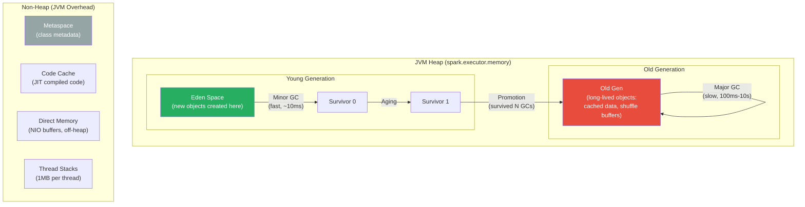
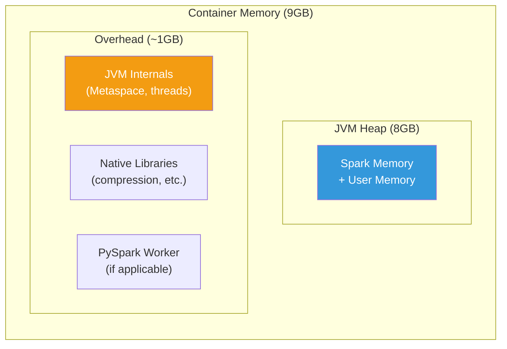
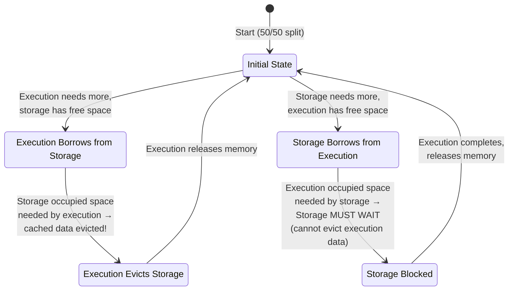
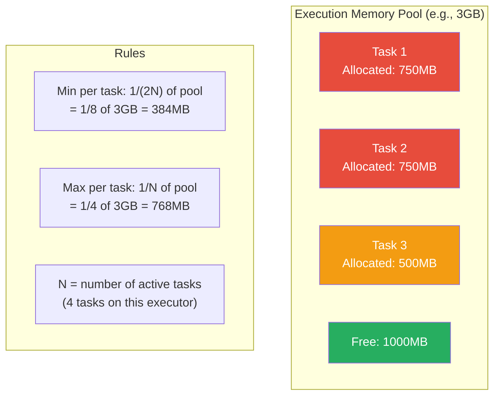
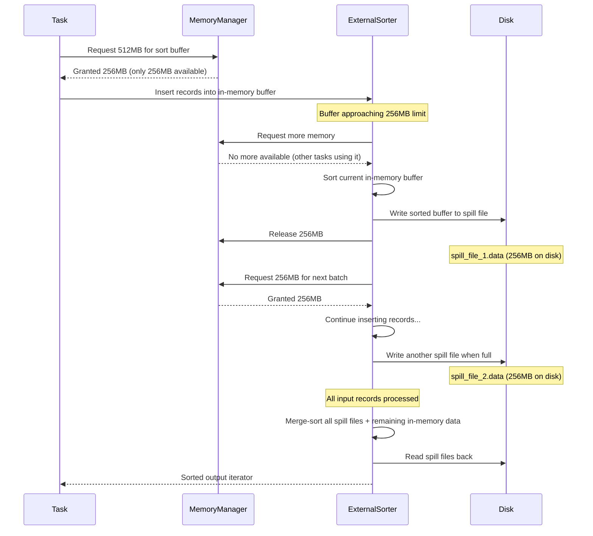
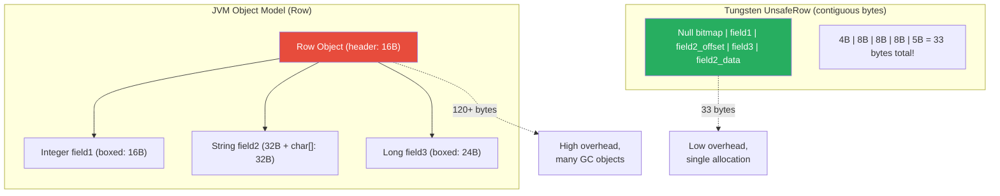
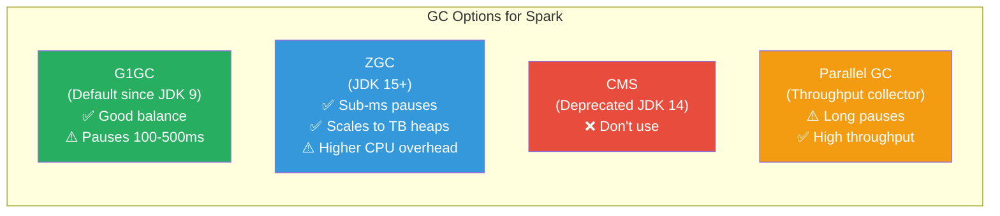
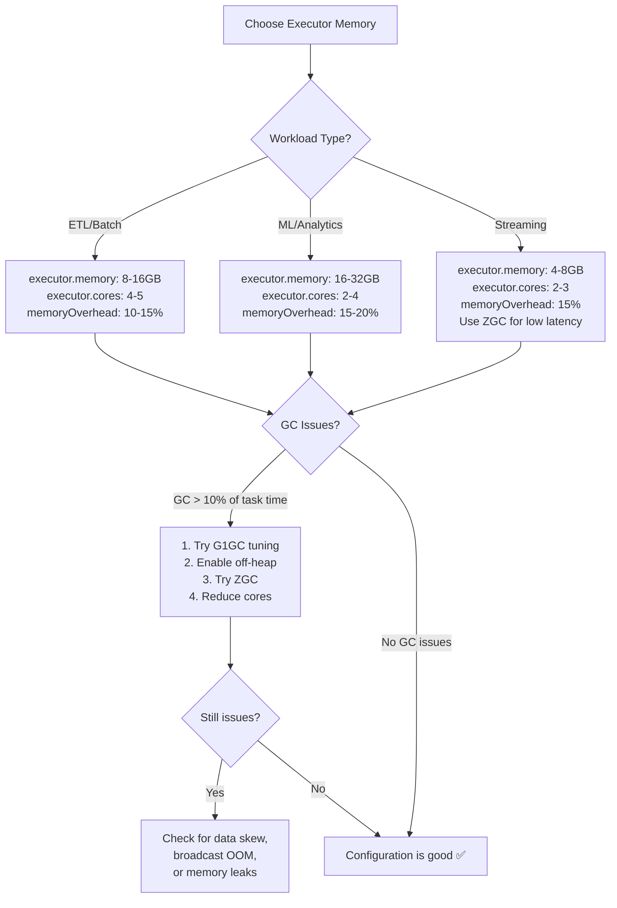

# 🔬 Spark Memory Deep Dive — From JVM Heap to Tungsten UnsafeRow

> **Memory is the most critical and least understood resource in Spark. Every OOM error, every spill to disk, every GC pause traces back to how Spark manages memory. This chapter gives you the complete picture.**

---

## 📋 Table of Contents

1. [Why Memory Management Matters](#why-memory-management-matters)
2. [The Big Picture — Memory Architecture Overview](#the-big-picture)
3. [JVM Heap Layout for Spark](#jvm-heap-layout-for-spark)
4. [Spark's Unified Memory Manager](#sparks-unified-memory-manager)
5. [Memory Pools in Detail](#memory-pools-in-detail)
6. [Memory Acquisition and Eviction](#memory-acquisition-and-eviction)
7. [Memory Spilling to Disk](#memory-spilling-to-disk)
8. [Tungsten Memory Management](#tungsten-memory-management)
9. [UnsafeRow — Spark's Binary Row Format](#unsaferow--sparks-binary-row-format)
10. [Off-Heap Memory](#off-heap-memory)
11. [GC Impact and Tuning](#gc-impact-and-tuning)
12. [Common OOM Patterns — Stack Traces and Fixes](#common-oom-patterns)
13. [Memory Configuration Guide](#memory-configuration-guide)
14. [Production Monitoring](#production-monitoring)
15. [Interview Questions](#interview-questions)

---

## Why Memory Management Matters

In production, these are the memory-related incidents you'll face:

- **Executor OOM** — Container killed by YARN/K8s, losing all cached data and in-flight tasks
- **GC storms** — JVM spending 30%+ of time in garbage collection, tasks that should take 10 seconds take 5 minutes
- **Shuffle spill** — Insufficient execution memory forces data to disk, 10-100x slower than in-memory
- **Cache eviction** — Cached DataFrames silently evicted, causing unexpected recomputation

Every one of these requires understanding the memory model described in this chapter.

---

## The Big Picture



### The Memory Math

```python
# Given: spark.executor.memory = 8g

# Step 1: Total JVM Heap = 8GB

# Step 2: Subtract reserved memory
reserved = 300  # MB, fixed (spark.testing.reservedMemory)
usable = 8192 - 300  # = 7892 MB

# Step 3: Spark Memory = 75% of usable (spark.memory.fraction = 0.75 since Spark 3.x)
# Note: In Spark 2.x, default was 0.6
spark_memory = usable * 0.75  # = 5919 MB ≈ 5.8 GB

# Step 4: User Memory = remaining 25%
user_memory = usable * 0.25  # = 1973 MB ≈ 1.9 GB

# Step 5: Storage vs Execution split (initial)
# spark.memory.storageFraction = 0.5 (default)
storage_initial = spark_memory * 0.5  # = 2959 MB ≈ 2.9 GB
execution_initial = spark_memory * 0.5 # = 2959 MB ≈ 2.9 GB

# BUT: The storage/execution boundary is SOFT (unified model)!
# Execution can borrow from storage (and evict cached data)
# Storage can borrow from execution (but can't evict execution data)
```

---

## JVM Heap Layout for Spark

Understanding the JVM heap is essential because Spark runs on the JVM, and garbage collection directly impacts performance.



### Container Memory Layout (YARN/K8s)

```python
# The TOTAL container memory is MORE than just spark.executor.memory

# spark.executor.memory = 8g (JVM heap)
# spark.executor.memoryOverhead = max(384MB, 0.1 * executor.memory)
#                                = max(384MB, 819MB) = 819MB
# spark.memory.offHeap.size = 0 (default, disabled)
# spark.executor.pyspark.memory = 0 (default, for PySpark UDFs)

# Total container request:
# = executor.memory + memoryOverhead + offHeap.size + pyspark.memory
# = 8192 + 819 + 0 + 0
# = 9011 MB ≈ 9GB container

# IMPORTANT: If your process uses more than the container limit,
# YARN/K8s KILLS the container! This is different from JVM OOM.
# JVM OOM = Java OutOfMemoryError (can be caught)
# Container kill = SIGKILL (instant death, no cleanup)
```



---

## Spark's Unified Memory Manager

Before Spark 1.6, storage and execution had a fixed boundary (StaticMemoryManager). The unified model makes this boundary flexible.

### How the Unified Model Works



### The Key Asymmetry

```python
# CRITICAL RULE: Execution has priority over storage!

# Scenario 1: Execution needs memory, storage has free space
# → Execution borrows from storage pool
# → No eviction needed, both happy

# Scenario 2: Execution needs memory, storage space is occupied (cached data)
# → Execution EVICTS cached data to make room
# → Cached RDDs/DataFrames are silently dropped
# → They'll be recomputed from lineage if needed later

# Scenario 3: Storage needs memory, execution has free space
# → Storage borrows from execution pool
# → Works fine

# Scenario 4: Storage needs memory, execution space is occupied
# → Storage CANNOT evict execution data
# → Storage request BLOCKS until execution releases memory
# → This means caching may fail silently under memory pressure

# WHY this asymmetry?
# Execution data (shuffle buffers, join hash maps) is actively being
# computed. Evicting it would require recomputing the entire task.
# Storage data (cached RDDs) can always be recomputed from lineage.
# So it's cheaper to evict cached data than execution data.
```

### Implementation Detail

```python
# Simplified UnifiedMemoryManager logic

class UnifiedMemoryManager:
    def __init__(self, max_memory, storage_fraction=0.5):
        self.max_memory = max_memory
        self.storage_region_size = max_memory * storage_fraction
        
        # Current usage tracking
        self.on_heap_storage_used = 0
        self.on_heap_execution_used = 0
    
    def acquire_execution_memory(self, num_bytes, task_attempt_id):
        """Try to acquire execution memory."""
        # Step 1: Use free execution memory
        free_execution = (self.max_memory - self.storage_region_size 
                          - self.on_heap_execution_used)
        
        if free_execution >= num_bytes:
            self.on_heap_execution_used += num_bytes
            return num_bytes
        
        # Step 2: Borrow from storage (free storage space)
        free_storage = self.storage_region_size - self.on_heap_storage_used
        borrowable = min(free_storage, num_bytes - free_execution)
        
        if free_execution + borrowable >= num_bytes:
            self.on_heap_execution_used += num_bytes
            return num_bytes
        
        # Step 3: EVICT storage data to make room
        evictable = self.on_heap_storage_used  # Can evict all cached data
        evicted = self.storage_memory_pool.evict(
            min(evictable, num_bytes - free_execution - borrowable)
        )
        
        granted = min(num_bytes, free_execution + borrowable + evicted)
        self.on_heap_execution_used += granted
        return granted  # May be less than requested!
    
    def acquire_storage_memory(self, num_bytes, block_id):
        """Try to acquire storage memory."""
        # Step 1: Use free storage memory
        free_storage = self.storage_region_size - self.on_heap_storage_used
        
        if free_storage >= num_bytes:
            self.on_heap_storage_used += num_bytes
            return num_bytes
        
        # Step 2: Borrow from execution (free execution space ONLY)
        free_execution = (self.max_memory - self.storage_region_size 
                          - self.on_heap_execution_used)
        borrowable = max(0, free_execution)
        
        # CANNOT evict execution data! Only use free space.
        granted = min(num_bytes, free_storage + borrowable)
        self.on_heap_storage_used += granted
        return granted  # May be less than requested!
```

---

## Memory Pools in Detail

### On-Heap Storage Memory

```python
# What lives in storage memory:
# 1. Cached/persisted RDDs and DataFrames
# 2. Broadcast variables (on the executor side)
# 3. Task results (before sending to driver)

# Cache behavior:
df.cache()  # Equivalent to persist(StorageLevel.MEMORY_ONLY)
df.persist(StorageLevel.MEMORY_AND_DISK)  # Spill to disk if no memory

# What happens when storage is full:
# MEMORY_ONLY: Older blocks are evicted (LRU), must be recomputed
# MEMORY_AND_DISK: Older blocks are written to disk (slower but preserved)
# MEMORY_ONLY_SER: Serialized form uses less memory (but CPU to deserialize)

# Check cache status:
spark.sparkContext._jsc.sc().getRDDStorageInfo()
# Or in Spark UI → Storage tab
```

### On-Heap Execution Memory

```python
# What lives in execution memory:
# 1. Shuffle buffers (sort + merge during shuffle write)
# 2. Join hash tables (for HashJoin operations)
# 3. Sort buffers (for SortMergeJoin, OrderBy)
# 4. Aggregation hash maps (for GroupBy operations)
# 5. UnsafeRow data during processing

# Memory is allocated PER TASK:
# If executor has 4 cores (4 concurrent tasks):
# Each task gets at most 1/4 of execution memory pool
# Actual formula: 1/N where N = active tasks (between 1/2N and 1/N)

# This is why increasing executor cores can cause OOM!
# More cores = more concurrent tasks = less memory per task
```

### Off-Heap Memory

```python
# Off-heap memory is allocated outside the JVM heap
# Not subject to garbage collection!
# Uses sun.misc.Unsafe for direct memory access

# Enable off-heap:
spark.conf.set("spark.memory.offHeap.enabled", "true")
spark.conf.set("spark.memory.offHeap.size", "4g")

# Off-heap is split into storage and execution pools
# (same fraction as on-heap)

# Benefits:
# 1. No GC pauses for off-heap data
# 2. Predictable performance (no GC storms)
# 3. More control over memory layout

# Drawbacks:
# 1. Must be manually managed (risk of memory leaks)
# 2. Serialization/deserialization overhead
# 3. Harder to debug (not visible to JVM profilers)
# 4. Must add to container memory overhead

# When to use off-heap:
# - Very large cached datasets causing GC problems
# - Predictable latency requirements
# - Spark Streaming with strict SLAs
```

---

## Memory Acquisition and Eviction

### Per-Task Memory Allocation



```python
# Memory acquisition flow for a task

def acquire_memory_for_task(requested_bytes, task_id):
    """How a task acquires execution memory."""
    
    num_active_tasks = get_active_task_count()
    pool_size = execution_memory_pool.total_size
    
    # Minimum guaranteed per task
    min_per_task = pool_size / (2 * num_active_tasks)
    # Maximum allowed per task
    max_per_task = pool_size / num_active_tasks
    
    current_usage = execution_memory_pool.get_usage(task_id)
    
    # Can acquire up to max_per_task total
    can_acquire = max_per_task - current_usage
    to_acquire = min(requested_bytes, can_acquire)
    
    if to_acquire <= 0:
        # Task already at its memory limit
        # Must SPILL to disk
        return 0
    
    # Try to acquire from the pool
    granted = execution_memory_pool.acquire(to_acquire)
    
    if granted < requested_bytes and current_usage + granted < min_per_task:
        # Below minimum guarantee — block until other tasks release memory
        # This prevents starvation but can cause deadlocks in extreme cases
        wait_for_memory(min_per_task - current_usage - granted)
    
    return granted
```

### Cache Eviction Policy

```python
# When storage memory is needed (either for new cache or by execution):
# Eviction follows LRU (Least Recently Used) policy

# Eviction order:
# 1. Blocks from RDDs that are not in use by any running task
# 2. Among those, the least recently accessed block
# 3. If MEMORY_AND_DISK, evicted block is written to disk first
# 4. If MEMORY_ONLY, evicted block is simply dropped (recompute later)

# IMPORTANT: Blocks from the SAME RDD are evicted before mixing
# This prevents partial caching (which is wasteful)

# Example:
# RDD A (cached): blocks [A1, A2, A3, A4]
# RDD B (cached): blocks [B1, B2, B3]
# 
# If we need to evict 2 blocks:
# If A was accessed less recently: evict A1, A2 (keep A3, A4)
# NOT: evict A1, B1 (mixing RDDs)
```

---

## Memory Spilling to Disk

When execution memory is insufficient, Spark "spills" data to disk rather than failing with OOM.



### How to Detect Spilling

```python
# In Spark UI → Stage Detail → Task Metrics:
# Look for these columns:
# - Shuffle Spill (Memory): bytes that WOULD have been in memory
# - Shuffle Spill (Disk): actual bytes written to disk

# If Shuffle Spill (Disk) > 0, your tasks are spilling!
# Performance impact: 10-100x slower than pure in-memory

# From application logs:
# "Task X spilled Y MB to disk (Z MB in memory)"

# Programmatic check:
listener = spark.sparkContext._jsc.sc().listenerBus()
# Task metrics include: memoryBytesSpilled, diskBytesSpilled
```

### Minimizing Spills

```python
# 1. Increase executor memory
spark.conf.set("spark.executor.memory", "16g")  # More heap

# 2. Decrease executor cores (more memory per task)
spark.conf.set("spark.executor.cores", "2")  # Fewer concurrent tasks
# 4 cores → each task gets 1/4 of execution pool
# 2 cores → each task gets 1/2 of execution pool

# 3. Increase execution memory fraction
spark.conf.set("spark.memory.fraction", "0.8")  # Default: 0.75
# Warning: leaves less room for user memory

# 4. Reduce data size per task
spark.conf.set("spark.sql.shuffle.partitions", "400")  # More partitions
# More partitions = smaller partitions = less memory per task

# 5. Use more efficient data formats
# DataFrame > RDD (Tungsten encoding uses less memory)
# Parquet > CSV (columnar = less data read)
```

---

## Tungsten Memory Management

Project Tungsten is Spark's initiative to manage memory manually, bypassing JVM object overhead and garbage collection.

### The Problem: JVM Object Overhead

```python
# A Java String "hello" in JVM memory:

# Object Header:       16 bytes (mark word + class pointer)
# char[] reference:     8 bytes (pointer to character array)
# int hash:             4 bytes
# int hash32:           4 bytes
# Padding:              0 bytes
# --- String object: 32 bytes ---

# char[] "hello":
# Object Header:       16 bytes
# int length:           4 bytes
# char[5]:              10 bytes (2 bytes per char)
# Padding:              2 bytes
# --- char[] object: 32 bytes ---

# TOTAL for "hello": 64 bytes for 5 characters!
# Overhead ratio: 64/10 = 6.4x

# For a Row with 10 columns (mix of ints and strings):
# ~400-500 bytes of JVM objects
# ~80 bytes of actual data
# 5-6x overhead

# Multiply by billions of rows and you're using 5x more memory than needed
# AND the GC has to track billions of tiny objects
```

### Tungsten's Solution: UnsafeRow



---

## UnsafeRow — Spark's Binary Row Format

### Memory Layout

```
UnsafeRow memory layout (example: 3 columns: INT, STRING, LONG):

Offset  | Content              | Size   | Description
--------|----------------------|--------|---------------------------
0       | Null bitmap          | 8B     | Bit per field (padded to 8B)
8       | Field 0 (INT: 42)   | 8B     | Fixed-width, 8B aligned
16      | Field 1 (STRING ptr) | 8B     | Offset + length to var data
24      | Field 2 (LONG: 123) | 8B     | Fixed-width, 8B aligned
32      | Variable data: "hello" | 5B   | Actual string bytes
37      | Padding              | 3B     | Align to 8B boundary
--------|----------------------|--------|---------------------------
Total: 40 bytes (vs ~120+ bytes for JVM objects)

Rules:
- Fixed-width fields (INT, LONG, DOUBLE): stored inline, 8 bytes each
- Variable-width fields (STRING, BINARY): offset+length stored inline,
  actual data appended at the end
- Null bitmap: 1 bit per field, 0 = null, 1 = not null
- Everything 8-byte aligned for efficient CPU access
```

### UnsafeRow Operations

```python
# How UnsafeRow achieves zero-copy operations:

# 1. COMPARISON (for sorting):
# Instead of deserializing to Java objects, compare raw bytes
# For strings: memcmp() on byte arrays — no String objects created

# 2. HASHING (for joins/aggregation):
# Hash the raw bytes directly using MurmurHash3
# No deserialization needed

# 3. SERIALIZATION (for shuffle/network):
# UnsafeRow IS the serialized format!
# Just copy the bytes — no serialize/deserialize step
# This is why Tungsten shuffle is much faster

# 4. AGGREGATION:
# Hash maps use UnsafeRow as keys and values
# No boxing/unboxing of primitives
# No Object overhead for Map.Entry
```

---

## Off-Heap Memory

```python
# Off-heap memory sits OUTSIDE the JVM heap
# Managed directly by Spark using sun.misc.Unsafe (now Platform class)

# Configuration:
spark.conf.set("spark.memory.offHeap.enabled", "true")
spark.conf.set("spark.memory.offHeap.size", "4g")  # Per executor

# How it's used:
# 1. Tungsten allocates memory pages off-heap
# 2. UnsafeRow data stored in off-heap pages
# 3. Sort/shuffle buffers can use off-heap
# 4. Cached data can use off-heap (StorageLevel.OFF_HEAP)

# Memory page allocation:
class MemoryAllocator:
    def allocate(self, size):
        """Allocate a memory page."""
        if off_heap_enabled:
            # Use Platform.allocateMemory (malloc)
            address = Platform.allocateMemory(size)
            return MemoryBlock(None, address, size)
        else:
            # Use on-heap long[] array
            array = new_long_array(size // 8)
            return MemoryBlock(array, Platform.LONG_ARRAY_OFFSET, size)

# Off-heap addressing:
# On-heap: (Object reference, offset within object)
# Off-heap: (null, absolute memory address)
# Spark uses a 64-bit "page + offset" encoding for both
```

### When to Use Off-Heap

```python
# Use off-heap when:
# ✅ Large working sets cause long GC pauses (>1 second)
# ✅ Consistent latency is required (streaming, interactive queries)
# ✅ Executor memory > 32GB (large heaps = longer GC pauses)
# ✅ Caching large datasets that shouldn't trigger GC

# Don't use off-heap when:
# ❌ Debugging memory issues (harder to profile)
# ❌ Small executors (< 4GB) — overhead not worth it
# ❌ Simple batch jobs where GC pauses are tolerable

# IMPORTANT: Off-heap memory must be added to container overhead!
# Container size = executor.memory + memoryOverhead + offHeap.size
#                = 8GB + 1GB + 4GB = 13GB container
```

---

## GC Impact and Tuning

### GC Collectors for Spark



### G1GC Tuning for Spark

```python
# Recommended G1GC settings for Spark executors:

spark.conf.set("spark.executor.extraJavaOptions", 
    "-XX:+UseG1GC "
    "-XX:G1HeapRegionSize=16m "     # Larger regions for big heaps
    "-XX:InitiatingHeapOccupancyPercent=35 "  # Start GC earlier
    "-XX:G1ReservePercent=15 "      # Reserve more for promotions
    "-XX:ConcGCThreads=4 "          # Parallel GC threads
    "-XX:+G1SummarizeRSetStats "    # Debug: RSet stats
    "-XX:+PrintGCDetails "          # Log GC activity
    "-XX:+PrintGCDateStamps "
    "-verbose:gc "
    "-Xloggc:/var/log/spark/gc-executor.log"
)

# Key G1GC concepts:
# - Heap divided into regions (default 1-32MB)
# - Young GC: collects young gen regions (fast, ~10-50ms)
# - Mixed GC: collects young + some old regions (moderate, ~50-200ms)
# - Full GC: entire heap (slow, 1-10+ seconds) — AVOID THIS
```

### ZGC for Large Heaps

```python
# ZGC is ideal for Spark executors with > 32GB heap
# Sub-millisecond pauses regardless of heap size!

spark.conf.set("spark.executor.extraJavaOptions",
    "-XX:+UseZGC "
    "-XX:+ZGenerational "           # Generational ZGC (JDK 21+)
    "-XX:ZAllocationSpikeTolerance=5 "
    "-Xlog:gc:file=/var/log/spark/gc-executor.log:time,uptime,level,tags"
)

# ZGC advantages for Spark:
# 1. Pauses < 1ms even with 100GB+ heaps
# 2. Concurrent relocation (no stop-the-world for compaction)
# 3. Colored pointers (low-overhead object tracking)
# 4. Great for mixed workloads (cache + execution)

# ZGC drawbacks:
# 1. ~5-10% CPU overhead for concurrent GC work
# 2. ~15% more memory overhead (forwarding tables, colored pointers)
# 3. Requires JDK 15+ (ideally JDK 21+ for generational ZGC)
```

### Diagnosing GC Problems

```python
# Symptoms of GC problems:
# 1. Tasks take 10x longer than expected
# 2. Executor "lost" due to heartbeat timeout (GC pause > 120s)
# 3. In Spark UI: GC Time per task is > 10% of task duration
# 4. Full GC events in GC logs

# Reading GC logs:
# [GC pause (G1 Evacuation Pause) (young), 0.0234567 secs]  ← OK (23ms)
# [GC pause (G1 Evacuation Pause) (mixed), 0.1234567 secs]  ← Warning (123ms)
# [Full GC (Allocation Failure), 8.1234567 secs]             ← CRITICAL (8 seconds!)

# Diagnostic commands:
# jstat -gcutil <pid> 1000  (GC statistics every 1 second)
# jmap -histo:live <pid>    (object histogram — triggers Full GC!)
# jcmd <pid> GC.heap_info   (heap summary without GC trigger)
```

---

## Common OOM Patterns

### Pattern 1: Executor OOM During Shuffle

```python
# Stack trace:
# java.lang.OutOfMemoryError: Java heap space
#   at org.apache.spark.unsafe.memory.HeapMemoryAllocator.allocate()
#   at org.apache.spark.memory.TaskMemoryManager.allocatePage()
#   at org.apache.spark.util.collection.unsafe.sort.UnsafeExternalSorter.acquireNewPage()
#   at org.apache.spark.sql.execution.UnsafeExternalRowSorter.insertRow()

# Cause: A task is trying to sort too much data in memory during shuffle
# The task has reached its memory limit and can't spill fast enough

# Fix:
# 1. Increase partitions (reduce data per task)
spark.conf.set("spark.sql.shuffle.partitions", "1000")

# 2. Increase executor memory
spark.conf.set("spark.executor.memory", "16g")

# 3. Decrease cores (more memory per task)
spark.conf.set("spark.executor.cores", "2")

# 4. Check for data skew (one partition much larger than others)
```

### Pattern 2: Driver OOM from collect()

```python
# Stack trace:
# java.lang.OutOfMemoryError: Java heap space
#   at org.apache.spark.sql.Dataset.collectFromPlan()
#   at org.apache.spark.sql.Dataset.collect()

# Cause: Calling .collect() brings ALL data to the driver
# If the result is 10GB, the driver needs 10GB+ heap

# Fix:
# 1. Don't use collect() on large datasets!
# Instead of: results = df.collect()
# Use:        df.write.parquet("output/")

# 2. Use take() or head() for sampling
sample = df.take(100)  # Only 100 rows

# 3. Aggregate before collecting
summary = df.groupBy("category").count().collect()  # Small result

# 4. If you must collect, increase driver memory
spark.conf.set("spark.driver.memory", "8g")
spark.conf.set("spark.driver.maxResultSize", "4g")
```

### Pattern 3: Container Killed by YARN

```python
# Log message:
# "Container killed by YARN for exceeding memory limits. 
#  8.5 GB of 8 GB physical memory used."

# Cause: Total JVM memory (heap + off-heap + native) exceeds container limit
# Common causes of native memory growth:
# 1. PySpark workers using extra memory
# 2. Compression/decompression libraries (snappy, zstd, lz4)
# 3. JVM Metaspace growth (too many classes loaded)
# 4. Thread stack memory (many threads × 1MB each)
# 5. Memory-mapped files for shuffle

# Fix:
# Increase memory overhead
spark.conf.set("spark.executor.memoryOverhead", "2g")  # Default: ~10% of executor.memory

# For PySpark specifically:
spark.conf.set("spark.executor.pyspark.memory", "1g")
```

### Pattern 4: Broadcast Variable OOM

```python
# Stack trace:
# java.lang.OutOfMemoryError: Java heap space
#   at org.apache.spark.broadcast.TorrentBroadcast.readBroadcastBlock()

# Cause: Broadcast variable too large for executor memory
# A 2GB broadcast variable is deserialized on EVERY executor

# Fix:
# 1. Don't broadcast tables > 500MB
spark.conf.set("spark.sql.autoBroadcastJoinThreshold", "100m")

# 2. Use SortMergeJoin instead
result = left.join(right, "key")  # Without broadcast hint

# 3. Filter the broadcast table to reduce size
small_table_filtered = small_table.filter(F.col("active") == True)
result = large_table.join(F.broadcast(small_table_filtered), "key")
```

### Pattern 5: GC Overhead Limit Exceeded

```python
# Stack trace:
# java.lang.OutOfMemoryError: GC overhead limit exceeded
#   at java.util.HashMap.resize()
#   at org.apache.spark.sql.execution.aggregate.HashAggregateExec

# Cause: JVM spending >98% of time in GC (thrashing)
# Usually means the data is slightly larger than available memory
# GC keeps running but can't free enough space

# Fix:
# 1. Increase memory
spark.conf.set("spark.executor.memory", "16g")

# 2. Use off-heap to reduce GC pressure
spark.conf.set("spark.memory.offHeap.enabled", "true")
spark.conf.set("spark.memory.offHeap.size", "4g")

# 3. Use serialized caching (fewer objects for GC to track)
df.persist(StorageLevel.MEMORY_ONLY_SER)

# 4. Switch to ZGC (better at handling near-full heaps)
```

---

## Memory Configuration Guide

### Configuration Decision Tree



### Quick Reference Table

```
Scenario                        | executor.memory | cores | memoryOverhead | shuffle.partitions
-------------------------------|-----------------|-------|----------------|--------------------
Small dataset (< 100GB)         | 4g              | 2     | 1g             | 200
Medium dataset (100GB - 1TB)    | 8g              | 4     | 2g             | 500
Large dataset (1TB - 10TB)      | 16g             | 4     | 3g             | 2000
Very large dataset (> 10TB)     | 16g             | 5     | 4g             | 5000+
Memory-intensive (ML, joins)    | 32g             | 2     | 4g             | 1000
PySpark heavy UDFs              | 8g              | 3     | 4g             | 500
Streaming (low latency)         | 4g              | 2     | 2g             | 200
```

---

## Production Monitoring

### Key Memory Metrics

```python
# Metrics to monitor in production:

MEMORY_METRICS = {
    # JVM Heap utilization
    "jvm.heap.used": {
        "warning": "> 80% of heap",
        "critical": "> 90% of heap",
        "action": "Increase executor.memory or reduce data size",
    },
    
    # GC time ratio
    "jvm.gc.time / task.duration": {
        "warning": "> 10%",
        "critical": "> 25%",
        "action": "Tune GC, increase memory, or use off-heap",
    },
    
    # Spill metrics
    "executor.diskBytesSpilled": {
        "warning": "> 0",
        "critical": "> 1GB per task",
        "action": "Increase executor memory or partition count",
    },
    
    # Storage memory utilization
    "storage.memoryUsed / storage.maxMemory": {
        "info": "High means lots of cached data",
        "risk": "May be evicted by execution needs",
    },
    
    # Execution memory utilization
    "execution.memoryUsed / execution.maxMemory": {
        "warning": "> 80%",
        "action": "May cause spills, increase memory",
    },
    
    # Full GC events
    "jvm.gc.full_gc.count": {
        "warning": "> 1 per minute",
        "critical": "> 5 per minute",
        "action": "Heap too small or memory leak",
    },
}
```

### Memory Profiling Commands

```python
# 1. Get executor memory usage via Spark REST API
# GET http://spark-master:4040/api/v1/applications/{app_id}/executors

# Response includes:
# - memoryUsed: current storage memory used
# - maxMemory: maximum available storage memory  
# - totalGCTime: total GC time in ms
# - memoryMetrics.usedOnHeapStorageMemory
# - memoryMetrics.usedOffHeapStorageMemory

# 2. JVM profiling (on a running executor)
# jcmd <pid> GC.heap_info
# jcmd <pid> VM.native_memory summary

# 3. Heap dump analysis
# jmap -dump:format=b,file=heap.hprof <pid>
# Open with Eclipse MAT or JVisualVM
# Look for: char[], byte[], Object[], HashMap$Node
# These are usually the largest consumers

# 4. Async Profiler (low-overhead production profiling)
# ./profiler.sh -e alloc -d 30 -f alloc.jfr <pid>
# Records allocation flame graph for 30 seconds
```

---

## Interview Questions

### Beginner Level

**Q: What is the unified memory model in Spark?**

A: The unified memory model (since Spark 1.6) has a single memory pool shared between storage (caching) and execution (shuffles, joins, sorts). The initial split is 50/50 but the boundary is flexible — execution can borrow from storage by evicting cached data, and storage can borrow from unused execution space. This replaced the older static model where the boundary was fixed and memory was often wasted.

**Q: Why does increasing executor cores sometimes cause OOM?**

A: More cores mean more concurrent tasks per executor. Execution memory is shared among all active tasks, so each task gets a smaller share (roughly 1/N of the execution pool). A task that needs 1GB of execution memory works fine with 2 cores (1/2 of pool) but may OOM with 8 cores (1/8 of pool). The fix is to find the right balance — typically 4-5 cores per executor is optimal.

### Intermediate Level

**Q: Explain why execution memory can evict storage memory but not vice versa.**

A: Execution data (shuffle buffers, hash tables for joins) represents in-progress computation that would need to be completely restarted if evicted. Storage data (cached RDDs) can always be recomputed from the RDD lineage. Since recomputing cached data is cheaper than restarting a task, Spark prioritizes execution. This asymmetry means that under heavy execution load, cached data may be silently evicted, causing unexpected recomputation and performance degradation.

**Q: What is the difference between a JVM OOM error and a YARN container kill?**

A: A JVM OOM happens when the JVM heap (`spark.executor.memory`) is exhausted. It throws `java.lang.OutOfMemoryError` which can be caught. A YARN container kill happens when the total process memory (heap + off-heap + native libraries + thread stacks) exceeds the container limit. YARN sends SIGKILL — instant death with no cleanup, no error handling, no stack trace. Fix the former by tuning heap settings; fix the latter by increasing `spark.executor.memoryOverhead`.

### Advanced Level

**Q: How does Tungsten's UnsafeRow format reduce memory usage and improve performance?**

A: UnsafeRow stores data as a contiguous byte array instead of Java objects. A row with 10 fields in Java creates 10+ objects with ~16 bytes of header overhead each, plus boxing for primitives, plus pointers. UnsafeRow stores the same row as ~120 bytes in a single allocation: null bitmap + fixed-width fields (8 bytes each, inline) + variable-width fields (offset+length inline, data appended). This reduces memory 3-5x and dramatically reduces GC pressure (1 allocation vs 10+). Additionally, operations like comparison, hashing, and serialization work directly on the byte representation without deserialization, enabling zero-copy shuffle and CPU-friendly access patterns.

**Q: Design a memory configuration for a Spark cluster that processes 5TB of data with complex joins and needs to complete in under 2 hours.**

A: Estimation approach: (1) With 5TB input, after filtering and column pruning, effective data might be ~2TB. (2) For complex joins, shuffle data could be 2-3x input = ~4-6TB. (3) Target: 10 minutes per stage, ~6-8 stages. (4) Cluster sizing: 100 executors × 16GB memory × 5 cores = 1600GB aggregate memory, 500 cores. (5) Configuration: `executor.memory=16g`, `executor.cores=5`, `memoryOverhead=3g`, `shuffle.partitions=4000` (aiming for ~1GB per partition), `memory.fraction=0.75`, `memory.offHeap.enabled=true`, `memory.offHeap.size=4g` (for join hash tables), `adaptive.enabled=true`. (6) Container size: 16+3+4=23GB per executor. (7) Total cluster: 100 × 23GB = 2.3TB RAM. (8) Monitor: GC time <10%, spill <1%, task duration variance <3x (skew check).

---

**[← Back to Deep Dives](../README.md#-deep-dives)**
