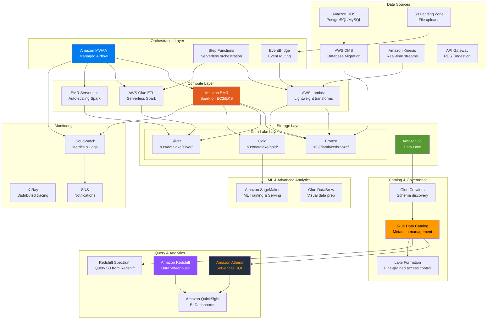
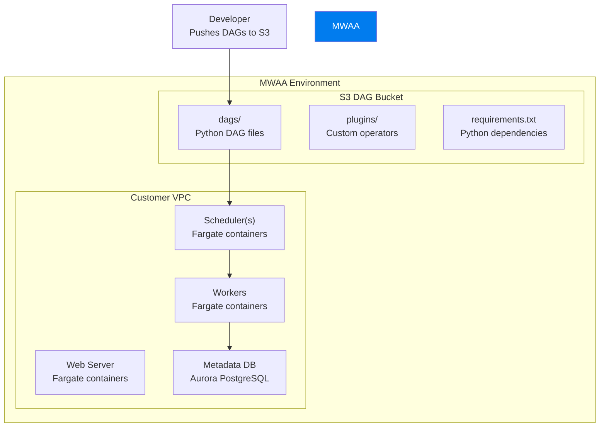
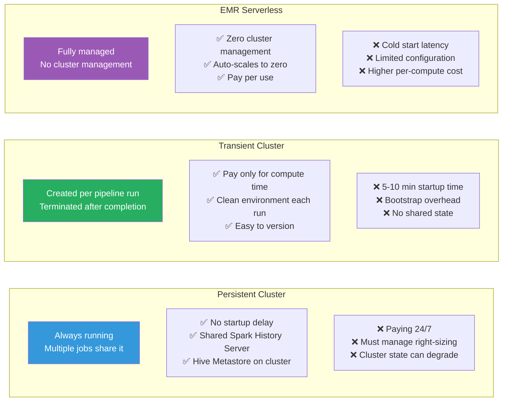
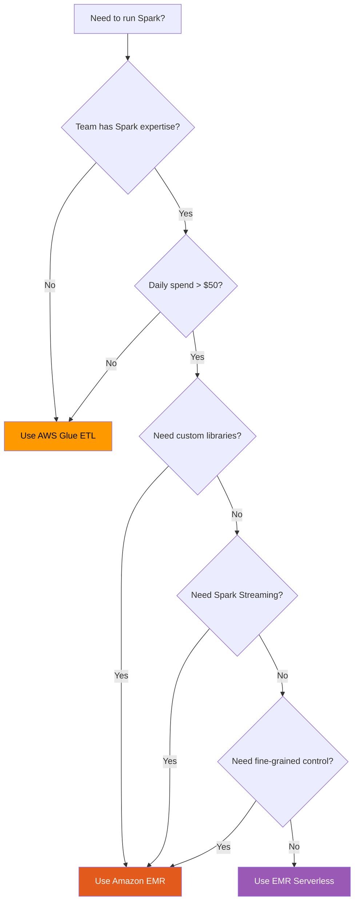
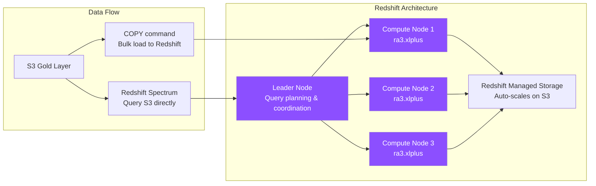
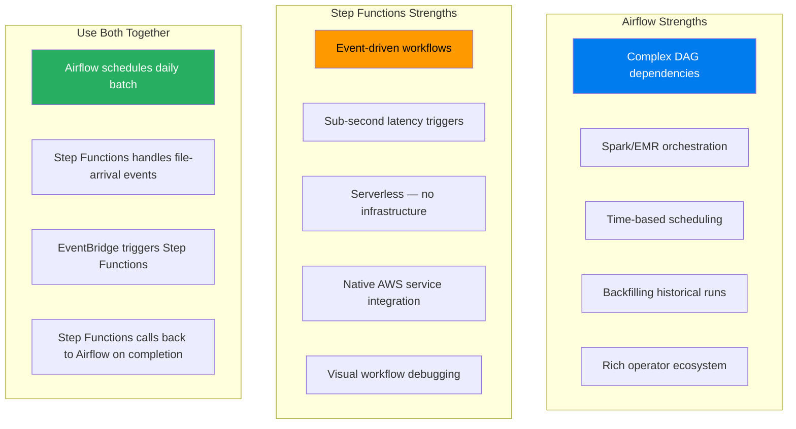
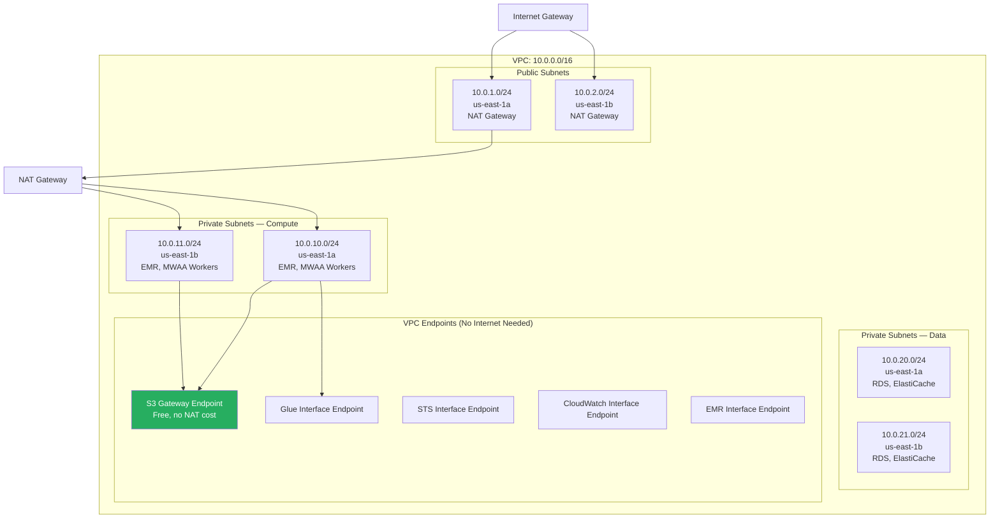
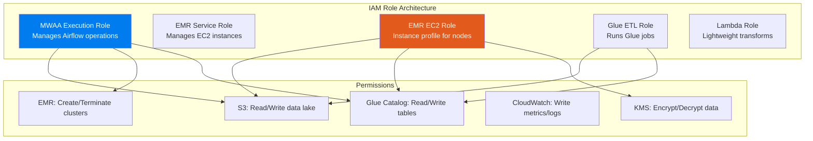
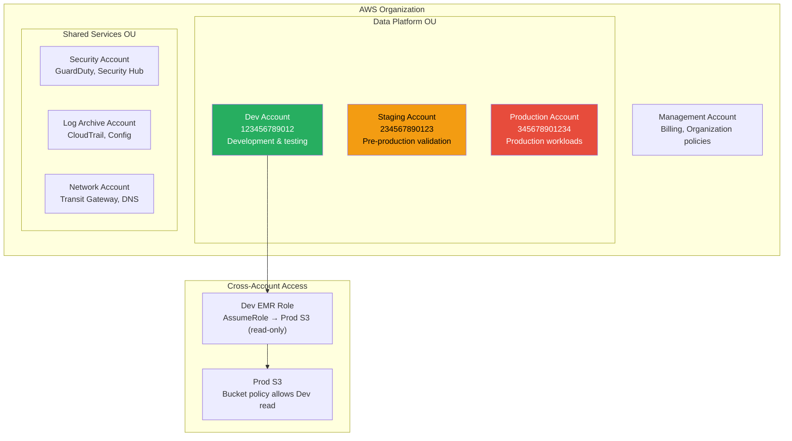
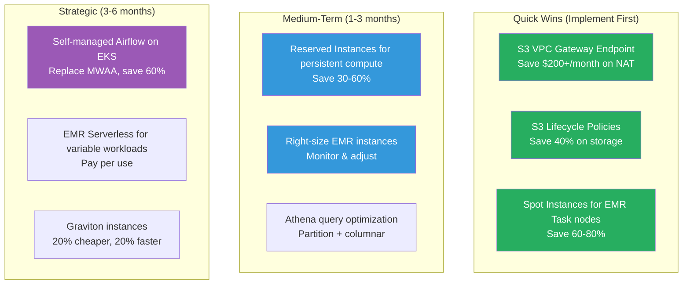

# 🏗️ Enterprise Architecture: Airflow + Spark on AWS

> **AWS has more than 200 services, and at least 15 of them can run a data pipeline. The art of enterprise architecture is knowing which 5-7 to actually use, how they connect, and why you chose them over the alternatives.**

---

## 📋 Table of Contents

- [Why AWS for Data Platforms](#-why-aws-for-data-platforms)
- [The AWS-Native Data Stack](#-the-aws-native-data-stack)
- [MWAA — Managed Airflow](#-mwaa--managed-airflow)
- [EMR — Managed Spark](#-emr--managed-spark)
- [EMR vs Glue ETL Comparison](#-emr-vs-glue-etl-comparison)
- [S3 as the Data Lake Foundation](#-s3-as-the-data-lake-foundation)
- [Glue Data Catalog](#-glue-data-catalog)
- [Athena for Ad-Hoc Queries](#-athena-for-ad-hoc-queries)
- [Redshift for the Data Warehouse](#-redshift-for-the-data-warehouse)
- [Step Functions Alternative](#-step-functions-alternative)
- [EventBridge for Events](#-eventbridge-for-events)
- [Infrastructure as Code (Terraform/CDK)](#-infrastructure-as-code-terraformcdk)
- [Networking Architecture](#-networking-architecture)
- [IAM Roles and Policies](#-iam-roles-and-policies)
- [Monitoring and Observability](#-monitoring-and-observability)
- [Multi-Account Strategy](#-multi-account-strategy)
- [Disaster Recovery](#-disaster-recovery)
- [Compliance (SOC2, HIPAA)](#-compliance-soc2-hipaa)
- [Cost Breakdown and Optimization](#-cost-breakdown-and-optimization)
- [Interview Deep-Dive](#-interview-deep-dive)

---

## 🎯 Why AWS for Data Platforms

AWS dominates the cloud data platform market for concrete reasons:

- **S3** is the de facto standard for data lake storage — 11 nines of durability
- **EMR** is the most mature managed Spark offering (born from the Hadoop era)
- **The ecosystem** — Glue, Athena, Redshift, Lake Formation, SageMaker all integrate natively
- **Enterprise adoption** — Most Fortune 500 companies already have AWS agreements

**But AWS has sharp edges.** Services overlap confusingly (Glue vs EMR vs Athena vs EMR Serverless), pricing models are complex, and misconfigured IAM policies are the #1 cause of security incidents. This guide cuts through the noise.

---

## 🏛️ The AWS-Native Data Stack



---

## ✈️ MWAA — Managed Airflow

### What is MWAA?

Amazon Managed Workflows for Apache Airflow (MWAA) is AWS's fully managed Airflow service. It handles the scheduler, workers, webserver, and metadata database.

### MWAA Architecture



### MWAA Environment Sizing

| Environment Class | Workers | Max Concurrent Tasks | Monthly Cost (approx) | Use Case |
|------------------|---------|---------------------|----------------------|----------|
| **mw1.small** | 1-10 | 10 | ~$350 | Development, small teams |
| **mw1.medium** | 1-20 | 20 | ~$700 | Production, medium workloads |
| **mw1.large** | 1-50 | 50 | ~$1,400 | Large-scale production |

### MWAA Limitations (Know Before You Commit)

```
❌ Limited Python package support (no C-compiled packages easily)
❌ Cold start time: 25-30 minutes for environment creation
❌ DAG deployment via S3 (can be 1-5 min delay)
❌ No support for DAG serialization toggle
❌ Maximum 50 workers (even on large environment)
❌ Region availability is limited
❌ Cost: MWAA is 3-5x more expensive than self-managed Airflow

✅ Zero operational overhead for Airflow infrastructure
✅ Built-in CloudWatch integration
✅ IAM-based authentication (no Airflow user management)
✅ VPC integration for network isolation
✅ Automatic Airflow version upgrades
```

### MWAA DAG Example

```python
# DAG deployed to s3://{mwaa-bucket}/dags/
from airflow import DAG
from airflow.providers.amazon.aws.operators.emr import (
    EmrCreateJobFlowOperator,
    EmrAddStepsOperator,
    EmrTerminateJobFlowOperator,
)
from airflow.providers.amazon.aws.sensors.emr import EmrStepSensor
from airflow.providers.amazon.aws.operators.athena import AthenaOperator
from datetime import datetime, timedelta

JOB_FLOW_OVERRIDES = {
    "Name": "data-pipeline-{{ ds }}",
    "ReleaseLabel": "emr-6.15.0",
    "Applications": [{"Name": "Spark"}, {"Name": "Hive"}],
    "Instances": {
        "InstanceGroups": [
            {
                "Name": "Primary",
                "Market": "ON_DEMAND",
                "InstanceRole": "MASTER",
                "InstanceType": "m5.xlarge",
                "InstanceCount": 1,
            },
            {
                "Name": "Core",
                "Market": "ON_DEMAND",
                "InstanceRole": "CORE",
                "InstanceType": "r5.2xlarge",
                "InstanceCount": 3,
            },
            {
                "Name": "Task",
                "Market": "SPOT",
                "InstanceRole": "TASK",
                "InstanceType": "m5.2xlarge",
                "InstanceCount": 5,
                "BidPrice": "OnDemandPrice",
            },
        ],
        "Ec2SubnetId": "subnet-12345abc",
        "Ec2KeyName": "emr-key",
        "KeepJobFlowAliveWhenNoSteps": True,
        "TerminationProtected": False,
    },
    "JobFlowRole": "EMR_EC2_DefaultRole",
    "ServiceRole": "EMR_DefaultRole",
    "LogUri": "s3://company-emr-logs/",
    "Configurations": [
        {
            "Classification": "spark-defaults",
            "Properties": {
                "spark.sql.adaptive.enabled": "true",
                "spark.sql.adaptive.coalescePartitions.enabled": "true",
                "spark.dynamicAllocation.enabled": "true",
                "spark.serializer": "org.apache.spark.serializer.KryoSerializer",
            },
        }
    ],
    "Tags": [
        {"Key": "Environment", "Value": "production"},
        {"Key": "Team", "Value": "data-platform"},
        {"Key": "CostCenter", "Value": "dp-001"},
    ],
}

with DAG(
    "emr_transient_pipeline",
    default_args={
        "owner": "data-platform",
        "retries": 2,
        "retry_delay": timedelta(minutes=10),
    },
    schedule_interval="0 2 * * *",
    start_date=datetime(2024, 1, 1),
    catchup=False,
    tags=["emr", "production"],
) as dag:
    
    # Create transient EMR cluster
    create_cluster = EmrCreateJobFlowOperator(
        task_id="create_emr_cluster",
        job_flow_overrides=JOB_FLOW_OVERRIDES,
    )
    
    # Submit Spark step
    spark_step = {
        "Name": "process_orders_{{ ds }}",
        "ActionOnFailure": "CONTINUE",
        "HadoopJarStep": {
            "Jar": "command-runner.jar",
            "Args": [
                "spark-submit",
                "--deploy-mode", "cluster",
                "--conf", "spark.executor.memory=8g",
                "--conf", "spark.executor.cores=4",
                "--conf", "spark.driver.memory=4g",
                "s3://company-artifacts/spark-jobs/process_orders.py",
                "--date", "{{ ds }}",
            ],
        },
    }
    
    add_step = EmrAddStepsOperator(
        task_id="submit_spark_job",
        job_flow_id="{{ task_instance.xcom_pull(task_ids='create_emr_cluster', key='return_value') }}",
        steps=[spark_step],
    )
    
    wait_step = EmrStepSensor(
        task_id="wait_for_spark_job",
        job_flow_id="{{ task_instance.xcom_pull(task_ids='create_emr_cluster', key='return_value') }}",
        step_id="{{ task_instance.xcom_pull(task_ids='submit_spark_job')[0] }}",
        poke_interval=60,
        timeout=7200,
    )
    
    # Run Athena query to refresh Gold views
    refresh_gold = AthenaOperator(
        task_id="refresh_gold_views",
        query="""
            INSERT OVERWRITE TABLE gold_db.daily_revenue
            SELECT order_date, SUM(amount_cents) as total_revenue
            FROM silver_db.orders
            WHERE order_date = DATE '{{ ds }}'
            GROUP BY order_date
        """,
        database="gold_db",
        output_location="s3://company-athena-results/",
    )
    
    # Terminate cluster to save costs
    terminate_cluster = EmrTerminateJobFlowOperator(
        task_id="terminate_emr_cluster",
        job_flow_id="{{ task_instance.xcom_pull(task_ids='create_emr_cluster', key='return_value') }}",
        trigger_rule="all_done",  # Terminate even if job fails!
    )
    
    create_cluster >> add_step >> wait_step >> refresh_gold >> terminate_cluster
```

---

## ⚡ EMR — Managed Spark

### EMR Cluster Types



### EC2 Instance Type Selection for Spark

| Instance Family | vCPUs | Memory | Use Case | Spark Role |
|----------------|-------|--------|----------|-----------|
| **m5.xlarge** | 4 | 16 GB | Balanced workloads | Task nodes |
| **m5.2xlarge** | 8 | 32 GB | General ETL | Core/Task nodes |
| **r5.2xlarge** | 8 | 64 GB | Memory-heavy (joins, caching) | Core nodes |
| **r5.4xlarge** | 16 | 128 GB | Large shuffle operations | Core nodes |
| **c5.2xlarge** | 8 | 16 GB | CPU-intensive (serialization) | Task nodes (rare) |
| **i3.xlarge** | 4 | 30 GB + NVMe SSD | Shuffle-heavy workloads | Core with local storage |

### EMR Instance Group Strategy

```
Recommended production setup:

MASTER (1x m5.xlarge):
  - Runs Spark Driver, YARN ResourceManager
  - ON_DEMAND (must be stable)
  - Don't over-size — master doesn't need much

CORE (3x r5.2xlarge):
  - Runs HDFS DataNode + YARN NodeManager
  - ON_DEMAND or Reserved Instances
  - These hold shuffle data — losing one loses data
  - Size for your baseline workload

TASK (5-20x m5.xlarge):
  - Runs YARN NodeManager only (no HDFS)
  - SPOT instances (60-80% savings)
  - These are stateless — losing one just means rescheduling
  - Auto-scale based on YARN pending containers
```

---

## ⚖️ EMR vs Glue ETL Comparison

| Feature | EMR | Glue ETL |
|---------|-----|----------|
| **Spark Version** | Any (you choose) | Fixed per Glue version |
| **Pricing Model** | EC2 instance hours | DPU-hours ($0.44/DPU-hour) |
| **Startup Time** | 5-10 min (cluster) | 1-2 min (warm start) |
| **Max Concurrency** | Unlimited (more nodes) | Limited by DPU account limits |
| **Custom Libraries** | Full control | Limited (wheel files only) |
| **Cluster Management** | You manage | Fully managed |
| **Cost at Scale** | Lower (reserved/spot) | Higher (fixed DPU price) |
| **Streaming** | Full Structured Streaming | Glue Streaming (limited) |
| **Debugging** | Spark UI, Ganglia | Glue UI (basic) |
| **Delta Lake/Iceberg** | Full support | Supported (Glue 4.0+) |
| **Best For** | Large-scale, complex ETL | Simple transforms, small teams |

### Decision Framework



---

## 🗄️ S3 as the Data Lake Foundation

### Bucket Structure

```
# Multi-account bucket strategy
company-datalake-dev-123456789012/      # Dev account
company-datalake-staging-234567890123/  # Staging account
company-datalake-prod-345678901234/     # Production account

# Within each bucket:
company-datalake-prod-345678901234/
├── bronze/
│   ├── source_system_a/
│   │   └── table_name/
│   │       └── ingestion_date=2024-01-15/
├── silver/
│   ├── domain_a/
│   │   └── entity/
│   │       └── year=2024/month=01/day=15/
├── gold/
│   ├── finance/
│   │   └── daily_revenue/
├── _artifacts/
│   ├── spark-jobs/         # Spark application JARs/Python
│   ├── airflow-dags/       # MWAA DAG files
│   └── configs/            # Job configurations
├── _checkpoints/
│   └── streaming/          # Spark Structured Streaming checkpoints
├── _logs/
│   ├── emr/                # EMR cluster logs
│   ├── spark/              # Spark application logs
│   └── athena/             # Athena query results
└── _tmp/
    └── staging/            # Temporary staging area
```

### S3 Bucket Policy (Production)

```json
{
    "Version": "2012-10-17",
    "Statement": [
        {
            "Sid": "DenyUnencryptedUploads",
            "Effect": "Deny",
            "Principal": "*",
            "Action": "s3:PutObject",
            "Resource": "arn:aws:s3:::company-datalake-prod-*/*",
            "Condition": {
                "StringNotEquals": {
                    "s3:x-amz-server-side-encryption": "aws:kms"
                }
            }
        },
        {
            "Sid": "DenyNonSSLAccess",
            "Effect": "Deny",
            "Principal": "*",
            "Action": "s3:*",
            "Resource": [
                "arn:aws:s3:::company-datalake-prod-*",
                "arn:aws:s3:::company-datalake-prod-*/*"
            ],
            "Condition": {
                "Bool": {"aws:SecureTransport": "false"}
            }
        },
        {
            "Sid": "DenyPublicAccess",
            "Effect": "Deny",
            "Principal": "*",
            "Action": "s3:*",
            "Resource": "arn:aws:s3:::company-datalake-prod-*/*",
            "Condition": {
                "StringEquals": {"s3:acl": "public-read"}
            }
        }
    ]
}
```

---

## 📚 Glue Data Catalog

The Glue Data Catalog is effectively a managed Hive Metastore that integrates with every AWS analytics service.

```python
# Register a table in Glue Catalog via Spark
spark.sql("""
    CREATE EXTERNAL TABLE IF NOT EXISTS silver_db.orders (
        order_id BIGINT,
        customer_id BIGINT,
        order_date TIMESTAMP,
        total_amount_cents BIGINT,
        status STRING
    )
    PARTITIONED BY (year INT, month INT, day INT)
    STORED AS PARQUET
    LOCATION 's3://company-datalake-prod/silver/ecommerce/orders/'
    TBLPROPERTIES (
        'parquet.compression' = 'SNAPPY',
        'classification' = 'parquet'
    )
""")

# Repair partitions (discover new partitions in S3)
spark.sql("MSCK REPAIR TABLE silver_db.orders")
```

---

## 🔍 Athena for Ad-Hoc Queries

```python
# Athena query optimization tips:
# 1. Partition your data — Athena charges per TB scanned
# 2. Use columnar formats (Parquet/ORC) — read only needed columns
# 3. Use CTAS for creating optimized tables

# Bad: Full table scan ($$$)
# SELECT * FROM bronze_db.raw_events WHERE event_date = '2024-01-15'

# Good: Partition pruning ($)
# SELECT order_id, amount FROM silver_db.orders WHERE year=2024 AND month=1 AND day=15

# Create optimized table from existing data
athena_query = """
    CREATE TABLE gold_db.daily_revenue
    WITH (
        format = 'PARQUET',
        partitioned_by = ARRAY['year', 'month'],
        external_location = 's3://company-datalake-prod/gold/daily_revenue/',
        bucketed_by = ARRAY['customer_segment'],
        bucket_count = 10
    ) AS
    SELECT 
        customer_segment,
        SUM(total_amount_cents) / 100.0 as total_revenue_dollars,
        COUNT(*) as order_count,
        year(order_date) as year,
        month(order_date) as month
    FROM silver_db.orders
    GROUP BY customer_segment, year(order_date), month(order_date)
"""
```

### Athena Cost Example

| Query Pattern | Data Scanned | Cost per Query |
|--------------|-------------|---------------|
| `SELECT * FROM unpartitioned_table` | 1 TB | $5.00 |
| `SELECT * ... WHERE partition_key = X` | 10 GB | $0.05 |
| `SELECT col1, col2 FROM partitioned_parquet WHERE ...` | 500 MB | $0.0025 |

---

## 🏢 Redshift for the Data Warehouse



---

## 🔀 Step Functions Alternative

When to use Step Functions instead of (or alongside) Airflow:



---

## 📡 EventBridge for Events

```python
# EventBridge rule: Trigger pipeline when new file arrives in S3
import json
import boto3

eventbridge = boto3.client('events')

# Create EventBridge rule for S3 file arrival
rule = eventbridge.put_rule(
    Name='new-data-file-arrived',
    EventPattern=json.dumps({
        "source": ["aws.s3"],
        "detail-type": ["Object Created"],
        "detail": {
            "bucket": {"name": ["company-datalake-prod"]},
            "object": {"key": [{"prefix": "bronze/partner_uploads/"}]}
        }
    }),
    State='ENABLED',
    Description='Trigger when new partner data file arrives in S3',
)

# Target: Step Functions state machine
eventbridge.put_targets(
    Rule='new-data-file-arrived',
    Targets=[{
        'Id': 'trigger-partner-pipeline',
        'Arn': 'arn:aws:states:us-east-1:123456789:stateMachine:partner-ingestion',
        'RoleArn': 'arn:aws:iam::123456789:role/eventbridge-stepfunctions-role',
    }]
)
```

---

## 🏗️ Infrastructure as Code (Terraform/CDK)

### Terraform: EMR Cluster

```hcl
# terraform/modules/emr/main.tf
resource "aws_emr_cluster" "spark_cluster" {
  name          = "data-platform-${var.environment}"
  release_label = "emr-6.15.0"
  applications  = ["Spark", "Hive", "Ganglia"]
  service_role  = aws_iam_role.emr_service_role.arn

  ec2_attributes {
    instance_profile                  = aws_iam_instance_profile.emr_profile.arn
    subnet_id                         = var.private_subnet_ids[0]
    emr_managed_master_security_group = aws_security_group.emr_master.id
    emr_managed_slave_security_group  = aws_security_group.emr_core.id
    key_name                          = var.ec2_key_name
  }

  master_instance_group {
    instance_type  = "m5.xlarge"
    instance_count = 1
    ebs_config {
      size = 100
      type = "gp3"
    }
  }

  core_instance_group {
    instance_type  = var.core_instance_type
    instance_count = var.core_instance_count
    ebs_config {
      size = 200
      type = "gp3"
    }
    autoscaling_policy = jsonencode({
      "Constraints" = {
        "MinCapacity" = var.core_min_count
        "MaxCapacity" = var.core_max_count
      }
      "Rules" = [
        {
          "Name" = "ScaleOutYARNMemory"
          "Action" = {
            "SimpleScalingPolicyConfiguration" = {
              "AdjustmentType" = "CHANGE_IN_CAPACITY"
              "ScalingAdjustment" = 2
              "CoolDown"          = 300
            }
          }
          "Trigger" = {
            "CloudWatchAlarmDefinition" = {
              "ComparisonOperator" = "GREATER_THAN_OR_EQUAL"
              "MetricName"         = "YARNMemoryAvailablePercentage"
              "Namespace"          = "AWS/ElasticMapReduce"
              "Period"             = 300
              "Threshold"          = 15.0
              "Statistic"          = "AVERAGE"
              "EvaluationPeriods"  = 1
            }
          }
        }
      ]
    })
  }

  configurations_json = jsonencode([
    {
      Classification = "spark-defaults"
      Properties = {
        "spark.sql.adaptive.enabled"                     = "true"
        "spark.sql.adaptive.coalescePartitions.enabled"  = "true"
        "spark.dynamicAllocation.enabled"                 = "true"
        "spark.dynamicAllocation.minExecutors"            = "2"
        "spark.dynamicAllocation.maxExecutors"            = "50"
        "spark.serializer"                                = "org.apache.spark.serializer.KryoSerializer"
        "spark.sql.catalog.glue_catalog"                  = "org.apache.iceberg.spark.SparkCatalog"
        "spark.sql.catalog.glue_catalog.warehouse"        = "s3://company-datalake-${var.environment}/"
        "spark.sql.catalog.glue_catalog.catalog-impl"     = "org.apache.iceberg.aws.glue.GlueCatalog"
      }
    },
    {
      Classification = "spark-hive-site"
      Properties = {
        "hive.metastore.client.factory.class" = "com.amazonaws.glue.catalog.metastore.AWSGlueDataCatalogHiveClientFactory"
      }
    }
  ])

  log_uri = "s3://${var.log_bucket}/emr/"

  tags = {
    Environment = var.environment
    Team        = "data-platform"
    CostCenter  = var.cost_center
    ManagedBy   = "terraform"
  }
}

# MWAA Environment
resource "aws_mwaa_environment" "airflow" {
  name               = "data-platform-${var.environment}"
  airflow_version    = "2.8.1"
  environment_class  = var.mwaa_environment_class
  max_workers        = var.mwaa_max_workers
  min_workers        = var.mwaa_min_workers

  source_bucket_arn     = aws_s3_bucket.mwaa_bucket.arn
  dag_s3_path           = "dags/"
  plugins_s3_path       = "plugins/plugins.zip"
  requirements_s3_path  = "requirements/requirements.txt"
  execution_role_arn    = aws_iam_role.mwaa_execution_role.arn

  network_configuration {
    security_group_ids = [aws_security_group.mwaa.id]
    subnet_ids         = var.private_subnet_ids
  }

  logging_configuration {
    dag_processing_logs {
      enabled   = true
      log_level = "INFO"
    }
    scheduler_logs {
      enabled   = true
      log_level = "INFO"
    }
    task_logs {
      enabled   = true
      log_level = "INFO"
    }
    webserver_logs {
      enabled   = true
      log_level = "WARNING"
    }
    worker_logs {
      enabled   = true
      log_level = "INFO"
    }
  }

  airflow_configuration_options = {
    "core.default_timezone"                = "utc"
    "core.max_active_tasks_per_dag"        = "32"
    "core.max_active_runs_per_dag"         = "1"
    "scheduler.min_file_process_interval"  = "60"
    "celery.worker_autoscale"              = "20,5"
  }
}
```

---

## 🌐 Networking Architecture



> **Cost tip:** VPC endpoints for S3 (Gateway type) are free and eliminate NAT Gateway data processing charges. For a data platform processing TBs through NAT, this saves thousands per month.

---

## 🔐 IAM Roles and Policies

### Role Architecture



---

## 📊 Monitoring and Observability

### CloudWatch Dashboard Design

| Metric Category | Key Metrics | CloudWatch Namespace | Alert Threshold |
|-----------------|-------------|---------------------|-----------------|
| **EMR Cluster** | YARN Memory Available, Containers Pending | AWS/ElasticMapReduce | Memory <15%, Pending >50 |
| **EMR Spark** | Active Jobs, Failed Stages, Shuffle Read/Write | Custom/Spark | Failed stages >0 |
| **MWAA** | Scheduler Heartbeat, Task Duration, Queue Time | AmazonMWAA | Heartbeat missing >5 min |
| **S3** | Request Count, 5xx Errors, Bucket Size | AWS/S3 | 5xx >10/min |
| **Glue** | Job Duration, DPU Utilization, Errors | AWS/Glue | Duration >2x baseline |
| **Athena** | Query Execution Time, Data Scanned | AWS/Athena | Data scanned >1 TB/query |

### Custom CloudWatch Metrics

```python
import boto3
from datetime import datetime

cloudwatch = boto3.client('cloudwatch')

def publish_pipeline_metrics(
    pipeline_name: str,
    records_processed: int,
    duration_seconds: float,
    data_quality_score: float
):
    """Publish custom pipeline metrics to CloudWatch."""
    cloudwatch.put_metric_data(
        Namespace='DataPlatform/Pipelines',
        MetricData=[
            {
                'MetricName': 'RecordsProcessed',
                'Dimensions': [{'Name': 'Pipeline', 'Value': pipeline_name}],
                'Value': records_processed,
                'Unit': 'Count',
                'Timestamp': datetime.utcnow(),
            },
            {
                'MetricName': 'PipelineDuration',
                'Dimensions': [{'Name': 'Pipeline', 'Value': pipeline_name}],
                'Value': duration_seconds,
                'Unit': 'Seconds',
                'Timestamp': datetime.utcnow(),
            },
            {
                'MetricName': 'DataQualityScore',
                'Dimensions': [{'Name': 'Pipeline', 'Value': pipeline_name}],
                'Value': data_quality_score,
                'Unit': 'Percent',
                'Timestamp': datetime.utcnow(),
            },
        ]
    )
```

---

## 🏢 Multi-Account Strategy



---

## 🔄 Disaster Recovery

### DR Strategy by Component

| Component | RPO | RTO | DR Strategy |
|-----------|-----|-----|-------------|
| **S3 Data Lake** | 0 (real-time) | Minutes | Cross-region replication |
| **Glue Catalog** | Hours | Hours | Catalog export/import |
| **EMR Cluster** | N/A | 10-15 min | Recreate from Terraform |
| **MWAA** | Hours | 30 min | Secondary environment |
| **Redshift** | 1 hour | 2-4 hours | Automated snapshots + restore |
| **RDS (Metadata)** | Minutes | Minutes | Multi-AZ + Cross-region read replica |

### S3 Cross-Region Replication

```hcl
resource "aws_s3_bucket_replication_configuration" "datalake_dr" {
  bucket = aws_s3_bucket.datalake_prod.id
  role   = aws_iam_role.s3_replication_role.arn

  rule {
    id     = "replicate-gold-layer"
    status = "Enabled"

    filter {
      prefix = "gold/"
    }

    destination {
      bucket        = aws_s3_bucket.datalake_dr.arn
      storage_class = "STANDARD_IA"
    }
  }

  rule {
    id     = "replicate-silver-layer"
    status = "Enabled"

    filter {
      prefix = "silver/"
    }

    destination {
      bucket        = aws_s3_bucket.datalake_dr.arn
      storage_class = "GLACIER_IR"
    }
  }
}
```

---

## 🛡️ Compliance (SOC2, HIPAA)

### Compliance Requirements Mapping

| Requirement | SOC2 | HIPAA | AWS Implementation |
|-------------|------|-------|-------------------|
| **Encryption at Rest** | Required | Required | S3 SSE-KMS, EBS encryption, RDS encryption |
| **Encryption in Transit** | Required | Required | TLS 1.2+ everywhere, VPC endpoints |
| **Access Logging** | Required | Required | CloudTrail, S3 access logs |
| **Access Control** | Required | Required | IAM, Lake Formation, VPC |
| **Data Retention** | Defined | 6 years | S3 lifecycle policies, Glacier |
| **Audit Trail** | Required | Required | CloudTrail, Config |
| **Incident Response** | Required | Required | GuardDuty, Security Hub |
| **Backup/Recovery** | Required | Required | S3 versioning, RDS snapshots |

---

## 💰 Cost Breakdown and Optimization

### Full Platform Monthly Cost (Medium Scale)

| Component | Configuration | Monthly Cost | Optimization |
|-----------|--------------|-------------|--------------|
| **MWAA** | Medium, 10 workers | $700 | Consider self-managed on EKS |
| **EMR Persistent** | 3x r5.2xlarge core (RI) | $1,200 | 1-year RI saves 40% |
| **EMR Transient** | 10x m5.xlarge task (Spot) | $400 | Spot saves 60-80% |
| **S3 Storage** | 50 TB across tiers | $600 | Lifecycle policies save 40% |
| **S3 Requests** | 100M requests/month | $50 | Reduce LIST operations |
| **Glue Catalog** | 500 tables, 1M partitions | $15 | Prune unused tables |
| **Athena** | 10 TB scanned/month | $50 | Partitioning + columnar format |
| **Redshift** | 3x ra3.xlplus (RI) | $2,400 | RI saves 35% |
| **CloudWatch** | Logs + Metrics + Alarms | $150 | Log retention policies |
| **NAT Gateway** | 2x multi-AZ | $200 | VPC endpoints eliminate most traffic |
| **Data Transfer** | Cross-AZ | $300 | Minimize cross-AZ data movement |
| **KMS** | 100K API calls | $10 | Use S3 bucket keys |
| **Total** | | **~$6,075/month** | With optimization: **~$4,200/month** |

### Top Cost Optimization Strategies



---

## 🎤 Interview Deep-Dive

### Frequently Asked Questions

**Q: EMR vs Glue — when do you use each?**

> Use EMR when you need full Spark control, custom libraries, streaming workloads, or are processing at scale where cost optimization via Spot/Reserved instances matters. Use Glue when you have simple transforms, a small team without deep Spark expertise, or need serverless execution. The crossover point is roughly $50/day in compute — below that, Glue's simplicity wins; above that, EMR's flexibility and cost optimization tools win.

**Q: How do you handle EMR cluster failures in a production pipeline?**

> For transient clusters (created per pipeline run), the Airflow DAG handles failure by retry — it creates a new cluster on the next attempt. The key is making the pipeline idempotent (overwrite partitions, not append). For persistent clusters, I configure auto-scaling with a minimum core node count, use YARN's capacity scheduler for multi-tenancy, and set up CloudWatch alarms for YARN memory utilization. The critical design decision is: always use ON_DEMAND for core nodes (they hold HDFS shuffle data) and SPOT only for task nodes (stateless, can be reclaimed).

**Q: How do you secure a data lake on AWS?**

> Defense in depth: (1) **Network** — VPC with private subnets, no public access, VPC endpoints for AWS services. (2) **Identity** — IAM roles with least privilege, no long-lived credentials, STS AssumeRole for cross-account access. (3) **Data** — S3 SSE-KMS encryption, TLS in transit, bucket policies denying unencrypted uploads. (4) **Access Control** — Lake Formation for column/row-level access, S3 bucket policies. (5) **Audit** — CloudTrail for API calls, S3 access logging, GuardDuty for anomaly detection. (6) **Governance** — AWS Config rules for compliance, Security Hub for findings aggregation.

**Q: MWAA vs self-managed Airflow — what's your recommendation?**

> MWAA is ideal for teams that want zero Airflow operational overhead and have budgets that can absorb the 3-5x premium over self-managed. For teams with Kubernetes expertise, self-managed Airflow on EKS with the KubernetesExecutor is significantly cheaper and more flexible — you get unlimited workers, full control over Python packages, and sub-minute DAG deployment via container images. The deciding factors are: team Kubernetes skills, budget sensitivity, and how much Airflow customization you need. I generally recommend MWAA for teams under 5 engineers and self-managed for larger platform teams.

**Q: How do you design a multi-account AWS data platform?**

> Use AWS Organizations with separate accounts for dev, staging, and production. The data lake lives in the production account. Dev/staging accounts access production data through cross-account IAM roles with read-only permissions. This provides blast-radius isolation — a misconfigured dev job can't delete production data. Infrastructure is deployed via Terraform with account-specific state files and environment variables. CI/CD promotes code through dev → staging → production with automated testing at each stage. A shared services account handles centralized logging (CloudTrail), security (GuardDuty), and networking (Transit Gateway).

---

**[← Back to Enterprise Architecture](../README.md#-enterprise-architecture)**
