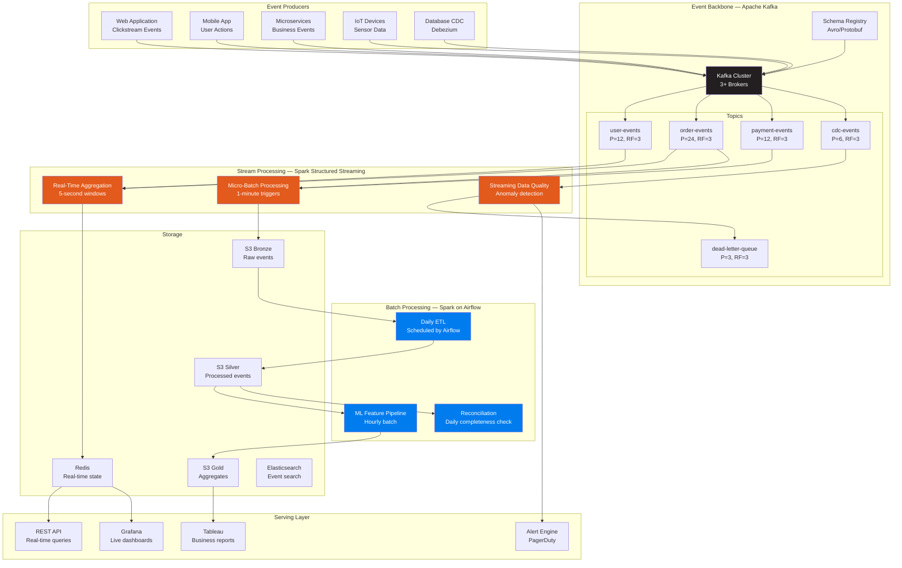
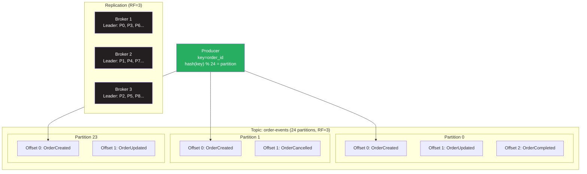
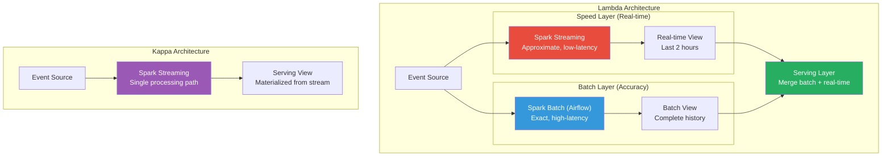
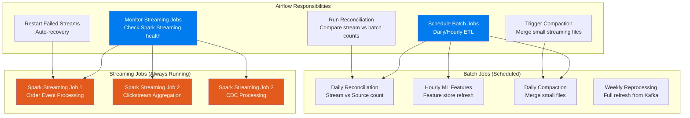
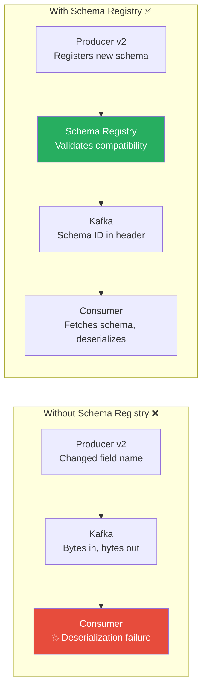
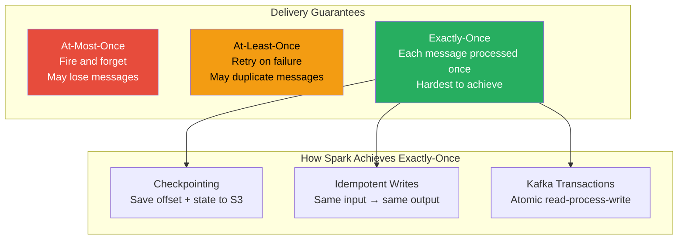
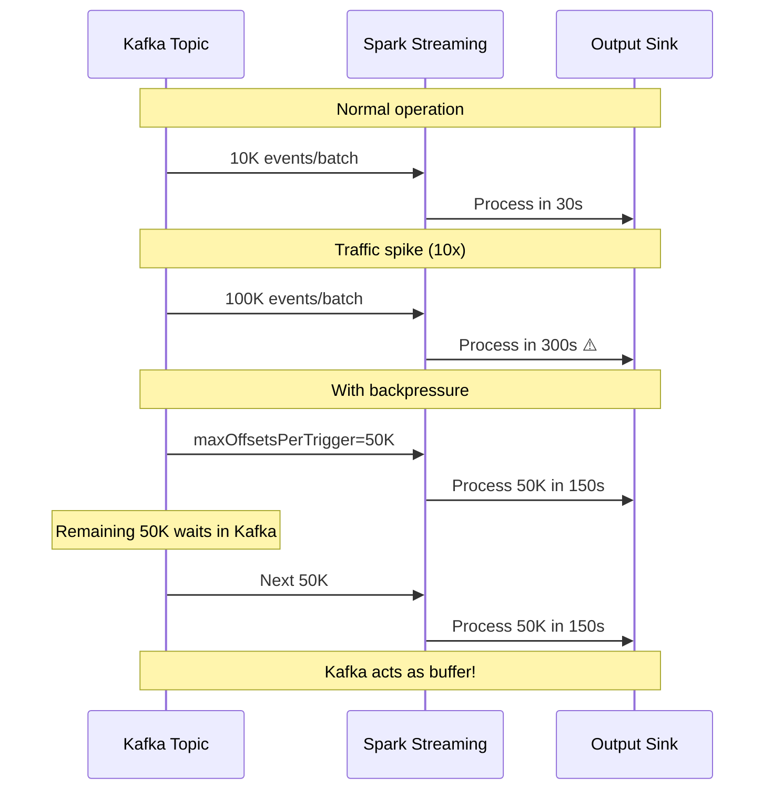
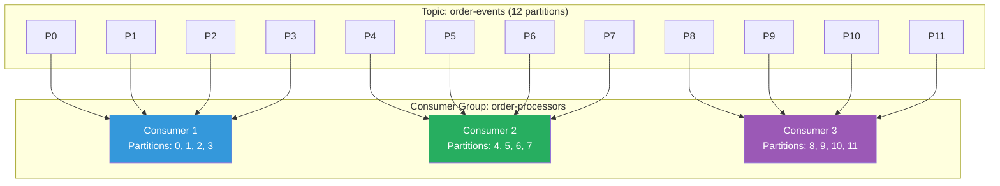
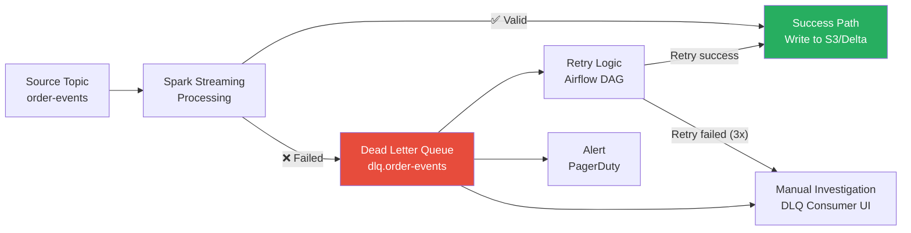

# 🏗️ Enterprise Architecture: Airflow + Spark + Kafka Event-Driven Pipeline

> **Batch processing tells you what happened yesterday. Stream processing tells you what's happening right now. The real enterprise challenge is doing both, correctly, at the same time — without drowning in operational complexity.**

---

## 📋 Table of Contents

- [Why Event-Driven Architecture](#-why-event-driven-architecture)
- [High-Level Architecture](#-high-level-architecture)
- [Kafka as the Event Backbone](#-kafka-as-the-event-backbone)
- [Lambda vs Kappa Architecture](#-lambda-vs-kappa-architecture)
- [Spark Structured Streaming with Kafka](#-spark-structured-streaming-with-kafka)
- [Airflow Managing Batch Alongside Streaming](#-airflow-managing-batch-alongside-streaming)
- [Schema Registry (Avro/Protobuf)](#-schema-registry-avroprotobuf)
- [Exactly-Once Semantics](#-exactly-once-semantics)
- [Backpressure Handling](#-backpressure-handling)
- [Consumer Groups and Offset Management](#-consumer-groups-and-offset-management)
- [Dead Letter Queues](#-dead-letter-queues)
- [Monitoring and Observability](#-monitoring-and-observability)
- [Failure Scenarios and Recovery](#-failure-scenarios-and-recovery)
- [Cost Optimization](#-cost-optimization)
- [Interview Deep-Dive](#-interview-deep-dive)

---

## 🎯 Why Event-Driven Architecture

Traditional batch pipelines have a fatal flaw: latency. When your e-commerce platform processes orders in a nightly batch, customers wait 24 hours for their order status to update. When your fraud detection runs hourly, a thief has 59 minutes of free shopping.

**Real-world examples of why streaming matters:**
- **Uber:** Surge pricing must react to demand in seconds, not hours
- **Netflix:** "Continue watching" recommendations need real-time session data
- **Capital One:** Fraud detection must flag suspicious transactions before authorization
- **LinkedIn:** Feed ranking needs real-time engagement signals

But here's the catch — you still need batch processing. ML model training, financial reconciliation, compliance reports, data quality audits — these all require complete, consistent datasets that only batch can provide. The enterprise reality is that you need both.

---

## 🏛️ High-Level Architecture



---

## 📨 Kafka as the Event Backbone

### Why Kafka and Not Something Else?

| Feature | Kafka | RabbitMQ | AWS SQS | AWS Kinesis | Pulsar |
|---------|-------|----------|---------|-------------|--------|
| **Throughput** | Millions msg/s | 100K msg/s | ~3K msg/s/shard | 1K records/s/shard | Millions msg/s |
| **Replay** | ✅ Unlimited | ❌ | ❌ | ✅ 7 days max | ✅ Unlimited |
| **Ordering** | Per partition | Per queue | Best-effort | Per shard | Per partition |
| **Persistence** | Configurable | Transient | 14 days max | 7 days max | Tiered |
| **Consumer Groups** | ✅ Native | ❌ (Competing consumers) | ✅ | ✅ | ✅ Native |
| **Exactly-Once** | ✅ (With transactions) | ❌ | ❌ | ❌ | ✅ |
| **Ecosystem** | Massive | Moderate | AWS-only | AWS-only | Growing |

### Kafka Topic Design



### Topic Naming Convention

```
# Pattern: {domain}.{entity}.{event-type}.{version}
#
# Examples:
ecommerce.orders.created.v1
ecommerce.orders.updated.v1
ecommerce.orders.completed.v1
payments.transactions.authorized.v1
users.profiles.updated.v2          # Schema version bump
analytics.clickstream.pageview.v1
cdc.postgres.orders.v1             # CDC from source database

# Dead Letter Queues:
dlq.ecommerce.orders.created.v1   # Failed events from orders.created.v1

# Internal topics:
_internal.schema-registry          # Schema Registry internal state
_internal.consumer-offsets          # Consumer offset tracking
```

### Partition Count Decision Guide

```
Rule of thumb for partition count:
- Start with: max(target_throughput_MB/s / 10 MB/s, expected_consumer_count)
- Each partition handles ~10 MB/s writes, ~30 MB/s reads
- More partitions = more parallelism, but more overhead
- Partitions can only be INCREASED, never decreased

Examples:
- Low-volume topic (1K msg/s, 2 consumers): 6 partitions
- Medium-volume (100K msg/s, 10 consumers): 12-24 partitions
- High-volume (1M msg/s, 50 consumers): 48-96 partitions
- Extreme (10M msg/s): 128-256 partitions (rare)
```

---

## ⚖️ Lambda vs Kappa Architecture

This is one of the most important architectural decisions you'll make.



### When to Choose Which

| Factor | Lambda | Kappa |
|--------|--------|-------|
| **Operational Complexity** | High (2 code paths) | Low (1 code path) |
| **Data Correctness** | Batch layer is source of truth | Stream is source of truth |
| **Historical Reprocessing** | Easy (re-run batch) | Must replay from Kafka |
| **Use Case** | Financial reporting, compliance | Real-time analytics, monitoring |
| **Team Size** | Larger team needed | Smaller team can manage |
| **Kafka Retention** | Can be short (days) | Must be long (weeks/months) |
| **Our Recommendation** | Most enterprises start here | Evolve toward this over time |

### Hybrid Architecture (What Most Enterprises Actually Build)

```python
"""
The practical reality: Most enterprises use a HYBRID approach.
- Streaming handles real-time use cases (alerting, live dashboards)
- Batch handles analytical use cases (reports, ML training)  
- Both write to the same data lake (Bronze/Silver/Gold)
- Airflow orchestrates the batch side and monitors the streaming side
"""
```

---

## ⚡ Spark Structured Streaming with Kafka

### Reading from Kafka

```python
from pyspark.sql import SparkSession
from pyspark.sql.functions import (
    from_json, col, window, count, sum as spark_sum,
    expr, current_timestamp, lit
)
from pyspark.sql.types import (
    StructType, StructField, StringType, LongType, 
    TimestampType, DoubleType
)

spark = (
    SparkSession.builder
    .appName("order-events-processor")
    .config("spark.sql.streaming.checkpointLocation", "s3://checkpoints/order-processor/")
    .config("spark.sql.streaming.kafka.consumer.cache.timeout", "600000")  # 10 min
    .config("spark.streaming.backpressure.enabled", "true")
    .getOrCreate()
)

# Define event schema
order_event_schema = StructType([
    StructField("order_id", StringType(), False),
    StructField("customer_id", StringType(), False),
    StructField("event_type", StringType(), False),
    StructField("amount_cents", LongType(), False),
    StructField("currency", StringType(), False),
    StructField("timestamp", TimestampType(), False),
    StructField("metadata", StringType(), True),
])

# Read from Kafka
raw_stream = (
    spark.readStream
    .format("kafka")
    .option("kafka.bootstrap.servers", "kafka-broker-1:9092,kafka-broker-2:9092,kafka-broker-3:9092")
    .option("subscribe", "ecommerce.orders.created.v1,ecommerce.orders.updated.v1")
    .option("startingOffsets", "latest")           # For new consumers
    .option("maxOffsetsPerTrigger", "100000")       # Backpressure control
    .option("failOnDataLoss", "false")              # Don't crash on expired offsets
    .option("kafka.security.protocol", "SASL_SSL")
    .option("kafka.sasl.mechanism", "SCRAM-SHA-256")
    .option("kafka.sasl.jaas.config",
            'org.apache.kafka.common.security.scram.ScramLoginModule required '
            'username="spark-consumer" password="${KAFKA_PASSWORD}";')
    .load()
)

# Parse Kafka message
parsed_stream = (
    raw_stream
    .selectExpr("CAST(key AS STRING) as order_id_key",
                "CAST(value AS STRING) as json_value",
                "topic", "partition", "offset", "timestamp as kafka_timestamp")
    .select(
        from_json(col("json_value"), order_event_schema).alias("event"),
        col("topic"),
        col("partition"),
        col("offset"),
        col("kafka_timestamp")
    )
    .select("event.*", "topic", "partition", "offset", "kafka_timestamp")
)
```

### Windowed Aggregations

```python
# Real-time revenue by 5-minute tumbling windows
revenue_by_window = (
    parsed_stream
    .filter(col("event_type") == "order_completed")
    .withWatermark("timestamp", "10 minutes")  # Allow 10 min late data
    .groupBy(
        window(col("timestamp"), "5 minutes"),
        col("currency")
    )
    .agg(
        spark_sum("amount_cents").alias("total_revenue_cents"),
        count("*").alias("order_count")
    )
)

# Write aggregations to console (for development)
query_console = (
    revenue_by_window
    .writeStream
    .outputMode("update")
    .format("console")
    .option("truncate", "false")
    .trigger(processingTime="30 seconds")
    .start()
)

# Write raw events to S3 (Bronze layer)
query_s3 = (
    parsed_stream
    .writeStream
    .format("parquet")
    .option("path", "s3://datalake/bronze/order_events/")
    .option("checkpointLocation", "s3://checkpoints/order-events-bronze/")
    .partitionBy("event_type")
    .trigger(processingTime="1 minute")  # Micro-batch every minute
    .start()
)

# Write aggregations to Delta Lake (for downstream queries)
query_delta = (
    revenue_by_window
    .writeStream
    .format("delta")
    .outputMode("append")
    .option("checkpointLocation", "s3://checkpoints/revenue-agg/")
    .option("mergeSchema", "true")
    .trigger(processingTime="1 minute")
    .toTable("gold.realtime_revenue")
)
```

### Stateful Stream Processing

```python
from pyspark.sql.functions import pandas_udf
from pyspark.sql.streaming.state import GroupState, GroupStateTimeout

def track_order_lifecycle(
    key: tuple,
    events: list,
    state: GroupState
) -> list:
    """
    Stateful processing: track order lifecycle from creation to completion.
    Emit alerts for orders stuck in "pending" for too long.
    
    This is the most complex streaming pattern — handle with care.
    """
    order_id = key[0]
    
    if state.hasTimedOut:
        # Order stuck — no completion event within timeout
        old_state = state.get
        if old_state["status"] == "pending":
            state.remove()
            return [{
                "order_id": order_id,
                "alert": "ORDER_STUCK_PENDING",
                "pending_since": old_state["created_at"],
                "alert_time": datetime.now()
            }]
    
    # Process new events
    current_state = state.getOption or {
        "status": "unknown",
        "created_at": None,
        "events": []
    }
    
    for event in events:
        current_state["status"] = event["event_type"]
        current_state["events"].append(event["event_type"])
        if event["event_type"] == "order_created":
            current_state["created_at"] = event["timestamp"]
    
    if current_state["status"] in ("completed", "cancelled"):
        state.remove()  # Terminal state — clean up
    else:
        state.update(current_state)
        state.setTimeoutDuration("30 minutes")  # Alert if no update in 30 min
    
    return []
```

---

## 🎼 Airflow Managing Batch Alongside Streaming



### Airflow DAG for Stream Management

```python
from airflow import DAG
from airflow.operators.python import PythonOperator
from airflow.providers.http.sensors.http import HttpSensor
from airflow.operators.bash import BashOperator
from datetime import datetime, timedelta
import requests

default_args = {
    "owner": "streaming-platform",
    "retries": 3,
    "retry_delay": timedelta(minutes=5),
    "email_on_failure": True,
    "email": ["streaming-oncall@company.com"],
}

# DAG 1: Streaming Health Monitor (runs every 5 minutes)
with DAG(
    "streaming_health_monitor",
    default_args=default_args,
    schedule_interval="*/5 * * * *",
    start_date=datetime(2024, 1, 1),
    catchup=False,
    tags=["streaming", "monitoring"],
) as health_dag:
    
    def check_streaming_health(**context):
        """
        Check Spark Structured Streaming job health via Spark UI REST API.
        Alert if: job is not running, processing rate drops, batch duration spikes.
        """
        spark_ui_url = "http://spark-streaming-driver:4040"
        
        # Check active streaming queries
        response = requests.get(f"{spark_ui_url}/api/v1/applications")
        apps = response.json()
        
        for app in apps:
            app_id = app["id"]
            # Check streaming query progress
            sq_response = requests.get(
                f"{spark_ui_url}/api/v1/applications/{app_id}/streaming/statistics"
            )
            stats = sq_response.json()
            
            # Alert conditions
            if stats.get("isDataAvailable") and stats.get("inputRate", 0) == 0:
                raise ValueError(f"Streaming job {app_id} is stalled — 0 input rate")
            
            if stats.get("batchDuration", 0) > 60000:  # 60 seconds
                print(f"⚠️ WARNING: Batch duration for {app_id} is {stats['batchDuration']}ms")
            
            processing_rate = stats.get("processedRowsPerSecond", 0)
            input_rate = stats.get("inputRowsPerSecond", 0)
            
            if input_rate > 0 and processing_rate < input_rate * 0.8:
                raise ValueError(
                    f"Processing falling behind! Input: {input_rate}/s, "
                    f"Processing: {processing_rate}/s"
                )
        
        print("✅ All streaming jobs healthy")
    
    check_health = PythonOperator(
        task_id="check_streaming_health",
        python_callable=check_streaming_health,
    )

# DAG 2: Daily Reconciliation
with DAG(
    "streaming_daily_reconciliation",
    default_args=default_args,
    schedule_interval="0 6 * * *",  # 6 AM daily
    start_date=datetime(2024, 1, 1),
    catchup=False,
    tags=["streaming", "reconciliation"],
) as reconcile_dag:
    
    def reconcile_stream_vs_source(**context):
        """
        Compare record counts between source (Kafka offsets) and 
        destination (S3 Bronze layer) to detect data loss.
        """
        from pyspark.sql import SparkSession
        from kafka import KafkaConsumer, TopicPartition
        
        ds = context["ds"]
        
        # Get Kafka topic end offsets for yesterday
        consumer = KafkaConsumer(
            bootstrap_servers=["kafka-broker-1:9092"],
            group_id="reconciliation-checker"
        )
        
        topic = "ecommerce.orders.created.v1"
        partitions = consumer.partitions_for_topic(topic)
        tps = [TopicPartition(topic, p) for p in partitions]
        end_offsets = consumer.end_offsets(tps)
        beginning_offsets = consumer.beginning_offsets(tps)
        
        kafka_total = sum(end_offsets.values()) - sum(beginning_offsets.values())
        
        # Count records in S3 Bronze for the same day
        spark = SparkSession.builder.appName("reconciliation").getOrCreate()
        s3_count = (
            spark.read.parquet(f"s3://datalake/bronze/order_events/")
            .filter(col("_bronze_ingestion_date") == ds)
            .count()
        )
        
        discrepancy_pct = abs(kafka_total - s3_count) / max(kafka_total, 1) * 100
        
        if discrepancy_pct > 1.0:  # More than 1% discrepancy
            raise ValueError(
                f"❌ RECONCILIATION FAILED: Kafka={kafka_total:,}, "
                f"S3={s3_count:,}, Discrepancy={discrepancy_pct:.2f}%"
            )
        
        print(f"✅ Reconciliation passed: Kafka={kafka_total:,}, "
              f"S3={s3_count:,}, Discrepancy={discrepancy_pct:.2f}%")
    
    reconcile = PythonOperator(
        task_id="reconcile_counts",
        python_callable=reconcile_stream_vs_source,
    )
    
    # File compaction after reconciliation
    compact = BashOperator(
        task_id="compact_streaming_output",
        bash_command="""
            spark-submit \
                --master yarn \
                --deploy-mode cluster \
                s3://company-artifacts/spark-jobs/compact_files.py \
                --input s3://datalake/bronze/order_events/ \
                --date {{ ds }} \
                --target-file-size-mb 128
        """,
    )
    
    reconcile >> compact
```

---

## 📋 Schema Registry (Avro/Protobuf)

### Why Schema Registry is Non-Negotiable

Without a schema registry, your event-driven system becomes a ticking time bomb. Producer A changes the event format, Consumer B crashes at 3 AM, and nobody knows what changed.



### Schema Compatibility Modes

| Mode | Add Field | Remove Field | Change Type | Use Case |
|------|-----------|-------------|-------------|----------|
| **BACKWARD** | ✅ (with default) | ✅ | ❌ | Consumer-first: old consumers read new data |
| **FORWARD** | ✅ | ✅ (if optional) | ❌ | Producer-first: new producers, old consumers |
| **FULL** | ✅ (with default) | ✅ (if optional) | ❌ | Most restrictive, safest |
| **NONE** | ✅ | ✅ | ✅ | No validation — dangerous |

### Avro Schema Example

```json
{
    "type": "record",
    "name": "OrderEvent",
    "namespace": "com.company.ecommerce.orders",
    "doc": "Represents an order lifecycle event",
    "fields": [
        {"name": "order_id", "type": "string", "doc": "Unique order identifier"},
        {"name": "customer_id", "type": "string"},
        {"name": "event_type", "type": {
            "type": "enum",
            "name": "OrderEventType",
            "symbols": ["CREATED", "UPDATED", "COMPLETED", "CANCELLED"]
        }},
        {"name": "amount_cents", "type": "long"},
        {"name": "currency", "type": "string", "default": "USD"},
        {"name": "timestamp", "type": {"type": "long", "logicalType": "timestamp-millis"}},
        {"name": "metadata", "type": ["null", "string"], "default": null},
        {"name": "shipping_address", "type": ["null", "string"], "default": null,
         "doc": "Added in v2 — backward compatible because it has a default"}
    ]
}
```

### Reading Avro from Kafka in Spark

```python
from pyspark.sql.avro.functions import from_avro
import requests

def get_schema_from_registry(subject: str, version: str = "latest") -> str:
    """Fetch Avro schema from Confluent Schema Registry."""
    url = f"http://schema-registry:8081/subjects/{subject}/versions/{version}"
    response = requests.get(url)
    response.raise_for_status()
    return response.json()["schema"]

# Read Avro-encoded messages from Kafka
schema_str = get_schema_from_registry("ecommerce.orders.created.v1-value")

avro_stream = (
    spark.readStream
    .format("kafka")
    .option("kafka.bootstrap.servers", "kafka:9092")
    .option("subscribe", "ecommerce.orders.created.v1")
    .load()
    .select(
        from_avro(col("value"), schema_str).alias("event")
    )
    .select("event.*")
)
```

---

## 🔒 Exactly-Once Semantics

This is the holy grail of stream processing — and the most misunderstood concept.



### Exactly-Once with Spark Structured Streaming

```python
# Exactly-once configuration
spark.conf.set("spark.sql.streaming.checkpointLocation", "s3://checkpoints/")

# The combination of these ensures exactly-once:
# 1. Kafka source tracks offsets in checkpoint
# 2. State store is checkpointed alongside offsets
# 3. Output sink is idempotent (Delta Lake MERGE, or overwrite mode)

exactly_once_query = (
    parsed_stream
    .writeStream
    .format("delta")
    .outputMode("append")
    .option("checkpointLocation", "s3://checkpoints/orders-silver/")
    # Delta Lake provides ACID — failed micro-batches are rolled back
    .trigger(processingTime="1 minute")
    .toTable("silver.order_events")
)

# For non-ACID sinks, implement idempotent writes manually:
def idempotent_write_to_postgres(batch_df, batch_id):
    """
    Idempotent sink: use UPSERT (INSERT ON CONFLICT UPDATE).
    If the same batch is replayed, it overwrites — no duplicates.
    """
    batch_df.write \
        .format("jdbc") \
        .option("url", "jdbc:postgresql://db:5432/analytics") \
        .option("dbtable", "order_aggregates") \
        .option("driver", "org.postgresql.Driver") \
        .mode("append") \
        .save()
    # In practice, use a custom JDBC writer that does UPSERT

exactly_once_query_pg = (
    revenue_by_window
    .writeStream
    .foreachBatch(idempotent_write_to_postgres)
    .option("checkpointLocation", "s3://checkpoints/orders-pg-sink/")
    .trigger(processingTime="1 minute")
    .start()
)
```

---

## 🎛️ Backpressure Handling

When producers send data faster than consumers can process it, you need backpressure control.



### Backpressure Configuration

```python
# Method 1: maxOffsetsPerTrigger (recommended)
stream = (
    spark.readStream
    .format("kafka")
    .option("maxOffsetsPerTrigger", "100000")  # Max 100K records per micro-batch
    .option("subscribe", "high-volume-topic")
    .load()
)

# Method 2: Rate limiting with trigger interval
query = (
    stream.writeStream
    .trigger(processingTime="2 minutes")  # Process every 2 minutes
    .start()
)

# Method 3: Dynamic rate limiting (advanced)
# Monitor processing time and adjust maxOffsetsPerTrigger dynamically
spark.conf.set("spark.streaming.backpressure.enabled", "true")
spark.conf.set("spark.streaming.kafka.maxRatePerPartition", "5000")
```

---

## 👥 Consumer Groups and Offset Management



### Offset Management Strategies

```python
# Strategy 1: Automatic offset management (Spark default)
# Spark Structured Streaming manages offsets in the checkpoint directory.
# Offsets are committed AFTER the micro-batch is successfully processed.
stream = (
    spark.readStream
    .format("kafka")
    .option("startingOffsets", "latest")  # Only for first run
    # Subsequent runs resume from checkpoint
    .load()
)

# Strategy 2: Manual offset management (for maximum control)
# Useful when you need to replay from a specific point
stream_with_offsets = (
    spark.readStream
    .format("kafka")
    .option("startingOffsets", """
        {
            "ecommerce.orders.created.v1": {
                "0": 1000000,
                "1": 1000000,
                "2": 1000000
            }
        }
    """)
    .load()
)

# Strategy 3: Timestamp-based offset reset
# "I want to reprocess everything from January 1st"
stream_from_timestamp = (
    spark.readStream
    .format("kafka")
    .option("startingOffsetsByTimestamp", """
        {
            "ecommerce.orders.created.v1": {
                "0": 1704067200000,
                "1": 1704067200000,
                "2": 1704067200000
            }
        }
    """)
    .load()
)
```

---

## 💀 Dead Letter Queues

When events can't be processed, they need to go somewhere other than the void.



### DLQ Implementation in Spark Streaming

```python
from pyspark.sql.functions import struct, to_json, lit, current_timestamp

def process_with_dlq(batch_df, batch_id):
    """
    Process a micro-batch with DLQ handling.
    Good events go to Silver, bad events go to DLQ topic.
    """
    from confluent_kafka import Producer
    
    # Attempt processing
    try:
        # Parse and validate
        processed = (
            batch_df
            .select(from_json(col("value").cast("string"), schema).alias("event"))
            .select("event.*")
        )
        
        # Separate valid and invalid records
        valid = processed.filter(
            col("order_id").isNotNull() &
            col("amount_cents").isNotNull() &
            (col("amount_cents") > 0)
        )
        
        invalid = processed.filter(
            col("order_id").isNull() |
            col("amount_cents").isNull() |
            (col("amount_cents") <= 0)
        )
        
        # Write valid records to Silver
        valid.write.mode("append").format("delta").save("s3://datalake/silver/orders/")
        
        # Send invalid records to DLQ
        if invalid.count() > 0:
            dlq_records = (
                invalid
                .withColumn("_dlq_reason", lit("validation_failed"))
                .withColumn("_dlq_timestamp", current_timestamp())
                .withColumn("_dlq_batch_id", lit(str(batch_id)))
            )
            
            # Write to DLQ Kafka topic
            (
                dlq_records
                .select(
                    col("order_id").cast("string").alias("key"),
                    to_json(struct("*")).alias("value")
                )
                .write
                .format("kafka")
                .option("kafka.bootstrap.servers", "kafka:9092")
                .option("topic", "dlq.ecommerce.orders.v1")
                .save()
            )
            
            print(f"⚠️ Batch {batch_id}: {invalid.count()} records sent to DLQ")
    
    except Exception as e:
        # Entire batch failed — send all to DLQ
        error_records = (
            batch_df
            .withColumn("_dlq_reason", lit(f"batch_processing_error: {str(e)}"))
            .withColumn("_dlq_timestamp", current_timestamp())
        )
        error_records.select(
            lit("error").alias("key"),
            to_json(struct("*")).alias("value")
        ).write.format("kafka").option("kafka.bootstrap.servers", "kafka:9092") \
            .option("topic", "dlq.ecommerce.orders.v1").save()
        
        raise  # Re-raise to trigger checkpoint retry


# Use foreachBatch for DLQ pattern
query = (
    raw_stream
    .writeStream
    .foreachBatch(process_with_dlq)
    .option("checkpointLocation", "s3://checkpoints/orders-with-dlq/")
    .trigger(processingTime="1 minute")
    .start()
)
```

---

## 📊 Monitoring and Observability

### Key Metrics Dashboard

```mermaid
graph TB
    subgraph "Kafka Metrics"
        KM1["Consumer Lag<br/>Per consumer group, per partition"]
        KM2["Broker Disk Usage<br/>% of available storage"]
        KM3["Under-Replicated Partitions<br/>Must be 0"]
        KM4["Request Rate<br/>Produce/Fetch requests/s"]
        KM5["Topic Throughput<br/>Messages/s, Bytes/s"]
    end

    subgraph "Spark Streaming Metrics"
        SM1["Input Rate<br/>Records/s from Kafka"]
        SM2["Processing Rate<br/>Records/s processed"]
        SM3["Batch Duration<br/>Time per micro-batch"]
        SM4["Scheduling Delay<br/>Time waiting to start"]
        SM5["State Store Size<br/>Memory for stateful ops"]
    end

    subgraph "Pipeline Health"
        PH1["End-to-End Latency<br/>Event time → available in Gold"]
        PH2["Data Completeness<br/>Stream vs source count"]
        PH3["DLQ Volume<br/>Failed events count"]
        PH4["Checkpoint Lag<br/>Last successful checkpoint"]
    end

    subgraph "Alert Rules"
        ALERT_P1["🔴 P1: Consumer lag > 1M<br/>or Streaming job down"]
        ALERT_P2["🟠 P2: Batch duration > 2x baseline<br/>or DLQ volume spike"]
        ALERT_P3["🟡 P3: Disk > 80%<br/>or Latency > SLA"]
    end

    KM1 --> ALERT_P1
    SM3 --> ALERT_P2
    PH3 --> ALERT_P2
    KM2 --> ALERT_P3
    PH1 --> ALERT_P3

    style ALERT_P1 fill:#e74c3c,color:#fff
    style ALERT_P2 fill:#f39c12,color:#000
    style ALERT_P3 fill:#f1c40f,color:#000
```



### Consumer Lag Monitoring

```python
# Monitor consumer lag using kafka-python
from kafka import KafkaConsumer, TopicPartition
from kafka.admin import KafkaAdminClient
import time

def get_consumer_lag(bootstrap_servers: list, group_id: str, topic: str) -> dict:
    """
    Calculate consumer lag for a consumer group.
    Lag = End Offset (latest available) - Committed Offset (last processed)
    """
    consumer = KafkaConsumer(
        bootstrap_servers=bootstrap_servers,
        group_id=group_id,
    )
    
    admin = KafkaAdminClient(bootstrap_servers=bootstrap_servers)
    
    # Get partitions for topic
    partitions = consumer.partitions_for_topic(topic)
    tps = [TopicPartition(topic, p) for p in partitions]
    
    # Get end offsets (latest available)
    end_offsets = consumer.end_offsets(tps)
    
    # Get committed offsets (last processed)
    committed = {}
    for tp in tps:
        offset = consumer.committed(tp)
        committed[tp] = offset if offset is not None else 0
    
    # Calculate lag per partition
    lag_report = {}
    total_lag = 0
    for tp in tps:
        lag = end_offsets[tp] - committed.get(tp, 0)
        lag_report[f"partition_{tp.partition}"] = {
            "end_offset": end_offsets[tp],
            "committed_offset": committed.get(tp, 0),
            "lag": lag
        }
        total_lag += lag
    
    consumer.close()
    
    return {
        "group_id": group_id,
        "topic": topic,
        "total_lag": total_lag,
        "partitions": lag_report,
        "timestamp": time.time()
    }
```

---

## 💥 Failure Scenarios and Recovery

### Scenario 1: Kafka Broker Failure

```
Impact: 1 of 3 brokers goes down
Behavior: 
  - Leader election occurs for partitions on failed broker (~10s)
  - Producers may get NotLeaderForPartition errors (transient)
  - Consumers experience brief pause during rebalance

Prevention:
  - Replication factor = 3 (tolerate 1 failure)
  - min.insync.replicas = 2 (guarantee durability)
  - Producer acks = "all" (wait for all ISR replicas)
  - Spread brokers across availability zones

Recovery:
  - Automatic: Kafka handles leader election
  - Monitor under-replicated partitions
  - Replace failed broker, data re-replicates automatically
```

### Scenario 2: Consumer Rebalancing Storm

```
Impact: Consumers repeatedly join/leave group, causing processing stalls
Root Cause: 
  - Slow processing exceeding max.poll.interval.ms (default 5 min)
  - Frequent deployments causing consumer restarts
  - Network instability between consumers and broker

Prevention:
  - Increase max.poll.interval.ms if processing is slow
  - Use static group membership (group.instance.id) for K8s deployments
  - Set session.timeout.ms appropriately (30-60s)
  - Use cooperative-sticky assignor (incremental rebalance)

Recovery:
  - Monitor consumer group state: STABLE, REBALANCING, EMPTY
  - If stuck in REBALANCING: check for zombie consumers
  - Reset consumer group if needed: kafka-consumer-groups.sh --reset-offsets
```

### Scenario 3: Checkpoint Corruption

```
Impact: Spark Structured Streaming job cannot restart
Root Cause:
  - Partial checkpoint write to S3 (network failure during commit)
  - S3 eventual consistency (rare with strong consistency)
  - Manual deletion of checkpoint files

Prevention:
  - NEVER manually modify checkpoint directory
  - Use S3 versioning on checkpoint bucket
  - Monitor checkpoint write latency

Recovery:
  1. If recent: restore checkpoint from S3 versioning
  2. If unrepairable: delete checkpoint, restart from specific offsets
     - Get last known good offsets from monitoring/logs
     - Use startingOffsets option with explicit offsets
     - Accept potential duplicates in output (ensure idempotent sink)
  3. Nuclear option: delete checkpoint, start from earliest
     - Only if you can handle full reprocessing and deduplication
```

---

## 💰 Cost Optimization

### Kafka Cost Drivers

| Component | Cost Factor | Optimization |
|-----------|------------|-------------|
| **Broker Instances** | Instance hours | Right-size, use ARM (Graviton) |
| **Storage** | GB/month of retained data | Set topic retention appropriately |
| **Network** | Data transfer between AZs | Co-locate producers/consumers |
| **Schema Registry** | API calls | Cache schemas client-side |

### Cost-Saving Strategies

```
1. Topic Retention Policy:
   - Real-time topics: 7 days (data is in S3 Bronze after processing)
   - CDC topics: 3 days (used for catch-up recovery)
   - DLQ topics: 30 days (investigation time)
   
2. Compression:
   - Use LZ4 compression (best throughput/compression ratio)
   - Set compression.type=lz4 at topic level
   - Saves 50-70% on storage and network

3. Tiered Storage (Kafka 3.6+):
   - Hot data on local SSD
   - Cold data on S3
   - 60-80% storage cost reduction

4. Spark Streaming Optimization:
   - Right-size executor count to match partition count
   - Use spot instances for streaming executors (with checkpointing)
   - Avoid unnecessary shuffles in streaming queries
```

### Monthly Cost Example

| Component | Configuration | Monthly Cost |
|-----------|--------------|-------------|
| **Kafka Brokers** (3x m5.2xlarge) | MSK, multi-AZ | ~$1,200 |
| **Kafka Storage** | 5 TB retained | ~$250 |
| **Schema Registry** | t3.medium | ~$30 |
| **Spark Streaming** (5x m5.xlarge) | EMR, 24/7 | ~$1,500 |
| **Spark Batch** (10x m5.xlarge) | EMR, 4 hrs/day, Spot | ~$300 |
| **S3 Checkpoints** | 100 GB | ~$5 |
| **CloudWatch/Monitoring** | Custom metrics | ~$100 |
| **Data Transfer** | Cross-AZ | ~$200 |
| **Total** | | **~$3,585/month** |

---

## 🎤 Interview Deep-Dive

### Frequently Asked Questions

**Q: How do you achieve exactly-once processing in Spark Structured Streaming with Kafka?**

> Exactly-once in Spark Structured Streaming relies on three pillars: (1) **Checkpointing** — Spark saves Kafka offsets and internal state atomically to a checkpoint location (S3). If a micro-batch fails, it replays from the last checkpoint. (2) **Idempotent sinks** — The output sink must handle re-processing without duplicates. Delta Lake provides this natively through ACID transactions. For non-ACID sinks, you implement UPSERT logic. (3) **Replayable source** — Kafka retains messages, so any offset range can be re-read. The combination means: source is replayable, processing is checkpointed, and output is idempotent — giving end-to-end exactly-once semantics.

**Q: What happens when consumer lag keeps growing?**

> Growing consumer lag means the processing rate is slower than the input rate. This is the single most important streaming metric. First, I'd check if it's a sudden spike (traffic event) or gradual increase (data growth). For spikes: Kafka naturally buffers data — if processing catches up within the retention window, no data is lost. For sustained growth: I'd scale the Spark Streaming application by adding executors (up to the partition count — you can't have more parallelism than partitions). If already at max parallelism, I'd repartition the topic to more partitions. I'd also check for data skew in specific partitions — a single hot key can stall one partition while others are fine.

**Q: Lambda vs Kappa — which do you recommend?**

> I recommend starting with Lambda and evolving toward Kappa. Lambda gives you a safety net: the batch layer is the source of truth, and the speed layer provides low-latency results. This is critical when your streaming logic is still being validated. As confidence grows, you can eliminate the batch layer for specific use cases. Pure Kappa requires: (1) long Kafka retention (or tiered storage), (2) mature streaming logic, (3) ability to reprocess from Kafka. Most enterprises I've worked with run a hybrid — some pipelines are pure streaming, others use Lambda, and the decision is per-use-case.

**Q: How do you handle schema evolution in a Kafka-based system?**

> Schema evolution is managed through a Schema Registry with FULL compatibility mode. This ensures both backward and forward compatibility — old consumers can read new messages, and new consumers can read old messages. When a producer needs to add a field, they add it with a default value and register the new schema version. The Schema Registry validates compatibility before allowing registration. Consumers use the schema ID embedded in the Kafka message header to fetch the correct schema for deserialization. For breaking changes (which FULL mode prevents), we create a new topic version (e.g., orders.v2) and run a migration consumer that reads v1 and writes v2.

**Q: How does Spark Structured Streaming differ from Spark Streaming (DStreams)?**

> DStreams (the old API) operates on RDDs in micro-batches, while Structured Streaming operates on DataFrames with an "infinite table" abstraction. Key differences: (1) Structured Streaming supports event-time processing with watermarks — DStreams only does processing-time. (2) Structured Streaming has exactly-once guarantees built-in through checkpointing — DStreams required manual offset management. (3) Structured Streaming leverages Catalyst optimizer for query optimization — DStreams doesn't. (4) Structured Streaming supports continuous processing mode for sub-millisecond latency. In production, always use Structured Streaming — DStreams is effectively deprecated.

---

**[← Back to Enterprise Architecture](../README.md#-enterprise-architecture)**
