# 🏗️ Enterprise Architecture: Airflow + Spark on Kubernetes

> **Kubernetes is the operating system of the cloud. Running Airflow and Spark on it means you can manage your entire data platform with the same tools, same abstractions, and same team that runs your microservices. But it also means inheriting all of Kubernetes' complexity — and adding distributed data processing on top.**

---

## 📋 Table of Contents

- [Why Kubernetes for Data Platforms](#-why-kubernetes-for-data-platforms)
- [High-Level Architecture](#-high-level-architecture)
- [Airflow with KubernetesExecutor](#-airflow-with-kubernetesexecutor)
- [Spark on Kubernetes](#-spark-on-kubernetes)
- [Shared Infrastructure](#-shared-infrastructure)
- [Storage Architecture](#-storage-architecture)
- [Networking Architecture](#-networking-architecture)
- [Autoscaling](#-autoscaling)
- [Monitoring and Observability](#-monitoring-and-observability)
- [Logging (EFK/PLG Stack)](#-logging-efkplg-stack)
- [CI/CD and GitOps](#-cicd-and-gitops)
- [Security](#-security)
- [Cost Optimization](#-cost-optimization)
- [Multi-Cluster Considerations](#-multi-cluster-considerations)
- [Failure Scenarios and Recovery](#-failure-scenarios-and-recovery)
- [Interview Deep-Dive](#-interview-deep-dive)

---

## 🎯 Why Kubernetes for Data Platforms

Before Kubernetes, running Airflow and Spark meant managing dedicated clusters — separate YARN clusters for Spark, separate VMs for Airflow workers, separate monitoring stacks, separate scaling mechanisms. Every new team that needed compute resources waited weeks for infrastructure provisioning.

Kubernetes changes this equation:

| Benefit | Before Kubernetes | With Kubernetes |
|---------|------------------|-----------------|
| **Resource Isolation** | Separate clusters per team | Namespaces with resource quotas |
| **Scaling** | Manual EC2 + YARN | Pod autoscaling (HPA/VPA) + Cluster autoscaler |
| **Deployment** | SSH + scripts | Helm charts + GitOps |
| **Multi-tenancy** | Physical separation | Logical separation (namespaces, RBAC) |
| **Resource Utilization** | 30-40% average | 60-80% with bin-packing |
| **Recovery** | Manual restart | Self-healing (pod restart policies) |
| **Consistency** | Different for each service | Same tools for everything |

**Who uses this pattern in production:**
- **Lyft:** Flyte (Airflow alternative) + Spark on K8s for all ML pipelines
- **Spotify:** Airflow on K8s with custom operators for thousands of jobs
- **Shopify:** Spark on K8s processing billions of events daily
- **Stripe:** Custom orchestration on K8s for financial data processing

---

## 🏛️ High-Level Architecture

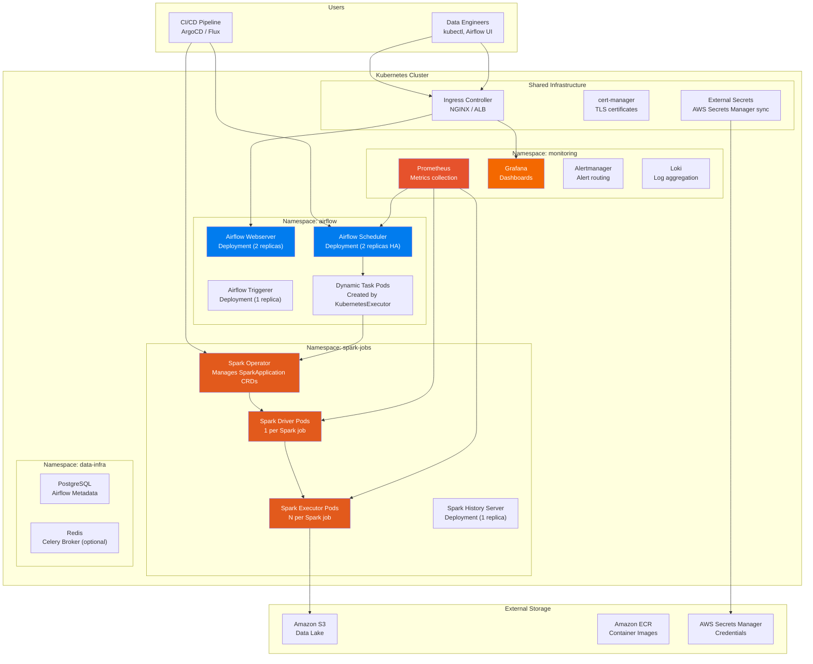

---

## ⚡ Airflow with KubernetesExecutor

### How KubernetesExecutor Works

Unlike CeleryExecutor (persistent worker pool) or LocalExecutor (single machine), the KubernetesExecutor creates a **new Pod for every task execution**. When the task completes, the Pod is destroyed.

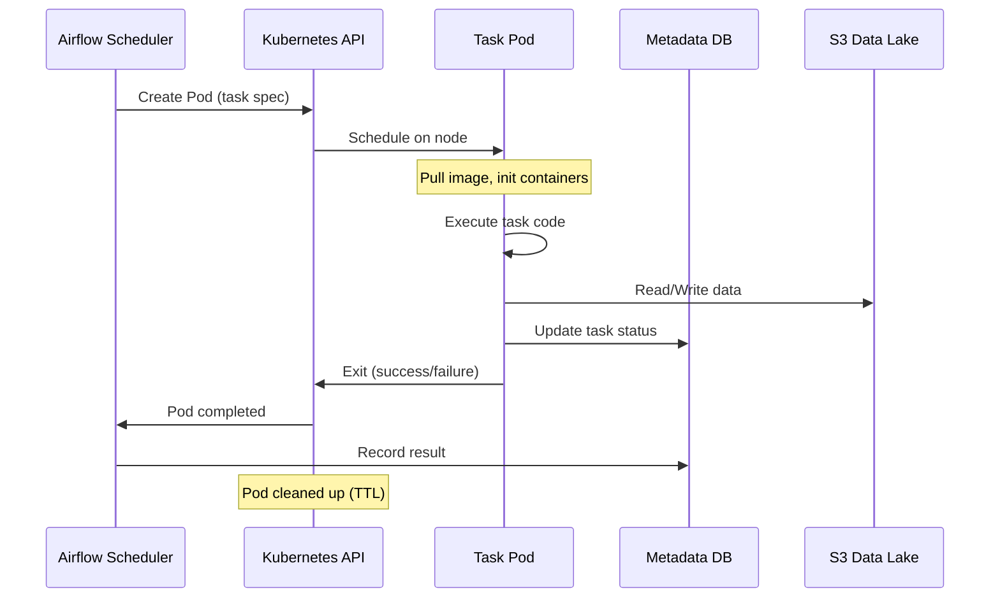

### Advantages of KubernetesExecutor

```
✅ Perfect resource isolation — each task gets its own container
✅ Custom Docker image per task — different Python versions, libraries
✅ No idle workers — Pods only exist during task execution
✅ Horizontal scaling limited only by cluster resources
✅ Failed task = only that Pod is affected, not a shared worker
✅ Different resource requests per task (CPU/memory)

❌ Cold start overhead (5-30 seconds per task for Pod creation)
❌ Not suitable for sub-minute tasks (overhead dominates)
❌ More Kubernetes API calls (can stress the API server)
❌ DAG file distribution requires shared volume or image baking
```

### Airflow Helm Values Configuration

```yaml
# values.yaml for Airflow Helm chart
# https://github.com/apache/airflow/tree/main/chart

executor: KubernetesExecutor

# Webserver configuration
webserver:
  replicas: 2
  resources:
    requests:
      cpu: "500m"
      memory: "1Gi"
    limits:
      cpu: "1000m"
      memory: "2Gi"
  service:
    type: ClusterIP
  
# Scheduler configuration (HA with 2 replicas in Airflow 2.x)
scheduler:
  replicas: 2
  resources:
    requests:
      cpu: "1000m"
      memory: "2Gi"
    limits:
      cpu: "2000m"
      memory: "4Gi"
  # Critical: how often scheduler scans for new DAGs
  env:
    - name: AIRFLOW__SCHEDULER__MIN_FILE_PROCESS_INTERVAL
      value: "30"
    - name: AIRFLOW__SCHEDULER__DAG_DIR_LIST_INTERVAL
      value: "60"

# Triggerer for async sensors (deferrable operators)
triggerer:
  replicas: 1
  resources:
    requests:
      cpu: "500m"
      memory: "512Mi"

# KubernetesExecutor Pod template
workers:
  # These are default resources for task Pods
  resources:
    requests:
      cpu: "500m"
      memory: "1Gi"
    limits:
      cpu: "2000m"
      memory: "4Gi"
  
  # Pod template configuration
  podTemplate:
    # Service account for task Pods
    serviceAccount:
      name: airflow-worker
    # Node selector for task Pods
    nodeSelector:
      workload-type: airflow-tasks
    # Tolerations for spot nodes
    tolerations:
      - key: "node.kubernetes.io/spot"
        operator: "Equal"
        value: "true"
        effect: "NoSchedule"

# DAG distribution strategy
dags:
  # Option 1: Git-sync sidecar (recommended)
  gitSync:
    enabled: true
    repo: git@github.com:company/airflow-dags.git
    branch: main
    rev: HEAD
    depth: 1
    maxFailures: 3
    subPath: "dags"
    sshKeySecret: airflow-git-ssh-key
    period: 30  # Sync every 30 seconds

# Metadata database
postgresql:
  enabled: false  # Use external PostgreSQL
data:
  metadataConnection:
    user: airflow
    pass: "${AIRFLOW_DB_PASSWORD}"
    protocol: postgresql
    host: airflow-metadata.data-infra.svc.cluster.local
    port: 5432
    db: airflow
```

### Per-Task Resource Configuration

```python
from airflow import DAG
from airflow.operators.python import PythonOperator
from airflow.providers.cncf.kubernetes.operators.pod import KubernetesPodOperator
from kubernetes.client import models as k8s
from datetime import datetime

# Method 1: Override executor_config for PythonOperator
with DAG("dynamic_resources_dag", start_date=datetime(2024, 1, 1)) as dag:
    
    # Small task — minimal resources
    light_task = PythonOperator(
        task_id="light_processing",
        python_callable=lambda: print("Light work"),
        executor_config={
            "pod_override": k8s.V1Pod(
                spec=k8s.V1PodSpec(
                    containers=[
                        k8s.V1Container(
                            name="base",
                            resources=k8s.V1ResourceRequirements(
                                requests={"cpu": "250m", "memory": "512Mi"},
                                limits={"cpu": "500m", "memory": "1Gi"},
                            ),
                        )
                    ],
                    node_selector={"workload-type": "general"},
                )
            )
        },
    )
    
    # Heavy task — GPU + lots of memory
    heavy_task = PythonOperator(
        task_id="ml_training",
        python_callable=lambda: print("Heavy ML work"),
        executor_config={
            "pod_override": k8s.V1Pod(
                spec=k8s.V1PodSpec(
                    containers=[
                        k8s.V1Container(
                            name="base",
                            resources=k8s.V1ResourceRequirements(
                                requests={"cpu": "4", "memory": "16Gi", "nvidia.com/gpu": "1"},
                                limits={"cpu": "8", "memory": "32Gi", "nvidia.com/gpu": "1"},
                            ),
                        )
                    ],
                    node_selector={"workload-type": "gpu"},
                    tolerations=[
                        k8s.V1Toleration(
                            key="nvidia.com/gpu", operator="Exists", effect="NoSchedule"
                        )
                    ],
                )
            )
        },
    )

    # Method 2: KubernetesPodOperator — full container control
    custom_image_task = KubernetesPodOperator(
        task_id="spark_submit_via_pod",
        name="spark-submit-pod",
        namespace="spark-jobs",
        image="company-ecr.amazonaws.com/spark-jobs:v2.1.0",
        cmds=["spark-submit"],
        arguments=[
            "--master", "k8s://https://kubernetes.default.svc",
            "--deploy-mode", "cluster",
            "--conf", "spark.executor.instances=10",
            "s3://artifacts/spark-jobs/process_orders.py",
        ],
        service_account_name="spark-submit-sa",
        resources=k8s.V1ResourceRequirements(
            requests={"cpu": "1", "memory": "2Gi"},
            limits={"cpu": "2", "memory": "4Gi"},
        ),
        is_delete_operator_pod=True,
        get_logs=True,
    )
    
    light_task >> heavy_task >> custom_image_task
```

---

## 🔥 Spark on Kubernetes

### Option 1: spark-submit with Kubernetes Backend

```bash
# Direct spark-submit to Kubernetes
spark-submit \
    --master k8s://https://kubernetes.default.svc:443 \
    --deploy-mode cluster \
    --name order-processing \
    --conf spark.kubernetes.namespace=spark-jobs \
    --conf spark.kubernetes.container.image=company-ecr.amazonaws.com/spark:3.5.0-custom \
    --conf spark.kubernetes.authenticate.driver.serviceAccountName=spark-driver \
    --conf spark.kubernetes.driver.request.cores=2 \
    --conf spark.kubernetes.driver.limit.cores=4 \
    --conf spark.driver.memory=4g \
    --conf spark.kubernetes.executor.request.cores=2 \
    --conf spark.kubernetes.executor.limit.cores=4 \
    --conf spark.executor.memory=8g \
    --conf spark.executor.instances=10 \
    --conf spark.kubernetes.executor.deleteOnTermination=true \
    --conf spark.hadoop.fs.s3a.impl=org.apache.hadoop.fs.s3a.S3AFileSystem \
    --conf spark.hadoop.fs.s3a.aws.credentials.provider=com.amazonaws.auth.WebIdentityTokenCredentialsProvider \
    s3://company-artifacts/spark-jobs/process_orders.py
```

### Option 2: Spark Operator (Recommended for Production)

The Spark Operator extends Kubernetes with a `SparkApplication` Custom Resource Definition (CRD).

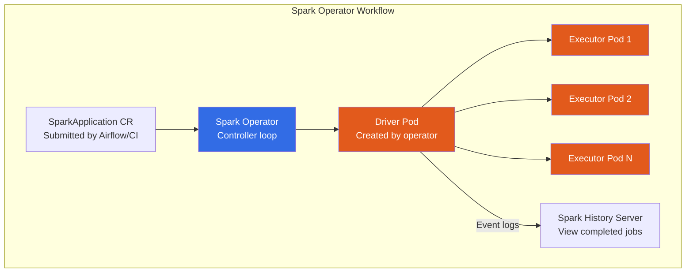

### SparkApplication Manifest

```yaml
# spark-job.yaml — SparkApplication CRD
apiVersion: sparkoperator.k8s.io/v1beta2
kind: SparkApplication
metadata:
  name: order-processing-{{ ds_nodash }}
  namespace: spark-jobs
  labels:
    app: order-processing
    team: data-platform
    environment: production
spec:
  type: Python
  pythonVersion: "3"
  mode: cluster
  image: "company-ecr.amazonaws.com/spark-jobs:v2.1.0"
  imagePullPolicy: Always
  mainApplicationFile: "s3a://company-artifacts/spark-jobs/process_orders.py"
  arguments:
    - "--date"
    - "{{ ds }}"
  
  sparkVersion: "3.5.0"
  
  sparkConf:
    # Adaptive Query Execution
    "spark.sql.adaptive.enabled": "true"
    "spark.sql.adaptive.coalescePartitions.enabled": "true"
    "spark.sql.adaptive.skewJoin.enabled": "true"
    # S3 Configuration
    "spark.hadoop.fs.s3a.impl": "org.apache.hadoop.fs.s3a.S3AFileSystem"
    "spark.hadoop.fs.s3a.aws.credentials.provider": "com.amazonaws.auth.WebIdentityTokenCredentialsProvider"
    "spark.hadoop.fs.s3a.fast.upload": "true"
    # Delta Lake / Iceberg
    "spark.sql.extensions": "io.delta.sql.DeltaSparkSessionExtension"
    "spark.sql.catalog.spark_catalog": "org.apache.spark.sql.delta.catalog.DeltaCatalog"
    # Event logging for History Server
    "spark.eventLog.enabled": "true"
    "spark.eventLog.dir": "s3a://company-spark-logs/event-logs/"
  
  restartPolicy:
    type: OnFailure
    onFailureRetries: 3
    onFailureRetryInterval: 60
    onSubmissionFailureRetries: 3
    onSubmissionFailureRetryInterval: 30
  
  driver:
    cores: 2
    coreLimit: "4"
    memory: "4g"
    labels:
      role: driver
    serviceAccount: spark-driver-sa
    nodeSelector:
      workload-type: spark-driver
    tolerations:
      - key: "spark-role"
        operator: "Equal"
        value: "driver"
        effect: "NoSchedule"
  
  executor:
    cores: 2
    coreLimit: "4"
    memory: "8g"
    memoryOverhead: "2g"
    instances: 10
    labels:
      role: executor
    nodeSelector:
      workload-type: spark-executor
    tolerations:
      - key: "node.kubernetes.io/spot"
        operator: "Equal"
        value: "true"
        effect: "NoSchedule"
  
  # Dynamic allocation (auto-scale executors)
  dynamicAllocation:
    enabled: true
    initialExecutors: 5
    minExecutors: 2
    maxExecutors: 50
  
  monitoring:
    exposeDriverMetrics: true
    exposeExecutorMetrics: true
    prometheus:
      jmxExporterJar: "/prometheus/jmx_prometheus_javaagent.jar"
      port: 8090
```

---

## 🏗️ Shared Infrastructure

### Namespace Design

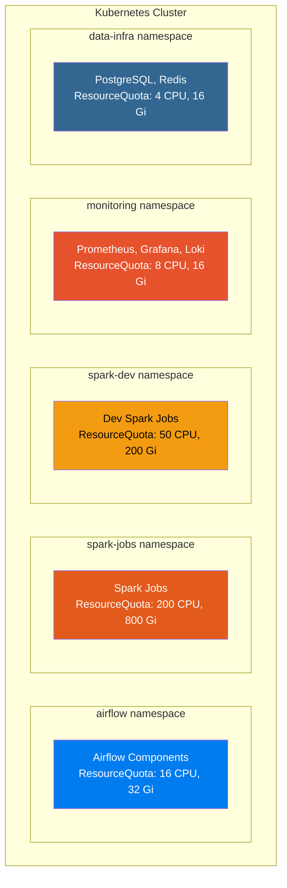

### Resource Quotas and Limit Ranges

```yaml
# namespace-config.yaml
apiVersion: v1
kind: Namespace
metadata:
  name: spark-jobs
  labels:
    team: data-platform
    environment: production
---
# Prevent runaway resource consumption
apiVersion: v1
kind: ResourceQuota
metadata:
  name: spark-jobs-quota
  namespace: spark-jobs
spec:
  hard:
    requests.cpu: "200"          # Max 200 CPU cores
    requests.memory: "800Gi"     # Max 800 GB memory
    limits.cpu: "400"
    limits.memory: "1600Gi"
    pods: "500"                  # Max 500 pods
    persistentvolumeclaims: "50"
    requests.nvidia.com/gpu: "4" # Max 4 GPUs
---
# Default resource limits for every container in the namespace
apiVersion: v1
kind: LimitRange
metadata:
  name: spark-jobs-limits
  namespace: spark-jobs
spec:
  limits:
    - type: Container
      default:           # Applied if not specified
        cpu: "2"
        memory: "4Gi"
      defaultRequest:    # Request if not specified
        cpu: "500m"
        memory: "1Gi"
      max:              # Maximum allowed
        cpu: "16"
        memory: "64Gi"
      min:              # Minimum allowed
        cpu: "100m"
        memory: "128Mi"
    - type: Pod
      max:
        cpu: "64"        # No single pod can request >64 CPU
        memory: "256Gi"  # No single pod can request >256 GB
```

---

## 💾 Storage Architecture

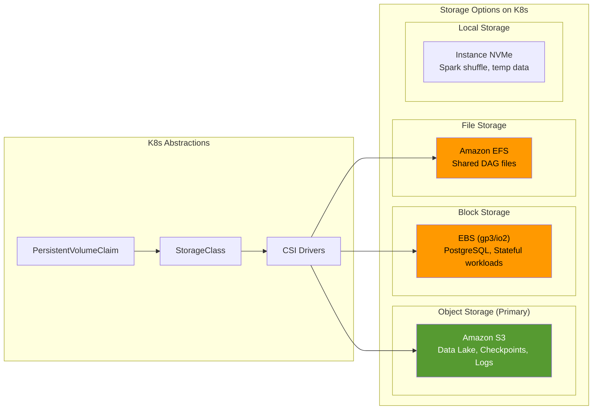

### Spark Shuffle on Local NVMe

```yaml
# StorageClass for local NVMe disks (best for Spark shuffle)
apiVersion: storage.k8s.io/v1
kind: StorageClass
metadata:
  name: local-nvme
provisioner: kubernetes.io/no-provisioner
volumeBindingMode: WaitForFirstConsumer
---
# Spark executor with local NVMe for shuffle
# In SparkApplication spec:
spec:
  executor:
    volumeMounts:
      - name: spark-local-dir
        mountPath: /tmp/spark-local
    volumes:
      - name: spark-local-dir
        hostPath:
          path: /mnt/nvme0n1
          type: Directory
    # Configure Spark to use local NVMe for shuffle
    sparkConf:
      "spark.local.dir": "/tmp/spark-local"
```

---

## 🌐 Networking Architecture

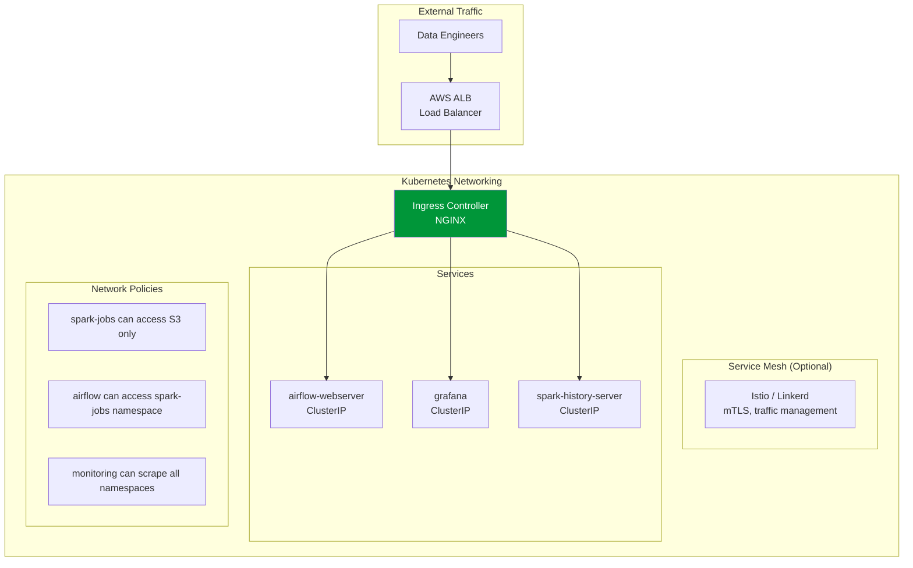

### Network Policy (Restrict Spark Executor Communication)

```yaml
apiVersion: networking.k8s.io/v1
kind: NetworkPolicy
metadata:
  name: spark-executor-policy
  namespace: spark-jobs
spec:
  podSelector:
    matchLabels:
      role: executor
  policyTypes:
    - Ingress
    - Egress
  ingress:
    # Allow traffic from Spark drivers in same namespace
    - from:
        - podSelector:
            matchLabels:
              role: driver
      ports:
        - protocol: TCP
          port: 7078  # Spark block manager
        - protocol: TCP
          port: 7079  # Spark shuffle service
  egress:
    # Allow DNS
    - to:
        - namespaceSelector: {}
      ports:
        - protocol: UDP
          port: 53
    # Allow S3 access (VPC endpoint)
    - to:
        - ipBlock:
            cidr: 10.0.0.0/16  # VPC CIDR
      ports:
        - protocol: TCP
          port: 443
    # Allow communication with drivers
    - to:
        - podSelector:
            matchLabels:
              role: driver
```

---

## 📈 Autoscaling

### Scaling Architecture

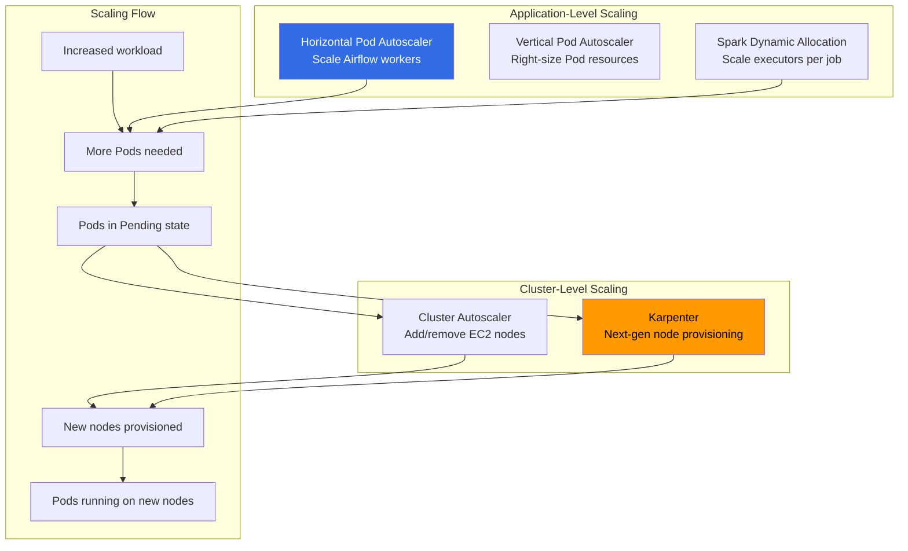

### Karpenter Configuration (Recommended over Cluster Autoscaler)

```yaml
# Karpenter NodePool for Spark workloads
apiVersion: karpenter.sh/v1beta1
kind: NodePool
metadata:
  name: spark-executors
spec:
  template:
    metadata:
      labels:
        workload-type: spark-executor
    spec:
      requirements:
        - key: "karpenter.sh/capacity-type"
          operator: In
          values: ["spot", "on-demand"]
        - key: "node.kubernetes.io/instance-type"
          operator: In
          values:
            - "m5.xlarge"
            - "m5.2xlarge"
            - "m5a.xlarge"
            - "m5a.2xlarge"
            - "m6i.xlarge"
            - "m6i.2xlarge"
            - "r5.xlarge"
            - "r5.2xlarge"
        - key: "topology.kubernetes.io/zone"
          operator: In
          values: ["us-east-1a", "us-east-1b", "us-east-1c"]
      taints:
        - key: "node.kubernetes.io/spot"
          value: "true"
          effect: "NoSchedule"
      nodeClassRef:
        name: spark-executor-class
  
  # Scale-down behavior
  disruption:
    consolidationPolicy: WhenUnderutilized
    consolidateAfter: 30s
    expireAfter: 720h  # Force rotation every 30 days
  
  # Resource limits for this pool
  limits:
    cpu: "400"        # Max 400 CPU cores in this pool
    memory: "1600Gi"  # Max 1.6 TB memory
  
  # Weight for priority (higher = preferred)
  weight: 50
---
apiVersion: karpenter.k8s.aws/v1beta1
kind: EC2NodeClass
metadata:
  name: spark-executor-class
spec:
  amiFamily: AL2
  subnetSelectorTerms:
    - tags:
        kubernetes.io/role: private
  securityGroupSelectorTerms:
    - tags:
        kubernetes.io/cluster/data-platform: owned
  instanceProfile: KarpenterNodeInstanceProfile
  blockDeviceMappings:
    - deviceName: /dev/xvda
      ebs:
        volumeSize: 100Gi
        volumeType: gp3
        iops: 3000
        throughput: 125
    # Local NVMe for Spark shuffle
    - deviceName: /dev/xvdb
      ebs:
        volumeSize: 200Gi
        volumeType: gp3
        iops: 3000
  tags:
    Team: data-platform
    Environment: production
```

### Why Karpenter Over Cluster Autoscaler

| Feature | Cluster Autoscaler | Karpenter |
|---------|-------------------|-----------|
| **Provisioning Speed** | 3-5 minutes | 30-90 seconds |
| **Instance Selection** | Fixed node groups | Dynamic, best-fit selection |
| **Spot Handling** | Basic | Advanced (fallback, diversification) |
| **Consolidation** | Basic | Intelligent (bin-packing, right-sizing) |
| **Configuration** | Multiple ASGs needed | Single NodePool with constraints |
| **Multi-AZ** | Per-ASG | Automatic across AZs |

---

## 📊 Monitoring and Observability

### Prometheus + Grafana Stack

```yaml
# Prometheus ServiceMonitor for Spark jobs
apiVersion: monitoring.coreos.com/v1
kind: ServiceMonitor
metadata:
  name: spark-metrics
  namespace: monitoring
  labels:
    release: prometheus
spec:
  namespaceSelector:
    matchNames:
      - spark-jobs
  selector:
    matchLabels:
      spark-role: driver
  endpoints:
    - port: metrics
      interval: 15s
      path: /metrics
---
# Prometheus ServiceMonitor for Airflow
apiVersion: monitoring.coreos.com/v1
kind: ServiceMonitor
metadata:
  name: airflow-metrics
  namespace: monitoring
spec:
  namespaceSelector:
    matchNames:
      - airflow
  selector:
    matchLabels:
      component: scheduler
  endpoints:
    - port: metrics
      interval: 15s
      path: /metrics
```

### Key Dashboards

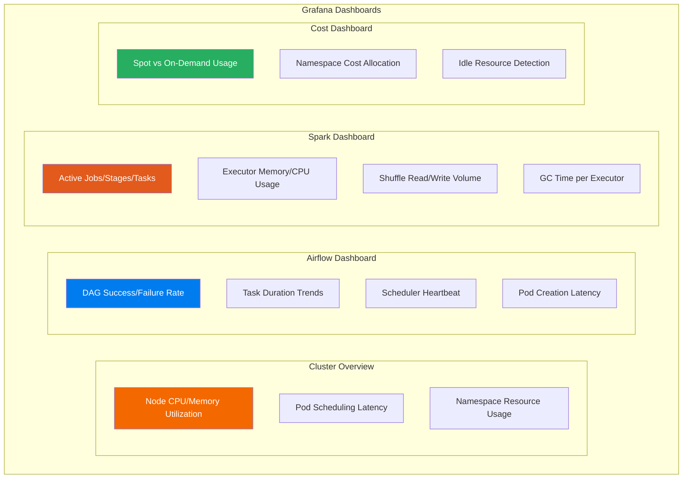

### Spark History Server on Kubernetes

```yaml
apiVersion: apps/v1
kind: Deployment
metadata:
  name: spark-history-server
  namespace: spark-jobs
spec:
  replicas: 1
  selector:
    matchLabels:
      app: spark-history-server
  template:
    metadata:
      labels:
        app: spark-history-server
    spec:
      serviceAccountName: spark-history-sa
      containers:
        - name: spark-history
          image: company-ecr.amazonaws.com/spark:3.5.0-custom
          command:
            - /opt/spark/sbin/start-history-server.sh
          env:
            - name: SPARK_HISTORY_OPTS
              value: >-
                -Dspark.history.fs.logDirectory=s3a://company-spark-logs/event-logs/
                -Dspark.history.ui.port=18080
                -Dspark.hadoop.fs.s3a.aws.credentials.provider=com.amazonaws.auth.WebIdentityTokenCredentialsProvider
                -Dspark.history.fs.cleaner.enabled=true
                -Dspark.history.fs.cleaner.interval=1d
                -Dspark.history.fs.cleaner.maxAge=30d
          ports:
            - containerPort: 18080
          resources:
            requests:
              cpu: "500m"
              memory: "2Gi"
            limits:
              cpu: "1"
              memory: "4Gi"
```

---

## 📝 Logging (EFK/PLG Stack)

### PLG Stack (Promtail + Loki + Grafana) — Recommended

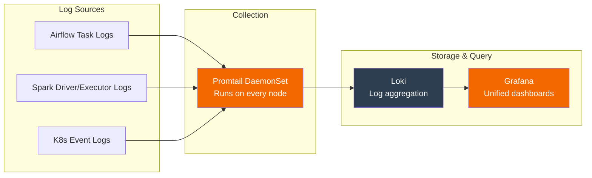

---

## 🔄 CI/CD and GitOps

### GitOps with ArgoCD

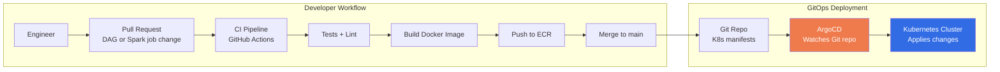

### CI Pipeline (GitHub Actions)

```yaml
# .github/workflows/data-platform-ci.yaml
name: Data Platform CI/CD

on:
  push:
    branches: [main]
    paths:
      - 'spark-jobs/**'
      - 'airflow-dags/**'
  pull_request:
    branches: [main]

jobs:
  test-spark-jobs:
    runs-on: ubuntu-latest
    steps:
      - uses: actions/checkout@v4
      
      - name: Set up Python
        uses: actions/setup-python@v5
        with:
          python-version: '3.10'
      
      - name: Install dependencies
        run: pip install -r spark-jobs/requirements-test.txt
      
      - name: Run Spark job unit tests
        run: pytest spark-jobs/tests/ -v --junitxml=results.xml
      
      - name: Lint DAG files
        run: |
          python -c "
          import ast, sys, glob
          for f in glob.glob('airflow-dags/**/*.py', recursive=True):
              try:
                  ast.parse(open(f).read())
                  print(f'✅ {f}')
              except SyntaxError as e:
                  print(f'❌ {f}: {e}')
                  sys.exit(1)
          "

  build-and-push:
    needs: test-spark-jobs
    if: github.ref == 'refs/heads/main'
    runs-on: ubuntu-latest
    steps:
      - uses: actions/checkout@v4
      
      - name: Configure AWS credentials
        uses: aws-actions/configure-aws-credentials@v4
        with:
          role-to-assume: arn:aws:iam::123456789:role/github-actions-ecr
          aws-region: us-east-1
      
      - name: Build and push Spark image
        run: |
          aws ecr get-login-password | docker login --username AWS --password-stdin \
            123456789.dkr.ecr.us-east-1.amazonaws.com
          
          docker build -t spark-jobs:${{ github.sha }} -f spark-jobs/Dockerfile .
          docker tag spark-jobs:${{ github.sha }} \
            123456789.dkr.ecr.us-east-1.amazonaws.com/spark-jobs:${{ github.sha }}
          docker push \
            123456789.dkr.ecr.us-east-1.amazonaws.com/spark-jobs:${{ github.sha }}
      
      - name: Update K8s manifests with new image tag
        run: |
          cd k8s-manifests/spark-jobs
          kustomize edit set image \
            spark-jobs=123456789.dkr.ecr.us-east-1.amazonaws.com/spark-jobs:${{ github.sha }}
          
          git config user.name "github-actions"
          git config user.email "actions@github.com"
          git add .
          git commit -m "Update spark-jobs image to ${{ github.sha }}"
          git push
```

---

## 🔒 Security

### Security Architecture

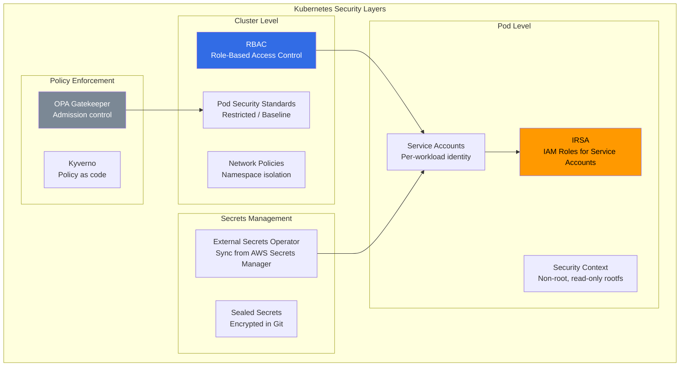

### IRSA (IAM Roles for Service Accounts)

```yaml
# Service Account with IAM Role annotation
apiVersion: v1
kind: ServiceAccount
metadata:
  name: spark-driver-sa
  namespace: spark-jobs
  annotations:
    # This links the K8s ServiceAccount to an AWS IAM Role
    eks.amazonaws.com/role-arn: arn:aws:iam::123456789:role/spark-driver-role
---
# OPA Gatekeeper constraint: require resource limits on all pods
apiVersion: constraints.gatekeeper.sh/v1beta1
kind: K8sRequiredResources
metadata:
  name: require-resource-limits
spec:
  match:
    kinds:
      - apiGroups: [""]
        kinds: ["Pod"]
    namespaces: ["spark-jobs", "airflow"]
  parameters:
    limits: ["cpu", "memory"]
    requests: ["cpu", "memory"]
---
# Pod Security Standards: enforce restricted mode
apiVersion: v1
kind: Namespace
metadata:
  name: spark-jobs
  labels:
    pod-security.kubernetes.io/enforce: restricted
    pod-security.kubernetes.io/audit: restricted
    pod-security.kubernetes.io/warn: restricted
```

---

## 💰 Cost Optimization

### Cost Allocation by Namespace

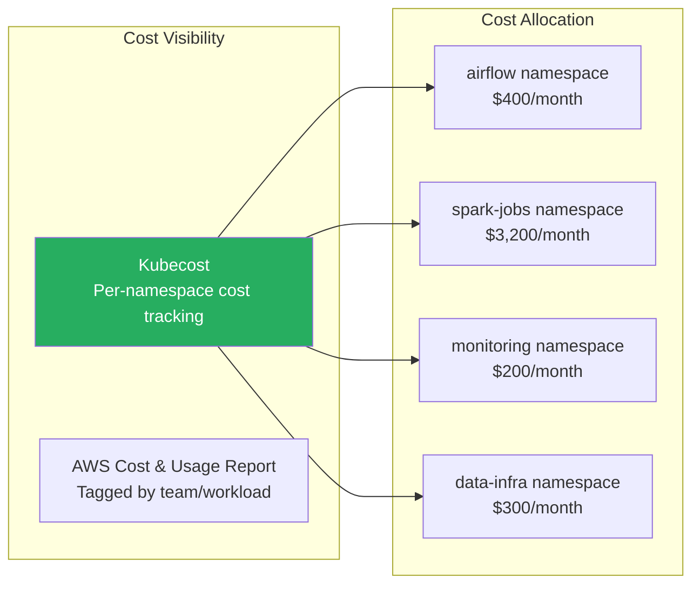

### Cost Optimization Strategies

| Strategy | Savings | Implementation |
|----------|---------|---------------|
| **Spot Instances for Executors** | 60-80% | Karpenter NodePool with spot preference |
| **Right-sizing (VPA)** | 20-40% | VPA recommendations, then enforce |
| **Namespace Budgets** | Prevention | ResourceQuota per namespace |
| **Idle Resource Cleanup** | 10-20% | TTL for completed pods, Karpenter consolidation |
| **ARM Instances (Graviton)** | 20% | Use ARM images, select Graviton instances |
| **Reserved Capacity** | 30-60% | Savings Plans for baseline compute |

### Monthly Cost Example

| Component | Configuration | Monthly Cost |
|-----------|--------------|-------------|
| **EKS Control Plane** | 1 cluster | $73 |
| **Worker Nodes (On-Demand)** | 5x m5.2xlarge (baseline) | $1,200 |
| **Worker Nodes (Spot)** | 10x m5.xlarge (burst, avg 50% utilization) | $300 |
| **EBS Storage** | 500 GB gp3 (PVCs) | $40 |
| **ALB Ingress** | 1 ALB + data processing | $30 |
| **ECR** | 50 GB images | $5 |
| **S3** | Data lake (50 TB) | $600 |
| **CloudWatch** | Logs + metrics | $100 |
| **Kubecost** | Free tier or $150/month | $0-150 |
| **Total** | | **~$2,350-2,500/month** |

---

## 🌍 Multi-Cluster Considerations

### When to Go Multi-Cluster

```
Single Cluster: (Start here)
✅ Simpler operations
✅ Namespace isolation is sufficient
✅ <500 nodes, <5000 pods
✅ Single region, single team ownership

Multi-Cluster: (Evolve to this)
📍 Multi-region DR requirements
📍 >500 nodes or approaching K8s API server limits
📍 Regulatory requirements (data residency)
📍 Complete blast-radius isolation between environments
📍 Different SLAs for different workloads
```

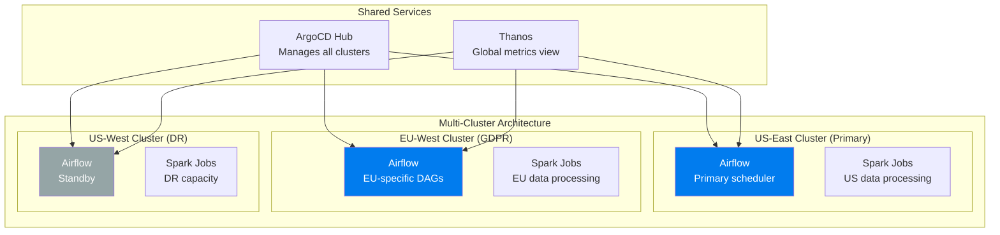

---

## 💥 Failure Scenarios and Recovery

### Scenario 1: Node Failure During Spark Job

```
Impact: Executors on the failed node are lost
Behavior:
  - Kubernetes detects node NotReady (40s default)
  - Pods on failed node are rescheduled
  - Karpenter provisions replacement node (30-90s)
  - Spark detects executor loss, reschedules tasks
  - Lost shuffle data must be recomputed

Prevention:
  - Spread executors across nodes (pod anti-affinity)
  - Use dynamic allocation (Spark replaces executors automatically)
  - Checkpoint long-running streaming jobs frequently

Recovery:
  - Automatic: Spark reschedules failed tasks
  - If driver dies: Spark Operator restarts per restartPolicy
  - Karpenter provisions new nodes for pending pods
```

### Scenario 2: Airflow Scheduler Pod Crash

```
Impact: No new tasks are scheduled until recovery
Behavior:
  - K8s detects Pod failure, restarts it (restartPolicy: Always)
  - Running tasks continue (they're independent Pods)
  - Scheduler recovers state from metadata DB on restart
  - ~30-60 seconds of scheduling gap

Prevention:
  - Run 2 scheduler replicas (HA mode, Airflow 2.x)
  - Liveness probes detect stuck schedulers
  - Readiness probes prevent traffic to unhealthy schedulers

Recovery:
  - Automatic: K8s restarts the pod
  - If PV issue: PVC re-attachment may take 1-2 minutes
  - Verify metadata DB connectivity on restart
```

### Scenario 3: Cluster Autoscaler / Karpenter Can't Scale

```
Impact: Pods stuck in Pending state, jobs don't run
Root Cause:
  - AWS capacity limitations (specific instance type unavailable)
  - IAM permission issues for node provisioning
  - VPC subnet IP address exhaustion

Prevention:
  - Configure multiple instance types in Karpenter NodePool
  - Use multiple AZs for capacity diversification
  - Monitor subnet IP availability
  - Set up CloudWatch alarm for pending pods

Recovery:
  1. Check pending pods: kubectl get pods --field-selector=status.phase=Pending
  2. Check Karpenter logs: kubectl logs -n karpenter -l app.kubernetes.io/name=karpenter
  3. If capacity issue: add more instance types to NodePool
  4. If IP exhaustion: use VPC CNI prefix delegation or add subnets
```

---

## 🎤 Interview Deep-Dive

### Frequently Asked Questions

**Q: Why use KubernetesExecutor instead of CeleryExecutor?**

> KubernetesExecutor creates a new Pod for each task, giving perfect resource isolation — each task gets its own CPU, memory, and can even use a different Docker image. CeleryExecutor uses a persistent worker pool, which is more efficient for high-throughput, short-duration tasks but provides no isolation. In a multi-tenant environment where different teams run different types of tasks (some need 512 MB, some need 32 GB), KubernetesExecutor is superior. The trade-off is cold start latency (5-30 seconds per task) — for sub-minute tasks, CeleryExecutor is still better.

**Q: How does the Spark Operator compare to spark-submit on K8s?**

> The Spark Operator is a Kubernetes controller that manages SparkApplication CRDs. It provides: (1) declarative job management (YAML instead of CLI), (2) automatic retry with configurable policies, (3) Prometheus metrics integration, (4) scheduled applications (cron-like), and (5) RBAC-integrated lifecycle management. Direct spark-submit works but requires manual retry logic, doesn't integrate with K8s observability tools, and is harder to manage at scale. For production, always use the Spark Operator.

**Q: How do you handle Spot Instance interruptions for Spark executors?**

> Spot interruptions are handled at multiple levels. At the Kubernetes level: Karpenter detects the 2-minute interruption notice and cordons the node, triggering pod rescheduling. At the Spark level: Dynamic allocation detects lost executors and requests replacements. Lost shuffle data is recomputed from the parent RDD. At the application level: checkpointing (for streaming) ensures exactly-once processing survives interruptions. The key design principle: never run Spark drivers on Spot — only executors, which are stateless and replaceable.

**Q: How do you right-size Spark executor resources on Kubernetes?**

> Start with the "5 cores, 8 GB" rule of thumb per executor, then tune. Use Spark UI metrics to check: (1) GC time — if >10% of task time, increase memory. (2) Spill to disk — indicates insufficient memory for shuffle/aggregation. (3) CPU utilization — if consistently <50%, reduce cores. In Kubernetes, the VPA (Vertical Pod Autoscaler) can provide recommendations based on actual usage. For production, I set resource requests at the P50 observed usage and limits at P95, with Spark's dynamic allocation handling burst needs by adding/removing executors.

**Q: How do you manage secrets for Spark jobs on Kubernetes?**

> Never put secrets in SparkApplication manifests or environment variables visible in pod specs. Use: (1) IRSA (IAM Roles for Service Accounts) — the Spark driver's service account is mapped to an IAM role, and AWS SDK automatically fetches credentials via the OIDC provider. No secrets stored anywhere. (2) External Secrets Operator — syncs secrets from AWS Secrets Manager to Kubernetes Secrets, which are mounted as volumes. (3) For database credentials: use IAM authentication (RDS IAM auth) or rotate credentials via External Secrets. The principle: ephemeral, automatically rotated credentials with no human access to raw secrets.

---

**[← Back to Enterprise Architecture](../README.md#-enterprise-architecture)**
