# 🏗️ Enterprise Architecture: Airflow + Spark + S3 Data Lake

> **The data lake is the gravity well of modern data platforms — everything flows toward it. Get the architecture right, and your platform scales to petabytes. Get it wrong, and you build a data swamp.**

---

## 📋 Table of Contents

- [Why This Architecture Matters](#-why-this-architecture-matters)
- [High-Level Architecture](#-high-level-architecture)
- [The Medallion Architecture (Bronze/Silver/Gold)](#-the-medallion-architecture-bronzesilvergold)
- [S3 as the Storage Layer](#-s3-as-the-storage-layer)
- [File Formats and Partitioning](#-file-formats-and-partitioning)
- [Data Catalog: AWS Glue / Hive Metastore](#-data-catalog-aws-glue--hive-metastore)
- [Schema Evolution](#-schema-evolution)
- [Data Quality Framework](#-data-quality-framework)
- [Delta Lake / Apache Iceberg Integration](#-delta-lake--apache-iceberg-integration)
- [CDC Patterns](#-cdc-patterns)
- [Slowly Changing Dimensions (SCD)](#-slowly-changing-dimensions-scd)
- [Airflow Orchestration Patterns](#-airflow-orchestration-patterns)
- [Monitoring and Observability](#-monitoring-and-observability)
- [Failure Scenarios and Recovery](#-failure-scenarios-and-recovery)
- [Security Architecture](#-security-architecture)
- [Cost Optimization](#-cost-optimization)
- [Interview Deep-Dive](#-interview-deep-dive)

---

## 🎯 Why This Architecture Matters

Every Fortune 500 company runs some variant of this architecture. The combination of S3 (cheap, durable, infinite storage), Spark (powerful distributed compute), and Airflow (battle-tested orchestration) is the backbone of modern data platforms.

**Real-world scale this architecture handles:**
- **Netflix:** 1.5 PB of new data ingested daily into S3
- **Uber:** 100+ PB data lake with thousands of Spark jobs
- **Airbnb:** 1.5 PB of data processed daily through Airflow-orchestrated Spark pipelines

The architecture you'll learn here is not theoretical. It's what gets built when a VP of Engineering says: *"We need a data platform that can grow with us for the next 5 years."*

---

## 🏛️ High-Level Architecture

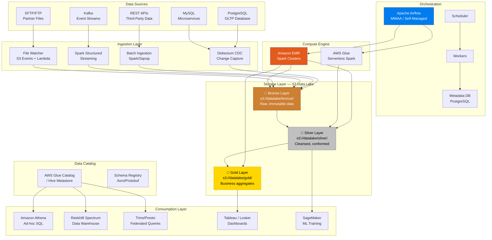

---

## 🏅 The Medallion Architecture (Bronze/Silver/Gold)

This is the most important pattern in data lake design. Think of it as an assembly line for data — raw materials enter, refined products exit.

### Why Three Layers?

The single biggest mistake teams make is dumping everything into one layer. Without clear separation:
- You can't reprocess data when your transformation logic changes
- Debugging is a nightmare — was it bad source data or bad transformation?
- Consumers see partially processed, inconsistent data
- You lose the ability to audit what changed and when

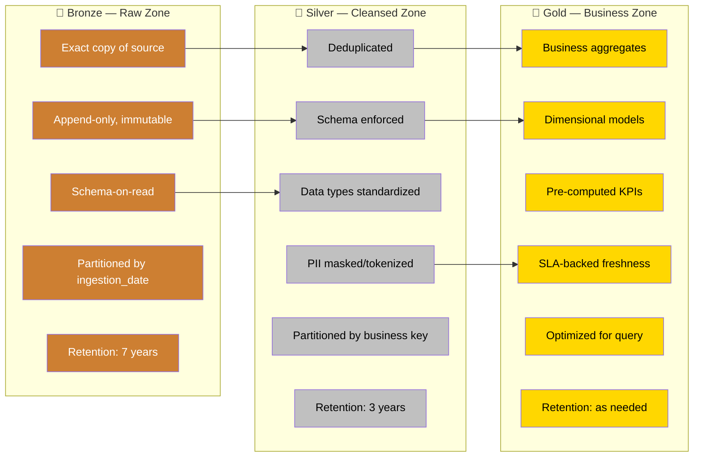

### Bronze Layer Implementation

```python
# Bronze layer ingestion — preserving raw data exactly as received
from pyspark.sql import SparkSession
from pyspark.sql.functions import lit, current_timestamp
from datetime import datetime

def ingest_to_bronze(
    spark: SparkSession,
    source_path: str,
    bronze_path: str,
    source_system: str,
    source_format: str = "json"
) -> int:
    """
    Ingest raw data into the Bronze layer.
    
    Key principles:
    1. Never modify the source data
    2. Add metadata columns for lineage
    3. Partition by ingestion date for cost-effective querying
    4. Use append mode — Bronze is immutable
    """
    ingestion_date = datetime.now().strftime("%Y-%m-%d")
    ingestion_ts = datetime.now().isoformat()
    
    # Read raw data — schema-on-read, no enforcement
    raw_df = spark.read.format(source_format).load(source_path)
    
    # Add metadata columns — critical for lineage and debugging
    enriched_df = (
        raw_df
        .withColumn("_bronze_ingestion_ts", current_timestamp())
        .withColumn("_bronze_source_system", lit(source_system))
        .withColumn("_bronze_source_file", lit(source_path))
        .withColumn("_bronze_ingestion_date", lit(ingestion_date))
    )
    
    # Write as Parquet, partitioned by ingestion date
    (
        enriched_df
        .write
        .mode("append")
        .partitionBy("_bronze_ingestion_date")
        .parquet(f"{bronze_path}/{source_system}/")
    )
    
    record_count = enriched_df.count()
    print(f"✅ Ingested {record_count:,} records to Bronze for {source_system}")
    return record_count
```

### Silver Layer Implementation

```python
from pyspark.sql import SparkSession, DataFrame
from pyspark.sql.functions import (
    col, when, sha2, concat_ws, row_number, trim, lower, to_timestamp
)
from pyspark.sql.window import Window
from pyspark.sql.types import StructType, StructField, StringType, TimestampType, LongType

# Define enforced schema for Silver layer
ORDERS_SILVER_SCHEMA = StructType([
    StructField("order_id", LongType(), nullable=False),
    StructField("customer_id", LongType(), nullable=False),
    StructField("order_date", TimestampType(), nullable=False),
    StructField("total_amount", LongType(), nullable=False),  # Store cents, not dollars
    StructField("status", StringType(), nullable=False),
    StructField("email", StringType(), nullable=True),
])

def bronze_to_silver(
    spark: SparkSession,
    bronze_path: str,
    silver_path: str,
    processing_date: str
) -> DataFrame:
    """
    Transform Bronze data to Silver layer.
    
    Transformations applied:
    1. Schema enforcement — reject records that don't conform
    2. Deduplication — keep latest record per business key
    3. Data type standardization — consistent formats
    4. PII handling — hash/mask sensitive fields
    5. Null handling — apply business defaults
    """
    # Read from Bronze for the specific processing date
    bronze_df = (
        spark.read.parquet(f"{bronze_path}/orders/")
        .filter(col("_bronze_ingestion_date") == processing_date)
    )
    
    # Step 1: Data type standardization
    standardized_df = (
        bronze_df
        .withColumn("order_id", col("order_id").cast("long"))
        .withColumn("customer_id", col("customer_id").cast("long"))
        .withColumn("order_date", to_timestamp(col("order_date")))
        .withColumn("total_amount", (col("total_amount") * 100).cast("long"))
        .withColumn("status", trim(lower(col("status"))))
        .withColumn("email", trim(lower(col("email"))))
    )
    
    # Step 2: Deduplication — keep the latest record per order_id
    dedup_window = Window.partitionBy("order_id").orderBy(
        col("_bronze_ingestion_ts").desc()
    )
    deduped_df = (
        standardized_df
        .withColumn("_row_num", row_number().over(dedup_window))
        .filter(col("_row_num") == 1)
        .drop("_row_num")
    )
    
    # Step 3: PII masking — hash email addresses
    masked_df = deduped_df.withColumn(
        "email_hash",
        sha2(col("email"), 256)
    ).drop("email")
    
    # Step 4: Null handling with business defaults
    cleaned_df = masked_df.withColumn(
        "status",
        when(col("status").isNull(), "unknown").otherwise(col("status"))
    )
    
    # Step 5: Data quality — reject bad records
    valid_df = cleaned_df.filter(
        col("order_id").isNotNull() &
        col("customer_id").isNotNull() &
        col("order_date").isNotNull() &
        (col("total_amount") >= 0)
    )
    
    quarantine_df = cleaned_df.subtract(valid_df)
    
    # Write quarantined records for investigation
    if quarantine_df.count() > 0:
        quarantine_df.write.mode("append").parquet(
            f"{silver_path}/_quarantine/orders/"
        )
    
    # Write to Silver layer — use overwrite for idempotency
    (
        valid_df
        .drop("_bronze_ingestion_ts", "_bronze_source_system",
              "_bronze_source_file", "_bronze_ingestion_date")
        .write
        .mode("overwrite")
        .partitionBy("status")
        .parquet(f"{silver_path}/orders/")
    )
    
    return valid_df


def silver_to_gold(
    spark: SparkSession,
    silver_path: str,
    gold_path: str
) -> DataFrame:
    """
    Create Gold layer business aggregates.
    These are the tables that power dashboards and KPI reports.
    """
    orders = spark.read.parquet(f"{silver_path}/orders/")
    customers = spark.read.parquet(f"{silver_path}/customers/")
    
    # Gold aggregate: Daily revenue by customer segment
    daily_revenue = (
        orders
        .join(customers, "customer_id")
        .groupBy("order_date", "customer_segment")
        .agg(
            {"total_amount": "sum", "order_id": "count"}
        )
        .withColumnRenamed("sum(total_amount)", "total_revenue_cents")
        .withColumnRenamed("count(order_id)", "order_count")
    )
    
    daily_revenue.write.mode("overwrite").partitionBy("order_date").parquet(
        f"{gold_path}/daily_revenue_by_segment/"
    )
    
    return daily_revenue
```

---

## 🗄️ S3 as the Storage Layer

### S3 Path Convention (Critical for Maintainability)

```
s3://company-datalake-{env}/
├── bronze/
│   ├── {source_system}/
│   │   ├── {table_name}/
│   │   │   ├── _bronze_ingestion_date=2024-01-15/
│   │   │   │   ├── part-00000-{uuid}.snappy.parquet
│   │   │   │   └── part-00001-{uuid}.snappy.parquet
│   │   │   └── _bronze_ingestion_date=2024-01-16/
│   │   │       └── ...
├── silver/
│   ├── {domain}/
│   │   ├── {entity}/
│   │   │   ├── status=completed/
│   │   │   │   └── part-00000-{uuid}.snappy.parquet
│   │   │   └── status=pending/
│   │   │       └── ...
│   │   └── _quarantine/
│   │       └── {entity}/
├── gold/
│   ├── {business_domain}/
│   │   ├── {aggregate_name}/
│   │   │   └── order_date=2024-01-15/
│   │   │       └── ...
└── _metadata/
    ├── schemas/
    ├── data_quality_reports/
    └── lineage/
```

### S3 Performance Optimization

```python
# S3 performance tuning for Spark
spark.conf.set("spark.hadoop.fs.s3a.connection.maximum", "200")
spark.conf.set("spark.hadoop.fs.s3a.fast.upload", "true")
spark.conf.set("spark.hadoop.fs.s3a.fast.upload.buffer", "bytebuffer")
spark.conf.set("spark.hadoop.fs.s3a.multipart.size", "104857600")  # 100 MB parts

# S3 committer — critical for avoiding partial writes
spark.conf.set("spark.hadoop.fs.s3a.committer.name", "magic")
spark.conf.set("spark.hadoop.fs.s3a.committer.magic.enabled", "true")
spark.conf.set("spark.sql.sources.commitProtocolClass",
    "org.apache.spark.internal.io.cloud.PathOutputCommitProtocol")
spark.conf.set("spark.sql.parquet.output.committer.class",
    "org.apache.spark.internal.io.cloud.BindingParquetOutputCommitter")
```

> **Why the S3A Committer matters:** Without it, Spark uses a rename-based commit protocol. S3 rename is actually a copy + delete — with large datasets, this can take hours and leave partial data visible to readers.

---

## 📦 File Formats and Partitioning

### File Format Comparison

| Feature | Parquet | ORC | Avro | JSON | CSV |
|---------|---------|-----|------|------|-----|
| **Columnar** | ✅ | ✅ | ❌ | ❌ | ❌ |
| **Compression** | Excellent | Excellent | Good | Poor | Poor |
| **Schema Evolution** | Good | Good | Excellent | N/A | N/A |
| **Spark Optimizations** | Predicate pushdown, column pruning | Predicate pushdown | Full row reads | Full row reads | Full row reads |
| **Read Performance** | ⭐⭐⭐⭐⭐ | ⭐⭐⭐⭐ | ⭐⭐⭐ | ⭐⭐ | ⭐ |
| **Write Performance** | ⭐⭐⭐⭐ | ⭐⭐⭐⭐ | ⭐⭐⭐⭐⭐ | ⭐⭐⭐⭐ | ⭐⭐⭐⭐⭐ |
| **Human Readable** | ❌ | ❌ | ❌ | ✅ | ✅ |
| **Use in Data Lake** | Silver/Gold | Hive ecosystem | Bronze/Streaming | Bronze only | Avoid |

### Partitioning Strategy

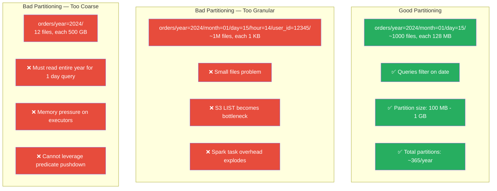

### File Compaction (Solving the Small Files Problem)

```python
def compact_small_files(
    spark: SparkSession,
    input_path: str,
    output_path: str,
    target_file_size_mb: int = 128,
    partition_cols: list = None
):
    """
    Compact small files into optimally-sized files.
    Run this as a scheduled Airflow task on your Bronze/Silver layers.
    
    Target: Each output file should be ~128 MB (one HDFS block).
    """
    df = spark.read.parquet(input_path)
    
    # Calculate optimal number of output files
    total_size_bytes = sum(
        f.length for f in spark._jvm.org.apache.hadoop.fs.FileSystem
        .get(spark._jsc.hadoopConfiguration())
        .listStatus(spark._jvm.org.apache.hadoop.fs.Path(input_path))
    )
    target_file_count = max(1, total_size_bytes // (target_file_size_mb * 1024 * 1024))
    
    writer = df.coalesce(int(target_file_count)).write.mode("overwrite")
    
    if partition_cols:
        writer = writer.partitionBy(*partition_cols)
    
    writer.parquet(output_path)
    print(f"✅ Compacted to ~{target_file_count} files at {output_path}")
```

---

## 📚 Data Catalog: AWS Glue / Hive Metastore

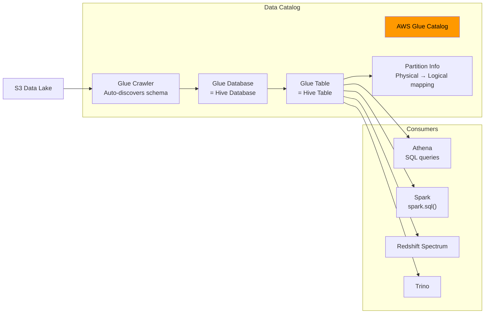

### Registering Tables Programmatically

```python
import boto3

def register_table_in_glue(
    database_name: str,
    table_name: str,
    s3_location: str,
    columns: list,
    partition_keys: list
):
    """Register a table in AWS Glue Catalog for cross-engine querying."""
    glue_client = boto3.client('glue')
    
    column_defs = [
        {"Name": col_name, "Type": col_type}
        for col_name, col_type in columns
    ]
    
    partition_defs = [
        {"Name": pk_name, "Type": pk_type}
        for pk_name, pk_type in partition_keys
    ]
    
    try:
        glue_client.create_table(
            DatabaseName=database_name,
            TableInput={
                "Name": table_name,
                "StorageDescriptor": {
                    "Columns": column_defs,
                    "Location": s3_location,
                    "InputFormat": "org.apache.hadoop.hive.ql.io.parquet.MapredParquetInputFormat",
                    "OutputFormat": "org.apache.hadoop.hive.ql.io.parquet.MapredParquetOutputFormat",
                    "SerdeInfo": {
                        "SerializationLibrary": "org.apache.hadoop.hive.ql.io.parquet.serde.ParquetHiveSerDe"
                    }
                },
                "PartitionKeys": partition_defs,
                "TableType": "EXTERNAL_TABLE",
            }
        )
        print(f"✅ Table {database_name}.{table_name} registered in Glue Catalog")
    except glue_client.exceptions.AlreadyExistsException:
        print(f"⚠️ Table {database_name}.{table_name} already exists, updating...")
        glue_client.update_table(
            DatabaseName=database_name,
            TableInput={"Name": table_name, "StorageDescriptor": {
                "Columns": column_defs, "Location": s3_location,
                "InputFormat": "org.apache.hadoop.hive.ql.io.parquet.MapredParquetInputFormat",
                "OutputFormat": "org.apache.hadoop.hive.ql.io.parquet.MapredParquetOutputFormat",
                "SerdeInfo": {"SerializationLibrary": "org.apache.hadoop.hive.ql.io.parquet.serde.ParquetHiveSerDe"}
            }, "PartitionKeys": partition_defs, "TableType": "EXTERNAL_TABLE"}
        )
```

---

## 🔄 Schema Evolution

Schema evolution is inevitable. Sources change, business requirements evolve, and your data lake must handle it gracefully.

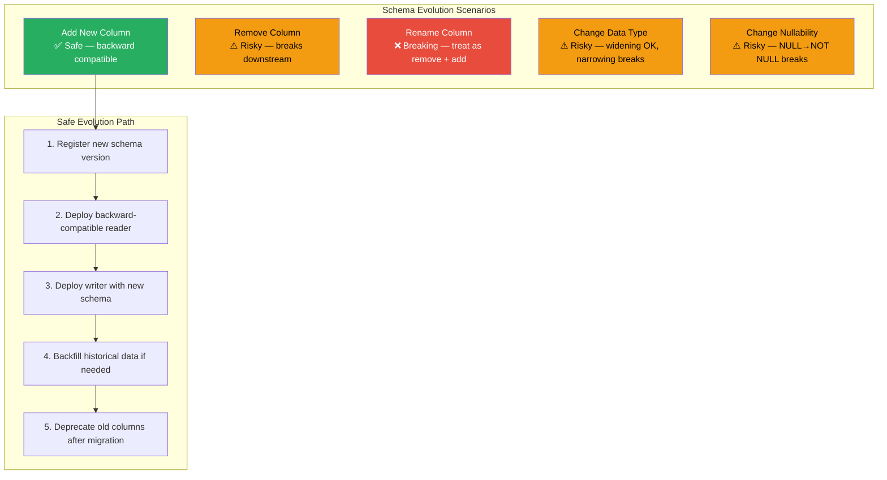

### Handling Schema Evolution in Spark

```python
def read_with_schema_evolution(spark: SparkSession, path: str) -> DataFrame:
    """
    Read Parquet data with schema evolution support.
    Parquet handles column addition natively — new columns get NULL for old rows.
    """
    return (
        spark.read
        .option("mergeSchema", "true")  # Merge schemas across files
        .parquet(path)
    )

def write_with_schema_evolution(df: DataFrame, path: str):
    """Write with schema merge enabled for evolution."""
    (
        df.write
        .mode("append")
        .option("mergeSchema", "true")
        .parquet(path)
    )
```

---

## ✅ Data Quality Framework

Data quality is not optional — it's the difference between a data lake and a data swamp.

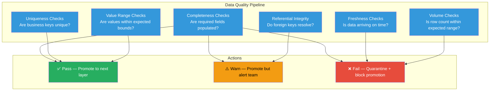

### Great Expectations Integration

```python
import great_expectations as gx

def validate_silver_orders(spark: SparkSession, silver_path: str) -> dict:
    """
    Run data quality checks on Silver layer orders.
    Returns validation results with pass/fail/warning status.
    """
    context = gx.get_context()
    
    # Define expectations for the orders table
    suite = context.add_or_update_expectation_suite("orders_silver_quality")
    
    df = spark.read.parquet(f"{silver_path}/orders/")
    batch = context.sources.pandas_default.read_dataframe(df.toPandas())
    
    validator = context.get_validator(batch=batch, expectation_suite=suite)
    
    # Completeness: required fields must not be null
    validator.expect_column_values_to_not_be_null("order_id")
    validator.expect_column_values_to_not_be_null("customer_id")
    validator.expect_column_values_to_not_be_null("order_date")
    
    # Uniqueness: order_id must be unique
    validator.expect_column_values_to_be_unique("order_id")
    
    # Value ranges: total_amount must be non-negative
    validator.expect_column_values_to_be_between(
        "total_amount", min_value=0, max_value=100_000_00  # Max $100K in cents
    )
    
    # Allowed values: status must be from known set
    validator.expect_column_values_to_be_in_set(
        "status", ["pending", "completed", "cancelled", "refunded", "unknown"]
    )
    
    # Volume check: expect reasonable row count
    validator.expect_table_row_count_to_be_between(
        min_value=1000, max_value=10_000_000
    )
    
    results = validator.validate()
    return results


# Custom PySpark-native quality checks (no external dependencies)
class DataQualityChecker:
    """Lightweight, PySpark-native data quality framework."""
    
    def __init__(self, df: DataFrame, table_name: str):
        self.df = df
        self.table_name = table_name
        self.results = []
    
    def check_not_null(self, column: str, threshold: float = 0.0):
        """Check that null percentage is below threshold."""
        total = self.df.count()
        null_count = self.df.filter(col(column).isNull()).count()
        null_pct = null_count / total if total > 0 else 0
        
        passed = null_pct <= threshold
        self.results.append({
            "check": f"not_null_{column}",
            "passed": passed,
            "detail": f"Null %: {null_pct:.2%} (threshold: {threshold:.2%})"
        })
        return self
    
    def check_unique(self, column: str):
        """Check that column values are unique."""
        total = self.df.count()
        distinct = self.df.select(column).distinct().count()
        
        passed = total == distinct
        self.results.append({
            "check": f"unique_{column}",
            "passed": passed,
            "detail": f"Total: {total:,}, Distinct: {distinct:,}, Dupes: {total - distinct:,}"
        })
        return self
    
    def check_row_count(self, min_rows: int, max_rows: int):
        """Check that row count is within expected range."""
        total = self.df.count()
        passed = min_rows <= total <= max_rows
        self.results.append({
            "check": "row_count_range",
            "passed": passed,
            "detail": f"Count: {total:,} (expected: {min_rows:,} - {max_rows:,})"
        })
        return self
    
    def validate(self) -> dict:
        """Run all checks and return summary."""
        all_passed = all(r["passed"] for r in self.results)
        failed_checks = [r for r in self.results if not r["passed"]]
        
        summary = {
            "table": self.table_name,
            "all_passed": all_passed,
            "total_checks": len(self.results),
            "passed_checks": len(self.results) - len(failed_checks),
            "failed_checks": failed_checks,
            "details": self.results
        }
        
        if not all_passed:
            print(f"❌ Data quality FAILED for {self.table_name}:")
            for check in failed_checks:
                print(f"   ⛔ {check['check']}: {check['detail']}")
        else:
            print(f"✅ All {len(self.results)} quality checks passed for {self.table_name}")
        
        return summary
```

---

## 🧊 Delta Lake / Apache Iceberg Integration

Table formats solve the fundamental limitations of raw Parquet files on S3.

| Feature | Raw Parquet | Delta Lake | Apache Iceberg |
|---------|-------------|------------|----------------|
| **ACID Transactions** | ❌ | ✅ | ✅ |
| **Time Travel** | ❌ | ✅ | ✅ |
| **Schema Evolution** | Basic | Full | Full |
| **Partition Evolution** | ❌ (Must rewrite) | ❌ | ✅ (Hidden partitioning) |
| **MERGE/UPSERT** | ❌ | ✅ | ✅ |
| **Concurrent Writers** | ❌ | ✅ (Optimistic) | ✅ (Optimistic) |
| **Small File Compaction** | Manual | OPTIMIZE command | Built-in |
| **Vendor Lock-in** | None | Databricks ecosystem | None |
| **Engine Compatibility** | All | Spark, Trino, Flink | Spark, Trino, Flink, Hive |

### Delta Lake Example

```python
from delta.tables import DeltaTable

# Write Bronze data as Delta table
def bronze_to_delta(spark: SparkSession, raw_path: str, delta_path: str):
    """Write Bronze layer as Delta table for ACID guarantees."""
    raw_df = spark.read.json(raw_path)
    (
        raw_df.write
        .format("delta")
        .mode("append")
        .partitionBy("ingestion_date")
        .save(delta_path)
    )

# MERGE / UPSERT pattern with Delta Lake
def upsert_silver_orders(spark: SparkSession, new_data: DataFrame, silver_path: str):
    """
    UPSERT pattern: Insert new records, update existing ones.
    This is the killer feature of Delta Lake for data lakes.
    """
    silver_table = DeltaTable.forPath(spark, silver_path)
    
    (
        silver_table.alias("target")
        .merge(
            new_data.alias("source"),
            "target.order_id = source.order_id"
        )
        .whenMatchedUpdateAll()   # Update existing records
        .whenNotMatchedInsertAll() # Insert new records
        .execute()
    )

# Time travel — query historical versions
def query_historical_data(spark: SparkSession, delta_path: str, version: int):
    """Query data as it existed at a specific version."""
    return (
        spark.read
        .format("delta")
        .option("versionAsOf", version)
        .load(delta_path)
    )
```

### Apache Iceberg Example

```python
# Create Iceberg table with hidden partitioning
spark.sql("""
    CREATE TABLE catalog.silver.orders (
        order_id BIGINT,
        customer_id BIGINT,
        order_date TIMESTAMP,
        total_amount BIGINT,
        status STRING
    )
    USING iceberg
    PARTITIONED BY (days(order_date))
""")

# Partition evolution — no data rewrite needed!
spark.sql("""
    ALTER TABLE catalog.silver.orders
    ADD PARTITION FIELD months(order_date)
""")

# Snapshot expiration — manage storage costs
spark.sql("""
    CALL catalog.system.expire_snapshots(
        table => 'silver.orders',
        older_than => TIMESTAMP '2024-01-01 00:00:00',
        retain_last => 10
    )
""")
```

---

## 🔄 CDC Patterns

Change Data Capture (CDC) is how you keep your data lake in sync with source databases without expensive full loads.

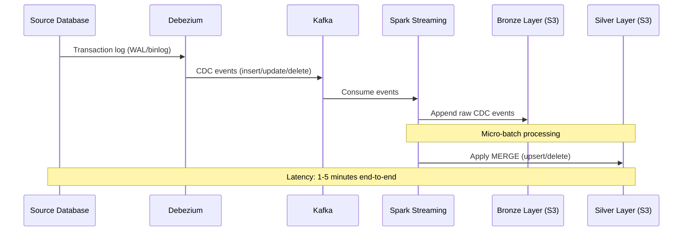

### CDC Processing with Spark

```python
def process_cdc_events(spark: SparkSession, bronze_path: str, silver_path: str):
    """
    Process CDC events from Bronze to Silver layer.
    CDC events have an 'op' field: 'c' (create), 'u' (update), 'd' (delete)
    """
    # Read CDC events from Bronze
    cdc_df = spark.read.parquet(f"{bronze_path}/cdc_events/orders/")
    
    # Separate by operation type
    inserts_updates = cdc_df.filter(col("op").isin("c", "u"))
    deletes = cdc_df.filter(col("op") == "d")
    
    # Get latest state per record (last-writer-wins)
    window = Window.partitionBy("order_id").orderBy(col("ts_ms").desc())
    latest_state = (
        inserts_updates
        .withColumn("rn", row_number().over(window))
        .filter(col("rn") == 1)
        .drop("rn", "op", "ts_ms")
    )
    
    # Apply to Silver using Delta Lake MERGE
    silver_table = DeltaTable.forPath(spark, f"{silver_path}/orders/")
    
    (
        silver_table.alias("target")
        .merge(latest_state.alias("source"), "target.order_id = source.order_id")
        .whenMatchedUpdateAll()
        .whenNotMatchedInsertAll()
        .execute()
    )
    
    # Handle deletes
    if deletes.count() > 0:
        delete_ids = deletes.select("order_id").distinct()
        (
            silver_table.alias("target")
            .merge(delete_ids.alias("source"), "target.order_id = source.order_id")
            .whenMatchedDelete()
            .execute()
        )
```

---

## 🕐 Slowly Changing Dimensions (SCD)

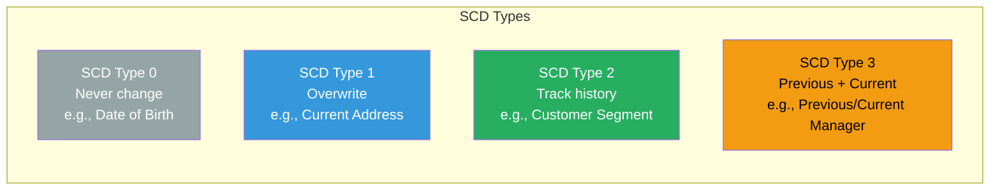

### SCD Type 2 Implementation

```python
from pyspark.sql.functions import (
    col, lit, current_timestamp, when, coalesce, max as spark_max
)

def apply_scd_type_2(
    spark: SparkSession,
    current_dim: DataFrame,
    incoming_data: DataFrame,
    key_columns: list,
    tracked_columns: list
):
    """
    Implement SCD Type 2 — maintain full history of dimension changes.
    
    This is the most commonly asked implementation in interviews
    and the most commonly needed in production.
    """
    join_condition = " AND ".join(
        [f"curr.{k} = inc.{k}" for k in key_columns]
    )
    
    change_condition = " OR ".join(
        [f"curr.{c} != inc.{c}" for c in tracked_columns]
    )
    
    # Find records that changed
    changed = (
        current_dim.alias("curr")
        .join(incoming_data.alias("inc"), 
              [col(f"curr.{k}") == col(f"inc.{k}") for k in key_columns])
        .filter(col("curr.is_current") == True)
        .filter(
            # At least one tracked column changed
            reduce(
                lambda a, b: a | b,
                [col(f"curr.{c}") != col(f"inc.{c}") for c in tracked_columns]
            )
        )
    )
    
    now = current_timestamp()
    
    # Close out old records (set end_date, is_current = False)
    expired_records = (
        changed
        .select([col(f"curr.{c}") for c in current_dim.columns])
        .withColumn("end_date", now)
        .withColumn("is_current", lit(False))
    )
    
    # Create new current records
    new_records = (
        changed
        .select([col(f"inc.{c}") for c in incoming_data.columns])
        .withColumn("start_date", now)
        .withColumn("end_date", lit(None).cast("timestamp"))
        .withColumn("is_current", lit(True))
    )
    
    # Unchanged records stay as-is
    unchanged = (
        current_dim
        .join(
            changed.select([col(f"curr.{k}").alias(k) for k in key_columns]),
            key_columns,
            "left_anti"
        )
    )
    
    # New records (not in current dimension)
    truly_new = (
        incoming_data
        .join(current_dim.filter(col("is_current")), key_columns, "left_anti")
        .withColumn("start_date", now)
        .withColumn("end_date", lit(None).cast("timestamp"))
        .withColumn("is_current", lit(True))
    )
    
    result = unchanged.union(expired_records).union(new_records).union(truly_new)
    return result
```

---

## 🎼 Airflow Orchestration Patterns

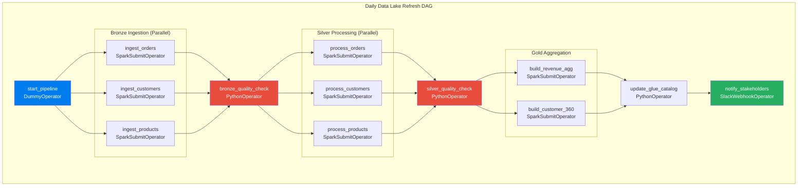

### Production DAG Implementation

```python
from airflow import DAG
from airflow.operators.dummy import DummyOperator
from airflow.providers.amazon.aws.operators.emr import EmrAddStepsOperator
from airflow.providers.amazon.aws.sensors.emr import EmrStepSensor
from airflow.operators.python import PythonOperator, BranchPythonOperator
from airflow.utils.dates import days_ago
from datetime import timedelta
import json

default_args = {
    "owner": "data-platform",
    "depends_on_past": True,        # Don't run if yesterday failed
    "email_on_failure": True,
    "email": ["data-oncall@company.com"],
    "retries": 2,
    "retry_delay": timedelta(minutes=10),
    "execution_timeout": timedelta(hours=4),
    "sla": timedelta(hours=6),       # Alert if not done by 6 AM
}

with DAG(
    dag_id="datalake_daily_refresh",
    default_args=default_args,
    description="Daily Bronze → Silver → Gold pipeline",
    schedule_interval="0 0 * * *",   # Midnight UTC
    start_date=days_ago(1),
    catchup=False,
    max_active_runs=1,               # Prevent parallel runs
    tags=["datalake", "production", "daily"],
) as dag:
    
    start = DummyOperator(task_id="start_pipeline")
    
    # Bronze ingestion as EMR steps
    bronze_orders_step = {
        "Name": "bronze_ingest_orders",
        "ActionOnFailure": "CONTINUE",
        "HadoopJarStep": {
            "Jar": "command-runner.jar",
            "Args": [
                "spark-submit",
                "--deploy-mode", "cluster",
                "--driver-memory", "4g",
                "--executor-memory", "8g",
                "--num-executors", "10",
                "s3://company-artifacts/spark-jobs/bronze_ingestion.py",
                "--source", "orders",
                "--date", "{{ ds }}",
            ]
        }
    }
    
    ingest_orders = EmrAddStepsOperator(
        task_id="ingest_orders_to_bronze",
        job_flow_id="{{ var.value.emr_cluster_id }}",
        steps=[bronze_orders_step],
    )
    
    wait_for_orders = EmrStepSensor(
        task_id="wait_for_orders_ingestion",
        job_flow_id="{{ var.value.emr_cluster_id }}",
        step_id="{{ task_instance.xcom_pull(task_ids='ingest_orders_to_bronze')[0] }}",
        poke_interval=60,
        timeout=3600,
    )
    
    def check_data_quality(**context):
        """Run data quality checks and decide whether to proceed."""
        # Implementation calls DataQualityChecker class
        results = run_quality_checks(context["ds"])
        if not results["all_passed"]:
            raise ValueError(f"Data quality failed: {results['failed_checks']}")
    
    quality_gate = PythonOperator(
        task_id="bronze_quality_gate",
        python_callable=check_data_quality,
    )
    
    start >> ingest_orders >> wait_for_orders >> quality_gate
```

---

## 📊 Monitoring and Observability

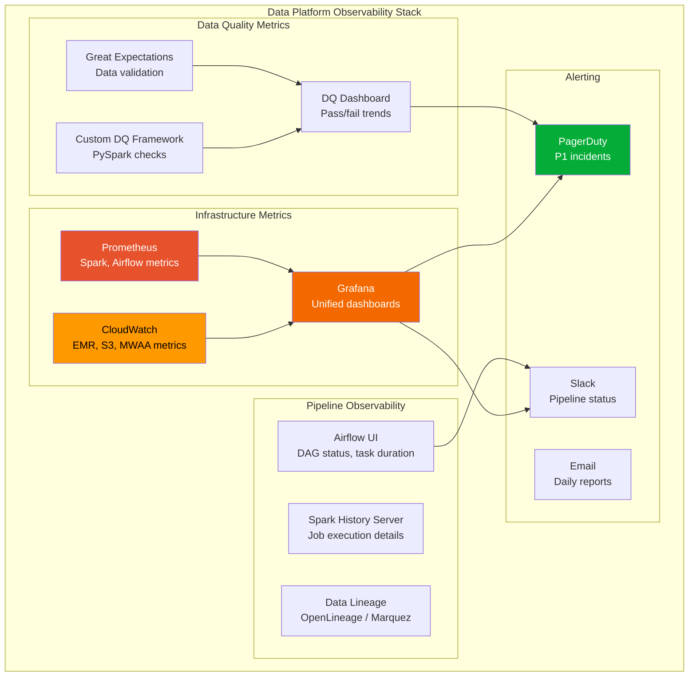

### Key Metrics to Track

| Metric | Source | Alert Threshold | Why It Matters |
|--------|--------|----------------|----------------|
| **DAG Run Duration** | Airflow | >2x historical avg | Pipeline degradation |
| **Task Failure Rate** | Airflow | >5% of tasks | Systemic issues |
| **Spark Job Duration** | Spark History Server | >2x baseline | Data growth / inefficiency |
| **S3 Request Rate** | CloudWatch | >5000 GET/s per prefix | S3 throttling imminent |
| **Bronze Record Count** | Custom | <80% or >120% of expected | Missing/duplicate data |
| **Silver DQ Pass Rate** | Great Expectations | <99% | Data quality regression |
| **Data Freshness** | Custom | >SLA threshold | Stale data in Gold |
| **EMR Cluster Cost** | CloudWatch | >$X/day | Cost overrun |
| **Executor OOM Events** | Spark | Any occurrence | Memory tuning needed |
| **Scheduler Heartbeat** | Airflow | Missing for >60s | Scheduler down |

---

## 💥 Failure Scenarios and Recovery

### Scenario 1: S3 Throttling (503 Slow Down)

```
Root Cause: S3 throttles at 5,500 GET/s and 3,500 PUT/s per PREFIX
Symptoms: Spark jobs slow down dramatically, random task failures

Prevention:
1. Distribute data across multiple S3 prefixes (use hash-based prefixing)
2. Avoid listing operations — use manifest files or catalog
3. Set up S3 request metrics alarm in CloudWatch

Recovery:
1. Spark retries handle transient 503s (default 20 retries)
2. If persistent: redistribute data across prefixes
3. Contact AWS for prefix-level throughput increase
```

### Scenario 2: Spark Out of Memory (OOM)

```
Root Cause: Data skew, broadcast joins with large tables, excessive caching
Symptoms: ExecutorLostFailure, Container killed by YARN for exceeding memory limits

Prevention:
1. Monitor data skew before it hits production
2. Set spark.sql.adaptive.enabled=true (AQE)
3. Configure spark.memory.fraction appropriately

Recovery:
1. Increase executor memory: --executor-memory 16g
2. Add more executors: --num-executors 20
3. Fix data skew: salting, repartitioning
4. Use disk-based shuffle: spark.shuffle.spill=true
```

### Scenario 3: Airflow Scheduler Lag

```
Root Cause: Too many DAGs, expensive DAG parsing, metadata DB overloaded
Symptoms: DAGs not being scheduled on time, tasks stuck in "queued" state

Prevention:
1. Limit DAG complexity (max 200 tasks per DAG)
2. Set min_file_process_interval=60 (reduce scheduler load)
3. Use separate databases for metadata
4. Enable dag_dir_list_interval=300 for large DAG counts

Recovery:
1. Restart scheduler (it recovers state from metadata DB)
2. Check metadata DB connection pool exhaustion
3. Scale horizontally with multiple schedulers (Airflow 2.x)
```

### Scenario 4: Partial Write Failure

```
Root Cause: Spark job fails mid-write, leaving partial data in S3
Symptoms: Downstream queries return incorrect results (duplicates or missing data)

Prevention:
1. Use Delta Lake or Iceberg (ACID transactions)
2. Use S3A Magic Committer
3. Write to staging path, then atomic "rename" (swap catalog pointers)
4. Implement idempotent writes (overwrite partitions, not append)

Recovery:
1. With Delta Lake: automatic rollback on failure
2. Without: delete partial output, re-run from Bronze
3. Use Airflow's idempotent design — re-running a task should produce same result
```

---

## 🔒 Security Architecture

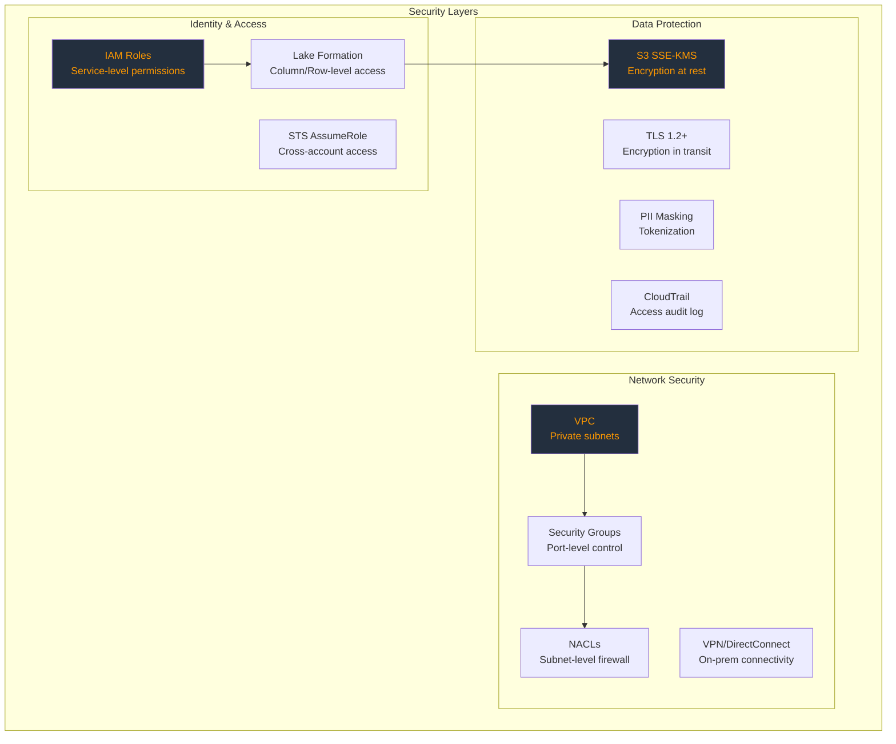

### IAM Policy: Least-Privilege for Spark Jobs

```json
{
    "Version": "2012-10-17",
    "Statement": [
        {
            "Sid": "ReadBronze",
            "Effect": "Allow",
            "Action": ["s3:GetObject", "s3:ListBucket"],
            "Resource": [
                "arn:aws:s3:::company-datalake-prod/bronze/*",
                "arn:aws:s3:::company-datalake-prod"
            ],
            "Condition": {
                "StringLike": {"s3:prefix": ["bronze/*"]}
            }
        },
        {
            "Sid": "WriteSilver",
            "Effect": "Allow",
            "Action": ["s3:PutObject", "s3:GetObject", "s3:ListBucket", "s3:DeleteObject"],
            "Resource": [
                "arn:aws:s3:::company-datalake-prod/silver/*",
                "arn:aws:s3:::company-datalake-prod"
            ],
            "Condition": {
                "StringLike": {"s3:prefix": ["silver/*"]}
            }
        },
        {
            "Sid": "GlueCatalogAccess",
            "Effect": "Allow",
            "Action": ["glue:GetTable", "glue:GetPartitions", "glue:UpdateTable"],
            "Resource": [
                "arn:aws:glue:us-east-1:123456789012:catalog",
                "arn:aws:glue:us-east-1:123456789012:database/datalake_silver",
                "arn:aws:glue:us-east-1:123456789012:table/datalake_silver/*"
            ]
        }
    ]
}
```

---

## 💰 Cost Optimization

### S3 Storage Cost Breakdown

| Storage Class | Cost/GB/Month | Use Case in Data Lake |
|---------------|---------------|----------------------|
| **S3 Standard** | $0.023 | Gold layer (frequent access) |
| **S3 Intelligent-Tiering** | $0.023-0.0125 | Silver layer (variable access) |
| **S3 Infrequent Access** | $0.0125 | Bronze layer (>30 days old) |
| **S3 Glacier Instant** | $0.004 | Bronze archival (>90 days) |
| **S3 Glacier Deep Archive** | $0.00099 | Compliance archives (>1 year) |

### S3 Lifecycle Policy

```json
{
    "Rules": [
        {
            "ID": "BronzeLifecycle",
            "Filter": {"Prefix": "bronze/"},
            "Status": "Enabled",
            "Transitions": [
                {"Days": 30, "StorageClass": "STANDARD_IA"},
                {"Days": 90, "StorageClass": "GLACIER_IR"},
                {"Days": 365, "StorageClass": "DEEP_ARCHIVE"}
            ]
        },
        {
            "ID": "SilverLifecycle",
            "Filter": {"Prefix": "silver/"},
            "Status": "Enabled",
            "Transitions": [
                {"Days": 90, "StorageClass": "STANDARD_IA"},
                {"Days": 365, "StorageClass": "GLACIER_IR"}
            ]
        },
        {
            "ID": "GoldNoTransition",
            "Filter": {"Prefix": "gold/"},
            "Status": "Enabled",
            "NoncurrentVersionExpiration": {"NoncurrentDays": 30}
        }
    ]
}
```

### Compute Cost Optimization

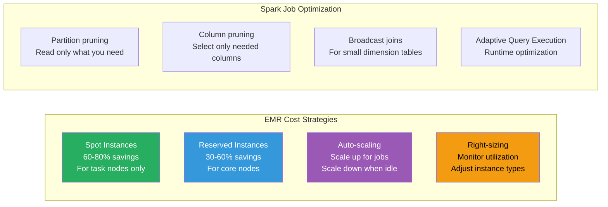

### Monthly Cost Example (10 TB Data Lake)

| Component | Configuration | Monthly Cost |
|-----------|--------------|-------------|
| **S3 Storage** | 10 TB across tiers | ~$150 |
| **S3 Requests** | ~50M requests/month | ~$25 |
| **EMR Core** (3x r5.2xlarge) | Reserved, 24/7 | ~$800 |
| **EMR Task** (10x m5.xlarge) | Spot, 8 hrs/day | ~$200 |
| **MWAA** | Medium environment | ~$350 |
| **Glue Catalog** | 100 tables, 50K partitions | ~$5 |
| **Athena** | 5 TB scanned/month | ~$25 |
| **CloudWatch** | Metrics + Logs | ~$50 |
| **Data Transfer** | Inter-AZ, same region | ~$100 |
| **Total** | | **~$1,705/month** |

---

## 🎤 Interview Deep-Dive

### Frequently Asked Questions

**Q: Why use a Medallion architecture instead of a single layer?**

> The Medallion architecture provides separation of concerns. Bronze gives you raw data replay capability (if transformation logic changes, you re-process from Bronze). Silver gives you a consistent, clean dataset that multiple teams can build on. Gold gives consumers pre-computed, SLA-backed datasets they can trust. Without this separation, debugging is impossible — you can't tell if bad data came from the source or your transformation.

**Q: How do you handle late-arriving data?**

> Late-arriving data is managed through watermarking in the Silver layer. We partition Bronze by ingestion date (when we received it) and Silver by event date (when it happened). When late data arrives, Bronze just appends it (it doesn't care). The Silver processing job uses a window of "look-back" — processing not just today's Bronze data, but also the last 3 days, and performing UPSERT into Silver. With Delta Lake, the MERGE operation handles this atomically.

**Q: How do you prevent data quality issues from propagating?**

> We implement quality gates at each layer transition. The Airflow DAG has BranchPythonOperators that run DataQualityChecker after each layer's processing. If quality checks fail, the pipeline halts, quarantines bad records, and sends alerts. Critically, we never delete from Bronze — bad data can always be investigated. The quality framework checks completeness, uniqueness, referential integrity, value ranges, and volume anomalies.

**Q: What's the difference between Delta Lake and Apache Iceberg?**

> Both solve the same problem (ACID transactions, time travel, schema evolution on data lakes), but they differ in key areas. Delta Lake is tightly coupled with the Databricks ecosystem and uses a transaction log (_delta_log). Iceberg was designed engine-agnostic from the start, supports hidden partitioning (you can change partition schemes without rewriting data), and has broader engine support (Spark, Trino, Flink, Hive). In practice, use Delta Lake if you're in Databricks, Iceberg if you need multi-engine support.

**Q: How do you handle S3 throttling at scale?**

> S3 throttles at 5,500 GET/s and 3,500 PUT/s per prefix. We mitigate this by: (1) distributing data across multiple prefixes using hash-based naming, (2) avoiding S3 LIST operations by using the Glue Catalog for partition discovery, (3) using the S3A magic committer which reduces PUT operations during Spark writes, and (4) monitoring S3 request rates in CloudWatch and alerting before we hit limits.

**Q: How do you design partitioning for a table that gets queried by multiple dimensions?**

> You can only physically partition by one set of columns. Choose the most common query filter as your partition key (usually date). For other dimensions, use Parquet's built-in column statistics and predicate pushdown — a well-written Parquet file can skip row groups that don't match your filter even without partitioning. With Iceberg, you can also use hidden partitioning and partition evolution to change strategies over time without rewriting data.

---

**[← Back to Enterprise Architecture](../README.md#-enterprise-architecture)**
