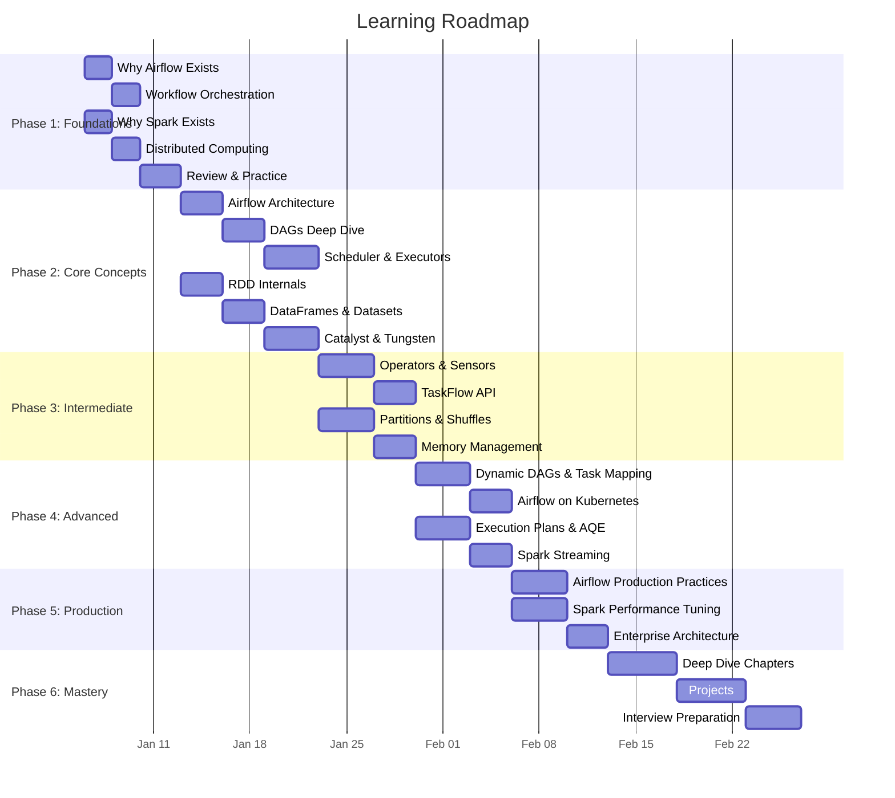
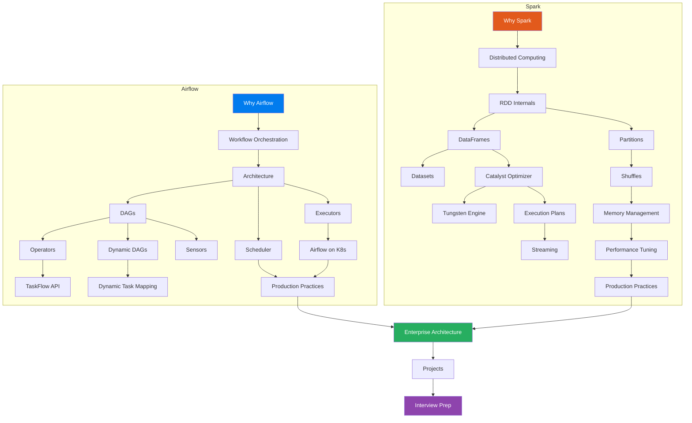

# 🗺️ Learning Roadmap — Apache Airflow & Apache Spark

> **A structured, week-by-week guide to mastering distributed data systems.**

This roadmap is designed for a software engineer with 6+ years of experience who wants to deeply understand Airflow and Spark — not just skim the surface. Each week builds on the previous one.

---

## 📅 12-Week Mastery Plan



---

## 📋 Phase 1: Foundations (Week 1-2)

**Goal:** Understand *why* these tools exist and what problems they solve.

> 💡 **Don't skip this phase.** Engineers who skip straight to code end up with fragile mental models. Understanding the "why" makes everything else 10x easier.

### Week 1: The "Why"

| Day | Airflow Track | Spark Track |
|-----|--------------|-------------|
| Mon | [01 - Why Airflow Exists](airflow/01-why-airflow-exists.md) | [01 - Why Spark Exists](spark/01-why-spark-exists.md) |
| Tue | [02 - Workflow Orchestration](airflow/02-workflow-orchestration.md) | [02 - Distributed Computing](spark/02-distributed-computing.md) |
| Wed | Review & take notes | Review & take notes |
| Thu | Re-read with focus on diagrams | Re-read with focus on diagrams |
| Fri | Write your own analogies | Write your own analogies |

### ✅ Phase 1 Checkpoint

Before moving on, you should be able to:

- [ ] Explain why cron jobs fail at orchestration without looking at notes
- [ ] Draw Airflow's basic architecture from memory
- [ ] Explain why MapReduce was slow and what Spark changed
- [ ] Describe the difference between data parallelism and task parallelism
- [ ] Name 3 real-world use cases for each tool

---

## 📋 Phase 2: Core Concepts (Week 3-4)

**Goal:** Understand the core abstractions and architecture of both systems.

### Week 3: Architecture Deep-Dive

| Day | Airflow Track | Spark Track |
|-----|--------------|-------------|
| Mon | [03 - Airflow Architecture](airflow/03-airflow-architecture.md) | [03 - RDD Internals](spark/03-rdd-internals.md) |
| Tue | Continue Architecture | Continue RDD |
| Wed | [04 - DAGs](airflow/04-dags.md) | [04 - DataFrames](spark/04-dataframes.md) |
| Thu | Continue DAGs | [05 - Datasets](spark/05-datasets.md) |
| Fri | Review & practice coding | Review & practice coding |

### Week 4: The Engine Room

| Day | Airflow Track | Spark Track |
|-----|--------------|-------------|
| Mon | [05 - Scheduler](airflow/05-scheduler.md) | [06 - Catalyst Optimizer](spark/06-catalyst-optimizer.md) |
| Tue | Continue Scheduler | Continue Catalyst |
| Wed | [06 - Executors](airflow/06-executors.md) | [07 - Tungsten Engine](spark/07-tungsten-engine.md) |
| Thu | Continue Executors | Continue Tungsten |
| Fri | Build a simple DAG | Write Spark queries and examine plans |

### ✅ Phase 2 Checkpoint

- [ ] Draw Airflow's scheduler loop from memory
- [ ] Explain the difference between LocalExecutor, CeleryExecutor, and KubernetesExecutor
- [ ] Explain why DataFrames are faster than RDDs
- [ ] Describe how Catalyst transforms a query plan
- [ ] Explain what Tungsten does differently with memory

---

## 📋 Phase 3: Intermediate Concepts (Week 5-6)

**Goal:** Master the operational components and understand data movement.

### Week 5: Working with Airflow & Spark Data Movement

| Day | Airflow Track | Spark Track |
|-----|--------------|-------------|
| Mon | [07 - Operators](airflow/07-operators.md) | [08 - Partitions](spark/08-partitions.md) |
| Tue | Continue Operators | Continue Partitions |
| Wed | [08 - Sensors](airflow/08-sensors.md) | [09 - Shuffles](spark/09-shuffles.md) |
| Thu | Continue Sensors | Continue Shuffles |
| Fri | Build DAG with multiple operators | Analyze shuffle behavior in Spark UI |

### Week 6: Modern APIs & Memory

| Day | Airflow Track | Spark Track |
|-----|--------------|-------------|
| Mon | [09 - TaskFlow API](airflow/09-taskflow-api.md) | [10 - Memory Management](spark/10-memory-management.md) |
| Tue | Continue TaskFlow | Continue Memory |
| Wed | Practice TaskFlow patterns | [11 - Spark Execution Plan](spark/11-spark-execution-plan.md) |
| Thu | Review all Airflow concepts | Continue Execution Plans |
| Fri | Code challenge: build 3 DAGs | Code challenge: optimize a slow query |

### ✅ Phase 3 Checkpoint

- [ ] Know when to use BashOperator vs PythonOperator vs KubernetesPodOperator
- [ ] Explain how sensors work internally (poke vs reschedule mode)
- [ ] Write a TaskFlow DAG with XCom passing
- [ ] Explain what causes a shuffle and how to minimize them
- [ ] Read a Spark execution plan and identify bottlenecks
- [ ] Explain Spark's unified memory model

---

## 📋 Phase 4: Advanced Topics (Week 7-8)

**Goal:** Master advanced features that separate senior engineers from everyone else.

### Week 7: Dynamic & Scalable Patterns

| Day | Airflow Track | Spark Track |
|-----|--------------|-------------|
| Mon | [10 - Dynamic DAGs](airflow/10-dynamic-dags.md) | [12 - Spark Streaming](spark/12-spark-streaming.md) |
| Tue | Continue Dynamic DAGs | Continue Streaming |
| Wed | [11 - Dynamic Task Mapping](airflow/11-dynamic-task-mapping.md) | Continue Streaming |
| Thu | Continue Dynamic Task Mapping | Practice Structured Streaming |
| Fri | Build a dynamic pipeline | Build a streaming pipeline |

### Week 8: Kubernetes & Performance

| Day | Airflow Track | Spark Track |
|-----|--------------|-------------|
| Mon | [13 - Airflow on Kubernetes](airflow/13-airflow-on-kubernetes.md) | [13 - Spark Performance Tuning](spark/13-spark-performance-tuning.md) |
| Tue | Continue K8s | Continue Performance |
| Wed | Continue K8s | Continue Performance |
| Thu | Practice K8s deployment | Practice optimization techniques |
| Fri | Review all advanced concepts | Review all advanced concepts |

### ✅ Phase 4 Checkpoint

- [ ] Generate DAGs dynamically from configuration
- [ ] Use dynamic task mapping with expand()
- [ ] Explain how KubernetesExecutor manages pod lifecycle
- [ ] Build a Structured Streaming pipeline with watermarks
- [ ] Apply at least 5 performance tuning techniques to a Spark job
- [ ] Explain AQE and how it optimizes at runtime

---

## 📋 Phase 5: Production Engineering (Week 9-10)

**Goal:** Learn how to run these systems in production at scale.

### Week 9: Production Best Practices

| Day | Airflow Track | Spark Track |
|-----|--------------|-------------|
| Mon | [12 - Production Best Practices](airflow/12-production-best-practices.md) | [14 - Production Best Practices](spark/14-production-best-practices.md) |
| Tue | Continue Production | Continue Production |
| Wed | Continue Production | Continue Production |
| Thu | [Airflow Cheatsheet](airflow/airflow-cheatsheet.md) | [Spark Cheatsheet](spark/spark-cheatsheet.md) |
| Fri | Review & consolidate notes | Review & consolidate notes |

### Week 10: Enterprise Architecture

| Day | Topic |
|-----|-------|
| Mon | [Airflow + Spark + S3 Data Lake](enterprise-architecture/airflow-spark-s3-datalake.md) |
| Tue | [Airflow + Spark + Kafka](enterprise-architecture/airflow-spark-kafka.md) |
| Wed | [Airflow + Spark + AWS](enterprise-architecture/airflow-spark-aws.md) |
| Thu | [Airflow + Spark + Kubernetes](enterprise-architecture/airflow-spark-kubernetes.md) |
| Fri | Compare all architectures, make decision matrices |

### ✅ Phase 5 Checkpoint

- [ ] Design a monitoring strategy for Airflow + Spark
- [ ] Explain CI/CD for DAGs and Spark jobs
- [ ] Draw an enterprise data platform architecture from memory
- [ ] Handle 5 common production failure scenarios
- [ ] Estimate costs for a given architecture on AWS

---

## 📋 Phase 6: Mastery & Interview Prep (Week 11-12)

**Goal:** Deep mastery and interview readiness.

### Week 11: Deep Dives

| Day | Topic |
|-----|-------|
| Mon | [Airflow Scheduler Internals](deep-dives/airflow-scheduler-internals.md) |
| Tue | [Spark Job Execution Internals](deep-dives/spark-job-execution-internals.md) |
| Wed | [Data Skew Deep Dive](deep-dives/data-skew-deep-dive.md) + [Spark Memory Deep Dive](deep-dives/spark-memory-deep-dive.md) |
| Thu | [Catalyst Deep Dive](deep-dives/catalyst-optimizer-deep-dive.md) + [Shuffle Deep Dive](deep-dives/spark-shuffle-deep-dive.md) |
| Fri | [Airflow Metadata DB](deep-dives/airflow-metadata-db-deep-dive.md) + [Airflow Scaling](deep-dives/airflow-scaling-deep-dive.md) |

### Week 12: Projects & Interview Prep

| Day | Topic |
|-----|-------|
| Mon | [Project 1: Batch Pipeline](projects/project-1-batch-pipeline.md) |
| Tue | [Project 2: Airflow + Spark Pipeline](projects/project-2-airflow-spark-pipeline.md) |
| Wed | [Project 3: Real-Time Streaming](projects/project-3-real-time-streaming.md) |
| Thu | [Project 4: Enterprise Data Platform](projects/project-4-enterprise-data-platform.md) |
| Fri | [Airflow Interview Guide](airflow/14-airflow-interview-guide.md) + [Spark Interview Guide](spark/15-spark-interview-guide.md) |

### ✅ Phase 6 Checkpoint

- [ ] Complete all 4 projects
- [ ] Answer 50 Airflow interview questions without notes
- [ ] Answer 50 Spark interview questions without notes
- [ ] Design a complete data platform in a 45-minute mock interview
- [ ] Debug a production incident scenario (OOM, data skew, scheduler lag)
- [ ] Explain any concept to a junior engineer using analogies

---

## 🎯 Mastery Milestones

Track your overall progress:

```
Phase 1: Foundations          ░░░░░░░░░░  0%
Phase 2: Core Concepts        ░░░░░░░░░░  0%
Phase 3: Intermediate         ░░░░░░░░░░  0%
Phase 4: Advanced             ░░░░░░░░░░  0%
Phase 5: Production           ░░░░░░░░░░  0%
Phase 6: Mastery              ░░░░░░░░░░  0%
```

---

## 📝 Study Tips

### 1. Active Recall
After reading each file, close it and try to:
- Draw the architecture diagram from memory
- Explain the concept to an imaginary junior engineer
- List 3 things that can go wrong in production

### 2. Spaced Repetition
- Review Phase 1 while studying Phase 3
- Review Phase 2 while studying Phase 4
- Re-do interview questions weekly

### 3. Build While Learning
- Don't wait until the projects section
- After each concept file, build a small example
- Break things intentionally to understand failure modes

### 4. Connect the Dots
- How does Airflow's scheduler relate to Spark's DAG scheduler?
- How does XCom relate to Spark's shuffle?
- How does the KubernetesExecutor relate to Spark on K8s?

### 5. Teach to Learn
- Write blog posts about what you learned
- Create your own analogies
- Explain concepts to colleagues

---

## 📊 Concept Dependency Graph



---

## ⏱️ Time Estimates Per File

| File Type | Estimated Reading Time | Practice Time |
|-----------|----------------------|---------------|
| Foundation files (01-02) | 30-45 min | 30 min |
| Core concept files (03-06) | 45-60 min | 1-2 hours |
| Intermediate files (07-11) | 45-60 min | 1-2 hours |
| Advanced files (12-13) | 60-90 min | 2-3 hours |
| Production files (14-15) | 60-90 min | 2 hours |
| Deep-dive files | 90-120 min | 2-3 hours |
| Project files | 30-60 min reading | 4-8 hours building |
| Interview guides | 60-90 min | Ongoing practice |
| Cheatsheets | 15 min | Quick reference |

**Total estimated time: ~200-250 hours** (including practice and projects)

---

> *"Mastery is not about being the best. It's about being better than you were yesterday, and having the curiosity to understand WHY things work the way they do."*

**[← Back to README](README.md)**
