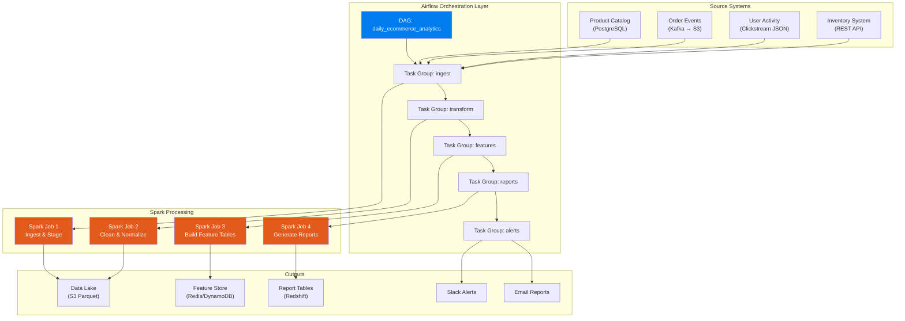
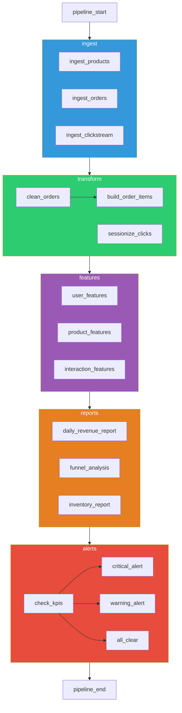
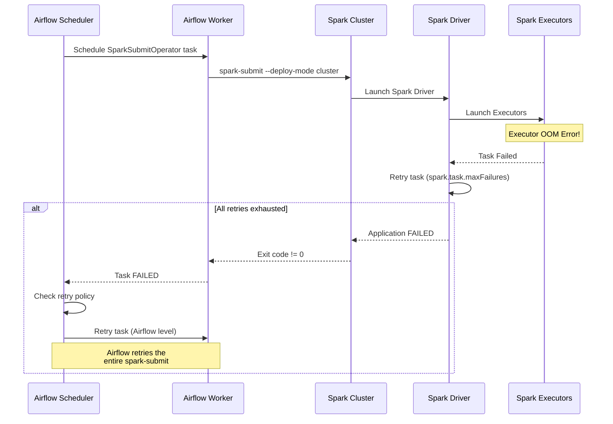
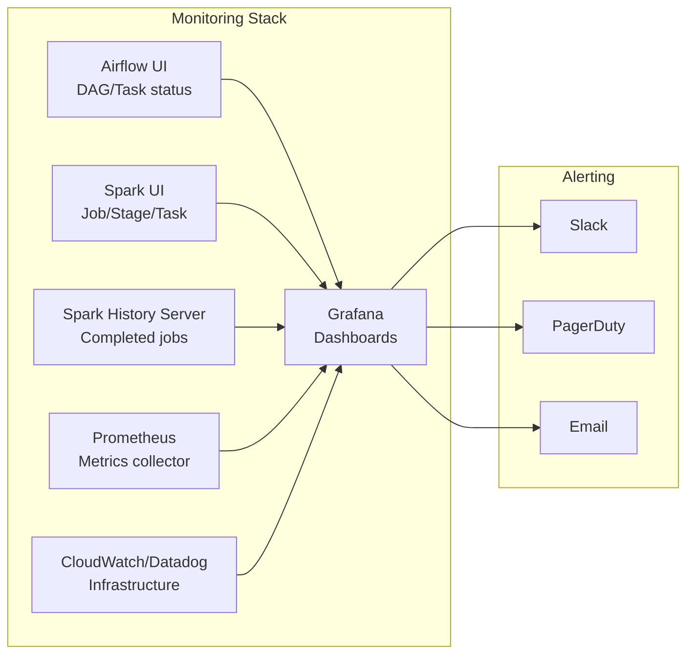
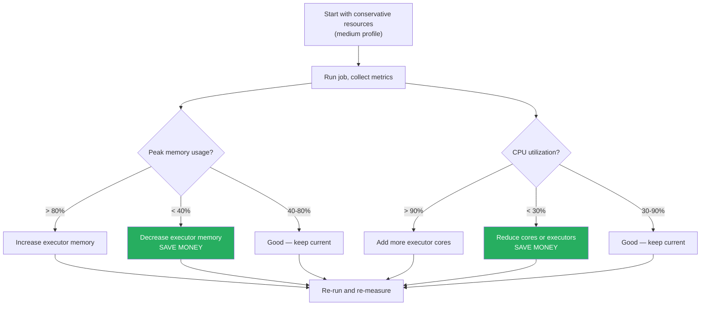

# Project 2: Orchestrating Spark Jobs with Airflow

> **Scenario:** You're a data engineer at a fast-growing e-commerce company. Every day, you need to ingest data from product catalogs, user activity, and order systems, run Spark jobs to clean and transform it, build feature tables for the recommendation engine, generate daily business reports, and alert stakeholders when KPIs deviate from expectations. The entire pipeline is orchestrated by Airflow.

---

## 🎯 What You'll Build



---

## 📁 Project Structure

```
ecommerce-analytics/
├── dags/
│   ├── daily_ecommerce_analytics.py   # Main orchestration DAG
│   ├── weekly_cohort_analysis.py      # Weekly supplementary DAG
│   ├── common/
│   │   ├── spark_config.py            # Centralized Spark configs
│   │   ├── alerting.py                # Alert utilities
│   │   └── dag_utils.py               # DAG helper functions
│   └── configs/
│       ├── sources.yaml               # Source system configs
│       ├── spark_resources.yaml       # Per-job Spark resources
│       └── sla_config.yaml            # SLA definitions
├── spark_jobs/
│   ├── ingest/
│   │   ├── ingest_products.py         # Product catalog ingestion
│   │   ├── ingest_orders.py           # Order events ingestion
│   │   └── ingest_clickstream.py      # User clickstream ingestion
│   ├── transform/
│   │   ├── clean_orders.py            # Order data cleaning
│   │   ├── build_order_items.py       # Denormalized order-items
│   │   └── sessionize_clicks.py       # Sessionize clickstream
│   ├── features/
│   │   ├── user_features.py           # User behavior features
│   │   ├── product_features.py        # Product performance features
│   │   └── interaction_features.py    # User-product interactions
│   ├── reports/
│   │   ├── daily_revenue_report.py    # Revenue metrics
│   │   ├── funnel_analysis.py         # Conversion funnel
│   │   └── inventory_report.py        # Stock level analysis
│   └── common/
│       ├── spark_session.py
│       ├── schemas.py
│       └── metrics.py                 # Custom Spark metrics
├── tests/
│   ├── test_spark_jobs/
│   ├── test_dags/
│   └── conftest.py
├── deploy/
│   ├── spark-on-k8s/
│   │   ├── spark-job-template.yaml    # K8s pod template
│   │   └── spark-rbac.yaml
│   └── helm/
│       └── values.yaml
└── Makefile
```

---

## 🔑 Core Concept: How Airflow Submits Spark Jobs

Before writing code, you need to understand the three main patterns for running Spark from Airflow — and when to use each.

### Pattern Comparison

```mermaid
graph TD
    subgraph "Pattern 1: SparkSubmitOperator"
        A1["Airflow Worker"] -->|"spark-submit CLI"| A2["Spark Cluster<br/>(YARN/Standalone)"]
        A2 --> A3["Spark Driver"]
        A3 --> A4["Spark Executors"]
    end

    subgraph "Pattern 2: KubernetesPodOperator"
        B1["Airflow Worker"] -->|"kubectl create pod"| B2["K8s API Server"]
        B2 --> B3["Spark Driver Pod"]
        B3 --> B4["Spark Executor Pods"]
    end

    subgraph "Pattern 3: PythonOperator + SparkSession"
        C1["Airflow Worker"] -->|"in-process"| C2["SparkSession.builder<br/>.remote()"]
        C2 --> C3["Spark Connect<br/>Server"]
    end

    style A1 fill:#017CEE,color:#fff
    style B1 fill:#017CEE,color:#fff
    style C1 fill:#017CEE,color:#fff
    style A3 fill:#E25A1C,color:#fff
    style B3 fill:#E25A1C,color:#fff
    style C3 fill:#E25A1C,color:#fff
```



| Aspect | SparkSubmitOperator | KubernetesPodOperator | PythonOperator + Spark Connect |
|--------|--------------------|-----------------------|-------------------------------|
| **Cluster type** | YARN, Standalone, Mesos | Kubernetes | Any (via Spark Connect) |
| **Resource isolation** | Moderate (cluster resources) | Excellent (pod-level) | Poor (shares worker process) |
| **Dependency management** | spark-submit packages | Docker image | pip packages on worker |
| **Failure handling** | Spark handles retries | K8s handles pod restart | Airflow handles retries |
| **Logging** | Spark History Server | kubectl logs | Airflow task logs |
| **Best for** | Traditional Hadoop clusters | Cloud-native / K8s shops | Light Spark workloads |
| **Complexity** | Low | Medium | Low |
| **Production readiness** | Proven | Proven | Newer (Spark 3.4+) |

---

## 🔧 Step 1: Centralized Spark Configuration

```python
# dags/common/spark_config.py
"""
Centralized Spark job configuration for Airflow.

Why centralize this?
1. One place to change Spark versions, jar versions, etc.
2. Per-job resource profiles (small, medium, large)
3. Environment-specific configs (dev vs staging vs prod)
"""

import os
from dataclasses import dataclass
from typing import Dict, Optional


@dataclass
class SparkJobProfile:
    """Resource profile for a Spark job."""
    num_executors: int
    executor_cores: int
    executor_memory: str
    driver_memory: str
    extra_conf: Dict[str, str] = None

    def to_dict(self) -> dict:
        """Convert to kwargs for SparkSubmitOperator."""
        result = {
            "num_executors": self.num_executors,
            "executor_cores": self.executor_cores,
            "executor_memory": self.executor_memory,
            "driver_memory": self.driver_memory,
        }
        return result


# ──────────────────────────────────────────
# Resource Profiles
# ──────────────────────────────────────────

SPARK_PROFILES = {
    "small": SparkJobProfile(
        num_executors=2,
        executor_cores=2,
        executor_memory="2g",
        driver_memory="1g",
    ),
    "medium": SparkJobProfile(
        num_executors=4,
        executor_cores=4,
        executor_memory="8g",
        driver_memory="4g",
    ),
    "large": SparkJobProfile(
        num_executors=8,
        executor_cores=4,
        executor_memory="16g",
        driver_memory="8g",
    ),
    "xlarge": SparkJobProfile(
        num_executors=16,
        executor_cores=4,
        executor_memory="16g",
        driver_memory="8g",
    ),
}

# ──────────────────────────────────────────
# Common Spark Configuration
# ──────────────────────────────────────────

ENV = os.getenv("ENVIRONMENT", "dev")

SPARK_COMMON_CONF = {
    # Adaptive Query Execution
    "spark.sql.adaptive.enabled": "true",
    "spark.sql.adaptive.coalescePartitions.enabled": "true",
    "spark.sql.adaptive.skewJoin.enabled": "true",

    # Parquet
    "spark.sql.parquet.compression.codec": "snappy",
    "spark.sql.parquet.filterPushdown": "true",

    # Timezone
    "spark.sql.session.timeZone": "UTC",

    # Event logging for Spark History Server
    "spark.eventLog.enabled": "true",
    "spark.eventLog.dir": f"s3://ecommerce-spark-logs/{ENV}/event-logs/",

    # Metrics
    "spark.metrics.conf.*.sink.graphite.class": "org.apache.spark.metrics.sink.GraphiteSink",
    "spark.metrics.conf.*.sink.graphite.host": "graphite.internal",
    "spark.metrics.conf.*.sink.graphite.port": "2003",
}

# Environment-specific overrides
SPARK_ENV_CONF = {
    "dev": {
        "spark.sql.shuffle.partitions": "10",
        "spark.master": "local[4]",
    },
    "staging": {
        "spark.sql.shuffle.partitions": "100",
    },
    "prod": {
        "spark.sql.shuffle.partitions": "200",
        "spark.speculation": "true",
        "spark.speculation.quantile": "0.9",
    },
}


def get_spark_conf(extra: dict = None) -> dict:
    """Get merged Spark configuration for current environment."""
    conf = {**SPARK_COMMON_CONF, **SPARK_ENV_CONF.get(ENV, {})}
    if extra:
        conf.update(extra)
    return conf


def get_spark_profile(profile_name: str) -> SparkJobProfile:
    """Get a named resource profile."""
    if profile_name not in SPARK_PROFILES:
        raise ValueError(f"Unknown profile: {profile_name}. Available: {list(SPARK_PROFILES.keys())}")
    return SPARK_PROFILES[profile_name]


# ──────────────────────────────────────────
# Spark Job Paths
# ──────────────────────────────────────────

SPARK_JOBS_BASE = "/opt/spark-jobs"
SPARK_COMMON_PY_FILES = f"{SPARK_JOBS_BASE}/common/*.py"
SPARK_CONN_ID = "spark_default"
```

---

## 🔧 Step 2: Spark Jobs

### Job 1: Product Catalog Ingestion

```python
# spark_jobs/ingest/ingest_products.py
"""
Ingest product catalog from PostgreSQL into the data lake.

Challenge: The product catalog has 2 million products and changes daily.
We use Change Data Capture (CDC) pattern:
- Full load on first run
- Incremental load on subsequent runs (using updated_at timestamp)
"""

import sys
import logging
from datetime import datetime, timedelta
from pyspark.sql import SparkSession
from pyspark.sql.functions import (
    col, lit, current_timestamp, coalesce, when, max as spark_max
)

sys.path.insert(0, '/opt/spark-jobs/common')
from spark_session import create_spark_session

logging.basicConfig(level=logging.INFO)
logger = logging.getLogger(__name__)


def get_last_watermark(spark: SparkSession, watermark_path: str) -> str:
    """
    Read the high watermark from the last successful run.

    The watermark is the max(updated_at) from the previous load.
    If no watermark exists, we do a full load.
    """
    try:
        watermark_df = spark.read.json(watermark_path)
        last_watermark = watermark_df.collect()[0]["watermark"]
        logger.info(f"Found watermark: {last_watermark}")
        return last_watermark
    except Exception:
        logger.info("No watermark found — performing full load")
        return "1970-01-01 00:00:00"


def save_watermark(spark: SparkSession, watermark_path: str, watermark_value: str):
    """Save the new high watermark after successful load."""
    watermark_df = spark.createDataFrame(
        [{"watermark": watermark_value, "updated_at": datetime.utcnow().isoformat()}]
    )
    watermark_df.write.mode("overwrite").json(watermark_path)
    logger.info(f"Saved watermark: {watermark_value}")


def ingest_from_postgres(
    spark: SparkSession,
    processing_date: str,
    jdbc_url: str,
    table_name: str,
):
    """
    Incrementally ingest product data from PostgreSQL.

    Why JDBC with partitioning?
    - Without it, Spark reads the entire table through a single JDBC connection
    - With partitionColumn, Spark creates parallel readers
    - This turns a 30-minute read into a 3-minute read
    """
    watermark_path = "s3://ecommerce-data/watermarks/products/"
    last_watermark = get_last_watermark(spark, watermark_path)

    # Incremental query — only rows changed since last load
    query = f"""
    (SELECT
        product_id, name, description, category_id, subcategory_id,
        brand, price, cost, weight_kg, is_active,
        created_at, updated_at
     FROM {table_name}
     WHERE updated_at > '{last_watermark}'
    ) AS products_incremental
    """

    # Read with JDBC partitioning for parallelism
    products_df = (
        spark.read
        .format("jdbc")
        .option("url", jdbc_url)
        .option("dbtable", query)
        .option("driver", "org.postgresql.Driver")
        .option("user", "readonly_user")
        .option("password", "{{PRODUCT_DB_PASSWORD}}")  # From secrets manager
        .option("fetchsize", "10000")           # Batch size for JDBC fetch
        .option("partitionColumn", "product_id")
        .option("lowerBound", "1")
        .option("upperBound", "5000000")
        .option("numPartitions", "10")          # 10 parallel readers
        .load()
    )

    record_count = products_df.count()
    logger.info(f"Read {record_count} changed products since {last_watermark}")

    if record_count == 0:
        logger.info("No new/updated products — skipping write")
        return

    # Add metadata
    products_df = (
        products_df
        .withColumn("_ingested_at", current_timestamp())
        .withColumn("_processing_date", lit(processing_date))
    )

    # Write to staging area (Bronze layer)
    staging_path = f"s3://ecommerce-data/bronze/products/"
    (
        products_df.write
        .mode("overwrite")
        .partitionBy("_processing_date")
        .parquet(staging_path)
    )

    # Update watermark
    new_watermark = products_df.agg(
        spark_max("updated_at")
    ).collect()[0][0]
    save_watermark(spark, watermark_path, str(new_watermark))

    logger.info(f"Product ingestion complete: {record_count} records")


def main():
    processing_date = sys.argv[1]
    jdbc_url = sys.argv[2]

    spark = create_spark_session(
        app_name=f"ecom-ingest-products-{processing_date}",
        extra_configs={
            "spark.jars": "/opt/spark/jars/postgresql-42.6.0.jar",
        }
    )

    try:
        ingest_from_postgres(spark, processing_date, jdbc_url, "public.products")
    except Exception as e:
        logger.error(f"Product ingestion failed: {e}", exc_info=True)
        sys.exit(1)
    finally:
        spark.stop()


if __name__ == "__main__":
    main()
```

### Job 2: Order Events Processing

```python
# spark_jobs/ingest/ingest_orders.py
"""
Ingest and process order events from Kafka-landed files in S3.

Architecture: Kafka → S3 Sink Connector → Hourly Parquet files → This job
The Kafka Connect S3 Sink writes hourly Parquet files to S3.
This job reads the previous day's files, deduplicates, and writes to Bronze.
"""

import sys
import logging
from pyspark.sql import SparkSession
from pyspark.sql.functions import (
    col, lit, current_timestamp, from_json, explode,
    to_timestamp, to_date, row_number, sha2, concat_ws
)
from pyspark.sql.window import Window
from pyspark.sql.types import (
    StructType, StructField, StringType, DoubleType,
    IntegerType, ArrayType, TimestampType
)

sys.path.insert(0, '/opt/spark-jobs/common')
from spark_session import create_spark_session

logging.basicConfig(level=logging.INFO)
logger = logging.getLogger(__name__)


ORDER_EVENT_SCHEMA = StructType([
    StructField("order_id", StringType(), False),
    StructField("user_id", StringType(), False),
    StructField("event_type", StringType(), False),         # CREATED, PAID, SHIPPED, DELIVERED, CANCELLED
    StructField("event_timestamp", StringType(), False),
    StructField("total_amount", DoubleType(), True),
    StructField("currency", StringType(), True),
    StructField("payment_method", StringType(), True),
    StructField("shipping_address", StructType([
        StructField("country", StringType()),
        StructField("state", StringType()),
        StructField("city", StringType()),
        StructField("zip_code", StringType()),
    ])),
    StructField("items", ArrayType(StructType([
        StructField("product_id", StringType()),
        StructField("quantity", IntegerType()),
        StructField("unit_price", DoubleType()),
        StructField("discount_pct", DoubleType()),
    ]))),
])


def ingest_order_events(spark: SparkSession, processing_date: str):
    """
    Read order events for a given date.

    Kafka S3 Sink writes files in this structure:
    s3://ecommerce-kafka/topics/orders/year=2024/month=01/day=15/hour=00/
    """
    source_path = f"s3://ecommerce-kafka/topics/orders/year={processing_date[:4]}/month={processing_date[5:7]}/day={processing_date[8:10]}/"

    logger.info(f"Reading order events from: {source_path}")

    # Read all hourly files for the day
    raw_df = (
        spark.read
        .schema(ORDER_EVENT_SCHEMA)
        .parquet(source_path)
    )

    # Parse timestamps and add metadata
    processed_df = (
        raw_df
        .withColumn("event_timestamp", to_timestamp("event_timestamp"))
        .withColumn("event_date", to_date("event_timestamp"))
        .withColumn("_ingested_at", current_timestamp())
        .withColumn("_processing_date", lit(processing_date))
    )

    # Deduplicate — Kafka can deliver duplicates
    window = Window.partitionBy("order_id", "event_type").orderBy(col("event_timestamp").desc())
    deduped_df = (
        processed_df
        .withColumn("_rn", row_number().over(window))
        .filter(col("_rn") == 1)
        .drop("_rn")
    )

    # Write to Bronze
    bronze_path = "s3://ecommerce-data/bronze/orders/"
    (
        deduped_df.write
        .mode("overwrite")
        .partitionBy("_processing_date")
        .parquet(bronze_path)
    )

    count = deduped_df.count()
    logger.info(f"Ingested {count} order events for {processing_date}")
    return count


def main():
    processing_date = sys.argv[1]

    spark = create_spark_session(
        app_name=f"ecom-ingest-orders-{processing_date}",
        extra_configs={"spark.sql.shuffle.partitions": "100"}
    )

    try:
        count = ingest_order_events(spark, processing_date)
        if count == 0:
            logger.warning(f"No order events for {processing_date}")
    except Exception as e:
        logger.error(f"Order ingestion failed: {e}", exc_info=True)
        sys.exit(1)
    finally:
        spark.stop()


if __name__ == "__main__":
    main()
```

### Job 3: User Feature Engineering

```python
# spark_jobs/features/user_features.py
"""
Build user behavior features for the recommendation engine.

These features power the ML model that recommends products.
They're computed daily and pushed to a feature store (Redis/DynamoDB).

Feature categories:
1. Purchase history features (recency, frequency, monetary — RFM)
2. Browsing behavior features (session depth, category affinity)
3. Engagement features (click-through rates, cart abandonment)
"""

import sys
import logging
from pyspark.sql import SparkSession, DataFrame
from pyspark.sql.functions import (
    col, count, sum as spark_sum, avg, max as spark_max,
    min as spark_min, datediff, lit, current_date,
    countDistinct, collect_set, size, when,
    round as spark_round, percentile_approx, struct,
    array_distinct, flatten, expr
)
from pyspark.sql.window import Window

sys.path.insert(0, '/opt/spark-jobs/common')
from spark_session import create_spark_session

logging.basicConfig(level=logging.INFO)
logger = logging.getLogger(__name__)


def build_rfm_features(
    spark: SparkSession,
    orders_df: DataFrame,
    reference_date: str,
) -> DataFrame:
    """
    Compute Recency-Frequency-Monetary (RFM) features per user.

    RFM is a classic customer segmentation framework:
    - Recency: Days since last purchase (lower = better)
    - Frequency: Number of purchases in last 90 days
    - Monetary: Total spend in last 90 days
    """
    # Only completed orders
    completed_orders = orders_df.filter(col("event_type") == "PAID")

    rfm_df = (
        completed_orders
        .groupBy("user_id")
        .agg(
            # Recency
            datediff(
                lit(reference_date),
                spark_max("event_date")
            ).alias("days_since_last_purchase"),

            # Frequency (all time)
            count("order_id").alias("total_orders"),

            # Frequency (last 90 days)
            spark_sum(
                when(
                    datediff(lit(reference_date), col("event_date")) <= 90,
                    lit(1)
                ).otherwise(lit(0))
            ).alias("orders_last_90_days"),

            # Monetary (all time)
            spark_round(spark_sum("total_amount"), 2).alias("total_spend"),

            # Monetary (last 90 days)
            spark_round(
                spark_sum(
                    when(
                        datediff(lit(reference_date), col("event_date")) <= 90,
                        col("total_amount")
                    ).otherwise(lit(0))
                ), 2
            ).alias("spend_last_90_days"),

            # Average order value
            spark_round(avg("total_amount"), 2).alias("avg_order_value"),

            # Max order value (for outlier detection)
            spark_round(spark_max("total_amount"), 2).alias("max_order_value"),

            # First purchase date (customer tenure)
            spark_min("event_date").alias("first_purchase_date"),

            # Distinct categories purchased
            countDistinct("items.product_id").alias("unique_products_purchased"),

            # Payment method preference
            expr("mode(payment_method)").alias("preferred_payment_method"),
        )
        .withColumn(
            "customer_tenure_days",
            datediff(lit(reference_date), col("first_purchase_date"))
        )
        .withColumn(
            "purchase_frequency",
            when(col("customer_tenure_days") > 0,
                 spark_round(col("total_orders") / col("customer_tenure_days") * 30, 4))
            .otherwise(lit(0.0))
        )
    )

    return rfm_df


def build_browsing_features(
    spark: SparkSession,
    clickstream_df: DataFrame,
    reference_date: str,
) -> DataFrame:
    """
    Compute browsing behavior features from clickstream data.

    Features:
    - Session depth (pages per session)
    - Category affinity (which categories they browse most)
    - Time-of-day preference
    - Device preference
    """
    browsing_df = (
        clickstream_df
        .filter(
            datediff(lit(reference_date), col("event_date")) <= 30  # Last 30 days
        )
        .groupBy("user_id")
        .agg(
            # Session metrics
            countDistinct("session_id").alias("total_sessions_30d"),
            count("*").alias("total_pageviews_30d"),

            # Category affinity — top 5 categories browsed
            collect_set("category").alias("browsed_categories"),

            # Search behavior
            spark_sum(
                when(col("event_type") == "SEARCH", 1).otherwise(0)
            ).alias("search_count_30d"),

            # Add-to-cart behavior
            spark_sum(
                when(col("event_type") == "ADD_TO_CART", 1).otherwise(0)
            ).alias("add_to_cart_count_30d"),

            # Wishlist behavior
            spark_sum(
                when(col("event_type") == "ADD_TO_WISHLIST", 1).otherwise(0)
            ).alias("wishlist_count_30d"),

            # Device distribution
            countDistinct("device_type").alias("devices_used"),
        )
        .withColumn(
            "pages_per_session",
            spark_round(col("total_pageviews_30d") / col("total_sessions_30d"), 2)
        )
        .withColumn(
            "category_breadth",
            size(col("browsed_categories"))
        )
    )

    return browsing_df


def build_engagement_features(
    orders_df: DataFrame,
    clickstream_df: DataFrame,
    reference_date: str,
) -> DataFrame:
    """
    Compute engagement features combining orders and browsing.

    Key feature: Cart Abandonment Rate
    - What % of add-to-cart events result in a purchase?
    - High abandonment = opportunity for re-targeting
    """
    # Add-to-cart events per user (last 30 days)
    cart_events = (
        clickstream_df
        .filter(
            (col("event_type") == "ADD_TO_CART") &
            (datediff(lit(reference_date), col("event_date")) <= 30)
        )
        .groupBy("user_id")
        .agg(count("*").alias("cart_adds_30d"))
    )

    # Completed purchases per user (last 30 days)
    purchases = (
        orders_df
        .filter(
            (col("event_type") == "PAID") &
            (datediff(lit(reference_date), col("event_date")) <= 30)
        )
        .groupBy("user_id")
        .agg(count("*").alias("purchases_30d"))
    )

    engagement_df = (
        cart_events
        .join(purchases, "user_id", "left")
        .fillna(0, ["purchases_30d"])
        .withColumn(
            "cart_conversion_rate",
            when(col("cart_adds_30d") > 0,
                 spark_round(col("purchases_30d") / col("cart_adds_30d"), 4))
            .otherwise(lit(0.0))
        )
        .withColumn(
            "cart_abandonment_rate",
            spark_round(1 - col("cart_conversion_rate"), 4)
        )
    )

    return engagement_df


def merge_features(
    rfm_df: DataFrame,
    browsing_df: DataFrame,
    engagement_df: DataFrame,
    reference_date: str,
) -> DataFrame:
    """
    Join all feature sets into a single user feature table.

    Important: Use LEFT join from RFM — a user might have purchased
    but never browsed (came from an email link), or browsed but never purchased.
    """
    features_df = (
        rfm_df
        .join(browsing_df, "user_id", "full_outer")
        .join(engagement_df, "user_id", "left")
        .fillna(0)                   # Fill missing numeric features with 0
        .withColumn("feature_date", lit(reference_date))
        .withColumn("computed_at", current_date())
    )

    return features_df


def main():
    processing_date = sys.argv[1]

    spark = create_spark_session(
        app_name=f"ecom-features-user-{processing_date}",
        extra_configs={
            "spark.sql.shuffle.partitions": "200",
            "spark.sql.adaptive.skewJoin.enabled": "true",
        }
    )

    try:
        # Read Silver layer data
        orders_df = spark.read.parquet("s3://ecommerce-data/silver/orders/")
        clickstream_df = spark.read.parquet("s3://ecommerce-data/silver/clickstream/")

        # Build feature sets
        rfm_df = build_rfm_features(spark, orders_df, processing_date)
        browsing_df = build_browsing_features(spark, clickstream_df, processing_date)
        engagement_df = build_engagement_features(orders_df, clickstream_df, processing_date)

        # Merge all features
        features_df = merge_features(rfm_df, browsing_df, engagement_df, processing_date)

        # Write to feature store (Parquet for batch, also push to Redis)
        features_path = "s3://ecommerce-data/gold/user_features/"
        (
            features_df.write
            .mode("overwrite")
            .partitionBy("feature_date")
            .parquet(features_path)
        )

        feature_count = features_df.count()
        logger.info(f"Computed features for {feature_count} users")

    except Exception as e:
        logger.error(f"Feature computation failed: {e}", exc_info=True)
        sys.exit(1)
    finally:
        spark.stop()


if __name__ == "__main__":
    main()
```

### Job 4: Daily Revenue Report

```python
# spark_jobs/reports/daily_revenue_report.py
"""
Generate daily revenue report and write to Redshift for BI dashboards.

This report powers the CEO's daily dashboard. If it's wrong, you hear about it.
Triple-check the numbers — cross-validate against the order management system.
"""

import sys
import logging
from pyspark.sql import SparkSession
from pyspark.sql.functions import (
    col, count, sum as spark_sum, avg, countDistinct,
    when, lit, round as spark_round, lag, current_timestamp,
    datediff, to_date
)
from pyspark.sql.window import Window

sys.path.insert(0, '/opt/spark-jobs/common')
from spark_session import create_spark_session

logging.basicConfig(level=logging.INFO)
logger = logging.getLogger(__name__)


def build_daily_revenue(spark: SparkSession, processing_date: str):
    """Build daily revenue metrics from Silver layer orders."""

    orders_df = spark.read.parquet(
        f"s3://ecommerce-data/silver/orders/"
    ).filter(
        (col("event_type") == "PAID") &
        (col("event_date") == processing_date)
    )

    daily_revenue = (
        orders_df
        .groupBy("event_date")
        .agg(
            # Revenue metrics
            spark_round(spark_sum("total_amount"), 2).alias("gross_revenue"),
            count("order_id").alias("total_orders"),
            spark_round(avg("total_amount"), 2).alias("avg_order_value"),
            countDistinct("user_id").alias("unique_customers"),

            # Payment method breakdown
            spark_sum(when(col("payment_method") == "CREDIT_CARD", col("total_amount"))
                     .otherwise(0)).alias("revenue_credit_card"),
            spark_sum(when(col("payment_method") == "DEBIT_CARD", col("total_amount"))
                     .otherwise(0)).alias("revenue_debit_card"),
            spark_sum(when(col("payment_method") == "WALLET", col("total_amount"))
                     .otherwise(0)).alias("revenue_wallet"),

            # Customer segments
            countDistinct(
                when(col("is_first_purchase") == True, col("user_id"))
            ).alias("new_customers"),
            countDistinct(
                when(col("is_first_purchase") == False, col("user_id"))
            ).alias("returning_customers"),
        )
        .withColumn("report_generated_at", current_timestamp())
    )

    return daily_revenue


def add_trends(spark: SparkSession, daily_df, processing_date: str):
    """
    Add day-over-day and week-over-week trends.
    The CEO wants to see: "Revenue is up 5% vs yesterday, up 12% vs last week"
    """
    # Load last 8 days of historical data for trend calculation
    historical_df = spark.read.parquet("s3://ecommerce-data/gold/daily_revenue/")

    # Union today with historical
    all_days = historical_df.unionByName(daily_df, allowMissingColumns=True)

    # Day-over-day trends
    window = Window.orderBy("event_date")
    trends_df = (
        all_days
        .withColumn("prev_day_revenue", lag("gross_revenue", 1).over(window))
        .withColumn("prev_week_revenue", lag("gross_revenue", 7).over(window))
        .withColumn(
            "revenue_dod_pct",
            when(col("prev_day_revenue") > 0,
                 spark_round(
                     (col("gross_revenue") - col("prev_day_revenue")) / col("prev_day_revenue") * 100, 2
                 ))
            .otherwise(lit(None))
        )
        .withColumn(
            "revenue_wow_pct",
            when(col("prev_week_revenue") > 0,
                 spark_round(
                     (col("gross_revenue") - col("prev_week_revenue")) / col("prev_week_revenue") * 100, 2
                 ))
            .otherwise(lit(None))
        )
        .filter(col("event_date") == processing_date)
        .drop("prev_day_revenue", "prev_week_revenue")
    )

    return trends_df


def write_to_redshift(df, table_name: str):
    """Write report data to Redshift for BI tools."""
    (
        df.write
        .format("io.github.spark_redshift_community.spark.redshift")
        .option("url", "jdbc:redshift://cluster.abc.us-east-1.redshift.amazonaws.com:5439/analytics")
        .option("dbtable", f"reports.{table_name}")
        .option("tempdir", "s3://ecommerce-temp/redshift-staging/")
        .option("aws_iam_role", "arn:aws:iam::123456789:role/RedshiftS3Role")
        .mode("append")
        .save()
    )

    logger.info(f"Written to Redshift: reports.{table_name}")


def main():
    processing_date = sys.argv[1]

    spark = create_spark_session(
        app_name=f"ecom-report-revenue-{processing_date}",
        extra_configs={
            "spark.jars.packages": "io.github.spark-redshift-community:spark-redshift_2.12:6.2.0-spark_3.5",
        }
    )

    try:
        daily_df = build_daily_revenue(spark, processing_date)
        report_df = add_trends(spark, daily_df, processing_date)

        # Save to Gold layer (Parquet)
        gold_path = "s3://ecommerce-data/gold/daily_revenue/"
        report_df.write.mode("overwrite").partitionBy("event_date").parquet(gold_path)

        # Write to Redshift for BI
        write_to_redshift(report_df, "daily_revenue")

        logger.info(f"Revenue report complete for {processing_date}")

    except Exception as e:
        logger.error(f"Revenue report failed: {e}", exc_info=True)
        sys.exit(1)
    finally:
        spark.stop()


if __name__ == "__main__":
    main()
```

---

## 🔧 Step 3: The Orchestration DAG

```python
# dags/daily_ecommerce_analytics.py
"""
Production DAG: E-Commerce Daily Analytics Pipeline

Orchestrates 4 Spark job phases:
1. INGEST  — Extract data from source systems (parallel)
2. TRANSFORM — Clean, normalize, sessionize (sequential)
3. FEATURES — Build ML features (parallel)
4. REPORTS — Generate business reports (parallel)
5. ALERTS  — Send KPI alerts (conditional)

Key design decisions:
- TaskGroups for visual organization in the Airflow UI
- SparkSubmitOperator for resource isolation
- Dynamic task generation for multiple sources
- SLA monitoring with escalation
- Conditional alerting based on KPI thresholds
"""

from datetime import datetime, timedelta
from airflow import DAG
from airflow.operators.python import PythonOperator, BranchPythonOperator
from airflow.operators.empty import EmptyOperator
from airflow.providers.apache.spark.operators.spark_submit import SparkSubmitOperator
from airflow.utils.task_group import TaskGroup
from airflow.utils.trigger_rule import TriggerRule
from airflow.models import Variable
from airflow.exceptions import AirflowSkipException

import sys
sys.path.insert(0, '/opt/airflow/dags/common')
from spark_config import get_spark_conf, get_spark_profile, SPARK_JOBS_BASE, SPARK_COMMON_PY_FILES, SPARK_CONN_ID
from alerting import send_slack_alert, send_pagerduty_alert

# ──────────────────────────────────────────────
# DAG Configuration
# ──────────────────────────────────────────────

default_args = {
    "owner": "data-engineering",
    "depends_on_past": False,
    "email": ["data-team@ecommerce.com"],
    "email_on_failure": True,
    "retries": 2,
    "retry_delay": timedelta(minutes=5),
    "retry_exponential_backoff": True,
    "max_retry_delay": timedelta(minutes=30),
    "execution_timeout": timedelta(hours=3),
}

PROCESSING_DATE = "{{ ds }}"
JDBC_URL = Variable.get("product_db_jdbc_url", default_var="jdbc:postgresql://product-db:5432/catalog")

# ──────────────────────────────────────────────
# Helper: Create SparkSubmitOperator
# ──────────────────────────────────────────────

def spark_submit_task(
    task_id: str,
    application: str,
    args: list = None,
    profile: str = "medium",
    extra_conf: dict = None,
    **kwargs,
) -> SparkSubmitOperator:
    """
    Factory for creating SparkSubmitOperator tasks with consistent config.

    This reduces boilerplate — instead of 15 lines per task, we write 5.
    """
    spark_profile = get_spark_profile(profile)
    conf = get_spark_conf(extra_conf)

    return SparkSubmitOperator(
        task_id=task_id,
        application=f"{SPARK_JOBS_BASE}/{application}",
        conn_id=SPARK_CONN_ID,
        application_args=args or [PROCESSING_DATE],
        conf=conf,
        name=f"ecom-{task_id}-{PROCESSING_DATE}",
        py_files=SPARK_COMMON_PY_FILES,
        verbose=False,
        **spark_profile.to_dict(),
        **kwargs,
    )


# ──────────────────────────────────────────────
# DAG Definition
# ──────────────────────────────────────────────

with DAG(
    dag_id="daily_ecommerce_analytics",
    default_args=default_args,
    description="Daily e-commerce analytics: Ingest → Transform → Features → Reports → Alerts",
    schedule_interval="0 3 * * *",       # 3 AM UTC daily
    start_date=datetime(2024, 1, 1),
    catchup=False,
    max_active_runs=1,
    tags=["production", "analytics", "ecommerce", "daily"],
    doc_md=__doc__,
) as dag:

    pipeline_start = EmptyOperator(task_id="pipeline_start")

    # ────────────────────────────────────
    # Phase 1: INGEST (parallel)
    # ────────────────────────────────────

    with TaskGroup("ingest", tooltip="Extract data from source systems") as ingest_group:

        ingest_products = spark_submit_task(
            task_id="ingest_products",
            application="ingest/ingest_products.py",
            args=[PROCESSING_DATE, JDBC_URL],
            profile="small",
            extra_conf={"spark.jars": "/opt/spark/jars/postgresql-42.6.0.jar"},
        )

        ingest_orders = spark_submit_task(
            task_id="ingest_orders",
            application="ingest/ingest_orders.py",
            profile="medium",
        )

        ingest_clickstream = spark_submit_task(
            task_id="ingest_clickstream",
            application="ingest/ingest_clickstream.py",
            profile="medium",
        )

        # All ingestion tasks run in parallel — no dependencies between them

    # ────────────────────────────────────
    # Phase 2: TRANSFORM (sequential)
    # ────────────────────────────────────

    with TaskGroup("transform", tooltip="Clean and normalize data") as transform_group:

        clean_orders = spark_submit_task(
            task_id="clean_orders",
            application="transform/clean_orders.py",
            profile="medium",
        )

        build_order_items = spark_submit_task(
            task_id="build_order_items",
            application="transform/build_order_items.py",
            profile="large",                                 # Denormalization is expensive
        )

        sessionize_clicks = spark_submit_task(
            task_id="sessionize_clicks",
            application="transform/sessionize_clicks.py",
            profile="large",
            extra_conf={
                "spark.sql.shuffle.partitions": "400",       # Clickstream is high volume
            },
        )

        # Order cleaning → order items (depends on cleaned orders)
        # Sessionization is independent
        clean_orders >> build_order_items

    # ────────────────────────────────────
    # Phase 3: FEATURES (parallel)
    # ────────────────────────────────────

    with TaskGroup("features", tooltip="Build ML feature tables") as features_group:

        user_features = spark_submit_task(
            task_id="user_features",
            application="features/user_features.py",
            profile="large",
        )

        product_features = spark_submit_task(
            task_id="product_features",
            application="features/product_features.py",
            profile="medium",
        )

        interaction_features = spark_submit_task(
            task_id="interaction_features",
            application="features/interaction_features.py",
            profile="xlarge",                                # User×Product matrix is huge
            extra_conf={
                "spark.sql.shuffle.partitions": "500",
                "spark.sql.adaptive.advisoryPartitionSizeInBytes": "128m",
            },
        )

    # ────────────────────────────────────
    # Phase 4: REPORTS (parallel)
    # ────────────────────────────────────

    with TaskGroup("reports", tooltip="Generate business reports") as reports_group:

        revenue_report = spark_submit_task(
            task_id="daily_revenue_report",
            application="reports/daily_revenue_report.py",
            profile="medium",
            extra_conf={
                "spark.jars.packages": "io.github.spark-redshift-community:spark-redshift_2.12:6.2.0-spark_3.5",
            },
        )

        funnel_report = spark_submit_task(
            task_id="funnel_analysis",
            application="reports/funnel_analysis.py",
            profile="medium",
        )

        inventory_report = spark_submit_task(
            task_id="inventory_report",
            application="reports/inventory_report.py",
            profile="small",
        )

    # ────────────────────────────────────
    # Phase 5: ALERTS (conditional)
    # ────────────────────────────────────

    def check_kpi_thresholds(**context):
        """
        Check if KPIs deviate from expectations and decide which alerts to send.

        Returns the task_id of the next task to execute (branching).
        """
        from airflow.providers.amazon.aws.hooks.s3 import S3Hook
        import json

        ds = context["ds"]
        s3_hook = S3Hook(aws_conn_id="aws_default")

        # Read today's report
        report_content = s3_hook.read_key(
            key=f"gold/daily_revenue/event_date={ds}/part-00000.snappy.parquet",
            bucket_name="ecommerce-data",
        )

        # In practice, you'd read the Parquet file properly
        # Here we illustrate the branching logic
        gross_revenue = 150000  # Placeholder — read from report
        prev_day_revenue = 140000

        revenue_change_pct = (gross_revenue - prev_day_revenue) / prev_day_revenue * 100

        if revenue_change_pct < -20:
            return "alerts.critical_revenue_alert"
        elif revenue_change_pct < -10:
            return "alerts.warning_revenue_alert"
        else:
            return "alerts.all_clear"

    with TaskGroup("alerts", tooltip="KPI monitoring and alerting") as alerts_group:

        check_kpis = BranchPythonOperator(
            task_id="check_kpis",
            python_callable=check_kpi_thresholds,
        )

        critical_alert = PythonOperator(
            task_id="critical_revenue_alert",
            python_callable=lambda **ctx: send_pagerduty_alert(
                f"CRITICAL: Revenue dropped >20% on {ctx['ds']}"
            ),
        )

        warning_alert = PythonOperator(
            task_id="warning_revenue_alert",
            python_callable=lambda **ctx: send_slack_alert(
                f":warning: Revenue dropped >10% on {ctx['ds']}"
            ),
        )

        all_clear = PythonOperator(
            task_id="all_clear",
            python_callable=lambda **ctx: send_slack_alert(
                f":white_check_mark: All KPIs normal for {ctx['ds']}"
            ),
        )

        check_kpis >> [critical_alert, warning_alert, all_clear]

    pipeline_end = EmptyOperator(
        task_id="pipeline_end",
        trigger_rule=TriggerRule.NONE_FAILED_MIN_ONE_SUCCESS,
    )

    # ────────────────────────────────────
    # DAG Dependencies
    # ────────────────────────────────────

    pipeline_start >> ingest_group >> transform_group >> features_group >> reports_group >> alerts_group >> pipeline_end
```

### DAG Visual Flow



---

## 🔧 Step 4: Using KubernetesPodOperator (Alternative)

For teams running on Kubernetes, the `KubernetesPodOperator` provides better isolation:

```python
# dags/daily_ecommerce_analytics_k8s.py
"""
Alternative DAG using KubernetesPodOperator for Spark jobs.

Advantages over SparkSubmitOperator:
1. Each job runs in its own pod — complete resource isolation
2. Dependencies baked into Docker image — no JAR conflicts
3. Auto-scaling via K8s — no fixed cluster to manage
4. Easier to debug — kubectl logs, pod events

Disadvantages:
1. Higher startup overhead (pod creation ~30-60 seconds)
2. More complex infrastructure setup
3. Need to manage Docker images
"""

from datetime import datetime, timedelta
from airflow import DAG
from airflow.providers.cncf.kubernetes.operators.pod import KubernetesPodOperator
from kubernetes.client import models as k8s


# Pod template for Spark driver
def create_spark_k8s_task(
    task_id: str,
    spark_job: str,
    args: list,
    cpu: str = "2",
    memory: str = "4Gi",
    **kwargs,
) -> KubernetesPodOperator:
    """Create a KubernetesPodOperator that runs a Spark job."""

    # Resource requests and limits
    resources = k8s.V1ResourceRequirements(
        requests={"cpu": cpu, "memory": memory},
        limits={"cpu": cpu, "memory": memory},
    )

    # Environment variables
    env_vars = [
        k8s.V1EnvVar(name="SPARK_HOME", value="/opt/spark"),
        k8s.V1EnvVar(name="PROCESSING_DATE", value="{{ ds }}"),
        k8s.V1EnvVar(
            name="AWS_ACCESS_KEY_ID",
            value_from=k8s.V1EnvVarSource(
                secret_key_ref=k8s.V1SecretKeySelector(
                    name="aws-credentials",
                    key="access-key-id",
                )
            ),
        ),
        k8s.V1EnvVar(
            name="AWS_SECRET_ACCESS_KEY",
            value_from=k8s.V1EnvVarSource(
                secret_key_ref=k8s.V1SecretKeySelector(
                    name="aws-credentials",
                    key="secret-access-key",
                )
            ),
        ),
    ]

    return KubernetesPodOperator(
        task_id=task_id,
        namespace="spark-jobs",
        image="ecommerce/spark-jobs:latest",
        cmds=["spark-submit"],
        arguments=[
            "--master", "k8s://https://kubernetes.default.svc",
            "--deploy-mode", "client",
            "--conf", "spark.kubernetes.container.image=ecommerce/spark-jobs:latest",
            "--conf", "spark.executor.instances=4",
            "--conf", "spark.executor.memory=4g",
            "--conf", "spark.executor.cores=2",
            "--conf", "spark.kubernetes.namespace=spark-jobs",
            "--conf", "spark.sql.adaptive.enabled=true",
            f"/opt/spark-jobs/{spark_job}",
        ] + args,
        env_vars=env_vars,
        container_resources=resources,
        is_delete_operator_pod=True,     # Clean up pod after completion
        get_logs=True,                   # Stream pod logs to Airflow
        log_events_on_failure=True,
        startup_timeout_seconds=600,     # 10 min startup timeout
        **kwargs,
    )
```

---

## 🔧 Step 5: Passing Parameters Between Airflow and Spark

### Pattern 1: Command-Line Arguments (Simple)

```python
# In the DAG
SparkSubmitOperator(
    task_id="my_spark_job",
    application="/path/to/job.py",
    application_args=[
        "{{ ds }}",                       # Templated date
        "{{ var.value.batch_size }}",      # Airflow variable
        "{{ ti.xcom_pull(task_ids='prev_task', key='row_count') }}",  # XCom value
    ],
)

# In the Spark job
processing_date = sys.argv[1]    # "2024-01-15"
batch_size = int(sys.argv[2])    # 10000
prev_row_count = int(sys.argv[3])
```

### Pattern 2: XCom for Inter-Task Communication

```python
# Task that pushes metrics to XCom
def push_ingestion_metrics(**context):
    """Reads ingestion output and pushes metrics to XCom."""
    import json

    # Read the metrics file written by the Spark job
    s3_hook = S3Hook(aws_conn_id="aws_default")
    metrics_json = s3_hook.read_key(
        key=f"metrics/ingest/{context['ds']}/metrics.json",
        bucket_name="ecommerce-data",
    )
    metrics = json.loads(metrics_json)

    # Push to XCom — available to downstream tasks
    context['ti'].xcom_push(key='total_records', value=metrics['total_records'])
    context['ti'].xcom_push(key='new_records', value=metrics['new_records'])


# Downstream task reads from XCom
SparkSubmitOperator(
    task_id="transform",
    application="/path/to/transform.py",
    application_args=[
        "{{ ds }}",
        "{{ ti.xcom_pull(task_ids='push_metrics', key='total_records') }}",
    ],
)
```

### Pattern 3: Config Files (Complex Parameters)

```python
# When you need to pass complex configuration to Spark jobs
def generate_job_config(**context):
    """Generate a config file that the Spark job reads."""
    import json

    config = {
        "processing_date": context["ds"],
        "sources": ["products", "orders", "clickstream"],
        "quality_thresholds": {
            "max_null_pct": 5.0,
            "min_row_count": 100000,
        },
        "spark_tuning": {
            "shuffle_partitions": 200,
            "broadcast_threshold_mb": 50,
        },
    }

    # Write config to S3
    s3_hook = S3Hook(aws_conn_id="aws_default")
    s3_hook.load_string(
        string_data=json.dumps(config, indent=2),
        key=f"configs/runs/{context['ds']}/config.json",
        bucket_name="ecommerce-data",
        replace=True,
    )


# Spark job reads the config
SparkSubmitOperator(
    task_id="spark_job",
    application="/path/to/job.py",
    application_args=[
        "{{ ds }}",
        "s3://ecommerce-data/configs/runs/{{ ds }}/config.json",
    ],
)
```

---

## ⚠️ Handling Spark Job Failures from Airflow

### Failure Detection Flow



### Common Failure Patterns & Solutions

| Failure | Spark Symptom | Airflow Behavior | Fix |
|---------|--------------|------------------|-----|
| **OOM (Executor)** | `java.lang.OutOfMemoryError` | Task fails, retries | Increase `executor_memory`, add partitions |
| **OOM (Driver)** | `collect()` on large data | Task fails immediately | Avoid `collect()`, use `write()` instead |
| **Shuffle spill** | Slow, eventually succeeds | SLA miss alert | Increase `spark.sql.shuffle.partitions` |
| **Data skew** | One task takes 100× longer | SLA miss, possible timeout | Enable AQE skew join, salt the key |
| **S3 throttling** | `SlowDown` response | Intermittent failures | Exponential backoff, reduce parallelism |
| **Schema mismatch** | `AnalysisException` | Task fails immediately | Add schema validation step before transform |
| **Cluster full** | Job stuck in ACCEPTED state | Task appears hung | Set `execution_timeout`, add autoscaling |

### Retry Strategy

```python
# Fine-grained retry at the task level
SparkSubmitOperator(
    task_id="transform_data",
    application="/path/to/transform.py",

    # Airflow-level retries (re-runs entire spark-submit)
    retries=2,
    retry_delay=timedelta(minutes=5),
    retry_exponential_backoff=True,

    # Timeout — kill the task if it runs too long
    execution_timeout=timedelta(hours=2),

    # Spark-level retries (within a single spark-submit)
    conf={
        "spark.task.maxFailures": "4",           # Retry individual Spark tasks
        "spark.speculation": "true",              # Kill and re-run slow tasks
        "spark.speculation.quantile": "0.9",      # After 90% of tasks complete
        "spark.network.timeout": "800s",          # Network timeout
    },
)
```

---

## 📊 SLA Management

### Defining SLAs

```python
# SLA at the DAG level
with DAG(
    dag_id="daily_ecommerce_analytics",
    sla_miss_callback=sla_miss_handler,    # Called when SLA is missed
) as dag:

    # SLA at the task level
    critical_task = SparkSubmitOperator(
        task_id="revenue_report",
        sla=timedelta(hours=2),             # This task MUST complete within 2 hours
    )
```

### SLA Escalation

```python
# dags/common/alerting.py

def sla_miss_handler(dag, task_list, blocking_task_list, slas, blocking_tis):
    """
    Multi-level SLA escalation.

    Level 1: Slack alert to #data-alerts (first miss)
    Level 2: PagerDuty to on-call engineer (30 min after first miss)
    Level 3: Email to engineering manager (if not resolved in 1 hour)
    """
    missed_tasks = [t.task_id for t in task_list]
    dag_id = dag.dag_id

    # Calculate how long the SLA has been missed
    for sla in slas:
        miss_duration = datetime.now() - sla.execution_date

        if miss_duration < timedelta(minutes=30):
            # Level 1: Slack
            send_slack_alert(
                f":warning: SLA Miss in `{dag_id}`\n"
                f"Tasks: {', '.join(missed_tasks)}\n"
                f"Missed by: {miss_duration}"
            )
        elif miss_duration < timedelta(hours=1):
            # Level 2: PagerDuty
            send_pagerduty_alert(
                f"SLA MISS: {dag_id} — {', '.join(missed_tasks)} "
                f"(missed by {miss_duration})"
            )
        else:
            # Level 3: Email escalation
            send_email_alert(
                to=["eng-manager@ecommerce.com"],
                subject=f"ESCALATION: {dag_id} SLA missed by {miss_duration}",
                body=f"Tasks {missed_tasks} have missed SLA by {miss_duration}."
            )
```

---

## 📊 Monitoring Spark from Airflow

### Architecture



### Custom Spark Metrics in Airflow

```python
# spark_jobs/common/metrics.py
"""
Push custom metrics from Spark jobs to a metrics system.
These metrics are visible in Grafana alongside Airflow metrics.
"""

import time
import json
import logging
from typing import Dict
from dataclasses import dataclass, asdict

logger = logging.getLogger(__name__)


@dataclass
class SparkJobMetrics:
    """Metrics collected during a Spark job run."""
    job_name: str
    processing_date: str
    start_time: float
    end_time: float = None
    input_records: int = 0
    output_records: int = 0
    corrupt_records: int = 0
    duration_seconds: float = 0
    status: str = "RUNNING"
    error_message: str = None

    def complete(self, output_records: int, corrupt_records: int = 0):
        self.end_time = time.time()
        self.duration_seconds = self.end_time - self.start_time
        self.output_records = output_records
        self.corrupt_records = corrupt_records
        self.status = "SUCCESS"

    def fail(self, error_msg: str):
        self.end_time = time.time()
        self.duration_seconds = self.end_time - self.start_time
        self.status = "FAILED"
        self.error_message = error_msg

    def to_json(self) -> str:
        return json.dumps(asdict(self), indent=2)

    def publish(self, spark):
        """Write metrics to S3 for Airflow to read via XCom."""
        metrics_path = f"s3://ecommerce-data/metrics/{self.job_name}/{self.processing_date}/"
        (
            spark.sparkContext
            .parallelize([self.to_json()])
            .saveAsTextFile(metrics_path)
        )
        logger.info(f"Metrics published: {self.to_json()}")


# Usage in a Spark job:
# metrics = SparkJobMetrics("ingest_orders", "2024-01-15", time.time())
# try:
#     ... do work ...
#     metrics.complete(output_records=150000)
# except Exception as e:
#     metrics.fail(str(e))
#     raise
# finally:
#     metrics.publish(spark)
```

---

## 💰 Cost Optimization

### Right-Sizing Spark Jobs



| Job | Initial Config | After Tuning | Monthly Savings |
|-----|---------------|--------------|----------------|
| ingest_products | 4×4g executors | 2×2g executors | $180/mo |
| ingest_orders | 8×8g executors | 4×8g executors | $240/mo |
| user_features | 16×16g executors | 8×16g executors | $480/mo |
| revenue_report | 4×8g executors | 4×4g executors | $120/mo |
| **Total** | | | **$1,020/mo** |

---

## 🎤 Interview Relevance

### Questions This Project Prepares You For

| Question | Key Points to Cover |
|----------|-------------------|
| "How do you orchestrate Spark jobs?" | Airflow DAG, SparkSubmitOperator, TaskGroups, dependency management |
| "SparkSubmit vs KubernetesPod?" | Resource isolation, dependency management, scaling trade-offs |
| "How do you pass data between tasks?" | XCom (small data), S3 files (large data), command-line args |
| "How do you handle Spark failures in Airflow?" | Two-level retry (Spark task retry + Airflow task retry), timeouts, alerting |
| "How do you monitor Spark jobs?" | Spark UI, History Server, custom metrics, Grafana dashboards |
| "How do you manage SLAs?" | Task-level SLAs, escalation callbacks, multi-channel alerting |
| "How do you handle feature engineering at scale?" | PySpark aggregations, window functions, broadcast joins, RFM patterns |
| "Walk me through a production incident" | Pipeline SLA miss → check Airflow logs → identify Spark OOM → tune memory → re-run |

### How to Talk About This in Interviews

> "I built an e-commerce analytics pipeline that processes 50M daily events across 4 source systems. Airflow orchestrates 12 Spark jobs organized into 5 phases — ingestion, transformation, feature engineering, reporting, and KPI alerting. Each phase uses TaskGroups for visual clarity. Spark jobs run via SparkSubmitOperator with per-job resource profiles — light ingestion jobs get 2×2g executors while feature engineering gets 8×16g. We handle failures with two-level retry: Spark retries individual tasks within a job, and Airflow retries the entire spark-submit if the application fails. SLA monitoring triggers escalating alerts — Slack first, then PagerDuty, then email to management. The feature pipeline computes RFM scores and browsing features for 10M users, powering the recommendation engine."

---

**[← Back to Projects](../README.md#-projects)**
