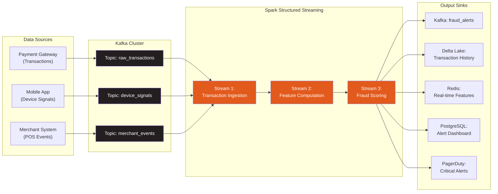
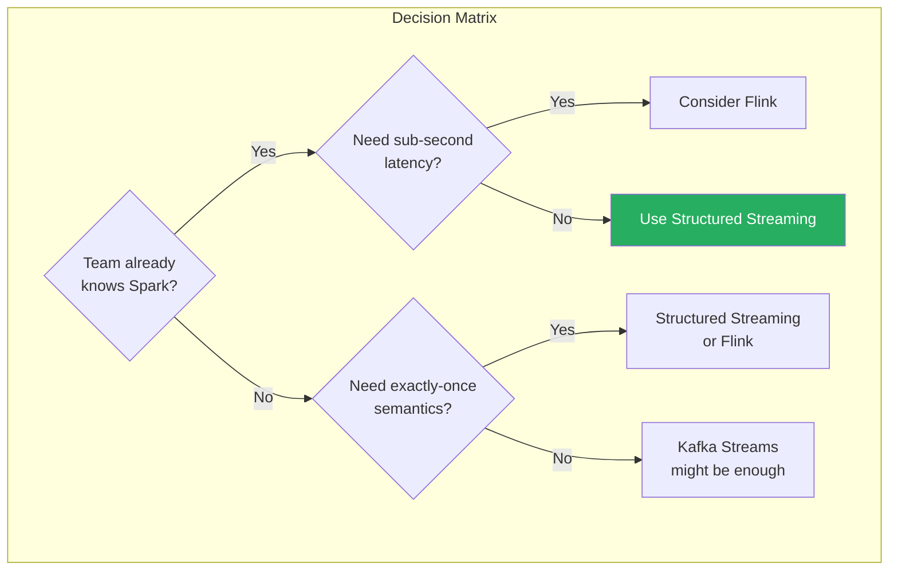
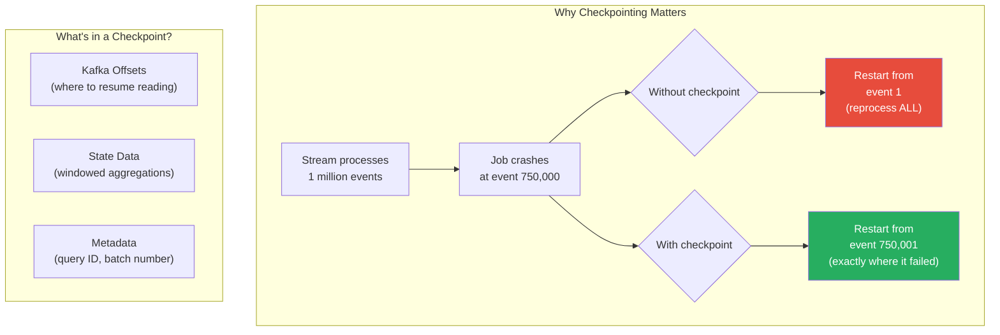
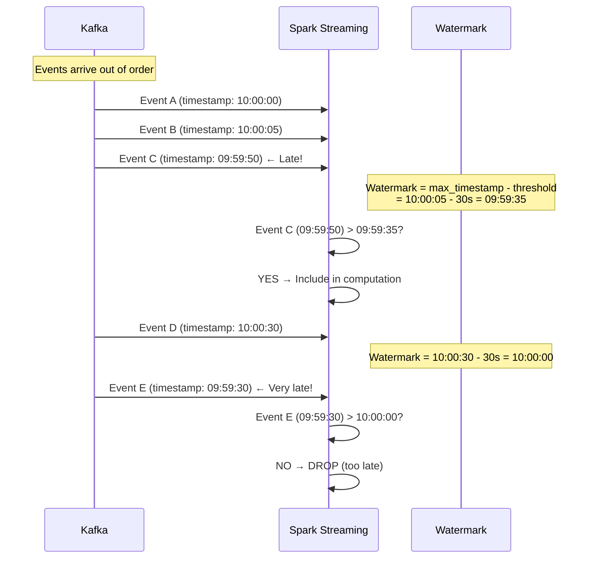
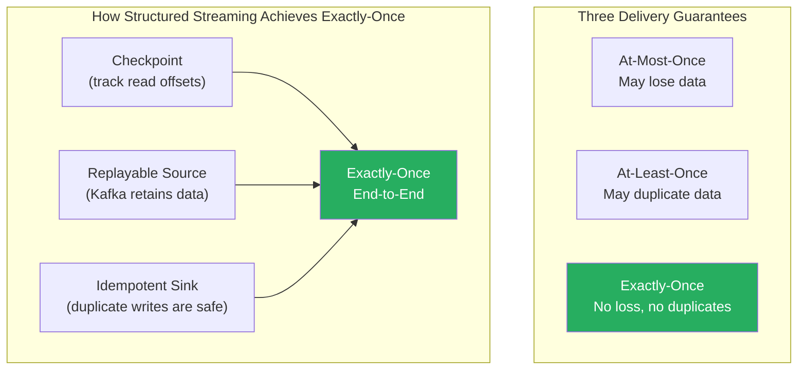
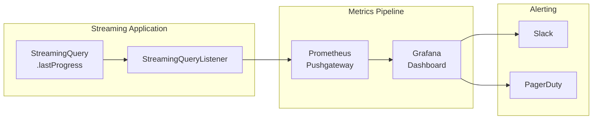
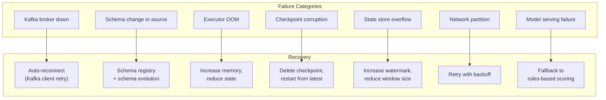
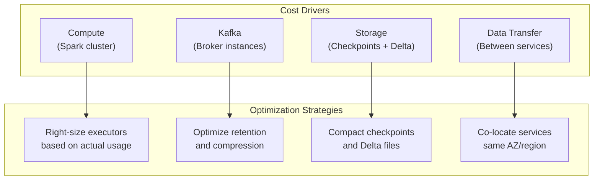

# Project 3: Real-Time Streaming Pipeline

> **Scenario:** You're building a real-time fraud detection system for a digital payments company. Every transaction flows through Kafka, gets processed by Structured Streaming, enriched with customer history, scored by a fraud model, and triggers alerts in real-time. The system processes 50,000 transactions per second at peak and must detect fraud within 5 seconds.

---

## 🎯 What You'll Build



---

## 📁 Project Structure

```
fraud-detection-streaming/
├── streaming_jobs/
│   ├── transaction_ingestion.py       # Read from Kafka, parse, validate
│   ├── feature_computation.py         # Real-time feature engineering
│   ├── fraud_scoring.py               # Model scoring and alerting
│   ├── multi_sink_writer.py           # Write to multiple outputs
│   └── common/
│       ├── schemas.py                 # Avro/JSON schemas
│       ├── spark_session.py           # Streaming SparkSession config
│       ├── kafka_config.py            # Kafka connection settings
│       └── feature_functions.py       # Reusable feature transformations
├── model/
│   ├── fraud_model.py                 # Model loading and scoring
│   ├── model_registry.py             # MLflow model registry client
│   └── models/
│       └── fraud_model_v3.pkl        # Serialized model
├── infrastructure/
│   ├── docker-compose.yml             # Kafka + Zookeeper + Schema Registry
│   ├── kafka/
│   │   ├── create_topics.sh           # Topic creation script
│   │   └── topic_config.json          # Topic configurations
│   └── monitoring/
│       ├── prometheus.yml             # Prometheus scrape config
│       └── grafana_dashboards/
│           └── streaming_dashboard.json
├── tests/
│   ├── test_feature_functions.py
│   ├── test_fraud_scoring.py
│   └── test_stream_processing.py
├── scripts/
│   ├── generate_transactions.py       # Transaction data generator
│   └── run_streaming_job.sh           # Job submission script
└── configs/
    ├── streaming_config.yaml
    └── checkpoint_config.yaml
```

---

## 🏗️ Streaming Architecture Deep Dive

### Why Structured Streaming (Not DStreams, Not Flink)?



| Feature | Structured Streaming | Kafka Streams | Apache Flink |
|---------|---------------------|---------------|-------------|
| **Latency** | 100ms - seconds | ms-level | ms-level |
| **Throughput** | Very high | High | Very high |
| **Exactly-once** | ✅ (with idempotent sinks) | ✅ | ✅ |
| **Stateful processing** | ✅ (watermarks, windows) | ✅ | ✅ (advanced) |
| **SQL support** | ✅ (full Spark SQL) | ❌ | ✅ (Flink SQL) |
| **Batch+Stream unification** | ✅ (same API) | ❌ | ✅ |
| **Learning curve** | Low (if you know Spark) | Low | Medium-High |
| **Deployment** | Spark cluster | JVM app (any) | Flink cluster |
| **Community/ecosystem** | Massive | Large | Growing |

---

## 🔧 Step 1: Kafka Setup

### Topic Design

```python
# infrastructure/kafka/create_topics.sh
"""
Kafka topic design for fraud detection.

Key decisions:
1. Partition count = expected peak TPS / target throughput per partition
   50,000 TPS / 5,000 per partition = 10 partitions
2. Replication factor = 3 (minimum for production)
3. Retention = 7 days (balance between reprocessing ability and cost)
"""

# Topic configurations (conceptual — run with kafka-topics.sh)
TOPICS = {
    "raw_transactions": {
        "partitions": 12,                # 12 partitions for 50K TPS
        "replication_factor": 3,
        "configs": {
            "retention.ms": 604800000,   # 7 days
            "cleanup.policy": "delete",
            "compression.type": "lz4",   # Fast compression
            "max.message.bytes": 1048576, # 1MB max message
            "min.insync.replicas": 2,    # At least 2 replicas in sync
        }
    },
    "device_signals": {
        "partitions": 6,
        "replication_factor": 3,
        "configs": {
            "retention.ms": 86400000,    # 1 day
            "compression.type": "lz4",
        }
    },
    "fraud_alerts": {
        "partitions": 6,
        "replication_factor": 3,
        "configs": {
            "retention.ms": 2592000000,  # 30 days — alerts need longer retention
            "cleanup.policy": "delete",
            "compression.type": "snappy",
        }
    },
    "enriched_transactions": {
        "partitions": 12,
        "replication_factor": 3,
        "configs": {
            "retention.ms": 259200000,   # 3 days
            "compression.type": "lz4",
        }
    },
}
```

### Kafka Configuration for Spark

```python
# streaming_jobs/common/kafka_config.py
"""
Kafka connection configuration for Structured Streaming.

Critical settings explained:
- startingOffsets: Where to start reading on first run
- maxOffsetsPerTrigger: Controls micro-batch size (backpressure)
- failOnDataLoss: Whether to crash on data loss detection
"""

import os

ENV = os.getenv("ENVIRONMENT", "dev")

KAFKA_CONFIGS = {
    "dev": {
        "kafka.bootstrap.servers": "localhost:9092",
        "kafka.security.protocol": "PLAINTEXT",
    },
    "staging": {
        "kafka.bootstrap.servers": "kafka-staging-1:9092,kafka-staging-2:9092,kafka-staging-3:9092",
        "kafka.security.protocol": "SASL_SSL",
        "kafka.sasl.mechanism": "SCRAM-SHA-256",
        "kafka.sasl.jaas.config": (
            'org.apache.kafka.common.security.scram.ScramLoginModule required '
            'username="streaming-app" password="${KAFKA_PASSWORD}";'
        ),
    },
    "prod": {
        "kafka.bootstrap.servers": "kafka-prod-1:9092,kafka-prod-2:9092,kafka-prod-3:9092",
        "kafka.security.protocol": "SASL_SSL",
        "kafka.sasl.mechanism": "SCRAM-SHA-256",
        "kafka.sasl.jaas.config": (
            'org.apache.kafka.common.security.scram.ScramLoginModule required '
            'username="fraud-detection" password="${KAFKA_PASSWORD}";'
        ),
        "kafka.ssl.truststore.location": "/opt/kafka/truststore.jks",
        "kafka.ssl.truststore.password": "${TRUSTSTORE_PASSWORD}",
    },
}


def get_kafka_read_config(topic: str, consumer_group: str) -> dict:
    """Get Kafka consumer configuration for Structured Streaming."""
    base_config = KAFKA_CONFIGS[ENV].copy()
    base_config.update({
        "subscribe": topic,
        "startingOffsets": "latest",         # Start from latest on first run
        "maxOffsetsPerTrigger": "100000",    # Max 100K records per micro-batch
        "failOnDataLoss": "false",           # Don't crash — log and continue
        "kafka.group.id": consumer_group,
    })
    return base_config


def get_kafka_write_config(topic: str) -> dict:
    """Get Kafka producer configuration for Structured Streaming output."""
    base_config = KAFKA_CONFIGS[ENV].copy()
    base_config.update({
        "topic": topic,
        "kafka.acks": "all",                  # Wait for all replicas
        "kafka.retries": "3",
        "kafka.batch.size": "65536",          # 64KB batch
        "kafka.linger.ms": "10",              # Wait up to 10ms to batch
    })
    return base_config
```

---

## 🔧 Step 2: Transaction Ingestion Stream

```python
# streaming_jobs/transaction_ingestion.py
"""
Stream 1: Real-time transaction ingestion from Kafka.

This is the entry point of the fraud detection pipeline.
It reads raw transaction events from Kafka, parses them,
validates the schema, and writes to the checkpoint.

Key concepts demonstrated:
1. Reading from Kafka with Structured Streaming
2. JSON parsing with schema enforcement
3. Watermarking for handling late data
4. Writing to multiple sinks (foreachBatch)
"""

import logging
from pyspark.sql import SparkSession, DataFrame
from pyspark.sql.functions import (
    col, from_json, to_timestamp, window, current_timestamp,
    lit, when, struct, to_json, expr, sha2, concat_ws
)
from pyspark.sql.types import (
    StructType, StructField, StringType, DoubleType,
    TimestampType, BooleanType, IntegerType
)

import sys
sys.path.insert(0, '/opt/streaming-jobs/common')
from spark_session import create_streaming_session
from kafka_config import get_kafka_read_config, get_kafka_write_config

logging.basicConfig(level=logging.INFO)
logger = logging.getLogger(__name__)

# ──────────────────────────────────────────────
# Schema Definition
# ──────────────────────────────────────────────

TRANSACTION_SCHEMA = StructType([
    StructField("transaction_id", StringType(), False),
    StructField("user_id", StringType(), False),
    StructField("merchant_id", StringType(), True),
    StructField("amount", DoubleType(), False),
    StructField("currency", StringType(), False),
    StructField("transaction_type", StringType(), False),   # PURCHASE, TRANSFER, WITHDRAWAL
    StructField("card_number_hash", StringType(), True),    # Pre-hashed for PCI compliance
    StructField("merchant_category", StringType(), True),   # MCC code
    StructField("country_code", StringType(), True),
    StructField("city", StringType(), True),
    StructField("device_id", StringType(), True),
    StructField("ip_address", StringType(), True),
    StructField("timestamp", StringType(), False),
    StructField("channel", StringType(), True),             # ONLINE, POS, ATM, MOBILE
])


def create_transaction_stream(spark: SparkSession) -> DataFrame:
    """
    Create a streaming DataFrame from Kafka topic.

    What happens under the hood:
    1. Spark creates a Kafka consumer per partition
    2. Each micro-batch reads up to maxOffsetsPerTrigger records
    3. Records arrive as binary key-value pairs
    4. We parse the value (JSON) using our schema
    """

    kafka_config = get_kafka_read_config(
        topic="raw_transactions",
        consumer_group="fraud-detection-ingestion"
    )

    raw_stream = (
        spark.readStream
        .format("kafka")
        .options(**kafka_config)
        .load()
    )

    # Kafka gives us: key (binary), value (binary), topic, partition, offset, timestamp
    # We need to parse the value column
    parsed_stream = (
        raw_stream
        .selectExpr("CAST(value AS STRING) as json_value", "timestamp as kafka_timestamp")
        .select(
            from_json(col("json_value"), TRANSACTION_SCHEMA).alias("data"),
            col("kafka_timestamp")
        )
        .select("data.*", "kafka_timestamp")
    )

    return parsed_stream


def validate_and_enrich(df: DataFrame) -> DataFrame:
    """
    Validate transaction data and add enrichment columns.

    Validation rules:
    1. amount must be positive
    2. transaction_id must not be null
    3. timestamp must parse correctly
    4. Flag suspicious patterns for downstream scoring
    """

    validated_df = (
        df
        # Parse timestamp
        .withColumn(
            "event_timestamp",
            to_timestamp(col("timestamp"), "yyyy-MM-dd'T'HH:mm:ss.SSSZ")
        )

        # Validation flags
        .withColumn("is_valid",
            (col("transaction_id").isNotNull()) &
            (col("amount") > 0) &
            (col("amount") < 1_000_000) &         # Sanity check: < $1M
            (col("event_timestamp").isNotNull()) &
            (col("user_id").isNotNull())
        )

        # Quick-flag obvious suspicious patterns
        .withColumn("is_high_value", col("amount") > 5000)
        .withColumn("is_international",
            col("country_code") != lit("US")       # Assuming US-based company
        )

        # Add processing metadata
        .withColumn("ingestion_timestamp", current_timestamp())
        .withColumn("processing_lag_ms",
            (current_timestamp().cast("long") - col("event_timestamp").cast("long")) * 1000
        )
    )

    return validated_df


def setup_watermark(df: DataFrame, watermark_delay: str = "30 seconds") -> DataFrame:
    """
    Apply watermark on the event timestamp.

    WHY WATERMARKS MATTER:
    ─────────────────────
    In streaming, events can arrive out of order. A transaction that happened
    at 10:00:00 might arrive at 10:00:05 due to network delays.

    The watermark tells Spark: "Don't expect any event older than 30 seconds
    to arrive. If it does, we'll drop it."

    This is the fundamental trade-off:
    - Short watermark (5s) = less memory, but drops more late events
    - Long watermark (5min) = more memory, but catches more late events

    For fraud detection, 30 seconds is a good balance:
    - Most transactions arrive within 1-2 seconds
    - Network issues rarely cause > 30 second delays
    - We'd rather miss a late event than use excessive memory
    """
    return df.withWatermark("event_timestamp", watermark_delay)


def write_to_delta_and_kafka(df: DataFrame, epoch_id: int):
    """
    foreachBatch function: Write each micro-batch to multiple sinks.

    Why foreachBatch instead of separate writeStream calls?
    1. One read from Kafka, multiple writes — more efficient
    2. We can apply different transformations per sink
    3. We can handle per-batch logic (like counting records)

    Important: foreachBatch gives us exactly-once on the READ side.
    For exactly-once on the WRITE side, each sink must be idempotent.
    """
    if df.isEmpty():
        return

    # Cache the DataFrame — we're reading it multiple times
    df.cache()

    try:
        record_count = df.count()
        valid_count = df.filter(col("is_valid")).count()
        invalid_count = record_count - valid_count

        logger.info(
            f"Batch {epoch_id}: {record_count} records "
            f"({valid_count} valid, {invalid_count} invalid)"
        )

        # ── Sink 1: Write ALL records to Delta Lake (audit trail) ──
        (
            df.write
            .format("delta")
            .mode("append")
            .partitionBy("transaction_date")
            .save("s3://fraud-data/bronze/transactions/")
        )

        # ── Sink 2: Write VALID records to Kafka for downstream processing ──
        valid_df = df.filter(col("is_valid"))
        if valid_df.count() > 0:
            kafka_write_config = get_kafka_write_config("enriched_transactions")

            (
                valid_df
                .select(
                    col("transaction_id").alias("key"),
                    to_json(struct("*")).alias("value")
                )
                .write
                .format("kafka")
                .options(**kafka_write_config)
                .save()
            )

        # ── Sink 3: Write INVALID records to dead-letter topic ──
        invalid_df = df.filter(~col("is_valid"))
        if invalid_df.count() > 0:
            dlt_config = get_kafka_write_config("dead_letter_transactions")

            (
                invalid_df
                .select(
                    col("transaction_id").alias("key"),
                    to_json(struct("*")).alias("value")
                )
                .write
                .format("kafka")
                .options(**dlt_config)
                .save()
            )

            logger.warning(f"Batch {epoch_id}: {invalid_count} records sent to DLT")

    finally:
        df.unpersist()


def main():
    spark = create_streaming_session(
        app_name="fraud-detection-ingestion",
        extra_configs={
            "spark.sql.shuffle.partitions": "12",         # Match Kafka partitions
            "spark.streaming.backpressure.enabled": "true",
            "spark.sql.streaming.metricsEnabled": "true",
        }
    )

    try:
        # Build streaming pipeline
        raw_stream = create_transaction_stream(spark)
        validated_stream = validate_and_enrich(raw_stream)
        watermarked_stream = setup_watermark(validated_stream, "30 seconds")

        # Add partition column for Delta Lake
        final_stream = watermarked_stream.withColumn(
            "transaction_date",
            col("event_timestamp").cast("date")
        )

        # Start the streaming query
        query = (
            final_stream.writeStream
            .foreachBatch(write_to_delta_and_kafka)
            .outputMode("append")
            .trigger(processingTime="10 seconds")           # Micro-batch every 10 seconds
            .option("checkpointLocation", "s3://fraud-data/checkpoints/ingestion/")
            .queryName("transaction_ingestion")
            .start()
        )

        # Monitor the stream
        logger.info("Transaction ingestion stream started")
        logger.info(f"Query ID: {query.id}")
        logger.info(f"Query Name: {query.name}")

        # Wait for termination (or crash)
        query.awaitTermination()

    except Exception as e:
        logger.error(f"Streaming job failed: {e}", exc_info=True)
        raise
    finally:
        spark.stop()


if __name__ == "__main__":
    main()
```

---

## 🔧 Step 3: Real-Time Feature Computation

```python
# streaming_jobs/feature_computation.py
"""
Stream 2: Real-time feature computation for fraud scoring.

This is where the streaming magic happens. We compute features like:
- Transaction velocity (how many transactions in the last 5 minutes?)
- Amount patterns (is this amount unusual for this user?)
- Geographic velocity (impossible travel detection)

Key concepts:
1. Stateful streaming with mapGroupsWithState
2. Window operations (tumbling, sliding, session)
3. Stream-static joins (enrich with historical data)
4. Watermarking for state cleanup
"""

import logging
from pyspark.sql import SparkSession, DataFrame
from pyspark.sql.functions import (
    col, count, sum as spark_sum, avg, stddev,
    max as spark_max, min as spark_min,
    window, lit, when, struct, to_json, from_json,
    current_timestamp, expr, datediff, abs as spark_abs,
    collect_list, size, array_distinct, approx_count_distinct,
    lag, lead, round as spark_round
)
from pyspark.sql.window import Window
from pyspark.sql.types import (
    StructType, StructField, StringType, DoubleType,
    TimestampType, IntegerType, LongType, ArrayType
)

import sys
sys.path.insert(0, '/opt/streaming-jobs/common')
from spark_session import create_streaming_session
from kafka_config import get_kafka_read_config, get_kafka_write_config

logging.basicConfig(level=logging.INFO)
logger = logging.getLogger(__name__)


# ──────────────────────────────────────────────
# Feature 1: Transaction Velocity (Windowed)
# ──────────────────────────────────────────────

def compute_velocity_features(stream_df: DataFrame) -> DataFrame:
    """
    Compute transaction velocity using SLIDING WINDOWS.

    What is a sliding window?
    ─────────────────────────
    A sliding window has two parameters:
    - Window size: how wide the window is (e.g., 5 minutes)
    - Slide interval: how often a new window starts (e.g., 1 minute)

    Example with 5-minute window, 1-minute slide:
    Window 1: [10:00 - 10:05)
    Window 2: [10:01 - 10:06)
    Window 3: [10:02 - 10:07)
    → Each transaction falls into 5 windows

    For fraud detection, we compute:
    - How many transactions did this user make in the last 5 minutes?
    - What was the total amount in the last 10 minutes?
    - How many distinct merchants in the last 30 minutes?
    """

    # 5-minute sliding window with 1-minute slide
    velocity_5min = (
        stream_df
        .withWatermark("event_timestamp", "30 seconds")
        .groupBy(
            col("user_id"),
            window(col("event_timestamp"), "5 minutes", "1 minute")
        )
        .agg(
            count("*").alias("txn_count_5min"),
            spark_round(spark_sum("amount"), 2).alias("total_amount_5min"),
            spark_round(avg("amount"), 2).alias("avg_amount_5min"),
            spark_round(spark_max("amount"), 2).alias("max_amount_5min"),
            approx_count_distinct("merchant_id").alias("distinct_merchants_5min"),
            approx_count_distinct("country_code").alias("distinct_countries_5min"),
            collect_list("channel").alias("channels_used_5min"),
        )
        .select(
            "user_id",
            col("window.start").alias("window_start"),
            col("window.end").alias("window_end"),
            "txn_count_5min",
            "total_amount_5min",
            "avg_amount_5min",
            "max_amount_5min",
            "distinct_merchants_5min",
            "distinct_countries_5min",
            size(array_distinct(col("channels_used_5min"))).alias("distinct_channels_5min"),
        )
    )

    return velocity_5min


# ──────────────────────────────────────────────
# Feature 2: User Spending Pattern (Stream-Static Join)
# ──────────────────────────────────────────────

def enrich_with_user_history(
    stream_df: DataFrame,
    spark: SparkSession,
) -> DataFrame:
    """
    Join streaming transactions with static user spending profiles.

    Stream-Static Join:
    ────────────────────
    The streaming DataFrame (new transactions) is joined with a
    static DataFrame (historical user profiles). The static data
    is re-read on each micro-batch (or cached if configured).

    This lets us compare: "Is this transaction amount unusual for this user?"

    For example, if a user typically spends $20-50, and suddenly
    makes a $5,000 purchase, the z-score will be very high → fraud signal.
    """

    # Load user spending profiles (computed daily by batch pipeline)
    user_profiles = (
        spark.read
        .parquet("s3://fraud-data/features/user_spending_profiles/")
        .select(
            "user_id",
            "avg_transaction_amount",
            "stddev_transaction_amount",
            "typical_merchant_categories",    # Array of usual MCC codes
            "typical_countries",              # Array of usual countries
            "typical_transaction_hours",      # Array of usual hours [9,10,11,...]
            "account_age_days",
            "total_lifetime_transactions",
        )
    )

    # Join streaming transactions with user profiles
    enriched = (
        stream_df
        .join(
            user_profiles,    # This will be broadcast if small enough
            "user_id",
            "left"            # LEFT join — new users won't have profiles yet
        )
        # Compute anomaly scores
        .withColumn(
            "amount_zscore",
            when(
                (col("stddev_transaction_amount").isNotNull()) &
                (col("stddev_transaction_amount") > 0),
                spark_round(
                    (col("amount") - col("avg_transaction_amount")) /
                    col("stddev_transaction_amount"),
                    4
                )
            ).otherwise(lit(0.0))
        )
        .withColumn(
            "is_new_merchant_category",
            when(
                col("typical_merchant_categories").isNotNull(),
                ~expr("array_contains(typical_merchant_categories, merchant_category)")
            ).otherwise(lit(True))  # New users → everything is "new"
        )
        .withColumn(
            "is_new_country",
            when(
                col("typical_countries").isNotNull(),
                ~expr("array_contains(typical_countries, country_code)")
            ).otherwise(lit(False))
        )
        .withColumn(
            "is_unusual_hour",
            when(
                col("typical_transaction_hours").isNotNull(),
                ~expr("array_contains(typical_transaction_hours, hour(event_timestamp))")
            ).otherwise(lit(False))
        )
        .withColumn(
            "is_new_account",
            (col("account_age_days").isNull()) | (col("account_age_days") < 30)
        )
    )

    return enriched


# ──────────────────────────────────────────────
# Feature 3: Geographic Velocity (Impossible Travel)
# ──────────────────────────────────────────────

def compute_geo_features(stream_df: DataFrame) -> DataFrame:
    """
    Detect impossible travel patterns.

    If a user makes a purchase in New York and then 5 minutes later
    in London, that's physically impossible → strong fraud signal.

    We compute this using lag() over the user's transaction stream,
    comparing consecutive transaction locations.
    """

    # For streaming, we need to maintain state per user
    # This is done using window operations with watermark

    geo_df = (
        stream_df
        .withWatermark("event_timestamp", "30 seconds")
        .groupBy(
            col("user_id"),
            window(col("event_timestamp"), "10 minutes", "1 minute")
        )
        .agg(
            approx_count_distinct("country_code").alias("countries_10min"),
            approx_count_distinct("city").alias("cities_10min"),
            collect_list(
                struct("country_code", "city", "event_timestamp")
            ).alias("locations"),
        )
        .withColumn(
            "impossible_travel",
            (col("countries_10min") > 1)   # Multiple countries in 10 min = suspicious
        )
    )

    return geo_df


# ──────────────────────────────────────────────
# Main: Combine All Features
# ──────────────────────────────────────────────

def main():
    spark = create_streaming_session(
        app_name="fraud-detection-features",
        extra_configs={
            "spark.sql.shuffle.partitions": "24",
            "spark.sql.streaming.stateStore.providerClass":
                "org.apache.spark.sql.execution.streaming.state.HDFSBackedStateStoreProvider",
            "spark.sql.streaming.stateStore.maintenanceInterval": "30s",
        }
    )

    try:
        # Read enriched transactions from Kafka
        kafka_config = get_kafka_read_config(
            topic="enriched_transactions",
            consumer_group="fraud-detection-features"
        )

        ENRICHED_SCHEMA = StructType([
            StructField("transaction_id", StringType()),
            StructField("user_id", StringType()),
            StructField("merchant_id", StringType()),
            StructField("amount", DoubleType()),
            StructField("currency", StringType()),
            StructField("transaction_type", StringType()),
            StructField("merchant_category", StringType()),
            StructField("country_code", StringType()),
            StructField("city", StringType()),
            StructField("device_id", StringType()),
            StructField("channel", StringType()),
            StructField("event_timestamp", TimestampType()),
            StructField("is_high_value", BooleanType()),
            StructField("is_international", BooleanType()),
        ])

        raw_stream = (
            spark.readStream
            .format("kafka")
            .options(**kafka_config)
            .load()
            .selectExpr("CAST(value AS STRING) as json_str")
            .select(from_json(col("json_str"), ENRICHED_SCHEMA).alias("data"))
            .select("data.*")
        )

        # Enrich with user history (stream-static join)
        enriched_stream = enrich_with_user_history(raw_stream, spark)

        # Compute velocity features (windowed aggregation)
        velocity_features = compute_velocity_features(raw_stream)

        # Write feature-enriched stream to Kafka for scoring
        def write_features(batch_df, epoch_id):
            if batch_df.isEmpty():
                return

            batch_df.cache()

            try:
                # Write to Kafka for real-time scoring
                kafka_config = get_kafka_write_config("feature_enriched_transactions")
                (
                    batch_df
                    .select(
                        col("transaction_id").alias("key"),
                        to_json(struct("*")).alias("value")
                    )
                    .write
                    .format("kafka")
                    .options(**kafka_config)
                    .save()
                )

                # Also write to Redis for feature serving
                # (In production, use a Redis sink or custom writer)
                record_count = batch_df.count()
                logger.info(f"Features batch {epoch_id}: {record_count} records processed")

            finally:
                batch_df.unpersist()

        # Start the enrichment stream
        enrichment_query = (
            enriched_stream.writeStream
            .foreachBatch(write_features)
            .outputMode("append")
            .trigger(processingTime="5 seconds")
            .option("checkpointLocation", "s3://fraud-data/checkpoints/features/enrichment/")
            .queryName("feature_enrichment")
            .start()
        )

        # Start the velocity features stream (separate query)
        velocity_query = (
            velocity_features.writeStream
            .format("delta")
            .outputMode("append")
            .trigger(processingTime="10 seconds")
            .option("checkpointLocation", "s3://fraud-data/checkpoints/features/velocity/")
            .option("path", "s3://fraud-data/features/velocity/")
            .queryName("velocity_features")
            .start()
        )

        logger.info("Feature computation streams started")

        # Wait for any query to terminate
        spark.streams.awaitAnyTermination()

    except Exception as e:
        logger.error(f"Feature computation failed: {e}", exc_info=True)
        raise
    finally:
        spark.stop()


if __name__ == "__main__":
    main()
```

---

## 🔧 Step 4: Fraud Scoring Stream

```python
# streaming_jobs/fraud_scoring.py
"""
Stream 3: Real-time fraud scoring and alerting.

This stream reads feature-enriched transactions, applies the fraud model,
and routes the results:
- Score > 0.8 → BLOCK transaction, alert fraud team (PagerDuty)
- Score 0.5-0.8 → FLAG for review, write to review queue
- Score < 0.5 → PASS, log the score for monitoring

The model is loaded from MLflow and cached in the driver.
"""

import logging
import pickle
import numpy as np
from pyspark.sql import SparkSession, DataFrame
from pyspark.sql.functions import (
    col, struct, to_json, from_json, udf, lit,
    current_timestamp, when, round as spark_round
)
from pyspark.sql.types import (
    StructType, StructField, StringType, DoubleType,
    BooleanType, TimestampType
)

import sys
sys.path.insert(0, '/opt/streaming-jobs/common')
from spark_session import create_streaming_session
from kafka_config import get_kafka_read_config, get_kafka_write_config

logging.basicConfig(level=logging.INFO)
logger = logging.getLogger(__name__)


# ──────────────────────────────────────────────
# Model Loading
# ──────────────────────────────────────────────

class FraudModel:
    """
    Wrapper for the fraud detection model.

    In production, this model is:
    1. Trained offline on historical data (batch ML pipeline)
    2. Registered in MLflow Model Registry
    3. Loaded by the streaming job at startup
    4. Applied to every transaction in real-time

    Model is loaded ONCE on the driver and broadcast to executors.
    """

    def __init__(self, model_path: str = None):
        self.model = None
        self.feature_names = [
            "amount", "amount_zscore", "txn_count_5min", "total_amount_5min",
            "distinct_merchants_5min", "distinct_countries_5min",
            "is_high_value", "is_international", "is_new_merchant_category",
            "is_new_country", "is_unusual_hour", "is_new_account",
            "impossible_travel", "account_age_days",
        ]

        if model_path:
            self.load(model_path)

    def load(self, model_path: str):
        """Load model from file or MLflow."""
        try:
            with open(model_path, 'rb') as f:
                self.model = pickle.load(f)
            logger.info(f"Model loaded from {model_path}")
        except Exception as e:
            logger.error(f"Failed to load model: {e}")
            # Fallback: use rules-based scoring
            self.model = None

    def predict(self, features: list) -> float:
        """
        Score a single transaction.

        Returns a probability between 0 and 1:
        - 0.0 = definitely legitimate
        - 1.0 = definitely fraud
        """
        if self.model is None:
            # Fallback rules-based scoring
            return self._rules_based_score(features)

        try:
            features_array = np.array(features).reshape(1, -1)
            score = float(self.model.predict_proba(features_array)[0][1])
            return score
        except Exception as e:
            logger.warning(f"Model scoring failed: {e}, using rules-based fallback")
            return self._rules_based_score(features)

    def _rules_based_score(self, features: list) -> float:
        """
        Simple rules-based fraud scoring as a fallback.

        This ensures we NEVER stop scoring, even if the ML model fails.
        Rules-based is less accurate but better than nothing.
        """
        score = 0.0
        feature_dict = dict(zip(self.feature_names, features))

        # High amount z-score
        if abs(feature_dict.get("amount_zscore", 0)) > 3:
            score += 0.3

        # Multiple countries in short time
        if feature_dict.get("distinct_countries_5min", 0) > 1:
            score += 0.3

        # High velocity
        if feature_dict.get("txn_count_5min", 0) > 10:
            score += 0.2

        # New account
        if feature_dict.get("is_new_account", False):
            score += 0.1

        # Unusual hour
        if feature_dict.get("is_unusual_hour", False):
            score += 0.05

        # New merchant category
        if feature_dict.get("is_new_merchant_category", False):
            score += 0.05

        return min(score, 1.0)


# ──────────────────────────────────────────────
# Scoring Pipeline
# ──────────────────────────────────────────────

def create_scoring_udf(model: FraudModel):
    """
    Create a UDF for fraud scoring.

    Why UDF instead of vectorized UDF?
    - The model is a scikit-learn model, not easily vectorized
    - UDF is simpler and works for our throughput requirements
    - For higher throughput, consider: Spark ML pipeline, ONNX, or microservice
    """

    feature_names = model.feature_names

    @udf(returnType=DoubleType())
    def score_transaction(
        amount, amount_zscore, txn_count_5min, total_amount_5min,
        distinct_merchants_5min, distinct_countries_5min,
        is_high_value, is_international, is_new_merchant_category,
        is_new_country, is_unusual_hour, is_new_account,
        impossible_travel, account_age_days,
    ):
        features = [
            float(amount or 0),
            float(amount_zscore or 0),
            float(txn_count_5min or 0),
            float(total_amount_5min or 0),
            float(distinct_merchants_5min or 0),
            float(distinct_countries_5min or 0),
            float(is_high_value or False),
            float(is_international or False),
            float(is_new_merchant_category or False),
            float(is_new_country or False),
            float(is_unusual_hour or False),
            float(is_new_account or False),
            float(impossible_travel or False),
            float(account_age_days or 0),
        ]
        return model.predict(features)

    return score_transaction


def apply_fraud_decision(df: DataFrame) -> DataFrame:
    """
    Apply decision logic based on fraud score.

    Decision matrix:
    ┌────────────────┬─────────────┬───────────────────┐
    │ Score Range     │ Decision    │ Action            │
    ├────────────────┼─────────────┼───────────────────┤
    │ >= 0.8         │ BLOCK       │ Block + Alert      │
    │ 0.5 - 0.8     │ REVIEW      │ Flag for review    │
    │ 0.3 - 0.5     │ MONITOR     │ Enhanced logging   │
    │ < 0.3         │ APPROVE     │ Normal processing  │
    └────────────────┴─────────────┴───────────────────┘
    """
    return df.withColumn(
        "fraud_decision",
        when(col("fraud_score") >= 0.8, lit("BLOCK"))
        .when(col("fraud_score") >= 0.5, lit("REVIEW"))
        .when(col("fraud_score") >= 0.3, lit("MONITOR"))
        .otherwise(lit("APPROVE"))
    ).withColumn(
        "requires_alert",
        col("fraud_score") >= 0.8
    ).withColumn(
        "requires_review",
        (col("fraud_score") >= 0.5) & (col("fraud_score") < 0.8)
    )


def write_scored_transactions(batch_df: DataFrame, epoch_id: int):
    """
    Route scored transactions to appropriate sinks.

    This is the final stage — each transaction is:
    1. Written to Delta Lake (all transactions, for audit)
    2. If BLOCK → Kafka fraud_alerts topic + PagerDuty
    3. If REVIEW → Kafka review_queue topic
    4. If APPROVE → just the Delta write
    """
    if batch_df.isEmpty():
        return

    batch_df.cache()

    try:
        total = batch_df.count()
        blocked = batch_df.filter(col("fraud_decision") == "BLOCK").count()
        reviewed = batch_df.filter(col("fraud_decision") == "REVIEW").count()

        logger.info(
            f"Scoring batch {epoch_id}: {total} total, "
            f"{blocked} blocked, {reviewed} for review"
        )

        # ── Sink 1: ALL transactions to Delta Lake ──
        (
            batch_df.write
            .format("delta")
            .mode("append")
            .partitionBy("transaction_date")
            .save("s3://fraud-data/gold/scored_transactions/")
        )

        # ── Sink 2: BLOCKED transactions → fraud_alerts Kafka topic ──
        blocked_df = batch_df.filter(col("fraud_decision") == "BLOCK")
        if blocked_df.count() > 0:
            alert_config = get_kafka_write_config("fraud_alerts")
            (
                blocked_df
                .select(
                    col("user_id").alias("key"),
                    to_json(struct(
                        "transaction_id", "user_id", "amount", "currency",
                        "merchant_id", "country_code", "fraud_score",
                        "fraud_decision", "event_timestamp"
                    )).alias("value")
                )
                .write
                .format("kafka")
                .options(**alert_config)
                .save()
            )

            logger.warning(f"Batch {epoch_id}: {blocked_df.count()} transactions BLOCKED")

        # ── Sink 3: REVIEW transactions → review queue ──
        review_df = batch_df.filter(col("fraud_decision") == "REVIEW")
        if review_df.count() > 0:
            review_config = get_kafka_write_config("review_queue")
            (
                review_df
                .select(
                    col("user_id").alias("key"),
                    to_json(struct("*")).alias("value")
                )
                .write
                .format("kafka")
                .options(**review_config)
                .save()
            )

    finally:
        batch_df.unpersist()


def main():
    spark = create_streaming_session(
        app_name="fraud-detection-scoring",
        extra_configs={
            "spark.sql.shuffle.partitions": "12",
        }
    )

    try:
        # Load fraud model
        model = FraudModel("/opt/models/fraud_model_v3.pkl")
        score_udf = create_scoring_udf(model)

        # Broadcast model feature names for reference
        spark.sparkContext.broadcast(model.feature_names)

        # Read feature-enriched transactions from Kafka
        kafka_config = get_kafka_read_config(
            topic="feature_enriched_transactions",
            consumer_group="fraud-detection-scoring"
        )

        # Define schema for feature-enriched messages
        FEATURE_SCHEMA = StructType([
            StructField("transaction_id", StringType()),
            StructField("user_id", StringType()),
            StructField("merchant_id", StringType()),
            StructField("amount", DoubleType()),
            StructField("currency", StringType()),
            StructField("country_code", StringType()),
            StructField("event_timestamp", TimestampType()),
            StructField("amount_zscore", DoubleType()),
            StructField("is_high_value", BooleanType()),
            StructField("is_international", BooleanType()),
            StructField("is_new_merchant_category", BooleanType()),
            StructField("is_new_country", BooleanType()),
            StructField("is_unusual_hour", BooleanType()),
            StructField("is_new_account", BooleanType()),
            StructField("txn_count_5min", IntegerType()),
            StructField("total_amount_5min", DoubleType()),
            StructField("distinct_merchants_5min", IntegerType()),
            StructField("distinct_countries_5min", IntegerType()),
            StructField("impossible_travel", BooleanType()),
            StructField("account_age_days", IntegerType()),
        ])

        feature_stream = (
            spark.readStream
            .format("kafka")
            .options(**kafka_config)
            .load()
            .selectExpr("CAST(value AS STRING)")
            .select(from_json(col("value"), FEATURE_SCHEMA).alias("data"))
            .select("data.*")
        )

        # Apply fraud scoring
        scored_stream = (
            feature_stream
            .withColumn(
                "fraud_score",
                spark_round(
                    score_udf(
                        col("amount"), col("amount_zscore"),
                        col("txn_count_5min"), col("total_amount_5min"),
                        col("distinct_merchants_5min"), col("distinct_countries_5min"),
                        col("is_high_value"), col("is_international"),
                        col("is_new_merchant_category"), col("is_new_country"),
                        col("is_unusual_hour"), col("is_new_account"),
                        col("impossible_travel"), col("account_age_days"),
                    ),
                    4
                )
            )
            .withColumn("scored_at", current_timestamp())
            .withColumn("transaction_date", col("event_timestamp").cast("date"))
            .transform(apply_fraud_decision)
        )

        # Start scoring query
        query = (
            scored_stream.writeStream
            .foreachBatch(write_scored_transactions)
            .outputMode("append")
            .trigger(processingTime="5 seconds")
            .option("checkpointLocation", "s3://fraud-data/checkpoints/scoring/")
            .queryName("fraud_scoring")
            .start()
        )

        logger.info("Fraud scoring stream started")
        query.awaitTermination()

    except Exception as e:
        logger.error(f"Fraud scoring failed: {e}", exc_info=True)
        raise
    finally:
        spark.stop()


if __name__ == "__main__":
    main()
```

---

## 🔧 Step 5: Checkpointing Deep Dive



### Checkpoint Configuration

```python
# Checkpoint best practices for production

# 1. Use a durable storage (S3, HDFS) — NOT local filesystem
checkpoint_location = "s3://fraud-data/checkpoints/scoring/"

# 2. One checkpoint directory per streaming query
# WRONG: sharing checkpoints between queries
# RIGHT: unique checkpoint per query
query1.option("checkpointLocation", "s3://checkpoints/query1/")
query2.option("checkpointLocation", "s3://checkpoints/query2/")

# 3. Never change the checkpoint location for a running query
# If you need to "reset" a stream, delete the checkpoint and restart

# 4. Checkpoint cleanup — old state can accumulate
# Set state cleanup policies:
spark.conf.set("spark.sql.streaming.stateStore.maintenanceInterval", "60s")

# 5. For exactly-once semantics, checkpoint + idempotent sink
# Checkpoint ensures we don't re-read from Kafka
# Idempotent sink ensures duplicate writes are harmless
```

---

## 🔧 Step 6: Handling Late Data



### Late Data Strategies

| Strategy | Implementation | When to Use |
|----------|---------------|-------------|
| **Drop late data** | Default with watermark | When losing a few events is acceptable |
| **Route to DLT** | foreachBatch + filter | When late data needs separate processing |
| **Accept all late data** | No watermark (⚠️) | Never in production — unbounded state |
| **Dual pipeline** | Streaming + batch reconciliation | Financial systems requiring 100% accuracy |

```python
# The Dual Pipeline Pattern (streaming + batch reconciliation)
#
# Streaming pipeline: processes events in real-time, may drop some late data
# Batch pipeline: runs daily, reprocesses ALL data, catches anything streaming missed
#
# If streaming says "500 fraud cases" and batch says "503 fraud cases",
# the 3 extra cases were late arrivals that streaming dropped.

# Batch reconciliation job (runs daily)
def reconcile_streaming_with_batch(spark, date):
    """
    Compare streaming output with batch reprocessing.
    Flag any discrepancies for investigation.
    """
    streaming_results = spark.read.format("delta").load(
        f"s3://fraud-data/gold/scored_transactions/"
    ).filter(col("transaction_date") == date)

    batch_results = spark.read.parquet(
        f"s3://fraud-data/batch/scored_transactions/date={date}/"
    )

    # Find transactions in batch but not in streaming
    missed_by_streaming = batch_results.join(
        streaming_results,
        "transaction_id",
        "left_anti"     # Rows in batch NOT in streaming
    )

    missed_count = missed_by_streaming.count()
    if missed_count > 0:
        logger.warning(f"Streaming missed {missed_count} transactions on {date}")
        # Re-score and alert
```

---

## 🔧 Step 7: Exactly-Once Semantics



### Requirements for Exactly-Once

```python
# 1. REPLAYABLE SOURCE — Kafka retains messages for replay
# Kafka keeps messages for retention.ms (we set 7 days)
# If Spark crashes, it can re-read from the last committed offset

# 2. CHECKPOINT — Tracks offsets atomically
# After each micro-batch, Spark atomically writes:
# - Which Kafka offsets were consumed
# - What state was computed
# If Spark crashes mid-batch, it replays from the last checkpoint

# 3. IDEMPOTENT SINK — Duplicate writes are harmless

# Idempotent Delta Lake write (MERGE)
def idempotent_delta_write(batch_df, epoch_id):
    from delta.tables import DeltaTable

    target_table = DeltaTable.forPath(spark, "s3://fraud-data/gold/transactions/")

    (
        target_table.alias("target")
        .merge(
            batch_df.alias("source"),
            "target.transaction_id = source.transaction_id"  # Match on natural key
        )
        .whenMatchedUpdateAll()     # Update if exists (idempotent)
        .whenNotMatchedInsertAll()  # Insert if new
        .execute()
    )

# Idempotent Kafka write
# Kafka producer with enable.idempotence=true ensures
# duplicate sends are deduplicated by the broker
kafka_write_config = {
    "kafka.enable.idempotence": "true",
    "kafka.acks": "all",
    "kafka.retries": "3",
}
```

---

## 📊 Monitoring Streaming Queries

### Streaming Metrics Architecture



### Custom Streaming Monitor

```python
# streaming_jobs/common/stream_monitor.py
"""
Custom streaming query monitor.

This monitors:
1. Processing rate (records/second)
2. Processing time per batch
3. Input vs output rate (backpressure indicator)
4. State store size (memory pressure indicator)
5. Watermark lag (how far behind are we?)
"""

import logging
import json
from pyspark.sql.streaming import StreamingQueryListener

logger = logging.getLogger(__name__)


class FraudStreamingMonitor(StreamingQueryListener):
    """
    Listener for streaming query events.

    This is called by Spark for every micro-batch:
    - onQueryStarted: Stream begins
    - onQueryProgress: After each micro-batch
    - onQueryTerminated: Stream ends (normal or crash)
    """

    def onQueryStarted(self, event):
        logger.info(f"Stream started: {event.name} (ID: {event.id})")

    def onQueryProgress(self, event):
        progress = event.progress

        # Key metrics
        metrics = {
            "query_name": progress.name,
            "batch_id": progress.batchId,
            "num_input_rows": progress.numInputRows,
            "input_rows_per_second": progress.inputRowsPerSecond,
            "processed_rows_per_second": progress.processedRowsPerSecond,
            "batch_duration_ms": progress.batchDuration,
        }

        # Check for backpressure
        if progress.inputRowsPerSecond > 0:
            processing_ratio = progress.processedRowsPerSecond / progress.inputRowsPerSecond
            metrics["processing_ratio"] = processing_ratio

            if processing_ratio < 0.8:
                logger.warning(
                    f"BACKPRESSURE DETECTED: Processing at {processing_ratio:.1%} "
                    f"of input rate. Consider adding partitions or resources."
                )

        # Check state store size
        if progress.stateOperators:
            for state_op in progress.stateOperators:
                metrics["state_rows"] = state_op.get("numRowsTotal", 0)
                metrics["state_bytes"] = state_op.get("memoryUsedBytes", 0)

                # Alert if state is growing too large
                state_mb = metrics["state_bytes"] / (1024 * 1024)
                if state_mb > 1024:  # > 1 GB
                    logger.warning(
                        f"State store is {state_mb:.0f} MB — consider increasing "
                        f"watermark or reducing window size"
                    )

        # Check watermark
        if progress.eventTime:
            watermark = progress.eventTime.get("watermark")
            if watermark:
                metrics["watermark"] = watermark

        logger.info(f"Streaming progress: {json.dumps(metrics)}")

        # Push metrics to Prometheus (or your monitoring system)
        # push_to_prometheus(metrics)

    def onQueryTerminated(self, event):
        if event.exception:
            logger.error(f"Stream TERMINATED with error: {event.exception}")
            # Trigger PagerDuty alert
            # send_pagerduty_alert(f"Streaming query terminated: {event.exception}")
        else:
            logger.info(f"Stream terminated normally: {event.id}")


# Usage:
# spark.streams.addListener(FraudStreamingMonitor())
```

### Key Metrics Dashboard

| Metric | Normal Range | Alert Threshold | Action |
|--------|-------------|-----------------|--------|
| Input rate | 30-50K records/sec | < 10K or > 80K | Check source or scale up |
| Processing time | < 5 seconds/batch | > 30 seconds | Scale up, optimize query |
| Processing ratio | > 0.9 | < 0.7 | Add partitions, more executors |
| State store size | < 500 MB | > 2 GB | Reduce window, increase watermark |
| Watermark lag | < 1 minute | > 5 minutes | Check for slow consumers |
| Failed batches | 0 | > 3 consecutive | Investigate error, restart |

---

## ⚠️ Failure Scenarios

### What Goes Wrong in Streaming



| Failure | Impact | Detection | Recovery Time |
|---------|--------|-----------|---------------|
| Kafka broker down | Increased latency | Consumer lag spike | < 1 min (rebalance) |
| All Kafka brokers down | Stream stops | Query terminated event | Minutes (restart Kafka) |
| Executor OOM | Batch fails, retries | Task failure logs | Automatic (Spark retry) |
| Driver OOM | Stream crashes | Query terminated | Manual restart needed |
| Checkpoint corruption | Can't resume | Stream won't start | Delete checkpoint, lose state |
| State store full | OOM or slow processing | State metrics alert | Increase watermark |
| Model file missing | Can't score | UDF exception | Fallback to rules-based |

---

## 💰 Cost Optimization

### Streaming Cost Factors



| Optimization | Estimated Savings | How |
|-------------|-------------------|-----|
| Right-size executors | 30-40% compute | Profile CPU/memory, reduce over-provisioning |
| Increase trigger interval | 10-20% compute | 10s → 30s (if latency allows) |
| Compact Delta Lake | 20-30% storage | Run OPTIMIZE regularly |
| LZ4 compression for Kafka | 40-60% network | Fast compression, less data transferred |
| Reduce state store | 20-30% memory | Shorter windows, larger watermarks |
| Spot instances for workers | 60-80% compute | Streaming workers are stateless, replaceable |

---

## 🎤 Interview Relevance

### Questions This Project Prepares You For

| Question | Key Points to Cover |
|----------|-------------------|
| "How does Structured Streaming work?" | Micro-batch, trigger intervals, offsets, checkpoints |
| "Explain watermarks" | Late data handling, state cleanup, accuracy vs memory trade-off |
| "How do you achieve exactly-once?" | Checkpoint + replayable source + idempotent sink |
| "How do you handle late data?" | Watermark threshold, DLT routing, batch reconciliation |
| "Design a fraud detection system" | Kafka → Feature computation → Model scoring → Multi-sink output |
| "Stream-static join vs stream-stream?" | When to use each, watermark requirements, state implications |
| "What's the difference between output modes?" | Append (new rows only), Update (changed rows), Complete (full result) |
| "How do you monitor streaming?" | StreamingQueryListener, processing rate, watermark lag, state size |

### How to Talk About This in Interviews

> "I built a real-time fraud detection pipeline processing 50K transactions per second. Kafka provides the message backbone with 12-partition topics for parallelism. Spark Structured Streaming reads events in 5-second micro-batches, enriches them with user spending profiles via stream-static joins, computes velocity features using sliding windows, and scores each transaction with an ML model loaded from MLflow. We achieve exactly-once semantics through Kafka checkpointing and idempotent Delta Lake writes using MERGE. Late-arriving data within 30 seconds is handled by our watermark; anything later goes to a dead-letter topic for batch reconciliation. The system detects fraud within 5 seconds end-to-end, blocking high-confidence fraud automatically while routing medium-confidence cases to human reviewers."

---

**[← Back to Projects](../README.md#-projects)**
