# Project 4: Designing an Enterprise Data Platform

> **Scenario:** You've been hired as the Lead Data Architect at NovaPay, a Series C fintech company processing $2B in annual transactions. The CEO wants a unified data platform that serves analytics, ML, regulatory reporting, and real-time decisioning. Currently, data lives in 15+ siloed systems with no single source of truth. You have 12 months, a team of 8, and a $1.5M annual budget. Design the platform from scratch.

---

## 🎯 What You'll Design

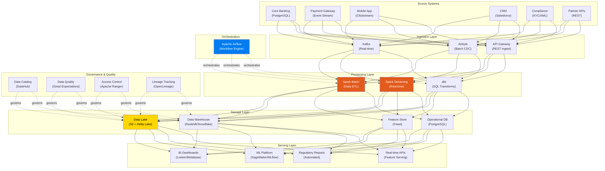

---

## 📋 Phase 1: Requirements Gathering

### Stakeholder Interviews

Before writing a single line of code, you need to understand what each team needs. Here's what we discovered at NovaPay:

| Stakeholder | Need | Latency | Volume | Priority |
|-------------|------|---------|--------|----------|
| **CEO / Board** | Daily revenue, growth metrics, unit economics | Daily | Summary | P0 |
| **Product Team** | Feature usage, A/B test results, conversion funnels | Hourly | Aggregated | P0 |
| **Risk Team** | Real-time fraud scoring, AML monitoring | Sub-second | Per-transaction | P0 |
| **Finance Team** | Revenue recognition, reconciliation, forecasting | Daily | Full detail | P0 |
| **Compliance** | SAR filing, transaction monitoring, audit trails | Daily + Real-time | Full detail | P0 |
| **ML Team** | Training data, feature serving, model monitoring | Mixed | TB-scale | P1 |
| **Marketing** | Customer segmentation, campaign attribution | Daily | Aggregated | P1 |
| **Customer Support** | Customer 360 view, transaction history | Real-time lookup | Per-customer | P2 |
| **Engineering** | System health, API performance, error tracking | Real-time | Metrics | P2 |

### Non-Functional Requirements

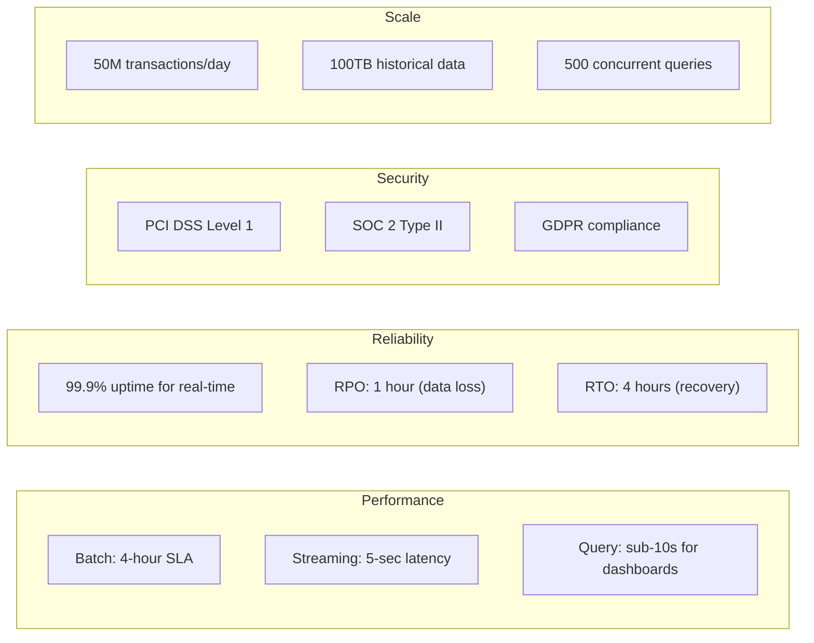

---

## 🏗️ Phase 2: Architecture Design

### The Four-Layer Architecture

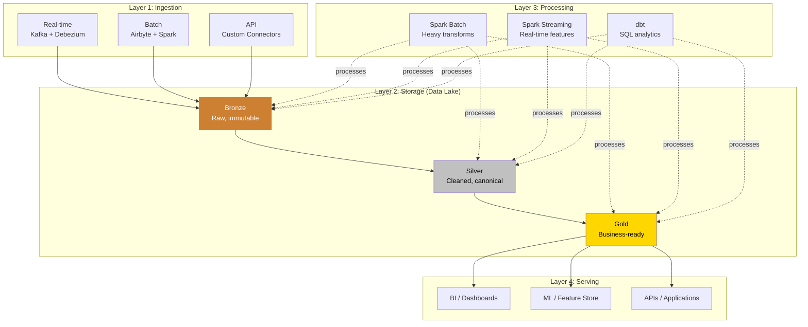

### Detailed Component Architecture

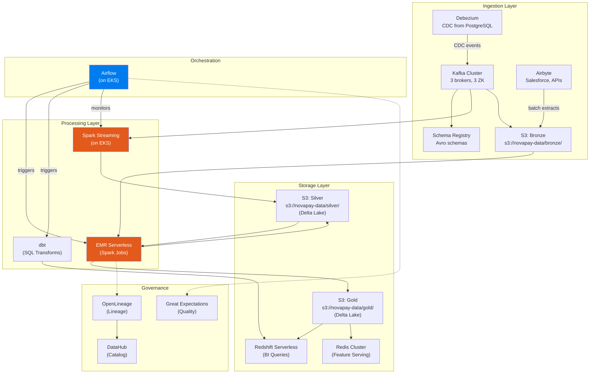

---

## 🔧 Phase 3: Technology Selection

### Decision Framework

For each component, we evaluate using these criteria:

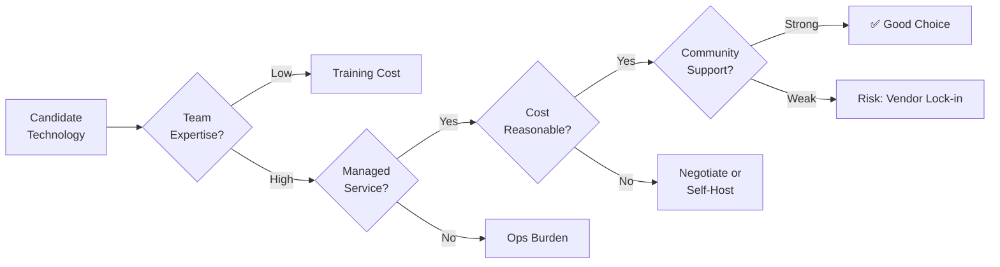

### Technology Decisions

| Component | Choice | Runner-Up | Why |
|-----------|--------|-----------|-----|
| **Orchestration** | Apache Airflow (MWAA) | Dagster | Team knows Airflow, MWAA reduces ops, massive community |
| **Batch Processing** | Apache Spark (EMR Serverless) | Snowflake SQL | Need complex transforms, ML integration, Python UDFs |
| **Stream Processing** | Spark Structured Streaming | Apache Flink | Same Spark skills, unified batch+streaming API |
| **Message Broker** | Apache Kafka (MSK) | Amazon Kinesis | Multi-consumer, replay, schema registry, industry standard |
| **Data Lake Storage** | S3 + Delta Lake | S3 + Apache Iceberg | Delta has best Spark integration, ACID transactions |
| **Data Warehouse** | Redshift Serverless | Snowflake | Cost-effective for our scale, good dbt integration |
| **Feature Store** | Feast | Tecton | Open source, works with our stack, lower cost |
| **Data Catalog** | DataHub | Apache Atlas | Modern UI, better developer experience, LinkedIn-backed |
| **Data Quality** | Great Expectations | dbt tests | Programmatic, works with Spark and SQL, rich assertions |
| **CDC** | Debezium | AWS DMS | Open source, low-latency, Kafka-native |
| **Batch Ingestion** | Airbyte | Fivetran | Open source, 300+ connectors, self-hostable |
| **BI Tool** | Metabase → Looker migration | Superset | Metabase for quick start, Looker for governance at scale |
| **ML Platform** | MLflow + SageMaker | Vertex AI | MLflow for experiment tracking, SageMaker for serving |
| **CI/CD** | GitHub Actions | GitLab CI | Team already uses GitHub |
| **Infrastructure** | Terraform + EKS | Pulumi | Industry standard, large community |

### AWS Architecture Map

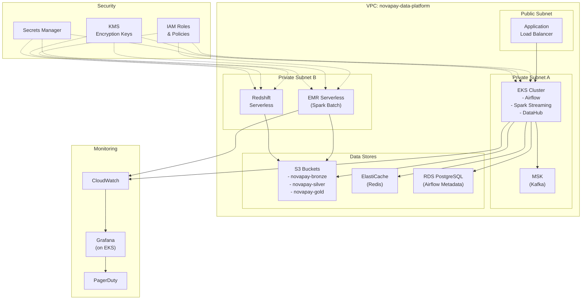

---

## 🔧 Phase 4: Data Modeling

### Enterprise Data Model

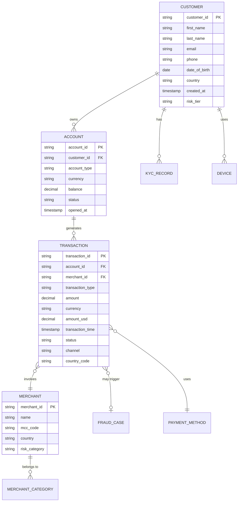

### Medallion Architecture — NovaPay Specifics

```python
# Data Lake Directory Structure
"""
s3://novapay-data/
├── bronze/                              # Raw data, immutable
│   ├── core_banking/                    # CDC from PostgreSQL
│   │   ├── customers/
│   │   │   └── year=2024/month=01/day=15/
│   │   ├── accounts/
│   │   └── transactions/
│   ├── payment_gateway/                 # Kafka events
│   │   └── raw_events/
│   │       └── year=2024/month=01/day=15/hour=14/
│   ├── mobile_app/                      # Clickstream
│   │   └── events/
│   ├── salesforce/                      # CRM data
│   │   ├── contacts/
│   │   └── cases/
│   └── compliance/                      # KYC/AML data
│       ├── kyc_records/
│       └── screening_results/
│
├── silver/                              # Cleaned, canonical (Delta Lake)
│   ├── customers/                       # Deduplicated, validated
│   ├── accounts/                        # Current state (SCD Type 2)
│   ├── transactions/                    # Canonical transaction format
│   │   └── transaction_date=2024-01-15/
│   ├── merchants/
│   └── events/                          # Unified event stream
│
├── gold/                                # Business aggregates (Delta Lake)
│   ├── analytics/
│   │   ├── daily_revenue/
│   │   ├── customer_360/
│   │   ├── merchant_performance/
│   │   └── funnel_metrics/
│   ├── risk/
│   │   ├── fraud_scores/
│   │   ├── aml_alerts/
│   │   └── risk_indicators/
│   ├── finance/
│   │   ├── revenue_recognition/
│   │   ├── reconciliation/
│   │   └── settlement/
│   └── ml_features/
│       ├── user_features/
│       ├── merchant_features/
│       └── transaction_features/
│
├── checkpoints/                         # Streaming checkpoints
│   ├── fraud_detection/
│   └── real_time_features/
│
├── metadata/                            # Data quality results, lineage
│   ├── dq_results/
│   ├── lineage/
│   └── watermarks/
│
└── archive/                             # Cold storage (Glacier)
    └── transactions_older_than_7_years/
"""
```

---

## 🔧 Phase 5: Airflow as the Orchestrator

### DAG Inventory

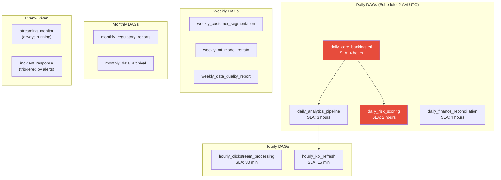

### Master DAG: Daily Core Banking ETL

```python
# dags/daily_core_banking_etl.py
"""
Master DAG for daily core banking ETL.

This is the most critical DAG in the platform.
It processes all banking transactions and feeds:
- Analytics dashboards
- Risk scoring
- Finance reconciliation
- Regulatory reporting

Failure of this DAG blocks 4 downstream DAGs.
It has the strictest SLA (complete by 6 AM UTC).
"""

from datetime import datetime, timedelta
from airflow import DAG
from airflow.operators.python import PythonOperator
from airflow.operators.empty import EmptyOperator
from airflow.providers.amazon.aws.operators.emr import EmrServerlessStartJobOperator
from airflow.providers.apache.spark.operators.spark_submit import SparkSubmitOperator
from airflow.sensors.external_task import ExternalTaskSensor
from airflow.utils.task_group import TaskGroup
from airflow.utils.trigger_rule import TriggerRule


default_args = {
    "owner": "data-platform",
    "depends_on_past": False,
    "retries": 2,
    "retry_delay": timedelta(minutes=5),
    "retry_exponential_backoff": True,
    "execution_timeout": timedelta(hours=3),
    "on_failure_callback": lambda ctx: alert_oncall(ctx, severity="P1"),
    "sla": timedelta(hours=4),
}


def create_emr_serverless_task(task_id, script_path, args, size="medium"):
    """Factory for EMR Serverless Spark tasks."""
    size_configs = {
        "small":  {"executor_count": 4,  "executor_memory": "4g",  "executor_cores": 2},
        "medium": {"executor_count": 8,  "executor_memory": "8g",  "executor_cores": 4},
        "large":  {"executor_count": 16, "executor_memory": "16g", "executor_cores": 4},
    }

    config = size_configs[size]

    return EmrServerlessStartJobOperator(
        task_id=task_id,
        application_id="{{ var.value.emr_application_id }}",
        execution_role_arn="{{ var.value.emr_execution_role }}",
        job_driver={
            "sparkSubmit": {
                "entryPoint": f"s3://novapay-code/spark-jobs/{script_path}",
                "entryPointArguments": args,
                "sparkSubmitParameters": (
                    f"--conf spark.executor.instances={config['executor_count']} "
                    f"--conf spark.executor.memory={config['executor_memory']} "
                    f"--conf spark.executor.cores={config['executor_cores']} "
                    "--conf spark.sql.adaptive.enabled=true "
                    "--conf spark.sql.session.timeZone=UTC "
                    "--conf spark.sql.extensions=io.delta.sql.DeltaSparkSessionExtension "
                    "--conf spark.sql.catalog.spark_catalog=org.apache.spark.sql.delta.catalog.DeltaCatalog "
                ),
            }
        },
        configuration_overrides={
            "monitoringConfiguration": {
                "s3MonitoringConfiguration": {
                    "logUri": "s3://novapay-logs/emr-serverless/"
                }
            }
        },
    )


with DAG(
    dag_id="daily_core_banking_etl",
    default_args=default_args,
    schedule_interval="0 2 * * *",
    start_date=datetime(2024, 1, 1),
    catchup=False,
    max_active_runs=1,
    tags=["production", "core", "banking", "P0"],
) as dag:

    PROCESSING_DATE = "{{ ds }}"

    start = EmptyOperator(task_id="start")

    # ── Phase 1: Ingest ──
    with TaskGroup("ingest") as ingest:
        ingest_customers = create_emr_serverless_task(
            "ingest_customers",
            "ingest/ingest_cdc.py",
            [PROCESSING_DATE, "customers"],
            size="small",
        )
        ingest_accounts = create_emr_serverless_task(
            "ingest_accounts",
            "ingest/ingest_cdc.py",
            [PROCESSING_DATE, "accounts"],
            size="small",
        )
        ingest_transactions = create_emr_serverless_task(
            "ingest_transactions",
            "ingest/ingest_cdc.py",
            [PROCESSING_DATE, "transactions"],
            size="large",       # Transactions are the biggest table
        )

    # ── Phase 2: Transform ──
    with TaskGroup("transform") as transform:
        clean_and_deduplicate = create_emr_serverless_task(
            "clean_and_deduplicate",
            "transform/clean_banking_data.py",
            [PROCESSING_DATE],
            size="large",
        )
        build_canonical = create_emr_serverless_task(
            "build_canonical_transactions",
            "transform/canonical_transactions.py",
            [PROCESSING_DATE],
            size="large",
        )
        scd_type2_accounts = create_emr_serverless_task(
            "scd_type2_accounts",
            "transform/scd_type2.py",
            [PROCESSING_DATE, "accounts"],
            size="medium",
        )

        clean_and_deduplicate >> build_canonical
        clean_and_deduplicate >> scd_type2_accounts

    # ── Phase 3: Quality ──
    with TaskGroup("quality") as quality:
        run_dq_checks = create_emr_serverless_task(
            "data_quality_checks",
            "quality/run_checks.py",
            [PROCESSING_DATE],
            size="medium",
        )
        publish_dq_results = PythonOperator(
            task_id="publish_dq_results",
            python_callable=lambda **ctx: publish_quality_dashboard(ctx["ds"]),
        )
        run_dq_checks >> publish_dq_results

    # ── Phase 4: Gold Layer ──
    with TaskGroup("gold") as gold:
        daily_revenue = create_emr_serverless_task(
            "daily_revenue",
            "gold/daily_revenue.py",
            [PROCESSING_DATE],
            size="medium",
        )
        customer_360 = create_emr_serverless_task(
            "customer_360",
            "gold/customer_360.py",
            [PROCESSING_DATE],
            size="large",
        )
        merchant_metrics = create_emr_serverless_task(
            "merchant_metrics",
            "gold/merchant_metrics.py",
            [PROCESSING_DATE],
            size="medium",
        )

    # ── Phase 5: Publish ──
    with TaskGroup("publish") as publish:
        load_to_redshift = create_emr_serverless_task(
            "load_to_redshift",
            "publish/load_redshift.py",
            [PROCESSING_DATE],
            size="medium",
        )
        refresh_features = create_emr_serverless_task(
            "refresh_feature_store",
            "publish/refresh_features.py",
            [PROCESSING_DATE],
            size="medium",
        )
        trigger_downstream = PythonOperator(
            task_id="trigger_downstream_dags",
            python_callable=lambda **ctx: trigger_dependent_dags(ctx["ds"]),
        )

    end = EmptyOperator(
        task_id="end",
        trigger_rule=TriggerRule.NONE_FAILED_MIN_ONE_SUCCESS,
    )

    # ── DAG Flow ──
    start >> ingest >> transform >> quality >> gold >> publish >> end
```

### DAG Dependency Map

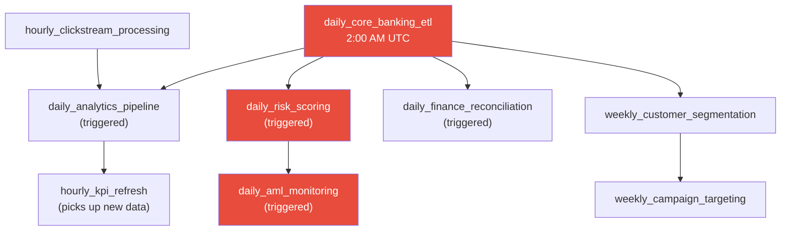

---

## 🔧 Phase 6: Data Quality Framework

### Quality Architecture

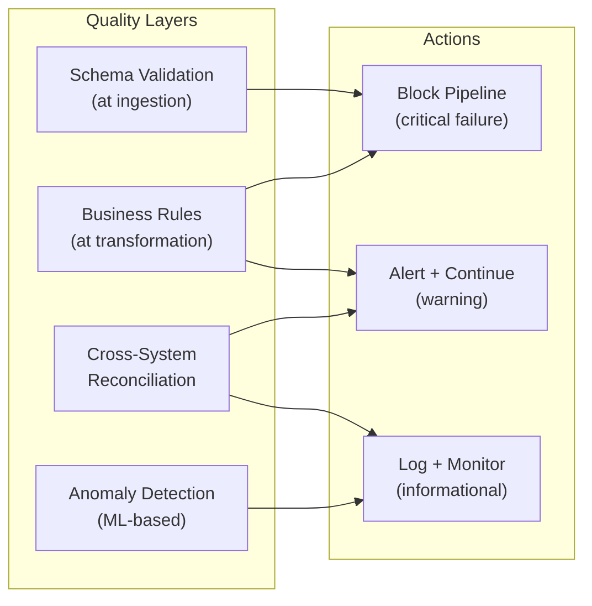

### Great Expectations Integration

```python
# quality/expectations/transactions_suite.py
"""
Data quality expectations for the Silver transactions table.

These expectations are the contract between data producers and consumers.
If an expectation fails with severity=CRITICAL, the pipeline stops.
"""

import great_expectations as gx

# Create expectation suite
context = gx.get_context()

suite = context.add_expectation_suite("silver_transactions")

# ── Completeness ──
suite.add_expectation(
    gx.expectations.ExpectColumnValuesToNotBeNull(
        column="transaction_id",
        meta={"severity": "critical", "owner": "data-engineering"},
    )
)
suite.add_expectation(
    gx.expectations.ExpectColumnValuesToNotBeNull(
        column="amount",
        meta={"severity": "critical"},
    )
)
suite.add_expectation(
    gx.expectations.ExpectColumnValuesToNotBeNull(
        column="customer_id",
        mostly=0.99,      # Allow 1% nulls (anonymous transactions)
        meta={"severity": "warning"},
    )
)

# ── Validity ──
suite.add_expectation(
    gx.expectations.ExpectColumnValuesToBeBetween(
        column="amount",
        min_value=-100000,
        max_value=10000000,
        meta={"severity": "critical", "notes": "Amount range for fintech transactions"},
    )
)
suite.add_expectation(
    gx.expectations.ExpectColumnValuesToBeInSet(
        column="transaction_type",
        value_set=["DEBIT", "CREDIT", "TRANSFER", "REVERSAL", "REFUND"],
        meta={"severity": "critical"},
    )
)
suite.add_expectation(
    gx.expectations.ExpectColumnValuesToBeInSet(
        column="status",
        value_set=["SUCCESS", "FAILED", "PENDING", "REVERSED", "CANCELLED"],
        meta={"severity": "critical"},
    )
)

# ── Uniqueness ──
suite.add_expectation(
    gx.expectations.ExpectColumnValuesToBeUnique(
        column="transaction_id",
        meta={"severity": "critical"},
    )
)

# ── Volume ──
suite.add_expectation(
    gx.expectations.ExpectTableRowCountToBeBetween(
        min_value=100000,           # At least 100K transactions/day
        max_value=100000000,        # At most 100M (sanity check)
        meta={"severity": "critical"},
    )
)

# ── Freshness ──
suite.add_expectation(
    gx.expectations.ExpectColumnMaxToBeBetween(
        column="transaction_timestamp",
        min_value={"$PARAMETER": "now() - interval 2 hours"},  # Data is at most 2 hours old
        meta={"severity": "warning"},
    )
)

# ── Cross-column rules ──
suite.add_expectation(
    gx.expectations.ExpectColumnPairValuesToBeEqual(
        column_A="currency",
        column_B="settlement_currency",
        ignore_row_if="either_value_is_missing",
        mostly=0.95,     # 95% should match (5% are forex transactions)
        meta={"severity": "warning"},
    )
)
```

---

## 🔧 Phase 7: Data Governance

### Governance Framework

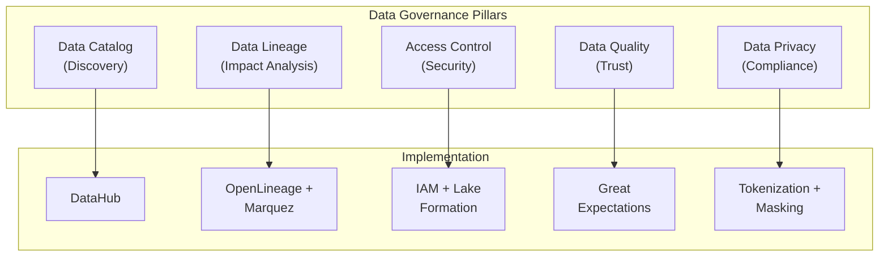

### Data Classification

| Classification | Description | Examples | Access Policy |
|---------------|-------------|----------|---------------|
| **Public** | Non-sensitive business data | Product catalog, exchange rates | All data team |
| **Internal** | Business-sensitive data | Revenue metrics, KPIs | Data team + executives |
| **Confidential** | Customer PII | Names, emails, addresses | Need-to-know basis |
| **Restricted** | Financial/regulated data | Account balances, SSN, card numbers | Compliance-approved only |

### PII Handling

```python
# governance/pii_handler.py
"""
PII detection and masking for NovaPay data platform.

Regulatory requirements:
- PCI DSS: Card numbers must be tokenized
- GDPR: PII must be erasable (right to be forgotten)
- SOC 2: Access to PII must be logged and auditable
"""

from pyspark.sql import DataFrame
from pyspark.sql.functions import (
    col, sha2, concat, lit, regexp_replace, when, substring
)


def mask_pii_columns(df: DataFrame) -> DataFrame:
    """
    Apply PII masking to a DataFrame.

    Strategy:
    - Email: sha2 hash (for joining) + masked version (for display)
    - Phone: last 4 digits visible
    - SSN: fully hashed
    - Card number: first 6 + last 4 visible (BIN + last 4)
    - Name: first initial + asterisks
    """
    return (
        df
        # Email: hash for joins, mask for display
        .withColumn("email_hash", sha2(col("email"), 256))
        .withColumn("email_masked",
            regexp_replace(col("email"), r"(.).*@", "$1***@")
        )
        .drop("email")

        # Phone: show last 4 digits
        .withColumn("phone_masked",
            concat(lit("***-***-"), substring(col("phone"), -4, 4))
        )
        .drop("phone")

        # Name: first initial only
        .withColumn("name_masked",
            concat(substring(col("first_name"), 1, 1), lit(". "),
                   substring(col("last_name"), 1, 1), lit("."))
        )
        .drop("first_name", "last_name")
    )


def tokenize_card_number(df: DataFrame) -> DataFrame:
    """
    Replace card numbers with tokens.

    In production, use a proper tokenization service (e.g., Basis Theory, Very Good Security).
    This is a simplified version for illustration.
    """
    return (
        df
        .withColumn("card_token", sha2(col("card_number"), 256))
        .withColumn("card_last_four", substring(col("card_number"), -4, 4))
        .withColumn("card_bin", substring(col("card_number"), 1, 6))
        .drop("card_number")
    )
```

---

## 🔧 Phase 8: CI/CD Pipeline

### Deployment Architecture

```mermaid
graph LR
    subgraph "Development"
        D1["Feature Branch"]
        D2["Local Testing<br/>(pytest + local Spark)"]
        D3["PR Review"]
    end

    subgraph "CI Pipeline"
        C1["Lint + Type Check<br/>(ruff, mypy)"]
        C2["Unit Tests<br/>(pytest)"]
        C3["Integration Tests<br/>(Docker Compose)"]
        C4["DAG Validation<br/>(airflow dags test)"]
        C5["DQ Suite Validation"]
    end

    subgraph "CD Pipeline"
        CD1["Deploy to Staging"]
        CD2["Run Staging Pipeline<br/>(with sample data)"]
        CD3["Approval Gate"]
        CD4["Deploy to Production"]
        CD5["Smoke Tests"]
        CD6["Canary Monitoring"]
    end

    D1 --> D2 --> D3 --> C1
    C1 --> C2 --> C3 --> C4 --> C5
    C5 --> CD1 --> CD2 --> CD3 --> CD4 --> CD5 --> CD6

    style CD3 fill:#f39c12,color:#000
    style CD4 fill:#e74c3c,color:#fff
```

### GitHub Actions Workflow

```yaml
# .github/workflows/data-platform-ci.yml
name: Data Platform CI/CD

on:
  push:
    branches: [main, develop]
  pull_request:
    branches: [main]

jobs:
  lint-and-test:
    runs-on: ubuntu-latest
    steps:
      - uses: actions/checkout@v4

      - name: Set up Python
        uses: actions/setup-python@v5
        with:
          python-version: '3.11'

      - name: Install dependencies
        run: |
          pip install -r requirements.txt
          pip install -r requirements-dev.txt

      - name: Lint
        run: |
          ruff check .
          mypy spark_jobs/ --ignore-missing-imports

      - name: Unit tests
        run: |
          pytest tests/unit/ -v --cov=spark_jobs --cov-report=xml

      - name: DAG validation
        run: |
          python -c "
          from airflow.models import DagBag
          bag = DagBag(dag_folder='dags/', include_examples=False)
          assert len(bag.import_errors) == 0, f'DAG errors: {bag.import_errors}'
          print(f'Validated {len(bag.dags)} DAGs successfully')
          "

  integration-test:
    needs: lint-and-test
    runs-on: ubuntu-latest
    services:
      postgres:
        image: postgres:15
        env:
          POSTGRES_PASSWORD: test
        ports:
          - 5432:5432
    steps:
      - uses: actions/checkout@v4
      - name: Run integration tests
        run: |
          docker-compose -f docker/docker-compose.test.yml up -d
          pytest tests/integration/ -v --timeout=300
          docker-compose -f docker/docker-compose.test.yml down

  deploy-staging:
    needs: integration-test
    if: github.ref == 'refs/heads/develop'
    runs-on: ubuntu-latest
    environment: staging
    steps:
      - uses: actions/checkout@v4

      - name: Deploy Spark jobs to S3
        run: |
          aws s3 sync spark_jobs/ s3://novapay-code-staging/spark-jobs/ \
            --exclude "*.pyc" --exclude "__pycache__/*"

      - name: Deploy DAGs
        run: |
          aws s3 sync dags/ s3://novapay-airflow-staging/dags/ \
            --exclude "*.pyc" --exclude "__pycache__/*"

      - name: Run staging pipeline
        run: |
          # Trigger the DAG with sample data
          airflow dags trigger daily_core_banking_etl \
            --conf '{"environment": "staging", "sample_mode": true}'

  deploy-production:
    needs: integration-test
    if: github.ref == 'refs/heads/main'
    runs-on: ubuntu-latest
    environment: production      # Requires manual approval
    steps:
      - uses: actions/checkout@v4

      - name: Deploy Spark jobs to S3
        run: |
          aws s3 sync spark_jobs/ s3://novapay-code-prod/spark-jobs/ \
            --exclude "*.pyc" --exclude "__pycache__/*"

      - name: Deploy DAGs (blue-green)
        run: |
          # Copy new DAGs alongside old ones
          aws s3 sync dags/ s3://novapay-airflow-prod/dags-new/

          # Swap — Airflow picks up new DAGs
          aws s3 mv s3://novapay-airflow-prod/dags/ s3://novapay-airflow-prod/dags-old/ --recursive
          aws s3 mv s3://novapay-airflow-prod/dags-new/ s3://novapay-airflow-prod/dags/ --recursive

      - name: Smoke test
        run: |
          python scripts/smoke_test.py --environment production
```

---

## 🔧 Phase 9: Monitoring & Alerting

### Monitoring Architecture

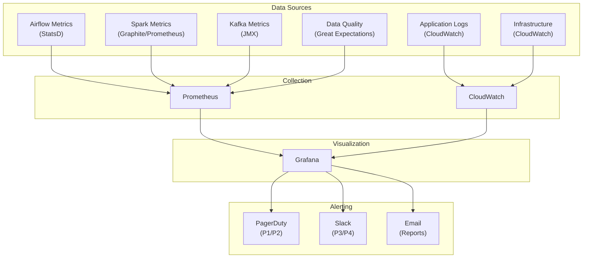

### Alert Severity Matrix

| Severity | Response Time | Channel | Examples |
|----------|-------------|---------|----------|
| **P1 — Critical** | 15 minutes | PagerDuty (phone) | Streaming job crashed, core ETL failed, data loss detected |
| **P2 — High** | 1 hour | PagerDuty (push) | SLA miss, DQ critical failure, Kafka consumer lag > 1M |
| **P3 — Medium** | 4 hours | Slack #data-alerts | DQ warning, unusual data volume, minor job retry |
| **P4 — Low** | Next business day | Slack #data-info | Informational metrics, cost reports, weekly summaries |

### Key Dashboards

```python
# Dashboard 1: Platform Health Overview
platform_health_panels = {
    "DAG Success Rate (24h)": {
        "query": "avg(airflow_dag_run_success_rate{env='prod'})",
        "thresholds": {"green": ">= 0.99", "yellow": ">= 0.95", "red": "< 0.95"},
    },
    "Active Streaming Queries": {
        "query": "count(spark_streaming_query_active{env='prod'})",
        "thresholds": {"green": "== 3", "red": "< 3"},  # We run 3 streaming jobs
    },
    "Kafka Consumer Lag (Total)": {
        "query": "sum(kafka_consumer_lag{group='fraud-detection'})",
        "thresholds": {"green": "< 10000", "yellow": "< 100000", "red": ">= 100000"},
    },
    "Data Freshness (hours)": {
        "query": "max(time() - last_successful_pipeline_timestamp{dag='daily_core_banking_etl'})",
        "thresholds": {"green": "< 6", "yellow": "< 12", "red": ">= 12"},
    },
    "DQ Pass Rate": {
        "query": "avg(dq_check_pass_rate{layer='silver'})",
        "thresholds": {"green": ">= 0.99", "yellow": ">= 0.95", "red": "< 0.95"},
    },
}

# Dashboard 2: Cost Tracker
cost_panels = {
    "Daily Compute Cost": "sum(aws_cost{service=~'EMR|EKS|EC2'})",
    "Daily Storage Cost": "sum(aws_cost{service='S3'})",
    "Daily Kafka Cost": "sum(aws_cost{service='MSK'})",
    "Daily Redshift Cost": "sum(aws_cost{service='Redshift'})",
    "MTD Total Cost": "sum(aws_cost_mtd{team='data-platform'})",
    "Cost vs Budget": "sum(aws_cost_mtd) / var(monthly_budget)",
}
```

---

## 💰 Phase 10: Cost Estimation

### Annual Cost Breakdown

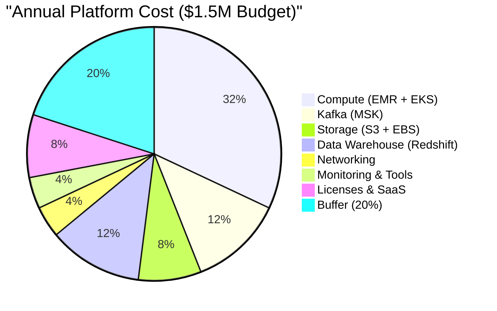

### Detailed Cost Estimation

| Component | Service | Configuration | Monthly Cost | Annual Cost |
|-----------|---------|---------------|-------------|-------------|
| **Spark Batch** | EMR Serverless | ~200 vCPU-hours/day | $8,000 | $96,000 |
| **Spark Streaming** | EKS | 3×r5.2xlarge (24/7) | $3,200 | $38,400 |
| **Airflow** | MWAA (or EKS) | Medium environment | $1,500 | $18,000 |
| **Kafka** | MSK | 3×kafka.m5.2xlarge | $5,400 | $64,800 |
| **Schema Registry** | On EKS | Shared pod | $200 | $2,400 |
| **Data Lake** | S3 | 100TB Standard + Glacier | $2,500 | $30,000 |
| **Delta Lake** | S3 + Compute | Included in Spark costs | — | — |
| **Data Warehouse** | Redshift Serverless | 128 RPU base capacity | $6,000 | $72,000 |
| **Redis (Features)** | ElastiCache | r6g.xlarge cluster | $1,200 | $14,400 |
| **Monitoring** | Grafana + Prometheus | On EKS + CloudWatch | $1,500 | $18,000 |
| **DataHub** | On EKS | Medium deployment | $800 | $9,600 |
| **CI/CD** | GitHub Actions | Team plan | $400 | $4,800 |
| **Networking** | Data Transfer | ~10TB/month inter-AZ | $1,000 | $12,000 |
| **Secrets/KMS** | AWS | Per-key + per-request | $200 | $2,400 |
| **Total** | | | **~$31,900** | **~$382,800** |
| **+ 20% Buffer** | | | | **$459,360** |
| **Remaining for team tools, training, etc.** | | | | **~$1,040,640** |

### Cost Optimization Strategies

| Strategy | Estimated Savings | Effort |
|----------|-------------------|--------|
| Use Spot instances for EMR batch | 60-80% on compute | Low |
| S3 Intelligent Tiering for Bronze | 30-40% on old data | Low |
| Redshift pause during off-hours | 40-50% on warehouse | Medium |
| Kafka tiered storage | 50-60% on broker storage | Medium |
| Right-size based on actual usage (month 3) | 20-30% overall | Low |
| Reserved Instances for steady-state (month 6) | 30-40% on compute | Low |

---

## 🔧 Phase 11: Team Structure & Rollout Plan

### Team Composition (8 engineers)

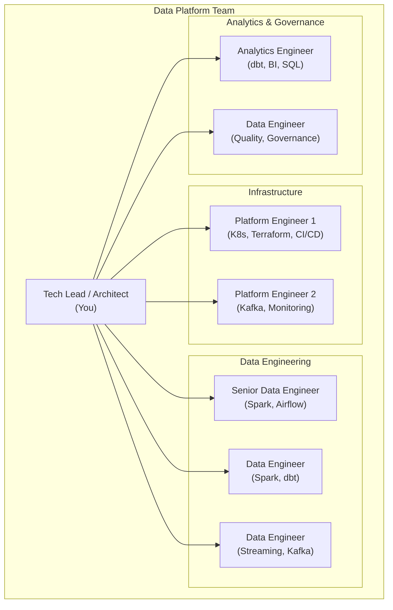

### 12-Month Rollout Plan

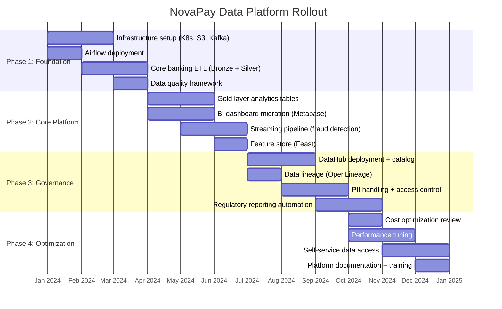

### Milestone Deliverables

| Month | Milestone | Success Criteria |
|-------|-----------|-----------------|
| **Month 1** | Infrastructure ready | K8s cluster, S3 buckets, Kafka running, Airflow deployed |
| **Month 2** | First pipeline live | Core banking data flowing Bronze → Silver, <4hr latency |
| **Month 3** | DQ framework active | All Silver tables have quality checks, <1% critical failures |
| **Month 4** | Analytics ready | Gold layer tables available, first Metabase dashboard live |
| **Month 6** | Streaming live | Fraud detection processing 50K TPS, <5s end-to-end latency |
| **Month 7** | Feature store live | ML team can self-serve features, batch + real-time serving |
| **Month 9** | Governance complete | Data catalog populated, lineage tracked, PII masked |
| **Month 10** | Regulatory automation | SAR reports auto-generated, compliance team signs off |
| **Month 12** | Platform mature | Self-service access, full monitoring, cost-optimized, documented |

---

## ⚠️ Risks and Mitigations

| Risk | Probability | Impact | Mitigation |
|------|------------|--------|------------|
| **Scope creep** | High | High | Strict quarterly OKRs, say no to ad-hoc requests |
| **Key person dependency** | Medium | High | Document everything, pair programming, cross-training |
| **Cost overrun** | Medium | Medium | Monthly cost reviews, auto-scaling limits, alerts at 80% budget |
| **Schema drift in sources** | High | Medium | Schema registry, CDC with Debezium, DQ checks at ingestion |
| **Security breach** | Low | Critical | PCI compliance, encryption at rest/in transit, regular audits |
| **Spark job performance** | Medium | Medium | Performance testing in staging, AQE, monitoring dashboards |
| **Kafka data loss** | Low | High | Replication factor 3, min.insync.replicas 2, monitoring |
| **Team burnout** | Medium | High | Realistic timelines, automate toil, celebrate milestones |

---

## 🎤 Interview Relevance

### System Design Interview: "Design a Data Platform"

This entire project IS a system design interview answer. Here's how to structure your response:

**Step 1: Clarify Requirements (2 minutes)**
- "What are the data volumes? How many sources?"
- "What are the latency requirements — batch or real-time?"
- "What compliance requirements exist (PCI, GDPR, SOX)?"
- "What's the team size and existing tech stack?"

**Step 2: High-Level Architecture (5 minutes)**
- Draw the 4-layer architecture (Ingestion → Storage → Processing → Serving)
- Explain the medallion architecture (Bronze → Silver → Gold)
- Mention Airflow for orchestration, Spark for processing

**Step 3: Deep Dive on Components (10 minutes)**
- Pick 2-3 components and go deep
- Explain trade-offs in technology choices
- Discuss failure modes and recovery
- Cover data quality and governance

**Step 4: Operational Considerations (5 minutes)**
- Monitoring and alerting strategy
- Cost estimation and optimization
- Team structure and rollout plan
- CI/CD and deployment strategy

### Common Follow-Up Questions

| Question | Key Points |
|----------|-----------|
| "Why Spark over Snowflake for processing?" | Complex transforms, ML integration, Python UDFs, streaming |
| "How do you handle PII?" | Classification, tokenization, masking, audit logging |
| "What if the core banking ETL fails?" | Retry, alerting, manual intervention, backfill capability |
| "How do you ensure data consistency?" | ACID transactions (Delta Lake), idempotent writes, reconciliation |
| "How would you handle 10× data growth?" | Auto-scaling EMR, Kafka partition increase, storage tiering |
| "What's your testing strategy?" | Unit → Integration → Staging pipeline → Canary production |

### How to Talk About This in Interviews

> "I designed and built a data platform for a fintech company processing $2B in annual transactions across 6 source systems. The architecture follows a four-layer pattern: ingestion via Kafka and Debezium for real-time CDC, a Delta Lake-based data lake on S3 with Bronze-Silver-Gold layers, Spark for both batch and streaming processing, and Redshift for BI serving. Airflow orchestrates 15+ DAGs with dependency management and SLA monitoring. The real-time fraud detection pipeline processes 50K TPS with 5-second latency using Structured Streaming. We implemented comprehensive data governance — DataHub for cataloging, OpenLineage for lineage, Great Expectations for quality, and PII masking for PCI/GDPR compliance. The platform serves 5 teams (analytics, risk, finance, ML, product) with self-service data access. We delivered it in 12 months with a team of 8 at $460K annual infrastructure cost."

---

## 📝 Key Takeaways

1. **Start with requirements, not technology.** Understand what each stakeholder needs before picking any tools.

2. **The medallion architecture is your friend.** Bronze for audit, Silver for truth, Gold for speed. This pattern works at every scale.

3. **Airflow orchestrates everything.** It's not just for ETL — it manages streaming job health, triggers ML pipelines, and coordinates cross-team dependencies.

4. **Data quality is a first-class citizen.** Build it into the platform from day one, not as an afterthought.

5. **Governance enables self-service.** If people can't find data, understand it, and trust it, your platform fails regardless of how technically brilliant it is.

6. **Cost management is an ongoing activity.** Estimate early, monitor monthly, optimize quarterly.

7. **Ship incrementally.** Don't try to build everything at once. Phase 1 delivers the core banking pipeline in 3 months. Everything else builds on it.

8. **People > Technology.** The best architecture fails without the right team, documentation, and culture. Invest in cross-training and documentation from day one.

---

**[← Back to Projects](../README.md#-projects)**
