# Chapter 1: Why Apache Spark Exists

> **"The best way to understand a technology is to understand the pain that created it."**

Before we write a single line of Spark code, we need to understand *why* it was built, *what problems* it solves, and *why those problems couldn't be solved* by what came before it. This chapter is the foundation for everything that follows.

---

## Table of Contents

- [1. The Evolution of Data Processing](#1-the-evolution-of-data-processing)
- [2. The Rise and Fall of Hadoop MapReduce](#2-the-rise-and-fall-of-hadoop-mapreduce)
- [3. The Birth of Spark: UC Berkeley AMPLab](#3-the-birth-of-spark-uc-berkeley-amplab)
- [4. What Makes Spark Different](#4-what-makes-spark-different)
- [5. Spark's Design Philosophy](#5-sparks-design-philosophy)
- [6. The Spark Ecosystem](#6-the-spark-ecosystem)
- [7. Spark vs The World](#7-spark-vs-the-world)
- [8. Production Scenarios](#8-production-scenarios)
- [9. Troubleshooting Mindset](#9-troubleshooting-mindset)
- [10. Common Mistakes Beginners Make](#10-common-mistakes-beginners-make)
- [11. Interview Questions](#11-interview-questions)

---

## 1. The Evolution of Data Processing

### 1.1 The Analogy: From Horse Carts to Jets

Imagine you need to transport 10 million packages across the country.

| Era | Technology | Analogy | Data Processing |
|-----|-----------|---------|-----------------|
| **1990s** | Single powerful machine | Horse-drawn carriage — one strong horse, one cart | Vertical scaling, Oracle/MySQL on big servers |
| **2000s** | Hadoop MapReduce | Fleet of delivery trucks — many trucks, but they must return to warehouse between every stop | Horizontal scaling, but disk-heavy and slow |
| **2010s** | Apache Spark | Fleet of cargo jets with in-flight sorting — packages sorted mid-air, delivered in one pass | In-memory, DAG-based, fast iterative processing |
| **2020s** | Spark + Lakehouse | Autonomous drone fleet with AI routing — self-optimizing delivery | Adaptive execution, Delta Lake, unified analytics |

> **💡 Key Insight:** Each generation didn't just add speed — it fundamentally changed the *model* of computation.

### 1.2 The Single Machine Era (1990s – Early 2000s)

In the beginning, data fit on one machine. You had a beefy server with lots of RAM, fast disks, and a relational database.

```
┌─────────────────────────────────┐
│        Single Server            │
│  ┌───────┐  ┌────────────────┐  │
│  │ CPU   │  │   Hard Disk    │  │
│  │ (1-4  │  │   (100GB -     │  │
│  │ cores)│  │    1TB)        │  │
│  └───────┘  └────────────────┘  │
│  ┌───────────────────────────┐  │
│  │      RAM (1-16 GB)        │  │
│  └───────────────────────────┘  │
│  ┌───────────────────────────┐  │
│  │   MySQL / Oracle / DB2    │  │
│  └───────────────────────────┘  │
└─────────────────────────────────┘
```

**This worked fine when:**
- Your data was measured in gigabytes, not terabytes
- Your queries took minutes, not hours
- You could afford a $500K Sun Microsystems server

**It broke when:**
- The internet exploded (Google indexed billions of pages)
- Social media generated petabytes per day
- IoT sensors generated millions of events per second
- You couldn't buy a single machine big enough

> **⚠️ Warning:** "Vertical scaling" (buying a bigger machine) has a hard ceiling. You cannot buy a machine with 10 petabytes of RAM. Even if you could, it would cost more than the GDP of some countries.

### 1.3 The Distributed Computing Revolution

The insight was simple but revolutionary:

> **Instead of one $1M machine, use 1,000 $1K machines.**

This is called **horizontal scaling** — adding more machines instead of making one machine bigger.

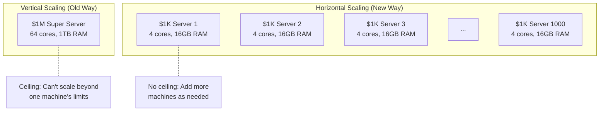

But this created **hard problems**:
- How do you split data across machines?
- How do you handle a machine dying mid-computation?
- How do you coordinate 1,000 machines?
- How do you collect results?

Google solved this. And they published papers about it.

---

## 2. The Rise and Fall of Hadoop MapReduce

### 2.1 Google's Breakthrough Papers

In 2003-2004, Google published two landmark papers:

1. **Google File System (GFS)** — How to store massive files across thousands of cheap disks
2. **MapReduce** — How to process massive data in parallel across thousands of cheap machines

The open-source community built Hadoop as a clone of these systems:
- **HDFS** = open-source GFS
- **Hadoop MapReduce** = open-source MapReduce

### 2.2 How MapReduce Works

MapReduce breaks every computation into exactly two phases:

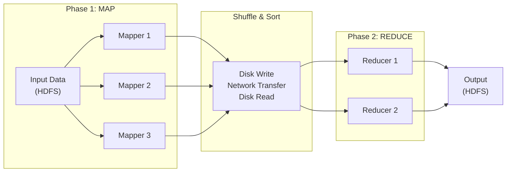

**The Word Count Example** (the "Hello World" of big data):

```
Input: "the cat sat on the mat the cat"

MAP PHASE:
  Mapper 1: "the cat sat" → (the,1), (cat,1), (sat,1)
  Mapper 2: "on the mat"  → (on,1), (the,1), (mat,1)
  Mapper 3: "the cat"     → (the,1), (cat,1)

SHUFFLE & SORT (write to disk, send over network, read from disk):
  Group by key: 
    "cat"  → [1, 1]
    "mat"  → [1]
    "on"   → [1]
    "sat"  → [1]
    "the"  → [1, 1, 1]

REDUCE PHASE:
  Reducer 1: "cat" → 2, "mat" → 1
  Reducer 2: "on" → 1, "sat" → 1, "the" → 3
```

### 2.3 Why Hadoop MapReduce Was Great (For Its Time)

| Feature | Benefit |
|---------|---------|
| **Horizontal scalability** | Process petabytes by adding machines |
| **Fault tolerance** | If a machine dies, re-run its portion |
| **Data locality** | Move computation to data, not data to computation |
| **Simple programming model** | Just write Map and Reduce functions |
| **Cost effective** | Runs on commodity hardware |

### 2.4 Why Hadoop MapReduce Failed: The Five Fatal Flaws

Despite its initial success, Hadoop MapReduce had fundamental design limitations that made it painful to use at scale:

#### Flaw 1: Disk, Disk, and More Disk

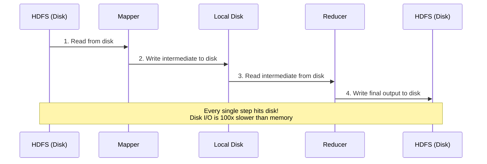

MapReduce wrote *everything* to disk — intermediate results, shuffle data, final output. For a single MapReduce job, data touched the disk **at minimum 4 times**. For iterative algorithms like machine learning (which run MapReduce 20-100 times), this was catastrophic.

#### Flaw 2: Only Two Stages

Many real computations need more than Map → Reduce. To do a multi-step pipeline, you had to chain MapReduce jobs:

```
Job 1: Map → Reduce → Write to HDFS
Job 2: Read from HDFS → Map → Reduce → Write to HDFS
Job 3: Read from HDFS → Map → Reduce → Write to HDFS
```

Each job wrote its full output to HDFS before the next could start. A 5-step pipeline meant **5 complete read-write cycles to disk**.

#### Flaw 3: No Native Support for Iterative Algorithms

Machine learning algorithms (like gradient descent, PageRank, k-means) iterate over the same data hundreds of times. In MapReduce:

```
Iteration 1: Read data from HDFS → Process → Write to HDFS
Iteration 2: Read data from HDFS → Process → Write to HDFS
...
Iteration 100: Read data from HDFS → Process → Write to HDFS
```

The same dataset was read from disk 100 times. This was absurdly slow.

#### Flaw 4: High Latency Startup

Every MapReduce job required:
1. Starting new JVM processes for every mapper and reducer
2. Negotiating resources with the cluster manager
3. Transferring application code to workers

This meant even a simple word count took **30-60 seconds** minimum to start, regardless of data size.

#### Flaw 5: Painful Programming Model

Here's a simple word count in Hadoop MapReduce Java:

```java
// This is JUST the mapper — there's equally verbose reducer code
public class WordCountMapper extends Mapper<LongWritable, Text, Text, IntWritable> {
    private final static IntWritable one = new IntWritable(1);
    private Text word = new Text();
    
    public void map(LongWritable key, Text value, Context context) 
        throws IOException, InterruptedException {
        StringTokenizer itr = new StringTokenizer(value.toString());
        while (itr.hasMoreTokens()) {
            word.set(itr.nextToken());
            context.write(word, one);
        }
    }
}
// Plus: Driver class, Reducer class, configuration boilerplate...
// Total: ~80 lines of Java
```

Compare with Spark:

```python
# Complete word count in PySpark
text_file.flatMap(lambda line: line.split(" ")) \
         .map(lambda word: (word, 1)) \
         .reduceByKey(lambda a, b: a + b)
# Total: 3 lines
```

### 2.5 The Performance Gap: Real Numbers

| Metric | Hadoop MapReduce | Apache Spark |
|--------|-----------------|--------------|
| **Sorting 100TB** | 72 minutes (2,100 machines) | 23 minutes (206 machines) |
| **Iterative ML (logistic regression)** | 110 seconds/iteration | 0.9 seconds/iteration |
| **Interactive query latency** | Minutes | Seconds |
| **Lines of code (word count)** | ~80 (Java) | ~3 (Python) |

> **💡 Key Insight:** Spark wasn't 10% faster — it was **10x to 100x faster** for most workloads, and required **10x less code**.

---

## 3. The Birth of Spark: UC Berkeley AMPLab

### 3.1 The Academic Origins

Apache Spark was born in 2009 at UC Berkeley's AMPLab (Algorithms, Machines, and People Lab). The key researchers were:

- **Matei Zaharia** — Spark's creator (now CTO of Databricks)
- **Ion Stoica** — Co-director of AMPLab (now CEO of Databricks)
- **Scott Shenker** — Co-director of AMPLab

The original paper was titled **"Resilient Distributed Datasets: A Fault-Tolerant Abstraction for In-Memory Cluster Computing"** (2012).

### 3.2 The Core Insight

The AMPLab team observed that Hadoop MapReduce was slow because of one thing: **it didn't reuse data in memory**.

Their key insight:

> *"What if intermediate results stayed in memory instead of being written to disk? And what if we could track how data was derived (its lineage) so that if a machine failed, we could simply recompute the lost data instead of replicating it?"*

This was the birth of the **RDD (Resilient Distributed Dataset)**.

### 3.3 The Timeline

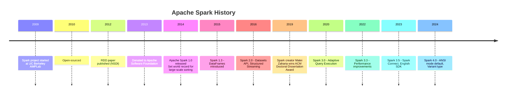

---

## 4. What Makes Spark Different

Spark introduced four revolutionary concepts that set it apart from everything before it:

### 4.1 In-Memory Computing

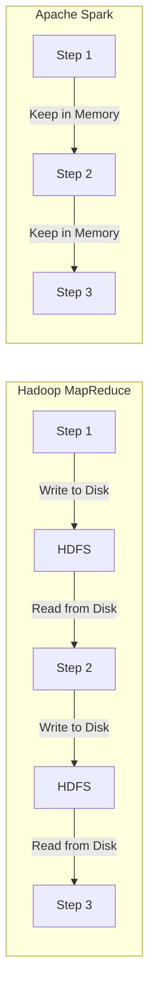

**What it means:** Spark keeps intermediate results in memory (RAM) instead of writing them to disk between steps.

**Why it matters:**
- RAM is **100x faster** than disk for random reads
- RAM is **10x faster** than disk for sequential reads
- For iterative algorithms, the same data stays in memory across iterations

**The caveat:** If data doesn't fit in memory, Spark spills to disk. It doesn't crash — it degrades gracefully. But it won't be 100x faster in that case.

### 4.2 Lazy Evaluation

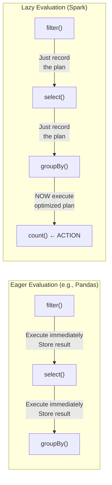

**What it means:** When you write `df.filter(...).select(...).groupBy(...)`, Spark doesn't execute anything. It just builds a *plan*. Only when you call an **action** (like `.count()`, `.show()`, `.write()`) does Spark execute.

**Why it matters:**
1. Spark can see the **entire pipeline** before executing, allowing it to optimize
2. It can **eliminate unnecessary work** (e.g., if you select 2 columns after filtering, why read all 200 columns from disk?)
3. It can **reorder operations** for efficiency (e.g., push filters before joins)

**Analogy:** It's like writing your entire grocery list before going to the store, instead of making a separate trip for each item. By seeing the full list, you can plan an optimal route through the aisles.

### 4.3 DAG Execution Engine

MapReduce was limited to two stages: Map → Reduce. Spark uses a **Directed Acyclic Graph (DAG)** that can express arbitrary multi-stage computations.

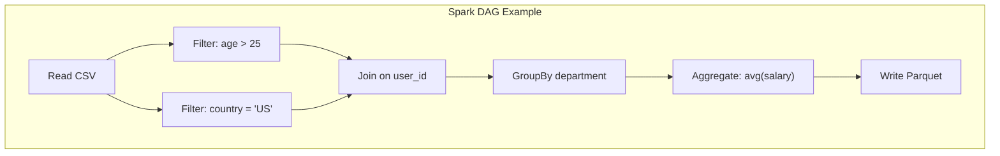

**What it means:** Spark can execute complex multi-step computations as a single, optimized DAG instead of chaining independent jobs.

**Why it matters:**
- No unnecessary disk I/O between stages
- The optimizer can see the full computation graph
- Stages that don't depend on each other can run in parallel

### 4.4 Unified Engine

Before Spark, you needed different tools for different workloads:

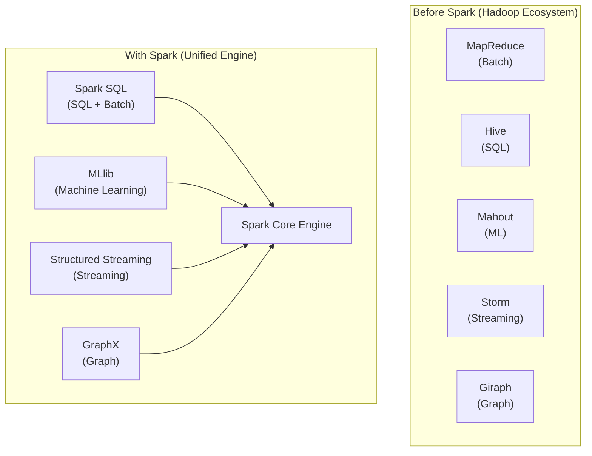

**What it means:** One engine, one API, one optimization pipeline for *all* workloads.

**Why it matters:**
- Learn one framework instead of five
- Share data between batch and ML without copying
- Single cluster for all workloads = less operational overhead
- Consistent optimization across all workloads

---

## 5. Spark's Design Philosophy

Spark was designed around a few core principles that explain *every* design decision:

### 5.1 Principle 1: Immutability

> Every transformation creates a *new* dataset. The original is never modified.

**Why:** In a distributed system, if multiple machines can modify the same data simultaneously, you get chaos (race conditions, locks, deadlocks). By making data immutable, Spark avoids all of these problems.

**Analogy:** Like version control (Git). You don't edit the original file — you create new versions. You can always go back to any previous version.

### 5.2 Principle 2: Lineage Over Replication

> Instead of storing copies of data for fault tolerance, Spark records *how to recompute* data.

**Hadoop's approach:** Store 3 copies of everything on different machines. If one machine dies, use a copy.

**Spark's approach:** Store the *recipe* for creating the data. If a machine dies, re-execute the recipe on another machine.

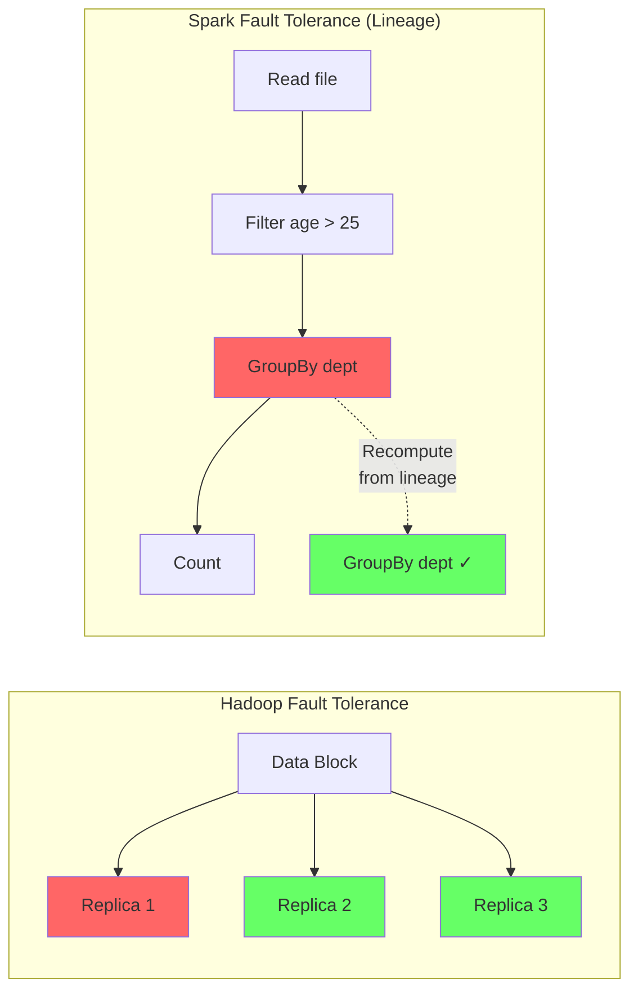

**Trade-off:** Recomputation takes time, but saves storage. For intermediate data that's used briefly, this is a huge win.

### 5.3 Principle 3: Move Computation to Data

> It's cheaper to ship a small program (KB) to where the data lives than to ship large data (GB/TB) to where the program is.

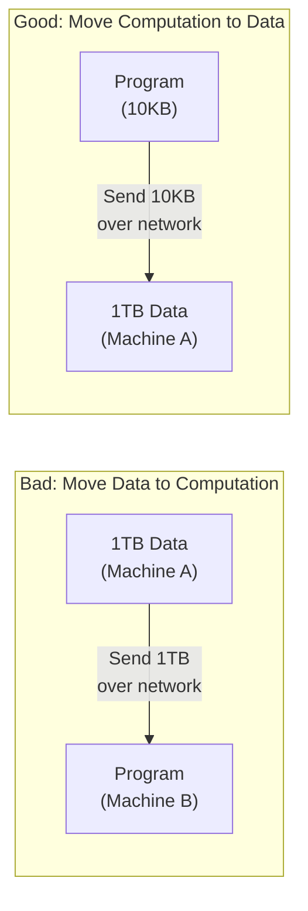

### 5.4 Principle 4: Unified Abstraction

> One API should handle batch, streaming, SQL, ML, and graph — because they're all just data transformations.

This was revolutionary. Before Spark, each workload type required a completely different tool, API, and mental model. Spark proved that a single abstraction (RDD, later DataFrame) could handle all of them.

---

## 6. The Spark Ecosystem

### 6.1 Architecture Overview

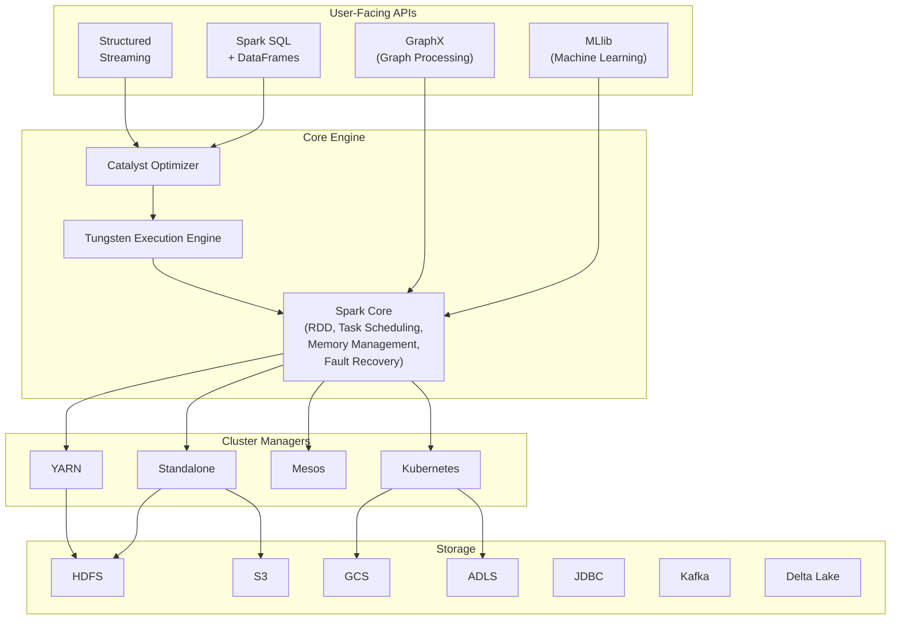

### 6.2 Spark SQL & DataFrames

**What it does:** Lets you query structured data using SQL or the DataFrame API.

**Why it matters:** 
- Most data engineers think in SQL
- The Catalyst optimizer generates better code than most humans write
- Reads/writes Parquet, ORC, JSON, CSV, JDBC, Avro, Delta Lake

```python
# SQL way
spark.sql("SELECT department, AVG(salary) FROM employees GROUP BY department")

# DataFrame way (equivalent)
df.groupBy("department").agg(avg("salary"))

# Both produce the EXACT SAME optimized execution plan
```

### 6.3 Structured Streaming

**What it does:** Processes real-time data streams using the same DataFrame API as batch.

**Why it matters:**
- Write your batch logic once, run it on streams
- Exactly-once processing guarantees
- Handles late data with watermarks

```python
# Batch processing
df = spark.read.parquet("s3://data/events/")
result = df.groupBy("event_type").count()

# Streaming — SAME logic, different source
df = spark.readStream.format("kafka").option("subscribe", "events").load()
result = df.groupBy("event_type").count()
result.writeStream.format("console").start()
```

### 6.4 MLlib (Machine Learning Library)

**What it does:** Distributed machine learning algorithms that scale to massive datasets.

**Includes:**
- Classification (logistic regression, random forests, gradient-boosted trees)
- Regression
- Clustering (k-means, GMM)
- Recommendation (ALS)
- Feature engineering (tokenization, TF-IDF, PCA, standard scaling)
- ML Pipelines

```python
from pyspark.ml.classification import LogisticRegression
from pyspark.ml.feature import VectorAssembler

assembler = VectorAssembler(inputCols=["age", "income", "score"], outputCol="features")
lr = LogisticRegression(featuresCol="features", labelCol="label")

pipeline = Pipeline(stages=[assembler, lr])
model = pipeline.fit(training_data)
predictions = model.transform(test_data)
```

### 6.5 GraphX

**What it does:** Graph-parallel computation (PageRank, connected components, triangle counting).

**Note:** GraphX is the least actively developed component. For serious graph work, consider **GraphFrames** (the DataFrame-based replacement) or dedicated graph databases.

### 6.6 Spark Connect (New in Spark 3.4+)

**What it does:** Separates the Spark client from the server via a gRPC interface.

**Why it matters:**
- Thin client: no need to ship Spark JARs to client machines
- Better stability: client crashes don't affect the server
- Multi-language support becomes easier
- Cloud-native architecture

---

## 7. Spark vs The World

### 7.1 Comprehensive Comparison Table

| Feature | Hadoop MapReduce | Apache Spark | Apache Flink | Presto/Trino |
|---------|-----------------|-------------|-------------|--------------|
| **Processing Model** | Batch only | Batch + Stream | Stream-first (Batch as bounded stream) | Interactive SQL queries |
| **Speed** | Slow (disk-based) | Fast (in-memory) | Fast (in-memory) | Fast (in-memory, pipelined) |
| **Latency** | Minutes to hours | Seconds to minutes | Milliseconds to seconds | Seconds |
| **Programming Model** | Map + Reduce only | RDD, DataFrame, SQL | DataStream, Table API, SQL | SQL only |
| **Fault Tolerance** | Disk replication | Lineage-based | Checkpointing (Chandy-Lamport) | Query retry |
| **Ease of Use** | Low (verbose Java) | High (Python/Scala/SQL) | Medium (Java/Scala) | High (SQL) |
| **ML Support** | Mahout (deprecated) | MLlib (built-in) | FlinkML (limited) | None |
| **Streaming** | Not native | Micro-batch (+ continuous experimental) | True event-by-event | Not native |
| **State Management** | None | Limited | Excellent (RocksDB-backed) | None |
| **Community Size** | Declining | Very large | Growing | Growing |
| **Primary Use Case** | Legacy batch ETL | General-purpose analytics | Real-time streaming | Interactive SQL |
| **Companies Using** | Legacy Hadoop shops | Netflix, Apple, Uber | Alibaba, Uber, Netflix | Facebook, Uber, Airbnb |

### 7.2 When to Use What

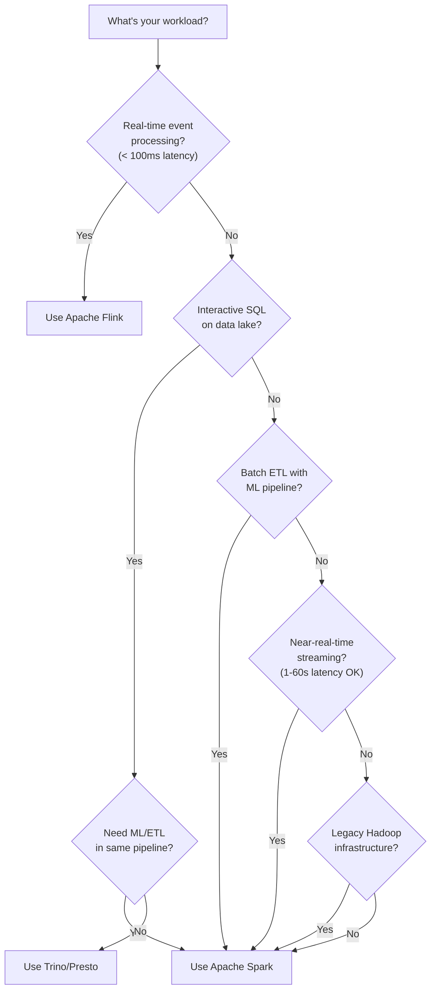

> **💡 Key Insight:** In practice, Spark is the "default choice" for most data engineering teams. You switch to Flink for sub-second streaming, Trino for ad-hoc SQL, or specialized tools for niche requirements.

### 7.3 The Nuanced View: Where Spark Is NOT the Best Choice

| Scenario | Better Alternative | Why |
|----------|-------------------|-----|
| Sub-100ms event processing | Flink | True event-at-a-time processing |
| Ad-hoc SQL on data lake | Trino/Presto | Lower latency, no JVM startup |
| Small data (< 10GB) | Pandas/DuckDB | Overhead of distribution not worth it |
| OLTP (transactional) | PostgreSQL/MySQL | Spark isn't a database |
| Real-time dashboards | Druid/ClickHouse | Pre-aggregated for fast queries |
| Simple ETL (< 100GB) | dbt + warehouse | Simpler, cheaper, managed |

---

## 8. Production Scenarios

### 8.1 Netflix: Recommendation Engine Pipeline

**Problem:** Process 300+ million users' viewing history to generate personalized recommendations.

**Solution:**
- Spark batch jobs process viewing history nightly (petabytes of data)
- MLlib trains recommendation models on the processed data
- Spark Streaming processes real-time events (what you're watching right now)
- Results written to Cassandra for serving

**Scale:** 10,000+ Spark jobs per day, petabytes of data processed daily.

### 8.2 Uber: Surge Pricing & ETA Calculation

**Problem:** Calculate real-time surge pricing and arrival estimates from millions of concurrent rides.

**Solution:**
- Spark Structured Streaming ingests ride events from Kafka
- Geospatial analysis determines supply/demand by area
- ML models predict demand surges
- Results feed into the pricing engine

**Scale:** Millions of events per second, sub-minute latency requirements.

### 8.3 Apple: Siri Data Processing

**Problem:** Process billions of Siri interactions for improving voice recognition and natural language understanding.

**Solution:**
- Spark batch jobs process anonymized voice interaction logs
- Feature extraction for ML model training
- A/B test analysis for new Siri features

### 8.4 A Typical Enterprise Spark Architecture

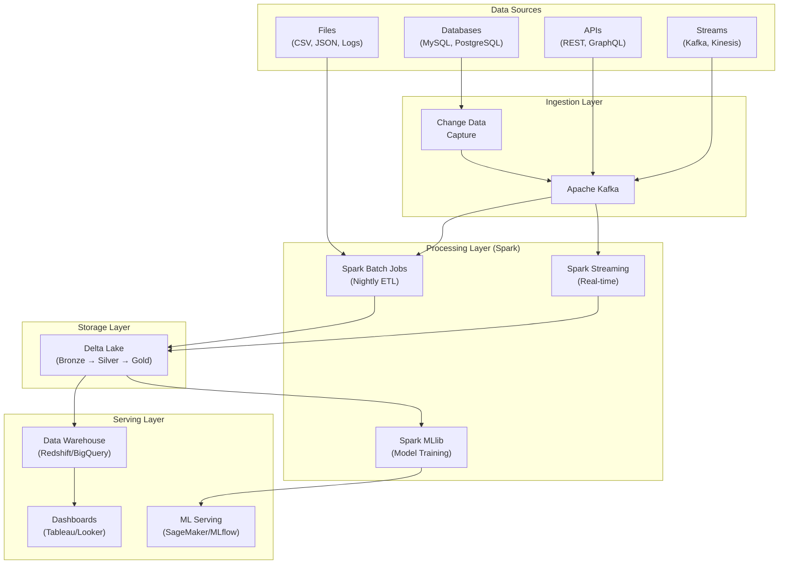

---

## 9. Troubleshooting Mindset

Even though this is Chapter 1, establishing the right troubleshooting mindset early will save you hundreds of hours later.

### 9.1 The Three Laws of Spark Debugging

1. **The error you see is rarely the actual problem.** Spark error messages propagate up through layers (Python → JVM → Executor → Driver). The root cause is usually at the bottom of the stack trace.

2. **Most Spark problems are data problems.** Skewed data, null values, schema mismatches, corrupt files — these cause 80% of Spark failures.

3. **The Spark UI tells you everything.** Learn to read the Spark UI before anything else. It shows you exactly what Spark is doing, where it's slow, and where it failed.

### 9.2 Common First-Day Problems

| Symptom | Root Cause | Fix |
|---------|-----------|-----|
| `JAVA_HOME is not set` | Java not installed or not on PATH | Install Java 8/11/17, set JAVA_HOME |
| `Connection refused` | Spark cluster not running | Start master/workers, check ports |
| `OutOfMemoryError` on small data | Driver memory too small | Set `--driver-memory 4g` |
| `Py4JError` | PySpark/Java version mismatch | Ensure Python, Java, Spark versions are compatible |
| Job takes forever on tiny dataset | Too many small partitions | Repartition or coalesce |

---

## 10. Common Mistakes Beginners Make

### Mistake 1: Using Spark for Small Data

> **"I have 500MB of data, let me use Spark!"**

**Why it's wrong:** Spark has significant overhead (JVM startup, task scheduling, serialization). For data under ~10GB, Pandas or DuckDB is faster, simpler, and cheaper.

**Rule of thumb:** Use Spark when your data doesn't fit in memory of a single machine, or when you need distributed processing for production pipelines.

### Mistake 2: Treating Spark Like Pandas

```python
# BAD: Collecting all data to driver (defeats the purpose of distribution)
data = df.collect()  # Brings ALL data to a single machine
for row in data:
    process(row)

# GOOD: Process data in distributed fashion
df.filter(df.age > 25).groupBy("department").count().show()
```

### Mistake 3: Ignoring Lazy Evaluation

```python
# This does NOTHING — no action triggered
df.filter(df.age > 25)
df.select("name", "age")
df.groupBy("department")
# "Why is my code not producing output??"

# You need an ACTION to trigger execution
df.filter(df.age > 25).select("name", "age").show()  # .show() is the action
```

### Mistake 4: Not Understanding Shuffles

```python
# This causes a SHUFFLE (sends data across the network)
df.groupBy("department").count()  # All rows for same department must go to same machine

# Shuffles are the #1 performance bottleneck in Spark
# We'll cover this extensively in later chapters
```

### Mistake 5: Running Spark in Local Mode for Performance Testing

```python
# Local mode — useful for development, but not for benchmarking
spark = SparkSession.builder.master("local[*]").getOrCreate()
# Results here won't match production cluster performance
```

---

## 11. Interview Questions

### Beginner Level

**Q1: What is Apache Spark?**

> Apache Spark is an open-source, distributed, general-purpose data processing engine designed for speed (in-memory computing), ease of use (high-level APIs in Python, Scala, Java, R, SQL), and sophisticated analytics (batch, streaming, ML, and graph processing in a unified framework).

**Q2: Why was Spark created? What problem does it solve?**

> Spark was created to address the limitations of Hadoop MapReduce, specifically: (1) slow processing due to disk-based I/O between stages, (2) limited two-stage programming model, (3) poor support for iterative algorithms needed in machine learning, and (4) verbose and difficult programming experience. Spark solves these by keeping data in memory, using a DAG execution engine, and providing high-level APIs.

**Q3: What are the main components of the Spark ecosystem?**

> Spark Core (task scheduling, memory management, fault recovery), Spark SQL (structured data processing), MLlib (machine learning), Structured Streaming (real-time processing), and GraphX (graph processing). All built on top of the core engine and optimized by the Catalyst optimizer and Tungsten execution engine.

### Intermediate Level

**Q4: Explain lazy evaluation in Spark. Why is it important?**

> Lazy evaluation means Spark doesn't execute transformations immediately — it builds a logical execution plan (DAG) and only executes when an action (collect, count, show, write) is triggered. This is important because:
> 1. The optimizer can see the entire pipeline and rearrange/combine operations
> 2. Unnecessary data loading can be avoided (predicate pushdown, column pruning)
> 3. Multiple transformations can be pipelined into a single pass over the data
>
> Example: `df.select("name").filter(df.age > 25)` — Spark will push the filter *before* the select internally, reducing data processed.

**Q5: Compare Spark with Hadoop MapReduce. When would you still use MapReduce?**

> Spark is faster (in-memory), more versatile (batch + streaming + ML), and easier to use (high-level APIs). However, MapReduce might still be used when:
> 1. You have an existing legacy Hadoop infrastructure with heavy MapReduce investment
> 2. You need extremely fault-tolerant batch processing where every step is checkpointed to disk
> 3. Memory resources are severely constrained (MapReduce uses less memory)
> 4. The workload is a simple, one-pass ETL that doesn't benefit from in-memory caching
>
> In practice, even most Hadoop shops have migrated to Spark.

**Q6: What is the difference between Spark's micro-batch streaming and Flink's event-at-a-time processing?**

> Spark Structured Streaming processes data in small batches (micro-batches) — it accumulates events over a short interval (e.g., 100ms), then processes them as a small batch. This gives good throughput but adds latency.
>
> Flink processes each event individually as it arrives, giving lower latency (milliseconds vs seconds) but requiring more complex state management.
>
> For most use cases (latency > 1 second is acceptable), Spark is sufficient. For true real-time requirements (sub-second latency), Flink is the better choice.

### Advanced Level

**Q7: Explain Spark's fault tolerance mechanism. How does lineage-based recovery compare to replication-based recovery?**

> Spark uses lineage-based fault tolerance via RDDs. Each RDD remembers the chain of transformations (lineage) used to build it from the original source. If a partition is lost (machine failure), Spark recomputes just that partition by replaying its lineage.
>
> **Lineage vs Replication:**
>
> | Aspect | Lineage (Spark) | Replication (HDFS) |
> |--------|----------------|--------------------|
> | Storage cost | Low (only store recipe) | High (3x data) |
> | Recovery time | Longer (must recompute) | Instant (use replica) |
> | Best for | Intermediate/derived data | Source data |
> | Network I/O | Low | High (replicating data) |
>
> Spark uses lineage for intermediate data but relies on HDFS/S3 replication for source data. For very long lineage chains, Spark supports checkpointing to truncate the lineage and persist to reliable storage.

**Q8: You're designing a data platform for a company with 10TB of daily data. When would you choose Spark over a modern data warehouse like Snowflake or BigQuery?**

> Choose Spark when:
> 1. **Complex ETL** — Multi-step transformations that go beyond SQL (custom Python/Scala logic)
> 2. **ML pipelines** — Need to train ML models on the same data you're transforming
> 3. **Cost control** — You want to run on your own infrastructure or spot instances
> 4. **Streaming + batch** — Need both real-time and batch processing in one system
> 5. **Custom processing** — Need graph algorithms, NLP, or custom aggregations
> 6. **Multi-cloud** — Need to avoid vendor lock-in
>
> Choose Snowflake/BigQuery when:
> 1. Workload is primarily SQL-based analytics
> 2. You want zero infrastructure management
> 3. You need instant scaling without cluster management
> 4. Your team is SQL-heavy, not Python/Scala-heavy
> 5. You need time-travel and data sharing features out of the box

**Q9: Explain the role of the Catalyst optimizer and Tungsten execution engine in Spark.**

> **Catalyst** is Spark SQL's query optimizer. It takes a logical plan (what you asked for) and produces an optimized physical plan (how to execute it). It performs:
> 1. Analysis — Resolves column names, table references, types
> 2. Logical optimization — Predicate pushdown, constant folding, column pruning
> 3. Physical planning — Chooses join strategies, selects scan methods
> 4. Code generation — Generates Java bytecode at runtime
>
> **Tungsten** is the execution engine that focuses on hardware-level optimization:
> 1. Off-heap memory management (avoids JVM garbage collection)
> 2. Cache-aware computation (exploits CPU L1/L2 cache)
> 3. Whole-stage code generation (fuses operators into single JVM functions)
> 4. Custom serialization (more compact than Java serialization)
>
> Together, they make DataFrame/SQL code run close to hand-optimized C code.

**Q10: If Spark is so great, why do companies still use multiple processing engines? Why not use Spark for everything?**

> Because no single tool is optimal for every workload:
>
> 1. **Sub-millisecond latency**: Spark's JVM startup and micro-batch model add latency. Use Flink or Kafka Streams.
> 2. **Interactive SQL exploration**: Spark's cold start is slower than Trino/Presto for ad-hoc queries.
> 3. **Small data**: Spark's overhead makes it slower than Pandas/DuckDB for datasets under 10GB.
> 4. **OLTP workloads**: Spark isn't a database — can't handle point lookups or transactions.
> 5. **Real-time serving**: Spark isn't designed to serve ML predictions at low latency — use TensorFlow Serving or similar.
> 6. **Cost**: For pure SQL analytics, a managed warehouse (Snowflake) can be cheaper than running a Spark cluster.
>
> The modern data stack typically uses Spark for heavy ETL + ML, Trino for ad-hoc SQL, Flink for real-time streaming, and a data warehouse for BI reporting.

---

## Summary: Why Spark Exists

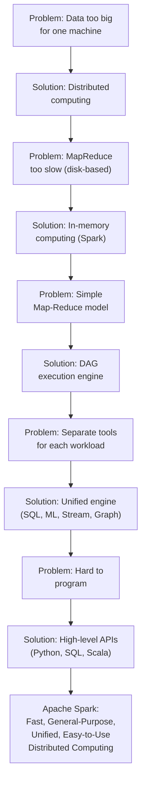

Spark exists because the world needed a **fast, unified, easy-to-use** engine for processing data too large for a single machine. It solved the critical limitations of Hadoop MapReduce by keeping data in memory, using a sophisticated DAG optimizer, and providing a single framework for batch, streaming, ML, and SQL workloads.

In the next chapter, we'll dive deep into **how distributed computing actually works** — the architecture that makes all of this possible.

---

**[Home](../README.md) | [Next →](02-distributed-computing.md)**
