# Chapter 2: Distributed Computing Fundamentals

> **"You can't write good Spark code without understanding distributed computing. It's like trying to write SQL without understanding tables."**

This chapter covers the foundational concepts of distributed computing that Spark is built upon. Without understanding these, every Spark error message will be a mystery, every performance bottleneck will be invisible, and every architectural decision will be a guess.

---

## Table of Contents

- [1. Why Distributed Computing?](#1-why-distributed-computing)
- [2. Fundamental Concepts](#2-fundamental-concepts)
- [3. The CAP Theorem](#3-the-cap-theorem)
- [4. Data Locality](#4-data-locality)
- [5. Serialization](#5-serialization)
- [6. Spark Cluster Architecture](#6-spark-cluster-architecture)
- [7. Deploy Modes: Client vs Cluster](#7-deploy-modes-client-vs-cluster)
- [8. Cluster Managers](#8-cluster-managers)
- [9. Job Submission: spark-submit Walkthrough](#9-job-submission-spark-submit-walkthrough)
- [10. SparkSession and SparkContext](#10-sparksession-and-sparkcontext)
- [11. Production Scenarios](#11-production-scenarios)
- [12. Troubleshooting](#12-troubleshooting)
- [13. Common Mistakes](#13-common-mistakes)
- [14. Interview Questions](#14-interview-questions)

---

## 1. Why Distributed Computing?

### 1.1 The Analogy: Building a Skyscraper

Imagine you need to build a 100-story skyscraper in 1 year.

**Option A: One super-worker.** Find the world's strongest, fastest worker. They do everything — pour concrete, weld steel, install plumbing, wire electricity. No matter how talented, one person cannot build a skyscraper in a year. There's a physical limit to what one entity can do.

**Option B: 1,000 workers with a foreman.** Hire a foreman (the **driver**) who creates the blueprint, assigns tasks, and coordinates. Hire 1,000 workers (the **executors**) who each handle a portion of the building simultaneously. Floor 1 and Floor 50 can be built at the same time.

This is distributed computing. Spark is Option B.

### 1.2 The Math of Why

```
Single machine:
  - Disk read speed: ~500 MB/s (SSD)
  - RAM: 256 GB (high-end server)
  - Time to read 100 TB: 100,000,000 MB ÷ 500 MB/s = 200,000 seconds ≈ 55 hours

100-machine cluster:
  - Each machine reads its 1 TB share: 1,000,000 MB ÷ 500 MB/s = 2,000 seconds ≈ 33 minutes
  - All 100 machines work in parallel
  - Total time: ~33 minutes (not 55 hours)
```

> **💡 Key Insight:** Distributed computing doesn't make individual machines faster — it lets you divide work so many machines work on their piece simultaneously.

### 1.3 The Price of Distribution

Distribution isn't free. You pay for it with complexity:

| Challenge | Description | Spark's Solution |
|-----------|-------------|-----------------|
| **Network latency** | Sending data between machines takes time | Data locality optimization |
| **Partial failure** | Any machine can die at any time | Lineage-based fault tolerance |
| **Data skew** | Some partitions get more data than others | Adaptive Query Execution |
| **Coordination overhead** | Machines must agree on who does what | Driver-based centralized scheduling |
| **Serialization cost** | Data must be converted to bytes for transfer | Tungsten binary format |
| **Straggler problem** | One slow machine delays everyone | Speculative execution |

---

## 2. Fundamental Concepts

### 2.1 Data Parallelism vs Task Parallelism

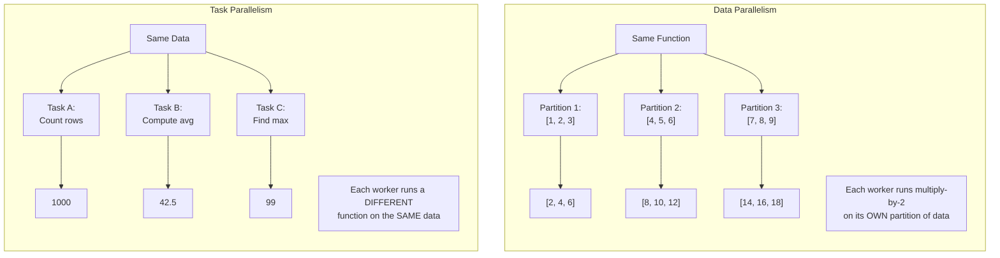
```mermaid
graph TB
    subgraph "Data Parallelism"
        direction TB
        D1["Same Function"] --> P1["Partition 1:<br>[1, 2, 3]"]
        D1 --> P2["Partition 2:<br>[4, 5, 6]"]
        D1 --> P3["Partition 3:<br>[7, 8, 9]"]
        P1 --> R1["[2, 4, 6]"]
        P2 --> R2["[8, 10, 12]"]
        P3 --> R3["[14, 16, 18]"]
        note1["Each worker runs multiply-by-2<br>on its OWN partition of data"]
    end
    
    subgraph "Task Parallelism"
        direction TB
        DATA["Same Data"] --> T1["Task A:<br>Count rows"]
        DATA --> T2["Task B:<br>Compute avg"]
        DATA --> T3["Task C:<br>Find max"]
        T1 --> TR1["1000"]
        T2 --> TR2["42.5"]
        T3 --> TR3["99"]
        note2["Each worker runs a DIFFERENT<br>function on the SAME data"]
    end
```

**Spark primarily uses data parallelism.** The data is split into partitions, and each executor runs the *same* transformation on its partition. This is why Spark scales: more data → more partitions → more executors → same time.

### 2.2 Partitions: The Unit of Parallelism

A partition is a chunk of your data that lives on one machine and is processed by one CPU core.

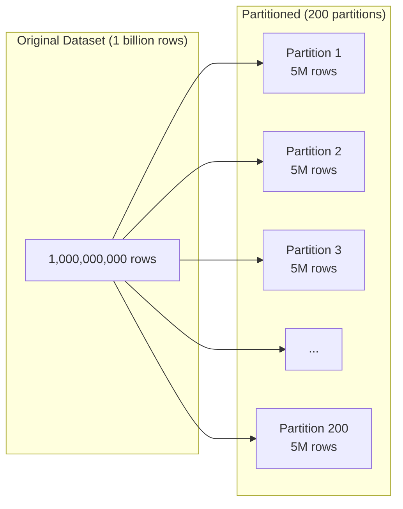
```mermaid
graph LR
    subgraph "Original Dataset (1 billion rows)"
        DATA["1,000,000,000 rows"]
    end
    
    subgraph "Partitioned (200 partitions)"
        P1["Partition 1<br>5M rows"]
        P2["Partition 2<br>5M rows"]
        P3["Partition 3<br>5M rows"]
        PD["..."]
        P200["Partition 200<br>5M rows"]
    end
    
    DATA --> P1
    DATA --> P2
    DATA --> P3
    DATA --> PD
    DATA --> P200
```

**Rules of thumb:**
- Each partition should be **128 MB - 256 MB** for optimal performance
- Number of partitions should be **2-4x the number of available CPU cores**
- Too few partitions → underutilized cluster (some cores idle)
- Too many partitions → excessive scheduling overhead

```python
# Check number of partitions
df.rdd.getNumPartitions()

# Repartition (causes shuffle — expensive)
df = df.repartition(200)

# Coalesce (reduce partitions without shuffle — cheap)
df = df.coalesce(50)
```

### 2.3 Shuffle: The Most Expensive Operation

A **shuffle** occurs when data must be redistributed across partitions — typically during `groupBy`, `join`, `repartition`, `distinct`, or `orderBy`.

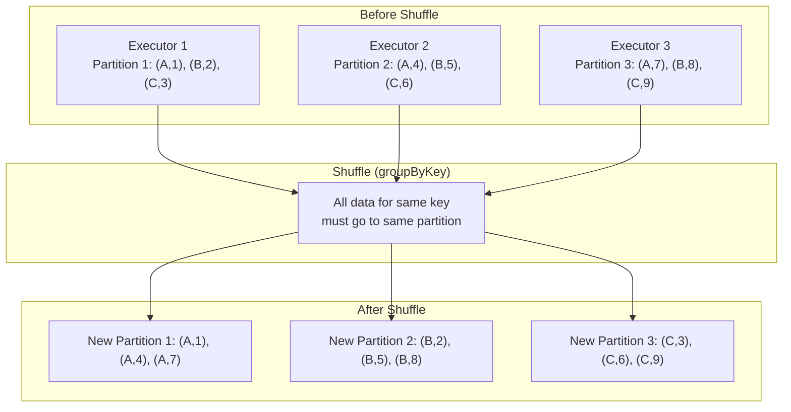
```mermaid
graph TB
    subgraph "Before Shuffle"
        E1["Executor 1<br>Partition 1: (A,1), (B,2), (C,3)"]
        E2["Executor 2<br>Partition 2: (A,4), (B,5), (C,6)"]
        E3["Executor 3<br>Partition 3: (A,7), (B,8), (C,9)"]
    end
    
    subgraph "Shuffle (groupByKey)"
        S["All data for same key<br>must go to same partition"]
    end
    
    subgraph "After Shuffle"
        R1["New Partition 1: (A,1), (A,4), (A,7)"]
        R2["New Partition 2: (B,2), (B,5), (B,8)"]
        R3["New Partition 3: (C,3), (C,6), (C,9)"]
    end
    
    E1 --> S
    E2 --> S
    E3 --> S
    S --> R1
    S --> R2
    S --> R3
```

**Why shuffles are expensive:**
1. Data must be **serialized** (converted to bytes)
2. Data is **written to local disk** (shuffle write)
3. Data is **sent over the network** to other machines
4. Data is **read from disk** on the receiving side (shuffle read)
5. Data is **deserialized** back into objects

> **⚠️ Warning:** A single `groupByKey()` on 1TB of data can easily take longer than all other operations combined. Understanding and minimizing shuffles is the #1 Spark performance skill.

### 2.4 Network Partitions and Failure Modes

In a distributed system, three types of failures can occur:

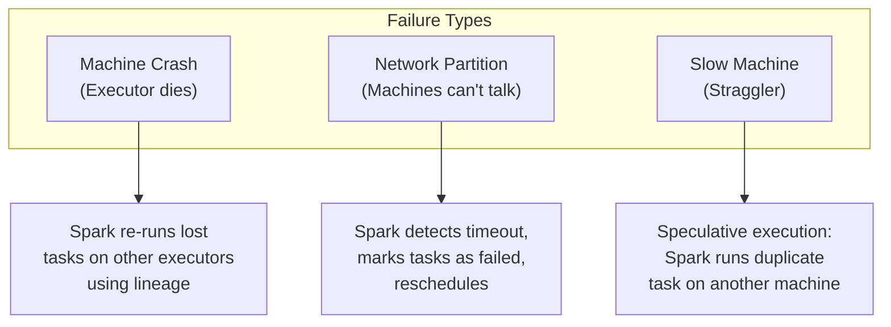
```mermaid
graph TD
    subgraph "Failure Types"
        F1["Machine Crash<br>(Executor dies)"]
        F2["Network Partition<br>(Machines can't talk)"]
        F3["Slow Machine<br>(Straggler)"]
    end
    
    F1 --> S1["Spark re-runs lost<br>tasks on other executors<br>using lineage"]
    F2 --> S2["Spark detects timeout,<br>marks tasks as failed,<br>reschedules"]
    F3 --> S3["Speculative execution:<br>Spark runs duplicate<br>task on another machine"]
```

---

## 3. The CAP Theorem

### 3.1 What Is It?

The CAP theorem states that a distributed system can provide at most **two** of these three guarantees:

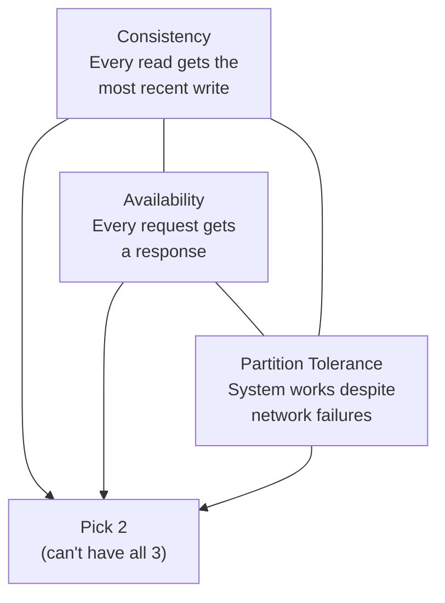
```mermaid
graph TD
    C["Consistency<br>Every read gets the<br>most recent write"] --- A["Availability<br>Every request gets<br>a response"]
    A --- P["Partition Tolerance<br>System works despite<br>network failures"]
    P --- C
    
    CENTER["Pick 2<br>(can't have all 3)"]
    C --> CENTER
    A --> CENTER
    P --> CENTER
```

| Choice | What You Get | What You Sacrifice | Example Systems |
|--------|-------------|-------------------|-----------------|
| **CP** | Consistent + Partition Tolerant | May reject requests during partitions | HBase, MongoDB (strong consistency mode) |
| **AP** | Available + Partition Tolerant | May return stale data | Cassandra, DynamoDB |
| **CA** | Consistent + Available | Doesn't handle network failures | Traditional RDBMS (single machine) |

### 3.2 Where Does Spark Fit?

Spark is a **processing engine**, not a storage system, so CAP applies differently:

- Spark doesn't store data long-term — it reads from sources like HDFS, S3, Kafka
- Spark prioritizes **partition tolerance** (it keeps working if some machines fail)
- Spark provides **consistency** (all executors see the same data version within a job)
- Spark sacrifices **availability** (if too many executors fail, the job fails)

> **💡 Key Insight:** CAP matters more for Spark's *data sources* (HDFS, Cassandra, Kafka) than for Spark itself. Choose your storage system based on CAP trade-offs appropriate for your use case.

---

## 4. Data Locality

### 4.1 The Principle

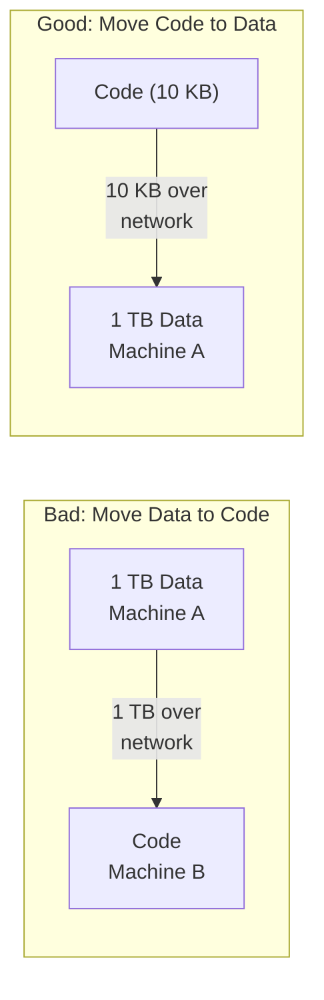
```mermaid
graph LR
    subgraph "Bad: Move Data to Code"
        D1["1 TB Data<br>Machine A"] -->|"1 TB over<br>network"| C1["Code<br>Machine B"]
    end
    
    subgraph "Good: Move Code to Data"  
        C2["Code (10 KB)"] -->|"10 KB over<br>network"| D2["1 TB Data<br>Machine A"]
    end
```

> **"Moving computation is cheaper than moving data."** — The fundamental principle of data-intensive computing.

### 4.2 Spark's Data Locality Levels

Spark tracks where data lives and tries to schedule tasks as close to the data as possible:

| Locality Level | Meaning | Performance |
|---------------|---------|-------------|
| `PROCESS_LOCAL` | Data is in the same JVM (cached in memory) | ⭐⭐⭐⭐⭐ Best |
| `NODE_LOCAL` | Data is on the same machine (different JVM or disk) | ⭐⭐⭐⭐ Great |
| `RACK_LOCAL` | Data is on a machine in the same rack | ⭐⭐⭐ Good |
| `ANY` | Data is on a different rack (or cloud region) | ⭐ Worst |

```python
# You can see data locality in the Spark UI under "Tasks" tab
# Look for "Locality Level" column

# Spark waits a configurable time for data-local scheduling
# before falling back to non-local scheduling
spark.conf.set("spark.locality.wait", "3s")       # Default: 3s
spark.conf.set("spark.locality.wait.node", "3s")
spark.conf.set("spark.locality.wait.rack", "3s")
```

> **💡 Key Insight:** When reading from HDFS, Spark knows which machines hold which blocks of data. It tries to schedule tasks on machines that already have the data. When reading from S3/GCS, data locality doesn't apply (all data comes over network).

---

## 5. Serialization

### 5.1 What Is Serialization?

Serialization converts in-memory objects to bytes (for network transfer or disk storage). Deserialization converts bytes back to objects.

```mermaid
graph LR
    OBJ["Python Object<br>{name: 'Alice', age: 30}"] -->|"Serialize"| BYTES["Bytes<br>0x7B6E616D65...]
    BYTES -->|"Network Transfer<br>or Disk Write"| NET["Another Machine<br>or Disk"]
    NET -->|"Deserialize"| OBJ2["Python Object<br>{name: 'Alice', age: 30}"]
```

### 5.2 Serialization in Spark

| Serializer | Speed | Size | When Used |
|-----------|-------|------|-----------|
| **Java Serialization** | Slow | Large | Default for RDD (legacy) |
| **Kryo Serialization** | Fast | Compact | Opt-in for RDD, recommended |
| **Tungsten Binary Format** | Very Fast | Very Compact | DataFrame/Dataset (automatic) |
| **Pickle (PySpark)** | Slow | Large | Python UDFs, Python RDDs |
| **Arrow** | Very Fast | Compact | pandas UDFs, `toPandas()` |

```python
# Enable Kryo serialization (recommended for RDD workloads)
spark.conf.set("spark.serializer", "org.apache.spark.serializer.KryoSerializer")

# Enable Arrow for PySpark-Pandas conversions (recommended)
spark.conf.set("spark.sql.execution.arrow.pyspark.enabled", "true")
```

> **⚠️ Warning:** In PySpark, regular Python UDFs are serialized with Pickle — which is **slow**. Use Pandas UDFs (vectorized UDFs) whenever possible, as they use Arrow serialization and are 10-100x faster.

---

## 6. Spark Cluster Architecture

### 6.1 The Big Picture

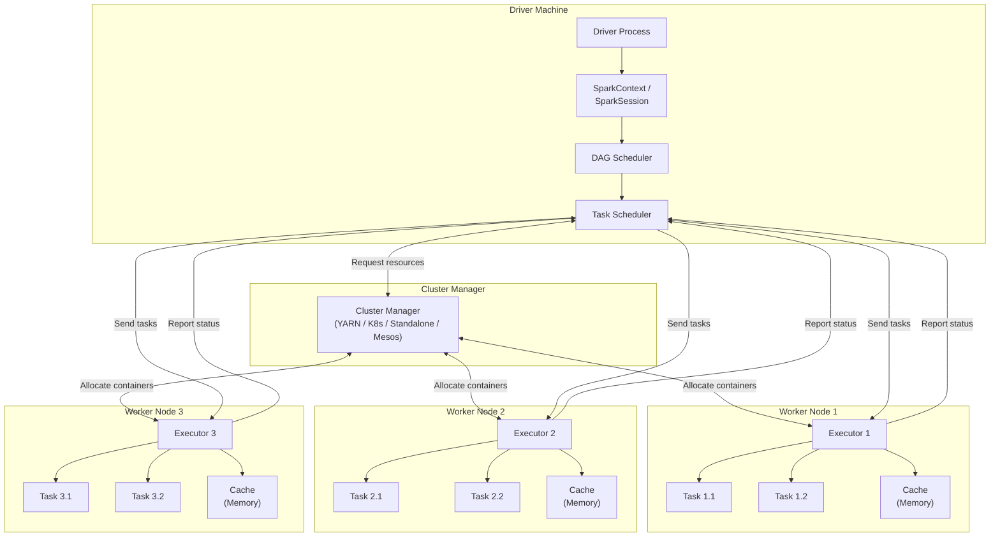
```mermaid
graph TB
    subgraph "Driver Machine"
        DRIVER["Driver Process"]
        SC["SparkContext /<br>SparkSession"]
        DAG_S["DAG Scheduler"]
        TASK_S["Task Scheduler"]
        DRIVER --> SC
        SC --> DAG_S
        DAG_S --> TASK_S
    end
    
    subgraph "Cluster Manager"
        CM["Cluster Manager<br>(YARN / K8s / Standalone / Mesos)"]
    end
    
    subgraph "Worker Node 1"
        EX1["Executor 1"]
        T1["Task 1.1"]
        T2["Task 1.2"]
        C1["Cache<br>(Memory)"]
        EX1 --> T1
        EX1 --> T2
        EX1 --> C1
    end
    
    subgraph "Worker Node 2"
        EX2["Executor 2"]
        T3["Task 2.1"]
        T4["Task 2.2"]
        C2["Cache<br>(Memory)"]
        EX2 --> T3
        EX2 --> T4
        EX2 --> C2
    end
    
    subgraph "Worker Node 3"
        EX3["Executor 3"]
        T5["Task 3.1"]
        T6["Task 3.2"]
        C3["Cache<br>(Memory)"]
        EX3 --> T5
        EX3 --> T6
        EX3 --> C3
    end
    
    TASK_S <-->|"Request resources"| CM
    CM <-->|"Allocate containers"| EX1
    CM <-->|"Allocate containers"| EX2
    CM <-->|"Allocate containers"| EX3
    
    TASK_S -->|"Send tasks"| EX1
    TASK_S -->|"Send tasks"| EX2
    TASK_S -->|"Send tasks"| EX3
    
    EX1 -->|"Report status"| TASK_S
    EX2 -->|"Report status"| TASK_S
    EX3 -->|"Report status"| TASK_S
```

### 6.2 The Driver: The Brain

The driver is the process that runs your `main()` function. It:

1. **Creates SparkSession/SparkContext** — The entry point to the cluster
2. **Converts your code to a DAG** — Breaks your transformations into stages
3. **Schedules tasks** — Sends tasks to executors via the cluster manager
4. **Collects results** — When you call `.collect()`, data comes back here
5. **Monitors execution** — Tracks task progress, handles failures, runs the Spark UI (port 4040)

**Critical resources:**
- **Driver memory** — Must hold the results of `.collect()`, broadcast variables, and task metadata
- If the driver runs out of memory, the entire application crashes

```python
# DANGER: This brings ALL data to the driver
huge_list = massive_df.collect()  # Can OOM the driver!

# SAFE: Only brings 20 rows
massive_df.show(20)

# SAFE: Only brings the count (one number)
count = massive_df.count()
```

### 6.3 Executors: The Workers

Executors are JVM processes running on worker nodes. Each executor:

1. **Runs tasks** — Executes the actual computation (map, filter, join, etc.)
2. **Stores data** — Caches/persists data in memory or disk
3. **Reports back** — Sends results and status to the driver

**Key properties:**
- Each executor has a fixed amount of **memory** and **CPU cores**
- One executor can run multiple **tasks** simultaneously (one task per core)
- Executors are long-lived (they exist for the entire application)

```python
# Configure executor resources
spark.conf.set("spark.executor.memory", "8g")      # Memory per executor
spark.conf.set("spark.executor.cores", "4")         # Cores per executor
spark.conf.set("spark.executor.instances", "10")    # Number of executors
```

### 6.4 The Cluster Manager: The Resource Broker

The cluster manager is NOT part of Spark — it's an external service that allocates resources:

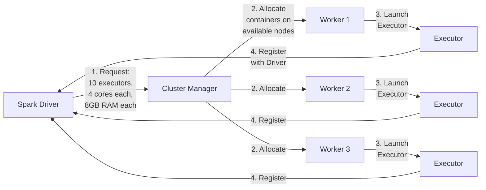
```mermaid
graph LR
    DRIVER["Spark Driver"] -->|"1. Request:<br>10 executors,<br>4 cores each,<br>8GB RAM each"| CM["Cluster Manager"]
    CM -->|"2. Allocate<br>containers on<br>available nodes"| W1["Worker 1"]
    CM -->|"2. Allocate"| W2["Worker 2"]
    CM -->|"2. Allocate"| W3["Worker 3"]
    W1 -->|"3. Launch<br>Executor"| E1["Executor"]
    W2 -->|"3. Launch<br>Executor"| E2["Executor"]
    W3 -->|"3. Launch<br>Executor"| E3["Executor"]
    E1 -->|"4. Register<br>with Driver"| DRIVER
    E2 -->|"4. Register"| DRIVER
    E3 -->|"4. Register"| DRIVER
```

### 6.5 Jobs, Stages, and Tasks

Understanding this hierarchy is critical for debugging:

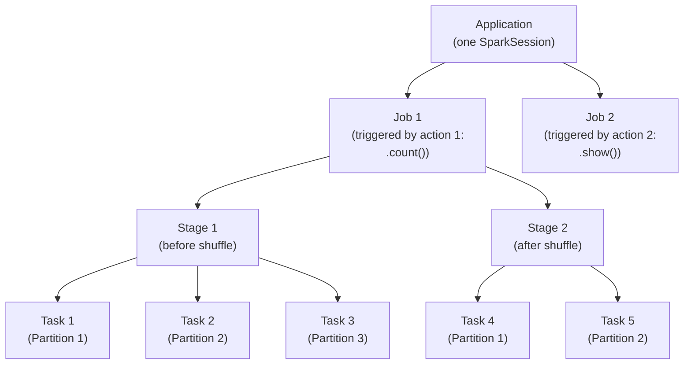
```mermaid
graph TD
    APP["Application<br>(one SparkSession)"] --> J1["Job 1<br>(triggered by action 1:<br>.count())"]
    APP --> J2["Job 2<br>(triggered by action 2:<br>.show())"]
    
    J1 --> S1["Stage 1<br>(before shuffle)"]
    J1 --> S2["Stage 2<br>(after shuffle)"]
    
    S1 --> T1["Task 1<br>(Partition 1)"]
    S1 --> T2["Task 2<br>(Partition 2)"]
    S1 --> T3["Task 3<br>(Partition 3)"]
    
    S2 --> T4["Task 4<br>(Partition 1)"]
    S2 --> T5["Task 5<br>(Partition 2)"]
```

| Concept | What It Is | Triggered By | Granularity |
|---------|-----------|-------------|-------------|
| **Application** | Your entire Spark program | `spark-submit` | 1 per program |
| **Job** | A complete computation | Each **action** (count, show, write) | 1+ per application |
| **Stage** | A set of tasks with no shuffle between them | **Shuffle boundaries** | 1+ per job |
| **Task** | A single unit of work on one partition | One per **partition** per stage | Many per stage |

```python
# This code creates:
# - 1 Application
# - 2 Jobs (one for count, one for show)
# - Multiple stages per job

df = spark.read.csv("data.csv")                # No job yet (lazy)
filtered = df.filter(df.age > 25)              # No job yet (lazy)
grouped = filtered.groupBy("department")        # No job yet (lazy)
result = grouped.count()                        # No job yet (lazy)

result.count()                                  # JOB 1 triggers!
result.show()                                   # JOB 2 triggers!
```

### 6.6 Executor Memory Layout

Understanding memory layout is crucial for troubleshooting OOM errors:

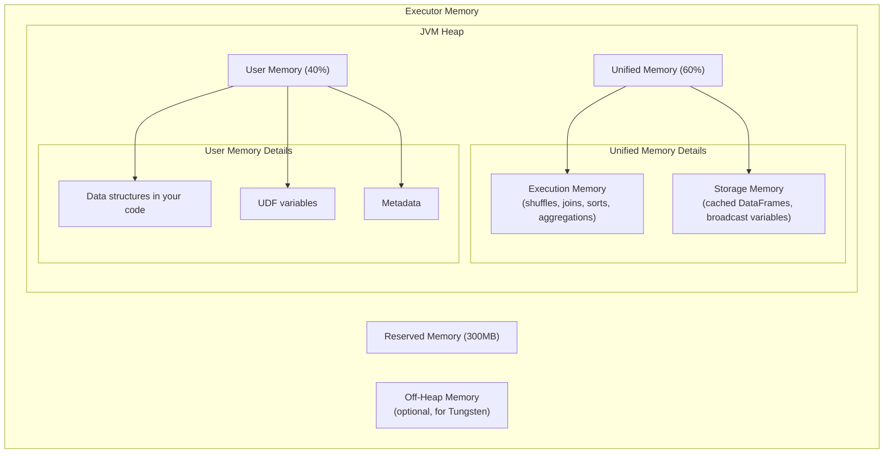
```mermaid
graph TB
    subgraph "Executor Memory"
        subgraph "JVM Heap"
            UM["Unified Memory (60%)"]
            subgraph "Unified Memory Details"
                EXEC["Execution Memory<br>(shuffles, joins, sorts, aggregations)"]
                STOR["Storage Memory<br>(cached DataFrames, broadcast variables)"]
            end
            UM --> EXEC
            UM --> STOR
            
            USER["User Memory (40%)"]
            subgraph "User Memory Details"
                DS["Data structures in your code"]
                UDF2["UDF variables"]
                META["Metadata"]
            end
            USER --> DS
            USER --> UDF2
            USER --> META
        end
        
        RESERVED["Reserved Memory (300MB)"]
        OFFHEAP["Off-Heap Memory<br>(optional, for Tungsten)"]
    end
```

```python
# Key memory settings
spark.conf.set("spark.executor.memory", "8g")
spark.conf.set("spark.memory.fraction", "0.6")         # 60% for execution + storage
spark.conf.set("spark.memory.storageFraction", "0.5")   # Half of unified memory for storage

# Off-heap memory (optional)
spark.conf.set("spark.memory.offHeap.enabled", "true")
spark.conf.set("spark.memory.offHeap.size", "4g")
```

> **💡 Key Insight:** Execution and storage memory share a unified pool. If no cached data exists, execution can use the full 60%. If execution needs more space, it can evict cached data. This dynamic sharing is one of Spark's clever optimizations.

---

## 7. Deploy Modes: Client vs Cluster

### 7.1 Client Mode

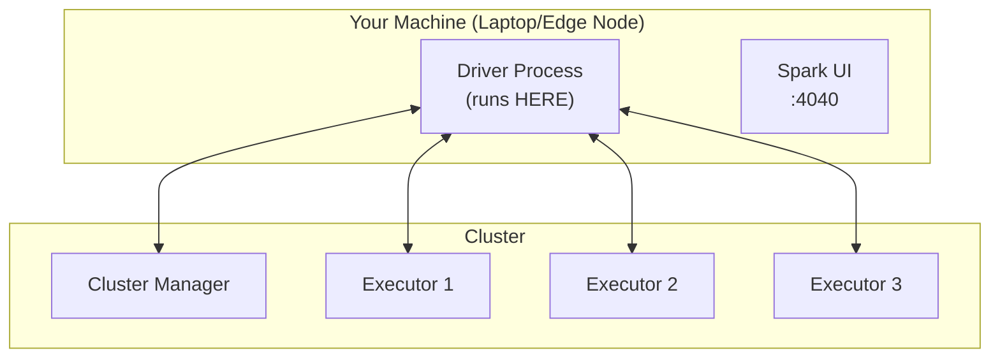
```mermaid
graph TB
    subgraph "Your Machine (Laptop/Edge Node)"
        DRIVER["Driver Process<br>(runs HERE)"]
        UI["Spark UI<br>:4040"]
    end
    
    subgraph "Cluster"
        CM["Cluster Manager"]
        E1["Executor 1"]
        E2["Executor 2"]
        E3["Executor 3"]
    end
    
    DRIVER <--> CM
    DRIVER <--> E1
    DRIVER <--> E2
    DRIVER <--> E3
```

**In client mode:**
- The driver runs on the machine that submitted the job (your laptop, an edge node)
- Spark UI is accessible on your local machine (localhost:4040)
- If you close your laptop lid, **the entire application dies**
- Good for: interactive development, notebooks, debugging

### 7.2 Cluster Mode

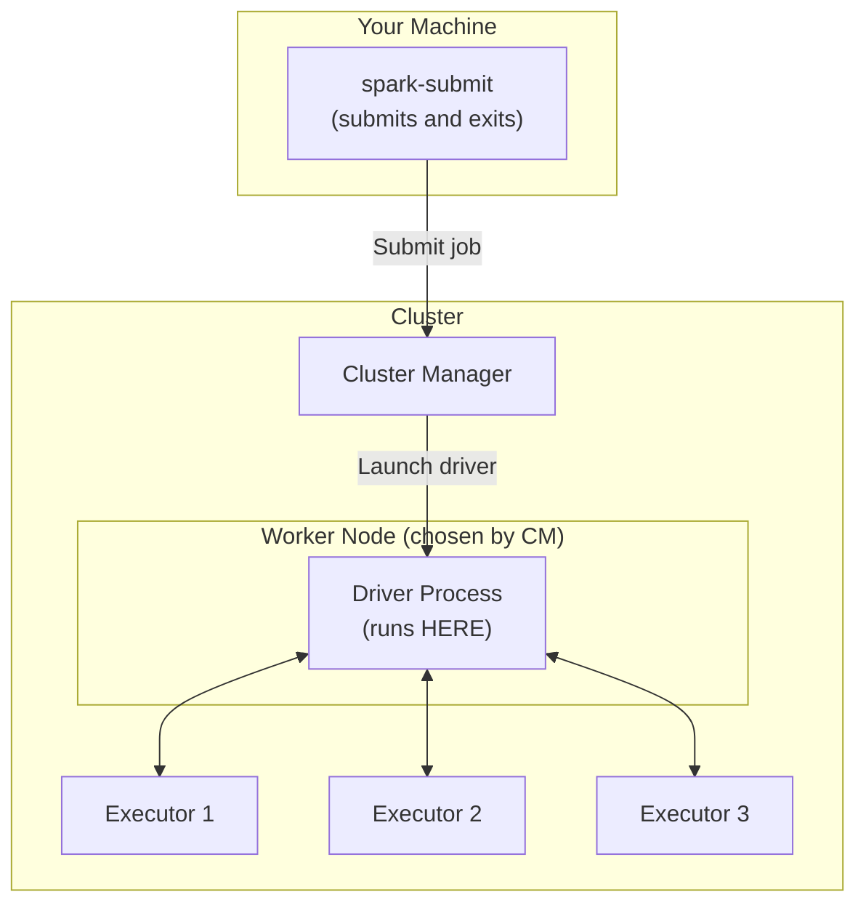
```mermaid
graph TB
    subgraph "Your Machine"
        SUB["spark-submit<br>(submits and exits)"]
    end
    
    subgraph "Cluster"
        CM["Cluster Manager"]
        subgraph "Worker Node (chosen by CM)"
            DRIVER["Driver Process<br>(runs HERE)"]
        end
        E1["Executor 1"]
        E2["Executor 2"]
        E3["Executor 3"]
    end
    
    SUB -->|"Submit job"| CM
    CM -->|"Launch driver"| DRIVER
    DRIVER <--> E1
    DRIVER <--> E2
    DRIVER <--> E3
```

**In cluster mode:**
- The driver runs *inside the cluster*, managed by the cluster manager
- Your submitting machine can disconnect — the job keeps running
- Good for: production jobs, long-running jobs, scheduled ETL

### 7.3 Comparison Table

| Feature | Client Mode | Cluster Mode |
|---------|------------|-------------|
| **Driver location** | Submitting machine | Inside cluster |
| **Submit machine disconnects** | Job dies | Job continues |
| **Spark UI access** | localhost:4040 | Via YARN/K8s proxy |
| **Use case** | Development, debugging | Production, ETL |
| **Log access** | Direct (stdout) | Via cluster manager logs |
| **Network requirement** | Must maintain connection | Submit-and-forget |

```bash
# Client mode (default)
spark-submit --deploy-mode client my_app.py

# Cluster mode
spark-submit --deploy-mode cluster my_app.py
```

---

## 8. Cluster Managers

### 8.1 Overview

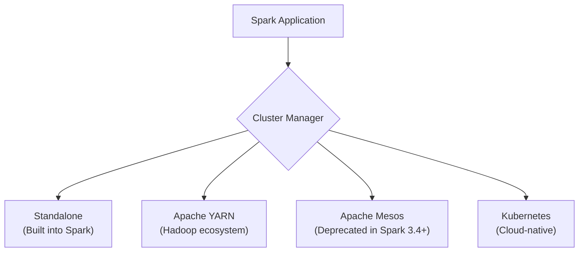
```mermaid
graph TB
    SPARK["Spark Application"] --> CM{"Cluster Manager"}
    CM --> SA["Standalone<br>(Built into Spark)"]
    CM --> YARN["Apache YARN<br>(Hadoop ecosystem)"]
    CM --> MESOS["Apache Mesos<br>(Deprecated in Spark 3.4+)"]
    CM --> K8S["Kubernetes<br>(Cloud-native)"]
```

### 8.2 Comparison Table

| Feature | Standalone | YARN | Mesos | Kubernetes |
|---------|-----------|------|-------|-----------|
| **Setup complexity** | Simple | Medium | Complex | Medium-High |
| **Multi-tenancy** | Limited | Excellent | Excellent | Excellent |
| **Resource sharing** | Spark only | All Hadoop tools | Any framework | Any container |
| **Dynamic allocation** | Yes | Yes | Yes | Yes |
| **Common usage** | Dev/testing | On-premise Hadoop | Legacy | Cloud-native |
| **Cloud support** | Manual | EMR, HDInsight | Rare | GKE, EKS, AKS |
| **Status** | Active | Active | Deprecated | Growing fast |
| **Best for** | Learning, small teams | Hadoop shops | Legacy | Cloud-first teams |

### 8.3 Standalone Mode (Learning and Dev)

The simplest option — Spark includes its own cluster manager.

```bash
# Start master
$SPARK_HOME/sbin/start-master.sh
# Master will be at spark://hostname:7077, UI at http://hostname:8080

# Start worker (on each worker machine)
$SPARK_HOME/sbin/start-worker.sh spark://master-hostname:7077

# Submit job
spark-submit --master spark://master-hostname:7077 my_app.py
```

### 8.4 YARN (On-Premise Hadoop Clusters)

YARN (Yet Another Resource Negotiator) is Hadoop's resource manager. If your company has a Hadoop cluster, you'll likely use YARN.

```bash
# YARN requires HADOOP_CONF_DIR to be set
export HADOOP_CONF_DIR=/etc/hadoop/conf

# Submit to YARN (client mode — good for interactive)
spark-submit --master yarn --deploy-mode client my_app.py

# Submit to YARN (cluster mode — good for production)
spark-submit --master yarn --deploy-mode cluster my_app.py
```

### 8.5 Kubernetes (Cloud-Native)

Kubernetes is the future of Spark deployment, especially in the cloud.

```bash
# Submit to Kubernetes
spark-submit \
  --master k8s://https://<k8s-api-server>:443 \
  --deploy-mode cluster \
  --conf spark.kubernetes.container.image=spark:3.5.0 \
  --conf spark.executor.instances=5 \
  --conf spark.kubernetes.namespace=spark-jobs \
  local:///opt/spark/my_app.py
```

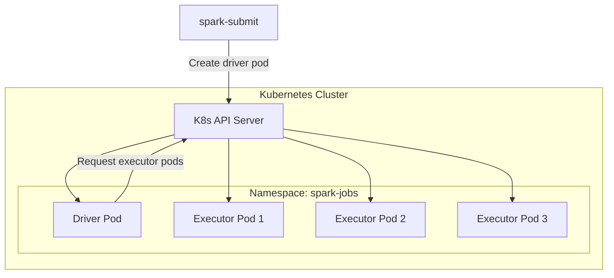
```mermaid
graph TB
    subgraph "Kubernetes Cluster"
        API["K8s API Server"]
        
        subgraph "Namespace: spark-jobs"
            DP["Driver Pod"]
            EP1["Executor Pod 1"]
            EP2["Executor Pod 2"]
            EP3["Executor Pod 3"]
        end
    end
    
    SS["spark-submit"] -->|"Create driver pod"| API
    API --> DP
    DP -->|"Request executor pods"| API
    API --> EP1
    API --> EP2
    API --> EP3
```

**Advantages of K8s for Spark:**
- True container isolation
- Auto-scaling (scale executors up/down based on demand)
- Share cluster with non-Spark workloads (web services, ML serving)
- Cloud-native tooling (monitoring, logging, RBAC)

### 8.6 Managed Spark Services

In practice, many companies use managed services instead of running their own clusters:

| Service | Cloud | Description |
|---------|-------|-------------|
| **Databricks** | AWS/Azure/GCP | The company founded by Spark's creators |
| **Amazon EMR** | AWS | Managed Hadoop/Spark clusters |
| **Google Dataproc** | GCP | Managed Spark on GCP |
| **Azure HDInsight** | Azure | Managed Hadoop/Spark |
| **Azure Synapse** | Azure | Spark integrated with data warehouse |

---

## 9. Job Submission: spark-submit Walkthrough

### 9.1 The spark-submit Command

`spark-submit` is the unified interface for submitting Spark applications:

```bash
spark-submit \
  --master yarn \
  --deploy-mode cluster \
  --name "Sales ETL Pipeline" \
  --driver-memory 4g \
  --executor-memory 8g \
  --executor-cores 4 \
  --num-executors 20 \
  --conf spark.sql.shuffle.partitions=200 \
  --conf spark.dynamicAllocation.enabled=true \
  --py-files utils.zip,models.py \
  --files config.yaml \
  --jars mysql-connector-java-8.0.jar \
  main_app.py \
  --input-path s3://data/raw/ \
  --output-path s3://data/processed/ \
  --date 2024-01-15
```

### 9.2 spark-submit Parameters Explained

| Parameter | Description | Example |
|-----------|-------------|---------|
| `--master` | Cluster manager URL | `yarn`, `local[*]`, `spark://host:7077`, `k8s://...` |
| `--deploy-mode` | Where driver runs | `client` or `cluster` |
| `--name` | Application name (shown in UI) | `"Sales ETL Pipeline"` |
| `--driver-memory` | Memory for the driver | `4g`, `2g` |
| `--executor-memory` | Memory per executor | `8g`, `16g` |
| `--executor-cores` | CPU cores per executor | `4`, `8` |
| `--num-executors` | Number of executors | `10`, `50` |
| `--conf` | Spark configuration property | `spark.sql.shuffle.partitions=200` |
| `--py-files` | Python files to distribute | `utils.zip,helpers.py` |
| `--files` | Files to distribute to executors | `config.yaml,lookup.csv` |
| `--jars` | JAR files for classpath | `mysql-connector.jar` |
| `--packages` | Maven coordinates for dependencies | `io.delta:delta-core_2.12:2.4.0` |

### 9.3 The Full Job Submission Flow

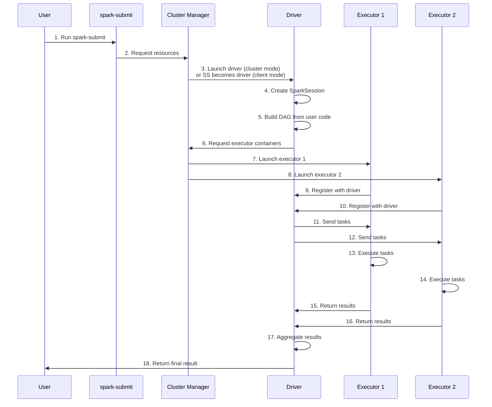
```mermaid
sequenceDiagram
    participant U as User
    participant SS as spark-submit
    participant CM as Cluster Manager
    participant D as Driver
    participant E1 as Executor 1
    participant E2 as Executor 2
    
    U->>SS: 1. Run spark-submit
    SS->>CM: 2. Request resources
    CM->>D: 3. Launch driver (cluster mode)<br>or SS becomes driver (client mode)
    D->>D: 4. Create SparkSession
    D->>D: 5. Build DAG from user code
    D->>CM: 6. Request executor containers
    CM->>E1: 7. Launch executor 1
    CM->>E2: 8. Launch executor 2
    E1->>D: 9. Register with driver
    E2->>D: 10. Register with driver
    D->>E1: 11. Send tasks
    D->>E2: 12. Send tasks
    E1->>E1: 13. Execute tasks
    E2->>E2: 14. Execute tasks
    E1->>D: 15. Return results
    E2->>D: 16. Return results
    D->>D: 17. Aggregate results
    D->>U: 18. Return final result
```

### 9.4 Local Mode: For Development

```python
# Local mode — runs everything in one JVM on your machine
# [*] means use all available cores
# [4] means use 4 cores
# [1] means use 1 core (useful for debugging)

spark = SparkSession.builder \
    .master("local[*]") \
    .appName("Development") \
    .getOrCreate()
```

```bash
# Via spark-submit
spark-submit --master local[*] my_app.py
```

> **💡 Key Insight:** Local mode is fantastic for development and testing, but it masks distributed computing issues (network errors, serialization failures, data skew). Always test on a real cluster before deploying to production.

---

## 10. SparkSession and SparkContext

### 10.1 The Evolution

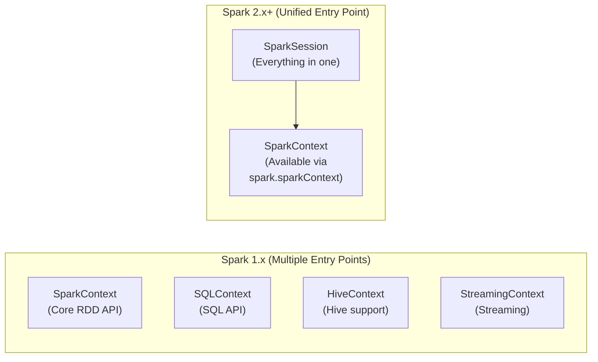
```mermaid
graph LR
    subgraph "Spark 1.x (Multiple Entry Points)"
        SC["SparkContext<br>(Core RDD API)"]
        SQLC["SQLContext<br>(SQL API)"]
        HSC["HiveContext<br>(Hive support)"]
        SSC["StreamingContext<br>(Streaming)"]
    end
    
    subgraph "Spark 2.x+ (Unified Entry Point)"
        SESS["SparkSession<br>(Everything in one)"]
        SC2["SparkContext<br>(Available via<br>spark.sparkContext)"]
        SESS --> SC2
    end
```

### 10.2 Creating a SparkSession

```python
from pyspark.sql import SparkSession

# Basic SparkSession
spark = SparkSession.builder \
    .appName("My Application") \
    .getOrCreate()

# SparkSession with configuration
spark = SparkSession.builder \
    .appName("Production ETL") \
    .master("yarn") \
    .config("spark.executor.memory", "8g") \
    .config("spark.executor.cores", "4") \
    .config("spark.sql.shuffle.partitions", "200") \
    .config("spark.sql.adaptive.enabled", "true") \
    .config("spark.serializer", "org.apache.spark.serializer.KryoSerializer") \
    .enableHiveSupport() \
    .getOrCreate()

# Access SparkContext from SparkSession
sc = spark.sparkContext

# Access the Spark configuration
print(spark.conf.get("spark.executor.memory"))
```

### 10.3 SparkSession: What It Provides

```python
# Read data
df = spark.read.csv("data.csv", header=True, inferSchema=True)
df = spark.read.parquet("s3://bucket/data/")
df = spark.read.json("events.json")

# Run SQL
spark.sql("SELECT * FROM my_table WHERE age > 25")

# Create DataFrames from Python lists
data = [("Alice", 30), ("Bob", 25)]
df = spark.createDataFrame(data, ["name", "age"])

# Access the catalog (list tables, databases)
spark.catalog.listTables()
spark.catalog.listDatabases()

# Manage temporary views
df.createOrReplaceTempView("people")

# Configuration at runtime
spark.conf.set("spark.sql.shuffle.partitions", "100")
print(spark.conf.get("spark.sql.shuffle.partitions"))

# Stop the session (always do this when done)
spark.stop()
```

### 10.4 Configuration Precedence

Spark configurations can be set in multiple places. Here's the precedence order (highest to lowest):

```
1. spark.conf.set() in code (runtime)          ← Highest priority
2. spark-submit --conf flags
3. spark-defaults.conf file ($SPARK_HOME/conf/)
4. Default values                                ← Lowest priority
```

```python
# Example: These override each other
# In spark-defaults.conf:
# spark.executor.memory  4g

# In spark-submit:
# --conf spark.executor.memory=8g    ← overrides defaults

# In code:
# spark.conf.set("spark.executor.memory", "16g")  ← overrides spark-submit
# BUT: Some configs can only be set before SparkSession creation!
```

> **⚠️ Warning:** Some configurations (like `spark.executor.memory`, `spark.executor.cores`) can only be set at submission time, not at runtime. Calling `spark.conf.set("spark.executor.memory", "16g")` after session creation has NO effect.

---

## 11. Production Scenarios

### 11.1 Scenario: Sizing Your Cluster

**Company:** An e-commerce company processing 2TB of daily transaction data.

**Approach:**

```
Data: 2 TB daily
Processing: Complex ETL (joins, aggregations, window functions)
Target time: Complete in < 2 hours

Step 1: Estimate partitions
  2 TB ÷ 128 MB per partition = ~16,000 partitions

Step 2: Estimate cores needed
  16,000 partitions ÷ 2 hours (7,200 seconds) 
  Each task takes ~5 seconds (estimated for ETL)
  Tasks per core per hour: 3600 ÷ 5 = 720
  Cores needed: 16,000 ÷ (720 × 2) = ~11 cores
  With overhead: 20 cores

Step 3: Size executors
  5 executors × 4 cores each = 20 cores
  Memory per executor: 16 GB (allows caching intermediate data)
  
Step 4: Size driver
  Driver memory: 4 GB (collects minimal data)
```

```bash
spark-submit \
  --master yarn \
  --deploy-mode cluster \
  --executor-memory 16g \
  --executor-cores 4 \
  --num-executors 5 \
  --driver-memory 4g \
  etl_pipeline.py
```

### 11.2 Scenario: Dynamic Resource Allocation

**Problem:** Your cluster is shared by many teams. You don't want to request 100 executors if your job only needs 10.

```python
spark = SparkSession.builder \
    .appName("Dynamic ETL") \
    .config("spark.dynamicAllocation.enabled", "true") \
    .config("spark.dynamicAllocation.minExecutors", "2") \
    .config("spark.dynamicAllocation.maxExecutors", "100") \
    .config("spark.dynamicAllocation.initialExecutors", "5") \
    .config("spark.dynamicAllocation.executorIdleTimeout", "60s") \
    .config("spark.dynamicAllocation.schedulerBacklogTimeout", "1s") \
    .getOrCreate()
```

**How it works:**
1. Starts with 5 executors
2. If tasks are waiting in queue for > 1s, adds executors (up to 100)
3. If an executor is idle for > 60s, removes it
4. Scales down to minimum 2 executors when work is light

### 11.3 Scenario: Multi-Tenant Cluster

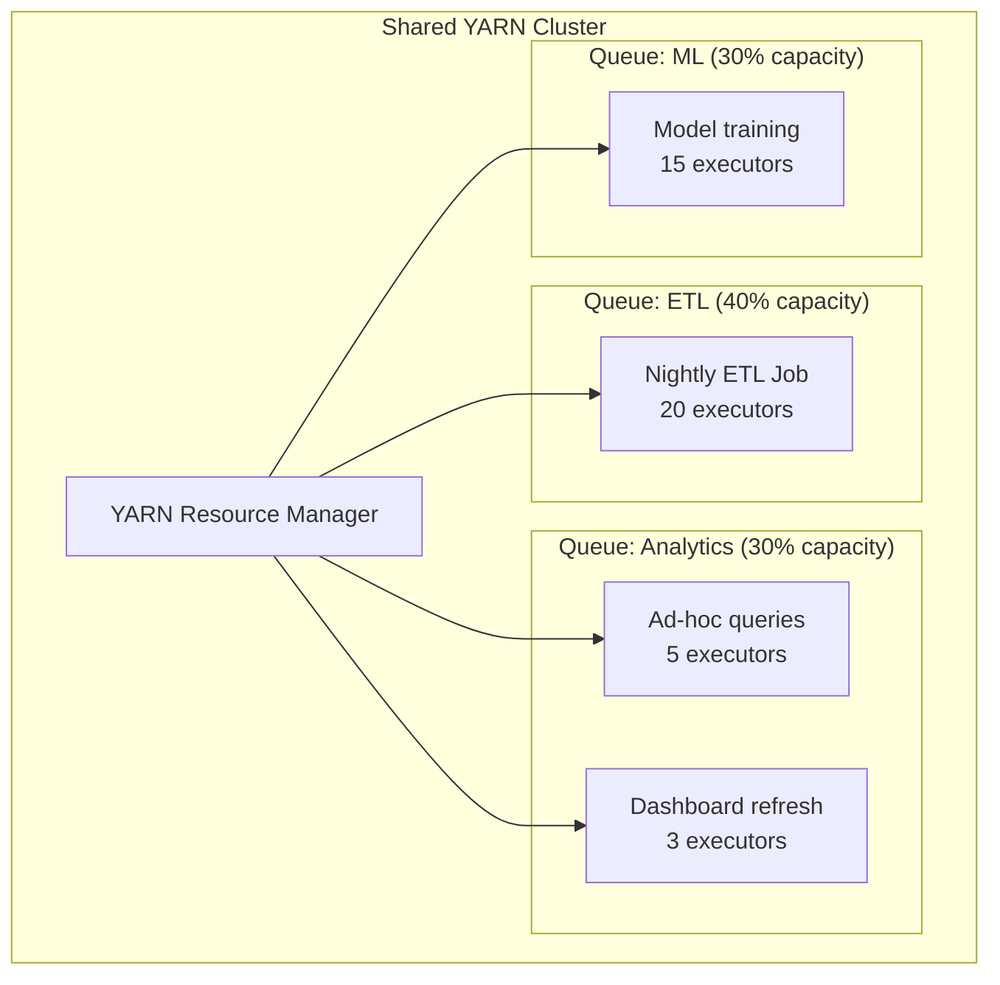
```mermaid
graph TB
    subgraph "Shared YARN Cluster"
        YARN["YARN Resource Manager"]
        
        subgraph "Queue: ETL (40% capacity)"
            J1["Nightly ETL Job<br>20 executors"]
        end
        
        subgraph "Queue: Analytics (30% capacity)"
            J2["Ad-hoc queries<br>5 executors"]
            J3["Dashboard refresh<br>3 executors"]
        end
        
        subgraph "Queue: ML (30% capacity)"
            J4["Model training<br>15 executors"]
        end
    end
    
    YARN --> J1
    YARN --> J2
    YARN --> J3
    YARN --> J4
```

```bash
# Submit to specific YARN queue
spark-submit \
  --master yarn \
  --queue etl \
  --conf spark.yarn.queue=etl \
  etl_job.py
```

---

## 12. Troubleshooting

### 12.1 Common Errors and Solutions

#### Error: `java.lang.OutOfMemoryError: Java heap space`

**Symptom:** Job crashes with OOM error on executor or driver.

**Diagnosis flow:**

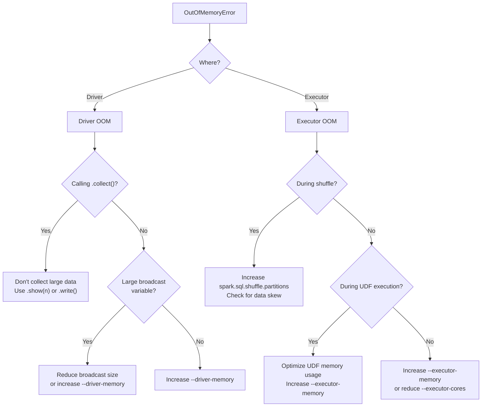
```mermaid
graph TD
    OOM["OutOfMemoryError"] --> WHERE{"Where?"}
    WHERE -->|"Driver"| DRIVER_OOM["Driver OOM"]
    WHERE -->|"Executor"| EXEC_OOM["Executor OOM"]
    
    DRIVER_OOM --> D1{"Calling .collect()?"}
    D1 -->|"Yes"| FIX1["Don't collect large data<br>Use .show(n) or .write()"]
    D1 -->|"No"| D2{"Large broadcast<br>variable?"}
    D2 -->|"Yes"| FIX2["Reduce broadcast size<br>or increase --driver-memory"]
    D2 -->|"No"| FIX3["Increase --driver-memory"]
    
    EXEC_OOM --> E1{"During shuffle?"}
    E1 -->|"Yes"| FIX4["Increase spark.sql.shuffle.partitions<br>Check for data skew"]
    E1 -->|"No"| E2{"During UDF execution?"}
    E2 -->|"Yes"| FIX5["Optimize UDF memory usage<br>Increase --executor-memory"]
    E2 -->|"No"| FIX6["Increase --executor-memory<br>or reduce --executor-cores"]
```

#### Error: `Connection refused` or `Connection timed out`

| Cause | Fix |
|-------|-----|
| Master not running | Start master: `$SPARK_HOME/sbin/start-master.sh` |
| Wrong master URL | Check URL: `spark://hostname:7077` |
| Firewall blocking ports | Open ports 7077, 4040, 8080 |
| Workers not started | Start workers: `$SPARK_HOME/sbin/start-worker.sh` |

#### Error: `Task not serializable`

**Symptom:** `org.apache.spark.SparkException: Task not serializable`

**Root cause:** You're referencing a non-serializable object inside a transformation.

```python
# BAD: Database connection isn't serializable
connection = create_db_connection()  # This lives on the driver
df.rdd.map(lambda row: connection.query(row.id))  # Can't send connection to executors!

# GOOD: Create connection inside the transformation
def process_partition(partition):
    connection = create_db_connection()  # Created on each executor
    for row in partition:
        yield connection.query(row.id)
    connection.close()

df.rdd.mapPartitions(process_partition)
```

#### Error: `Py4JJavaError` / `Py4JNetworkError`

**Root cause:** Communication breakdown between Python and JVM processes.

| Symptom | Likely Cause | Fix |
|---------|-------------|-----|
| `Py4JNetworkError: Answer from Java side is empty` | Executor JVM crashed | Check executor logs for OOM |
| `Py4JJavaError: An error occurred while calling o123.collectToPython` | Java exception during execution | Read the nested Java exception |
| `Py4JError: Constructor not found` | Version mismatch | Align Python, Java, and Spark versions |

### 12.2 The Spark UI: Your Best Debugging Tool

```
Default URLs:
  - Application UI:    http://driver-host:4040
  - Master UI:         http://master-host:8080
  - History Server:    http://history-host:18080
```

**What to look for in each tab:**

| Tab | What It Shows | What to Look For |
|-----|--------------|-----------------|
| **Jobs** | All jobs in your application | Failed jobs, long-running jobs |
| **Stages** | All stages with timing | Stages with many failed tasks, shuffle read/write sizes |
| **Tasks** | Individual task details | Skewed tasks (one task much slower than others), GC time |
| **Storage** | Cached DataFrames/RDDs | Memory usage, storage level |
| **Environment** | Spark configuration | Verify your settings are applied |
| **Executors** | Executor health | Memory usage, shuffle, GC time per executor |
| **SQL** | SQL query plans | Physical plan, scan sizes, join strategies |

---

## 13. Common Mistakes

### Mistake 1: Undersizing the Driver in Cluster Mode

```bash
# BAD: Default 1g driver memory with large broadcast or collect
spark-submit --deploy-mode cluster my_app.py
# Driver OOM when collecting results!

# GOOD: Size driver appropriately
spark-submit --deploy-mode cluster --driver-memory 4g my_app.py
```

### Mistake 2: Too Many Cores Per Executor

```bash
# BAD: One executor with 32 cores
# Problem: HDFS has ~5 concurrent connections per executor
# Too many cores = I/O bottleneck
spark-submit --executor-cores 32 --executor-memory 128g my_app.py

# GOOD: Multiple executors with 4-5 cores each
spark-submit --executor-cores 5 --executor-memory 20g --num-executors 6 my_app.py
```

> **💡 Key Insight:** The optimal executor size is typically **4-5 cores** with **~4GB per core** (16-20GB per executor). This balances HDFS connections, GC overhead, and memory fragmentation.

### Mistake 3: Not Using Dynamic Allocation

```python
# BAD: Fixed 50 executors for a job that needs 5 for 90% of the time
# Wastes cluster resources

# GOOD: Dynamic allocation
spark.conf.set("spark.dynamicAllocation.enabled", "true")
spark.conf.set("spark.dynamicAllocation.minExecutors", "2")
spark.conf.set("spark.dynamicAllocation.maxExecutors", "50")
```

### Mistake 4: Ignoring `deploy-mode` Implications

```bash
# BAD: Production cron job with client mode
# If the edge node reboots, job dies mid-execution
0 2 * * * spark-submit --deploy-mode client production_etl.py

# GOOD: Production jobs use cluster mode
0 2 * * * spark-submit --deploy-mode cluster production_etl.py
```

### Mistake 5: Setting `local[*]` in Production

```python
# BAD: Hardcoding local mode in application code
spark = SparkSession.builder.master("local[*]").getOrCreate()
# This runs everything on one machine, ignoring the cluster!

# GOOD: Let spark-submit set the master
spark = SparkSession.builder.appName("My App").getOrCreate()
# Then: spark-submit --master yarn --deploy-mode cluster my_app.py
```

---

## 14. Interview Questions

### Beginner Level

**Q1: Explain the Spark cluster architecture. What are the main components?**

> A Spark cluster has three main components:
> 1. **Driver** — The process running the user's main() function. Creates SparkSession, builds the DAG, schedules tasks, collects results.
> 2. **Executors** — Worker processes that run tasks, cache data, and report results back to the driver.
> 3. **Cluster Manager** — An external service (YARN, Kubernetes, Standalone, Mesos) that allocates resources (CPU, memory) for the driver and executors.
>
> The driver communicates with the cluster manager to request executors, then directly sends tasks to executors and receives results.

**Q2: What is the difference between client mode and cluster mode?**

> In **client mode**, the driver runs on the machine that submitted the job (e.g., your laptop). If that machine disconnects, the job fails. Good for interactive development and debugging.
>
> In **cluster mode**, the driver runs inside the cluster, managed by the cluster manager. The submitting machine can disconnect and the job continues. Good for production workloads.

**Q3: What is a Spark partition?**

> A partition is the fundamental unit of parallelism in Spark. It's a logical chunk of data that resides on a single machine and is processed by a single task (one CPU core). A DataFrame with 200 partitions can be processed by up to 200 cores simultaneously.

### Intermediate Level

**Q4: Explain the relationship between Jobs, Stages, and Tasks in Spark.**

> - **Job**: Created by each action (count, show, write). One application can have many jobs.
> - **Stage**: A job is divided into stages at shuffle boundaries. Within a stage, all transformations can be pipelined (executed without data exchange between machines).
> - **Task**: A stage is divided into tasks — one per partition. A task is the smallest unit of work, executing on one CPU core against one partition.
>
> Example: A job with a filter → groupBy → count creates 2 stages (split at groupBy shuffle) with N tasks per stage (N = number of partitions).

**Q5: What is a shuffle in Spark? Why is it expensive?**

> A shuffle is a data redistribution across partitions, required when rows with the same key must be co-located on the same machine (e.g., for groupBy, join, repartition). It's expensive because:
> 1. Data is serialized and written to local disk (shuffle write)
> 2. Data is transferred over the network to other machines
> 3. Data is read from disk and deserialized on the receiving side
>
> Shuffles can be the bottleneck in any Spark job. Minimizing unnecessary shuffles is a key optimization strategy.

**Q6: How does Spark decide where to schedule a task? Explain data locality.**

> Spark tries to schedule tasks on machines where the data already resides (data locality). It has four locality levels:
> 1. PROCESS_LOCAL — data is in the same executor's memory (cached)
> 2. NODE_LOCAL — data is on the same machine (different executor or local disk)
> 3. RACK_LOCAL — data is on a machine in the same rack
> 4. ANY — data is on a remote machine
>
> Spark waits `spark.locality.wait` (default 3s) for a data-local slot before falling back to a less local option.

### Advanced Level

**Q7: Your Spark job runs fine with 100GB of data but OOMs with 1TB. Walk through your debugging process.**

> 1. **Check Spark UI → Executors tab**: Look for executors with high memory usage or GC time
> 2. **Check stages**: Identify which stage fails — is it during a shuffle, join, or aggregation?
> 3. **Check for data skew**: Look at task duration distribution in the failed stage. If one task takes 100x longer than others, there's skew.
> 4. **Check shuffle sizes**: Large shuffle read/write indicates too much data being exchanged
>
> Likely fixes:
> - **Increase `spark.sql.shuffle.partitions`** (default 200 is too few for 1TB)
> - **Increase executor memory** or **add more executors**
> - **Salt skewed keys** to distribute them more evenly
> - **Use broadcast join** if one side of a join is small (< 100MB)
> - **Enable AQE**: `spark.sql.adaptive.enabled=true` auto-handles many of these issues

**Q8: How would you design a Spark cluster for a company that runs 500 daily ETL jobs on a 200-node YARN cluster shared with Hive and HBase?**

> Key design decisions:
>
> 1. **YARN queues**: Create separate queues for ETL, ad-hoc, ML with capacity limits (e.g., ETL: 50%, Ad-hoc: 25%, ML: 25%)
> 2. **Dynamic allocation**: Enable for all jobs to prevent resource hoarding
> 3. **Resource presets**: Define standard job sizes (small: 5 executors, medium: 20, large: 50)
> 4. **Queue scheduling**: Use YARN Fair Scheduler for sub-queue fairness
> 5. **Monitoring**: Set up Spark History Server for post-mortem analysis
> 6. **Scheduling**: Use Airflow/Oozie with proper DAG dependencies, avoid concurrent resource spikes
> 7. **Standard configs**: Enforce `spark-defaults.conf` with sane defaults (AQE enabled, shuffle partitions auto, broadcast threshold)
> 8. **Cost control**: Set max executor limits per user/queue, alert on long-running jobs

**Q9: Compare Spark on YARN vs Spark on Kubernetes. When would you choose each?**

> **YARN:**
> - Best when you already have a Hadoop cluster
> - Mature, battle-tested, well-understood
> - Tight integration with HDFS (data locality)
> - Rich YARN queue management for multi-tenancy
> - Choose when: On-premise Hadoop infrastructure, HDFS is primary storage
>
> **Kubernetes:**
> - Best for cloud-native environments
> - True container isolation (better security)
> - Can co-locate Spark with non-Hadoop workloads (web services, ML serving)
> - Better autoscaling (pod-level scaling, spot instances)
> - No data locality (typically using S3/GCS, not HDFS)
> - Choose when: Cloud-first strategy, microservices architecture, multi-cloud
>
> **Trade-off:** YARN is better for HDFS data locality; K8s is better for cloud object storage (S3/GCS) where data locality doesn't matter anyway.

**Q10: Explain how Spark handles executor failures during a shuffle-heavy job.**

> When an executor fails during a shuffle:
>
> 1. **Detection**: The driver detects the lost executor (heartbeat timeout, default 120s)
> 2. **Task rescheduling**: All running tasks on that executor are rescheduled on other executors
> 3. **Shuffle data recovery**: This is the tricky part:
>    - Shuffle data that was **written** by the failed executor is lost (it was on local disk)
>    - Any downstream stages that need to **read** from the failed executor must wait
>    - Spark **re-runs the upstream stage** that produced the lost shuffle data
>    - With the **External Shuffle Service** enabled, shuffle data survives executor death because it's managed by a separate process on each node
> 4. **Resource request**: The driver requests a new executor from the cluster manager
>
> **Best practice:** Always enable the External Shuffle Service (`spark.shuffle.service.enabled=true`) in production to avoid re-running entire stages when an executor dies.

---

## Summary

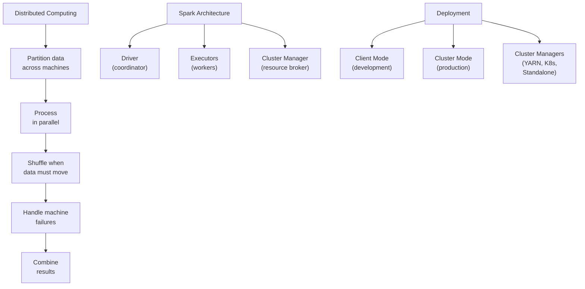
```mermaid
graph TD
    DC["Distributed Computing"] --> PARTITION["Partition data<br>across machines"]
    PARTITION --> PARALLEL["Process<br>in parallel"]
    PARALLEL --> SHUFFLE["Shuffle when<br>data must move"]
    SHUFFLE --> FAULT["Handle machine<br>failures"]
    FAULT --> RESULT["Combine<br>results"]
    
    ARCH["Spark Architecture"] --> DRIVER2["Driver<br>(coordinator)"]
    ARCH --> EXEC["Executors<br>(workers)"]
    ARCH --> CM2["Cluster Manager<br>(resource broker)"]
    
    DEPLOY["Deployment"] --> CLIENT["Client Mode<br>(development)"]
    DEPLOY --> CLUSTER["Cluster Mode<br>(production)"]
    DEPLOY --> MANAGERS["Cluster Managers<br>(YARN, K8s,<br>Standalone)"]
```

Distributed computing is the foundation that makes Spark possible. Understanding partitions, shuffles, the driver-executor architecture, and deployment modes will make you a much more effective Spark developer. Every performance problem, every error message, and every architectural decision traces back to these fundamentals.

In the next chapter, we'll dive into **RDD Internals** — the original abstraction that makes all of this work.

---

**[← Previous](01-why-spark-exists.md) | [Home](../README.md) | [Next →](03-rdd-internals.md)**
