# Chapter 3: RDD Internals — The Foundation of Spark

> **"Understanding RDDs is like understanding the engine of a car. You may never build an engine, but knowing how it works makes you a far better driver."**

Even though DataFrames are the preferred API in modern Spark, RDDs are the foundation upon which *everything* is built. DataFrames compile down to RDD operations. Understanding RDDs gives you the mental model to debug any Spark issue, optimize any pipeline, and answer any interview question.

---

## Table of Contents

- [1. What Is an RDD?](#1-what-is-an-rdd)
- [2. The Five Properties of an RDD](#2-the-five-properties-of-an-rdd)
- [3. Narrow vs Wide Dependencies](#3-narrow-vs-wide-dependencies)
- [4. Lineage Graph and Fault Tolerance](#4-lineage-graph-and-fault-tolerance)
- [5. Transformations vs Actions](#5-transformations-vs-actions)
- [6. Lazy Evaluation Deep Dive](#6-lazy-evaluation-deep-dive)
- [7. All Transformations Explained](#7-all-transformations-explained)
- [8. All Actions Explained](#8-all-actions-explained)
- [9. Pair RDDs](#9-pair-rdds)
- [10. Persistence and Caching](#10-persistence-and-caching)
- [11. Checkpointing](#11-checkpointing)
- [12. Accumulators](#12-accumulators)
- [13. Broadcast Variables](#13-broadcast-variables)
- [14. Why RDDs Still Matter](#14-why-rdds-still-matter)
- [15. Production Scenarios](#15-production-scenarios)
- [16. Troubleshooting](#16-troubleshooting)
- [17. Common Mistakes](#17-common-mistakes)
- [18. Interview Questions](#18-interview-questions)

---

## 1. What Is an RDD?

### 1.1 The Analogy: RDD as a Recipe Card

Imagine you're running a distributed kitchen with 100 chefs. You need to prepare 10,000 meals.

You don't hand each chef 100 finished meals. Instead, you hand each chef a **recipe card** that says:
- "Take ingredients from Pantry #3"
- "Chop the vegetables"
- "Sauté for 5 minutes"
- "Plate and serve"

The recipe card doesn't contain any food — it contains **instructions for making food**. The actual cooking only happens when someone orders a meal.

An RDD is exactly this: **a recipe card for data, not the data itself.**

### 1.2 Formal Definition

**RDD (Resilient Distributed Dataset)** is:
- **Resilient** — Fault-tolerant; can be recomputed from its lineage if a partition is lost
- **Distributed** — Data is split across multiple machines in the cluster
- **Dataset** — A collection of partitioned data elements

An RDD is an **immutable, partitioned collection of records** that can be operated on in parallel. It's the fundamental data abstraction in Spark.

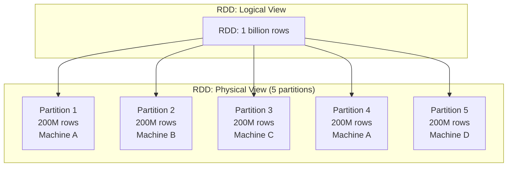

### 1.3 Creating RDDs

```python
from pyspark import SparkContext

sc = spark.sparkContext

# Method 1: From a Python collection (parallelize)
data = [1, 2, 3, 4, 5, 6, 7, 8, 9, 10]
rdd = sc.parallelize(data, numSlices=4)  # 4 partitions

# Method 2: From an external file
rdd = sc.textFile("hdfs:///data/logs.txt")
rdd = sc.textFile("s3://bucket/data/*.csv")
rdd = sc.textFile("file:///local/path/data.txt")

# Method 3: From another RDD (transformation)
filtered_rdd = rdd.filter(lambda x: x > 5)

# Method 4: From a DataFrame (going backwards — rarely needed)
rdd = df.rdd

# Check number of partitions
print(rdd.getNumPartitions())  # e.g., 4
```

---

## 2. The Five Properties of an RDD

Every RDD is defined by exactly five properties. These are the internal implementation details that make the whole system work:

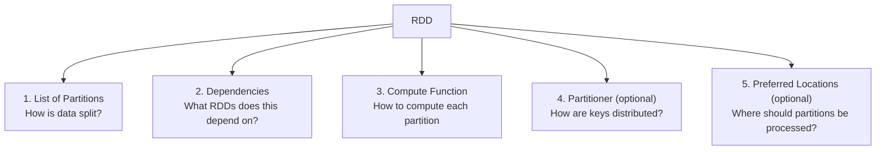

### Property 1: Partitions

Each RDD is split into partitions. Each partition is processed independently by one task.

```python
rdd = sc.parallelize(range(100), numSlices=10)
print(rdd.getNumPartitions())  # 10

# View partition contents (for debugging only — avoid in production)
print(rdd.glom().collect())
# [[0,1,...,9], [10,11,...,19], ..., [90,91,...,99]]
```

### Property 2: Dependencies

Each RDD knows which RDDs it was derived from. This forms the lineage graph.

```python
# rdd1 has no dependencies (it's a source)
rdd1 = sc.textFile("data.txt")

# rdd2 depends on rdd1 (narrow dependency)
rdd2 = rdd1.filter(lambda line: "error" in line)

# rdd3 depends on rdd2 (narrow dependency)
rdd3 = rdd2.map(lambda line: line.upper())

# See the lineage (debug string)
print(rdd3.toDebugString())
# (2) PythonRDD[3] at map
#  |  PythonRDD[2] at filter
#  |  data.txt MapPartitionsRDD[1] at textFile
#  |  data.txt HadoopRDD[0] at textFile
```

### Property 3: Compute Function

Each RDD knows how to compute its partitions from its parent RDD's partitions.

```
For filter(lambda x: x > 5):
  compute(partition) = parent_partition.filter(lambda x: x > 5)

For map(lambda x: x * 2):
  compute(partition) = parent_partition.map(lambda x: x * 2)
```

### Property 4: Partitioner (Optional)

For key-value RDDs, the partitioner determines which partition a key belongs to.

```python
# HashPartitioner — default for most operations
# key → hash(key) % numPartitions

# RangePartitioner — used by sortByKey
# Partitions data based on key ranges
```

### Property 5: Preferred Locations (Optional)

Hints about where each partition should ideally be processed (data locality).

```python
# For HDFS files: preferred location = machine storing that block
# For cached RDDs: preferred location = machine with cached partition
# For S3 files: no preferred location (all network)
```

---

## 3. Narrow vs Wide Dependencies

This is one of the most important concepts in Spark. It determines where **stage boundaries** are drawn and when **shuffles** occur.

### 3.1 Narrow Dependencies

Each partition of the child RDD depends on a **small number of partitions** (typically one) of the parent RDD.

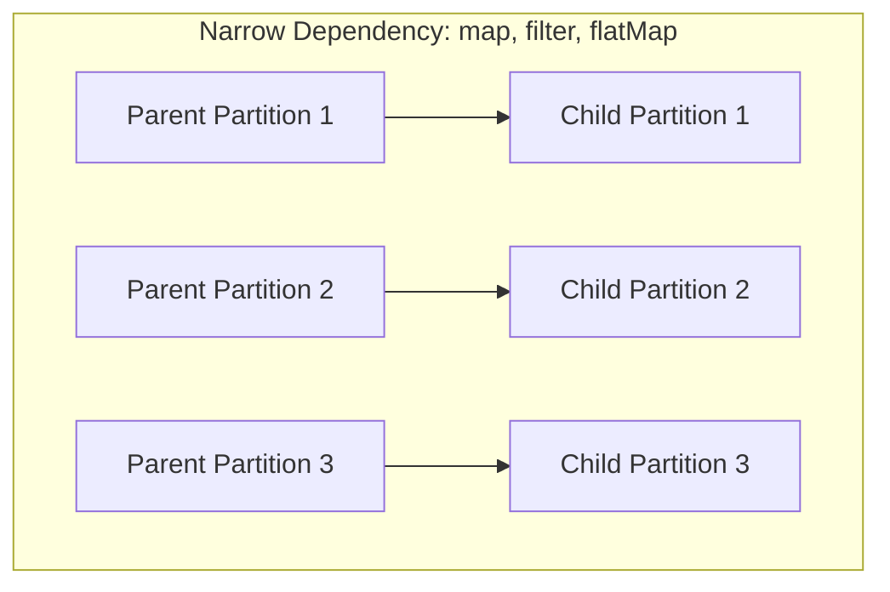

**Examples:** `map`, `filter`, `flatMap`, `mapPartitions`, `union`, `coalesce`

**Properties:**
- No data moves between machines (each partition is processed independently)
- Can be pipelined (chained) within a single stage
- Fast — no network I/O
- Easy fault recovery — re-compute just the lost partition

### 3.2 Wide Dependencies

Each partition of the child RDD depends on **all partitions** of the parent RDD.

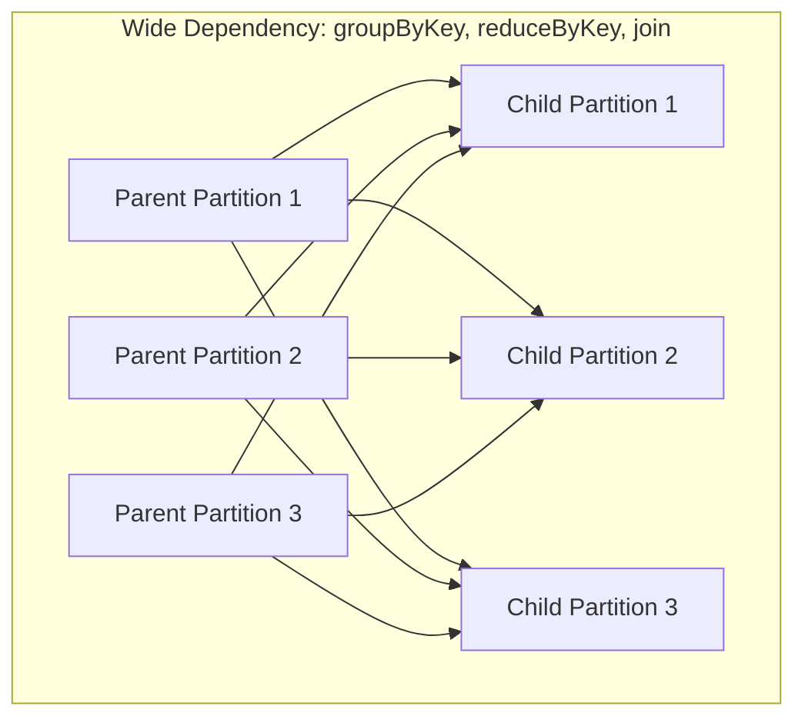

**Examples:** `groupByKey`, `reduceByKey`, `sortByKey`, `join` (without pre-partitioning), `repartition`, `distinct`

**Properties:**
- Data must be **shuffled** (sent across the network)
- Creates a **stage boundary**
- Expensive — involves disk I/O and network transfer
- Harder fault recovery — must re-run the entire parent stage to regenerate shuffle data

### 3.3 Why This Distinction Matters

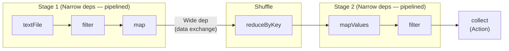

Spark groups narrow dependencies into **stages** that can be pipelined (executed in a single pass). Wide dependencies create **stage boundaries** where Spark must wait for all upstream tasks to complete before starting downstream tasks.

> **💡 Key Insight:** Minimizing wide dependencies (shuffles) is the single most important Spark optimization technique. Every shuffle involves disk I/O, network transfer, and serialization — the three slowest operations in computing.

---

## 4. Lineage Graph and Fault Tolerance

### 4.1 How Lineage Works

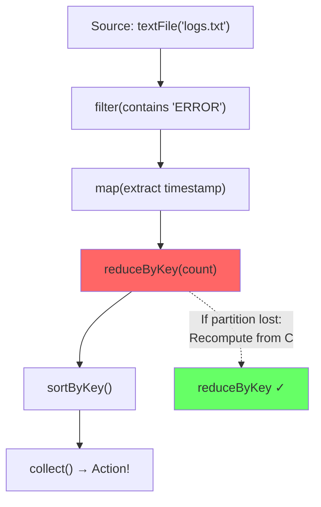

If a machine dies and partition 3 of the `reduceByKey` output is lost:

1. Spark checks the lineage: "Partition 3 was computed by `reduceByKey` from `map` partitions"
2. Spark recomputes the required parent partitions
3. Spark re-runs the `reduceByKey` computation for partition 3
4. The job continues

### 4.2 Lineage vs Replication Trade-off

| Aspect | Lineage (Spark) | Replication (HDFS) |
|--------|----------------|-------------------|
| Storage overhead | None (just metadata) | 3x data |
| Recovery time | Must recompute (slow for long lineage) | Instant (read replica) |
| Best for | Intermediate data | Source/final data |
| Risk | Very long lineage → slow recovery | Storage cost |

### 4.3 When Lineage Isn't Enough

For very long lineage chains (e.g., 100 iterations of an ML algorithm), recomputation from scratch is too expensive. The solution is **checkpointing** (covered in Section 11).

---

## 5. Transformations vs Actions

This is a fundamental concept that every Spark developer must understand deeply.

### 5.1 The Rule

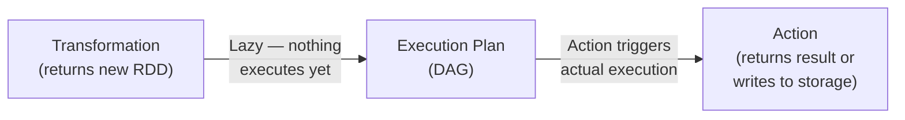

- **Transformation**: Creates a new RDD from an existing one. **Lazy** — nothing happens.
- **Action**: Triggers the execution of all transformations. Returns a result to the driver or writes data to storage.

### 5.2 Complete List

| Transformations (Lazy) | Actions (Trigger Execution) |
|------------------------|---------------------------|
| `map(func)` | `collect()` |
| `filter(func)` | `count()` |
| `flatMap(func)` | `first()` |
| `mapPartitions(func)` | `take(n)` |
| `union(rdd)` | `reduce(func)` |
| `distinct()` | `foreach(func)` |
| `groupByKey()` | `saveAsTextFile(path)` |
| `reduceByKey(func)` | `countByKey()` |
| `sortByKey()` | `takeSample()` |
| `join(rdd)` | `takeOrdered(n)` |
| `coalesce(n)` | `top(n)` |
| `repartition(n)` | `aggregate()` |
| `mapValues(func)` | `fold(zero, func)` |
| `flatMapValues(func)` | `treeReduce()` |
| `sample()` | `treeAggregate()` |
| `intersection(rdd)` | `isEmpty()` |
| `subtract(rdd)` | |
| `cartesian(rdd)` | |
| `pipe(command)` | |
| `cogroup(rdd)` | |
| `zip(rdd)` | |

---

## 6. Lazy Evaluation Deep Dive

### 6.1 What Happens When You Write Transformations

```python
# NONE of these lines execute any computation
rdd = sc.textFile("data.txt")                    # Plans: read file
filtered = rdd.filter(lambda x: "error" in x)    # Plans: filter
mapped = filtered.map(lambda x: x.upper())       # Plans: uppercase
pairs = mapped.map(lambda x: (x, 1))             # Plans: make pairs
counted = pairs.reduceByKey(lambda a, b: a + b)   # Plans: reduce

# At this point, Spark has ONLY built a DAG:
# textFile → filter → map → map → reduceByKey

# NOW Spark executes everything:
result = counted.collect()  # ACTION! Triggers execution of entire DAG
```

### 6.2 Why Lazy Evaluation Is Powerful

```python
# WITHOUT lazy evaluation (hypothetical eager Spark):
# 1. Read ALL data from disk (1 TB)
# 2. Filter → store 100 GB result
# 3. Map → store 100 GB result
# 4. ReduceByKey → store 50 GB result
# Total intermediate storage: 250 GB

# WITH lazy evaluation (actual Spark):
# Spark sees the ENTIRE pipeline and optimizes:
# 1. Read data, filter, and map in ONE pass (pipelined)
# 2. Only the reduceByKey needs separate processing
# Total intermediate storage: much less
```

### 6.3 The Gotcha: Side Effects

```python
# BAD: Relying on side effects in transformations
count = 0
def bad_counter(x):
    global count
    count += 1  # This updates the DRIVER's count, not the executor's!
    return x

rdd.map(bad_counter).collect()
print(count)  # Will print 0! Each executor has its own copy of count

# GOOD: Use accumulators for distributed counters (see Section 12)
```

---

## 7. All Transformations Explained

### 7.1 map(func)

Apply a function to each element, returning a new RDD with one output per input.

```python
rdd = sc.parallelize([1, 2, 3, 4, 5])
squared = rdd.map(lambda x: x ** 2)
print(squared.collect())  # [1, 4, 9, 16, 25]
```

**Dependency type:** Narrow
**Shuffle:** No

### 7.2 filter(func)

Keep only elements where the function returns True.

```python
rdd = sc.parallelize([1, 2, 3, 4, 5, 6, 7, 8, 9, 10])
evens = rdd.filter(lambda x: x % 2 == 0)
print(evens.collect())  # [2, 4, 6, 8, 10]
```

**Dependency type:** Narrow
**Shuffle:** No

### 7.3 flatMap(func)

Like `map`, but each input can produce zero or more outputs (function returns an iterable).

```python
rdd = sc.parallelize(["hello world", "foo bar baz"])
words = rdd.flatMap(lambda line: line.split(" "))
print(words.collect())  # ['hello', 'world', 'foo', 'bar', 'baz']

# Difference from map:
mapped = rdd.map(lambda line: line.split(" "))
print(mapped.collect())  # [['hello', 'world'], ['foo', 'bar', 'baz']]
# map returns nested lists, flatMap flattens them
```

**Dependency type:** Narrow
**Shuffle:** No

### 7.4 mapPartitions(func)

Apply a function to each partition (not each element). More efficient than `map` when setup is needed per partition.

```python
# BAD: Creating a DB connection per element
rdd.map(lambda x: db_connect().query(x))  # 1M connections for 1M elements!

# GOOD: Creating a DB connection per partition
def query_partition(partition):
    conn = db_connect()  # One connection per partition
    for element in partition:
        yield conn.query(element)
    conn.close()

rdd.mapPartitions(query_partition)
# Only N connections for N partitions (e.g., 200 connections for 200 partitions)
```

**Dependency type:** Narrow
**Shuffle:** No

### 7.5 reduceByKey(func) vs groupByKey()

Both group data by key, but `reduceByKey` is **dramatically more efficient**:

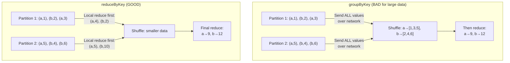

```python
rdd = sc.parallelize([("a", 1), ("b", 2), ("a", 3), ("b", 4), ("a", 5), ("b", 6)])

# BAD: groupByKey sends ALL values across the network
result = rdd.groupByKey().mapValues(sum)
print(result.collect())  # [('a', 9), ('b', 12)]

# GOOD: reduceByKey does local reduction first, then sends less data
result = rdd.reduceByKey(lambda a, b: a + b)
print(result.collect())  # [('a', 9), ('b', 12)]
```

> **⚠️ Warning:** `groupByKey` is one of the most misused operations in Spark. **Almost always use `reduceByKey` or `aggregateByKey` instead.** `groupByKey` sends ALL values across the network; `reduceByKey` reduces locally first, sending much less data.

### 7.6 join(other_rdd)

Performs an inner join on key-value RDDs.

```python
users = sc.parallelize([(1, "Alice"), (2, "Bob"), (3, "Charlie")])
scores = sc.parallelize([(1, 95), (2, 87), (3, 92), (1, 88)])

joined = users.join(scores)
print(joined.collect())
# [(1, ('Alice', 95)), (1, ('Alice', 88)), (2, ('Bob', 87)), (3, ('Charlie', 92))]

# Other join types:
users.leftOuterJoin(scores)
users.rightOuterJoin(scores)
users.fullOuterJoin(scores)
```

**Dependency type:** Wide (shuffle on both RDDs unless co-partitioned)
**Shuffle:** Yes

### 7.7 union(other_rdd)

Combine two RDDs (like SQL UNION ALL — keeps duplicates).

```python
rdd1 = sc.parallelize([1, 2, 3])
rdd2 = sc.parallelize([3, 4, 5])
combined = rdd1.union(rdd2)
print(combined.collect())  # [1, 2, 3, 3, 4, 5]
```

**Dependency type:** Narrow
**Shuffle:** No (just concatenates partitions)

### 7.8 distinct()

Remove duplicate elements.

```python
rdd = sc.parallelize([1, 1, 2, 2, 3, 3, 3])
unique = rdd.distinct()
print(unique.collect())  # [1, 2, 3]
```

**Dependency type:** Wide
**Shuffle:** Yes (needs to compare elements across partitions)

### 7.9 sortByKey()

Sort a key-value RDD by key.

```python
rdd = sc.parallelize([("banana", 3), ("apple", 1), ("cherry", 2)])
sorted_rdd = rdd.sortByKey()
print(sorted_rdd.collect())  # [('apple', 1), ('banana', 3), ('cherry', 2)]

# Descending order
sorted_rdd = rdd.sortByKey(ascending=False)
```

**Dependency type:** Wide
**Shuffle:** Yes (uses range partitioning)

---

## 8. All Actions Explained

### 8.1 collect()

Returns all elements as a list to the driver.

```python
rdd = sc.parallelize([1, 2, 3, 4, 5])
result = rdd.collect()  # [1, 2, 3, 4, 5]
```

> **⚠️ Warning:** `collect()` brings ALL data to the driver. If your RDD has 1 billion rows, this will crash the driver with OutOfMemoryError. Use only on small results.

### 8.2 count()

Returns the number of elements.

```python
rdd = sc.parallelize([1, 2, 3, 4, 5])
print(rdd.count())  # 5
```

### 8.3 first() and take(n)

```python
rdd = sc.parallelize([5, 3, 1, 4, 2])
print(rdd.first())    # 5 (first element)
print(rdd.take(3))    # [5, 3, 1] (first 3 elements)
```

### 8.4 reduce(func)

Aggregate elements using a function (must be commutative and associative).

```python
rdd = sc.parallelize([1, 2, 3, 4, 5])
total = rdd.reduce(lambda a, b: a + b)
print(total)  # 15
```

### 8.5 saveAsTextFile(path)

Write RDD to text files (one file per partition).

```python
rdd = sc.parallelize(["hello", "world", "foo", "bar"], 2)
rdd.saveAsTextFile("hdfs:///output/path")
# Creates:
#   output/path/part-00000  (contains "hello\nworld")
#   output/path/part-00001  (contains "foo\nbar")
#   output/path/_SUCCESS
```

### 8.6 foreach(func)

Execute a function on each element (on the executors — not the driver).

```python
# This runs on EXECUTORS, not driver
rdd.foreach(lambda x: print(x))  
# Output goes to executor logs, NOT your console!

# Useful for writing to external systems
def write_to_db(record):
    # This function runs on each executor
    db.insert(record)

rdd.foreach(write_to_db)
```

### 8.7 countByKey()

Count elements per key (for key-value RDDs). Returns a dict to the driver.

```python
rdd = sc.parallelize([("a", 1), ("b", 2), ("a", 3), ("b", 4), ("c", 5)])
print(rdd.countByKey())  # defaultdict(<class 'int'>, {'a': 2, 'b': 2, 'c': 1})
```

---

## 9. Pair RDDs

### 9.1 What Are Pair RDDs?

Pair RDDs are RDDs of key-value tuples. They unlock additional operations like `reduceByKey`, `groupByKey`, `join`, `sortByKey`.

```python
# Creating Pair RDDs
text_rdd = sc.textFile("access.log")

# Convert to pair RDD: (status_code, log_line)
pair_rdd = text_rdd.map(lambda line: (line.split(" ")[8], line))

# Now you can use key-value operations
status_counts = pair_rdd.countByKey()
# {'200': 45000, '404': 1200, '500': 300}
```

### 9.2 Key Pair RDD Operations

```python
pair_rdd = sc.parallelize([("a", 1), ("b", 2), ("a", 3), ("b", 4)])

# mapValues — apply function to values only (preserves partitioning)
pair_rdd.mapValues(lambda v: v * 10).collect()
# [('a', 10), ('b', 20), ('a', 30), ('b', 40)]

# flatMapValues — like flatMap but on values only
rdd = sc.parallelize([("a", "hello world"), ("b", "foo bar")])
rdd.flatMapValues(lambda v: v.split(" ")).collect()
# [('a', 'hello'), ('a', 'world'), ('b', 'foo'), ('b', 'bar')]

# keys() and values()
pair_rdd.keys().collect()    # ['a', 'b', 'a', 'b']
pair_rdd.values().collect()  # [1, 2, 3, 4]

# cogroup — group values from two RDDs by key
rdd1 = sc.parallelize([("a", 1), ("b", 2)])
rdd2 = sc.parallelize([("a", 3), ("b", 4), ("b", 5)])
rdd1.cogroup(rdd2).mapValues(lambda x: (list(x[0]), list(x[1]))).collect()
# [('a', ([1], [3])), ('b', ([2], [4, 5]))]
```

---

## 10. Persistence and Caching

### 10.1 The Problem

```python
# Without caching: RDD is recomputed from scratch TWICE
rdd = sc.textFile("huge_file.txt").filter(lambda x: "error" in x)

count = rdd.count()          # Reads file, filters, counts
first_10 = rdd.take(10)      # Reads file AGAIN, filters AGAIN, takes 10
# The file was read and filtered TWICE!
```

### 10.2 The Solution: cache() and persist()

```python
# With caching: RDD is computed once and stored in memory
rdd = sc.textFile("huge_file.txt").filter(lambda x: "error" in x)
rdd.cache()  # Marks RDD for caching (lazy — won't cache until first action)

count = rdd.count()          # Reads file, filters, counts, CACHES result
first_10 = rdd.take(10)      # Reads from CACHE (instant!)
```

### 10.3 Storage Levels

```python
from pyspark import StorageLevel

# cache() is shorthand for persist(StorageLevel.MEMORY_ONLY)
rdd.cache()

# persist() lets you choose the storage level
rdd.persist(StorageLevel.MEMORY_ONLY)          # Default; spills if no memory
rdd.persist(StorageLevel.MEMORY_AND_DISK)       # Spill to disk if no memory
rdd.persist(StorageLevel.DISK_ONLY)             # Only disk (useful for large RDDs)
rdd.persist(StorageLevel.MEMORY_ONLY_SER)       # Serialized in memory (less memory, more CPU)
rdd.persist(StorageLevel.MEMORY_AND_DISK_SER)   # Serialized, spill to disk
rdd.persist(StorageLevel.OFF_HEAP)              # Off-heap memory (Tungsten)

# Remove from cache
rdd.unpersist()
```

### 10.4 Storage Level Comparison

| Storage Level | Memory | Disk | Serialized | Replicated | Use When |
|--------------|--------|------|------------|-----------|----------|
| `MEMORY_ONLY` | ✅ | ❌ | ❌ | ❌ | Default; data fits in memory |
| `MEMORY_AND_DISK` | ✅ | ✅ | ❌ | ❌ | Data might not fit in memory |
| `MEMORY_ONLY_SER` | ✅ | ❌ | ✅ | ❌ | Need to save memory (2-5x compression) |
| `MEMORY_AND_DISK_SER` | ✅ | ✅ | ✅ | ❌ | Save memory, allow disk spillover |
| `DISK_ONLY` | ❌ | ✅ | ✅ | ❌ | Very large data, recompute is expensive |
| `MEMORY_ONLY_2` | ✅ | ❌ | ❌ | ✅ (2x) | Critical data that can't be recomputed fast |

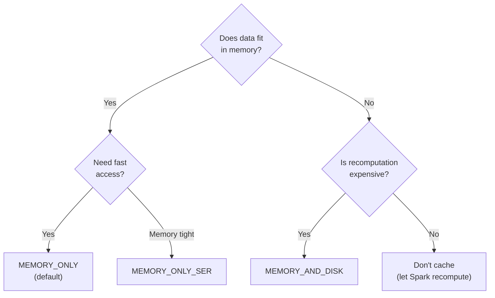

### 10.5 When to Cache

**Cache when:**
- An RDD/DataFrame is used **multiple times** (e.g., once for count, once for show)
- An RDD is the result of an **expensive computation** (complex joins, ML features)
- An RDD is used in an **iterative algorithm** (ML training loops)

**Don't cache when:**
- An RDD is used only **once**
- An RDD is too large to fit in memory (will cause excessive GC)
- The source is already fast to read (e.g., small Parquet file on SSD)

---

## 11. Checkpointing

### 11.1 What Is Checkpointing?

Checkpointing writes an RDD to reliable storage (HDFS/S3) and **truncates its lineage**. This is different from caching:

| Feature | Cache/Persist | Checkpoint |
|---------|--------------|-----------|
| Storage | Memory/local disk | HDFS/S3 (reliable) |
| Lineage | Preserved | Truncated |
| Survives app restart | No | Yes |
| Use case | Performance | Long lineage, fault tolerance |
| Trigger | Lazy (on first action) | Lazy (on first action) |

### 11.2 When to Checkpoint

```python
# Set checkpoint directory (must be reliable storage)
sc.setCheckpointDir("hdfs:///checkpoints/my_app/")

# Checkpoint after many iterations (long lineage)
rdd = sc.textFile("data.txt")
for i in range(100):
    rdd = rdd.map(lambda x: transform(x))
    if i % 10 == 0:  # Checkpoint every 10 iterations
        rdd.checkpoint()
        rdd.count()  # Force materialization
```

### 11.3 Reliable vs Local Checkpointing

```python
# Reliable checkpoint — writes to HDFS/S3, survives app restart
sc.setCheckpointDir("hdfs:///checkpoints/")
rdd.checkpoint()

# Local checkpoint — writes to executor local disk, truncates lineage
# Faster but doesn't survive executor failure
rdd.localCheckpoint()
```

---

## 12. Accumulators

### 12.1 The Problem: Distributed Counters

```python
# BAD: This doesn't work in distributed Spark
counter = 0
rdd.foreach(lambda x: counter += 1)  # Each executor increments ITS OWN copy!
print(counter)  # Still 0 on the driver!
```

### 12.2 The Solution: Accumulators

```python
# Accumulators are shared variables that executors can ADD to
# but only the driver can READ

# Numeric accumulator
error_count = sc.accumulator(0)
blank_lines = sc.accumulator(0)

def process_line(line):
    if not line.strip():
        blank_lines.add(1)
    if "ERROR" in line:
        error_count.add(1)
    return line

rdd = sc.textFile("logs.txt")
processed = rdd.map(process_line)
processed.count()  # Trigger execution

print(f"Errors: {error_count.value}")     # Reads from driver
print(f"Blanks: {blank_lines.value}")
```

### 12.3 Accumulator Caveats

> **⚠️ Warning:** Accumulators in transformations may be incremented more than once if a task is re-executed (due to failure or speculative execution). Use accumulators in transformations for **debugging only**. For accurate counts, use accumulators only inside **actions** (`foreach`).

```python
# RELIABLE: Accumulator in an action
rdd.foreach(lambda x: counter.add(1))

# UNRELIABLE: Accumulator in a transformation (may double-count)
rdd.map(lambda x: counter.add(1) or x)  # DON'T DO THIS FOR ACCURATE COUNTS
```

---

## 13. Broadcast Variables

### 13.1 The Problem: Sending Data to Executors

```python
# BAD: Without broadcast, lookup_table is sent with EVERY TASK
lookup_table = {"US": "United States", "UK": "United Kingdom", ...}  # 100MB dict

rdd.map(lambda x: lookup_table[x.country_code])
# If 10,000 tasks: 100MB × 10,000 = 1 TB of data transferred!
```

### 13.2 The Solution: Broadcast Variables

```python
# GOOD: Broadcast sends the data ONCE PER EXECUTOR
lookup_table = {"US": "United States", "UK": "United Kingdom", ...}  # 100MB dict
broadcast_lookup = sc.broadcast(lookup_table)

# Access with .value
rdd.map(lambda x: broadcast_lookup.value[x.country_code])
# If 100 executors: 100MB × 100 = 10 GB (not 1 TB!)
```

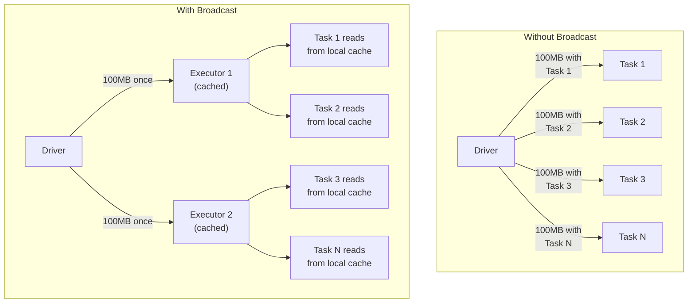

### 13.3 When to Use Broadcast

- **Lookup tables** — country codes, product categories, feature mappings
- **ML model parameters** — small models used for prediction on each executor
- **Configuration data** — per-executor configuration
- **Small DataFrames for join** — Spark automatically broadcasts small DataFrames in joins (broadcast join), but you can force it with `broadcast()`

```python
# Free broadcast memory when done
broadcast_lookup.unpersist()

# Destroy (cannot be used after this)
broadcast_lookup.destroy()
```

---

## 14. Why RDDs Still Matter

### 14.1 DataFrames Compile to RDDs

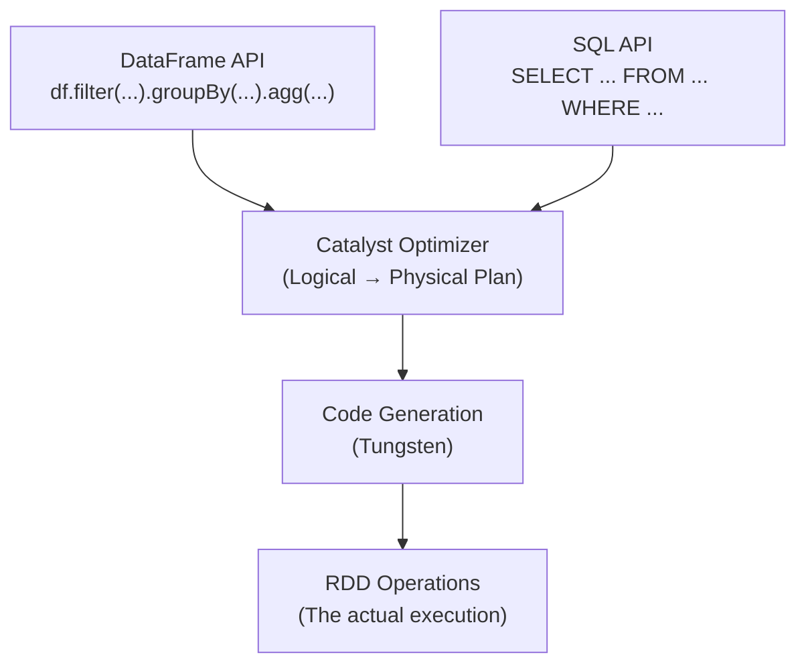

When you write `df.filter(df.age > 25).groupBy("dept").count()`, Spark:
1. Parses it into a logical plan
2. Optimizes it with Catalyst
3. Generates optimized code with Tungsten
4. **Executes it as RDD operations**

Understanding RDDs means understanding what's happening under the hood of DataFrames.

### 14.2 When You Still Need RDD API

| Scenario | Why RDD is needed |
|----------|------------------|
| **Unstructured data** | Text processing, binary files, custom formats |
| **Fine-grained control** | Custom partitioning, `mapPartitions` for resource management |
| **Low-level operations** | `pipe()` for calling external programs, `aggregate()` |
| **Legacy code** | Migrating old Spark 1.x codebases |
| **Understanding internals** | Debugging DataFrame performance issues |

### 14.3 The Migration Path

```python
# RDD way (old, verbose, no optimization)
rdd = sc.textFile("users.csv")
parsed = rdd.map(lambda line: line.split(","))
filtered = parsed.filter(lambda fields: int(fields[2]) > 25)
pairs = filtered.map(lambda fields: (fields[1], 1))
counted = pairs.reduceByKey(lambda a, b: a + b)
counted.collect()

# DataFrame way (modern, concise, optimized)
df = spark.read.csv("users.csv", header=True, inferSchema=True)
df.filter(df.age > 25).groupBy("department").count().collect()

# The DataFrame version:
# - Is optimized by Catalyst (predicate pushdown, column pruning)
# - Uses Tungsten for efficient memory management
# - Is much easier to read and write
```

---

## 15. Production Scenarios

### 15.1 Scenario: Processing Unstructured Log Files

```python
# Real-world log processing where RDD API shines
log_rdd = sc.textFile("s3://logs/2024/01/*/access.log")

# Parse Apache access log format
def parse_log(line):
    try:
        parts = line.split(" ")
        return {
            "ip": parts[0],
            "timestamp": parts[3][1:],
            "method": parts[5][1:],
            "url": parts[6],
            "status": int(parts[8]),
            "size": int(parts[9]) if parts[9] != '-' else 0
        }
    except (IndexError, ValueError):
        return None

parsed = log_rdd.map(parse_log).filter(lambda x: x is not None)

# Cache because we'll use it multiple times
parsed.cache()

# Analysis 1: Error rate by hour
errors = parsed.filter(lambda x: x["status"] >= 500)
error_by_hour = errors.map(lambda x: (x["timestamp"][:13], 1)) \
    .reduceByKey(lambda a, b: a + b) \
    .sortByKey()

# Analysis 2: Top URLs by traffic
top_urls = parsed.map(lambda x: (x["url"], x["size"])) \
    .reduceByKey(lambda a, b: a + b) \
    .takeOrdered(20, key=lambda x: -x[1])

parsed.unpersist()  # Free cache when done
```

### 15.2 Scenario: Custom Partitioning for Skewed Data

```python
from pyspark import Partitioner

class SaltedPartitioner(Partitioner):
    """Custom partitioner that handles skewed keys by salting."""
    
    def __init__(self, num_partitions, hot_keys, salt_factor=10):
        self.num_partitions = num_partitions
        self.hot_keys = set(hot_keys)
        self.salt_factor = salt_factor
    
    def numPartitions(self):
        return self.num_partitions
    
    def partitionFunc(self, key):
        if key in self.hot_keys:
            import random
            salt = random.randint(0, self.salt_factor - 1)
            return hash((key, salt)) % self.num_partitions
        return hash(key) % self.num_partitions

# Use custom partitioner for skewed join
rdd.partitionBy(200, SaltedPartitioner(200, hot_keys=["popular_user_123"]))
```

### 15.3 Scenario: mapPartitions for External System Writes

```python
def write_partition_to_db(partition):
    """Efficiently write a partition to a database."""
    import psycopg2
    
    # One connection per partition (not per row!)
    conn = psycopg2.connect(
        host="db.example.com",
        database="analytics",
        user="writer",
        password="secret"
    )
    cursor = conn.cursor()
    
    batch = []
    for row in partition:
        batch.append((row["user_id"], row["event"], row["timestamp"]))
        if len(batch) >= 1000:  # Batch insert for efficiency
            cursor.executemany(
                "INSERT INTO events (user_id, event, timestamp) VALUES (%s, %s, %s)",
                batch
            )
            conn.commit()
            batch = []
    
    if batch:  # Write remaining records
        cursor.executemany(
            "INSERT INTO events (user_id, event, timestamp) VALUES (%s, %s, %s)",
            batch
        )
        conn.commit()
    
    cursor.close()
    conn.close()
    return []  # mapPartitions expects an iterable

rdd.mapPartitions(write_partition_to_db).count()  # .count() triggers execution
```

---

## 16. Troubleshooting

### 16.1 Common RDD Errors

#### Error: `Task not serializable`

```python
# BAD: Referencing a non-serializable object
class MyProcessor:
    def __init__(self):
        self.db = create_connection()  # Not serializable!
    
    def process(self, rdd):
        return rdd.map(lambda x: self.db.query(x))  # Tries to serialize self.db!

# GOOD: Create non-serializable resources inside the closure
class MyProcessor:
    def __init__(self):
        self.config = {"host": "db.example.com"}  # Serializable!
    
    def process(self, rdd):
        config = self.config  # Copy to local variable
        def transform(x):
            db = create_connection(config)  # Created on executor
            return db.query(x)
        return rdd.map(transform)
```

#### Error: `OutOfMemoryError` during `collect()`

```python
# WRONG: Collecting 1 billion rows to driver
results = huge_rdd.collect()  # OOM!

# RIGHT: Only collect what you need
results = huge_rdd.take(100)                      # First 100 elements
results = huge_rdd.takeSample(False, 100)          # Random 100 elements
huge_rdd.saveAsTextFile("hdfs:///output/")         # Write to distributed storage
results = huge_rdd.top(10, key=lambda x: x[1])     # Top 10 by value
```

#### Error: Slow execution with `groupByKey`

```python
# DIAGNOSIS: Check Spark UI → Stages → shuffle read/write sizes
# If shuffle write is 100x larger than shuffle read → groupByKey is the culprit

# BEFORE (groupByKey — sends ALL values over network)
rdd.groupByKey().mapValues(sum).collect()

# AFTER (reduceByKey — reduces locally first)
rdd.reduceByKey(lambda a, b: a + b).collect()

# For complex aggregations, use aggregateByKey:
rdd.aggregateByKey(
    zeroValue=(0, 0),
    seqFunc=lambda acc, val: (acc[0] + val, acc[1] + 1),  # Local combine
    combFunc=lambda acc1, acc2: (acc1[0] + acc2[0], acc1[1] + acc2[1])  # Cross-partition combine
).mapValues(lambda x: x[0] / x[1]).collect()  # Compute average
```

### 16.2 Debugging RDD Lineage

```python
# Print the lineage (DAG) of an RDD
print(rdd.toDebugString().decode("utf-8"))

# Example output:
# (4) PythonRDD[12] at collect at <stdin>:1
#  |  MapPartitionsRDD[11] at mapPartitions at <stdin>:1
#  |  PythonRDD[10] at RDD at PythonRDD.scala:53
#  |  UnionRDD[9] at union at <stdin>:1
#  |  PythonRDD[7] at RDD at PythonRDD.scala:53
#  |  MapPartitionsRDD[6] at textFile at <stdin>:1
#  |  file1.txt HadoopRDD[5] at textFile at <stdin>:1
#  |  PythonRDD[8] at RDD at PythonRDD.scala:53
#  |  MapPartitionsRDD[4] at textFile at <stdin>:1
#  |  file2.txt HadoopRDD[3] at textFile at <stdin>:1

# The (4) prefix indicates number of partitions
# Indentation shows dependency chains
```

---

## 17. Common Mistakes

### Mistake 1: Using `collect()` on Large RDDs

```python
# WRONG
all_data = big_rdd.collect()  # Loads ALL data into driver memory

# RIGHT
big_rdd.take(10)                          # Sample
big_rdd.saveAsTextFile("output/")          # Write distributed
big_rdd.foreach(process_element)           # Process on executors
```

### Mistake 2: Using `groupByKey()` Instead of `reduceByKey()`

Already covered above — this is the #1 most common RDD performance mistake.

### Mistake 3: Creating RDDs Inside Transformations

```python
# WRONG: Creating an RDD inside a transformation
rdd.map(lambda x: sc.parallelize([x]).count())  # ERROR! Can't use SparkContext in executors

# RIGHT: Use broadcast variables or restructure your computation
```

### Mistake 4: Not Caching Reused RDDs

```python
# WRONG: RDD recomputed 3 times
rdd = sc.textFile("big_file.txt").filter(...).map(...)
result1 = rdd.count()
result2 = rdd.take(10)
result3 = rdd.reduce(lambda a, b: a + b)
# File was read and processed 3 times!

# RIGHT: Cache before multiple uses
rdd = sc.textFile("big_file.txt").filter(...).map(...)
rdd.cache()
result1 = rdd.count()    # Computes and caches
result2 = rdd.take(10)   # Reads from cache
result3 = rdd.reduce(lambda a, b: a + b)  # Reads from cache
rdd.unpersist()           # Free memory when done
```

### Mistake 5: Ignoring Partition Count

```python
# WRONG: Default partitions may be too few or too many
rdd = sc.textFile("small_file.txt")  # Might create 200 partitions for a 10MB file!

# RIGHT: Control partition count
rdd = sc.textFile("small_file.txt", minPartitions=4)
rdd = rdd.coalesce(4)  # Reduce partitions without shuffle
```

---

## 18. Interview Questions

### Beginner Level

**Q1: What is an RDD? What does "Resilient" mean?**

> An RDD (Resilient Distributed Dataset) is an immutable, partitioned collection of records that can be operated on in parallel. "Resilient" means fault-tolerant — if a partition is lost due to machine failure, Spark can recompute it from its lineage (the sequence of transformations used to create it).

**Q2: What is the difference between a transformation and an action?**

> A transformation creates a new RDD from an existing one and is **lazy** — it doesn't execute immediately but adds to the execution plan. Examples: map, filter, reduceByKey.
>
> An action triggers the execution of all pending transformations and returns a result to the driver or writes data to storage. Examples: collect, count, saveAsTextFile.

**Q3: What is lazy evaluation and why does Spark use it?**

> Lazy evaluation means transformations are not executed immediately — Spark builds a DAG (plan) and only executes when an action is called. Benefits:
> 1. Spark can optimize the entire plan (e.g., combine map + filter into one pass)
> 2. Unnecessary operations can be eliminated
> 3. Data can be pipelined through multiple transformations without materializing intermediate results

### Intermediate Level

**Q4: Explain the difference between narrow and wide dependencies. Give examples.**

> **Narrow dependency:** Each partition of the child RDD depends on a constant number of partitions (usually one) of the parent RDD. No shuffle required. Examples: map, filter, flatMap, union.
>
> **Wide dependency:** Each partition of the child RDD may depend on ALL partitions of the parent RDD. Requires a shuffle. Examples: groupByKey, reduceByKey, join, distinct, repartition.
>
> Narrow dependencies can be pipelined within a single stage. Wide dependencies create stage boundaries where Spark must wait for all upstream tasks to complete.

**Q5: Why is `reduceByKey` preferred over `groupByKey`?**

> `groupByKey` sends **all values** for each key across the network during the shuffle. `reduceByKey` performs a **local reduction** first (on each executor), then sends only the pre-aggregated results across the network. This dramatically reduces shuffle data.
>
> For example, if you have 1 million rows with key "A" across 200 partitions, `groupByKey` sends all 1 million values across the network, while `reduceByKey` sends only 200 pre-reduced values.

**Q6: What is the difference between `cache()` and `checkpoint()`?**

> | Aspect | cache()/persist() | checkpoint() |
> |--------|-------------------|-------------|
> | Storage | Memory/local disk | HDFS/S3 (reliable) |
> | Lineage | Preserved | Truncated |
> | Survives app restart | No | Yes |
> | Performance | Fast (in-memory) | Slower (reliable storage) |
> | Use case | Reuse within same app | Long lineage chains, iterative algorithms |

### Advanced Level

**Q7: Explain the five properties of an RDD. Why does each matter?**

> 1. **Partitions**: How data is split. Determines parallelism level.
> 2. **Dependencies**: Narrow or wide. Determines stage boundaries and shuffle behavior.
> 3. **Compute function**: How to derive each partition from parent partitions. The actual transformation logic.
> 4. **Partitioner** (optional): How keys are assigned to partitions. Enables optimized joins (co-partitioned RDDs skip shuffle).
> 5. **Preferred locations** (optional): Data locality hints. Enables scheduling tasks where data already exists.
>
> These five properties enable Spark's entire execution model: partition-level parallelism, lineage-based fault tolerance, stage-aware scheduling, and data-local processing.

**Q8: You have a pipeline that chains 50 transformations including 5 shuffles. One executor fails. What happens?**

> Spark's recovery depends on which stage's data was lost:
> 1. If the lost partition is from a **cached** RDD → re-read from cache on another executor
> 2. If the lost partition is from a **narrow dependency stage** → recompute just that partition by replaying the lineage from the nearest materialized ancestor
> 3. If the lost partition is from a **wide dependency stage** (after a shuffle) → the shuffle data on the failed executor is lost. Spark must re-run the **entire parent stage** to regenerate the shuffle data
>
> This is why:
> - **Checkpoint** after expensive stages to truncate lineage
> - **Enable External Shuffle Service** so shuffle data survives executor failure
> - Long lineage without checkpoints can lead to expensive recomputation cascades

**Q9: Design a custom accumulator for tracking data quality metrics during an ETL pipeline.**

> ```python
> from pyspark.accumulators import AccumulatorParam
> 
> class DictAccumulatorParam(AccumulatorParam):
>     """Accumulator that merges dictionaries by summing values."""
>     def zero(self, value):
>         return {}
>     
>     def addInPlace(self, acc1, acc2):
>         for key, val in acc2.items():
>             acc1[key] = acc1.get(key, 0) + val
>         return acc1
> 
> # Usage
> quality_metrics = sc.accumulator({}, DictAccumulatorParam())
> 
> def validate_and_process(row):
>     metrics = {}
>     if row["email"] is None:
>         metrics["null_emails"] = 1
>     if row["age"] < 0 or row["age"] > 150:
>         metrics["invalid_ages"] = 1
>     if not row["name"].strip():
>         metrics["blank_names"] = 1
>     quality_metrics.add(metrics)
>     return row
> 
> rdd.foreach(validate_and_process)
> print(quality_metrics.value)
> # {'null_emails': 1523, 'invalid_ages': 47, 'blank_names': 89}
> ```

**Q10: When would you choose the RDD API over the DataFrame API in a modern Spark application?**

> Use RDD API when:
> 1. **Processing unstructured data** — raw text, binary files, custom formats that don't map to tabular structures
> 2. **Need `mapPartitions` for resource management** — database connections, file handles, ML model loading per partition
> 3. **Custom partitioning** — implementing application-specific partitioners for skew handling
> 4. **Low-level operations** — `pipe()` for calling external processes, `aggregate()` for complex aggregations
> 5. **Type-safety requirements** — when you need typed transformations (though Scala Datasets are better for this)
>
> Always prefer DataFrames for structured/semi-structured data — Catalyst optimization, Tungsten memory management, and code generation give 2-10x performance improvement over equivalent RDD code.

---

## Summary

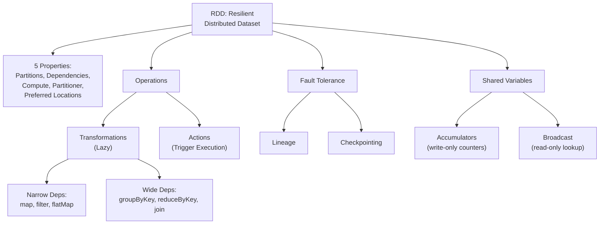

RDDs are the foundation of Spark. Even though you'll use DataFrames in practice, understanding RDDs gives you the mental model to debug any issue, optimize any pipeline, and understand what Spark is doing under the hood.

In the next chapter, we'll learn about **DataFrames** — the modern, optimized API built on top of RDDs.

---

**[← Previous](02-distributed-computing.md) | [Home](../README.md) | [Next →](04-dataframes.md)**
