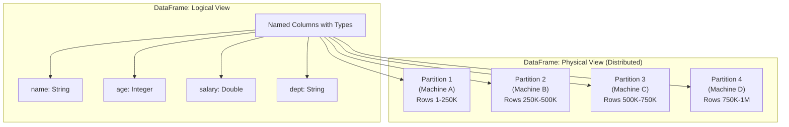
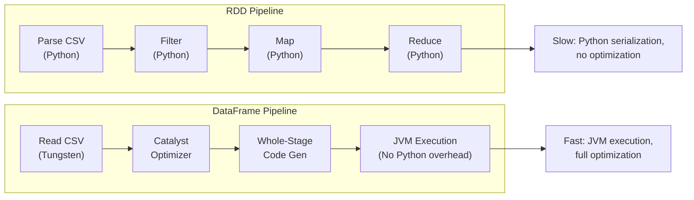
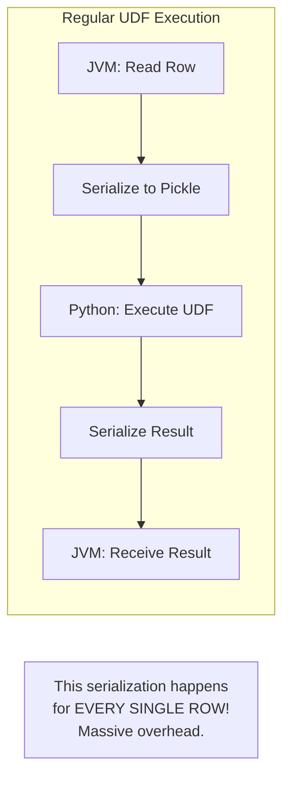
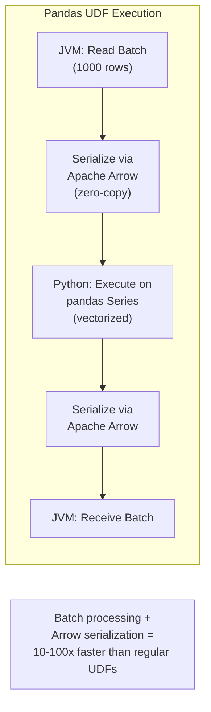
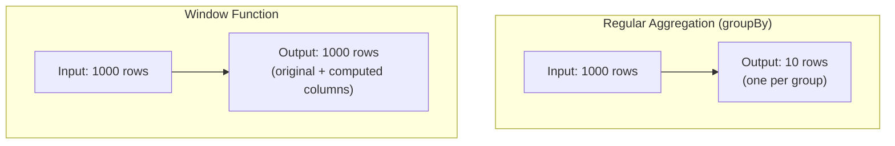
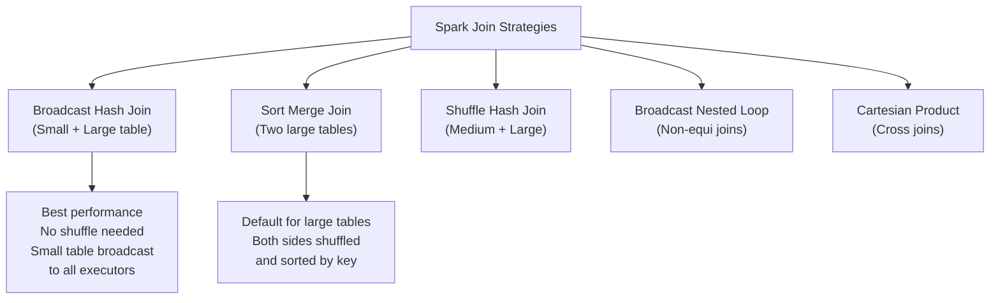
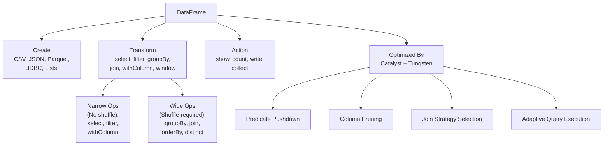

# Chapter 4: DataFrames — The Workhorse of Modern Spark

> **"If RDDs are the engine of a car, DataFrames are the steering wheel, gas pedal, and GPS combined. You drive with DataFrames; the engine does the heavy lifting underneath."**

DataFrames are the primary API you'll use in every Spark project. They combine the ease of SQL with the power of distributed computing, and Spark's Catalyst optimizer makes them faster than hand-tuned RDD code in almost every case.

---

## Table of Contents

- [1. What Is a DataFrame?](#1-what-is-a-dataframe)
- [2. Why DataFrames Were Introduced](#2-why-dataframes-were-introduced)
- [3. DataFrame vs RDD](#3-dataframe-vs-rdd)
- [4. Schema: StructType and StructField](#4-schema-structtype-and-structfield)
- [5. Creating DataFrames](#5-creating-dataframes)
- [6. DataFrame Operations](#6-dataframe-operations)
- [7. Column Expressions](#7-column-expressions)
- [8. User-Defined Functions (UDFs)](#8-user-defined-functions-udfs)
- [9. Built-in Functions](#9-built-in-functions)
- [10. Window Functions](#10-window-functions)
- [11. Joins Deep Dive](#11-joins-deep-dive)
- [12. DataFrame Writer](#12-dataframe-writer)
- [13. Spark SQL Integration](#13-spark-sql-integration)
- [14. Production Scenarios](#14-production-scenarios)
- [15. Performance Considerations](#15-performance-considerations)
- [16. Troubleshooting](#16-troubleshooting)
- [17. Common Mistakes](#17-common-mistakes)
- [18. Interview Questions](#18-interview-questions)

---

## 1. What Is a DataFrame?

### 1.1 The Analogy: A Smart Spreadsheet That Distributes Itself

Imagine an Excel spreadsheet that:
- Can hold **billions of rows** (split across 1,000 machines)
- **Automatically optimizes** your formulas before executing them
- **Knows the data types** of every column (schema-aware)
- Can **read from** and **write to** any data format (CSV, JSON, Parquet, databases)
- **Parallelizes** every operation across a cluster

That's a Spark DataFrame.

### 1.2 Formal Definition

A **DataFrame** is a distributed collection of data organized into **named columns**, equivalent to a table in a relational database or a pandas DataFrame in Python, but distributed across a cluster.



### 1.3 Key Properties

| Property | Description |
|----------|-------------|
| **Distributed** | Data is split across partitions on multiple machines |
| **Immutable** | Transformations create new DataFrames |
| **Lazy** | Transformations build a plan; only actions execute |
| **Schema-aware** | Every column has a name and data type |
| **Optimized** | Catalyst optimizer + Tungsten engine |

---

## 2. Why DataFrames Were Introduced

### 2.1 The Problem with RDDs

RDDs are powerful but have significant drawbacks for structured data:

```python
# RDD approach — no optimization, verbose, error-prone
rdd = sc.textFile("employees.csv")
parsed = rdd.map(lambda line: line.split(","))
filtered = parsed.filter(lambda fields: int(fields[2]) > 50000)  # Which field is salary?
result = filtered.map(lambda fields: (fields[3], int(fields[2])))  # Which is dept?
total = result.reduceByKey(lambda a, b: a + b)

# Problems:
# 1. No schema — fields[2] is meaningless. What is field 2? Easy to get wrong.
# 2. No optimization — Spark can't optimize because it doesn't know what's inside lambdas
# 3. No type safety — int(fields[2]) will crash at RUNTIME if field 2 isn't a number
# 4. Python lambda serialization is SLOW (pickle)
```

```python
# DataFrame approach — optimized, readable, safe
df = spark.read.csv("employees.csv", header=True, inferSchema=True)
result = df.filter(df.salary > 50000).groupBy("department").sum("salary")

# Benefits:
# 1. Schema-aware — column names are meaningful
# 2. Catalyst optimizer — Spark can optimize (push filters, prune columns)
# 3. Type checking — schema errors caught early
# 4. Tungsten execution — no Python serialization overhead
```

### 2.2 Performance Comparison



In benchmarks, DataFrames are typically **2-10x faster** than equivalent RDD code in Python, and **competitive** with hand-optimized RDD code in Scala — because the optimizer often finds better execution strategies than humans.

---

## 3. DataFrame vs RDD

| Feature | RDD | DataFrame |
|---------|-----|-----------|
| **Abstraction level** | Low-level (elements) | High-level (columns) |
| **Schema** | No schema | Schema-aware (typed columns) |
| **Optimization** | None (opaque lambdas) | Catalyst + Tungsten |
| **API** | Functional (map, filter, reduce) | Declarative (select, where, groupBy) |
| **Serialization** | Java/Kryo/Pickle | Tungsten binary format |
| **Python performance** | Slow (Python ↔ JVM serialization) | Fast (runs on JVM, Python only plans) |
| **Error detection** | Runtime only | Schema errors at analysis time |
| **Use case** | Unstructured data, custom logic | Structured/semi-structured data |
| **Interactivity** | `.toDebugString()` | `.explain()`, `.printSchema()` |
| **Recommended** | Legacy code, special cases | **Default choice for everything** |

> **💡 Key Insight:** In PySpark, the performance difference is even more dramatic. RDD operations in PySpark must serialize data between Python and JVM for every transformation. DataFrame operations run entirely on the JVM — Python only sends the plan.

---

## 4. Schema: StructType and StructField

### 4.1 What Is a Schema?

A schema defines the structure of a DataFrame — column names, data types, and nullability.

```python
from pyspark.sql.types import *

# Define a schema
schema = StructType([
    StructField("name", StringType(), nullable=False),
    StructField("age", IntegerType(), nullable=True),
    StructField("salary", DoubleType(), nullable=True),
    StructField("department", StringType(), nullable=True),
    StructField("hire_date", DateType(), nullable=True),
])

# Print a DataFrame's schema
df.printSchema()
# root
#  |-- name: string (nullable = false)
#  |-- age: integer (nullable = true)
#  |-- salary: double (nullable = true)
#  |-- department: string (nullable = true)
#  |-- hire_date: date (nullable = true)
```

### 4.2 Available Data Types

| PySpark Type | Python Equivalent | Description |
|-------------|-------------------|-------------|
| `StringType()` | `str` | Text |
| `IntegerType()` | `int` | 32-bit integer |
| `LongType()` | `int` | 64-bit integer |
| `FloatType()` | `float` | 32-bit float |
| `DoubleType()` | `float` | 64-bit float |
| `BooleanType()` | `bool` | True/False |
| `DateType()` | `datetime.date` | Date only |
| `TimestampType()` | `datetime.datetime` | Date + time |
| `BinaryType()` | `bytearray` | Binary data |
| `ArrayType(elementType)` | `list` | Array of elements |
| `MapType(keyType, valueType)` | `dict` | Key-value map |
| `StructType([fields])` | `dict` | Nested structure |
| `DecimalType(precision, scale)` | `decimal.Decimal` | Exact decimal |

### 4.3 Nested Schemas

```python
# Nested schema for complex JSON data
address_schema = StructType([
    StructField("street", StringType()),
    StructField("city", StringType()),
    StructField("state", StringType()),
    StructField("zip", StringType()),
])

user_schema = StructType([
    StructField("user_id", LongType(), nullable=False),
    StructField("name", StringType()),
    StructField("address", address_schema),  # Nested struct
    StructField("phone_numbers", ArrayType(StringType())),  # Array of strings
    StructField("preferences", MapType(StringType(), StringType())),  # Key-value map
])
```

### 4.4 Schema Inference vs Explicit Schema

```python
# INFERRED schema — Spark reads the data to guess types
# Convenient but SLOW (reads data twice) and sometimes WRONG
df = spark.read.csv("data.csv", header=True, inferSchema=True)

# EXPLICIT schema — You specify the types
# Fast (reads data once) and CORRECT
schema = StructType([
    StructField("id", IntegerType()),
    StructField("name", StringType()),
    StructField("amount", DoubleType()),
])
df = spark.read.csv("data.csv", header=True, schema=schema)
```

> **⚠️ Warning:** Always use explicit schemas in production. `inferSchema=True` is convenient for exploration but:
> 1. Reads the data twice (once to infer, once to load) — doubles read time
> 2. Can infer wrong types (e.g., ZIP codes like "01234" become integers, losing the leading zero)
> 3. Schema can change between runs if data changes — causing silent bugs

### 4.5 DDL-Style Schema Strings

```python
# Quick way to define schemas using DDL strings
schema = "id INT, name STRING, salary DOUBLE, hire_date DATE"
df = spark.read.csv("data.csv", header=True, schema=schema)
```

---

## 5. Creating DataFrames

### 5.1 From Files

```python
# CSV
df = spark.read.csv("data.csv", header=True, schema=schema)
df = spark.read.option("header", True).option("inferSchema", True).csv("data.csv")

# JSON
df = spark.read.json("data.json")
df = spark.read.json("data.json", schema=schema)

# Parquet (columnar, compressed, schema embedded — RECOMMENDED)
df = spark.read.parquet("data.parquet")
df = spark.read.parquet("s3://bucket/data/year=2024/month=01/")

# ORC
df = spark.read.orc("data.orc")

# Avro
df = spark.read.format("avro").load("data.avro")

# Delta Lake
df = spark.read.format("delta").load("s3://bucket/delta-table/")

# Multiple files / glob patterns
df = spark.read.parquet("s3://bucket/data/year=2024/month=*/")
df = spark.read.csv("data_*.csv", header=True, schema=schema)
```

### 5.2 From JDBC (Databases)

```python
df = spark.read.format("jdbc") \
    .option("url", "jdbc:postgresql://db-host:5432/mydb") \
    .option("dbtable", "public.users") \
    .option("user", "reader") \
    .option("password", "secret") \
    .option("numPartitions", 10) \
    .option("partitionColumn", "id") \
    .option("lowerBound", 1) \
    .option("upperBound", 1000000) \
    .load()
```

### 5.3 From Python Collections

```python
# From a list of tuples
data = [("Alice", 30, 75000.0), ("Bob", 25, 65000.0), ("Charlie", 35, 85000.0)]
df = spark.createDataFrame(data, ["name", "age", "salary"])

# From a list of Row objects
from pyspark.sql import Row
data = [Row(name="Alice", age=30), Row(name="Bob", age=25)]
df = spark.createDataFrame(data)

# From a list of dicts
data = [{"name": "Alice", "age": 30}, {"name": "Bob", "age": 25}]
df = spark.createDataFrame(data)

# From a pandas DataFrame
import pandas as pd
pdf = pd.DataFrame({"name": ["Alice", "Bob"], "age": [30, 25]})
df = spark.createDataFrame(pdf)
```

### 5.4 From Existing DataFrames/RDDs

```python
# From an RDD
rdd = sc.parallelize([("Alice", 30), ("Bob", 25)])
df = rdd.toDF(["name", "age"])

# Or with explicit schema
df = spark.createDataFrame(rdd, schema)
```

---

## 6. DataFrame Operations

### 6.1 Viewing Data

```python
# Show first 20 rows (default)
df.show()

# Show first N rows
df.show(5)

# Show without truncating long strings
df.show(truncate=False)

# Show vertically (for wide DataFrames)
df.show(5, vertical=True)

# Print schema
df.printSchema()

# Get column names and types
print(df.columns)       # ['name', 'age', 'salary']
print(df.dtypes)        # [('name', 'string'), ('age', 'int'), ('salary', 'double')]

# Summary statistics
df.describe().show()
df.summary().show()

# Count rows
print(df.count())
```

### 6.2 select() — Choosing Columns

```python
# Select specific columns
df.select("name", "age").show()

# Select with column objects
from pyspark.sql.functions import col
df.select(col("name"), col("age")).show()

# Select with expressions
df.select("name", (col("salary") * 1.1).alias("new_salary")).show()

# Select all columns
df.select("*").show()

# Select with regex (columns matching pattern)
df.select(df.colRegex("`^sal.*`")).show()
```

### 6.3 filter() / where() — Filtering Rows

```python
# Simple filter
df.filter(df.age > 25).show()
df.where(df.age > 25).show()  # where() is an alias for filter()

# Multiple conditions
df.filter((df.age > 25) & (df.department == "Engineering")).show()
df.filter((df.age > 25) | (df.salary > 80000)).show()

# NOT condition
df.filter(~(df.department == "Sales")).show()

# String conditions (SQL expression)
df.filter("age > 25 AND department = 'Engineering'").show()

# IS NULL / IS NOT NULL
df.filter(df.email.isNull()).show()
df.filter(df.email.isNotNull()).show()

# IN / NOT IN
df.filter(df.department.isin("Engineering", "Product", "Design")).show()

# LIKE (pattern matching)
df.filter(df.name.like("A%")).show()       # Names starting with A
df.filter(df.name.rlike("^[A-C].*")).show()  # Regex match

# BETWEEN
df.filter(df.salary.between(50000, 100000)).show()
```

### 6.4 groupBy() and agg() — Aggregations

```python
from pyspark.sql.functions import count, sum, avg, min, max, stddev

# Simple groupBy with single aggregation
df.groupBy("department").count().show()
df.groupBy("department").sum("salary").show()
df.groupBy("department").avg("salary").show()

# Multiple aggregations
df.groupBy("department").agg(
    count("*").alias("num_employees"),
    avg("salary").alias("avg_salary"),
    max("salary").alias("max_salary"),
    min("salary").alias("min_salary"),
    stddev("salary").alias("stddev_salary"),
).show()

# Multiple groupBy columns
df.groupBy("department", "level").agg(
    avg("salary").alias("avg_salary"),
    count("*").alias("count"),
).show()

# Pivot (create columns from values)
df.groupBy("department").pivot("level").avg("salary").show()
# Result:
# +----------+--------+--------+--------+
# |department| junior | mid    | senior |
# +----------+--------+--------+--------+
# |  Eng     | 70000  | 90000  | 130000 |
# |  Sales   | 55000  | 75000  | 110000 |
# +----------+--------+--------+--------+
```

### 6.5 withColumn() — Adding/Modifying Columns

```python
from pyspark.sql.functions import col, lit, when, upper, year, current_date

# Add a new column
df = df.withColumn("bonus", col("salary") * 0.1)

# Modify existing column
df = df.withColumn("name", upper(col("name")))

# Conditional column (CASE WHEN equivalent)
df = df.withColumn("salary_band",
    when(col("salary") < 60000, "Low")
    .when(col("salary") < 100000, "Medium")
    .otherwise("High")
)

# Add a constant column
df = df.withColumn("country", lit("US"))

# Derived column
df = df.withColumn("tenure_years",
    year(current_date()) - year(col("hire_date"))
)

# Rename a column
df = df.withColumnRenamed("salary", "annual_salary")

# Drop a column
df = df.drop("temporary_column")

# Drop multiple columns
df = df.drop("col1", "col2", "col3")
```

> **⚠️ Warning:** Each `withColumn` call creates a new projection in the execution plan. Chaining many `withColumn` calls (e.g., 100+) can cause extremely slow plan analysis. For many columns, use `select` with all column expressions at once.

### 6.6 orderBy() / sort() — Sorting

```python
from pyspark.sql.functions import asc, desc

# Sort ascending (default)
df.orderBy("salary").show()
df.sort("salary").show()  # sort() is an alias

# Sort descending
df.orderBy(desc("salary")).show()
df.orderBy(col("salary").desc()).show()

# Multi-column sort
df.orderBy(asc("department"), desc("salary")).show()
```

### 6.7 distinct() and dropDuplicates()

```python
# Remove complete duplicate rows
df.distinct().show()

# Remove duplicates based on specific columns
df.dropDuplicates(["name", "department"]).show()

# Count distinct values
from pyspark.sql.functions import countDistinct, approx_count_distinct
df.select(countDistinct("department")).show()

# Approximate distinct count (much faster for large data)
df.select(approx_count_distinct("department", rsd=0.05)).show()
```

### 6.8 union() and unionByName()

```python
# Union (requires same column ORDER)
df_combined = df1.union(df2)

# Union by name (matches by column NAME, not position — safer)
df_combined = df1.unionByName(df2)

# Union by name with missing columns allowed (fills with null)
df_combined = df1.unionByName(df2, allowMissingColumns=True)
```

---

## 7. Column Expressions

### 7.1 Referencing Columns

```python
from pyspark.sql.functions import col, column

# Four ways to reference a column
df.select(df.name)                  # 1. DataFrame attribute
df.select(df["name"])               # 2. DataFrame subscript
df.select(col("name"))              # 3. col() function (recommended)
df.select(column("name"))           # 4. column() function (alias for col)

# For column names with spaces or special characters
df.select(col("`column with spaces`"))
df.select(df["`weird-column-name`"])
```

### 7.2 Arithmetic and Comparisons

```python
from pyspark.sql.functions import col, lit

# Arithmetic
df.select(col("salary") + 5000)           # Addition
df.select(col("salary") - 5000)           # Subtraction
df.select(col("salary") * 1.1)            # Multiplication
df.select(col("salary") / 12)             # Division
df.select(col("salary") % 1000)           # Modulo

# Comparisons
df.filter(col("age") > 25)
df.filter(col("age") >= 25)
df.filter(col("age") < 30)
df.filter(col("age") <= 30)
df.filter(col("age") == 25)
df.filter(col("age") != 25)

# String operations
df.filter(col("name").startswith("A"))
df.filter(col("name").endswith("son"))
df.filter(col("name").contains("ali"))
df.filter(col("name").substr(1, 3) == "Ali")  # 1-indexed!
```

### 7.3 when() / otherwise() — Conditional Logic

```python
from pyspark.sql.functions import when

# Simple CASE WHEN
df.withColumn("category",
    when(col("age") < 18, "minor")
    .when(col("age") < 65, "adult")
    .otherwise("senior")
)

# Nested conditions
df.withColumn("risk_level",
    when((col("age") > 60) & (col("health_score") < 50), "high")
    .when((col("age") > 40) | (col("health_score") < 70), "medium")
    .otherwise("low")
)
```

### 7.4 cast() — Type Conversion

```python
# Convert column types
df = df.withColumn("age", col("age").cast("integer"))
df = df.withColumn("salary", col("salary").cast(DoubleType()))
df = df.withColumn("hire_date", col("hire_date").cast("date"))

# Multiple casts in select
df.select(
    col("id").cast("long"),
    col("amount").cast("decimal(10,2)"),
    col("created_at").cast("timestamp"),
)
```

---

## 8. User-Defined Functions (UDFs)

### 8.1 Regular UDFs (Slow — Avoid When Possible)

```python
from pyspark.sql.functions import udf
from pyspark.sql.types import StringType

# Define a regular UDF
@udf(returnType=StringType())
def categorize_salary(salary):
    if salary is None:
        return "Unknown"
    elif salary < 60000:
        return "Entry"
    elif salary < 100000:
        return "Mid"
    else:
        return "Senior"

df.withColumn("level", categorize_salary(col("salary"))).show()
```

### 8.2 Why Regular UDFs Are Slow



Regular UDFs:
- Serialize data from JVM to Python (per row)
- Execute the Python function
- Serialize results back to JVM (per row)
- Can be **10-100x slower** than built-in functions

### 8.3 Pandas UDFs (Vectorized — Fast!)

```python
import pandas as pd
from pyspark.sql.functions import pandas_udf

# Pandas UDF — processes batches, not individual rows
@pandas_udf("string")
def categorize_salary_vec(salary: pd.Series) -> pd.Series:
    return pd.cut(salary,
        bins=[0, 60000, 100000, float('inf')],
        labels=["Entry", "Mid", "Senior"]
    ).astype(str)

df.withColumn("level", categorize_salary_vec(col("salary"))).show()
```



### 8.4 UDF Best Practices

```python
# BEST: Use built-in functions (runs entirely on JVM, fully optimized)
from pyspark.sql.functions import when
df.withColumn("level",
    when(col("salary") < 60000, "Entry")
    .when(col("salary") < 100000, "Mid")
    .otherwise("Senior")
)

# GOOD: Use Pandas UDFs when built-ins aren't enough
@pandas_udf("double")
def custom_transform(s: pd.Series) -> pd.Series:
    return s.apply(complex_python_logic)

# AVOID: Regular UDFs (slow, no optimization)
@udf(returnType=StringType())
def slow_udf(x):
    return complex_python_logic(x)
```

> **💡 Key Insight:** Before writing a UDF, always check if a built-in function exists. Spark has 300+ built-in functions that cover most needs. UDFs should be your **last resort**, not your first choice.

---

## 9. Built-in Functions

### 9.1 String Functions

```python
from pyspark.sql.functions import (
    upper, lower, trim, ltrim, rtrim,
    length, substring, concat, concat_ws,
    regexp_replace, regexp_extract, split,
    lpad, rpad, reverse, initcap,
    translate, locate, instr
)

df.select(
    upper(col("name")),                              # ALICE
    lower(col("name")),                              # alice
    trim(col("name")),                               # Remove leading/trailing spaces
    length(col("name")),                             # 5
    substring(col("name"), 1, 3),                    # Ali (1-indexed!)
    concat(col("first_name"), lit(" "), col("last_name")),  # Alice Smith
    concat_ws(", ", col("city"), col("state")),      # NYC, NY
    regexp_replace(col("phone"), "[^0-9]", ""),      # Remove non-digits
    regexp_extract(col("email"), r"@(.+)", 1),       # Extract domain
    split(col("tags"), ","),                          # Split string to array
).show()
```

### 9.2 Date and Time Functions

```python
from pyspark.sql.functions import (
    current_date, current_timestamp,
    year, month, dayofmonth, dayofweek, dayofyear,
    hour, minute, second,
    date_add, date_sub, datediff, months_between,
    date_format, to_date, to_timestamp,
    date_trunc, last_day, next_day,
    unix_timestamp, from_unixtime,
)

df.select(
    current_date(),                                   # 2024-01-15
    current_timestamp(),                              # 2024-01-15 14:30:00
    year(col("hire_date")),                           # 2020
    month(col("hire_date")),                          # 6
    dayofmonth(col("hire_date")),                     # 15
    datediff(current_date(), col("hire_date")),       # Days between
    months_between(current_date(), col("hire_date")), # Months between
    date_add(col("hire_date"), 30),                   # Add 30 days
    date_format(col("hire_date"), "yyyy-MM-dd"),      # Format as string
    to_date(col("date_string"), "MM/dd/yyyy"),        # Parse string to date
    date_trunc("month", col("created_at")),           # Truncate to month start
).show()
```

### 9.3 Math Functions

```python
from pyspark.sql.functions import (
    abs, ceil, floor, round, bround,
    sqrt, pow, log, log2, log10, exp,
    greatest, least,
    rand, randn,
    factorial, conv, hex, unhex,
)

df.select(
    round(col("salary"), 2),                 # Round to 2 decimal places
    ceil(col("rating")),                     # Round up
    floor(col("rating")),                    # Round down
    abs(col("profit_loss")),                 # Absolute value
    sqrt(col("variance")),                   # Square root
    pow(col("base"), col("exponent")),       # Power
    greatest(col("score1"), col("score2")),  # Max of multiple columns
    least(col("price1"), col("price2")),     # Min of multiple columns
).show()
```

### 9.4 Aggregate Functions

```python
from pyspark.sql.functions import (
    count, countDistinct, approx_count_distinct,
    sum, sumDistinct, avg, mean,
    min, max,
    stddev, stddev_pop, stddev_samp,
    variance, var_pop, var_samp,
    first, last,
    collect_list, collect_set,
    percentile_approx, skewness, kurtosis,
)

df.groupBy("department").agg(
    count("*").alias("total"),
    countDistinct("job_title").alias("unique_titles"),
    avg("salary").alias("avg_salary"),
    percentile_approx("salary", 0.5).alias("median_salary"),
    collect_list("name").alias("all_names"),     # List of all names
    collect_set("job_title").alias("job_titles"), # Unique job titles
).show()
```

### 9.5 Array and Map Functions

```python
from pyspark.sql.functions import (
    array, array_contains, array_distinct, array_sort,
    array_union, array_intersect, array_except,
    explode, explode_outer, posexplode,
    size, element_at, slice, flatten, sequence,
    map_keys, map_values, map_from_arrays,
)

# Working with arrays
df.select(
    array_contains(col("tags"), "python"),     # True if array contains value
    array_distinct(col("tags")),                # Remove duplicates from array
    size(col("tags")),                          # Array length
    element_at(col("tags"), 1),                 # First element (1-indexed!)
    explode(col("tags")),                       # One row per array element
).show()

# Explode example
# Input:  {"name": "Alice", "skills": ["Python", "SQL", "Spark"]}
# Output: {"name": "Alice", "skill": "Python"}
#         {"name": "Alice", "skill": "SQL"}
#         {"name": "Alice", "skill": "Spark"}
df.select("name", explode("skills").alias("skill")).show()
```

---

## 10. Window Functions

### 10.1 What Are Window Functions?

Window functions compute values across a set of rows related to the current row — like aggregations, but **without collapsing rows**.



### 10.2 Defining Windows

```python
from pyspark.sql.window import Window
from pyspark.sql.functions import row_number, rank, dense_rank, lag, lead, sum, avg

# Partition by department, order by salary descending
window_spec = Window.partitionBy("department").orderBy(desc("salary"))

# Unbounded window (all rows in partition)
full_window = Window.partitionBy("department")

# Rolling window (current row + 2 preceding rows)
rolling_window = Window.partitionBy("department") \
    .orderBy("hire_date") \
    .rowsBetween(-2, Window.currentRow)

# Range-based window (salary within 5000 of current row)
range_window = Window.partitionBy("department") \
    .orderBy("salary") \
    .rangeBetween(-5000, 5000)
```

### 10.3 Window Function Examples

```python
# Ranking functions
df = df.withColumn("rank", rank().over(window_spec))
df = df.withColumn("dense_rank", dense_rank().over(window_spec))
df = df.withColumn("row_number", row_number().over(window_spec))

# Example result:
# +--------+----------+--------+------+----------+----------+
# |  name  |department| salary | rank | dense_rank| row_number|
# +--------+----------+--------+------+----------+----------+
# | Alice  |   Eng    | 130000 |  1   |    1     |    1     |
# | Bob    |   Eng    | 130000 |  1   |    1     |    2     |
# | Charlie|   Eng    | 110000 |  3   |    2     |    3     |
# | Diana  |  Sales   |  95000 |  1   |    1     |    1     |
# +--------+----------+--------+------+----------+----------+

# Lag and lead (access previous/next rows)
df = df.withColumn("prev_salary", lag("salary", 1).over(window_spec))
df = df.withColumn("next_salary", lead("salary", 1).over(window_spec))

# Running aggregations
df = df.withColumn("cumulative_salary", sum("salary").over(
    Window.partitionBy("department").orderBy("hire_date").rowsBetween(
        Window.unboundedPreceding, Window.currentRow
    )
))

# Average salary in department (without collapsing rows)
df = df.withColumn("dept_avg_salary", avg("salary").over(full_window))

# Difference from department average
df = df.withColumn("salary_vs_avg", col("salary") - col("dept_avg_salary"))
```

### 10.4 Common Window Function Patterns

```python
# Pattern 1: Top N per group
window_spec = Window.partitionBy("department").orderBy(desc("salary"))
df_ranked = df.withColumn("rank", row_number().over(window_spec))
top_3_per_dept = df_ranked.filter(col("rank") <= 3)

# Pattern 2: Running total
window_spec = Window.partitionBy("account_id").orderBy("transaction_date") \
    .rowsBetween(Window.unboundedPreceding, Window.currentRow)
df = df.withColumn("running_balance", sum("amount").over(window_spec))

# Pattern 3: Moving average (7-day)
window_spec = Window.partitionBy("product_id").orderBy("date") \
    .rowsBetween(-6, Window.currentRow)
df = df.withColumn("7_day_avg", avg("revenue").over(window_spec))

# Pattern 4: Percent of total
full_window = Window.partitionBy("department")
df = df.withColumn("pct_of_dept_salary",
    col("salary") / sum("salary").over(full_window) * 100
)

# Pattern 5: De-duplication (keep latest record)
window_spec = Window.partitionBy("user_id").orderBy(desc("updated_at"))
df_deduped = df.withColumn("rn", row_number().over(window_spec)) \
    .filter(col("rn") == 1) \
    .drop("rn")
```

---

## 11. Joins Deep Dive

### 11.1 Join Types

```python
# Inner join (default)
result = df1.join(df2, df1.id == df2.user_id, "inner")

# Left outer join
result = df1.join(df2, df1.id == df2.user_id, "left")

# Right outer join
result = df1.join(df2, df1.id == df2.user_id, "right")

# Full outer join
result = df1.join(df2, df1.id == df2.user_id, "full")

# Left semi join (like WHERE EXISTS)
result = df1.join(df2, df1.id == df2.user_id, "left_semi")

# Left anti join (like WHERE NOT EXISTS)
result = df1.join(df2, df1.id == df2.user_id, "left_anti")

# Cross join (cartesian product — careful!)
result = df1.crossJoin(df2)
```

### 11.2 Join Strategies



```python
from pyspark.sql.functions import broadcast

# Force broadcast join (when you know one side is small)
result = large_df.join(broadcast(small_df), "id")

# Configure broadcast threshold (default: 10MB)
spark.conf.set("spark.sql.autoBroadcastJoinThreshold", 10 * 1024 * 1024)  # 10MB

# Disable broadcast join (force sort merge)
spark.conf.set("spark.sql.autoBroadcastJoinThreshold", -1)

# Check which join strategy Spark chose
result.explain()
# Look for: BroadcastHashJoin, SortMergeJoin, ShuffledHashJoin
```

### 11.3 Handling Duplicate Column Names After Join

```python
# PROBLEM: Both DataFrames have a column called "name"
result = df1.join(df2, df1.id == df2.id)
result.select("name")  # AMBIGUOUS! Which "name"?

# SOLUTION 1: Use the DataFrame reference
result.select(df1.name, df2.name)

# SOLUTION 2: Rename before joining
df2_renamed = df2.withColumnRenamed("name", "name_right")
result = df1.join(df2_renamed, df1.id == df2_renamed.id)

# SOLUTION 3: Drop duplicate join key
result = df1.join(df2, "id")  # Pass column name as string — auto-deduplicates
```

---

## 12. DataFrame Writer

### 12.1 Save Modes

```python
# Overwrite — delete existing data and write new
df.write.mode("overwrite").parquet("output/")

# Append — add to existing data
df.write.mode("append").parquet("output/")

# ErrorIfExists — fail if data already exists (default)
df.write.mode("errorifexists").parquet("output/")

# Ignore — silently skip if data exists
df.write.mode("ignore").parquet("output/")
```

### 12.2 File Formats

```python
# Parquet (RECOMMENDED for most use cases)
df.write.parquet("output/data.parquet")

# CSV
df.write.option("header", True).csv("output/data.csv")

# JSON
df.write.json("output/data.json")

# ORC
df.write.orc("output/data.orc")

# Delta Lake
df.write.format("delta").save("output/delta-table")

# JDBC (database)
df.write.format("jdbc") \
    .option("url", "jdbc:postgresql://host:5432/db") \
    .option("dbtable", "public.output_table") \
    .option("user", "writer") \
    .option("password", "secret") \
    .mode("overwrite") \
    .save()
```

### 12.3 Partitioning (Hive-Style)

```python
# Partition by year and month (creates directory structure)
df.write.partitionBy("year", "month").parquet("output/")

# Result on disk:
# output/
#   year=2023/
#     month=01/
#       part-00000.parquet
#       part-00001.parquet
#     month=02/
#       ...
#   year=2024/
#     month=01/
#       ...

# Reading partitioned data — Spark only reads needed partitions
spark.read.parquet("output/").filter(col("year") == 2024)
# Only reads files under year=2024/ — HUGE performance win
```

### 12.4 Bucketing

```python
# Bucketing — pre-sorts data into fixed number of buckets by key
# Eliminates shuffle for subsequent joins on the bucketed column
df.write \
    .bucketBy(100, "user_id") \
    .sortBy("user_id") \
    .saveAsTable("bucketed_users")

# When joining two bucketed tables on user_id, NO SHUFFLE needed!
```

### 12.5 Controlling Output File Size

```python
# Control number of output files
df.coalesce(1).write.parquet("output/")      # Single file (small data only!)
df.repartition(10).write.parquet("output/")   # Exactly 10 files

# Target file size (Spark 3.0+)
spark.conf.set("spark.sql.files.maxPartitionBytes", "128MB")

# AQE coalescing (Spark 3.0+) — automatically combines small partitions
spark.conf.set("spark.sql.adaptive.coalescePartitions.enabled", "true")
```

---

## 13. Spark SQL Integration

### 13.1 Temporary Views

```python
# Create a temporary view (session-scoped)
df.createOrReplaceTempView("employees")

# Query with SQL
result = spark.sql("""
    SELECT department, 
           COUNT(*) as num_employees,
           AVG(salary) as avg_salary,
           MAX(salary) as max_salary
    FROM employees
    WHERE age > 25
    GROUP BY department
    HAVING COUNT(*) > 5
    ORDER BY avg_salary DESC
""")
result.show()

# Global temporary view (accessible across sessions)
df.createOrReplaceGlobalTempView("global_employees")
spark.sql("SELECT * FROM global_temp.global_employees")
```

### 13.2 Catalog API

```python
# List all databases
spark.catalog.listDatabases()

# List all tables in current database
spark.catalog.listTables()

# List columns in a table
spark.catalog.listColumns("employees")

# Check if table exists
spark.catalog.tableExists("employees")

# Set current database
spark.catalog.setCurrentDatabase("analytics")

# Cache a table
spark.catalog.cacheTable("employees")
spark.catalog.uncacheTable("employees")
```

### 13.3 Mixing SQL and DataFrame API

```python
# You can freely mix SQL and DataFrame operations
df_filtered = spark.sql("SELECT * FROM employees WHERE department = 'Engineering'")
result = df_filtered.groupBy("level").agg(avg("salary").alias("avg_salary"))
result.createOrReplaceTempView("eng_salaries")
final = spark.sql("SELECT * FROM eng_salaries WHERE avg_salary > 100000")
final.show()
```

---

## 14. Production Scenarios

### 14.1 Scenario: ETL Pipeline for E-Commerce

```python
from pyspark.sql.functions import *
from pyspark.sql.window import Window

# Read raw data from S3
orders = spark.read.parquet("s3://raw/orders/")
products = spark.read.parquet("s3://raw/products/")
customers = spark.read.parquet("s3://raw/customers/")

# Data cleaning
orders_clean = orders \
    .filter(col("order_total") > 0) \
    .filter(col("order_date").isNotNull()) \
    .withColumn("order_date", to_date(col("order_date"), "yyyy-MM-dd")) \
    .dropDuplicates(["order_id"])

# Enrich with product and customer data
enriched = orders_clean \
    .join(broadcast(products), "product_id") \
    .join(customers, "customer_id")

# Compute metrics
daily_metrics = enriched \
    .groupBy("order_date", "category") \
    .agg(
        count("order_id").alias("num_orders"),
        sum("order_total").alias("total_revenue"),
        countDistinct("customer_id").alias("unique_customers"),
        avg("order_total").alias("avg_order_value"),
    )

# Add running totals
window_spec = Window.partitionBy("category").orderBy("order_date") \
    .rowsBetween(Window.unboundedPreceding, Window.currentRow)
daily_metrics = daily_metrics \
    .withColumn("cumulative_revenue", sum("total_revenue").over(window_spec))

# Write to Gold layer
daily_metrics.write \
    .partitionBy("order_date") \
    .mode("overwrite") \
    .parquet("s3://gold/daily_metrics/")
```

### 14.2 Scenario: Data Quality Checks

```python
def run_data_quality_checks(df, table_name):
    """Production data quality framework."""
    checks = []
    
    # Check 1: Row count
    row_count = df.count()
    checks.append(("row_count", row_count, row_count > 0))
    
    # Check 2: Null checks on critical columns
    for col_name in ["order_id", "customer_id", "order_total"]:
        null_count = df.filter(col(col_name).isNull()).count()
        null_pct = null_count / row_count * 100
        checks.append((f"null_{col_name}", null_pct, null_pct < 1.0))
    
    # Check 3: Value range checks
    invalid_totals = df.filter(
        (col("order_total") < 0) | (col("order_total") > 1000000)
    ).count()
    checks.append(("invalid_totals", invalid_totals, invalid_totals == 0))
    
    # Check 4: Duplicate check
    dup_count = df.count() - df.dropDuplicates(["order_id"]).count()
    checks.append(("duplicates", dup_count, dup_count == 0))
    
    # Report
    results = spark.createDataFrame(checks, ["check", "value", "passed"])
    results.show(truncate=False)
    
    failed = results.filter(col("passed") == False).count()
    if failed > 0:
        raise ValueError(f"{failed} data quality checks failed for {table_name}!")
    
    return True

run_data_quality_checks(daily_metrics, "daily_metrics")
```

---

## 15. Performance Considerations

### 15.1 Predicate Pushdown

```python
# Spark pushes filters DOWN to the data source
df = spark.read.parquet("s3://data/events/")
result = df.filter(col("year") == 2024).filter(col("event_type") == "purchase")

# For Parquet files, Spark:
# 1. Only reads files in year=2024/ partition (partition pruning)
# 2. Only reads event_type column from Parquet files (column pruning)
# 3. Skips Parquet row groups where min(year) > 2024 (predicate pushdown)
```

### 15.2 Column Pruning

```python
# Only selecting 2 of 200 columns
df.select("user_id", "event_type").show()
# Spark only reads these 2 columns from Parquet — ignores the other 198
# This is HUGE for wide tables
```

### 15.3 Broadcast Joins

```python
# If one side of a join is small (< 10MB default), Spark broadcasts it
# This avoids a shuffle of the large table

# Force broadcast for tables you know are small
from pyspark.sql.functions import broadcast
result = large_df.join(broadcast(small_df), "id")

# Increase auto-broadcast threshold
spark.conf.set("spark.sql.autoBroadcastJoinThreshold", "100MB")
```

### 15.4 Adaptive Query Execution (AQE)

```python
# AQE (Spark 3.0+) — optimizes query plan at RUNTIME based on actual data statistics
spark.conf.set("spark.sql.adaptive.enabled", "true")  # Default in Spark 3.2+

# What AQE does:
# 1. Dynamically coalesces small shuffle partitions
# 2. Dynamically switches join strategies (sort merge → broadcast)
# 3. Dynamically handles skewed joins (splits skewed partitions)

# AQE settings
spark.conf.set("spark.sql.adaptive.coalescePartitions.enabled", "true")
spark.conf.set("spark.sql.adaptive.skewJoin.enabled", "true")
spark.conf.set("spark.sql.adaptive.localShuffleReader.enabled", "true")
```

---

## 16. Troubleshooting

### 16.1 Slow Queries

| Symptom | Diagnosis | Fix |
|---------|-----------|-----|
| One task takes 100x longer | Data skew | Salt skewed keys, enable AQE skew handling |
| Shuffle write/read is huge | Unnecessary shuffle | Rethink join order, use broadcast joins |
| Reading takes forever | No partition pruning | Partition data by query columns |
| Query plan is complex | Too many withColumn | Use select with all columns at once |

### 16.2 Checking the Execution Plan

```python
# Logical and physical plan
df.explain()       # Physical plan only
df.explain(True)   # All plans (parsed, analyzed, optimized, physical)
df.explain("formatted")  # Well-formatted plan (Spark 3.0+)

# Look for:
# ✅ FileScan with PushedFilters — filters are pushed to data source
# ✅ BroadcastHashJoin — efficient join for small table
# ⚠️ SortMergeJoin — may be slow for large skewed data
# ❌ CartesianProduct — usually unintentional, extremely slow
# ❌ BroadcastNestedLoopJoin — slow, often from non-equi joins
```

### 16.3 Common DataFrame Errors

#### `AnalysisException: Column 'xyz' does not exist`

```python
# Check actual column names (case-sensitive!)
print(df.columns)

# Common causes:
# 1. Typo in column name
# 2. Column was dropped earlier in the pipeline
# 3. Column name case mismatch (Spark is case-insensitive by default but sources may not be)
```

#### `AnalysisException: Ambiguous reference to 'id'`

```python
# Happens after join when both tables have same column name

# Fix: Use table-qualified reference
result = df1.join(df2, df1.id == df2.id).select(df1.id, df1.name, df2.score)

# Or join on column name string (auto-deduplicates join key)
result = df1.join(df2, "id")
```

---

## 17. Common Mistakes

### Mistake 1: Chaining Too Many withColumn Calls

```python
# BAD: Each withColumn adds a projection to the plan
# With 100+ calls, plan analysis becomes exponentially slow
df = df.withColumn("col1", expr("..."))
df = df.withColumn("col2", expr("..."))
# ... 98 more times ...

# GOOD: Use a single select with all transformations
df = df.select(
    "*",
    expr("...").alias("col1"),
    expr("...").alias("col2"),
    # ... all in one select
)
```

### Mistake 2: Using UDFs Instead of Built-in Functions

```python
# BAD: Regular UDF for something Spark can do natively
@udf(returnType=StringType())
def upper_udf(s):
    return s.upper() if s else None

df.withColumn("name_upper", upper_udf(col("name")))

# GOOD: Built-in function (10-100x faster)
from pyspark.sql.functions import upper
df.withColumn("name_upper", upper(col("name")))
```

### Mistake 3: Not Caching Reused DataFrames

```python
# BAD: DataFrame recomputed for each action
expensive_df = spark.read.parquet("huge_data.parquet") \
    .join(other_df, "id") \
    .groupBy("category").agg(...)

report_1 = expensive_df.filter(...).show()
report_2 = expensive_df.filter(...).show()
report_3 = expensive_df.filter(...).show()
# The join + groupBy executes 3 times!

# GOOD: Cache before multiple actions
expensive_df.cache()
report_1 = expensive_df.filter(...).show()
report_2 = expensive_df.filter(...).show()
report_3 = expensive_df.filter(...).show()
expensive_df.unpersist()
```

### Mistake 4: collect() on Large DataFrames

```python
# BAD: Pulling all data to driver memory
all_rows = huge_df.collect()  # OOM!

# GOOD: Use the right approach
huge_df.show(20)                      # View sample
huge_df.take(100)                     # Get first 100 rows
huge_df.write.parquet("output/")      # Write to storage
huge_df.agg(count("*")).show()        # Aggregate first
```

### Mistake 5: Ignoring Shuffle Partitions

```python
# BAD: Default 200 shuffle partitions for 1TB data
df.groupBy("department").count()
# 200 partitions for 1TB = 5GB per partition = likely OOM

# GOOD: Set appropriate shuffle partitions
spark.conf.set("spark.sql.shuffle.partitions", "2000")  # For 1TB data

# BEST: Enable AQE to auto-tune partitions
spark.conf.set("spark.sql.adaptive.enabled", "true")
```

---

## 18. Interview Questions

### Beginner Level

**Q1: What is a Spark DataFrame? How is it different from a Pandas DataFrame?**

> A Spark DataFrame is a distributed collection of data organized into named columns. Differences from Pandas:
>
> | Feature | Spark DataFrame | Pandas DataFrame |
> |---------|----------------|-----------------|
> | Execution | Distributed across cluster | Single machine |
> | Size limit | Petabytes | ~RAM size (10-100 GB) |
> | Evaluation | Lazy | Eager |
> | Optimization | Catalyst + Tungsten | None |
> | Mutability | Immutable | Mutable |
> | API | Spark SQL functions | NumPy-based |

**Q2: What is the difference between `select()` and `withColumn()`?**

> `select()` returns a DataFrame with only the specified columns. `withColumn()` returns the DataFrame with all original columns plus one new/modified column. Use `select()` when you want specific columns; use `withColumn()` when adding or modifying a single column.

**Q3: What are the different save modes when writing a DataFrame?**

> - `overwrite`: Deletes existing data, writes new data
> - `append`: Adds new data to existing data
> - `errorifexists` (default): Fails if data already exists
> - `ignore`: Silently does nothing if data already exists

### Intermediate Level

**Q4: Explain broadcast joins. When should you use them?**

> A broadcast join sends the smaller DataFrame to all executors, avoiding a shuffle of the larger DataFrame. Use when:
> 1. One side of the join is small enough to fit in executor memory (default threshold: 10MB)
> 2. You can increase the threshold with `spark.sql.autoBroadcastJoinThreshold`
>
> Benefits: No shuffle of the large table, faster execution
> Risk: If the broadcast table is too large, executors OOM
>
> Spark auto-broadcasts when it estimates one side is below the threshold. You can force it with `broadcast()`.

**Q5: What is Adaptive Query Execution (AQE)? What problems does it solve?**

> AQE is a Spark 3.0+ feature that re-optimizes the query plan at runtime based on actual data statistics (collected after each stage). It solves three problems:
> 1. **Partition coalescing**: Automatically combines too-many small post-shuffle partitions
> 2. **Join strategy switching**: If runtime data size is smaller than estimated, switches from SortMergeJoin to BroadcastHashJoin
> 3. **Skew handling**: Detects skewed partitions and automatically splits them
>
> Enable with `spark.sql.adaptive.enabled=true` (default in Spark 3.2+).

**Q6: Why should you use explicit schemas instead of `inferSchema=True`?**

> 1. **Performance**: inferSchema reads data twice (once to infer, once to load)
> 2. **Correctness**: Inference can guess wrong types (ZIP codes as integers, IDs as doubles)
> 3. **Consistency**: Schema can change between runs if data changes
> 4. **Documentation**: Explicit schema serves as documentation of expected data format
> 5. **Error detection**: Mismatches between schema and data are caught immediately

### Advanced Level

**Q7: You have a DataFrame with 500 columns and need to add 200 computed columns. How do you do it efficiently?**

> Don't chain 200 `withColumn()` calls — this creates 200 projections in the logical plan, causing exponentially slow plan analysis.
>
> Instead, use a single `select()`:
> ```python
> existing_cols = [col(c) for c in df.columns]
> new_cols = [expr(f"col_a * {i}").alias(f"computed_{i}") for i in range(200)]
> result = df.select(existing_cols + new_cols)
> ```
>
> For extreme cases (1000+ columns), consider breaking the pipeline into stages with intermediate writes to disk.

**Q8: Explain the execution of this query step by step:**
```python
df.join(other_df, "id") \
  .filter(col("amount") > 1000) \
  .groupBy("category") \
  .agg(sum("amount").alias("total")) \
  .orderBy(desc("total")) \
  .show(10)
```

> **Catalyst optimization transforms this:**
>
> 1. **Filter pushdown**: The filter `amount > 1000` is pushed before the join (if `amount` comes from one table)
> 2. **Column pruning**: Only columns needed for the output are read from source (id, amount, category)
> 3. **Join strategy selection**: Catalyst chooses broadcast join (if one side is small) or sort merge join
> 4. **Stage creation**:
>    - Stage 1: Read both tables, push filters, scan only needed columns
>    - Stage 2: Shuffle for join (if not broadcast)
>    - Stage 3: Shuffle for groupBy
>    - Stage 4: Shuffle for orderBy
> 5. **Execution**: Tungsten generates optimized JVM bytecode for the entire pipeline
> 6. **Result**: `.show(10)` is the action that triggers everything; only 10 rows are sent to the driver

**Q9: How does Spark handle data skew in joins? Design a solution for a skewed join.**

> **Problem**: If key "user_123" has 10 million rows on one side, one executor handles all 10 million while others sit idle.
>
> **Solutions**:
> 1. **AQE Skew Join** (easiest): Enable `spark.sql.adaptive.skewJoin.enabled=true`. Spark automatically detects and splits skewed partitions.
>
> 2. **Salting** (manual):
> ```python
> # Add a random salt to the skewed key
> from pyspark.sql.functions import rand, floor, explode, array, lit
>
> SALT_FACTOR = 10
>
> # Salt the large (skewed) table
> large_df = large_df.withColumn("salt", floor(rand() * SALT_FACTOR).cast("int"))
> large_df = large_df.withColumn("salted_key", concat(col("join_key"), lit("_"), col("salt")))
>
> # Replicate the small table with all salts
> small_df = small_df.withColumn("salt", explode(array([lit(i) for i in range(SALT_FACTOR)])))
> small_df = small_df.withColumn("salted_key", concat(col("join_key"), lit("_"), col("salt")))
>
> # Join on salted key — distributes skewed key across SALT_FACTOR partitions
> result = large_df.join(small_df, "salted_key")
> ```
>
> 3. **Broadcast join**: If the non-skewed side is small enough, broadcast eliminates the problem entirely.

**Q10: Your production Spark job reads from Parquet, does a complex ETL, and writes back to Parquet. It ran in 30 minutes last month but now takes 3 hours. Walk through your debugging process.**

> 1. **Check data volume**: Has the input data grown? Check source file sizes and counts.
> 2. **Check Spark UI stages**: Which stage is slow? Compare with previous successful runs.
> 3. **Check for data skew**: Look at task duration distribution — if one task takes 10x longer, there's skew.
> 4. **Check shuffle sizes**: Large increase in shuffle read/write indicates more data being exchanged.
> 5. **Check for small files**: Too many small Parquet files (< 1MB) causes excessive overhead. Compact them.
> 6. **Check execution plan**: Run `.explain()` — has the plan changed? Did a broadcast join become a sort merge join due to data growth?
> 7. **Check cluster resources**: Are executors getting killed (OOM)? Is the cluster overloaded with other jobs?
> 8. **Check for catalog issues**: If using Hive metastore, metadata operations can slow down with too many partitions.
> 9. **Quick fixes**: Enable AQE, increase `shuffle.partitions`, increase executor memory, add more executors.
> 10. **Medium-term fixes**: Add partitioning/bucketing, optimize join order, cache intermediate results, pre-filter early.

---

## Summary



DataFrames are the workhorse of modern Spark. They combine the expressiveness of SQL with the power of distributed computing, backed by world-class optimization. Master the DataFrame API, understand when shuffles happen, and always check your execution plans — and you'll handle any data engineering challenge.

In the next chapter, we'll explore **Datasets** — the typed API that bridges the gap between DataFrames and RDDs.

---

**[← Previous](03-rdd-internals.md) | [Home](../README.md) | [Next →](05-datasets.md)**
