# Chapter 5: Datasets — Type Safety Meets Distributed Computing

> **"Datasets are the bridge between the wild flexibility of RDDs and the optimized power of DataFrames. Understanding when to use each API is what separates a competent Spark developer from an expert."**

This chapter covers the Dataset API — a typed extension of DataFrames available in Scala and Java — and provides a comprehensive comparison of all three Spark APIs (RDD, DataFrame, Dataset) so you can make the right choice for every project.

---

## Table of Contents

- [1. What Is a Dataset?](#1-what-is-a-dataset)
- [2. Why Datasets Exist](#2-why-datasets-exist)
- [3. Dataset vs DataFrame vs RDD](#3-dataset-vs-dataframe-vs-rdd)
- [4. Encoders: The Magic Behind Datasets](#4-encoders-the-magic-behind-datasets)
- [5. Dataset API in Scala and Java](#5-dataset-api-in-scala-and-java)
- [6. Why Python Doesn't Have Typed Datasets](#6-why-python-doesnt-have-typed-datasets)
- [7. Row Objects](#7-row-objects)
- [8. Schema Evolution](#8-schema-evolution)
- [9. Schema Enforcement vs Schema Merging](#9-schema-enforcement-vs-schema-merging)
- [10. When to Use Which API: The Decision Matrix](#10-when-to-use-which-api-the-decision-matrix)
- [11. Practical PySpark Patterns](#11-practical-pyspark-patterns)
- [12. Production Scenarios](#12-production-scenarios)
- [13. Performance Considerations](#13-performance-considerations)
- [14. Troubleshooting](#14-troubleshooting)
- [15. Common Mistakes](#15-common-mistakes)
- [16. Interview Questions](#16-interview-questions)

---

## 1. What Is a Dataset?

### 1.1 The Analogy: Typed Containers

Imagine three types of shipping containers:

| Container Type | Analogy | Spark API |
|---------------|---------|-----------|
| **Unmarked box** | Could contain anything. You open it and hope for the best. No label, no guarantee. | **RDD** — Untyped, no schema |
| **Labeled box** | Has a label listing contents: "5 books, 3 shirts." You know the structure but not the exact items until you open it. | **DataFrame** — Schema (column names + types), but rows are generic `Row` objects |
| **Typed, sealed box** | Not only labeled, but the packaging system *guarantees* the contents match the label. If someone tries to put a shirt in the "books only" box, the system rejects it *before shipping*. | **Dataset** — Full compile-time type safety |

### 1.2 Formal Definition

A **Dataset** is a strongly-typed, distributed collection of domain-specific objects. It combines:
- The **optimization** of DataFrames (Catalyst + Tungsten)
- The **type safety** of RDDs (compile-time error checking)

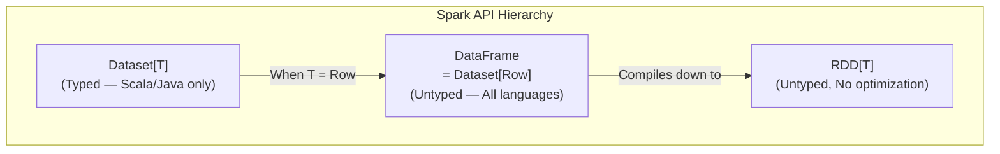

> **💡 Key Insight:** In Spark's Scala/Java implementation, a DataFrame is literally just `type DataFrame = Dataset[Row]`. A DataFrame is a Dataset of `Row` objects. They share the same optimization engine.

### 1.3 The Relationship

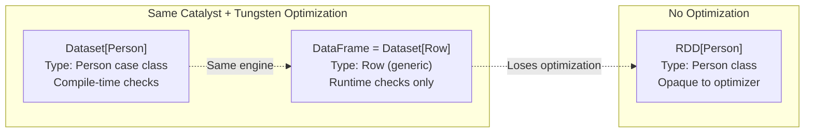

---

## 2. Why Datasets Exist

### 2.1 The Gap Between RDDs and DataFrames

DataFrames solved the performance problem (optimization), but they introduced a new problem: **loss of type safety**.

```
RDD[Person]:
  ✅ Type safe — compiler catches errors
  ❌ Not optimized — Spark can't see inside lambdas
  ❌ Slow in Python — serialization overhead

DataFrame (Dataset[Row]):
  ✅ Optimized — Catalyst + Tungsten
  ❌ Not type safe — errors only caught at RUNTIME
  ✅ Fast in all languages

Dataset[Person]:
  ✅ Type safe — compiler catches errors (Scala/Java)
  ✅ Optimized — Catalyst + Tungsten
  ⚠️ Only available in Scala/Java
```

### 2.2 The Type Safety Problem with DataFrames

```scala
// Scala DataFrame code — compiles fine, crashes at RUNTIME
val df = spark.read.parquet("users.parquet")

// This compiles but fails at runtime if "agee" column doesn't exist
val result = df.select("name", "agee")  // Typo! Should be "age"
// Runtime error: AnalysisException: cannot resolve 'agee'

// This compiles but fails at runtime with wrong type
val result = df.filter($"age" > "twenty-five")  // String vs Int comparison
```

```scala
// Scala Dataset code — catches errors at COMPILE TIME
case class User(name: String, age: Int, salary: Double)
val ds: Dataset[User] = spark.read.parquet("users.parquet").as[User]

// This WON'T COMPILE — type checker catches it
val result = ds.map(user => user.agee)  // Compile error: User has no field 'agee'

// This WON'T COMPILE — type mismatch
val result = ds.filter(_.age > "twenty-five")  // Compile error: Int vs String
```

### 2.3 The Historical Context

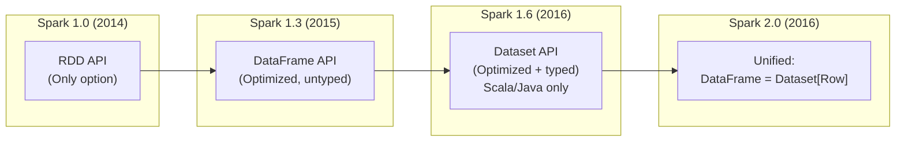

---

## 3. Dataset vs DataFrame vs RDD

### 3.1 The Comprehensive Comparison Table

| Feature | RDD | DataFrame | Dataset |
|---------|-----|-----------|---------|
| **Type safety** | Compile-time (Scala/Java) | Runtime only | Compile-time (Scala/Java) |
| **Schema** | No schema | Schema-aware | Schema-aware + typed |
| **Optimization** | None (opaque functions) | Catalyst + Tungsten | Catalyst + Tungsten |
| **Serialization** | Java/Kryo/Pickle | Tungsten binary | Tungsten binary + Encoders |
| **Languages** | Scala, Java, Python, R | Scala, Java, Python, R | Scala, Java only |
| **API style** | Functional (map, filter) | Declarative (select, where) | Both functional + declarative |
| **Performance** | Slow (especially Python) | Fast (all languages) | Fast (slightly slower than DF for typed ops) |
| **Null safety** | Depends on type system | NullPointerException risk | Option[T] support (Scala) |
| **Use case** | Unstructured data, custom logic | Structured data, SQL workloads | Type-critical Scala/Java apps |
| **Memory efficiency** | Low (Java objects) | High (Tungsten binary) | High (Tungsten + Encoders) |
| **Garbage Collection** | High (many Java objects) | Low (off-heap Tungsten) | Low (off-heap Tungsten) |
| **Error detection** | Runtime | Runtime (AnalysisException) | Compile-time |
| **Introduced** | Spark 1.0 (2014) | Spark 1.3 (2015) | Spark 1.6 (2016) |

### 3.2 Visual Comparison

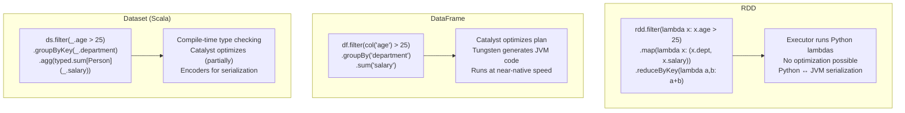

### 3.3 Code Comparison: Same Task, Three APIs

**Task:** Read user data, filter users over 25, group by department, sum salaries.

```python
# ============ RDD API (Python) ============
rdd = sc.textFile("users.csv")
parsed = rdd.map(lambda line: line.split(","))
header = parsed.first()
data = parsed.filter(lambda row: row != header)
result = data \
    .filter(lambda row: int(row[2]) > 25) \
    .map(lambda row: (row[3], float(row[4]))) \
    .reduceByKey(lambda a, b: a + b) \
    .collect()

# Problems: No schema, no optimization, magic indices, runtime errors
```

```python
# ============ DataFrame API (Python) ============
df = spark.read.csv("users.csv", header=True, inferSchema=True)
result = df.filter(col("age") > 25) \
    .groupBy("department") \
    .sum("salary") \
    .collect()

# Benefits: Schema-aware, optimized, readable
# Limitation: No compile-time type checking
```

```scala
// ============ Dataset API (Scala only) ============
case class User(id: Long, name: String, age: Int, department: String, salary: Double)

val ds = spark.read.csv("users.csv")
  .withColumn("id", $"id".cast(LongType))
  .withColumn("age", $"age".cast(IntegerType))
  .withColumn("salary", $"salary".cast(DoubleType))
  .as[User]  // Convert DataFrame to Dataset[User]

val result = ds.filter(_.age > 25)
  .groupByKey(_.department)
  .agg(typed.sum[User](_.salary))
  .collect()

// Benefits: Type safe, optimized, compile-time error checking
// ds.filter(_.agee > 25)  // WON'T COMPILE — no field 'agee'
```

---

## 4. Encoders: The Magic Behind Datasets

### 4.1 What Are Encoders?

Encoders are the serialization framework that converts JVM objects to Spark's internal Tungsten binary format and back. They're what make Datasets both type-safe AND fast.

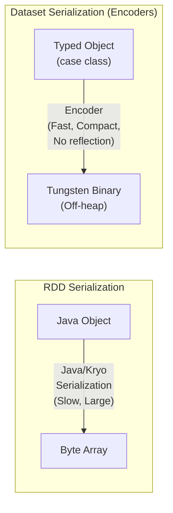

### 4.2 How Encoders Work

```scala
// Scala: Encoders are created automatically for case classes
case class Person(name: String, age: Int, salary: Double)

// Implicit encoder is generated at compile time
val ds: Dataset[Person] = spark.read.parquet("people.parquet").as[Person]

// The encoder knows:
// - Person has 3 fields
// - name is String (variable length, UTF-8)
// - age is Int (4 bytes, fixed)
// - salary is Double (8 bytes, fixed)
// - Total fixed portion: 12 bytes + string pointer
// It generates OPTIMAL serialization code at compile time
```

### 4.3 Encoder Types

```scala
// Scala: Built-in encoders for primitive types
import spark.implicits._

Encoders.INT          // for Int
Encoders.LONG         // for Long
Encoders.DOUBLE       // for Double
Encoders.STRING       // for String
Encoders.BOOLEAN      // for Boolean

// Product encoders (for case classes — most common)
Encoders.product[Person]  // Auto-generated for case class Person

// Bean encoders (for Java beans)
Encoders.bean(classOf[PersonBean])

// Kryo encoder (fallback for complex types — less efficient)
Encoders.kryo[ComplexType]
```

### 4.4 Why Encoders Matter for Performance

| Aspect | Java/Kryo Serialization (RDD) | Encoders (Dataset) |
|--------|------------------------------|-------------------|
| **Speed** | Slow (reflection-based) | Fast (code-generated) |
| **Size** | Large (includes class metadata) | Compact (only data, no metadata) |
| **Memory** | On-heap (GC pressure) | Off-heap (Tungsten, no GC) |
| **Partial deserialization** | Must deserialize entire object | Can access single fields without full deserialization |
| **Optimization** | Opaque to optimizer | Catalyst can inspect and optimize |

> **💡 Key Insight:** The killer feature of encoders is **partial deserialization**. If your query only needs the `name` field from a `Person`, the encoder can extract just `name` without deserializing `age` and `salary`. This is impossible with Java/Kryo serialization.

---

## 5. Dataset API in Scala and Java

### 5.1 Creating Datasets in Scala

```scala
import spark.implicits._

// Define your domain type
case class Employee(
  id: Long,
  name: String,
  age: Int,
  department: String,
  salary: Double,
  hireDate: String
)

// Method 1: From a sequence
val employees = Seq(
  Employee(1, "Alice", 30, "Engineering", 130000, "2020-01-15"),
  Employee(2, "Bob", 25, "Sales", 65000, "2021-06-01"),
  Employee(3, "Charlie", 35, "Engineering", 145000, "2018-03-20"),
).toDS()  // Returns Dataset[Employee]

// Method 2: From a DataFrame (type conversion)
val df = spark.read.parquet("employees.parquet")
val ds = df.as[Employee]  // Convert DataFrame to Dataset[Employee]

// Method 3: From a file with explicit type
val ds = spark.read.parquet("employees.parquet").as[Employee]
```

### 5.2 Typed Operations

```scala
// Typed transformations — compile-time checked!
val seniors = ds.filter(_.age > 30)          // Type-safe filter
val names = ds.map(_.name)                    // Type-safe map → Dataset[String]
val salaries = ds.map(e => (e.department, e.salary))  // Dataset[(String, Double)]

// Typed aggregations
import org.apache.spark.sql.expressions.scalalang.typed

val avgSalaryByDept = ds
  .groupByKey(_.department)          // GroupByKey → KeyValueGroupedDataset
  .agg(typed.avg[Employee](_.salary)) // Typed aggregation
  .collect()

// Typed joins
case class DeptInfo(department: String, budget: Double, headcount: Int)
val deptDS: Dataset[DeptInfo] = ???

val joined: Dataset[(Employee, DeptInfo)] = ds.joinWith(
  deptDS,
  ds("department") === deptDS("department"),
  "inner"
)
// Result is a typed tuple! No Row objects.
// joined.map { case (emp, dept) => (emp.name, dept.budget) }
```

### 5.3 Mixing Typed and Untyped Operations

```scala
// You can freely switch between Dataset and DataFrame operations
val ds: Dataset[Employee] = spark.read.parquet("emp.parquet").as[Employee]

// Typed operation → returns Dataset[Employee]
val filtered = ds.filter(_.salary > 100000)

// Untyped operation → returns DataFrame (Dataset[Row])
val grouped = filtered.groupBy("department").avg("salary")

// Back to typed → returns Dataset[Result]
case class DeptAvg(department: String, avg_salary: Double)
val result = grouped.as[DeptAvg]
```

### 5.4 Java Dataset API

```java
// Java: Datasets use Encoder via Encoders.bean()
public class Employee implements Serializable {
    private Long id;
    private String name;
    private Integer age;
    private String department;
    private Double salary;
    // getters and setters...
}

Encoder<Employee> employeeEncoder = Encoders.bean(Employee.class);
Dataset<Employee> ds = spark.read()
    .parquet("employees.parquet")
    .as(employeeEncoder);

// Typed operations
Dataset<Employee> seniors = ds.filter(
    (FilterFunction<Employee>) emp -> emp.getAge() > 30
);

Dataset<String> names = ds.map(
    (MapFunction<Employee, String>) emp -> emp.getName(),
    Encoders.STRING()
);
```

---

## 6. Why Python Doesn't Have Typed Datasets

### 6.1 The Technical Reason

Python is a **dynamically typed** language. The entire point of Datasets is **compile-time type checking**, which requires a statically-typed language with a compiler that runs before execution.

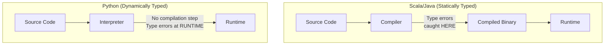

**Python has no compiler to catch type errors.** Therefore, adding a "typed Dataset" to PySpark would provide zero benefit — the types would only be checked at runtime, which is exactly what DataFrames already do.

### 6.2 What PySpark Developers Use Instead

```python
# PySpark: DataFrame IS your primary API
# Python's dynamic typing means you get flexibility instead of type safety

# Strategy 1: Explicit schemas (catches type errors at read time)
from pyspark.sql.types import *

schema = StructType([
    StructField("id", LongType(), nullable=False),
    StructField("name", StringType(), nullable=False),
    StructField("age", IntegerType(), nullable=True),
    StructField("department", StringType(), nullable=True),
    StructField("salary", DoubleType(), nullable=True),
])

df = spark.read.schema(schema).parquet("employees.parquet")
# If the Parquet file has incompatible types, error is caught HERE

# Strategy 2: Python type hints (for documentation, linting)
from pyspark.sql import DataFrame

def process_employees(df: DataFrame) -> DataFrame:
    """Process employee data.
    
    Expected schema:
        id: long
        name: string
        age: int
        department: string
        salary: double
    """
    return df.filter(col("age") > 25).groupBy("department").sum("salary")

# Strategy 3: Schema validation at pipeline boundaries
def validate_schema(df: DataFrame, expected_schema: StructType) -> bool:
    """Validate DataFrame schema matches expected schema."""
    actual_fields = {f.name: f.dataType for f in df.schema.fields}
    expected_fields = {f.name: f.dataType for f in expected_schema.fields}
    
    for name, dtype in expected_fields.items():
        if name not in actual_fields:
            raise ValueError(f"Missing column: {name}")
        if actual_fields[name] != dtype:
            raise ValueError(
                f"Column {name}: expected {dtype}, got {actual_fields[name]}"
            )
    return True
```

### 6.3 Python Type Hinting with PySpark

```python
# Modern PySpark with type hints (Python 3.9+)
from pyspark.sql import DataFrame, SparkSession
from pyspark.sql.types import StructType, StructField, StringType, IntegerType
from typing import Optional

class EmployeeProcessor:
    """Type-hinted PySpark processor."""
    
    SCHEMA = StructType([
        StructField("id", IntegerType(), nullable=False),
        StructField("name", StringType(), nullable=False),
        StructField("department", StringType(), nullable=True),
    ])
    
    def __init__(self, spark: SparkSession) -> None:
        self.spark = spark
    
    def read_employees(self, path: str) -> DataFrame:
        return self.spark.read.schema(self.SCHEMA).parquet(path)
    
    def filter_by_department(
        self, df: DataFrame, dept: str
    ) -> DataFrame:
        return df.filter(col("department") == dept)
    
    def get_headcount(self, df: DataFrame) -> int:
        return df.count()
```

### 6.4 The Bottom Line for Python Developers

> **💡 Key Insight:** If you're using PySpark, you don't need Datasets. DataFrames give you full optimization (Catalyst + Tungsten), and Python's dynamic typing means compile-time type checking isn't possible anyway. Use explicit schemas, type hints, and schema validation functions to achieve similar safety.

---

## 7. Row Objects

### 7.1 What Is a Row?

A `Row` is the generic type used by DataFrames. When you access individual rows of a DataFrame, you get `Row` objects.

```python
from pyspark.sql import Row

# Creating Row objects
row = Row(name="Alice", age=30, salary=75000.0)
print(row.name)     # "Alice"
print(row["name"])   # "Alice"
print(row[0])        # "Alice" (positional access)

# Row objects are immutable
# row.name = "Bob"  # ERROR! Can't modify

# Creating DataFrames from Row objects
rows = [
    Row(name="Alice", age=30, department="Engineering"),
    Row(name="Bob", age=25, department="Sales"),
    Row(name="Charlie", age=35, department="Engineering"),
]
df = spark.createDataFrame(rows)
df.show()
```

### 7.2 Accessing Row Data

```python
# Collecting rows (returns list of Row objects)
rows = df.collect()

for row in rows:
    # Access by column name
    print(row.name)
    print(row["name"])
    
    # Access by index
    print(row[0])
    
    # Convert to dictionary
    row_dict = row.asDict()
    print(row_dict)  # {'name': 'Alice', 'age': 30, 'department': 'Engineering'}
    
    # Convert to tuple
    row_tuple = tuple(row)
```

### 7.3 Row with Nested Data

```python
# Nested Row objects for complex schemas
address = Row(street="123 Main St", city="NYC", state="NY")
person = Row(name="Alice", age=30, address=address)

print(person.address.city)  # "NYC"

# Creating DataFrame with nested structure
data = [
    Row(name="Alice", address=Row(city="NYC", state="NY")),
    Row(name="Bob", address=Row(city="SF", state="CA")),
]
df = spark.createDataFrame(data)
df.printSchema()
# root
#  |-- name: string
#  |-- address: struct
#  |    |-- city: string
#  |    |-- state: string
```

### 7.4 Row vs Typed Objects: The Trade-Off

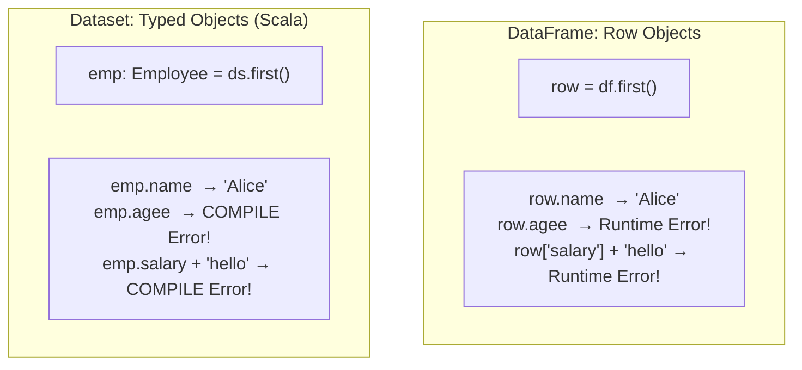

---

## 8. Schema Evolution

### 8.1 What Is Schema Evolution?

Schema evolution is the ability to handle changes in data schema over time — adding columns, removing columns, changing types, renaming columns.

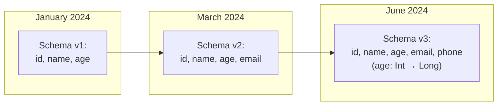

### 8.2 Schema Evolution in Parquet

Parquet supports basic schema evolution:

```python
# Reading data with evolved schema
# Parquet files have embedded schema — Spark merges them

# Enable schema merging
df = spark.read.option("mergeSchema", "true").parquet("data/")

# Or globally
spark.conf.set("spark.sql.parquet.mergeSchema", "true")

# What happens:
# - New columns in newer files → filled with NULL in older records
# - Missing columns in older files → filled with NULL
# - Type widening (int → long) → automatically promoted
# - Type narrowing (long → int) → ERROR (data loss)
```

### 8.3 Schema Evolution in Delta Lake

Delta Lake provides much richer schema evolution:

```python
# Delta Lake: Explicit schema evolution
df.write.format("delta") \
    .option("mergeSchema", "true") \
    .mode("append") \
    .save("delta-table/")

# Or force overwrite with new schema
df.write.format("delta") \
    .option("overwriteSchema", "true") \
    .mode("overwrite") \
    .save("delta-table/")
```

### 8.4 Handling Schema Changes in Production

```python
def safe_read_with_schema_evolution(path: str, expected_schema: StructType) -> DataFrame:
    """Read data safely, handling schema differences."""
    df = spark.read.parquet(path)
    actual_schema = df.schema
    
    # Add missing columns with default values
    for field in expected_schema.fields:
        if field.name not in df.columns:
            print(f"WARNING: Adding missing column '{field.name}' with NULL")
            df = df.withColumn(field.name, lit(None).cast(field.dataType))
    
    # Select only expected columns in expected order
    df = df.select([col(f.name).cast(f.dataType) for f in expected_schema.fields])
    
    return df

# Usage
expected_schema = StructType([
    StructField("id", LongType()),
    StructField("name", StringType()),
    StructField("age", IntegerType()),
    StructField("email", StringType()),  # New column — may not exist in old data
])

df = safe_read_with_schema_evolution("s3://data/users/", expected_schema)
```

---

## 9. Schema Enforcement vs Schema Merging

### 9.1 Schema Enforcement (Schema Validation)

Schema enforcement ensures that data written to a table matches the expected schema. If it doesn't, the write fails.

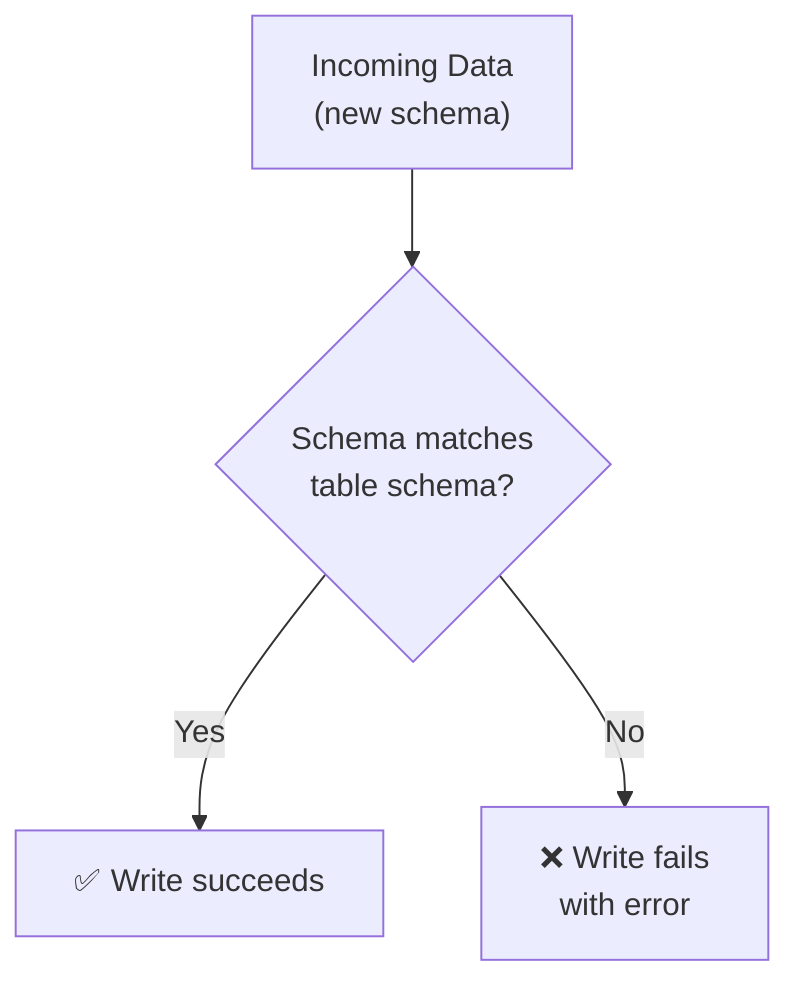

```python
# Parquet: No built-in enforcement (writes whatever schema you give it)
# Delta Lake: Enforces schema by default

# Delta Lake schema enforcement
df_original = spark.createDataFrame(
    [("Alice", 30), ("Bob", 25)], ["name", "age"]
)
df_original.write.format("delta").save("/tmp/delta_table")

# This FAILS — new column "email" doesn't match existing schema
df_new = spark.createDataFrame(
    [("Charlie", 35, "charlie@example.com")], ["name", "age", "email"]
)
df_new.write.format("delta").mode("append").save("/tmp/delta_table")
# AnalysisException: A schema mismatch detected when writing to the Delta table

# To allow it, explicitly enable schema evolution
df_new.write.format("delta") \
    .option("mergeSchema", "true") \
    .mode("append") \
    .save("/tmp/delta_table")
```

### 9.2 Schema Merging

Schema merging combines multiple schemas into a unified schema when reading data with different schemas.

```python
# Scenario: Data files with different schemas
# File 1 (2023): id, name, age
# File 2 (2024): id, name, age, email, phone

# Without schema merge — only reads schema from one file
df = spark.read.parquet("data/")
# May miss email and phone columns!

# With schema merge — unions all schemas
df = spark.read.option("mergeSchema", "true").parquet("data/")
# Schema: id, name, age, email, phone
# Old records have NULL for email and phone
```

### 9.3 Comparison Table

| Feature | Schema Enforcement | Schema Merging |
|---------|-------------------|---------------|
| **When** | On write | On read |
| **Purpose** | Prevent bad data from entering | Handle multiple schemas gracefully |
| **Default (Parquet)** | No enforcement | No merging |
| **Default (Delta)** | ✅ Enforced | Must opt-in |
| **Performance impact** | Minimal (schema check only) | Can be slow (reads all file footers) |
| **Safety** | High (rejects bad data) | Medium (may introduce NULLs) |

### 9.4 Best Practices for Schema Management

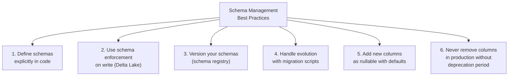

```python
# Production pattern: Schema registry
class SchemaRegistry:
    """Central schema definitions for the data platform."""
    
    USERS_V1 = StructType([
        StructField("id", LongType(), nullable=False),
        StructField("name", StringType(), nullable=False),
        StructField("age", IntegerType(), nullable=True),
    ])
    
    USERS_V2 = StructType([
        StructField("id", LongType(), nullable=False),
        StructField("name", StringType(), nullable=False),
        StructField("age", IntegerType(), nullable=True),
        StructField("email", StringType(), nullable=True),      # Added in v2
        StructField("created_at", TimestampType(), nullable=True), # Added in v2
    ])
    
    # Current version
    USERS = USERS_V2
    
    @staticmethod
    def get_schema(table_name: str, version: int = None) -> StructType:
        schemas = {
            "users": {1: SchemaRegistry.USERS_V1, 2: SchemaRegistry.USERS_V2},
        }
        if version:
            return schemas[table_name][version]
        return schemas[table_name][max(schemas[table_name].keys())]
```

---

## 10. When to Use Which API: The Decision Matrix

### 10.1 The Decision Flowchart

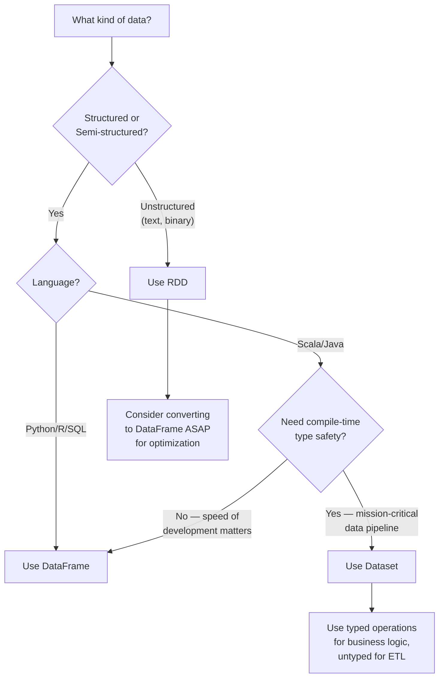

### 10.2 The Detailed Decision Matrix

| Scenario | Best API | Reason |
|----------|----------|--------|
| ETL pipeline (any language) | **DataFrame** | Optimized, easy SQL integration |
| PySpark anything | **DataFrame** | Only optimized option in Python |
| Ad-hoc analysis | **DataFrame + SQL** | Fastest to write, interactive |
| Complex Scala pipeline | **Dataset** | Type safety catches bugs early |
| Processing raw text logs | **RDD** → DataFrame | Parse with RDD, analyze with DF |
| Processing binary files | **RDD** | No schema to leverage |
| ML feature engineering | **DataFrame** | Built-in ML Pipeline support |
| Streaming | **DataFrame** (Structured Streaming) | Unified batch/stream API |
| Writing to external systems | **RDD** (`mapPartitions`) | Connection management per partition |
| Custom partitioning | **RDD** | Custom Partitioner class |
| Graph processing | **GraphFrames** (DataFrame-based) | Optimized graph operations |

### 10.3 The Practical Reality

```python
# In practice, 95% of Spark code uses DataFrames
# Here's a typical production PySpark application:

from pyspark.sql import SparkSession
from pyspark.sql.functions import *
from pyspark.sql.types import *

spark = SparkSession.builder.appName("Production ETL").getOrCreate()

# READ (DataFrame)
raw = spark.read.schema(defined_schema).parquet("s3://raw/data/")

# TRANSFORM (DataFrame)
cleaned = raw.filter(col("id").isNotNull()) \
    .withColumn("processed_date", current_date()) \
    .dropDuplicates(["id"])

enriched = cleaned.join(broadcast(lookup_df), "category_id")

aggregated = enriched.groupBy("region", "category") \
    .agg(sum("revenue").alias("total_revenue"),
         count("*").alias("transaction_count"))

# WRITE (DataFrame)
aggregated.write.partitionBy("region").mode("overwrite").parquet("s3://gold/metrics/")

# The ONLY time you might touch RDD:
# - Debugging: df.rdd.getNumPartitions()
# - Custom writes: df.rdd.mapPartitions(write_to_external_system)
```

---

## 11. Practical PySpark Patterns

### 11.1 Pattern: Builder Pattern for Complex Transformations

```python
class SalesETL:
    """Builder pattern for constructing ETL pipelines."""
    
    def __init__(self, spark: SparkSession, input_path: str):
        self.spark = spark
        self.df = spark.read.parquet(input_path)
    
    def clean(self) -> "SalesETL":
        self.df = self.df \
            .filter(col("order_total") > 0) \
            .filter(col("order_id").isNotNull()) \
            .dropDuplicates(["order_id"])
        return self
    
    def enrich(self, products_df: DataFrame) -> "SalesETL":
        self.df = self.df.join(broadcast(products_df), "product_id")
        return self
    
    def aggregate(self) -> "SalesETL":
        self.df = self.df.groupBy("category", "region") \
            .agg(
                sum("order_total").alias("total_revenue"),
                count("*").alias("order_count"),
                avg("order_total").alias("avg_order_value"),
            )
        return self
    
    def write(self, output_path: str) -> None:
        self.df.write.partitionBy("region") \
            .mode("overwrite") \
            .parquet(output_path)

# Usage (fluent API)
SalesETL(spark, "s3://raw/sales/") \
    .clean() \
    .enrich(products) \
    .aggregate() \
    .write("s3://gold/sales_metrics/")
```

### 11.2 Pattern: Schema Contract Testing

```python
def assert_schema(df: DataFrame, expected_columns: dict) -> DataFrame:
    """Assert DataFrame has expected columns with correct types.
    
    Args:
        df: DataFrame to validate
        expected_columns: Dict of {column_name: expected_type_string}
    
    Returns:
        The validated DataFrame (for chaining)
    
    Raises:
        AssertionError: If schema doesn't match
    """
    actual = {f.name: str(f.dataType) for f in df.schema.fields}
    
    for col_name, expected_type in expected_columns.items():
        assert col_name in actual, f"Missing column: {col_name}"
        assert actual[col_name] == expected_type, \
            f"Column {col_name}: expected {expected_type}, got {actual[col_name]}"
    
    return df

# Usage
df = spark.read.parquet("data/")
df = assert_schema(df, {
    "user_id": "LongType",
    "event_type": "StringType",
    "timestamp": "TimestampType",
    "amount": "DoubleType",
})
```

### 11.3 Pattern: Handling Multiple Input Schemas

```python
def normalize_schema(df: DataFrame, target_schema: StructType) -> DataFrame:
    """Normalize DataFrame to match target schema.
    
    - Adds missing columns as NULL
    - Casts columns to target types
    - Selects only target columns in target order
    """
    for field in target_schema.fields:
        if field.name not in df.columns:
            df = df.withColumn(field.name, lit(None).cast(field.dataType))
    
    return df.select([
        col(f.name).cast(f.dataType).alias(f.name) 
        for f in target_schema.fields
    ])

# Normalize data from multiple sources
target = StructType([
    StructField("id", LongType()),
    StructField("name", StringType()),
    StructField("email", StringType()),
    StructField("source", StringType()),
])

df_source_a = normalize_schema(raw_a.withColumn("source", lit("A")), target)
df_source_b = normalize_schema(raw_b.withColumn("source", lit("B")), target)
df_combined = df_source_a.unionByName(df_source_b)
```

---

## 12. Production Scenarios

### 12.1 Scenario: Multi-Layer Data Lakehouse

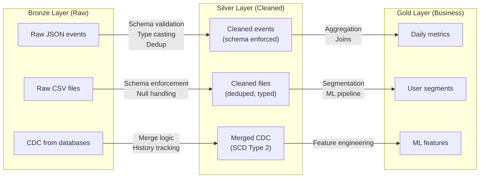

```python
# Bronze to Silver: Schema enforcement
def bronze_to_silver_events(spark, bronze_path, silver_path):
    """Transform raw events to cleaned, schema-enforced events."""
    
    # Define the silver schema contract
    silver_schema = StructType([
        StructField("event_id", StringType(), nullable=False),
        StructField("user_id", LongType(), nullable=False),
        StructField("event_type", StringType(), nullable=False),
        StructField("timestamp", TimestampType(), nullable=False),
        StructField("properties", MapType(StringType(), StringType()), nullable=True),
        StructField("processed_at", TimestampType(), nullable=False),
    ])
    
    # Read bronze (raw JSON)
    raw = spark.read.json(bronze_path)
    
    # Transform and enforce schema
    cleaned = raw \
        .filter(col("event_id").isNotNull()) \
        .filter(col("user_id").isNotNull()) \
        .withColumn("user_id", col("user_id").cast(LongType())) \
        .withColumn("timestamp", to_timestamp(col("timestamp"))) \
        .withColumn("processed_at", current_timestamp()) \
        .dropDuplicates(["event_id"])
    
    # Validate schema before writing
    assert_schema(cleaned, {
        "event_id": "StringType",
        "user_id": "LongType",
        "event_type": "StringType",
    })
    
    # Write to Silver layer with schema enforcement
    cleaned.select([col(f.name).cast(f.dataType) for f in silver_schema.fields]) \
        .write \
        .partitionBy("event_type") \
        .mode("append") \
        .parquet(silver_path)
```

### 12.2 Scenario: Choosing the Right API for a Complex Pipeline

```python
# Real-world pipeline that uses BOTH DataFrame and RDD APIs

# Step 1: Read and transform with DataFrame (optimized)
events = spark.read.parquet("s3://data/events/") \
    .filter(col("event_date") == "2024-01-15") \
    .select("user_id", "event_type", "properties")

# Step 2: Complex per-partition processing with RDD
# (Writing to external API with connection management)
def enrich_partition(partition):
    """Call external API to enrich events — one connection per partition."""
    import requests
    session = requests.Session()
    session.headers.update({"Authorization": "Bearer TOKEN"})
    
    enriched = []
    for row in partition:
        response = session.get(
            f"https://api.example.com/user/{row.user_id}/profile"
        )
        if response.status_code == 200:
            profile = response.json()
            enriched.append(Row(
                user_id=row.user_id,
                event_type=row.event_type,
                user_segment=profile.get("segment", "unknown"),
                user_country=profile.get("country", "unknown"),
            ))
    
    session.close()
    return iter(enriched)

# Switch to RDD for custom partition logic
enriched_rdd = events.rdd.mapPartitions(enrich_partition)

# Switch BACK to DataFrame for analysis (get optimization back)
enriched_df = spark.createDataFrame(enriched_rdd)
result = enriched_df.groupBy("user_segment", "user_country") \
    .agg(count("*").alias("event_count")) \
    .orderBy(desc("event_count"))

result.show()
```

---

## 13. Performance Considerations

### 13.1 API Performance Comparison

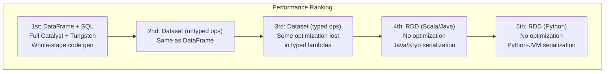

### 13.2 Dataset Typed Operations: The Performance Trade-Off

```scala
// Scala: Untyped operation (full optimization)
ds.groupBy("department").avg("salary")
// → Catalyst can fully optimize this (predicate pushdown, column pruning, etc.)

// Scala: Typed operation (partial optimization lost)
ds.groupByKey(_.department).agg(typed.avg[Employee](_.salary))
// → The lambda `_.department` is partially opaque to Catalyst
// → Less optimization possible than the untyped version
// → But you get compile-time type safety!
```

> **⚠️ Warning (Scala/Java developers):** Typed Dataset operations like `map`, `flatMap`, and `groupByKey` with lambdas can be **slower** than their untyped DataFrame equivalents because Catalyst cannot fully optimize lambda functions. Use untyped operations for performance-critical code, and typed operations where type safety is more important than performance.

### 13.3 When Type Safety Costs Performance

| Operation | DataFrame (Untyped) | Dataset (Typed) | Performance Difference |
|-----------|-------------------|----------------|----------------------|
| `groupBy("col")` | Full Catalyst optimization | Same | None |
| `filter(col > 5)` | Predicate pushdown | Same | None |
| `map(lambda)` | N/A (use withColumn) | Partial optimization | Typed is slower |
| `groupByKey(lambda)` | N/A (use groupBy) | Less optimal shuffle | Typed is slower |
| `joinWith` | N/A (use join) | Less optimal join strategy | Typed is slower |

---

## 14. Troubleshooting

### 14.1 Schema-Related Issues

#### Problem: Schema Mismatch When Reading Files

```python
# Error: Parquet files have different schemas
# org.apache.spark.sql.AnalysisException: Unable to infer schema

# Solution 1: Provide explicit schema
df = spark.read.schema(my_schema).parquet("data/")

# Solution 2: Enable schema merging
df = spark.read.option("mergeSchema", "true").parquet("data/")

# Solution 3: Read each path separately and union
df1 = spark.read.parquet("data/v1/")
df2 = spark.read.parquet("data/v2/")
df_combined = df1.unionByName(df2, allowMissingColumns=True)
```

#### Problem: Type Casting Failures

```python
# Error: Cannot cast "abc" to IntegerType
# Numbers stored as strings with non-numeric values

# Solution: Use try_cast or handle invalid values
from pyspark.sql.functions import col, when, regexp_replace

# Filter out invalid values before casting
df = df.filter(col("age").rlike("^[0-9]+$")) \
    .withColumn("age", col("age").cast(IntegerType()))

# Or use regexp_replace to clean first
df = df.withColumn("price",
    regexp_replace(col("price"), "[^0-9.]", "").cast(DoubleType())
)
```

#### Problem: Null Values Breaking Computations

```python
# Null-safe operations
from pyspark.sql.functions import coalesce, when, isnull

# Replace nulls with default value
df = df.withColumn("email", coalesce(col("email"), lit("unknown@example.com")))
df = df.fillna({"age": 0, "salary": 0.0, "department": "Unknown"})

# Null-safe comparison
df.filter(col("a").eqNullSafe(col("b")))  # NULL == NULL returns True
# vs
df.filter(col("a") == col("b"))            # NULL == NULL returns NULL
```

### 14.2 DataFrame-to-Dataset Conversion Issues (Scala)

```scala
// Error: Unable to find encoder for type stored in a Dataset
// Solution: Import implicits and ensure case class matches schema

import spark.implicits._

// Ensure case class field names match DataFrame column names exactly
// Ensure types are compatible:
//   DataFrame IntegerType → Scala Int
//   DataFrame LongType → Scala Long
//   DataFrame StringType → Scala String
//   DataFrame DoubleType → Scala Double
//   DataFrame ArrayType(StringType) → Scala Seq[String]
//   DataFrame nullable → Scala Option[T]

case class User(
  id: Long,                    // Non-nullable
  name: String,                // Non-nullable
  email: Option[String],       // Nullable — use Option!
  scores: Seq[Int],            // Array
)
```

---

## 15. Common Mistakes

### Mistake 1: Using Dataset Typed Operations When DataFrame Operations Suffice (Scala)

```scala
// BAD: Typed operation (loses some optimization)
val result = ds.groupByKey(_.department)
  .agg(typed.sum[Employee](_.salary))

// GOOD: Untyped operation (full optimization)
val result = ds.groupBy("department").sum("salary")

// Use typed operations ONLY when you need compile-time safety
// for complex business logic, not for standard aggregations
```

### Mistake 2: Not Defining Schemas for Production Pipelines

```python
# BAD: Relying on schema inference
df = spark.read.csv("data.csv", header=True, inferSchema=True)
# Schema changes silently if data changes!

# GOOD: Explicit schema definition
schema = StructType([
    StructField("id", LongType(), nullable=False),
    StructField("name", StringType(), nullable=False),
    StructField("amount", DoubleType(), nullable=True),
])
df = spark.read.schema(schema).csv("data.csv", header=True)
# Schema change in data → immediate error
```

### Mistake 3: Ignoring Nullability

```python
# BAD: Assuming no nulls
df = df.withColumn("ratio", col("revenue") / col("cost"))
# If cost is NULL → ratio is NULL (no error, silent data corruption)

# GOOD: Handle nulls explicitly
df = df.withColumn("ratio",
    when(col("cost").isNotNull() & (col("cost") != 0),
         col("revenue") / col("cost"))
    .otherwise(lit(None))
)
```

### Mistake 4: Converting Between APIs Unnecessarily

```python
# BAD: Converting to RDD and back (loses optimization)
result = df.rdd.map(lambda row: (row.name, row.salary * 1.1)).toDF(["name", "new_salary"])

# GOOD: Stay in DataFrame land
result = df.select("name", (col("salary") * 1.1).alias("new_salary"))
```

### Mistake 5: Not Using unionByName

```python
# BAD: union() depends on column ORDER (fragile)
df1 = spark.createDataFrame([(1, "Alice")], ["id", "name"])
df2 = spark.createDataFrame([("Bob", 2)], ["name", "id"])  # Different order!
df1.union(df2).show()
# +---+-----+
# | id| name|
# +---+-----+
# |  1|Alice|
# |Bob|    2|   ← WRONG! Columns don't match by name
# +---+-----+

# GOOD: unionByName() matches by column NAME
df1.unionByName(df2).show()
# +---+-----+
# | id| name|
# +---+-----+
# |  1|Alice|
# |  2|  Bob|   ← CORRECT!
# +---+-----+
```

---

## 16. Interview Questions

### Beginner Level

**Q1: What is the relationship between DataFrame and Dataset in Spark?**

> In Spark's type system (Scala/Java), a DataFrame is simply `Dataset[Row]` — a Dataset of generic Row objects. They share the same underlying engine (Catalyst optimizer, Tungsten execution). The difference is that Dataset[T] is parameterized with a specific type T (e.g., `Dataset[Person]`), providing compile-time type safety, while DataFrame uses the generic `Row` type with runtime-only checking.

**Q2: Why doesn't PySpark have a typed Dataset API?**

> Python is a dynamically typed language — there's no compilation step to catch type errors before runtime. The Dataset API's primary benefit is compile-time type checking, which requires a statically-typed language like Scala or Java. In Python, type errors are always caught at runtime, which is exactly what DataFrames already do. Therefore, adding typed Datasets to PySpark would provide no additional benefit.

**Q3: What is a Row object in Spark?**

> A `Row` is a generic container for a single record in a DataFrame. It stores values by position and by name, supporting access via `row.column_name`, `row["column_name"]`, or `row[index]`. Rows are immutable and can be converted to dictionaries with `row.asDict()`. When you `collect()` a DataFrame, you get a list of Row objects.

### Intermediate Level

**Q4: Explain Encoders in Spark Datasets. How do they differ from Java serialization?**

> Encoders are Spark's serialization framework for Datasets. Key differences from Java serialization:
>
> | Feature | Java Serialization | Encoders |
> |---------|-------------------|----------|
> | Speed | Slow (reflection) | Fast (code-generated) |
> | Size | Large (class metadata) | Compact (data only) |
> | Memory | On-heap (GC pressure) | Off-heap (Tungsten) |
> | Partial access | Must deserialize entire object | Can access single fields |
> | Optimization | Opaque | Catalyst-aware |
>
> Encoders generate specialized serialization code at compile time, enabling Spark to efficiently store, transfer, and operate on typed data without the overhead of general-purpose serialization.

**Q5: What is schema evolution? How does Spark handle it?**

> Schema evolution is the ability to handle changes in data schema over time (adding/removing/renaming columns, changing types). Spark handles it through:
>
> 1. **Parquet schema merging**: `mergeSchema=true` combines schemas from multiple files, filling missing columns with NULL
> 2. **Delta Lake schema enforcement**: Rejects writes that don't match the table schema (prevents silent corruption)
> 3. **Delta Lake schema evolution**: `mergeSchema=true` on write allows adding new columns
> 4. **Type widening**: Automatic promotion (int → long, float → double) is supported
> 5. **Type narrowing**: Not supported (would lose data)
>
> Best practice: Use explicit schemas, schema validation at pipeline boundaries, and Delta Lake for production data.

**Q6: What is the difference between schema enforcement and schema merging?**

> **Schema enforcement** (write-time): Validates that data being written matches the expected table schema. If it doesn't match, the write fails. This prevents data corruption. Delta Lake enforces schema by default.
>
> **Schema merging** (read-time): Combines multiple file schemas into a unified schema when reading. Missing columns in older files are filled with NULL. This handles reading historical data with different schemas. Must be explicitly enabled (`mergeSchema=true`).

### Advanced Level

**Q7: You're designing a data platform in Scala. Your team debates using Dataset[CaseClass] everywhere vs DataFrame. What's your recommendation?**

> My recommendation: **Use DataFrame (untyped) for ETL and standard operations, Dataset (typed) for core business logic.**
>
> Reasoning:
> 1. **ETL pipelines** (80% of code): Schema changes frequently, column names come from configs, SQL integration is common. DataFrames are more flexible and fully optimized.
> 2. **Business logic** (20% of code): Complex domain rules, financial calculations, regulatory compliance. Compile-time type safety catches bugs before production.
> 3. **Performance**: Typed Dataset operations (`map`, `groupByKey`) can be slower than untyped equivalents because lambdas are partially opaque to Catalyst.
> 4. **Team productivity**: Not everyone on the team may be comfortable with Scala type system complexity.
>
> Practical pattern:
> ```scala
> // Read as DataFrame (flexible)
> val raw = spark.read.parquet("data/")
> 
> // ETL with DataFrame (fully optimized)
> val cleaned = raw.filter(...).withColumn(...).join(...)
> 
> // Convert to Dataset for business logic (type safe)
> val typed = cleaned.as[BusinessEntity]
> val validated = typed.filter(entity => businessRules.validate(entity))
> 
> // Back to DataFrame for output (flexible)
> validated.toDF().write.parquet("output/")
> ```

**Q8: Explain the performance implications of converting between RDD, DataFrame, and Dataset. When does each conversion lose optimization?**

> ```
> DataFrame → RDD (df.rdd)
>   Loss: ALL Catalyst optimization (predicate pushdown, column pruning, 
>          whole-stage code gen). Data is deserialized from Tungsten format 
>          to Java/Python objects.
>   Cost: HIGH — avoid in production
>
> RDD → DataFrame (spark.createDataFrame(rdd, schema))
>   Gain: Catalyst optimization kicks in for all subsequent operations.
>   Cost: MEDIUM — data must be serialized into Tungsten format, schema 
>          must be inferred or provided.
>
> DataFrame → Dataset[T] (df.as[T]) — Scala only
>   Change: Adds type information. Uses Encoder for efficient serialization.
>   Cost: LOW — mostly metadata change, same underlying Tungsten data.
>
> Dataset[T] → DataFrame (ds.toDF()) — Scala only
>   Change: Loses type information. Same underlying data.
>   Cost: NEAR-ZERO — just type erasure.
>
> Dataset typed ops (ds.map, ds.filter with lambda)
>   Loss: PARTIAL — Catalyst can't fully optimize lambda functions.
>          May lose predicate pushdown, column pruning.
>   Cost: MODERATE — less efficient than untyped equivalents.
> ```
>
> Rule: Stay in DataFrame land for performance. Convert to Dataset only when type safety outweighs the performance cost. Never convert to RDD unless absolutely necessary.

**Q9: How would you implement type safety in a PySpark application without the Dataset API?**

> Several strategies:
>
> 1. **Explicit schemas**: Define StructType schemas as constants. Validate on read.
> 2. **Schema validation functions**: Assert schemas at pipeline boundaries (between stages).
> 3. **Python type hints**: Use `DataFrame` type annotations for function signatures.
> 4. **Data classes + validation**: Define Python dataclasses mirroring schemas, validate with libraries like pydantic.
> 5. **Runtime assertions**: Add assertion checkpoints that validate column existence and types.
> 6. **Unit tests**: Test transformations with known schemas, verify output schemas.
> 7. **Schema registry**: Centralize schema definitions in a shared module/service.
> 8. **Delta Lake**: Use schema enforcement to catch mismatches at write time.
>
> Example combined approach:
> ```python
> @dataclass
> class UserSchema:
>     """Schema contract for user data."""
>     COLUMNS = {"id": LongType(), "name": StringType(), "age": IntegerType()}
>     STRUCT = StructType([StructField(k, v) for k, v in COLUMNS.items()])
>     
>     @classmethod
>     def validate(cls, df: DataFrame) -> DataFrame:
>         for name, dtype in cls.COLUMNS.items():
>             assert name in df.columns, f"Missing: {name}"
>         return df
> ```

**Q10: Your company is migrating from Scala Datasets to PySpark DataFrames. What are the key risks and how do you mitigate them?**

> **Key Risks:**
>
> 1. **Loss of compile-time type safety**: Bugs previously caught by Scala compiler now become runtime errors.
>    - *Mitigation*: Implement comprehensive schema validation functions, add schema assertion checkpoints, increase unit test coverage for schema contracts.
>
> 2. **Python UDF performance**: Scala typed operations were JVM-native; Python UDFs involve serialization overhead.
>    - *Mitigation*: Replace all possible UDFs with built-in functions. Use Pandas UDFs (vectorized) for custom logic. Profile and benchmark critical paths.
>
> 3. **API differences**: Scala Dataset has `joinWith` (typed joins), `groupByKey` with typed aggregations. These don't have direct PySpark equivalents.
>    - *Mitigation*: Rewrite using DataFrame join + explicit column selection. Test output schema equivalence.
>
> 4. **Encoder-based optimizations lost**: Scala encoders provided partial deserialization. PySpark uses Row objects.
>    - *Mitigation*: This is handled transparently by Tungsten for DataFrame operations. Only matters if code explicitly used encoder features.
>
> 5. **Package ecosystem differences**: Scala libraries (e.g., custom Spark extensions) may not have Python equivalents.
>    - *Mitigation*: Audit all dependencies. Use `py4j` bridge or rewrite in Python.
>
> **Migration strategy**: Parallel run both versions, compare output schemas and values, migrate incrementally (one pipeline at a time), maintain comprehensive integration tests.

---

## Summary

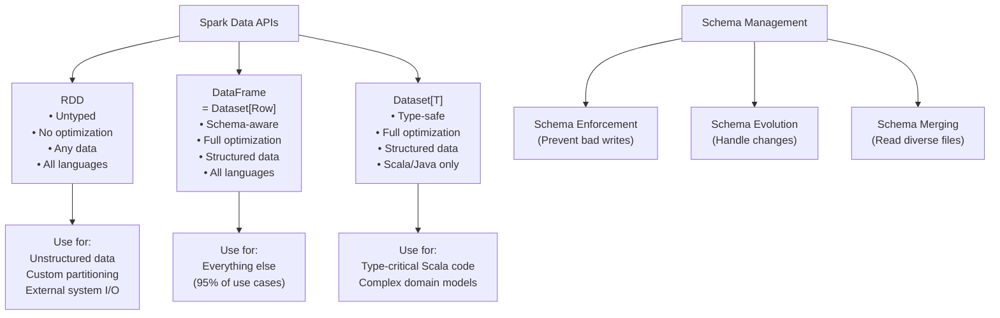

### The Key Takeaways

1. **DataFrame is your default choice.** In PySpark, it's your only optimized choice.
2. **Dataset adds compile-time type safety** — valuable in Scala/Java for mission-critical pipelines.
3. **RDD is the foundation** — understanding it helps debug everything, but you rarely use it directly.
4. **Schema management is critical** — define schemas explicitly, validate at boundaries, evolve carefully.
5. **Type safety in Python** comes from explicit schemas, validation functions, and good testing — not from the API itself.

Congratulations! You've now covered the core data abstractions in Spark. You understand RDDs (the foundation), DataFrames (the workhorse), and Datasets (the type-safe extension). With this knowledge, you're equipped to build, optimize, and debug any Spark application.

---

**[← Previous](04-dataframes.md) | [Home](../README.md)**
