# ⚡ Chapter 6: The Catalyst Optimizer — How Spark Thinks Before It Acts

> **"A bad plan executed perfectly is still a bad plan. Catalyst ensures Spark never runs a bad plan."**

---

## 📋 Table of Contents

1. [Intuition — Why Query Optimization Matters](#intuition--why-query-optimization-matters)
2. [Real-World Analogy — The Travel Agent](#real-world-analogy--the-travel-agent)
3. [What Is Catalyst?](#what-is-catalyst)
4. [The 4 Phases of Catalyst](#the-4-phases-of-catalyst)
5. [Phase 1: Analysis — Understanding Your Query](#phase-1-analysis--understanding-your-query)
6. [Phase 2: Logical Optimization — Rewriting for Efficiency](#phase-2-logical-optimization--rewriting-for-efficiency)
7. [Phase 3: Physical Planning — Choosing the Strategy](#phase-3-physical-planning--choosing-the-strategy)
8. [Phase 4: Code Generation — Producing the Executable](#phase-4-code-generation--producing-the-executable)
9. [Optimization Rules Deep Dive](#optimization-rules-deep-dive)
10. [Cost-Based Optimization (CBO)](#cost-based-optimization-cbo)
11. [Reading Execution Plans with explain()](#reading-execution-plans-with-explain)
12. [Adaptive Query Execution (AQE)](#adaptive-query-execution-aqe)
13. [Production Scenarios](#production-scenarios)
14. [Troubleshooting Catalyst](#troubleshooting-catalyst)
15. [Performance Considerations](#performance-considerations)
16. [Common Mistakes](#common-mistakes)
17. [Interview Questions](#interview-questions)

---

## Intuition — Why Query Optimization Matters

Imagine you're asked to find the total sales for "Electronics" in California for 2024 from a table with **10 billion rows**. Here are two approaches:

**Naive Approach:**
1. Load all 10 billion rows into memory
2. Filter for "Electronics"
3. Filter for "California"
4. Filter for year 2024
5. Sum the sales

**Smart Approach:**
1. Use the partition index to jump directly to 2024 data (skips 90% of data)
2. Use column pruning — only read `category`, `state`, and `sales` columns (skips 80% of columns)
3. Push the `category = 'Electronics'` filter down to the data source (skips 95% of remaining rows)
4. Sum the tiny remaining dataset

The smart approach might process **0.1%** of the data that the naive approach processes. The result is identical, but one takes 2 seconds and the other takes 3 hours.

> **💡 Key Insight:** Catalyst is Spark's "smart approach" engine. It takes your query — however you wrote it — and automatically figures out the most efficient way to execute it. You write for clarity; Catalyst rewrites for speed.

---

## Real-World Analogy — The Travel Agent

Think of Catalyst as a **world-class travel agent** optimizing your itinerary.

You tell the travel agent: *"I want to visit the Eiffel Tower, eat sushi, visit a vineyard, see the Colosseum, and attend a concert."*

```mermaid
graph TD
    subgraph "What You Said (Unoptimized)"
        A["Fly NYC → Paris"] --> B["Visit Eiffel Tower"]
        B --> C["Fly Paris → Tokyo"]
        C --> D["Eat Sushi in Tokyo"]
        D --> E["Fly Tokyo → Bordeaux"]
        E --> F["Visit Vineyard"]
        F --> G["Fly Bordeaux → Rome"]
        G --> H["See Colosseum"]
        H --> I["Fly Rome → Vienna"]
        I --> J["Attend Concert"]
    end

    subgraph "What Catalyst Does (Optimized)"
        K["Fly NYC → Paris"] --> L["Visit Eiffel Tower"]
        L --> M["Train Paris → Bordeaux"]
        M --> N["Visit Vineyard"]
        N --> O["Fly Bordeaux → Rome"]
        O --> P["See Colosseum"]
        P --> Q["Fly Rome → Tokyo"]
        Q --> R["Eat Sushi"]
        R --> S["Concert nearby"]
    end

    style A fill:#e74c3c,color:#fff
    style K fill:#27ae60,color:#fff
```

The travel agent:
1. **Analyzed** your requests (Phase 1 — *are these real destinations?*)
2. **Reordered** geographically (Phase 2 — *logical optimization*)
3. **Chose transport** — train vs. plane for each leg (Phase 3 — *physical planning*)
4. **Booked everything** into a single, efficient itinerary (Phase 4 — *code generation*)

**Catalyst does exactly this for your Spark queries.**

---

## What Is Catalyst?

Catalyst is Spark SQL's **extensible query optimizer**. It sits between your code and the actual computation, transforming your query through a series of optimization phases.

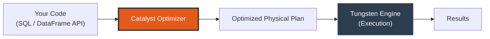

### Why Catalyst Was Built

Before Catalyst (Spark 1.x RDD era), performance depended entirely on how the developer wrote code. Two logically equivalent RDD programs could have wildly different performance:

```python
# Slow — filters after join
rdd1.join(rdd2).filter(lambda x: x[1][0] > 100)

# Fast — filters before join (manual optimization)
rdd1.filter(lambda x: x[1] > 100).join(rdd2)
```

With DataFrames + Catalyst, **both approaches produce the same optimized plan**. The optimizer handles it.

### Key Design Principles

| Principle | What It Means |
|-----------|---------------|
| **Rule-based** | Apply known optimization patterns (predicate pushdown, etc.) |
| **Cost-based** | Choose between alternatives using statistics |
| **Extensible** | Developers can add custom optimization rules |
| **Tree-based** | All plans are trees that get transformed via pattern matching |

---

## The 4 Phases of Catalyst

Every query goes through exactly four phases inside Catalyst:

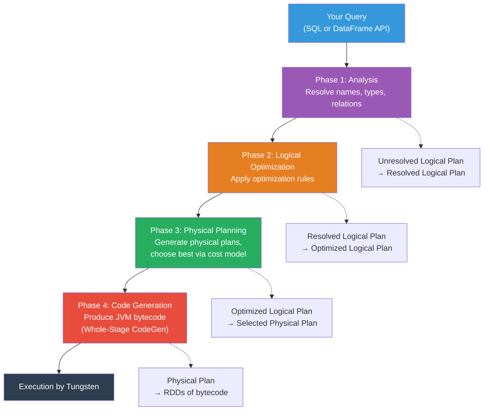

Let's walk through each phase with a concrete example:

```python
from pyspark.sql import SparkSession
from pyspark.sql.functions import col, sum as spark_sum

spark = SparkSession.builder.appName("CatalystDemo").getOrCreate()

# Sample query we'll trace through all 4 phases
result = (
    spark.read.parquet("/data/sales")
    .join(spark.read.parquet("/data/products"), "product_id")
    .filter(col("category") == "Electronics")
    .filter(col("year") == 2024)
    .groupBy("region")
    .agg(spark_sum("amount").alias("total_sales"))
    .orderBy(col("total_sales").desc())
)
```

---

## Phase 1: Analysis — Understanding Your Query

### What Happens

When you write a DataFrame operation or SQL query, Spark first creates an **Unresolved Logical Plan** — a tree that represents what you want to do, but with unresolved references (column names, table names, data types are all unknown).

The Analysis phase resolves these unknowns by consulting the **Catalog** (Spark's metadata store).

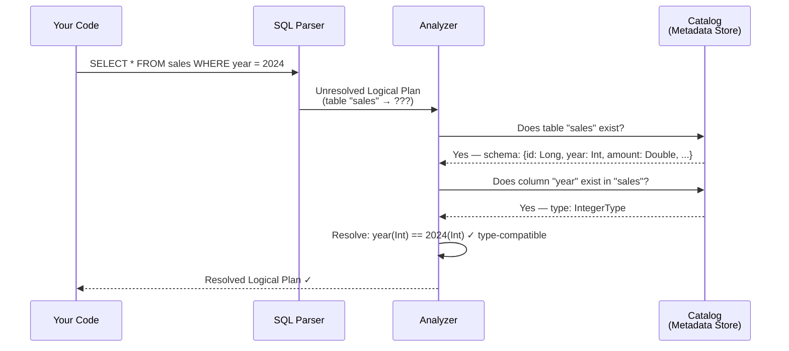

### Unresolved vs. Resolved

| Aspect | Unresolved | Resolved |
|--------|-----------|----------|
| Table names | String references | Linked to actual data sources |
| Column names | Unvalidated strings | Validated with data types |
| Functions | Name-only | Bound to implementations |
| Data types | Unknown | Fully resolved |

### What Can Go Wrong in Analysis

```python
# This will fail during analysis — column doesn't exist
df.filter(col("nonexistent_column") > 5)
# AnalysisException: cannot resolve 'nonexistent_column'

# This will fail — ambiguous column after join
df1.join(df2, "id").select("name")  
# AnalysisException: Reference 'name' is ambiguous (exists in both tables)
```

> **⚠️ Warning:** Analysis errors appear at query *construction* time (when you call `.filter()`, `.select()`, etc.), NOT at execution time. This is one of the big advantages of DataFrames over RDDs — you get compile-time-like errors.

### The Tree Representation

Internally, the resolved logical plan is an abstract syntax tree:

```
Aggregate [region], [region, sum(amount) AS total_sales]
└── Sort [total_sales DESC]
    └── Filter (category = 'Electronics' AND year = 2024)
        └── Join [product_id]
            ├── Relation [sales] (parquet)
            └── Relation [products] (parquet)
```

---

## Phase 2: Logical Optimization — Rewriting for Efficiency

This is where the magic happens. Catalyst applies a set of **optimization rules** to the resolved logical plan, transforming it into an equivalent but more efficient plan.

### Key Optimization Rules

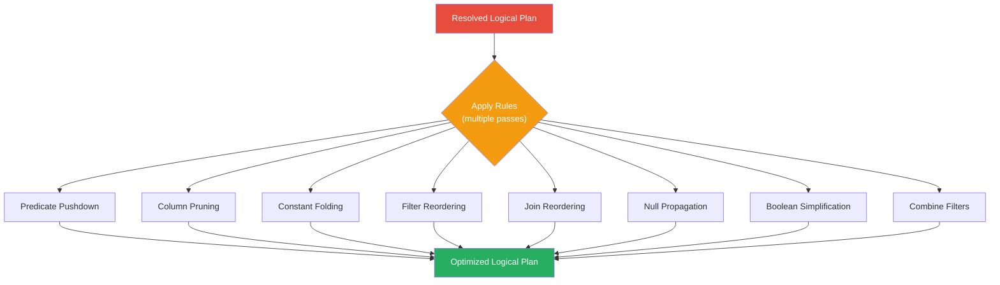

We'll deep-dive into each rule in the [Optimization Rules section](#optimization-rules-deep-dive).

### Before and After: A Concrete Example

**Before optimization (your code order):**
```
Sort [total_sales DESC]
└── Aggregate [region], [sum(amount)]
    └── Join [product_id]
        ├── Scan [sales] — ALL columns, ALL rows
        └── Scan [products] — ALL columns, ALL rows
```

**After optimization (Catalyst's rewrite):**
```
Sort [total_sales DESC]
└── Aggregate [region], [sum(amount)]
    └── Join [product_id]
        ├── Filter (year = 2024)
        │   └── Scan [sales] — only: product_id, year, amount, region
        └── Filter (category = 'Electronics')
            └── Scan [products] — only: product_id, category
```

Notice what changed:
1. **Predicate Pushdown:** Filters moved below the join, closer to the data source
2. **Column Pruning:** Only necessary columns are read from disk
3. **Filter Splitting:** The combined filter was split and pushed to the correct side of the join

---

## Phase 3: Physical Planning — Choosing the Strategy

The optimized logical plan says **what** to do. The physical plan says **how** to do it. Phase 3 generates multiple candidate physical plans and selects the best one.

### Logical vs. Physical

| Logical Plan Says | Physical Plan Decides |
|---|---|
| "Join these tables" | Sort-Merge Join? Broadcast Hash Join? Shuffle Hash Join? |
| "Sort this data" | In-memory sort? External sort? |
| "Aggregate" | Hash-based? Sort-based? |
| "Scan this table" | Full scan? Partition pruning? Index scan? |

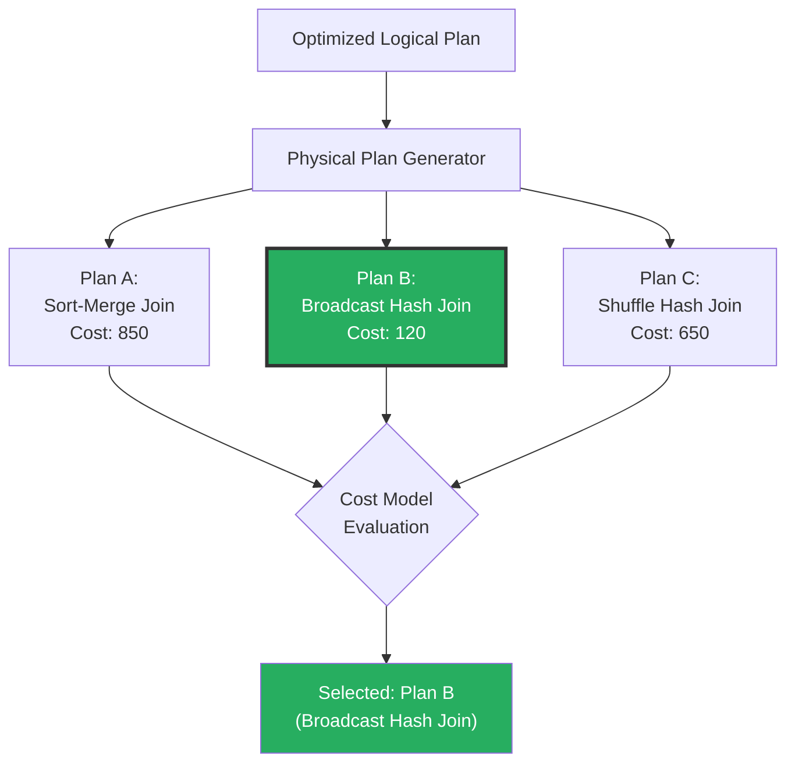

### Join Strategy Selection

The most impactful physical planning decision is **join strategy**:

| Strategy | When Chosen | Cost |
|----------|-------------|------|
| **Broadcast Hash Join** | One side < `spark.sql.autoBroadcastJoinThreshold` (default 10MB) | Cheapest — no shuffle |
| **Shuffle Hash Join** | Medium-sized tables, one side much smaller | Medium — shuffle only |
| **Sort-Merge Join** | Both sides are large | Expensive — shuffle + sort both sides |
| **Cartesian Join** | No join condition (cross join) | Extremely expensive |
| **Broadcast Nested Loop** | Non-equi joins with small table | Variable |

```python
# Force a specific join strategy using hints
from pyspark.sql.functions import broadcast

# Force broadcast join (even if table is large)
result = large_df.join(broadcast(small_df), "key")

# Hint-based (SQL style)
spark.sql("""
    SELECT /*+ BROADCAST(products) */ *
    FROM sales JOIN products ON sales.product_id = products.id
""")
```

---

## Phase 4: Code Generation — Producing the Executable

The selected physical plan is converted into **optimized Java bytecode** via **Whole-Stage Code Generation** (covered in detail in Chapter 7: Tungsten).

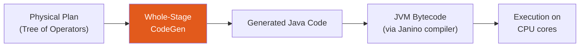

### What Code Generation Does

Instead of calling virtual methods for each operator on each row (the Volcano model — row-by-row processing), Catalyst generates a **single tight loop** that processes data in batches:

**Without CodeGen (Volcano model):**
```
for each row:
    call Filter.next()
        call Project.next()
            call Scan.next()
                return row
            apply projection
        apply filter
    output row
```

**With CodeGen (fused pipeline):**
```java
// Generated code — single loop, no virtual method calls
while (scan.hasNext()) {
    Row row = scan.next();
    if (row.getInt(2) == 2024 && row.getString(5).equals("Electronics")) {
        output(row.getLong(0), row.getDouble(3));  // only needed columns
    }
}
```

The generated code is **10-100x faster** because it eliminates:
- Virtual method dispatch overhead
- Unnecessary object creation
- Branch misprediction from generic iterator pattern

---

## Optimization Rules Deep Dive

### 1. Predicate Pushdown

**What:** Move filters as close to the data source as possible.

**Why:** The earlier you filter, the less data flows through the pipeline.

```python
# You write:
df = spark.read.parquet("/data/sales")
joined = df.join(products_df, "product_id")
filtered = joined.filter(col("year") == 2024)  # filter AFTER join

# Catalyst rewrites to:
# Filter year=2024 is pushed BELOW the join, directly onto the sales scan
# Parquet reader skips entire row groups where year != 2024
```

**Visual:**
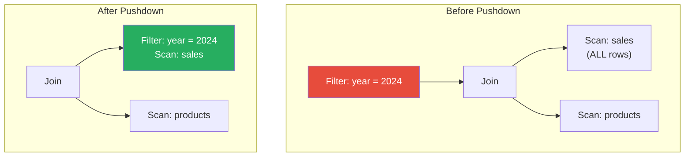

**Predicate pushdown to data sources:** For file formats like Parquet and ORC, predicates are pushed all the way down to the file reader. Parquet uses **min/max statistics** in row group metadata to skip entire chunks of data without reading them.

```python
# This filter is pushed into the Parquet reader
df = spark.read.parquet("/data/sales").filter(col("year") == 2024)

# Parquet reader checks: row group min(year)=2020, max(year)=2022 → SKIP
# Parquet reader checks: row group min(year)=2023, max(year)=2025 → READ
```

### 2. Column Pruning

**What:** Read only the columns that are actually needed by the query.

**Why:** Columnar formats like Parquet store data column-by-column. If you only need 3 of 50 columns, you skip reading 94% of the data.

```python
# You write — select only 2 columns from a 50-column table:
df = spark.read.parquet("/data/wide_table")
result = df.select("name", "email")

# Catalyst tells the Parquet reader: only read columns 'name' and 'email'
# 48 other columns are never read from disk
```

> **💡 Key Insight:** Column pruning is why **Parquet + Spark** is so much faster than **CSV + Spark**. CSV is row-based — you must read the entire row even if you need one column. Parquet is columnar — you read only what you need.

### 3. Constant Folding

**What:** Evaluate constant expressions at planning time instead of per-row at runtime.

```python
# You write:
df.filter(col("timestamp") > lit("2024-01-01").cast("timestamp"))

# Without constant folding: cast("2024-01-01") is computed for EVERY row
# With constant folding: cast("2024-01-01") → 1704067200000 (computed ONCE)
```

More examples:
```python
# Catalyst folds these at planning time:
df.filter(lit(1) + lit(2) > lit(0))    # → df.filter(lit(True))  → no filter needed
df.select(lit(100) * lit(2))            # → df.select(lit(200))
df.filter(col("x") > lit(3) + lit(5))  # → df.filter(col("x") > lit(8))
```

### 4. Filter Reordering

**What:** Put cheaper, more selective filters first.

**Why:** If a filter eliminates 99% of rows and costs almost nothing, run it before the expensive filter that only eliminates 10%.

```python
# You write:
df.filter(expensive_udf(col("text")) == True) \
  .filter(col("status") == "active")

# Catalyst reorders:
df.filter(col("status") == "active") \        # cheap column comparison first
  .filter(expensive_udf(col("text")) == True)  # expensive UDF on fewer rows
```

> **⚠️ Warning:** Catalyst **cannot** reorder filters involving UDFs because it doesn't know their side effects or selectivity. For UDFs, you should manually put cheap filters first.

### 5. Join Reordering

**What:** When joining multiple tables, reorder the join sequence for minimum cost.

**Why:** Join order massively affects performance. Joining the smallest tables first reduces intermediate data size.

```python
# You write — join order: A × B × C
# Table sizes: A=1TB, B=100MB, C=500GB
result = A.join(B, "key1").join(C, "key2")

# Catalyst might reorder to: B × A × C (or B × C × A)
# Joining the small table (B) first reduces intermediate data
```

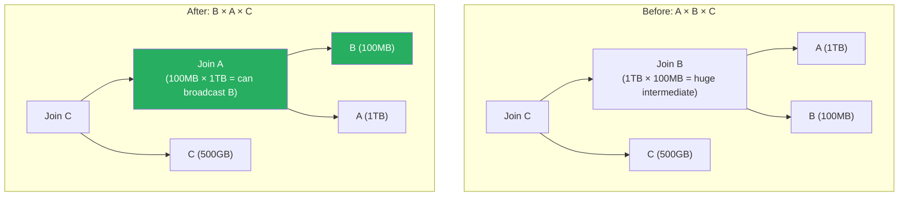

### 6. Null Propagation

**What:** Simplify expressions involving NULL values using NULL algebra rules.

```python
# These are optimized at plan time:
# col("x") + NULL      → NULL  (any arithmetic with NULL is NULL)
# col("x") AND FALSE   → FALSE (short-circuit)
# col("x") OR TRUE     → TRUE  (short-circuit)
# NULL = NULL           → NULL  (not TRUE!)
# COALESCE(NULL, col)   → col
```

### 7. Boolean Simplification

**What:** Simplify complex boolean expressions.

```python
# Before: (a AND TRUE) OR (b AND FALSE) OR (NOT NOT c)
# After:  a OR c

# Before: a AND a
# After:  a

# Before: a OR NOT a
# After:  TRUE
```

### 8. Combine Filters

**What:** Merge adjacent filter operations into a single filter with AND.

```python
# You write:
df.filter(col("a") > 5).filter(col("b") < 10).filter(col("c") == "x")

# Catalyst combines into:
df.filter((col("a") > 5) & (col("b") < 10) & (col("c") == "x"))

# This allows a single pass over the data instead of three
```

---

## Cost-Based Optimization (CBO)

While most of Catalyst's rules are **rule-based** (always apply), some decisions need **statistics**. This is where CBO comes in.

### What CBO Needs

CBO uses table and column statistics to make decisions:

```python
# Collect statistics for CBO
spark.sql("ANALYZE TABLE sales COMPUTE STATISTICS")
spark.sql("ANALYZE TABLE sales COMPUTE STATISTICS FOR COLUMNS product_id, amount, year")
```

### What Statistics Are Collected

| Statistic | Level | Used For |
|-----------|-------|----------|
| Row count | Table | Join ordering, join strategy |
| Size in bytes | Table | Broadcast join threshold |
| Column min/max | Column | Filter selectivity |
| Null count | Column | NULL-aware optimization |
| Distinct count | Column | Join cardinality estimation |
| Histogram | Column | Range query selectivity |

### How CBO Affects Decisions

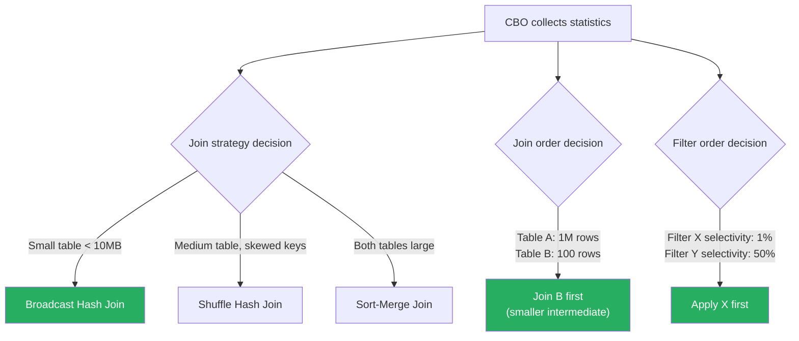

### Enable/Disable CBO

```python
# CBO is enabled by default in Spark 3.x
spark.conf.set("spark.sql.cbo.enabled", "true")           # Master switch
spark.conf.set("spark.sql.cbo.joinReorder.enabled", "true") # Join reordering
spark.conf.set("spark.sql.cbo.joinReorder.dp.threshold", "12") # Max tables to reorder
```

---

## Reading Execution Plans with explain()

The `explain()` method is your window into what Catalyst decided. Learning to read execution plans is one of the most valuable Spark debugging skills.

### explain() Modes

```python
df = (spark.read.parquet("/data/sales")
      .filter(col("year") == 2024)
      .groupBy("region")
      .agg(spark_sum("amount").alias("total")))

# Simple physical plan
df.explain()                   # or df.explain("simple")

# Full plan with all phases
df.explain(True)               # or df.explain("extended")

# Formatted (human-readable tree)
df.explain("formatted")

# Show cost information
df.explain("cost")

# Show the generated code
df.explain("codegen")
```

### Walking Through explain(True) Output

```python
df.explain(True)
```

Produces output like:

```
== Parsed Logical Plan ==
'Aggregate ['region], ['region, sum('amount) AS total#123]
+- 'Filter ('year = 2024)
   +- 'Relation [sales] parquet

== Analyzed Logical Plan ==
region: string, total: double
Aggregate [region#45], [region#45, sum(amount#50) AS total#123]
+- Filter (year#48 = 2024)
   +- Relation [id#44L, region#45, product_id#46L, year#48, amount#50]
      parquet

== Optimized Logical Plan ==
Aggregate [region#45], [region#45, sum(amount#50) AS total#123]
+- Filter (isnotnull(year#48) AND (year#48 = 2024))
   +- Relation [region#45, year#48, amount#50] parquet

== Physical Plan ==
*(2) HashAggregate(keys=[region#45], functions=[sum(amount#50)])
+- Exchange hashpartitioning(region#45, 200)
   +- *(1) HashAggregate(keys=[region#45], functions=[partial_sum(amount#50)])
      +- *(1) Filter (isnotnull(year#48) AND (year#48 = 2024))
         +- *(1) ColumnarToRow
            +- FileScan parquet [region#45,year#48,amount#50]
               PushedFilters: [IsNotNull(year), EqualTo(year,2024)]
               ReadSchema: struct<region:string,year:int,amount:double>
```

### How to Read the Physical Plan

Let's decode the physical plan from bottom to top (that's how data flows):

```
*(1) ← Whole-Stage CodeGen boundary (stage 1)
FileScan parquet ← Read from Parquet files
    PushedFilters: [IsNotNull(year), EqualTo(year,2024)] ← Pushed to Parquet reader!
    ReadSchema: struct<region,year,amount> ← Column pruning! Only 3 of N columns

*(1) Filter ← Additional filter (in case pushdown wasn't complete)

*(1) HashAggregate(partial_sum) ← Partial aggregation (map-side combine)

Exchange hashpartitioning(region, 200) ← SHUFFLE! Data redistributed by region
    ← 200 = spark.sql.shuffle.partitions

*(2) HashAggregate(sum) ← Final aggregation after shuffle
```

### Key Symbols in explain()

| Symbol | Meaning |
|--------|---------|
| `*(N)` | Whole-Stage CodeGen boundary (stage N) |
| `+- ` | Child operation (tree branch) |
| `Exchange` | **SHUFFLE** — data redistribution across the network |
| `BroadcastExchange` | Broadcasting a small table to all executors |
| `#123` | Attribute ID (internal Spark identifier) |
| `PushedFilters` | Filters pushed down to the data source |
| `ReadSchema` | Columns actually read (after column pruning) |
| `partial_sum` / `sum` | Two-phase aggregation (partial → shuffle → final) |

### Spotting Problems in Plans

```python
# 🔴 RED FLAG: No PushedFilters despite filter in query
# Means the filter couldn't be pushed to the data source
FileScan parquet [...] PushedFilters: []  # <-- Something is wrong!

# 🔴 RED FLAG: Reading all columns
ReadSchema: struct<col1,col2,...col50>  # <-- Using SELECT * ?

# 🔴 RED FLAG: BroadcastNestedLoopJoin
# Usually means you have a cartesian/cross join (no join condition)
BroadcastNestedLoopJoin BuildRight, Cross  # <-- Missing join key!

# 🔴 RED FLAG: Sort-Merge Join on a tiny table
SortMergeJoin [key] ← Table might be small enough for broadcast

# 🟢 GREEN FLAG: Broadcast join
BroadcastHashJoin [key], BuildRight  # <-- Small table broadcasted ✓
```

---

## Adaptive Query Execution (AQE)

AQE is the **game-changer** introduced in Spark 3.0. While Catalyst optimizes the plan *before* execution, AQE **re-optimizes during execution** based on actual runtime statistics.

> **💡 Key Insight:** Traditional Catalyst is like planning your road trip using Google Maps before you leave. AQE is like Google Maps **rerouting you in real-time** when it detects traffic.

```python
# Enable AQE (enabled by default in Spark 3.2+)
spark.conf.set("spark.sql.adaptive.enabled", "true")
```

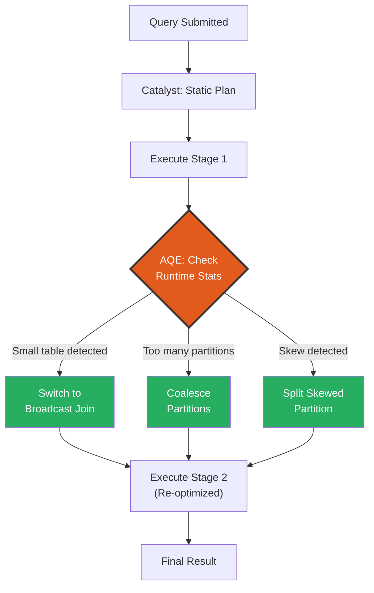

### AQE Feature 1: Dynamic Join Strategy Switching

**Problem:** Catalyst estimated a table at 500MB (→ sort-merge join), but after filtering, the actual data is only 5MB (→ should be broadcast join).

**AQE Solution:** After the filter stage completes, AQE sees the actual size and switches to a broadcast join.

```python
# Configuration
spark.conf.set("spark.sql.adaptive.enabled", "true")

# Scenario: After filters, one side of a join becomes small
sales = spark.read.parquet("/data/sales")  # 10GB
products = spark.read.parquet("/data/products")  # 500MB (too big for broadcast)

# But this filter reduces products to 2MB:
electronics = products.filter(col("category") == "Electronics")

# Without AQE: Sort-Merge Join (Catalyst estimated 500MB)
# With AQE: Broadcast Hash Join (AQE sees actual 2MB after filter)
result = sales.join(electronics, "product_id")
```

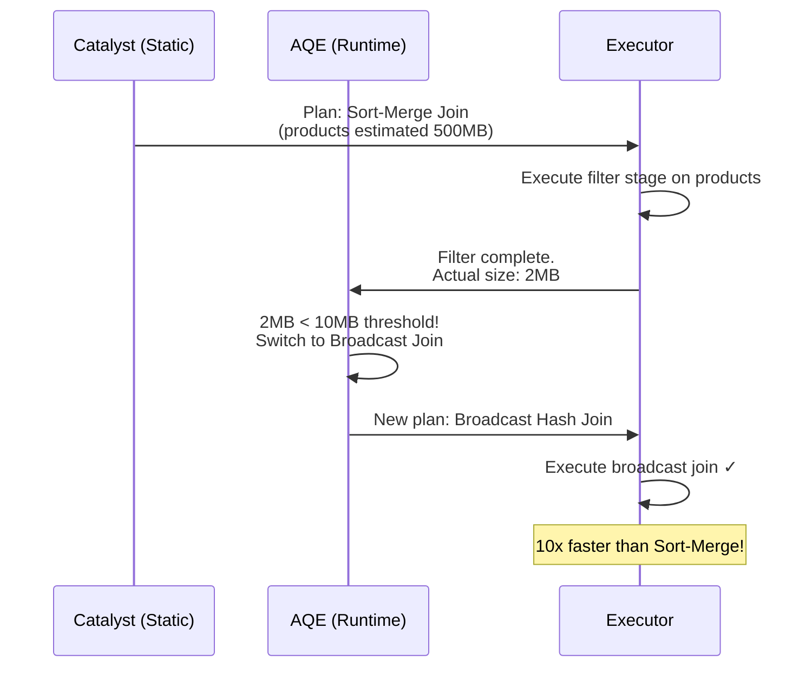

### AQE Feature 2: Dynamic Partition Coalescing

**Problem:** After a shuffle, you end up with 200 partitions (default), but most are tiny (< 1MB). This creates excessive task overhead.

**AQE Solution:** AQE merges small partitions into larger ones automatically.

```python
# Configuration
spark.conf.set("spark.sql.adaptive.coalescePartitions.enabled", "true")
spark.conf.set("spark.sql.adaptive.advisoryPartitionSizeInBytes", "128MB")
spark.conf.set("spark.sql.adaptive.coalescePartitions.minPartitionSize", "1MB")

# Before AQE: 200 partitions, most tiny
# After AQE: Maybe 15 well-sized partitions
```

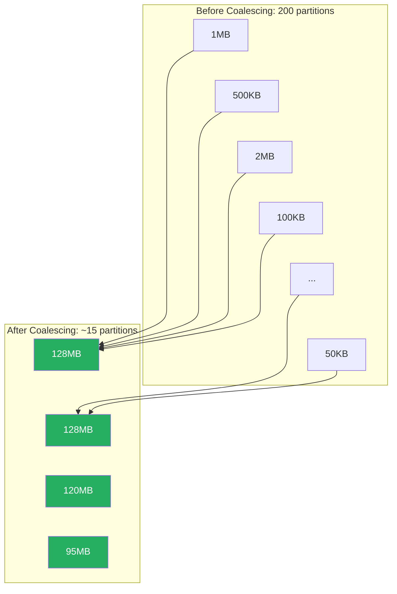

### AQE Feature 3: Skew Join Handling

**Problem:** In a join, 99% of data maps to one key (e.g., `country = "US"`). One task processes almost all the data while others sit idle.

**AQE Solution:** AQE detects the skewed partition, splits it into smaller sub-partitions, and replicates the matching data from the other side.

```python
# Configuration
spark.conf.set("spark.sql.adaptive.skewJoin.enabled", "true")
spark.conf.set("spark.sql.adaptive.skewJoin.skewedPartitionFactor", "5")
spark.conf.set("spark.sql.adaptive.skewJoin.skewedPartitionThresholdInBytes", "256MB")

# A partition is considered skewed if:
# size > skewedPartitionFactor × median partition size
# AND size > skewedPartitionThresholdInBytes
```

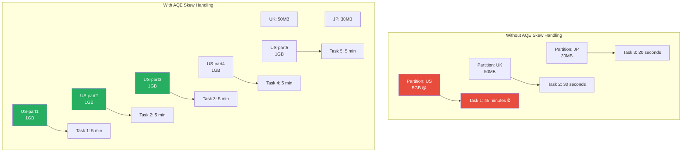

---

## Production Scenarios

### Scenario 1: Netflix — Recommendation Pipeline Optimization

Netflix processes billions of viewing events daily. Their Catalyst optimization journey:

```python
# Before optimization: Query took 4 hours
result = (
    viewing_events                          # 50B rows, 2TB
    .join(user_profiles, "user_id")         # 200M rows, 50GB
    .join(content_metadata, "content_id")   # 500K rows, 500MB
    .filter(col("country").isin(["US", "UK", "JP"]))
    .filter(col("event_date") >= "2024-01-01")
    .groupBy("genre", "country")
    .agg(
        count("*").alias("views"),
        avg("watch_duration").alias("avg_duration")
    )
)

# After Catalyst optimization:
# 1. content_metadata (500MB) → broadcast join (no shuffle!)
# 2. country filter pushed to viewing_events scan (Parquet partition pruning)
# 3. event_date filter pushed to data source (Parquet row group skip)
# 4. Column pruning: only 5 of 30 columns read
# 5. Result: 4 hours → 12 minutes
```

### Scenario 2: Uber — Surge Pricing Joins

```python
# Uber joins ride requests with driver availability and pricing zones
# Key insight: Catalyst + AQE handle the Manhattan skew problem

rides = spark.read.parquet("/data/rides")           # 1B rows
drivers = spark.read.parquet("/data/drivers")        # 5M rows  
zones = spark.read.parquet("/data/pricing_zones")    # 10K rows

result = (
    rides
    .join(broadcast(zones), "zone_id")  # Hint: broadcast tiny zones table
    .join(drivers, "driver_id")
    .filter(col("ride_date") == "2024-12-31")  # NYE — high volume
    .groupBy("zone_id", "hour")
    .agg(
        count("ride_id").alias("demand"),
        count("driver_id").alias("supply")
    )
)

# AQE handles: Manhattan zone has 100x more rides than rural zones
# AQE splits the Manhattan partition into sub-partitions automatically
```

### Scenario 3: Debugging a Slow Query

```python
# Step 1: Check the execution plan
slow_query.explain("formatted")

# Step 2: Look for red flags
# - SortMergeJoin where BroadcastHashJoin would work
# - No PushedFilters
# - Reading too many columns
# - Multiple Exchange (shuffle) operators

# Step 3: Check if AQE is enabled
print(spark.conf.get("spark.sql.adaptive.enabled"))

# Step 4: Check if CBO has statistics
spark.sql("DESCRIBE EXTENDED sales").show()
spark.sql("ANALYZE TABLE sales COMPUTE STATISTICS FOR ALL COLUMNS")

# Step 5: Re-run and compare plans
slow_query.explain("formatted")
```

---

## Troubleshooting Catalyst

### Problem: Filter Not Being Pushed Down

**Symptoms:** `PushedFilters: []` in the physical plan despite having filters.

**Root Causes:**
1. Filter uses a UDF (Spark can't push UDFs)
2. Filter column is computed/derived
3. Data source doesn't support pushdown

```python
# ❌ UDF prevents pushdown
from pyspark.sql.functions import udf
my_udf = udf(lambda x: x > 100)
df.filter(my_udf(col("amount")))  # NOT pushed down

# ✅ Use built-in functions instead
df.filter(col("amount") > 100)    # Pushed down ✓
```

### Problem: Wrong Join Strategy Selected

**Symptoms:** Sort-Merge Join used when Broadcast would be faster.

**Diagnosis:**
```python
# Check the threshold
print(spark.conf.get("spark.sql.autoBroadcastJoinThreshold"))
# Default: 10485760 (10MB)

# Check table size
df.cache()
df.count()
print(f"Size: {spark.catalog.listColumns('table_name')}")

# Solution 1: Increase threshold
spark.conf.set("spark.sql.autoBroadcastJoinThreshold", "100MB")

# Solution 2: Force broadcast with hint
result = df1.join(broadcast(df2), "key")

# Solution 3: Enable AQE for dynamic switching
spark.conf.set("spark.sql.adaptive.enabled", "true")
```

### Problem: Stale Statistics Leading to Bad Plans

**Symptoms:** CBO makes bad decisions because statistics are outdated.

```python
# Refresh statistics after major data changes
spark.sql("ANALYZE TABLE sales COMPUTE STATISTICS")
spark.sql("ANALYZE TABLE sales COMPUTE STATISTICS FOR COLUMNS year, amount, region")

# Verify statistics
spark.sql("DESCRIBE EXTENDED sales").show(truncate=False)
```

---

## Performance Considerations

### When Catalyst Helps Most

| Scenario | Improvement |
|----------|-------------|
| Filtering before join (predicate pushdown) | 10-100x |
| Column pruning on wide Parquet tables | 5-50x |
| Broadcast join vs sort-merge join | 5-20x |
| AQE skew handling | 3-10x |
| Constant folding | Marginal per-row but adds up |
| Join reordering | 2-50x |

### When Catalyst Can't Help

- **UDFs:** Catalyst treats UDFs as black boxes — no pushdown, no reordering
- **RDDs:** Catalyst only works with DataFrames/Datasets/SQL, not RDDs
- **Bad data modeling:** No optimizer can fix a fundamentally bad schema
- **Wrong cluster sizing:** Catalyst optimizes the query, not the infrastructure

### Tips to Help Catalyst

```python
# 1. Use built-in functions, not UDFs
# ❌ 
from pyspark.sql.functions import udf
upper_udf = udf(lambda s: s.upper())
df.withColumn("name_upper", upper_udf(col("name")))

# ✅
from pyspark.sql.functions import upper
df.withColumn("name_upper", upper(col("name")))

# 2. Use Parquet/ORC (columnar), not CSV/JSON
# ❌ 
spark.read.csv("/data/sales.csv")

# ✅
spark.read.parquet("/data/sales.parquet")

# 3. Provide join hints when you know better
from pyspark.sql.functions import broadcast
df1.join(broadcast(df2), "key")

# 4. Compute statistics for CBO
spark.sql("ANALYZE TABLE sales COMPUTE STATISTICS FOR ALL COLUMNS")

# 5. Enable AQE
spark.conf.set("spark.sql.adaptive.enabled", "true")
```

---

## Common Mistakes

### Mistake 1: Assuming Query Order = Execution Order

```python
# You might think Spark executes in this order:
# 1. Read all data → 2. Join → 3. Filter → 4. Aggregate
df = sales.join(products, "id").filter(col("year") == 2024).groupBy("cat").sum()

# But Catalyst rewrites this to:
# 1. Read ONLY needed columns → 2. Filter first → 3. Join filtered data → 4. Aggregate
# YOUR code order doesn't matter. Catalyst decides execution order.
```

### Mistake 2: Manually Optimizing What Catalyst Already Optimizes

```python
# ❌ Unnecessary manual optimization (Catalyst already does this)
df = spark.read.parquet("/data/sales")
filtered = df.filter(col("year") == 2024)
selected = filtered.select("region", "amount")
result = selected.join(products, "product_id")

# ✅ Write for clarity; Catalyst will optimize
result = (spark.read.parquet("/data/sales")
          .join(products, "product_id")
          .filter(col("year") == 2024)
          .select("region", "amount"))

# Both produce the SAME optimized plan
```

### Mistake 3: Thinking UDFs Are Optimized

```python
# ❌ UDFs are BLACK BOXES to Catalyst
@udf("boolean")
def is_valid(x):
    return x is not None and x > 0

df.filter(is_valid(col("amount")))  # Filter NOT pushed down, NOT reordered

# ✅ Use built-in functions
df.filter(col("amount").isNotNull() & (col("amount") > 0))
```

### Mistake 4: Not Checking Execution Plans

```python
# ALWAYS check your plan before running expensive queries
expensive_query.explain("formatted")
# Look for:
# - Unexpected SortMergeJoin (should be BroadcastHashJoin?)
# - Missing PushedFilters
# - Too many Exchange (shuffle) operators
# - Reading all columns (no column pruning?)
```

### Mistake 5: Disabling AQE

```python
# ❌ Don't disable AQE unless you have a very specific reason
spark.conf.set("spark.sql.adaptive.enabled", "false")

# ✅ Keep AQE enabled (default in Spark 3.2+)
spark.conf.set("spark.sql.adaptive.enabled", "true")
```

---

## Interview Questions

### Beginner Level

**Q1: What is the Catalyst Optimizer in Apache Spark?**

> **A:** Catalyst is Spark SQL's extensible query optimizer that automatically transforms user queries into optimized execution plans. It takes DataFrames, Datasets, or SQL queries through four phases — Analysis, Logical Optimization, Physical Planning, and Code Generation — to produce the most efficient execution strategy. It's tree-based and uses both rule-based and cost-based optimization techniques.

**Q2: What is predicate pushdown and why is it important?**

> **A:** Predicate pushdown moves filter conditions as close to the data source as possible. For example, a filter like `year = 2024` is pushed down to the Parquet reader, which uses min/max statistics in row group metadata to skip reading irrelevant data entirely. This can reduce I/O by 90%+ and is one of the most impactful optimizations.

**Q3: What's the difference between a logical plan and a physical plan?**

> **A:** A logical plan describes **what** the query does (filter, join, aggregate) without specifying how. A physical plan specifies **how** to execute each operation — for example, choosing Sort-Merge Join vs. Broadcast Hash Join. Multiple physical plans can implement the same logical plan; the optimizer picks the cheapest one.

### Intermediate Level

**Q4: How does AQE improve over static Catalyst optimization?**

> **A:** Static Catalyst optimization makes all decisions before execution using estimated statistics. AQE re-optimizes during execution using actual runtime statistics after each stage completes. Key AQE features: (1) dynamically switching join strategies (e.g., sort-merge → broadcast when actual data is small), (2) coalescing small partitions after shuffles, and (3) handling skewed joins by splitting large partitions. AQE is especially valuable when table statistics are stale or when data distributions are unpredictable.

**Q5: Why can't Catalyst optimize UDFs?**

> **A:** Catalyst treats UDFs as opaque/black-box functions because it cannot reason about their internal logic. It doesn't know if a UDF has side effects, what its selectivity is, or whether it's safe to reorder. This means no predicate pushdown, no constant folding, no reordering around UDFs. The solution is to use built-in Spark SQL functions whenever possible, as Catalyst fully understands and optimizes them.

**Q6: Explain the four phases of Catalyst with an example.**

> **A:** Given `SELECT sum(amount) FROM sales WHERE year = 2024 GROUP BY region`:
> 1. **Analysis:** Resolves table "sales" from catalog, validates columns "amount", "year", "region" exist with correct types
> 2. **Logical Optimization:** Pushes `year = 2024` filter before aggregation, prunes unused columns, adds `isnotnull(year)` check
> 3. **Physical Planning:** Chooses HashAggregate over SortAggregate, decides partition count for shuffle, selects FileScan with PushedFilters
> 4. **Code Generation:** Generates a single Java method that fuses scan → filter → partial aggregate into one tight loop, compiled via Janino

### Advanced Level

**Q7: How does the Cost-Based Optimizer decide join order for a multi-way join?**

> **A:** CBO uses dynamic programming to enumerate possible join orderings (up to `spark.sql.cbo.joinReorder.dp.threshold` tables, default 12). For each candidate ordering, it estimates the intermediate result sizes using column-level statistics (distinct counts, histograms, null fractions) and the formula: `|A ⋈ B| ≈ |A| × |B| / max(distinct(A.key), distinct(B.key))`. It picks the ordering with the smallest total estimated intermediate data size. This requires statistics to be collected via `ANALYZE TABLE ... COMPUTE STATISTICS FOR COLUMNS`. Without statistics, CBO falls back to heuristics (join smaller tables first).

**Q8: How does AQE handle skewed joins internally?**

> **A:** After the shuffle write phase, AQE examines partition sizes. A partition is considered skewed if it exceeds both `skewedPartitionFactor × medianPartitionSize` AND `skewedPartitionThresholdInBytes`. For a skewed partition in table A, AQE: (1) splits it into multiple sub-partitions (roughly `skewedPartitionSize / advisoryPartitionSize` pieces), (2) replicates the corresponding partition from table B to each sub-partition, (3) executes parallel join tasks for each sub-partition. The results are unioned. This trades some data duplication for parallelism, turning a single bottleneck task into multiple balanced ones.

**Q9: How would you debug a situation where Catalyst chooses a suboptimal plan?**

> **A:** Step-by-step approach:
> 1. Run `df.explain("formatted")` to see the current plan
> 2. Check for missing `PushedFilters` — may indicate UDFs blocking pushdown
> 3. Check join strategies — if Sort-Merge where Broadcast is possible, check `autoBroadcastJoinThreshold` and table size estimates
> 4. Run `ANALYZE TABLE ... COMPUTE STATISTICS FOR ALL COLUMNS` to give CBO accurate data
> 5. Check if AQE is enabled and its runtime behavior in Spark UI's SQL tab
> 6. Use join hints (`broadcast()`, `/*+ SHUFFLE_HASH */`) as a last resort to override the optimizer
> 7. Check for stale catalog statistics if CBO is enabled — `DESCRIBE EXTENDED table` shows stats timestamp
> 8. Look at Spark UI's SQL tab for actual vs. estimated row counts at each stage

**Q10: Can you add custom optimization rules to Catalyst? How?**

> **A:** Yes, Catalyst is designed to be extensible. You can add custom rules via `SparkSessionExtensions`:
> ```scala
> type Rule = LogicalPlan => LogicalPlan
> 
> spark.sessionState.experimentalMethods.extraOptimizations = 
>     Seq(MyCustomRule)
> ```
> Custom rules operate on Catalyst's tree structures using pattern matching. For example, you could write a rule that detects a common query pattern in your organization and rewrites it to use a materialized view. However, this is an advanced technique — incorrect rules can produce wrong results or make performance worse. Most users should rely on built-in rules, join hints, and AQE.

---

## Summary

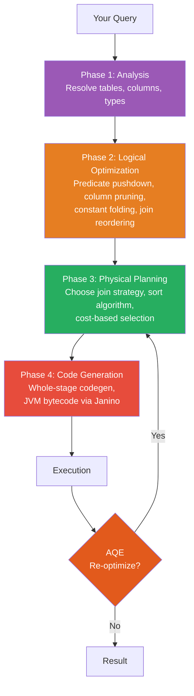

| Phase | Input | Output | Key Actions |
|-------|-------|--------|-------------|
| Analysis | Unresolved Plan | Resolved Plan | Validate names, resolve types |
| Logical Optimization | Resolved Plan | Optimized Plan | Pushdown, pruning, folding, reordering |
| Physical Planning | Optimized Plan | Physical Plan | Join/sort strategy, cost model |
| Code Generation | Physical Plan | JVM Bytecode | Whole-stage codegen, Janino compile |
| AQE (runtime) | Runtime Stats | Re-optimized Plan | Dynamic joins, coalescing, skew handling |

---

**[← Previous: 05-datasets.md](05-datasets.md) | [Home](../README.md) | [Next →: 07-tungsten-engine.md](07-tungsten-engine.md)**
