# ⚡ Chapter 7: The Tungsten Engine — How Spark Squeezes Every Drop of Performance

> **"Tungsten doesn't just run your query — it rewrites the rules of how the JVM processes data."**

---

## 📋 Table of Contents

1. [Intuition — Why Tungsten Exists](#intuition--why-tungsten-exists)
2. [Real-World Analogy — The Custom Engine](#real-world-analogy--the-custom-engine)
3. [The JVM Problem — Why Default Memory Management Fails](#the-jvm-problem--why-default-memory-management-fails)
4. [Tungsten's Three Pillars](#tungstens-three-pillars)
5. [Pillar 1: Memory Management — Off-Heap and UnsafeRow](#pillar-1-memory-management--off-heap-and-unsaferow)
6. [Pillar 2: Cache-Aware Computation](#pillar-2-cache-aware-computation)
7. [Pillar 3: Whole-Stage Code Generation](#pillar-3-whole-stage-code-generation)
8. [UnsafeRow Deep Dive](#unsaferow-deep-dive)
9. [Binary Data Representation](#binary-data-representation)
10. [Tungsten Sort](#tungsten-sort)
11. [Whole-Stage CodeGen Internals](#whole-stage-codegen-internals)
12. [How to See Generated Code](#how-to-see-generated-code)
13. [When CodeGen Kicks In (and When It Doesn't)](#when-codegen-kicks-in-and-when-it-doesnt)
14. [CollapseCodegenStages](#collapsecodegenstages)
15. [Performance Impact — Benchmarks](#performance-impact--benchmarks)
16. [Production Scenarios](#production-scenarios)
17. [Troubleshooting Tungsten](#troubleshooting-tungsten)
18. [Performance Considerations](#performance-considerations)
19. [Common Mistakes](#common-mistakes)
20. [Interview Questions](#interview-questions)

---

## Intuition — Why Tungsten Exists

Spark runs on the JVM (Java Virtual Machine). The JVM is brilliant for general-purpose applications, but it was **never designed for data-intensive workloads**. When processing billions of rows, the JVM's built-in memory management becomes a bottleneck, not a feature.

Consider this: a simple Java `String` containing "hello" (5 bytes of actual data) takes **~48 bytes** in JVM memory. That's almost **10x overhead**. When you multiply this by billions of records, you're wasting terabytes of memory on object headers, padding, and pointers.

Tungsten was born from a question: **What if Spark could bypass the JVM's memory management and manage memory like a database engine?**

> **💡 Key Insight:** Tungsten is not a separate system — it's a set of low-level optimizations embedded deep inside Spark SQL and DataFrames that make data processing 10-100x faster than naive JVM-based processing.

---

## Real-World Analogy — The Custom Engine

Imagine you buy a stock Toyota Camry (the JVM). It's a great car — reliable, safe, comfortable. But then you want to race at Le Mans. The stock engine is too heavy, the cooling system isn't designed for sustained high speeds, and the fuel system isn't efficient enough.

**Tungsten is like replacing the stock engine with a custom-built racing engine** — purpose-designed for the specific demands of data processing:

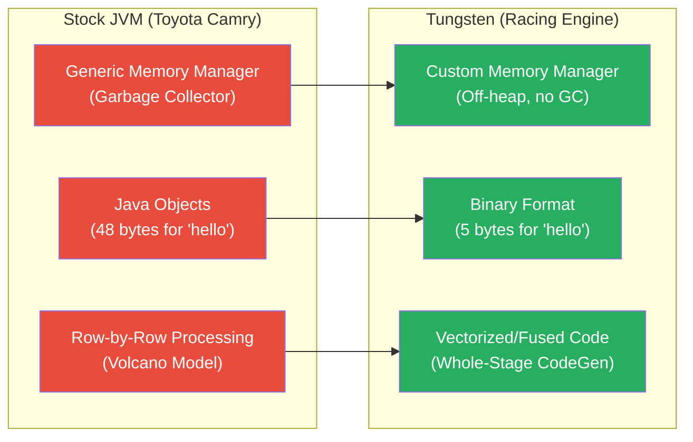

The car body (Spark API) looks the same from the outside. But under the hood, everything is different.

---

## The JVM Problem — Why Default Memory Management Fails

### Problem 1: Object Overhead

Every Java object has a **16-byte header** (8 bytes for class pointer + 8 bytes for flags/hash/lock). Arrays add another 4 bytes for length. Strings add more for the char array reference.

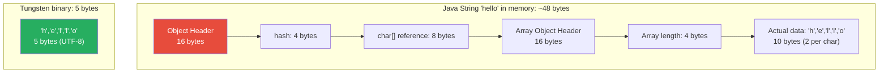

For a dataset with 1 billion strings:
- **Java Objects:** ~48GB of memory
- **Tungsten Binary:** ~5GB of memory
- **Savings:** 43GB (90% reduction!)

### Problem 2: Garbage Collection (GC) Overhead

The JVM periodically pauses all application threads to clean up unused objects (Garbage Collection). With billions of short-lived objects in data processing:

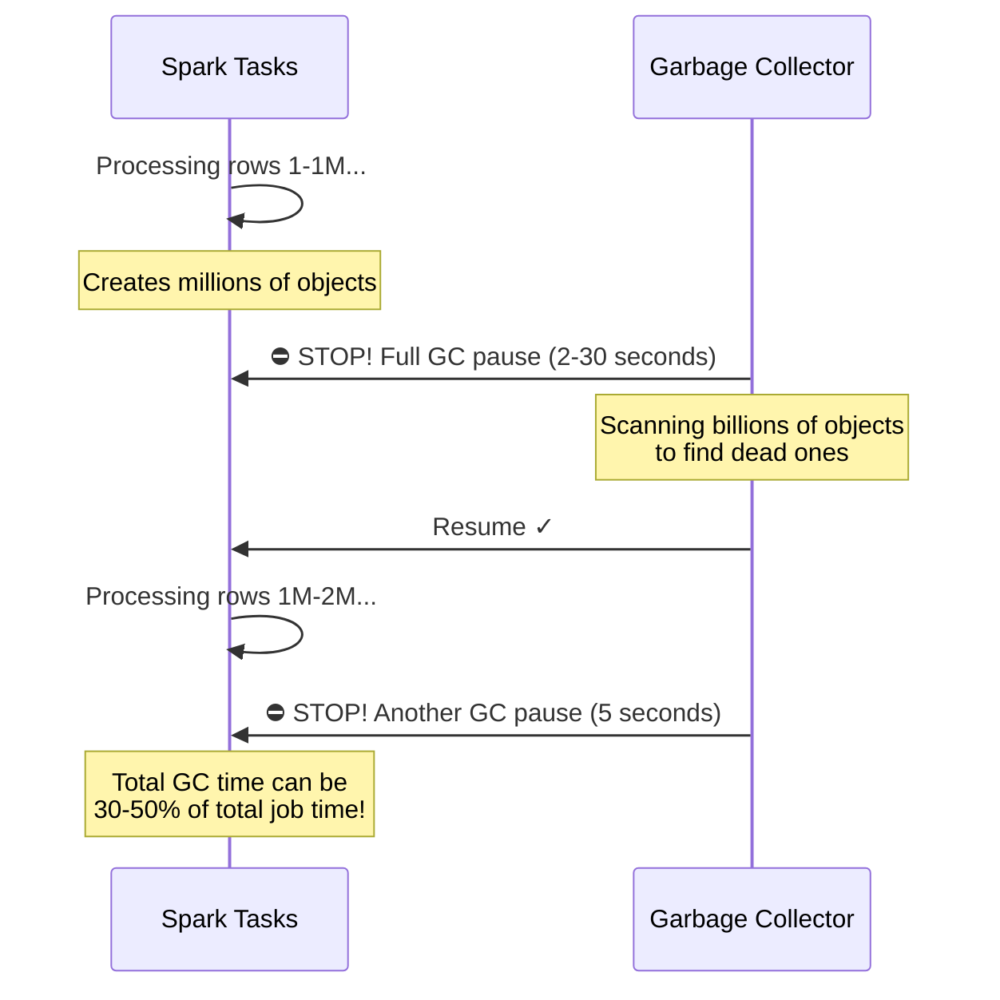

**GC pauses of 30+ seconds** are common in data-heavy Spark jobs. This is not just slow — it causes **timeouts, speculative execution, and even job failures**.

### Problem 3: Serialization Cost

When data moves between JVM processes (shuffle), it must be **serialized** (objects → bytes) and **deserialized** (bytes → objects). Java's default serialization is notoriously slow.

| Serialization Method | Speed | Size |
|---------------------|-------|------|
| Java Serialization | Slow (baseline) | Large |
| Kryo Serialization | 4-10x faster | 2-5x smaller |
| Tungsten Binary (no serialization needed) | **100x faster** | **Smallest** |

> **💡 Key Insight:** Tungsten avoids serialization entirely for most operations. Data is already in a binary format that can be written directly to disk or network. No conversion needed.

### Problem 4: Cache Misses

Modern CPUs have fast L1/L2/L3 caches (nanosecond access) and slow main memory (hundreds of nanoseconds). Java objects are scattered across the heap, causing frequent **cache misses** — the CPU has to wait for data from main memory.

```
L1 Cache: 1 ns          (64KB)
L2 Cache: 4 ns          (256KB)
L3 Cache: 12 ns         (8MB)
Main Memory: 100+ ns    (64GB+)
Disk: 10,000,000 ns     (SSD)
```

**A cache miss is 100x slower than a cache hit.** Tungsten organizes data to maximize cache hits.

---

## Tungsten's Three Pillars

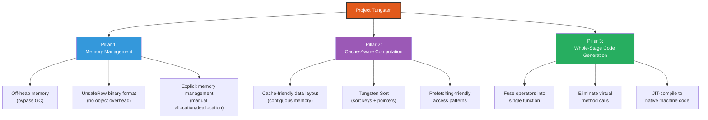

---

## Pillar 1: Memory Management — Off-Heap and UnsafeRow

### On-Heap vs. Off-Heap Memory

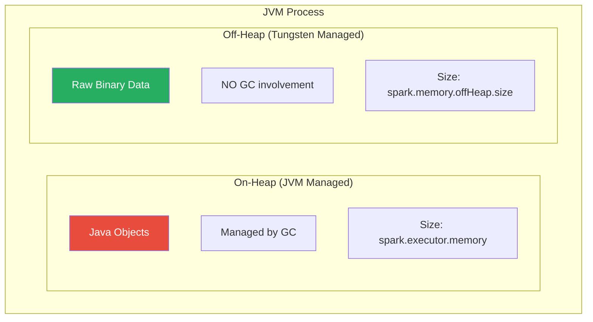

**On-Heap Memory:**
- Managed by JVM's Garbage Collector
- Subject to GC pauses
- Has object overhead (headers, padding)
- Limited by JVM heap size

**Off-Heap Memory:**
- Allocated directly from OS using `sun.misc.Unsafe`
- **No GC involvement** — allocated/freed manually by Tungsten
- No object overhead — raw binary bytes
- Can exceed JVM heap size

```python
# Enable off-heap memory
spark.conf.set("spark.memory.offHeap.enabled", "true")
spark.conf.set("spark.memory.offHeap.size", "4g")
```

### How Tungsten Manages Memory

Tungsten uses `sun.misc.Unsafe` — a low-level Java API that provides direct memory access, similar to C's `malloc`/`free`.

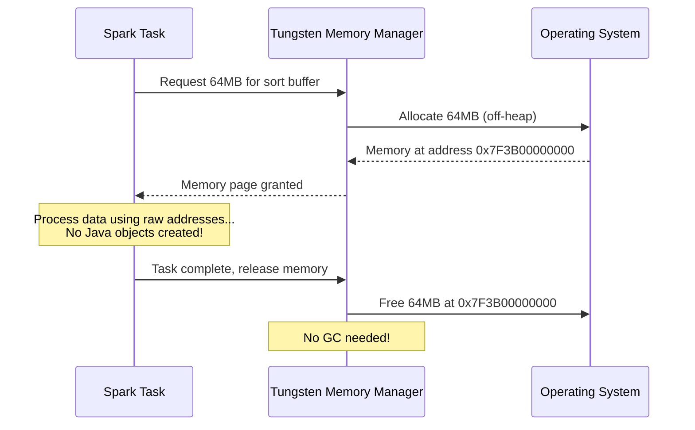

### The Memory Page Abstraction

Tungsten organizes memory into **pages** (typically 64MB each):

```
┌─────────────────────────────────────────┐
│           Tungsten Memory Pool          │
├──────────┬──────────┬──────────┬────────┤
│ Page 1   │ Page 2   │ Page 3   │ Page 4 │
│ (64MB)   │ (64MB)   │ (64MB)   │ (64MB) │
│ Sort buf │ Hash tbl │ Join buf │ Free   │
└──────────┴──────────┴──────────┴────────┘
```

Each page tracks:
- Base address (pointer to start of memory)
- Size
- Whether it's on-heap or off-heap
- Which task owns it

---

## UnsafeRow Deep Dive

`UnsafeRow` is Tungsten's binary row format. Instead of storing each column as a separate Java object, the entire row is stored as a **contiguous byte array**.

### UnsafeRow Memory Layout

```
┌────────────────────────────────────────────────────────────┐
│                       UnsafeRow                            │
├─────────────┬──────────────────────┬───────────────────────┤
│ Null Bitmap │  Fixed-Length Values  │  Variable-Length Data │
│  (8 bytes)  │ (8 bytes per field)  │  (actual strings,    │
│             │                      │   arrays, etc.)       │
├─────────────┼──────────────────────┼───────────────────────┤
│ 00000010    │ 42 | null | offset+len│ "Electronics"        │
│ (col 2 null)│ int  null   pointer  │                      │
└─────────────┴──────────────────────┴───────────────────────┘
```

### Concrete Example

For a row with schema: `(id: Int, name: String, price: Double, category: String)`

Values: `(42, "Laptop", 999.99, null)`

```
Offset  Content              Description
─────────────────────────────────────────────
0x00    0000 0000 0000 1000  Null bitmap (bit 3 set → category is null)
0x08    0000 0000 0000 002A  id = 42 (fixed-size, 8 bytes)
0x10    0006 0000 0028 0000  name: offset=0x28, length=6 ("Laptop")
0x18    408F 7FF5 C28F 5C29  price = 999.99 (IEEE 754 double)
0x20    0000 0000 0000 0000  category = null (all zeros, bitmap says null)
0x28    4C61 7074 6F70       "Laptop" (UTF-8 bytes, variable-length region)
─────────────────────────────────────────────
Total: 46 bytes

Java objects equivalent: ~200+ bytes (with String objects, headers, etc.)
```

### Why UnsafeRow is Fast

| Aspect | Java Objects | UnsafeRow |
|--------|-------------|-----------|
| Memory per row (4 columns) | ~200 bytes | ~46 bytes |
| GC involvement | Yes (every field is an object) | **No** (raw bytes) |
| Serialization needed? | Yes (expensive) | **No** (already binary) |
| Cache-friendly? | No (objects scattered in heap) | **Yes** (contiguous bytes) |
| Null check | `.equals(null)` method call | **Bit check** (single instruction) |

### Accessing UnsafeRow Data

```python
# You never directly interact with UnsafeRow in PySpark
# But internally, when you do:
df.select("name", "price").filter(col("price") > 100)

# Spark accesses UnsafeRow fields by offset:
# name  = read bytes at offset 0x10 (get pointer → read from variable region)
# price = read 8 bytes at offset 0x18 (direct read, no method calls)
# Compare price > 100: single CPU instruction on raw bytes
```

---

## Binary Data Representation

Tungsten converts all Spark SQL types to a compact binary format:

### Type Encoding

| Spark SQL Type | Binary Representation | Size |
|---|---|---|
| `BooleanType` | 1 bit in bitmap, 8-byte slot | 8 bytes fixed |
| `ByteType` | Raw byte, padded to 8 bytes | 8 bytes fixed |
| `ShortType` | 2 bytes, padded to 8 bytes | 8 bytes fixed |
| `IntegerType` | 4 bytes, padded to 8 bytes | 8 bytes fixed |
| `LongType` | 8 bytes | 8 bytes fixed |
| `FloatType` | IEEE 754, padded to 8 bytes | 8 bytes fixed |
| `DoubleType` | IEEE 754 | 8 bytes fixed |
| `StringType` | Offset + length in fixed region, data in variable region | Variable |
| `BinaryType` | Same as String | Variable |
| `DecimalType` | If precision ≤ 18: Long. Otherwise: byte array | 8 or variable |
| `DateType` | Days since epoch as Int | 8 bytes fixed |
| `TimestampType` | Microseconds since epoch as Long | 8 bytes fixed |
| `ArrayType` | Offset + length, elements in variable region | Variable |
| `MapType` | Key array + value array | Variable |
| `StructType` | Nested UnsafeRow | Variable |

### Key Design Decisions

1. **All fixed-length fields are 8 bytes** — ensures alignment, enables fast pointer arithmetic
2. **Variable-length data at the end** — keeps fixed region compact for scanning
3. **Null bitmap is first** — check nulls before reading values (avoid wasted work)
4. **Little-endian byte order** — matches x86 CPU native order (no byte swapping)

---

## Pillar 2: Cache-Aware Computation

### The CPU Cache Problem

When sorting data, the CPU must repeatedly compare and swap records. If records are Java objects scattered across the heap, each comparison triggers a **cache miss** (~100ns penalty):

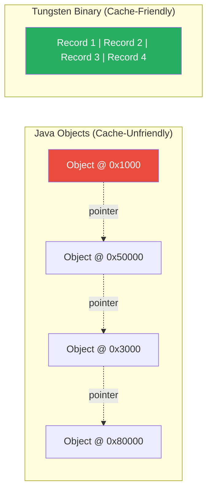

### Tungsten Sort

Tungsten's sort algorithm is specifically designed for cache efficiency:

**Traditional sort:** Sort full records (or objects with pointers)
**Tungsten sort:** Sort **encoded key + pointer** pairs (8 bytes each)

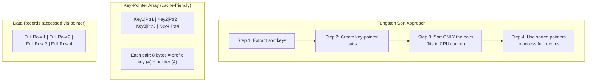

**The key insight:** The sort key prefix (first 4 bytes of the sort key) is stored directly in the pointer array. For many sorts, this prefix is enough to determine order **without looking at the full record**. This means the sort operates almost entirely within the CPU cache.

### How Prefix Key Encoding Works

```
Sort key prefix for different types:
─────────────────────────────────────
Integer 42        → 0x0000002A (direct encoding)
String "hello"    → 0x68656C6C (first 4 bytes: "hell")
Long 1000000      → 0x000F4240 (high 4 bytes)
Negative Int -5   → 0x7FFFFFFB (flip sign bit for correct ordering)
```

When two prefixes are equal, Tungsten falls back to comparing the full records. But **statistically, most comparisons are resolved by the prefix alone**, saving enormous amounts of memory access.

```python
# You see Tungsten sort in the physical plan:
df.orderBy("price")
df.explain()

# Output includes:
# *(1) Sort [price#10 ASC NULLS FIRST], true, 0
# This uses Tungsten sort internally
```

---

## Pillar 3: Whole-Stage Code Generation

This is the crown jewel of Tungsten. Instead of interpreting the query plan operator-by-operator, Spark **generates optimized Java code** that fuses multiple operators into a single function.

### The Volcano Model Problem

Traditional query engines (and early Spark) use the **Volcano/Iterator model**:

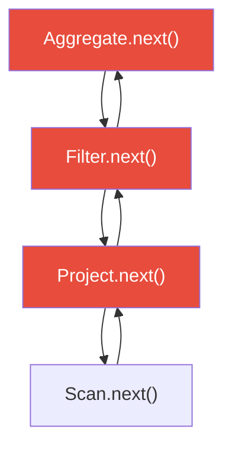

For each row, the engine calls `next()` up the tree of operators. This creates:
- **Virtual method dispatch** for every row × every operator
- **Object boxing/unboxing** at each operator boundary
- **Branch misprediction** from the generic iterator pattern
- **Poor CPU instruction cache usage** (jumping between operator code)

For 1 billion rows with 5 operators: **5 billion virtual method calls**.

### The Whole-Stage CodeGen Solution

Instead of calling operators one-by-one, Spark generates a **single tight loop**:

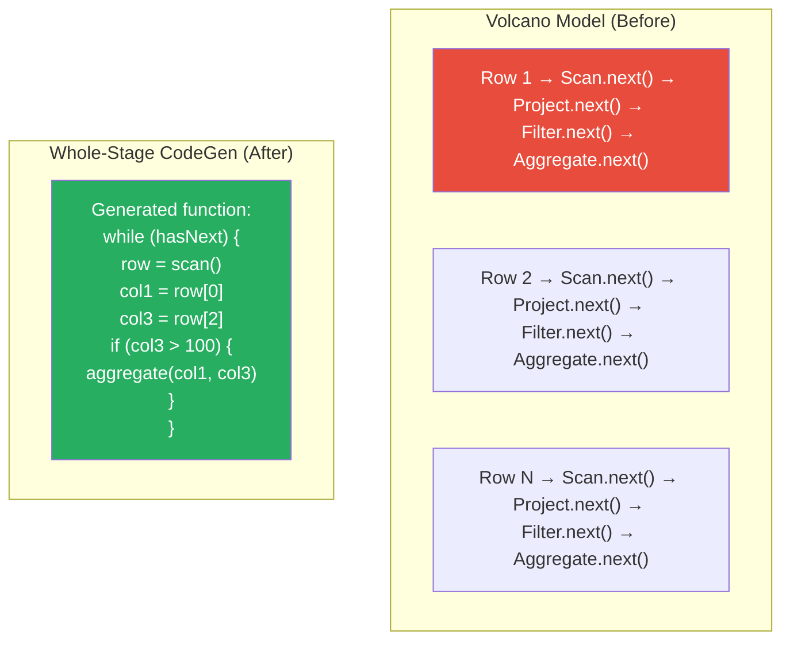

### What The Generated Code Looks Like

For this query:
```python
df = spark.read.parquet("/data/sales")
result = df.filter(col("amount") > 100).select("region", "amount").groupBy("region").sum("amount")
```

Spark generates something like (simplified):

```java
// Generated by Whole-Stage CodeGen
public class GeneratedIterator extends BufferedRowIterator {
    private UnsafeRow result = new UnsafeRow(2);
    private BufferHolder holder = new BufferHolder(result, 32);
    
    protected void processNext() throws IOException {
        while (scan_input.hasNext()) {
            InternalRow scan_row = (InternalRow) scan_input.next();
            
            // Column pruning: only read columns 1 (region) and 3 (amount)
            boolean scan_isNull_1 = scan_row.isNullAt(1);
            UTF8String scan_value_1 = scan_isNull_1 ? null : scan_row.getUTF8String(1);
            double scan_value_3 = scan_row.getDouble(3);
            
            // Fused filter: amount > 100
            if (!scan_row.isNullAt(3) && scan_value_3 > 100.0) {
                // Fused aggregation: sum by region
                agg_hashMap.findOrInsert(scan_value_1);
                agg_buffer.update(0, agg_buffer.getDouble(0) + scan_value_3);
            }
        }
    }
}
```

Key observations:
- **No virtual method calls** — everything is inlined
- **No object creation** — values read directly from UnsafeRow
- **Single loop** — scan, filter, project, aggregate all fused
- **Primitive types** — `double` not `Double`, avoids boxing
- **Direct field access** — no hash map lookups for column names

---

## How to See Generated Code

### Method 1: explain("codegen")

```python
df = spark.read.parquet("/data/sales")
result = df.filter(col("amount") > 100).groupBy("region").sum("amount")
result.explain("codegen")
```

### Method 2: Debug Configuration

```python
# Print generated code to logs
spark.conf.set("spark.sql.codegen.comments", "true")

# See the generated code via Spark UI → SQL tab → click on query → Details
```

### Method 3: queryExecution API

```python
# Access the generated code programmatically
print(result.queryExecution.debug.codegen())
```

### Reading the Generated Code

```
Found 2 WholeStageCodegen subtrees.
== Subtree 1 / 2 (maxMethodCodeSize: 204; maxConstantPoolSize: 150) ==
*(1) HashAggregate(keys=[region#5], functions=[partial_sum(amount#8)])
+- *(1) Filter (isnotnull(amount#8) AND (amount#8 > 100.0))
   +- *(1) ColumnarToRow
      +- FileScan parquet [region#5,amount#8]

Generated code:
/* 001 */ public Object generate(Object[] references) {
/* 002 */   return new GeneratedIteratorForCodegenStage1(references);
/* 003 */ }
...
```

The `*(1)` annotation in the physical plan indicates which operators are fused into the same codegen stage.

---

## When CodeGen Kicks In (and When It Doesn't)

### When CodeGen IS Used ✅

| Operation | CodeGen? |
|-----------|----------|
| `Filter` | ✅ Yes |
| `Project` (select) | ✅ Yes |
| `HashAggregate` | ✅ Yes |
| `SortMergeJoin` | ✅ Yes |
| `BroadcastHashJoin` | ✅ Yes |
| `Sort` | ✅ Yes |
| `Range` | ✅ Yes |
| `ColumnarToRow` | ✅ Yes |

### When CodeGen is NOT Used ❌

| Operation | CodeGen? | Why |
|-----------|----------|-----|
| `Exchange` (Shuffle) | ❌ No | Network boundary, can't fuse across shuffles |
| `BroadcastExchange` | ❌ No | Network boundary |
| Python UDFs | ❌ No | Runs in Python process, not JVM |
| Hive UDFs | ❌ No | Legacy compatibility |
| Very complex expressions | ❌ Falls back | Generated code exceeds JVM method size limit |

### CodeGen Configuration

```python
# Enable/disable whole-stage codegen (enabled by default)
spark.conf.set("spark.sql.codegen.wholeStage", "true")

# Maximum code size before falling back to interpreted mode
spark.conf.set("spark.sql.codegen.maxFields", "100")
# If a query touches > 100 fields, codegen is disabled (too much code)

# Maximum bytes for generated method
spark.conf.set("spark.sql.codegen.hugeMethodLimit", "65536")  # 64KB
# JVM has a 64KB method size limit. If generated code exceeds this,
# Spark splits it or falls back to interpreted mode.

# Enable codegen comments for debugging
spark.conf.set("spark.sql.codegen.comments", "true")
```

### Detecting CodeGen in Plans

```python
# In explain() output:
# *(1) Filter ...    ← The * means whole-stage codegen is active
#  (1) Filter ...    ← No * means codegen is NOT active for this operator

# Example with mixed codegen:
df.explain()
# *(2) HashAggregate(keys=[region], functions=[sum(amount)])    ← CodeGen ✅
# +- Exchange hashpartitioning(region, 200)                      ← No CodeGen (shuffle)
#    +- *(1) HashAggregate(keys=[region], functions=[partial_sum(amount)])  ← CodeGen ✅
#       +- *(1) Filter (amount > 100)                            ← CodeGen ✅ (same stage)
#          +- *(1) FileScan parquet                               ← CodeGen ✅ (same stage)
```

---

## CollapseCodegenStages

`CollapseCodegenStages` is the physical planning rule that groups operators into codegen stages. It walks the physical plan tree and groups consecutive operators that support codegen into **WholeStageCodegen** nodes.

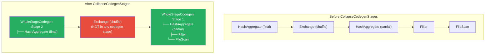

**Rules for stage boundaries:**
1. **Shuffle (Exchange)** always breaks codegen stages
2. **Broadcast Exchange** always breaks codegen stages
3. **Operators that don't support codegen** break stages
4. **Too many fields** (> `maxFields`) break stages
5. **Too much generated code** (> `hugeMethodLimit`) break stages

---

## Performance Impact — Benchmarks

### TPC-DS Benchmark Results

| Metric | Without Tungsten | With Tungsten | Improvement |
|--------|-----------------|---------------|-------------|
| Query Latency | Baseline | 2-10x faster | Significant |
| Memory Usage | Baseline | 3-5x less | Major |
| GC Time | 30-50% of job | < 5% of job | Dramatic |
| Serialization | Major bottleneck | Nearly eliminated | Massive |
| Sort Performance | Baseline | 3x faster | Significant |
| CPU Utilization | 30-50% | 70-90% | Major |

### Why the Improvement is So Dramatic

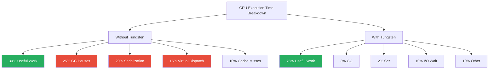

---

## Production Scenarios

### Scenario 1: Reducing GC Pauses at a Financial Services Company

```python
# Problem: Spark job processing 500M transaction records
# Symptom: GC pauses of 45 seconds, job timing out after 2 hours
# Root cause: All data stored as Java objects on-heap

# Before: Default settings
spark.conf.set("spark.executor.memory", "16g")
# GC logs showed: Full GC pauses every 30 seconds, 15-45 seconds each
# Total GC time: 40% of job time

# After: Enable off-heap + optimize
spark.conf.set("spark.memory.offHeap.enabled", "true")
spark.conf.set("spark.memory.offHeap.size", "8g")
spark.conf.set("spark.executor.memory", "8g")  # Reduced on-heap

# Result: GC pauses < 1 second, job completed in 25 minutes
# The key: Tungsten stores data off-heap in binary format
# GC only scans Java objects, not Tungsten's binary data
```

### Scenario 2: Debugging Missing CodeGen

```python
# Problem: Query is 5x slower than expected
# Step 1: Check the execution plan
slow_query.explain("formatted")

# Found: No *(N) markers — whole-stage codegen not active!
# Root cause: Query had 150 columns, exceeding maxFields (100)

# Fix: Increase maxFields
spark.conf.set("spark.sql.codegen.maxFields", "200")

# Alternative fix: Select only needed columns BEFORE processing
optimized = (
    large_df
    .select("col1", "col2", "col3", "col4", "col5")  # Only 5 columns
    .filter(col("col1") > 100)
    .groupBy("col2")
    .sum("col3")
)
# Now codegen is active ✓
```

### Scenario 3: E-commerce — Wide Table Performance

```python
# Problem: Product catalog with 200 columns, queries are slow
# The wide table defeats codegen (too many fields)

# Solution 1: Column pruning — select early
result = (
    wide_catalog
    .select("product_id", "name", "price", "category")  # 4 of 200 columns
    .filter(col("category") == "Electronics")
    .filter(col("price") > 0)
)
# Codegen active ✅, reads only 4 columns from Parquet ✅

# Solution 2: Restructure storage
# Split wide table into core + extension tables
# Core: frequently queried columns (20 cols)
# Extension: rarely queried columns (180 cols)
# Join only when needed
```

---

## Troubleshooting Tungsten

### Problem: High GC Overhead Despite Tungsten

**Symptoms:** Spark UI shows > 10% GC time

**Diagnosis:**
```python
# Check if off-heap is enabled
print(spark.conf.get("spark.memory.offHeap.enabled", "false"))

# Check if you're using RDDs (bypass Tungsten)
# RDDs store data as Java objects — full GC impact
# DataFrames use Tungsten binary format — minimal GC

# Check for UDF objects
# Python UDFs create Java objects for serialization
```

**Fixes:**
```python
# 1. Enable off-heap memory
spark.conf.set("spark.memory.offHeap.enabled", "true")
spark.conf.set("spark.memory.offHeap.size", "4g")

# 2. Replace RDDs with DataFrames
# ❌ rdd.map(lambda x: x[0] + x[1])
# ✅ df.withColumn("sum", col("a") + col("b"))

# 3. Replace Python UDFs with built-in functions
# ❌ @udf("double") def calc(x): return x * 1.1
# ✅ df.withColumn("result", col("x") * 1.1)

# 4. Use G1GC for better pause times
# --conf spark.executor.extraJavaOptions="-XX:+UseG1GC -XX:G1HeapRegionSize=16m"
```

### Problem: Codegen Disabled (No * in Plan)

**Symptoms:** Physical plan shows no `*(N)` markers

**Diagnosis:**
```python
# Check codegen setting
print(spark.conf.get("spark.sql.codegen.wholeStage"))  # Should be "true"

# Check number of fields
print(len(df.columns))  # If > 100, codegen disabled
print(spark.conf.get("spark.sql.codegen.maxFields"))

# Check for codegen fallback in logs
# Look for: "Found too long generated codes"
```

**Fixes:**
```python
# Increase field limit if needed
spark.conf.set("spark.sql.codegen.maxFields", "200")

# Or better: reduce columns early in the pipeline
df = df.select(*needed_columns)  # Column pruning
```

### Problem: OOM in Tungsten Sort

**Symptoms:** `OutOfMemoryError` during sort operations

**Diagnosis:**
```python
# Tungsten sort spills to disk when memory is low
# If disk is also full, OOM occurs

# Check Spark UI → Stages → Shuffle Spill (Memory) and Shuffle Spill (Disk)
```

**Fixes:**
```python
# Increase memory for sort
spark.conf.set("spark.executor.memory", "16g")

# Increase number of partitions (less data per partition = less sort memory)
spark.conf.set("spark.sql.shuffle.partitions", "400")

# Ensure temp directory has space for spill
spark.conf.set("spark.local.dir", "/large-ssd/spark-temp")
```

---

## Performance Considerations

### Do's

```python
# ✅ Use DataFrames/SQL (Tungsten optimized)
df = spark.read.parquet("/data/sales")
result = df.groupBy("region").sum("amount")

# ✅ Use built-in functions (codegen compatible)
from pyspark.sql.functions import upper, col, when
df.withColumn("name_upper", upper(col("name")))

# ✅ Select only needed columns early
df.select("id", "name", "amount").filter(...)

# ✅ Use columnar formats (Parquet, ORC)
spark.read.parquet("/data/sales")

# ✅ Enable off-heap for large datasets
spark.conf.set("spark.memory.offHeap.enabled", "true")
```

### Don'ts

```python
# ❌ Use RDDs when DataFrames work (bypasses Tungsten)
rdd = sc.textFile("/data/sales.csv").map(lambda line: line.split(","))

# ❌ Use Python UDFs when built-in functions exist
@udf("string")
def my_upper(s):
    return s.upper() if s else None

# ❌ Collect large datasets to driver
df.collect()  # All data converted to Python objects — no Tungsten!

# ❌ Use row-based formats for analytical queries
spark.read.csv("/data/sales.csv")  # Can't do column pruning at file level

# ❌ Create complex nested types unnecessarily
# Deeply nested structs/arrays reduce codegen effectiveness
```

---

## Common Mistakes

### Mistake 1: Using RDDs for DataFrame-Compatible Work

```python
# ❌ This bypasses ALL of Tungsten
rdd = sc.parallelize([(1, "Alice", 100.0), (2, "Bob", 200.0)])
result = rdd.filter(lambda x: x[2] > 150).map(lambda x: (x[1], x[2]))

# ✅ This uses Tungsten fully
from pyspark.sql import Row
df = spark.createDataFrame([(1, "Alice", 100.0), (2, "Bob", 200.0)],
                           ["id", "name", "amount"])
result = df.filter(col("amount") > 150).select("name", "amount")
```

### Mistake 2: Thinking Off-Heap Is Always Better

```python
# Off-heap is great for reducing GC but:
# - It's not managed by GC, so memory leaks are possible
# - It requires careful sizing — too small = spilling, too large = wastes system memory
# - Native memory errors are harder to debug than Java OOM

# ✅ Start with on-heap, switch to off-heap if GC is a problem
# Measure GC time first (Spark UI → Executors tab)
```

### Mistake 3: Ignoring Codegen Fallback

```python
# If you see no *(N) in your plan, performance suffers significantly
# Common causes:
# 1. Too many columns (> maxFields)
# 2. Very complex expressions
# 3. Certain operator types

# Check with:
df.explain("codegen")
# If you see: "/* 001 */ -- code too large to display", 
# the generated code exceeded limits
```

### Mistake 4: Assuming Tungsten Fixes Everything

```python
# Tungsten optimizes HOW data is processed, not WHAT is processed
# It can't fix:
# - Bad join strategies (use Catalyst + AQE for that)
# - Data skew (need repartitioning or salting)
# - Wrong cluster sizing (need more executors or memory)
# - Poor partitioning (need explicit repartition strategy)

# Tungsten makes your plan run 10x faster
# But a bad plan run 10x faster is still a bad plan
```

### Mistake 5: Using .collect() on Large Data

```python
# ❌ This converts ALL data from Tungsten binary to Python objects
# Losing all Tungsten benefits and potentially crashing the driver
data = df.collect()  # 10GB of data → Python objects → Driver OOM

# ✅ Process in Spark, only collect small results
summary = df.groupBy("region").sum("amount").collect()  # Small result set
```

---

## Interview Questions

### Beginner Level

**Q1: What is Project Tungsten in Apache Spark?**

> **A:** Project Tungsten is a set of low-level optimizations in Spark that significantly improve memory and CPU efficiency. It has three main pillars: (1) Memory Management — using off-heap memory and binary data format (UnsafeRow) to bypass JVM overhead, (2) Cache-Aware Computation — organizing data for CPU cache efficiency, and (3) Whole-Stage Code Generation — fusing multiple operators into single optimized functions. Together, these make Spark 10-100x faster than naive JVM-based processing.

**Q2: What is UnsafeRow?**

> **A:** UnsafeRow is Tungsten's binary row format that stores an entire row as a contiguous byte array instead of separate Java objects. It has three sections: a null bitmap (tracking which columns are null), fixed-length values (8 bytes per field), and variable-length data (strings, arrays). This eliminates Java object overhead (~80% memory savings), avoids GC for row data, removes the need for serialization, and enables cache-friendly sequential memory access.

**Q3: What is the difference between on-heap and off-heap memory in Spark?**

> **A:** On-heap memory is managed by the JVM's Garbage Collector — it's subject to GC pauses and has Java object overhead. Off-heap memory is allocated directly from the OS via `sun.misc.Unsafe`, bypassing the GC entirely. Tungsten uses off-heap memory to store data in binary format without GC involvement. Off-heap is configured via `spark.memory.offHeap.enabled=true` and `spark.memory.offHeap.size`. It's particularly beneficial for workloads with large data volumes where GC pauses would be problematic.

### Intermediate Level

**Q4: What is Whole-Stage Code Generation and how does it improve performance?**

> **A:** Whole-Stage Code Generation (WSCG) replaces the Volcano/Iterator model (where each operator calls `next()` on its child for every row) with a single generated Java method that fuses multiple operators together. For example, a Scan→Filter→Project→Aggregate pipeline becomes a single `while` loop that reads data, applies the filter, extracts needed columns, and updates aggregation buffers — all without virtual method dispatch, object creation, or operator boundary overhead. This eliminates billions of virtual method calls and improves CPU instruction cache usage. It's indicated by `*(N)` markers in the physical plan.

**Q5: How does Tungsten Sort differ from a standard sort?**

> **A:** Tungsten Sort separates sort keys from data. It creates a compact array of (key-prefix, pointer) pairs where the key prefix is the first 4-8 bytes of the sort key and the pointer references the full record. The sort operates on this compact array, which fits in CPU cache. Most comparisons are resolved by the prefix alone without accessing the full records. Only when prefixes are equal does it fall back to comparing full records. This results in 3x+ better sort performance due to dramatically fewer cache misses.

**Q6: Why do Python UDFs not benefit from Tungsten?**

> **A:** Python UDFs require data to be serialized from Tungsten's binary format to Python-compatible format, sent to a Python process via a socket, deserialized, processed, re-serialized, sent back to the JVM, and deserialized again. This completely bypasses Tungsten's benefits: the data leaves binary format, crosses process boundaries, and requires double serialization. Additionally, Python UDFs break Whole-Stage Code Generation — the codegen stage must stop at the UDF boundary. Pandas UDFs (vectorized UDFs) mitigate this somewhat by transferring data in Arrow columnar batches, reducing serialization overhead.

### Advanced Level

**Q7: How does Tungsten's memory management interact with Spark's unified memory model?**

> **A:** Tungsten's memory management operates within the Unified Memory Manager's framework. Execution memory (used for shuffles, sorts, joins) and storage memory (used for cached data) can borrow from each other. Tungsten manages the actual byte-level allocation within these regions using a page-based allocator. Each page is typically 64MB of contiguous memory. When off-heap is enabled, Tungsten allocates pages directly from the OS via `Unsafe.allocateMemory()`. The Memory Manager tracks usage per task and handles spilling — when a task needs more memory than available, Tungsten spills sort buffers or hash tables to disk. This is all transparent to the user and operates on binary data, not Java objects.

**Q8: What happens when Whole-Stage CodeGen fails or is disabled?**

> **A:** When codegen fails (code too large, too many fields, unsupported operators), Spark falls back to the **interpreted Volcano model**. Specifically: (1) If the generated method exceeds `spark.sql.codegen.hugeMethodLimit` (64KB default, matching JVM's method size limit), Spark splits the code or falls back. (2) If there are more columns than `spark.sql.codegen.maxFields` (100 default), codegen is disabled for that stage. (3) Operators that don't support codegen (e.g., `Exchange`, Python UDFs) always break the codegen pipeline. The fallback uses `RowIterator` with `next()` calls — correct but ~2-10x slower. You can detect this by absence of `*` in the physical plan and monitor it via the `spark.sql.codegen.fallback` metric.

**Q9: How would you diagnose and fix a Spark job where Tungsten benefits aren't being realized?**

> **A:** Diagnostic steps:
> 1. **Check plan for codegen markers:** `df.explain("formatted")` — look for `*(N)`. No asterisks = no codegen.
> 2. **Check GC metrics:** Spark UI → Executors tab. If GC time > 10%, data might be on-heap as Java objects (RDDs or collected data).
> 3. **Check for RDD usage:** Search code for `.rdd`, `.map()`, `.flatMap()` on DataFrames. These escape Tungsten.
> 4. **Check for Python UDFs:** Each Python UDF breaks the Tungsten pipeline.
> 5. **Check column count:** `len(df.columns)` — if > 100, codegen is disabled.
> 
> Fixes:
> - Replace RDD operations with DataFrame operations
> - Replace Python UDFs with built-in functions or Pandas UDFs
> - Enable off-heap memory for large datasets
> - Add early column selection (`df.select(needed_cols)`)
> - Increase `maxFields` if you truly need many columns
> - Use Parquet/ORC (not CSV/JSON) for columnar benefits

**Q10: Compare Tungsten's approach to memory management with how traditional databases handle the same problem.**

> **A:** Traditional databases (PostgreSQL, Oracle) also bypass their runtime's memory management by implementing their own buffer pools with fixed-size pages (typically 8KB-16KB). Tungsten follows the same philosophy applied to the JVM context:
>
> | Aspect | Database Buffer Pool | Tungsten |
> |--------|---------------------|----------|
> | Page size | 8-16KB fixed | ~64MB configurable |
> | Allocation | Direct from OS | `Unsafe.allocateMemory()` or on-heap byte arrays |
> | Eviction | LRU/Clock | Spill to disk (execution) or drop (storage) |
> | Data format | Tuple format with slot array | UnsafeRow with null bitmap |
> | GC concern | N/A (C/C++) | Off-heap avoids GC |
> | Code generation | Rarely (some use JIT for queries) | Always (Whole-Stage CodeGen) |
>
> Tungsten's unique contribution is combining binary data management with JIT code generation for the JVM, achieving near-native performance while keeping the benefits of the Java ecosystem (portability, libraries, tooling).

---

## Summary

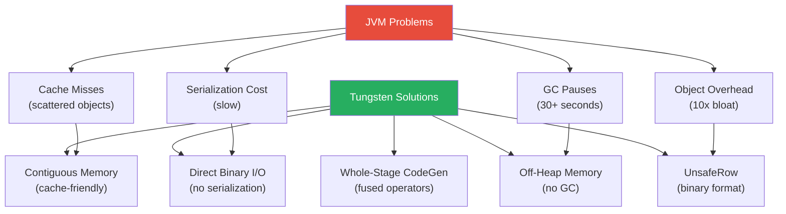

| Component | Problem Solved | Technique | Impact |
|-----------|---------------|-----------|--------|
| UnsafeRow | Object overhead | Binary row format | 3-5x memory reduction |
| Off-Heap | GC pauses | `sun.misc.Unsafe` allocation | GC time: 30% → 3% |
| Tungsten Sort | Cache misses | Key-prefix + pointer sorting | 3x sort speedup |
| Whole-Stage CodeGen | Virtual dispatch overhead | Fuse operators into single loop | 2-10x CPU improvement |
| Binary I/O | Serialization cost | Data already in binary format | Near-zero ser/deser |

---

**[← Previous: 06-catalyst-optimizer.md](06-catalyst-optimizer.md) | [Home](../README.md) | [Next →: 08-partitions.md](08-partitions.md)**
