# ⚡ Chapter 8: Partitions — How Spark Divides and Conquers Data

> **"Partitioning is the single most important factor in Spark performance. Get it wrong, and no amount of tuning will save you."**

---

## 📋 Table of Contents

1. [Intuition — Why Partitions Exist](#intuition--why-partitions-exist)
2. [Real-World Analogy — Boxes in a Warehouse](#real-world-analogy--boxes-in-a-warehouse)
3. [What Is a Partition?](#what-is-a-partition)
4. [Default Partitioning Behavior](#default-partitioning-behavior)
5. [Hash Partitioning vs Range Partitioning](#hash-partitioning-vs-range-partitioning)
6. [repartition() vs coalesce()](#repartition-vs-coalesce)
7. [Partition Pruning](#partition-pruning)
8. [Data Skew in Partitions](#data-skew-in-partitions)
9. [Optimal Partition Size — The 128MB Rule](#optimal-partition-size--the-128mb-rule)
10. [Partition-Level Operations](#partition-level-operations)
11. [File-Based Partitioning (Hive-Style)](#file-based-partitioning-hive-style)
12. [Bucketing](#bucketing)
13. [How to Check Partition Distribution](#how-to-check-partition-distribution)
14. [Production Scenarios](#production-scenarios)
15. [Troubleshooting Uneven Partitions](#troubleshooting-uneven-partitions)
16. [Performance Considerations](#performance-considerations)
17. [Common Mistakes](#common-mistakes)
18. [Interview Questions](#interview-questions)

---

## Intuition — Why Partitions Exist

Spark processes data in parallel across a cluster of machines. But how does a single dataset get divided across multiple workers? The answer is **partitions**.

Think about it: if you have 1TB of data and 100 CPU cores, you need to split that 1TB into chunks that can be processed independently by each core. That's what partitions do.

Every dataset in Spark — whether an RDD, DataFrame, or Dataset — is divided into partitions. Each partition is:
- **A chunk of data** small enough to fit in one executor's memory
- **Processed by exactly one task** on one CPU core
- **Independent** — tasks on different partitions don't need to communicate (for most operations)

> **💡 Key Insight:** The number of partitions equals the number of parallel tasks. 100 partitions = up to 100 tasks running simultaneously (if you have 100 cores). Too few partitions → cores sit idle. Too many partitions → scheduling overhead kills performance.

---

## Real-World Analogy — Boxes in a Warehouse

Imagine you're running an e-commerce fulfillment warehouse. Orders come in and need to be packed and shipped. You have 50 workers (CPU cores) and orders (data) to process.

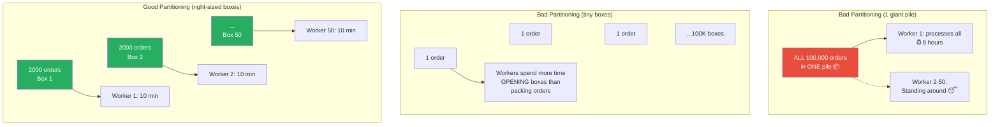

**The lessons:**
1. **Too few partitions** = workers sit idle (under-parallelism)
2. **Too many partitions** = overhead of managing tiny tasks exceeds the work itself
3. **Uneven partitions** = one worker finishes late while others wait (data skew)
4. **Right-sized partitions** = maximum throughput, minimum overhead

---

## What Is a Partition?

A partition is **a logical chunk of data** that is the unit of parallelism in Spark. Every RDD, DataFrame, and Dataset is divided into partitions.

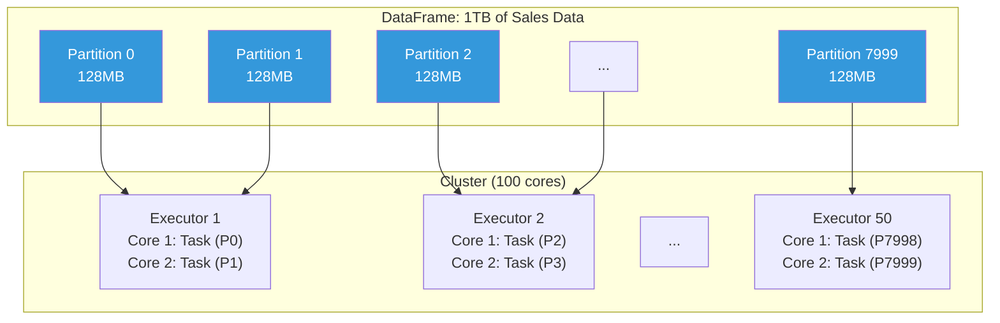

### Key Properties of Partitions

| Property | Description |
|----------|-------------|
| **Logical, not physical** | A partition is a concept — it may or may not map to a physical file |
| **Unit of parallelism** | One partition = one task = one core |
| **In-memory** | Partitions are processed in memory (with disk spill if needed) |
| **Independent** | For narrow transformations, partitions are processed independently |
| **Mutable count** | You can change the number of partitions via repartition/coalesce |

### Checking the Number of Partitions

```python
# Check partition count
df = spark.read.parquet("/data/sales")
print(f"Number of partitions: {df.rdd.getNumPartitions()}")

# Alternative for DataFrames (Spark 3.x)
print(f"Number of partitions: {df.rdd.getNumPartitions()}")

# Check partition sizes
from pyspark.sql.functions import spark_partition_id, count

df.withColumn("partition_id", spark_partition_id()) \
  .groupBy("partition_id") \
  .agg(count("*").alias("row_count")) \
  .orderBy("partition_id") \
  .show()
```

---

## Default Partitioning Behavior

### When Reading Files

Spark determines the number of partitions based on the data source:

```python
# Parquet/ORC: One partition per file (roughly)
# Actual behavior: depends on file sizes and spark.sql.files.maxPartitionBytes
df = spark.read.parquet("/data/sales/")
# If directory has 100 parquet files of 128MB each → ~100 partitions

# CSV/JSON: Based on HDFS block size (default 128MB)
df = spark.read.csv("/data/sales.csv")
# 1GB CSV file → ~8 partitions (1GB / 128MB)

# JDBC: Single partition by default (terrible!)
df = spark.read.jdbc(url, "table", properties)
# 1 partition → 1 task → no parallelism
```

### Key Configuration Parameters

```python
# Controls max partition size when reading files
spark.conf.set("spark.sql.files.maxPartitionBytes", "128m")  # Default: 128MB
# Files larger than this are split into multiple partitions
# Files smaller than this may be combined into one partition

# Controls number of partitions after a shuffle
spark.conf.set("spark.sql.shuffle.partitions", "200")  # Default: 200
# Used by: groupBy, join, distinct, repartition, window functions
# THIS IS THE MOST COMMONLY TUNED SETTING IN SPARK

# Controls parallelism for RDD operations
spark.conf.set("spark.default.parallelism", "200")
# Used by: sc.parallelize(), RDD transformations
# For DataFrames, spark.sql.shuffle.partitions takes precedence
```

### The Problem with Default shuffle.partitions = 200

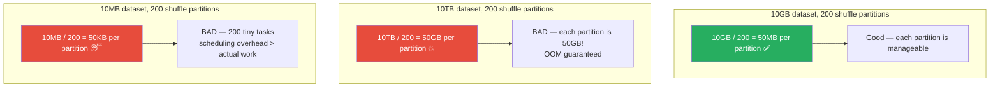

> **⚠️ Warning:** `spark.sql.shuffle.partitions = 200` is a default that's **almost never correct for production**. Always calculate the right value based on your data size. With AQE enabled (Spark 3.2+), this matters less because AQE coalesces small partitions automatically.

---

## Hash Partitioning vs Range Partitioning

### Hash Partitioning

**How it works:** `partition_id = hash(key) % num_partitions`

Each record is assigned to a partition by hashing its key. Records with the same key always land in the same partition.

```python
# Hash partitioning by a column
df.repartition(10, "user_id")  # 10 partitions, hashed by user_id

# All records with the same user_id go to the same partition
# Useful for: joins (co-located data), groupBy (pre-grouped data)
```

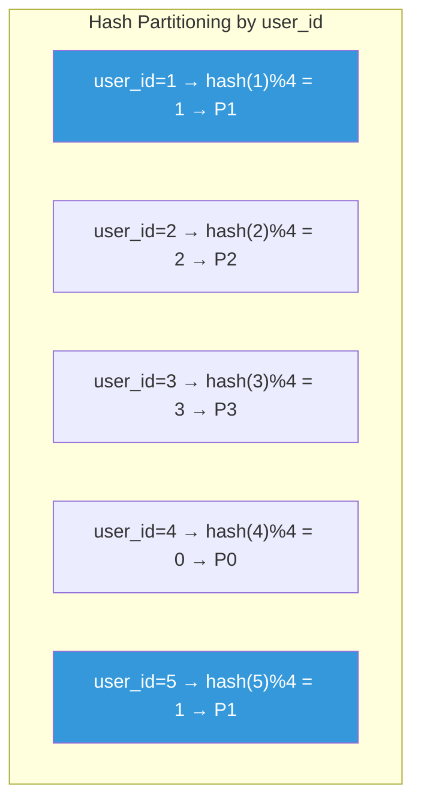

**Pros:**
- Guarantees records with same key are co-located
- Good for joins and aggregations
- Uniform distribution (usually)

**Cons:**
- **Skew risk:** If one key has many records, its partition is huge
- **Not sorted:** Data within partitions is unordered
- **Full shuffle required:** All data must be redistributed

### Range Partitioning

**How it works:** Data is divided by value ranges. Records are sorted into contiguous ranges.

```python
# Range partitioning by a column
df.repartitionByRange(10, "timestamp")
# Records sorted by timestamp, divided into 10 contiguous ranges

# Partition 0: timestamps 2024-01-01 to 2024-02-15
# Partition 1: timestamps 2024-02-16 to 2024-03-31
# ...etc
```

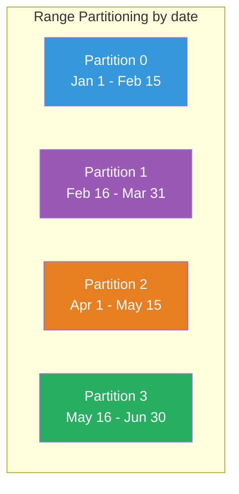

**Pros:**
- Data is sorted within and across partitions
- Excellent for range queries (`WHERE date BETWEEN ...`)
- Better for subsequent sort operations

**Cons:**
- Requires sampling to determine range boundaries
- Can be skewed if data distribution is uneven
- More expensive than hash partitioning

### When to Use Which

| Use Case | Best Partitioning | Why |
|----------|-------------------|-----|
| Joining two tables by key | Hash | Co-locates matching keys |
| GroupBy aggregation | Hash | Groups same keys together |
| Time-series queries | Range | Enables range pruning |
| Sort operations | Range | Data is pre-sorted |
| Writing partitioned files | Hash by partition key | One file per partition value |
| Generic redistribution | Hash (default) | Even distribution |

---

## repartition() vs coalesce()

This is one of the most important distinctions in Spark. Both change the number of partitions, but they work **very differently**.

### repartition(n)

- **Full shuffle** — all data is redistributed across the network
- Can **increase or decrease** partition count
- Produces **evenly distributed** partitions
- Can partition **by specific columns** (hash partitioning)

```python
# Repartition to 100 partitions (full shuffle)
df.repartition(100)

# Repartition by column (hash partitioning)
df.repartition(100, "user_id")  # Useful before joins

# Repartition by range (sorted partitions)
df.repartitionByRange(100, "timestamp")
```

### coalesce(n)

- **No shuffle** (narrow transformation) — only merges partitions
- Can only **decrease** partition count
- May produce **unevenly distributed** partitions
- **Much faster** than repartition for reducing partitions

```python
# Reduce from 200 to 10 partitions (NO shuffle)
df.coalesce(10)

# Typical use: reduce partitions before writing files
df.filter(col("year") == 2024) \
  .coalesce(5) \
  .write.parquet("/output/filtered_sales")
# Produces exactly 5 output files
```

### Visual Comparison

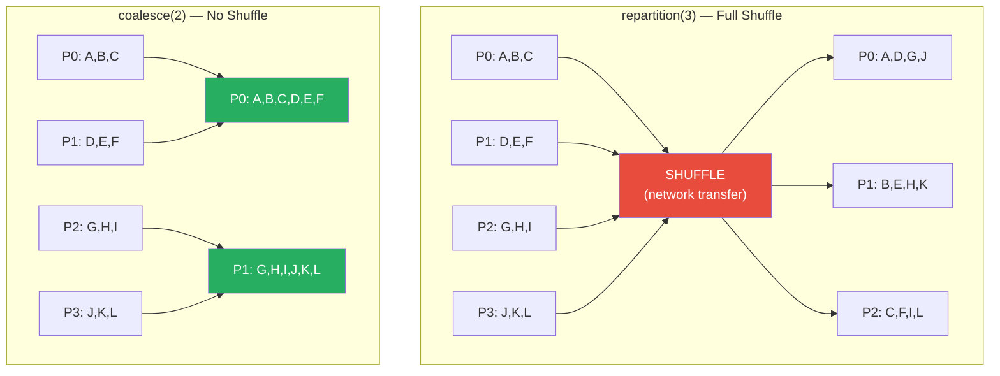

### When to Use Which

| Scenario | Use | Why |
|----------|-----|-----|
| Reducing partitions (e.g., 200 → 10) | `coalesce(10)` | No shuffle, fast |
| Increasing partitions (e.g., 10 → 200) | `repartition(200)` | coalesce can't increase |
| Need even distribution | `repartition(n)` | coalesce can be uneven |
| Partitioning by key before join | `repartition(n, "key")` | Hash partitioning |
| Writing fewer output files | `coalesce(n)` | Simple reduction |
| Fixing skew in partitions | `repartition(n)` | Redistributes evenly |

> **💡 Key Insight:** When reducing partitions, **always prefer coalesce() over repartition()** because coalesce avoids an expensive shuffle. The only exception is when you need evenly-sized partitions (coalesce can produce uneven partitions because it just merges adjacent partitions).

### The Gotcha: coalesce(1) vs repartition(1)

```python
# Both produce 1 partition, but:

# coalesce(1) — sends ALL data to ONE executor (no shuffle, but creates a bottleneck)
# One executor must have enough memory for all data
df.coalesce(1).write.parquet("/output/single_file")

# repartition(1) — shuffles ALL data through the network to ONE executor
# Even worse: network transfer + single executor bottleneck
df.repartition(1).write.parquet("/output/single_file")

# ✅ Better approach for single file output:
# Process with many partitions, then coalesce only for the write
df.filter(col("year") == 2024) \
  .groupBy("region").sum("amount") \    # Process in parallel
  .coalesce(1) \                         # Merge only the small result
  .write.parquet("/output/summary")
```

---

## Partition Pruning

Partition pruning allows Spark to **skip reading entire partitions** when they can't contain matching data. This is one of the most powerful optimizations for large datasets.

### File-Level Partition Pruning

When data is stored in Hive-style partitioned directories:

```
/data/sales/
├── year=2022/
│   ├── month=01/
│   │   ├── part-00000.parquet
│   │   └── part-00001.parquet
│   └── month=02/
│       └── part-00000.parquet
├── year=2023/
│   └── ...
└── year=2024/
    └── month=01/
        └── part-00000.parquet
```

```python
# This query only reads year=2024 directory
# All other year directories are SKIPPED (not even opened)
df = spark.read.parquet("/data/sales/")
result = df.filter(col("year") == 2024)

# Check partition pruning in the physical plan:
result.explain()
# PartitionFilters: [isnotnull(year#5), (year#5 = 2024)]
# This means partition pruning is active!
```

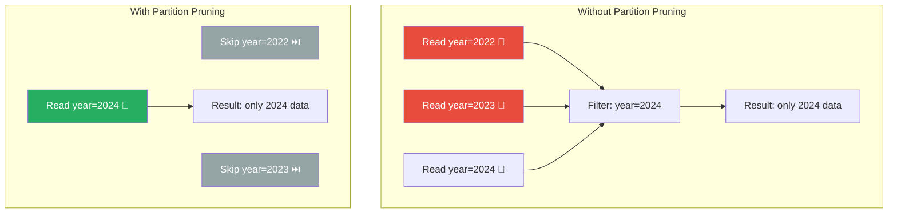

### Dynamic Partition Pruning (DPP)

Introduced in Spark 3.0, DPP enables partition pruning based on the results of another query (typically a join filter).

```python
# Scenario: Join sales with a small filtered table
products = spark.read.parquet("/data/products") \
    .filter(col("category") == "Electronics")  # Returns product_ids: [101, 205, 307]

sales = spark.read.parquet("/data/sales")  # Partitioned by product_id

# Without DPP: Reads ALL sales partitions, joins, then filters
# With DPP: First gets product_ids from filter, then reads ONLY matching sales partitions

result = sales.join(products, "product_id")
```

```python
# Enable DPP (default in Spark 3.0+)
spark.conf.set("spark.sql.optimizer.dynamicPartitionPruning.enabled", "true")
```

---

## Data Skew in Partitions

Data skew is the **#1 performance killer** in Spark. It happens when some partitions have vastly more data than others.

### What Skew Looks Like

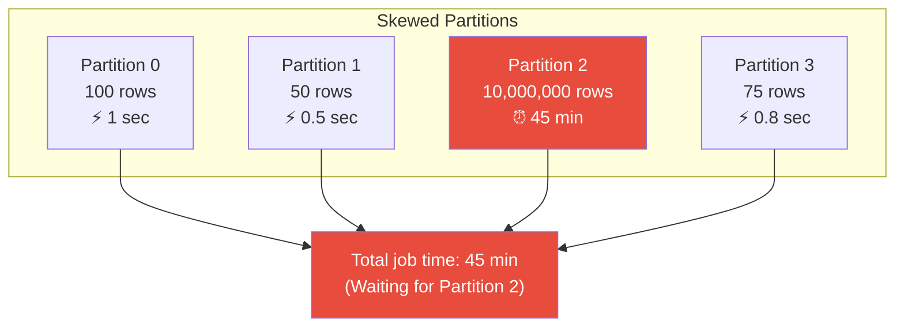

### Common Causes of Skew

| Cause | Example | Solution |
|-------|---------|----------|
| Hot keys | 50% of orders from NYC | Salt the key |
| Null values | Millions of null join keys | Filter nulls first |
| Natural distribution | Power-law data (Zipf) | Custom partitioning |
| Time-based skew | Holiday surge data | Repartition by time ranges |
| Join skew | One-to-many with millions | Broadcast the small side |

### Fixing Skew with Salting

```python
from pyspark.sql.functions import col, concat, lit, rand, floor

# Problem: groupBy("city") is skewed — NYC has 10M records, others have 1K
df.groupBy("city").agg(sum("amount"))  # NYC partition takes 45 minutes

# Solution: Salt the key
num_salts = 10  # Split NYC into 10 sub-partitions

# Step 1: Add a salt column
salted_df = df.withColumn("salt", floor(rand() * num_salts).cast("int"))
salted_df = salted_df.withColumn("salted_city", concat(col("city"), lit("_"), col("salt")))

# Step 2: Aggregate with salted key (distributes NYC across 10 partitions)
partial_result = salted_df.groupBy("salted_city").agg(sum("amount").alias("partial_sum"))

# Step 3: Remove salt and do final aggregation
from pyspark.sql.functions import split
final_result = (partial_result
    .withColumn("city", split(col("salted_city"), "_")[0])
    .groupBy("city")
    .agg(sum("partial_sum").alias("total_amount"))
)
```

### Fixing Skew with AQE

```python
# The easy way (Spark 3.0+) — let AQE handle it
spark.conf.set("spark.sql.adaptive.enabled", "true")
spark.conf.set("spark.sql.adaptive.skewJoin.enabled", "true")
spark.conf.set("spark.sql.adaptive.skewJoin.skewedPartitionFactor", "5")
spark.conf.set("spark.sql.adaptive.skewJoin.skewedPartitionThresholdInBytes", "256MB")

# AQE automatically detects and splits skewed partitions during joins
result = skewed_df.join(other_df, "key")  # AQE handles the skew
```

---

## Optimal Partition Size — The 128MB Rule

### The Golden Rule

> **Each partition should be approximately 128MB of compressed data (or 200MB-500MB uncompressed).**

### Why 128MB?

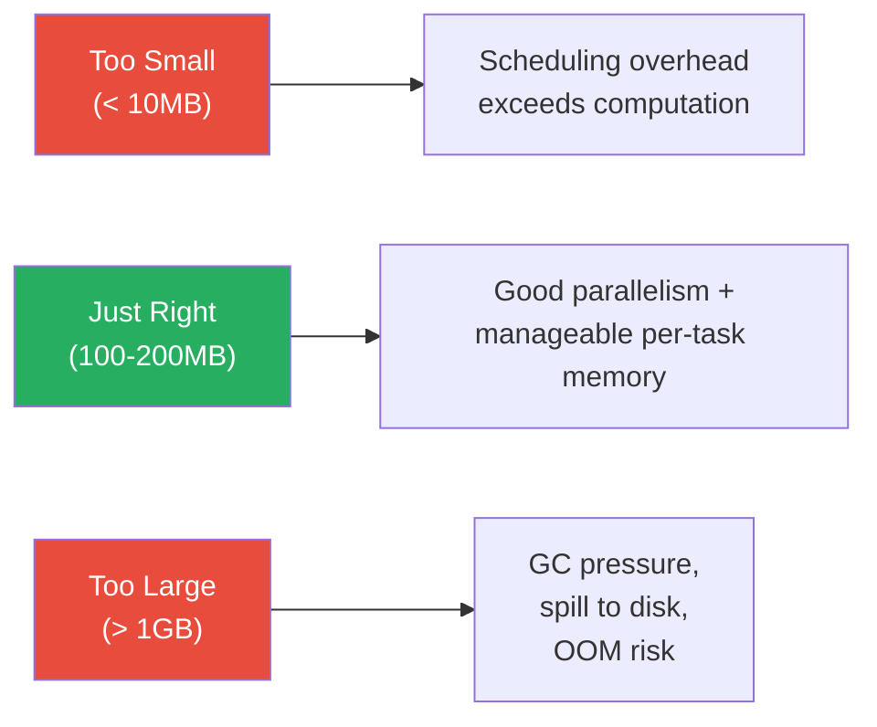

| Partition Size | Effect | Risk |
|---|---|---|
| < 10MB | Excessive task overhead, driver bottleneck | Slow due to scheduling |
| 10-50MB | Acceptable but not optimal | Slight under-utilization |
| **100-200MB** | **Optimal** | **Best parallelism/overhead ratio** |
| 200-500MB | Acceptable for large clusters | Memory pressure starts |
| 500MB-1GB | Dangerous zone | GC pauses, potential spilling |
| > 1GB | Very dangerous | OOM likely, long GC pauses |

### Calculating the Right Partition Count

```python
# Formula: num_partitions = total_data_size / target_partition_size

# Example 1: 100GB dataset, target 128MB partitions
num_partitions = (100 * 1024) / 128  # = 800 partitions

# Example 2: 10TB dataset, target 128MB partitions
num_partitions = (10 * 1024 * 1024) / 128  # = 81,920 partitions

# Example 3: 500MB dataset, target 128MB partitions
num_partitions = 500 / 128  # = ~4 partitions (minimum should be 2x cores)

# Also consider: num_partitions >= 2 * total_cores (for load balancing)
# With 100 cores → at least 200 partitions
```

```python
# Set optimal shuffle partitions based on data size
def calculate_shuffle_partitions(data_size_gb, target_mb=128):
    """Calculate optimal number of shuffle partitions."""
    num_partitions = int((data_size_gb * 1024) / target_mb)
    return max(num_partitions, 200)  # At least 200

# Usage
data_size_gb = 500  # 500GB after shuffle
optimal_partitions = calculate_shuffle_partitions(data_size_gb)
spark.conf.set("spark.sql.shuffle.partitions", str(optimal_partitions))
print(f"Set shuffle partitions to: {optimal_partitions}")
# Output: Set shuffle partitions to: 4000
```

---

## Partition-Level Operations

### mapPartitions() — Process Entire Partitions

Instead of processing one row at a time, `mapPartitions()` gives you an iterator over all rows in a partition. This is useful for:
- Database connections (one connection per partition, not per row)
- Machine learning model loading (load once per partition)
- Batch API calls

```python
# Example: Batch database writes
def write_partition_to_db(iterator):
    """Process an entire partition in one batch."""
    import psycopg2
    conn = psycopg2.connect("postgresql://...")  # One connection per partition
    cursor = conn.cursor()
    
    batch = []
    for row in iterator:
        batch.append((row.id, row.name, row.amount))
        if len(batch) >= 1000:
            cursor.executemany("INSERT INTO sales VALUES (%s, %s, %s)", batch)
            batch = []
    
    if batch:  # Remaining rows
        cursor.executemany("INSERT INTO sales VALUES (%s, %s, %s)", batch)
    
    conn.commit()
    conn.close()
    return iter([])  # mapPartitions must return an iterator

df.rdd.mapPartitions(write_partition_to_db).count()  # Triggers execution
```

### foreachPartition() — Side Effects Per Partition

```python
# Similar to mapPartitions but returns nothing
def send_partition_to_api(iterator):
    """Send each partition's data to an external API."""
    import requests
    session = requests.Session()  # One session per partition
    
    batch = []
    for row in iterator:
        batch.append(row.asDict())
        if len(batch) >= 100:
            session.post("https://api.example.com/batch", json=batch)
            batch = []
    
    if batch:
        session.post("https://api.example.com/batch", json=batch)

df.foreachPartition(send_partition_to_api)
```

### spark_partition_id() — Identify Partition Membership

```python
from pyspark.sql.functions import spark_partition_id

# Add partition ID to each row
df.withColumn("partition_id", spark_partition_id()).show()
# +---+------+------------+
# | id|  name|partition_id|
# +---+------+------------+
# |  1| Alice|           0|
# |  2|   Bob|           0|
# |  3|Charlie|          1|
# +---+------+------------+
```

---

## File-Based Partitioning (Hive-Style)

Hive-style partitioning organizes data into directories based on column values. This is the most important data organization strategy for data lakes.

### Writing Partitioned Data

```python
# Partition by year and month
df.write \
  .partitionBy("year", "month") \
  .parquet("/data/sales/")

# Creates directory structure:
# /data/sales/
# ├── year=2022/
# │   ├── month=01/
# │   │   └── part-00000.parquet
# │   ├── month=02/
# │   │   └── part-00000.parquet
# │   └── ...
# ├── year=2023/
# │   └── ...
# └── year=2024/
#     └── ...
```

### Reading with Partition Pruning

```python
# Spark automatically discovers partition columns from directory structure
df = spark.read.parquet("/data/sales/")
df.printSchema()
# root
#  |-- amount: double
#  |-- region: string
#  |-- year: integer (PARTITION COLUMN - from directory name)
#  |-- month: integer (PARTITION COLUMN - from directory name)

# Filter on partition columns → only reads matching directories
df.filter((col("year") == 2024) & (col("month") == 6)).show()
# Only reads /data/sales/year=2024/month=06/ — all others SKIPPED
```

### Choosing Partition Columns

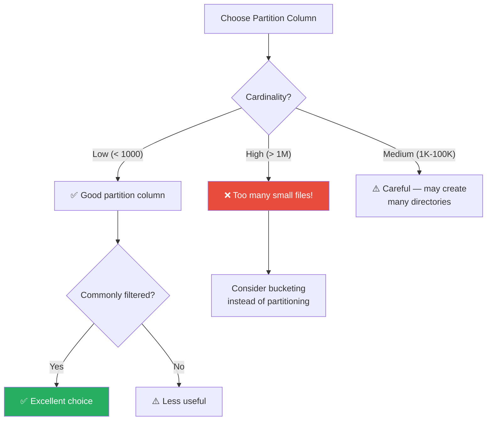

**Good partition columns:**
- `date` / `year` / `month` (commonly filtered, low cardinality)
- `country` / `region` (~200 values)
- `event_type` (few distinct values)

**Bad partition columns:**
- `user_id` (millions of values → millions of tiny files)
- `transaction_id` (one file per transaction!)
- `timestamp` (seconds-level → astronomical number of directories)

### The Small File Problem

```python
# ❌ Partitioning by high-cardinality column creates small files
df.write.partitionBy("user_id").parquet("/output/")
# If 1M users → 1M directories, each with tiny files
# HDFS NameNode overwhelmed, slow reads

# ✅ Partition by low-cardinality, use bucketing for high-cardinality
df.write \
  .partitionBy("year", "month") \
  .bucketBy(100, "user_id") \
  .saveAsTable("sales_bucketed")
```

---

## Bucketing

Bucketing is **pre-sorting and pre-hashing data at write time** so that subsequent joins and aggregations don't need shuffles.

### How Bucketing Works

```python
# Write bucketed data
df.write \
  .bucketBy(100, "user_id") \
  .sortBy("user_id") \
  .saveAsTable("sales_bucketed")

# Creates 100 buckets (files), each containing a range of user_id hashes
# File 0: user_ids where hash(user_id) % 100 == 0
# File 1: user_ids where hash(user_id) % 100 == 1
# ...
```

### Why Bucketing Eliminates Shuffles

```python
# Two tables bucketed by the same column with same number of buckets
# can be joined WITHOUT a shuffle

# Write both tables with matching bucket configuration
orders.write.bucketBy(100, "user_id").sortBy("user_id").saveAsTable("orders_bucketed")
users.write.bucketBy(100, "user_id").sortBy("user_id").saveAsTable("users_bucketed")

# Join — NO shuffle needed!
result = spark.table("orders_bucketed").join(spark.table("users_bucketed"), "user_id")
result.explain()
# SortMergeJoin [user_id], [user_id]
# NO Exchange (shuffle) operator! Data is already co-located and sorted
```

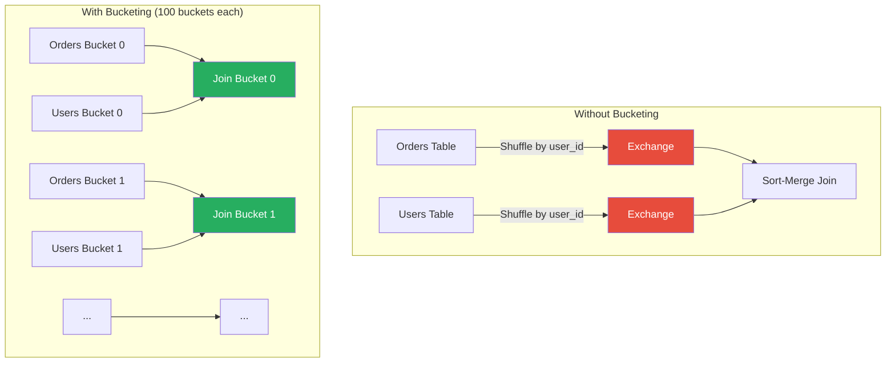

### Bucketing Requirements

| Requirement | Details |
|-------------|---------|
| Both tables must use same number of buckets | `bucketBy(100, ...)` on both |
| Must be bucketed by the join column | Join on `user_id` → bucket by `user_id` |
| Must be saved as managed tables | `.saveAsTable()`, not `.write.parquet()` |
| Sort is recommended | `.sortBy()` enables sort-merge join without extra sort |

---

## How to Check Partition Distribution

### Method 1: Partition Statistics

```python
from pyspark.sql.functions import spark_partition_id, count, sum as spark_sum

# Row count per partition
partition_stats = (
    df.withColumn("pid", spark_partition_id())
    .groupBy("pid")
    .agg(count("*").alias("row_count"))
    .orderBy("pid")
)
partition_stats.show()

# Summary statistics
partition_stats.select(
    spark_sum("row_count").alias("total_rows"),
    count("pid").alias("num_partitions"),
    (spark_sum("row_count") / count("pid")).alias("avg_rows_per_partition"),
).show()
```

### Method 2: Approximate Size Per Partition

```python
# Estimate partition sizes
import sys

def partition_size_bytes(index, iterator):
    """Estimate the size of a partition in bytes."""
    size = sum(sys.getsizeof(row) for row in iterator)
    yield (index, size)

sizes = df.rdd.mapPartitionsWithIndex(partition_size_bytes).collect()
for pid, size in sorted(sizes):
    print(f"Partition {pid}: {size / 1024 / 1024:.1f} MB")
```

### Method 3: Check Skew Ratio

```python
from pyspark.sql.functions import max as spark_max, min as spark_min, avg as spark_avg

skew_check = (
    df.withColumn("pid", spark_partition_id())
    .groupBy("pid")
    .agg(count("*").alias("cnt"))
    .agg(
        spark_max("cnt").alias("max_partition"),
        spark_min("cnt").alias("min_partition"),
        spark_avg("cnt").alias("avg_partition"),
        (spark_max("cnt") / spark_avg("cnt")).alias("skew_ratio")
    )
)
skew_check.show()

# skew_ratio > 3 → significant skew, consider repartitioning
# skew_ratio > 10 → severe skew, MUST address
```

---

## Production Scenarios

### Scenario 1: E-Commerce Data Lake Partitioning Strategy

```python
# Company: Online retailer with 500M daily events
# Challenge: Queries are slow because of poor partitioning

# ❌ Before: Everything in one directory
df.write.parquet("/data/events/")  # 500M rows/day, no organization

# ✅ After: Hive-style partitioning by date and event type
df.write \
  .partitionBy("date", "event_type") \
  .option("maxRecordsPerFile", 1000000) \
  .parquet("/data/events/")

# Most queries filter by date and event type
# "Show me all purchase events from last week"
# Only reads: /data/events/date=2024-06-01/event_type=purchase/
# Skips: millions of click, view, scroll events
```

### Scenario 2: Fixing a 4-Hour Job with Partition Tuning

```python
# Problem: GroupBy on user_id takes 4 hours
# Diagnosis: 200 default shuffle partitions for 2TB data
# → 10GB per partition → OOM and spilling

# Step 1: Calculate optimal partition count
data_size_gb = 2000  # 2TB
target_mb = 128
optimal_partitions = int((data_size_gb * 1024) / target_mb)
print(f"Optimal partitions: {optimal_partitions}")  # 16,000

# Step 2: Set shuffle partitions
spark.conf.set("spark.sql.shuffle.partitions", "16000")

# Step 3: Enable AQE for dynamic coalescing
spark.conf.set("spark.sql.adaptive.enabled", "true")
spark.conf.set("spark.sql.adaptive.coalescePartitions.enabled", "true")

# Result: Job completed in 25 minutes instead of 4 hours
```

### Scenario 3: JDBC Source — Fixing Single Partition Read

```python
# ❌ Default JDBC read: 1 partition, 1 task, no parallelism
df = spark.read.jdbc(url, "huge_table", properties)
# Takes 3 hours — single thread reading entire table

# ✅ Parallel JDBC read: multiple partitions based on a column
df = spark.read.jdbc(
    url=url,
    table="huge_table",
    column="id",              # Partition column (must be numeric)
    lowerBound=1,             # Min value of partition column
    upperBound=10000000,      # Max value of partition column
    numPartitions=100,        # Number of parallel readers
    properties=properties
)
# Now 100 tasks read in parallel — 3 hours → 3 minutes
```

---

## Troubleshooting Uneven Partitions

### Symptom: One Task Takes Much Longer Than Others

```python
# Diagnosis: Check the Spark UI → Stages → Task Duration
# If max task time >> median task time, you have skew

# Automated diagnosis:
from pyspark.sql.functions import spark_partition_id, count

partition_stats = (
    df.withColumn("pid", spark_partition_id())
    .groupBy("pid")
    .agg(count("*").alias("row_count"))
)

# Check for skew
stats = partition_stats.agg(
    spark_max("row_count").alias("max_rows"),
    spark_min("row_count").alias("min_rows"),
    spark_avg("row_count").alias("avg_rows")
).collect()[0]

skew_ratio = stats.max_rows / stats.avg_rows
print(f"Skew ratio: {skew_ratio:.1f}x")
# > 3x → fix needed
```

### Symptom: Excessive Small Files After Write

```python
# Problem: 10,000 tiny files (< 1MB each)
# Root cause: Too many partitions + partitionBy creates subdirectories

# Fix 1: Coalesce before write
df.coalesce(100).write.parquet("/output/")

# Fix 2: Use maxRecordsPerFile
df.write \
  .option("maxRecordsPerFile", 1000000) \
  .partitionBy("date") \
  .parquet("/output/")

# Fix 3: Compact small files after the fact
spark.read.parquet("/output/small_files/") \
  .repartition(50) \
  .write.mode("overwrite") \
  .parquet("/output/compacted/")
```

### Symptom: OOM on Specific Tasks

```python
# Cause: Skewed partitions — some partitions are too large for memory
# Fix 1: Increase partitions (reduces per-partition size)
spark.conf.set("spark.sql.shuffle.partitions", "2000")

# Fix 2: Enable AQE skew handling (for joins)
spark.conf.set("spark.sql.adaptive.enabled", "true")
spark.conf.set("spark.sql.adaptive.skewJoin.enabled", "true")

# Fix 3: Repartition to redistribute evenly
df = df.repartition(1000)  # Full shuffle but even distribution

# Fix 4: Increase executor memory for the skewed task
spark.conf.set("spark.executor.memory", "16g")
```

---

## Performance Considerations

### Partition Count Guidelines

| Data Size | Recommended Partitions | Rationale |
|-----------|----------------------|-----------|
| < 1GB | 2-8 | Minimum parallelism |
| 1-10GB | 8-100 | Good parallelism |
| 10-100GB | 100-1000 | ~128MB each |
| 100GB-1TB | 1000-8000 | ~128MB each |
| 1-10TB | 8000-80000 | ~128MB each |
| > 10TB | 80000+ | May need cluster scaling |

### Partition Performance Tips

```python
# 1. Always check partition count after loading
print(f"Partitions: {df.rdd.getNumPartitions()}")

# 2. Use AQE for automatic partition coalescing (Spark 3.2+)
spark.conf.set("spark.sql.adaptive.enabled", "true")
spark.conf.set("spark.sql.adaptive.coalescePartitions.enabled", "true")
spark.conf.set("spark.sql.adaptive.advisoryPartitionSizeInBytes", "128MB")

# 3. Pre-partition data for repeated joins
# If you join on "user_id" frequently:
df.repartition(200, "user_id").write.parquet("/data/users_partitioned/")
# Subsequent joins on user_id avoid shuffle

# 4. Match partition count to cluster cores
total_cores = num_executors * cores_per_executor
ideal_partitions = total_cores * 2  # 2-3x cores for load balancing

# 5. Avoid repartitioning in the middle of a pipeline
# ❌ df.repartition(100).filter(...).repartition(200).groupBy(...)
# ✅ df.filter(...).groupBy(...)  # Let Spark handle it
```

---

## Common Mistakes

### Mistake 1: Using Default shuffle.partitions for Large Data

```python
# ❌ Processing 5TB with default 200 shuffle partitions
# → 25GB per partition → guaranteed OOM
df.groupBy("user_id").sum("amount")

# ✅ Calculate based on data size
spark.conf.set("spark.sql.shuffle.partitions", "40000")  # 5TB / 128MB
```

### Mistake 2: Using repartition() When coalesce() Would Do

```python
# ❌ Unnecessary full shuffle just to reduce partitions
df.repartition(10).write.parquet("/output/")  # Full shuffle!

# ✅ Use coalesce for reduction — no shuffle
df.coalesce(10).write.parquet("/output/")  # Much faster
```

### Mistake 3: Partitioning by High-Cardinality Columns

```python
# ❌ Millions of tiny directories
df.write.partitionBy("user_id").parquet("/output/")  # 10M directories!

# ✅ Use bucketing for high-cardinality columns
df.write.bucketBy(200, "user_id").saveAsTable("users_bucketed")
```

### Mistake 4: Ignoring Partition Skew

```python
# ❌ Assuming partitions are balanced without checking
result = df.groupBy("country").sum("revenue")  # US has 100x more data

# ✅ Check and fix skew
from pyspark.sql.functions import spark_partition_id, count
df.withColumn("pid", spark_partition_id()) \
  .groupBy("pid").count().show()
```

### Mistake 5: Repartitioning Unnecessarily

```python
# ❌ Repartitioning before operations that will shuffle anyway
df.repartition(200, "user_id") \
  .groupBy("user_id").sum("amount")  # groupBy already shuffles!

# ✅ Let the shuffle handle partitioning
df.groupBy("user_id").sum("amount")  # Single shuffle
```

---

## Interview Questions

### Beginner Level

**Q1: What is a partition in Spark?**

> **A:** A partition is a logical chunk of data that is the unit of parallelism in Spark. Every RDD, DataFrame, or Dataset is divided into partitions. Each partition is processed by exactly one task on one CPU core, independently of other partitions. The number of partitions determines the degree of parallelism. For example, 100 partitions means up to 100 tasks can run simultaneously if 100 cores are available.

**Q2: What is the difference between repartition() and coalesce()?**

> **A:** `repartition(n)` performs a **full shuffle** — all data is redistributed across the network, producing n evenly-distributed partitions. It can increase or decrease partition count. `coalesce(n)` is a **narrow transformation** that only merges adjacent partitions without shuffling data over the network. It can only decrease partition count and may produce uneven partitions. **Always prefer coalesce() when reducing partitions** because it avoids the expensive shuffle.

**Q3: What is the default value of spark.sql.shuffle.partitions and why is it often wrong?**

> **A:** The default is 200. It's often wrong because it doesn't account for actual data size. For 10TB of data, 200 partitions means 50GB per partition — guaranteed OOM. For 100MB of data, 200 partitions means 500KB per partition — scheduling overhead exceeds computation. The optimal number should be calculated as: `data_size_in_MB / 128`. AQE (Spark 3.2+) mitigates this by automatically coalescing small partitions.

### Intermediate Level

**Q4: Explain Hive-style partitioning and partition pruning.**

> **A:** Hive-style partitioning organizes data into directories based on column values (e.g., `/data/year=2024/month=06/`). When written with `.partitionBy("year", "month")`, each unique combination of partition values creates a separate directory. Partition pruning is the optimization where Spark skips reading entire directories that can't match a query filter. For `df.filter(col("year") == 2024)`, Spark only reads the `year=2024` directory, skipping all other year directories. This is visible in the physical plan as `PartitionFilters`.

**Q5: How does bucketing differ from partitioning, and when would you use it?**

> **A:** Partitioning divides data by column values into directories (good for low-cardinality columns like date/country). Bucketing divides data by hash value into a fixed number of files (good for high-cardinality columns like user_id). Key advantage: when two tables are bucketed by the same column with the same number of buckets, joins between them **skip the shuffle entirely** because data is already co-located. Use bucketing when you frequently join large tables on the same key.

**Q6: How do you diagnose and fix data skew in partitions?**

> **A:** Diagnosis: Check Spark UI → Stages → Tasks for max vs. median task duration. If max >> median, you have skew. Programmatically, add `spark_partition_id()` and count rows per partition, calculating the skew ratio (max/avg). Fixes: (1) Enable AQE skew join handling in Spark 3.x. (2) Salt the skewed key — append a random salt (0-9), aggregate with the salted key, then reaggregate without it. (3) If one side of a join is small, use a broadcast join. (4) Filter out null keys that cause skew. (5) Repartition to a larger number of partitions.

### Advanced Level

**Q7: How does Spark determine the number of partitions when reading a Parquet dataset?**

> **A:** Spark uses `spark.sql.files.maxPartitionBytes` (default 128MB) and `spark.sql.files.openCostInBytes` (default 4MB, estimated cost of opening a file) to plan partitions. The algorithm: (1) List all files and their sizes. (2) Split files larger than `maxPartitionBytes` into multiple partitions. (3) Combine small files into partitions up to `maxPartitionBytes`, accounting for `openCostInBytes` as overhead per file. (4) The result is a set of file splits where each split becomes one partition. For partitioned Parquet, the partition column values are read from directory names, not from the files themselves.

**Q8: Design a partitioning strategy for a multi-petabyte data lake with mixed query patterns.**

> **A:** I'd use a layered approach:
> - **Bronze layer** (raw data): Partition by `ingestion_date` — simple, prevents reprocessing
> - **Silver layer** (cleaned): Partition by `year/month/day` for time-based queries. For frequently joined tables, additionally bucket by the join key (e.g., `user_id` bucketed into 500 buckets)
> - **Gold layer** (aggregated): Partition by the primary analysis dimension (e.g., `region`), with each partition being reasonably sized (128MB-1GB)
> - Use `maxRecordsPerFile` to prevent small files within partitions
> - Implement a compaction job that runs daily to merge small files
> - Configure AQE with `advisoryPartitionSizeInBytes=256MB` for interactive queries
> - Monitor partition skew with automated alerts (max/median ratio > 5)

**Q9: Explain Dynamic Partition Pruning (DPP) and when it doesn't work.**

> **A:** DPP (Spark 3.0+) enables partition pruning based on the results of another subquery, typically from a join's filter side. For example, if table A is partitioned by `product_id` and you join with `SELECT product_id FROM products WHERE category = 'Electronics'`, DPP first executes the subquery to get matching `product_id` values, then uses those values to prune partitions in table A. DPP doesn't work when: (1) the dimension (filter) side is too large to broadcast, (2) the join key is not the partition key, (3) the fact table is not file-partitioned, or (4) the filter side query is too complex for the optimizer to extract as a subquery.

**Q10: You have a job that writes 50,000 small files. How do you fix this without rewriting the entire pipeline?**

> **A:** Multiple approaches:
> 1. **Immediate fix:** Add `.coalesce(target_num_files)` before `.write()`. Calculate target based on data size / 128MB.
> 2. **With partitioning:** Use `.option("maxRecordsPerFile", N)` to control files per partition. Also use `.repartition(col("partition_col"))` to consolidate.
> 3. **Post-hoc compaction:** Read the small files and rewrite with fewer partitions: `spark.read.parquet("/small/").repartition(100).write.mode("overwrite").parquet("/compacted/")`.
> 4. **Prevent recurrence:** Set `spark.sql.shuffle.partitions` appropriately before the job runs. Enable AQE's partition coalescing.
> 5. **For Hive tables:** Run `ALTER TABLE ... CONCATENATE` or use `MSCK REPAIR TABLE` after compaction.
> 6. **Automated solution:** Implement a scheduled compaction job that identifies directories with too many small files and consolidates them.

---

## Summary

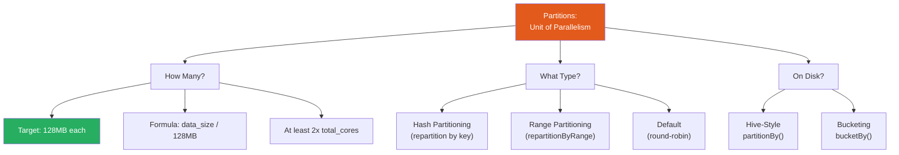

| Concept | Key Takeaway |
|---------|-------------|
| Partition count | Target 128MB per partition; use `data_size / 128MB` |
| repartition vs coalesce | coalesce for reduction (no shuffle), repartition for increase or by-key |
| Partition pruning | Partition by commonly filtered columns; Spark skips irrelevant directories |
| Data skew | The #1 performance killer; use salting, AQE, or broadcast joins |
| Hive partitioning | Low-cardinality columns only; prevents small file explosion |
| Bucketing | Eliminates shuffles for repeated joins on the same key |
| AQE coalescing | Automatically merges small partitions after shuffle |

---

**[← Previous: 07-tungsten-engine.md](07-tungsten-engine.md) | [Home](../README.md) | [Next →: 09-shuffles.md](09-shuffles.md)**
