# ⚡ Chapter 9: Shuffles — The Most Expensive Operation in Spark

> **"If partitions are the units of work, shuffles are the cost of reorganizing that work. Minimize shuffles and you minimize pain."**

---

## 📋 Table of Contents

1. [Intuition — What Is a Shuffle?](#intuition--what-is-a-shuffle)
2. [Real-World Analogy — Reorganizing Books Across Libraries](#real-world-analogy--reorganizing-books-across-libraries)
3. [Why Shuffles Are Expensive](#why-shuffles-are-expensive)
4. [What Triggers a Shuffle](#what-triggers-a-shuffle)
5. [Shuffle Internals — The Full Journey](#shuffle-internals--the-full-journey)
6. [Sort-Based Shuffle Manager](#sort-based-shuffle-manager)
7. [Shuffle Files and Blocks](#shuffle-files-and-blocks)
8. [Shuffle Spill to Disk](#shuffle-spill-to-disk)
9. [How to Minimize Shuffles](#how-to-minimize-shuffles)
10. [Shuffle Metrics in Spark UI](#shuffle-metrics-in-spark-ui)
11. [Diagnosing Shuffle Problems](#diagnosing-shuffle-problems)
12. [External Shuffle Service](#external-shuffle-service)
13. [Production Scenarios](#production-scenarios)
14. [Troubleshooting](#troubleshooting)
15. [Performance Considerations](#performance-considerations)
16. [Common Mistakes](#common-mistakes)
17. [Interview Questions](#interview-questions)

---

## Intuition — What Is a Shuffle?

A **shuffle** is the process of redistributing data across partitions, typically across the network. It happens whenever Spark needs to reorganize data so that records with the same key are in the same partition.

Think about a `groupBy("country")`: before the aggregation, records for "US" might be scattered across 100 partitions on 50 machines. Spark needs to gather all "US" records into one partition — that's a shuffle.

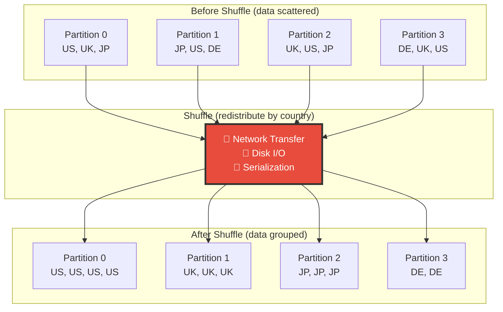

> **💡 Key Insight:** A shuffle is the boundary between two stages in Spark. Everything before the shuffle runs in one stage (one set of parallel tasks). Everything after runs in the next stage. The shuffle is where Spark "waits for all data to be ready" before proceeding.

---

## Real-World Analogy — Reorganizing Books Across Libraries

Imagine 10 city libraries, each with books in random order (fiction, science, history all mixed together). You've been asked to reorganize so that:
- Library 1 gets ALL fiction books
- Library 2 gets ALL science books
- Library 3 gets ALL history books

**The process:**
1. **Map Phase:** Each library's staff sorts through their books and creates labeled boxes ("Fiction", "Science", "History")
2. **Shuffle Write:** Each library writes these sorted boxes to their loading dock
3. **Network Transfer:** Trucks pick up the boxes and deliver them to the right libraries
4. **Shuffle Read:** The receiving library unpacks and organizes the incoming boxes

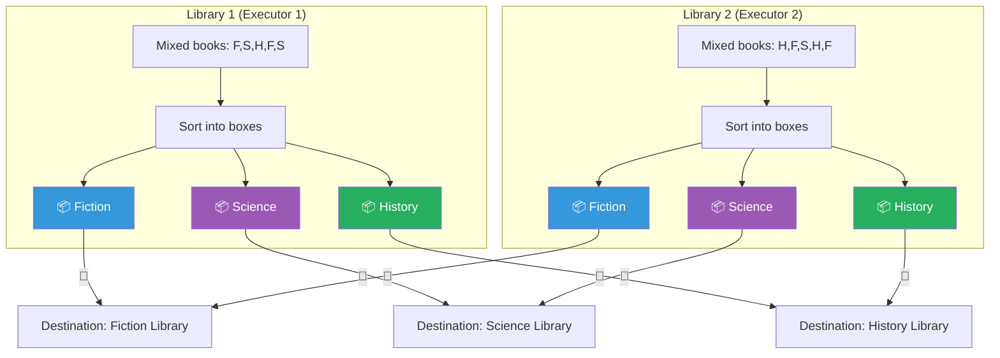

This is **exactly** what a Spark shuffle does:
- Libraries = Executors
- Books = Data records
- Book category = Shuffle key
- Trucks = Network
- Loading docks = Shuffle files on disk

---

## Why Shuffles Are Expensive

Shuffles are expensive because they involve **every type of I/O**:

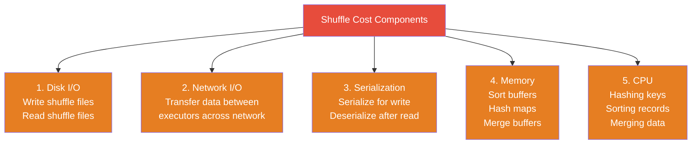

### Quantifying the Cost

| Resource | Without Shuffle | With Shuffle |
|----------|----------------|--------------|
| Disk I/O | Read input only | Read input + write shuffle + read shuffle |
| Network | None (local) | All data potentially crosses network |
| Memory | Data + processing | Data + sort buffers + hash maps |
| CPU | Process data | Process + hash + sort + merge |
| Wall time | Seconds | Minutes to hours |

### Concrete Example

Processing 100GB of data:
- **Without shuffle** (filter + project): Read 100GB from disk → process → done. ~2 minutes.
- **With shuffle** (groupBy): Read 100GB → hash keys → sort by partition → write 100GB shuffle files → transfer over network → read 100GB shuffle files → merge → aggregate. ~20 minutes.

> **💡 Key Insight:** A shuffle can make a job **10x slower** just by adding one `groupBy` or `join`. The data is essentially processed twice — once to write shuffle files, and once to read and aggregate them.

---

## What Triggers a Shuffle

Not all operations require shuffles. Understanding which operations trigger shuffles is crucial for writing efficient Spark code.

### Operations That Trigger Shuffles ⚠️

```python
# 1. groupByKey / groupBy — redistributes by group key
rdd.groupByKey()           # RDD
df.groupBy("key").sum()     # DataFrame

# 2. reduceByKey — redistributes, but with map-side combine
rdd.reduceByKey(lambda a, b: a + b)

# 3. join — redistributes both sides by join key
df1.join(df2, "key")       # (unless broadcast join)

# 4. distinct — redistributes to identify duplicates
df.distinct()

# 5. repartition — explicitly redistributes
df.repartition(200)
df.repartition(100, "key")

# 6. sort / orderBy — global sort requires redistribute + sort
df.orderBy("price")

# 7. Window functions — redistributes by partition key
from pyspark.sql.window import Window
w = Window.partitionBy("dept").orderBy("salary")
df.withColumn("rank", rank().over(w))

# 8. Set operations
df1.union(df2).distinct()   # distinct causes shuffle
df1.intersect(df2)
df1.except(df2)
```

### Operations That Do NOT Trigger Shuffles ✅

```python
# 1. map / select / withColumn — narrow transformation
df.select("col1", "col2")
df.withColumn("new_col", col("a") + col("b"))

# 2. filter / where — narrow transformation
df.filter(col("year") == 2024)

# 3. coalesce — merges partitions without shuffle
df.coalesce(10)

# 4. Broadcast join — small table sent to all executors (no shuffle)
df1.join(broadcast(df2), "key")

# 5. flatMap / explode — narrow transformation
df.select(explode(col("items")))

# 6. cache / persist — stores data where it is
df.cache()

# 7. Reading files — partitions determined by file splits
spark.read.parquet("/data/")
```

### How to Identify Shuffles in Your Plan

```python
# Look for "Exchange" in the physical plan
df.groupBy("country").sum("amount").explain()

# *(2) HashAggregate(keys=[country#5], functions=[sum(amount#8)])
# +- Exchange hashpartitioning(country#5, 200)        ← THIS IS THE SHUFFLE
#    +- *(1) HashAggregate(keys=[country#5], functions=[partial_sum(amount#8)])
#       +- *(1) FileScan parquet [country#5,amount#8]
```

**"Exchange" in the physical plan = shuffle = stage boundary.**

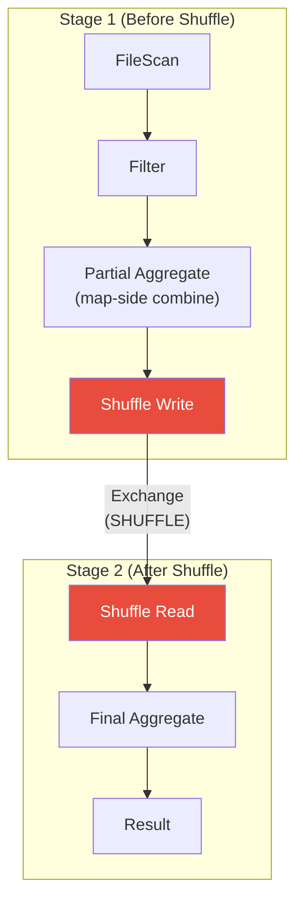

---

## Shuffle Internals — The Full Journey

Let's trace what happens during a shuffle at the byte level.

### The Two Phases

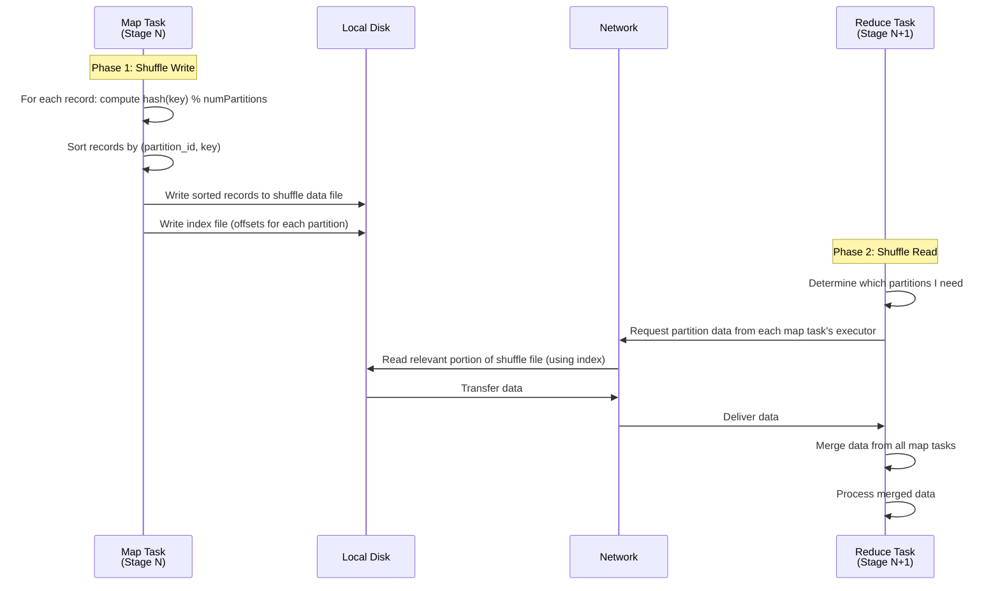

### Detailed Shuffle Write Process

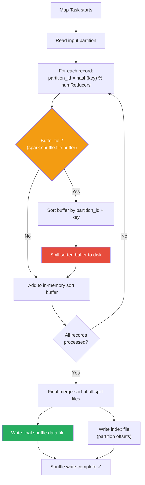

### Detailed Shuffle Read Process

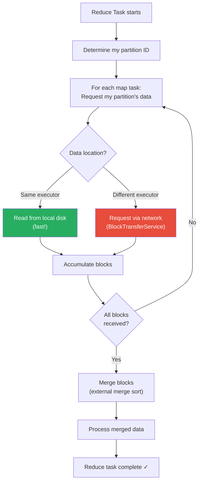

---

## Sort-Based Shuffle Manager

Since Spark 1.2, Spark uses the **Sort-Based Shuffle Manager** (the only shuffle manager since Spark 2.0). It replaced the earlier hash-based manager.

### How It Works

Each map task:
1. **Buffers** records in memory (in a `PartitionedAppendOnlyMap` or `PartitionedPairBuffer`)
2. **Sorts** records by `(partition_id, key)` when the buffer is full
3. **Spills** sorted data to a temporary file on disk
4. **Merge-sorts** all spill files into a **single output file**
5. Creates an **index file** with offsets for each partition

```
Shuffle Output Per Map Task:
─────────────────────────────────
shuffle_0_0_0.data    (data file — sorted records for ALL reduce partitions)
shuffle_0_0_0.index   (index file — byte offset for each partition boundary)

Data file layout:
┌──────────────────────────────────────────────────────────┐
│ Partition 0 data │ Partition 1 data │ ... │ Partition N data │
└──────────────────────────────────────────────────────────┘

Index file:
┌─────────────────────────────────────┐
│ Partition 0: offset 0, length 1024  │
│ Partition 1: offset 1024, length 512│
│ Partition 2: offset 1536, length 768│
│ ...                                 │
└─────────────────────────────────────┘
```

### Why Sort-Based Over Hash-Based?

| Aspect | Hash-Based (old) | Sort-Based (current) |
|--------|-----------------|---------------------|
| Files per map task | One file per reduce partition | **One data file + one index file** |
| With 10K map × 10K reduce | 100M files 💥 | **20K files ✅** |
| File handles | Thousands open simultaneously | **One at a time** |
| Merge required? | No | Yes (sort + merge) |
| Memory pressure | Low per file, but too many files | Buffer-based, controllable |

> **💡 Key Insight:** The key advantage of sort-based shuffle is file count. With hash-based shuffle, `M map tasks × R reduce partitions` = M×R files. For large clusters, this could be millions of files, overwhelming the file system. Sort-based reduces this to just 2 files per map task (data + index).

---

## Shuffle Files and Blocks

### Shuffle File Naming

```
shuffle_{shuffleId}_{mapId}_{reduceId}.data
shuffle_{shuffleId}_{mapId}_{reduceId}.index

Where:
- shuffleId: unique ID for this shuffle operation
- mapId: which map task produced this file
- reduceId: always 0 for sort-based (single file per map task)
```

### Block Manager

The Block Manager coordinates data transfer between executors:

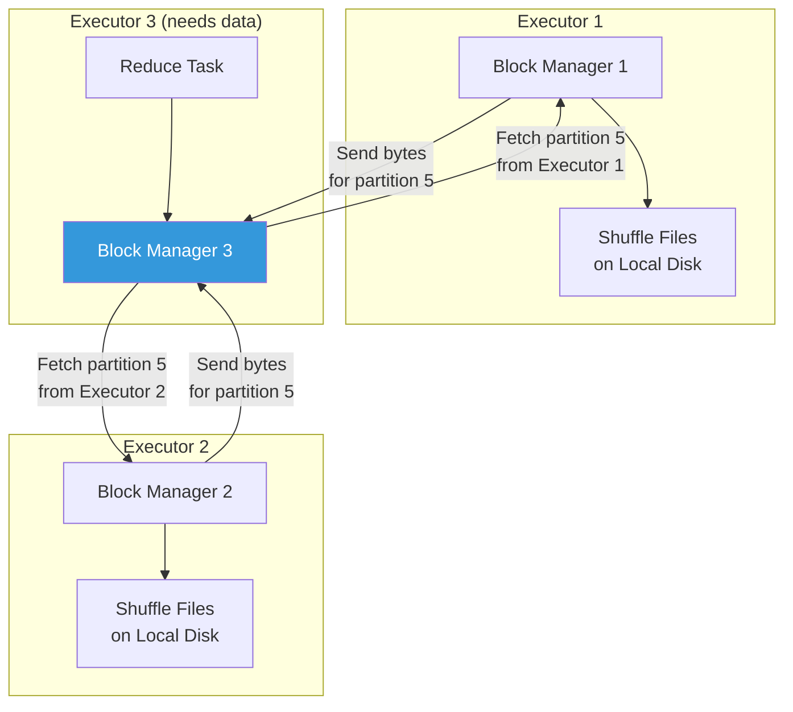

### Shuffle Data Transfer Protocol

```python
# Configuration affecting shuffle block transfer
spark.conf.set("spark.reducer.maxSizeInFlight", "48m")    # Max data in-flight per reduce task
spark.conf.set("spark.reducer.maxReqsInFlight", "1000")   # Max simultaneous requests
spark.conf.set("spark.shuffle.io.maxRetries", "3")        # Retries on fetch failure
spark.conf.set("spark.shuffle.io.retryWait", "5s")        # Wait between retries
spark.conf.set("spark.shuffle.compress", "true")           # Compress shuffle data
spark.conf.set("spark.shuffle.io.numConnectionsPerPeer", "1")  # Connections per executor
```

---

## Shuffle Spill to Disk

When the in-memory sort buffer exceeds available execution memory, Spark **spills** the buffer to disk. This is a safety mechanism that prevents OOM but significantly impacts performance.

### How Spilling Works

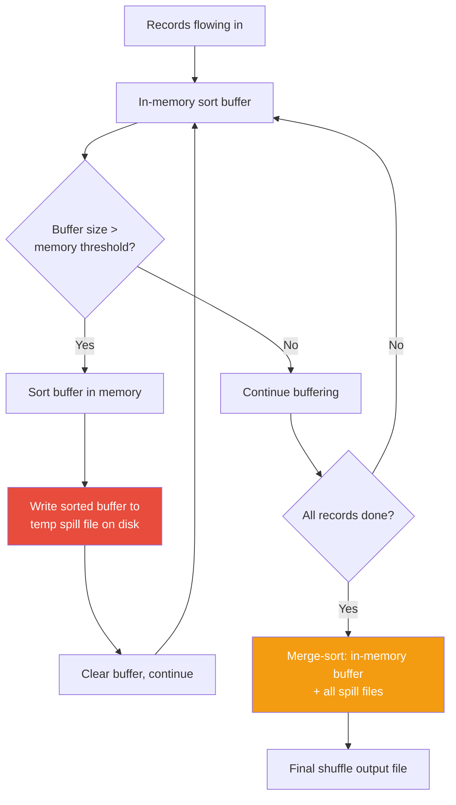

### The Cost of Spilling

```
Without spilling:
1. Read input → 2. Sort in memory → 3. Write output
Total I/O: 1 read + 1 write

With 3 spills:
1. Read input → 2. Sort → 3. Write spill 1
4. Sort → 5. Write spill 2
6. Sort → 7. Write spill 3
8. Merge-read spill 1,2,3 → 9. Merge-sort → 10. Write output
Total I/O: 1 read + 3 spill writes + 3 spill reads + 1 write = 8 I/Os

Spilling multiplies disk I/O by 2-4x!
```

### Monitoring Spill in Spark UI

```
In Spark UI → Stages → Your Stage:
- Shuffle Spill (Memory): Amount of data deserialized into memory before spilling
- Shuffle Spill (Disk): Amount of data serialized and written to disk

Example:
Shuffle Spill (Memory): 50 GB
Shuffle Spill (Disk): 15 GB   ← Compression ratio ~3x

If Shuffle Spill (Disk) > 0, you have spilling.
```

### Reducing Spill

```python
# 1. Increase executor memory
spark.conf.set("spark.executor.memory", "16g")

# 2. Increase memory fraction for execution
spark.conf.set("spark.memory.fraction", "0.8")  # Default 0.6

# 3. Increase number of partitions (less data per task)
spark.conf.set("spark.sql.shuffle.partitions", "2000")

# 4. Use map-side combine to reduce data before shuffle
# ❌ groupByKey — sends ALL data through shuffle
# ✅ reduceByKey — combines locally first
rdd.reduceByKey(lambda a, b: a + b)  # Less data in shuffle buffer

# 5. Increase shuffle sort buffer
spark.conf.set("spark.shuffle.file.buffer", "64k")     # Default: 32k
spark.conf.set("spark.shuffle.sort.bypassMergeThreshold", "200")  # Default: 200
```

---

## How to Minimize Shuffles

### Strategy 1: Broadcast Joins

The single most effective shuffle elimination technique.

```python
from pyspark.sql.functions import broadcast

# ❌ Sort-Merge Join (SHUFFLE both sides)
result = large_df.join(small_df, "key")
# Exchange hashpartitioning(key, 200)  ← Shuffle large_df
# Exchange hashpartitioning(key, 200)  ← Shuffle small_df

# ✅ Broadcast Join (NO shuffle at all)
result = large_df.join(broadcast(small_df), "key")
# BroadcastExchange HashedRelationBroadcastMode  ← Send small_df to all executors
# NO Exchange on large_df side

# When to use: small table < 10MB (default) or adjust threshold
spark.conf.set("spark.sql.autoBroadcastJoinThreshold", "100MB")
```

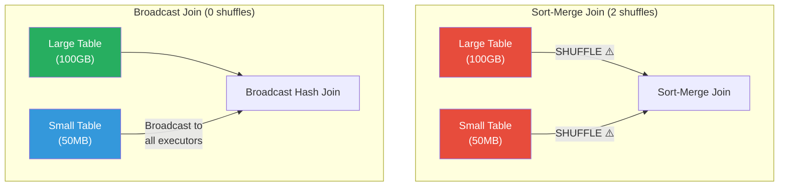

### Strategy 2: Map-Side Reduction

Reduce data locally before sending it across the network.

```python
# ❌ groupByKey — sends ALL records through shuffle
# If key "US" has 10M records, ALL 10M go through the network
rdd.groupByKey().mapValues(sum)

# ✅ reduceByKey — combines locally first (map-side combine)
# Each executor sums its local "US" records, sends ONLY the local sum
rdd.reduceByKey(lambda a, b: a + b)
# If 100 executors, only 100 numbers cross the network (not 10M!)

# DataFrames automatically do map-side combine for aggregations
# This is the "partial_sum" you see in explain()
df.groupBy("country").sum("amount")
# *(2) HashAggregate(keys=[country], functions=[sum(amount)])           ← final
# +- Exchange hashpartitioning(country, 200)                            ← shuffle
#    +- *(1) HashAggregate(keys=[country], functions=[partial_sum(amount)])  ← map-side!
```

### Strategy 3: Pre-Partitioning

If you join the same tables repeatedly, pre-partition them by the join key.

```python
# Pre-partition data once
orders.repartition(200, "user_id") \
    .write.parquet("/data/orders_by_user/")

users.repartition(200, "user_id") \
    .write.parquet("/data/users_by_user/")

# Subsequent joins may avoid shuffle (if partition counts match)
# Even better: use bucketing (guarantees shuffle elimination)
orders.write.bucketBy(200, "user_id").sortBy("user_id").saveAsTable("orders_bucketed")
users.write.bucketBy(200, "user_id").sortBy("user_id").saveAsTable("users_bucketed")

# This join has NO shuffle
result = spark.table("orders_bucketed").join(spark.table("users_bucketed"), "user_id")
```

### Strategy 4: Avoid Unnecessary Operations

```python
# ❌ distinct() when not needed — triggers shuffle
df.select("country").distinct()  # Shuffle!

# ✅ dropDuplicates() on specific columns (same shuffle, but more intentional)
df.dropDuplicates(["country"])

# ❌ repartition() in the middle of a pipeline — extra shuffle
df.repartition(100).filter(...).groupBy(...).sum(...)  # 2 shuffles

# ✅ Let the natural shuffle handle partitioning
df.filter(...).groupBy(...).sum(...)  # 1 shuffle

# ❌ Sorting when order doesn't matter — global sort = shuffle
df.orderBy("id").groupBy("category").sum("amount")  # 2 shuffles (sort + groupBy)

# ✅ Skip the sort if you only need aggregation
df.groupBy("category").sum("amount")  # 1 shuffle
```

### Strategy 5: Use coalesce() Instead of repartition()

```python
# ❌ repartition to reduce partitions (unnecessary shuffle!)
df.repartition(10)  # Full shuffle

# ✅ coalesce to reduce partitions (no shuffle)
df.coalesce(10)  # Merges local partitions only
```

---

## Shuffle Metrics in Spark UI

The Spark UI provides detailed metrics about shuffle performance. Learning to read these is essential for optimization.

### Where to Find Shuffle Metrics

```
Spark UI → Application → Jobs → Stages → [Your Stage]

Key metrics on the Stage detail page:
┌──────────────────────────────────────────────┐
│ Shuffle Read                                  │
│   - Records read: 1,234,567                   │
│   - Data read: 4.5 GB                         │
│   - Fetch wait time: 12.3 s    ← Network wait │
│   - Local blocks fetched: 45                  │
│   - Remote blocks fetched: 155   ← Network!   │
│   - Local bytes read: 1.2 GB                  │
│   - Remote bytes read: 3.3 GB  ← Over network │
├──────────────────────────────────────────────┤
│ Shuffle Write                                 │
│   - Records written: 1,234,567                │
│   - Data written: 4.5 GB                      │
│   - Write time: 8.7 s                         │
├──────────────────────────────────────────────┤
│ Shuffle Spill                                 │
│   - Spill (Memory): 15 GB     ← Before compress│
│   - Spill (Disk): 5 GB        ← After compress │
└──────────────────────────────────────────────┘
```

### What Each Metric Tells You

| Metric | What It Means | What to Do If High |
|--------|---------------|-------------------|
| Shuffle Read (data) | Total data transferred in shuffle | Reduce data before shuffle (filter, aggregate) |
| Fetch wait time | Time waiting for data from network | Network bottleneck — check bandwidth |
| Remote blocks fetched | Data pulled from other executors | More executors = more remote fetches |
| Local blocks fetched | Data read from same executor | Higher is better — data locality |
| Shuffle Write (data) | Total data written to shuffle files | Use map-side combine, reduce columns |
| Shuffle Write time | Time spent writing shuffle files | Faster disks (SSD), increase buffer |
| Spill (Memory) | Data that couldn't fit in memory | Increase executor memory or partitions |
| Spill (Disk) | Spilled data on disk (compressed) | Increase memory, reduce data per partition |

### Reading Task-Level Metrics

```
Spark UI → Stages → Tasks (scroll right for all columns)

Look for:
- Duration: Task time. If max >> median, you have skew.
- Shuffle Read: Per-task shuffle read. Uneven = skew.
- Shuffle Write: Per-task shuffle write. Should be roughly equal.
- Spill: Per-task spill. Non-zero = memory pressure.

Example (problematic):
┌──────────┬──────────┬──────────────┬──────────────┬─────────┐
│ Task ID  │ Duration │ Shuffle Read │ Shuffle Write│ Spill   │
├──────────┼──────────┼──────────────┼──────────────┼─────────┤
│ Task 0   │ 15 sec   │ 128 MB       │ 64 MB        │ 0       │
│ Task 1   │ 12 sec   │ 130 MB       │ 60 MB        │ 0       │
│ Task 2   │ 45 MIN   │ 15 GB        │ 8 GB         │ 12 GB   │  ← SKEW!
│ Task 3   │ 10 sec   │ 125 MB       │ 55 MB        │ 0       │
└──────────┴──────────┴──────────────┴──────────────┴─────────┘
```

---

## Diagnosing Shuffle Problems

### Problem 1: Shuffle Too Large

```python
# Diagnosis: Shuffle Read/Write in Spark UI is disproportionately large
# Root cause: Sending too much data through the shuffle

# Fix 1: Filter before shuffle
# ❌
df.groupBy("country").sum("amount").filter(col("sum(amount)") > 1000)

# ✅ Filter rows before groupBy reduces shuffle data
df.filter(col("amount") > 0).groupBy("country").sum("amount")

# Fix 2: Select only needed columns before shuffle
# ❌ 50 columns go through shuffle
wide_df.groupBy("country").agg(sum("amount"))

# ✅ Select only what's needed
wide_df.select("country", "amount").groupBy("country").sum("amount")

# Fix 3: Use approximate operations for exploration
# ❌ Exact distinct count (shuffle!)
df.select(countDistinct("user_id"))

# ✅ Approximate (no shuffle or lighter shuffle)
df.select(approx_count_distinct("user_id"))
```

### Problem 2: Fetch Failures

```python
# Symptoms: FetchFailedException in logs
# "org.apache.spark.shuffle.FetchFailedException: 
#  Failed to connect to host:port"

# Root causes:
# 1. Executor lost (OOM, killed by YARN)
# 2. Network timeout
# 3. Shuffle files deleted (executor decommissioned)

# Fixes:
spark.conf.set("spark.shuffle.io.maxRetries", "10")    # More retries
spark.conf.set("spark.shuffle.io.retryWait", "10s")    # Longer wait
spark.conf.set("spark.shuffle.registration.timeout", "120000")

# Enable external shuffle service (files survive executor death)
spark.conf.set("spark.shuffle.service.enabled", "true")

# Increase executor memory to prevent OOM
spark.conf.set("spark.executor.memory", "16g")
spark.conf.set("spark.executor.memoryOverhead", "4g")
```

### Problem 3: Skewed Shuffle

```python
# Diagnosis: One task takes 100x longer than others
# Spark UI shows one partition with 100x more data

# Fix 1: AQE Skew Join (Spark 3.x)
spark.conf.set("spark.sql.adaptive.enabled", "true")
spark.conf.set("spark.sql.adaptive.skewJoin.enabled", "true")

# Fix 2: Salt the key (manual)
from pyspark.sql.functions import concat, lit, floor, rand

salted = df.withColumn("salted_key", 
    concat(col("skewed_key"), lit("_"), floor(rand() * 10).cast("string")))
partial = salted.groupBy("salted_key").sum("amount")
result = partial.withColumn("original_key", 
    split(col("salted_key"), "_")[0]) \
    .groupBy("original_key").sum("sum(amount)")

# Fix 3: Isolate and broadcast the hot key
hot_key_data = df.filter(col("key") == "hot_value")
normal_data = df.filter(col("key") != "hot_value")

# Process hot key separately (broadcast or different strategy)
hot_result = hot_key_data.groupBy("key").sum("amount")
normal_result = normal_data.groupBy("key").sum("amount")
final = hot_result.union(normal_result)
```

---

## External Shuffle Service

The External Shuffle Service (ESS) is a long-running process on each node that serves shuffle data, allowing **executors to be dynamically added/removed** without losing shuffle files.

### Why It Matters

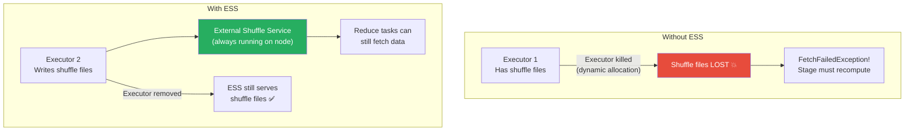

### Configuration

```python
# Enable external shuffle service
spark.conf.set("spark.shuffle.service.enabled", "true")
spark.conf.set("spark.shuffle.service.port", "7337")

# Required for dynamic allocation
spark.conf.set("spark.dynamicAllocation.enabled", "true")
spark.conf.set("spark.dynamicAllocation.minExecutors", "2")
spark.conf.set("spark.dynamicAllocation.maxExecutors", "100")

# Note: ESS must be deployed on every worker node
# In YARN: configured in yarn-site.xml
# In K8s: deployed as a DaemonSet
```

---

## Production Scenarios

### Scenario 1: Netflix — Reducing 2TB Daily Shuffle

```python
# Problem: Daily recommendation pipeline shuffles 2TB
# Processing: 10B viewing events joined with 200M user profiles

# Original query:
result = (
    viewing_events                        # 10B rows, 2TB
    .join(user_profiles, "user_id")       # 200M rows, 50GB — SHUFFLE BOTH!
    .groupBy("genre", "country")
    .agg(count("*"), avg("rating"))       # ANOTHER SHUFFLE!
)
# Total shuffle: 2TB + 50GB + result = ~2.1TB shuffled

# Optimized:
# Step 1: Broadcast the smaller table
result = (
    viewing_events
    .join(broadcast(user_profiles), "user_id")  # NO SHUFFLE for join!
    .groupBy("genre", "country")
    .agg(count("*"), avg("rating"))             # Only this shuffles
)
# Total shuffle: ~500MB (just the aggregation result)
# Improvement: 2.1TB → 500MB shuffle = 4000x reduction!
```

### Scenario 2: Debugging Slow Shuffle at Scale

```python
# Problem: A job that used to take 20 minutes now takes 3 hours
# Investigation:

# Step 1: Check Spark UI → Stages → Find the slow stage
# Found: Stage 3 takes 2.5 hours (shuffle read stage)

# Step 2: Check shuffle metrics
# Shuffle Read: 500GB (seems reasonable for data size)
# Fetch wait time: 1.8 hours (!!! Network bottleneck)
# Remote bytes: 480GB, Local bytes: 20GB

# Step 3: Root cause analysis
# 480GB / 20GB = 96% of data is remote
# Cluster expanded from 10 to 50 nodes — data locality decreased

# Fix: Increase shuffle fetch parallelism and buffer
spark.conf.set("spark.reducer.maxSizeInFlight", "96m")      # Default 48MB
spark.conf.set("spark.shuffle.io.numConnectionsPerPeer", "3")  # Default 1
spark.conf.set("spark.sql.shuffle.partitions", "2000")       # Smaller partitions

# Result: Fetch wait dropped to 15 minutes. Job total: 35 minutes.
```

### Scenario 3: Eliminating Shuffles with Bucketing

```python
# Problem: Daily ETL joins orders with customers — shuffles 1TB each time

# One-time setup: Write bucketed tables
orders_df.write \
    .bucketBy(500, "customer_id") \
    .sortBy("customer_id") \
    .saveAsTable("orders_bucketed")

customers_df.write \
    .bucketBy(500, "customer_id") \
    .sortBy("customer_id") \
    .saveAsTable("customers_bucketed")

# Daily join — NO shuffle!
daily_result = (
    spark.table("orders_bucketed")
    .filter(col("order_date") == current_date)
    .join(spark.table("customers_bucketed"), "customer_id")
)

daily_result.explain()
# SortMergeJoin [customer_id]
# NO Exchange (shuffle) operators!
# Savings: 1TB shuffle eliminated → 10x faster daily job
```

---

## Troubleshooting

### FetchFailedException

```python
# Error: org.apache.spark.shuffle.FetchFailedException
# Cause: Could not fetch shuffle data from an executor

# Common reasons:
# 1. Source executor OOM'd and was killed
# 2. Network timeout during data transfer
# 3. Shuffle files were deleted (dynamic allocation without ESS)

# Solutions:
# Increase retries
spark.conf.set("spark.shuffle.io.maxRetries", "10")
spark.conf.set("spark.shuffle.io.retryWait", "15s")

# Enable ESS for dynamic allocation
spark.conf.set("spark.shuffle.service.enabled", "true")

# Increase executor memory/overhead
spark.conf.set("spark.executor.memory", "16g")
spark.conf.set("spark.executor.memoryOverhead", "4g")

# Reduce data per partition
spark.conf.set("spark.sql.shuffle.partitions", "2000")
```

### Shuffle Data Corruption

```python
# Error: "Stream is corrupted" or checksum failures during shuffle read

# Cause: Data corruption during network transfer or disk I/O

# Solutions:
# Enable shuffle checksum validation (Spark 3.2+)
spark.conf.set("spark.shuffle.checksum.enabled", "true")

# Use compression (detects many corruption types)
spark.conf.set("spark.shuffle.compress", "true")
spark.conf.set("spark.io.compression.codec", "lz4")

# Check disk health on worker nodes
```

### Excessive GC During Shuffle

```python
# Symptom: Long GC pauses during shuffle read/write
# Cause: Too many objects created during sort/merge

# Solutions:
# Use off-heap memory for shuffle
spark.conf.set("spark.memory.offHeap.enabled", "true")
spark.conf.set("spark.memory.offHeap.size", "4g")

# Use G1GC with optimized settings
spark.conf.set("spark.executor.extraJavaOptions", 
    "-XX:+UseG1GC -XX:G1HeapRegionSize=16m -XX:InitiatingHeapOccupancyPercent=35")

# Increase parallelism to reduce per-task data
spark.conf.set("spark.sql.shuffle.partitions", "2000")
```

---

## Performance Considerations

### Shuffle Performance Levers

| Lever | Default | Recommendation | Impact |
|-------|---------|---------------|--------|
| `spark.sql.shuffle.partitions` | 200 | data_size_MB / 128 | High |
| `spark.sql.autoBroadcastJoinThreshold` | 10MB | Up to 100-200MB | High |
| `spark.shuffle.compress` | true | Keep true | Medium |
| `spark.shuffle.file.buffer` | 32KB | 64KB-1MB | Low-Medium |
| `spark.reducer.maxSizeInFlight` | 48MB | 96-128MB | Medium |
| `spark.shuffle.io.numConnectionsPerPeer` | 1 | 2-5 | Medium |
| `spark.sql.adaptive.enabled` | true (3.2+) | Keep true | High |
| `spark.shuffle.service.enabled` | false | true (production) | High (for stability) |

### Shuffle Optimization Checklist

```python
# Before running a shuffle-heavy job:

# 1. Enable AQE
spark.conf.set("spark.sql.adaptive.enabled", "true")

# 2. Set shuffle partitions based on data size
data_size_mb = estimated_shuffle_data_mb
spark.conf.set("spark.sql.shuffle.partitions", 
    str(max(200, data_size_mb // 128)))

# 3. Check for broadcast join opportunities
for table in join_tables:
    size = get_table_size(table)
    if size < 200 * 1024 * 1024:  # 200MB
        print(f"Consider broadcasting: {table} ({size/1024/1024:.0f}MB)")

# 4. Filter and select before shuffles
# Push filters and column selection before groupBy/join

# 5. Enable compression
spark.conf.set("spark.shuffle.compress", "true")
spark.conf.set("spark.io.compression.codec", "lz4")
```

---

## Common Mistakes

### Mistake 1: Using groupByKey Instead of reduceByKey

```python
# ❌ groupByKey: Sends ALL records through shuffle, then aggregates
rdd.groupByKey().mapValues(lambda vals: sum(vals))
# Shuffle data: 100GB (every record)

# ✅ reduceByKey: Aggregates locally first, sends partial results
rdd.reduceByKey(lambda a, b: a + b)
# Shuffle data: 500MB (only partial sums from each executor)
```

### Mistake 2: Not Filtering Before Joins

```python
# ❌ Join first, filter later — shuffles all data
result = big_table.join(lookup_table, "key") \
    .filter(col("status") == "active")  # This runs AFTER shuffle

# ✅ Filter first, join filtered data — shuffles less
result = big_table.filter(col("status") == "active") \
    .join(lookup_table, "key")
# Catalyst usually does this automatically, but it can't always
```

### Mistake 3: Ignoring Shuffle Metrics

```python
# ❌ Running a job and wondering why it's slow
# Not checking Spark UI shuffle metrics

# ✅ Always check:
# 1. Spark UI → Stages → Shuffle Read/Write sizes
# 2. Task duration distribution (look for skew)
# 3. Shuffle Spill (Memory/Disk) — any spilling?
# 4. Fetch wait time — network bottleneck?
```

### Mistake 4: Multiple Unnecessary Shuffles

```python
# ❌ Three shuffles where one would do
df.repartition(100) \         # Shuffle 1 (unnecessary!)
  .groupBy("key").sum() \     # Shuffle 2
  .orderBy("sum(amount)")     # Shuffle 3

# ✅ One shuffle
df.groupBy("key").sum() \     # Shuffle 1 (only necessary one)
  .orderBy("sum(amount)")     # Shuffle 2 (unavoidable for global sort)
```

### Mistake 5: Not Using Broadcast for Small Tables

```python
# ❌ Default join shuffles 500GB table for a 5MB lookup
big_df.join(small_df, "key")  # Sort-Merge Join = 2 shuffles

# ✅ Broadcast the small table — zero shuffles on the big side
big_df.join(broadcast(small_df), "key")  # Broadcast Hash Join
```

---

## Interview Questions

### Beginner Level

**Q1: What is a shuffle in Apache Spark?**

> **A:** A shuffle is the process of redistributing data across partitions, typically over the network. It happens when Spark needs to reorganize data so that records with the same key end up in the same partition. Common triggers include `groupBy`, `join`, `distinct`, `repartition`, and `orderBy`. Shuffles are expensive because they involve disk I/O (writing/reading shuffle files), network I/O (transferring data between executors), serialization/deserialization, and CPU (hashing and sorting).

**Q2: What's the difference between a narrow and wide transformation?**

> **A:** A **narrow transformation** (filter, map, select) can be computed from a single input partition without data from other partitions — no shuffle needed. A **wide transformation** (groupBy, join, repartition) requires data from multiple input partitions — this triggers a shuffle and creates a stage boundary. Narrow transformations are pipelined together in the same stage, while each wide transformation starts a new stage.

**Q3: How can you identify shuffles in a Spark execution plan?**

> **A:** Look for `Exchange` operators in the physical plan from `df.explain()`. `Exchange hashpartitioning(key, 200)` means a hash-based shuffle. In the Spark UI, each stage boundary corresponds to a shuffle. The Stages tab shows shuffle read/write metrics for each stage. In the DAG visualization, stages are separated by shuffle boundaries.

### Intermediate Level

**Q4: How does Spark's sort-based shuffle manager work?**

> **A:** Each map task: (1) For each record, computes `partition_id = hash(key) % numPartitions`. (2) Buffers records in memory, sorted by (partition_id, key). (3) When the buffer is full, spills the sorted data to a temporary file. (4) After processing all records, merge-sorts all spill files into a single data file plus an index file. The index file contains byte offsets for each partition's data. Reduce tasks use the index to fetch only their partition's data. This produces just 2 files per map task regardless of the number of reduce partitions.

**Q5: Explain the difference between groupByKey and reduceByKey in terms of shuffle behavior.**

> **A:** `groupByKey` sends **every record** through the shuffle — if key "A" has 10 million records across executors, all 10 million are sent over the network. `reduceByKey` performs **map-side combining** — each executor locally reduces its records for key "A" to a single value, then only the partial results (one per executor) are shuffled. For 100 executors, `reduceByKey` shuffles 100 values instead of 10 million. In DataFrame API, `groupBy().agg()` automatically does map-side combining (shown as `partial_sum` in the plan).

**Q6: What is the External Shuffle Service and why is it important?**

> **A:** The External Shuffle Service (ESS) is a long-running process on each worker node that serves shuffle files independently of executors. It's critical for dynamic allocation — when executors are removed to free resources, their shuffle files are still accessible via ESS. Without ESS, removing an executor destroys its shuffle files, causing `FetchFailedException` and forcing recomputation of the entire shuffle stage. ESS is configured via `spark.shuffle.service.enabled=true` and must be deployed on every worker node.

### Advanced Level

**Q7: You have a 10TB shuffle that's taking 3 hours. Walk through your optimization approach.**

> **A:** Systematic approach:
> 1. **Reduce shuffle data volume:** Check if filters can be pushed before the shuffle. Check for unnecessary columns — `select()` only needed columns before `groupBy`/`join`. Use map-side combine (ensure aggregations use partial aggregation).
> 2. **Check for broadcast opportunities:** Any join side < 200MB? Increase `autoBroadcastJoinThreshold`.
> 3. **Check for skew:** Spark UI → task-level metrics. If max >> median, apply salting or enable AQE skew handling.
> 4. **Optimize partition count:** 10TB / 128MB = ~80,000 partitions. Check if `shuffle.partitions` is set appropriately.
> 5. **Check for spilling:** If `Shuffle Spill (Disk)` > 0, increase executor memory or partition count.
> 6. **Check network:** If fetch wait time is high, increase `maxSizeInFlight` and `numConnectionsPerPeer`.
> 7. **Consider bucketing:** If this join runs daily on the same key, bucket both tables to eliminate the shuffle entirely.

**Q8: How do shuffle files interact with speculative execution?**

> **A:** Speculative execution launches a duplicate task when the original is slow. Both tasks write shuffle files. Only the winner's output is used — the loser's files are cleaned up. The challenge: if the slow task was slow due to data skew (not a stragglers), speculative execution wastes resources because the duplicate task will be equally slow. With shuffle, speculative execution can also cause temporary double disk usage. Spark handles this via the `MapOutputTracker` which registers which map task's output to use, and the `ShuffleBlockResolver` which directs reduce tasks to the correct files.

**Q9: Design a shuffle-free architecture for a real-time analytics pipeline.**

> **A:** Key strategies to eliminate shuffles:
> 1. **Pre-partition at ingestion:** Use Kafka topic partitioning with the same key as the analysis key. Spark reads partitions aligned with the key.
> 2. **Broadcast dimensions:** Keep all dimension/lookup tables small enough to broadcast (< 200MB). Denormalize if needed to avoid joins.
> 3. **Bucketing for batch joins:** Write fact tables bucketed by the primary join key. Use matching bucket counts across tables.
> 4. **Pre-aggregation at source:** Use Kafka Streams or Flink for per-partition pre-aggregation before Spark consumes data.
> 5. **Two-phase aggregation:** Map-side partial aggregation (automatic in DataFrames) minimizes shuffle volume for the final aggregation.
> 6. **Avoid global operations:** Use approximate algorithms (`approx_count_distinct`, `approx_percentile`) that require lighter or no shuffles.

**Q10: Explain the relationship between shuffle partitions, stages, and tasks.**

> **A:** Every shuffle creates a **stage boundary**. A job is divided into stages at shuffle points. Within each stage, the number of **tasks** equals the number of **partitions** for that stage's input. For the first stage, partition count comes from the data source (e.g., number of input files). For subsequent stages (after a shuffle), partition count equals `spark.sql.shuffle.partitions` (default 200). Each task runs on one core and processes one partition. So: `Job → Stages (separated by shuffles) → Tasks (one per partition per stage)`. The total parallelism at any point is `min(partition_count, total_available_cores)`. This is why setting `shuffle.partitions` correctly is crucial — too few means under-parallelism, too many means excessive scheduling overhead.

---

## Summary

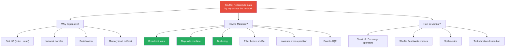

| Concept | Key Takeaway |
|---------|-------------|
| Shuffle triggers | groupBy, join, distinct, repartition, orderBy |
| Sort-based shuffle | 2 files per map task (data + index), handles any partition count |
| Broadcast join | Eliminates shuffle entirely for small tables (< 10MB default) |
| Map-side combine | reduceByKey/DataFrame agg — reduce locally before shuffle |
| Spilling | Happens when sort buffer exceeds memory — 2-4x more disk I/O |
| AQE | Dynamic join switching, partition coalescing, skew handling |
| External Shuffle Service | Keeps shuffle files alive when executors are removed |

---

**[← Previous: 08-partitions.md](08-partitions.md) | [Home](../README.md) | [Next →: 10-memory-management.md](10-memory-management.md)**
