# ⚡ Chapter 10: Memory Management — Spark's Unified Memory Model

> **"Understanding Spark's memory model is the difference between a job that runs and a job that crashes with OOM at 3 AM."**

---

## 📋 Table of Contents

1. [Intuition — Why Memory Management Matters](#intuition--why-memory-management-matters)
2. [Real-World Analogy — The Office Space](#real-world-analogy--the-office-space)
3. [The Unified Memory Model (Spark 1.6+)](#the-unified-memory-model-spark-16)
4. [Memory Regions Explained](#memory-regions-explained)
5. [Dynamic Memory Allocation Between Storage and Execution](#dynamic-memory-allocation-between-storage-and-execution)
6. [On-Heap vs Off-Heap Memory](#on-heap-vs-off-heap-memory)
7. [Executor Memory Breakdown](#executor-memory-breakdown)
8. [Driver Memory](#driver-memory)
9. [How to Calculate Memory Settings](#how-to-calculate-memory-settings)
10. [Memory Pressure and Spilling](#memory-pressure-and-spilling)
11. [GC Tuning — G1GC Recommendations](#gc-tuning--g1gc-recommendations)
12. [Monitoring Memory Usage](#monitoring-memory-usage)
13. [Common OOM Patterns and Fixes](#common-oom-patterns-and-fixes)
14. [Production Scenarios](#production-scenarios)
15. [Troubleshooting](#troubleshooting)
16. [Performance Considerations](#performance-considerations)
17. [Common Mistakes](#common-mistakes)
18. [Interview Questions](#interview-questions)

---

## Intuition — Why Memory Management Matters

Spark processes data **in memory**. That's what makes it fast — reading from RAM is ~100x faster than reading from SSD. But memory is a finite resource, and when you run out, bad things happen:

- **OutOfMemoryError (OOM):** Your executor crashes. The task must be retried on another executor, or the entire stage fails.
- **Excessive GC:** The JVM spends more time cleaning up memory than doing useful work. A job that should take 10 minutes takes 2 hours.
- **Spilling to Disk:** When memory is full, Spark writes data to disk. Your "in-memory" processing is now disk-based — and 100x slower.

> **💡 Key Insight:** Memory management isn't just about "adding more RAM." It's about understanding how Spark uses the memory you give it, and configuring it so that the right amount goes to the right place. A well-tuned 16GB executor can outperform a poorly-tuned 64GB executor.

---

## Real-World Analogy — The Office Space

Imagine your Spark executor is an **office floor** with a fixed amount of space. The space needs to accommodate:

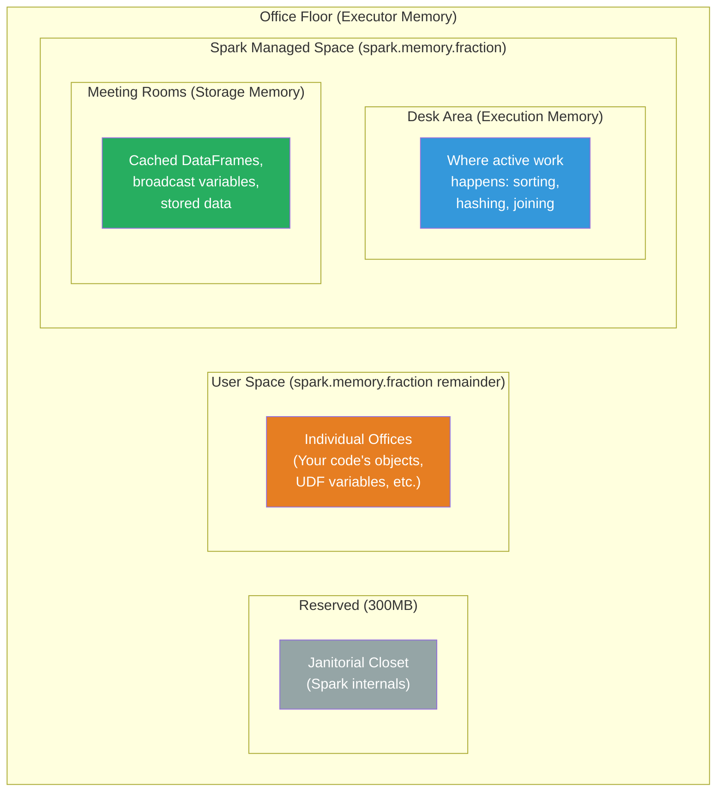

**The key insight:** Meeting rooms (storage) and desk areas (execution) have **flexible walls**. When no meetings are happening, desks can expand into the meeting room space. When the office is quiet, meetings can use desk space. But if both are busy simultaneously, there's contention.

This is exactly how Spark's **unified memory model** works.

---

## The Unified Memory Model (Spark 1.6+)

Before Spark 1.6, storage and execution memory had **fixed boundaries** — a hard wall between them. If storage was full but execution had free space, storage couldn't borrow from execution. This led to either storage eviction or execution OOM, depending on which side was short.

The **Unified Memory Model** replaced the fixed boundary with a **soft boundary** that allows storage and execution to borrow from each other.

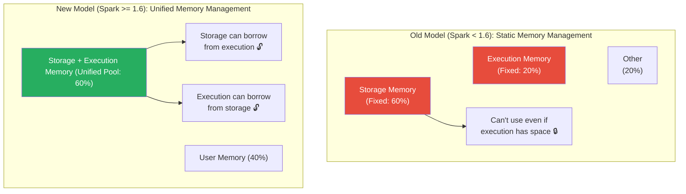

---

## Memory Regions Explained

Every Spark executor's JVM heap is divided into these regions:

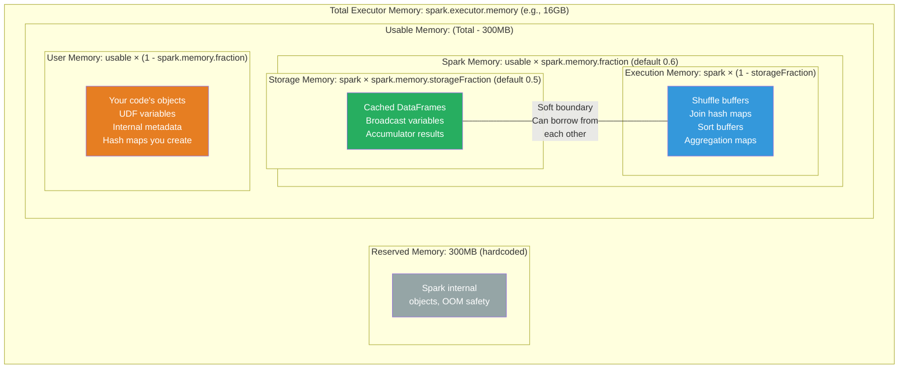

### Memory Region Details

| Region | Size Calculation | What Goes Here |
|--------|-----------------|----------------|
| **Reserved** | 300MB (fixed) | Spark system internals, safety buffer |
| **User Memory** | (Total - 300MB) × (1 - spark.memory.fraction) | Your objects, UDF data, data structures |
| **Spark Memory** | (Total - 300MB) × spark.memory.fraction | Split between Storage and Execution |
| **Storage** | Spark Memory × spark.memory.storageFraction | Cached data, broadcast variables |
| **Execution** | Spark Memory × (1 - spark.memory.storageFraction) | Shuffles, sorts, joins, aggregations |

### Concrete Example: 16GB Executor

```python
spark.conf.set("spark.executor.memory", "16g")
spark.conf.set("spark.memory.fraction", "0.6")
spark.conf.set("spark.memory.storageFraction", "0.5")
```

```
Total Executor Memory: 16 GB = 16,384 MB

Reserved Memory: 300 MB

Usable Memory: 16,384 - 300 = 16,084 MB

Spark Memory: 16,084 × 0.6 = 9,650 MB (~9.4 GB)
  ├── Storage Memory: 9,650 × 0.5 = 4,825 MB (~4.7 GB)
  └── Execution Memory: 9,650 × 0.5 = 4,825 MB (~4.7 GB)

User Memory: 16,084 × 0.4 = 6,434 MB (~6.3 GB)

Visualization:
┌───────────────────────────────────────────────────────┐
│                16 GB Total                            │
├──────┬────────────────────┬────────────────────┬──────┤
│ 300MB│  Storage: 4.7 GB   │ Execution: 4.7 GB  │ User │
│ Rsrv │  (cached data)     │ (shuffle/sort/join) │ 6.3GB│
│      │                    │                     │      │
│      │←───── Soft Boundary ─────→│              │      │
│      │   9.4 GB Spark Memory     │              │      │
└──────┴────────────────────┴────────────────────┴──────┘
```

---

## Dynamic Memory Allocation Between Storage and Execution

The soft boundary between storage and execution follows specific **borrowing rules**:

### Rule 1: Execution Can Borrow from Storage

When execution memory is full and storage has free space, execution can borrow from storage.

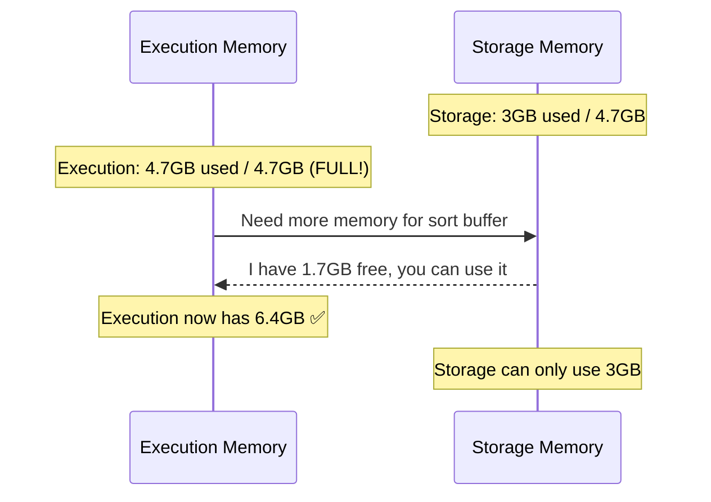

### Rule 2: Storage Can Borrow from Execution (If Free)

When storage is full and execution has free space, storage can borrow from execution.

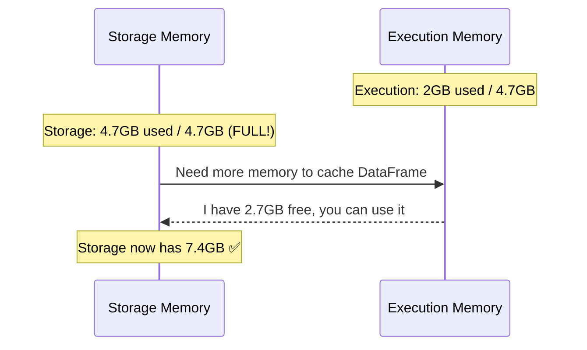

### Rule 3: Execution Can EVICT Storage (But Not Vice Versa)

This is the critical asymmetry:

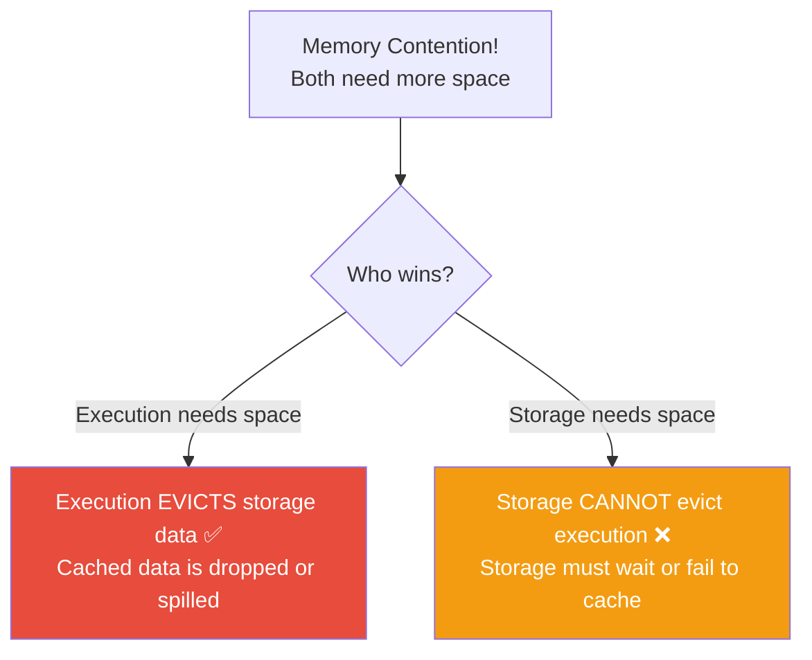

> **💡 Key Insight:** Execution memory **always wins** over storage memory in a conflict. This is by design — it's better to re-read cached data from disk than to crash a running computation. If a shuffle needs memory and cached DataFrames are using it, the cached data gets evicted.

### Why This Matters in Practice

```python
# Scenario: You've cached a large DataFrame
large_df.cache()
large_df.count()  # Forces caching — fills storage memory

# Now you run a heavy aggregation (needs execution memory)
result = large_df.groupBy("key").agg(many_aggregations)
# Execution EVICTS parts of the cached DataFrame to free space
# Next time you access large_df, some partitions must be re-read from source

# Symptoms:
# - Spark UI: Storage tab shows "partially cached"
# - Performance degrades as partitions are re-read from disk
```

---

## On-Heap vs Off-Heap Memory

Spark can use two types of memory:

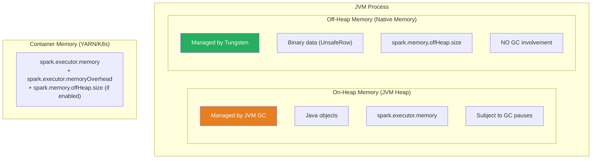

### Configuring Off-Heap Memory

```python
# Enable off-heap memory
spark.conf.set("spark.memory.offHeap.enabled", "true")
spark.conf.set("spark.memory.offHeap.size", "4g")

# Off-heap is used for:
# - Execution memory (shuffle buffers, sort, join)
# - Storage memory (cached data in binary format)
# It does NOT replace on-heap — it supplements it

# Total memory available to Spark = on-heap spark memory + off-heap
```

### When to Use Off-Heap

| Scenario | Recommendation |
|----------|---------------|
| GC pauses > 10% of job time | Enable off-heap |
| Processing > 100GB per executor | Enable off-heap |
| Lots of cached data | Enable off-heap |
| Small data, simple queries | On-heap is fine |
| Already using G1GC effectively | May not need off-heap |

---

## Executor Memory Breakdown

The total memory used by a Spark executor is more than just `spark.executor.memory`:

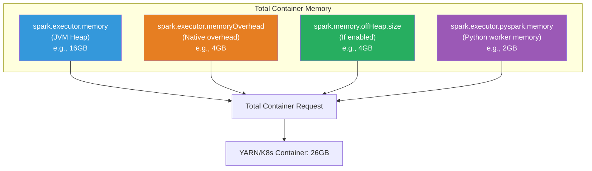

### Each Component Explained

```python
# 1. JVM Heap: spark.executor.memory
# The main memory pool managed by JVM
spark.conf.set("spark.executor.memory", "16g")

# 2. Memory Overhead: spark.executor.memoryOverhead
# For JVM internals, thread stacks, native libraries, NIO buffers
# Default: max(384MB, 0.10 × spark.executor.memory)
spark.conf.set("spark.executor.memoryOverhead", "4g")

# 3. Off-Heap Memory: spark.memory.offHeap.size
# Tungsten's off-heap memory (must be explicitly enabled)
spark.conf.set("spark.memory.offHeap.enabled", "true")
spark.conf.set("spark.memory.offHeap.size", "4g")

# 4. PySpark Memory: spark.executor.pyspark.memory
# Memory for Python processes (UDFs, pandas UDFs)
# Default: not set (uses memoryOverhead)
spark.conf.set("spark.executor.pyspark.memory", "2g")

# Total container memory:
# spark.executor.memory + spark.executor.memoryOverhead + offHeap + pyspark
# = 16 + 4 + 4 + 2 = 26 GB
```

### Key Configuration Parameters

| Parameter | Default | Description |
|-----------|---------|-------------|
| `spark.executor.memory` | 1g | JVM heap size |
| `spark.executor.memoryOverhead` | max(384MB, 0.10 × exec.memory) | Non-heap JVM overhead |
| `spark.memory.fraction` | 0.6 | Fraction of JVM heap for Spark |
| `spark.memory.storageFraction` | 0.5 | Fraction of Spark memory for storage |
| `spark.memory.offHeap.enabled` | false | Enable off-heap memory |
| `spark.memory.offHeap.size` | 0 | Off-heap memory size |
| `spark.executor.pyspark.memory` | Not set | Python worker memory |
| `spark.driver.memory` | 1g | Driver JVM heap |
| `spark.driver.memoryOverhead` | max(384MB, 0.10 × driver.memory) | Driver non-heap overhead |

---

## Driver Memory

The driver has its own memory that's separate from executors. It handles:
- The SparkContext and session
- DAG scheduling
- Task scheduling
- Collecting results (`.collect()`, `.take()`)
- Broadcast variable creation
- Accumulator aggregation

```python
# Driver memory configuration
spark.conf.set("spark.driver.memory", "8g")
spark.conf.set("spark.driver.memoryOverhead", "2g")
spark.conf.set("spark.driver.maxResultSize", "4g")  # Max data collect() can return
```

### When the Driver Needs More Memory

```python
# These operations consume driver memory:
# 1. collect() — brings ALL data to driver
large_df.collect()  # DON'T DO THIS with large data

# 2. toPandas() — converts to Pandas DataFrame on driver
large_df.toPandas()  # Dangerous for large data

# 3. Broadcast variables — created on driver, sent to executors
broadcast_var = sc.broadcast(large_dict)  # 500MB dict → needs 500MB driver memory

# 4. Many small tasks with high scheduling overhead
# 100,000 tasks → each needs driver memory for scheduling metadata

# 5. explain() with large/complex plans
complex_df.explain("codegen")  # Can use significant driver memory
```

---

## How to Calculate Memory Settings

### Step-by-Step Calculation

```python
# Given:
# - Cluster: 10 nodes, each with 64GB RAM, 16 cores
# - Data: 1TB
# - Operations: Joins, aggregations, cached intermediate results

# Step 1: Calculate executors per node
# Leave 1 core for OS + YARN/K8s
cores_per_executor = 5  # Good balance for I/O vs compute
executors_per_node = (16 - 1) // cores_per_executor  # = 3 executors per node
total_executors = 10 * 3  # = 30 executors (reserve 1 for driver)
# Actual: 29 executors

# Step 2: Calculate memory per executor
# Leave ~1GB per node for OS/YARN
ram_per_node = 64 - 1  # 63 GB
ram_per_executor = ram_per_node // executors_per_node  # = 21 GB per executor

# Step 3: Account for overhead
# Container memory = spark.executor.memory + overhead
overhead = max(0.384, 0.10 * 21)  # = 2.1 GB
heap_memory = 21 - 2.1  # = 18.9 GB ≈ 18 GB

# Step 4: Set configurations
spark.conf.set("spark.executor.instances", "29")
spark.conf.set("spark.executor.cores", "5")
spark.conf.set("spark.executor.memory", "18g")
spark.conf.set("spark.executor.memoryOverhead", "3g")  # Round up for safety

# Step 5: Calculate internal memory regions
# Spark memory: (18GB - 300MB) × 0.6 = 10.6 GB
# Storage: 10.6 × 0.5 = 5.3 GB
# Execution: 10.6 × 0.5 = 5.3 GB
# User: (18GB - 300MB) × 0.4 = 7.1 GB
```

### Quick Reference Formulas

```
Container Memory = spark.executor.memory + memoryOverhead + offHeap + pyspark

JVM Heap = spark.executor.memory

Usable Memory = JVM Heap - 300MB

Spark Memory = Usable Memory × spark.memory.fraction

Storage Memory = Spark Memory × spark.memory.storageFraction

Execution Memory = Spark Memory × (1 - spark.memory.storageFraction)

User Memory = Usable Memory × (1 - spark.memory.fraction)
```

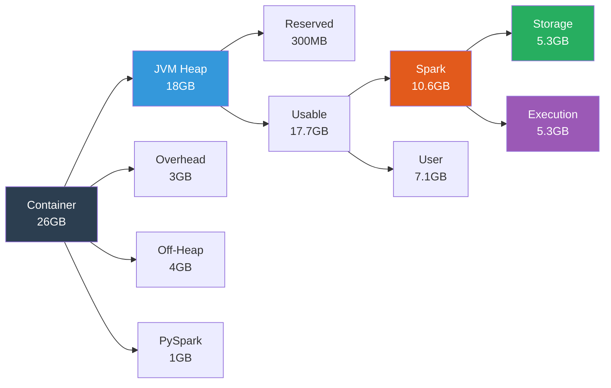

---

## Memory Pressure and Spilling

### What Happens When Memory Runs Out

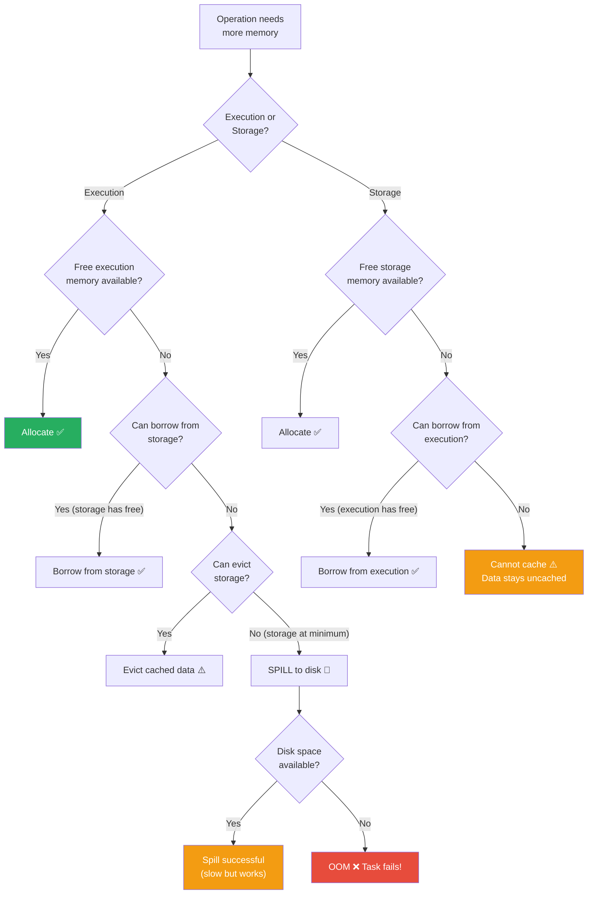

### Spilling in Detail

When execution memory is exhausted, Spark spills data to disk:

```python
# Spilling happens during:
# 1. Shuffle sort — sort buffer too large
# 2. Hash aggregate — hash map too large
# 3. Hash join — build-side hash table too large
# 4. Sort operations — external sort needed

# Monitor spilling in Spark UI:
# Stages → Stage Details → "Shuffle Spill (Memory)" and "Shuffle Spill (Disk)"

# Shuffle Spill (Memory): 50 GB  ← Amount of data before serialization
# Shuffle Spill (Disk): 15 GB    ← Amount after serialization + compression

# If Spill (Disk) > 0, you have spilling
# Performance impact: 2-10x slower than in-memory processing
```

### Reducing Spilling

```python
# Strategy 1: Increase executor memory
spark.conf.set("spark.executor.memory", "32g")

# Strategy 2: Increase memory fraction for execution
spark.conf.set("spark.memory.fraction", "0.75")  # Default 0.6
# WARNING: This reduces user memory — may cause issues with complex UDFs

# Strategy 3: Increase partition count (less data per task)
spark.conf.set("spark.sql.shuffle.partitions", "4000")
# Each task processes less data → less memory needed

# Strategy 4: Use off-heap memory (reduces GC, more usable memory)
spark.conf.set("spark.memory.offHeap.enabled", "true")
spark.conf.set("spark.memory.offHeap.size", "8g")

# Strategy 5: Optimize the query (reduce data volume)
# - Filter early
# - Select only needed columns
# - Use broadcast joins instead of sort-merge joins
```

---

## GC Tuning — G1GC Recommendations

### Understanding GC Impact

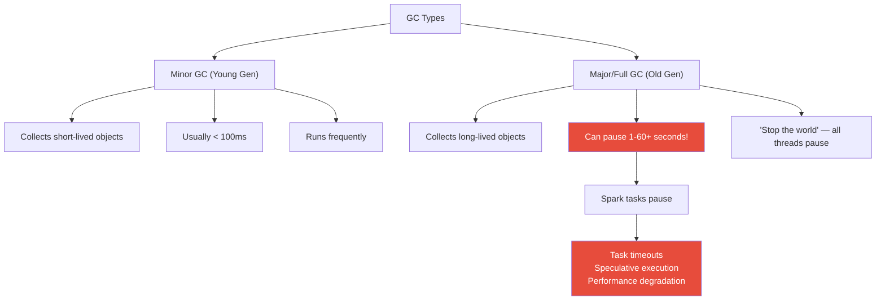

### Recommended G1GC Configuration

```python
# G1GC is recommended for Spark (default since Java 9)
spark.conf.set("spark.executor.extraJavaOptions",
    "-XX:+UseG1GC "
    "-XX:G1HeapRegionSize=16m "          # Region size (power of 2, 1-32MB)
    "-XX:InitiatingHeapOccupancyPercent=35 "  # Start GC at 35% heap usage
    "-XX:ConcGCThreads=4 "              # Concurrent GC threads
    "-XX:+ParallelRefProcEnabled "       # Parallel reference processing
    "-XX:MaxGCPauseMillis=200 "          # Target max GC pause
    "-verbose:gc "                        # Enable GC logging
    "-XX:+PrintGCDetails "               # Detailed GC output
    "-XX:+PrintGCTimeStamps "            # GC timestamps
)

# For the driver
spark.conf.set("spark.driver.extraJavaOptions",
    "-XX:+UseG1GC -XX:G1HeapRegionSize=16m "
    "-XX:InitiatingHeapOccupancyPercent=35"
)
```

### G1GC Tuning Guidelines

| Parameter | Default | Recommendation | Why |
|-----------|---------|---------------|-----|
| `-XX:G1HeapRegionSize` | Auto | 16m | Large regions reduce region management overhead |
| `-XX:InitiatingHeapOccupancyPercent` | 45 | 35 | Start GC earlier to avoid Full GC |
| `-XX:ConcGCThreads` | Auto | 4-8 | Parallel concurrent marking |
| `-XX:MaxGCPauseMillis` | 200 | 200-500 | Target pause time |
| `-XX:+ParallelRefProcEnabled` | Off | On | Faster reference processing |

### When to Consider Other GC Options

```python
# ZGC (Java 15+) — ultra-low latency GC
# Good for: Streaming workloads with strict latency requirements
# JVM flag: -XX:+UseZGC

# Shenandoah (Java 12+) — low-pause concurrent GC
# Good for: Large heaps where G1GC pauses are too long
# JVM flag: -XX:+UseShenandoahGC

# For most Spark workloads, G1GC is the best choice.
```

---

## Monitoring Memory Usage

### Spark UI — Executors Tab

```
Spark UI → Executors tab shows:

┌──────────┬──────────┬──────────┬──────────┬──────────┬──────┐
│ Executor │ Storage  │ Storage  │ Cores    │ Active   │ GC   │
│ ID       │ Memory   │ Memory   │ Used     │ Tasks    │ Time │
│          │ Used     │ Available│          │          │      │
├──────────┼──────────┼──────────┼──────────┼──────────┼──────┤
│ 1        │ 2.5 GB   │ 5.3 GB   │ 5/5      │ 5        │ 45s  │
│ 2        │ 4.8 GB   │ 5.3 GB   │ 5/5      │ 5        │ 120s │ ← High GC!
│ 3        │ 0.2 GB   │ 5.3 GB   │ 5/5      │ 5        │ 12s  │
└──────────┴──────────┴──────────┴──────────┴──────────┴──────┘

Key indicators:
- GC Time: Should be < 10% of total task time
- Storage Memory Used vs Available: Shows caching pressure
- If GC Time is high → tune GC or increase memory
```

### Spark UI — SQL Tab

```
SQL tab → Click on query → Details shows:

Physical Plan with metrics:
*(2) HashAggregate(keys=[country], functions=[sum(amount)])
   ← number of output rows: 195
   ← peak memory: 256 KB                    ← Memory used for aggregate
+- Exchange hashpartitioning(country, 200)
   ← data size: 4.5 MB
+- *(1) HashAggregate(keys=[country], functions=[partial_sum(amount)])
   ← number of output rows: 1,234
   ← peak memory: 128 MB                   ← Peak memory for partial agg
   ← spill size: 0 B                        ← No spilling ✅
```

### Spark UI — Storage Tab

```
Storage tab shows cached DataFrames/RDDs:

┌──────────────┬──────────┬───────────┬──────────┬─────────────┐
│ RDD Name     │ Storage  │ Cached    │ Total    │ Fraction    │
│              │ Level    │ Partitions│ Size     │ Cached      │
├──────────────┼──────────┼───────────┼──────────┼─────────────┤
│ DataFrame[25]│ MEMORY   │ 180/200   │ 8.5 GB   │ 90%         │ ← 10% evicted!
│ DataFrame[42]│ DISK_ONLY│ 200/200   │ 15 GB    │ 100%        │
└──────────────┴──────────┴───────────┴──────────┴─────────────┘

If Fraction Cached < 100%, some partitions were evicted due to memory pressure.
```

### Programmatic Monitoring

```python
# Check memory status via SparkContext
sc = spark.sparkContext

# Get storage memory info
for executor_id, info in sc._jsc.sc().getExecutorMemoryStatus().items():
    max_mem = info._1()
    remaining_mem = info._2()
    used_mem = max_mem - remaining_mem
    print(f"Executor {executor_id}: {used_mem/1e9:.1f}GB / {max_mem/1e9:.1f}GB "
          f"({100*used_mem/max_mem:.0f}% used)")

# Check cached DataFrames
for rdd_info in sc._jsc.sc().getRDDStorageInfo():
    print(f"RDD {rdd_info.name()}: {rdd_info.memSize()/1e9:.1f}GB, "
          f"{rdd_info.numCachedPartitions()}/{rdd_info.numPartitions()} cached")
```

---

## Common OOM Patterns and Fixes

### Pattern 1: Driver OOM from collect()

```python
# ❌ Symptom: java.lang.OutOfMemoryError on the DRIVER
# Error: "java.lang.OutOfMemoryError: Java heap space" in driver logs

# Root cause: Collecting large data to driver
data = large_df.collect()  # 100GB DataFrame → Driver OOM

# Fix 1: Don't collect large data
# Process on the cluster, only collect summaries
summary = large_df.groupBy("category").count().collect()  # Small result

# Fix 2: Limit result size
spark.conf.set("spark.driver.maxResultSize", "4g")
# This prevents accidental large collects

# Fix 3: Use take() or limit() instead of collect()
sample = large_df.take(1000)  # Only 1000 rows
small_df = large_df.limit(100)  # Only 100 rows
```

### Pattern 2: Executor OOM During Joins

```python
# ❌ Symptom: OOM during Sort-Merge Join or Broadcast Hash Join
# Error: "java.lang.OutOfMemoryError: Java heap space" on executor

# Root cause 1: Broadcasting a table that's too large
result = df1.join(broadcast(too_large_df), "key")
# The broadcasted table must fit in executor memory!

# Fix: Reduce broadcast threshold or use sort-merge join
spark.conf.set("spark.sql.autoBroadcastJoinThreshold", "-1")  # Disable broadcast
# Or set to appropriate size
spark.conf.set("spark.sql.autoBroadcastJoinThreshold", "10m")

# Root cause 2: Skewed join partition
# One partition has 100x more data, causing OOM

# Fix: Enable AQE skew handling
spark.conf.set("spark.sql.adaptive.enabled", "true")
spark.conf.set("spark.sql.adaptive.skewJoin.enabled", "true")

# Root cause 3: Not enough partitions
spark.conf.set("spark.sql.shuffle.partitions", "2000")  # More partitions = less per task
```

### Pattern 3: Executor OOM During Aggregation

```python
# ❌ Symptom: OOM during groupBy with many distinct groups
# Root cause: Hash aggregation table too large

# Fix 1: Increase partitions (reduce data per task)
spark.conf.set("spark.sql.shuffle.partitions", "4000")

# Fix 2: Fall back to sort-based aggregation
spark.conf.set("spark.sql.execution.useObjectHashAggregateExec", "false")

# Fix 3: Increase executor memory
spark.conf.set("spark.executor.memory", "32g")
```

### Pattern 4: OOM from Python UDFs

```python
# ❌ Symptom: Container killed by YARN/K8s for exceeding memory
# Note: Python UDFs run in separate Python processes
# Their memory is NOT governed by spark.executor.memory

# Fix: Set PySpark memory
spark.conf.set("spark.executor.pyspark.memory", "2g")

# Fix: Increase overhead (Python processes use overhead memory)
spark.conf.set("spark.executor.memoryOverhead", "4g")

# Better fix: Replace Python UDFs with built-in functions or Pandas UDFs
from pyspark.sql.functions import pandas_udf
import pandas as pd

@pandas_udf("double")
def vectorized_calc(series: pd.Series) -> pd.Series:
    return series * 1.1  # Much more memory-efficient than row UDFs
```

### Pattern 5: OOM from Excessive Caching

```python
# ❌ Symptom: Storage memory full, execution starts spilling
# Root cause: Caching too many DataFrames

# Anti-pattern:
df1.cache()
df2.cache()
df3.cache()
df4.cache()
# Now all execution memory is used for storage!

# Fix 1: Uncache DataFrames you no longer need
df1.unpersist()

# Fix 2: Use DISK_ONLY for large, infrequently accessed data
from pyspark.storagelevel import StorageLevel
large_df.persist(StorageLevel.DISK_ONLY)

# Fix 3: Use MEMORY_AND_DISK (spill to disk if memory is full)
large_df.persist(StorageLevel.MEMORY_AND_DISK)

# Fix 4: Only cache DataFrames that are used multiple times
# If you use a DataFrame only once, caching is wasteful
```

### Pattern 6: Container Killed by YARN/Kubernetes

```python
# ❌ Symptom: "Container killed by YARN for exceeding memory limits"
# or "Container killed by the ApplicationMaster"

# Root cause: Total memory (heap + overhead + off-heap) exceeds container limit

# The container limit is:
# spark.executor.memory + spark.executor.memoryOverhead + spark.memory.offHeap.size

# Fix: Increase overhead to account for native memory usage
spark.conf.set("spark.executor.memoryOverhead", "4g")  # Increase from default

# Common causes of high native memory:
# - Many threads (each thread stack = 1MB)
# - NIO direct buffers (network I/O)
# - JNI libraries (compression codecs, etc.)
# - Python processes (PySpark UDFs)
```

---

## Production Scenarios

### Scenario 1: E-Commerce — Black Friday Traffic Spike

```python
# Problem: Spark job that normally processes 100GB now has 2TB (Black Friday)
# Symptom: OOM errors, 50% of tasks failing

# Before (tuned for 100GB):
spark.conf.set("spark.executor.memory", "8g")
spark.conf.set("spark.executor.instances", "20")
spark.conf.set("spark.sql.shuffle.partitions", "200")

# After (tuned for 2TB):
spark.conf.set("spark.executor.memory", "16g")        # 2x memory
spark.conf.set("spark.executor.instances", "50")       # 2.5x executors
spark.conf.set("spark.sql.shuffle.partitions", "4000") # 20x partitions
spark.conf.set("spark.memory.fraction", "0.7")         # More for Spark
spark.conf.set("spark.executor.memoryOverhead", "4g")  # Safety margin
spark.conf.set("spark.sql.adaptive.enabled", "true")   # Let AQE help

# Result: Job completes in 45 minutes instead of crashing
```

### Scenario 2: Streaming Job — Memory Leak Detection

```python
# Problem: Streaming job's memory usage grows over days until OOM
# Root cause: State accumulation in streaming stateful operations

# Diagnosis:
# 1. Check Spark UI → Executors → Storage Memory over time
# 2. If storage memory grows continuously, likely state accumulation

# Fix 1: Set state TTL
spark.conf.set("spark.sql.streaming.stateStore.providerClass",
    "org.apache.spark.sql.execution.streaming.state.HDFSBackedStateStoreProvider")

# Fix 2: Watermark + event time for state cleanup
from pyspark.sql.functions import window

streaming_df \
    .withWatermark("event_time", "1 hour") \
    .groupBy(window("event_time", "10 minutes"), "user_id") \
    .count()
# State older than 1 hour is automatically cleaned up
```

### Scenario 3: Calculating Memory for a New Cluster

```python
# Task: Set up a cluster for daily 5TB ETL job
# Cluster: 20 nodes, 128GB RAM each, 32 cores each

# Step 1: Executor sizing
cores_per_executor = 5   # Balance of I/O and compute
executors_per_node = (32 - 1) // 5  # = 6 executors per node (leave 1 core for OS)
total_executors = 20 * 6 - 1  # = 119 executors (1 for driver)

# Step 2: Memory per executor
ram_per_node = 128 - 2  # Leave 2GB for OS
ram_per_executor = ram_per_node // 6  # = 21 GB

# Step 3: JVM heap calculation
overhead = max(0.384, 0.10 * 21)  # = 2.1 GB, round to 3GB for safety
heap = 21 - 3  # = 18 GB

# Step 4: Verify partition sizing
# 5TB → shuffle partitions = 5 * 1024 * 1024 / 128 = ~40,000 partitions
# 119 executors × 5 cores = 595 concurrent tasks
# Waves: 40,000 / 595 = ~67 waves (acceptable)
# Per-task data: 5TB / 40,000 = ~128MB (perfect!)

# Step 5: Final configuration
config = {
    "spark.executor.instances": "119",
    "spark.executor.cores": "5",
    "spark.executor.memory": "18g",
    "spark.executor.memoryOverhead": "3g",
    "spark.driver.memory": "8g",
    "spark.driver.memoryOverhead": "2g",
    "spark.sql.shuffle.partitions": "40000",
    "spark.memory.fraction": "0.6",
    "spark.memory.storageFraction": "0.5",
    "spark.sql.adaptive.enabled": "true",
}

for key, value in config.items():
    spark.conf.set(key, value)
```

---

## Troubleshooting

### Diagnostic Flowchart

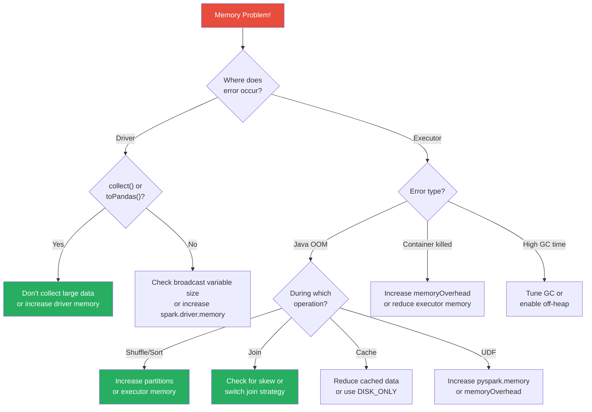

### Quick Diagnostic Commands

```python
# 1. Check current memory configuration
print("Executor Memory:", spark.conf.get("spark.executor.memory"))
print("Memory Fraction:", spark.conf.get("spark.memory.fraction"))
print("Storage Fraction:", spark.conf.get("spark.memory.storageFraction"))
print("Off-Heap Enabled:", spark.conf.get("spark.memory.offHeap.enabled", "false"))
print("Shuffle Partitions:", spark.conf.get("spark.sql.shuffle.partitions"))

# 2. Check cached data
print("\nCached RDDs:")
for rdd_info in spark.sparkContext._jsc.sc().getRDDStorageInfo():
    print(f"  {rdd_info.name()}: {rdd_info.memSize()/1e9:.2f} GB")

# 3. Check partition sizes (helps identify skew causing OOM)
from pyspark.sql.functions import spark_partition_id, count
df.withColumn("pid", spark_partition_id()) \
  .groupBy("pid").count() \
  .agg(
      max("count").alias("max_partition_rows"),
      min("count").alias("min_partition_rows"),
      avg("count").alias("avg_partition_rows")
  ).show()
```

---

## Performance Considerations

### Memory Optimization Checklist

```python
# 1. Right-size executors (not too big, not too small)
# Too big: Long GC pauses, HDFS throughput issues (> 5 cores per executor)
# Too small: Overhead dominates, can't fit broadcast variables

# 2. Set shuffle partitions based on data size
data_size_gb = 100
spark.conf.set("spark.sql.shuffle.partitions",
    str(max(200, int(data_size_gb * 1024 / 128))))

# 3. Enable AQE for automatic optimization
spark.conf.set("spark.sql.adaptive.enabled", "true")
spark.conf.set("spark.sql.adaptive.coalescePartitions.enabled", "true")

# 4. Cache strategically — only what's reused
frequently_used_df.cache()
one_time_df  # DON'T cache

# 5. Use appropriate storage levels
from pyspark.storagelevel import StorageLevel
# MEMORY_ONLY: Fast but may evict other data
# MEMORY_AND_DISK: Safe — spills to disk if needed
# DISK_ONLY: When data is large and rarely accessed
# MEMORY_ONLY_SER: Serialized — uses less memory but more CPU

# 6. Unpersist when done
df.unpersist()

# 7. Increase memory fraction if you don't use complex UDFs
# Default 0.6 → try 0.7 or 0.75
spark.conf.set("spark.memory.fraction", "0.75")
```

### Memory vs. Cores vs. Partitions

| Setting | Impact on Memory |
|---------|-----------------|
| More partitions | Less memory per task ✅ |
| More cores per executor | More concurrent tasks = more memory competition ⚠️ |
| Larger executor memory | More space but longer GC pauses ⚠️ |
| Off-heap memory | Reduces GC pressure ✅ |
| More executors (smaller) | Less per-executor pressure but more overhead ⚠️ |

---

## Common Mistakes

### Mistake 1: Setting spark.executor.memory Too High

```python
# ❌ One huge executor per node
spark.conf.set("spark.executor.memory", "120g")  # On a 128GB node
spark.conf.set("spark.executor.cores", "32")

# Problems:
# 1. GC pauses on 120GB heap can be 30+ seconds
# 2. HDFS throughput limited (optimal is ~5 cores per executor)
# 3. If this executor fails, you lose a LOT of work
# 4. YARN/K8s overhead not accounted for → container killed

# ✅ Multiple smaller executors
spark.conf.set("spark.executor.memory", "18g")
spark.conf.set("spark.executor.cores", "5")
spark.conf.set("spark.executor.instances", "6")  # per node
```

### Mistake 2: Caching Everything

```python
# ❌ Cache every intermediate DataFrame
step1 = df.filter(...).cache()
step2 = step1.join(...).cache()
step3 = step2.groupBy(...).cache()
step4 = step3.filter(...).cache()
# Storage memory full → execution starved → spilling everywhere

# ✅ Only cache DataFrames used multiple times
filtered_df = df.filter(...)  # Used in 3 different joins
filtered_df.cache()
result1 = filtered_df.join(table_a, "key")
result2 = filtered_df.join(table_b, "key")
result3 = filtered_df.join(table_c, "key")
filtered_df.unpersist()  # Clean up when done
```

### Mistake 3: Ignoring memoryOverhead

```python
# ❌ Only setting heap memory
spark.conf.set("spark.executor.memory", "16g")
# Container gets: 16g + 1.6g (10% default) = 17.6g
# But native memory usage is 5GB → container killed!

# ✅ Always set adequate overhead
spark.conf.set("spark.executor.memory", "16g")
spark.conf.set("spark.executor.memoryOverhead", "4g")
# Container gets: 16g + 4g = 20g — enough for native memory
```

### Mistake 4: Not Monitoring GC

```python
# ❌ Not checking GC metrics
# Job takes 2 hours but could take 20 minutes without GC pauses

# ✅ Always enable GC logging and check Spark UI
spark.conf.set("spark.executor.extraJavaOptions",
    "-verbose:gc -XX:+PrintGCDetails -XX:+PrintGCTimeStamps")

# Check: Spark UI → Executors → GC Time
# If GC Time > 10% of total time → tune GC or memory
```

### Mistake 5: Using collect() on Large Data

```python
# ❌ This brings ALL data to the driver
all_data = df.collect()  # 50GB → Driver OOM

# ✅ Process on cluster, collect only results
summary = df.groupBy("category").agg(
    count("*"), sum("amount"), avg("amount")
).collect()  # Tiny result set
```

---

## Interview Questions

### Beginner Level

**Q1: What are the memory regions in a Spark executor?**

> **A:** A Spark executor's memory is divided into: (1) **Reserved Memory** (300MB, hardcoded) for Spark internals, (2) **User Memory** — `(Total - 300MB) × (1 - spark.memory.fraction)` — for user code objects, UDF variables, and data structures, (3) **Spark Memory** — `(Total - 300MB) × spark.memory.fraction` — split between **Storage Memory** (cached DataFrames, broadcast variables) and **Execution Memory** (shuffle buffers, sort buffers, join hash tables). Storage and Execution share a soft boundary and can borrow from each other.

**Q2: What's the difference between spark.executor.memory and spark.executor.memoryOverhead?**

> **A:** `spark.executor.memory` sets the JVM heap size — this is where Java objects live and is subject to Garbage Collection. `spark.executor.memoryOverhead` is additional memory for JVM internals (thread stacks, NIO direct buffers), native libraries (compression codecs), and Python processes (PySpark UDFs). The container memory requested from YARN/K8s is the sum of both. Default overhead is `max(384MB, 0.10 × spark.executor.memory)`. If the total process memory exceeds the container limit, the container is killed.

**Q3: What happens when a Spark executor runs out of memory?**

> **A:** It depends on which region is exhausted: (1) **Execution memory full:** First tries to borrow from storage. If storage has cached data, execution can evict it. If still not enough, data spills to disk. If disk is also full, OOM error and the task fails. (2) **Storage memory full:** Tries to borrow from free execution memory. If none available, new data simply isn't cached (partially cached). Storage can never evict execution data. (3) **User memory full:** Java OOM error — the task crashes. This typically happens with large UDFs or user data structures.

### Intermediate Level

**Q4: Explain the unified memory model and how storage and execution share memory.**

> **A:** The unified memory model (Spark 1.6+) replaced the old static model where storage and execution had fixed boundaries. In the unified model, both share a pool defined by `spark.memory.fraction` (default 0.6 of usable heap). The initial split is determined by `spark.memory.storageFraction` (default 0.5), but this is a **soft boundary**. Either side can borrow from the other when the other has free space. The key asymmetry: execution can **evict** storage data when it needs more space (cached data is dropped), but storage **cannot** evict execution data (active computations take priority). This design ensures that running computations never fail due to caching pressure.

**Q5: How would you diagnose and fix an OOM error that occurs during a shuffle?**

> **A:** Diagnosis: (1) Check Spark UI → Stages → the failing stage for shuffle spill metrics. (2) Check task-level metrics for skew (one task with much more data). (3) Check the error message — is it Java heap OOM or container killed?
>
> Fixes, in order of preference: (1) Increase `spark.sql.shuffle.partitions` — more partitions = less data per task. (2) Enable AQE for dynamic optimization. (3) Increase `spark.executor.memory`. (4) Enable off-heap memory. (5) If the issue is skew, apply salting or AQE skew join handling. (6) Reduce the data being shuffled — filter earlier, select fewer columns, use broadcast joins for small tables.

**Q6: What's the recommended approach for sizing executors on a cluster?**

> **A:** The general approach: (1) Set cores per executor to 5 (optimal for HDFS throughput and avoiding excessive GC). (2) Leave 1 core per node for OS/YARN. (3) Calculate executors per node: `(total_cores - 1) / 5`. (4) Calculate memory per executor: `(total_RAM - OS_reserve) / executors_per_node`. (5) Set `spark.executor.memory` to this value minus the overhead (10-15%). (6) Set `spark.executor.memoryOverhead` to at least 10% of executor memory, more for PySpark jobs. (7) Reserve one executor for the ApplicationMaster/driver. Example: 128GB/32-core node → 6 executors × 5 cores, ~18GB heap + 3GB overhead each.

### Advanced Level

**Q7: Explain how Spark's memory management interacts with Tungsten's off-heap storage.**

> **A:** Tungsten can store data in two modes: on-heap (as byte arrays managed by JVM GC) or off-heap (via `sun.misc.Unsafe.allocateMemory()`). Off-heap memory is tracked by Spark's `MemoryManager` but not by the JVM GC. The unified memory model's storage and execution regions apply to both modes. When off-heap is enabled, the total Spark memory pool is the sum of on-heap Spark memory and `spark.memory.offHeap.size`. The `MemoryManager` decides whether to allocate from on-heap or off-heap based on the operation. Execution operations (shuffle buffers, sort arrays) prefer off-heap to avoid GC pressure. Cached DataFrames can be stored either way depending on the storage level. Off-heap reduces GC scanning surface but requires careful sizing since native memory errors (segfaults) are harder to debug than Java OOM.

**Q8: Design a memory configuration for a production job that processes 10TB of data with complex joins, 20% data cached, and Python UDFs.**

> **A:** Given the complexity, I'd approach it as:
>
> **Cluster:** 50 nodes × 256GB RAM × 48 cores
> - Cores per executor: 5 (HDFS optimal)
> - Executors per node: (48-1)/5 = 9
> - Total executors: 50 × 9 - 1 = 449
>
> **Memory per executor:**
> - Total: (256-2)/9 ≈ 28GB
> - Overhead: 4GB (high because of Python UDFs)
> - PySpark memory: 2GB
> - Off-heap: 4GB (reduce GC for joins)
> - JVM heap: 28 - 4 - 2 - 4 = 18GB
>
> **Internal configuration:**
> - `spark.memory.fraction`: 0.7 (20% data cached needs more Spark memory)
> - `spark.memory.storageFraction`: 0.4 (more for execution since joins are complex)
> - Shuffle partitions: 10TB / 128MB ≈ 80,000
>
> **GC:** G1GC with `-XX:G1HeapRegionSize=16m -XX:InitiatingHeapOccupancyPercent=30`
>
> **Verification:** 
> - Storage per executor: 18GB × 0.7 × 0.4 = 5.0GB. Total: 449 × 5GB = 2.2TB (enough for 2TB = 20% of 10TB)
> - Execution per executor: 18GB × 0.7 × 0.6 = 7.6GB (comfortable for joins)

**Q9: How does Spark handle memory when multiple tasks run concurrently on the same executor?**

> **A:** Within an executor, execution memory is shared among all concurrent tasks (up to `spark.executor.cores` tasks). The `TaskMemoryManager` manages per-task allocations from the shared pool. When a task requests memory: (1) It checks the memory pool for available space. (2) If available, it allocates. (3) If not, it tries to evict storage or spill other tasks' data. The memory is divided **fairly** — each task gets at most `1/N` of total execution memory (where N is active tasks). If a task exceeds its fair share, it may be asked to spill. This means with 5 cores, each task gets ~1/5 of execution memory. More cores per executor = less memory per task = more spilling risk. This is why 5 cores per executor is a common recommendation — it balances parallelism with per-task memory.

**Q10: You're seeing intermittent OOM errors that don't reproduce consistently. What's your debugging approach?**

> **A:** Intermittent OOM suggests data-dependent behavior:
> 1. **Check for skew:** The OOM might only happen when a skewed partition lands on a specific executor. Add `spark_partition_id()` to identify skewed partitions.
> 2. **Check GC logs:** Enable verbose GC. Intermittent OOM often correlates with Full GC that can't free enough memory — the heap is fragmented.
> 3. **Check container memory vs. JVM memory:** If the container is killed (not Java OOM), it's native memory. Look for Python UDF memory leaks or NIO buffer accumulation.
> 4. **Check for concurrent task memory:** If the OOM happens when all cores are active but not with fewer tasks, per-task memory is too low. Reduce `spark.executor.cores`.
> 5. **Enable heap dump on OOM:** `-XX:+HeapDumpOnOutOfMemoryError` to capture the state.
> 6. **Check for data variability:** Some days may have more data or different distributions. Monitor data volume and partition sizes across runs.
> 7. **Add memory pressure metrics:** Use Spark's `TaskMetrics` to log per-task memory usage, especially peak memory and spill amounts.

---

## Summary

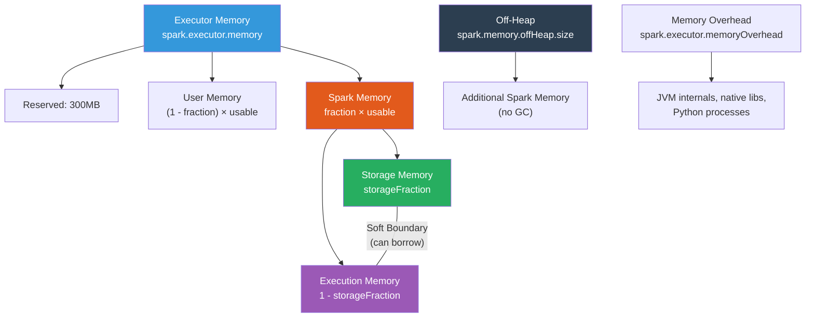

| Concept | Key Takeaway |
|---------|-------------|
| Unified Memory | Storage and execution share a pool with soft boundary |
| Memory Fraction | Default 0.6 — increase for heavy Spark workloads |
| Storage Fraction | Default 0.5 — initial split, not a hard limit |
| Execution Priority | Execution can evict storage data; storage cannot evict execution |
| Off-Heap | Bypasses GC — great for large datasets and reducing GC pauses |
| Executor Sizing | 5 cores, 15-20GB heap is a common optimal configuration |
| GC Tuning | G1GC with low IHOP (35%), 16MB regions for Spark |
| OOM Prevention | Right-size partitions, monitor spill, cache strategically |
| Memory Overhead | Always account for non-heap memory (threads, NIO, Python) |

---

**[← Previous: 09-shuffles.md](09-shuffles.md) | [Home](../README.md) | [Next →: 11-spark-execution-plan.md](11-spark-execution-plan.md)**
