# ⚡ Chapter 11: Spark Execution Plan — From Code to Results

> **"Understanding how Spark turns your code into distributed computation is the difference between writing Spark jobs and mastering Spark."**

---

## 📋 Table of Contents

- [Intuition — Why This Matters](#intuition--why-this-matters)
- [Real-World Analogy — From Script to Screen](#real-world-analogy--from-script-to-screen)
- [The Complete Journey — Code to Results](#the-complete-journey--code-to-results)
- [Logical Plan → Physical Plan](#logical-plan--physical-plan)
- [Jobs, Stages, and Tasks](#jobs-stages-and-tasks)
- [DAGScheduler — The Director](#dagscheduler--the-director)
- [TaskScheduler — The Floor Manager](#taskscheduler--the-floor-manager)
- [Narrow vs Wide Transformations](#narrow-vs-wide-transformations)
- [Stage Boundaries at Shuffles](#stage-boundaries-at-shuffles)
- [Task Serialization and Result Handling](#task-serialization-and-result-handling)
- [Speculative Execution](#speculative-execution)
- [Scheduling Modes — FIFO vs FAIR](#scheduling-modes--fifo-vs-fair)
- [Reading the Spark UI](#reading-the-spark-ui)
- [Execution DAG Visualization](#execution-dag-visualization)
- [Event Timeline](#event-timeline)
- [Production Scenarios](#production-scenarios)
- [Troubleshooting Guide](#troubleshooting-guide)
- [Performance Considerations](#performance-considerations)
- [Common Mistakes](#common-mistakes)
- [Interview Questions](#interview-questions)

---

## Intuition — Why This Matters

When you write PySpark code like this:

```python
result = df.filter(col("age") > 30).groupBy("city").count().collect()
```

You see **one line of code**. But behind the scenes, Spark orchestrates an incredibly complex symphony:

1. Your code is parsed into a **logical plan** (what you want)
2. The Catalyst optimizer converts it to an **optimized physical plan** (how to do it efficiently)
3. The **DAGScheduler** breaks the work into **stages** based on data dependencies
4. Each stage is split into **tasks** — one per data partition
5. The **TaskScheduler** assigns tasks to **executors** across the cluster
6. Results flow back from executors to the driver

Understanding this journey lets you:
- **Read execution plans** and know exactly what Spark is doing
- **Identify bottlenecks** (is it a shuffle? a skewed partition? a slow executor?)
- **Optimize jobs** by restructuring transformations
- **Debug failures** by pinpointing exactly where things broke

> **💡 Key Insight:** Every performance problem in Spark can be traced to a specific step in this execution pipeline. Master the pipeline, master the debugging.

---

## Real-World Analogy — From Script to Screen

Think of Spark execution like **making a movie**:

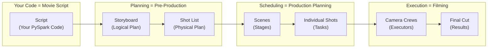

| Movie Making | Spark Execution |
|---|---|
| **Script** | Your PySpark code (transformations + action) |
| **Director** reads script, creates storyboard | **Catalyst** reads code, creates logical plan |
| **Director** plans exact camera angles, lighting | **Catalyst** creates optimized physical plan |
| **Production manager** breaks film into scenes | **DAGScheduler** breaks plan into stages |
| Each scene has multiple **shots** | Each stage has multiple **tasks** |
| Scenes must be filmed in dependency order | Stages execute in dependency order |
| **Shots within a scene** can be filmed in parallel | **Tasks within a stage** run in parallel |
| **Camera crews** do the actual filming | **Executors** do the actual computation |
| Some scenes need **props from previous scenes** | Some stages need **shuffle data from previous stages** |
| The **editor** assembles the final cut | The **driver** assembles the final results |

> **🎬 Key Insight:** Just like a movie can't film the car chase before building the car, Spark can't execute a downstream stage until its upstream shuffle data is ready.

---

## The Complete Journey — Code to Results

Here is the **complete end-to-end journey** when you call an action in Spark:

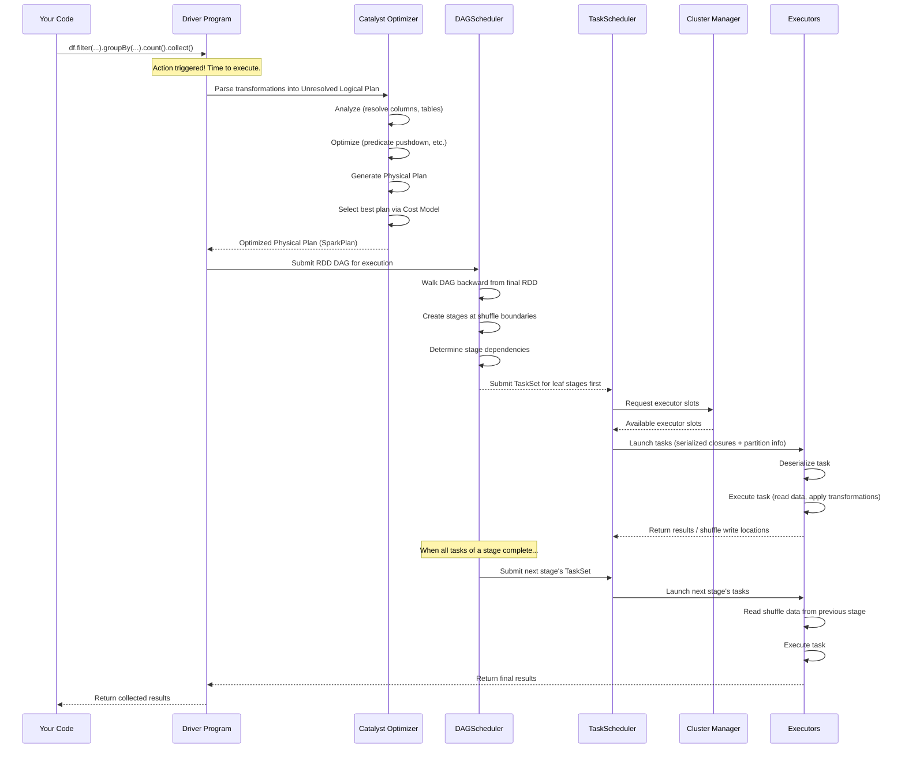

### Step-by-Step Breakdown

#### Step 1: Action Triggers Execution
```python
# Nothing happens until THIS line — lazy evaluation
result = df.filter(col("age") > 30).groupBy("city").count()

# THIS triggers the entire execution pipeline
result.collect()  # <-- Action!
```

Spark is lazy. All transformations (`filter`, `groupBy`, `count`) just build up a **computation graph**. Only when you call an **action** (`collect`, `show`, `write`, `count`) does Spark actually execute anything.

#### Step 2: Catalyst Builds the Plan
The Catalyst optimizer goes through 4 phases:

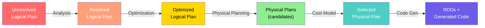

#### Step 3: DAGScheduler Creates Stages
The DAGScheduler walks the RDD dependency graph backward and creates stages wherever it encounters a **shuffle dependency** (wide transformation).

#### Step 4: TaskScheduler Assigns Tasks
Each stage is split into tasks (one per partition). The TaskScheduler assigns these to available executor slots, considering data locality.

#### Step 5: Executors Run Tasks
Each executor deserializes the task, reads its data partition, applies transformations, and either writes shuffle output or returns results.

#### Step 6: Results Return to Driver
For actions like `collect()`, results flow back to the driver. For actions like `write()`, executors write directly to storage.

---

## Logical Plan → Physical Plan

### Seeing the Plans

```python
# Create a sample DataFrame
df = spark.read.parquet("s3://data/users/")

# Build a query
result = (
    df
    .filter(col("country") == "US")
    .groupBy("state")
    .agg(count("*").alias("user_count"))
    .orderBy(col("user_count").desc())
)

# See the parsed logical plan
result.explain(mode="simple")

# See ALL plans (parsed, analyzed, optimized, physical)
result.explain(mode="extended")

# See the formatted physical plan with metrics
result.explain(mode="formatted")

# See the cost-based optimization details
result.explain(mode="cost")
```

### Understanding explain() Output

```
== Parsed Logical Plan ==
'Sort ['user_count DESC], true
+- 'Aggregate ['state], ['state, count(1) AS user_count]
   +- 'Filter ('country = US)
      +- 'Relation [name, age, country, state] parquet

== Analyzed Logical Plan ==
Sort [user_count DESC], true
+- Aggregate [state], [state, count(1) AS user_count]
   +- Filter (country = US)
      +- Relation [name, age, country, state] parquet

== Optimized Logical Plan ==
Sort [user_count DESC], true
+- Aggregate [state], [state, count(1) AS user_count]
   +- Project [state]           ← Column pruning! Only 'state' needed
      +- Filter (country = US)  ← Predicate pushdown to scan
         +- Relation [state, country] parquet  ← Only reads 2 columns

== Physical Plan ==
AdaptiveSparkPlan isFinalPlan=false
+- Sort [user_count DESC], true, 0
   +- Exchange rangepartitioning(user_count DESC, 200)  ← SHUFFLE!
      +- HashAggregate(keys=[state], functions=[count(1)])
         +- Exchange hashpartitioning(state, 200)  ← SHUFFLE!
            +- HashAggregate(keys=[state], functions=[partial_count(1)])
               +- Project [state]
                  +- Filter (country = US)
                     +- FileScan parquet [state,country]  ← Reads Parquet
                        PushedFilters: [EqualTo(country,US)]
```

> **💡 Key Insight:** Notice two `Exchange` nodes in the physical plan — each one is a **shuffle** and creates a **stage boundary**. This query will have **3 stages**.

### Reading Physical Plans Like a Pro

| Physical Plan Node | What It Does | Performance Impact |
|---|---|---|
| `FileScan parquet` | Reads data from Parquet files | I/O bound — check file sizes |
| `Filter` | Filters rows | CPU bound — usually fast |
| `Project` | Selects columns | Minimal — just metadata |
| `Exchange hashpartitioning` | **Shuffle!** Repartitions data by hash | ⚠️ Network + disk I/O |
| `Exchange rangepartitioning` | **Shuffle!** Repartitions by range | ⚠️ Network + disk I/O |
| `HashAggregate` | Aggregation using hash map | Memory intensive |
| `SortMergeJoin` | Join by sorting then merging | ⚠️ Shuffle + sort |
| `BroadcastHashJoin` | Join by broadcasting small table | ✅ No shuffle needed |
| `BroadcastExchange` | Broadcasts data to all executors | Small tables only |
| `WholeStageCodegen` | Fused operators via code generation | ✅ Optimized execution |

---

## Jobs, Stages, and Tasks

This is the **core hierarchy** of Spark execution:

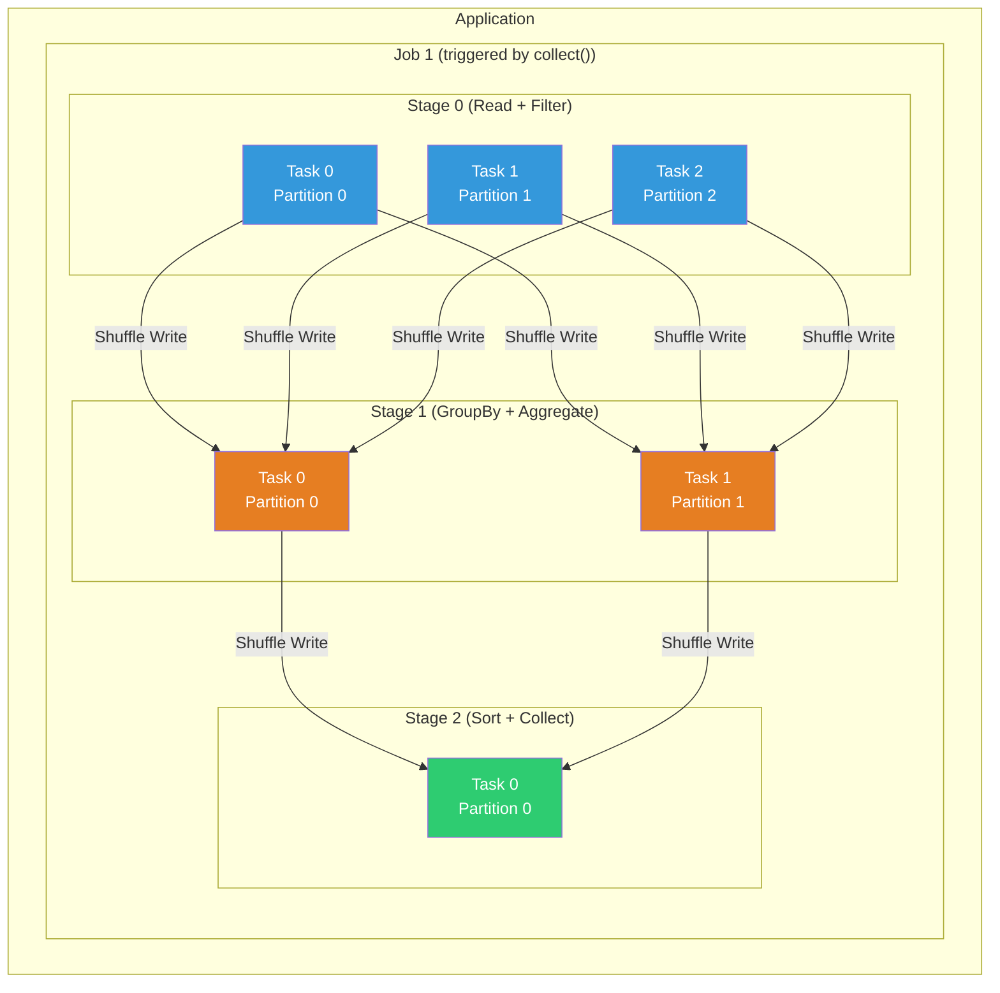

### Definitions

| Concept | Definition | Created By | Contains |
|---|---|---|---|
| **Application** | A single SparkSession / SparkContext | User | Multiple Jobs |
| **Job** | Work triggered by a single action | Each action (`collect`, `save`, etc.) | Multiple Stages |
| **Stage** | A set of tasks that can run in parallel | DAGScheduler (split at shuffles) | Multiple Tasks |
| **Task** | A unit of work on a single partition | One per partition per stage | Runs on one executor core |

### How Many of Each?

```python
# Example: How many jobs, stages, tasks?
df = spark.read.parquet("s3://data/events/")  # 100 files = ~100 partitions

result = (
    df
    .filter(col("type") == "purchase")        # Narrow — no shuffle
    .groupBy("user_id")                        # Wide — SHUFFLE BOUNDARY → Stage break
    .agg(sum("amount").alias("total"))
    .orderBy(col("total").desc())              # Wide — SHUFFLE BOUNDARY → Stage break
    .limit(10)
)

result.show()  # Action → triggers 1 Job
```

For this query:
- **Jobs:** 1 (one `show()` action)
- **Stages:** 3 (two shuffle boundaries)
  - Stage 0: Read Parquet + Filter + Partial Aggregate (100 tasks — one per input partition)
  - Stage 1: Final Aggregate (200 tasks — default `spark.sql.shuffle.partitions`)
  - Stage 2: Sort + Limit (200 tasks, then coalesced)
- **Tasks:** 100 + 200 + 200 = 500 total tasks

> **⚠️ Warning:** The default `spark.sql.shuffle.partitions` is 200. For small datasets, this creates too many tiny tasks. For large datasets, each task may process too much data. Always tune this!

---

## DAGScheduler — The Director

The DAGScheduler is responsible for:
1. **Translating the RDD lineage graph into stages**
2. **Determining the optimal order to execute stages**
3. **Handling stage failures and retries**
4. **Tracking which shuffle outputs are available**

### How the DAGScheduler Creates Stages

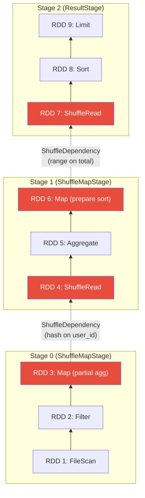

### The Algorithm (Simplified)

```
function createStages(finalRDD):
    if finalRDD has no dependencies:
        create new Stage containing just finalRDD
        return

    for each dependency of finalRDD:
        if dependency is NarrowDependency:
            add parent RDD to CURRENT stage  ← same stage!
        
        if dependency is ShuffleDependency:
            create NEW stage for parent RDD   ← stage boundary!
            record shuffle dependency between stages
    
    recursively process parent RDDs
```

### Two Types of Stages

| Stage Type | Purpose | When Created |
|---|---|---|
| **ShuffleMapStage** | Produces shuffle output for downstream stages | Every stage except the last one |
| **ResultStage** | Produces the final result for the driver | Always the last stage in a job |

### Stage Submission Order

The DAGScheduler submits stages in **topological order** — parent stages before child stages:

```python
# Pseudocode of DAGScheduler logic
def submitStage(stage):
    missing_parents = getMissingParentStages(stage)
    
    if missing_parents is empty:
        # All parent stages complete — submit this stage!
        submitMissingTasks(stage)
    else:
        # Submit parent stages first
        for parent in missing_parents:
            submitStage(parent)
        
        # Mark this stage as waiting
        waitingStages.add(stage)
```

---

## TaskScheduler — The Floor Manager

While the DAGScheduler decides **what** work to do (stages), the TaskScheduler decides **where** to do it (which executors).

### TaskScheduler Responsibilities

1. **Receive TaskSets** from DAGScheduler (one TaskSet per stage)
2. **Assign tasks to executors** based on data locality
3. **Handle task failures** (retry up to `spark.task.maxFailures` times)
4. **Report results** back to DAGScheduler
5. **Manage speculative execution** (re-launch slow tasks)

### Data Locality Levels

The TaskScheduler tries to run tasks as close to their data as possible:

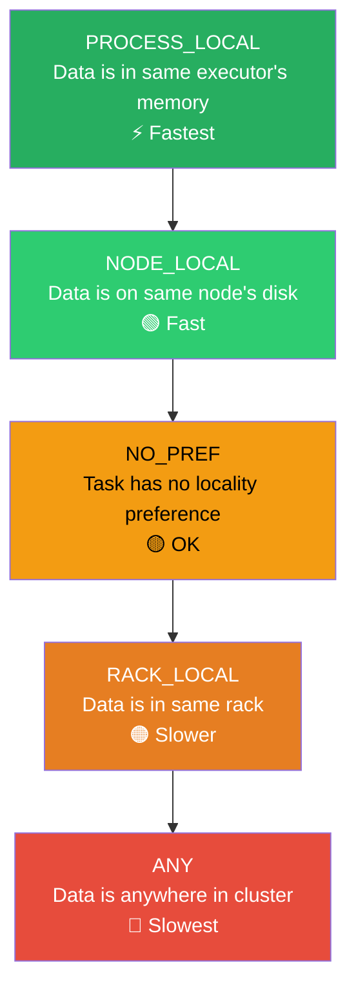

```python
# Configure locality wait times
# How long to wait for a better locality level before giving up
spark.conf.set("spark.locality.wait", "3s")           # Default: 3s
spark.conf.set("spark.locality.wait.node", "3s")       # Wait for NODE_LOCAL
spark.conf.set("spark.locality.wait.process", "3s")    # Wait for PROCESS_LOCAL
spark.conf.set("spark.locality.wait.rack", "3s")       # Wait for RACK_LOCAL
```

> **💡 Key Insight:** If you see many tasks with `ANY` locality in the Spark UI, it means Spark couldn't schedule tasks near their data. This usually means your cluster is too busy or your data isn't distributed well.

### Task Lifecycle

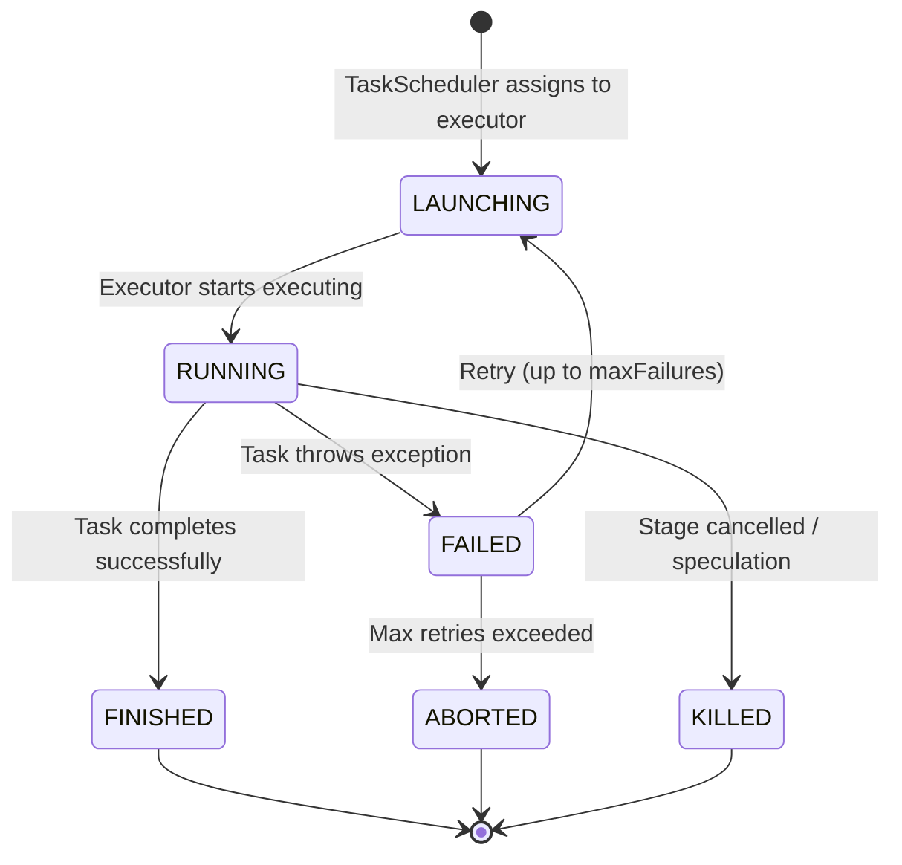

---

## Narrow vs Wide Transformations

This is **the most fundamental concept** for understanding how Spark creates stages.

### Narrow Transformations (No Shuffle)

Each output partition depends on **at most one** input partition. Data doesn't need to move between executors.

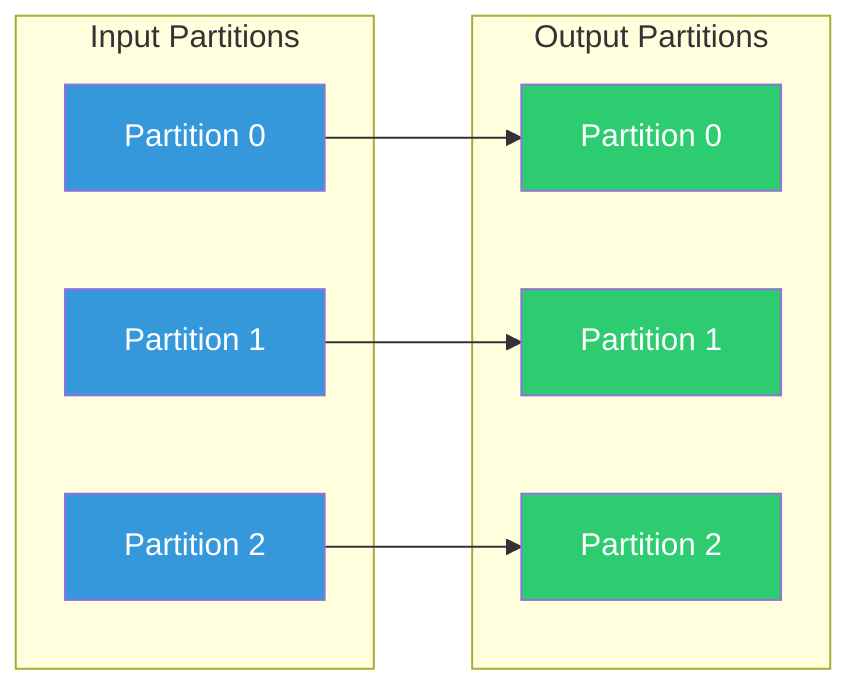

**Examples:** `map`, `filter`, `flatMap`, `mapPartitions`, `union`, `select`, `withColumn`, `where`, `drop`

### Wide Transformations (Shuffle Required)

Each output partition may depend on **all** input partitions. Data must be redistributed across the cluster.

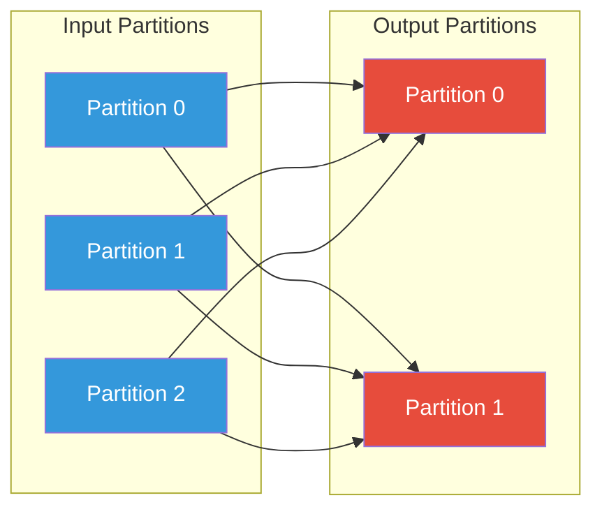

**Examples:** `groupBy`, `reduceByKey`, `join` (without broadcast), `repartition`, `distinct`, `orderBy`, `sortBy`

### The Complete Reference Table

| Transformation | Type | Causes Shuffle? | Stage Boundary? |
|---|---|---|---|
| `select()` / `withColumn()` | Narrow | ❌ | ❌ |
| `filter()` / `where()` | Narrow | ❌ | ❌ |
| `map()` / `flatMap()` | Narrow | ❌ | ❌ |
| `union()` | Narrow | ❌ | ❌ |
| `coalesce()` (reducing partitions) | Narrow | ❌ | ❌ |
| `groupBy().agg()` | Wide | ✅ | ✅ |
| `join()` (both sides large) | Wide | ✅ | ✅ |
| `join()` (one side small + broadcast) | Narrow | ❌ | ❌ |
| `repartition()` | Wide | ✅ | ✅ |
| `distinct()` | Wide | ✅ | ✅ |
| `orderBy()` / `sort()` | Wide | ✅ | ✅ |
| `window()` functions | Wide | ✅ | ✅ |

> **⚠️ Warning:** `coalesce()` is narrow (no shuffle), but `repartition()` is wide (full shuffle). Use `coalesce()` when reducing partitions, `repartition()` when increasing or rebalancing.

---

## Stage Boundaries at Shuffles

### Why Shuffles Create Stage Boundaries

When a wide transformation requires a shuffle, Spark **must complete all tasks in the upstream stage** before starting the downstream stage. Why?

1. **Each downstream task needs data from ALL upstream tasks** — it can't start until they're all done
2. Shuffle data must be **written to disk** by upstream tasks before it can be **read** by downstream tasks
3. There's a **materialization point** — shuffle data is the handoff mechanism

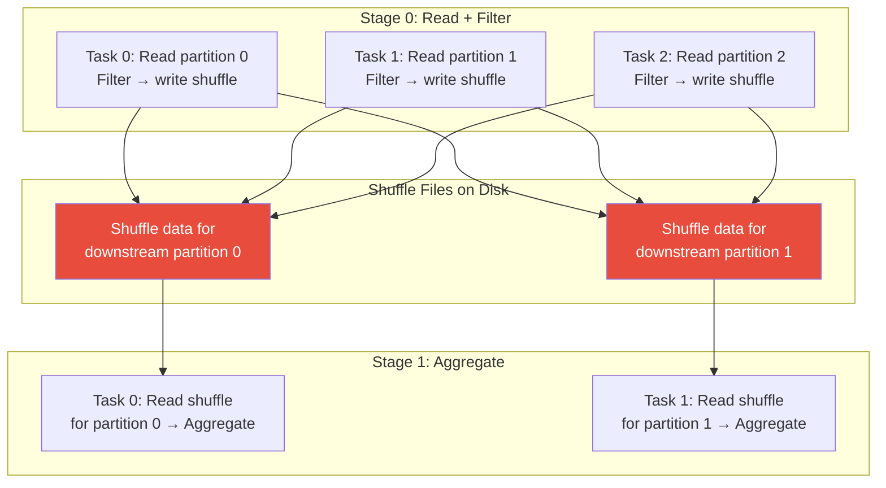

### Visualizing Stage Boundaries in Code

```python
# Let's trace through and count stages
df = spark.read.parquet("events/")           # Stage 0 starts here

# All narrow transformations — same Stage 0
filtered = df.filter(col("status") == "active")
projected = filtered.select("user_id", "amount", "category")

# SHUFFLE! — Stage 0 ends, Stage 1 begins
by_user = projected.groupBy("user_id").agg(
    sum("amount").alias("total_amount"),
    countDistinct("category").alias("categories")
)

# Narrow transformation — still Stage 1
high_value = by_user.filter(col("total_amount") > 1000)

# SHUFFLE! — Stage 1 ends, Stage 2 begins
sorted_result = high_value.orderBy(col("total_amount").desc())

# Action triggers execution — Stage 2 is the ResultStage
sorted_result.show(20)
```

---

## Task Serialization and Result Handling

### What Gets Serialized?

When Spark sends a task to an executor, it must serialize:

1. **The task closure** — the function to apply to each partition
2. **Broadcast variables** — shared read-only data
3. **Task metadata** — partition ID, stage ID, attempt number

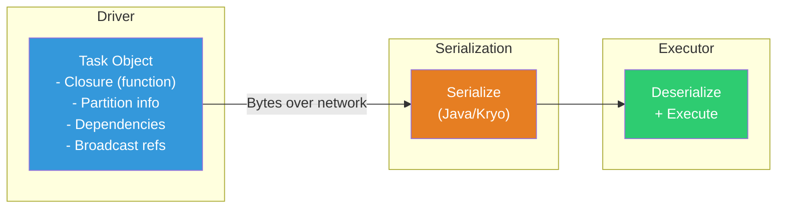

### Common Serialization Pitfall

```python
# ❌ BAD: This will fail with NotSerializableError!
class DatabaseClient:
    def __init__(self):
        self.connection = create_db_connection()  # Not serializable!

client = DatabaseClient()

# This closure captures 'client' — tries to serialize it
df.rdd.map(lambda row: client.lookup(row.id))  # 💥 FAILS

# ✅ GOOD: Create connection inside the closure
def process_partition(iterator):
    # Connection created on executor — no serialization needed
    client = DatabaseClient()
    for row in iterator:
        yield client.lookup(row.id)
    client.close()

df.rdd.mapPartitions(process_partition)
```

### Result Handling Strategies

Spark uses different strategies depending on result size:

| Result Size | Strategy | How It Works |
|---|---|---|
| **Small** (< 1MB) | Direct result | Executor sends result directly to driver via RPC |
| **Medium** (1MB - 1GB) | Indirect result via BlockManager | Result stored in executor's BlockManager, driver fetches it |
| **Large** (> 1GB) | Error! | `spark.driver.maxResultSize` exceeded — job fails |

```python
# Configure maximum result size
spark.conf.set("spark.driver.maxResultSize", "2g")  # Default: 1g

# ❌ This can crash the driver if the DataFrame is huge
huge_df.collect()  # Brings ALL data to driver memory!

# ✅ Better: Use show(), take(), or write to storage
huge_df.show(100)
huge_df.take(1000)
huge_df.write.parquet("s3://output/results/")
```

---

## Speculative Execution

### The Problem: Stragglers

In a cluster of 100 machines, at any given time, some will be slower than others due to:
- Noisy neighbors (shared cloud infrastructure)
- Degraded disks
- Network issues
- GC pauses
- Skewed data partitions

A stage isn't complete until **ALL** its tasks finish. One slow task holds up the entire stage.

### The Solution: Speculative Execution

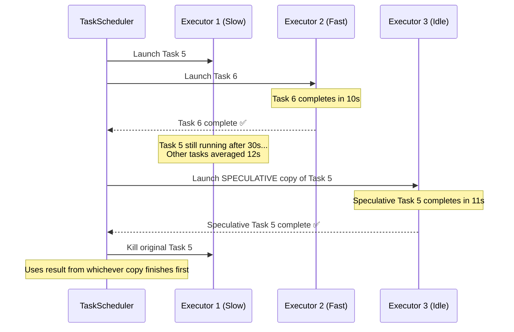

### Configuration

```python
# Enable speculative execution
spark.conf.set("spark.speculation", "true")             # Default: false
spark.conf.set("spark.speculation.interval", "100ms")    # Check frequency
spark.conf.set("spark.speculation.multiplier", "1.5")    # Launch spec if >1.5x median
spark.conf.set("spark.speculation.quantile", "0.75")     # After 75% of tasks complete
spark.conf.set("spark.speculation.minTaskRuntime", "100ms")  # Min time before spec

# Task 5 takes 18s, median is 12s → 18/12 = 1.5x → triggers speculative copy
```

### When to Use Speculative Execution

| Scenario | Use Speculation? | Why |
|---|---|---|
| Cloud environments (EC2, GCE) | ✅ Yes | Noisy neighbors common |
| On-premises dedicated cluster | 🔶 Maybe | Less common but possible |
| Streaming workloads | ❌ No | Can cause duplicate processing |
| Jobs writing to non-idempotent sinks | ❌ No | Can cause duplicate writes |
| Data skew issues | ❌ No | Won't help — the copy will also be slow |

> **⚠️ Warning:** Speculative execution can waste resources. The speculative copy does the **same** work as the original — if the task is slow because of data skew, the copy will also be slow. Fix the root cause instead.

---

## Scheduling Modes — FIFO vs FAIR

When multiple jobs run concurrently within the same SparkSession, how does Spark decide which gets resources?

### FIFO Scheduling (Default)

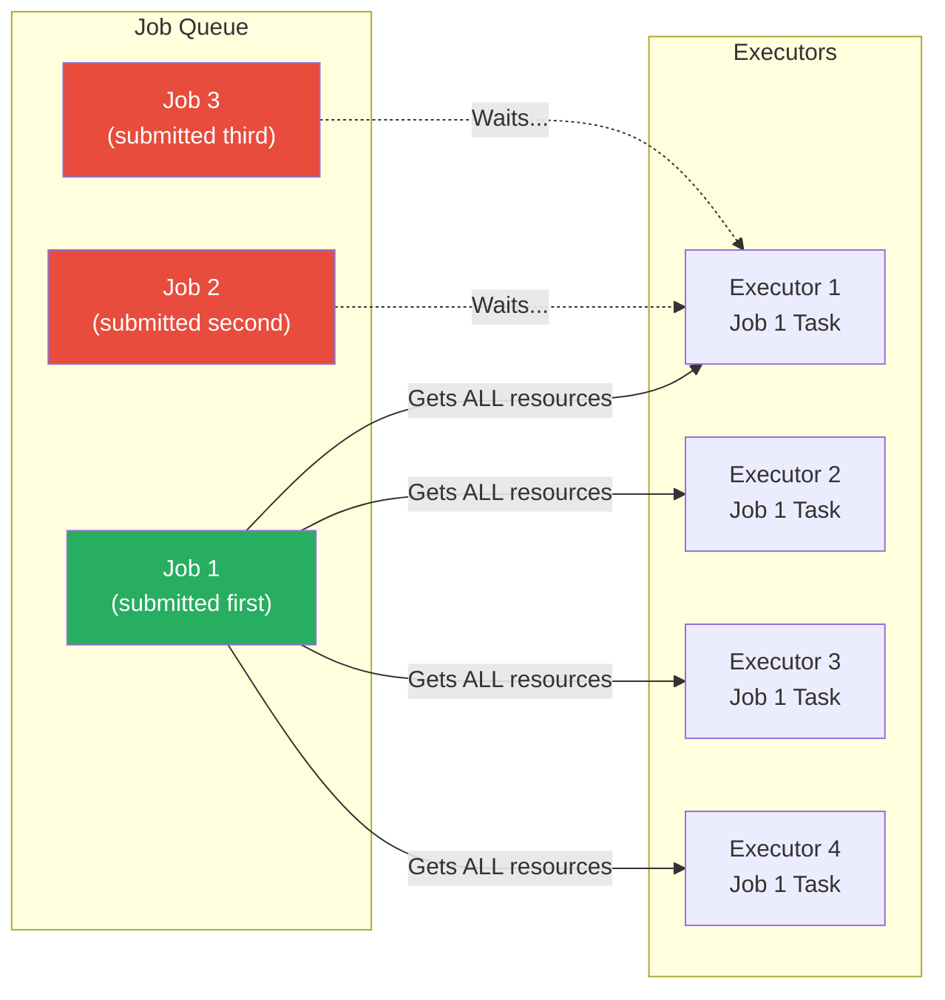

Jobs run in order. Job 2 doesn't get any resources until Job 1 finishes.

### FAIR Scheduling

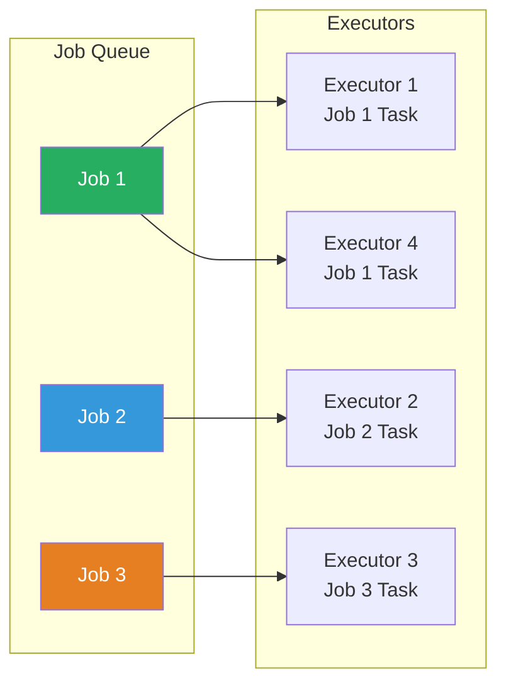

All jobs share resources roughly equally. Better for multi-user environments.

### Configuration

```python
# Set scheduling mode
spark.conf.set("spark.scheduler.mode", "FAIR")  # Default: FIFO

# FAIR scheduler with pools
spark.conf.set("spark.scheduler.allocation.file", "/path/to/fairscheduler.xml")
```

```xml
<!-- fairscheduler.xml -->
<allocations>
  <pool name="production">
    <schedulingMode>FIFO</schedulingMode>
    <weight>2</weight>
    <minShare>4</minShare>
  </pool>
  <pool name="adhoc">
    <schedulingMode>FAIR</schedulingMode>
    <weight>1</weight>
    <minShare>1</minShare>
  </pool>
</allocations>
```

```python
# Assign a job to a pool
spark.sparkContext.setLocalProperty("spark.scheduler.pool", "production")
# All jobs submitted after this line use the "production" pool
result = df.groupBy("key").count().collect()

spark.sparkContext.setLocalProperty("spark.scheduler.pool", "adhoc")
# Now using the "adhoc" pool
small_result = df.filter(col("id") == 123).collect()
```

### When to Use Each

| Mode | Best For | Typical Setup |
|---|---|---|
| **FIFO** | Single-user jobs, batch processing | Default — most batch jobs |
| **FAIR** | Multi-user environments, notebook servers | Databricks, Jupyter Hub, shared clusters |
| **FAIR with pools** | Production + ad-hoc mix | Dedicated production pool with guaranteed resources |

---

## Reading the Spark UI

The Spark UI is your **X-ray vision** into what Spark is actually doing. Every Spark application runs a web UI on port 4040.

### Accessing the Spark UI

```python
# Local mode
# http://localhost:4040

# YARN
# Go to YARN ResourceManager → click on application → Tracking URL

# Kubernetes
# kubectl port-forward <driver-pod> 4040:4040

# After application completes → Spark History Server
# http://<history-server>:18080
```

### Tab-by-Tab Guide

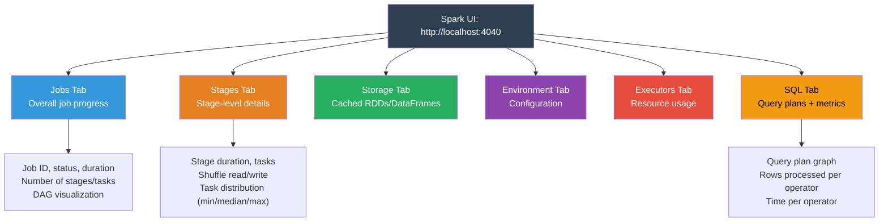

### Jobs Tab — The Big Picture

What to look for:
- **Job duration** — Is it running longer than expected?
- **Number of stages** — More stages = more shuffles
- **Failed stages** — Click through to see error details
- **DAG visualization** — See the stage dependency graph

### Stages Tab — Where the Action Is

This is where you spend **80% of your Spark UI time**.

| Metric | What It Tells You | Red Flags |
|---|---|---|
| **Duration** | Total stage time | Stages taking much longer than others |
| **Tasks** | Number of tasks | Way more/fewer tasks than expected |
| **Shuffle Read** | Data read from previous stage | Huge shuffle reads |
| **Shuffle Write** | Data written for next stage | Huge shuffle writes |
| **Task Distribution** | Min/25%/Median/75%/Max | Huge gap between min and max → data skew! |

#### The Task Distribution Table — Your Skew Detector

```
Duration:     Min: 0.1s    25%: 2s    Median: 3s    75%: 4s    Max: 5min
                                                                  ↑ 
                                                              DATA SKEW!

Shuffle Read: Min: 1MB     25%: 50MB  Median: 55MB  75%: 60MB  Max: 8GB
                                                                  ↑
                                                              DATA SKEW!
```

> **💡 Key Insight:** If the **max** is 10x or more than the **median** for duration or data size, you have a data skew problem. One partition has way more data than others.

### SQL Tab — Understanding Query Plans

The SQL tab shows a **visual execution plan** with real metrics:

```
+- Scan parquet (120.5M rows, 2.3 GB)
   +- Filter (45.2M rows passed, 75.3M filtered)
      +- HashAggregate (partial: 45.2M → 15K groups)
         +- Exchange hashpartitioning (15K rows shuffled, 1.2 MB)
            +- HashAggregate (final: 15K → 15K groups)
               +- TakeOrderedAndProject (10 rows)
```

Each node shows:
- **Number of rows** processed
- **Data size** in bytes
- **Time** spent in that operator
- **Spill** to disk (if memory was insufficient)

### Executors Tab — Resource Health Check

| Metric | Healthy Range | Danger Signs |
|---|---|---|
| **Storage Memory Used** | < 60% | > 90% → risk of OOM |
| **Active Tasks** | Consistent across executors | One executor has 0 while others are busy |
| **GC Time** | < 10% of total time | > 30% → too much GC |
| **Shuffle Read/Write** | Balanced | One executor has 10x others → data skew |
| **Failed Tasks** | 0 | Any → check logs |

### Storage Tab — Cache Health

Shows all cached RDDs and DataFrames:
- **Storage Level** (Memory, Disk, or Both)
- **Size in Memory** vs **Size on Disk**
- **Fraction Cached** (100% = fully cached, <100% = some partitions evicted)

---

## Execution DAG Visualization

### Reading the DAG in the Spark UI

When you click on a job in the Spark UI, you see a DAG visualization:

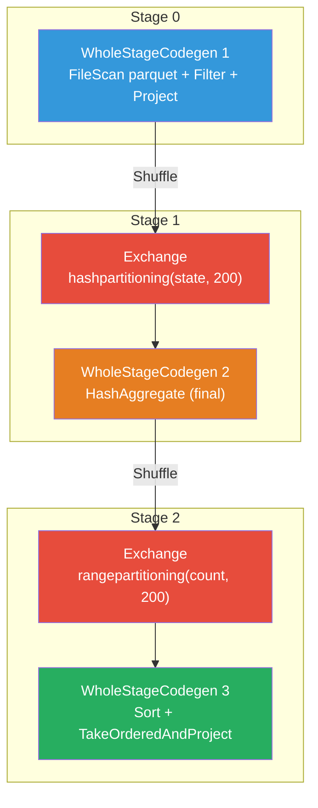

### What Each Node Means

| Node Color (typical) | Meaning |
|---|---|
| **Blue** | Scan / Read operations |
| **Green** | Successfully completed |
| **Red/Orange** | Exchange (shuffle) |
| **Gray** | Skipped (cached data used) |

### What "WholeStageCodegen" Means

When you see `WholeStageCodegen`, it means Spark has **fused multiple operators** into a single generated Java method. This is Tungsten's code generation at work — instead of calling virtual methods for each operator, Spark generates tight loops of native code.

```
WholeStageCodegen (3 operators fused):
  ├── FileScan parquet         ← Read data
  ├── Filter (age > 30)       ← Apply filter
  └── Project [name, age]     ← Select columns

All three operators compiled into ONE tight Java loop!
```

---

## Event Timeline

The Event Timeline in the Spark UI shows **what happened when** across your entire job.

### Reading the Timeline

```mermaid
gantt
    title Spark Job Event Timeline
    dateFormat ss
    axisFormat %S s

    section Executor 1
    Task 0 (Stage 0)        :a1, 00, 03
    Task 3 (Stage 0)        :a2, 03, 05
    Task 0 (Stage 1)        :a3, 08, 13

    section Executor 2
    Task 1 (Stage 0)        :b1, 00, 04
    Task 4 (Stage 0)        :b2, 04, 06
    Task 1 (Stage 1)        :b3, 08, 11

    section Executor 3
    Task 2 (Stage 0)        :c1, 00, 02
    Task 5 (Stage 0)        :c2, 02, 04
    Idle                    :c3, 04, 08
    Task 2 (Stage 1)        :c4, 08, 10
```

### What to Look For in the Timeline

| Pattern | What It Means | Action |
|---|---|---|
| **Gap between stages** | Shuffle overhead between stages | Reduce shuffle data, consider broadcast join |
| **One task much longer than others** | Data skew in that partition | Apply salting or repartitioning |
| **Executors idle** | Not enough tasks or waiting for slow tasks | Increase parallelism or fix skew |
| **Many short tasks** | Too many partitions | Reduce partition count with `coalesce()` |
| **Many retried tasks** | Infrastructure issues or OOM | Check executor logs |
| **Long GC pauses** | Too much data in memory | Reduce cache size, increase memory |

---

## Production Scenarios

### Scenario 1: Netflix — Optimizing Recommendation Pipeline

**Problem:** A recommendation pipeline processing 200M user interactions daily was taking 4 hours.

**Investigation using Spark UI:**
1. **Jobs tab:** 1 job with 12 stages
2. **Stages tab:** Stage 7 (user-item join) taking 2.5 hours out of 4
3. **Task distribution:** Max task duration = 45 minutes, median = 2 minutes → severe data skew
4. **Root cause:** A few "power users" had 100K+ interactions while most had <100

**Fix:**
```python
# Before: Simple join causing skew on popular users
user_items = interactions.join(users, "user_id")

# After: Salted join for skewed keys
from pyspark.sql.functions import rand, ceil, explode, array, lit

# Identify skewed keys
skewed_keys = interactions.groupBy("user_id").count().filter(col("count") > 10000)

# Salt the skewed keys with 10 replicas
SALT_BUCKETS = 10
salted_interactions = interactions.withColumn("salt", (rand() * SALT_BUCKETS).cast("int"))
salted_users = users.join(skewed_keys.select("user_id"), "user_id", "left")
salted_users = salted_users.withColumn(
    "salt",
    explode(array([lit(i) for i in range(SALT_BUCKETS)]))
).where(col("count").isNotNull()).union(
    users.join(skewed_keys.select("user_id"), "user_id", "left_anti")
    .withColumn("salt", lit(0))
)

result = salted_interactions.join(salted_users, ["user_id", "salt"])
```

**Result:** Pipeline reduced from 4 hours to 35 minutes.

### Scenario 2: Uber — Understanding Stage Dependencies

**Problem:** A ride-pricing ETL had 20 stages but many could have run in parallel.

**Investigation:**
- DAG visualization showed linear stage dependencies
- Most stages were independent but chained due to unnecessary `.repartition()` calls

**Fix:** Removed unnecessary repartitions, used `coalesce()` where possible, and leveraged AQE.

---

## Troubleshooting Guide

### Symptom: Job Running Slowly

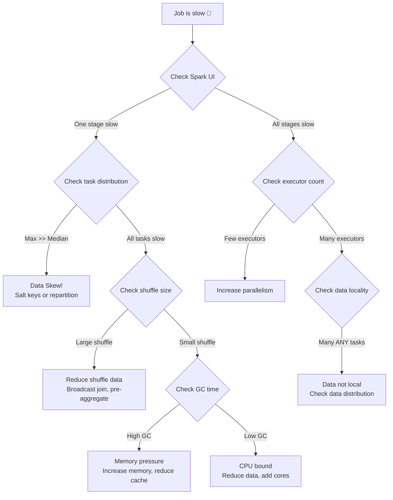

### Symptom: Task Serialization Error

**Error:** `org.apache.spark.SparkException: Task not serializable`

**Root Cause:** Your closure captures a non-serializable object.

**Fix:**
```python
# ❌ Problem: 'self' is not serializable
class MyProcessor:
    def __init__(self):
        self.db = DatabaseConnection()  # Not serializable!
    
    def process(self, df):
        return df.rdd.map(lambda row: self.db.query(row.id))  # Captures 'self'

# ✅ Fix 1: Use mapPartitions with local connection
class MyProcessor:
    def process(self, df):
        def process_partition(iterator):
            db = DatabaseConnection()  # Created on executor
            for row in iterator:
                yield db.query(row.id)
            db.close()
        return df.rdd.mapPartitions(process_partition)

# ✅ Fix 2: Use broadcast for read-only data
lookup_data = spark.sparkContext.broadcast(load_lookup_table())
df.rdd.map(lambda row: lookup_data.value.get(row.id))
```

### Symptom: Stage Keeps Retrying

**Error:** `Stage X failed after 4 attempts`

**Common Causes:**
1. **OOM on executors:** Increase `spark.executor.memory`
2. **Shuffle fetch failures:** Increase `spark.shuffle.io.maxRetries` and `spark.shuffle.io.retryWait`
3. **Lost executors:** Check cluster manager logs for preemption

### Symptom: Driver OOM on collect()

```python
# ❌ This crashes the driver
huge_df.collect()  # 50GB DataFrame → driver only has 4GB

# ✅ Write to storage instead
huge_df.write.parquet("s3://output/results/")

# ✅ Or take a sample
sample = huge_df.take(1000)

# ✅ Or increase driver memory if you really need collect
# spark-submit --driver-memory 8g ...
```

---

## Performance Considerations

### 1. Minimize the Number of Stages (Minimize Shuffles)

```python
# ❌ Multiple shuffles
df.repartition(100).groupBy("key").count().orderBy("count")
# 3 shuffles! repartition + groupBy + orderBy

# ✅ Fewer shuffles
df.groupBy("key").count().orderBy("count")
# 2 shuffles: groupBy + orderBy (skip unnecessary repartition)
```

### 2. Use Broadcast Joins to Eliminate Shuffles

```python
from pyspark.sql.functions import broadcast

# ❌ Sort-merge join — shuffles both DataFrames
result = large_df.join(small_df, "key")

# ✅ Broadcast join — no shuffle!
result = large_df.join(broadcast(small_df), "key")
```

### 3. Tune Partition Count

```python
# Check current partition count
print(df.rdd.getNumPartitions())

# Rule of thumb: 128MB per partition
# For 100GB data: 100GB / 128MB ≈ 800 partitions
spark.conf.set("spark.sql.shuffle.partitions", 800)
```

### 4. Monitor with explain()

```python
# Always check the plan before running expensive jobs!
df.join(other_df, "key").groupBy("category").count().explain(mode="formatted")

# Look for:
# - BroadcastHashJoin (good) vs SortMergeJoin (expensive)
# - Number of Exchange nodes (shuffles)
# - PushedFilters (predicate pushdown working?)
```

---

## Common Mistakes

### Mistake 1: Ignoring the Execution Plan

```python
# ❌ "It works, ship it!"
result = df.join(dim_table, "key").groupBy("cat").count()

# ✅ Always check the plan first
result.explain(mode="formatted")
# Did Spark use a broadcast join or sort-merge join?
# Are predicates being pushed down?
```

### Mistake 2: Too Many Actions = Too Many Jobs

```python
# ❌ Two actions = Two jobs = Reads data TWICE
count = df.count()        # Job 1: reads all data
avg_val = df.agg(avg("value")).collect()  # Job 2: reads all data AGAIN

# ✅ One action = One job
result = df.agg(
    count("*").alias("count"),
    avg("value").alias("avg_value")
).collect()  # Job 1: reads data ONCE
```

### Mistake 3: Not Understanding coalesce vs repartition

```python
# ❌ Using repartition to reduce partitions (causes full shuffle)
df.repartition(10).write.parquet("output/")

# ✅ Using coalesce to reduce partitions (no shuffle, narrow)
df.coalesce(10).write.parquet("output/")
```

### Mistake 4: collect() on Large DataFrames

```python
# ❌ Bringing 100GB to the driver
all_data = huge_df.collect()  # 💥 Driver OOM

# ✅ Process on the cluster, collect only results
summary = huge_df.groupBy("category").agg(
    count("*").alias("count"),
    sum("amount").alias("total")
).collect()  # Only a few rows
```

### Mistake 5: Not Setting spark.sql.shuffle.partitions

```python
# The default is 200 — almost always wrong!
# For small data: too many tiny partitions → scheduler overhead
# For big data: too few partitions → OOM and slow tasks

# ✅ Calculate based on data size
data_size_gb = 500
target_partition_size_mb = 128
num_partitions = int(data_size_gb * 1024 / target_partition_size_mb)
spark.conf.set("spark.sql.shuffle.partitions", num_partitions)

# ✅ Or enable AQE to auto-tune
spark.conf.set("spark.sql.adaptive.enabled", "true")
spark.conf.set("spark.sql.adaptive.coalescePartitions.enabled", "true")
```

---

## Interview Questions

### Beginner Level

**Q1: What is the difference between a transformation and an action in Spark?**

**A:** Transformations (like `filter`, `map`, `groupBy`) are **lazy** — they define a computation but don't execute it. They return a new RDD/DataFrame. Actions (like `collect`, `count`, `save`) **trigger execution** by telling Spark to compute the result. Spark builds up a DAG of transformations and only executes when an action is called. This allows the Catalyst optimizer to optimize the entire computation chain before executing.

**Q2: What is a Job in Spark?**

**A:** A Job is the work triggered by a single action. When you call `collect()`, `count()`, or `write()`, Spark creates one Job to compute the result. A Job consists of one or more Stages. If your code calls two actions, Spark creates two separate Jobs.

**Q3: What is a Stage in Spark?**

**A:** A Stage is a set of tasks that can run in parallel without needing to exchange data. Stages are created by the DAGScheduler when it encounters shuffle boundaries (wide transformations like `groupBy`, `join`, `repartition`). All tasks within a stage execute the same code on different partitions of the data.

---

### Intermediate Level

**Q4: How does the DAGScheduler decide where to create stage boundaries?**

**A:** The DAGScheduler walks the RDD lineage graph **backward** from the final RDD. When it encounters a **ShuffleDependency** (caused by wide transformations), it creates a stage boundary. All RDDs connected by **NarrowDependencies** (narrow transformations) are grouped into the same stage. This is because narrow transformations can be pipelined — each task processes one partition end-to-end without waiting for other partitions. Wide transformations require data from all input partitions, so the upstream stage must complete before the downstream stage can start.

**Q5: What is the difference between the DAGScheduler and the TaskScheduler?**

**A:** The **DAGScheduler** is the high-level scheduler that:
- Converts the RDD DAG into stages
- Determines stage dependencies
- Submits stages in the correct order
- Handles stage-level retries

The **TaskScheduler** is the low-level scheduler that:
- Receives TaskSets (one per stage) from DAGScheduler
- Assigns individual tasks to specific executors
- Considers data locality when assigning tasks
- Handles task-level retries and speculative execution

Think of DAGScheduler as the project manager (decides what to do) and TaskScheduler as the floor manager (decides who does it).

**Q6: Explain data locality levels in Spark.**

**A:** Spark tries to run tasks as close to their data as possible. The five levels from best to worst:
1. **PROCESS_LOCAL:** Data is already in the executor's JVM (cached data)
2. **NODE_LOCAL:** Data is on the same node (local disk)
3. **NO_PREF:** Task has no locality preference
4. **RACK_LOCAL:** Data is on the same network rack
5. **ANY:** Data is anywhere in the cluster

Spark waits (configurable via `spark.locality.wait`) for a better locality level before falling back to a worse one.

**Q7: What is speculative execution and when should you use it?**

**A:** Speculative execution launches **duplicate copies** of slow-running tasks on different executors. When 75% of tasks in a stage complete and a task is running 1.5x slower than the median, Spark launches a speculative copy. Whichever copy finishes first wins; the other is killed.

**Use it when:** Running on shared cloud infrastructure where stragglers are common.
**Avoid it when:** Tasks are slow due to data skew (the copy will also be slow), or when writing to non-idempotent sinks (risk of duplicate writes).

---

### Advanced Level

**Q8: You have a Spark job with 3 stages. Stage 2 takes 10x longer than Stage 0 and Stage 1. Using the Spark UI, walk me through how you would diagnose and fix the issue.**

**A:**
1. **Jobs Tab:** Confirm the job has 3 stages, identify Stage 2 as the bottleneck.
2. **Stages Tab for Stage 2:** Check the task distribution summary table.
   - If **max duration >> median duration**: Data skew. One or a few partitions have much more data.
     - **Fix:** Identify the skewed keys, apply salting or use AQE skew join optimization.
   - If **all tasks are slow uniformly**: 
     - Check **shuffle read size** — if large, the upstream shuffle is producing too much data. Pre-filter or pre-aggregate before the shuffle.
     - Check **GC time** — if >30% of task time, increase executor memory or reduce the amount of cached data.
     - Check **spill to disk** — if significant, increase `spark.executor.memory` or `spark.memory.fraction`.
3. **SQL Tab:** Look at the physical plan for Stage 2's operators. Check if Spark chose a SortMergeJoin when BroadcastHashJoin would work.
4. **Executors Tab:** Verify all executors are healthy — no dead executors, balanced task distribution.

**Q9: Explain what happens internally when you call `.collect()` on a DataFrame.**

**A:**
1. `.collect()` is an action that triggers the entire execution pipeline.
2. Catalyst creates logical plan → optimized logical plan → physical plan → RDD DAG.
3. DAGScheduler converts the RDD DAG into stages (splitting at shuffle boundaries).
4. Stages are submitted in topological order — parent stages first.
5. TaskScheduler assigns tasks from each stage to executors.
6. Executors run tasks:
   - For intermediate stages (ShuffleMapStage): tasks write shuffle output to local disk.
   - For the final stage (ResultStage): tasks produce result partitions.
7. The final stage's tasks send their results back to the driver.
8. If the result is small (< `spark.driver.maxResultSize`), it's sent directly via RPC.
9. The driver collects all partition results, combines them into an array, and returns it.
10. If the total result exceeds driver memory, you get an OOM error.

**Q10: A Spark job is failing with "Shuffle FetchFailedException". What are the possible causes and how would you fix each?**

**A:** This means an executor couldn't fetch shuffle data from another executor.

**Possible causes:**
1. **Executor died during shuffle:** The executor that wrote the shuffle data was killed (OOM, preempted, or hardware failure). 
   - Fix: Increase executor memory, enable external shuffle service (`spark.shuffle.service.enabled=true`), or enable graceful decommissioning.
2. **Network connectivity issues:** The executor can't reach the shuffle data host.
   - Fix: Check network, increase `spark.shuffle.io.maxRetries` and `spark.shuffle.io.retryWait`.
3. **Disk pressure:** Shuffle files were written to a full disk.
   - Fix: Add more disk space, use `spark.local.dir` to specify multiple disks.
4. **Corrupted shuffle files:** Rare, but can happen with disk errors.
   - Fix: Spark will retry the failed stage, which re-computes the shuffle data.

---

**[← Previous: 10-memory-management.md](10-memory-management.md) | [Home](../README.md) | [Next →: 12-spark-streaming.md](12-spark-streaming.md)**
