# 🌊 Chapter 12: Spark Streaming — Real-Time Data Processing

> **"The world doesn't wait for batch jobs. Spark Streaming lets you process data as it arrives — with the same APIs you already know."**

---

## 📋 Table of Contents

- [Intuition — Why Streaming Matters](#intuition--why-streaming-matters)
- [Real-World Analogy — Assembly Line vs Batch Manufacturing](#real-world-analogy--assembly-line-vs-batch-manufacturing)
- [The Evolution of Stream Processing](#the-evolution-of-stream-processing)
- [DStream API — Legacy Streaming](#dstream-api--legacy-streaming)
- [Structured Streaming — The Modern Approach](#structured-streaming--the-modern-approach)
- [Streaming Sources](#streaming-sources)
- [Streaming Sinks](#streaming-sinks)
- [Output Modes — Append, Complete, Update](#output-modes--append-complete-update)
- [Triggers — When to Process](#triggers--when-to-process)
- [Watermarks and Late Data](#watermarks-and-late-data)
- [Stateful Operations](#stateful-operations)
- [Stream-Stream Joins](#stream-stream-joins)
- [Stream-Static Joins](#stream-static-joins)
- [Exactly-Once Semantics](#exactly-once-semantics)
- [Checkpointing for Fault Tolerance](#checkpointing-for-fault-tolerance)
- [Monitoring Streaming Queries](#monitoring-streaming-queries)
- [Production Scenarios](#production-scenarios)
- [Troubleshooting Guide](#troubleshooting-guide)
- [Performance Considerations](#performance-considerations)
- [Common Mistakes](#common-mistakes)
- [Interview Questions](#interview-questions)

---

## Intuition — Why Streaming Matters

Imagine you're a bank. A customer's credit card is used in New York, and 30 seconds later it's used in Tokyo. If your fraud detection runs as a **batch job every hour**, you won't catch it until an hour later — after potentially thousands of dollars in fraud.

Now imagine that every transaction is processed **within seconds of arriving**. You detect the impossible geography, block the card, and save the customer.

That's the difference between batch and streaming.

**Streaming is not just "faster batch."** It fundamentally changes what's possible:

| Batch Processing | Stream Processing |
|---|---|
| Process data hours/days after it arrives | Process data seconds after it arrives |
| Complete view of a time period | Evolving, incremental view |
| Simple to reason about | Complex (out-of-order, late data) |
| "How many orders did we get yesterday?" | "How many orders are we getting right now?" |
| Fixed data, run once | Infinite data, runs continuously |

> **💡 Key Insight:** Streaming isn't just about speed — it's about being able to **react** to events as they happen. Fraud detection, real-time recommendations, IoT monitoring — these are impossible with batch processing.

---

## Real-World Analogy — Assembly Line vs Batch Manufacturing

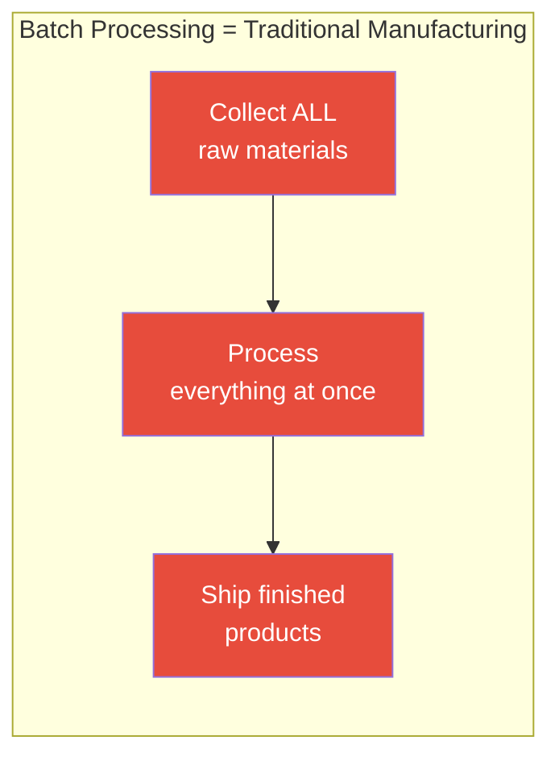

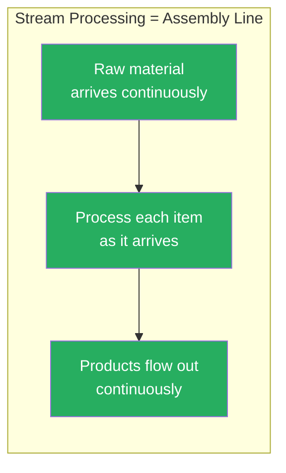

| Manufacturing | Spark Streaming |
|---|---|
| **Raw materials** arrive on the assembly line | **Events** arrive from Kafka, files, sockets |
| **Workers** at each station process items | **Operators** (filter, map, aggregate) process data |
| **Quality checks** happen at each station | **Watermarks** handle late-arriving items |
| The **line never stops** | The query **runs continuously** |
| If a station breaks, items **buffer upstream** | If processing fails, **checkpoints** allow recovery |
| Some items arrive **out of order** | Events may arrive **late or out of order** |
| **Counters** track items/hour at each station | **State stores** track aggregations over time |

> **🏭 Key Insight:** Just like a modern assembly line processes items one-at-a-time continuously (not "collect 1000 items, then process"), Structured Streaming processes events as they arrive while maintaining running state.

---

## The Evolution of Stream Processing

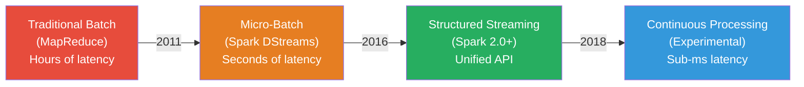

### Generation 1: Traditional Batch

```python
# Run a Spark batch job every hour on accumulated data
# Problem: Always processing data that's at least 1 hour old
daily_df = spark.read.parquet(f"s3://data/events/dt={yesterday}/")
result = daily_df.groupBy("category").count()
result.write.parquet(f"s3://output/dt={today}/")
```

### Generation 2: DStream API (Legacy)

```python
# Spark Streaming with DStreams — micro-batch every 5 seconds
# Problem: RDD-level API, hard to do complex operations
from pyspark.streaming import StreamingContext

ssc = StreamingContext(sc, batchDuration=5)  # 5-second micro-batches
lines = ssc.socketTextStream("localhost", 9999)
words = lines.flatMap(lambda line: line.split(" "))
word_counts = words.map(lambda word: (word, 1)).reduceByKey(lambda a, b: a + b)
word_counts.pprint()
ssc.start()
ssc.awaitTermination()
```

### Generation 3: Structured Streaming (Current Standard)

```python
# Structured Streaming — same DataFrame API as batch!
# ✅ Unified API for batch AND streaming
lines = spark.readStream.format("socket").option("host", "localhost").option("port", 9999).load()
words = lines.select(explode(split(col("value"), " ")).alias("word"))
word_counts = words.groupBy("word").count()
query = word_counts.writeStream.outputMode("complete").format("console").start()
query.awaitTermination()
```

---

## DStream API — Legacy Streaming

> **⚠️ Warning:** The DStream API is **legacy** and maintained only for backward compatibility. All new streaming applications should use **Structured Streaming**. We cover DStreams here for completeness and interview preparation.

### Why DStreams Were Limited

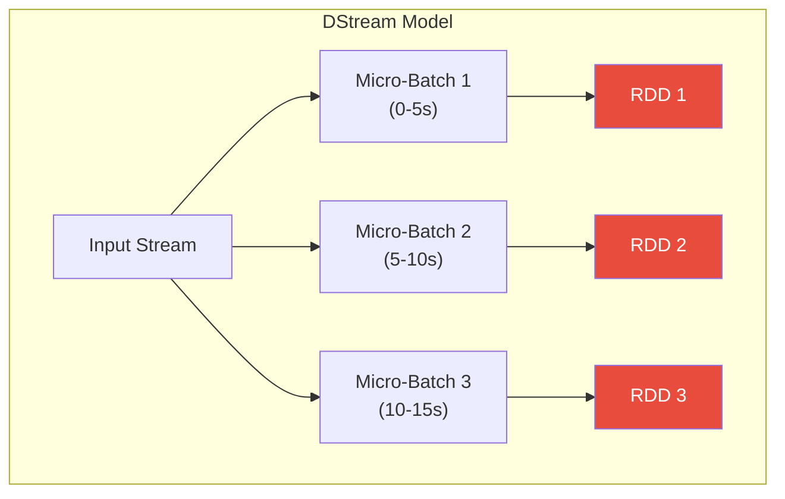

| DStream Limitation | Impact |
|---|---|
| **RDD-based API** | No Catalyst optimization, manual schema handling |
| **Processing time only** | Can't handle event-time processing or late data |
| **No built-in state management** | Complex to maintain running counts/aggregations |
| **Exactly-once is hard** | Requires careful output idempotency |
| **Separate API from batch** | Can't reuse batch code for streaming |
| **No native SQL support** | Must use RDD operations |
| **Micro-batch only** | Latency floor = batch interval |

### When You Might Still See DStreams

- Legacy codebases that haven't migrated
- Very old tutorials and blog posts
- Interview questions about streaming evolution

---

## Structured Streaming — The Modern Approach

### The Core Idea: Infinite Append-Only Table

Structured Streaming treats a live data stream as a **table that is continuously appended to**:

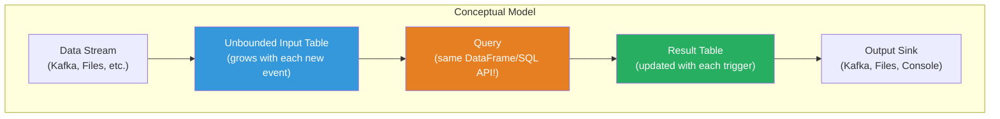

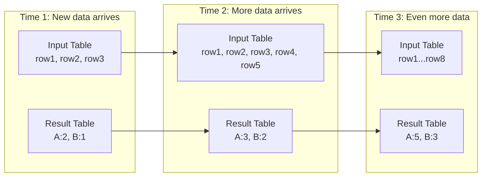

### The Killer Feature: Same API for Batch and Streaming

```python
# ========================
# BATCH VERSION
# ========================
batch_df = spark.read.format("parquet").load("s3://data/events/")
result = batch_df.groupBy("event_type").count()
result.write.format("parquet").save("s3://output/counts/")

# ========================
# STREAMING VERSION — Almost identical!
# ========================
stream_df = spark.readStream.format("parquet").load("s3://data/events/")
result = stream_df.groupBy("event_type").count()
query = result.writeStream.format("parquet").option(
    "checkpointLocation", "s3://checkpoints/counts/"
).outputMode("complete").start("s3://output/counts/")
```

The **only differences** are:
- `spark.read` → `spark.readStream`
- `.write` → `.writeStream`
- Add `checkpointLocation`
- Specify `outputMode`

---

## Streaming Sources

### Available Sources

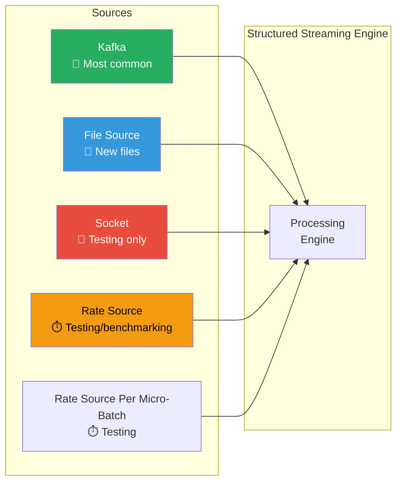

### Kafka Source (Production Standard)

```python
# Read from Kafka topic
kafka_df = (
    spark.readStream
    .format("kafka")
    .option("kafka.bootstrap.servers", "broker1:9092,broker2:9092")
    .option("subscribe", "user-events")          # Single topic
    # .option("subscribePattern", "events-.*")   # Topic pattern
    .option("startingOffsets", "latest")          # or "earliest" or JSON offsets
    .option("maxOffsetsPerTrigger", 100000)       # Rate limiting
    .option("kafka.group.id", "spark-consumer")
    .option("failOnDataLoss", "false")            # Don't fail if topic data is deleted
    .load()
)

# Kafka DataFrame has these columns:
# key (binary), value (binary), topic, partition, offset, timestamp, timestampType

# Parse the value (usually JSON)
from pyspark.sql.types import StructType, StructField, StringType, DoubleType, TimestampType

event_schema = StructType([
    StructField("user_id", StringType()),
    StructField("event_type", StringType()),
    StructField("amount", DoubleType()),
    StructField("event_time", TimestampType()),
])

parsed_df = (
    kafka_df
    .selectExpr("CAST(value AS STRING) as json_str")
    .select(from_json(col("json_str"), event_schema).alias("data"))
    .select("data.*")
)
```

### File Source

```python
# Monitor a directory for new files
file_df = (
    spark.readStream
    .format("parquet")                      # or csv, json, orc
    .schema(my_schema)                      # Schema REQUIRED for streaming
    .option("maxFilesPerTrigger", 10)       # Process 10 files per trigger
    .option("latestFirst", "true")          # Process newest files first
    .option("cleanSource", "archive")       # Move processed files
    .option("sourceArchiveDir", "s3://archive/")
    .load("s3://data/incoming/")
)
```

### Socket Source (Testing Only)

```python
# ❌ NEVER use in production — no fault tolerance!
socket_df = (
    spark.readStream
    .format("socket")
    .option("host", "localhost")
    .option("port", 9999)
    .load()
)
```

### Rate Source (Testing/Benchmarking)

```python
# Generates rows at a configurable rate — perfect for testing
rate_df = (
    spark.readStream
    .format("rate")
    .option("rowsPerSecond", 1000)     # 1000 rows/second
    .option("numPartitions", 10)       # Distribute across 10 partitions
    .load()
)
# Produces: timestamp (TimestampType), value (LongType)
```

---

## Streaming Sinks

### Available Sinks

| Sink | Use Case | Fault Tolerant? | Output Modes |
|---|---|---|---|
| **Kafka** | Real-time downstream systems | ✅ Yes (at-least-once) | Append, Update, Complete |
| **File** (Parquet/JSON/CSV) | Data lake, batch downstream | ✅ Yes (exactly-once) | Append only |
| **Console** | Debugging | ❌ No | All |
| **Memory** | Interactive debugging | ❌ No | All |
| **ForeachBatch** | Custom sinks, databases | ✅ Depends on impl | All |
| **Foreach** | Row-level custom processing | ✅ Depends on impl | All |

### Kafka Sink

```python
# Write results to Kafka
result_df.selectExpr(
    "CAST(user_id AS STRING) AS key",
    "to_json(struct(*)) AS value"
).writeStream \
    .format("kafka") \
    .option("kafka.bootstrap.servers", "broker1:9092") \
    .option("topic", "processed-events") \
    .option("checkpointLocation", "s3://checkpoints/to-kafka/") \
    .outputMode("append") \
    .start()
```

### File Sink

```python
# Write to Parquet files (partitioned by date)
result_df.writeStream \
    .format("parquet") \
    .option("path", "s3://output/events/") \
    .option("checkpointLocation", "s3://checkpoints/to-parquet/") \
    .partitionBy("date") \
    .outputMode("append") \
    .start()
```

### ForeachBatch Sink (Most Flexible)

```python
# Write each micro-batch to any custom sink
def write_to_postgres(batch_df, batch_id):
    """Write each micro-batch to PostgreSQL."""
    batch_df.write \
        .format("jdbc") \
        .option("url", "jdbc:postgresql://db:5432/analytics") \
        .option("dbtable", "event_counts") \
        .option("user", "spark") \
        .option("password", "secret") \
        .mode("append") \
        .save()

result_df.writeStream \
    .foreachBatch(write_to_postgres) \
    .option("checkpointLocation", "s3://checkpoints/to-postgres/") \
    .outputMode("update") \
    .start()
```

### Foreach Sink (Row-Level)

```python
# Process each row individually
class RedisWriter:
    def open(self, partition_id, epoch_id):
        import redis
        self.redis_client = redis.Redis(host='redis-host', port=6379)
        return True  # Return True to process this partition
    
    def process(self, row):
        self.redis_client.set(row.user_id, row.count)
    
    def close(self, error):
        if self.redis_client:
            self.redis_client.close()

result_df.writeStream \
    .foreach(RedisWriter()) \
    .option("checkpointLocation", "s3://checkpoints/to-redis/") \
    .outputMode("update") \
    .start()
```

---

## Output Modes — Append, Complete, Update

This is one of the most confusing concepts in Structured Streaming. Let's build clear intuition.

### The Three Modes

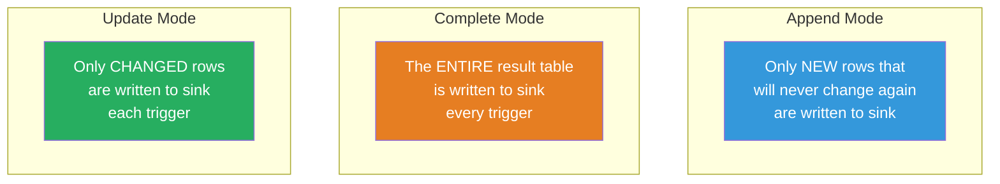

### Concrete Example

Imagine counting events by type. Events arrive in three batches:

```
Batch 1: [click, click, view]
Batch 2: [click, purchase, view]
Batch 3: [view, view, purchase]
```

| Mode | After Batch 1 | After Batch 2 | After Batch 3 |
|---|---|---|---|
| **Complete** | click:2, view:1 | click:3, view:2, purchase:1 | click:3, view:4, purchase:2 |
| **Update** | click:2, view:1 | click:3, view:2, purchase:1 | view:4, purchase:2 |
| **Append** | ❌ Not supported for aggregations without watermark | — | — |

> **Complete** outputs everything every time. **Update** only outputs changed rows. **Append** only outputs rows that are finalized.

### Which Mode for Which Query?

| Query Type | Append | Complete | Update |
|---|---|---|---|
| **Simple filter/map** (no aggregation) | ✅ Default | ❌ | ✅ |
| **Aggregation without watermark** | ❌ | ✅ | ✅ |
| **Aggregation WITH watermark** | ✅ | ✅ | ✅ |
| **mapGroupsWithState** | ✅ | ❌ | ✅ |
| **flatMapGroupsWithState** | ✅ (append) | ❌ | ✅ (update) |

### Decision Tree

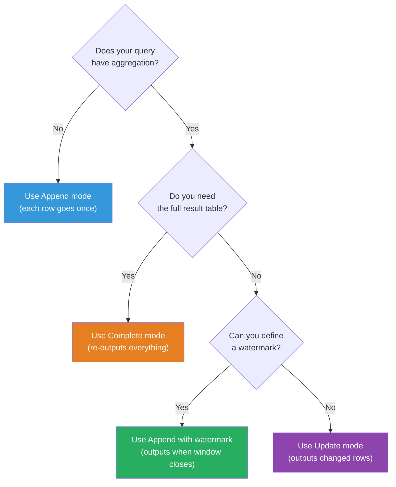

---

## Triggers — When to Process

Triggers control **how frequently** Structured Streaming processes data.

### Available Trigger Types

```python
from pyspark.sql.streaming import Trigger

# 1. Default (micro-batch as fast as possible)
query = df.writeStream.trigger(processingTime="0 seconds").start()

# 2. Fixed interval micro-batch
query = df.writeStream.trigger(processingTime="30 seconds").start()

# 3. Once (process all available data, then stop)
# DEPRECATED in Spark 3.3+
query = df.writeStream.trigger(once=True).start()

# 4. Available-now (improved version of Once)
# Process all available data in multiple batches, then stop
query = df.writeStream.trigger(availableNow=True).start()

# 5. Continuous (experimental) — sub-millisecond latency
query = df.writeStream.trigger(continuous="1 second").start()
```

### Trigger Comparison

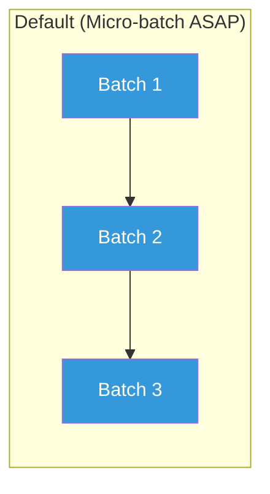

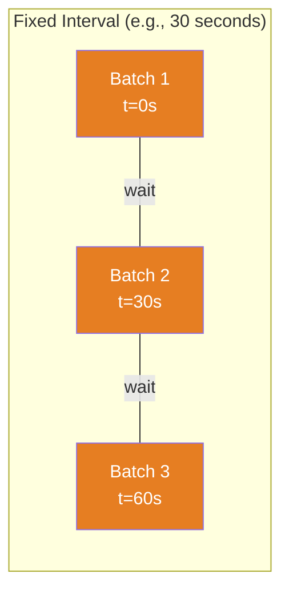

| Trigger | Latency | Throughput | Use Case |
|---|---|---|---|
| **Default** | Lowest micro-batch | High | Real-time dashboards |
| **Fixed interval (10s)** | ~10 seconds | Very high | Near-real-time ETL |
| **Fixed interval (5min)** | ~5 minutes | Maximum | Micro-batch ETL replacing cron jobs |
| **Available-now** | N/A (stops) | Maximum | One-time catch-up, backfill |
| **Once** (deprecated) | N/A (stops) | High | Legacy one-time processing |
| **Continuous** (experimental) | Sub-millisecond | Lower | Ultra-low latency (limited operations) |

### When to Use Each

```python
# Real-time fraud detection → Default trigger (fastest)
fraud_query = alerts_df.writeStream \
    .trigger(processingTime="0 seconds") \
    .format("kafka") \
    .start()

# Near-real-time analytics → Fixed interval
analytics_query = metrics_df.writeStream \
    .trigger(processingTime="1 minute") \
    .format("parquet") \
    .start()

# Daily catch-up job → Available-now
catchup_query = backlog_df.writeStream \
    .trigger(availableNow=True) \
    .format("delta") \
    .start()
catchup_query.awaitTermination()  # Stops when done
```

---

## Watermarks and Late Data

### The Problem: Events Arrive Late

In the real world, events don't arrive in order:

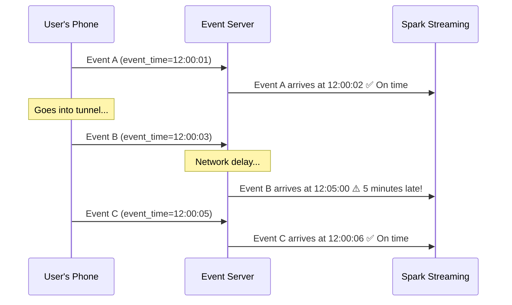

**Question:** When computing a count for the 12:00-12:01 window, should Event B (which arrived 5 minutes late) be included?

### The Solution: Watermarks

A **watermark** tells Spark: "I guarantee that no events older than X will arrive." This lets Spark know when it's safe to finalize a window.

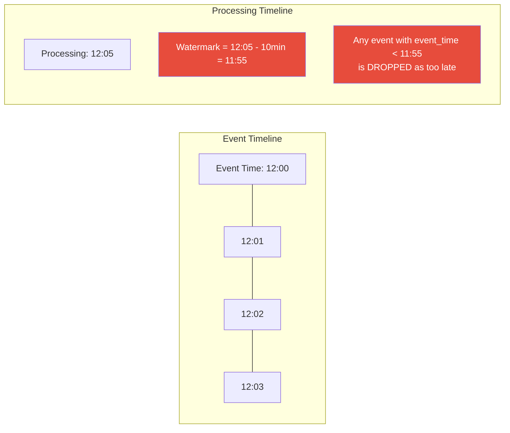

### Watermark Configuration

```python
from pyspark.sql.functions import window, col

# Define a 10-minute watermark on event_time
windowed_counts = (
    events_df
    .withWatermark("event_time", "10 minutes")  # Allow up to 10 min late
    .groupBy(
        window(col("event_time"), "5 minutes"),  # 5-minute tumbling windows
        col("event_type")
    )
    .count()
)

# Write with append mode (outputs when window is finalized)
query = windowed_counts.writeStream \
    .outputMode("append") \
    .format("parquet") \
    .option("checkpointLocation", "s3://checkpoints/windowed/") \
    .start("s3://output/windowed_counts/")
```

### How Watermarks Work Internally

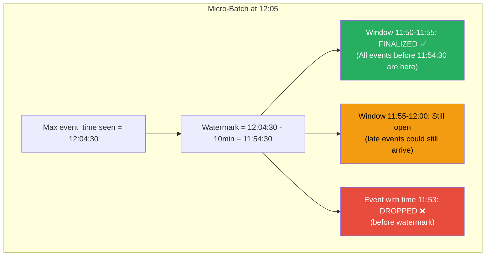

### Watermark Rules

1. **Watermark = max event time seen - threshold**
2. Events **older than the watermark** are dropped
3. Windows **older than the watermark** are finalized and emitted (in append mode)
4. State for finalized windows is **cleaned up** (saves memory!)

### Choosing the Right Watermark Threshold

| Scenario | Typical Threshold | Reasoning |
|---|---|---|
| **Mobile app events** | 5-30 minutes | Users may be offline briefly |
| **IoT sensor data** | 1-10 minutes | Network delays, buffering |
| **Server logs** | 30 seconds - 2 minutes | Usually arrive quickly |
| **Financial transactions** | 1-5 minutes | Reconciliation delays |
| **Cross-timezone aggregation** | Hours | Time zone conversion issues |

> **⚠️ Warning:** A larger watermark means more state is kept in memory (all open windows). A smaller watermark means more late data is dropped. Choose based on your tolerance for late data vs memory usage.

---

## Stateful Operations

Stateful operations maintain information **across micro-batches**. Every time a new batch arrives, Spark updates the state and produces output.

### Types of Stateful Operations

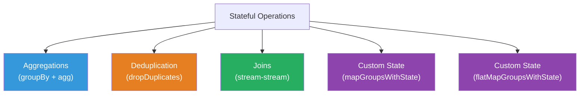

### Streaming Aggregations

```python
# Running count of events by type (no windowing)
running_counts = events_df.groupBy("event_type").count()

# Windowed aggregation with watermark
windowed_agg = (
    events_df
    .withWatermark("event_time", "10 minutes")
    .groupBy(
        window(col("event_time"), "5 minutes", "1 minute"),  # Sliding window: 5min size, 1min slide
        col("event_type")
    )
    .agg(
        count("*").alias("event_count"),
        avg("amount").alias("avg_amount"),
        max("amount").alias("max_amount"),
    )
)
```

### Window Types

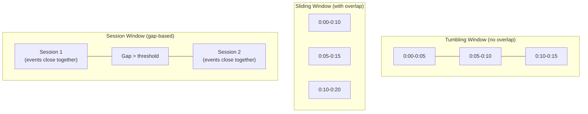

```python
# Tumbling window: 5 minutes, no overlap
window(col("event_time"), "5 minutes")

# Sliding window: 10-minute window, sliding every 2 minutes
window(col("event_time"), "10 minutes", "2 minutes")

# Session window (Spark 3.2+): gap of 5 minutes
session_window(col("event_time"), "5 minutes")
```

### Streaming Deduplication

```python
# Deduplicate events within the watermark period
deduped_df = (
    events_df
    .withWatermark("event_time", "1 hour")
    .dropDuplicates(["event_id"])  # Keep first occurrence of each event_id
)

# Deduplicate with watermark — Spark only keeps state for events
# within the watermark window, preventing unbounded state growth
```

> **💡 Key Insight:** Without a watermark, `dropDuplicates` keeps **all** event IDs in state forever — eventually leading to OOM. Always pair `dropDuplicates` with a watermark in streaming!

### Custom State with mapGroupsWithState

For complex stateful logic that doesn't fit into standard aggregations:

```python
from pyspark.sql.streaming import GroupState, GroupStateTimeout

# Example: Track user sessions with custom timeout
def update_session_state(key, values, state: GroupState):
    """Custom stateful function to track user sessions."""
    if state.hasTimedOut:
        # Session expired — emit the session summary
        session = state.get
        state.remove()
        return (key, session["start_time"], session["event_count"], "closed")
    
    # Update session state with new events
    if state.exists:
        session = state.get
    else:
        session = {"start_time": None, "event_count": 0}
    
    for value in values:
        if session["start_time"] is None:
            session["start_time"] = value.event_time
        session["event_count"] += 1
    
    state.update(session)
    state.setTimeoutDuration("30 minutes")  # Reset timeout
    
    return (key, session["start_time"], session["event_count"], "active")

# Apply custom state function
sessions = events_df \
    .groupByKey(lambda row: row.user_id) \
    .mapGroupsWithState(
        update_session_state,
        outputMode="update",
        timeoutConf=GroupStateTimeout.ProcessingTimeTimeout
    )
```

---

## Stream-Stream Joins

Joining two live streams is one of the most powerful — and complex — operations in Structured Streaming.

### The Challenge

When joining two streams, events from one stream may arrive before their matching events in the other stream:

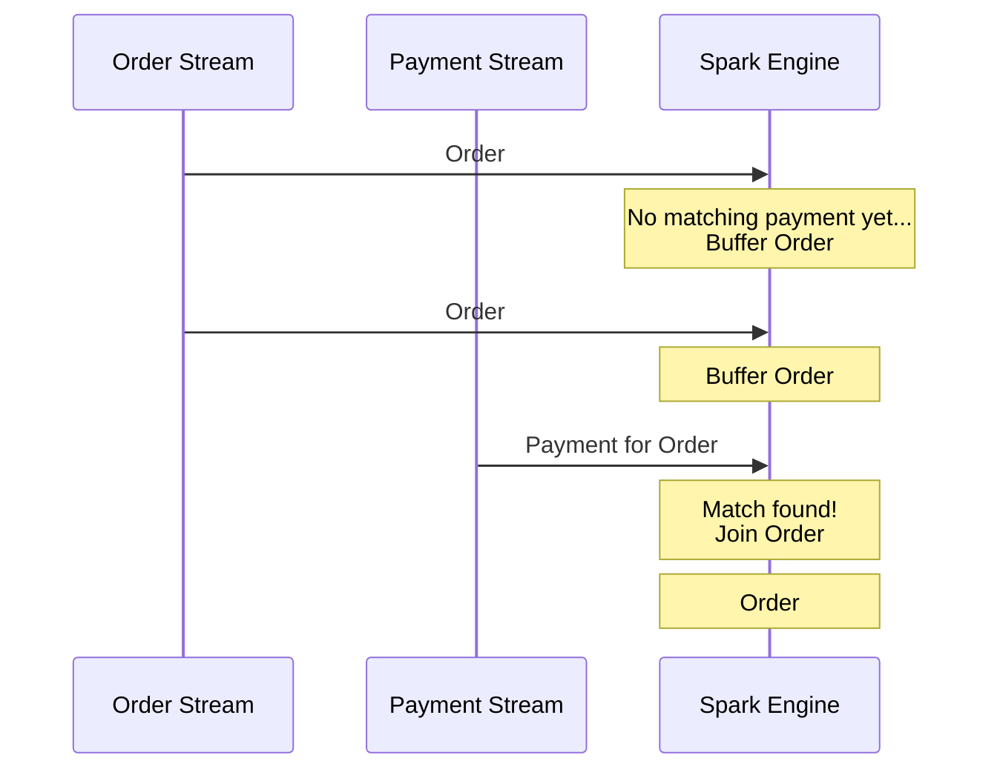

### Stream-Stream Join with Watermarks

```python
# Stream 1: Impressions (when ads are shown)
impressions = spark.readStream.format("kafka") \
    .option("subscribe", "impressions") \
    .load() \
    .select(
        col("ad_id"),
        col("impression_time").cast("timestamp"),
        col("user_id")
    ) \
    .withWatermark("impression_time", "2 hours")

# Stream 2: Clicks (when ads are clicked)
clicks = spark.readStream.format("kafka") \
    .option("subscribe", "clicks") \
    .load() \
    .select(
        col("ad_id"),
        col("click_time").cast("timestamp"),
        col("user_id").alias("click_user_id")
    ) \
    .withWatermark("click_time", "3 hours")

# Join: Match impressions with their clicks
# Time constraint: click must happen within 1 hour of impression
impression_clicks = impressions.join(
    clicks,
    expr("""
        impressions.ad_id = clicks.ad_id AND
        click_time >= impression_time AND
        click_time <= impression_time + interval 1 hour
    """),
    "leftOuter"  # Keep impressions without clicks too
)
```

### Join Types Supported in Stream-Stream Joins

| Join Type | Supported? | Requirements |
|---|---|---|
| **Inner** | ✅ | Watermarks on both sides, time constraint optional but recommended |
| **Left Outer** | ✅ | Watermark on RIGHT side required, time constraint required |
| **Right Outer** | ✅ | Watermark on LEFT side required, time constraint required |
| **Full Outer** | ✅ (Spark 3.4+) | Watermarks on both sides, time constraint required |
| **Cross** | ❌ | Not supported (would be unbounded) |

> **💡 Key Insight:** Watermarks + time constraints tell Spark when it can safely say "no more matches will arrive for this event," allowing it to clean up state and emit outer join results.

---

## Stream-Static Joins

Joining a stream with a static (batch) table is simpler — the static side doesn't change.

```python
# Static dimension table (loaded once)
products = spark.read.parquet("s3://data/products/")

# Streaming events
events = spark.readStream.format("kafka") \
    .option("subscribe", "purchase-events") \
    .load()

# Join streaming events with static product info
enriched = events.join(products, "product_id", "left")

# The static table is broadcast-joined (small enough)
# If the static table changes, restart the query to pick up changes
```

### Refreshing Static Tables

```python
# Option 1: Periodic restart (simple but has downtime)
# Restart the streaming query periodically to reload static tables

# Option 2: Use foreachBatch to reload
def process_with_fresh_lookup(batch_df, batch_id):
    # Reload lookup table every batch
    products = spark.read.parquet("s3://data/products/")
    enriched = batch_df.join(broadcast(products), "product_id")
    enriched.write.parquet(f"s3://output/enriched/batch={batch_id}/")

events.writeStream.foreachBatch(process_with_fresh_lookup).start()
```

---

## Exactly-Once Semantics

### What Does "Exactly-Once" Mean?

| Guarantee | Meaning | Data Impact |
|---|---|---|
| **At-most-once** | Each event processed 0 or 1 times | May lose data |
| **At-least-once** | Each event processed 1 or more times | May duplicate data |
| **Exactly-once** | Each event processed exactly 1 time | Perfect, no loss or duplication |

### How Structured Streaming Achieves Exactly-Once

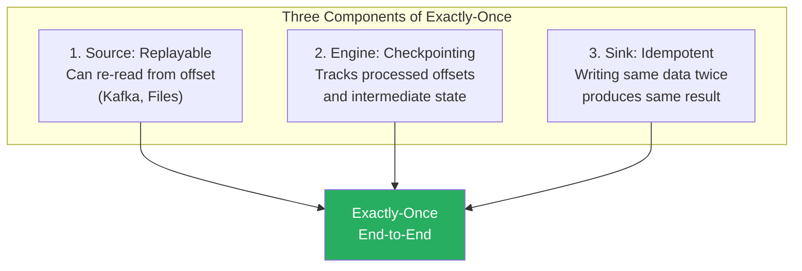

### Source Requirements

| Source | Replayable? | How |
|---|---|---|
| **Kafka** | ✅ Yes | Can seek to specific offsets |
| **File** | ✅ Yes | File list is deterministic |
| **Socket** | ❌ No | Data is lost once read |
| **Rate** | ❌ No | Generated data is ephemeral |

### Sink Requirements

```python
# ✅ File sink — idempotent (writes to unique paths)
df.writeStream.format("parquet").start("s3://output/")

# ✅ foreachBatch with idempotent logic
def idempotent_write(batch_df, batch_id):
    # Write to a path that includes batch_id — writing twice is harmless
    batch_df.write.mode("overwrite").parquet(f"s3://output/batch-{batch_id}/")

# ⚠️ Kafka sink — at-least-once (no transactional writes)
# May produce duplicates on failure recovery

# ⚠️ foreach — depends on YOUR implementation being idempotent
```

---

## Checkpointing for Fault Tolerance

### What is Checkpointing?

Checkpointing saves the **complete state** of a streaming query so it can be recovered after failure:

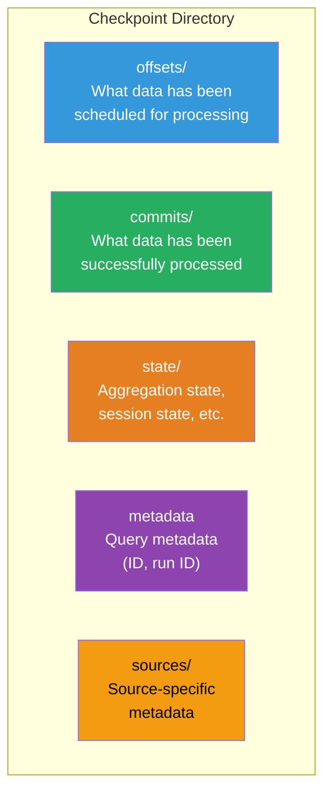

### Configuring Checkpoints

```python
# ALWAYS set checkpoint location for production queries!
query = df.writeStream \
    .format("parquet") \
    .option("checkpointLocation", "s3://checkpoints/my-query/") \
    .option("path", "s3://output/my-data/") \
    .start()

# ⚠️ IMPORTANT rules for checkpoints:
# 1. Each streaming query MUST have a UNIQUE checkpoint location
# 2. Don't share checkpoints between different queries
# 3. Use reliable storage (S3, GCS, HDFS) — NOT local disk!
# 4. Don't delete checkpoint directories of running queries
```

### Recovery Process

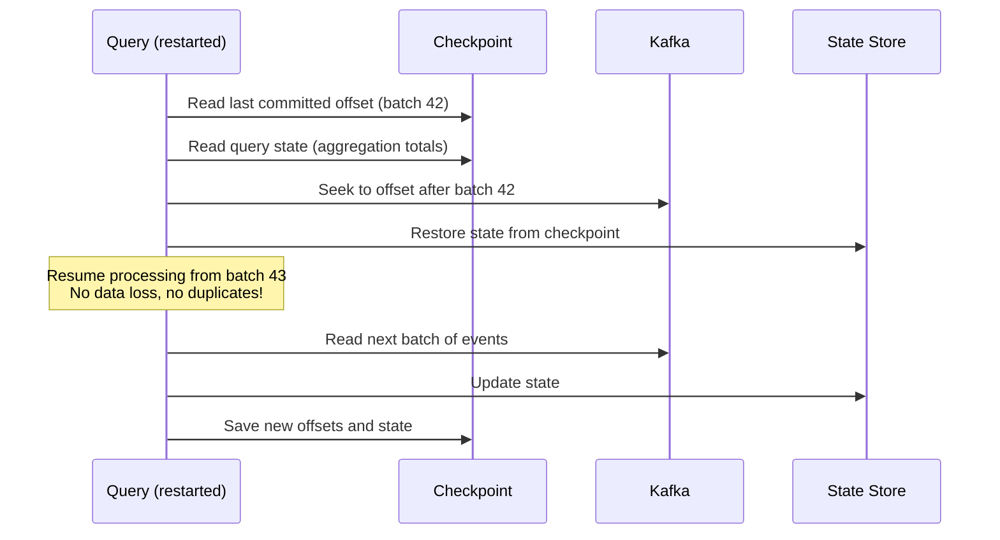

### Checkpoint Compatibility

> **⚠️ Warning:** Not all query changes are compatible with existing checkpoints!

| Change | Compatible? | Action Required |
|---|---|---|
| Add new column to output | ✅ Yes | Restart normally |
| Change aggregation function | ❌ No | Delete checkpoint, restart |
| Change watermark threshold | ❌ No | Delete checkpoint, restart |
| Change trigger interval | ✅ Yes | Restart normally |
| Add new filter | ✅ Sometimes | Test carefully |
| Change groupBy keys | ❌ No | Delete checkpoint, restart |
| Change Spark version (minor) | ✅ Usually | Test first |
| Change Spark version (major) | ⚠️ Maybe | Read migration guide |

---

## Monitoring Streaming Queries

### Query Progress

```python
# Get query object
query = df.writeStream.format("console").start()

# Check progress
print(query.status)
# {
#   "message": "Processing new data",
#   "isDataAvailable": true,
#   "isTriggerActive": true
# }

# Detailed progress for last batch
print(query.lastProgress)
# {
#   "id": "abc-123",
#   "runId": "def-456",
#   "batchId": 42,
#   "numInputRows": 15000,
#   "inputRowsPerSecond": 5000.0,
#   "processedRowsPerSecond": 8000.0,  ← Must be > inputRowsPerSecond!
#   "durationMs": {
#     "addBatch": 1500,
#     "getBatch": 200,
#     "latestOffset": 50,
#     "queryPlanning": 30,
#     "triggerExecution": 1850,
#     "walCommit": 70
#   },
#   "stateOperators": [{
#     "numRowsTotal": 50000,        ← State size — watch for growth!
#     "numRowsUpdated": 1500,
#     "memoryUsedBytes": 125000000
#   }]
# }
```

### The Critical Metric: Processing Rate vs Input Rate

```mermaid
graph LR
    subgraph "Healthy ✅"
        A["Input: 5000 rows/s"] --> B["Processing: 8000 rows/s"]
    end
    
    subgraph "Falling Behind ❌"
        C["Input: 10000 rows/s"] --> D["Processing: 6000 rows/s"]
    end

    style B fill:#27ae60,color:#fff
    style D fill:#e74c3c,color:#fff
```

**If `processedRowsPerSecond` < `inputRowsPerSecond`, your query is falling behind!** The lag will grow unboundedly.

### StreamingQueryListener (Production Monitoring)

```python
from pyspark.sql.streaming import StreamingQueryListener

class MonitoringListener(StreamingQueryListener):
    def onQueryStarted(self, event):
        print(f"Query started: {event.id}")
    
    def onQueryProgress(self, event):
        progress = event.progress
        # Send metrics to your monitoring system
        input_rate = progress.inputRowsPerSecond
        processing_rate = progress.processedRowsPerSecond
        state_rows = sum(
            op.numRowsTotal for op in progress.stateOperators
        )
        
        # Alert if falling behind
        if processing_rate < input_rate * 0.8:
            send_alert(f"Streaming query falling behind! "
                       f"Input: {input_rate}/s, Processing: {processing_rate}/s")
        
        # Alert if state is growing too large
        if state_rows > 10_000_000:
            send_alert(f"State size growing: {state_rows} rows")
    
    def onQueryTerminated(self, event):
        if event.exception:
            send_alert(f"Query terminated with error: {event.exception}")

# Register listener
spark.streams.addListener(MonitoringListener())
```

---

## Production Scenarios

### Scenario 1: Real-Time Fraud Detection at a Fintech Company

**Architecture:**

```mermaid
graph LR
    A["Payment<br/>Service"] -->|Events| B["Kafka<br/>Transactions"]
    B --> C["Spark Structured<br/>Streaming"]
    C --> D["Kafka<br/>Fraud Alerts"]
    C --> E["Delta Lake<br/>Transaction History"]
    D --> F["Alert<br/>Service"]

    G["ML Model<br/>Registry"] -->|"Broadcast"| C
    H["Rules<br/>Engine DB"] -->|"Static Join"| C

    style C fill:#E25A1C,color:#fff
```

```python
# Read transactions from Kafka
transactions = spark.readStream.format("kafka") \
    .option("kafka.bootstrap.servers", "broker:9092") \
    .option("subscribe", "transactions") \
    .load() \
    .select(from_json(col("value").cast("string"), tx_schema).alias("tx")) \
    .select("tx.*")

# Enrich with rules (static join)
rules = spark.read.jdbc(url, "fraud_rules")
enriched = transactions.join(broadcast(rules), "merchant_category")

# Detect velocity — more than 5 transactions in 10 minutes
velocity_alerts = (
    transactions
    .withWatermark("tx_time", "15 minutes")
    .groupBy(
        window(col("tx_time"), "10 minutes"),
        col("card_id")
    )
    .agg(
        count("*").alias("tx_count"),
        sum("amount").alias("total_amount"),
        collect_list("merchant_country").alias("countries")
    )
    .filter(
        (col("tx_count") > 5) | 
        (col("total_amount") > 5000) |
        (size(array_distinct(col("countries"))) > 2)  # Multiple countries
    )
)

# Write alerts to Kafka
velocity_alerts.selectExpr(
    "card_id AS key",
    "to_json(struct(*)) AS value"
).writeStream \
    .format("kafka") \
    .option("kafka.bootstrap.servers", "broker:9092") \
    .option("topic", "fraud-alerts") \
    .option("checkpointLocation", "s3://cp/fraud-velocity/") \
    .trigger(processingTime="10 seconds") \
    .start()
```

### Scenario 2: Real-Time Analytics Dashboard

```python
# Page view events from website
page_views = spark.readStream.format("kafka") \
    .option("subscribe", "page-views").load()

# 1-minute tumbling windows for real-time dashboard
dashboard_metrics = (
    page_views
    .withWatermark("view_time", "5 minutes")
    .groupBy(
        window(col("view_time"), "1 minute"),
        col("page_path"),
        col("country")
    )
    .agg(
        count("*").alias("views"),
        approx_count_distinct("session_id").alias("unique_sessions"),
        avg("load_time_ms").alias("avg_load_time")
    )
)

# Write to a database that powers the dashboard
dashboard_metrics.writeStream \
    .foreachBatch(write_to_timeseries_db) \
    .trigger(processingTime="30 seconds") \
    .option("checkpointLocation", "s3://cp/dashboard/") \
    .start()
```

---

## Troubleshooting Guide

### Symptom: Query Falling Behind (Processing Rate < Input Rate)

```mermaid
graph TD
    A["Query falling behind 📉"] --> B{Check processing time}
    B -->|"addBatch is slow"| C{Check state size}
    C -->|"Large state"| D["Add/tighten watermark<br/>State is unbounded!"]
    C -->|"Small state"| E{Check shuffles}
    E -->|"Large shuffles"| F["Increase parallelism<br/>More executors/cores"]
    E -->|"Small shuffles"| G["Check source read time<br/>Kafka lag? S3 listing?"]
    B -->|"getBatch is slow"| H["Source is slow<br/>Check Kafka/S3/network"]
```

**Fixes:**
```python
# Increase parallelism
spark.conf.set("spark.sql.shuffle.partitions", 400)

# Increase executor resources
# --num-executors 20 --executor-cores 4 --executor-memory 8g

# Rate-limit input to prevent overwhelming
spark.readStream.format("kafka") \
    .option("maxOffsetsPerTrigger", 50000)  # Limit per trigger

# Tighten watermark to reduce state
df.withWatermark("event_time", "5 minutes")  # Was 1 hour, reduced to 5 min
```

### Symptom: OutOfMemoryError in Streaming

**Root Cause:** Unbounded state growth — usually missing watermark.

```python
# ❌ No watermark → state grows forever
df.groupBy("user_id").count()  # Keeps ALL user_id counts in state forever!

# ✅ With watermark → state is bounded
df.withWatermark("event_time", "1 hour") \
  .groupBy(window(col("event_time"), "10 minutes"), "user_id") \
  .count()
# After watermark passes a window, state for that window is cleaned up
```

### Symptom: Duplicate Data in Sink

**Root Causes and Fixes:**

1. **Kafka sink doesn't support exactly-once natively:**
   ```python
   # Use foreachBatch with idempotent writes
   def idempotent_kafka_write(batch_df, batch_id):
       batch_df.selectExpr("key", "value") \
           .write.format("kafka") \
           .option("kafka.bootstrap.servers", "broker:9092") \
           .option("topic", "output") \
           .save()
   ```

2. **foreachBatch running twice on failure recovery:**
   ```python
   def truly_idempotent_write(batch_df, batch_id):
       # Use batch_id as dedup key
       batch_df.write \
           .mode("overwrite") \
           .parquet(f"s3://output/batch-{batch_id}/")
   ```

### Symptom: "AnalysisException: Append output mode not supported"

You're trying to use append mode with an aggregation that doesn't have a watermark:

```python
# ❌ This fails — Spark can't finalize rows without a watermark
df.groupBy("key").count().writeStream.outputMode("append").start()

# ✅ Option 1: Add watermark
df.withWatermark("ts", "10 minutes") \
  .groupBy(window("ts", "5 minutes"), "key") \
  .count().writeStream.outputMode("append").start()

# ✅ Option 2: Use complete or update mode
df.groupBy("key").count().writeStream.outputMode("complete").start()
```

---

## Performance Considerations

### 1. Right-Size Your Trigger Interval

```python
# Too frequent → high scheduling overhead
.trigger(processingTime="100 milliseconds")  # ❌ Overhead > processing

# Too infrequent → high latency
.trigger(processingTime="10 minutes")  # ❌ Why use streaming?

# Just right — process in a few seconds, trigger every 10-30s
.trigger(processingTime="10 seconds")  # ✅ Good balance
```

### 2. Control State Size

```python
# Monitor state size in query progress
progress = query.lastProgress
for op in progress["stateOperators"]:
    print(f"State rows: {op['numRowsTotal']}")
    print(f"State memory: {op['memoryUsedBytes'] / 1024 / 1024:.0f} MB")

# Configure state store
spark.conf.set("spark.sql.streaming.stateStore.providerClass",
               "org.apache.spark.sql.execution.streaming.state.HDFSBackedStateStoreProvider")
# Consider RocksDB state store for large state:
spark.conf.set("spark.sql.streaming.stateStore.providerClass",
               "org.apache.spark.sql.execution.streaming.state.RocksDBStateStoreProvider")
```

### 3. Optimize Kafka Consumption

```python
# Set appropriate maxOffsetsPerTrigger
.option("maxOffsetsPerTrigger", 100000)  # Process max 100K records per trigger

# Match Kafka partitions to Spark parallelism
# Kafka topic has 24 partitions → use at least 24 Spark tasks
spark.conf.set("spark.sql.shuffle.partitions", 24)

# Enable Kafka consumer caching
.option("kafka.consumer.cache.capacity", "64")
```

### 4. Minimize Shuffles in Streaming

```python
# ❌ Two shuffles — groupBy + orderBy
df.groupBy("key").count().orderBy("count")

# ✅ One shuffle — only groupBy (drop orderBy in streaming)
df.groupBy("key").count()
# Sort in the downstream consumer, not in the stream
```

---

## Common Mistakes

### Mistake 1: Forgetting the Watermark

```python
# ❌ State grows FOREVER — will eventually OOM
events.groupBy("user_id").count()

# ✅ Watermark bounds the state
events.withWatermark("event_time", "1 hour") \
    .groupBy(window("event_time", "10 min"), "user_id") \
    .count()
```

### Mistake 2: Using Socket Source in Production

```python
# ❌ NEVER — no fault tolerance, single receiver
spark.readStream.format("socket").option("host", "prod-server").load()

# ✅ Use Kafka for production
spark.readStream.format("kafka").option("subscribe", "events").load()
```

### Mistake 3: Sharing Checkpoint Directories

```python
# ❌ Two queries sharing the same checkpoint → DATA CORRUPTION
query1 = df.writeStream.option("checkpointLocation", "s3://cp/shared/").start()
query2 = df2.writeStream.option("checkpointLocation", "s3://cp/shared/").start()

# ✅ Each query gets its own checkpoint
query1 = df.writeStream.option("checkpointLocation", "s3://cp/query1/").start()
query2 = df2.writeStream.option("checkpointLocation", "s3://cp/query2/").start()
```

### Mistake 4: Not Handling Schema Evolution

```python
# ❌ If Kafka messages change schema, query crashes
events = spark.readStream.format("kafka").load()
parsed = events.select(from_json("value", fixed_schema))

# ✅ Use schema registry or handle unknown fields
from confluent_kafka.schema_registry import SchemaRegistryClient

# Or use permissive mode
parsed = events.select(
    from_json("value", schema, {"mode": "PERMISSIVE"})
)
```

### Mistake 5: collect() in Streaming

```python
# ❌ You can't collect() a streaming DataFrame!
streaming_df.collect()  # Throws AnalysisException

# ✅ Use writeStream to output results
streaming_df.writeStream.format("console").start()
```

---

## Interview Questions

### Beginner Level

**Q1: What is the difference between batch processing and stream processing?**

**A:** Batch processing handles a fixed, bounded dataset — you know all the data upfront and process it all at once. Stream processing handles an unbounded, continuously arriving dataset — data arrives over time and must be processed incrementally. Batch is simpler but has higher latency (hours/days). Streaming is more complex but enables real-time processing (seconds/minutes).

**Q2: What is Structured Streaming in Spark?**

**A:** Structured Streaming is Spark's stream processing engine built on the DataFrame/Dataset API. It treats live data streams as an "infinite append-only table." The key innovation is that you write the same DataFrame operations for both batch and streaming — Spark handles the complexity of incremental execution. It provides exactly-once fault tolerance guarantees through checkpointing and replayable sources.

**Q3: What are the three output modes in Structured Streaming?**

**A:**
- **Append:** Only new rows that will never change are output. Use for non-aggregation queries or aggregations with watermarks.
- **Complete:** The entire result table is re-output every trigger. Use for aggregations where you need the full picture.
- **Update:** Only changed rows are output. Use for aggregations where you only care about what changed.

**Q4: What is a watermark in Spark Streaming?**

**A:** A watermark is a threshold that defines how late data can arrive and still be processed. It's defined as `max_event_time_seen - threshold`. Events with event times older than the watermark are dropped. Watermarks serve two purposes: (1) they allow Spark to finalize time windows and emit results in append mode, and (2) they bound state size by allowing Spark to clean up old state.

---

### Intermediate Level

**Q5: Explain the difference between processing time and event time.**

**A:**
- **Processing time:** The time when Spark processes the event. This is the wall-clock time on the executor.
- **Event time:** The time when the event actually occurred (embedded in the data). This may differ from processing time due to network delays, buffering, or system failures.

Structured Streaming primarily uses **event time** for windowing because processing time depends on system load and delays — it doesn't reflect when events actually happened. This is why watermarks are based on event time.

**Q6: How does Structured Streaming achieve exactly-once processing?**

**A:** Exactly-once requires three components:
1. **Replayable source** (e.g., Kafka) — can re-read data from a specific offset after failure
2. **Checkpointing** — Spark saves processed offsets and state to reliable storage. On recovery, it knows exactly where to resume
3. **Idempotent sink** — writing the same data twice produces the same result (e.g., file sink writes to unique paths)

If any component is missing, you get at-least-once or at-most-once.

**Q7: What is the difference between the `once` and `availableNow` triggers?**

**A:** Both process all available data and then stop, but they behave differently:
- **Once** (deprecated): Processes all available data in a **single** micro-batch. If there's a lot of accumulated data, this one batch can be very large and slow.
- **AvailableNow**: Processes all available data in **multiple** micro-batches (same as normal streaming, but stops when caught up). This is better because it breaks the work into manageable batches with proper resource management.

**Q8: How do stream-stream joins work in Structured Streaming?**

**A:** Stream-stream joins buffer events from both streams in state and match them as matching events arrive. Because events from either side may arrive at different times, Spark must maintain state for both streams. Watermarks and time constraints are used to bound this state — once an event is past the watermark + time constraint, Spark knows no future event from the other stream can match it, so the state is cleaned up. For outer joins, when an event passes the time constraint without finding a match, Spark emits a null-filled row.

---

### Advanced Level

**Q9: You need to design a real-time pipeline that detects credit card fraud within 30 seconds of a transaction. Walk me through your architecture.**

**A:**
1. **Source:** Kafka topic receiving transactions from payment gateway (partitioned by card hash for locality)
2. **Processing Layer:** Spark Structured Streaming with:
   - **Static join** with card profiles (broadcast) — check if transaction matches cardholder patterns
   - **Windowed aggregation** (10-min windows, 5-min watermark) — detect velocity anomalies (too many transactions in short time)
   - **Stream-stream join** with geolocation stream — detect impossible travel (transaction in NYC, then Tokyo within an hour)
   - **ML scoring** via broadcast model — score each transaction for fraud probability
3. **Output:** Dual sink — high-confidence alerts to Kafka "block-card" topic (triggers immediate card block), all scores to Delta Lake for analysis and model retraining
4. **Configuration:** Default trigger (lowest latency), 15-minute watermark, RocksDB state store for large state, 24+ executors matching Kafka partition count
5. **Monitoring:** StreamingQueryListener sending metrics to Prometheus, alerts if processing rate < input rate or latency > 30 seconds

**Q10: Your streaming query's state store is growing unboundedly and causing OOM. How do you diagnose and fix this?**

**A:**
1. **Diagnose:** Check `query.lastProgress["stateOperators"]` — look at `numRowsTotal` and `memoryUsedBytes` over time. If they're increasing monotonically, state is unbounded.
2. **Root Causes:**
   - Missing watermark on aggregation (state never cleaned up)
   - `dropDuplicates` without watermark (remembers all keys forever)
   - Stream-stream join with loose time constraints
   - Watermark too generous (e.g., 24 hours keeps 24 hours of state)
3. **Fixes:**
   - Add/tighten watermarks
   - Use windowed aggregations instead of global aggregations
   - Switch to RocksDB state store (spills to disk) for large state
   - Reduce watermark duration to minimum acceptable value
   - For deduplication, use windowed `dropDuplicates` with a watermark

---

**[← Previous: 11-spark-execution-plan.md](11-spark-execution-plan.md) | [Home](../README.md) | [Next →: 13-spark-performance-tuning.md](13-spark-performance-tuning.md)**
