# 🚀 Chapter 13: Spark Performance Tuning — Making Spark Fly

> **"The difference between a 4-hour Spark job and a 15-minute one is rarely more hardware — it's understanding where the time goes and eliminating waste."**

---

## 📋 Table of Contents

- [Intuition — Why Performance Tuning Matters](#intuition--why-performance-tuning-matters)
- [Real-World Analogy — Tuning a Race Car](#real-world-analogy--tuning-a-race-car)
- [The Performance Tuning Framework](#the-performance-tuning-framework)
- [Data Serialization — Kryo vs Java](#data-serialization--kryo-vs-java)
- [Data Format Selection](#data-format-selection--why-parquet-wins)
- [Partition Tuning](#partition-tuning)
- [Join Optimization](#join-optimization)
- [Caching Strategies](#caching-strategies)
- [Adaptive Query Execution (AQE)](#adaptive-query-execution-aqe)
- [Predicate Pushdown and Column Pruning](#predicate-pushdown-and-column-pruning)
- [Dynamic Partition Pruning](#dynamic-partition-pruning)
- [Data Skew Mitigation](#data-skew-mitigation)
- [Small File Problem](#small-file-problem)
- [Spark Configuration Tuning](#spark-configuration-tuning)
- [Driver vs Executor Resource Allocation](#driver-vs-executor-resource-allocation)
- [Dynamic Allocation](#dynamic-allocation)
- [Monitoring and Profiling](#monitoring-and-profiling)
- [Performance Checklist](#performance-checklist)
- [Production Scenarios](#production-scenarios)
- [Troubleshooting Guide](#troubleshooting-guide)
- [Common Mistakes](#common-mistakes)
- [Interview Questions](#interview-questions)

---

## Intuition — Why Performance Tuning Matters

Consider two engineers working on the same Spark job processing 10TB of clickstream data:

| Metric | Engineer A (Default Config) | Engineer B (Tuned) |
|---|---|---|
| **Runtime** | 6 hours | 25 minutes |
| **Cluster Cost** | $480 | $35 |
| **Shuffle Data** | 2.1 TB | 180 GB |
| **Failed Tasks** | 47 (retried) | 0 |
| **Annual Cost** | $175,200 | $12,775 |

Same data, same logic, same cluster size. The difference? Engineer B understood:
- Which data format eliminates 90% of I/O
- How to size partitions so no task gets overloaded
- When to broadcast a table to eliminate a shuffle
- How to detect and fix data skew
- How to configure executor memory to avoid GC storms

> **💡 Key Insight:** Performance tuning isn't about tweaking random configs and hoping for the best. It's about understanding where your job spends time and systematically eliminating bottlenecks.

---

## Real-World Analogy — Tuning a Race Car

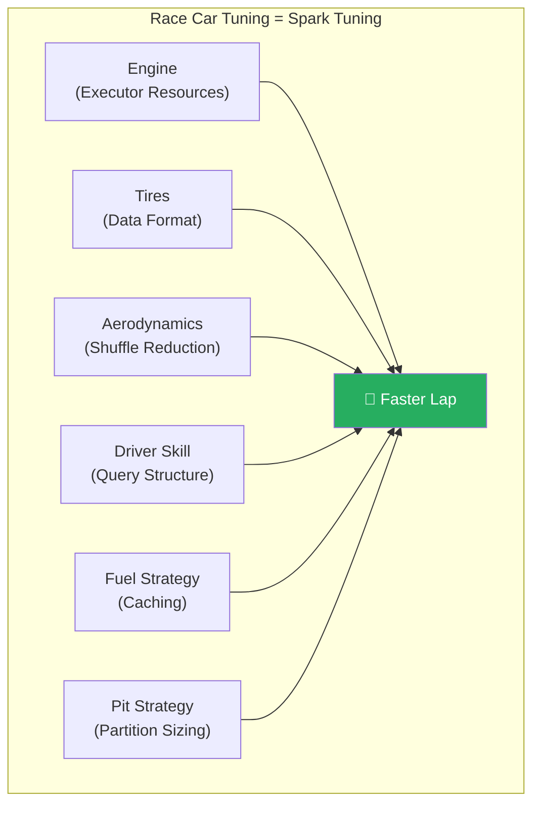

| Race Car | Spark |
|---|---|
| **Engine power** | Executor cores and memory |
| **Tire compound** | Data format (Parquet vs CSV) |
| **Aerodynamics** | Reducing shuffles and network I/O |
| **Driver skill** | Query structure and transformation order |
| **Fuel strategy** | When and what to cache |
| **Pit stop frequency** | Partition count (too many = overhead, too few = overload) |
| **Track knowledge** | Understanding the Spark UI |

---

## The Performance Tuning Framework

Always tune in this order — fixing later items without addressing earlier ones is wasted effort:

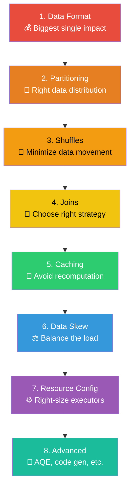

---

## Data Serialization — Kryo vs Java

### Why Serialization Matters

Spark serializes data when:
- Sending tasks from driver to executors
- Shuffling data between executors
- Caching data in memory
- Broadcasting variables

### Java Serialization vs Kryo

| Aspect | Java Serialization (Default) | Kryo Serialization |
|---|---|---|
| **Speed** | Slow (uses reflection) | 10x faster |
| **Size** | Large (includes class metadata) | 2-5x smaller |
| **Compatibility** | Works with all Serializable classes | Requires registration for best performance |
| **Default in Spark** | ✅ Yes (for RDD API) | ❌ No (must enable) |
| **DataFrame/SQL API** | Not used (uses Tungsten) | Not used (uses Tungsten) |

```python
# Enable Kryo serialization (for RDD operations)
spark = SparkSession.builder \
    .config("spark.serializer", "org.apache.spark.serializer.KryoSerializer") \
    .config("spark.kryo.registrationRequired", "false") \
    .getOrCreate()

# Register custom classes for better performance
spark.conf.set("spark.kryo.classesToRegister",
               "com.myapp.MyClass1,com.myapp.MyClass2")
```

> **💡 Key Insight:** If you're using the DataFrame/Dataset API (which you should be), Spark uses **Tungsten's binary format** internally — not Java or Kryo serialization. Kryo mainly matters for RDD operations and broadcast variables.

---

## Data Format Selection — Why Parquet Wins

### Format Comparison

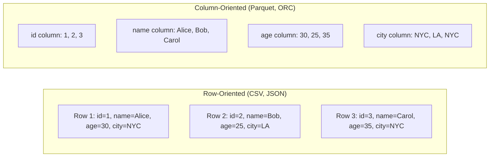

### The Definitive Comparison

| Feature | CSV | JSON | Avro | ORC | Parquet |
|---|---|---|---|---|---|
| **Column Pruning** | ❌ Full scan | ❌ Full scan | ❌ Full scan | ✅ Read only needed cols | ✅ Read only needed cols |
| **Predicate Pushdown** | ❌ | ❌ | ❌ | ✅ | ✅ |
| **Compression Ratio** | 1x (baseline) | 0.8x (larger) | 3-5x | 5-10x | 5-10x |
| **Schema Evolution** | ❌ | ✅ | ✅ | ✅ | ✅ |
| **Nested Data** | ❌ | ✅ | ✅ | ✅ | ✅ |
| **Splittable** | ✅ | ❌ (unless line-delimited) | ✅ | ✅ | ✅ |
| **Read Speed (analytical)** | 🔴 Slow | 🔴 Slow | 🟡 Medium | 🟢 Fast | 🟢 Fast |
| **Write Speed** | 🟢 Fast | 🟢 Fast | 🟢 Fast | 🟡 Medium | 🟡 Medium |
| **Spark Optimization** | Minimal | Minimal | Good | Good | Best |

### Real-World Performance Comparison

```python
# Reading 1TB of data — selecting 3 out of 50 columns, filtering by date

# CSV: Reads ALL 1TB, parses all 50 columns, then filters
# Time: ~45 minutes, Data Read: 1TB
df_csv = spark.read.csv("s3://data/events.csv", header=True)
result_csv = df_csv.filter(col("date") == "2024-01-15").select("user_id", "event_type", "amount")

# Parquet: Reads only 3 columns (~60GB), skips non-matching row groups
# Time: ~3 minutes, Data Read: ~40GB (with predicate pushdown)
df_parquet = spark.read.parquet("s3://data/events.parquet")
result_parquet = df_parquet.filter(col("date") == "2024-01-15").select("user_id", "event_type", "amount")
```

> **🏆 Bottom Line:** Use Parquet for almost everything. The only exception is when you need human-readable files (CSV/JSON for exports) or when interoperating with systems that require specific formats.

### Parquet Optimization Tips

```python
# Write Parquet with optimal settings
df.write \
    .mode("overwrite") \
    .option("compression", "snappy")           # Fast compression
    .option("parquet.block.size", 134217728)    # 128MB row groups
    .partitionBy("date", "country")            # Partition by query patterns
    .parquet("s3://output/events/")

# Enable Parquet optimizations
spark.conf.set("spark.sql.parquet.filterPushdown", "true")       # Default: true
spark.conf.set("spark.sql.parquet.mergeSchema", "false")         # Faster if schema is consistent
spark.conf.set("spark.sql.parquet.writeLegacyFormat", "false")   # Use modern format
```

---

## Partition Tuning

### The Partition Sweet Spot

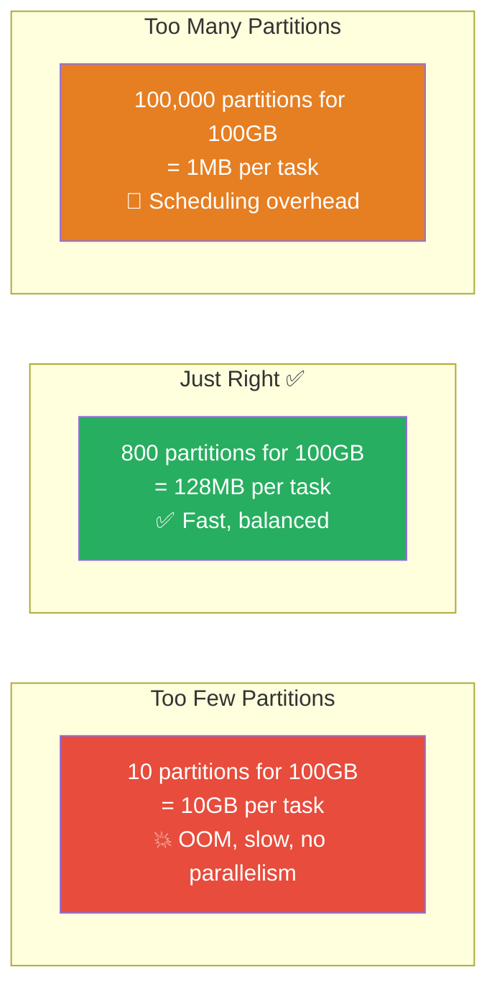

### Partition Sizing Rules

| Data Size | Recommended Partitions | Partition Size | Reasoning |
|---|---|---|---|
| 1 GB | 8-16 | 64-128 MB | Small data, don't over-parallelize |
| 10 GB | 80-160 | 64-128 MB | Standard batch job |
| 100 GB | 800-1600 | 64-128 MB | Medium batch job |
| 1 TB | 4,000-8,000 | 128-256 MB | Large batch job |
| 10 TB | 20,000-40,000 | 256-512 MB | Very large batch job |

### Input Partitions vs Shuffle Partitions

```python
# Input partitions — determined by data source
# For HDFS/S3: usually 1 partition per block/file
input_df = spark.read.parquet("s3://data/events/")
print(f"Input partitions: {input_df.rdd.getNumPartitions()}")

# Shuffle partitions — determines partitions AFTER a shuffle
# Default: 200 (almost always wrong!)
spark.conf.set("spark.sql.shuffle.partitions", "auto")  # AQE auto-tuning

# Or calculate manually
data_size_bytes = 100 * 1024 * 1024 * 1024  # 100 GB
target_size = 128 * 1024 * 1024  # 128 MB
num_partitions = max(data_size_bytes // target_size, 1)
spark.conf.set("spark.sql.shuffle.partitions", str(num_partitions))
```

### Repartition vs Coalesce

```python
# repartition(n): Full shuffle — creates n evenly distributed partitions
# Use when: Increasing partitions OR need even distribution
df.repartition(500)                         # Random repartition
df.repartition(500, "user_id")              # Hash repartition by key
df.repartition(500, "user_id", "date")      # Hash by multiple columns

# coalesce(n): No shuffle — merges existing partitions
# Use when: Reducing partitions (e.g., before writing)
# ⚠️ Can create uneven partitions
df.coalesce(10)  # Merge 1000 partitions into 10

# Best practice for writing
df.repartition(100, "date") \
  .write.partitionBy("date") \
  .parquet("s3://output/")
# Result: ~100 files per date partition, each ~128MB
```

---

## Join Optimization

### Join Strategies in Spark

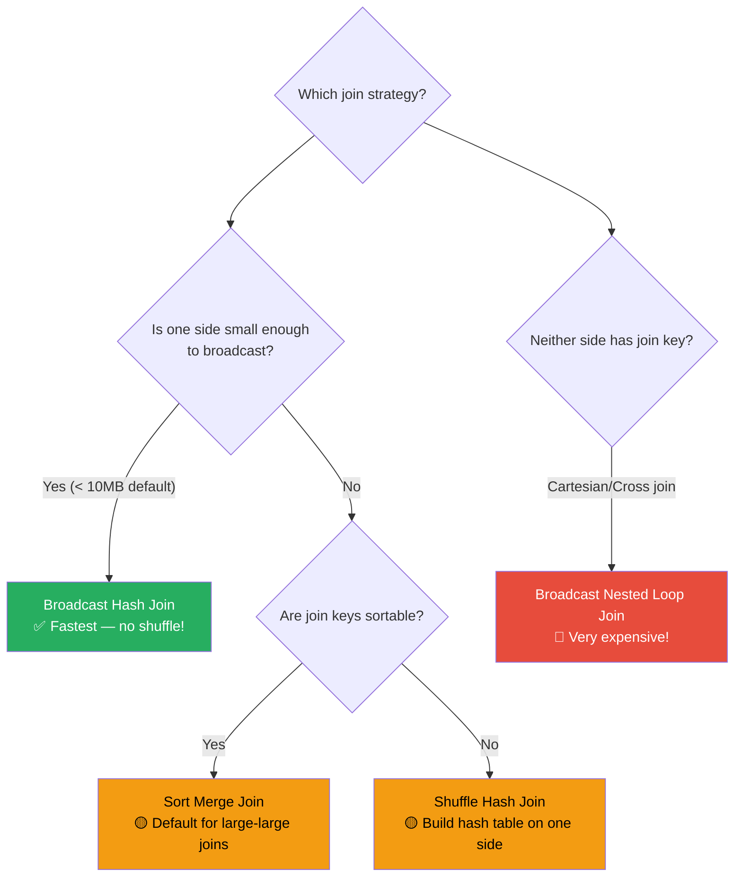

### Join Strategy Comparison

| Strategy | When Used | Shuffle? | Best For | Performance |
|---|---|---|---|---|
| **Broadcast Hash Join** | One side < broadcast threshold | ❌ No | Small-large joins | ⚡ Best |
| **Sort Merge Join** | Both sides large, equi-join | ✅ Yes (both sides) | Large-large joins | 🟡 Good |
| **Shuffle Hash Join** | One side fits in memory post-shuffle | ✅ Yes (both sides) | Medium-large joins | 🟡 OK |
| **Broadcast Nested Loop Join** | Non-equi-join or cross join | ❌ No (broadcasts one side) | Small cross joins | 🔴 Slow |

### Broadcast Hash Join (No Shuffle!)

```python
from pyspark.sql.functions import broadcast

# Automatic broadcast (if table < 10MB)
spark.conf.set("spark.sql.autoBroadcastJoinThreshold", 10 * 1024 * 1024)  # 10MB

# Force broadcast (even if table is larger)
result = large_df.join(broadcast(small_df), "key")

# ⚠️ Don't broadcast tables that are too large!
# Broadcasting a 1GB table sends it to EVERY executor → network overload
# Rule of thumb: Broadcast up to ~500MB max

# Check if broadcast was used
result.explain()
# Look for: BroadcastHashJoin (good) vs SortMergeJoin (shuffles)
```

### Sort Merge Join Optimization

```python
# If you're joining the same key repeatedly, pre-sort (bucket) the data
# This eliminates the sort step in Sort Merge Join

# Write data bucketed by join key
df.write \
    .mode("overwrite") \
    .bucketBy(256, "user_id") \
    .sortBy("user_id") \
    .saveAsTable("events_bucketed")

# Read and join — no shuffle needed!
events = spark.table("events_bucketed")
users = spark.table("users_bucketed")  # Also bucketed by user_id with same # of buckets
result = events.join(users, "user_id")
# The join is now a SortMergeJoin WITHOUT shuffle!
```

### Join Optimization Decision Matrix

```python
# Scenario 1: Small dimension table (< 100MB)
# ✅ Use broadcast
result = facts.join(broadcast(dimensions), "dim_key")

# Scenario 2: Both tables large, joining once
# Let Spark choose (usually Sort Merge Join)
result = table_a.join(table_b, "key")

# Scenario 3: Both tables large, joining repeatedly
# ✅ Bucket both tables by join key
table_a.write.bucketBy(256, "key").saveAsTable("a_bucketed")
table_b.write.bucketBy(256, "key").saveAsTable("b_bucketed")

# Scenario 4: Large table joining with medium table (100MB-1GB)
# ✅ Increase broadcast threshold
spark.conf.set("spark.sql.autoBroadcastJoinThreshold", 500 * 1024 * 1024)  # 500MB
result = large_df.join(broadcast(medium_df), "key")

# Scenario 5: Skewed join keys
# ✅ Salt the skewed keys (see Data Skew section)
```

---

## Caching Strategies

### When to Cache

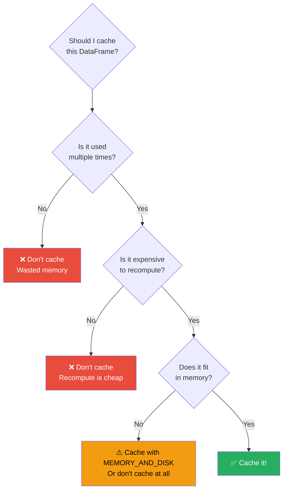

### Storage Levels

| Level | Memory | Disk | Serialized? | Replicated? | Best For |
|---|---|---|---|---|---|
| `MEMORY_ONLY` | ✅ | ❌ | ❌ (objects) | ❌ | Small-medium DataFrames |
| `MEMORY_AND_DISK` | ✅ | ✅ (overflow) | ❌ | ❌ | Medium DataFrames |
| `MEMORY_ONLY_SER` | ✅ | ❌ | ✅ (compact) | ❌ | When memory is tight |
| `MEMORY_AND_DISK_SER` | ✅ | ✅ | ✅ | ❌ | Large DataFrames |
| `DISK_ONLY` | ❌ | ✅ | ✅ | ❌ | Very large DataFrames |
| `*_2` variants | ✅ | varies | varies | ✅ (2 copies) | Critical data |

```python
from pyspark import StorageLevel

# Default cache (MEMORY_AND_DISK for DataFrames)
df.cache()

# Explicit storage level
df.persist(StorageLevel.MEMORY_AND_DISK_SER)

# IMPORTANT: Cache is lazy — data isn't cached until an action triggers it!
df.cache()
df.count()  # THIS triggers the actual caching

# Check cache in Spark UI → Storage tab
# Or programmatically:
print(spark.catalog.isCached("my_table"))

# Release cache when done
df.unpersist()
```

### Caching Best Practices

```python
# ✅ Good: Cache after expensive transformations, before multiple uses
expensive_df = (
    raw_df
    .join(broadcast(dims), "dim_key")
    .filter(col("date") >= "2024-01-01")
    .groupBy("category")
    .agg(sum("amount").alias("total"))
)
expensive_df.cache()
expensive_df.count()  # Trigger caching

# Now use it multiple times without recomputing
report_1 = expensive_df.filter(col("total") > 1000)
report_2 = expensive_df.orderBy(col("total").desc()).limit(100)
chart_data = expensive_df.select("category", "total")

# ❌ Bad: Caching the raw data (just reads it into memory, no computation saved)
raw_df = spark.read.parquet("s3://data/events/")
raw_df.cache()  # Wastes memory! Parquet is already fast to read.

# ❌ Bad: Caching a DataFrame used only once
temp = df.filter(col("active") == True)
temp.cache()  # Waste! Only used once below
result = temp.groupBy("category").count()
```

### When to Unpersist

```python
# Always unpersist when you're done
expensive_df.cache()

# Use it...
report_1 = expensive_df.filter(...)
report_2 = expensive_df.orderBy(...)

# Done with it — free the memory!
expensive_df.unpersist()

# Or use a context manager pattern
from contextlib import contextmanager

@contextmanager
def cached(df):
    """Cache a DataFrame and unpersist when done."""
    df.cache()
    df.count()  # Trigger caching
    try:
        yield df
    finally:
        df.unpersist()

with cached(expensive_df) as df:
    report_1 = df.filter(...)
    report_2 = df.orderBy(...)
# Automatically unpersisted here
```

---

## Adaptive Query Execution (AQE)

AQE is Spark's ability to **re-optimize the query plan at runtime** based on actual data statistics from completed stages.

### What AQE Does

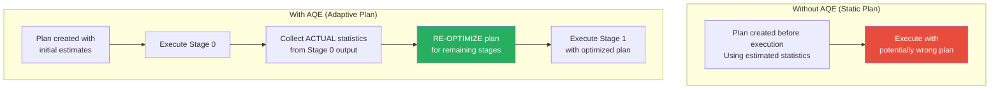

### AQE Features

#### 1. Coalescing Post-Shuffle Partitions

```python
# Without AQE: 200 shuffle partitions (many might be tiny)
# With AQE: Spark merges small partitions automatically

spark.conf.set("spark.sql.adaptive.enabled", "true")
spark.conf.set("spark.sql.adaptive.coalescePartitions.enabled", "true")
spark.conf.set("spark.sql.adaptive.coalescePartitions.minPartitionSize", "64MB")
spark.conf.set("spark.sql.adaptive.advisoryPartitionSizeInBytes", "128MB")

# Example: 200 shuffle partitions → AQE merges to 15 (based on actual data size)
```

#### 2. Converting Sort Merge Join to Broadcast Join

```python
# Plan created BEFORE knowing actual sizes:
# Table A estimated at 500MB → Sort Merge Join
# After Stage 0 runs, Table A is actually only 8MB → Convert to Broadcast!

spark.conf.set("spark.sql.adaptive.enabled", "true")
spark.conf.set("spark.sql.adaptive.localShuffleReader.enabled", "true")
```

#### 3. Skew Join Optimization

```python
# AQE detects skewed partitions and splits them automatically
spark.conf.set("spark.sql.adaptive.enabled", "true")
spark.conf.set("spark.sql.adaptive.skewJoin.enabled", "true")
spark.conf.set("spark.sql.adaptive.skewJoin.skewedPartitionFactor", "5")  # 5x median = skewed
spark.conf.set("spark.sql.adaptive.skewJoin.skewedPartitionThresholdInBytes", "256MB")

# Before AQE: One partition has 10GB, others have 100MB → stage takes 10x longer
# With AQE: Skewed partition split into ~80 sub-partitions of ~128MB each
```

### Complete AQE Configuration

```python
# Enable AQE (default: true since Spark 3.2)
spark.conf.set("spark.sql.adaptive.enabled", "true")

# Auto-coalesce partitions
spark.conf.set("spark.sql.adaptive.coalescePartitions.enabled", "true")
spark.conf.set("spark.sql.adaptive.coalescePartitions.initialPartitionNum", "200")
spark.conf.set("spark.sql.adaptive.advisoryPartitionSizeInBytes", "128MB")

# Skew join handling
spark.conf.set("spark.sql.adaptive.skewJoin.enabled", "true")
spark.conf.set("spark.sql.adaptive.skewJoin.skewedPartitionFactor", "5")
spark.conf.set("spark.sql.adaptive.skewJoin.skewedPartitionThresholdInBytes", "256MB")

# Convert to broadcast when runtime size is small
spark.conf.set("spark.sql.adaptive.localShuffleReader.enabled", "true")
```

> **💡 Key Insight:** AQE is essentially Spark saying: "I made a plan, but now that I've seen the actual data, let me adjust." It's one of the single biggest performance improvements in modern Spark — enable it!

---

## Predicate Pushdown and Column Pruning

### Predicate Pushdown

Push filters down to the data source so less data is read:

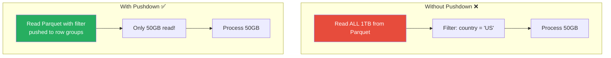

```python
# ✅ Predicate pushdown happens automatically for supported sources
df = spark.read.parquet("s3://data/events/")
filtered = df.filter(col("country") == "US")
# Spark pushes the filter to Parquet — only reads row groups where country might be 'US'

# Verify pushdown is working
filtered.explain()
# Look for: PushedFilters: [EqualTo(country,US)]

# ❌ These prevent predicate pushdown:
df.filter(udf_function(col("country")) == "US")     # UDFs are opaque
df.filter(col("country").isin(too_many_values))      # Very long IN lists
```

### Column Pruning

Only read the columns you need:

```python
# ✅ Column pruning — only reads 3 columns from 50-column Parquet file
df = spark.read.parquet("s3://data/wide_table/")
result = df.select("user_id", "event_type", "amount")
# Only 3/50 columns read from disk — 94% less I/O!

# ❌ This defeats column pruning:
df.select("*")                      # Reads all columns
df.withColumn("new", udf_func(*))   # UDF might need all columns
```

### Combining Both

```python
# Best practice: Filter AND select early
result = (
    spark.read.parquet("s3://data/events/")
    .filter(col("date") == "2024-01-15")     # Predicate pushdown
    .select("user_id", "event_type", "amount")  # Column pruning
    .groupBy("event_type")
    .agg(sum("amount").alias("total"))
)
# Spark reads only 3 columns, only for date=2024-01-15 row groups
```

---

## Dynamic Partition Pruning

### The Problem

When joining a large fact table with a filtered dimension table, Spark normally reads the entire fact table:

```python
# Without Dynamic Partition Pruning:
# Spark reads ALL partitions of the fact table, then joins and filters
sales = spark.read.parquet("s3://data/sales/")        # 10TB, partitioned by store_id
stores = spark.read.parquet("s3://data/stores/")       # 10MB

result = sales.join(stores, "store_id").filter(col("region") == "west")
# Without DPP: Reads all 10TB of sales, joins, then filters
```

### The Solution: Dynamic Partition Pruning (DPP)

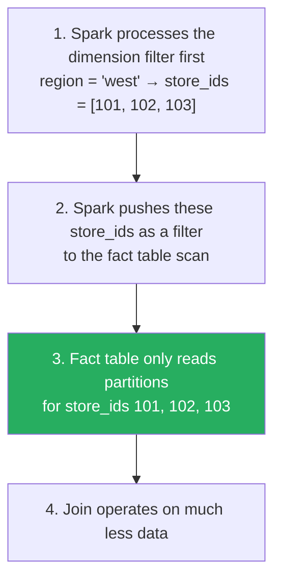

```python
# Enable DPP (default: true since Spark 3.0)
spark.conf.set("spark.sql.optimizer.dynamicPartitionPruning.enabled", "true")
spark.conf.set("spark.sql.optimizer.dynamicPartitionPruning.useStats", "true")
spark.conf.set("spark.sql.optimizer.dynamicPartitionPruning.fallbackFilterRatio", "0.5")

# For DPP to work, the fact table should be partitioned by the join key
sales = spark.read.parquet("s3://data/sales/")  # Partitioned by store_id
stores = spark.read.parquet("s3://data/stores/")

# DPP automatically filters sales to only read west region stores
result = sales.join(stores, "store_id").filter(col("region") == "west")
# Only reads ~5% of the sales data!
```

---

## Data Skew Mitigation

### Detecting Data Skew

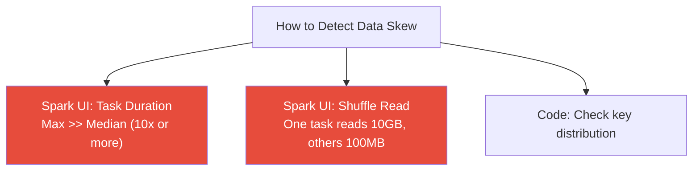

```python
# Detect skewed keys
key_distribution = df.groupBy("join_key").count().orderBy(col("count").desc())
key_distribution.show(20)

# Output might show:
# +----------+--------+
# | join_key | count  |
# +----------+--------+
# | null     | 5000000|  ← Skewed! Nulls dominate
# | key_A    | 2000000|  ← Skewed!
# | key_B    | 1500   |
# | key_C    | 1200   |
# ...

# Check skew ratio
stats = key_distribution.agg(
    avg("count").alias("avg"),
    max("count").alias("max"),
    expr("percentile(count, 0.5)").alias("median")
).collect()[0]
print(f"Max/Median ratio: {stats['max'] / stats['median']:.1f}x")
# If this is > 10x, you have significant skew
```

### Fix 1: Salting (Key Explosion)

```python
import random

# The idea: add a random "salt" to skewed keys to distribute them
SALT_BUCKETS = 20

# Salt the skewed side
salted_left = left_df.withColumn(
    "salt", (rand() * SALT_BUCKETS).cast("int")
).withColumn(
    "salted_key", concat(col("join_key"), lit("_"), col("salt"))
)

# Explode the other side to match all salt values
from pyspark.sql.functions import explode, array, lit

salted_right = right_df.crossJoin(
    spark.range(SALT_BUCKETS).withColumnRenamed("id", "salt")
).withColumn(
    "salted_key", concat(col("join_key"), lit("_"), col("salt"))
)

# Join on the salted key
result = salted_left.join(salted_right, "salted_key")
# The skewed key is now split across 20 partitions!
```

### Fix 2: Split Skewed and Non-Skewed

```python
# Identify skewed keys
skewed_keys = df.groupBy("key").count().filter(col("count") > 100000).select("key")
skewed_keys_list = [row.key for row in skewed_keys.collect()]

# Process skewed and non-skewed separately
skewed_left = left_df.filter(col("key").isin(skewed_keys_list))
normal_left = left_df.filter(~col("key").isin(skewed_keys_list))

# Broadcast join for skewed keys (filter right side to only skewed keys)
skewed_right = broadcast(right_df.filter(col("key").isin(skewed_keys_list)))
skewed_result = skewed_left.join(skewed_right, "key")

# Sort-merge join for normal keys
normal_result = normal_left.join(right_df, "key")

# Union results
result = skewed_result.union(normal_result)
```

### Fix 3: AQE Skew Join (Easiest!)

```python
# Just enable AQE — it handles skew automatically!
spark.conf.set("spark.sql.adaptive.enabled", "true")
spark.conf.set("spark.sql.adaptive.skewJoin.enabled", "true")
spark.conf.set("spark.sql.adaptive.skewJoin.skewedPartitionFactor", "5")
spark.conf.set("spark.sql.adaptive.skewJoin.skewedPartitionThresholdInBytes", "256MB")

# AQE will automatically:
# 1. Detect skewed partitions after shuffle
# 2. Split them into smaller sub-partitions
# 3. Join sub-partitions with replicated data from the other side
```

### Fix 4: Handle Null Keys

```python
# Null keys are a common source of skew — they all hash to the same partition!

# Option 1: Filter nulls before join
non_null = df.filter(col("key").isNotNull())
null_rows = df.filter(col("key").isNull())
result = non_null.join(other_df, "key").union(null_rows)

# Option 2: Replace nulls with random keys (if appropriate)
df_fixed = df.withColumn(
    "key",
    when(col("key").isNull(), concat(lit("NULL_"), (rand() * 100).cast("int")))
    .otherwise(col("key"))
)
```

---

## Small File Problem

### The Problem

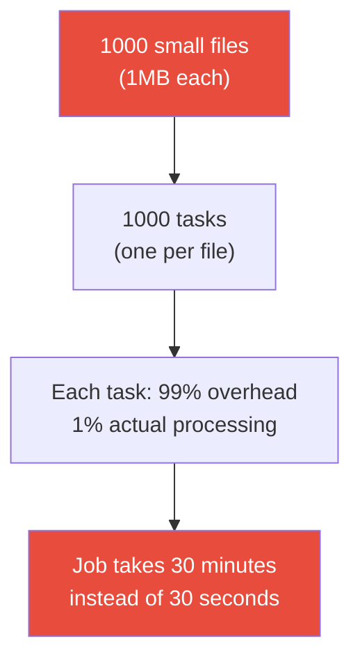

### The Fix

```python
# Merge small files on read
spark.conf.set("spark.sql.files.maxPartitionBytes", "128MB")  # Merge small files
spark.conf.set("spark.sql.files.openCostInBytes", "4MB")      # Cost of opening a file

# Compact small files when writing
df.coalesce(10).write.parquet("s3://output/")  # 10 files instead of 10,000

# Better: Repartition by key to get well-sized files
df.repartition(100, "date") \
  .write.partitionBy("date") \
  .parquet("s3://output/events/")

# Production pattern: Periodic compaction job
small_files = spark.read.parquet("s3://data/events/dt=2024-01-15/")
small_files.coalesce(10).write.mode("overwrite").parquet("s3://data/events/dt=2024-01-15/")
```

---

## Spark Configuration Tuning

### Executor Sizing

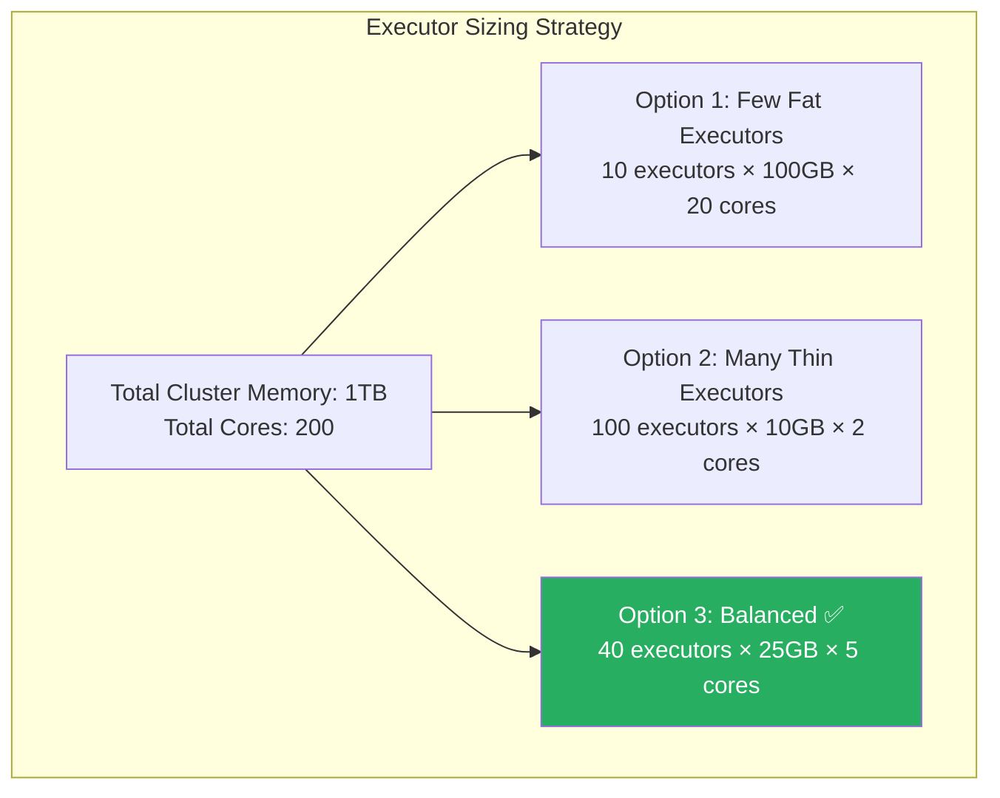

### The 5-Core Rule

```python
# ✅ Recommended: 5 cores per executor
# Why? >5 cores causes HDFS write throughput issues
# and leads to excessive GC with large heaps

# For a node with 16 cores and 64GB RAM:
# Leave 1 core for OS/Hadoop daemons
# Leave ~7% memory for overhead
# 
# Executors per node: (16 - 1) / 5 = 3 executors
# Memory per executor: (64 - 1) / 3 = 21GB → set to 19GB (leave overhead)

# spark-submit configuration
# --executor-cores 5
# --executor-memory 19g
# --num-executors 3 (per node)
```

### Memory Configuration

```python
# Executor memory breakdown
spark.conf.set("spark.executor.memory", "19g")          # JVM heap
spark.conf.set("spark.executor.memoryOverhead", "3g")    # Off-heap (default: max(384MB, 10%))
spark.conf.set("spark.memory.fraction", "0.6")           # Unified memory pool (default: 0.6)
spark.conf.set("spark.memory.storageFraction", "0.5")    # Cache vs execution split (default: 0.5)

# Total executor memory = spark.executor.memory + spark.executor.memoryOverhead
# = 19g + 3g = 22g per executor
```

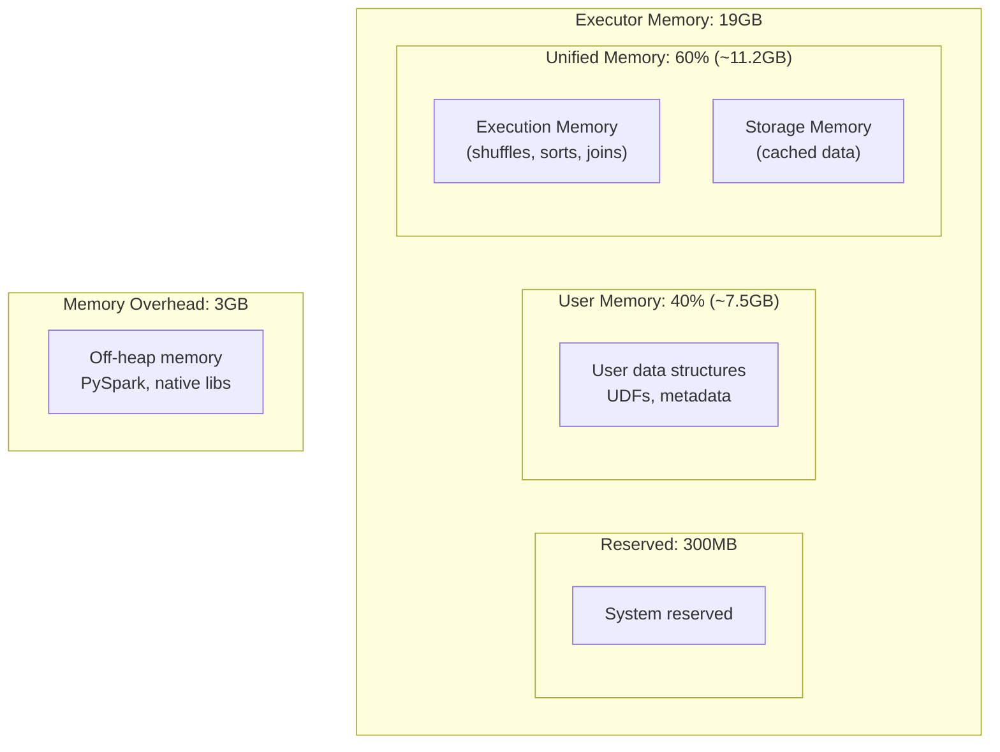

### Key Configuration Parameters

```python
# === Parallelism ===
spark.conf.set("spark.sql.shuffle.partitions", "200")         # Partitions after shuffle
spark.conf.set("spark.default.parallelism", "200")            # RDD parallelism
spark.conf.set("spark.sql.files.maxPartitionBytes", "128MB")  # Max input partition size

# === Shuffles ===
spark.conf.set("spark.sql.autoBroadcastJoinThreshold", "10MB") # Auto-broadcast threshold
spark.conf.set("spark.shuffle.compress", "true")               # Compress shuffle data
spark.conf.set("spark.shuffle.spill.compress", "true")         # Compress spill data

# === Compression ===
spark.conf.set("spark.io.compression.codec", "lz4")           # General compression
spark.conf.set("spark.sql.parquet.compression.codec", "snappy") # Parquet compression

# === Network ===
spark.conf.set("spark.network.timeout", "300s")                # Network timeout
spark.conf.set("spark.shuffle.io.maxRetries", "5")             # Shuffle retry count
spark.conf.set("spark.shuffle.io.retryWait", "10s")            # Wait between retries

# === GC ===
spark.conf.set("spark.executor.extraJavaOptions", "-XX:+UseG1GC -XX:G1HeapRegionSize=16m")
```

---

## Driver vs Executor Resource Allocation

### Driver Sizing

```python
# Driver needs more memory for:
# - Collecting results (collect(), take())
# - Broadcasting large tables
# - Accumulator values
# - Managing job metadata

# Small jobs (< 100 executors):
# --driver-memory 4g --driver-cores 2

# Medium jobs (100-500 executors):
# --driver-memory 8g --driver-cores 4

# Large jobs (500+ executors):
# --driver-memory 16g --driver-cores 4

# ⚠️ Common mistake: driver memory too small for collect()
spark.conf.set("spark.driver.maxResultSize", "2g")  # Max result size from collect()
```

---

## Dynamic Allocation

```python
# Dynamic allocation adds/removes executors based on workload
spark.conf.set("spark.dynamicAllocation.enabled", "true")
spark.conf.set("spark.dynamicAllocation.minExecutors", "5")      # Always keep at least 5
spark.conf.set("spark.dynamicAllocation.maxExecutors", "100")     # Never exceed 100
spark.conf.set("spark.dynamicAllocation.initialExecutors", "10")  # Start with 10

# Scale up when tasks are pending
spark.conf.set("spark.dynamicAllocation.schedulerBacklogTimeout", "5s")

# Scale down when executors are idle
spark.conf.set("spark.dynamicAllocation.executorIdleTimeout", "60s")
spark.conf.set("spark.dynamicAllocation.cachedExecutorIdleTimeout", "300s")

# Required: External shuffle service (so shuffle data survives executor removal)
spark.conf.set("spark.shuffle.service.enabled", "true")
```

---

## Monitoring and Profiling

### Spark UI Deep Dive

```python
# Key metrics to monitor in Spark UI

# 1. Stages Tab — Task Duration Distribution
# If max >> median → data skew
# If all tasks slow → need more resources or reduce data per task

# 2. SQL Tab — Physical Plan with Metrics
# Check: number of rows at each operator
# Check: time spent at each operator
# Check: data sizes at each Exchange (shuffle)

# 3. Executors Tab
# Check: GC time (should be < 10% of total)
# Check: shuffle read/write balance
# Check: active tasks per executor

# 4. Storage Tab
# Check: fraction cached (100%?)
# Check: memory usage vs available
```

### Spark Event Logs

```python
# Enable event logging for Spark History Server
spark.conf.set("spark.eventLog.enabled", "true")
spark.conf.set("spark.eventLog.dir", "s3://spark-logs/event-logs/")
spark.conf.set("spark.eventLog.compress", "true")

# View logs in Spark History Server:
# http://history-server:18080
```

### spark-measure (Performance Metrics Library)

```python
# pip install sparkmeasure

from sparkmeasure import StageMetrics

stage_metrics = StageMetrics(spark)
stage_metrics.begin()

# Run your job
result = df.groupBy("key").count().collect()

stage_metrics.end()
stage_metrics.print_report()

# Output:
# Scheduling mode = FIFO
# Spark Context default  parallelism = 200
# 
# Aggregated Spark stage metrics:
# numStages => 3
# sum(numTasks) => 500
# elapsedTime => 45000 (45 s)
# sum(stageDuration) => 42000 (42 s)
# sum(executorRunTime) => 180000 (3 min)
# sum(executorCpuTime) => 150000 (2.5 min)
# sum(shuffleBytesWritten) => 2147483648 (2 GB)
# sum(shuffleRecordsWritten) => 50000000
```

---

## Performance Checklist

Use this checklist for every Spark job optimization:

### Before Writing Code
- [ ] Choose Parquet/ORC as data format (not CSV/JSON)
- [ ] Partition data by most common filter columns (date, region)
- [ ] Estimate data sizes to plan partition counts

### Writing Transformations
- [ ] Filter and select early (predicate pushdown + column pruning)
- [ ] Use broadcast joins for small tables (< 500MB)
- [ ] Avoid unnecessary shuffles (use coalesce instead of repartition when reducing)
- [ ] Avoid UDFs when built-in functions exist
- [ ] Don't use collect() on large DataFrames

### Configuration
- [ ] Set `spark.sql.shuffle.partitions` based on data size (or use AQE)
- [ ] Enable AQE (`spark.sql.adaptive.enabled = true`)
- [ ] Set executor memory and cores (5 cores, sized to fit data)
- [ ] Enable Kryo serialization (if using RDD API)

### After Running
- [ ] Check Spark UI for skew (max/median task ratio)
- [ ] Check for excessive shuffles (SQL tab)
- [ ] Check GC time (< 10% of total)
- [ ] Check for spill to disk (stages tab)
- [ ] Monitor stage duration — identify the bottleneck stage

### Production
- [ ] Enable event logging for History Server
- [ ] Set up monitoring (Prometheus/Grafana)
- [ ] Configure dynamic allocation
- [ ] Set appropriate retries and timeouts
- [ ] Test with production-scale data before deploying

---

## Production Scenarios

### Scenario 1: E-Commerce — 10x Speedup on Daily ETL

**Before (6 hours):**
```python
# Reading CSV files, joining with full shuffle, no optimization
orders = spark.read.csv("s3://data/orders/", header=True, inferSchema=True)
products = spark.read.csv("s3://data/products/", header=True, inferSchema=True)
result = orders.join(products, "product_id").groupBy("category", "date").agg(sum("amount"))
result.write.csv("s3://output/daily_sales/")
```

**After (35 minutes):**
```python
# Parquet, broadcast join, AQE, proper partitioning
spark.conf.set("spark.sql.adaptive.enabled", "true")

orders = spark.read.parquet("s3://data/orders/")           # Parquet: 10x faster reads
products = spark.read.parquet("s3://data/products/")

result = (
    orders
    .filter(col("date") == target_date)                     # Partition pruning
    .join(broadcast(products), "product_id")                # Broadcast: no shuffle!
    .groupBy("category")
    .agg(sum("amount").alias("total"))
)

result.write.mode("overwrite").parquet("s3://output/daily_sales/")  # Parquet output
```

### Scenario 2: Data Skew Fix Saving $50K/Month

**Problem:** Join on user_id where 0.1% of users generate 40% of events.

**Solution:** AQE skew join + salting for extreme cases:
```python
spark.conf.set("spark.sql.adaptive.enabled", "true")
spark.conf.set("spark.sql.adaptive.skewJoin.enabled", "true")

# For most skewed keys, AQE handles it automatically
# For extreme skew (single key with 1B+ rows), use manual salting
```

---

## Troubleshooting Guide

### Quick Diagnosis Flowchart

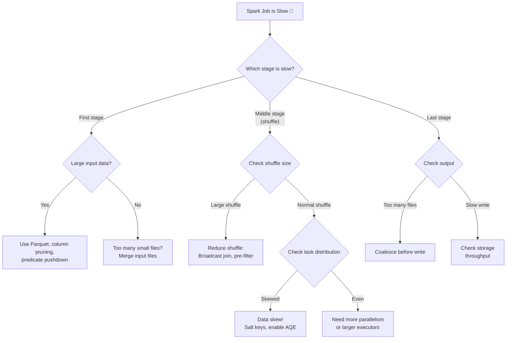

### Common Error Messages

| Error | Cause | Fix |
|---|---|---|
| `java.lang.OutOfMemoryError: Java heap space` | Executor OOM | Increase `spark.executor.memory` or reduce partition data size |
| `Container killed by YARN for exceeding memory limits` | Off-heap OOM | Increase `spark.executor.memoryOverhead` |
| `SparkException: Task not serializable` | Closure captures non-serializable object | Use `mapPartitions` or broadcast |
| `FetchFailedException` | Shuffle data unavailable | Enable external shuffle service, increase retries |
| `FileNotFoundException` during shuffle | Executor died, shuffle files lost | Enable external shuffle service |
| `Job aborted: ResultStage failed` | Stage exceeded max retries | Fix root cause (OOM, skew, etc.) |

---

## Common Mistakes

### Mistake 1: Using CSV Instead of Parquet

Impact: **10-100x** more I/O, no predicate pushdown, no column pruning.

### Mistake 2: Not Enabling AQE

```python
# Just add these 2 lines for major improvements
spark.conf.set("spark.sql.adaptive.enabled", "true")
spark.conf.set("spark.sql.adaptive.coalescePartitions.enabled", "true")
```

### Mistake 3: Using UDFs Instead of Built-in Functions

```python
# ❌ Python UDF — 10-100x slower (data serialized between JVM and Python)
from pyspark.sql.functions import udf
@udf("string")
def upper_udf(s):
    return s.upper() if s else None

df.withColumn("name_upper", upper_udf(col("name")))

# ✅ Built-in function — runs in JVM, optimized by Catalyst
df.withColumn("name_upper", upper(col("name")))
```

### Mistake 4: Over-Caching

```python
# ❌ Caching everything
raw.cache()        # Raw data — cheap to reread from Parquet
filtered.cache()   # Intermediate result
grouped.cache()    # Another intermediate
final.cache()      # Final result

# You've consumed 4x the memory for marginal benefit!

# ✅ Cache only the expensive, reused computation
expensive_join_result.cache()  # Expensive to recompute, used 3 times below
```

### Mistake 5: Ignoring Spark UI

The Spark UI tells you **exactly** what's wrong. Not checking it is like driving with your eyes closed.

---

## Interview Questions

### Beginner Level

**Q1: What data format should you use in Spark and why?**

**A:** Parquet is the recommended format because it's columnar (reads only needed columns), supports predicate pushdown (skips data that doesn't match filters), has excellent compression (5-10x over CSV), embeds schema information, and is natively optimized by Spark's Catalyst optimizer. It typically results in 10-100x better performance compared to CSV for analytical workloads.

**Q2: What is the difference between `repartition()` and `coalesce()`?**

**A:** `repartition(n)` does a full shuffle to create `n` evenly distributed partitions — use it when increasing partitions or need balanced distribution. `coalesce(n)` combines existing partitions without a shuffle — use it when decreasing partitions (e.g., before writing). `coalesce` is faster but can create uneven partitions since it just merges adjacent partitions.

---

### Intermediate Level

**Q3: Explain the different join strategies in Spark.**

**A:** Spark has four join strategies:
1. **Broadcast Hash Join:** The small table is broadcast to all executors and a hash table is built in memory. No shuffle needed. Used when one table is below the broadcast threshold (default 10MB).
2. **Sort Merge Join:** Both tables are shuffled by the join key, sorted, and then merged. Default for large-large equi-joins. Requires shuffle on both sides.
3. **Shuffle Hash Join:** Both tables are shuffled, then a hash table is built on one side. Used when one side is much smaller than the other but too large to broadcast.
4. **Broadcast Nested Loop Join:** Used for non-equi-joins or cross joins. One side is broadcast, and every row is compared with every other row. Very expensive.

**Q4: How would you diagnose and fix data skew in a Spark job?**

**A:** 
**Diagnosis:** Check Spark UI Stages tab — if the max task duration is 10x+ the median, or one task's shuffle read is 10x+ others, you have skew. Also check key distribution with `groupBy(key).count().orderBy(desc("count"))`.

**Fixes:**
1. **Enable AQE skew join** — handles most cases automatically
2. **Salt skewed keys** — add random suffix to distribute skewed keys across multiple partitions, replicate the other side to match
3. **Separate skewed keys** — process skewed keys with broadcast join, non-skewed with sort-merge join
4. **Handle nulls** — null keys all hash to the same partition; filter them out or replace with random values

**Q5: What is Adaptive Query Execution (AQE)?**

**A:** AQE is Spark's ability to re-optimize query plans at runtime based on actual data statistics collected from completed stages. It has three main features:
1. **Coalescing post-shuffle partitions:** Automatically merges small partitions into larger ones
2. **Converting joins:** Switches from Sort Merge Join to Broadcast Hash Join if runtime data is small enough
3. **Skew join optimization:** Detects and automatically splits skewed partitions

AQE is enabled by default since Spark 3.2 and is one of the most impactful performance features.

---

### Advanced Level

**Q6: You have a 10TB dataset with severe data skew on the join key. AQE is enabled but the job still takes 3 hours. Walk through your optimization approach.**

**A:**
1. **Verify AQE is actually active:** Check the SQL plan for `AdaptiveSparkPlan isFinalPlan=true`. If it shows `isFinalPlan=false`, AQE isn't adapting.
2. **Check the skew thresholds:** The default skew factor is 5x and threshold is 256MB. If the skew is extreme (one partition is 50GB), increase the threshold: `spark.sql.adaptive.skewJoin.skewedPartitionThresholdInBytes = 50GB`.
3. **Manual salting for extreme keys:** If a single key has billions of rows, AQE may split it into sub-partitions, but each sub-partition is still joined against the full other side. Manual salting with 50-100 buckets may be more efficient.
4. **Pre-filter and pre-aggregate:** Reduce data before the join. Can you filter out data that won't match? Can you pre-aggregate so there are fewer rows per key?
5. **Consider data model changes:** If this skew is persistent, restructure the data to avoid it — use a different join key, pre-join at write time, or denormalize.
6. **Resource adjustment:** For truly skewed partitions, ensure executors have enough memory (increase `spark.executor.memory` so large partitions don't spill to disk).

**Q7: Design the optimal Spark configuration for a cluster with 10 nodes, each having 64 cores and 512GB RAM, processing a 50TB daily ETL job.**

**A:**
- **Per node:** Reserve 1 core and 1GB for OS/daemons → 63 cores, 511GB available
- **Executors per node:** 63/5 = 12 executors per node (5 cores each, with 3 cores left for OS)
- **Memory per executor:** 511/12 ≈ 42GB → Set to 38GB (leave ~10% for overhead)
- **Memory overhead:** 4GB per executor
- **Total executors:** 12 × 10 = 120 executors
- **Shuffle partitions:** 50TB / 128MB ≈ 400,000 (use AQE to auto-tune)
- **Dynamic allocation:** Min 60, max 120, with external shuffle service
- **Data format:** Parquet with snappy compression
- **Enable:** AQE, predicate pushdown, dynamic partition pruning

---

**[← Previous: 12-spark-streaming.md](12-spark-streaming.md) | [Home](../README.md) | [Next →: 14-production-best-practices.md](14-production-best-practices.md)**
