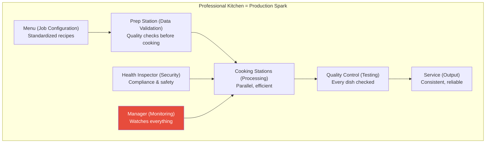
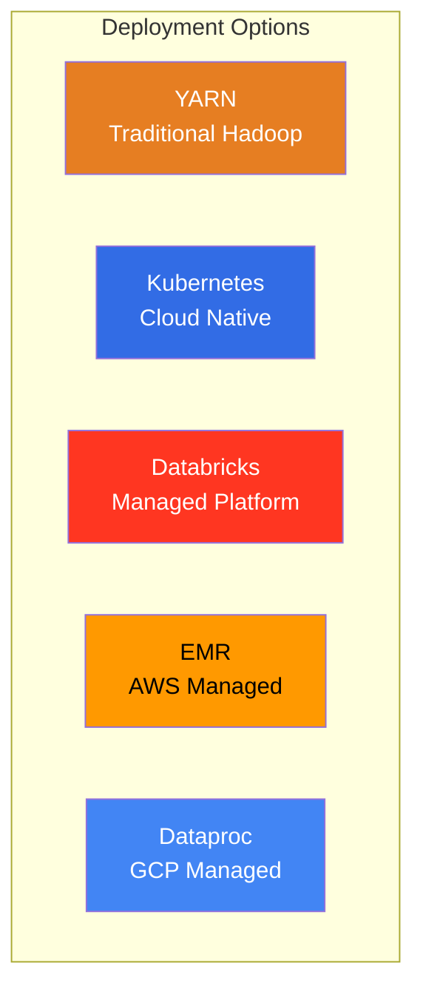
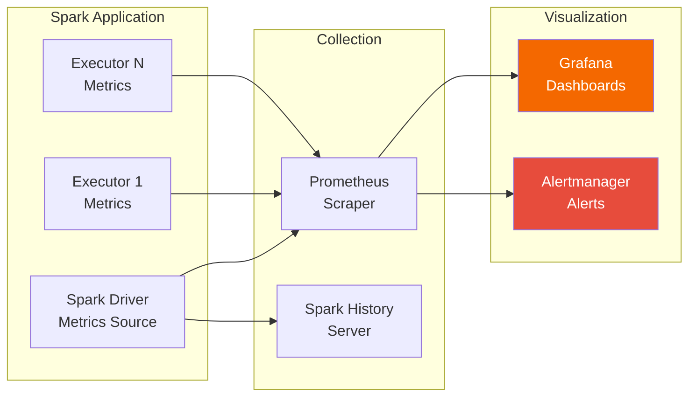
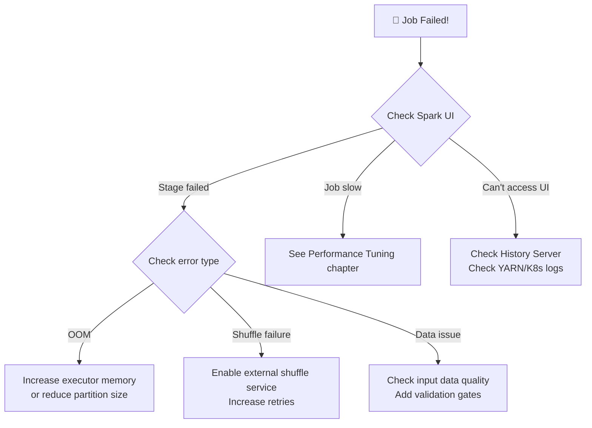

# 🏭 Chapter 14: Production Best Practices — Running Spark at Scale

> **"Writing a Spark job that works on your laptop is easy. Running it reliably in production processing terabytes daily — that's engineering."**

---

## 📋 Table of Contents

- [Intuition — Why Production is Different](#intuition--why-production-is-different)
- [Real-World Analogy — Restaurant Kitchen](#real-world-analogy--restaurant-kitchen)
- [Application Structure](#application-structure)
- [Dependency Management](#dependency-management)
- [Configuration Management](#configuration-management)
- [Logging Best Practices](#logging-best-practices)
- [Error Handling Patterns](#error-handling-patterns)
- [Data Quality Validation](#data-quality-validation)
- [Schema Evolution Strategy](#schema-evolution-strategy)
- [Testing Spark Applications](#testing-spark-applications)
- [CI/CD for Spark Jobs](#cicd-for-spark-jobs)
- [Deployment Platforms](#deployment-platforms)
- [Monitoring and Observability](#monitoring-and-observability)
- [Alerting on SLA Misses](#alerting-on-sla-misses)
- [Cost Optimization](#cost-optimization)
- [Security](#security)
- [Multi-Tenancy](#multi-tenancy)
- [Data Governance](#data-governance)
- [Production Deployment Checklist](#production-deployment-checklist)
- [Production Scenarios](#production-scenarios)
- [Troubleshooting Guide](#troubleshooting-guide)
- [Common Mistakes](#common-mistakes)
- [Interview Questions](#interview-questions)

---

## Intuition — Why Production is Different

| Development | Production |
|---|---|
| Small data (MBs) | Huge data (TBs) |
| Runs once, you watch it | Runs daily at 3 AM, nobody watching |
| Fails → you fix it immediately | Fails → pages on-call engineer at 3 AM |
| "It works!" is good enough | Must work 99.9% of the time |
| Cost doesn't matter | $50K/month compute bill |
| Only you use it | 50 other jobs depend on it |
| No security concerns | PII, HIPAA, SOC2 compliance |

> **💡 Key Insight:** Production Spark engineering is 30% writing transformations and 70% everything else — error handling, monitoring, testing, deployment, cost management, and operational excellence.

---

## Real-World Analogy — Restaurant Kitchen



| Restaurant Kitchen | Production Spark |
|---|---|
| Standardized recipes | Configuration management |
| Prep cook checks ingredients | Data quality validation |
| Head chef monitors all stations | Monitoring & alerting |
| Health inspector visits | Security audits |
| Cost tracking per dish | Cost optimization |
| Menu changes tested first | CI/CD pipeline |
| Multiple shifts, same quality | Scheduled jobs, consistent results |

---

## Application Structure

### Recommended Project Structure

```
my-spark-project/
├── pyproject.toml                  # Project metadata & dependencies
├── Makefile                        # Common commands
├── README.md
├── .github/
│   └── workflows/
│       ├── ci.yml                  # Lint, test on PR
│       └── deploy.yml              # Deploy on merge
│
├── src/
│   └── my_spark_project/
│       ├── __init__.py
│       ├── config/
│       │   ├── __init__.py
│       │   ├── settings.py         # Configuration loading
│       │   └── environments/
│       │       ├── dev.yaml
│       │       ├── staging.yaml
│       │       └── prod.yaml
│       │
│       ├── jobs/                    # One module per job
│       │   ├── __init__.py
│       │   ├── daily_etl.py
│       │   ├── hourly_aggregation.py
│       │   └── streaming_events.py
│       │
│       ├── transformations/         # Reusable transformations
│       │   ├── __init__.py
│       │   ├── cleansing.py
│       │   ├── enrichment.py
│       │   └── aggregations.py
│       │
│       ├── io/                      # Data I/O
│       │   ├── __init__.py
│       │   ├── readers.py
│       │   └── writers.py
│       │
│       ├── quality/                 # Data quality
│       │   ├── __init__.py
│       │   ├── validators.py
│       │   └── expectations.py
│       │
│       └── utils/                   # Utilities
│           ├── __init__.py
│           ├── logging_config.py
│           ├── spark_session.py
│           └── metrics.py
│
├── tests/
│   ├── conftest.py                 # Shared fixtures (SparkSession)
│   ├── unit/
│   │   ├── test_transformations.py
│   │   └── test_validators.py
│   ├── integration/
│   │   ├── test_daily_etl.py
│   │   └── test_readers.py
│   └── fixtures/
│       ├── sample_events.parquet
│       └── sample_users.csv
│
├── scripts/
│   ├── submit_job.sh              # spark-submit wrapper
│   └── compact_files.py           # Maintenance scripts
│
└── docker/
    ├── Dockerfile                  # For testing and CI
    └── docker-compose.yml          # Local development stack
```

### Production Job Template

```python
"""
daily_etl.py — Production ETL job template.

Usage:
    spark-submit --master yarn \
        --deploy-mode cluster \
        --conf spark.app.name=daily-etl \
        src/my_spark_project/jobs/daily_etl.py \
        --date 2024-01-15 \
        --env prod
"""
import argparse
import sys
import logging
from datetime import datetime

from pyspark.sql import SparkSession
from pyspark.sql.functions import col, sum as _sum, count, current_timestamp

logger = logging.getLogger(__name__)


def parse_args():
    """Parse command-line arguments."""
    parser = argparse.ArgumentParser(description="Daily ETL Job")
    parser.add_argument("--date", required=True, help="Processing date (YYYY-MM-DD)")
    parser.add_argument("--env", default="dev", choices=["dev", "staging", "prod"])
    parser.add_argument("--dry-run", action="store_true", help="Run without writing output")
    return parser.parse_args()


def create_spark_session(app_name: str, env: str) -> SparkSession:
    """Create a configured SparkSession."""
    builder = SparkSession.builder.appName(app_name)
    
    # Common configs
    builder = builder \
        .config("spark.sql.adaptive.enabled", "true") \
        .config("spark.sql.adaptive.coalescePartitions.enabled", "true") \
        .config("spark.sql.adaptive.skewJoin.enabled", "true") \
        .config("spark.sql.parquet.filterPushdown", "true")
    
    # Environment-specific configs
    if env == "prod":
        builder = builder \
            .config("spark.sql.shuffle.partitions", "auto") \
            .config("spark.dynamicAllocation.enabled", "true")
    elif env == "dev":
        builder = builder \
            .config("spark.sql.shuffle.partitions", "10") \
            .config("spark.master", "local[4]")
    
    return builder.getOrCreate()


def extract(spark: SparkSession, date: str, env: str):
    """Read input data."""
    base_path = f"s3://data-{env}/events/"
    logger.info(f"Reading data from {base_path} for date {date}")
    
    df = spark.read.parquet(base_path).filter(col("date") == date)
    
    row_count = df.count()
    logger.info(f"Read {row_count:,} rows for date {date}")
    
    if row_count == 0:
        raise ValueError(f"No data found for date {date}. Aborting!")
    
    return df


def transform(df):
    """Apply business transformations."""
    result = (
        df
        .filter(col("status") == "completed")
        .groupBy("category", "region")
        .agg(
            count("*").alias("order_count"),
            _sum("amount").alias("total_revenue"),
        )
        .withColumn("processed_at", current_timestamp())
    )
    return result


def validate(df, date: str):
    """Validate output data quality."""
    row_count = df.count()
    
    # Check 1: Non-empty result
    if row_count == 0:
        raise ValueError(f"Transformation produced 0 rows for {date}")
    
    # Check 2: No nulls in critical columns
    null_count = df.filter(col("total_revenue").isNull()).count()
    if null_count > 0:
        raise ValueError(f"Found {null_count} null values in total_revenue")
    
    # Check 3: Reasonable ranges
    negative_revenue = df.filter(col("total_revenue") < 0).count()
    if negative_revenue > 0:
        logger.warning(f"Found {negative_revenue} rows with negative revenue")
    
    logger.info(f"Validation passed: {row_count:,} rows, 0 nulls")
    return True


def load(df, date: str, env: str, dry_run: bool):
    """Write output data."""
    output_path = f"s3://output-{env}/daily_summary/date={date}/"
    
    if dry_run:
        logger.info(f"DRY RUN: Would write {df.count()} rows to {output_path}")
        df.show(20)
        return
    
    logger.info(f"Writing to {output_path}")
    df.coalesce(10).write.mode("overwrite").parquet(output_path)
    logger.info("Write complete")


def main():
    """Main entry point."""
    args = parse_args()
    start_time = datetime.now()
    
    logger.info(f"Starting Daily ETL for date={args.date}, env={args.env}")
    
    spark = create_spark_session("daily-etl", args.env)
    
    try:
        # ETL Pipeline
        raw_df = extract(spark, args.date, args.env)
        transformed_df = transform(raw_df)
        validate(transformed_df, args.date)
        load(transformed_df, args.date, args.env, args.dry_run)
        
        duration = (datetime.now() - start_time).total_seconds()
        logger.info(f"Job completed successfully in {duration:.1f} seconds")
        
    except Exception as e:
        duration = (datetime.now() - start_time).total_seconds()
        logger.error(f"Job FAILED after {duration:.1f} seconds: {str(e)}")
        raise
    
    finally:
        spark.stop()


if __name__ == "__main__":
    main()
```

---

## Dependency Management

### Fat JAR (Uber JAR) Approach

```python
# pyproject.toml for Python/PySpark
[project]
name = "my-spark-project"
version = "1.0.0"
requires-python = ">=3.10"
dependencies = [
    "pyspark>=3.4,<4.0",
    "pyarrow>=12.0",
    "pydantic>=2.0",
    "pyyaml>=6.0",
]

[project.optional-dependencies]
dev = [
    "pytest>=7.0",
    "pytest-cov>=4.0",
    "chispa>=0.9",        # DataFrame assertions for testing
    "ruff>=0.1",          # Linting
    "mypy>=1.0",          # Type checking
]
```

### Managing Dependencies in Cluster Mode

```bash
# Option 1: Package as a zip/egg
cd my-spark-project
zip -r my_project.zip src/my_spark_project/

spark-submit \
    --master yarn \
    --deploy-mode cluster \
    --py-files my_project.zip \
    src/my_spark_project/jobs/daily_etl.py

# Option 2: Use conda-pack for complex dependencies
conda create -n spark-env python=3.10 pandas pyarrow
conda activate spark-env
pip install my-spark-project
conda pack -o spark-env.tar.gz

spark-submit \
    --master yarn \
    --deploy-mode cluster \
    --archives spark-env.tar.gz#environment \
    --conf spark.pyspark.python=environment/bin/python \
    daily_etl.py

# Option 3: Use pip install in the job (simple but slow)
spark-submit \
    --master yarn \
    --deploy-mode cluster \
    --conf spark.pyspark.driver.python=python3 \
    --conf spark.pyspark.python=python3 \
    --packages org.apache.spark:spark-sql-kafka-0-10_2.12:3.4.0 \
    daily_etl.py
```

---

## Configuration Management

### Environment-Aware Configuration

```python
# config/settings.py
import yaml
from pathlib import Path
from dataclasses import dataclass
from typing import Optional


@dataclass
class SparkConfig:
    """Spark configuration for a specific environment."""
    app_name: str
    master: str
    executor_memory: str
    executor_cores: int
    num_executors: int
    shuffle_partitions: int
    dynamic_allocation: bool
    
    # Data paths
    input_base_path: str
    output_base_path: str
    checkpoint_path: str
    
    # Features
    enable_aqe: bool = True
    broadcast_threshold_mb: int = 100
    
    @classmethod
    def from_yaml(cls, env: str) -> "SparkConfig":
        """Load configuration from YAML file."""
        config_path = Path(__file__).parent / "environments" / f"{env}.yaml"
        with open(config_path) as f:
            config = yaml.safe_load(f)
        return cls(**config)
```

```yaml
# config/environments/prod.yaml
app_name: "daily-etl"
master: "yarn"
executor_memory: "16g"
executor_cores: 5
num_executors: 40
shuffle_partitions: 2000
dynamic_allocation: true
input_base_path: "s3://prod-data"
output_base_path: "s3://prod-output"
checkpoint_path: "s3://prod-checkpoints"
enable_aqe: true
broadcast_threshold_mb: 500
```

```yaml
# config/environments/dev.yaml
app_name: "daily-etl-dev"
master: "local[4]"
executor_memory: "4g"
executor_cores: 2
num_executors: 1
shuffle_partitions: 10
dynamic_allocation: false
input_base_path: "/data/dev"
output_base_path: "/output/dev"
checkpoint_path: "/checkpoints/dev"
enable_aqe: true
broadcast_threshold_mb: 10
```

---

## Logging Best Practices

### Structured Logging

```python
# utils/logging_config.py
import logging
import json
import sys
from datetime import datetime


class StructuredFormatter(logging.Formatter):
    """JSON structured logging for production."""
    
    def format(self, record):
        log_data = {
            "timestamp": datetime.utcnow().isoformat(),
            "level": record.levelname,
            "logger": record.name,
            "message": record.getMessage(),
            "module": record.module,
            "function": record.funcName,
            "line": record.lineno,
        }
        
        # Add extra fields if present
        if hasattr(record, "job_name"):
            log_data["job_name"] = record.job_name
        if hasattr(record, "processing_date"):
            log_data["processing_date"] = record.processing_date
        if hasattr(record, "row_count"):
            log_data["row_count"] = record.row_count
            
        return json.dumps(log_data)


def setup_logging(env: str = "dev"):
    """Configure logging based on environment."""
    root_logger = logging.getLogger()
    root_logger.setLevel(logging.INFO)
    
    handler = logging.StreamHandler(sys.stdout)
    
    if env == "prod":
        handler.setFormatter(StructuredFormatter())
    else:
        handler.setFormatter(logging.Formatter(
            "%(asctime)s | %(levelname)-8s | %(name)s | %(message)s"
        ))
    
    root_logger.addHandler(handler)
    
    # Reduce Spark's internal logging noise
    logging.getLogger("py4j").setLevel(logging.WARNING)
    logging.getLogger("pyspark").setLevel(logging.WARNING)
```

### What to Log

```python
# ✅ DO log:
logger.info(f"Starting ETL for date={date}")
logger.info(f"Read {count:,} rows from {path}")
logger.info(f"After filtering: {filtered_count:,} rows ({pct_kept:.1f}% kept)")
logger.info(f"Wrote {output_count:,} rows to {output_path}")
logger.info(f"Job completed in {duration:.1f}s")

# ✅ DO log metrics
logger.info("Partition statistics", extra={
    "row_count": 1500000,
    "partition_count": 200,
    "avg_partition_size_mb": 75
})

# ❌ DON'T log:
logger.info(f"Processing row: {row}")           # Too verbose — billions of logs!
logger.info(f"DataFrame schema: {df.schema}")    # Log once at start, not per batch
logger.debug(f"Spark config: {spark.sparkContext.getConf().getAll()}")  # Use INFO level
```

---

## Error Handling Patterns

### Graceful Failure Pattern

```python
from enum import Enum
from dataclasses import dataclass
from typing import Optional


class JobStatus(Enum):
    SUCCESS = "success"
    PARTIAL_SUCCESS = "partial_success"
    FAILURE = "failure"


@dataclass
class JobResult:
    status: JobStatus
    rows_processed: int
    rows_failed: int
    duration_seconds: float
    error_message: Optional[str] = None


def run_job_with_error_handling(spark, date, env) -> JobResult:
    """Run job with comprehensive error handling."""
    start_time = datetime.now()
    
    try:
        # Phase 1: Extract
        try:
            df = extract(spark, date, env)
        except FileNotFoundError:
            logger.error(f"Input data not found for {date}")
            return JobResult(
                status=JobStatus.FAILURE,
                rows_processed=0,
                rows_failed=0,
                duration_seconds=(datetime.now() - start_time).total_seconds(),
                error_message=f"Input data not found for {date}"
            )
        
        # Phase 2: Transform with error isolation
        try:
            result = transform(df)
        except Exception as e:
            logger.error(f"Transformation failed: {e}")
            # Save raw data for debugging
            df.write.mode("overwrite").parquet(f"s3://debug/{date}/raw_snapshot/")
            raise
        
        # Phase 3: Validate
        validation_passed = validate(result, date)
        if not validation_passed:
            logger.warning("Validation failed but continuing with partial data")
        
        # Phase 4: Load
        load(result, date, env, dry_run=False)
        
        duration = (datetime.now() - start_time).total_seconds()
        return JobResult(
            status=JobStatus.SUCCESS if validation_passed else JobStatus.PARTIAL_SUCCESS,
            rows_processed=result.count(),
            rows_failed=0,
            duration_seconds=duration
        )
        
    except Exception as e:
        duration = (datetime.now() - start_time).total_seconds()
        logger.exception(f"Job failed: {e}")
        return JobResult(
            status=JobStatus.FAILURE,
            rows_processed=0,
            rows_failed=0,
            duration_seconds=duration,
            error_message=str(e)
        )
```

### Retry Pattern

```python
import time
from functools import wraps


def retry_on_failure(max_retries=3, backoff_seconds=30, retryable_exceptions=(Exception,)):
    """Decorator to retry operations on transient failures."""
    def decorator(func):
        @wraps(func)
        def wrapper(*args, **kwargs):
            last_exception = None
            for attempt in range(max_retries):
                try:
                    return func(*args, **kwargs)
                except retryable_exceptions as e:
                    last_exception = e
                    wait_time = backoff_seconds * (2 ** attempt)  # Exponential backoff
                    logger.warning(
                        f"Attempt {attempt + 1}/{max_retries} failed: {e}. "
                        f"Retrying in {wait_time}s..."
                    )
                    time.sleep(wait_time)
            raise last_exception
        return wrapper
    return decorator


@retry_on_failure(max_retries=3, backoff_seconds=30)
def read_from_s3(spark, path):
    """Read data with automatic retry on transient S3 failures."""
    return spark.read.parquet(path)
```

### Dead Letter Queue Pattern

```python
def transform_with_dead_letter(df):
    """Process records, routing bad records to a dead letter queue."""
    from pyspark.sql.functions import when, struct, to_json
    
    # Flag bad records
    df_flagged = df.withColumn(
        "is_valid",
        (col("amount") > 0) & 
        col("user_id").isNotNull() & 
        col("date").isNotNull()
    )
    
    # Good records → normal processing
    good_records = df_flagged.filter(col("is_valid"))
    
    # Bad records → dead letter queue
    bad_records = df_flagged.filter(~col("is_valid"))
    bad_count = bad_records.count()
    
    if bad_count > 0:
        logger.warning(f"Routing {bad_count:,} bad records to dead letter queue")
        bad_records.write.mode("append").parquet("s3://dead-letter/events/")
    
    return good_records
```

---

## Data Quality Validation

### Comprehensive Validation Framework

```python
# quality/validators.py
from dataclasses import dataclass
from typing import List, Callable, Optional
from pyspark.sql import DataFrame
from pyspark.sql.functions import col, count, min as _min, max as _max


@dataclass
class ValidationRule:
    name: str
    check: Callable[[DataFrame], bool]
    severity: str  # "error" (fail job) or "warning" (log and continue)
    description: str


@dataclass
class ValidationResult:
    rule_name: str
    passed: bool
    details: str
    severity: str


class DataValidator:
    """Validates DataFrame against a set of rules."""
    
    def __init__(self):
        self.rules: List[ValidationRule] = []
    
    def add_rule(self, rule: ValidationRule):
        self.rules.append(rule)
        return self
    
    def not_empty(self, severity="error"):
        """Check that DataFrame is not empty."""
        self.rules.append(ValidationRule(
            name="not_empty",
            check=lambda df: df.count() > 0,
            severity=severity,
            description="DataFrame must not be empty"
        ))
        return self
    
    def no_nulls(self, columns: List[str], severity="error"):
        """Check that specified columns have no null values."""
        def check(df):
            for column in columns:
                null_count = df.filter(col(column).isNull()).count()
                if null_count > 0:
                    return False
            return True
        
        self.rules.append(ValidationRule(
            name=f"no_nulls_{','.join(columns)}",
            check=check,
            severity=severity,
            description=f"Columns {columns} must not contain nulls"
        ))
        return self
    
    def row_count_range(self, min_rows: int, max_rows: int, severity="error"):
        """Check that row count is within expected range."""
        def check(df):
            count_val = df.count()
            return min_rows <= count_val <= max_rows
        
        self.rules.append(ValidationRule(
            name="row_count_range",
            check=check,
            severity=severity,
            description=f"Row count must be between {min_rows:,} and {max_rows:,}"
        ))
        return self
    
    def column_range(self, column: str, min_val, max_val, severity="error"):
        """Check that column values are within expected range."""
        def check(df):
            stats = df.agg(
                _min(col(column)).alias("min_val"),
                _max(col(column)).alias("max_val")
            ).collect()[0]
            return stats["min_val"] >= min_val and stats["max_val"] <= max_val
        
        self.rules.append(ValidationRule(
            name=f"column_range_{column}",
            check=check,
            severity=severity,
            description=f"Column {column} values must be between {min_val} and {max_val}"
        ))
        return self
    
    def validate(self, df: DataFrame) -> List[ValidationResult]:
        """Run all validation rules and return results."""
        results = []
        has_errors = False
        
        for rule in self.rules:
            try:
                passed = rule.check(df)
                result = ValidationResult(
                    rule_name=rule.name,
                    passed=passed,
                    details="Passed" if passed else f"FAILED: {rule.description}",
                    severity=rule.severity
                )
            except Exception as e:
                result = ValidationResult(
                    rule_name=rule.name,
                    passed=False,
                    details=f"ERROR during validation: {str(e)}",
                    severity=rule.severity
                )
            
            results.append(result)
            
            if not result.passed:
                if rule.severity == "error":
                    logger.error(f"Validation FAILED: {result.details}")
                    has_errors = True
                else:
                    logger.warning(f"Validation WARNING: {result.details}")
        
        if has_errors:
            raise ValueError("Data validation failed. See logs for details.")
        
        return results


# Usage
validator = DataValidator()
validator.not_empty()
validator.no_nulls(["user_id", "amount", "date"])
validator.row_count_range(100_000, 50_000_000)
validator.column_range("amount", 0, 1_000_000)

results = validator.validate(output_df)
```

---

## Schema Evolution Strategy

### Backward-Compatible Changes

```python
# ✅ Safe changes (backward compatible):
# - Adding a new nullable column
# - Widening a numeric type (int → long)

# Read with merged schema (handles added columns)
df = spark.read \
    .option("mergeSchema", "true") \
    .parquet("s3://data/events/")

# Or set globally
spark.conf.set("spark.sql.parquet.mergeSchema", "true")
```

### Schema Registry Pattern

```python
# Define expected schemas explicitly
from pyspark.sql.types import StructType, StructField, StringType, DoubleType, TimestampType

EVENTS_SCHEMA_V1 = StructType([
    StructField("event_id", StringType(), nullable=False),
    StructField("user_id", StringType(), nullable=False),
    StructField("event_type", StringType(), nullable=False),
    StructField("amount", DoubleType(), nullable=True),
    StructField("timestamp", TimestampType(), nullable=False),
])

EVENTS_SCHEMA_V2 = StructType([
    StructField("event_id", StringType(), nullable=False),
    StructField("user_id", StringType(), nullable=False),
    StructField("event_type", StringType(), nullable=False),
    StructField("amount", DoubleType(), nullable=True),
    StructField("timestamp", TimestampType(), nullable=False),
    StructField("session_id", StringType(), nullable=True),   # NEW in V2
    StructField("device_type", StringType(), nullable=True),  # NEW in V2
])

def read_events(spark, path, version=2):
    """Read events with the appropriate schema version."""
    schema = EVENTS_SCHEMA_V2 if version >= 2 else EVENTS_SCHEMA_V1
    return spark.read.schema(schema).parquet(path)
```

---

## Testing Spark Applications

### Unit Testing with Local SparkSession

```python
# tests/conftest.py
import pytest
from pyspark.sql import SparkSession


@pytest.fixture(scope="session")
def spark():
    """Create a local SparkSession for testing."""
    spark = (
        SparkSession.builder
        .master("local[2]")
        .appName("unit-tests")
        .config("spark.sql.shuffle.partitions", "4")  # Small for tests
        .config("spark.ui.enabled", "false")           # No UI needed
        .config("spark.sql.adaptive.enabled", "true")
        .getOrCreate()
    )
    yield spark
    spark.stop()


@pytest.fixture
def sample_events(spark):
    """Create sample event data for testing."""
    data = [
        ("e1", "u1", "purchase", 100.0, "2024-01-15"),
        ("e2", "u2", "purchase", 200.0, "2024-01-15"),
        ("e3", "u1", "refund", -50.0, "2024-01-15"),
        ("e4", "u3", "purchase", 150.0, "2024-01-15"),
        ("e5", "u2", "purchase", 75.0, "2024-01-16"),
    ]
    return spark.createDataFrame(
        data, ["event_id", "user_id", "event_type", "amount", "date"]
    )
```

### Testing Transformations

```python
# tests/unit/test_transformations.py
from chispa import assert_df_equality
from my_spark_project.transformations.cleansing import remove_duplicates, fill_nulls


def test_remove_duplicates(spark, sample_events):
    """Test that duplicate events are removed."""
    # Create data with duplicates
    data_with_dupes = sample_events.union(sample_events.limit(2))
    
    result = remove_duplicates(data_with_dupes, key_column="event_id")
    
    assert result.count() == 5  # Original count, no dupes
    assert result.select("event_id").distinct().count() == 5


def test_fill_nulls(spark):
    """Test that nulls are filled with defaults."""
    data = spark.createDataFrame([
        ("e1", "u1", None, 100.0),
        ("e2", None, "purchase", None),
    ], ["event_id", "user_id", "event_type", "amount"])
    
    result = fill_nulls(data, defaults={
        "user_id": "unknown",
        "event_type": "unknown",
        "amount": 0.0
    })
    
    expected = spark.createDataFrame([
        ("e1", "u1", "unknown", 100.0),
        ("e2", "unknown", "purchase", 0.0),
    ], ["event_id", "user_id", "event_type", "amount"])
    
    assert_df_equality(result, expected)


def test_aggregation(spark, sample_events):
    """Test daily aggregation logic."""
    from my_spark_project.transformations.aggregations import daily_summary
    
    result = daily_summary(sample_events)
    
    # Check that we get results for both dates
    dates = [row.date for row in result.select("date").distinct().collect()]
    assert "2024-01-15" in dates
    assert "2024-01-16" in dates
    
    # Check purchase totals for Jan 15
    jan15 = result.filter(col("date") == "2024-01-15").collect()[0]
    assert jan15.total_revenue == 400.0  # 100 + 200 + 150 (excl. refund)
```

### Integration Testing

```python
# tests/integration/test_daily_etl.py
import tempfile
import os

def test_full_etl_pipeline(spark, sample_events):
    """Test the complete ETL pipeline end-to-end."""
    with tempfile.TemporaryDirectory() as tmpdir:
        # Write test input data
        input_path = os.path.join(tmpdir, "input")
        sample_events.write.parquet(input_path)
        
        output_path = os.path.join(tmpdir, "output")
        
        # Run the ETL
        from my_spark_project.jobs.daily_etl import extract, transform, validate, load
        
        df = spark.read.parquet(input_path)
        transformed = transform(df)
        validate(transformed, "2024-01-15")
        
        # Write output
        transformed.write.parquet(output_path)
        
        # Verify output
        result = spark.read.parquet(output_path)
        assert result.count() > 0
        assert "total_revenue" in result.columns
```

---

## CI/CD for Spark Jobs

### GitHub Actions CI Pipeline

```yaml
# .github/workflows/ci.yml
name: Spark CI

on:
  pull_request:
    branches: [main]

jobs:
  test:
    runs-on: ubuntu-latest
    
    steps:
      - uses: actions/checkout@v4
      
      - name: Set up Python 3.10
        uses: actions/setup-python@v4
        with:
          python-version: "3.10"
      
      - name: Set up Java 11
        uses: actions/setup-java@v3
        with:
          java-version: "11"
          distribution: "temurin"
      
      - name: Install dependencies
        run: |
          pip install -e ".[dev]"
      
      - name: Lint
        run: ruff check src/ tests/
      
      - name: Type check
        run: mypy src/
      
      - name: Unit tests
        run: pytest tests/unit/ -v --cov=src/ --cov-report=xml
      
      - name: Integration tests
        run: pytest tests/integration/ -v
        env:
          SPARK_LOCAL_IP: "127.0.0.1"
      
      - name: Upload coverage
        uses: codecov/codecov-action@v3
```

### Deploy Pipeline

```yaml
# .github/workflows/deploy.yml
name: Deploy Spark Jobs

on:
  push:
    branches: [main]

jobs:
  deploy:
    runs-on: ubuntu-latest
    
    steps:
      - uses: actions/checkout@v4
      
      - name: Package application
        run: |
          pip install build
          python -m build --wheel
          zip -r spark-project.zip src/my_spark_project/
      
      - name: Upload to S3
        run: |
          aws s3 cp dist/*.whl s3://spark-artifacts/latest/
          aws s3 cp spark-project.zip s3://spark-artifacts/latest/
      
      - name: Update Airflow DAG config
        run: |
          # Update the version reference in Airflow
          aws s3 cp airflow/dags/spark_jobs.py s3://airflow-dags/
```

---

## Deployment Platforms

### Comparison



| Platform | Best For | Cost | Ops Complexity | Features |
|---|---|---|---|---|
| **YARN** | Existing Hadoop clusters | Low (own hardware) | High | Full control |
| **Kubernetes** | Cloud-native, multi-cloud | Medium | Medium-High | Container isolation |
| **Databricks** | Teams wanting managed platform | High | Low | Notebooks, Unity Catalog, MLflow |
| **EMR** | AWS-native workloads | Medium | Medium | S3, Glue integration |
| **Dataproc** | GCP-native workloads | Medium | Medium | BigQuery, GCS integration |

### spark-submit Examples

```bash
# YARN (cluster mode - recommended for production)
spark-submit \
    --master yarn \
    --deploy-mode cluster \
    --name "daily-etl" \
    --num-executors 40 \
    --executor-cores 5 \
    --executor-memory 16g \
    --driver-memory 8g \
    --conf spark.sql.adaptive.enabled=true \
    --conf spark.dynamicAllocation.enabled=true \
    --conf spark.shuffle.service.enabled=true \
    --py-files my_project.zip \
    daily_etl.py --date 2024-01-15 --env prod

# Kubernetes
spark-submit \
    --master k8s://https://k8s-api:6443 \
    --deploy-mode cluster \
    --name "daily-etl" \
    --conf spark.kubernetes.container.image=my-registry/spark:3.4 \
    --conf spark.kubernetes.namespace=spark-jobs \
    --conf spark.executor.instances=20 \
    --conf spark.executor.memory=16g \
    --conf spark.executor.cores=4 \
    local:///opt/spark/jobs/daily_etl.py
```

---

## Monitoring and Observability

### Monitoring Architecture



### Prometheus + Grafana Setup

```python
# Enable Prometheus metrics in Spark
spark.conf.set("spark.metrics.conf.*.sink.prometheusServlet.class",
               "org.apache.spark.metrics.sink.PrometheusServlet")
spark.conf.set("spark.metrics.conf.*.sink.prometheusServlet.path", "/metrics/prometheus")
spark.conf.set("spark.ui.prometheus.enabled", "true")
```

### Key Metrics to Monitor

| Metric | What It Tells You | Alert Threshold |
|---|---|---|
| **Job duration** | Is the job slower than usual? | > 2x historical average |
| **Stage duration** | Which stage is the bottleneck? | > 3x historical average |
| **Executor memory usage** | Are executors running out of memory? | > 85% |
| **GC time ratio** | Is the JVM spending too much time on GC? | > 20% |
| **Shuffle bytes read/written** | How much data is being shuffled? | > 2x historical average |
| **Task failure count** | Are tasks failing? | > 0 |
| **Executor count** | Are we getting our requested resources? | < requested count |
| **Input rows** | Is the input data as expected? | < 50% or > 200% of expected |

### Custom Metrics Reporting

```python
# utils/metrics.py
from datetime import datetime


class JobMetrics:
    """Collect and report job metrics."""
    
    def __init__(self, job_name: str, date: str):
        self.job_name = job_name
        self.date = date
        self.start_time = datetime.now()
        self.metrics = {}
    
    def record(self, name: str, value):
        """Record a metric."""
        self.metrics[name] = value
    
    def finalize(self, status: str):
        """Finalize and report all metrics."""
        self.metrics["duration_seconds"] = (
            datetime.now() - self.start_time
        ).total_seconds()
        self.metrics["status"] = status
        self.metrics["job_name"] = self.job_name
        self.metrics["date"] = self.date
        
        # Report to your monitoring system
        self._send_to_datadog()
        self._log_metrics()
    
    def _send_to_datadog(self):
        """Send metrics to Datadog."""
        try:
            from datadog import statsd
            for name, value in self.metrics.items():
                if isinstance(value, (int, float)):
                    statsd.gauge(f"spark.{self.job_name}.{name}", value)
        except ImportError:
            pass
    
    def _log_metrics(self):
        """Log metrics for structured log collection."""
        logger.info("Job metrics", extra=self.metrics)


# Usage
metrics = JobMetrics("daily-etl", "2024-01-15")
metrics.record("input_rows", df.count())
metrics.record("output_rows", result.count())
metrics.record("shuffle_bytes", get_shuffle_bytes_from_ui())
metrics.finalize("success")
```

---

## Alerting on SLA Misses

```python
# Define SLAs per job
SLAS = {
    "daily-etl": {
        "max_duration_minutes": 60,
        "max_end_time": "06:00",          # Must complete by 6 AM
        "min_output_rows": 100_000,
        "max_failure_rate": 0.01,          # 1% max task failure rate
    },
    "hourly-agg": {
        "max_duration_minutes": 15,
        "min_output_rows": 10_000,
    }
}


def check_sla(job_name: str, metrics: dict):
    """Check if job meets its SLA."""
    sla = SLAS.get(job_name, {})
    violations = []
    
    # Duration check
    if metrics["duration_seconds"] / 60 > sla.get("max_duration_minutes", float("inf")):
        violations.append(
            f"Duration {metrics['duration_seconds']/60:.1f}min > "
            f"SLA {sla['max_duration_minutes']}min"
        )
    
    # Output row count check
    if metrics.get("output_rows", 0) < sla.get("min_output_rows", 0):
        violations.append(
            f"Output rows {metrics['output_rows']:,} < "
            f"SLA minimum {sla['min_output_rows']:,}"
        )
    
    if violations:
        alert_message = f"SLA VIOLATION for {job_name}: " + "; ".join(violations)
        send_pagerduty_alert(alert_message)
        send_slack_notification(alert_message, channel="#data-alerts")
```

---

## Cost Optimization

### Spot/Preemptible Instances

```python
# EMR: Use spot instances for executors (not driver!)
# aws emr create-cluster \
#     --instance-groups \
#     InstanceGroupType=MASTER,InstanceType=m5.xlarge,InstanceCount=1 \
#     InstanceGroupType=CORE,InstanceType=m5.2xlarge,InstanceCount=5,BidPrice=0.30 \
#     InstanceGroupType=TASK,InstanceType=m5.2xlarge,InstanceCount=20,BidPrice=0.25

# Kubernetes: Use spot node pools
# spark.kubernetes.node.selector.node-type=spot  (for executors)
# spark.kubernetes.driver.node.selector.node-type=on-demand  (for driver)
```

### Right-Sizing Clusters

```python
# Step 1: Profile your job
# - What's the actual peak memory per executor?
# - How many cores are actually utilized?
# - Is the cluster idle between stages?

# Step 2: Use dynamic allocation
spark.conf.set("spark.dynamicAllocation.enabled", "true")
spark.conf.set("spark.dynamicAllocation.minExecutors", "5")    # Don't waste on idle time
spark.conf.set("spark.dynamicAllocation.maxExecutors", "100")

# Step 3: Choose right instance types
# CPU-bound (many transforms, few shuffles): compute-optimized (c5, c6g)
# Memory-bound (large shuffles, caching): memory-optimized (r5, r6g)
# Balanced: general purpose (m5, m6g)
```

### Cost Monitoring Formula

```
Daily Cost = (num_executors × executor_hours × instance_cost_per_hour)
           + (driver_hours × driver_instance_cost)
           + (storage_gb × storage_cost_per_gb)
           + (data_transfer_gb × transfer_cost_per_gb)

Example:
  40 executors × 0.5 hours × $0.30/hr = $6.00
  1 driver × 0.5 hours × $0.50/hr     = $0.25
  Storage (1TB output) × $0.023/GB     = $23.00
  Data transfer                         = ~$0
  Total per run                         = ~$29.25
  Monthly (30 days)                     = ~$877.50
```

---

## Security

### Authentication — Kerberos

```python
# Configure Kerberos for HDFS access
spark.conf.set("spark.kerberos.keytab", "/etc/security/keytabs/spark.keytab")
spark.conf.set("spark.kerberos.principal", "spark/hostname@REALM.COM")
spark.conf.set("spark.yarn.keytab", "/etc/security/keytabs/spark.keytab")
spark.conf.set("spark.yarn.principal", "spark/hostname@REALM.COM")
```

### Encryption

```python
# Encrypt data in transit (between Spark components)
spark.conf.set("spark.ssl.enabled", "true")
spark.conf.set("spark.ssl.keyStore", "/path/to/keystore.jks")
spark.conf.set("spark.ssl.keyStorePassword", "changeit")
spark.conf.set("spark.ssl.trustStore", "/path/to/truststore.jks")

# Encrypt shuffle data
spark.conf.set("spark.network.crypto.enabled", "true")
spark.conf.set("spark.authenticate", "true")

# Encrypt data at rest (use encrypted storage)
# S3: Enable SSE-S3, SSE-KMS, or SSE-C
spark.conf.set("spark.hadoop.fs.s3a.server-side-encryption-algorithm", "SSE-KMS")
spark.conf.set("spark.hadoop.fs.s3a.server-side-encryption.key",
               "arn:aws:kms:region:account:key/key-id")
```

### Data Masking

```python
# Mask PII data before processing
from pyspark.sql.functions import sha2, concat, lit, regexp_replace

def mask_pii(df):
    """Mask PII columns."""
    return df \
        .withColumn("email", sha2(col("email"), 256)) \
        .withColumn("phone", regexp_replace(col("phone"), r"(\d{3})\d{4}(\d{3})", "$1****$2")) \
        .withColumn("ssn", lit("***-**-****"))
```

---

## Multi-Tenancy

```python
# FAIR scheduler for multi-tenant environments
spark.conf.set("spark.scheduler.mode", "FAIR")

# Resource isolation with scheduler pools
spark.sparkContext.setLocalProperty("spark.scheduler.pool", "team_data_science")

# On Kubernetes: Use namespaces for isolation
# spark.kubernetes.namespace = team-data-science

# On YARN: Use queues
# spark.yarn.queue = team-data-science
```

---

## Data Governance

### Data Lineage Tracking

```python
# Log data lineage for each job
def log_lineage(job_name, inputs, outputs, transformations):
    """Record data lineage information."""
    lineage = {
        "job_name": job_name,
        "timestamp": datetime.utcnow().isoformat(),
        "inputs": inputs,
        "outputs": outputs,
        "transformations": transformations,
    }
    logger.info("Data lineage", extra=lineage)
    # Also write to a lineage catalog (e.g., Apache Atlas, DataHub)

# Usage
log_lineage(
    job_name="daily-etl",
    inputs=["s3://data/events/", "s3://data/users/"],
    outputs=["s3://output/daily_summary/"],
    transformations=["filter_active", "join_users", "aggregate_daily"]
)
```

---

## Production Deployment Checklist

### Pre-Deployment

- [ ] All unit tests pass
- [ ] Integration tests pass with production-like data
- [ ] Code reviewed and approved
- [ ] Data quality validations defined
- [ ] Logging is structured and comprehensive
- [ ] Error handling covers all failure modes
- [ ] SLA defined and alerting configured
- [ ] spark-submit configurations tested in staging
- [ ] Schema compatibility verified
- [ ] Dependencies packaged and uploaded

### Deployment

- [ ] Deploy to staging first, verify results
- [ ] Run parallel with existing job (if replacing)
- [ ] Verify output data quality in staging
- [ ] Deploy to production during low-traffic window
- [ ] Monitor first production run closely

### Post-Deployment

- [ ] Verify output data in production
- [ ] Check Spark UI for any issues
- [ ] Verify monitoring dashboards show new job
- [ ] Confirm alerts are firing correctly (test with a forced failure)
- [ ] Document the job in the team wiki
- [ ] Add to on-call runbook
- [ ] Schedule regular review (monthly)

---

## Production Scenarios

### Scenario: Migrating a 4-Hour Batch Job to 30 Minutes

**Before:**
```
- CSV files, 500MB each, 2000 files
- No partitioning
- Sort-merge joins for everything
- Default Spark configs
- No monitoring
- Manual recovery on failure
```

**After:**
```
- Converted to Parquet (10x compression)
- Partitioned by date + region
- Broadcast joins for dimension tables
- AQE enabled for adaptive optimization
- Dynamic allocation (5-60 executors)
- Prometheus + Grafana dashboards
- Automatic retry with alerting
- Data quality gates at each stage
```

**Key changes:**
1. CSV → Parquet: 45 min → 5 min for reads
2. Broadcast join: Eliminated 2 shuffle stages (saved 20 min)
3. Proper partitioning: Eliminated full scans (saved 15 min)
4. AQE: Auto-optimized remaining shuffles (saved 10 min)

---

## Troubleshooting Guide

### Production Incident Response Flowchart



### Common Production Issues

| Issue | Symptom | Quick Fix | Long-term Fix |
|---|---|---|---|
| **Missing input data** | Job fails at read | Add data availability check | Implement retry with backoff |
| **Schema change upstream** | Parse errors | Read with `mergeSchema` | Schema registry |
| **Cluster resource contention** | Job stuck in PENDING | Retry later | Dedicated queue/namespace |
| **S3 throttling** | Slow reads, HTTP 503 | Reduce parallelism | S3 request rate optimization |
| **Driver OOM** | Driver crash | Increase driver memory | Avoid collect(), reduce broadcast |

---

## Common Mistakes

### Mistake 1: No Error Handling

```python
# ❌ No error handling — job fails silently or with cryptic errors
df = spark.read.parquet("s3://data/events/")
result = df.groupBy("key").count()
result.write.parquet("s3://output/")

# ✅ With proper error handling
try:
    df = spark.read.parquet("s3://data/events/")
    if df.rdd.isEmpty():
        raise ValueError("Input data is empty")
    result = df.groupBy("key").count()
    result.write.mode("overwrite").parquet("s3://output/")
    logger.info(f"Successfully wrote {result.count()} rows")
except Exception as e:
    logger.error(f"Job failed: {e}")
    send_alert(f"Daily ETL failed: {e}")
    raise
```

### Mistake 2: No Testing

```python
# Write tests! Even simple ones catch most issues.
def test_basic_transformation(spark):
    data = spark.createDataFrame([(1, "a"), (2, "b")], ["id", "name"])
    result = my_transform(data)
    assert result.count() > 0
    assert "expected_column" in result.columns
```

### Mistake 3: Hardcoded Paths and Values

```python
# ❌ Hardcoded
df = spark.read.parquet("s3://my-bucket-prod/events/")
df.filter(col("date") == "2024-01-15")

# ✅ Parameterized
config = SparkConfig.from_yaml(args.env)
df = spark.read.parquet(f"{config.input_base_path}/events/")
df.filter(col("date") == args.date)
```

---

## Interview Questions

### Beginner Level

**Q1: How would you structure a production Spark application?**

**A:** A production Spark application should have:
1. **Modular structure** — separate jobs, transformations, I/O, and utility modules
2. **Configuration management** — environment-specific configs (dev/staging/prod) loaded from files
3. **Argument parsing** — command-line arguments for date, environment, dry-run mode
4. **Logging** — structured logging with job context
5. **Error handling** — try/except blocks, retry logic, dead letter queues for bad records
6. **Data validation** — quality checks on input and output data
7. **Testing** — unit tests for transformations, integration tests for end-to-end flows
8. **Monitoring** — metrics reporting, SLA alerting

### Intermediate Level

**Q2: How do you test Spark applications?**

**A:** Spark applications should be tested at multiple levels:
1. **Unit tests:** Test individual transformation functions using a local SparkSession (`local[2]`). Use libraries like `chispa` for DataFrame equality assertions. Mock external dependencies.
2. **Integration tests:** Test the full ETL pipeline end-to-end using sample data. Write input to temp directories, run the pipeline, verify output.
3. **Data quality tests:** Validate output against expectations — row counts, null checks, value ranges.
4. **Performance tests:** Run with production-scale data in staging to verify performance characteristics.

Key testing tips: Use `spark.sql.shuffle.partitions=4` in tests for speed, disable the UI, and scope the SparkSession fixture to the test session.

**Q3: How do you handle schema evolution in production Spark pipelines?**

**A:**
1. **Define explicit schemas** — don't rely on schema inference in production
2. **Use Parquet/Delta** — they support schema evolution natively
3. **Use `mergeSchema`** for backward-compatible changes (new nullable columns)
4. **Implement a schema registry** — track schema versions, validate compatibility
5. **Test schema changes in staging** before production
6. **Use `mode="PERMISSIVE"`** for JSON parsing to handle unknown fields
7. **Consider Delta Lake** — supports schema enforcement and evolution

### Advanced Level

**Q4: Design the monitoring and alerting strategy for a suite of 50 Spark jobs running in production.**

**A:**
1. **Metrics collection:** Each job reports structured metrics (duration, row counts, error counts) to Prometheus via custom metrics or spark-measure. Event logs go to the Spark History Server.
2. **Dashboards:** Grafana dashboards showing: job duration trends, success/failure rates, resource utilization, data quality metrics, cost per job.
3. **Alerting tiers:**
   - **P1 (PagerDuty):** Job failure, SLA miss, data quality gate failure
   - **P2 (Slack):** Duration > 2x average, resource utilization > 90%
   - **P3 (Email):** Schema drift detected, cost spike, deprecation warnings
4. **On-call runbook:** For each job, document: what it does, expected inputs/outputs, common failure modes, recovery steps, escalation contacts.
5. **Trend analysis:** Weekly review of job performance trends to catch degradation early.

**Q5: You're joining a company that has 100+ unmanaged Spark jobs running on EMR. How would you bring them to production grade?**

**A:** Phased approach:
1. **Audit (Week 1-2):** Inventory all jobs — what they do, their dependencies, SLAs, costs, failure history.
2. **Quick wins (Week 3-4):** Enable AQE, switch CSV→Parquet, add basic logging and alerting for the top 10 most critical jobs.
3. **Standardize (Month 2-3):** Create a job template with error handling, logging, configuration management, and data quality validation. Migrate the top 20 jobs.
4. **CI/CD (Month 3-4):** Set up automated testing and deployment pipelines. No more manual spark-submit.
5. **Monitoring (Month 4-5):** Deploy Prometheus + Grafana. Add SLA definitions and alerting for all jobs.
6. **Ongoing:** Migrate remaining jobs incrementally, review costs monthly, run quarterly performance reviews.

---

**[← Previous: 13-spark-performance-tuning.md](13-spark-performance-tuning.md) | [Home](../README.md) | [Next →: 15-spark-interview-guide.md](15-spark-interview-guide.md)**
