# 🎯 Chapter 15: The Ultimate Spark Interview Guide

> **"The difference between a good answer and a great answer is showing you understand WHY, not just WHAT."**

This guide covers 60+ real interview questions asked at top companies (Netflix, Uber, Airbnb, Meta, Databricks, Apple, LinkedIn) organized by difficulty level. Every answer explains the reasoning, not just the facts.

---

## 📋 Table of Contents

- [How to Approach Spark Interviews](#how-to-approach-spark-interviews)
- [Architecture & Fundamentals (Beginner)](#architecture--fundamentals-beginner)
- [DataFrames, SQL & Catalyst (Intermediate)](#dataframes-sql--catalyst-intermediate)
- [Shuffles, Partitioning & Joins (Intermediate)](#shuffles-partitioning--joins-intermediate)
- [Memory Management (Intermediate-Advanced)](#memory-management-intermediate-advanced)
- [Performance Tuning (Advanced)](#performance-tuning-advanced)
- [Spark Streaming (Intermediate-Advanced)](#spark-streaming-intermediate-advanced)
- [Production & Operations (Advanced)](#production--operations-advanced)
- [System Design Questions (Expert)](#system-design-questions-expert)
- [Coding Challenges](#coding-challenges)
- [Red Flags — What NOT to Say](#red-flags--what-not-to-say)
- [Quick Reference: Top 20 Must-Know Concepts](#quick-reference-top-20-must-know-concepts)

---

## How to Approach Spark Interviews

### The WISE Framework for Answering

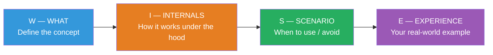

> **💡 Key Insight:** Interviewers aren't testing whether you memorized Spark docs. They're testing whether you can diagnose problems, make tradeoffs, and design systems. Always explain **why** something matters, not just what it is.

### What Interviewers Are Really Testing

| Level | They Want to See |
|---|---|
| **Beginner** | You understand the distributed computing model |
| **Intermediate** | You can diagnose performance issues |
| **Advanced** | You can design and optimize production pipelines |
| **Expert** | You can make architectural decisions with clear tradeoffs |

---

## Architecture & Fundamentals (Beginner)

### Q1: What is Apache Spark and why does it exist?

**Great Answer:**

Spark is a distributed computing engine for processing large datasets across a cluster of machines. It exists because:

1. **MapReduce was too slow** — it wrote intermediate results to disk after every step. Spark keeps data in memory between operations, making iterative algorithms (like ML) 10-100x faster.
2. **MapReduce was too rigid** — only map and reduce. Spark provides a rich API (filter, join, aggregate, window functions) that maps naturally to data problems.
3. **Unified engine** — before Spark, you needed separate systems for batch (MapReduce), streaming (Storm), ML (Mahout), and graph (Giraph). Spark does all of them.

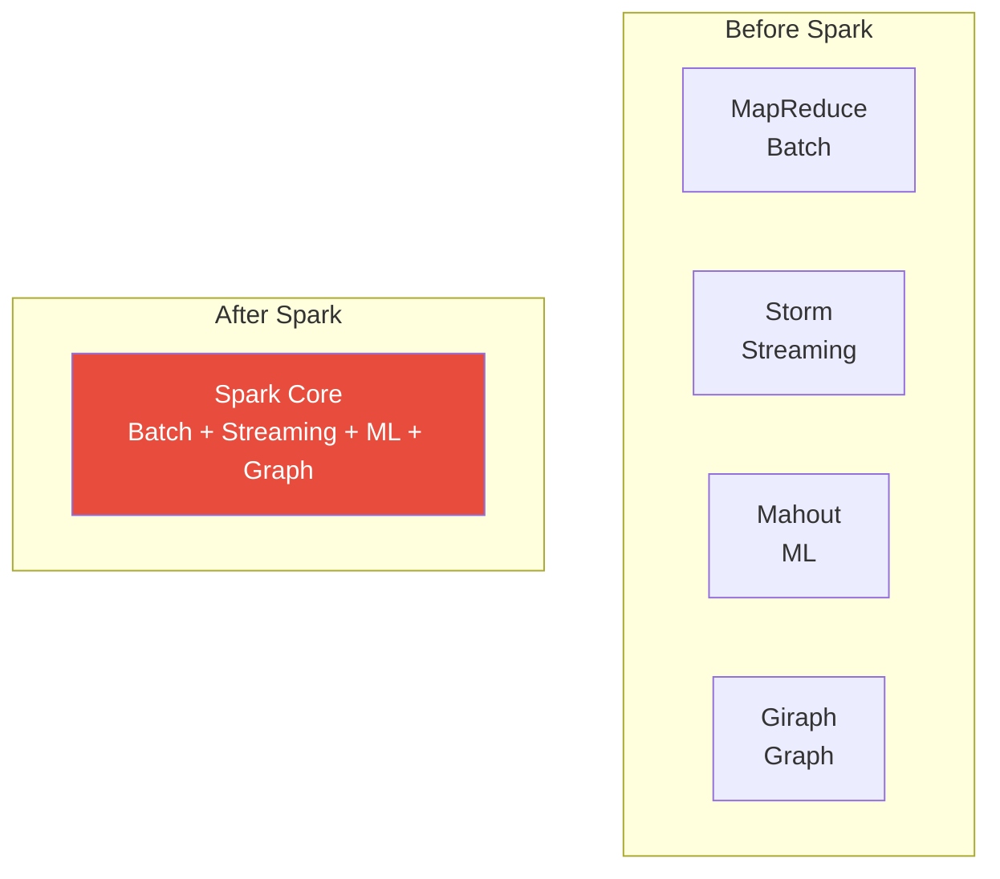

### Q2: Explain Spark's architecture — Driver, Executors, Cluster Manager.

**Great Answer:**

Think of it like a movie production:

| Component | Role | Movie Analogy |
|---|---|---|
| **Driver** | Plans execution, coordinates work, collects results | Director |
| **Executors** | JVM processes on worker nodes that run tasks and cache data | Film crews on set |
| **Cluster Manager** | Allocates resources (YARN, Mesos, K8s, Standalone) | Studio that assigns sets and crews |
| **Tasks** | Smallest unit of work, runs on one partition | Individual scenes to film |

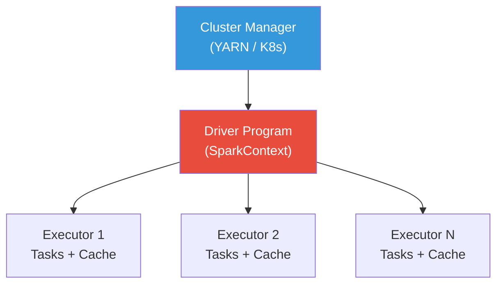

The flow:
1. Your application creates a `SparkSession` which launches the **Driver**
2. Driver requests resources from the **Cluster Manager**
3. Cluster Manager launches **Executors** on worker nodes
4. Driver sends **Tasks** to executors based on data locality
5. Executors run tasks and report results back to the Driver

### Q3: What is the difference between a Transformation and an Action?

**Great Answer:**

| | Transformation | Action |
|---|---|---|
| **What** | Defines a new DataFrame/RDD from an existing one | Triggers actual computation |
| **When it runs** | **Lazy** — only records the plan, doesn't execute | **Eager** — executes the entire DAG |
| **Returns** | A new DataFrame/RDD | A value (number, list, or writes to storage) |
| **Examples** | `filter()`, `select()`, `join()`, `groupBy()` | `count()`, `collect()`, `show()`, `write()` |

Why lazy evaluation matters:
1. **Optimization** — Catalyst can see the entire plan and optimize it (predicate pushdown, column pruning)
2. **Efficiency** — avoids materializing intermediate results
3. **Pipelining** — chains multiple narrow transformations into a single pass

```python
# Nothing happens here — just building a plan
df = spark.read.parquet("data/")          # Lazy
filtered = df.filter(col("age") > 25)     # Lazy  
selected = filtered.select("name", "age") # Lazy

# NOW everything executes — Spark optimizes the entire chain
selected.count()  # Action — triggers execution
```

### Q4: What is an RDD? How does it relate to DataFrames?

**Great Answer:**

**RDD (Resilient Distributed Dataset)** is Spark's foundational abstraction — an immutable, partitioned collection of records that can be operated on in parallel.

- **Resilient** — can be rebuilt from lineage if a partition is lost
- **Distributed** — spread across cluster nodes
- **Dataset** — collection of records

**DataFrames** are built ON TOP of RDDs but add:
1. **Schema** — typed columns, like a database table
2. **Catalyst optimizer** — SQL-like query optimization
3. **Tungsten engine** — off-heap memory, code generation

| Feature | RDD | DataFrame |
|---|---|---|
| Schema | No (opaque objects) | Yes (columns with types) |
| Optimization | None (you write the plan) | Catalyst optimizer |
| Performance | Slower (Java serialization) | Faster (Tungsten, codegen) |
| API | Functional (map, filter, reduce) | Declarative (select, where, groupBy) |
| Use when | Custom partitioners, unstructured data, low-level control | 95% of use cases |

> **Rule of thumb:** Use DataFrames for everything unless you need low-level RDD control (custom partitioning, accumulator-heavy logic).

### Q5: Explain narrow vs wide transformations.

**Great Answer:**

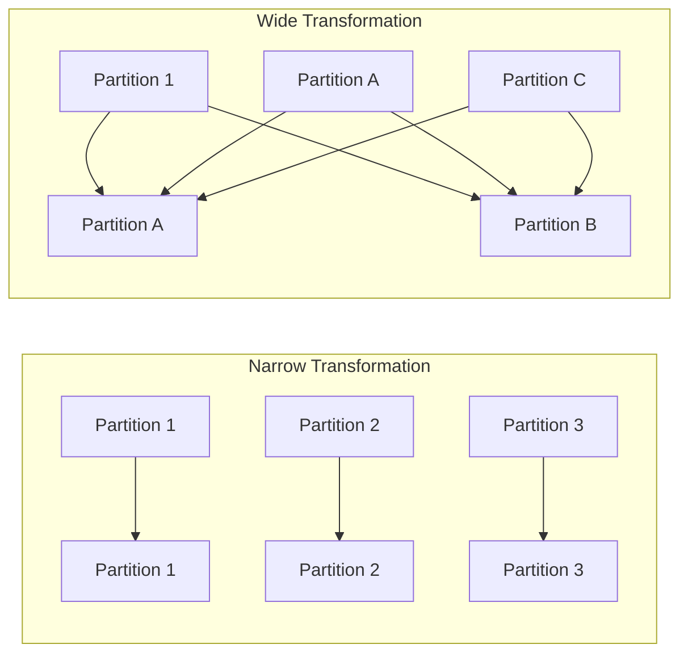

| | Narrow | Wide |
|---|---|---|
| **Data movement** | Each output partition depends on ONE input partition | Each output partition depends on MULTIPLE input partitions |
| **Network I/O** | None (data stays local) | Shuffle (data moves across network) |
| **Examples** | `map`, `filter`, `select`, `withColumn` | `groupBy`, `join`, `repartition`, `orderBy` |
| **Stage boundary** | No | Yes — creates a new stage |
| **Performance** | Fast (pipeline-able) | Expensive (disk + network I/O) |

Why this matters: **Every wide transformation creates a shuffle**, which is the most expensive operation in Spark. Minimizing shuffles is the #1 performance optimization.

### Q6: What is lazy evaluation and why does Spark use it?

**Great Answer:**

Lazy evaluation means Spark doesn't execute transformations immediately. Instead, it builds a **logical plan** (a DAG of operations) and only executes when an **action** is called.

Three key benefits:
1. **Query optimization** — Catalyst sees the entire plan and can reorder/combine operations. For example, if you `select(*)` then `filter()` then `select("name")`, Catalyst pushes the column pruning to the read and only loads `"name"` + the filter column.
2. **Avoid unnecessary computation** — if you define 10 transformations but only call `count()`, Spark might skip loading columns that aren't needed.
3. **Pipelining** — multiple narrow transformations are fused into a single pass over the data, avoiding intermediate materialization.

---

## DataFrames, SQL & Catalyst (Intermediate)

### Q7: How does the Catalyst optimizer work?

**Great Answer:**

Catalyst optimizes your query through 4 phases:

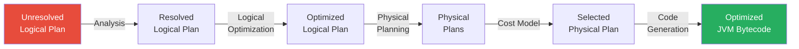

1. **Analysis** — Resolves column names, table references, data types using the catalog
2. **Logical Optimization** — Applies rules like:
   - **Predicate pushdown** — push filters as early as possible
   - **Column pruning** — only read columns you need
   - **Constant folding** — pre-compute `1 + 1` → `2`
   - **Null propagation** — simplify null expressions
3. **Physical Planning** — Generates multiple physical plans (e.g., sort-merge join vs. broadcast hash join) and picks the cheapest one using a cost model
4. **Code Generation (Tungsten)** — Generates optimized JVM bytecode using whole-stage code generation, avoiding virtual function dispatch

> **Key insight:** This is why DataFrame/SQL performance is usually identical — they both go through Catalyst. And why DataFrames are faster than RDDs — RDDs skip all of this optimization.

### Q8: What is predicate pushdown and why is it important?

**Great Answer:**

Predicate pushdown means pushing filter conditions as close to the data source as possible — ideally into the storage layer itself.

```python
# Without pushdown (naive):
# 1. Read ALL 10TB of data
# 2. Then filter for date = '2024-01-15'

# With pushdown (what Catalyst does):
# 1. Tell Parquet/ORC: "only give me data where date = '2024-01-15'"
# 2. Parquet skips entire row groups where date ≠ '2024-01-15'
# 3. Reads maybe 50GB instead of 10TB
```

This is why **file format matters**:
- **Parquet/ORC** — Support predicate pushdown via column statistics in footer. If the footer says `min(date) = '2024-02-01'` for a row group, and you're filtering `date = '2024-01-15'`, the entire row group is skipped.
- **CSV/JSON** — No pushdown possible. Every byte must be read.
- **JDBC** — Spark translates filters to SQL WHERE clauses, pushing them to the database.

```python
# Verify pushdown is working:
df = spark.read.parquet("data/").filter(col("date") == "2024-01-15")
df.explain(True)
# Look for "PushedFilters: [IsNotNull(date), EqualTo(date,2024-01-15)]"
```

### Q9: What's the difference between `cache()`, `persist()`, and `checkpoint()`?

**Great Answer:**

| Feature | `cache()` | `persist()` | `checkpoint()` |
|---|---|---|---|
| Storage | Memory only | Configurable (memory, disk, off-heap) | Reliable storage (HDFS/S3) |
| Lineage | Preserved | Preserved | **Truncated** |
| Survives driver restart | No | No | **Yes** |
| Use case | Reused DataFrames | Fine-grained control | Breaking long lineage chains |

```python
# cache() = persist(MEMORY_AND_DISK)
df.cache()

# persist() with specific level
from pyspark import StorageLevel
df.persist(StorageLevel.MEMORY_AND_DISK_SER)  # Serialized, saves memory

# checkpoint() — saves to reliable storage AND breaks lineage
spark.sparkContext.setCheckpointDir("s3://checkpoints/")
df.checkpoint()  # Eager — computes and saves immediately
df.checkpoint(eager=False)  # Lazy — saves when action triggers
```

When to use what:
- **`cache()`** — DataFrame used 2+ times, fits in memory
- **`persist(DISK_ONLY)`** — DataFrame used 2+ times, too large for memory
- **`checkpoint()`** — Very long lineage (100+ stages), iterative algorithms, streaming state recovery

### Q10: Explain the difference between `select()` and `withColumn()`.

**Great Answer:**

Both create new DataFrames, but they differ in how:

```python
# select() — define ALL columns you want (like SQL SELECT)
result = df.select("name", "age", (col("salary") * 1.1).alias("new_salary"))

# withColumn() — add/replace ONE column, keep all existing
result = df.withColumn("new_salary", col("salary") * 1.1)
```

**Performance concern with `withColumn()`:**

```python
# ❌ BAD — chaining withColumn creates a deep logical plan
df = df.withColumn("a", expr("..."))
df = df.withColumn("b", expr("..."))
df = df.withColumn("c", expr("..."))
# ... 50 more withColumn calls
# Catalyst struggles to optimize a plan with 50+ projections

# ✅ BETTER — use select for multiple column operations
df = df.select(
    "*",
    expr("...").alias("a"),
    expr("...").alias("b"),
    expr("...").alias("c"),
)
```

> **⚠️ Warning:** Chaining more than ~20 `withColumn()` calls can cause Catalyst to slow down during optimization. Use `select()` when adding many columns at once.

---

## Shuffles, Partitioning & Joins (Intermediate)

### Q11: What is a shuffle and why is it expensive?

**Great Answer:**

A shuffle is the process of redistributing data across partitions — it's how Spark ensures all records with the same key end up on the same partition.

**Why it's expensive:**
1. **Disk I/O** — shuffle data is written to local disk (shuffle files)
2. **Network I/O** — data is transferred across the network to other executors
3. **Serialization** — data must be serialized for transfer and deserialized at the destination
4. **Memory pressure** — both the write-side and read-side need buffer memory
5. **Synchronization** — the next stage can't start until ALL tasks in the current stage complete their shuffle write

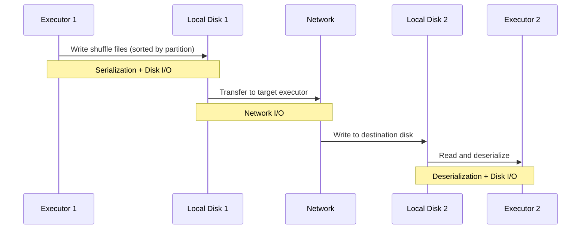

**How to reduce shuffles:**
- Use **broadcast joins** for small tables (< 100MB)
- **Pre-partition** data by join key
- Use **`coalesce()`** instead of `repartition()` when reducing partitions
- Enable **AQE** to auto-optimize shuffle partitions

### Q12: Explain the different join strategies in Spark.

**Great Answer:**

Spark has 5 join strategies, chosen by the Catalyst optimizer:

| Strategy | When Used | Performance | Memory |
|---|---|---|---|
| **Broadcast Hash Join** | One side < `spark.sql.autoBroadcastJoinThreshold` (10MB default) | ⚡ Fastest — no shuffle | Small side must fit in driver + executor memory |
| **Shuffle Hash Join** | Both sides medium, one fits in memory per partition | Fast | One side's partition must fit in memory |
| **Sort Merge Join** | Both sides large (default for equi-joins) | Good, scalable | Moderate (streams sorted data) |
| **Broadcast Nested Loop** | Non-equi join, one side small | Slow but necessary | Small side broadcast |
| **Cartesian Product** | Cross join, no join condition | ⚠️ Very slow, O(n×m) | Huge |

```python
# Force broadcast join (override optimizer)
from pyspark.sql.functions import broadcast
result = big_df.join(broadcast(small_df), "key")

# Check which join strategy was used
result.explain()
# Look for: BroadcastHashJoin, SortMergeJoin, ShuffledHashJoin
```

**Decision tree the optimizer uses:**

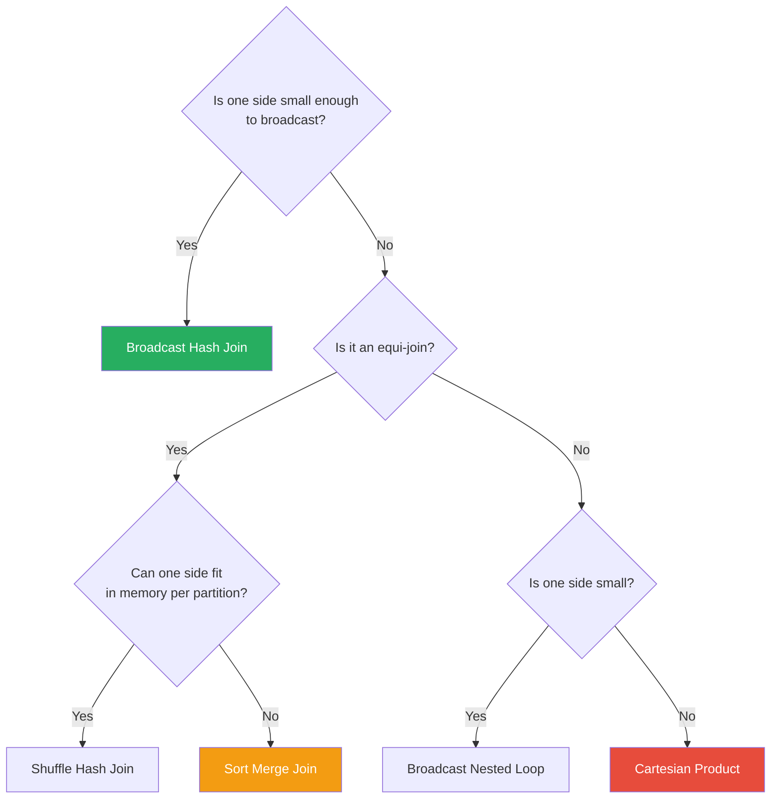

### Q13: What is data skew and how do you fix it?

**Great Answer:**

Data skew means some partitions have significantly more data than others. This causes a few tasks to take much longer than the rest, making your job's duration equal to the slowest task.

**Symptoms:**
- Most tasks finish in 5 seconds, but 2-3 tasks take 30 minutes
- In Spark UI, the task duration distribution shows extreme outliers
- OOM errors on specific executors

**Fixes ranked by effort:**

```python
# Fix 1: Enable AQE skew join handling (easiest)
spark.conf.set("spark.sql.adaptive.enabled", "true")
spark.conf.set("spark.sql.adaptive.skewJoin.enabled", "true")
# AQE detects skewed partitions and splits them automatically

# Fix 2: Salt the join key (manual but effective)
from pyspark.sql.functions import concat, lit, floor, rand

SALT_FACTOR = 10

# Add salt to the big (skewed) table
big_salted = big_df.withColumn("salt", floor(rand() * SALT_FACTOR).cast("string"))
big_salted = big_salted.withColumn("salted_key", concat(col("key"), lit("_"), col("salt")))

# Explode the small table to match all salt values
from pyspark.sql.functions import explode, array
small_exploded = small_df.crossJoin(
    spark.range(SALT_FACTOR).withColumnRenamed("id", "salt").select(col("salt").cast("string"))
)
small_exploded = small_exploded.withColumn("salted_key", concat(col("key"), lit("_"), col("salt")))

# Join on salted key — skew is distributed across SALT_FACTOR partitions
result = big_salted.join(small_exploded, "salted_key")

# Fix 3: Isolate and handle skewed keys separately
skewed_keys = ["key_with_millions_of_rows"]
skewed = big_df.filter(col("key").isin(skewed_keys))
normal = big_df.filter(~col("key").isin(skewed_keys))

# Broadcast join for skewed keys (small_df filtered to skewed keys is tiny)
result_skewed = skewed.join(broadcast(small_df.filter(col("key").isin(skewed_keys))), "key")
result_normal = normal.join(small_df, "key")

result = result_skewed.union(result_normal)
```

### Q14: What is the difference between `repartition()` and `coalesce()`?

**Great Answer:**

| | `repartition(n)` | `coalesce(n)` |
|---|---|---|
| Direction | Increase OR decrease partitions | Only decrease partitions |
| Shuffle | **Always** shuffles (full data redistribution) | **No shuffle** (merges partitions locally) |
| Data distribution | Even distribution across partitions | Uneven (combines existing partitions) |
| Use case | Need even distribution, change partition key | Reduce partitions before write |

```python
# repartition — even distribution, causes shuffle
df.repartition(100)            # 100 evenly-sized partitions
df.repartition(100, "key")     # 100 partitions, hash-partitioned by "key"
df.repartition("date")         # Partition by date column

# coalesce — merge partitions without shuffle
df.coalesce(10)  # Merge 1000 partitions → 10 (no shuffle)

# Common pattern: reduce file count before writing
df.coalesce(10).write.parquet("output/")  # 10 output files instead of 1000
```

> **⚠️ Warning:** `coalesce(1)` on a large dataset creates a single partition processed by one task — this will be extremely slow or OOM. Use `repartition(1)` if you truly need one partition (it at least parallelizes the shuffle write).

### Q15: How does partitioning on disk differ from in-memory partitioning?

**Great Answer:**

These are two completely different concepts:

**In-memory partitioning** (Spark partitions):
- How data is split across executors during computation
- Controlled by `repartition()`, `coalesce()`, `spark.sql.shuffle.partitions`
- Affects parallelism and shuffle behavior

**On-disk partitioning** (Hive-style partitioning):
- How data is organized in directories on storage (HDFS/S3)
- Controlled by `.partitionBy("column")` during write
- Affects read performance through partition pruning

```python
# On-disk partitioning — creates directory structure
df.write.partitionBy("year", "month").parquet("output/")
# Creates: output/year=2024/month=01/part-00000.parquet
#          output/year=2024/month=02/part-00000.parquet

# Reading with partition filter — only reads relevant directories
spark.read.parquet("output/") \
    .filter(col("year") == 2024)  # Only reads year=2024/ directory
```

---

## Memory Management (Intermediate-Advanced)

### Q16: Explain Spark's memory model.

**Great Answer:**

Each executor's JVM heap is divided into regions:

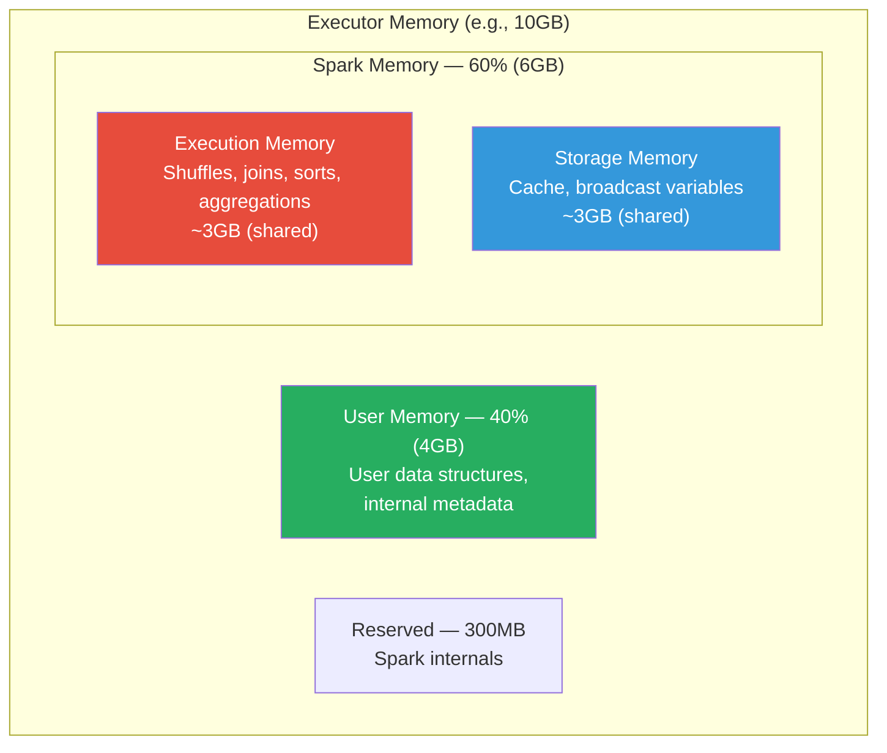

**Key concept — Unified Memory Management (since Spark 1.6):**
- Execution and Storage share a pool (controlled by `spark.memory.fraction = 0.6`)
- If execution needs more memory and storage has free space, execution can **borrow** from storage
- If storage needs more memory and execution has free space, storage can borrow
- But execution can **evict** cached data from storage if it needs memory. Storage cannot evict execution data.

This is why Spark can handle varying workloads — a heavy aggregation borrows from cache space, while a cache-heavy workload borrows from execution space.

### Q17: What causes OOM errors and how do you fix them?

**Great Answer:**

OOM can happen in two places — **Driver** or **Executor**:

**Driver OOM:**
```python
# Cause 1: collect() on a large DataFrame
big_df.collect()  # Pulls ALL data to driver — OOM if data > driver memory

# Fix: Never collect large DataFrames
big_df.show(100)                     # Show a sample
big_df.write.parquet("output/")      # Write to storage instead

# Cause 2: Large broadcast variable
broadcast(huge_df)  # Broadcast copies data to driver first

# Fix: Increase broadcast threshold or don't broadcast
spark.conf.set("spark.sql.autoBroadcastJoinThreshold", "-1")

# Cause 3: Too many partitions creating scheduling overhead
# Fix: Increase driver memory
# --driver-memory 8g
```

**Executor OOM:**
```python
# Cause 1: Data skew — one partition has too much data
# Fix: Salt the key, enable AQE skew join

# Cause 2: Exploding joins (many-to-many)
# Fix: Investigate data, add pre-join deduplication

# Cause 3: Too many columns cached
# Fix: Select only needed columns before cache

# Cause 4: Large aggregation state
# Fix: Increase executor memory or partition count
spark.conf.set("spark.sql.shuffle.partitions", "2000")
```

---

## Performance Tuning (Advanced)

### Q18: What is Adaptive Query Execution (AQE)?

**Great Answer:**

AQE re-optimizes the query plan at runtime based on actual data statistics collected after each shuffle stage.

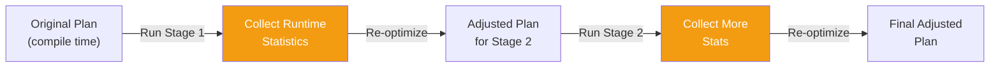

Three key features:

1. **Coalescing shuffle partitions** — if you set `shuffle.partitions=200` but the data only needs 50, AQE merges small partitions into larger ones automatically.

2. **Switching join strategies** — if Catalyst chose sort-merge join based on estimated sizes, but after a filter the data is actually small, AQE switches to broadcast hash join at runtime.

3. **Skew join optimization** — AQE detects skewed partitions (much larger than the median) and splits them into smaller sub-partitions, processing them in parallel.

```python
# Enable AQE (default since Spark 3.2)
spark.conf.set("spark.sql.adaptive.enabled", "true")
spark.conf.set("spark.sql.adaptive.coalescePartitions.enabled", "true")
spark.conf.set("spark.sql.adaptive.skewJoin.enabled", "true")
```

> **Key insight:** With AQE enabled, setting `shuffle.partitions` to a high number (e.g., 2000) is safe because AQE will coalesce down to the actual needed count. Overshooting is better than undershooting.

### Q19: How do you read a Spark execution plan (`explain()`)?

**Great Answer:**

```python
df.explain(True)  # Shows all plan phases
```

Read it **bottom to top** — the bottom is the data source, the top is the final output:

```
== Physical Plan ==
*(2) HashAggregate(keys=[category], functions=[sum(amount)])    ← Final aggregation
+- Exchange hashpartitioning(category, 200)                     ← SHUFFLE
   +- *(1) HashAggregate(keys=[category], functions=[partial_sum(amount)])  ← Partial agg
      +- *(1) Filter (amount > 0)                               ← Filter
         +- *(1) ColumnarToRow                                   ← Format conversion
            +- FileScan parquet [category,amount]                 ← Data source
               PushedFilters: [IsNotNull(amount), GreaterThan(amount,0)]  ← Pushed to Parquet
```

Key symbols to look for:
- `Exchange` = **SHUFFLE** (expensive!)
- `*(n)` = whole-stage code generation (good)
- `BroadcastExchange` = broadcast happening
- `PushedFilters` = predicate pushdown (good)
- `PartitionFilters` = partition pruning (good)

### Q20: What is whole-stage code generation?

**Great Answer:**

Instead of running each operation as a separate function call (operator-at-a-time), Tungsten fuses multiple operators into a single Java function that processes records in a tight loop.

**Without codegen (traditional):**
```
for each row:
    call filter.process(row)      # virtual function dispatch
    call project.process(row)     # virtual function dispatch  
    call aggregate.process(row)   # virtual function dispatch
```

**With codegen (Tungsten):**
```java
// Generated code — one tight loop, no virtual dispatch
while (input.hasNext()) {
    Row row = input.next();
    if (row.getInt(2) > 0) {                    // Filter inlined
        int key = row.getInt(0);                  // Project inlined
        aggregateBuffer.update(key, row.getInt(1)); // Aggregate inlined
    }
}
```

Benefits:
- Eliminates virtual function dispatch overhead
- Enables CPU cache-friendly access patterns
- Allows JIT compiler to optimize the generated code further
- 2-10x performance improvement for CPU-bound operations

In `explain()` output, stages marked with `*(n)` are using whole-stage code generation.

### Q21: When would you use `broadcast()` hint and when would you avoid it?

**Great Answer:**

**Use broadcast when:**
- One side of a join is small (< 1GB after filtering)
- You're joining a large fact table with a small dimension table
- You want to avoid a shuffle entirely

**Avoid broadcast when:**
- The "small" table is actually large (> 1-2GB) — OOM risk on driver
- The small table grows over time (today 100MB, next year 5GB)
- You're inside a streaming query and the broadcast table changes frequently

```python
# Let Spark decide (recommended for most cases)
spark.conf.set("spark.sql.autoBroadcastJoinThreshold", "100m")  # 100MB threshold

# Force broadcast (when you KNOW it's safe)
result = orders.join(broadcast(countries), "country_code")

# Disable broadcast (force sort-merge join for predictable memory usage)
spark.conf.set("spark.sql.autoBroadcastJoinThreshold", "-1")
```

---

## Spark Streaming (Intermediate-Advanced)

### Q22: Explain Structured Streaming's processing model.

**Great Answer:**

Structured Streaming treats a live data stream as an **unbounded table** that grows as new data arrives. Every trigger interval, new rows are appended to this conceptual table, and your query runs on the entire table (or just the new rows).

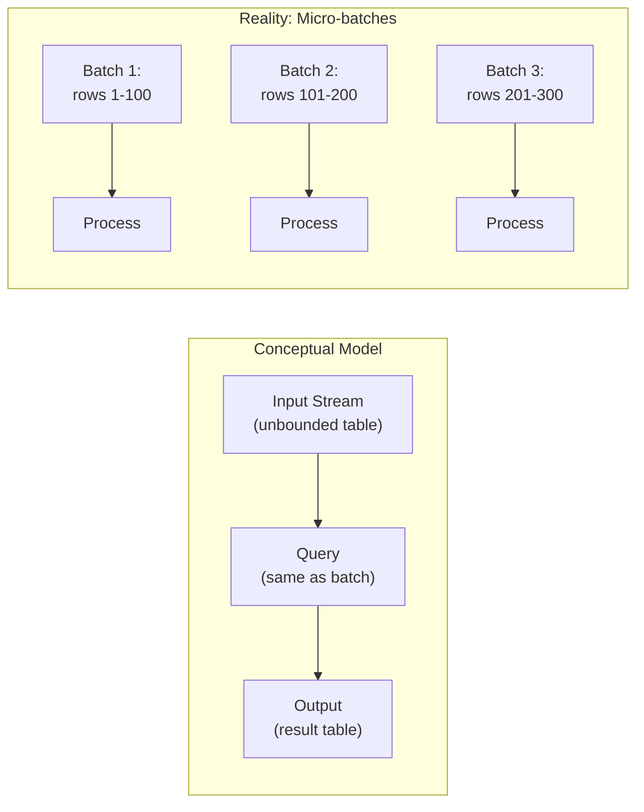

**Three output modes:**
- **Append** — Only new rows added to result table (default)
- **Complete** — Entire result table output every trigger (for aggregations)
- **Update** — Only changed rows output

### Q23: What are watermarks in Structured Streaming?

**Great Answer:**

Watermarks tell Spark: "I don't expect data older than X to arrive anymore. You can clean up state for events older than this."

Without watermarks, Spark would keep state for every key forever — eventually running out of memory.

```python
from pyspark.sql.functions import window

# "Data arriving more than 1 hour late should be dropped"
df_with_watermark = df \
    .withWatermark("event_time", "1 hour") \
    .groupBy(
        window("event_time", "10 minutes"),
        "device_id"
    ).count()
```

**How it works internally:**
1. Spark tracks the maximum event_time seen so far: `max_event_time`
2. Watermark = `max_event_time - threshold` (e.g., `max - 1 hour`)
3. Any incoming event with `event_time < watermark` is dropped
4. State (aggregation buffers) for windows older than the watermark is cleaned up

**Tradeoff:** Larger watermark = more late data accepted but more memory used.

### Q24: Compare micro-batch vs continuous processing.

**Great Answer:**

| Feature | Micro-batch (Default) | Continuous (Experimental) |
|---|---|---|
| Latency | ~100ms to seconds (depends on trigger) | ~1ms (true record-at-a-time) |
| Throughput | Higher (batch optimizations) | Lower |
| Fault tolerance | Exactly-once | At-least-once |
| Supported operations | All (aggregations, joins, windows) | Limited (map-like only) |
| Production readiness | Stable, battle-tested | Experimental |

```python
# Micro-batch (default)
query = df.writeStream \
    .trigger(processingTime="10 seconds") \
    .start()

# Continuous processing (experimental, Spark 2.3+)
query = df.writeStream \
    .trigger(continuous="1 second") \
    .start()
```

> **Recommendation:** Use micro-batch for 99% of use cases. The latency (~100ms with short trigger intervals) is good enough for most applications. Only consider continuous if you truly need sub-10ms latency AND your pipeline is simple (map/filter only).

---

## Production & Operations (Advanced)

### Q25: How would you debug a Spark job that's running slowly?

**Great Answer (systematic approach):**

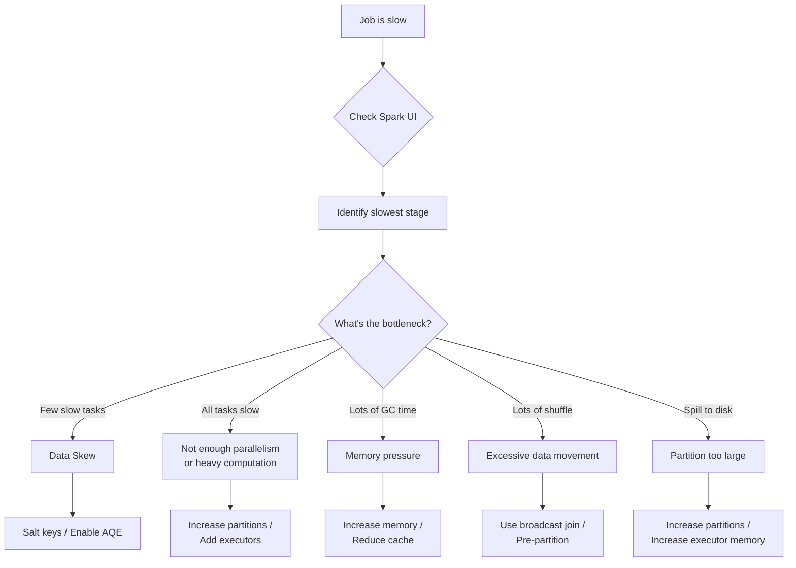

**Step-by-step investigation:**
1. **Spark UI → Jobs tab** — Which job is slow?
2. **Stages tab** — Which stage is slowest? Look at shuffle read/write sizes.
3. **Stage detail → Task metrics** — Look at the distribution:
   - If **max >> median** → data skew
   - If **GC time > 10%** → memory pressure
   - If **shuffle write is huge** → reduce shuffle data
   - If **spill (disk) > 0** → partitions too large for memory
4. **SQL tab** — Check the physical plan, look for unexpected sort-merge joins or missing predicate pushdown
5. **Environment tab** — Verify configurations are correct

### Q26: Explain `deploy-mode client` vs `deploy-mode cluster`.

**Great Answer:**

| | Client Mode | Cluster Mode |
|---|---|---|
| **Driver location** | On the machine that runs `spark-submit` | On a worker node in the cluster |
| **Logs** | Visible in your terminal | Must check YARN/K8s logs |
| **Network dependency** | Requires continuous network connection | Independent after submission |
| **Use case** | Interactive debugging, notebooks | **Production jobs** |
| **If your laptop disconnects** | Job dies | Job continues |

```bash
# Client mode — driver runs locally (for debugging)
spark-submit --deploy-mode client my_job.py

# Cluster mode — driver runs in cluster (for production)
spark-submit --deploy-mode cluster my_job.py
```

> **Rule:** Always use `cluster` mode in production. If you use `client` mode and your submit machine goes down, the job dies.

### Q27: How does Spark achieve fault tolerance?

**Great Answer:**

Spark uses **lineage-based fault tolerance**, not data replication:

1. **RDD lineage** — Every RDD records how it was derived from other RDDs (its parent + the transformation). If a partition is lost (executor crash), Spark re-computes only that partition by replaying the lineage from the last materialization point.

2. **Shuffle files** — Written to local disk. If an executor dies after the shuffle write, the files are still available for the next stage to read (unless the disk dies too).

3. **Task retries** — Failed tasks are retried on other executors (default 4 attempts via `spark.task.maxFailures`).

4. **Stage retries** — If too many tasks in a stage fail, the entire stage is retried.

5. **Checkpointing** — For streaming or iterative algorithms, checkpoint data to reliable storage (HDFS/S3) to truncate lineage and enable recovery.

**Key tradeoff:** Lineage-based recovery is efficient (no replication overhead) but re-computation can be expensive for long lineage chains — hence checkpointing.

### Q28: How do you handle data quality in production Spark pipelines?

**Great Answer:**

A production data quality strategy has four layers:

1. **Input validation** — Check data exists, schema matches, row count is reasonable
2. **Processing guards** — Dead letter queues for bad records, null handling
3. **Output validation** — Verify output schema, row counts, value ranges, no nulls in critical columns
4. **Monitoring** — Track data quality metrics over time, alert on anomalies

```python
# Example: Multi-layer quality gate
def run_pipeline_with_quality(spark, date):
    # Layer 1: Input validation
    df = spark.read.parquet(f"s3://data/events/date={date}/")
    input_count = df.count()
    assert input_count > 0, f"No input data for {date}"
    assert input_count > 100_000, f"Suspiciously low input: {input_count}"
    
    # Layer 2: Process with error isolation
    good, bad = separate_good_bad_records(df)
    bad.write.mode("append").parquet("s3://dead-letter/")
    
    # Layer 3: Transform and validate output
    result = transform(good)
    output_count = result.count()
    null_count = result.filter(col("revenue").isNull()).count()
    assert null_count == 0, f"Found {null_count} null revenues"
    
    # Layer 4: Write with metrics
    result.write.mode("overwrite").parquet(f"s3://output/date={date}/")
    log_metrics(input_count, output_count, bad.count())
```

---

## System Design Questions (Expert)

### Q29: Design a real-time analytics pipeline for an e-commerce platform.

**Great Answer:**

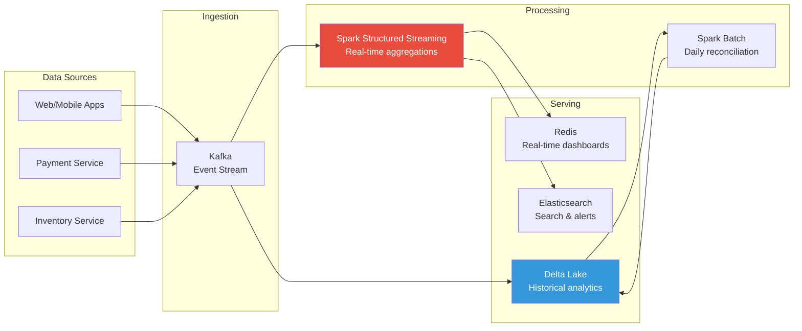

**Architecture decisions and tradeoffs:**

| Decision | Choice | Why |
|---|---|---|
| Ingestion | Kafka | Durable, replayable, handles back-pressure |
| Stream processing | Spark Structured Streaming | Rich APIs, exactly-once semantics, unified batch+stream |
| Storage | Delta Lake | ACID, time travel, schema evolution, efficient upserts |
| Real-time serving | Redis | Sub-ms reads for dashboard counters |
| Batch reconciliation | Daily Spark job | Corrects for late-arriving data, computes complex aggregations |

**Key streaming query:**
```python
# Real-time revenue by category (updated every 30 seconds)
orders = spark.readStream \
    .format("kafka") \
    .option("subscribe", "orders") \
    .load()

revenue = orders \
    .withWatermark("order_time", "10 minutes") \
    .groupBy(
        window("order_time", "5 minutes"),
        "category"
    ) \
    .agg(
        sum("amount").alias("revenue"),
        count("*").alias("order_count")
    )

# Write to Redis for real-time dashboards
revenue.writeStream \
    .foreachBatch(write_to_redis) \
    .trigger(processingTime="30 seconds") \
    .start()

# Also write to Delta Lake for historical analysis
revenue.writeStream \
    .format("delta") \
    .outputMode("append") \
    .option("checkpointLocation", "s3://checkpoints/revenue/") \
    .start("s3://delta/revenue/")
```

### Q30: Design a data lakehouse architecture for a company processing 10TB/day.

**Great Answer:**

**Multi-layer architecture:**

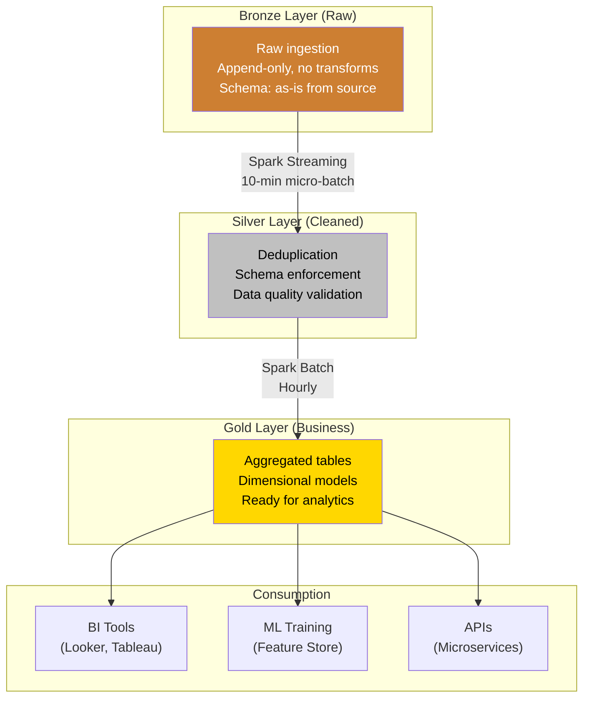

**Key design decisions:**
1. **Storage format:** Delta Lake (ACID transactions, time travel, efficient upserts)
2. **Bronze→Silver:** Structured Streaming with 10-minute triggers, dedup by event ID, schema enforcement
3. **Silver→Gold:** Hourly batch jobs, pre-computed aggregations, SCD Type 2 for dimensions
4. **Partitioning:** Bronze by `ingestion_date/hour`, Silver by `event_date/hour`, Gold by `date`
5. **File compaction:** Schedule OPTIMIZE + ZORDER jobs on Delta tables
6. **Cost optimization:** Auto-scaling cluster, spot instances for Silver/Gold batch, reserved for streaming

---

## Coding Challenges

### Challenge 1: Find the Top N Items per Group

```python
# Question: Find the top 3 highest-revenue products per category

from pyspark.sql.window import Window
from pyspark.sql.functions import row_number, col

# Solution using window functions
window_spec = Window.partitionBy("category").orderBy(col("revenue").desc())

top_3 = df \
    .withColumn("rank", row_number().over(window_spec)) \
    .filter(col("rank") <= 3) \
    .drop("rank")
```

### Challenge 2: Sessionize User Clickstream Data

```python
# Question: Group user clicks into sessions.
# A new session starts if there's a gap of > 30 minutes between clicks.

from pyspark.sql.window import Window
from pyspark.sql.functions import lag, col, sum as _sum, unix_timestamp

user_window = Window.partitionBy("user_id").orderBy("click_time")

sessionized = df \
    .withColumn("prev_click", lag("click_time").over(user_window)) \
    .withColumn("gap_seconds", 
        unix_timestamp("click_time") - unix_timestamp("prev_click")) \
    .withColumn("new_session", 
        (col("gap_seconds") > 1800) | col("gap_seconds").isNull()) \
    .withColumn("session_id", 
        _sum(col("new_session").cast("int")).over(user_window))
```

### Challenge 3: Deduplicate with "Latest Wins"

```python
# Question: Given events that may arrive out of order or duplicated,
# keep only the latest version of each record by event_id.

from pyspark.sql.window import Window
from pyspark.sql.functions import row_number, col

dedup_window = Window.partitionBy("event_id").orderBy(col("updated_at").desc())

deduplicated = df \
    .withColumn("rn", row_number().over(dedup_window)) \
    .filter(col("rn") == 1) \
    .drop("rn")
```

### Challenge 4: Compute Running Totals

```python
# Question: Compute running total of revenue per customer, ordered by date.

from pyspark.sql.window import Window
from pyspark.sql.functions import sum as _sum, col

running_window = Window \
    .partitionBy("customer_id") \
    .orderBy("order_date") \
    .rowsBetween(Window.unboundedPreceding, Window.currentRow)

result = df.withColumn(
    "running_total", 
    _sum("revenue").over(running_window)
)
```

### Challenge 5: Slowly Changing Dimension (SCD Type 2)

```python
# Question: Implement SCD Type 2 merge — track history of changes.

from delta.tables import DeltaTable

# Existing dimension table
target = DeltaTable.forPath(spark, "s3://delta/dim_customers/")

# New batch of updates
updates = spark.read.parquet("s3://staging/customer_updates/")

# Mark existing records as expired, insert new versions
target.alias("t").merge(
    updates.alias("u"),
    "t.customer_id = u.customer_id AND t.is_current = true"
).whenMatchedUpdate(
    condition="t.name != u.name OR t.address != u.address",
    set={
        "is_current": "false",
        "end_date": "u.effective_date"
    }
).whenNotMatchedInsert(
    values={
        "customer_id": "u.customer_id",
        "name": "u.name",
        "address": "u.address",
        "effective_date": "u.effective_date",
        "end_date": "null",
        "is_current": "true"
    }
).execute()
```

---

## Red Flags — What NOT to Say

| ❌ Red Flag | Why It's Bad | ✅ Better Answer |
|---|---|---|
| "Spark is faster than MapReduce because of in-memory" | Oversimplified — Spark is faster because of DAG optimization, pipelining, and avoiding unnecessary disk I/O. In-memory caching is optional. | "Spark avoids materializing intermediate results to disk, uses DAG optimization to pipeline operations, and CAN leverage memory for caching" |
| "I just increase the number of executors" | Shows no understanding of bottlenecks | "I'd first identify the bottleneck — is it data skew, shuffles, or compute? Then tune accordingly." |
| "RDDs and DataFrames are the same thing" | Very different performance characteristics | "DataFrames sit on top of RDDs but add schema awareness and Catalyst optimization, making them significantly faster" |
| "I've never looked at the Spark UI" | Major red flag for any production engineer | "I regularly use the Spark UI to check stage durations, shuffle sizes, and task distributions" |
| "I always use `collect()`" | Shows you might crash production | "`collect()` is dangerous on large datasets. I use `show()`, `take()`, or write to storage." |

---

## Quick Reference: Top 20 Must-Know Concepts

| # | Concept | One-Line Summary |
|---|---|---|
| 1 | **Lazy evaluation** | Transformations build a plan; actions execute it |
| 2 | **Narrow vs wide transforms** | Narrow = no shuffle; Wide = shuffle (expensive) |
| 3 | **Catalyst optimizer** | Optimizes your logical plan into efficient physical execution |
| 4 | **Tungsten** | Off-heap memory + code generation for CPU efficiency |
| 5 | **Shuffle** | Redistributing data across partitions; most expensive operation |
| 6 | **Partitioning** | How data is split across tasks; controls parallelism |
| 7 | **Data skew** | Uneven data distribution causing slow tasks |
| 8 | **Broadcast join** | Send small table to all executors to avoid shuffle |
| 9 | **Sort-merge join** | Default for large-large joins; sorts both sides then merges |
| 10 | **AQE** | Runtime re-optimization based on actual data statistics |
| 11 | **Predicate pushdown** | Push filters to storage layer to read less data |
| 12 | **Unified memory** | Execution and storage share memory, can borrow from each other |
| 13 | **Speculative execution** | Re-launch slow tasks on other nodes |
| 14 | **DAG scheduler** | Creates stages from the lineage graph at shuffle boundaries |
| 15 | **Structured Streaming** | Stream = unbounded table; same API as batch |
| 16 | **Watermarks** | Tell Spark when to stop waiting for late data |
| 17 | **Checkpointing** | Save state to reliable storage; truncate lineage |
| 18 | **Dynamic allocation** | Auto-scale executors based on workload |
| 19 | **Delta Lake** | ACID transactions on data lakes; time travel, upserts |
| 20 | **Cluster vs client mode** | Cluster = driver in cluster (prod); Client = driver local (debug) |

---

**[← Previous: 14-production-best-practices.md](14-production-best-practices.md) | [Home](../README.md) | [Next →: spark-cheatsheet.md](spark-cheatsheet.md)**
