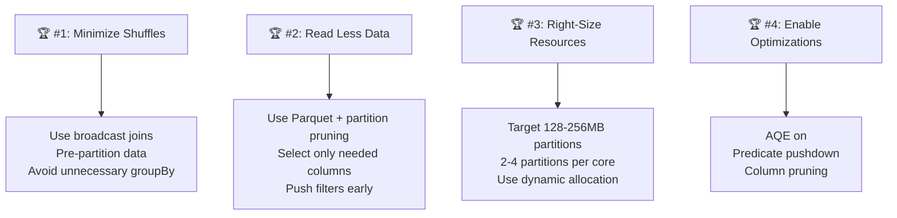
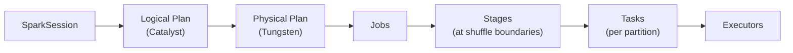
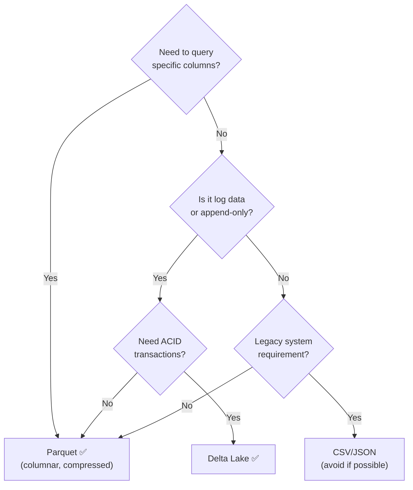
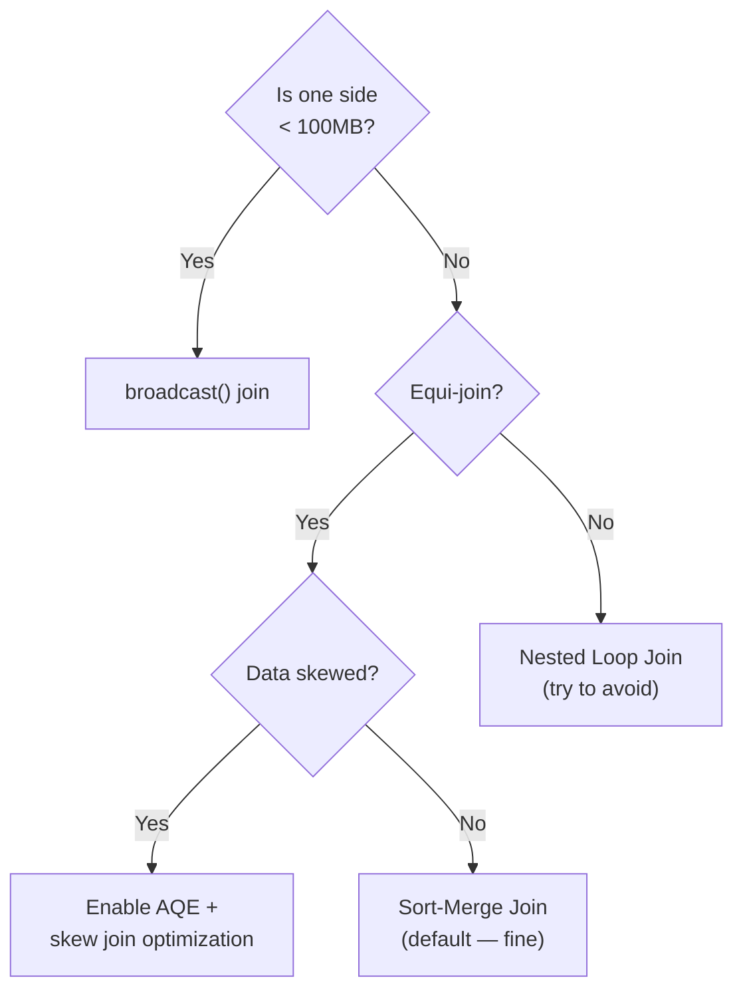
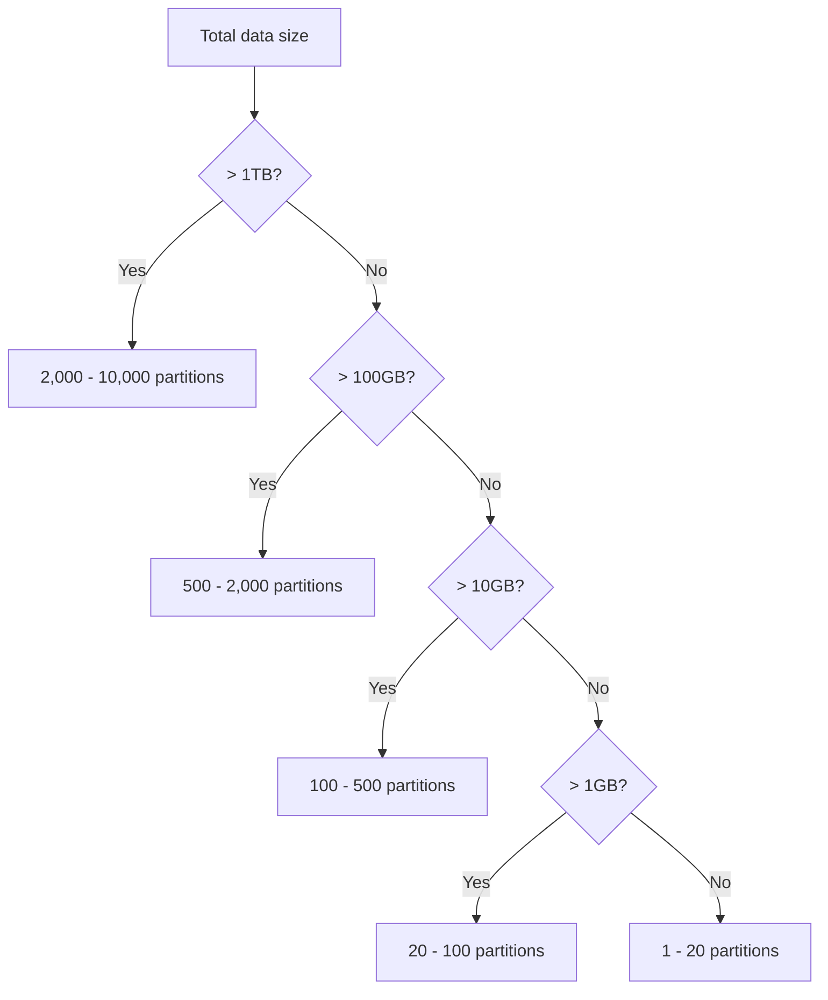

# 📋 Spark Cheatsheet — Everything at a Glance

> **Your one-page reference for Apache Spark. Pin this to your wall.**

---

## 📋 Table of Contents

- [SparkSession Setup](#sparksession-setup)
- [Reading Data](#reading-data)
- [Writing Data](#writing-data)
- [DataFrame Operations](#dataframe-operations)
- [Column Operations](#column-operations)
- [Aggregations](#aggregations)
- [Window Functions](#window-functions)
- [Joins](#joins)
- [String Functions](#string-functions)
- [Date & Time Functions](#date--time-functions)
- [Null Handling](#null-handling)
- [Type Casting](#type-casting)
- [UDFs (User-Defined Functions)](#udfs-user-defined-functions)
- [Conditional Logic](#conditional-logic)
- [Schema Operations](#schema-operations)
- [Partitioning](#partitioning)
- [Caching & Persistence](#caching--persistence)
- [SQL Integration](#sql-integration)
- [Spark Streaming Essentials](#spark-streaming-essentials)
- [Configuration Cheatsheet](#configuration-cheatsheet)
- [spark-submit Reference](#spark-submit-reference)
- [Performance Quick Reference](#performance-quick-reference)
- [Architecture Quick Reference](#architecture-quick-reference)
- [Common Errors & Fixes](#common-errors--fixes)
- [Decision Trees](#decision-trees)

---

## SparkSession Setup

```python
from pyspark.sql import SparkSession

# Basic
spark = SparkSession.builder \
    .appName("my-app") \
    .getOrCreate()

# With configuration
spark = SparkSession.builder \
    .appName("my-app") \
    .master("local[*]") \
    .config("spark.sql.adaptive.enabled", "true") \
    .config("spark.sql.shuffle.partitions", "200") \
    .config("spark.executor.memory", "8g") \
    .config("spark.driver.memory", "4g") \
    .enableHiveSupport() \
    .getOrCreate()

# Access SparkContext
sc = spark.sparkContext

# Stop
spark.stop()
```

---

## Reading Data

```python
# Parquet (recommended)
df = spark.read.parquet("path/to/data.parquet")
df = spark.read.parquet("path/to/data/")  # Directory of parquet files

# CSV
df = spark.read \
    .option("header", "true") \
    .option("inferSchema", "true") \
    .option("delimiter", ",") \
    .option("quote", '"') \
    .option("escape", '"') \
    .option("multiLine", "true") \
    .csv("path/to/data.csv")

# CSV with explicit schema (preferred in production)
from pyspark.sql.types import StructType, StructField, StringType, IntegerType, DoubleType
schema = StructType([
    StructField("name", StringType(), True),
    StructField("age", IntegerType(), True),
    StructField("salary", DoubleType(), True),
])
df = spark.read.schema(schema).csv("path/to/data.csv", header=True)

# JSON
df = spark.read.json("path/to/data.json")
df = spark.read.option("multiLine", "true").json("path/to/data.json")

# JSON Lines (one JSON object per line)
df = spark.read.json("path/to/data.jsonl")

# ORC
df = spark.read.orc("path/to/data.orc")

# JDBC (Database)
df = spark.read \
    .format("jdbc") \
    .option("url", "jdbc:postgresql://host:5432/db") \
    .option("dbtable", "schema.table") \
    .option("user", "username") \
    .option("password", "password") \
    .option("numPartitions", "10") \
    .option("fetchsize", "10000") \
    .load()

# Delta Lake
df = spark.read.format("delta").load("path/to/delta-table")
df = spark.read.format("delta").option("versionAsOf", 5).load("path/")  # Time travel

# Avro
df = spark.read.format("avro").load("path/to/data.avro")

# Text (one line per row)
df = spark.read.text("path/to/file.txt")

# From a list (for testing)
data = [("Alice", 30), ("Bob", 25)]
df = spark.createDataFrame(data, ["name", "age"])
```

---

## Writing Data

```python
# Parquet (recommended)
df.write.parquet("output/path")
df.write.mode("overwrite").parquet("output/path")
df.write.mode("append").parquet("output/path")

# With partitioning
df.write \
    .partitionBy("year", "month") \
    .mode("overwrite") \
    .parquet("output/path")

# CSV
df.write \
    .option("header", "true") \
    .mode("overwrite") \
    .csv("output/path")

# JSON
df.write.mode("overwrite").json("output/path")

# Single file output
df.coalesce(1).write.mode("overwrite").parquet("output/path")

# Control number of files
df.repartition(10).write.parquet("output/path")  # 10 files
df.coalesce(10).write.parquet("output/path")      # ≤10 files (no shuffle)

# Delta Lake
df.write.format("delta").mode("overwrite").save("output/path")

# JDBC
df.write \
    .format("jdbc") \
    .option("url", "jdbc:postgresql://host:5432/db") \
    .option("dbtable", "schema.table") \
    .option("user", "username") \
    .option("password", "password") \
    .mode("append") \
    .save()

# Bucketing (pre-sort for join optimization)
df.write \
    .bucketBy(100, "user_id") \
    .sortBy("user_id") \
    .saveAsTable("bucketed_table")
```

### Write Modes

| Mode | Behavior |
|---|---|
| `"overwrite"` | Replace existing data |
| `"append"` | Add to existing data |
| `"ignore"` | Do nothing if data exists |
| `"error"` / `"errorifexists"` | Throw error if data exists (default) |

---

## DataFrame Operations

```python
from pyspark.sql.functions import col, lit

# Show data
df.show()                  # Top 20 rows, truncated
df.show(50, truncate=False) # Top 50, no truncation

# Schema
df.printSchema()
df.dtypes                   # List of (column_name, type) tuples
df.columns                  # List of column names
df.count()                  # Number of rows

# Select columns
df.select("name", "age")
df.select(col("name"), col("age") + 1)
df.select("*")
df.select(df.columns[:5])   # First 5 columns

# Drop columns
df.drop("column1", "column2")

# Rename columns
df.withColumnRenamed("old_name", "new_name")

# Multiple renames
for old, new in [("col1", "new1"), ("col2", "new2")]:
    df = df.withColumnRenamed(old, new)

# Add columns
df.withColumn("new_col", lit(0))
df.withColumn("doubled", col("amount") * 2)

# Filter / Where (identical)
df.filter(col("age") > 25)
df.where(col("age") > 25)
df.filter("age > 25")                          # SQL string
df.filter((col("age") > 25) & (col("city") == "NYC"))  # Multiple conditions

# Distinct
df.distinct()
df.dropDuplicates()                    # Same as distinct()
df.dropDuplicates(["name", "age"])     # Deduplicate by subset of columns

# Sort / Order By
df.orderBy("age")
df.orderBy(col("age").desc())
df.orderBy(col("age").desc(), col("name").asc())
df.sort("age")  # Alias for orderBy

# Limit
df.limit(100)

# Sample
df.sample(fraction=0.1)               # 10% sample
df.sample(fraction=0.1, seed=42)      # Reproducible

# Union
df1.union(df2)                          # Columns must match by position
df1.unionByName(df2)                    # Match by column name
df1.unionByName(df2, allowMissingColumns=True)  # Fill missing with null

# Describe / Summary statistics
df.describe("age", "salary").show()    # count, mean, stddev, min, max
df.summary().show()                     # More detailed statistics
```

---

## Column Operations

```python
from pyspark.sql.functions import col, lit, expr, when

# Column references (all equivalent)
df.select("name")
df.select(col("name"))
df.select(df["name"])
df.select(df.name)

# Arithmetic
col("price") * col("quantity")
col("amount") + 100
col("total") / col("count")
col("value") % 2

# Boolean
col("age") > 25
col("status") == "active"
col("name").isNull()
col("name").isNotNull()
col("value").between(10, 100)
col("name").isin("Alice", "Bob")
col("city").like("New%")
col("description").rlike(r"\d{3}-\d{4}")  # Regex

# Combine conditions
(col("age") > 25) & (col("city") == "NYC")   # AND
(col("age") > 25) | (col("city") == "NYC")   # OR
~(col("status") == "inactive")                 # NOT

# Alias / Rename
(col("amount") * 1.1).alias("new_amount")
expr("amount * 1.1 as new_amount")

# Expression from SQL string
expr("CASE WHEN age > 25 THEN 'adult' ELSE 'young' END")
```

---

## Aggregations

```python
from pyspark.sql.functions import (
    count, countDistinct, sum as _sum, avg, mean,
    min as _min, max as _max, first, last,
    collect_list, collect_set, approx_count_distinct,
    stddev, variance, percentile_approx
)

# Basic aggregation
df.groupBy("department").agg(
    count("*").alias("total_employees"),
    countDistinct("role").alias("unique_roles"),
    _sum("salary").alias("total_salary"),
    avg("salary").alias("avg_salary"),
    _min("salary").alias("min_salary"),
    _max("salary").alias("max_salary"),
    first("name").alias("first_hire"),
    stddev("salary").alias("salary_stddev"),
    percentile_approx("salary", 0.5).alias("median_salary"),
)

# Multiple groupBy columns
df.groupBy("department", "level").count()

# Collect values into lists/sets
df.groupBy("user_id").agg(
    collect_list("product").alias("purchased_products"),
    collect_set("category").alias("unique_categories"),
)

# Approximate distinct count (faster for large data)
df.select(approx_count_distinct("user_id", rsd=0.05))

# Aggregate without groupBy
df.agg(count("*"), _sum("amount"))

# Pivot table
df.groupBy("year").pivot("quarter", ["Q1", "Q2", "Q3", "Q4"]).sum("revenue")

# Cube and Rollup (multi-dimensional aggregation)
df.cube("year", "quarter").sum("revenue")
df.rollup("year", "quarter").sum("revenue")
```

---

## Window Functions

```python
from pyspark.sql.window import Window
from pyspark.sql.functions import (
    row_number, rank, dense_rank, ntile,
    lag, lead, sum as _sum, avg, count,
    first, last, col
)

# Define window
w = Window.partitionBy("department").orderBy(col("salary").desc())

# Ranking functions
df.withColumn("row_num", row_number().over(w))    # 1, 2, 3, 4...
df.withColumn("rank", rank().over(w))              # 1, 2, 2, 4... (gaps)
df.withColumn("dense_rank", dense_rank().over(w))  # 1, 2, 2, 3... (no gaps)
df.withColumn("quartile", ntile(4).over(w))        # Split into 4 groups

# Value functions
df.withColumn("prev_salary", lag("salary", 1).over(w))
df.withColumn("next_salary", lead("salary", 1).over(w))
df.withColumn("prev_salary", lag("salary", 1, 0).over(w))  # Default value

# Aggregate windows
w_running = Window.partitionBy("user_id").orderBy("date") \
    .rowsBetween(Window.unboundedPreceding, Window.currentRow)

df.withColumn("running_total", _sum("amount").over(w_running))
df.withColumn("running_avg", avg("amount").over(w_running))

# Rolling window (last 7 days)
w_rolling = Window.partitionBy("user_id").orderBy("date_int") \
    .rangeBetween(-7, 0)
df.withColumn("7_day_avg", avg("amount").over(w_rolling))

# Unbounded window
w_full = Window.partitionBy("department")
df.withColumn("dept_avg", avg("salary").over(w_full))
df.withColumn("pct_of_dept", col("salary") / _sum("salary").over(w_full))

# Top N per group
w_top = Window.partitionBy("category").orderBy(col("revenue").desc())
df.withColumn("rank", row_number().over(w_top)).filter(col("rank") <= 3)
```

---

## Joins

```python
# Inner join (default)
df1.join(df2, "key")                          # Shared column name
df1.join(df2, df1.key == df2.key)             # Different column names
df1.join(df2, ["key1", "key2"])               # Multiple keys

# Join types
df1.join(df2, "key", "inner")       # Only matching rows
df1.join(df2, "key", "left")        # All from left, matching from right
df1.join(df2, "key", "right")       # All from right, matching from left
df1.join(df2, "key", "outer")       # All from both
df1.join(df2, "key", "left_semi")   # Left rows that have a match (like IN)
df1.join(df2, "key", "left_anti")   # Left rows that DON'T have a match (like NOT IN)
df1.crossJoin(df2)                   # Cartesian product (every row × every row)

# Broadcast join (for small tables)
from pyspark.sql.functions import broadcast
big_df.join(broadcast(small_df), "key")

# Complex join condition
df1.join(df2, (df1.id == df2.id) & (df1.date >= df2.start_date) & (df1.date <= df2.end_date))

# Self-join
from pyspark.sql.functions import col
emp = spark.table("employees")
mgr = emp.alias("mgr")
emp.alias("emp").join(
    mgr,
    col("emp.manager_id") == col("mgr.id")
)
```

### Join Strategy Hints

```python
# Force strategies
df1.join(df2.hint("broadcast"), "key")      # Broadcast
df1.join(df2.hint("merge"), "key")          # Sort-Merge
df1.join(df2.hint("shuffle_hash"), "key")   # Shuffle Hash
```

---

## String Functions

```python
from pyspark.sql.functions import (
    upper, lower, trim, ltrim, rtrim, lpad, rpad,
    length, substring, concat, concat_ws,
    regexp_extract, regexp_replace, split,
    instr, locate, translate,
    initcap, reverse, repeat as repeat_
)

df.select(
    upper("name"),                                    # ALICE
    lower("name"),                                    # alice
    trim("name"),                                     # Remove leading/trailing spaces
    length("name"),                                   # 5
    substring("name", 1, 3),                          # Ali (1-indexed)
    concat(col("first"), lit(" "), col("last")),      # Alice Smith
    concat_ws("-", "year", "month", "day"),            # 2024-01-15
    regexp_extract("email", r"@(.+)$", 1),            # gmail.com
    regexp_replace("phone", r"\D", ""),                # 5551234567
    split("csv_string", ","),                          # Array of strings
    initcap("name"),                                   # Alice
    lpad("id", 10, "0"),                               # 0000000042
)
```

---

## Date & Time Functions

```python
from pyspark.sql.functions import (
    current_date, current_timestamp,
    year, month, dayofmonth, dayofweek, dayofyear,
    hour, minute, second,
    date_add, date_sub, datediff, months_between,
    date_format, to_date, to_timestamp,
    date_trunc, last_day, next_day,
    unix_timestamp, from_unixtime
)

df.select(
    current_date(),                                    # 2024-01-15
    current_timestamp(),                               # 2024-01-15 10:30:00
    year("date_col"),                                  # 2024
    month("date_col"),                                 # 1
    dayofmonth("date_col"),                            # 15
    dayofweek("date_col"),                             # 2 (Monday)
    date_add("date_col", 7),                           # +7 days
    date_sub("date_col", 30),                          # -30 days
    datediff("end_date", "start_date"),                # Days between
    months_between("end_date", "start_date"),          # Months between
    date_format("date_col", "yyyy-MM-dd"),             # Format
    to_date("string_col", "yyyy-MM-dd"),               # String → Date
    to_timestamp("string_col", "yyyy-MM-dd HH:mm:ss"),# String → Timestamp
    date_trunc("month", "date_col"),                   # First day of month
    unix_timestamp("date_col"),                        # Unix epoch seconds
    from_unixtime(col("epoch"), "yyyy-MM-dd"),         # Epoch → String
)
```

---

## Null Handling

```python
from pyspark.sql.functions import col, coalesce, when, isnull

# Filter nulls
df.filter(col("name").isNotNull())
df.filter(col("name").isNull())
df.na.drop()                                # Drop rows with ANY null
df.na.drop(subset=["name", "age"])          # Drop if name OR age is null
df.na.drop(how="all")                       # Drop only if ALL columns are null
df.na.drop(thresh=3)                        # Keep rows with at least 3 non-null values

# Fill nulls
df.na.fill(0)                               # Fill all numeric nulls with 0
df.na.fill("unknown")                       # Fill all string nulls
df.na.fill({"name": "unknown", "age": 0})   # Column-specific fills
df.fillna(0, subset=["amount", "quantity"]) # Fill specific columns

# Coalesce (first non-null value)
df.withColumn("value", coalesce("col1", "col2", "col3"))

# Replace values
df.na.replace(["old_val1", "old_val2"], ["new_val1", "new_val2"], "column")

# Null-safe comparison (both null = equal)
df.filter(col("a").eqNullSafe(col("b")))
```

---

## Type Casting

```python
from pyspark.sql.functions import col
from pyspark.sql.types import IntegerType, DoubleType, StringType, DateType

# Cast column types
df.withColumn("age", col("age").cast("integer"))
df.withColumn("amount", col("amount").cast(DoubleType()))
df.withColumn("date", col("date_str").cast(DateType()))

# Common casts
col("value").cast("int")
col("value").cast("long")
col("value").cast("double")
col("value").cast("float")
col("value").cast("string")
col("value").cast("boolean")
col("value").cast("date")
col("value").cast("timestamp")
col("value").cast("decimal(10,2)")
```

---

## UDFs (User-Defined Functions)

```python
from pyspark.sql.functions import udf, pandas_udf
from pyspark.sql.types import StringType, IntegerType
import pandas as pd

# Regular UDF (slower — row-by-row, Python serialization)
@udf(returnType=StringType())
def classify_age(age):
    if age is None:
        return "unknown"
    return "adult" if age >= 18 else "minor"

df.withColumn("category", classify_age(col("age")))

# Pandas UDF (faster — vectorized, uses Apache Arrow)
@pandas_udf(StringType())
def classify_age_vectorized(ages: pd.Series) -> pd.Series:
    return ages.apply(lambda a: "adult" if a and a >= 18 else "minor")

df.withColumn("category", classify_age_vectorized(col("age")))

# Register UDF for SQL
spark.udf.register("classify_age", classify_age)
spark.sql("SELECT name, classify_age(age) FROM people")
```

> **⚠️ Warning:** Prefer built-in functions over UDFs whenever possible. Built-in functions use Tungsten optimization; UDFs force data serialization between JVM and Python.

---

## Conditional Logic

```python
from pyspark.sql.functions import when, col, expr

# when/otherwise (like CASE WHEN)
df.withColumn("tier",
    when(col("amount") > 1000, "premium")
    .when(col("amount") > 100, "standard")
    .otherwise("basic")
)

# Nested conditions
df.withColumn("discount",
    when((col("tier") == "premium") & (col("loyalty_years") > 5), 0.20)
    .when(col("tier") == "premium", 0.10)
    .when(col("tier") == "standard", 0.05)
    .otherwise(0.0)
)

# SQL expression
df.withColumn("tier", expr("""
    CASE
        WHEN amount > 1000 THEN 'premium'
        WHEN amount > 100 THEN 'standard'
        ELSE 'basic'
    END
"""))
```

---

## Schema Operations

```python
from pyspark.sql.types import *

# Define schema programmatically
schema = StructType([
    StructField("name", StringType(), nullable=False),
    StructField("age", IntegerType(), nullable=True),
    StructField("address", StructType([
        StructField("street", StringType()),
        StructField("city", StringType()),
        StructField("state", StringType()),
    ])),
    StructField("tags", ArrayType(StringType())),
    StructField("metadata", MapType(StringType(), StringType())),
])

# Define from DDL string
schema = "name STRING, age INT, salary DOUBLE"

# Get schema from existing DataFrame
existing_schema = df.schema

# Access nested fields
df.select("address.city")
df.select(col("address.city"))

# Flatten nested struct
df.select("name", "address.*")  # Expands address into street, city, state

# Work with arrays
from pyspark.sql.functions import explode, size, array_contains
df.select(explode("tags").alias("tag"))       # One row per tag
df.filter(array_contains("tags", "python"))    # Filter by array element
df.filter(size("tags") > 3)                    # Filter by array size

# Work with maps
from pyspark.sql.functions import map_keys, map_values
df.select(map_keys("metadata"))
df.select(col("metadata")["key1"])             # Access map value
```

---

## Partitioning

```python
# Check current partition count
df.rdd.getNumPartitions()

# Repartition (with shuffle — even distribution)
df.repartition(100)                    # By count
df.repartition(100, "key_column")      # By column (hash partitioning)
df.repartition("date")                  # By column (Spark decides count)

# Coalesce (no shuffle — merge partitions)
df.coalesce(10)                         # Reduce to 10 partitions

# Write with disk partitioning
df.write.partitionBy("year", "month").parquet("output/")

# Read with partition filter (partition pruning)
spark.read.parquet("output/").filter(col("year") == 2024)
```

### Partition Sizing Rules of Thumb

| Guideline | Value |
|---|---|
| Target partition size | 128MB - 256MB |
| Partitions per core | 2-4x |
| Max partitions | 100,000 |
| `shuffle.partitions` | Total shuffle data / 200MB |

---

## Caching & Persistence

```python
from pyspark import StorageLevel

# Cache (= MEMORY_AND_DISK)
df.cache()

# Persist with specific storage level
df.persist(StorageLevel.MEMORY_ONLY)           # Memory only, recompute if evicted
df.persist(StorageLevel.MEMORY_AND_DISK)       # Memory first, spill to disk
df.persist(StorageLevel.MEMORY_AND_DISK_SER)   # Serialized — less memory, more CPU
df.persist(StorageLevel.DISK_ONLY)             # Disk only
df.persist(StorageLevel.OFF_HEAP)              # Off-heap memory (Tungsten)

# Unpersist (free memory)
df.unpersist()

# Check if cached
df.is_cached

# Checkpoint (reliable storage, breaks lineage)
spark.sparkContext.setCheckpointDir("s3://checkpoints/")
df.checkpoint()                                 # Eager
df.checkpoint(eager=False)                      # Lazy

# Cache a table
df.createOrReplaceTempView("my_table")
spark.sql("CACHE TABLE my_table")
spark.sql("UNCACHE TABLE my_table")
```

---

## SQL Integration

```python
# Register DataFrame as temp view
df.createOrReplaceTempView("events")
df.createOrReplaceGlobalTempView("global_events")

# Run SQL queries
result = spark.sql("""
    SELECT 
        category,
        COUNT(*) as event_count,
        SUM(amount) as total_amount
    FROM events
    WHERE date >= '2024-01-01'
    GROUP BY category
    HAVING COUNT(*) > 100
    ORDER BY total_amount DESC
""")

# Mix SQL and DataFrame API
spark.sql("SELECT * FROM events WHERE status = 'active'") \
    .groupBy("category") \
    .agg(_sum("amount").alias("total"))

# Read Hive tables
df = spark.table("database.table_name")
spark.sql("SHOW DATABASES")
spark.sql("SHOW TABLES IN my_database")
spark.sql("DESCRIBE TABLE my_table")

# Create managed table
df.write.saveAsTable("my_database.my_table")
```

---

## Spark Streaming Essentials

```python
# Read from Kafka
stream_df = spark.readStream \
    .format("kafka") \
    .option("kafka.bootstrap.servers", "broker:9092") \
    .option("subscribe", "topic-name") \
    .option("startingOffsets", "latest") \
    .load()

# Parse Kafka values
from pyspark.sql.functions import from_json, col
parsed = stream_df.select(
    from_json(col("value").cast("string"), schema).alias("data")
).select("data.*")

# Read from files (auto-discovery of new files)
stream_df = spark.readStream \
    .format("parquet") \
    .schema(schema) \
    .option("maxFilesPerTrigger", 100) \
    .load("s3://data/events/")

# Read from socket (testing only)
stream_df = spark.readStream \
    .format("socket") \
    .option("host", "localhost") \
    .option("port", 9999) \
    .load()

# Watermark + Window aggregation
from pyspark.sql.functions import window
result = stream_df \
    .withWatermark("event_time", "10 minutes") \
    .groupBy(
        window("event_time", "5 minutes"),
        "device_id"
    ).count()

# Write stream to console (testing)
query = result.writeStream \
    .format("console") \
    .outputMode("complete") \
    .trigger(processingTime="10 seconds") \
    .start()

# Write stream to Kafka
query = result.writeStream \
    .format("kafka") \
    .option("kafka.bootstrap.servers", "broker:9092") \
    .option("topic", "output-topic") \
    .option("checkpointLocation", "s3://checkpoints/query1/") \
    .outputMode("append") \
    .start()

# Write stream to files
query = result.writeStream \
    .format("parquet") \
    .option("path", "s3://output/streaming/") \
    .option("checkpointLocation", "s3://checkpoints/query1/") \
    .partitionBy("date") \
    .trigger(processingTime="1 minute") \
    .start()

# foreachBatch — custom sink logic
def process_batch(batch_df, batch_id):
    batch_df.write.mode("append").parquet("output/")
    # Can also write to databases, APIs, etc.

query = result.writeStream \
    .foreachBatch(process_batch) \
    .option("checkpointLocation", "s3://checkpoints/query1/") \
    .start()

# Monitor running queries
query.status
query.lastProgress
query.awaitTermination()
query.stop()
```

### Output Modes

| Mode | Behavior | Use With |
|---|---|---|
| `"append"` | Only new rows (default) | No aggregations, or aggregations with watermark |
| `"complete"` | All rows every trigger | Aggregations |
| `"update"` | Only changed rows | Aggregations with watermark |

### Trigger Types

| Trigger | Description |
|---|---|
| `processingTime="10 seconds"` | Micro-batch every 10 seconds |
| `once=True` | Single micro-batch then stop |
| `availableNow=True` | Process all available data then stop |
| `continuous="1 second"` | Continuous (experimental, ~1ms latency) |

---

## Configuration Cheatsheet

### Essential Configs

| Config | Default | Description |
|---|---|---|
| `spark.executor.memory` | `1g` | Executor heap memory |
| `spark.executor.cores` | `1` | Cores per executor |
| `spark.executor.instances` | `2` | Number of executors (static) |
| `spark.driver.memory` | `1g` | Driver heap memory |
| `spark.driver.cores` | `1` | Driver cores |
| `spark.sql.shuffle.partitions` | `200` | Partitions after shuffle |
| `spark.default.parallelism` | `Total cores` | Default RDD partitions |

### Performance Configs

| Config | Recommended | Description |
|---|---|---|
| `spark.sql.adaptive.enabled` | `true` | Enable AQE |
| `spark.sql.adaptive.coalescePartitions.enabled` | `true` | Auto-coalesce shuffle partitions |
| `spark.sql.adaptive.skewJoin.enabled` | `true` | Auto-handle skewed joins |
| `spark.sql.autoBroadcastJoinThreshold` | `10485760` (10MB) | Broadcast threshold |
| `spark.serializer` | `org.apache.spark.serializer.KryoSerializer` | Use Kryo (faster) |
| `spark.sql.parquet.filterPushdown` | `true` | Enable predicate pushdown |
| `spark.sql.files.maxPartitionBytes` | `128MB` | Max partition size for file reads |

### Dynamic Allocation Configs

| Config | Value | Description |
|---|---|---|
| `spark.dynamicAllocation.enabled` | `true` | Enable auto-scaling |
| `spark.dynamicAllocation.minExecutors` | `5` | Minimum executors |
| `spark.dynamicAllocation.maxExecutors` | `100` | Maximum executors |
| `spark.dynamicAllocation.executorIdleTimeout` | `60s` | Remove idle executors after |
| `spark.dynamicAllocation.schedulerBacklogTimeout` | `1s` | Add executors when tasks pending |
| `spark.shuffle.service.enabled` | `true` | Required for dynamic allocation |

---

## spark-submit Reference

```bash
spark-submit \
    --master yarn \                          # yarn | local[*] | k8s://... | spark://...
    --deploy-mode cluster \                  # cluster | client
    --name "my-job" \                        # Application name
    --num-executors 20 \                     # Number of executors
    --executor-cores 5 \                     # Cores per executor
    --executor-memory 16g \                  # Executor memory
    --driver-memory 8g \                     # Driver memory
    --driver-cores 4 \                       # Driver cores
    --conf spark.sql.adaptive.enabled=true \
    --conf spark.dynamicAllocation.enabled=true \
    --conf spark.serializer=org.apache.spark.serializer.KryoSerializer \
    --packages org.apache.spark:spark-sql-kafka-0-10_2.12:3.4.0 \
    --jars extra-lib.jar \
    --py-files utils.zip \                   # Python files to distribute
    --files config.yaml \                    # Files available to executors
    --archives env.tar.gz#env \              # Archives extracted on executors
    my_job.py \                              # Main script
    --date 2024-01-15 --env prod             # Application arguments
```

### Master Options

| Master | Description |
|---|---|
| `local` | 1 thread |
| `local[4]` | 4 threads |
| `local[*]` | All available cores |
| `yarn` | YARN cluster |
| `k8s://https://host:port` | Kubernetes |
| `spark://host:7077` | Standalone cluster |

---

## Performance Quick Reference

### The Golden Rules



### When to Use What

| Situation | Solution |
|---|---|
| Small table join | `broadcast()` join |
| Large-large join | Sort-merge join (default) |
| Data skew | AQE skew join or salt keys |
| Too many small files | `coalesce()` before write |
| Job runs daily on same data | Cache/persist the shared DataFrame |
| 100+ stage lineage | `checkpoint()` |
| CSV input files | Convert to Parquet once, read Parquet always |
| Need to reduce costs | Dynamic allocation + spot instances |
| Slow reads from S3/HDFS | Check partition pruning, increase `maxPartitionBytes` |

---

## Architecture Quick Reference

### Execution Flow



### Key Relationships

| Concept | Contains | Determined By |
|---|---|---|
| **Application** | 1+ Jobs | Your spark-submit |
| **Job** | 1+ Stages | Each action = 1 job |
| **Stage** | 1+ Tasks | Split at shuffle boundaries |
| **Task** | 1 partition of work | 1 task per partition per stage |
| **Executor** | Runs multiple tasks | Cluster manager assigns |

### Memory Layout (Per Executor)

```
┌─────────────────────────────────────┐
│        Executor Memory              │
├──────────────────────┬──────────────┤
│   Spark Memory (60%) │ User (40%)   │
├───────────┬──────────┤              │
│ Execution │ Storage  │              │
│ (shared)  │ (shared) │              │
│ Shuffles  │ Cache    │ Your objects │
│ Joins     │ Broadcast│ UDF data     │
│ Sorts     │          │              │
├───────────┴──────────┴──────────────┤
│         Reserved (300MB)            │
└─────────────────────────────────────┘
```

---

## Common Errors & Fixes

| Error | Cause | Fix |
|---|---|---|
| `java.lang.OutOfMemoryError: Java heap space` | Executor or driver OOM | Increase memory; reduce partition size; avoid `collect()` |
| `org.apache.spark.SparkException: Task not serializable` | UDF references non-serializable object | Use `broadcast()` for shared data; make objects serializable |
| `AnalysisException: cannot resolve column` | Column name typo or case issue | Check `df.columns`; use backticks for special chars |
| `Container killed by YARN for exceeding memory limits` | Off-heap memory exceeded | Increase `spark.executor.memoryOverhead` |
| `FileNotFoundException` or `Path does not exist` | Wrong path or data not ready | Check path; add data availability wait |
| `Connection refused` | Can't connect to cluster/service | Check network; verify cluster is running |
| `Py4JJavaError: NullPointerException` | Null in non-nullable operation | Add null checks; use `coalesce()` or `na.fill()` |
| `SketchAgg: value out of range` | Numeric overflow in aggregation | Cast to `LongType` or `DoubleType` before aggregation |
| `Too many open files` | Shuffle creates too many files | Reduce partition count; increase OS file limit |
| `FetchFailedException` | Executor lost during shuffle | Enable external shuffle service; increase retry configs |

---

## Decision Trees

### Which File Format?



### Which Join Strategy?



### How Many Partitions?



---

**[← Previous: 15-spark-interview-guide.md](15-spark-interview-guide.md) | [Home](../README.md)**
