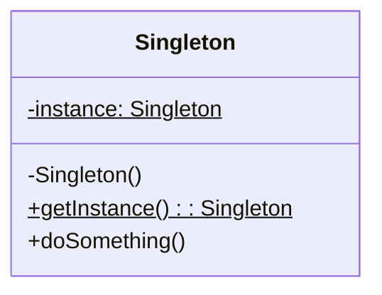
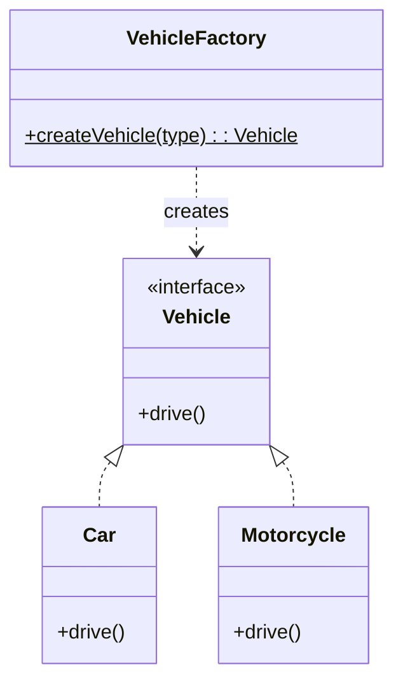
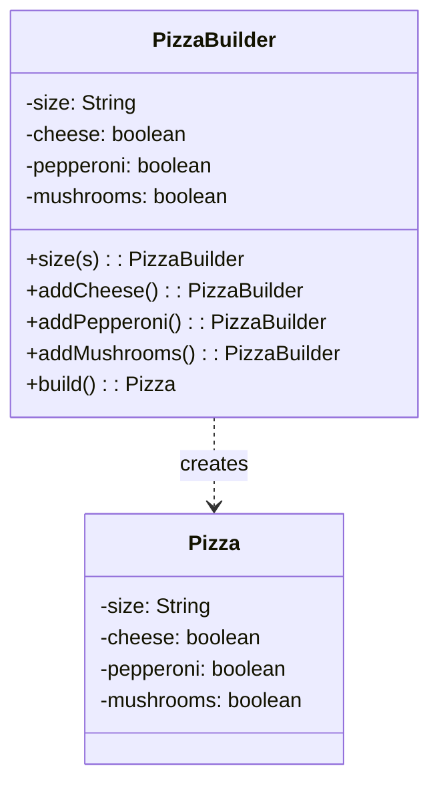

[🏠 Home](../../README.md) | [⬅️ Patterns Overview](./00-patterns-overview.md) | [➡️ Structural Patterns](./02-structural-patterns.md)

# 🏭 Creational Design Patterns

> Patterns that deal with object creation mechanisms

---

## 1. Singleton Pattern

### Intent
Ensure a class has **only one instance** and provide a global point of access to it.

### When to Use
- Database connection pools
- Logger instances
- Configuration managers
- Thread pools

### Class Diagram



### Implementation (Thread-Safe)

```java
public class DatabaseConnection {
    private static volatile DatabaseConnection instance;
    private Connection connection;

    private DatabaseConnection() {
        // Private constructor prevents instantiation
        this.connection = createConnection();
    }

    public static DatabaseConnection getInstance() {
        if (instance == null) {
            synchronized (DatabaseConnection.class) {
                if (instance == null) {
                    instance = new DatabaseConnection();
                }
            }
        }
        return instance;
    }

    private Connection createConnection() {
        // Create actual database connection
        return null;
    }

    public void executeQuery(String sql) {
        System.out.println("Executing: " + sql);
    }
}

// Usage
DatabaseConnection db = DatabaseConnection.getInstance();
db.executeQuery("SELECT * FROM users");
```

### Using Enum (Best Practice)

```java
public enum Logger {
    INSTANCE;

    public void log(String message) {
        System.out.println("[LOG] " + message);
    }
}

// Usage
Logger.INSTANCE.log("Application started");
```

> [!TIP]
> **Enum Singleton** is the best approach - it's thread-safe, handles serialization, and prevents reflection attacks.

---

## 2. Factory Method Pattern

### Intent
Define an interface for creating objects, but let subclasses decide which class to instantiate.

### When to Use
- Creating different types of vehicles, documents, notifications
- When exact types aren't known until runtime
- To decouple object creation from usage

### Class Diagram



### Implementation

```java
// Product interface
public interface Vehicle {
    void drive();
    double getFuelEfficiency();
}

// Concrete products
public class Car implements Vehicle {
    @Override
    public void drive() {
        System.out.println("Driving a car 🚗");
    }

    @Override
    public double getFuelEfficiency() {
        return 15.0; // km per liter
    }
}

public class Motorcycle implements Vehicle {
    @Override
    public void drive() {
        System.out.println("Riding a motorcycle 🏍️");
    }

    @Override
    public double getFuelEfficiency() {
        return 40.0;
    }
}

public class Truck implements Vehicle {
    @Override
    public void drive() {
        System.out.println("Driving a truck 🚚");
    }

    @Override
    public double getFuelEfficiency() {
        return 8.0;
    }
}

// Factory
public class VehicleFactory {
    public static Vehicle createVehicle(VehicleType type) {
        return switch (type) {
            case CAR -> new Car();
            case MOTORCYCLE -> new Motorcycle();
            case TRUCK -> new Truck();
        };
    }
}

public enum VehicleType {
    CAR, MOTORCYCLE, TRUCK
}

// Usage
Vehicle vehicle = VehicleFactory.createVehicle(VehicleType.CAR);
vehicle.drive();
```

### Real-World Example: Notification Factory

```java
public interface Notification {
    void send(String message);
}

public class EmailNotification implements Notification {
    @Override
    public void send(String message) {
        System.out.println("Email: " + message);
    }
}

public class SMSNotification implements Notification {
    @Override
    public void send(String message) {
        System.out.println("SMS: " + message);
    }
}

public class PushNotification implements Notification {
    @Override
    public void send(String message) {
        System.out.println("Push: " + message);
    }
}

public class NotificationFactory {
    public static Notification create(String channel) {
        return switch (channel.toUpperCase()) {
            case "EMAIL" -> new EmailNotification();
            case "SMS" -> new SMSNotification();
            case "PUSH" -> new PushNotification();
            default -> throw new IllegalArgumentException("Unknown channel: " + channel);
        };
    }
}
```

---

## 3. Builder Pattern

### Intent
Separate the construction of a complex object from its representation, allowing the same construction process to create different representations.

### When to Use
- Object has many optional parameters
- Avoid telescope constructors
- Create immutable objects with many fields
- Step-by-step construction

### Class Diagram



### Implementation

```java
public class Pizza {
    private final String size;
    private final boolean cheese;
    private final boolean pepperoni;
    private final boolean mushrooms;
    private final boolean olives;
    private final boolean onions;

    private Pizza(Builder builder) {
        this.size = builder.size;
        this.cheese = builder.cheese;
        this.pepperoni = builder.pepperoni;
        this.mushrooms = builder.mushrooms;
        this.olives = builder.olives;
        this.onions = builder.onions;
    }

    @Override
    public String toString() {
        StringBuilder sb = new StringBuilder();
        sb.append(size).append(" pizza with:");
        if (cheese) sb.append(" cheese");
        if (pepperoni) sb.append(" pepperoni");
        if (mushrooms) sb.append(" mushrooms");
        if (olives) sb.append(" olives");
        if (onions) sb.append(" onions");
        return sb.toString();
    }

    public static class Builder {
        private final String size; // Required
        private boolean cheese = false;
        private boolean pepperoni = false;
        private boolean mushrooms = false;
        private boolean olives = false;
        private boolean onions = false;

        public Builder(String size) {
            this.size = size;
        }

        public Builder cheese() {
            this.cheese = true;
            return this;
        }

        public Builder pepperoni() {
            this.pepperoni = true;
            return this;
        }

        public Builder mushrooms() {
            this.mushrooms = true;
            return this;
        }

        public Builder olives() {
            this.olives = true;
            return this;
        }

        public Builder onions() {
            this.onions = true;
            return this;
        }

        public Pizza build() {
            return new Pizza(this);
        }
    }
}

// Usage
Pizza pizza = new Pizza.Builder("Large")
        .cheese()
        .pepperoni()
        .mushrooms()
        .build();

System.out.println(pizza);
// Output: Large pizza with: cheese pepperoni mushrooms
```

### Real-World Example: Query Builder

```java
public class SQLQuery {
    private final String table;
    private final List<String> columns;
    private final String whereClause;
    private final String orderBy;
    private final Integer limit;

    private SQLQuery(Builder builder) {
        this.table = builder.table;
        this.columns = builder.columns;
        this.whereClause = builder.whereClause;
        this.orderBy = builder.orderBy;
        this.limit = builder.limit;
    }

    public String toSQL() {
        StringBuilder sql = new StringBuilder("SELECT ");
        sql.append(columns.isEmpty() ? "*" : String.join(", ", columns));
        sql.append(" FROM ").append(table);
        if (whereClause != null) sql.append(" WHERE ").append(whereClause);
        if (orderBy != null) sql.append(" ORDER BY ").append(orderBy);
        if (limit != null) sql.append(" LIMIT ").append(limit);
        return sql.toString();
    }

    public static class Builder {
        private final String table;
        private List<String> columns = new ArrayList<>();
        private String whereClause;
        private String orderBy;
        private Integer limit;

        public Builder(String table) {
            this.table = table;
        }

        public Builder select(String... cols) {
            this.columns = Arrays.asList(cols);
            return this;
        }

        public Builder where(String condition) {
            this.whereClause = condition;
            return this;
        }

        public Builder orderBy(String column) {
            this.orderBy = column;
            return this;
        }

        public Builder limit(int n) {
            this.limit = n;
            return this;
        }

        public SQLQuery build() {
            return new SQLQuery(this);
        }
    }
}

// Usage
SQLQuery query = new SQLQuery.Builder("users")
        .select("id", "name", "email")
        .where("active = true")
        .orderBy("created_at DESC")
        .limit(10)
        .build();

System.out.println(query.toSQL());
// SELECT id, name, email FROM users WHERE active = true ORDER BY created_at DESC LIMIT 10
```

---

## 4. Prototype Pattern

### Intent
Create new objects by copying an existing object (prototype) rather than creating from scratch.

### When to Use
- Object creation is expensive (DB queries, network calls)
- Need copies of objects with slight variations
- Avoid subclassing for object creation

### Implementation

```java
public abstract class Shape implements Cloneable {
    protected String color;
    protected int x, y;

    public Shape() {}

    public Shape(Shape source) {
        this.color = source.color;
        this.x = source.x;
        this.y = source.y;
    }

    public abstract Shape clone();

    public void setColor(String color) { this.color = color; }
    public void setPosition(int x, int y) { this.x = x; this.y = y; }
}

public class Circle extends Shape {
    private int radius;

    public Circle() {}

    public Circle(Circle source) {
        super(source);
        this.radius = source.radius;
    }

    public void setRadius(int radius) { this.radius = radius; }

    @Override
    public Circle clone() {
        return new Circle(this);
    }

    @Override
    public String toString() {
        return String.format("Circle[color=%s, x=%d, y=%d, radius=%d]", 
                             color, x, y, radius);
    }
}

// Usage
Circle original = new Circle();
original.setColor("Red");
original.setPosition(10, 20);
original.setRadius(15);

Circle copy = original.clone();
copy.setColor("Blue");  // Modify copy

System.out.println(original); // Circle[color=Red, x=10, y=20, radius=15]
System.out.println(copy);     // Circle[color=Blue, x=10, y=20, radius=15]
```

---

## 📊 Comparison Table

| Pattern | Problem | Solution | Key Benefit |
|---------|---------|----------|-------------|
| Singleton | Multiple instances | One global instance | Resource sharing |
| Factory | Unknown types at compile time | Centralized creation | Loose coupling |
| Builder | Many constructor parameters | Step-by-step building | Readable, immutable |
| Prototype | Expensive object creation | Clone existing object | Performance |

---

## 📝 Interview Questions

### Q1: When would you use Builder over Factory?

**Answer**: Use **Builder** when creating a single complex object with many optional parameters. Use **Factory** when you need to create different types of related objects based on input.

### Q2: What are the drawbacks of Singleton?

**Answer**:
- Makes unit testing difficult (global state)
- Hides dependencies
- Violates Single Responsibility Principle
- Can cause issues in multi-threaded environments if not properly implemented

### Q3: How is Prototype different from clone()?

**Answer**: Prototype is a design pattern that provides a way to copy objects without knowing their concrete classes. `clone()` is Java's native method that Prototype pattern often uses for implementation.

---

*Next: [Structural Patterns →](./02-structural-patterns.md)*
