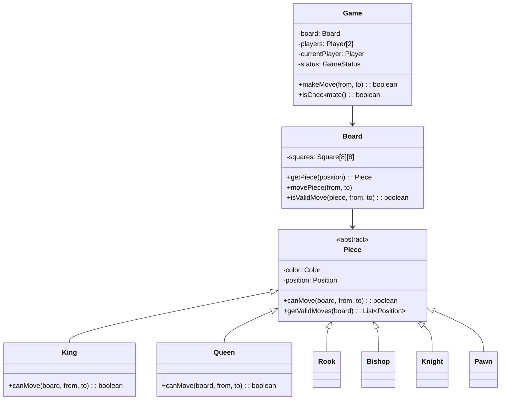

[🏠 Home](../../README.md) | [⬅️ Vending Machine](./04-vending-machine.md) | [➡️ Expense Splitter](./06-expense-splitter.md)

# ♟️ Chess Game Design

> Design a two-player chess game

---

## 📋 Requirements

### Functional Requirements
1. 8x8 board with standard pieces
2. Two players (White and Black)
3. Validate moves for each piece type
4. Detect check, checkmate, stalemate
5. Track captured pieces
6. Support castling, en passant, pawn promotion

---

## 🎯 Class Diagram



---

## 💻 Implementation

### Enums and Position

```java
public enum Color {
    WHITE, BLACK
}

public enum GameStatus {
    ACTIVE,
    WHITE_WIN,
    BLACK_WIN,
    STALEMATE,
    RESIGNED
}

public class Position {
    private final int row;
    private final int col;

    public Position(int row, int col) {
        this.row = row;
        this.col = col;
    }

    public boolean isValid() {
        return row >= 0 && row < 8 && col >= 0 && col < 8;
    }

    public static Position fromNotation(String notation) {
        // e.g., "e2" -> Position(1, 4)
        int col = notation.charAt(0) - 'a';
        int row = notation.charAt(1) - '1';
        return new Position(row, col);
    }

    public String toNotation() {
        return "" + (char)('a' + col) + (row + 1);
    }

    public int getRow() { return row; }
    public int getCol() { return col; }

    @Override
    public boolean equals(Object o) {
        if (this == o) return true;
        if (o == null || getClass() != o.getClass()) return false;
        Position position = (Position) o;
        return row == position.row && col == position.col;
    }

    @Override
    public int hashCode() {
        return Objects.hash(row, col);
    }
}
```

### Abstract Piece Class

```java
public abstract class Piece {
    protected Color color;
    protected Position position;
    protected boolean hasMoved;

    public Piece(Color color, Position position) {
        this.color = color;
        this.position = position;
        this.hasMoved = false;
    }

    public abstract boolean canMove(Board board, Position from, Position to);
    public abstract List<Position> getValidMoves(Board board);
    public abstract char getSymbol();

    protected boolean isPathClear(Board board, Position from, Position to) {
        int rowDir = Integer.compare(to.getRow(), from.getRow());
        int colDir = Integer.compare(to.getCol(), from.getCol());

        int row = from.getRow() + rowDir;
        int col = from.getCol() + colDir;

        while (row != to.getRow() || col != to.getCol()) {
            if (board.getPiece(new Position(row, col)) != null) {
                return false;
            }
            row += rowDir;
            col += colDir;
        }
        return true;
    }

    protected boolean canCapture(Board board, Position to) {
        Piece target = board.getPiece(to);
        return target == null || target.getColor() != this.color;
    }

    public Color getColor() { return color; }
    public Position getPosition() { return position; }
    public void setPosition(Position position) { 
        this.position = position; 
        this.hasMoved = true;
    }
    public boolean hasMoved() { return hasMoved; }
}
```

### Piece Implementations

```java
public class King extends Piece {
    public King(Color color, Position position) {
        super(color, position);
    }

    @Override
    public boolean canMove(Board board, Position from, Position to) {
        int rowDiff = Math.abs(to.getRow() - from.getRow());
        int colDiff = Math.abs(to.getCol() - from.getCol());

        // Normal king move (one square any direction)
        if (rowDiff <= 1 && colDiff <= 1 && (rowDiff + colDiff > 0)) {
            return canCapture(board, to);
        }

        // Castling (simplified)
        if (!hasMoved && rowDiff == 0 && colDiff == 2) {
            return canCastle(board, from, to);
        }

        return false;
    }

    private boolean canCastle(Board board, Position from, Position to) {
        // Simplified castling check
        int rookCol = to.getCol() > from.getCol() ? 7 : 0;
        Piece rook = board.getPiece(new Position(from.getRow(), rookCol));
        
        if (rook == null || !(rook instanceof Rook) || rook.hasMoved()) {
            return false;
        }
        
        return isPathClear(board, from, new Position(from.getRow(), rookCol));
    }

    @Override
    public List<Position> getValidMoves(Board board) {
        List<Position> moves = new ArrayList<>();
        int[][] directions = {{-1,-1}, {-1,0}, {-1,1}, {0,-1}, {0,1}, {1,-1}, {1,0}, {1,1}};
        
        for (int[] dir : directions) {
            Position newPos = new Position(position.getRow() + dir[0], position.getCol() + dir[1]);
            if (newPos.isValid() && canMove(board, position, newPos)) {
                moves.add(newPos);
            }
        }
        return moves;
    }

    @Override
    public char getSymbol() { return color == Color.WHITE ? 'K' : 'k'; }
}

public class Queen extends Piece {
    public Queen(Color color, Position position) {
        super(color, position);
    }

    @Override
    public boolean canMove(Board board, Position from, Position to) {
        int rowDiff = Math.abs(to.getRow() - from.getRow());
        int colDiff = Math.abs(to.getCol() - from.getCol());

        // Queen moves like rook OR bishop
        boolean straightLine = (rowDiff == 0 || colDiff == 0);
        boolean diagonal = (rowDiff == colDiff);

        if (straightLine || diagonal) {
            return isPathClear(board, from, to) && canCapture(board, to);
        }
        return false;
    }

    @Override
    public List<Position> getValidMoves(Board board) {
        List<Position> moves = new ArrayList<>();
        int[][] directions = {{-1,-1}, {-1,0}, {-1,1}, {0,-1}, {0,1}, {1,-1}, {1,0}, {1,1}};
        
        for (int[] dir : directions) {
            for (int i = 1; i < 8; i++) {
                Position newPos = new Position(position.getRow() + dir[0]*i, position.getCol() + dir[1]*i);
                if (!newPos.isValid()) break;
                if (canMove(board, position, newPos)) {
                    moves.add(newPos);
                }
                if (board.getPiece(newPos) != null) break;
            }
        }
        return moves;
    }

    @Override
    public char getSymbol() { return color == Color.WHITE ? 'Q' : 'q'; }
}

public class Rook extends Piece {
    public Rook(Color color, Position position) {
        super(color, position);
    }

    @Override
    public boolean canMove(Board board, Position from, Position to) {
        boolean straightLine = (from.getRow() == to.getRow() || from.getCol() == to.getCol());
        return straightLine && isPathClear(board, from, to) && canCapture(board, to);
    }

    @Override
    public List<Position> getValidMoves(Board board) {
        List<Position> moves = new ArrayList<>();
        int[][] directions = {{-1,0}, {1,0}, {0,-1}, {0,1}};
        
        for (int[] dir : directions) {
            for (int i = 1; i < 8; i++) {
                Position newPos = new Position(position.getRow() + dir[0]*i, position.getCol() + dir[1]*i);
                if (!newPos.isValid()) break;
                if (canMove(board, position, newPos)) {
                    moves.add(newPos);
                }
                if (board.getPiece(newPos) != null) break;
            }
        }
        return moves;
    }

    @Override
    public char getSymbol() { return color == Color.WHITE ? 'R' : 'r'; }
}

public class Knight extends Piece {
    public Knight(Color color, Position position) {
        super(color, position);
    }

    @Override
    public boolean canMove(Board board, Position from, Position to) {
        int rowDiff = Math.abs(to.getRow() - from.getRow());
        int colDiff = Math.abs(to.getCol() - from.getCol());

        // L-shape: 2+1 squares
        boolean lShape = (rowDiff == 2 && colDiff == 1) || (rowDiff == 1 && colDiff == 2);
        return lShape && canCapture(board, to);
    }

    @Override
    public List<Position> getValidMoves(Board board) {
        List<Position> moves = new ArrayList<>();
        int[][] jumps = {{-2,-1}, {-2,1}, {-1,-2}, {-1,2}, {1,-2}, {1,2}, {2,-1}, {2,1}};
        
        for (int[] jump : jumps) {
            Position newPos = new Position(position.getRow() + jump[0], position.getCol() + jump[1]);
            if (newPos.isValid() && canMove(board, position, newPos)) {
                moves.add(newPos);
            }
        }
        return moves;
    }

    @Override
    public char getSymbol() { return color == Color.WHITE ? 'N' : 'n'; }
}

public class Pawn extends Piece {
    public Pawn(Color color, Position position) {
        super(color, position);
    }

    @Override
    public boolean canMove(Board board, Position from, Position to) {
        int direction = (color == Color.WHITE) ? 1 : -1;
        int rowDiff = to.getRow() - from.getRow();
        int colDiff = Math.abs(to.getCol() - from.getCol());

        // Forward move
        if (colDiff == 0 && board.getPiece(to) == null) {
            if (rowDiff == direction) return true;
            if (!hasMoved && rowDiff == 2 * direction) {
                Position middle = new Position(from.getRow() + direction, from.getCol());
                return board.getPiece(middle) == null;
            }
        }

        // Diagonal capture
        if (colDiff == 1 && rowDiff == direction) {
            Piece target = board.getPiece(to);
            return target != null && target.getColor() != this.color;
        }

        return false;
    }

    @Override
    public List<Position> getValidMoves(Board board) {
        List<Position> moves = new ArrayList<>();
        int direction = (color == Color.WHITE) ? 1 : -1;
        
        // Forward moves
        Position forward = new Position(position.getRow() + direction, position.getCol());
        if (forward.isValid() && canMove(board, position, forward)) {
            moves.add(forward);
        }
        
        // Double forward on first move
        if (!hasMoved) {
            Position doubleForward = new Position(position.getRow() + 2*direction, position.getCol());
            if (doubleForward.isValid() && canMove(board, position, doubleForward)) {
                moves.add(doubleForward);
            }
        }
        
        // Diagonal captures
        for (int dc : new int[]{-1, 1}) {
            Position diag = new Position(position.getRow() + direction, position.getCol() + dc);
            if (diag.isValid() && canMove(board, position, diag)) {
                moves.add(diag);
            }
        }
        
        return moves;
    }

    @Override
    public char getSymbol() { return color == Color.WHITE ? 'P' : 'p'; }
}

public class Bishop extends Piece {
    public Bishop(Color color, Position position) {
        super(color, position);
    }

    @Override
    public boolean canMove(Board board, Position from, Position to) {
        int rowDiff = Math.abs(to.getRow() - from.getRow());
        int colDiff = Math.abs(to.getCol() - from.getCol());
        return rowDiff == colDiff && rowDiff > 0 && isPathClear(board, from, to) && canCapture(board, to);
    }

    @Override
    public List<Position> getValidMoves(Board board) {
        List<Position> moves = new ArrayList<>();
        int[][] directions = {{-1,-1}, {-1,1}, {1,-1}, {1,1}};
        
        for (int[] dir : directions) {
            for (int i = 1; i < 8; i++) {
                Position newPos = new Position(position.getRow() + dir[0]*i, position.getCol() + dir[1]*i);
                if (!newPos.isValid()) break;
                if (canMove(board, position, newPos)) {
                    moves.add(newPos);
                }
                if (board.getPiece(newPos) != null) break;
            }
        }
        return moves;
    }

    @Override
    public char getSymbol() { return color == Color.WHITE ? 'B' : 'b'; }
}
```

### Board Class

```java
public class Board {
    private final Piece[][] squares;
    private final List<Piece> capturedPieces;

    public Board() {
        this.squares = new Piece[8][8];
        this.capturedPieces = new ArrayList<>();
        setupPieces();
    }

    private void setupPieces() {
        // Setup white pieces
        squares[0][0] = new Rook(Color.WHITE, new Position(0, 0));
        squares[0][1] = new Knight(Color.WHITE, new Position(0, 1));
        squares[0][2] = new Bishop(Color.WHITE, new Position(0, 2));
        squares[0][3] = new Queen(Color.WHITE, new Position(0, 3));
        squares[0][4] = new King(Color.WHITE, new Position(0, 4));
        squares[0][5] = new Bishop(Color.WHITE, new Position(0, 5));
        squares[0][6] = new Knight(Color.WHITE, new Position(0, 6));
        squares[0][7] = new Rook(Color.WHITE, new Position(0, 7));
        for (int i = 0; i < 8; i++) {
            squares[1][i] = new Pawn(Color.WHITE, new Position(1, i));
        }

        // Setup black pieces
        squares[7][0] = new Rook(Color.BLACK, new Position(7, 0));
        squares[7][1] = new Knight(Color.BLACK, new Position(7, 1));
        squares[7][2] = new Bishop(Color.BLACK, new Position(7, 2));
        squares[7][3] = new Queen(Color.BLACK, new Position(7, 3));
        squares[7][4] = new King(Color.BLACK, new Position(7, 4));
        squares[7][5] = new Bishop(Color.BLACK, new Position(7, 5));
        squares[7][6] = new Knight(Color.BLACK, new Position(7, 6));
        squares[7][7] = new Rook(Color.BLACK, new Position(7, 7));
        for (int i = 0; i < 8; i++) {
            squares[6][i] = new Pawn(Color.BLACK, new Position(6, i));
        }
    }

    public Piece getPiece(Position pos) {
        if (!pos.isValid()) return null;
        return squares[pos.getRow()][pos.getCol()];
    }

    public boolean movePiece(Position from, Position to) {
        Piece piece = getPiece(from);
        if (piece == null) return false;

        Piece captured = getPiece(to);
        if (captured != null) {
            capturedPieces.add(captured);
        }

        squares[to.getRow()][to.getCol()] = piece;
        squares[from.getRow()][from.getCol()] = null;
        piece.setPosition(to);

        return true;
    }

    public void display() {
        System.out.println("\n   a b c d e f g h");
        System.out.println("  +-+-+-+-+-+-+-+-+");
        for (int row = 7; row >= 0; row--) {
            System.out.print((row + 1) + " |");
            for (int col = 0; col < 8; col++) {
                Piece piece = squares[row][col];
                System.out.print(piece == null ? "." : piece.getSymbol());
                System.out.print("|");
            }
            System.out.println(" " + (row + 1));
        }
        System.out.println("  +-+-+-+-+-+-+-+-+");
        System.out.println("   a b c d e f g h\n");
    }
}
```

### Game Class

```java
public class Game {
    private final Board board;
    private final Player whitePlayer;
    private final Player blackPlayer;
    private Player currentPlayer;
    private GameStatus status;
    private final List<String> moveHistory;

    public Game(String player1Name, String player2Name) {
        this.board = new Board();
        this.whitePlayer = new Player(player1Name, Color.WHITE);
        this.blackPlayer = new Player(player2Name, Color.BLACK);
        this.currentPlayer = whitePlayer;
        this.status = GameStatus.ACTIVE;
        this.moveHistory = new ArrayList<>();
    }

    public boolean makeMove(String from, String to) {
        if (status != GameStatus.ACTIVE) {
            System.out.println("Game is over!");
            return false;
        }

        Position fromPos = Position.fromNotation(from);
        Position toPos = Position.fromNotation(to);

        Piece piece = board.getPiece(fromPos);

        if (piece == null) {
            System.out.println("No piece at " + from);
            return false;
        }

        if (piece.getColor() != currentPlayer.getColor()) {
            System.out.println("Not your piece!");
            return false;
        }

        if (!piece.canMove(board, fromPos, toPos)) {
            System.out.println("Invalid move!");
            return false;
        }

        board.movePiece(fromPos, toPos);
        moveHistory.add(from + " -> " + to);

        // Check for checkmate/stalemate here...

        switchTurn();
        return true;
    }

    private void switchTurn() {
        currentPlayer = (currentPlayer == whitePlayer) ? blackPlayer : whitePlayer;
    }

    public void display() {
        board.display();
        System.out.println("Current turn: " + currentPlayer.getName() + 
                           " (" + currentPlayer.getColor() + ")");
    }
}

public class Player {
    private final String name;
    private final Color color;

    public Player(String name, Color color) {
        this.name = name;
        this.color = color;
    }

    public String getName() { return name; }
    public Color getColor() { return color; }
}
```

---

## 🧪 Usage

```java
public class Main {
    public static void main(String[] args) {
        Game game = new Game("Alice", "Bob");
        game.display();

        game.makeMove("e2", "e4");  // White pawn
        game.display();

        game.makeMove("e7", "e5");  // Black pawn
        game.display();

        game.makeMove("g1", "f3");  // White knight
        game.display();
    }
}
```

---

## 🎨 Design Patterns Used

| Pattern | Where Used |
|---------|------------|
| **Template Method** | Piece.canMove() |
| **Factory** | Could add PieceFactory |
| **Command** | Move history for undo |

---

*Next: [Expense Splitter →](./06-expense-splitter.md)*
