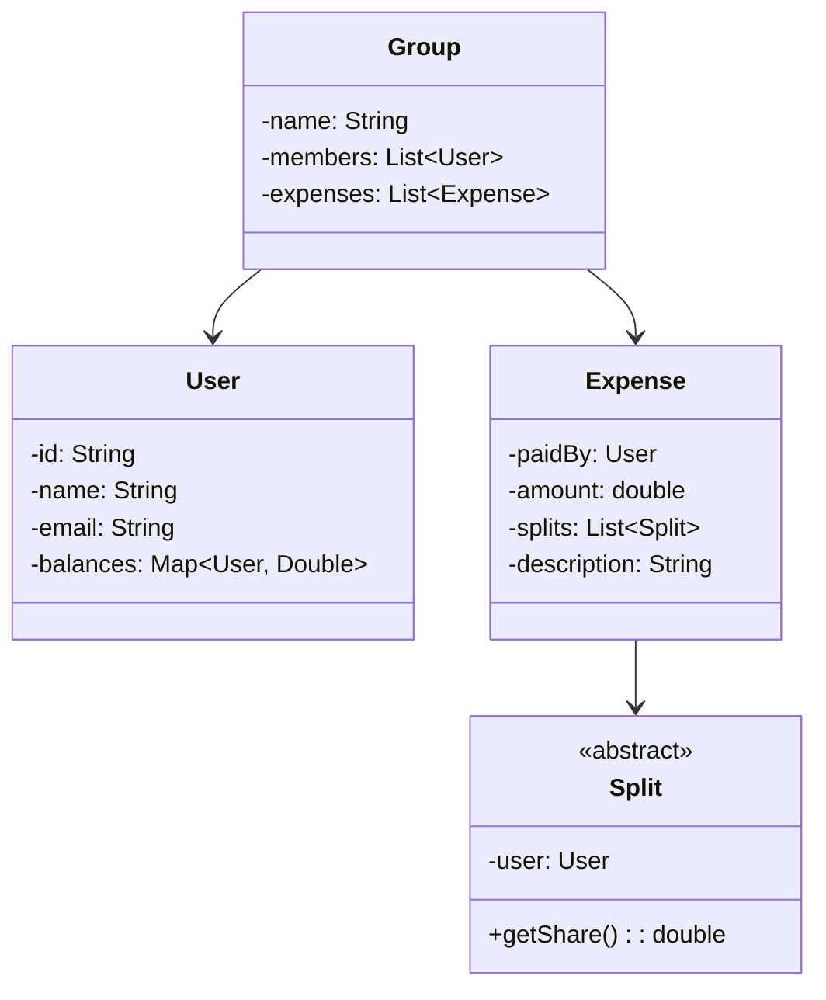

[🏠 Home](../../README.md) | [⬅️ Chess Game](./05-chess-game.md) | [➡️ Library Management](./07-library-management.md)

# 💰 Expense Splitter (Splitwise) Design

> Design a bill splitting application

---

## 📋 Requirements

1. Add users and create groups
2. Add expenses (equal, exact, percentage split)
3. Track balances between users
4. Simplify debts (minimize transactions)

---

## 🎯 Class Diagram



---

## 💻 Implementation

### Split Types

```java
public abstract class Split {
    protected User user;
    protected double amount;

    public Split(User user) {
        this.user = user;
    }

    public User getUser() { return user; }
    public abstract double getAmount();
}

public class EqualSplit extends Split {
    public EqualSplit(User user) {
        super(user);
    }

    @Override
    public double getAmount() {
        return amount;
    }

    public void setAmount(double amount) {
        this.amount = amount;
    }
}

public class ExactSplit extends Split {
    public ExactSplit(User user, double amount) {
        super(user);
        this.amount = amount;
    }

    @Override
    public double getAmount() {
        return amount;
    }
}

public class PercentSplit extends Split {
    private double percent;
    private double totalAmount;

    public PercentSplit(User user, double percent) {
        super(user);
        this.percent = percent;
    }

    public void setTotalAmount(double total) {
        this.totalAmount = total;
        this.amount = total * percent / 100;
    }

    @Override
    public double getAmount() {
        return amount;
    }
}
```

### Expense and User

```java
public class User {
    private final String id;
    private final String name;
    private final String email;
    private final Map<String, Double> balances; // userId -> amount owed

    public User(String name, String email) {
        this.id = UUID.randomUUID().toString().substring(0, 8);
        this.name = name;
        this.email = email;
        this.balances = new HashMap<>();
    }

    public void updateBalance(String userId, double amount) {
        balances.merge(userId, amount, Double::sum);
    }

    public Map<String, Double> getBalances() { return balances; }
    public String getId() { return id; }
    public String getName() { return name; }
}

public class Expense {
    private final String id;
    private final User paidBy;
    private final double amount;
    private final String description;
    private final List<Split> splits;
    private final LocalDateTime createdAt;

    public Expense(User paidBy, double amount, String description, List<Split> splits) {
        this.id = UUID.randomUUID().toString().substring(0, 8);
        this.paidBy = paidBy;
        this.amount = amount;
        this.description = description;
        this.splits = splits;
        this.createdAt = LocalDateTime.now();
    }

    public User getPaidBy() { return paidBy; }
    public double getAmount() { return amount; }
    public List<Split> getSplits() { return splits; }
}
```

### Expense Service

```java
public class ExpenseService {
    private static ExpenseService instance;
    private final Map<String, User> users = new HashMap<>();
    private final Map<String, Group> groups = new HashMap<>();

    private ExpenseService() {}

    public static synchronized ExpenseService getInstance() {
        if (instance == null) {
            instance = new ExpenseService();
        }
        return instance;
    }

    public void addUser(User user) {
        users.put(user.getId(), user);
    }

    public void addExpense(Expense expense) {
        User payer = expense.getPaidBy();
        
        for (Split split : expense.getSplits()) {
            User owes = split.getUser();
            double amount = split.getAmount();
            
            if (!owes.getId().equals(payer.getId())) {
                // owes owes money to payer
                payer.updateBalance(owes.getId(), amount);
                owes.updateBalance(payer.getId(), -amount);
            }
        }

        System.out.printf("Expense added: %s paid ₹%.2f%n", 
                          payer.getName(), expense.getAmount());
    }

    public void addEqualExpense(User payer, double amount, String desc, List<User> participants) {
        double splitAmount = amount / participants.size();
        List<Split> splits = new ArrayList<>();
        
        for (User user : participants) {
            EqualSplit split = new EqualSplit(user);
            split.setAmount(splitAmount);
            splits.add(split);
        }

        addExpense(new Expense(payer, amount, desc, splits));
    }

    public void showBalances(User user) {
        System.out.println("\n=== Balances for " + user.getName() + " ===");
        
        for (Map.Entry<String, Double> entry : user.getBalances().entrySet()) {
            User other = users.get(entry.getKey());
            double amount = entry.getValue();
            
            if (amount > 0) {
                System.out.printf("%s owes you ₹%.2f%n", other.getName(), amount);
            } else if (amount < 0) {
                System.out.printf("You owe %s ₹%.2f%n", other.getName(), -amount);
            }
        }
    }

    public void showAllBalances() {
        System.out.println("\n=== All Balances ===");
        Set<String> printed = new HashSet<>();
        
        for (User user : users.values()) {
            for (Map.Entry<String, Double> entry : user.getBalances().entrySet()) {
                String pairKey = user.getId().compareTo(entry.getKey()) < 0 
                    ? user.getId() + "-" + entry.getKey()
                    : entry.getKey() + "-" + user.getId();
                
                if (!printed.contains(pairKey) && entry.getValue() != 0) {
                    printed.add(pairKey);
                    User other = users.get(entry.getKey());
                    
                    if (entry.getValue() > 0) {
                        System.out.printf("%s owes %s: ₹%.2f%n", 
                            other.getName(), user.getName(), entry.getValue());
                    } else {
                        System.out.printf("%s owes %s: ₹%.2f%n", 
                            user.getName(), other.getName(), -entry.getValue());
                    }
                }
            }
        }
    }
}
```

---

## 🧪 Usage

```java
public class Main {
    public static void main(String[] args) {
        ExpenseService service = ExpenseService.getInstance();

        User rahul = new User("Rahul", "rahul@email.com");
        User priya = new User("Priya", "priya@email.com");
        User amit = new User("Amit", "amit@email.com");

        service.addUser(rahul);
        service.addUser(priya);
        service.addUser(amit);

        // Rahul pays 300 for dinner, split equally among 3
        service.addEqualExpense(rahul, 300, "Dinner", List.of(rahul, priya, amit));
        // Each owes 100, Rahul paid so Priya owes 100, Amit owes 100

        // Priya pays 150 for cab, split equally among 3
        service.addEqualExpense(priya, 150, "Cab", List.of(rahul, priya, amit));
        // Each owes 50

        service.showAllBalances();
        // Priya owes Rahul: ₹50 (100 - 50)
        // Amit owes Rahul: ₹100
        // Amit owes Priya: ₹50
    }
}
```

---

*Next: [Library Management →](./07-library-management.md)*
